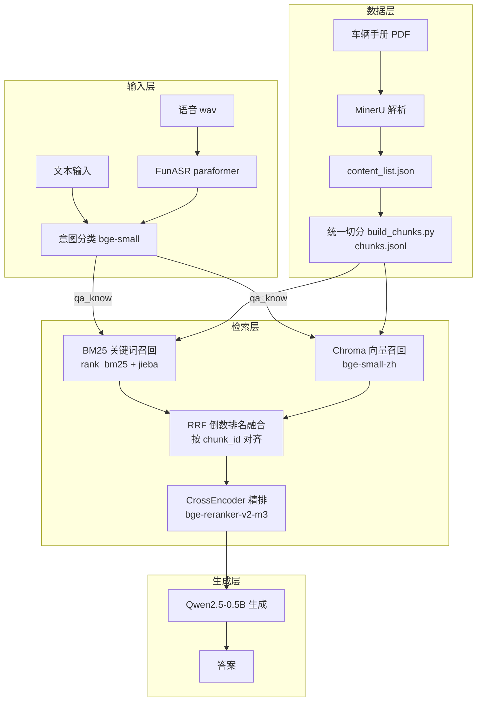

# 车载座舱轻量化 RAG 问答系统

基于**多路召回（BM25 + 向量检索）→ RRF 融合 → CrossEncoder 精排 → 轻量 LLM 生成**的端侧离线智能问答服务，面向车载座舱场景：语音 / 文本提问，回答车辆使用手册、故障码速查手册中的问题。

> 目标硬件：车机 / 边缘盒子，离线推理，无云端依赖。

---

## ✨ 核心特性

| 能力 | 说明 |
|---|---|
| 🎙️ 语音输入 | FunASR paraformer-large 中文识别（16kHz，int8 可选），支持故障码热词 |
| 🧠 意图分流 | 4 分类（座舱控制 / 知识问答 / 导航 / 闲聊），控制类指令不经过检索直接响应 |
| 🔍 多路召回 | BM25 关键词召回 + Chroma 向量召回，双路索引**同源**（同一份 chunk 数据） |
| 🎯 RRF 融合 | 按 `chunk_id` 对齐的倒数排名融合，双路命中内容自动排前 |
| ⚖️ 精排 | bge-reranker-v2-m3 CrossEncoder 对粗筛结果重排 |
| 📱 轻量推理 | Qwen2.5-0.5B-Instruct（fp16 / 4bit / Flash Attention 可选），24G 显存即可 |
| 🚗 品牌感知 | 按文件名自动识别品牌，故障码查询自动走全局故障码库 |
| 🖥️ 双入口 | FastAPI 推理服务（量产/车机）+ Gradio 调试面板（开发） |

---

## 🏗️ 系统架构



---

## 🧰 技术栈

| 分类 | 组件 |
|---|---|
| Web 服务 | FastAPI + Uvicorn（端口 7890）、Gradio（端口 7860） |
| 文档解析 | MinerU（解析 PDF → content_list.json）、pdfplumber（备用） |
| 分块 | 自定义语义切分（600 字 / 120 重叠，表格按行拆分） |
| 稀疏检索 | rank_bm25 + jieba 分词 |
| 稠密检索 | Chroma + bge-small-zh-v1.5（cosine） |
| 融合重排 | RRF + bge-reranker-v2-m3 |
| 意图分类 | bge-small-zh-v1.5 微调（4 分类） |
| LLM | Qwen2.5-0.5B-Instruct（fp16 / LoRA 可选） |
| ASR | FunASR paraformer-large + 故障码热词 |
| 模型管理 | ModelScope + 本地缓存（`format_modelname.py` 统一管理） |

---

## 📁 目录结构

```
Car_RAG/
├── car_api.py                  # FastAPI 推理服务入口（7890）
├── main.py                     # Gradio 调试面板入口（7860）
├── config.py                   # 全局配置（路径/模型/检索超参数）
├── format_modelname.py         # 模型本地路径校验与自动下载
├── start_service.sh / stop_service.sh   # 服务启停脚本
├── health_monitor.py           # 健康巡检脚本
├── check_qa.py                 # QA 训练数据格式校验
├── data/
│   ├── raw/                    # 原始 PDF 存放处
│   ├── raw_output/             # MinerU 解析结果（*_content_list.json）
│   └── chunks/chunks.jsonl     # 统一切分数据（两路索引同源）
├── data_process/
│   ├── parse_pdf.py            # pdfplumber 解析（备用）
│   ├── build_chunks.py         # 统一切分 → chunks.jsonl
│   └── build_chunk_chroma.py   # chunks.jsonl → Chroma 入库
├── retriever/
│   ├── bm25_retriever.py       # BM25 索引构建 + 检索（含品牌/故障码分类）
│   ├── dense_retriever.py      # Chroma 向量检索
│   └── rerank.py               # RRF 融合 + CrossEncoder 重排 + 主入口
├── llm_infer/
│   ├── rag_llm.py              # LLM 加载与 RAG 生成
│   └── train_lora.py           # LoRA 领域微调（可选）
├── speech_asr/whisper_asr.py   # FunASR 语音识别
├── intent_cls/
│   ├── infer_intent.py         # 意图分类推理
│   └── train_intent.py         # 意图分类微调（可选）
├── gradio_web/app.py           # Gradio 调试面板
├── eval/                       # RAG 效果评估脚本
└── chroma_car_db/              # Chroma 向量库持久化目录
```

---

## 🚀 快速开始（新环境部署）

> 以下步骤为**新环境从零加载项目后的标准执行顺序**，建议严格按序执行。

### 第 0 步：环境准备

```bash
# 推荐 Python 3.10~3.12，conda 创建环境
conda create -n rag python=3.10 -y
conda activate rag

# 安装核心依赖（版本组合已实测）
pip install "numpy<2" "torch==2.3.1" "transformers==4.44.2" \
    "sentence-transformers==3.0.1" "peft==0.12.0"
pip install chromadb rank-bm25 jieba fastapi "uvicorn[standard]" soundfile gradio modelscope funasr
```

> GPU 机器请按 CUDA 版本安装对应 torch（`--index-url https://download.pytorch.org/whl/cu121` 等）。

### 第 1 步：准备数据（开发机完成）

```bash
# 1) 把车辆手册 PDF 放入 data/raw/
# 2) 用 MinerU 解析 PDF（输出到 data/raw_output/<手册名>/hybrid_auto/*_content_list.json）
#    MinerU 使用方式见其官方文档：mineru -p xxx.pdf -o data/raw_output/
```

### 第 2 步：构建统一分块数据

```bash
python data_process/build_chunks.py
# 产出：data/chunks/chunks.jsonl（含 chunk_id/text/brand/source_file/pages/block_types）
```

### 第 3 步：构建 Chroma 向量库

```bash
python data_process/build_chunk_chroma.py
# 产出：chroma_car_db/（首次运行自动下载 embedding 模型）
```

### 第 4 步：验证检索链路（可选但推荐）

```bash
python retriever/bm25_retriever.py   # BM25 检索测试
python retriever/dense_retriever.py  # 向量检索测试
```

### 第 5 步：可选训练

```bash
# 意图分类微调（train.csv 已内置示例）
python intent_cls/train_intent.py

# LoRA 领域微调（需准备 data/qa_train/train.jsonl，可先用 check_qa.py 校验格式）
python llm_infer/train_lora.py
```

### 第 6 步：启动服务

```bash
# 方式 A：FastAPI 推理服务（车机/量产，端口 7890）
python car_api.py            # 或 ./start_service.sh（后台运行）

# 方式 B：Gradio 调试面板（开发，端口 7860）
python main.py
```

### 第 7 步：验证

```bash
curl http://127.0.0.1:7890/health
# 期望：{"status":"running","desc":"车载RAG推理服务正常运行"}

curl -X POST -G "http://127.0.0.1:7890/chat_text" \
  --data-urlencode "query=故障码U0001是什么"
```

浏览器打开 `http://127.0.0.1:7890/docs` 可在线调试全部接口。

---

## 📡 API 接口

| 接口 | 方法 | 说明 | 参数 |
|---|---|---|---|
| `/health` | GET | 服务健康检查 | 无 |
| `/chat_text` | POST | 文本问答（纯文本/语音转文字后调用） | `query`（URL 参数） |
| `/chat_audio` | POST | 上传 wav 音频，自动 ASR 后问答 | `audio_file`（form-data，**必须真 wav**） |

返回结构：

```json
{
  "code": 200,
  "msg": "success",
  "data": {
    "user_text": "故障码U0001是什么",
    "intent": "qa_know",
    "intent_desc": "车辆知识库问答，已检索手册资料生成回答",
    "reference_context": "【参考1 来源：汽车故障码速查手册第3版_content_list.json】\n...",
    "answer": "控制器区域网络(CAN)高速总线故障"
  }
}
```

---

## ❓ 常见问题

**1. 上传音频报 `Format not recognised`？**
改后缀不算真 wav。用 ffmpeg 转码：`ffmpeg -i 录音.m4a -ar 16000 -ac 1 录音.wav`。

**2. 语音里的故障码识别成"零零零一"？**
系统已内置故障码热词 + 中文数字归一化（零幺两壹贰叁…、空格数字、英文数字均可还原为标准码）。

**3. 服务启动报 `register_fake` / torch 相关错误？**
torch 安装不完整或新旧混装。彻底清理 `site-packages/torch*` 后重装（见内部文档）。

**4. 显存不足（OOM）？**
系统已内置：检索参考截断（400 字符/条、最多 4 条）、LLM context 截断（1500 字符）、fp16 加载、Flash Attention 自动降级。仍不足时调小 `config.py` 中 `TOP_K_*` 参数。

**5. 新增品牌手册后要做什么？**
放入 PDF → MinerU 解析 → 重新执行第 2、3 步（chunks.jsonl 与 Chroma 需同步重建）。

---

## 📄 其他文档

- **内部详细文档**（架构细节、踩坑记录、参数表、扩展指南）：见 `README_internal.md`
