www.carobook.com

为安全和舒适起见，请仔细阅读并随车保留备用。

## COROLLA CROSS

生产企业：一汽丰田汽车有限公司

客服电话：400-810-1210(手机拨打)800-810-1210(座机拨打)

<table><tr><td>安全须知</td><td>确保通读本部分内容(主题:儿童座椅、防盗系统)</td><td>1</td></tr><tr><td>车辆状态信息和指示灯</td><td>读取驾驶相关信息(主题:仪表、多信息显示屏)</td><td>2</td></tr><tr><td>驾驶前</td><td>打开和关闭车门与车窗、驾驶前的调节(主题:钥匙、车门、座椅、电动车窗)</td><td>3</td></tr><tr><td>驾驶</td><td>驾驶时的必要操作和建议(主题:起动发动机、加注燃油)</td><td>4</td></tr><tr><td>车内装备</td><td>使用车内装备(主题:空调、储物装置)</td><td>5</td></tr><tr><td>保养和维护</td><td>车辆维护和保养程序(主题:内饰和外饰、灯泡)</td><td>6</td></tr><tr><td>出现故障时</td><td>出现故障时或紧急情况下的应对措施(主题:蓄电池电量耗尽、轮胎泄气)</td><td>7</td></tr><tr><td>车辆规格</td><td>车辆规格和可定制功能(主题:燃油、机油、轮胎气压)</td><td>8</td></tr></table>

<table><tr><td rowspan="2">索引</td><td>按照症状检索</td><td></td></tr><tr><td>按照字母检索</td><td></td></tr></table>

3-2. 打开、关闭和锁止车门
侧门....88
背门....92
智能进入和起动系统...103
3-3. 调节座椅
前排座椅....108
后排座椅....109
头枕....111
3-4. 调节方向盘和后视镜
方向盘....114
内后视镜....115
外后视镜....116
3-5. 打开和关闭车窗
电动车窗....118
天窗....120
全景天窗....123
3-6. 常用设定
我的设置....127
4 驾驶
4-1. 驾驶前
驾驶车辆....132
货物和行李....137
拖拽挂车....139
4-2. 驾驶规范
发动机（点火）开关（不带智能进入和起动系统的车辆）....140
发动机（点火）开关（带智能进入和起动系统的车辆）....141
无级变速器....145
转向信号灯控制杆....148
驻车制动....148

参考信息....5  
阅读本手册....10  
如何检索....11  
图片索引....12  
1 安全须知  
1-1. 安全使用须知  
驾驶前....22  
安全驾驶....23  
座椅安全带....24  
SRS空气囊....28  
废气注意事项....34  
1-2. 儿童安全  
儿童乘坐信息....36  
儿童保护装置....36  
1-3. 紧急救援  
丰田智行互联....51  
1-4. 防盗系统  
发动机停机系统....65  
警报....66  
2 车辆状态信息和指示灯  
2-1. 仪表组  
警告灯和指示灯....70  
仪表....73  
多信息显示屏....76  
燃油消耗信息....80  
3 驾驶前  
3-1. 钥匙信息  
钥匙....84制动保持 ..... 151
4-3. 打开和关闭车窗
前照灯开关 ..... 154
AHB（自动远光） ..... 156
雾灯开关 ..... 158
风挡玻璃刮水器和喷洗器 ..... 159
后风挡玻璃刮水器和喷洗器 ..... 161
4-4. 加注燃油
打开燃油箱盖 ..... 162
4-5. 使用驾驶辅助系统
Toyota Safety Sense 智行安全（丰田规避碰撞辅助套装）软件更新 ..... 164
Toyota Safety Sense 智行安全（丰田规避碰撞辅助套装） ..... 166
PCS（碰撞预测系统） ..... 171
LTA（车道保持辅助） ..... 180
LDA（车道偏离警示） ..... 185
PDA（主动驾驶辅助） ..... 190
动态雷达巡航控制 ..... 195
巡航控制 ..... 204
RSA（路标辅助） ..... 207
紧急停车系统 ..... 209
停机和起动系统 ..... 211
丰田驻车辅助传感器 ..... 216
行驶模式选择开关 ..... 221
GPF（汽油微粒过滤器）系统 ..... 222
驾驶辅助系统 ..... 224
4-6. 驾驶要领
冬季驾驶要领 ..... 228
多功能车辆注意事项 ..... 230

## 5 车内装备

5-1. 使用空调系统和除雾器
手动空调系统（A型）.. 234
手动空调系统（B型）.. 238
自动空调系统 ..... 243
5-2. 使用车内灯
车内灯列表 ..... 250
5-3. 使用储物装置
储物装置列表 ..... 252
行李厢装置 ..... 255
5-4. 其他车内装备
其他车内装备 ..... 257
6 保养和维护
6-1. 保养和维护
清洁和保护车辆外饰 .. 262
清洁和保护车辆内饰 .. 264
6-2. 保养
保养须知 ..... 267
定期保养 ..... 269
6-3. 自行保养
自行保养注意事项 ..... 274
发动机盖 ..... 276
定位卧式千斤顶 ..... 277
发动机舱 ..... 278
轮胎 ..... 284
轮胎气压 ..... 294
车轮 ..... 295
空调滤清器 ..... 297
无线遥控/电子钥匙电池 ..... 298
检查和更换保险丝 ..... 301

灯泡....303
7 出现故障时
8-3. 初始化
初始化项目....367
索引
7-1. 重要信息
危险告警灯....310
如果紧急情况下必须停车....310
如果车辆浸入水中或路面上的水位上升....311
7-2. 紧急情况下应采取的措施
如果车辆需要拖拽....313
如果认为车辆异常....316
燃油泵关闭系统....316
如果警告灯点亮或警告蜂鸣器鸣响....317
如果显示警告信息....324
如果轮胎泄气....327
如果发动机不能起动....334
如果钥匙丢失....335
如果电子钥匙不能正常工作....336
如果车辆蓄电池电量耗尽....338
如果车辆过热....342
如果发生陷车....344
8 车辆规格
8-1. 规格
保养数据（燃油、机油油位等）....346
燃油信息....358
8-2. 定制
可定制功能....359

## 参考信息

## 用户手册须知

请注意，本手册适用于所有车型，并对包括选装件在内的所有设备进行了说明。因此，手册中所描述的某些设备可能并未在您车辆上安装。

本手册提供的所有规格到手册付印时为止均为最新资料。但是，由于丰田会对产品进行不断地改进，因此本手册所含内容会随时更新，届时恕不另行通知。

由于规格不同，图中所示车辆在装备方面可能与您的车辆有所差异。 www.car

## 关闭发动机后从车辆底部 发出噪音

关闭发动机后约5 小时，可能会听到从车辆底部发出的声音，并持续数分钟。这是燃油蒸汽泄漏检查的声音，并不表示存在故障。

## 丰田车的附件、备件和改装

现在我们不仅可以买到丰田纯正零部件，也可以买到其他各种适用于丰田车的备件和附件。假如需要更换原车丰田纯正零部件，丰田公司建议使用纯正丰田品牌加以更换，也可以使用其他符合质量要求的零部件。

对于非纯正丰田备件和附件以及使用非纯正丰田备件和附件进行更换和安装，丰田公司不提供任何保证并不承担任何责任和义务。此外，由于使用非纯正丰田品牌备件或附件而引起的车辆损坏和性能问题，均不在保修范围之内。

不可使用非纯正丰田品牌产品改装车辆，否则将会影响车辆的操作性，安全性和耐久性，同时有可能会触犯当地政府条例。此外，因改装引起的车辆损坏和性能问题，均不在保修范围之内。

而且，这些改装将对先进的安全设备（如 Toyota SafetySense智行安全 [ 丰田规避碰撞辅助套装]）产生影响，其可能无法正常工作或在不应工作的情况下工作。

## 网络攻击风险

安装电子设备和收音机会增加经由安装部件遭受网络攻击的风险，这可能导致意外事故和个人信息泄露。对于因安装非纯正丰田产品引起的问题，丰田公司不提供任何担保。

## 安装射频发射器系统

在车辆上安装射频发射器系统可能会影响电子系统，例如:

多点式燃油喷射系统/顺序多点式燃油喷射系统

 Toyota Safety Sense智行安全（丰田规避碰撞辅助套装）

防抱死制动系统

SRS空气囊系统

座椅安全带预张紧器系统请务必向丰田汽车经销商咨询，了解有关安装射频发射器系统的防范措施或特别指示。

有关射频波段、功率电平、天线位置和射频发射器安装规定的详情，请咨询您的丰田汽车经销商。

## 车辆数据记录

本车配备精密计算机，将记录www.car与车辆控制和操作相关的特定数据。

## 计算机记录的数据

根据各功能的工作时间和状态记录特定数据，例如下列数据。

• 发动机转速/电机转速（牵引电机转速）

• 加速器状态

• 制动器状态

• 车速

• 驾驶辅助系统工作状态

• 摄像机图像

本车配备摄像机。有关记录摄像机的位置，请联系您的丰田汽车经销商。

记录的数据根据车辆级别和车辆所配备选装件的不同而不

同。

这些计算机不会记录会话或声音，并且仅在特定情况下记录车外图像。

##  数据用途

丰田公司可使用这些计算机记录的数据来诊断故障、进行科研开发，进而提高产品质量。

除下列情况外，丰田公司不会将所记录的数据披露给第三方:

• 经车主或车辆承租人（如果将车辆出租）的同意

• 应公安局、法院或政府部门的官方要求

• 丰田公司在法律诉讼中使用

• 将与具体车辆或车主无关的数据用于科研

丰田汽车经销商可删除车辆记录的book.com图像信息。

可禁用图像记录功能。但是，如果禁用此功能，将无法获得系统工作数据。

如果您希望丰田服务器停止收集Toyota Safety Sense 智行安全（丰田规避碰撞辅助套装）数据（用于科研开发和提供个人服务），请联系您的丰田汽车经销商。

## 通过丰田智行互联收集的数据的用途

如果您的丰田车具有丰田智行互联功能且订购了此服务，请参见丰田智行互联使用合约，了解有关数据收集及其用途的信息。

## 行驶记录仪

本车配备有行驶记录仪(EDR)。EDR 的主要用途是记录某种碰撞或近似碰撞（如空气囊展开或撞到路边障碍物）时的数据，从而有助于了解车辆系统的运行情况。EDR用于记录短时间内（一般为30秒或更短）与车辆动态系统和安全系统相关的数据。然而，根据碰撞的严重程度和类型，也可能不会记录数据。

本车的EDR记录下列数据:• 车内各系统的运行情况；

• 驾驶员踩下加速踏板和/或制动踏板的程度（是否完全踩下）；和 www.car

• 车辆的行驶速度。

这些数据有助于更好地了解碰撞及造成伤害时的情况。

请注意:车辆仅在发生重大碰撞事故时记录EDR数据；正常驾驶条件下，EDR不会记录数据和个人数据（如姓名、性别、年龄及碰撞位置）。但是在碰撞事故调查期间，第三方（如执法部门）会将EDR数据与日常获得的个人识别类型数据结合起来。

要读取EDR记录的数据，需要专用设备并获得车辆或EDR的使用权。除车辆制造厂外，拥有专业设备的第三方（如执法部门）在授权使用车辆或EDR时可读取信息。

## 披露 EDR 数据

除下列情况外，丰田公司不会将EDR记录的数据披露给第三方:

• 经车主（或车辆承租人）同意

• 应公安局、法院或政府部门的官方要求

• 丰田公司在法律诉讼中使用但是，如有必要，丰田公司可能会 :

• 使用数据进行车辆安全性能研发

• 向第三方披露数据（不披露有关具体车辆或车主的信息）进行科研

购买EDR数据信息读取工具

可使用 “Bosch CDR DLC Basekit” (Bosch Crash Data Retrieval

要购买 “Bosch CDR DLC Basekit”，请从下面的分销商主页查看零售商和联系方式等所需信息。此外，浏览主页前需进行注册。分销商主页

• 一汽丰田汽车销售有限公司 :http://www.ftms.com.cn/

从EDR控制器中提取数据的方法

使用符合 GB39732-2020 要求的EDR数据提取工具连接车辆诊断连接器或

气囊ECU连接器以提取 EDR数据。

A级数据元素中车辆速度的数据源的说明

将各轮胎的车速传感器的平均值

作为车辆速度的数据源。

非锁定事件存储覆盖机制和可覆盖的事件类型等内容的说明

依据 GB39732-2020 4.3.4.1 的规定，

非锁定事件可按照时间顺序依次被后续事件覆盖。

除此之外无其他覆盖机制。

智能控制功能实现方式及相关数据元素等内容的声明

GB39732-2020 表 3 中列出的智能控制功能 (定速巡航系统、自适应巡航系统、

防抱死制动系统、自动紧急制动系统、电子稳定性控制系统和牵引力控制系统)

状态相关数据元素，按照GB39732-2020 的要求进行记www.caro录，

这些功能未集成在其他系统中，也未记录在其他系统中。

## 驾驶车辆时

取得驾驶证后方可在道路上驾驶车辆。

遵守各地区法规及指定的交通法规，时刻谨记安全驾驶。

## 报废丰田车

丰田车中的SRS空气囊和座椅安全带预张紧器装置含有爆炸性化学物质。如果在空气囊和座椅安全带预张紧器未处理的情况下报废车辆，则可能导致起火等意外事故。报废车辆前，请务必联系有资质的维修店或丰田汽车经销商对SRS空气囊系统和座椅安全带预张紧器系统进行拆除和报废处理。

## 环境保护

使用过的零件和废机油

正确处理使用过的零件和废机油。

处理不当会导致环境污染。此外，报废车辆时，请咨询购买车辆时的经销店。

关爱环境的经济性驾驶

避免不必要的怠速和过度踩下加速踏板，遵守法定限速并时刻谨记安全驾驶。ook.com

## 整车型号

本手册包含下列车型的说明:TV7207X6P

## 读取车辆识别代号信息

将用于检查和维修的故障诊断设备安装到连接器上，即可读取车辆识别代号信息。

请勿将诊断设备以外的电气部件安装到连接器上。否则可能发生意外情况，如对电子设备造成不良影响或损坏蓄电池。

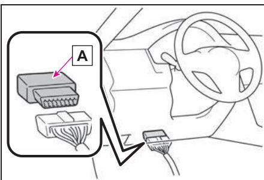

## 诊断设备连接器

## ■ 读取车辆识别代号信息

1 关闭发动机开关。

2 将诊断设备连接到连接器上。

3 将发动机开关切换至ON。

4 打开诊断设备的电源。

5 根据诊断设备的“MENU”项读取车辆识别代号。www.carob有关操作诊断设备“MENU”，请查看其随附的用户手册。

## ■ 购买车辆识别代号信息读取工具

可使用 “GTS Basic” (GlobalTech Stream Basic) 读取车辆识别代号信息。

要购买 “GTS Basic”，请从下面的分销商主页查看零售商和联系方式等所需信息。

此外，浏览主页前需进行注册。

分销商主页

• 一汽丰田汽车销售有限公司:http://www.ftms.com.cn/

# “QR Code”

## “QR Code” 是 DENSO WAVEINCORPORATED 在日本和其他国家/地区的注册商标。

## 警告

## ■驾驶时一般注意事项

清 驾驶 :切勿在饮 或 药驾驶车辆，因为酒精和药物会影响您操控车辆的能力。酒精和某些药物会延迟反应时间，影响判断和协调能力，从而可能引发事故，导致严重伤害甚至死亡。

谨慎驾驶 :务必谨慎驾驶。随时注意其他车辆以及行人的动向以便及时作出判断，防止发生意外事故。

专注驾驶 :驾驶时务必全神贯注。任何分散驾驶员注意力的事情，如调节控制按钮、打电话或阅读都可能引发碰撞事故并导致严重伤害甚至死亡。

■有关儿童安全的一般注意事项切勿将儿童单独留在车内，切勿让儿童携带或使用钥匙。

儿童可能会起动车辆或将车辆换至空档 儿童在玩耍点烟器 车窗、天窗（若装备）、全景天窗（若装备）或其他车辆装备时，还可能会伤到自己。此外，车内温度过高或过低，也可能会对儿童造成致命伤害。

## 阅读本手册

对本手册中所用的标记进行说明。

## 本手册中所用的标记

<table><tr><td>标记</td><td>含义</td></tr><tr><td></td><td>指示用于操作开关和其他设备的动作(按下、转动等)。</td></tr><tr><td></td><td>指示操作的结果(例如,盖打开)。</td></tr></table>

<table><tr><td>标记</td><td>含义</td></tr><tr><td></td><td>警告:介绍警告事项,若不遵守,则可能导致人员受到严重伤害甚至死亡。</td></tr><tr><td></td><td>注意:介绍注意事项,若不遵守,则可能导致车辆或设备损坏或出现故障。</td></tr><tr><td>123...</td><td>指示操作或作业步骤。按照数字顺序进行操作。</td></tr></table>

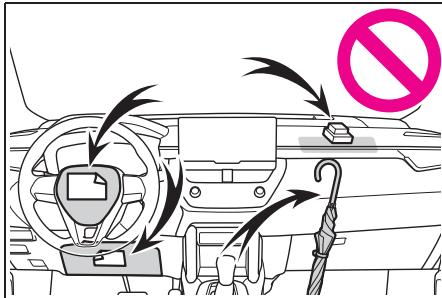

<table><tr><td>标记</td><td>含义</td></tr><tr><td></td><td>指示正在介绍的部件或位置。</td></tr><tr><td></td><td>表示严禁、严禁这样做或严禁此种情况发生。</td></tr></table>

## 插图中所用的标记

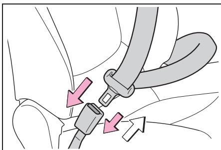

## 如何检索

■ 按照名称检索

● 字母索引：→P.373

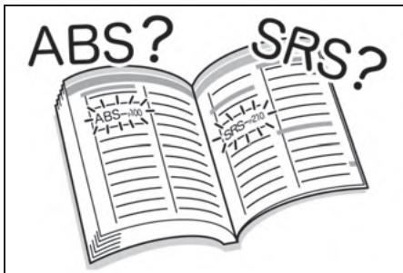

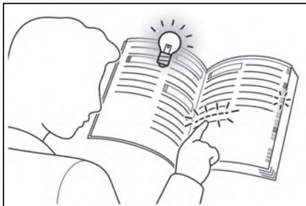

■ 按照安装位置检索

● 图片索引:→P.12

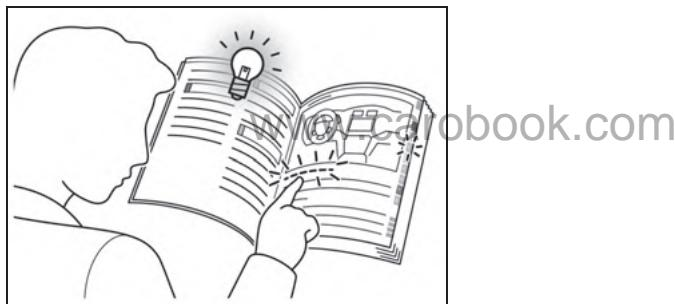

■ 按照故障症状或声音检索

发生紧急情况时……（故 障排除）:P.370

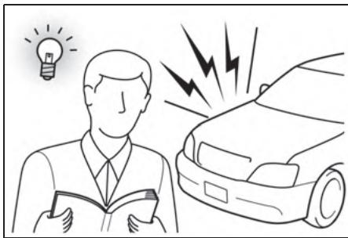

■ 按照标题检索

● 目录：→P.2

## 图片索引

## 车外

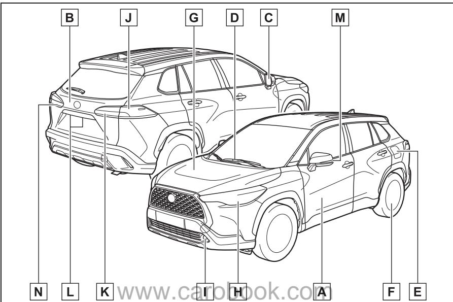

A 侧门 P.88
锁止 / 解锁 P.88
打开 / 关闭侧车窗 P.118
使用机械钥匙锁止 / 解锁 \* P.336
警告信息 P.91
B 背门 P.92
从车内打开 \* P.95
从车外打开 P.94
警告信息 P.317,324
C 外后视镜 P.116
调节后视镜角度 P.116
折叠后视镜 P.116
后视镜除雾 \* P.239,244
D 风挡玻璃刮水器 P.159
冬季注意事项 P.228

E 燃油加注口盖 P.162
加油方法 P.163
燃料种类 / 燃油箱容量 P.351
F 轮胎 P.284
轮胎规格 / 轮胎气压 P.356
冬季轮胎 / 轮胎防滑链 P.228
检查 / 换位 / 轮胎压力警告系统 P.284
轮胎泄气应对措施 P.327
G 发动机盖 P.276
打开 P.276
发动机机油 P.352
过热应对措施 P.342
行驶用车外灯灯泡
更换方法 :P.303, 瓦数 :P.357)
H 前照灯 / 前位灯 / 日间行车灯 / 转向信号灯 P.154
I 前雾灯\* P.158
J 刹车灯 / 后转向信号灯 / 尾灯 P.148,154
K 尾灯\* P.154
倒车灯
将档位换至 R 档 P.145
L 牌照灯 P.154
M 侧转向信号灯 P.148
N 尾灯\*/后雾灯 P.154,158
倒车灯
将档位换至 R 档 P.145
若装备

## 仪表板

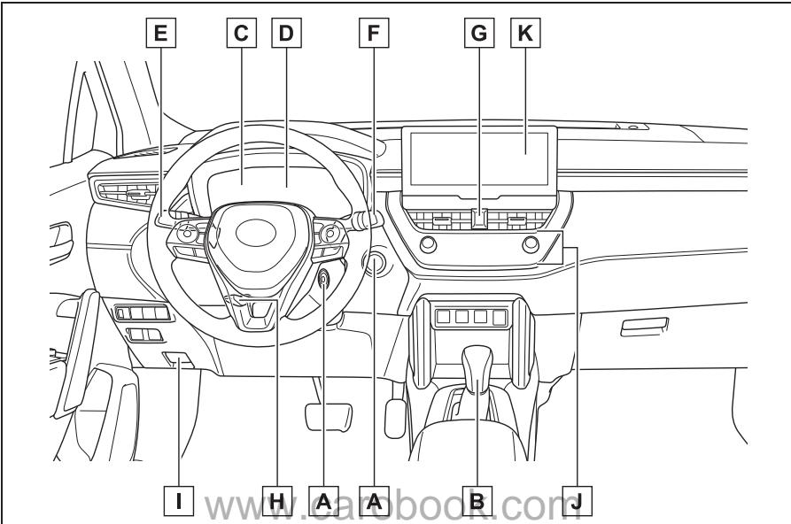

A 发动机开关 P.140,141  
起动发动机/切换位置\*1 P.140  
起动发动机/切换模式\*2 P.141  
紧急停止发动机 P.310  
发动机不能起动时 P.334  
警告信息 P.324  
B 换档杆 P.145  
切换档位 P.145  
拖拽时的注意事项 P.313  
换档杆无法移动时 P.146  
C 仪表 P.73  
仪表的含义/调节仪表照明灯 P.73  
警告灯/指示灯 P.70  
警告灯点亮时 P.317  
D 多信息显示屏 P.76

显示屏 P.76  
显示警告信息时 P.76  
E 转向信号灯控制杆 P.148  
前照灯开关 P.154  
前照灯/驻车灯/尾灯/牌照灯/日间行车灯 P.154  
雾灯 P.158  
F 风挡玻璃刮水器和喷洗器开关 P.159,161  
使用方法 P.159,161  
添加喷洗液 P.284  
G 危险告警灯开关 P.310  
H 倾斜伸缩式方向盘锁定释放杆 P.114  
I 发动机盖锁定释放杆 P.276  
J 空调系统 P.234, 238,243  
使用方法 P.234, 238,243  
后车窗除雾器 P.235, 239,244

## 音响系统 \*3, 4

\*1:不带智能进入和起动系统的车辆

\*2:带智能进入和起动系统的车辆

\*3:带导航系统的车辆，请参见《导航系统用户手册》。

\*4:带多媒体系统的车辆，请参见《多媒体用户手册》。

\*2:带导航系统的车辆，请参见《导航系统用户手册》。

## ■ 开关

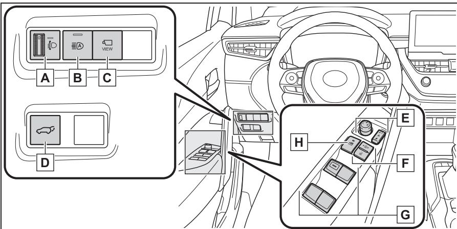

A 前照灯光束高度调节旋钮 P.155  
B 自动远光开关 P.156  
C 摄像机开关\*1,2  
D 电动背门开关\*1 P.92  
E 外后视镜开关 P.116  
F 门锁开关 P.91  
G 电动车窗开关 P.118  
H 车窗锁止开关 P.120

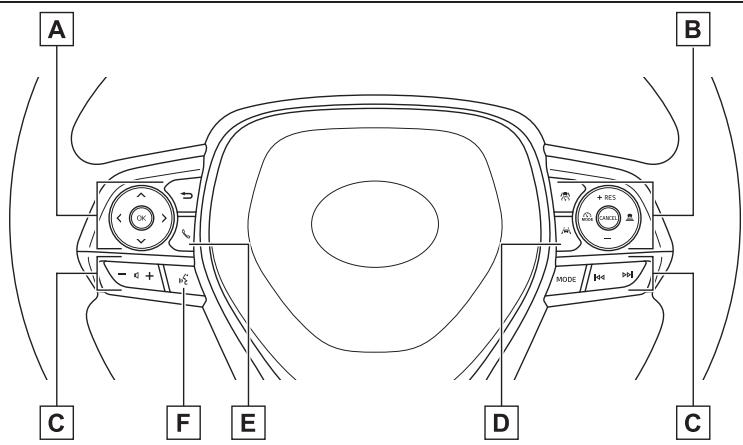

A 仪表控制开关 P.76  
B 巡航控制开关动态雷达巡航控制 P.198巡航控制 P.204  
C 音响遥控开关\*1,2  
D LTA（车道保持辅助）开关 P.180  
E 电话开关\*1,2  
F 通话开关\*1,2

\*1:带导航系统的车辆，请参见《导航系统用户手册》。\*2:带多媒体系统的车辆，请参见《多媒体用户手册》。

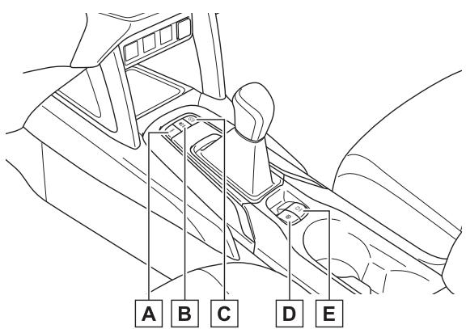

A 行驶模式选择开关 P.221  
B VSC OFF 开关 P.224  
C 停机和起动取消开关 P.211  
D 驻车制动开关 P.148  
冬季注意事项 P.229  
E 制动保持开关 P.151

## 车内

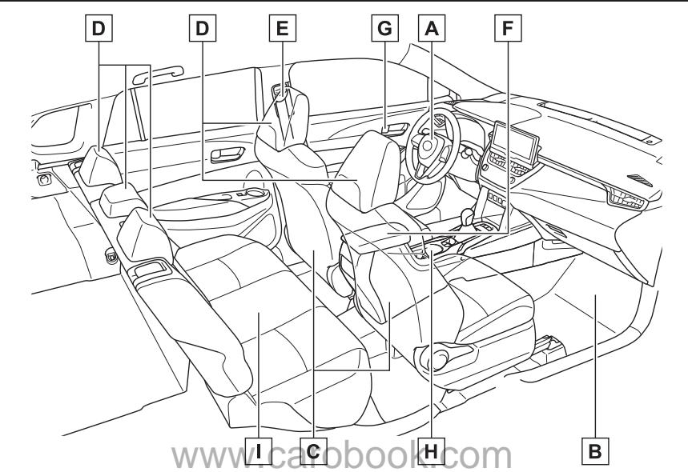

A SRS 空气囊 ..... P.28
B 脚垫 ..... P.22
C 前排座椅 ..... P.108
D 头枕 ..... P.111
E 座椅安全带 ..... P.24
F 控制台箱 ..... P.254
G 车内门锁按钮 ..... P.91
H 杯架 ..... P.253
I 后排座椅 ..... P.109

## 车顶

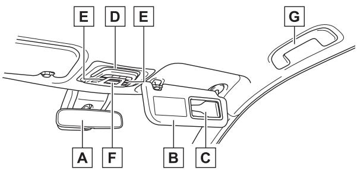

A 内后视镜 P.115  
B 遮阳板 P.258  
C 梳妆镜 P.258  
卡片夹 P.255  
D 车内灯/个人用灯 P.250  
E 天窗开关\* P.120  
全景天窗开关\* P.123  
F “SOS”按钮 P.51  
G 辅助拉手 P.259  
若装备

## 安全须知

1-1. 安全使用须知
驾驶前 ..... 22
安全驾驶 ..... 23
座椅安全带 ..... 24
SRS 空气囊 ..... 28
废气注意事项 ..... 34
1-2. 儿童安全
儿童乘坐信息 ..... 36
儿童保护装置 ..... 36
1-3. 紧急救援
丰田智行互联 ..... 51
1-4. 防盗系统
发动机停机系统 ..... 65
警报 ..... 66

## 驾驶前

为确保安全驾驶，驾驶车辆前请遵守下列注意事项。

## 脚垫

仅可使用专为本车型和年款车辆（与您的车辆相同）设计的脚垫。将其牢固固定在地毯上。

1 将固定钩（卡子）插入脚垫孔。

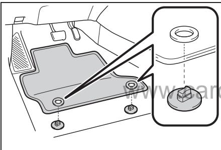

2 转动各固定钩（卡子）的上部旋钮以将脚垫固定到位。

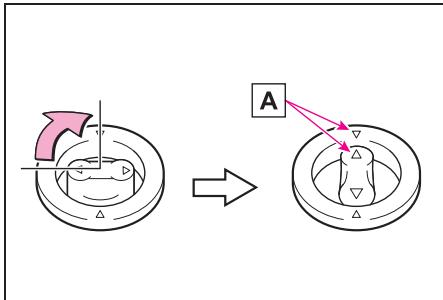

务必对准 （标记为 ）。

固定钩（卡子）的形状可能与图中所示不同。

## 警告

请遵守下列注意事项。

否则在驾驶过程中驾驶员脚垫可能会滑动，从而妨碍踏板操作。还可能会意外提高车速或难以停车。这可能引发事故，导致严重伤害甚至死亡。

## ■安装驾驶员脚垫时

●请勿使用为其他车型或不同车型年款的车辆设计的脚垫，即使是丰田纯正脚垫。

●仅可使用专为驾驶员座椅设计的脚垫。

●务必使用随附的固定钩（卡子）牢固安装脚垫。

●请勿重叠使用两个或多个脚垫。

## ■驾驶前

●检查并确认使用所有随附的固定钩（卡子）将脚垫牢固固定在正确的位置。清洁地板后需特别注意要进行此项检查。

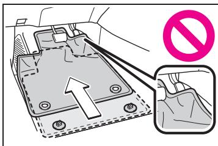

●发动机停止且换档杆置于P 档时，将各踏板完全踩到底以确保脚垫不会妨碍操作踏板。

## 安全驾驶

驾驶前，将座椅和后视镜调节至恰当位置以确保安全驾驶。

## 正确的驾驶姿势

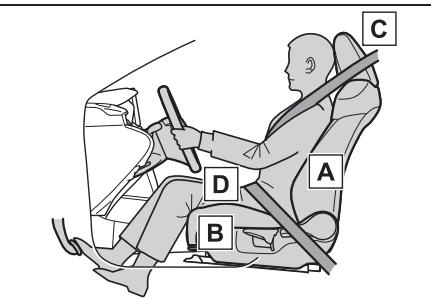

调节座椅靠背倾角，以便坐直且无需前倾身体即可操作方向盘。(P.108)www.carob

调节座椅，以便您可以完全踩下踏板且在握住方向盘时胳膊肘部能够稍微弯曲。(P.108)

锁定头枕，确保其中心与耳朵上部齐平。(P.111)

正确佩戴座椅安全带。 (P.24)

## ■标准座椅位置

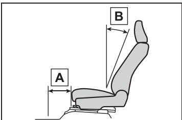

## 座椅位置

## 座椅靠背倾角

前排座椅

<table><tr><td>标准座椅位置*</td><td>260 mm(毫米)</td></tr><tr><td>标准座椅靠背倾角</td><td>19°</td></tr></table>

## 后排座椅

标准座椅靠背倾角

中央23°外侧25°

\*:自最靠前位置的距离

## 警告

## ■安全驾驶

请遵守下列注意事项。否则可能导致严重伤害甚至死ook.com

●驾驶时，请勿调节驾驶员座椅的位置。否则可能导致驾驶员失去对车辆的控制。

●请勿在驾驶员或乘员与座椅靠背之间放置靠垫。靠垫不利于保持正确的坐姿，并会降低座椅安全带和头枕的效用。

●请勿在前排座椅下放置任何物品。放置在前排座椅下方的物品可能会夹在座椅导轨间，妨碍座椅锁定到位。这可能导致事故，也可能损坏调节机构。

●在公共道路上行驶时，务必遵守法定限速。

## 警告

●长途驾驶时，请定时休息，避免疲劳驾驶。

另外，如果在驾驶过程中感到疲劳或困倦，请勿强迫自己继续驾驶，应立即休息。

●调节座椅位置时应小心，确保移动座椅时不会伤及其他乘员。

●调节座椅位置时，请勿将手放在座椅下方或移动零件附近以免受伤。座椅机构可能会夹住手指或手。

## 正确使用座椅安全带

驾驶车辆前，应确保所有乘员均已佩戴座椅安全带。

(P.24)

儿童应使用合适的儿童保护装www.car置，直至他们的体形长大到适合佩戴车辆座椅安全带。

(P.36)

## 调节后视镜

适当调节内后视镜和外后视镜以确保可以清晰地看到后方。(P.115, 116)

## 座椅安全带

## 驾驶车辆前，应确保所有乘员均已佩戴座椅安全带。

## 警告

为降低在紧急制动、紧急转向或发生事故时受伤的风险，请遵守下列注意事项。

否则可能导致严重伤害甚至死亡。

## ■佩戴座椅安全带

●确保所有乘员均已佩戴座椅安全带。

●务必正确佩戴座椅安全带。

●每条座椅安全带仅限一人使用。请勿多人（包括儿童）共用一条座椅安全带。

●丰田公司建议您让儿童坐在后排座椅上，并务必使用座椅安全带和/或合适的儿童保护装置。

●请勿为了舒适而过度倾斜座椅。因为只有乘员坐直且靠好座椅靠背时，座椅安全带才能发挥最大保护作用。

●请勿将肩部安全带置于手臂下方。

●务必将座椅安全带尽可能低地横跨于髋部。

## 警告

## ■孕妇

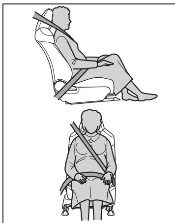

请遵医嘱并正确佩戴座椅安全带。(P.25)

孕妇也应像其他乘员一样，将腰部安全带尽可能低地横跨于髋部 肩部安全带应沿肩部完全斜www.ca向拉伸，并避免安全带触及隆起的腹部。

如果未正确系好座椅安全带，则在紧急制动或发生碰撞时，可能导致孕妇和胎儿受到严重伤害甚至死亡。

## ■病人

请遵医嘱并正确佩戴座椅安全带。(P.25)

## ■儿童在车内时

P.45

## ■座椅安全带的损坏和磨损

●请勿让车门夹住安全带、锁片或带扣，否则可能损坏座椅安全带。

●定期检查座椅安全带系统。检查座椅安全带是否存在切口磨损和松动部位。请勿使用已损坏的座椅安全带，应将其更换。已损坏的座椅安全带无法起到保护乘员免受严重伤害甚至死亡的作用。

●确保安全带和锁片已锁定且安全带未扭曲。如果座椅安全带不能正常工作，请立即联系您的丰田汽车经销商。

●如果车辆发生严重事故，即使未出现明显损坏，也应更换座椅总成（包括安全带）。

●请勿擅自安装、拆卸、改装、拆解或弃置座椅安全带。请联系您的丰田汽车经销商进行必要的修理。处理不当可能会导致错误工作。ook.com

## 正确使用座椅安全带

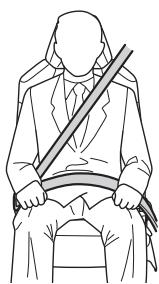

拉伸肩部安全带，将其斜跨整个肩部，但不要触及颈部或从肩部滑脱。

腰部安全带应尽可能低地横跨于髋部。

调节座椅靠背的位置。坐直并靠好座椅靠背。

请勿扭曲座椅安全带。

## ■儿童使用座椅安全带的方法

车辆上的座椅安全带主要是根据成人体形设计的。

●儿童应使用合适的儿童保护装置，直至他们的体形长大到适合佩戴车辆座椅安全带。(P.36)

●儿童长大到适合佩戴车辆座椅安全带时，请遵守有关座椅安全带的使用说明。(P.24)

## ■与座椅安全带相关的法规

如果您所居住的国家/地区有与座椅安全带相关的法规，则有关座椅安全带的更换或安装事宜，请联系您的丰田汽车经销商。

## 系紧和松开座椅安全带

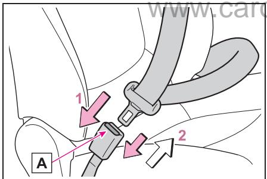

1 将锁片推入带扣直至听到咔嗒声即可系紧座椅安全带。

2 按下释放按钮 即可松开座椅安全带。

## ■紧急锁定卷收器 (ELR)

在紧急停车或发生碰撞时 卷收器将锁定安全带。如您身体前倾过快时，安全带也可能锁定。安全带锁定时，用力拉安全带然后松开，之后轻缓拉动即可使安全带拉伸。

## ■使用后排中间座椅安全带后

将座椅安全带带扣收入凹槽内。

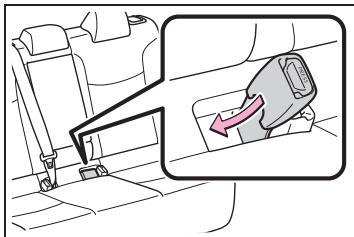

## 调节座椅安全带肩部固定装置的高度（前排座椅）

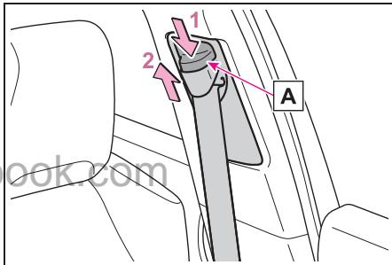

1 按住释放按钮 的同时向下推座椅安全带肩部固定装置。

2 向上推座椅安全带肩部固定装置。

根据需要上下移动高度调节器，直至听到咔嗒声。

## 警告

## 可调式肩部固定装置

务必确保肩部安全带跨过肩膀中部。安全带应远离颈部，但不能从肩膀上滑落。否则在发生事故时会降低安全带的保护作用，在紧急停车、紧急转向或发生事故时会导致严重伤害甚至死亡。

# 座椅安全带预张紧器（前排座椅和后排外侧座椅）

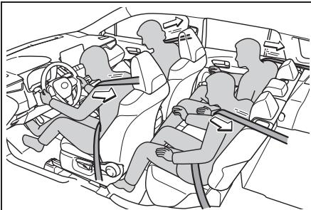

车辆遭受严重的正面或侧面碰撞时，预张紧器会收紧前排座椅和后排外侧座椅的安全带，从而牢固地束紧乘员。

发生轻微的正面或侧面碰撞、追尾或翻车时，预张紧器将不工作。

■PCS 联动控制

www.carobook.com

如果 PCS（碰撞预测系统）判定很可能与车辆发生碰撞，则座椅安全带预张紧器将准备工作。

警告

## ■座椅安全带预张紧器

如果预张紧器已工作，则 SRS警告灯将点亮。在此情况下，不得使用座椅安全带，必须由丰田汽车经销商进行更换。否则可能导致严重伤害甚至死亡。

## SRS 空气囊

## SRS 空气囊

车辆遭受某些可能导致乘员重伤的严重撞击时，SRS 空气囊会展开。空气囊与座椅安全带相互配合工作，以降低车内人员受到严重伤害甚至死亡的风险。

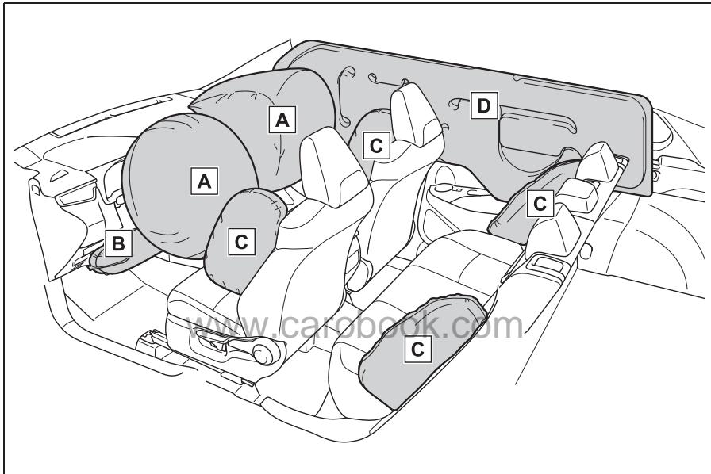

SRS 驾驶员空气囊/前排乘员空气囊

有助于减轻对驾驶员和前排乘员头部和胸部的冲击

SRS 膝部空气囊

有助于减轻对驾驶员的冲击

SRS 侧空气囊

• 有助于减轻对前排座椅乘员胸部的冲击

• 有助于减轻对后排外侧座椅（若装备）乘员胸部的冲击

SRS 帘式空气囊

有助于减轻对前排座椅和后排外侧座椅乘员头部的冲击

以上所示为SRS空气囊系统的主要部件。SRS空气囊系统由空气囊传感器总成控制。空气囊展开时，气体发生器中的化学反应使空气囊内迅速充满无毒气体，以抑制乘员身体移动。

## ■如果SRS 空气囊展开（充气）

●热气会导致SRS空气囊以极高速度展开（充气），因此可能导致轻微擦伤、烫伤、淤血等。

●会发出很大的噪音并喷出白色粉末。

●空气囊模块零件（方向盘毂、空气囊盖和气体发生器）和空气囊周围零件在数分钟内可能会很烫。空气囊本身也可能很烫。

●风挡玻璃可能会破裂。

●会自动控制制动器和刹车灯。(P.224)

●车内灯将自动点亮。(P.251)

●危险告警灯将自动点亮。 (P.310)

●会停止向发动机供油。(P.316)

●对于丰田智行互联用户，如果发生下列任 情况 系统将向丰田www.car智行互联中心发出紧急救援，告知其车辆位置（无需按下“SOS”按钮），话务员将尝试与乘员通话以确定紧急程度和所需救援。如果乘员无法交流，则话务员会自动将该通话视为紧急通话，并帮助提供必要的紧急救援服务。(P.51)

• SRS空气囊已展开时

• 座椅安全带预张紧器已工作时

• 车辆遭受严重的追尾碰撞时

## ■在正面碰撞中SRS空气囊展开的 情况

●如果碰撞的严重程度超出了临界值（即相当于以约 20 - 30 km/h[公里/小时 ] 的车速迎面撞上不移动且不变形的固定壁障所产生的撞击力），则下列 SRS空气囊将展开。

## • SRS 前空气囊

## • SRS 膝部空气囊

●在下列情况下，SRS 空气囊展开的临界值将比平时高 :

• 车辆撞到停放的车辆或交通标志 柱等会因碰撞而移动或变形的物 体时

• 如果车辆发生钻撞，如车辆前部“钻撞 ”或者钻入卡车底板的碰撞

●根据碰撞类型，可能仅以下设备工作 :

• 座椅安全带预张紧器

●如果发生特别严重的正面碰撞，则左和右 SRS 帘式空气囊也可能展开。

## ■在侧面碰撞中SRS空气囊展开的 情况

如果碰撞的严重程度超出了设定的临界值（即相当于一辆约1,500 kg [ 公斤 ] 的车辆以约 20 -

30 km/h [ 公里 / 小时 ] 的速度从垂直角度撞上乘员车厢所产生的ook.com撞击力），则下列SRS空气囊将展开 :

• SRS 侧空气囊

• SRS 帘式空气囊

## ■在底部撞击中SRS空气囊展开的 情况

●如果车辆底部撞到坚硬物体，则下列空气囊可能展开 :

• SRS 前空气囊

• SRS 膝部空气囊

• SRS 侧空气囊

• SRS 帘式空气囊

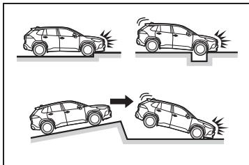

## ■SRS侧空气囊不会展开的情况

●在侧面碰撞或追尾、翻车或低速正面碰撞中，下列 SRS空气囊通常不会展开。但是，如果此类碰撞导致突然减速至一定程度，则SRS 空气囊可能展开。

• SRS 前空气囊

• SRS膝部空气囊

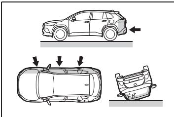

●如果车辆以一定角度发生碰撞或在侧面碰撞中遭受撞击的部位为乘员车厢以外的区域，则下列SRS空气囊可能不会展开 :

撞中，下列 SRS 空气囊通常不会展开 :

• SRS 帘式空气囊

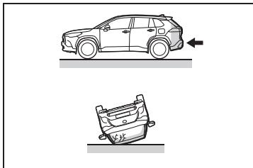

## ■何时应当联系您的丰田汽车经销 商

在下列情况下，车辆需要检查和/或修理。请尽快联系您的丰田汽车经销商。

• SRS 侧空气囊

●任一 SRS 空气囊已展开时

●车辆前部损坏或变形，或车辆遭遇了不足以导致下列任一 SRS空气囊展开的碰撞时 :

• SRS 帘式空气囊 • SRS 前空气囊• SRSwww.carobook.com

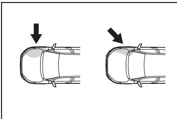

●在正面碰撞或追尾、翻车或低速侧面碰撞中，下列SRS 空气囊通常不会展开:

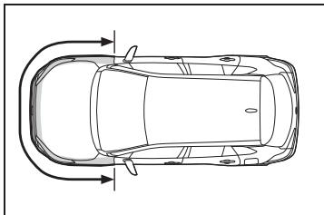

• SRS 侧空气囊

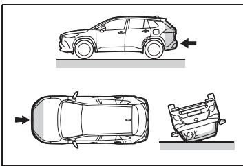  
●在追尾、翻车或低速正面/侧面碰

●车门或车门周围区域损坏、变形或有洞，或车辆遭遇了不足以导致下列任一 SRS 空气囊展开的碰撞时 :

• SRS 侧空气囊

• SRS 帘式空气囊●方向盘衬垫部位、前排乘员SRS空气囊附近的仪表板或仪表盘下侧等地方有划痕、裂纹或其他损坏时。

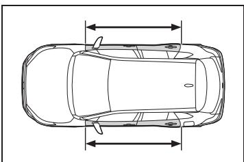

●带SRS侧空气囊的座椅表面有划痕、裂纹或其他损坏时。

●内含SRS 帘式空气囊的前柱、后柱或车顶纵梁装饰件（衬垫）部位有划痕、裂纹或其他损坏时。

## 警告

## ■SRS空气囊的注意事项

请遵守下列注意事项。www.carob否则可能导致严重伤害甚至死亡。

●驾驶员和所有乘员必须正确佩戴座椅安全带。

SRS空气囊是配合座椅安全带使用的辅助设备。

●SRS驾驶员空气囊展开时的冲击力相当大，如果驾驶员离空气囊过近，则可能导致严重伤害甚至死亡。

为驾驶员空气囊展 时 前50-75 mm（毫米）展开范围属危险区域，与驾驶员空气囊保持250 mm（毫米）的距离可提供足够的安全余量。该距离是指方向盘中央至您胸骨的距离。如果当前驾驶位置使您与驾驶员空气囊的距离小于 250 mm（毫米），则可通过下列方法改变驾驶位置 :

• 将座椅尽量后移，但仍以能舒适地踩到各个踏板为准。

将座椅靠背略微后倾。尽管车辆设计各有不同，但对于大部分驾驶员，即使将驾驶员座椅移至最靠前位置，也只

需将座椅靠背略微后倾，就能ook.com达到250 mm（毫米）的距离 如果座椅靠背倾斜后难以看清前方路况，则可使用硬质防滑座垫垫高身体，或升高座椅（若您的车辆具备该功能）。

• 如果方向盘可调，则将其向下倾斜。这样可让空气囊正对您的胸部而非头部和颈部。

应按照上述建议调节驾驶员座椅，同时仍可通过踏板和方向盘控制车辆并保持对仪表板控制开关的控制。

## 警告

●SRS前排乘员空气囊展开时的冲击力也相当大，如果前排乘员离空气囊过近，则可能导致严重伤害甚至死亡。前排乘员座椅应尽量远离空气囊，并调节座椅靠背以便前排乘员坐直。

●安置不当和/或保护不当的婴幼儿可能会由于空气囊的展开而导致严重伤害甚至死亡。太小而不能使用座椅安全带的婴幼儿，应使用儿童保护装置予以适当的保护 丰田公司强烈建议让所有婴幼儿坐在车辆的后排座椅上并予以适当保护。对于婴幼儿，后排座椅比前排乘员座椅更安全。(P.36)

●请勿坐在座椅边缘或靠在仪表 板上。 www.caro

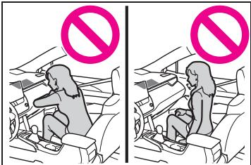

●请勿让儿童站在SRS前排乘员空气囊前面或坐在前排乘员腿上。

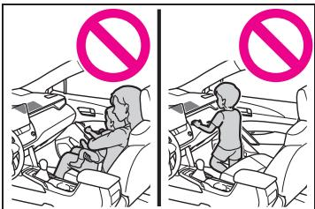

●前排座椅乘员不得在腿上放置物品。

●请勿斜靠在车门、车顶纵梁、前柱、中柱或后柱上。

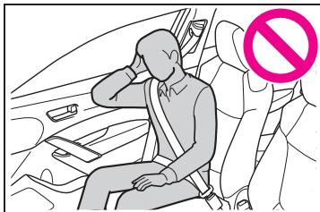

●请勿让任何人面朝车门跪在座椅上，或将头或手伸出车外。

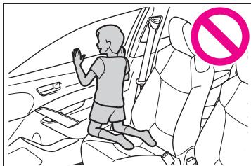

●请勿将任何物品拴缚或斜靠在仪表板、方向盘衬垫和仪表盘ook.com下部等地方。

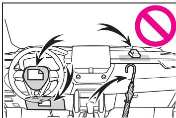

●请勿将任何物品拴缚在车门、风挡玻璃、侧车窗、前柱或后柱、车顶纵梁和辅助拉手等部位。

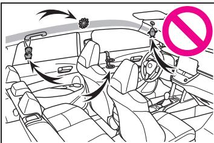

●请勿使用会盖住SRS空气囊展开部位的座椅附件，因为它们可能会妨碍 SRS空气囊充气。这些附件可能会妨碍 SRS空气囊正确展开，可能造成系统失效或 SRS空气囊意外充气，从而导致严重伤害甚至死亡。

●请勿击打 SRS空气囊系统部件、前门或其周围区域，或对其施加过大的力。否则可能导致 SRS空气囊发www.car生故障。

●SRS空气囊展开（充气）后，请勿立即触摸任何 SRS空气囊相关部件，因为它们可能很烫。

●如果SRS空气囊展开后感觉呼吸困难，则打开车门或车窗通风，或在确保安全的情况下离开车辆。应尽快冲洗身上的残留物，以免刺激皮肤。

●如果SRS空气囊所在部位损坏或破裂，请联系您的丰田汽车经销商进行更换。

• 方向盘

• 仪表盘

• 仪表板

• 座椅

• 座椅蒙皮

• 前柱ook.com

• 中柱

• 后柱

• 车顶纵梁

• 前门板

• 前门饰件

• 前门扬声器

●改装前门板（如在前门板上打洞）

●修理或改装下列零件或其周围区域

• 前翼子板

• 前保险杠

• 车辆内部侧面

●安装以下零件或附件

• 防护栅或斗式杆

## 警告

• 除雪犁

• 绞盘

●改装车辆悬架

●安装移动式双向无线电台（射频发射器）和 CD播放机等电子设备

## 废气注意事项

废气中含有对人体有害的物质。

## 警告

废气中含有无色无味的有害气体一氧化碳 (CO)。请遵守下列注意事项。

否则可能会导致废气进入车内并由于头晕目眩而引发事故，或可能严重危害身体健康，甚至导致死亡。

## ■驾驶时的要点

●保持背门关闭。

## www.carob

●如果即使背门关闭时在车内仍能闻到废气气味，则请打开车窗并尽快联系您的丰田汽车经销商检查车辆。ook.com

## ■驻车时

●如果车辆停放在车库等通风不良或密闭的场所，请停止发动机。

●请勿让车辆发动机长时间运转。

如果不能避免此种情况，请将车辆停放在开阔场所，并确保废气不会进入车内。

●在积雪较深或正在下雪的地区，请勿让发动机一直运转。如果在发动机运转时车辆陷入积雪，废气可能聚积并进入车内。

## 警告

## ■排气管

需定期检查排气系统。如果因腐蚀而出现小孔或裂纹、接头损坏或排气噪声异常，请务必联系您的丰田汽车经销商检查和维修车辆。

www.carobook.com

## 儿童乘坐信息

车内有儿童时，请遵守下列注意事项。

儿童应使用合适的儿童保护装置，直至他们的体形长大到适合佩戴车辆座椅安全带。

建议让儿童坐在后排座椅上，以防意外碰到换档杆、刮水器开关等。

行驶过程中，使用后门儿童安全锁或车窗锁止开关，以防儿童意外打开车门或操作电动车窗。(P.91, 120)

请勿让儿童操作可能会卡住或夹住身体部位的设www.ca备，如电动车窗、发动机盖、背门、座椅等。

## 警告

## ■儿童在车内时

切勿将儿童单独留在车内，切勿让儿童携带或使用钥匙。

儿童可能会起动车辆或将车辆换至空档。儿童在玩耍车窗、天窗（若装备）、全景天窗（若装备 或其他车辆装备时 还可能会伤到自己 此外 车内温度过高或过低，也可能会对儿童造成致命伤害。

## 儿童保护装置

在车内安装儿童保护装置前，应阅读本手册中必须遵守的注意事项、各类儿童保护装置及其安装方法等说明。

不宜使用座椅安全带的幼儿乘车时，应使用儿童保护装置。为了儿童安全，应将儿童保护装置安装到后排座椅上。请务必按照儿童保护装置随附操作说明书中的安装方法进行安装。

建议使用丰田纯正儿童保护装置，因为其用于本车更安全。丰田纯正儿童保ook.com护装置专为丰田车制造可在丰田汽车经销商处购买。

## 目录

需谨记的事项:P.37

儿童保护装置:P.42

使用儿童保护装置时:P.39

儿童保护装置安装方法

• 使用座椅安全带固定:P.42

• 使用ISOFIX刚性固定锚固定 :P.45

• 使用固定锚支座（用于顶部系带）:P.49

根据儿童的年龄和体形，选择一套合适的儿童保护装置。

请注意，并非所有儿童保护装置都适用于所有车辆。使用或购买儿童保护装置前，请检查儿童保护装置和座椅位置的兼容性。(P.42, 46)

## 警告

## ■儿童乘坐时

请遵守下列注意事项。否则可能导致严重伤害甚至死亡。

●为了在交通事故和紧急停车时有效保护儿童，必须使用座椅安全带或正确安装的儿童保护装置对儿童进行适当地约束。有关安装详情，请参见儿童保护装置随附的操作说明书。本手册中仅提供一般安装说明。

●丰田公司强烈建议您根据儿童体重和体形大小选用合适的儿童保护装置，并将其安装在后排座椅上。根据事故调查统计，坐在后排座椅上并正确约束保护的儿童比坐在前排座椅上的儿童更安全。

●如果车辆因事故等受到强烈撞击，则儿童保护装置可能已遭受到不易察觉的损伤。在此情况下，请勿再次使用该保护装置。

●由于儿童保护装置不同，有的保护装置可能难以安装或无法安装。在此情况下，应检查儿童保护装置是否适合安装在本车上。(P.42, 45) 务必先仔细

阅读本手册及儿童保护装置随ook.com附操作说明书中有关儿童保护装置的固定方法，然后再进行安装，并遵守使用规则。

●即使不使用儿童保护装置，也要将其正确固定在座椅上。请勿在乘员车厢内放置未加以固定的儿童保护装置。

●如果必须拆下儿童保护装置则将其从车辆中取出或放入行李厢内并牢固固定。

## 儿童保护装置

确认下列项目后，即可在车内安装适用的儿童保护装置。

■ 儿童保护装置标准

使用符合 GB27887-2011 的儿童保护装置。

## ■ 质量组

确认儿童保护装置兼容性时需要该质量组表格。请根据儿童保护装置兼容性表进行确认。(P.42, 46)

根据儿童体重，将符合GB27887-2011 标准的儿童保护装置分为5组。

<table><tr><td>质量组</td><td>儿童体重</td><td>参考年龄*</td></tr><tr><td>0组</td><td>不超过10kg(公斤)</td><td>约9个月</td></tr><tr><td>0+组</td><td>不超过13kg(公斤)</td><td>约1.5岁</td></tr><tr><td>I组</td><td>9-18kg(公斤)</td><td>9个月-约4岁</td></tr><tr><td>II组</td><td>15-25kg(公斤)</td><td>3岁-约7岁</td></tr><tr><td>III组</td><td>22-36kg(公斤)</td><td>6岁-约12岁</td></tr></table>

\*:本年龄范围为标准近似值。请以儿童体重为准。

## ■ 儿童保护装置安装方法类型

根据儿童保护装置随附的操作说明书，确认关于儿童保护装置的安装事项。 com

www.carobook.

<table><tr><td colspan="2">安装方法</td><td>页码</td></tr><tr><td>座椅安全带安装</td><td></td><td>P.42</td></tr><tr><td>ISOFIX 刚性固定锚安装</td><td>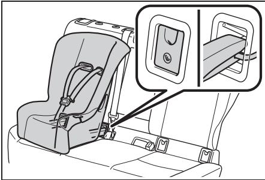</td><td>P.45</td></tr><tr><td>固定锚支座(用于顶部系带)安装</td><td>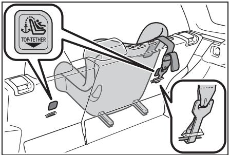</td><td>P.49</td></tr></table>

## 使用儿童保护装置时

■ 在前排乘员座椅上安装儿童保护装置时

为安全起见，请将儿童保护装置安装到后排座椅上。不得不将儿童保护装置安装到前排乘员座椅上时，请按照以下方法调节座椅并安装儿童保护装置

将前排座椅移至最靠后位置。

如果乘员座椅高度可调，则将其调节至最高位置。

将座椅靠背倾角调节至最直立位置。

如果儿童座椅与座椅靠背之间有间隙，则调节座椅靠背倾角直至其接触良好。

如果头枕妨碍儿童保护装置且头枕可拆下，则拆下头枕。

否则，将头枕置于最高位置。

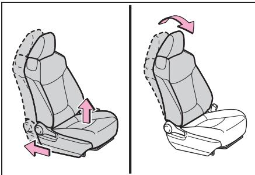

## 警告

## ■使用儿童保护装置时

请遵守下列注意事项。否则可能导致严重伤害甚至死亡。

●不得在受正面安全气囊保护（激活状态下）的座位上使用后向儿童约束系统 否则发生事故时，前排乘员空气囊急剧充气的冲击力可能导致儿童受到严重伤害甚至死亡。

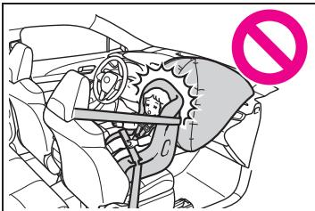

●乘员侧遮阳板上贴有标签，指www.carobook.com 后向式儿童保护装置。 标签详情如下图所示。

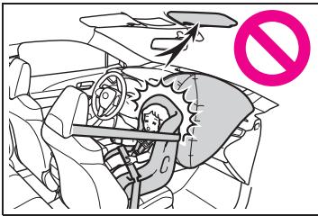

## 警告

●只有在不得已的情况下，才可将前向式儿童保护装置安装在前排座椅上。在前排乘员座椅上安装前向式 童保护装www.car时，应尽可能向后移动座椅。否则，如果空气囊展开（充气），可能会导致严重伤害甚至死亡。

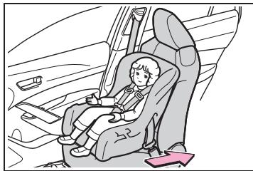

DEATH OR SERIOUS INJURY can ocCu

即使已将儿童安置在儿童保护装置中，也不要让他/她将头部或身体的任何部位倚在车门、座椅区域、前柱或后柱或车顶纵梁上（SRS侧空气囊或SRS 帘式空气囊的展开部位）。如果 SRS侧空气囊和帘式空气囊充气，则会非常危险，其冲击力可能导致儿童受到严重伤害甚至死亡。

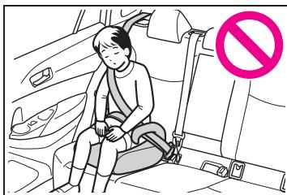

●安装少年座椅（辅助座椅）时，务必确保肩部安全带跨过儿童肩膀中部，并应远离儿童颈部，但不能轻易从肩部滑脱。

●使用适合儿童年龄和体形的儿童保护装置并将其安装到后排座椅上。

## 警告

●如果驾驶员座椅妨碍儿童保护装置并影响其正确安装，则将儿童保护装置安装在后排右侧座椅上。

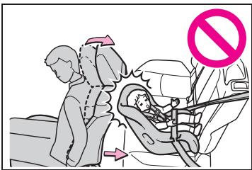

及适合安装客户拥有的儿童保护装置的座椅位置。此外，也可选择推荐的适合儿童的儿童保护装置。请根据 [ 确定座椅安全带安装型儿童保护装置适用的座椅安装位置和质量组]进行确定。

●调节前排乘员座椅，以便其不会妨碍到儿童保护装置。

■ 确定座椅安全带安装型儿童保护装置适用的座椅安装位置和质量组

1 通过儿童体重确定对应的 [质量组 ] (P.38)

（示例 1）体重为 12 kg（公斤）时，[质量组 0+]

## 使用座椅安全带固定的儿童保护装置

（示例 2）体重为 15 kg（公斤）时，[ 质量组 I]

■ 儿童保护装置在不同座椅位www.car置的兼容性

儿童保护装置适用性表

2 通过 [使用座椅安全带紧固的儿童保护装置 - 兼容性表book.com] 确定并选择儿童保护装置适用的座椅位置和相应的装置类型。(P.42)

(P.42) 采用不同标识，列出了适用的儿童保护装置类型以

■ 使用座椅安全带紧固的儿童保护装置 - 兼容性表

如果儿童保护装置属于“ 通用”类，则可以将其安装至下表中U或UF提及的位置（UF仅适用于前向式儿童保护装置）。可在儿童保护装置手册中查看儿童保护装置类别和质量组。

如果儿童保护装置不属于 “ 通用”类（或如果无法在下表中找到信息），则请参见儿童保护装置 “车辆列表” 的兼容性信息或咨询儿童座椅的零售商。

<table><tr><td rowspan="3">质量组</td><td colspan="3">座椅位置</td></tr><tr><td rowspan="2">前排乘员座椅</td><td colspan="2">后排座椅</td></tr><tr><td>外侧</td><td>中央</td></tr><tr><td>0不超过 10 kg(公斤)</td><td>×</td><td>U</td><td>U</td></tr><tr><td>0+不超过 13 kg(公斤)</td><td>×</td><td>U</td><td>U</td></tr><tr><td rowspan="2">I9 至 18 kg(公斤)</td><td>后向式—×</td><td rowspan="2"> $U^{*1,2}$ </td><td rowspan="2"> $U^{*1,2}$ </td></tr><tr><td>前向式— $UF^{*1,2}$ </td></tr><tr><td>II、III15 至 36 kg(公斤)</td><td> $UF^{*1,2}$ </td><td> $U^{*1,2}$ </td><td> $U^{*1,2}$ </td></tr></table>

上表中字母的含义 :www.carobook.com  
:此座椅位置不适合本质量组儿童。

U:此座椅位置适合本质量组中经认证的“ 通用” 类儿童保护装置。

UF:此座椅位置适合本质量组中经认证的前向式“通用” 类儿童保护装置。

\*1:将座椅靠背倾角调节至最直立位置。将前排座椅移至最靠后位置。如果乘员座椅高度可调，则将其移至最高位置。

\*2:如果头枕妨碍儿童保护装置且头枕可拆下，则拆下头枕。否则，将头枕置于最高位置。

在后排座椅上安装某些类型的儿童保护装置时，可能无法在不妨碍儿童保护装置或不影响座椅安全带效能的情况下正确使用其相邻座椅的座椅安全带。请确保座椅安全带能舒适地跨过肩膀，并放低至髋部。如果不能，或妨碍儿童保护装置，则请移至其他位置。否则可能导致严重伤害甚至死亡。

在后排座椅上安装儿童保护装置时，请调节前排座椅，以便其不会妨碍儿童和儿童保护装置。

安装带支座的儿童座椅时，如果将儿童座椅锁入支座时座椅靠背妨碍儿童座椅，则向后调节座椅靠背至无妨碍位置。

安装前向式儿童座椅时，如果儿童座椅与座椅靠背之间有空隙，则调节座椅靠背倾角直至其接触良好。

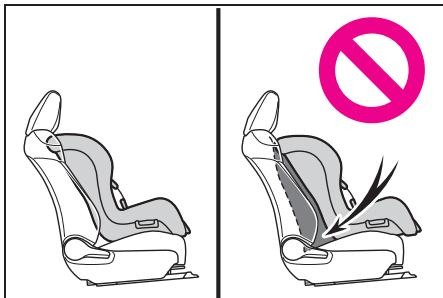

如果座椅安全带肩部固定装置位于儿童座椅安全带导环前方，则向前移动座垫。

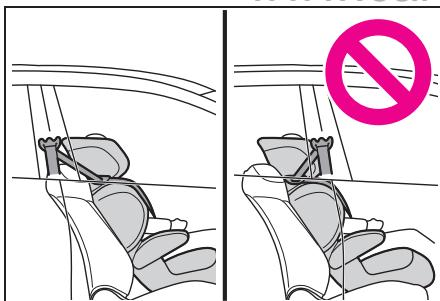

安装少年座椅时，如果儿童保护装置上的儿童坐姿过直，则将座椅靠背倾角调节至最舒适的位置。如果座椅安全带肩部固定装置位于儿童座椅安全带导环前方，则向前移动座垫。

## ■ 用座椅安全带安装儿童保护装置

根据儿童保护装置随附的操作

说明书安装儿童保护装置。

1 如果不得不将儿童保护装置安装到前排乘员座椅上请参见 P.39 调节前排乘员座椅。

2 如果头枕妨碍儿童保护装置且头枕可拆下，则拆下头枕。否则，将头枕置于最高位置。(P.111)

3 将座椅安全带穿过儿童保护装置并将锁片插入带扣。确保安全带未扭曲。根据儿童保护装置随附的说明书，将座椅安全带牢固固定在儿童保护装置上。

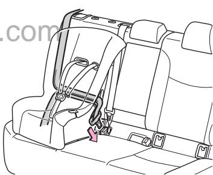

4 如果儿童保护装置未配备闭锁装置（座椅安全带锁定装置），则使用锁止卡子固定儿童保护装置。

5 安装儿童保护装置后，前后晃动确保其安装牢固。(P.45)

■ 拆下用座椅安全带安装的儿童保护装置

按下带扣释放按钮，完全缩回座椅安全带。

释放带扣时，儿童保护装置可能因座垫回弹而弹起。因此，请在下压儿童保护装置的同时释放带扣。

由于座椅安全带可自行卷收，因此请将其缓慢回位至收起位置。

## ■安装儿童保护装置时

可能需用锁止卡子安装儿童保护装置 请遵照儿童保护装置制造商提供的说明。如果儿童保护装置未提供锁止卡子，可从丰田汽车经销商处购买以下零件 :儿童保护装置锁止卡子

（零件号 73119-22010）

## 警告

## ■安装儿童保护装置时

请遵守下列注意事项。否则可能导致严重伤害甚至死亡。

●切勿在前排乘员座椅上使用后向式儿童保护装置。发生事故时，前排乘员空气囊急剧充气的冲击力可能导致儿童受到严重伤害甚至死亡。

●请勿让儿童玩耍座椅安全带如果座椅安全带缠绕在儿童的颈部，则可能造成窒息或其他严重伤害甚至死亡。如果发生此情况且无法松开带扣，则用剪刀剪断安全带。

●确保安全带和锁片牢固锁定且安全带未扭曲。

●前后左右晃动儿童保护装置，确保其安装牢固。

●固定儿童保护装置后，切勿调节座椅。

●安装少年座椅（辅助座椅）时 务必确保肩部安全带跨过儿童肩膀中部，并应远离儿童颈部，但不能轻易从肩部滑脱。

●请遵守儿童保护装置制造商提供的所有安装说明。ook.com

## 使用ISOFIX刚性固定锚固定的儿童保护装置

■ ISOFIX 刚性固定锚（ISOFIX儿童保护装置）后排外侧座椅配备下固定锚。（指示固定锚位置的标签缝在座椅上。）

## ■ 儿童保护装置在不同座椅位置的适用性

儿童保护装置适用性表

(P.46) 采用不同标识，列出了适用的儿童保护装置类型以及适合安装客户拥有的儿童保护装置的座椅位置。此外，也可选择推荐的适合儿童的儿童保护装置。根据列出的尺寸类别、固定锚以及 [确定ISOFIX儿童保护装置对应的质量组和尺寸类别] 进行确定。

## ■ 确定ISOFIX儿童保护装置对应的质量组和尺寸类别

1 通过儿童体重确定对应的 [质量组 ] (P.38)

（示例 1）体重为 12 kg（公斤）www.carob时，[ 质量组 0+]（示例2）体重为15 kg（公斤）时，[质量组 I]

## 2 确定尺寸类别

根据步骤 1确定的 [ 质量组 ]，从[使用 ISOFIX 紧固的儿童保护装置 - 兼容性表] 中选择其对应的尺寸类别 (P.46)\*。

（示例1）[质量组 0+] 时，对应的尺寸类别为 [C]、[D]、[E]。（示例2）[质量组 I] 时，对应的尺寸类别为 [A]、[B]、[B1]、[C]、[D]。

\*:然而，尽管适用性表中 [座椅位置] 栏下有对应的尺寸类别，也不能选择标识为 [] 的项。此外，如果项目标识为 [IL]，则选择 [推荐的儿童保护装置 ](P.46) 中指定的产品。

## ■ 使用ISOFIX紧固的儿童保护装置 - 兼容性表和推荐的儿童保护装置表

ISOFIX儿童保护装置分为不同的“尺寸类别”。根据“尺寸类别”，您可在下表中提及的车辆座椅位置使用儿童保护装置。有关儿童保护装置“尺寸类别” 和“质量组”的信息，请参见儿童保护装置手册。

如果儿童保护装置无“尺寸类别”（或如果无法在下表中找到信息），则请参见儿童保护装置“车辆列表” 的兼容性信息或咨询儿童座椅的零售商。

<table><tr><td>尺寸类别</td><td>描述</td></tr><tr><td>A</td><td>全高度、前向式儿童保护装置</td></tr><tr><td>B</td><td>降低高度、前向式儿童保护装置</td></tr><tr><td>B1</td><td>降低高度、前向式儿童保护装置</td></tr><tr><td>C</td><td>全尺寸、后向式儿童保护装置</td></tr><tr><td>D</td><td>缩小尺寸、后向式儿童保护装置</td></tr><tr><td>E</td><td>后向式婴儿座椅</td></tr><tr><td>F</td><td>左向式(手提式婴儿床)婴儿座椅</td></tr><tr><td>G</td><td>右向式(手提式婴儿床)婴儿座椅</td></tr></table>

<table><tr><td rowspan="3">质量组</td><td rowspan="3">尺寸类别</td><td colspan="3">座椅位置</td><td rowspan="3">推荐的儿童保护装置</td></tr><tr><td>前排座椅</td><td colspan="2">后排座椅</td></tr><tr><td>乘员座椅</td><td>外侧</td><td>中央</td></tr><tr><td rowspan="2">手提式婴儿床</td><td>F</td><td>×</td><td>×</td><td>×</td><td rowspan="2">-</td></tr><tr><td>G</td><td>×</td><td>×</td><td>×</td></tr><tr><td>0*2不超过10kg(公斤)</td><td>E</td><td>×</td><td> $IL^{*3}$ </td><td>×</td><td rowspan="9">i-size MIDI*2</td></tr><tr><td rowspan="3">0+*2不超过13kg(公斤)</td><td>E</td><td>×</td><td> $IL^{*3}$ </td><td>×</td></tr><tr><td>D</td><td>×</td><td> $IL^{*3}$ </td><td>×</td></tr><tr><td>C</td><td>×</td><td>×</td><td>×</td></tr><tr><td rowspan="5">I*29至18kg(公斤)</td><td>D</td><td>×</td><td> $IL^{*3}$ </td><td>×</td></tr><tr><td>C</td><td>×</td><td>×</td><td>×</td></tr><tr><td>B</td><td>×</td><td> $IUF^{*1}$  $IL^{*1}$ </td><td>×</td></tr><tr><td>B1</td><td>×</td><td> $IUF^{*1}$  $IL^{*1}$ </td><td>×</td></tr><tr><td>A</td><td>×</td><td> $IUF^{*1}$  $IL^{*1}$ </td><td>×</td></tr></table>

上表中字母的含义 :  
:此座椅位置不适合本质量组和/或尺寸类别内的ISOFIX 儿童保护装置。

IUF: 此座椅位置适合本质量组中经认证的“ 通用”类ISOFIX前向式儿童保护装置。

IL:此座椅位置适合本质量组中经认证的 “特殊车辆”、“受限制” 或“半通用” 类ISOFIX儿童保护装置。

\*1:如果头枕妨碍儿童保护装置且头枕可拆下，则拆下头枕。否则，将头枕置于最高位置。

\*2:丰田公司建议在后排座椅上使用后向式儿童保护装置。（使用

ISOFIX，不超过 18 kg [ 公斤 ]）

\*3:在该座椅上安装儿童保护装置前，将前排乘员座椅的位置调节至第 1锁止位置和第 6锁止位置（从后数第 22个锁止位置）之间。

  
第1锁止位置第6锁止位置

2 拆下固定锚盖，并将儿童保护装置安装到座椅上。固定锚盖后面装有固定杆。

在后排座椅上安装某些类型的儿童保护装置时，可能无法在不妨碍儿童保护装置或不影响座椅安全带效能的情况下正确使用其相邻座椅的座椅安全带。请确保座椅安全带能舒适地跨过肩膀，并放低至髋部。如果不能，或妨碍儿童保护装置，则请移至其他位置。否则可能导致严重伤害甚至死亡。

  
3 安装儿童保护装置后，前book.com后晃动确保其安装牢固。(P.45)

在后排座椅上安装儿童保护装置时，请调节前排座椅，以便其不会妨碍儿童和儿童保护装置。

■使用 “i-Size MIDI” 时如下调整撑脚和ISOFIX 连接器 :

■ 用ISOFIX刚性固定锚安装（ISOFIX儿童保护装置）

根据儿童保护装置随附的操作说明书安装儿童保护装置。

1 如果头枕妨碍儿童保护装置且头枕可拆下，则拆下头枕。否则，将头枕置于最高位置。(P.111)

1 在可以看到数字 1 时锁定ISOFIX 连接器。

2 在露出6个孔时锁定撑脚。

## 警告

## ■安装儿童保护装置时

请遵守下列注意事项。否则可能导致严重伤害甚至死亡。

●固定儿童保护装置后，切勿调节座椅。

●使用下固定锚时，确保固定锚周围无异物且座椅安全带未卡在儿童保护装置后面。

●请遵守儿童保护装置制造商提供的所有安装说明。

使用固定锚支座（用于顶部系带）

■ 固定锚支座（用于顶部系带）

后排外侧座椅配备固定锚支座。

固定顶部系带时使用固定锚支座。

固定锚支座

顶部系带

■ 将顶部系带固定至固定锚支座

根据儿童保护装置随附的操作

说明书安装儿童保护装置。

1 将头枕调节至最高位置。

如果头枕妨碍儿童保护装置或顶部系带安装且头枕可拆下，则拆下头枕。(P.111)

2 将钩扣到固定锚支座上，并紧固顶部系带。

确保将顶部系带扣牢。(P.45)在头枕升高的情况下安装儿童保护装置时，务必从头枕下面穿过顶部系带。

## 钩

顶部系带

## 警告

## ■安装儿童保护装置时

请遵守下列注意事项。否则可能导致严重伤害甚至死亡。

●牢固拴缚顶部系带并确保安全带未扭曲。

●请勿将顶部系带拴缚到固定锚支座以外的其他物体上。

●固定儿童保护装置后，切勿调节座椅。

●请遵守儿童保护装置制造商提供的所有安装说明。

## 警告

●在头枕升高的情况下安装儿童保护装置时，升高头枕并固定住固定锚支座后，请勿降低头枕。

www.carobook.com

## 丰田智行互联

丰田智行互联功能是一种使用数据通信模块 (DCM) 通过网络支持汽车的车载通信服务。

本手册提供的所有丰田智行互联功能到手册付印时为止均为最新资料。但是，由于丰田智行互联功能的不断改进，内容会随时更新，届时恕不另行通知。

有关丰田智行互联服务的更多信息，请联系丰田汽车经销商。

## ■自由/开源软件信息

本产品包括自由 / 开源软件www.carob(FOSS)。

许可证信息和/或FOSS源代码可在下列网址中查询。

https://consumer.huawei.com/ en/opensource/

访问网站后，可通过输入下列任一关键编号来查看许可证信息和/或源代码。

●DA2268-03

●DA2268-05

●DA2268-03/DA2268-05

## 警告

■使用丰田智行互联时

●为安全起见，驾驶时不得操作本系统。

●驾驶时操作本系统可能会导致对车辆的误操作，从而可能会造成意外事故。请仅在车辆停止时操作本系统。

## ■与电子设备干扰有关的注意事项

●本DCM 单元装有数据通信天线。使用植入式心脏起搏器、心脏再同步治疗起搏器或植入式心脏复律除颤器的人士应与数据通信天线保持适当距离。无线电波可能会影响此类设备的工作。

●即使您未签订丰田智行互联用户合约，本系统也可能会与服务器建立通信。驾驶车辆前，对于未使用植入式心脏起搏器、心脏再同步治疗起搏器或植入式心脏复律除颤器，而使用其他电子医疗设备的人士应向设备制造商咨询无线电波ook.com对设备工作的影响情况。无线电波可能会对此类医疗设备的工作产生难以预料的影响。

## 关于丰田智行互联功能

## 可提供的服务如下:

<table><tr><td>服务功能/要点</td><td>页码</td></tr><tr><td>紧急救援</td><td>P.52</td></tr><tr><td>报警通知·被盗追踪</td><td>P.63</td></tr></table>

## ■ 关于通信设备

丰田智行互联功能使用数据通信模块 (DCM) 传送数据。

使用紧急救援时，也可使用DCM向丰田智行互联中心拨

打电话。

DCM使用通信天线。

## ■通信设备

●本设备已获得无线电发射设备型号核准、中国强制性产品认证和电信设备进网许可。设备上的标签为符合要求的证明。请勿撕下标签。

●未经授权而更改或改装设备将会导致用户丧失操作设备的权限。

## ■丰田智行互联合约

有关丰田智行互联合约的信息，请联系丰田汽车经销商。

## ■传送数据时的注意事项

传送数据时，丰田智行互联功能与服务器通信。

●请注意以下信息并正确使用系统。 www.ca

• 通信方式与中国电信的 LTE型移动电话相同。

• 由于本系统使用无线电波进行通信，所以您无法在无线电波未及之处拨打电话或进行数据通信。

• 您可能也无法在无线电波状况不佳之处拨打电话或进行数据通信。

• 如果将来电信供应商更改或终止通信使用的无线电波，则可能无法操作丰田智行互联功能。（如果发生这种情况，将会通知。）

●接收数据所需时间可能因设备状况、数据内容或无线电波的接收情况而有所差异。

●紧急救援过程中，无法操作丰田智行互联的某些功能。(P.52)

## 紧急救援· 道路救援

紧急救援·道路救援是通过来自车辆的紧急救援进行救援的系统。在下列情况下，仅需按下“SOS”按钮，即可与丰田智行互联中心进行连接。

紧急救援:交通事故或突发性医疗急救等紧急情况

道路救援:燃油不足或车辆故障等问题

也可通过移动电话和座机使用道路救援。

## ■ 开通和取消服务

丰田智行互联功能注册完毕后即可使用紧急救援。

丰田智行互联功能解约后，紧急救援随之解约。book.com

■ 如何进行紧急救援

 通过自动碰撞通知进行自动紧急救援

空气囊传感器总成检测到因事故产生的碰撞时，系统自动向丰田智行互联中心报告且话务专员将应答呼叫。

 通过按下按钮进行手动紧急救援

驾驶员或乘员按下“SOS” 按钮时，系统向丰田智行互联中心报告且话务专员将应答呼叫。

## ■紧急救援

●如果随意进行紧急救援操作，则您可能受到相关条例的处罚。请●车辆安装有求救信号电池。求救信号电池为二次电池，是消耗品。其通过闪烁红色紧急救援开关面板灯来告知更换时间。(P.60)

## 警告

## ■安全须知

●请安全驾驶。本系统的功能是在发生交通事故或突发性医疗急救等事故时帮助您进行紧急救援，但并不能对驾驶员或乘员提供任何保护。为确保安全，请始终安全驾驶并系紧座椅安全带。

●如果发生紧急情况，请将生命放在第一位。

●如果闻到焦味或其他异味，请勿在车内逗留，应立即撤离到安全区域。

●确保绿色紧急救援开关面板灯点亮。

●如果受到撞击，则本设备可能无法运行。在这种情况下，请通过附近公用电话等其他方法向丰田智行互联中心报告。

●如果蓄电池电压降低或蓄电池断开，则系统可能无法连接丰田智行互联中心。

●由于系统能检测碰撞，自动报告可能不会始终与SRS 空气囊系统的操作同步发生。（如果车辆受到来自后面的碰撞等。）

●如果未受到强烈撞击，则即使发生事故，SRS空气囊也可能不会充气。在这种情况下，系统可能不会自动进行紧急救援。即使SRS 空气囊已充气，ook.com系统也可能不会进行自动紧急救援。如果发生以上任一情况，请通过操作紧急救援开关面板按钮向丰田智行互联中心报告。

●在下列情况下，无法进行紧急救援。在这种情况下，请通过附近公用电话等其他方法向丰田智行互联中心报告。

• 车辆正处于移动电话服务区外。

• 任一相关设备（如紧急救援开关面板、麦克风、扬声器、DCM、天线或连接这些设备的任何导线）出现异常、损坏和故障时。

• 未注册丰田智行互联功能或该功能已过期时。

## 警告

• 未完成紧急救援开通操作，且系统无法进行紧急救援。

●紧急救援期间，系统反复尝试连接至丰田智行互联中心。但是，如果由于无线电波接收不良而无法连接至中心，则系统可能无法连接，并以无连接状态结束呼叫。红色紧急救援开关面板灯闪烁，表明连接中断。在这种情况下，请通过附近公用电话等其他方法向丰田智行互联中心报告。

●为安全起见，驾驶时请勿进行紧急救援操作。驾驶期间进行呼叫可能会造成方向盘操控失误，从而造成意外事故。进行紧急救援前，请停车并确认该区域安全。

●即使已解约丰田智行互联功www.ca能，如果绿色紧急救援开关面板灯仍点亮，请咨询您的经销商。在这种情况下，可能无法进行紧急救援。

●更换保险丝时，请使用与所述标准相符的保险丝。如果使用所述标准之外的保险丝，则可能导致电路起火或冒烟并可能造成火灾。

●冒烟或有异味时使用本系统可能会引起火灾。请立即停止使用系统并咨询丰田汽车经销商。

## 注意

## ■安全须知

●本设备内部结构非常复杂。拆解可能会造成系统故障。如果发现任何故障或错误，请立即咨询丰田汽车经销商。

●如果试图拆解或拆卸与系统相连接的任何设备，则可能导致设备连接松动和故障等，且可能无法进行紧急救援。如果必须拆下本设备的任何零件，请咨询丰田汽车经销商。

●如果扬声器或麦克风损坏，则紧急救援或手动维修检查期间将无法与话务员进行交流。如果任一设备损坏，请立即咨询丰田汽车经销商。

●在下列温度范围外，紧急救援可能无法正常工作。在这种情况下，请通过附近公用电话等ook.com其他方法向丰田智行互联中心报告。

工作温度范围 :-30°C 至 65°C

●实际车辆位置与向丰田智行互联中心报告的位置之间可能存在误差。请向中心话务员咨询实际位置和目标建筑等。

●有火灾危险或其他危险，或您在等待回电期间必须撤离至车外时，确保施加驻车制动并关闭发动机开关。

## 系统组成

开关面板灯（红色、绿色）

组合使用红灯和绿灯，告知您系统的状态，例如系统处于紧急救援过程中或出现故障等。(P.60)

“SOS” 按钮

按下即可进行手动紧急救援或执行手动维修检查。

注意

## ■使用紧急救援开关面板时

●请勿将任何液体洒到紧急救援开关面板等上，并防止其受到任何撞击。

●如果紧急救援开关面板发生故障，则可能无法进行紧急救援或无法正确告知您系统的状态。如果紧急救援开关面板已损坏，请咨询经销商。

●在紧急救援或手动维修检查期间，如果扬声器或麦克风出现任何故障，您将无法与丰田智行互联中心话务员进行交流。如果设备出现任何损坏，请咨询经销商。

## 通过空气囊传感器总成碰撞检测进行自动紧急救援

在交通事故中，空气囊传感器总成检测到碰撞时，系统向丰田智行互联中心进行紧急救援。

1 空气囊传感器总成检测到碰撞或其他事故时，系统自动向丰田智行互联中心进行紧急救援。

绿色紧急救援开关面板灯将闪烁，告知系统正常工作。

2 系统与丰田智行互联中心进行通信，传送车辆所在地数据等。

3 数据传送后，系统切换至通话模式。book.com

4 与话务员通话。

告知丰田智行互联中心话务员以下信息。

是出现事故还是车辆故障。

车辆状况和人员受伤情况。

是否需要向公安部门或消防部门报告。

5 需向公安部门或消防部门进行紧急报告时，丰田智行互联中心将向其进行报告。

6 结束通话。

丰田智行互联中心将断开通话。

7 通话完成后，系统将在短时间内（约60分钟）对丰田智行互联中心和其他紧急救援部门的回电保持待机模式。所有对系统的呼叫将通过免提系统自动连接。

如果在回电待机模式的 60分钟内有呼叫，则该模式将再延长 60分钟。此时，所有呼叫均将通过免提系统自动连接。

8 回电待机模式将结束。

绿色紧急救援开关面板灯将停止闪烁。

9 根据车辆和周围情况采取安全预防措施并等待救援。

## ■紧急救援

●如果您不应答，话务员会判断您可能意识不清，并将立即替您呼叫救护车。

●如果紧急救援期间有来自系统的www.car语音引导，则您无法与话务员进行通话。语音引导结束后，与丰田智行互联中心的话务员通话并告知话务员情况。

●紧急救援期间，系统语音将自动静音。

●紧急救援期间，紧急救援操作优先，因此无法操作丰田智行互联的任何其他功能。

●如果因误操作导致系统连接至丰田智行互联中心，则无法通过车辆结束通信。如果需要结束通信，请丰田智行互联中心的话务员结束呼叫。

## 警告

## ■紧急救援

●系统对回电保持待机模式时采取安全预防措施并撤离到安全区域。在此情况下，请勿在车内逗留，应撤离到附近的安全区域。此外，打开车窗，以便您能够与丰田智行互联中心话务员通话。

●系统对回电保持待机模式时所有对电话的呼叫（可能与紧急救援 关 将通过免提系统自动连接。如果在使用免提系统进行通话时有回电，则电话将自动静音。

●在下列情况下，无法进行紧急救援。在这种情况下，请通过附近公用电话等其他方法向丰田智行互联中心报告。

• 如果车辆在移动电话的服务区ook.com外，则无法进行紧急救援。

• 即使车辆在移动电话的服务区内，根据电话线路状况，也可能难以进行通信或紧急救援在这种情况下，即使连接至丰田智行互联中心，也无法向丰田智行互联中心报告或与话务员进行通话。

●紧急救援期间，系统反复尝试连接至丰田智行互联中心。但是，如果由于电话线路繁忙而无法进行连接，红色紧急救援开关面板灯将开始闪烁且紧急救援将结束而不报告。

## 进行紧急救援

如果发生突发性医疗急救等意外情况，则可通过操作“SOS”

按钮从车辆向丰田智行互联中心进行紧急救援。

如果发动机开关置于ON时按下“SOS”按钮，则将进行紧急救援。按照语音引导和丰田智行互联中心话务员所给的指示完成紧急救援。

进行紧急救援的流程如下所述。

请熟悉此流程，以免实际使用此系统时慌张。

1 检查并确认绿色紧急救援开关面板灯点亮。

2 打开紧急救援开关面板的盖板并按下“SOS” 按钮。

3 连接至丰田智行互联中心且系统开始进行紧急救援。绿色紧急救援开关面板灯将闪烁，告知系统正常工作。

4 系统与丰田智行互联中心进行通信，传送所在地数据等。

5 数据传送后，系统切换至通话模式。

您可以通过使用麦克风与丰田智行互联中心的话务员进行通话。

6 与话务员通话。

告知丰田智行互联中心话务员以下信息。

是出现事故还是车辆故障。

车辆状况和人员受伤情况。

是否需要向公安部门或消防部门报告。

7 需向公安部门或消防部门报告时，丰田智行互联中心将连接至公安部门或消防部门。

8 结束通话。

丰田智行互联中心将断开通话。

9 通话完成后，系统将在短时间内（约60分钟）对丰田智行互联中心和其他紧急救援部门的回电保持待book.com机模式。

所有对系统的呼叫将通过免提系统自动连接。

10回电待机模式将结束。

## ■紧急救援

●当您应答话务员时，丰田智行互联中心的话务员将向相关部门报告。告知话务员您的情况。

系统对回电保持待机模式时，所有对电话的呼叫（可能与紧急救援无关）将通过免提系统自动连接。如果您正使用免提系统进行通话，则无法连接来自紧急救援部门的呼叫。

●如果在回电待机模式的60分钟内有呼叫，则该模式将再延长 60分钟。此时，所有呼叫均将通过免提系统自动连接。

●如果紧急救援期间有来自系统的语音引导，则您无法与话务员进行通话。语音引导结束后，与丰田智行互联中心的话务员通话并告知话务员情况。

●紧急救援期间，系统语音将自动静音。

●紧急救援期间，紧急救援操作优先，因此无法操作丰田智行互联的某些功能。

●如果因误操作导致系统连接至丰田智行互联中心，则无法通过车辆结束通信。如果需要结束通信，请丰田智行互联中心的话务员结束呼叫。

## 警告

## ■紧急救援

●在下列情况下，无法进行紧急救援。在这种情况下，请通过附近公用电话等其他方法向丰田智行互联中心报告。

• 如果车辆在移动电话的服务区外，则无法进行紧急救援。

• 即使车辆在移动电话的服务区内，根据电话线路状况，也可能难以进行通信或紧急救援。在这种情况下，即使连接至丰田智行互联中心，也无法向丰田智行互联中心报告或与话务员进行通话。

●紧急救援期间，系统反复尝试连接至丰田智行互联中心。但是，如果由于电话线路繁忙而无法进行连接，红色紧急救援开关面板灯将开始闪烁且紧急救援将结束而不报告。

## 执行维修检查

可通过从系统连接至丰田智行互联中心自动或手动进行维修检查，以确认工作状态和合约信息。

## ■ 自动维修检查

通过车辆上装备的系统定期自动进行自动维修检查。这样做是为了让丰田智行互联中心确认用户已注册系统。

自动维修检查无需特殊步骤。达到检查时间时即执行自动维修检查。此检查在1至2 分钟内完成。

## ■ 手动维修检查

手动维修检查为手动操作。

可在手动维修检查中检查以下内容。

相关设备的维修检查。（相关设备维修检查，或车辆维修后检查。）

确认系统注册至丰田智行互联中心。（注册时或更改合约内容时。）

1 将车辆移至开阔区域。

避开高层建筑之间或工厂内等有障碍物的区域。

2 打开紧急救援开关面板的盖板。

3 关闭发动机开关。

4 将发动机开关切换至ON。

5 红色和绿色紧急救援开关面板灯均点亮时，按住“SOS” 按钮约 10 秒。

6 手动维修检查启动且绿色紧急救援开关面板灯开始闪烁时，松开“SOS”按钮。

7 当您连接至丰田智行互联中心时，系统将进行数据传送以确认以下信息。www.caro

 所在地。

已执行手动维修检查。

系统是否已注册至丰田智行互联中心。

8 数据传送后，系统切换至通话模式。

9 使用麦克风与丰田智行互联中心的话务员进行通话。

丰田智行互联中心话务员询问您的姓名。确认这些信息后，丰田智行互联中心将断开通话。

10手动维修检查将结束。

绿灯停止闪烁且紧急救援开关面板灯将通知您系统的最新状态。

如果系统正常工作，则绿色紧急救援开关面板灯将点亮。(P.60)

## ■自动维修检查

●自动维修检查期间，无法操作丰田智行互联的其他功能。在这种情况下，请在完成自动维修检查后再使用其他服务。

●如果通信期间自动维修检查中断，则将发动机开关从关闭切换至 ON时，其将重新启动。

●如果自动维修检查多次均未正确完成，请咨询丰田汽车经销商。

## ■手动维修检查

●手动维修检查期间，系统语音自动静音。

●手动维修检查期间，无法使用丰田智行互联的某些功能。手动维修检查完成后再使用这些服务。ook.com

●手动维修检查期间，请勿关闭发动机开关。否则将妨碍手动维修检查的正确完成。如果已关闭发动机开关，则重新启动手动维修检查。

●如果程序中断，则绿色紧急救援开关面板灯将不亮。如果即使在这种情况下，绿色紧急救援开关面板灯仍点亮，请咨询丰田汽车经销商。

## 警告

## ■手动维修检查

手动维修检查期间，请勿关闭发动机开关。手动维修检查失败。发动机开关意外关闭时，再次执行手动维修检查。

## 注意

## ■自动维修检查

如果在自动维修检查开始后通信因某种原因中断，则下次将发动机开关从关闭切换至 ON时，自动维修检查将恢复。如果检查反复失败，请联系您的丰田汽车经销商。

## ■手动维修检查

●手动维修检查确认车辆位置信息是否正确发送至丰田智行互联中心。执行手动维修检查时，避开高层建筑之间或工厂内等有障碍物的区域，并且在可以接收到 GPS信号的开阔区域执行。

●如果执行手动维修检查时系统无法连接至丰田智行互联中心，则按照语音引导再次执行程序。

●在这种情况下，请关闭发动机开关并在红灯停止闪烁后从头开始手动维修检查程序。

●如果尝试在移动电话的接收区域内执行手动维修检查，但无法连接至丰田智行互联中心，请咨询丰田汽车经销商。

## www.carobook.com

## 关于紧急救援开关面板灯

紧急救援系统将使用绿色和红色紧急救援开关面板灯指示系统的状态。

<table><tr><td colspan="2">开关面板灯</td><td rowspan="2">工作状态</td><td rowspan="2">措施方法</td></tr><tr><td>绿色</td><td>红色</td></tr><tr><td>亮灯</td><td>熄灭</td><td>正在工作。(在移动电话服务区内。)</td><td>可以使用紧急救援。</td></tr><tr><td>熄灭</td><td>亮灯</td><td>正在工作。(在移动电话服务区外。)</td><td>无法使用紧急救援。移至移动电话服务区内再使用。如果在移动电话服务区内,不定期地这样显示,则设备可能存在故障。请咨询丰田汽车经销商。</td></tr><tr><td rowspan="2">闪烁</td><td rowspan="2">熄灭</td><td>正在进行紧急救援。</td><td>即使紧急救援结束后显示也不改变时,请咨询丰田汽车经销商。</td></tr><tr><td>手动维修检查期间。</td><td>即使手动维修检查结束后显示也不改变时,请咨询丰田汽车经销商。</td></tr><tr><td rowspan="5">熄灭</td><td rowspan="5">闪烁</td><td>紧急救援失败时。</td><td>显示将在约10秒内改变。再次向丰田智行互联中心进行紧急救援,或通过附近公用电话等其他方法向丰田智行互联中心报告。</td></tr><tr><td>手动维修检查失败时。</td><td>重新从头开始手动维修检查程序。</td></tr><tr><td>求救信号电池电量耗尽时。</td><td>请联系您的丰田汽车经销商更换求救信号电池。</td></tr><tr><td>自动维修检查连续多次失败时。</td><td>移至移动电话服务区内并进行手动维修检查。(→P.58)如果仍如此显示,请咨询丰田汽车经销商。</td></tr><tr><td>任何相关设备出现异常时。</td><td>如果显示无法恢复正常,则设备可能出现故障。请立即咨询丰田汽车经销商。</td></tr><tr><td>亮灯</td><td>亮灯</td><td>将发动机开关切换至ON时。(约5秒。)</td><td>如果持续20秒或更长时间,则设备可能出现故障。请咨询丰田汽车经销商。</td></tr><tr><td rowspan="3">熄灭</td><td rowspan="3">熄灭</td><td>丰田智行互联用户合约未续约时。</td><td>注册丰田智行互联功能。</td></tr><tr><td>发动机开关关闭时。</td><td rowspan="2">即使将发动机开关切换至ON后此状态仍持续时,请咨询丰田汽车经销商。</td></tr><tr><td>相关设备不工作时。</td></tr></table>

紧急救援期间或如果紧急救援失败后，即使关闭发动机，紧急救援开关面板灯仍将持续点亮。

## 警告

## ■紧急救援开关面板灯

●如果紧急救援开关面板灯处于以下某一状态，则表明紧急救援系统存在故障。在这种情况下，系统可能无法正常工作且可能无法进行紧急救援。请立即咨询丰田汽车经销商。www.ca• 发动机起动后，红色和绿色紧急救援开关面板灯均不亮。

• 发动机起动且红色和绿色紧急救援开关面板灯点亮约 5秒后，红灯继续闪烁。

●在某些情况下，紧急救援开关面板灯可能无法正确指示能否进行紧急救援。如果您正使用用户注册尚未解约的二手车的相关设备，则可能出现这种情况；即使系统尚未注册，紧急ook.com救援开关面板灯也可能指示可以进行紧急救援。

• 发动机起动后，红色和绿色紧急救援开关面板灯持续点亮。

• 即使车辆位于移动电话的服务区内，红色紧急救援开关面板灯仍持续点亮。

## 如果发现任何症状

如果系统无法正常工作，请参考以下指示表并采取相应措施。

如果系统仍无法正常工作，请咨询丰田汽车经销商。

如果检测到任何异常，请务必咨询丰田汽车经销商进行修理。

<table><tr><td>症状</td><td>原因</td><td>处理方法</td></tr><tr><td rowspan="4">无法进行紧急救援。</td><td>将发动机开关切换至ON后,系统随即进行检查。</td><td>等到绿色开关面板灯点亮后,通过操作“SOS”按钮向丰田智行互联中心报告。(→P.56)</td></tr><tr><td>无线电波状态不佳。</td><td rowspan="2">移至无线电波状态良好的地方,并执行手动维修检查。(→P.58)</td></tr><tr><td>在移动电话的服务区外使用系统。</td></tr><tr><td>移动电话线路繁忙。</td><td>等待数分钟或移至无线电波状态良好的地方。</td></tr><tr><td rowspan="2">即使关闭发动机开关,红色或绿色开关面板灯仍继续闪烁。</td><td>正在进行紧急救援。</td><td>等待约60分钟,检查并确认绿色开关面板灯停止闪烁。如果有回电,则此灯将在紧急救援回电结束约60分钟后停止闪烁。</td></tr><tr><td>系统无法进行紧急救援。</td><td>此灯闪烁约10秒。等待约10秒后,确认停止闪烁。</td></tr><tr><td>发动机起动后,红色和绿色开关面板灯均不亮。</td><td>丰田智行互联用户合约未签订。</td><td>注册丰田智行互联功能。</td></tr></table>

## 警告

## ■无法进行紧急救援时

如果紧急情况下无法进行紧急救援，请通过附近公用电话等其他方法向丰田智行互联中心报告。

## 报警通知 · 被盗追踪

这是一项安全服务。紧急情况下，它通过电话通知您车辆遇到紧急情况。还可以确定车辆的位置，并且可请求警察搜寻车辆。

## ■ 报警通知（若装备）

系统检测到车门撬开等自动报警操作时，话务员会通过电话通知您出现异常情况。

未注册联系电话时，无法使用报警通知。

蓄电池电量耗尽时，不执行报警通知。

车内温度非常高时，系统可能无法传送数据。

数据传送将持续直至完成。但是，丰田智行互联功能解约时，将删除再次发送的数据，且不再传送。

发生两次或多次报警但尚未发送报警通知时，将通知最近一次的报警。

紧急救援期间，报告结束后才执行报警通知。

■ 被盗追踪

车辆意外移动时，可应您的要求进行警方、您和话务员的三方电话会议，可报警或请求警方搜寻车辆。

必须由您直接向公安部门报警。虽然通过三方电话会议报警有效，但话务员无法代替您报警。

向公安部门报警仅限中国境内。

虽然话务员向公安部门报告并提出搜寻请求，但对公安部门的调查内容和方法并不承担任何责任。

发现车辆后，您将承担车辆运输等费用。

## 注意

## ■报警通知 ·被盗追踪

由于以下原因（如切断车辆设备或通信设备的电源），发生报警等情况时，系统可能无法接收操作信息，且可能无法确认目标车辆的位置信息。即使由于报警通知·被盗追踪故障而导致的人身伤害，也将由客户个人承担责任。

●车辆设备故障。

●目标车辆在不传送无线电波的地方。

●目标车辆的蓄电池电量耗尽。

## 发动机停机系统

本车钥匙具有内置收发器芯片，如果钥匙未预先注册至车载计算机中，则该芯片将阻止发动机起动。

离开车辆时，切勿将钥匙留在车内。

本系统有助于防止车辆被盗，但不能防止所有盗窃行为，不能保证车辆的绝对安全。

## 操作本系统

 不带智能进入和起动系统的车辆

从发动机开关内拔出钥匙后，指示灯闪烁，表示系统正在工作。

将已注册的钥匙插入发动机开关后，指示灯停止闪烁，表示系统已取消。

 带智能进入和起动系统的车 辆

发动机开关关闭后，指示灯闪烁，表示系统正在工作。

将发动机开关切换至ACC 或ON后，指示灯停止闪烁，表示系统已取消。

## ■系统维护

■可能导致系统故障的情况

●如果钥匙柄与金属物体接触

●如果钥匙接近或接触其他车辆的安全系统钥匙（带内置收发器芯片的钥匙）

## 注意

## ■确保系统正常工作

请勿改装或拆卸系统。如果进行改装或拆卸，则将无法保证系统正常工作。

## 警报

## \*: 若装备

检测到侵入时，警报利用灯光和声音发出警告。设定警报后，在下列情况下可触发警报:

使用除进入功能、无线遥控或机械钥匙以外的其他方式解锁或打开锁止的车门或背门。（车门将再次自动锁止。）

打开发动机盖。

## 设定/解除/停止警报系统

■ 锁止车辆前应检查的项目www.car为防止意外触发警报和车辆被盗，确保遵守下列注意事项:

 车内无人。

设定警报前，车窗和全景天窗均关闭。

车内没有任何贵重物品或其他私人物件。

## ■ 设定

关闭车门、背门和发动机盖，并使用进入功能或无线遥控锁止所有车门。

9秒后系统将自动设定。

系统设定后，指示灯从持续点亮变为闪烁。

## ■ 解除或停止

执行下列任一操作解除或停止 警报:

使用进入功能或无线遥控解锁车门或打开背门。

起动发动机。（数秒后警报将解除或停止。）

## ■设定警报

如果所有车门关闭，即使发动机盖book.com打开，也可设定警报。

## ■系统维护

本车配备免维护型警报系统。

## ■触发警报

在下列情况下，可能触发警报:（停止警报会解除警报系统。）

●使用机械钥匙解锁车门。

●车内人员打开车门、背门或发动 机盖，或解锁车辆。

●车辆锁止后，为蓄电池充电或更换蓄电池。(P.340)

## ■警报联动车门锁止

在下列情况下，根据情况的不同

车门可能会自动锁止，以防止非正常进入车辆 : www.carobook.com●车内有人解锁车门且警报激活时。

●警报激活且车内有人解锁车门时。

●为蓄电池充电或更换蓄电池时

## ■定制

可以定制某些功能。(P.359)

## 注意

## ■确保系统正常工作

请勿改装或拆卸系统。如果进行改装或拆卸，则将无法保证系统正常工作。

www.carobook.com

## 2

## .2-1. 仪表组

警告灯和指示灯 ..... 70
仪表 ..... 73
多信息显示屏 ..... 76
燃油消耗信息 ..... 80

www.carobook.com

## 警告灯和指示灯

仪表组上的警告灯和指示灯告知驾驶员车辆各系统的状态。

仪表组上的警告灯和指示灯

为了便于说明，下图以亮灯状态显示了所有警告灯和指示灯。

## 警告灯

警告灯告知驾驶员所指示的车辆系统出现故障。

（红色）

制动系统警告灯\*1 (P.317)

（黄色）

制动系统警告灯\*1 (P.317)

冷却液温度过高警告灯 \*2 (P.317)

充电系统警告灯\*2 (P.317)

发动机油压不足警告灯 \*2 (P.318)

故障指示灯 \*1 (P.318)

SRS 警告灯 \*1 (P.318)

踏板操作不当警告灯\*2 (P.319)

ABS 警告灯 \*1 (P.318)

电动转向系统警告灯\*1(P.319)

燃油低油位警告灯 (P.319)

驾驶员和前排乘员座椅安全带提示灯 (P.319)

后排乘员座椅安全带提示灯 (P.320)

轮胎压力警告灯\*1 (P.320)

停机和起动取消指示灯 \*1 (P.320)

（闪烁）

丰田驻车辅助传感器 PL OFF 指示灯\*1（若装 OFF 备）(P.322)

PCS 警告灯 \*1 (P.320)

（黄色）

LTA 指示灯 (P.321)

查。发动机起动后或数秒后，这些灯将熄灭。如果这些灯不亮或不熄灭，则某个系统可能存在故障。请联系您的丰田汽车经销商检查车辆。

\*2:此灯在多信息显示屏上点亮。

LDA 指示灯 (P.321)

## 警告

## ■如果某个安全系统警告灯不亮

如 起动发动机时某个安全系统警告灯（如 ABS和SRS 警告灯 亮 则意味着这些系统能无法在发生事故时给您提供保护，从而导致严重伤害甚至死亡。如果发生此情况，请立即联系您的丰田汽车经销商检查车辆。

## 指示灯

) 指示灯告知驾驶员车辆各系统PDA 指 灯 (P.321)www.carobook.com的工作状态。色）

动态雷达巡航控制指示灯 (P.321)

转向信号指示灯 (P.148)

巡航控制指示灯(P.321)

尾灯指示灯 (P.154)

（黄色）

前照灯远光指示灯(P.155)

驾驶辅助信息指示灯\*1(P.322)

自动远光指示灯(P.156)

打滑指示灯 \*1 (P.322)

前雾灯指示灯（若装备）(P.158)

驻车制动指示灯 (P.322)

后雾灯指示灯(P.158)

HOLD 制动保持工作指示灯\*1(P.322)（闪烁）

\*1:将发动机开关切换至 ON时，这些灯点亮表示正在进行系统检停机和起动指示灯\*1 (P.211)

停机和起动取消指 示灯 \*1, 2(P.211)

丰田驻车辅助传感 保驾驶指示灯\*1PA 器 OFF 指示灯 \*1, 2 ECO (P.77)OFF （若装备） 动力模式指示灯(P.217) POWER (P.221)PCS 警告灯 \*1, 2 安全指示灯\*4OFF (P.171) (P.65, 66)动态雷达巡航控制 车外低温指示灯\*5指示灯 (P.197) (P.73)（绿色/白色） \*1:将发动机开关切换至ON时，这巡航控制指示灯 些灯点亮表示正在进行系统检(P.204) 查。发动机起动后或数秒后，绿色/白色 这些灯将熄 如 这些灯自 亮或 熄 则某个系统 能LDA 指示灯 存在故障 请联系您的丰 汽（绿色/黄色 [ (P.188) 车经销商检查车辆。闪烁 ]）\*2:系统关闭时，此灯点亮。LDA OFF 指示灯 \*2 \*3:此灯在多信息显示屏上点亮。OFF (P.188)（黄色） \*4:某些车型: 此灯在空调操作面板上点亮。\*5:车外温度约为 3°C 或 低时LTA 指示灯www.carobook.com绿色/白色/ (P.183) 该指示灯将闪烁约10 秒，然后黄色 [闪烁 ]）保持点亮。(日) PDA 指示灯(P.193)（绿色/白色）驻车制动指示灯(P.148)制动保持 作指示HOLD 灯 \*1 (P.151)制动保持备用指示HOLD 灯 \*1 (P.151)是 打滑指示灯\*1(P.224)（闪烁）VSC OFF 指示灯\*1, 2 (P.225)智能进入和起动系统指示灯\*3（若装备）(P.141)

仪表

## 仪表显示

## ■ 仪表位置

发动机冷却液温度表

显示发动机冷却液温度www.carobook.com

车外温度

可显示的车外温度范围为 $\scriptscriptstyle - 4 0 ^ { \circ } \mathsf { C }$ 至 $5 0 ^ { \circ } \mathrm { C }$

车速表/转速表

可在设定画面上更改此设定。(P.78)

时钟 (P.75)

燃油表

显示燃油箱中的剩余燃油量

里程表和短距离里程表显示 (P.74)

档位和档域指示灯 (P.145)

多信息显示屏

为驾驶员提供车辆各种数据 (P.76)发生故障时显示警告信息 (P.324)

车速表

可继续行驶距离

显示使用剩余燃油可继续行驶的距离。(P.74)

显示切换按钮 (P.74)

## ■车外温度显示

●在下列情况下，可能无法正确显示车外温度或显示切换时间比平时稍长:

• 停车或低速（低于 20 km/h [ 公里/小时 ]）行驶时

• 车外温度骤变（在车库、隧道入口/出口处等位置）时

●显示“--”或“E” 时，系统可能出现故障。请将车辆送至丰田汽车经销商。

## ■可继续行驶距离

●显示的值仅供参考。

●该距离是根据平均燃油消耗计算所得。因此，实际可行驶距离可能会与显示的距离有所不同。

●仅向燃油箱加注少量燃油时，显示可能不会更新。加注燃油时请关闭发动机开关。如果给车辆加注燃油时未关闭发动机开关，www.car则显示可能不会更新。

## ■液晶显示屏

P.76

## ■定制

可通过多信息显示屏的 定制仪表。(P.78)

## 警告

## ■低温下的信息显示屏

使用液晶信息显示屏前，先将车内升温。在极低的温度下，信息显示屏监视器反应可能迟缓且显示切换可能延迟。

例如，在驾驶员的换档操作和显示屏上显示的新档位数之间存在延时。该延时可能导致驾驶员再次降档，造成发动机制动过快且力度过大，从而可能引发事故，导致严重伤害甚至死亡。

## 注意

## ■防止损坏发动机及其部件

●请勿让转速表的指针进入红色区域，红色区域表示发动机最高转速。

●如果发动机冷却液温度表处于ook.com红色区域 (H)，则发动机可能过热。在此情况下，立即将车辆停在安全地点，并在发动机完全冷却后，检查发动机。(P.342)

## 里程表和短距离里程表显示

## ■ 更改显示

按下显示切换按钮，直至显示所需项目。

## ■ 显示项目

里程表

显示车辆已行驶的总距离。

短距离里程表A/短距离里程表 B

显示上次短距离里程表重置后车辆已行驶的距离。短距离里程表 A和B可分别用来记录和显示不同的里程。

显示所需短距离里程表并按住显www.ca示切换按钮即可重置。

下次更换发动机机油前可行 驶的距离

显示应更换机油前车辆可行驶的距离。

## ■ 弹出式显示

显示应立即进行机油保养或需进行机油保养的警告信息时将显示下次更换发动机机油前可行驶的距离。

## 更改仪表照明灯亮度

可通过多信息显示屏上的更改仪表照明灯亮度。

1 选择多信息显示屏上的。

2 按下仪表控制开关 或选择“ 调整仪表亮度”。

3 按住仪表控制开关 。

4 按下 或 调节亮度。

## 调节时钟

■ 可在音响系统画面上调节时钟。

请参见《导航系统用户手册》或《多媒体用户手册》。

## 多信息显示屏

## 显示屏和菜单图标

## ■ 显示屏

内容显示区域

通过选择多信息显示屏上的菜单图标，可显示与驾驶相关的各种信息。也可使用多信息显示屏更改显示设定和其他车辆设定。

在特定情况下，还会显示弹出式www.carob警告或建议。

驾驶辅助系统状态显示区域

下列系统工作且选择 以外的菜单图标时，显示图像 :

• LTA（车道保持辅助）

• LDA（车道偏离警示）

• 动态雷达巡航控制

## ■ 菜单图标

按下仪表控制开关 或即可显示菜单图标。

行驶信息显示 (P.77)

驾驶辅助系统信息显示(P.78)

音响系统联动显示(P.78)

车辆信息显示 (P.78)

设定显示 (P.78)

警告信息显示 (P.324)

## ■液晶显示屏

显示屏上可能出现小点或亮点。这是液晶显示屏的特点，并不是故障，请继续使用。

## 警告

■驾驶期间的使用注意事项

●驾驶过程中操作多信息显示屏时，应格外注意车辆周围区域的安全。

●驾驶过程中，请勿持续注视多信息显示屏，否则可能看不到车辆前方道路上的行人和物体ook.com等。

■低温下的信息显示屏P.74

## 更改仪表显示

可使用仪表控制开关操作多信息显示屏。

/ : 选择菜单图标、平

移画面和移动光标

/ :更改显示内容、平移画面和移动光标

按下: 确定/设定

按住: 重置/显示定制项目

返回上一画面

去电/来电显示

与免提系统联动，显示去电或来电。有关免提系统的详情，请参见《导航系统用户手册》或《多媒体用户手册》。

## 行驶信息内容

■ 显示项目

燃油经济性

 环保驾驶指示器

■ 燃油经济性

显示的值仅供参考。

当前燃油消耗显示当前瞬时燃油消耗。

平均燃油经济性

可通过 更改平均燃油经济性显示。(P.78)

平均燃油经济性（起动后）显示发动机起动后的平均燃油消耗。

平均燃油经济性（重置后）

按住仪表控制开关 即可重置平均燃油经济性显示。

平均燃油经济性（加注燃油后）

显示加注燃油后的平均燃油消耗。

■ 环保驾驶指示器

车辆状态信息和指示灯

环保驾驶指示灯

在环保加速 环保驾驶 过程中 环保驾驶指示灯将点亮 加速超出环保驾驶区域时或车辆停止时，指示灯熄灭。

环保驾驶指示区域显示基于加速度得出的当前环保驾驶比率，建议环保驾驶区域。

基于加速度的环保驾驶比率

如果加速超出环保驾驶区域，则环保驾驶指示区域显示的右侧将点亮。

此时，环保驾驶指示灯将熄灭。环保驾驶区域

## ■环保驾驶指示器

在下列情况下，环保驾驶指示器将

不工作 :

●换档杆置于D 档以外的档位。

●行驶模式设定为动力模式。

●车速约为 130 km/h（公里 / 小时）或更高。

## 驾驶辅助系统信息显示

## ■ 驾驶辅助系统信息

选择即可显示下列系统的工作状态:

● 动态雷达巡航控制 →P.195

LTA（车道保持辅助） P.180

LDA（车道偏离警示） P.185

PCS（碰撞预测系统）P.171 www.carob

PDA（主动驾驶辅助） P.190

■ 导航系统联动显示（若装备）

选择即可显示下列导航系统联动信息:

至目的地的路径引导

指南针显示（上-前显示）

## 音响系统联动显示

选择即可启用使用仪表控制开关在仪表上选择音源或曲目。

可通过 将菜单图标设定为显示/ 不显示。(P.78)

## 车辆信息显示

■ 显示项目

 行驶信息

● 轮胎压力 →P.286

■ 行驶信息

显示以下行驶信息:

行驶信息1

行驶信息 2

根据通过 所选的行驶信息类型和项目显示以下内容。(P.78)

平均车速:显示平均车速

距离:显示行驶距离

已行驶时间: 显示已行驶时间

## 设定显示

■ 可更改的仪表显示设定

 语言

选择即可更改显示的语言。

 单位

选择即可更改显示的计量单位。

 仪表样式

选择即可更改仪表风格。

##  刻度盘类型

选择即可更改车速表或转速表显示。

## ●ECO

## 环保驾驶指示灯

选择即可启用/禁用环保驾驶指示灯。

## 燃油经济性显示

选择即可将平均燃油消耗显示更改为以下任一项 : 单程平均/总里程平均/燃油箱平均。(P.77)

选择即可显示/不显示音响系统联动显示。

选择即可更改以下项目的显示内容 :

• 行驶信息项目

选择即可更改行驶信息显示。

• 里程 A/B 项目

选择即可更改里程 A/B行驶信息显示。

##  弹出式显示

选择即可启用/禁用各相关系统的弹出式显示。

## 关闭多信息显示屏

选择即可关闭多信息显示屏。

要再次打开多信息显示屏，按下下列任一仪表控制开关

/ / / / / 。

 默认设定

选择即可将仪表显示设定重置为默认设定。

## ■ 可更改的车辆功能和设定

P.359

## ■设定显示暂时中止

●行驶期间，某些设定不可更改。更改设定时，将车辆停驻在安全地点。

●如果显示警告信息，则设定显示操作将暂时中止。

## 警告

## ■设定显示时的注意事项

如果更改显示设定时发动机运转 则请确保将车辆停在通风良好的地方。在车库等密闭场所含有有害气体一氧化碳 (CO) 的废气可能会聚积并进入车内。这可能严重危害身体健康，甚至导ook.com致死亡。

## 注意

## ■设定显示过程中

为防止蓄电池电量耗尽，设定显 示功能时请确保发动机保持运 转。

## 建议功能

在下列情况下为驾驶员显示建议。使用仪表控制开关选择对所显示建议的响应。

## ■ 建议关闭前照灯

如果关闭发动机开关后前照灯持续点亮一定时间且前照灯开关置于“AUTO”位置，则将显示一条建议信息，询问您是否关闭前照灯。

选择“是” 即可关闭前照灯。如果关闭发动机开关后打开驾驶员车门，则不显示此建议信息。

## ■ 建议关闭电动车窗（与风挡玻璃刮水器工作联动）

如果在电动车窗打开的情况下操作风挡玻璃刮水器，则将显示一条建议信息，询问您是否关闭电动车窗。

选择“是” 即可关闭所有电动车窗。

■ 建议关闭电动车窗（与车速联动）

如果在电动车窗打开的情况下车辆高速行驶一段时间，则将显示一条建议信息，询问您是www.car否关闭电动车窗。

选择“是” 即可关闭所有电动车窗。

## 停机和起动系统信息弹出式显示

在某些情况下，会以弹出式显示暂时显示以下内容:

停机和起动系统状态通知显示停机和起动系统状态。(P.213)

## 燃油消耗信息

可在音响系统画面上显示燃油消耗信息。

## 系统组成

  
音响系统画面

## 能耗情况

## ■ 行程信息

1 触按主画面上的车辆图标。带导航系统的车辆: 如果主画面上未显示车辆图标，则触按功能栏上的 。

有关详情，请参见《导航系统用户手册》或《多媒体用户手册》。

2 选择“能耗动力”。

3 选择“能量消耗”。

如果显示“短时能耗 ”以外的画面，则选择“短时能耗 ”。

图片仅为示例，可能与实际情况稍有不同。

重置燃油消耗数据

过去15分钟的燃油消耗

可继续行驶里程

发动机起动后的已行驶时间。

发动机起动后的平均车速。

当前燃油消耗

过去15分钟的平均燃油消耗按颜色可分为过去平均燃油消www.car耗和上次将发动机开关切换至ON后的平均燃油消耗。显示的平均燃油消耗仅供参考。

## ■ 历史记录

1 触按主画面上的车辆图标。带导航系统的车辆 :如果主画面上未显示车辆图标，则触按功能栏上的 。

有关详情，请参见《导航系统用户手册》或《多媒体用户手册》。

2 选择“ 能耗动力”。

3 选择“ 能量消耗”。

如果显示 “平均能耗 ”以外的画面，则选择 “平均能耗”。

图片仅为示例，可能与实际情况稍有不同。

更新最新平均燃油消耗数据

重置历史记录数据

过去燃油消耗记录

过去最佳燃油消耗

最新平均燃油消耗

## ■更新历史记录数据

选择“更新 ”更新最新燃油消耗以再次测量当前燃油消耗。ook.com

## ■重置数据

选择“清除数据 ”即可删除燃油消耗数据。

## ■可继续行驶里程

显示使用剩余燃油量预计可以行驶的最远距离。

该距离是根据平均燃油消耗计算所得。

因此，实际可行驶距离可能会与显示的距离有所不同。

www.carobook.com

## 驾驶前

3-1. 钥匙信息
钥匙 ..... 84
3-2. 打开、关闭和锁止车门
侧门 ..... 88
背门 ..... 92
智能进入和起动系统 ..... 103
3-3. 调节座椅
前排座椅 ..... 108
后排座椅 ..... 109
头枕 ..... 111
3-4. 调节方向盘和后视镜
方向盘 ..... 114
内后视镜 ..... 115
外后视镜 ..... 116
3-5. 打开和关闭车窗
电动车窗 ..... 118
天窗 ..... 120
全景天窗 ..... 123
3-6. 常用设定
我的设置 ..... 127

## 钥匙

## 钥匙

本车随附下列钥匙。

 不带智能进入和起动系统的车辆

钥匙

操作无线遥控功能 (P.85)

钥匙号码牌

 带智能进入和起动系统的车 辆

电子钥匙• 操作智能进入和起动系统(P.103)

• 操作无线遥控功能 (P.85)

机械钥匙

钥匙号码牌

## ■乘坐飞机时

携带钥匙或电子钥匙乘坐飞机时请确保在机舱内不会按下钥匙或电子钥匙上的任何按钮。如果将钥匙或电子钥匙放在包内等处，请确保不会意外按下按钮。按下按钮可能会导致钥匙或电子钥匙发射无线电波，这可能会干扰飞机的飞行。

## ■钥匙电池电量耗尽

不带智能进入和起动系统的车辆

●标准电池使用寿命为 1至2年。

●即使钥匙闲置，电池电量也将耗尽。下列症状表示钥匙电池电量可能已耗尽。必要时，请更换电池。(P.298)

• 无线遥控不工作。

• 检测区域变小。

带智能进入和起动系统的车辆

●标准电池使用寿命为 1 至 2 年。ook.com

●如果电池电量变低，则发动机停止时，车厢内将鸣响警报，且多信息显示屏上将显示信息。

●为防止钥匙电池电量耗尽，长时间不使用电子钥匙时，请将其设定为电池节电模式。(P.104)

●即使电子钥匙闲置，因其始终在接收无线电波，电池电量也将耗尽。下列症状表示电子钥匙电池电量可能已耗尽。必要时，请更换电池。(P.298)

• 智能进入和起动系统或无线遥控不工作。

• 检测区域变小。

• 钥匙表面的 LED指示灯不亮。

●为避免电子钥匙性能严重下降，请勿将其置于距下列可产生磁场的电气设备 1 m（米）的范围内

• 电视机

• 个人计算机

• 移动电话、无绳电话和电池充电器

• 正在充电的移动电话或无绳电话

• 台灯

• 电磁炉

●如果电子钥匙无故长时间靠近车辆，则即使智能进入和起动系统不工作，钥匙电池电量也可能比正常情况下更快地耗尽。

## ■更换电池

P.298

■如果多信息显示屏上显示“ 已注册一个新钥匙 详情请联系经销店”（带智能进入和起动系统的车辆）

注册新电子钥匙后约 10天内，每次从车外解锁车门并打开驾驶员车门时，都将显示此信息。

如果未注册新电子钥匙而显示此信息，请咨询您的丰田汽车经销商是否注册了未知的电子钥匙（他人的电子钥匙）。

## ■如果用错钥匙

钥匙锁芯会自由旋转以与内部机械装置分离。

## 注意

## ■防止损坏钥匙

●请勿掉落钥匙，避免强力碰撞或弯曲。

●请勿将钥匙长时间暴露在高温环境下。

●请勿弄湿钥匙或在超声波清洗机等设备中清洗钥匙。

●带智能进入和起动系统的车辆:请勿随钥匙附带金属或磁性物品，或将钥匙放置在靠近此类物品的地方。

●请勿拆解钥匙。

●请勿在钥匙表面粘贴贴纸或其他任何物品。

●带智能进入和起动系统的车辆:请勿将钥匙放在能够产生磁场的物体附近，如电视机、音响系统和电磁炉。

●带智能进入和起动系统的车辆:请勿将钥匙放在电子医疗设备附近，如低频医疗设备或微波医疗设备，或在随身携带钥匙的情况下接受治疗。

■随身携带电子钥匙（带智能进入和起动系统的车辆）

携带电子钥匙时应距离打开的电ook.com气设备 10 cm（厘米）或更远。距电子钥匙 10 cm（厘米）范围内的电气设备发射的无线电波可能会对钥匙产生干扰 从而导致钥匙无法正常工作。

■智能进入和起动系统出现故障或发生与钥匙相关的其他故障时（带智能进入和起动系统的车辆）

P.336

■电子钥匙丢失时（带智能进入和起动系统的车辆）

P.335

## 无线遥控

钥匙具有以下无线遥控功能:

 不带智能进入和起动系统的车辆

锁止车门 (P.88)

关闭车窗 \*1 (P.88)

解锁车门 (P.88)

打开车窗 \*1 (P.88)

 带智能进入和起动系统的车 辆

锁止车门 (P.88)

关闭车窗 \*1 和天窗 \*1, 2 或 全景天窗 \*1, 2 (P.88)

解锁车门 (P.88)

打开车窗 \*1 和天窗 \*1, 2 或 全景天窗 \*1, 2 (P.88)

打开和关闭电动背门\*2 (P.88)

\*1:此设定必须由丰田汽车经销商进行定制。

\*2:若装备

## ■影响智能进入和起动系统或无线遥控工作的情况

不带智能进入和起动系统的车辆在下列情况下，无线遥控功能可能无法正常工作:

●无线遥控钥匙电池电量耗尽时

●靠近电视塔、发电厂、加油站、无线电台、大型显示屏、飞机场或其他产生强无线电波或电噪干扰的设施时

●携带便携式收音机、移动电话或其他无线通信设备时

●金属物体接触或覆盖无线遥控钥 匙时

●附近有其他无线遥控钥匙（发射无线电波）正在使用时

●后车窗上粘附有含金属成分的车 窗贴膜或金属物体时book.com

带智能进入和起动系统的车辆P.104

## 使用钥匙（不带智能进入和起动系统的车辆）

1 释放 按下按钮可释放钥匙 2 折叠

按下按钮，然后折叠钥匙可将其收回。

## 使用机械钥匙（带智能进入和起动系统的车辆）

要取出机械钥匙，滑动释放拨钮并取出钥匙。

因为机械钥匙仅在一侧有槽，所以只能沿一个方向插入。如果钥匙不能插入锁芯，则翻转钥匙，然后再尝试插入。

使用机械钥匙后，将其存放于电子钥匙内。将机械钥匙和电子钥匙一起携带。如果电子钥匙电池电量耗尽或进入功能不能正常工作，则需使用机械钥匙。(P.336)

■如果机械钥匙丢失P.335

## 侧门

## 从车外解锁和锁止车门

■ 进入功能（若装备）

携带电子钥匙即可启用该功能。

1 握住前门把手即可解锁所有车门 \*。

## ■ 无线遥控

 不带智能进入和起动系统的车辆

1 锁止所有车门

检查并确认车门牢固锁止。

按住即可关闭车窗 \*。

2 解锁所有车门按住即可打开车窗\*。

 带智能进入和起动系统的车

确保触摸把手背面的传感器。 辆www.carobook.com

车门锁止后 3秒内无法解锁。

\*: 可更改车门解锁设定。(P.88,359)

2 触摸锁止传感器（前门把手侧的凹陷处）即可锁止所有车门。

检查并确认车门牢固锁止。

1 锁止所有车门

检查并确认车门牢固锁止。

按住即可关闭车窗\*1 和天窗\*1, 2或全景天窗\*1, 2。

2 解锁所有车门

按住即可打开车窗\*1 和天窗\*1, 2 或全景天窗 \*1, 2。

\*1:此设定必须由丰田汽车经销商进行定制。

\*2:若装备

## ■ 钥匙

如下转动钥匙操作车门:

 不带智能进入和起动系统的车辆

1 解锁所有车门

转动并保持即可打开车窗\*。

2 锁止所有车门

转动并保持即可关闭车窗\*。

\*:此设定必须由丰田汽车经销商进行定制。 www.caro

 带智能进入和起动系统的车 辆

也可使用机械钥匙锁止和解锁车门。(P.336)

■更改车门解锁功能（带进入功能的车辆）

可使用无线遥控设定进入功能解锁的车门。

1 关闭发动机开关。

2 钥匙表面的指示灯不亮时，在按住 的同时按住 或（若装备）约 5秒。

如下所示，每执行一次操作，设定就会相应更改 如果要连续更改设定，应先松开按钮并等待至少 5秒，然后重复步骤 2。）

多信息显示屏

## 解锁功能

握住驾驶员车门把手仅解锁驾驶员车门。

握住前排乘员车门把手解锁所有车门。

握住任一前门把 手解锁所有车 门。

更改设定后，为防止意外触发警报，使用无线遥控解锁车门，然后打开并关闭车门一次。（如果按下后 30秒内未打开车门，车门将再次锁止且警报将自动设定。）如果触发警报，应立即停止警报。(P.66)

## ■工作信号

不带智能进入和起动系统的车辆book.com危险告警灯闪烁，指示已使用无线遥控锁止/解锁车门。（锁止 :一次；解锁: 两次）

带智能进入和起动系统的车辆危险告警灯闪烁，指示已使用进入功能\* 或无线遥控锁止/解锁车门。（锁止 :一次；解锁 :两次）

\*:若装备

■安全功能

不带智能进入和起动系统的车辆如果使用无线遥控解锁车辆后约30秒内未打开车门，则安全功能会再次自动锁止车辆。

带智能进入和起动系统的车辆如果使用进入功能（若装备）或无线遥控解锁车辆后约30 秒内未打开车门，则安全功能会再次自动锁止车辆。

■无法通过前门把手表面的锁止传感器锁止车门时（带进入功能的车辆）

如果用手指触摸锁止传感器无法锁止车门，则用手掌触摸锁止传感器。

如果佩戴了手套，请摘下手套。

## ■警报（若装备）

锁止车门将设定警报系统。

(P.66)

■影响智能进入和起动系统（若装备）或无线遥控工作的情况

不带智能进入和起动系统的车辆www.carP.86

带智能进入和起动系统的车辆P.104

■如果智能进入和起动系统（若装备）或无线遥控不能正常工作

不带智能进入和起动系统的车辆 如果钥匙电池电量耗尽，请用新电 池更换。(P.298)

带智能进入和起动系统的车辆使用机械钥匙锁止和解锁车门。(P.336)

如果钥匙电池电量耗尽，请用新电 池更换。(P.298)

■如果蓄电池电量耗尽（带智能进入和起动系统的车辆）

使用进入功能（若装备）或无线遥控无法锁止和解锁车门。请使用机械钥匙锁止或解锁车门。(P.336)

## ■后排座椅提醒功能

为了提醒您不要忘记后排座椅上的行李等，当满足以下任一条件后关闭发动机开关时，蜂鸣器将鸣响，并且多信息显示屏上显示一条信息约6秒。

●打开和关闭后门后的 10分钟内，起动发动机。

●发动机起动后，打开和关闭后门。

但是，如果后门在约2秒内打开然后关闭，则后排座椅提醒功能可能不工作。

后排座椅提醒功能根据后门的打开和关闭来确定行李等是否放在后排座椅上。因此，根据情况，后排座椅提醒功能可能不工作，您可能仍会忘记后排座椅上的行李等，或者提醒功能在不必要地情况下运行。book.com

可以启用/禁用后排座椅提醒功能。(P.359)

## ■定制

可以定制某些功能。(P.359)

## 警告

## ■防止发生意外事故

驾驶车辆过程中，请遵守下列注意事项。

否则可能导致车门打开并将乘员甩出车外，从而导致严重伤害甚至死亡。

●确保所有车门正确关闭并锁止。

## 警告

●行驶过程中请勿拉动门内把手。

尤其要注意驾驶员车门，因为即使车内门锁按钮处于锁止位置，该车门也可能会打开。

●儿童就座于后排座椅时，请设定后门儿童安全锁。

## ■打开或关闭车门时

检查车辆周围环境，例如车辆是否在斜坡上，是否有足够的空间打开车门和是否有强风。打开或关闭车门时，紧握车门把手以防其意外移动。

## ■使用无线遥控或钥匙操作电动车窗或天窗（若装备）或全景天窗（若装备）时

检查以确保车窗或天窗不会夹住乘员身体的任何部位后，方可操www.ca作电动车窗或天窗。此外，请勿让儿童操作无线遥控或钥匙。电动车窗或天窗或全景天窗可能夹住儿童和其他乘员。

## 从车内解锁和锁止车门

## ■ 门锁开关（锁止/解锁）

1 锁止所有车门

2 解锁所有车门

## 车内门锁按钮

## 1 锁止车门

## 2 解锁车门

即使门锁按钮处于锁止位置，仍可通过拉动门内把手来打开驾驶员车门。

## ■不使用钥匙从车外锁止前门

1 将车内门锁按钮移至锁止位置。

2 拉动车门把手的同时关闭车门。

不带智能进入和起动系统的车辆book.com如果钥匙插入发动机开关，则无法锁止车门。

带智能进入和起动系统的车辆

如果发动机开关置于ACC或 ON或电子钥匙遗留在车内，则无法锁止车门。

可能无法正确检测到钥匙且车门可能锁止。

## ■车门未关警告蜂鸣器

如果车门或发动机盖未完全关闭，则车速达到5 km/h（公里/小时）时，蜂鸣器将鸣响。

多信息显示屏上将显示未关的车门或发动机盖。

## 后门儿童安全锁

设定安全锁后，无法从车内打

开车门。

## 1 解锁

## 2 锁止

设定这些安全锁可防止儿童打开后门。按下各后门开关即可锁止两扇后门。

## www.carob

## 背门

## 可以通过下列步骤锁止/解锁和打开/关闭背门。

## 警告

请遵守下列注意事项。否则可能导致严重伤害甚至死亡。

## ■驾驶车辆前

驾驶车辆前，确保背门完全关闭。如果背门未完全关闭，则在驾驶过程中可能会意外打开，从而引发事故。

## ■驾驶过程中的注意事项

●驾驶过程中保持背门关闭。

如果背门仍打开，则驾驶过程中可能会撞到附近的物体或行李可能意外甩出，从而引发事故。

此外，废气可能进入车内，可能严重危害身体健康，甚至导致死亡。驾驶前确保关闭背门。

●切勿让任何人坐在行李厢内。否则在紧急制动、紧急转向或发生碰撞时容易导致严重伤害甚至死亡。

## ■儿童在车内时

●请勿让儿童在行李厢内玩耍。如果意外将儿童锁在行李厢内，他们可能中暑或受到其他伤害。

●请勿让儿童打开或关闭背门。否则可能导致背门意外移动，或正在关闭的背门夹住儿童的手、胳膊、头或颈部。

## 警告

## ■操作背门

请遵守下列注意事项。否则可能夹住身体某部位，导致严重伤害甚至死亡。

●打开背门前，应先清除背门上的所有重荷，如积雪和积冰。否则可能导致背门打开后再次突然关闭。

●打开或关闭背门时，请彻底检查以确保周围区域安全。

●如果附近有人，请确保他们的安全并告知其即将打开或关闭背门。

●在刮风的天气打开或关闭背门时应小心谨慎，因为背门在强风中可能会突然移动。

不带电动背门的车辆:如果背门未完全打开，则其可能会突然关闭。在坡道上打开或关闭背门比在水平路面上困难得多，所以要谨防背门意外自行打开或关闭。使用行李厢前，确保背门完全打开并固定。

●带电动背门的车辆 :在陡坡上时，如果背门未完全打开，则其可能会突然关闭 使用行李厢前，确保背门固定。

●关闭背门时，应特别小心以免夹到手指等部位。

●关闭背门时，确保轻轻按压其外表面。如果使用背门把手完全关闭背门，则可能会夹住手或胳膊。

●请勿拉动背门减振撑杆（不带电动背门的车辆）(P.94) 或背门轴（带电动背门的车辆）(P.101) 关闭背门，也请勿握住背门减振撑杆 不带电动背门的车辆）或背门轴（带电动背门的车辆）不放。ook.com

否则可能夹住手或损坏背门减振撑杆（不带电动背门的车辆）或背门轴（带电动背门的车辆），从而引发事故。

●如果在背门上加装重物，则背门可能在打开后突然再次关闭，从而夹住人的手、胳膊、头或颈部并造成伤害。请勿在背门上安装除丰田纯正零部件外的任何附件。

## 从车外解锁和锁止背门

■ 智能进入和起动系统（若装备）

携带电子钥匙即可启用该功能。

1 解锁所有车门

车门锁止后 3秒内无法解锁。

2 锁止所有车门

检查并确认车门牢固锁止。

## ■ 无线遥控

P.88

■行李厢灯

●打开背门时，行李厢灯点亮。

●发动机开关关闭时，如果行李厢www.car灯仍点亮，则20 分钟后将自动熄灭。

■工作信号

P.89

## 从车内解锁和锁止背门

■ 门锁开关

P.91

## 打开/关闭背门（不带电动背门的车辆）

■ 打开背门

向上推动背门开启开关的同时提起背门。

## ■ 关闭背门

使用背门把手降下背门，然后从外侧推动背门将其关闭。使用把手时，小心不要向侧面拉动背门。

## ■车门未关警告蜂鸣器

P.91

## 注意

## ■背门减振撑杆

背门配备可将其固定到位的减振撑杆。

请遵守下列注意事项。否则可能损坏背门减振撑杆，从而导致故障。

## 注意

●请勿将任何异物，如贴纸、塑料薄膜或粘合剂粘贴在减振撑杆上。

●请勿佩戴手套或其他纤维织物触摸减振撑杆。

●请勿在背门上安装除丰田纯正零部件外的任何附件。

●请勿将手放在减振撑杆上或对其施加横向力。

## 打开/关闭背门（带电动www.ca背门的车辆）

■ 使用无线遥控打开/关闭背门

按住开关。

操作前解锁背门。

背门打开/关闭期间按下开关，背门将停止移动。再次按住开关，背门将反向移动。

## ■ 使用仪表板上的电动背门开关打开/关闭背门

按住开关。

操作前解锁背门。

背门打开/关闭期间按下开关，背门将停止移动。再次按住开关，背门将反向移动。

## ■ 使用背门开启开关打开背门

背门解锁时: 按下背门开启开

## 关。obook.com

背门锁止时: 随身携带电子钥匙时，按下背门开启开关。

背门打开/关闭期间按下开关，背门将停止移动。再次按下开关将打开背门。

## ■ 使用背门上的电动背门开关打开/关闭背门

按下开关。

背门打开/关闭期间按下开关，背门将停止移动。再次按下开关，

背门将反向移动。

## ■ 使用背门上的锁止开关关闭背门并锁止所有车门

## ■ 使用Kick传感器打开/关闭背门

按下开关。

与电动背门正常关闭操作不同的另 蜂鸣器将鸣响 且背门将开始自动关闭 背门关闭时 所有车门将同时锁止 且 作信号将指示所有车门均已锁止。如果在电动背门关闭期间按下开关 则将脚靠近后保险杠下部中央部位然后移开，免提式电动背门即可自动打开和关闭。

1 携带电子钥匙时，站在智能进入和起动系统工作范围内，距后保险杠约35至55 cm（厘米）。

工作将停止。

## www.carobook.com

## ■ 使用背门把手关闭背门

使用背门把手降下背门，然后蜂鸣器鸣响且背门自动关闭。

## Kick 传感器

免提式电动背门工作检测区域

智能进入和起动系统工作检测区域 (P.104)

2 在距后保险杠约10 cm（厘米）范围内踢动脚然后收回。

• 请在1秒内完成整个踢脚动作。

• 检测到脚位于后保险杠下方

时，背门不会开始工作。

• 操作免提式电动背门时，脚不要碰触后保险杠。

• 如果车内或行李厢中有另一把电子钥匙，则开始工作的时间可能会比正常情况时稍长。

Kick 传感器

免提式电动背门工作检测区域

3 Kick 传感器检测到脚收回www.ca时，蜂鸣器将鸣响，且背门将自动完全打开/关闭。

如果在背门打开/关闭过程中进行踢脚动作，则背门将停止工作。再次执行踢脚动作，背门将反向移动。

## ■背门闭合器

如果背门微开，则背门闭合器将自动关闭至完全关闭位置。

●发动机开关处于任何模式时，背门闭合器均可工作。

●即使背门闭合器正在工作，也可以使用背门开启开关打开背门。

## ■电动背门工作条件

如果满足下列条件，则电动背门可以自动打开和关闭。

●启用电动背门系统时。(P.359)

●发动机开关处于 ON时，除上述条件外，还必须满足下列任一条件 :

• 驻车制动器啮合。

• 踩下制动踏板。

• 换档杆置于 P 档。

## ■电动背门工作情况

●电动背门开始工作时，危险告警灯将闪烁两次，且蜂鸣器将鸣响。

●蜂鸣器鸣响，指示背门正在工作。

●禁用电动背门时，电动背门将不工作，但可以手动打开和关闭。

●电动背门打开/关闭过程中，如果电动背门受到阻碍，则工作将停止。

## ■防夹功能

传感器安装在电动背门左右两侧。车门自动关闭过程中，由于夹住物book.com体等导致传感器受到挤压时，防夹功能工作。

车门从该位置自动向反方向稍微移动，然后该功能停止。

## ■背门保持锁止功能

电动背门打开时，此功能保持其锁止功能。如果进行下列操作，则除电动背门外的所有车门将锁止，然后电动背门完全关闭时其将锁止。

1 关闭除背门外的所有车门。

2 执行电动背门自动关闭操作，并在电动背门关闭过程中使用

无线遥控 (P.88) 或智能进入和起动系统 (P.88) 锁止车门。蜂鸣器鸣响且危险告警灯闪烁，指示所有车门已关闭并锁止。

●如果在通过保持锁止功能开始关闭操作后将电子钥匙放在车内，则电子钥匙可能会锁在车内。

●保持锁止工作后，如果在背门自动关闭期间由于防夹功能工作等导致其未完全关闭，则保持锁止功能取消且所有车门将解锁。

●离开车辆前，请确保所有车门关闭并锁止。

## ■Kick传感器工作条件

●Kick传感器工作设定打开(P.359) 且发动机开关关闭时。

●携带电子钥匙位于工作检测区域内。

## ■免提式电动背门可能无法正常工作的情况 www.car

在下列情况下，免提式电动背门可能无法正常工作 :

●脚仍位于后保险杠下方时。

●如果用脚猛踢后保险杠或脚接触 后保险杠一段时间。

如果接触后保险杠一段时间，则在尝试再次操作免提式电动背门前，需等待一小段时间。

●过于靠近后保险杠站立时。

●外部无线电波源干扰电子钥匙和车辆之间的通信时。(P.104)

●车辆停在影响免提式电动背门灵敏度的电噪干扰源（如收费停车位、加油站、电加热道路或荧光灯）附近时。

●车辆靠近电视塔、发电厂、无线电台、大型显示屏、飞机场或其他产生强无线电波或电噪干扰的设施时。

●大量的水冲到后保险杠上，如洗车或下大雨时。

●后保险杠上附有污泥、雪、冰等 时。

●在可能会移动并接触到后保险杠的物体（例如植物）附近驻车一段时间时。

●后保险杠上加装附件时。

如果已安装附件，则关闭Kick 传感器工作设定。(P.359)

## ■防止免提式电动背门意外工作

电子钥匙处于工作检测区域时，免提式电动背门可能会意外工作，因此下列情况下请小心:

●大量的水冲到后保险杠上，如洗车或下大雨时。

●清除后保险杠上的污物时。

●小动物或小物体（例如球）在后保险杠下方移动时。ook.com

●物体从后保险杠下方移过时。

●如果有人坐在后保险杠上并晃动 双腿。

●如果某人经过车辆时，腿或身体的其他部位接触到后保险杠。

●车辆停在影响免提式电动背门灵敏度的电噪干扰源（如收费停车位、加油站、电加热道路或荧光灯）附近时。

●车辆靠近电视塔、发电厂、无线电台、大型显示屏、飞机场或其他产生强无线电波或电噪干扰的设施时。

●在后保险杠附近有植物等物体的地点附近驻车时。

●从车外将行李等放入行李厢或从行李厢取出行李时。

●如果在后保险杠附近安装/拆卸附件或拴缚/脱去车衣。

●附着在后保险杠内侧的雪融化 时。

为防止意外工作，请关闭 Kick传感器工作设定。(P.359)

## ■重新连接蓄电池时

手动关闭背门可使电动背门正常工作。

## ■如果背门开启开关不起作用

可从车内解锁背门。

1 拆下盖。

如图所示，为保护盖，请在平头螺丝刀和盖之间垫一块布。

2 逆时针转动螺钉以将其拧松。www.c

不带电动背门的车辆

带电动背门的车辆

3 逆时针转动盖。

不带电动背门的车辆

带电动背门的车辆

4 移动杆。使用平头螺丝刀移动杆。不带电动背门的车辆

带电动背门的车辆

5 按与上述相反的步骤安装。

## ■定制

可以定制某些功能。(P.359)

## 警告

## ■背门闭合器

●如果背门微开，则背门闭合器将自动关闭至完全关闭位置。背门闭合器开始工作前需要数秒时间。小心不要让背门夹到手指或其他任何物品，否则可能导致骨折或其他严重伤害。

●使用背门闭合器时应小心谨慎，因其在电动背门系统禁用时仍可工作。

## ■电动背门

操作电动背门时，请遵守下列注意事项。否则可能导致严重伤害甚至死亡。

●检查周围区域的安全，确保没有障碍物或任何可能夹到您个人物品的东西。

●如果附近有人，请确保他们的安全并告知其即将打开或关闭背门。

●如果在电动背门工作时禁用电动背门系统，则背门将停止工作。然后必须手动操作背门。在此情况下应特别小心，因为背门可能会突然打开或关闭。

●如果不再满足电动背门工作条件 (P.97)，则蜂鸣器可能会鸣响，且背门可能会停止打开或关闭。然后必须手动操作背门。在斜坡上时应特别小心，因为背门可能会突然移动。

●在斜坡上，背门打开后可能会突然关闭。确保背门完全打开并固定。

●在下列情况下，电动背门可能会检测到异常，且自动工作可能会停止。在此情况下，必须手动操作背门。在此情况下应特别小心，因为停止的背门可能会突然打开或关闭，从而引发事故。

• 背门接触到障碍物时

• 蓄电池电压突然下降时，例如在自动工作期间将发动机开关

切换至ON 或起动发动机时ook.com

●如果在背门上加装重物，则背门可能不工作，从而导致故障，或背门可能在打开后突然再次关闭，从而夹住人的手、胳膊、头部或颈部并造成伤害。请勿在背门上安装除丰田纯正零部件外的任何附件。

## ■防夹功能

请遵守下列注意事项。否则可能导致严重伤害甚至死亡。

●切勿故意夹住身体的任何部位激活防夹功能。

●如果背门即将完全关闭时夹住物体，则防夹功能可能不起作用。小心不要夹到手指或其他物品。

## 警告

●根据所夹到物体的形状，防夹功能可能不起作用。小心不要夹到手指或其他物品。

## ■免提式电动背门

操作免提式电动背门时，请遵守下列注意事项。否则可能导致严重伤害甚至死亡。

●检查周围区域的安全，确保没有障碍物或任何可能夹到您个人物品的东西。

●废气会导致排气管变得很烫。操作免提式电动背门时，小心不要触摸排气管。

●如果后保险杠下方的空间很 小，请勿操作免提式电动背 门。

●请勿将手放在背门轴上或对其施加横向力。

## ■防止背门闭合器故障

背门闭合器工作时，请勿向背门施加过大的力。施加过大的力可能导致背门闭合器故障。

## ■防止电动背门故障

●确保背门与门框之间没有妨碍背门移动的冰。背门上载荷过大时操作电动背门，可能会导致故障。

●背门工作时，请勿向电动背门施加过大的力。

●小心不要用小刀或其他锋利物体损坏传感器（安装在电动背门的左右边缘）。如果传感器断开，则电动背门将不能自动关闭。

## 注意

## ■免提式电动背门注意事项www.carobook.com

## ■背门轴

背门配备可将其固定到位的背门轴。

请遵守下列注意事项。否则可能损坏背门轴，从而导致故障。

●请勿将任何异物，如贴纸、塑料薄膜或粘合剂粘贴在背门轴上。

●请勿在背门上安装除丰田纯正零部件外的任何附件。

Kick传感器位于后保险杠背面下部中央部位。请遵守下列事项以确保免提式电动背门功能正常工作 :

●始终保持后保险杠下部中央部 位清洁。

如果后保险杠下部中央部位脏污或覆盖有雪，则 Kick传感器可能不工作。在此情况下，清除污物或雪，将车辆移至其他位置，然后检查 Kick传感器是否工作。如果不工作，请联系您的丰田汽车经销商检查车辆。

●请勿在后保险杠下部中央部位涂抹具有雨水清除（亲水）效果的涂层或其他涂层。

## 注意

●请勿将车辆停在可能会移动并接触到后保险杠下部中央部位的物体（例如草丛或树木）附近。

如果将车辆停在可能会移动并接触到后保险杠下部中央部位的物体 例 草 或树木 附 段时间，则 Kick传感器可能不工作。在此情况下，将车辆移至其他位置，然后检查 Kick传感器是否工作。如果不工作，请联系您的丰田汽车经销商检查车辆。

●请勿强烈撞击 Kick传感器或其周围区域。

如果 Kick传感器或其周围区域受到强烈撞击，则 Kick传感器可能无法正常工作。

如果在下列情况下 Kick传感器不工作，请联系您的丰田汽车经www.ca销商检查车辆。

• Kick传感器或其周围区域受到过强烈撞击。

• 后保险杠下部中央部位刮擦或损坏。

●请勿拆解后保险杠。

●请勿在后保险杠上粘贴贴纸。

●请勿喷涂后保险杠。

●如果电动背门上加装重物，请禁用 Kick传感器。

## 启用/禁用电动背门系统（带电动背门的车辆）

可通过多信息显示屏启用/禁用电动背门系统。(P.359)

1 选择多信息显示屏上的。

2 按下仪表控制开关选择“ 车辆设定”，然后按住 。

3 按下仪表控制开关选择“PBD”，然后按下 。

4 按下仪表控制开关选择“ 系统设定”。

5 按下 时，将在ON和OFF之间进行切换。

选择OFF 且通过多信息显示屏上的 停止电动背门工作时，除非设定为ON，否则电动背门的工作将不会恢复。（不恢复发动机开关工作状态）

## 调节背门打开位置（带电动背门的车辆）

可以调节电动背门的打开位置。

1 将电动背门停在所需位置。(P.95)

2 按住背门上的电动背门开关约2秒。

• 设定完成后，蜂鸣器将鸣响4 次。

• 下次打开电动背门时，其将

停在该位置。

■将电动背门开启位置恢复为默认设定

按住背门上的电动背门开关约 7秒。

蜂鸣器将鸣响 4次，暂停，然后再鸣响 2次。下次打开电动背门时，其将停在默认位置。

■通过多信息显示屏设定背门打开位置时

可使用多信息显示屏调节电动背门的打开位置。(P.359)

打开时，电动背门将打开至最新设定的位置（使用背门上的电动背门开关或通过多信息显示屏设定的位置）。

## 智能进入和起动系统

只要随身携带电子钥匙，例如放在衣袋内，即可进行以下操作。驾驶员务必随身携带电子钥匙。

锁止和解锁车门（带进入 功能的车辆）(P.88)

● 起动发动机(→P.141)

## ■天线位置

车厢外部天线（带进入功能的车辆）

车厢内部天线

行李厢内部天线

行李厢外部天线■有效范围（可检测到电子钥匙的区域）

锁止或解锁车门时（带进入功能的车辆）

电子钥匙在距前门外把手和背门约0.7 m（米）的范围内时，系统可工作。（仅能操作检测到钥匙的车门。）

起动发动机或切换发动机开关模式时

电子钥匙置于车内时，可对系统进行操作。

■警报和警告信息 www.caro

警报鸣响且多信息显示屏上显示警告信息，以防止由于错误操作而导致的意外事故或车辆被盗。显示警告信息时，请根据所显示的信息采取适当的措施。

下表列出了仅警报持续鸣响时的各种情况和应对措施。

<table><tr><td>情况</td><td>应对措施</td></tr><tr><td>驾驶员车门打开时,将发动机开关切换至ACC(或发动机开关置于ACC时打开驾驶员车门)。</td><td>关闭发动机开关并关闭驾驶员车门。</td></tr><tr><td>驾驶员车门打开时,关闭发动机开关。</td><td>关闭驾驶员车门。</td></tr></table>

■电池节电功能（带进入功能的车辆）

车辆长时间闲置时，电池节电功能将激活，以防电子钥匙电池和车辆蓄电池电量耗尽。

●在下列情况下，智能进入和起动系统可能需要一些时间来解锁车门。

• 电子钥匙置于车外约 3.5 m（米）的范围内达 2分钟或更长时间。

• 未使用智能进入和起动系统达 5天或更长时间。

如果未使用智能进入和起动系统达 14天或更长时间，则无法解锁除驾驶员车门外的任何车门。在此情况下，握住驾驶员车门把手，或使用无线遥控或机械钥匙解锁车门。

## ■电子钥匙电池节电功能

设定为电池节电模式时，电子钥匙将停止接收无线电波，以将电池耗电量降至最低。

按住 的同时按下 两次。确book.com认电子钥匙指示灯闪烁4次。

设定为电池节电模式时，无法使用智能进入和起动系统。按下电子钥匙的任一按钮可取消此功能。

## ■影响工作的情况

智能进入和起动系统使用弱无线电波。在下列情况下，电子钥匙和车辆之间的通信可能会受到影响，从而妨碍智能进入和起动系统、无线遥控和发动机停机系统正常工作。

●电子钥匙电池电量耗尽时●靠近电视塔、发电厂、加油站、无线电台、大型显示屏、飞机场或其他产生强无线电波或电噪干扰的设施时

●携带便携式收音机、移动电话、无绳电话或其他无线通信设备时

●以下金属物体接触或覆盖电子钥匙时

• 附有铝箔的卡片

• 内侧附有铝箔的香烟盒

• 金属质地的钱夹或包

• 硬币

• 金属材料暖手器

• CD 和 DVD 等介质

●车辆附近有其他无线遥控钥匙（发射无线电波）正在使用时

●同时携带电子钥匙与下列发射无线电波的设备时

• 发射无线电波的另一车辆的电子钥匙或无线遥控钥匙

• 个人计算机或个人数字助理www.carob(PDA)

• 数字音频播放机

• 便携式游戏系统

●后车窗上粘附有含金属成分的车 窗贴膜或金属物体时

●电子钥匙在电池充电器或电子设备附近时

●车辆停放在发射无线电波的收费 停车位时

如果使用智能进入和起动系统 法锁止/解锁车门，则执行以下任一操作锁止/解锁车门（带进入功能的车辆）:

●让电子钥匙靠近任一前门把手并操作进入功能。

●操作无线遥控功能。

如果使用上述方法无法锁止/解锁车门，则使用机械钥匙。(P.336)如果使用智能进入和起动系统无法起动发动机，请参见 P.337。

## ■进入功能（若装备）注意事项

●在下列情况下，即使电子钥匙处于有效范围（检测区域）内，系统仍可能无法正常工作 :

• 锁止或解锁车门时，电子钥匙过于靠近车窗或门外把手、距地面过近或位置过高。

• 起动发动机或切换发动机开关模式时，电子钥匙在仪表板、后窗台板或地板上，或置于车门储物夹或手套箱内。

●下车时，请勿将电子钥匙遗忘在仪表板上或车门储物夹附近。根据无线电波接收状况，车厢外部天线可能会检测到电子钥匙，从而可从车外锁止车门，在此情况下，可能将电子钥匙锁在车内。

●只要电子钥匙处于有效范围内，任何人都可锁止或解锁车门。但是，只有检测到电子钥匙的车门ook.com可用于解锁车辆。

●如果电子钥匙靠近车窗，即使不在车内，也可能起动发动机。

●电子钥匙处于有效范围内时，如果有大量的水溅到车门把手上如下雨或洗车时，车门可能解锁或锁止。（如果未打开和关闭车门，则车门将在约 30秒后自动锁止。）

●如果在电子钥匙靠近车辆时使用无线遥控锁止车门，则可能无法使用进入功能解锁车门。（请使用无线遥控解锁车门。）

●佩戴手套触摸车门锁止或解锁传 感器可能会影响锁止或解锁操 作。

●使用锁止传感器进行锁止操作时，识别信号最多连续显示两次。此后，将不再显示识别信号。

●如果电子钥匙处于有效范围内时弄湿车门把手，则车门可能会反复锁止和解锁。在此情况下，请按照以下应对措施清洗车辆:

• 将电子钥匙置于距车辆2 m（米）或更远的位置。（小心，确保钥匙不会被盗。）

• 将电子钥匙设定为电池节电模式以禁用智能进入和起动系统。(P.104)

●洗车过程中，如果电子钥匙置于车内且车门把手变湿，则多信息显示屏上可能会显示信息。锁止所有车门可清除信息。

●如果锁止传感器接触到冰、雪、污泥等，则其可能无法正常工作。清洁锁止传感器并尝试再次操作。

●进入有效范围后突然或立刻操作车门把手，可能无法解锁车门。触摸车门解锁传感器，并在再次拉动车门把手前检查并确认车门解锁。

●如果在检测区域内有另一电子钥匙，则握住车门把手后可能需要稍长时间才能解锁车门。

■长时间停放车辆时

●为防止车辆被盗，请勿将电子钥匙置于距车辆2 m（米）的范围内。

●可预先禁用智能进入和起动系统。(P.359)

●将电子钥匙设定为电池节电模式有助于减少钥匙电池电量损耗。(P.104)

## ■正确操作系统

●操作系统时确保随身携带电子钥匙。在车外操作系统时，请勿让电子钥匙过于靠近车辆。

由于电子钥匙的位置和握持方式不同，可能无法正确检测到钥匙，且系统可能无法正常工作。（警报可能意外鸣响或车门防误锁功能可能无法工作。）

■如果智能进入和起动系统不能正常工作

●锁止和解锁车门（带进入功能的 车辆）:P.336

●起动发动机 :P.337

## ■定制

可以定制某些功能。(P.359)

## ■如果定制设定中已禁用智能进入和起动系统

●锁止和解锁车门（带进入功能的车辆）: 使用无线遥控或机械钥匙。(P.88, 336)

●起动发动机和切换发动机开关模式 :P.337

●停止发动机 :P.142obook.com

## 警告

## ■与电子设备干扰有关的注意事项

使用植入式心脏起搏器、心脏再同步治疗起搏器或植入式心脏复律除颤器的人士应与智能进入和起动系统的天线保持适当距离。(P.103)无线电波可能会影响此类设备的工作。必要时，可禁用进入功能。有关无线电波频率和无线电波发射时间等信息的详情，请咨询您的丰田汽车经销商。然后，向医生咨询是否应禁用进入功能。

## 警告

●对于未使用植入式心脏起搏器、心脏再同步治疗起搏器或植入式心脏复律除颤器，而使用其他电子医疗设备的人士应向设备制造商咨询无线电波对设备工作的影响情况。无线电波可能会对此类医疗设备的工作产生难以预料的影响。

有关禁用进入功能的详情，请咨询您的丰田汽车经销商。

www.carobook.com

## 前排座椅

## 调节步骤

##  手动座椅

座椅位置调节杆

座椅靠背倾角调节杆www.carob

垂直高度调节杆（仅驾驶员侧）

 电动座椅（仅驾驶员侧）

座椅位置调节开关

座椅靠背倾角调节开关

## 垂直高度调节开关

## 腰部支撑调节开关

## 警告

## ■调节座椅位置时

●调节座椅位置时应小心，确保移动座椅时不会伤及其他乘员。

●请勿将手放在座椅下方或移动零件附近以免受伤。座椅机构可能会夹住手指或手。

●确保脚部留有足够空间，以防卡脚。

## ■座椅调节

●小心座椅不要撞到乘员或行李。

●请勿过度倾斜座椅，以降低碰撞过程中身体从腰部安全带滑ook.com出的风险。

如果座椅过度倾斜，则腰部安全带可能会滑过髋部而直接勒住腹部 或肩部安全带 能触及颈部，从而增加发生事故时导致严重伤害甚至死亡的风险。

行驶过程中请勿调节座椅，否则座椅可能意外移动，导致驾驶员失去对车辆的控制。

●仅手动座椅: 调节座椅后，确保座椅锁定到位。

## 注意

## ■调节前排座椅时

调节前排座椅时，请确保头枕不会触及车顶内衬。否则，可能损坏头枕和车顶内衬。

## 后排座椅

操作调节杆可调节座椅靠背倾角和折叠座椅靠背。

## 调节步骤

拉动座椅靠背倾角调节杆并调节座椅靠背倾角。

## ■座椅调节

请勿过度倾斜座椅，以降低碰撞过程中身体从腰部安全带滑出的风险。

如果座椅过度倾斜，则腰部安全带可能会滑过髋部而直接勒住腹部，或肩部安全带可能触及颈部，从而增加发生事故时导致严重伤害甚至死亡的风险。

行驶过程中请勿调节座椅，否则座椅可能意外移动，导致驾驶员失去对车辆的控制。

## 折叠后排座椅靠背

1 向前移前排座椅。 (P.108)

2 收起后排手枕。（若装备）(P.259)

## 警告

## ■操作座椅靠背时

3 收起后排中间座椅安全带www.carobook.com带扣。

请遵守下列注意事项。否则可能导致严重伤害甚至死亡。

●请勿让座椅靠背撞到其他乘员。

●请勿将手放到移动零件附近或座椅之间，同时小心不要夹住身体的任何部位。

●调节座椅后，确保座椅锁定到位。

4 将头枕降至最低位置。 (P.111)

5 拉动座椅靠背倾角调节杆的同时折叠座椅靠背。

可分别折叠各座椅靠背。

## 警告

请遵守 列注意事项 否则可能导致严重伤害甚至死亡。

■折叠后排座椅靠背时

●行驶过程中请勿折叠座椅靠背。

●将车辆停放在水平地面上，设定驻车制动并将换档杆换至 P档。

www.carobook.com

●行驶过程中请勿让任何人坐在折叠的座椅靠背上或行李厢内。

●请勿让儿童进入行李厢。

●如果后排座椅上有乘员，则请勿操作后排座椅。

●操作期间，小心不要让座椅的移动零件或连接部位卡住脚或手。

●折叠后排座椅靠背前调节前排座椅的位置，以便在折叠后排座椅靠背时前排座椅不会妨碍后排座椅靠背。

●请勿让儿童操作座椅。

## ■将后排座椅靠背回位至直立位置后

●前后轻轻推动座椅靠背，确保其牢固锁定到位。

●检查并确认座椅安全带未扭曲或卡在座椅靠背内。

如果座椅安全带卡在座椅靠背固定钩和搭扣之间，则可能损坏座椅安全带。

## 头枕

## 所有座椅均配备头枕。

## 警告

■头枕的注意事项

请遵守下列与头枕有关的注意事项。否则可能导致严重伤害甚至死亡。

●请使用为各座椅专门设计的头枕。

●始终将头枕调节至正确位置。

●调节头枕后，向下按压头枕，确保其锁定到位。

●拆下头枕时，请勿驾驶车辆。

## 调节头枕

## ■ 前排座椅

1 上向上拉头枕。

2 下

按下锁定释放按钮 的同时向下按压头枕。

## 后排外侧座椅

1 上向上拉头枕。

2 下

按下锁定释放按钮 的同时向下按压头枕。

■ 后排中间座椅

1 上

2 下

按下锁定释放按钮 的同时向下按压头枕。

■调节头枕的高度（前排座椅）调节头枕时，确保头枕中心与耳朵上部齐平。

## ■调节后排座椅头枕

使用头枕时，始终将其从收起位置升高一级。

## 拆卸头枕

## ■ 前排座椅

按下锁定释放按钮 的同时向上拉头枕。

## ■ 后排外侧座椅

按下锁定释放按钮 的同时向上拉头枕。

## 后排中间座椅

按下锁定释放按钮 的同时向上拉头枕。

## 安装头枕

## ■ 前排座椅

将头枕与安装孔对准并将头枕向下推至锁止位置。

按住锁定释放按钮 的同时降低

## ■ 后排外侧座椅

将头枕与安装孔对准并将头枕向下推至锁止位置。

按住锁定释放按钮 的同时降低头枕。

## ■ 后排中间座椅

将头枕与安装孔对准并将头枕向下推至锁止位置。

按住锁定释放按钮 的同时降低头枕。

## 方向盘

## 调节步骤

1 握住方向盘并向下推释放杆。

2 沿水平和垂直方向移动方向盘，将其调节至理想位置。

## 警告

## ■驾驶过程中的注意事项

驾驶过程中请勿调节方向盘。否则可能造成驾驶员误操作车辆并引发事故，从而导致严重伤害甚至死亡。

## ■调节方向盘后

确保方向盘牢固锁止。

否则，方向盘可能会突然移动从而引发事故并导致严重伤害甚至死亡。此外，如果方向盘未牢固锁止，则喇叭可能不响。

## 喇叭

要鸣响喇叭，按下 标记或其周围区域。

## 内后视镜

可调节后视镜的位置以充分看清后方视野。

## 调节后视镜的高度

可调节后视镜的高度以适应驾驶姿势。

上下移动后视镜以调节高度。

正常位置

防眩目位置

## www.carobook.com

## 警告

## ■驾驶过程中的注意事项

驾驶过程中请勿调节后视镜位置。

否则可能因操控失误而引发事故，从而导致严重伤害甚至死亡。

## 防眩目功能

通过操作控制杆可减弱后方车辆前照灯的反光。

## 外后视镜

可调节后视镜的位置以充分看清后方视野。

■寒冷天气下使用外后视镜时

天气寒冷且外后视镜冻结时，可能无法折叠/展开外后视镜或调节后视镜镜面。清除覆盖在外后视镜上的冰、雪等。

## 警告

■驾驶时的要点

驾驶过程中请遵守下列注意事项。

否则可能会导致车辆失控并引发事故，从而造成严重伤害甚至死亡。

●驾驶过程中请勿调节后视镜。www.ca

●请勿在后视镜折叠的情况下驾驶车辆。

●驾驶前必须展开驾驶员和乘员侧后视镜并进行适当调节。

## 调节步骤

1 转动开关选择要调节的后视镜。

左

右

2 操作开关调节后视镜。

上

右

下

左

■后视镜角度的调节条件

发动机开关置于 ACC 或 ON。book.com

■后视镜起雾时（若装备）

使用后视镜除雾器可以清除外后视镜上的雾气。打开后车窗除雾器即可打开外后视镜除雾器。(P.239,244)

## 警告

后视镜除雾器工作时

请勿触摸后视镜的镜面，因为镜面会变得很烫并可能导致烫伤。

## 折叠后视镜

 手动型

向车辆后方推动后视镜。

##  电动型

折叠后视镜 展开后视镜

## www.carobook.com

将外后视镜折叠开关置于中间位置时，可将后视镜设定为自动模式。

自动模式将后视镜折叠或展开与车门锁止/解锁联动。

## ■定制

可以定制某些功能。(P.359)

## 警告

■后视镜移动时

为避免人身伤害和后视镜故障小心不要让移动的后视镜夹住手。

## 电动车窗

## 打开和关闭电动车窗

可使用开关打开和关闭电动车窗。

操作开关可如下移动车窗 :

1 关闭

2 单触式关闭

3 打开

www.carobo

4 单触式打开

\*:反向操作开关，车窗将停在中途位置。

## ■操作电动车窗的条件

发动机开关置于 ON。

## ■关闭发动机后操作电动车窗

将发动机开关切换至 ACC或关闭发动机开关后约 45秒内，仍可操作电动车窗。但是，一旦打开任一前门，则不能再对其进行操作。

## ■防夹功能

如果车窗关闭期间有物体夹在车窗和窗框之间，则车窗停止移动并稍微打开。

## ■防卡功能

如果车窗打开期间有物体卡在车门和车窗之间，则车窗停止移动。

## ■无法打开或关闭车窗时

防夹功能或防卡功能工作异常，且车门车窗无法打开或关闭时，请使用相应车门上的电动车窗开关执行以下操作。

●停车。发动机开关置于 ON时，防夹功能或防卡功能激活后 4秒内，将电动车窗开关保持在单触式关闭方向或单触式打开方向，即可打开和关闭车门车窗。

●如果即使执行上述操作仍无法打开和关闭车门车窗，则执行以下步骤初始化功能。

1 将发动机开关切换至ON。

2 朝单触式关闭方向拉住电动车窗开关，完全关闭车门车窗。

3 松开电动车窗开关片刻，然后再朝单触式关闭方向拉住此开关约 6秒或更长时间。

4 朝单触式打开方向按住电动车窗开关。车门车窗完全打开后，ok.com继续按住此开关 1秒或更长时间。

5 松开电动车窗开关片刻，然后再朝单触式打开方向按住此开关约 4秒或更长时间。

6 再次朝单触式关闭方向拉住电动车窗开关。车门车窗完全关闭后，继续拉住此开关 1秒或更长时间。

如果车窗移动期间松开开关，则重新从头开始执行步骤。

如果车窗反向移动，且无法完全关闭或打开，请联系您的丰田汽车经销商检查车辆。

## ■门锁联动车窗工作

●不带智能进入和起动系统的车辆:可使用钥匙打开和关闭电动车窗。\*(P.89)

带智能进入和起动系统的车辆 :

可使用机械钥匙打开和关闭电动车窗。\*(P.336)

●可使用无线遥控打开和关闭电动车窗。\*(P.88)

\*:这些设定必须由丰田汽车经销商定制。

■语音指令车窗操作（带导航系统的车辆）

●可使用语音指令系统打开和关闭电动车窗。

●通过语音指令系统操作电动车窗时，多信息显示屏上将显示信息。（在某些情况下，例如正在显示另一信息时，可能不会显示此信息。）

显示信息时，操作电动车窗开关或按下仪表控制开关 可将电动车窗停在中途位置。

●有关详情，请参见《导航系统用www.carob户手册》。

## ■定制

可以定制某些功能。(P.359)

## 警告

请遵守下列注意事项。否则可能导致严重伤害甚至死亡。

## ■关闭车窗

●驾驶员要对所有电动车窗的操作负责，包括乘员的操作。为防止意外操作（尤其是儿童引起的），请勿让儿童操作电动车窗。电动车窗可能夹住儿童和其他乘员的身体部位。此外，有儿童乘坐时，建议使用车窗锁止开关。(P.120)

●操作车窗时，检查以确保不会夹住乘员身体的任何部位。

●使用无线遥控、钥匙或机械钥匙操作电动车窗时，检查以确保车窗不会夹住乘员身体的任何部位后，方可操作电动车窗。此外，请勿让儿童使用无线遥控、钥匙或机械钥匙操作车窗。电动车窗可能夹住儿童和其他乘员。

●下车时，请关闭发动机开关，携带钥匙，和儿童一起下车。由于儿童淘气等原因，可能意ook.com外操作，从而引发事故。

## ■防夹功能

●切勿故意夹住身体的任何部位激活防夹功能。

●如果车窗即将完全关闭时夹住物体，则防夹功能可能不起作用。小心不要让车窗夹住身体的任何部位。

## ■防卡功能

●切勿故意夹住身体的任何部位或衣物激活防卡功能。

●如果车窗即将完全打开时卡住物体，则防卡功能可能不起作用。小心不要让车窗卡住身体的任何部位或衣物。

## 防止意外操作（车窗锁止开关）

使用此功能可防止儿童意外打开或关闭乘员车窗。

按下开关。

指示灯 将点亮且乘员车窗将锁止。

即使启用锁止开关，仍可使用驾驶员侧开关打开和关闭乘员车窗。

■操作电动车窗的条件

发动机开关置于 ON。

■断开蓄电池时

禁用车窗锁止开关。必要时，重新连接蓄电池后按下车窗锁止开关。

## 天窗

\*: 若装备

可使用顶置开关打开、关闭和上下倾斜天窗。

## 操作天窗

■ 打开和关闭

1 打开天窗 \*book.com天窗到达全开位置前会稍微停止以降低风噪。再次按下开关可完全打开天窗。

2 关闭天窗\*

\*:轻轻按下天窗开关的任一侧，可将天窗停在中途位置。

■ 上倾和下倾

1 上倾天窗

2 下倾天窗

\*:轻轻按下天窗开关的任一侧，可将天窗停在中途位置。

## ■操作天窗的条件

发动机开关置于 ON。

## ■关闭发动机后操作天窗

将发动机开关切换至 ACC或OFF后约 45秒内，仍可操作天窗。但是，一旦打开任一前门，则不能再对其进行操作。

## ■防夹功能

如果天窗关闭或下倾时检测到有物体夹在天窗与窗框之间，则天窗会在中途停止并稍微打开。

## ■遮阳板

可手动打开和关闭遮阳板。但天窗打开时，遮阳板也会自动打开。

## ■门锁联动天窗工作

●可使用机械钥匙打开和关闭天www.caro窗。\* (P.336)

●可使用无线遥控打开和关闭天窗。\* (P.85)

\*:这些设定必须由丰田汽车经销商定制。

## ■天窗不能正常关闭时

执行以下步骤 :

●如果天窗关闭但随后又稍微打开1 停车。

2 按住天窗关闭开关。\*1

天窗将关闭、再次打开并暂停约10秒。\*2 然后将再次关闭、上倾并暂停约 1秒。最后，天窗将下倾、打开然后关闭。

3 检查以确保天窗完全关闭，然后松开开关。

●如果天窗下倾但随后又上倾

1 停车。

2 按住天窗上倾开关\*1直至天窗移至上倾位置并停止。

3 松开天窗上倾开关一次，然后再次按住天窗上倾开关。 \*1天窗将会在上倾位置暂停约10秒。\*2 然后将略微调节并暂停约 1秒。最后，天窗将下倾、打开然后关闭。

4 检查以确保天窗完全关闭，然后松开开关。

\*1:如果在不恰当的时间松开开关，则需重新从头开始执行步骤。

\*2:如果在上述10 秒暂停后松开开关，则将禁用自动操作。在此情况下，按住天窗关闭开关或天窗上倾开关，天窗将上倾并暂停约1秒。然后，天窗将下倾、打开然后关闭。检查以确保天窗完全关闭，然后松开开关。

如果正确执行以上步骤后天窗仍没有完全关闭，请联系您的丰田汽车book.com经销商检查车辆。

■语音指令天窗操作（带导航系统的车辆）

●可使用语音指令系统打开和关闭天窗。

●通过语音指令系统操作天窗时，多信息显示屏上将显示信息。（在某些情况下，例如正在显示另一信息时，可能不会显示此信息。）

显示信息时，操作相应的天窗开关或按下仪表控制开关 可将天窗停在中途位置。

●有关详情，请参见《导航系统用户手册》。

## ■定制

可以定制某些功能。(P.359)

## 警告

请遵守下列注意事项。

否则可能导致严重伤害甚至死亡。

## ■打开天窗

●车辆行驶时，请勿让乘员将手或头伸出车外。

●请勿坐在天窗顶上。

## ■打开和关闭天窗

●驾驶员要对天窗的打开和关闭操作负责。为防止意外操作（尤其是儿童引起的），请勿让儿童操作天窗。天窗可能夹住儿童和其他乘员的身体部位。

●操作天窗时，检查以确保不会夹住乘员身体的任何部位。

●使用无线遥控或机械钥匙操作天窗时，检查以确保天窗不会夹住乘员身体的任何部位后，方可操作天窗。此外，请勿让儿童使用无线遥控或机械钥匙操作天窗。天窗可能夹住儿童和其他乘员。

●下车时，请关闭发动机开关，携带钥匙，和儿童一起下车。由于儿童淘气等原因，可能意外操作，从而引发事故。

## ■防夹功能

●切勿故意夹住身体的任何部位激活防夹功能。

●如果天窗即将完全关闭时夹住物体，则防夹功能可能不起作用。此外，按下天窗开关时防夹功能不起作用。小心不要夹住手指等部位。

## 全景天窗

## \*: 若装备

使用顶置开关操作全景天窗和电动遮阳板。

## 操作全景天窗

■ 打开和关闭电动遮阳板

1 打开电动遮阳板 \*www.carob

2 关闭电动遮阳板

\*:轻轻按下遮阳板开关的任一侧，可将电动遮阳板停在中途位置。

■ 上倾和下倾全景天窗

上倾（按下）

如果全景天窗打开，则按下开关可关闭天窗直至到达上倾位置。

如果按下开关时遮阳板关闭超过半开位置，则其将打开直至到达半开位置。

\*:要中途停止操作，再次快速滑动并松开开关。

下倾（按住）

全景天窗只有位于上倾位置时才可下倾。

■ 打开和关闭全景天窗

1 打开全景天窗

全景天窗到达全开位置前会稍微停止以降低风噪。再次按下开关可完全打开全景天窗。

2 关闭全景天窗

\*:轻轻按下天窗开关的任一侧，可将全景天窗停在中途位置。

## ■操作全景天窗的条件

发动机开关置于ON。

■关闭发动机后操作全景天窗

将发动机开关切换至ACC或关闭后约45 秒内，仍可操作全景天窗和电动遮阳板。但是，一旦打开任一前门，则不能再对其进行操作。

## ■全景天窗打开时关闭遮阳板

1 向前按下遮阳板开关。

遮阳板关闭直至到达半关位置，然后全景天窗关闭直至到达上倾位

2 再次按住遮阳板开关。

只要保持此开关，闭。全景天窗完全 全景天窗就会关全景天窗完全关闭 遮阳板

## ■防夹功能

如果在下列情况下检测到有物体夹在全景天窗与窗框之间，则全景天窗会在中途停止并稍微打开 :

●全景天窗正在关闭或下倾。

●电动遮阳板正在关闭。

## ■门锁联动全景天窗工作

●可使用机械钥匙打开和关闭全景天窗。\* (P.336)

●可使用无线遥控打开和关闭全景天窗。\* (P.85) www.car

\*:这些设定必须由丰田汽车经销商定制。

## ■全景天窗不能正常关闭时

执行以下步骤 :

●如果全景天窗关闭但随后又稍微 打开

1 停车。

2 向前按下全景天窗开关并保持。

全景天窗将关闭然后再次打开并暂停约 10秒。 然后其将关闭直至到达上倾位置。

3 松开开关，然后再次向前按下并保持。

只要保持此开关，全景天窗就会关闭。

4 检查以确保全景天窗完全关闭，然后松开开关。

●如果全景天窗下倾但随后又上倾

1 停车。

2 向前按下全景天窗开关并保持。大

全景天窗将下倾然后上倾并暂停约

10秒。然后其将关闭。

3 检查以确保全景天窗完全关闭，然后松开开关。

\*:如果在不恰当的时间松开开关，则需重新从头开始执行步骤。

如果即使正确执行以上步骤后全景天窗仍没有完全关闭，请联系您的丰田汽车经销商检查车辆。

## ■遮阳板不能正常关闭时

执行以下步骤:

1 停车。

2 关闭全景天窗。

3 向前按下遮阳板开关并保持。 a

遮阳板将关闭然后再次打开并暂停约10 秒。然后其将关闭。

4 检查以确保遮阳板完全关闭，book.com然后松开开关。

\*:如果在不恰当的时间松开开关，则需重新从头开始执行步骤。

如果即使正确执行以上步骤后遮阳板继续关闭但随后再次稍微打开，请联系您的丰田汽车经销商检查车辆。

## ■全景天窗未关警告蜂鸣器

在全景天窗打开的情况下，关闭发动机开关并打开驾驶员车门时，蜂鸣器鸣响且多信息显示屏上显示信息。

## ■语音指令全景天窗操作（带导航系统的车辆）

●可使用语音指令系统打开和关闭全景天窗。

●通过语音指令系统操作全景天窗时，多信息显示屏上将显示信息。（在某些情况下，例如正在显示另一信息时，可能不会显示此信息。）

显示信息时，操作相应的全景天窗开关或按下仪表控制开关 可将全景天窗停在中途位置。

使用语音指令系统关闭全景天窗时，其将停在上倾位置。全景天窗移至上倾位置后操作全景天窗开关，可完全关闭全景天窗。

●有关详情，请参见《导航系统用户手册》。

## 警告

请遵守下列注意事项。否则可能导致严重伤害甚至死亡。

## ■打开和关闭电动遮阳板

●操作电动遮阳板时，检查以确www.ca保不会夹住乘员身体的任何部位。

●请勿让儿童操作电动遮阳板。如果在关闭电动遮阳板时夹到人，则可能导致严重伤害甚至死亡。

## ■打开全景天窗

●车辆行驶时，请勿让乘员将手或头伸出车外。

●请勿坐在全景天窗顶上。

## ■打开和关闭全景天窗

●驾驶员要对全景天窗的打开和关闭操作负责。为防止意外操作（尤其是儿童引起的），请勿让儿童操作全景天窗。全景天窗可能夹住儿童和其他乘员的身体部位。

●操作全景天窗时，检查以确保不会夹住乘员身体的任何部位。

驾驶前

●下车时，请关闭发动机开关，携带钥匙，和儿童一起下车。由于儿童淘气等原因，可能意外操作，从而引发事故。

## ■防夹功能

●切勿故意夹住身体的任何部位激活防夹功能。

●如果全景天窗或电动遮阳板即将完全关闭时夹住物体，则防夹功能可能不起作用。此外，按下开关时防夹功能不起作用。小心不要夹住手指等部位。

## 警告

## ■防止烫伤或伤害

请勿触摸全景天窗内侧和电动遮阳板之间的区域。否则可能夹住手，造成伤害。此外，如果车辆长时间受阳光直射，全景天窗内侧可能会非常烫，从而导致烫伤。

## 注意

## ■防止损坏全景天窗

●打开全景天窗前，确保开口周围无异物，如石子或冰。

●请勿用坚硬物体敲击全景天窗的表面或边缘。

## ■洗车后或车辆淋雨后

打开全景天窗前，先擦净全景天窗上的水。否则，打开全景天窗www.carobook.com时，水可能进入车厢。

## 我的设置

使用钥匙或电子钥匙等设备识别驾驶员，以为每个驾驶员存储车辆设定。之后可在下次驾驶车辆时调用该信息。

可以预先为驾驶员分配认证设备，以便他们可以使用自己喜好的设定进行驾驶。

“我的设置”最多可记录3位驾驶员的设定。

## 分配的认证设备类型

可使用以下认证设备识别个人

带智能进入和起动系统的车辆 :智能进入和起动系统检测到电子钥匙时，会识别出个人。(P.103)

## 调用功能

通过认证设备识别出个人时，会调用以下功能的设定:

 仪表显示

识别出个人时，将调用上次关闭发动机开关时使用的车辆设定。

安全驾驶辅助功能

识别出个人时，将调用上次关闭发动机开关时使用的车辆设定。

\*:某些设定除外

## 注册/删除钥匙或电子钥匙分配

在多信息显示屏上注册/删除钥匙或电子钥匙分配。

注册钥匙或电子钥匙分配（通过“已检测到新钥匙 同步钥匙至司机设置?”画面注册）

1 确保要分配和注册的钥匙或电子钥匙是车内唯一的钥匙或电子钥匙，然后将发动机开关切换至ON。

2 多信息显示屏上显示“已检测到新钥匙 同步钥匙至司机设置?” 画面。选择“ 是”，然后按下 。

如果已分配和注册钥匙或电子钥匙，将不显示“已检测到新钥匙同步钥匙至司机设置?” 画面。选择“不再显示 ”将不再显示 “已检测到新钥匙 同步钥匙至司机设置?” 画面。可通过多信息显示屏的 画面注册钥匙或电子钥匙分配。

3 选择驾驶员或空白进行注册，然后按下 。

4 如果在步骤3中选择了空白，则输入驾驶员姓名，然后按下 。

使用仪表控制开关输入此信息。

• 或 : 选择字母

• 或 : 选择位置

• : 保存

注册完成时，多信息显示屏上显示“已添加钥匙同步 ”信息。

## ■ 注册钥匙或电子钥匙分配（通过多信息显示屏的画面注册）

为当前驾驶员分配和注册钥匙或电子钥匙。

1 选择多信息显示屏上的，然后按下 。

2 选择“车辆设定”，然后按下。

3 选择“我的设定”，然后按下。

## ■ 删除钥匙或电子钥匙分配

删除为当前驾驶员分配和注册的所有钥匙或电子钥匙。

1 选择多信息显示屏上的，然后按下 。

2 选择“车辆设定”，然后按下。

3 选择“我的设定”，然后按下。

4 选择“设定”，然后按下。

5 选择“更改钥匙同步”，然后按下 。

4 选择 “ 设定 ”，然后按下   www.carobook.com 6 选择“删除钥匙”，然后按下 。

5 选择“ 更改钥匙同步”，然后按下 。

6 选择“添加钥匙”，然后按下。

7 选择“是”，然后按下 。删除完成时，多信息显示屏上显示“已删除同步钥匙 ”信息。

7 确保要分配和注册的钥匙或电子钥匙是车内唯一的钥匙或电子钥匙，然后选择“ 开始钥匙检测” 并按下。

注册完成时，多信息显示屏上显示“已添加钥匙同步 ”信息。

## ■注册钥匙或电子钥匙分配

●只能为一名驾驶员分配和注册一把钥匙或电子钥匙。

●如果车内没有钥匙或电子钥匙，或车内有多把钥匙或电子钥匙，则无法正常检测钥匙或电子钥匙。注册时，确保车内只有一把钥匙或电子钥匙。

●删除分配时，将删除所有注册的钥匙或电子钥匙。不能单独删除分配。

## 更改驾驶员姓名

可以更改多信息显示屏上显示的驾驶员姓名。

1 选择多信息显示屏上的，然后按下 。

2 选择“车辆设定”，然后按下。

3 选择“我的设定”，然后按下。

4 选择“ 设定”，然后按下。

5 选择“ 司机名称更改”，然后按下 。

6 输入驾驶员姓名，然后按www.caro 下 。

使用仪表控制开关输入此信息。

• 或 :选择字母

• 或 :选择位置

• : 保存

多信息显示屏上显示输入的注册姓名。

## 初始化驾驶员注册设定

删除驾驶员的所有注册设定（车辆设定等）并恢复默认设定。

1 选择多信息显示屏上的，然后按下 。

2 选择“车辆设定”，然后按下。

3 选择“我的设定”，然后按下。

4 选择“设定”，然后按下。

5 选择“司机初始化”，然后按下 。

6 选择“是”，然后按下 。初始化完成时，多信息显示屏上显示“已初始化司机 ”信息。

## 手动切换驾驶员

切换驾驶员或将分配给其他人的钥匙或电子钥匙带入车内book.com时，可以手动切换驾驶员。

1 选择多信息显示屏上的，然后按下 。

2 选择“车辆设定”，然后按下。

3 选择“我的设定”，然后按下。

4 选择“设定”，然后按下。

5 选择“司机更改”，然后按下。

6 选择新驾驶员，然后按下。

## ■“乘客 ”模式

●车辆交付时未注册任何认证设备。在进行注册前，系统将以“乘客” 模式工作。

●如果使用认证设备未识别出个人，则系统将以“乘客”模式工作。

●无法为“乘客”用户分配和注册钥匙或电子钥匙。

## ■定制

可使用仪表控制开关打开和关闭 “我的设置 ”。(P.359)

如果 “我的设置 ”关闭，则系统将以“乘客 ”模式工作。

www.carobook.com

## 驾驶 4

4-1. 驾驶前
驾驶车辆 ..... 132
货物和行李 ..... 137
拖拽挂车 ..... 139
4-2. 驾驶规范
发动机（点火）开关（不带智能进入和起动系统的车辆） ..... 140
发动机（点火）开关（带智能进入和起动系统的车辆） ..... 141
无级变速器 ..... 145
转向信号灯控制杆 ..... 148
驻车制动 ..... 148
制动保持 ..... 151
4-3. 打开和关闭车窗
前照灯开关 ..... 154
AHB（自动远光） ..... 156
雾灯开关 ..... 158
风挡玻璃刮水器和喷洗器 ..... 159
后风挡玻璃刮水器和喷洗器 ..... 161
4-4. 加注燃油
打开燃油箱盖 ..... 162
4-5. 使用驾驶辅助系统
Toyota Safety Sense 智行安全（丰田规避碰撞辅助套装）软件更新 ..... 164

Toyota Safety Sense 智行安全（丰田规避碰撞辅助套装）....166
PCS（碰撞预测系统）.171
LTA（车道保持辅助）.180
LDA（车道偏离警示）.185
PDA（主动驾驶辅助）.190
动态雷达巡航控制....195
巡航控制....204
RSA（路标辅助）....207
紧急停车系统....209
停机和起动系统....211
丰田驻车辅助传感器..216
行驶模式选择开关....221
GPF（汽油微粒过滤器）系统....222
驾驶辅助系统....224
驾驶要领
冬季驾驶要领....228
多功能车辆注意事项..230

## 驾驶车辆

## 必须遵守以下驾驶规范以确保安全驾驶:

## 驾驶规范

## ■ 起动发动机

P.140,141

## ■ 驾驶

1 踩下制动踏板时，将换档杆换至 D 档。(P.145)

2 解除驻车制动。(P.148)

3 如果驻车制动器处于自动 模式，则驻车制动将自动 解除。(P.148)

4 逐渐松开制动踏板，然后www.ca轻轻踩下加速踏板让车辆加速。

## ■ 停车

1 换档杆置于D 档时，踩下制动踏板。

2 必要时，设定驻车制动。(P.148)

如果长时间停车，则将换档杆换至 P 档。(P.145)

## ■ 驻车

1 换档杆置于D 档时，踩下制动踏板以完全停止车辆。

2 设定驻车制动 (P.148)。

确保驻车制动指示灯点亮。

检查以确保驻车制动指示灯亮灯。

3 将档位换至P档后，请勿按下换档解除按钮。

4 不带智能进入和起动系统的车辆:关闭发动机开关以停止发动机。带智能进入和起动系统的车辆:按下发动机开关以停止发动机。

5 缓慢松开制动踏板。

6 锁止车门，确保随身携带钥匙。

如果在坡道上驻车，则根据需要挡住车轮。

## ■ 在陡坡上起步

1 确保设定驻车制动并将换档杆换至D档。

2 轻轻踩下加速踏板。book.com

3 解除驻车制动。

## ■上坡起步时

上坡起步辅助控制将激活。

(P.224)

## ■雨中驾驶

●下雨时，由于能见度降低、车窗可能起雾且道路滑溜，因此请谨慎驾驶。

●开始下雨时，由于路面特别滑溜，因此请谨慎驾驶。

●下雨时在高速公路上不要高速驾驶，因为轮胎和路面之间会形成一层水膜，从而妨碍转向和制动的正常工作。

## ■驾驶过程中的发动机转速

在下列情况下，驾驶过程中的发动机转速可能会提高。这是由于进行自动升档控制或降档操作以适应驾驶条件所致。这并不表示突然加速。

●系统判定车辆正处于上坡或下坡行驶

●松开加速踏板时

●选择动力模式期间踩下制动踏板时

●突然踩下制动踏板且车速急剧下降时

■限制发动机输出功率（制动优先系统）

●同时踩下加速踏板和制动踏板时，发动机输出功率可能会受到限制。

●系统工作时，多信息显示屏上显示警告信息。

## ■新车磨合

为了延长车辆的使用寿命，建议您www.carob遵守下列注意事项 :

●最初 300 km（公里）内 :

请避免紧急停车。

●最初 1,000 km（公里）内 :

• 请勿以极高车速驾驶。

• 请避免突然加速。

• 请勿持续以低速档行驶。

• 请勿长时间定速行驶。

## ■在国外驾驶车辆

请遵守相关的车辆登记法规并确认可以从当地获得适用的燃油。(P.351)

## 警告

请遵守下列注意事项。否则可能导致严重伤害甚至死亡。

## ■起动车辆时

发动机运转的情况下停车时，脚要始终踩住制动踏板。这样可防止溜车。

## ■驾驶车辆时

●如果您不熟悉制动踏板和加速踏板的位置，则请勿驾驶，以免踩错踏板。

• 如果应踩下制动踏板时意外踩下加速踏板，则会造成突然加速，由此可能引发事故。

• 倒车时，可能因扭动身体而不便操作踏板。确保正确操作踏板。

• 即使只是稍微移动车辆，也必须保持正确的驾驶姿势，以便正确地踩下制动踏板和加速踏板。

• 用右脚踩制动踏板。紧急情况ook.com下，用左脚踩制动踏板可能延迟响应，从而引发事故。

●请勿驾车驶过易燃物或在其附近停车。

排气系统和废气可能很烫。如果附近有任何易燃物，这些高温零件可能会引起火灾。

正常行驶过程中 请勿关闭发动机。行驶过程中关闭发动机不会丧失转向或制动控制，但是对这些系统的动力辅助将消失。这将导致转向和制动变得比较困难，因此应在确保安全的情况下，尽快将车辆停在路边。

如果发生紧急情况，例如无法以正常方式停车:P.310

## 警告

●下陡坡时，请使用发动机制动（降档）来保持安全车速。持续使用制动器可能会导致制动器过热并失效。(P.145)

●驾驶过程中请勿调节方向盘、座椅、内后视镜或外后视镜的位置。否则可能导致车辆失控。

●务必检查并确认所有乘员的手臂、头或身体其他部位没有伸出车外。

## ■在滑溜路面行驶时

●紧急制动、突然加速和转向可能导致轮胎打滑，降低车辆的操控性。

●突然加速、由于换档引起的发动机制动或发动机转速的改变可能导致车辆打滑。www.ca

●驶过水坑后，轻轻踩下制动踏板以确保制动器正常工作。潮湿的制动衬块可能会导致制动器无法正常工作。如果仅一侧的制动衬块潮湿且不能正常工作，则可能会影响转向控制。

## ■操作换档杆时

●请勿让车辆在换档杆置于前进档时向后移动，或在换档杆置于R档时向前移动。否则可能导致发动机熄火或制动和转向性能变差，从而引发事故或造成车辆损坏。

●请勿在车辆移动时将换档杆换至P档。否则会损坏变速器并可能导致车辆失控。

●请勿在车辆向前移动时将换档杆换至R档。否则会损坏变速器并可能导致车辆失控。

●请勿在车辆向后移动时将换档杆换至前进档。否则会损坏变速器并可能导致车辆失控。

●车辆移动时将换档杆移至N档会导致发动机与变速器分离。选择N档时，发动机制动将不起作用。

●小心不要在踩下加速踏板时切换换档杆。将换档杆换至P 或N档外的任一档位可能导致车辆意外急加速，从而引发事故并导致严重伤害甚至死亡。

■如果听到啸声或摩擦噪音（制动衬块磨损指示器）

请尽快联系您的丰田汽车经销商ook.com检查和更换制动衬块。

如果未及时更换制动衬块，则可能损坏刹车盘。

制动衬块和/或制动盘磨损超过极限时继续驾驶车辆会很危险。

## ■车辆停止时

●请勿高速运转发动机。如果车辆置于P 或 N档以外的任何档位，车辆可能突然意外加速，从而引发事故。

●为防止因车辆移动而引发事故，发动机运转时务必始终踩住制动踏板，并在必要时施加驻车制动。

●如果车辆停放在斜坡上，为防止车辆向前或向后移动而引发事故，务必踩下制动踏板，并根据需要牢固施加驻车制动。

## 警告

●避免发动机高速运转或空转。车辆停止状态下高速运转发动机可能导致排气系统过热，如果附近存在易燃物，则可能引发火灾。

## ■车辆停驻时

●车辆在阳光直射下时，请勿将眼镜、打火机、喷雾罐或软饮料罐留在车内。否则可能导致以下后果 :

• 气体可能从打火机或喷雾罐中泄漏，并引发火灾。

• 车内温度可能导致眼镜的塑料镜片和其他塑料部件变形或破裂。

• 软饮料罐可能破裂，导致饮料洒到车辆内饰上，而且还可能造成车辆电气部件短路。www.ca

●请勿将打火机放在车内。如果将打火机放在手套箱内或地板上等位置，则装载行李或调节座椅时可能导致其意外点燃，从而引发火灾。

●请勿将吸盘吸附在风挡玻璃或车窗上。请勿将诸如空气清新剂的容器放在仪表盘或仪表板上。吸盘或容器可能会起到透镜的作用，从而导致车辆起火。

●如果曲面玻璃涂有诸如银色的金属膜，则请勿一直打开车门或车窗。反射的阳光可能会让玻璃起到透镜的作用，从而引发火灾。

●务必施加驻车制动，将换档杆换至P 档，停止发动机并锁止车辆。发动机运转时请勿离开车辆。如果换档杆置于P 档但未设定驻车制动时停驻车辆，则车辆可能开始移动，从而导致事故。

●发动机运转时或刚刚关闭后，请勿触摸排气管。否则可能导致烫伤。

## ■在车内小睡时

务必关闭发动机。否则，如果意外移动换档杆或踩下加速踏板，则可能会引发事故或由于发动机过热而引发火灾。另外，如果车辆停放在通风不良的场所，则废气可能聚积并进入车内，从而严重危害身体健康，甚至导致死亡

## ■制动时

●如果制动器潮湿，驾驶时应更加谨慎。制动器潮湿时，制动距离会增加，并可能导致车辆两侧的制动效果不同。此外，驻车制动器可能无法牢固固定车辆。

●如果制动助力装置不工作，则请勿紧随其他车辆，而且应避免需制动的坡道和急转弯。在此情况下仍可制动，但踩下制动踏板时需要比平时更用力。此外，制动距离也会增加。请立即修复制动系统。

●如果发动机熄火，请勿反复踩下制动踏板。每次踩下制动踏板都会消耗助力制动器储备的动力。

## 警告

●制动系统由 2个独立的液压系统组成；如果其中一个系统发生故障，另一个系统仍将工作。在此情况下，踩下制动踏板时需要比平时更用力，制动距离也会增加。请立即修复制动系统。

## ■如果发生陷车

如果任 从动轮悬空 或车辆陷入沙地、泥地等时，请勿过度空转车轮。否则可能损坏传动系部件或导致车辆向前或向后冲，从而引发事故。

## 注意

## ■驾驶车辆时

●驾驶过程中，请勿同时踩下加速踏板和制动踏板，否则可能www.carob限制发动机输出功率。

●请勿使用加速踏板，或同时踩下加速踏板和制动踏板在坡道上停车。

## ■驻车时

务必设定驻车制动，并将换档杆换至 P档。否则可能导致车辆移动或在意外踩下加速踏板时车辆突然加速。

## ■避免损坏车辆零件

●请勿朝任一方向打满方向盘并保持很长时间。否则可能损坏动力转向。

●在颠簸路面上行驶时，应尽量低速驾驶以免损坏车轮、车辆底部等。

## ■如果驾驶过程中轮胎泄气

轮胎泄气或损坏可能导致发生以下情况。应紧握方向盘，缓慢踩下制动踏板以降低车速。

●可能难以控制车辆。

●车辆将发出异常声音或产生振动。

●车辆异常倾斜。

轮胎泄气时的处理措施信息(P.327)

## ■遇到积水路面时

请勿在大雨过后等积满水的路面上行驶，否则可能导致车辆发生下列严重损坏 :

●发动机熄火

●电气部件短路

## ●由于浸水而导致发动机损坏ook.com

在积水路面行驶且车辆浸水或陷入泥地或沙地后，请务必联系您的丰田汽车经销商检查下列项目

## ●制动功能

●发动机机油、传动桥油等油液的量和品质是否发生变化。

●轴承和悬架连接处（可能部位）的润滑状况，以及所有连接部位、轴承等的功能。

## 避免突然起步控制（驾驶起步控制 [DSC]）

在踩下加速踏板的情况下执行下列异常操作时，发动机输出功率可能会受到限制。

将换档杆换至R档时\*。

将换档杆从P或R档换至前进档（D档）时\*。

系统工作时，多信息显示屏上显示信息。请阅读信息并遵循其指示。

\*:根据情况，可能无法切换档位。

## ■驾驶起步控制 (DSC)

TRC 关闭时 (P.225)，避免突然起步控制也不工作。如果由于避免突然起步控制工作导致车辆难以驶出淤泥或新雪，则禁用 TRC(P.225) 以便让车辆驶出淤泥或新雪。

## 货物和行李

## 请注意以下有关行李存放、载货容量和装载的信息:

## 警告

## ■禁止存放在行李厢内的物品

如果在行李厢内装载下列物品，则可能引发火灾 :

●装有汽油的容器

●喷雾罐

## ■存放注意事项

否则可能妨碍踏板正常踩下、阻挡驾驶员视线或导致物品撞到驾驶员或乘员，从而引发事故。

●尽可能将货物和行李存放在行李厢内。ook.com

●行李厢内堆放货物和行李的高 度请勿超出座椅靠背。

●折叠后排座椅时，禁止在前排座椅后面直接放置较长物品。

●切勿让任何人坐在行李厢内。行李厢不是为乘员而设计的。乘员应坐在座椅上并正确系好座椅安全带。

●请勿将货物或行李放入或放在下列位置。

• 驾驶员脚旁

• 前排乘员座椅或后排座椅上（堆放物品时）

• 仪表盘上

• 仪表板上

## 警告

●固定好乘员车厢内的所有物品。

## ■装载和分布

●请勿让车辆超载。

●请勿不均匀装载。

装载不当可能导致转向或制动控制性能变差，从而导致严重伤害甚至死亡。

■使用车顶行李架时（带车顶行李架的车辆）

请遵守下列注意事项 :

●放置货物时，确保其重量均匀分布在前桥和后桥之间。

●如果装载较长或较宽的货物，切勿超过车辆的全长或全宽。(P.346)

## www.carobook.com

小心不要划伤天窗或全景天窗表面。

●驾驶前，确保货物牢固固定在车顶行李架上。

## 注意

●在车顶行李架上装载货物会使车辆重心升高。避免高速行驶、突然起步、急转弯、紧急制动或突然操纵，否则可能会由于操作不当而引起车辆失控或翻车，从而导致严重伤害甚至死亡。

■装载货物时（带天窗或全景天窗的车辆）

●如果在不平道路上长距离行驶或以高速长距离行驶，则需要不定时停车进行检查，确保货物保持在原位。

●车顶行李架载重请勿超过75 kg（公斤）。

## 拖拽挂车

丰田公司建议不要使用丰田车拖拽挂车。也不要安装拖拽装置或作为拖拽装置载体拖拽轮椅、小型摩托车、自行车等。您的丰田车并非为拖拽挂车或作为拖拽装置的安装载体而设计的。

www.carobook.com

## 发动机（点火）开关（不带智能进入和起动系统的车辆）

## 起动发动机

1 检查并确认已设定驻车制 动。(P.148)

2 检查并确认换档杆置于P档。

3 用力踩下制动踏板。

4 将发动机开关切换至START 以起动发动机。

## ■如果发动机不能起动

发动机停机系统可能尚未解除。(P.65) 请联系您的丰田汽车经销商。 www.ca

## ■无法解除转向锁止时

起动发动机时，发动机开关可能会卡在 OFF。左右小幅转动方向盘，同时转动钥匙，即可解除转向锁止。

## 警告

## ■起动发动机时

务必就座于驾驶员座椅起动发动机。在任何情况下起动发动机时，均请勿踩下加速踏板。否则可能引发事故，导致严重伤害甚至死亡。

## 注意

## ■起动发动机时

●每次起动发动机的时间请勿超过30 秒。否则可能导致起动机和配线系统过热。

●请勿让发动机在冷机时高速运转。

●如果发动机难以起动或频繁熄火，请立即联系您的丰田汽车经销商检查车辆。

## 切换发动机开关位置

1 关闭 $1 ^ { 6 } 1 0 \mathsf { C K } ^ { 3 }$ 位置）

方向盘锁止且能拔出钥匙。（仅在换档杆置于P 档时才能拔出钥匙。）

2 ACC（ $( " A C C "$ 位置）

可以使用部分电气部件，如音响系统。

3 ON $( " 0 N "$ 位置）

可以使用所有电气部件。

4 START（“START” 位置）用于起动发动机。

## ■将钥匙从 ACC 转至 OFF

1 将换档杆换至 P档。

2 向里推钥匙并转至 OFF。

## ■钥匙提示功能

发动机开关置于 OFF或 ACC时，如果打开驾驶员车门，则蜂鸣器鸣响提示驾驶员拔出钥匙。

## 警告

## ■驾驶过程中的注意事项

驾驶过程中请勿将发动机开关切换 OFF 紧急情况 如果必须在车辆移动期间关闭发动机，则仅可将发动机开关切换至ACC以停止发动机。如果在驾驶过程中停止发动机，则可能会引发事故。(P.310)

## 注意

## ■防止蓄电池电量耗尽

发动机不运转时，请勿让发动机开关长时间处于 ACC或ON。

## 发动机（点火）开关

（带智能进入和起动系统的车辆）

随身携带电子钥匙进行以下操作可起动发动机或切换发动机开关模式。

## 起动发动机

1 检查并确认已设定驻车制 动。(P.148)

驻车制动指示灯将点亮。

2 检查并确认换档杆置于P档。

3 用力踩下制动踏板。

多信息显示屏上将显示 和信book.com息。如果未显示，则无法起动发动机。

4 短促而有力地按下发动机开关。

操作发动机开关时，只需短促而有力地按下一次即可。无需一直按住开关。

发动机将运转直至起动或最多运转30 秒（以时间短者为准）。

持续踩下制动踏板直至发动机完全起动。

任何发动机开关模式下均可起动

发动机。

## ■如果发动机不能起动

●发动机停机系统可能尚未解除。(P.65) 请联系您的丰田汽车经销商。

●如果多信息显示屏上显示与起动相关的信息，请阅读信息并遵循其指示。

## ■如果蓄电池电量耗尽

使用智能进入和起动系统无法起动发动机。要重新起动发动机，请参见 P.338。

## ■电子钥匙电池电量耗尽

P.84

■影响工作的情况

P.104

■进入功能注意事项

P.105

■电子钥匙电池

P.298

## ■操作发动机开关

●如果按下开关时未能做到短促有力，则发动机开关模式可能不会切换或发动机可能不会起动。

●关闭发动机开关后，如果尝试立即重新起动发动机，则某些情况下发动机可能不会起动。关闭发动机开关后，请等待数秒再重新

起动发动机。

## ■定制

如果定制设定中已禁用智能进入和起动系统，请参见 P.336。

## 警告

## ■起动发动机时

务必就座于驾驶员座椅起动发动机。在任何情况下起动发动机时，均请勿踩下加速踏板。否则可能引发事故，导致严重伤害甚至死亡。

## 注意

## ■起动发动机时

●请勿让发动机在冷机时高速运转。

●如果发动机难以起动或频繁熄火，请立即联系您的丰田汽车ook.com经销商检查车辆。

## ■指示发动机开关故障的症状

如果发动机开关操作与平时稍有不同，例如开关轻微卡滞，则可能存在故障。请立即联系您的丰田汽车经销商。

## 停止发动机

1 完全停止车辆。

2 设定驻车制动 (P.148) 并将换档杆换至P档。

检查以确保驻车制动指示灯亮灯。

3 将档位换至P档后，请勿按下换档解除按钮。

4 按下发动机开关。

发动机将停止且仪表显示将消失。

5 松开制动踏板，检查并确认多信息显示屏上未显示“ACCESSORY” 或 “ 电源打开”。

## 警告

## ■紧急情况下停止发动机

●如果在行驶过程中发生紧急情况而需要停止发动机，则按住发动机开关 2秒以上或连续短按 3 次或更多次。(P.310)然而，除非紧急情况，否则请勿在行驶过程中触按发动机开关 行驶过程中关闭发动机会丧失转向或制动控制，但是对这些系统的动力辅助将消失。这将导致转向和制动变得比较困难，因此应在确保安全的情况下，尽快将车辆停在路边。

●如果在车辆行驶时操作发动机www.ca开关，则多信息显示屏上将显示警告信息且蜂鸣器鸣响。

●如果紧急停机后要重新起动发动机，请将换档杆换至 N档，然后按下发动机开关。

## 切换发动机开关模式

在松开制动踏板的情况下，按下发动机开关可切换模式。（每按下一次此开关，模式就切换一次。）

## 1 关闭 \*1

可以使用危险告警灯。

## 2 ACC\*2obook.com

可以使用部分电气部件，如音响系统。

多信息显示屏上将显示“ACCESSORY”。

## 3 ON

可以使用所有电气部件。多信息显示屏上将显示“电源打开”。

\*1:如果关闭发动机时换档杆置于P档以外的档位或按下换档解除按钮，则发动机开关将保持在ON，而非关闭。

\*2:可在定制菜单上启用/禁用ACC 模式。(P.359)

## ■电源自动关闭功能

换档杆置于P 档或未按下换档解除按钮时，如果车辆处于ACC或ON（发动机未运转）20分钟以

上，则发动机开关将自动关闭。但是，该功能不能完全防止蓄电池电量耗尽。发动机不运转时，请勿让发动机开关长时间处于 ACC或ON。

## ■ACC定制关闭时

发动机开关关闭时，多媒体系统仍可使用一段时间，直至蓄电池节电功能开始工作。

## 注意

## ■防止蓄电池电量耗尽

●发动机不运转时，请勿让发动机开关长时间处于 ACC或ON。

●如果多信息显示屏上显示“ACCESSORY” 或 “ 电源打开”，则发动机开关未关闭。请关闭发动机开关后再离开车辆。

5 检查并确认多信息显示屏上的 “ACCESSORY” 或 “电源打开”消失。

## 注意

## ■防止蓄电池电量耗尽

请勿在换档杆置于 P档以外的档位或按下换档解除按钮时停止发动机。如果在换档杆置于 P档以外的档位或按下换档解除按钮时停止发动机，则发动机开关将不会关闭且保持在 ON。如果车辆处于 ON，则蓄电池电量可能耗尽。

## www.carobook.com

## 换档杆置于 P 档以外档位的情况下停止发动机时

如果在换档杆置于P档以外的档位或按下换档解除按钮时停止发动机，则发动机开关将不会关闭，而是切换至ON。执行以下程序以关闭开关 :

1 检查并确认已设定驻车制动。

2 将换档杆换至P档。

3 将档位换至P 档后，请勿按下换档解除按钮。

4 检查并确认多信息显示屏上显示“ 电源打开”，并短促而有力地按下发动机开关。

# 无级变速器

## 根据驾驶意图和行驶情况选择档位。

## 档位用途及功能

<table><tr><td>档位</td><td>目的或功能</td></tr><tr><td>P</td><td>驻车/起动发动机</td></tr><tr><td>R</td><td>倒车</td></tr><tr><td>N</td><td>空档(在此条件下不传递动力)</td></tr><tr><td>D</td><td>正常行驶*</td></tr><tr><td>M</td><td>10速运动型顺序换档模式行驶(→P.146)</td></tr></table>

\*:正常行驶时，将换档杆换至 D档www.caro以提高燃油效率并减小噪音。

## ■保护无级变速器

如果无级变速器油温度高，则多信息显示屏上将显示“变速器 油温高请在安全的地方停车 请参见用户手册”且车辆将自动进入变速器保护模式。请联系您的丰田汽车经销商检查车辆。

■动态雷达巡航控制激活的情况下行驶时

即使要通过将行驶模式切换至动力模式来实现发动机制动，但由于动态雷达巡航控制不会取消，发动机制动也不会激活。(P.221)

■驾驶起步控制 (DSC)

P.136

## ■G AI-SHIFT

G AI-SHIFT 根据驾驶员的操作和行驶情况，自动选择适合运动驾驶的传动比。换档杆置于D档且行驶模式选择动力模式时，G AI-SHIFT自动工作。（选择动力模式以外的模式或将换档杆换至M 档时，此功能取消。）

## 警告

## ■在滑溜路面行驶时

请勿突然加速或换档。 发动机制动突然变化可能导致车 轮空转或打滑，从而引发事故。

## 操作换档杆

:发动机开关置于ON且踩下制动踏板\* 时，按下换档解除按钮（位于换档手柄上）的同时切换换档杆。

:按下换档解除按钮（位于换档手柄上）的同时切换换档杆。

: 正常切换换档杆。

在P和D档之间切换换档杆时确保车辆完全停止并踩下制动踏板。

\*:为使换档杆能从P 档换出，按下换档解除按钮前，必须踩下制动踏板。如果先按下换档解除按钮，则换档锁止将无法解除。

## ■无级变速器失效保护控制

系统通过车载诊断仪检测目标故障零件（所有执行换档功能的电磁阀），并运行失效保护机制，如限制换档功能或传动比控制。在此情况下，故障指示灯点亮。

## ■换档锁止系统

换档锁止系统是防止在起动时意外www.car操作换档杆的系统。

只有当发动机开关置于 ON、踩下制动踏板并按下换档解除按钮时，才可将换档杆换出 P档。

## ■如果换档杆不能换出P 档

首先，检查是否踩下制动踏板。如果踩下制动踏板时无法切换换档杆，则换档锁止系统可能存在故障。请立即联系您的丰田汽车经销商检查车辆。

以下步骤可作为应急措施，以确保能够切换换档杆。

解除换档锁止 :

1 设定驻车制动。

2 关闭发动机开关。

3 踩下制动踏板。

4 用平头螺丝刀或同等工具撬起盖。

用胶带包住平头螺丝刀头部，以防损坏盖。

5 按住换档锁止按钮，然后按下换档手柄上的按钮。

## 警告

## ■防止解除换档锁止时发生事故

按下换档锁止按钮前，确保设定驻车制动并踩下制动踏板。

按下换档锁止按钮并将换档杆换出 P档时，如果应踩下制动踏板时意外踩下加速踏板，则车辆可能会突然起动，从而可能引发事故，导致严重伤害甚至死亡。

## 选择行驶模式

P.221

## 在M 档切换档域

将换档杆换至M 档可进入10速运动型顺序换档模式。然后通过操作换档杆选择档域，从而让车辆以所选档域行驶。

## ■降档限制警告蜂鸣器

为确保安全和驾驶性能，降档操作有时会受到限制。在某些情况下，即使操作换档杆也有可能无法降档。（蜂鸣器将鸣响两次。）

## ■如果即使将换档杆换至 M 档后，10 速运动型顺序换档模式指示灯仍不亮

这表示无级变速器系统可能存在故障。请立即联系您的丰田汽车经销商检查车辆。

（在此情况下，变速器将以换档杆置于D档时的方式工作。）

## 1 升档

## 2 降档

每操作一次换档杆，档域就切换一次。

所选档域（M1至 M10）将显示在多信息显示屏上。www.carobook.com

但是，如果发动机转速过高或过低，则即使处于M档，档域也会自动切换。

## ■档域功能

●您可从发动机制动力的10个等级中进行选择。

●低档域可提供比高档域更大的发动机制动力，且发动机转速也会提高。

■在换档杆置于M 档的情况下停止车辆时

●一旦车辆停止，变速器将自动降档至M1。

●停车后，车辆将从M1起步。

●停车时，变速器设定在M1。

## 转向信号灯控制杆

## 操作说明

## 1 右转

2 向右变换车道（将控制杆移至中途位置然后松开）右侧信号灯将闪烁 3次。

3 向左变换车道（将控制杆移至中途位置然后松开）左侧信号灯将闪烁 3次。

4 左转

## ■操作转向信号灯的条件

发动机开关置于 ON。

■如果指示灯闪烁速度比 时快检查并确认前或后转向信号灯的灯泡没有烧坏。

## 驻车制动

可自动或手动设定或解除驻车制动。

在自动模式下，根据换档杆的操作可自动设定或解除驻车制动。此外，即使在自动模式下，也可手动设定或解除驻车制动。

## 操作说明

## ■ 使用手动模式

可手动设定和解除驻车制动。

驻车制动指示灯

1 拉动开关即可设定驻车制动

驻车制动指示灯将点亮。

如果行驶过程中发生紧急情况且必须操作驻车制动器，则拉住驻车制动开关。

2 按下开关即可解除驻车制动。

• 踩下制动踏板的同时操作驻车制

动开关。

• 使用驻车制动自动解除功能，只需踩下加速踏板，即可解除驻车制动。使用此功能时，请缓慢地踩下加速踏板。(P.149)

确保驻车制动指示灯熄灭。

如果驻车制动指示灯闪烁，则再次操作开关。(P.322)

## ■ 打开自动模式

车辆停止时，拉住驻车制动开关直至蜂鸣器鸣响且多信息显示屏上显示信息。

自动模式打开时，驻车制动如下工作。

将换档杆移出P档时，将解除驻车制动，且驻车制动指示灯将熄灭。

 将换档杆移入 P 档时，将设www.car定驻车制动，且驻车制动指示灯将点亮。

请在车辆停止且踩下制动踏板的情况下操作换档杆。

如果换档杆移动速度过快或未用力踩下制动踏板，则自动功能可能不工作 在此情况下 请手动施加驻车制动。(P.148)

发动机关闭时，将设定驻车制动，且驻车制动指示灯点亮。

## ■ 关闭自动模式

车辆停止且踩下制动踏板时，按住驻车制动开关直至蜂鸣器鸣响且多信息显示屏上显示信息。

## ■驻车制动工作情况

●发动机开关未置于 ON时，使用驻车制动开关无法解除驻车制动。

●发动机开关未置于 ON时，自动模式（自动设定和解除制动）不可用。

## ■驻车制动自动解除功能

满足下列所有条件时，踩下加速踏板，即可解除驻车制动。

●驾驶员车门关闭

●驾驶员佩戴座椅安全带

●换档杆置于前进档或倒档

●故障指示灯或制动系统警告灯熄灯。

踩下加速踏板时，请将其缓慢踩下。

如果在踩下加速踏板时未解除驻车book.com制动，则手动解除驻车制动。

将换档杆换出P 档时，驻车制动将自动解除。

## ■驻车制动自动设定功能

在下列情况下，驻车制动将自动设定 :

●未踩下制动踏板

●驾驶员车门打开

●未系紧驾驶员座椅安全带

●换档杆置于 P 或N档以外的档位

●故障指示灯和制动系统警告灯熄灯

■如果多信息显示屏上显示 “驻车制动暂时不可用 ”

如果在短时间内反复操作驻车制动器，则系统可能限制工作以防过热。如果发生此情况，则停止操作驻车制动器。约1分钟后将恢复正

常工作。

## ■如果多信息显示屏上显示“ 驻车制动不可用”

请操作驻车制动开关。如果操作开关数次后该信息不消失，则系统可能出现故障。请联系您的丰田汽车经销商检查车辆。

## ■驻车制动器工作声音

驻车制动器工作时，可能会听到电机工作的声音（嗡嗡声）。这并不表示有故障。

## ■驻车制动指示灯

●根据发动机开关模式，驻车制动指示灯将如下所述点亮并保持点亮 :

置于ON: 点亮，直至驻车制动解除。

未置于 ON:保持点亮约 15秒。

●设定驻车制动的情况下关闭发动机开关时，驻车制动指示灯将保www.car持点亮约15 秒。这并不表示有故障。

## ■驻车制动开关发生故障时

自动模式（自动设定和解除制动）将自动打开。

## ■驻车

P.132

## ■驻车制动器啮合警告蜂鸣器

如果在驻车制动器啮合时驾驶车辆，蜂鸣器将鸣响。多信息显示屏上显示 “驻车制动打开”（车速达到 5 km/h [ 公里 / 小时 ] 时）。

## ■如果制动系统警告灯点亮

P.317

## ■冬季使用

P.228

## 警告

## ■驻车时

请勿将儿童单独留在车内。否则儿童可能会意外解除驻车制动且车辆可能会移动，从而引发事故并导致严重伤害甚至死亡。

## ■驻车制动开关

请勿在驻车制动开关附近放置任何物品。

这些物品可能会妨碍开关，还可能会导致驻车制动器意外工作。

## ■驻车制动自动设定功能

切勿使用驻车制动器自动啮合功能代替正常的驻车制动操作。该功能旨在降低因驾驶员忘记啮合驻车制动器而发生碰撞的风险。过度依赖该功能进行安全驻车可能会引发事故，从而导致严重伤害甚至死亡。ook.com

## 注意

## ■驻车时

离开车辆前，将换档杆换至 P档，设定驻车制动，并确保车辆不会移动。

## ■系统发生故障时

将车辆停放在安全地点并查看警告信息。

## ■车辆蓄电池电量耗尽时

无法激活驻车制动系

统。P.148

## 注意

## ■因故障无法解除驻车制动时

驻车制动未解除时驾驶车辆将导致制动器部件过热，这可能影响制动性能并加剧制动器的磨损。如果发生此情况，请立即联系您的丰田汽车经销商检查车辆。

## 制动保持

制动保持系统打开的情况下，将换档杆置于D、M 或N 档并踩下制动踏板时，该系统将保持施加制动，以停止车辆。换档杆置于D或M档且踩下加速踏板时，系统将解除制动以实现平稳起步。

## 启用系统

## 打开制动保持系统

制动保持备用指示灯（绿色）点亮。系统保持制动时，制动保持工作指示灯（黄色）点亮。

## ■制动保持系统的工作条件

在下列情况下，无法打开制动保持系统:

●驾驶员车门未关闭。

●驾驶员未佩戴座椅安全带。

●驻车制动器啮合。

●多信息显示屏上显示“驻车制动不可用 ”或 “驻车制动故障请前往经销店 ”。

如果启用制动保持系统时检测到上述任一情况，则系统将关闭且制动保持备用指示灯将熄灭。此外，如在系统保持制动时检测到上述任情 则 告蜂鸣 将鸣响 多信息显示屏上将显示信息。然后，将自动设定驻车制动。

## ■制动保持功能

●系统开始保持制动后，如果制动踏板保持松开状态约3分钟，则将自动设定驻车制动。在此情况下，警告蜂鸣器鸣响且多信息显示屏上显示信息。

●用力踩下制动踏板并再次按下按钮即可在系统保持制动时关闭系统。

车辆在陡坡上时，制动保持功能可能无法让车辆保持静止。在此情况下，驾驶员需施加制动。警告蜂鸣器将鸣响，且多信息显示屏会告知驾驶员此情况。如果多信息显示屏上显示警告信息，请阅读信息并遵循其指示。www.car

●不想让驻车制动器自动工作时，按住制动保持开关直至备用指示灯（绿色）熄灭，然后关闭发动机开关。

## ■系统保持制动期间自动设定驻车制动时

执行以下任一操作可解除驻车制动。

●踩下加速踏板。（如果座椅安全带未系紧，则驻车制动将不会自动解除。）

●踩下制动踏板的情况下操作驻车制动开关。

确保驻车制动指示灯熄灭。

## (P.148)

## ■需要在丰田汽车经销商处进行检查时

满足制动保持系统的工作条件时，如果即使按下制动保持开关，制动保持备用指示灯（绿色）也不亮，则系统可能发生故障。请联系您的丰田汽车经销商检查车辆。

## ■如果多信息显示屏上显示“Brakehold 故障 踩下制动踏板可解除 请前往经销店 ”

系统可能出现故障。请联系您的丰田汽车经销商检查车辆。

## ■警告信息和蜂鸣器

警告信息和蜂鸣器用于指示系统故障或提醒驾驶员应谨慎驾驶。如果多信息显示屏上显示警告信息，请阅读信息并遵循其指示。

■如果制动保持工作指示灯闪烁P.322

## 警告

## ■车辆在陡坡上时

请注意，在陡坡上使用制动保持系统时要小心谨慎。在此情况下，制动保持功能可能无法保持制动。此外，根据坡度，系统可能不会激活。

## ■在滑溜路面停车时

超出轮胎的抓地性能极限时，系统无法停止车辆 在滑溜路面停车时，请勿使用该系统。

## 注意

## ■驻车时

制动保持系统并非为长时间驻车而设计。系统保持制动时，关闭发动机开关可能会解除制动，从而导致车辆移动。操作发动机开关时，请踩下制动踏板、将换档杆换至 P档并设定驻车制动。

www.carobook.com

## 前照灯开关

可手动或自动操作前照灯。

## 操作说明

操作 开关可如下打开车灯 :

1 自动打开和关闭前照灯、日间行车灯 (P.154)和下述所有车灯。

2 打开前位灯、尾灯、牌照灯和仪表板照明灯。

3 打开前照灯和上述所有车灯。

## ■AUTO模式的使用条件

发动机开关置于 ON。

■日间行车灯系统

前照灯开关置于 位置的情况下，起动发动机并解除驻车制动时，日间行车灯自动点亮，以便日间行车时其他驾驶员更容易察觉到您的车辆。（点亮后比前位灯亮。）日间行车灯并非在夜间使用。

■前照灯控制传感器  

如果有物体位于传感器上，或风挡玻璃上的附着物遮挡了传感器，则传感器可能无法正常工作。上述情况会影响传感器检测环境光照强度，从而可能导致自动前照灯系统发生故障。

## ■车灯自动关闭系统

●车灯开关置于 或 时:如果将发动机开关切换至 ACC或ook.com关闭并打开驾驶员车门，则前照灯和前雾灯（若装备）自动关闭。

●车灯开关置于 时: 如果将发动机开关切换至 ACC或关闭并打开驾驶员车门，则前照灯和所有车灯自动关闭。

要再次打开车灯，将发动机开关切换至ON，或将车灯开关切换至位置一次，然后返回至 或位置。

## ■车灯提醒蜂鸣器

在车灯打开的情况下，将发动机开关切换至OFF 或 ACC并打开驾驶员车门时，蜂鸣器鸣响。

为防止车辆蓄电池电量耗尽，如果关闭发动机开关时车灯开关置于

或 位置，则蓄电池节电功能将工作并在约 20分钟后自动关闭所有车灯。发动机开关切换至ON时，将禁用蓄电池节电功能。执行下列任一操作时，蓄电池节电功能将取消一次，然后重新激活。蓄电池节电功能重新激活 20分钟后，所有车灯将自动关闭 :

●操作前照灯开关时

●打开或关闭车门时

■定制

可以定制某些功能。(P.359)

注意

■防止蓄电池电量耗尽

发动机不运转时，请勿无故长时间打开车灯。

闪烁远光。

## 前照灯光束高度手动调节旋钮

可根据乘员人数及车辆装载情况调节前照灯光束高度。

1 升高前照灯光束高度

2 降低前照灯光束高度

## ■ 旋钮设定指南前 www.carobook.com乘品和行本装哉情

1 前照灯打开时，将控制杆向远离自身方向推，可打开远光。

将控制杆向自身方向拉至中间位置，可关闭远光。

<table><tr><td colspan="2">乘员和行李装载情况</td><td rowspan="2">旋钮位置</td></tr><tr><td>乘员</td><td>行李装载</td></tr><tr><td>驾驶员</td><td>无</td><td>0</td></tr><tr><td>驾驶员和前排乘员</td><td>无</td><td>0.5</td></tr><tr><td>满员</td><td>无</td><td>1.5</td></tr><tr><td>满员</td><td>满载行李</td><td>2.5</td></tr><tr><td>驾驶员</td><td>满载行李</td><td>3</td></tr></table>

2 将控制杆向自身方向拉，然后松开，可闪烁远光一次。

可在前照灯打开或关闭的情况下

## AHB（自动远光）

自动远光使用风挡玻璃上部的前摄像机检测前方车辆车灯、路灯等的亮度，并将前照灯在远光和近光之间自动切换。

## 警告

灯将点亮。

## ■安全使用须知

请勿过度依赖自动远光。务必安全驾驶，注意观察周围情况并在必要时手动打开或关闭远光。

■防止自动远光系统意外工作

●需要禁用系统时 :P.166

## ■远光的自动工作条件

●满足下列所有条件时，远光将自 动点亮 :

• 车速约为 30 km/h（公里 / 小时）或更高。

• 车辆前方区域黑暗。

• 前方车辆的车灯没有打开。

## 使用自动远光系统

• 前方道路上的路灯或其他灯稀少。

1 按 自动远光开关 ●如果满足下列任一条件，则前照www.carobook.com灯将切换为近光 :

• 车速降至约 25 km/h（公里 / 小时）以下。

2 将前照灯开关切换至 或位置。

前照灯开关控制杆置于近光位置时，AHB系统将启用且 AHB 指示• 车辆前方区域不暗。

• 前方车辆的车灯打开。

• 前方道路上有很多路灯或其他灯。

## ■前摄像机检测

●在下列情况下，远光可能不会自动切换为近光 :

• 有车辆从本车前方切入时

• 另一车辆从本车前方穿过时

• 由于连续弯道、道路分隔栏或路边树木而反复检测到前方车辆时

• 前方车辆从远处车道接近时

• 前方车辆距离较远时

• 前方车辆车灯没有打开时

• 前方车辆车灯光线暗淡时

• 前方车辆反射强光时，如本车的前照灯

• 传感器可能无法正常工作的情况

:P.169

●如果检测到前方车辆使用雾灯而未使用前照灯，则前照灯可能切换为近光。

●庭院灯、路灯、交通信号灯和亮灯的广告牌或标志牌可能导致远光切换为近光，或导致近光一直亮。

●下列情况可能会改变前照灯切换为近光的时间:

• 前方车辆车灯的亮度

• 前方车辆的行驶情况和方向

• 本车与前方车辆之间的距离

• 前方车辆仅有一侧车灯亮灯时

• 前方车辆为两轮车时

• 路况（坡度、弯度、路面状况等）

• 乘员数量和行李重量

●前照灯可能会意外在远光和近光之间切换。

●可能检测不到自行车和其他小型www.car车辆。

●在下列情况下，系统可能无法准确检测周围环境的亮度。这可能导致近光 直亮 或远光闪烁或使前方行人或车辆感到眩目。在此情况 需手动在远光和近光之间切换。

• 周围区域有与前照灯或尾灯类似的灯时

• 前方车辆的前照灯或尾灯关闭、脏污 正在变色或未正确对光时

• 前照灯在远光和近光之间频繁切换时。

• 不宜使用远光或远光可能闪烁或使行人或其他驾驶员感到眩目时。

• 在通行制与车辆设计相反的国家/地区使用车辆时，例如在靠左行驶的区域使用靠右行驶的车辆，反之亦然

• 需要禁用系统时:P.166• 传感器可能无法正常工作的情况:P.169

## 手动打开/关闭远光

## ■ 切换为远光

向前推控制杆。

AHB指示灯将熄灭且远光指示灯将点亮。

将控制杆拉回原位可再次启用自动远光系统。

## ■ 切换为近光

按下自动远光开关。

AHB指示灯将熄灭。

再次按下开关可启用自动远光系统。

## ■ 暂时切换为近光

不宜使用远光或远光可能会给其他驾驶员或附近行人造成麻烦或困扰时，建议切换为近

光。

向后拉控制杆，然后将其返回原位。

拉动控制杆时远光将点亮，但是，将控制杆返回原位后，近光将保持点亮一段时间。此后，自动远光系统将工作。

## 雾灯开关

雾灯可确保不良驾驶条件下的良好能见度，如雨天和起雾时。

## 操作说明

 后雾灯开关

打开后雾灯

松开开关调节环，将其返回至。

再次操作开关调节环关闭后雾灯。

 前雾灯和后雾灯开关

1 关闭前雾灯和后雾灯

2 打开前雾灯

3 打开前雾灯和后雾灯松开开关调节环，将其返回至www.carob。

再次操作开关调节环仅关闭后雾灯。

## ■雾灯的使用条件

带后雾灯开关的车辆前照灯打开。

带前雾灯和后雾灯开关的车辆前雾灯 :前照灯或前位灯打开。后雾灯 :前照灯或前雾灯打开。

## 风挡玻璃刮水器和喷洗器

操作控制杆可使用风挡玻璃刮水器或喷洗器。

## 注意

## ■风挡玻璃处于干燥状态时

请勿使用刮水器，否则可能损坏风挡玻璃。

## 操作刮水器控制杆

操作 控制杆可如下操作刮水器或喷洗器。

驾驶

1 风挡玻璃刮水器间歇工作

2 风挡玻璃刮水器低速工作

3 风挡玻璃刮水器高速工

## 作

## 4 临时工作

选择间歇工作时，可调节刮水器刮水间隔。

5 增大间歇式风挡玻璃刮水器刮水频率

6 减小间歇式风挡玻璃刮水 器刮水频率

## www.carob

7 喷洗器/刮水器双重工作

拉动控制杆可操作刮水器和喷洗器。

喷射喷洗液后，刮水器将自动工作数次。

## ■操作风挡玻璃刮水器和喷洗器的条件

发动机开关置于 ON。

## ■防滴流刮水工作

清洗和刮水工作数次后，刮水器暂停片刻后会再工作一次，以防滴流。然而，驾驶过程中，此功能不工作。

## ■如果不能喷出风挡玻璃喷洗液

如 风挡玻璃喷洗液储液罐中仍有喷洗液，则检查并确认喷洗器喷嘴未堵塞。

## ■行驶过程中发生紧急情况而需要停止发动机时

如果停止发动机时，风挡玻璃刮水器正在工作，则其将高速工作。车辆停止后，将发动机开关切换至ON时，工作恢复正常。

## 警告

## ■有关使用喷洗液的注意事项

天气寒冷时，风挡玻璃变暖前请勿使用喷洗液。喷洗液可能会在ook.com风挡玻璃上结冰，导致能见度降低。这可能引发事故，从而造成严重伤害甚至死亡。

## 注意

## ■无喷洗液从喷嘴喷出时

如果将控制杆拉向自身并握住不放，则可能损坏喷洗液泵。

## ■喷嘴堵塞时

在此情况下，请联系您的丰田汽车经销商。

请勿尝试用针或其他物体清除异物。否则会损坏喷嘴。

## 后风挡玻璃刮水器和喷洗器

## 注意

## ■后车窗干燥时

请勿使用刮水器，否则可能损坏后车窗。

## 操作刮水器控制杆

操作 开关可如下操作后刮水器。

1 关闭

2 间歇工作

3 正常工作

## 4 喷洗器/刮水器双重工作

推动控制杆可操作刮水器和喷洗器。

喷射喷洗液后，刮水器将自动工作数次。

## ■操作后车窗刮水器和喷洗器的条件

发动机开关置于ON。

## ■如果不能喷出喷洗液

如果喷洗液储液罐中仍有喷洗液，则检查并确认喷洗器喷嘴未堵塞。

## ■背门开启联动后车窗刮水器停止功能

车辆停止的情况下，后车窗刮水器正在工作时 如果打开背门 则后车窗刮水器工作将停止，以防止车辆附近的任何人溅上刮水器的水关闭背门时，刮水器工作将恢复。ook.com

## 注意

## ■喷洗液储液罐变空时

请勿持续操作开关，否则喷洗液泵可能会过热。

## ■喷嘴堵塞时

在此情况下，请联系您的丰田汽车经销商。

请勿尝试用针或其他物体清除异物。否则会损坏喷嘴。

## 打开燃油箱盖

执行下列步骤以打开燃油箱盖。

## 给车辆加注燃油前

关闭发动机开关并确保所有车门和车窗均关闭。

确认燃料种类。

## ■燃料种类

P.351, 358

## ■无铅汽油专用燃油箱加注口

为防止加错燃油，本车的燃油箱加注口只能容纳无铅燃油泵的专用喷嘴。

## ■如果故障指示灯点亮w

如果燃油箱几乎加满燃油时，仍重复加注燃油，则故障指示灯可能会错误点亮。

## 警告

## ■给车辆加注燃油时

给车辆加注燃油时，请遵守下列注意事项。否则可能导致严重伤害甚至死亡。

●下车后和打开燃油加注 盖前，触摸无漆金属表面以释放所有静电。加注燃油前释放静电非常重要，因为加注燃油时，静电产生的火花可能点燃燃油蒸汽。

●务必捏住燃油箱盖上的把手，缓慢转动以取下燃油箱盖。松开燃油箱盖时，可能会听到嗖嗖声。等该声音完全消失后再取下燃油箱盖。在高温天气下，燃油可能因内部压力过大而从加油口喷出，导致人员受伤。

●请勿让未释放静电的人员靠近打开的燃油箱。

●请勿吸入燃油蒸汽。燃油中含有对身体有害的物质。

●给车辆加注燃油时请勿吸烟。否则可能引燃燃油而导致起火。

●请勿返回车内或触碰任何带静电的人员或物体。因为这可能导致静电积聚而引

## ■加注燃油时

请遵守下列注意事项，以防燃油从燃油箱中溢出 :

●将燃油喷嘴牢固地插入加油口。

●燃油喷嘴自动关闭后，停止向燃油箱加油。

●请勿将燃油箱加注得过满。

## 注意

## ■加注燃油

加注燃油期间，请勿让燃油溢出。

否则可能损坏车辆，如导致排放控制系统工作异常、损坏燃油系统部件或车辆漆面。

## 注意

●确保燃油喷嘴防护套等不会按下燃油加注口盖锁。否则，内部阀会关闭，且燃油可能溢出。为防止此情况发生，向上拉开启开关以再次打开燃油加注口盖。

## 打开燃油箱盖

1 向上拉开启开关打开燃油加注口盖。

2 缓慢转动燃油箱盖并将其 取下，然后挂在燃油加注 口盖的背面。

## 关闭燃油箱盖

加注燃油后，转动燃油箱盖直至听到咔嗒声。松开后，燃油箱盖会稍微回转。

## 警告

## ■更换燃油箱盖时

应使用专门为本车型设计的丰田纯正燃油箱盖。否则可能导致起火或其他事故，从而造成严重伤害甚至死亡。

Toyota Safety Sense 智行安全（丰田规避碰撞辅助套装）软件更新

必须签订丰田提供的互联服务合约才能使用这些功能。有关详情，请联系您的丰田汽车经销商。

## 警告

## ■安全使用须知

Toyota Safety Sense 智行安全（丰田规避碰撞辅助套装）软件更新时，功能的操作方法可能会有所变化 在不了解正确操作方法的情况下使用本系统可能会引发事故 从而导致严重伤害甚至死亡。

●使用本系统前，请务必阅读用www.ca户手册网站上提供的与系统软件版本相对应的数字化用户手册。

## Toyota Safety Sense 智行安全（丰田规避碰撞辅助套装）用户手册的内容

本用户手册包含版本1的信息。有关 Toyota Safety

Sense智行安全（丰田规避碰撞辅助套装）各功能的控制、使用、警告/注意事项等的最新信息，请参见用户手册网站上的数字化用户手册。

如果初次购买车辆后本系统的软件已更新，则在使用本系统前，请务必阅读与系统软件版本对应的用户手册。

## ■使用注意事项

●请注意，如果发生法律或安全相关问题，则某些功能可能会暂时禁用。

●如果互联服务合约尚未签订或已过期，则将无法通过无线方式执行软件更新。

## 查看车辆的 ToyotaSafety Sense 智行安全（丰田规避碰撞辅助套装）版本

如果初次购买车辆后本系统的 软件已更新，要访问相应的用 户手册，需查看系统的软件版 本，然后访问用户手册网站。book.com

## 在音响系统画面上查看当前软件版本

可从驾驶辅助功能更新通知中查看当前软件版本。

## 使用车辆的 ToyotaSafety Sense 智行安全（丰田规避碰撞辅助套装）版本

1 使用计算机或智能手机访问下列网址:

http://amti.ft-ucar.com.cn/f/ replace.html?param= 01999-0a047.corolla cross. 2304.cv.vh

2 选择包含先前查看的系统版本的文件。

■数字化用户手册

●可购买用户手册的印刷版。有关 详情，请联系您的丰田汽车经销 商。

## 更新软件

如果可更新软件，则音响系统画面上将显示通知。按照画面显示的指示操作。

更新软件后，功能的使用方法可能会更改，且功能可能会增加。

有关更改或增加的详情，请查看用户手册网站。

## ■软件更新注意事项

●执行软件更新后，将无法恢复到之前的版本。

●根据通信环境和更新内容，软件更新可能需要几个小时。虽然发动机开关关闭时更新将暂停，但发动机开关切换回 ON时，更新将恢复。

●执行软件更新时，仍可使用Toyota Safety Sense 智行安全（丰田规避碰撞辅助套装）。

■查看驾驶辅助功能更新通知

可查看或执行以下项目。

●软件版本、更新详情、注意事项、使用方法等

●显示软件更新历史记录的链接

●软件更新

## Toyota Safety Sense 智行安全（丰田规避碰撞辅助套装）

## Toyota Safety Sense 智行安全（丰田规避碰撞辅助套装）包含驾驶辅助系统，致力于打造安全舒适的驾驶体验 :

## 警告

## ■Toyota Safety Sense 智行安全（丰田规避碰撞辅助套装）

Toyota Safety Sense 智行安全（丰田规避碰撞辅助套装）在驾驶员安全驾驶的前提下工作，旨在发生碰撞时帮助降低对乘员的冲击，并在正常驾驶条件下辅助驾驶员。 www.ca由于本系统在识别精度和控制性能方面存在局限性，因此请勿过度依赖。驾驶员要全权负责注意车辆周围情况并安全驾驶。

## ■安全使用须知

●请勿过度依赖该系统 驾驶员要全权负责注意车辆周围情况并安全驾驶。该系统并非在所有情况下都工作，且提供的辅助有局限性。过度依赖该系统安全驾驶车辆可能会引发事故，从而导致严重伤害甚至死亡。

●请勿尝试测试该系统的工作情况，因为系统可能无法正常工作，从而可能引发事故。

●如果进行驾驶操作时需要注意或系统发生故障，则将显示警告信息或警告蜂鸣器将工作。如果显示屏上显示警告信息，请遵循显示的指示。

●由于外界噪音、音响系统的音量等，可能难以听到警告蜂鸣器的声音。此外，根据路况，可能难以识别系统的 作情况。

## ■需要禁用系统时

在下列情况下，确保禁用系统。

否则可能导致系统无法正常工作，从而可能引发事故，导致严重伤害甚至死亡。

●车辆因过载或轮胎泄气而倾斜 时

●以极高速度行驶时

## ●拖拽另一车辆时ook.com

●使用卡车、轮船、火车等运输车辆时

●用举升机举升车辆且轮胎可以自由转动时

●使用诸如底盘测功机或速度表检测台等滚筒试验台检查车辆时，或使用就车式车轮平衡器时

●以运动方式或越野驾驶车辆时

●自动洗车时

●由于传感器或其周围区域受到强烈撞击而导致传感器错位或变形时

●车辆暂时安装遮挡传感器或车灯的附件时

## 警告

●车辆安装小型备胎或轮胎防滑链，或使用应急补胎工具时

●轮胎过度磨损或轮胎气压低时

●安装了制造商规定规格以外的轮胎时

●车辆因碰撞、故障等不能平稳行驶时

## 驾驶辅助系统

■ AHB（自动远光）

P.156

■ PCS（碰撞预测系统）

P.171

■ LTA（车道保持辅助）

P.180

■ LDA（车道偏离警示）

P.185

■ PDA（主动驾驶辅助） P.190

■ RSA（路标辅助）

P.207

■ 动态雷达巡航控制

P.195

■ 巡航控制

P.204

■ 紧急停车系统

P.209

## Toyota Safety Sense 智行安全（丰田规避碰撞辅助套装）使用的传感器

使用了各种传感器以获取系统工作所需的信息。

■ 检测周围情况的传感器

前雷达传感器

前摄像机

## ■防止雷达传感器故障

请遵守下列注意事项。否则可能导致雷达传感器无法正常工作，从而可能引发事故，导致严重伤害甚至死亡。

## 警告

●始终保持雷达传感器和雷达传感器盖清洁。

如果雷达传感器前部或雷达传感 器盖正面或背面脏污或覆盖有水 滴、雪等，则进行清洁。

清洁雷达传感器和雷达传感器盖时，请使用软布去除污物，以免造成损坏。

雷达传感器

雷达传感器盖

●请勿在雷达传感器或雷达传感www.car器盖及其周围区域加装附件、粘贴贴纸（包括透明贴纸）、铝箔胶带等。

●请勿让雷达传感器或其周围区 域受到撞击。 如果雷达传感器、前格栅或前 保险杠受到撞击，请联系您的 丰田汽车经销商检查车辆。

●请勿拆解雷达传感器。

●请勿改装或喷涂雷达传感器或雷达传感器盖，或用任何丰田纯正零件以外的零件进行更换。

●在下列情况下，需要重新校准 雷达传感器。有关详情，请联 系您的丰田汽车经销商。

• 拆下和安装或更换雷达传感器时

## • 更换前保险杠或前格栅时

## ■防止前摄像机故障

请遵守下列注意事项。否则可能导致前摄像机无法正常工作，从而可能引发事故，导致严重伤害甚至死亡。

●始终保持风挡玻璃清洁。

• 如果风挡玻璃脏污或覆盖有油膜、水滴、雪等，则清洁风挡玻璃。

• 即使风挡玻璃上使用了玻璃涂层剂，仍需使用风挡玻璃刮水器清除前摄像机前方风挡玻璃上的水滴等。

• 如果风挡玻璃内侧安装前摄像 机的部位脏污，请联系您的丰 田汽车经销商。

●请勿在前摄像机前方的风挡玻璃部位（图中阴影区域）粘贴ook.com贴纸（包括透明贴纸）或其他物品。

约 4 cm（厘米）

约 4 cm（厘米）

●如果前摄像机前方风挡玻璃部位起雾或覆盖有冷凝水或冰，则使用风挡玻璃除雾器清除雾气、冷凝水或冰。

## 警告

●如果风挡玻璃刮水器无法清除前摄像机前方风挡玻璃上的水滴，则更换刮水器插入件或刮水片。

●请勿在风挡玻璃上粘贴车窗贴膜。

●如果风挡玻璃损坏或破裂，请更换。

如果更换了风挡玻璃，则需要重新校准前摄像机。有关详情，请联系您的丰田汽车经销商。

●请勿让液体接触前摄像机。

●请勿让强光照射前摄像机。

●请勿损坏前摄像机镜头或使其脏污。

清洁风挡玻璃内侧时，请勿让玻璃清洁剂接触前摄像机的镜www.ca头。请勿触摸前摄像机镜头。如果前摄像机镜头脏污或损坏，请联系您的丰田汽车经销商。

●请勿强烈撞击前摄像机。

●请勿改变前摄像机的位置、方向或将其拆下。

●请勿拆解前摄像机。

●请勿改装前摄像机周围的任何零件，如内后视镜或车顶内衬。

●请勿在发动机盖、前格栅或前 保险杠上安装可能会遮挡前摄 像机的附件。有关详情，请联 系您的丰田汽车经销商。

●如果要将冲浪板或其他长形物体置于车顶上，请确保其不会遮挡前摄像机。

●请勿改装或更改前照灯和其他车灯。

## ■风挡玻璃上的前摄像机安装区域

如果系统判定风挡玻璃可能起雾，则其将自动操作加热器以为前摄像机周围的风挡玻璃部位除雾。进行清洁等时，风挡玻璃充分冷却前小心不要触摸前摄像机周围的区域，否则可能导致烫伤。

## ■传感器可能无法正常工作的情况

●车辆高度或倾斜度因改装而发生变化时

●风挡玻璃脏污、起雾、破裂或损坏时

●环境温度高或低时

●传感器前部粘附有泥、水、雪、book.com死昆虫、异物等时

●天气恶劣时，如大雨、雾、雪或沙尘暴

●车辆前方溅起水、雪、灰尘等 时，或驶过薄雾或烟雾时

●在黑暗中（例如夜间或位于隧道中）行驶期间，前照灯熄灯时

●前照灯透镜脏污且照明较弱时

●前照灯未对正时

●前照灯故障时

●其他车辆的前照灯、阳光或反光直射前摄像机时

●周围区域亮度突变时

●在电视塔、广播电台、发电厂、配备雷达的车辆等或其他可能存在强无线电波或电噪的地方附近行驶时

●刮水片遮挡前摄像机时●位于某个位置或靠近物体（该位置或物体会强烈反射无线电波）时，如下所示:

• 隧道

• 桁架桥

• 砂砾道路

• 有车辙的积雪道路

• 墙壁

• 大型卡车

• 井盖

• 护栏

• 金属板

●靠近台阶或凸起时

●可检测车辆较窄时，如小型机动车辆

●可检测车辆前部或尾部较小时，如空载卡车

●可检测车辆前部或尾部较低时，如低台挂车

●可检测车辆离地间隙非常高时

●可检测车辆运输的物体伸出其货物区时

●可检测车辆有少量金属外露时，如用布部分遮盖的车辆等

●可检测车辆外形不规则时，如拖 拉机、跨斗车等

●本车和可检测车辆之间的距离变 得极短时

●可检测车辆处于一定角度时

●可检测车辆上有积雪、污泥等时

●在下列道路上行驶时 :

• 急转弯道路或蜿蜒道路

• 有坡度变化的道路，如突然上坡或下坡

• 向左或向右倾斜的道路

• 有深车辙的道路

• 不平整且未维护的道路

• 频繁起伏或颠簸的道路

●频繁或突然操作方向盘时

●车辆不在车道内的固定位置时

●与系统相关的零件、制动器等过冷或过热、潮湿等时

●车轮未对准时

●在滑溜路面上行驶时，如结冰、积雪、砂砾路面等

●车辆的行驶路线与弯道的形状不ook.com 同时

●进入弯道期间车速过高时

●进/出停车场、车库、汽车电梯等时

●在停车场行驶时

●驶过存在高草丛 树枝 横幅等可能接触到车辆的障碍物的区域时

●在强风中行驶时

■可能无法检测到车道的情况

●车道极宽或极窄时

●刚变道或刚穿过交叉路口后

●由于施工作业，车辆在临时车道或专用车道上行驶时

●周围有类似于车道标志线的结构、图案、阴影时

●一条车道标志线有多条白线时 ●车道标志线不清晰或在潮湿路面 上行驶时

●车道标志线位于路缘上时

●在光亮、反光的路面上行驶时，如混凝土路面

■系统的部分或全部功能不起作用的情况

●检测到本系统或相关系统（如制动、转向等）存在故障时

●VSC、TRC 或其他与安全相关的系统工作时

●VSC、TRC 或其他与安全相关的系统关闭时

■制动器工作声音和踏板响应的变化

●操作制动器时，可能会听到制动器工作的声音且制动踏板响应可能改变，但这并不表示存在故障。

●系统工作时，可能会感觉制动踏板比预期更硬或下沉。在任一情况下，都可深踩制动踏板。请在必要时深踩制动踏板。

## PCS（碰撞预测系统）

碰撞预测系统利用传感器检测车辆路径上的物体

(P.172)。系统判定很可能与可检测对象发生正面碰撞时，将发出警告以敦促驾驶员采取闪避措施，同时提高潜在制动压力，以帮助驾驶员避免碰撞。如果系统判定极可能发生碰撞，则自动施加制动，以帮助避免碰撞或减轻碰撞冲击。

可禁用/启用碰撞预测系统，并可更改警告时间。(P.180)

## 警告

## ■安全使用须知ook.com

●驾驶员应对安全驾驶负全部责任。密切注意周围情况以确保安全驾驶。切勿使用碰撞预测系统替代正常的制动操作。该系统并不是在所有情况下都能帮助避免碰撞或减轻碰撞冲击。过度依赖该系统安全驾驶车辆可能会引发事故，从而导致严重伤害甚至死亡。

●尽管碰撞预测系统旨在帮助避免碰撞或减轻碰撞冲击，但是，根据不同的情况，系统效果会有所不同。因此，本系统可能无法总是达到相同的性能水平。

请仔细阅读以下内容。请勿过度依赖本系统，务必小心驾驶。

• 安全使用须知 :P.166

## 警告

■禁用碰撞预测系统的情况

●需要禁用系统时 :P.166

## 可检测对象

系统可对下列可检测对象进行检测。（可检测对象因功能而异。）

 车辆

 自行车

 行人

 摩托车 \*

\*:仅在骑行时才可作为可检测对象进行检测。

## 系统功能

## ■ 碰撞预测警告

系统判定很可能发生碰撞时，蜂鸣器将鸣响且多信息显示屏上将显示图标和警告信息，以敦促驾驶员采取闪避措施。

如果可检测对象是车辆，则发出警告时会进行适当制动。

  
如果系统判定用力踩下了加速

踏板，则多信息显示屏上将显示下列图标和信息。

## ■ 碰撞预测制动辅助

如果系统判定很可能发生碰撞且驾驶员的制动操作不足，则将增加制动力。

## ■ 碰撞预测制动控制

如果系统判定极可能发生碰撞，则自动施加制动，以帮助避免碰撞或减轻碰撞冲击。ook.com

## ■ 紧急转向辅助

如果系统判定满足下列条件，则将提供辅助，以帮助提高车辆稳定性并防止偏离车道。辅助期间，除碰撞预测警告外，多信息显示屏上还将显示以下图标。

很可能发生碰撞

车道内有足够的空间进行闪避转向操作

驾驶员正在操作方向盘辅助期间，碰撞预测警告将工作并将显示信息以警告驾驶员。

## ■ 交叉路口防撞辅助（左转/右转）

在下列情况下，如果系统判定很可能发生碰撞，则碰撞预测警告和碰撞预测制动将工作。根据交叉路口的情况，辅助可能无法正常工作。

在交叉路口向左/向右转弯 并穿过迎面车辆的路径时

• 向左/向右转弯并检测到迎面行 人或自行车时

## ■ 交叉路口防撞辅助（穿行车辆）

在交叉路口处等，如果系统判定很可能与接近的车辆或摩托车发生碰撞，则碰撞预测警告和碰撞预测制动将工作。根据交叉路口的情况，辅助可能无法正常工作。

## ■ 低速行驶时的加速抑制

低速行驶时，如果用力踩下加book.com速踏板且系统判定可能发生碰撞，则将限制发动机输出或稍微施加制动以限制加速。工作期间，蜂鸣器将鸣响，且多信息显示屏上将显示警告指示灯和信息。

## 警告

## ■碰撞预测制动

●碰撞预测制动功能工作时，将施加较大的制动力。

●碰撞预测制动功能并非用于保持车辆停止。如果车辆通过碰撞预测制动控制停止，则驾驶员应根据需要立即操作制动器。

●驾驶员执行某些操作时，碰撞预测制动功能可能不工作。如果正在用力踩下加速踏板或正在转动方向盘，则系统可能判定驾驶员正在采取闪避措施，并可能会阻止碰撞预测制动功能工作。

●如果正在踩下制动踏板，则系统可能判定驾驶员正在采取闪避措施 因此可能会延迟碰撞预测制动控制的工作时间。www.ca

## ■低速行驶时的加速抑制

如果正在转动方向盘，则系统可能判定驾驶员正在采取闪避措施，并可能会阻止低速行驶时的加速抑制功能工作或可能取消该功能的工作。

## ■紧急转向辅助

●系统判定防止车道偏离控制已 完成时，将取消紧急转向辅 助。

●根据驾驶员执行的操作，紧急转向辅助可能不工作或工作可能取消。

• 如果用力踩下加速踏板、用力转动方向盘、踩下制动踏板或操作转向信号灯控制杆，则系统可能判定驾驶员正在采取闪避措施且紧急转向辅助可能不工作。

• 紧急转向辅助工作期间，如果用力踩下加速踏板、用力转动方向盘或踩下制动踏板，则系统可能判定驾驶员正在采取闪避措施且紧急转向辅助操作可能会取消。

• 紧急转向辅助工作期间，如果ook.com握住方向盘或向系统操作的反方向转动方向盘，则紧急转向辅助操作将取消。

## ■碰撞预测系统各功能的工作条件

碰撞预测系统启用，且系统判定很可能与检测到的对象发生正面碰撞。

但是，在下列情况下，系统将不工作:

●断开并重新连接蓄电池端子后，车辆未行驶一定距离时

●换档杆置于R 档时

●VSC OFF指示灯亮灯时（仅碰撞预测警告功能工作）

以下是各功能的工作速度和取消条件:

●碰撞预测警告

<table><tr><td>可检测对象</td><td>车速</td><td>本车与对象之间的相对速度</td></tr><tr><td>前方车辆、停止的车辆</td><td>约5至180km/h(公里/小时)</td><td>约5至180km/h(公里/小时)</td></tr><tr><td>迎面车辆</td><td>约30至180km/h(公里/小时)</td><td>约80至220km/h(公里/小时)</td></tr><tr><td>自行车</td><td>约5至80km/h(公里/小时)</td><td>约5至80km/h(公里/小时)</td></tr><tr><td>行人</td><td>约5至80km/h(公里/小时)</td><td>约5至80km/h(公里/小时)</td></tr><tr><td>前方摩托车、停止的摩托车</td><td>约5至180km/h(公里/小时)</td><td>约5至80km/h(公里/小时)</td></tr><tr><td>迎面摩托车</td><td>约30至180km/h(公里/小时)</td><td>约30至180km/h(公里/小时)</td></tr></table>

碰撞预测警告工作时，如果用力或突然操作方向盘，则碰撞预测警告可www.carobook.com能会取消。

## ●碰撞预测制动辅助

<table><tr><td>可检测对象</td><td>车速</td><td>本车与对象之间的相对速度</td></tr><tr><td>前方车辆、停止的车辆</td><td>约30至180km/h(公里/小时)</td><td>约10至180km/h(公里/小时)</td></tr><tr><td>自行车</td><td>约30至80km/h(公里/小时)</td><td>约30至80km/h(公里/小时)</td></tr><tr><td>行人</td><td>约30至80km/h(公里/小时)</td><td>约30至80km/h(公里/小时)</td></tr><tr><td>前方摩托车、停止的摩托车</td><td>约30至180km/h(公里/小时)</td><td>约10至80km/h(公里/小时)</td></tr></table>

●碰撞预测制动

<table><tr><td>可检测对象</td><td>车速</td><td>本车与对象之间的相对速度</td></tr><tr><td>前方车辆、停止的车辆</td><td>约5至180km/h(公里/小时)</td><td>约5至180km/h(公里/小时)</td></tr><tr><td>迎面车辆</td><td>约30至180km/h(公里/小时)</td><td>约80至220km/h(公里/小时)</td></tr><tr><td>自行车</td><td>约5至80km/h(公里/小时)</td><td>约5至80km/h(公里/小时)</td></tr><tr><td>行人</td><td>约5至80km/h(公里/小时)</td><td>约5至80km/h(公里/小时)</td></tr><tr><td>前方摩托车、停止的摩托车</td><td>约5至180km/h(公里/小时)</td><td>约5至80km/h(公里/小时)</td></tr><tr><td>迎面摩托车</td><td>约30至180km/h(公里/小时)</td><td>约30至180km/h(公里/小时)</td></tr></table>

碰撞预测制动功能工作期间，如果出现以下任一情况，则该功能将取消 :  
• 用力踩下加速踏板www.carobook.com

• 用力或突然操作方向盘

●紧急转向辅助

转向信号灯闪烁时，紧急转向辅助将不工作。

<table><tr><td>可检测对象</td><td>车速</td><td>本车与对象之间的相对速度</td></tr><tr><td>前方车辆、停止的车辆、自行车、行人、摩托车</td><td>约40至80km/h(公里/小时)</td><td>约40至80km/h(公里/小时)</td></tr></table>

紧急转向辅助工作期间，如果执行以下任一操作，则紧急转向辅助操作可能会取消 :

• 用力踩下加速踏板

• 用力或突然操作方向盘

• 踩下制动踏板

●交叉路口防撞辅助（左转/右转）

转向信号灯不闪烁时，交叉路口防撞辅助（左转/右转车辆）将不工作。

<table><tr><td>可检测对象</td><td>车速</td><td>迎面车辆速度</td><td>本车与对象之间的相对速度</td></tr><tr><td>迎面车辆</td><td>约5至40km/h(公里/小时)</td><td>约5至75km/h(公里/小时)</td><td>约10至115km/h(公里/小时)</td></tr><tr><td>行人</td><td>约5至30km/h(公里/小时)</td><td>—</td><td>约5至40km/h(公里/小时)</td></tr><tr><td>自行车</td><td>约5至30km/h(公里/小时)</td><td>—</td><td>约5至50km/h(公里/小时)</td></tr><tr><td>迎面摩托车</td><td>约5至40km/h(公里/小时)</td><td>约5至75km/h(公里/小时)</td><td>约10至115km/h(公里/小时)</td></tr></table>

●交叉路口防撞辅助（穿行车辆）

<table><tr><td>可检测对象</td><td>车速</td><td>穿行车辆速度</td><td>本车与对象之间的相对速度</td></tr><tr><td>车辆、摩托车(侧方)</td><td>约5至60km/h(公里/小时)</td><td>·本车车速或更低·约40km/h(公里/小时)或更低</td><td>约5至60km/h(公里/小时)</td></tr></table>

## ●低速行驶时的加速抑制

转向信号灯闪烁时，低速行驶时的加速抑制功能将不工作。

<table><tr><td>可检测对象</td><td>车速</td><td>本车与对象之间的相对速度</td></tr><tr><td>前方车辆、停止的车辆、行人、自行车</td><td>约0至15km/h(公里/小时)</td><td>约0至15km/h(公里/小时)</td></tr></table>

低速行驶时的加速抑制功能工作期间，如果执行以下任一操作，则低速行驶时的急加速抑制功能操作将取消 :

• 松开加速踏板。

• 用力或突然操作方向盘

## ■检测可检测对象

根据对象的大小、形状和移动情况来检测对象。

根据环境亮度、可检测对象的移动情况、姿势和方向，可能检测不到可检测对象且系统可能无法正常工

作。

系统可对下列形状的可检测对象进行检测。

■即使不太可能发生碰撞，系统仍可能工作的情况

●在某些情况（例如下列情况）下，系统判定很可能发生碰撞且系统工作:

• 驶过可检测对象时

• 超越可检测对象期间变道时

• 突然接近可检测对象时

• 接近路边的可检测对象或其他物体时，如护栏、电线杆、树木、墙壁等 www.car

• 弯道入口处的路边有可检测对象或其他物体时

• 车辆前方有可能误识为可检测对象的图案或图画时

• 驶过正在变道或左转/右转的可检测对象时

• 超越停止并准备左转/右转的可检测对象时

• 可检测对象在即将进入本车路径前停止时

• 驶过道路上方有建筑物（交通标志、广告牌等）的地点时

• 驶近电子收费站路障、停车场路ook.com障或其他开合式路障时

• 左转/右转期间，迎面车辆、迎面摩托车、行人或自行车从本车前方穿过时

• 试图在迎面车辆、迎面摩托车、行人或自行车前方左转/右转时

• 左转/右转期间，迎面车辆、迎面摩托车、行人或自行车在即将进入本车路径前停止或改变路线时

• 左转/右转期间，迎面车辆在本车前方左转/右转时

  
• 朝迎面车辆的路径操作方向盘时

## • 有物体在道路上方或下方移动时

## ■系统可能无法正常工作的情况

●在某些情况（例如下列情况）下，前传感器可能检测不到可检测对象，且系统可能无法正常工作 :

• 可检测对象接近本车时

• 本车或可检测对象偏移时

• 可检测对象紧急动作（例如紧急转向、加速或减速）时

• 突然接近可检测对象时

• 可检测对象靠近墙壁、栅栏、护栏、井盖、路面上的钢板或其他车辆时 www.car

• 可检测对象上方有建筑物时

• 其他物体（大件行李、雨伞、护栏等）遮挡可检测对象的一部分时

• 多个可检测对象重叠时

• 可检测对象反射强光（如阳光）时

• 可检测对象使用或穿戴白色衣饰，使其看起来非常明亮时

• 可检测对象的颜色或亮度使其与周围环境融为一体时

• 可检测对象从本车前方切入或突然出现在本车前方时

• 接近对角线方向上的车辆时

• 如果自行车为儿童自行车、重载自行车、多人自行车、骑车人前倾或形状特殊的自行车（配备儿童座椅的自行车、双人自行车等）

• 如果行人身高或自行车高度低于约1 m（米）或高于约 2 m

（米）。

• 行人或自行车的轮廓不清晰时（例如穿着雨衣、长裙等时）

• 行人俯身或下蹲时

• 行人或自行车快速移动时

• 行人正在推婴儿车、轮椅、自行车或其他车辆时

• 可检测对象与周围区域融为一体时，例如昏暗（黎明或黄昏）或黑暗（夜间或隧道内）时

• 发动机起动后，车辆行驶不足一定时间时

• 左转/右转期间或左转/右转后数秒内

• 弯道行驶期间和弯道行驶后数秒内

• 左转/右转期间，迎面车辆在与本车相距 3个或更多车道的车道上行驶时

• 左转/右转期间，本车方向与对面车道内的车流方向相差很大时

• 左转/右转期间，接近与本车同向行驶并继续直行的行人或自行车时

• 在交叉路口，接近的穿行车辆全长较长时，如大卡车、拖拽挂车等

●除上述情况外，在某些情况（例如下列情况）下，紧急转向辅助可能无法正常工作 :

• 可检测对象过于靠近车辆时

• 没有足够空间进行闪避转向操作或闪避方向存在障碍物时

• 有迎面车辆时

## 更改碰撞预测设定

可通过定制设定启用/禁用碰撞预测系统。(P.359)每次将发动机开关切换至 ON时，都会启用该系统。

禁用系统时，PCS 警告灯将点亮，且多信息显示屏上将显示信息。

可通过定制设定更改碰撞预测设定。(P.359)

更改碰撞预测警告时间时，www.ca紧急转向辅助时间也将更改。

选择 时，多数情况下，紧急转向辅助将不工作。

动态雷达巡航控制工作时，无论用户设定如何，碰撞预测警告都将以 时间工作。

## LTA（车道保持辅助）

## LTA 功能

动态雷达巡航控制工作的情况下，在车道标志线清晰的道路上行驶时，通过前摄像机和雷达传感器检测车道标志线以及前方和周围的车辆，并操作方向盘以将车辆保持在车道位置。

仅在主干道和高速公路上使用此功能。

如果动态雷达巡航控制不工作，则此功能将不工作。

在难以看清或无法看到车道标志线的情况下，如交通拥堵时，将使用前方和周围车辆的路径来提供辅助。book.com

如果系统判定在一段时间内未操作方向盘或没有握紧方向盘，则将警告驾驶员且该功能将暂时取消。

如果握紧方向盘，该功能将重新开始工作。

该功能工作时，如果车辆可能偏离车道，将通过显示屏和蜂鸣器警告驾驶员。www.car

蜂鸣器鸣响时，请检查车辆周围区域并小心操作方向盘，让车辆返回车道中央。

## 警告

## ■使用LTA系统前

请勿过度依赖LTA系统。LTA系统既不是提供自动驾驶辅助的系统，也不能减少安全驾驶所需的注意力。驾驶员要全权负责注意周围情况并在必要时操作方向盘以确保安全。此外，在感到疲劳（例如由于长时间驾驶）时，应充分休息。

●如果驾驶操作执行不当或注意力不集中，则可能引发事故。

●不使用LTA系统时，使用LTA开关将其关闭。

## ■功能的工作条件

满足下列所有条件时，该功能工作

●LTA 系统检测车道标志线或前方ook.com或周围车辆的路径。

●动态雷达巡航控制正在工作。

●车道宽约 3至 4 m（米）。

●未操作转向信号灯控制杆。

●车辆未在急转弯路上行驶。

●车辆加速或减速未超过一定幅度。

●未用力转动方向盘。

●方向盘脱手警告 (P.182) 未工作。

●车辆正在车道中央行驶。

## ■暂时取消功能

●不再满足工作条件时，功能可能会暂时取消。但是，再次满足工作条件时，该功能将自动恢复工作。(P.181)

●如果功能工作期间不再满足其工作条件，则蜂鸣器可能鸣响，指示该功能已暂时取消。

●驾驶员的方向盘操作优先于该功能的转向辅助操作。

■LTA工作时的车道偏离警告功能

●即使将LDA 警告方式更改为方向盘振动，如果车辆在LTA 工作时偏离车道，警告蜂鸣器也将鸣响以警告驾驶员。

●如果检测到相当于变道所需的方向盘操作，则系统将判定车辆没有偏离车道且警告将不工作。

■方向盘脱手警告的工作情况

●系统判定驾驶员未握住方向盘时，多信息显示屏上将显示敦促驾驶员握住方向盘的信息和如图所示的图标，以警告驾驶员。如果系统检测到握住方向盘，则警告将取消。使用该系统时，无论警告是否工作，都要确保紧握方向盘。 www.caro

●如果在一段时间内未检测到任何操作，则警告将工作，且该功能将暂时取消。如果驾驶员仅小幅持续操作方向盘，该警告也可能会工作。

■方向盘脱手警告可能无法正常工作的情况

●根据车辆状况、方向盘控制情况和路面状况，警告功能可能不工作。

## 启用/禁用系统

每次按下LTA开关，LTA都 会在打开/关闭之间切换。

LTA打开时，LTA 指示灯将点亮。

## 警告

## ■功能可能无法正常工作的情况

在下列情况下，功能可能无法正常工作，且车辆可能会偏离车道。请勿过度依赖这些功能。驾驶员要全权负责注意周围情况并在必要时操作方向盘以确保安全。

●前方或周围车辆变道时（本车可能会跟随前方或周围车辆变道）

●前方或周围车辆摇摆时（本车可能会一同摇摆并偏离车道）

●前方或周围车辆偏离车道时（本车可能会跟随前方或周围车辆偏离车道）

## 警告

●前方或周围车辆过于靠近左/右车道标志线行驶时（本车可能会跟随前方或周围车辆并偏离车道）

●周围区域有移动物体或建筑物时（根据移动物体或建筑物相对于本车的位置，本车可能会摇摆）

●车辆受到侧风或附近其他车辆湍流的影响时

●传感器可能无法正常工作的情况 :P.169

●可能无法检测到车道的情况:P.170

●需要禁用系统时 :P.166

## 方向盘操作支持工作显示www.carobook.com

指示LTA系统的工作状态。

4-5. 使用驾驶辅助系统

<table><tr><td>指示灯</td><td>车道显示</td><td>方向盘图标</td><td>状态</td></tr><tr><td>绿色</td><td>绿色</td><td>绿色</td><td>LTA 正在工作</td></tr><tr><td>黄色闪烁</td><td>黄色闪烁</td><td>绿色</td><td>车辆正在驶向车道显示闪烁的一侧</td></tr></table>

www.carobook.com

## LDA（车道偏离警示）

## 基本功能

如果车辆可能偏离当前车道或路线\*，则LDA系统会警告驾驶员，也会稍微操作方向盘以帮助避免偏离车道或路线\*。

前摄像机用于检测车道标志线或路线\*。

\*:沥青与草地、土壤等或构筑物（如路缘、护栏等）的分界线。

## ■ 车道偏离警示功能

系统判定车辆可能偏离车道或路线\* 时，显示屏上会显示警告，且警告蜂鸣器鸣响或方向盘振动以警告驾驶员。

请检查车辆周围区域并小心操作方向盘，让车辆返回车道或路线中央。

\*:沥青与草地、土壤等或构筑物（如路缘、护栏等）的分界线。

## ■ 防止车道偏离功能

如果系统判定车辆可能偏离车道或路线\*，则通过操作方向book.com盘提供辅助以帮助避免偏离车道或路线。

如果系统判定在一定时间内未操作方向盘或没有握紧方向盘，则可能显示警告信息且警告蜂鸣器可能鸣响以警告驾驶员。

\*:沥青与草地、土壤等或构筑物（如路缘、护栏等）的分界线。

## ■ 休息建议功能

如果车辆摇摆，则将显示信息且蜂鸣器将鸣响以敦促驾驶员www.car休息。

## 警告

## ■使用LDA 系统前

●请勿过度依赖LDA 系统。LDA系统不是提供自动驾驶辅助的系统。也不能减少安全驾驶所需的注意力。驾驶员要全权负责注意周围情况并在必要时操作方向盘以确保安全。此外，在感到疲劳（例如由于长时间驾驶）时，应充分休息。

●如果驾驶操作执行不当或注意力不集中，则可能引发事故。

## ■各功能的工作条件

●车道偏离警示/防止车道偏离功能满足下列所有条件时，该功能工作

• 车速约为 50 km/h（公里 / 小时）或更高。book.com

如果在车道附近检测到车辆、摩托车、自行车或行人，则当车速约为40 km/h（公里/小时）或更高时，该功能可能工作。

• 系统识别出车道或路线\*。（仅识别出一侧时，系统仅针对识别侧工作。）

• 车道宽约 3 m（米）或以上。

• 未操作转向信号灯控制杆。

• 车辆未在急转弯路上行驶。

• 车辆加速或减速未超过一定幅度。

• 未充分转动方向盘进行变道。

• 未关闭 VSC 或TRC 系统时。

\*:沥青与草地、土壤等或构筑物（如路缘、护栏等）的分界线。

## ■暂时取消功能

不再满足工作条件时，功能可能会暂时取消。但是，再次满足工作条件时，该功能将自动恢复工作。

(P.186)

## ■车道偏离警示功能/防止车道偏离功能的工作情况

●根据车速、路况、车道偏离角度等，可能感觉不到防止车道偏离功能的工作或该功能可能不工作。

●根据情况，即使通过定制设定选择了振动，警告蜂鸣器也可能工作。

●如果路线\* 不清晰或不直，则车道偏离警示功能或防止车道偏离功能可能不工作。

●如果系统判定车辆有意转向以避开行人或停驻的车辆，则车道偏离警示功能或防止车道偏离功能可能不工作。

●驾驶员的方向盘操作优先于防止车道偏离功能的转向辅助操作。

辅助工作频率的增加而变长。即使系统判定已操作方向盘，警告蜂鸣器也会鸣响一段时间。

## ■休息建议功能

满足下列所有条件时，该功能工作

●车速约为 50 km/h（公里/小时）或更高。

●车道宽约 3 m（米）或以上。

根据车辆情况和路面状况，休息建议功能可能不工作。

关闭信息。

\*:沥青与草地、土壤等或构筑物 按下仪表控制开关 www.carobook.com（如路缘、护栏等）的分界线。

## ■方向盘脱手警告的工作情况

在下列情况下 会显示敦促驾驶员操作方向盘的信息和图标，且蜂鸣器将鸣响以警告驾驶员。使用该系统时，无论警告是否工作，都要确保紧握方向盘。

●防止车道偏离功能的转向辅助操作工作的情况下，系统判定驾驶员没有握紧方向盘或没有操作方向盘时

警告蜂鸣器工作的时间将随着转向

## 更改LDA设定

可通过定制设定启用/禁用LDA 系统。(P.359)

可通过定制设定更改LDA设定。(P.364)

## 警告

## ■系统可能无法正常工作的情况

在下列情况下，系统可能无法正常 作 且车辆可能会偏离车道。请勿过度依赖这些功能。驾驶员要全权负责注意周围情况并在必要时操作方向盘以确保安全。

●沥青与草地、土壤等或构筑物（如路缘、护栏等）的分界线不清晰或不直时

## 警告

●车辆受到侧风或附近其他车辆湍流的影响时

●可能无法检测到车道的情况:P.170

●传感器可能无法正常工作的情况 :P.169

●系统的部分或全部功能不起作用的情况 :P.171

●需要禁用系统时 :P.166

## 显示及系统工作情况

指示车道偏离警示功能的工作状态和防止车道偏离功能的转向辅助的工作情况。

<table><tr><td>指示灯</td><td>车道显示</td><td>方向盘图标</td><td>状态</td></tr><tr><td>黄色亮灯</td><td>熄灯</td><td>熄灯</td><td>系统禁用</td></tr><tr><td>熄灯</td><td>灰色</td><td>熄灯</td><td>系统未检测到车道标志线</td></tr><tr><td>熄灯</td><td></td><td>熄灯</td><td>系统检测到车道标志线</td></tr><tr><td>黄色闪烁</td><td>黄色闪烁</td><td>熄灯</td><td>车道显示闪烁侧的车道偏离警示功能正在工作</td></tr><tr><td></td><td></td><td>绿色</td><td>车道显示亮灯侧的防止车道偏离功能正在工作</td></tr><tr><td>黄色闪烁</td><td></td><td></td><td>车道显示闪烁侧的车道偏离警示功能/防止车道偏离功能正在工作</td></tr></table>

www.carobook.com

## PDA（主动驾驶辅助）

## 检测到可检测对象

(P.190) 时，主动驾驶辅助会操作制动器和方向盘，以防车辆过于靠近对象。

## 警告

## ■安全使用须知

驾驶员应对安全驾驶负全部责任。

●主动驾驶辅助旨在为常规制动和转向操作提供一些辅助，并防止车辆过于靠近可检测对象。但是，该辅助的范围有限。

驾驶员应根据需要进行制动和转向操作。请仔细阅读以下内容。

●主动驾驶辅助系统并不能减少安全驾驶所需的注意力。即使系统正常工作，驾驶员识别的周围情况也可能与系统检测到的情况有所不同。驾驶员需谨慎、评估风险并确保安全。过度依赖该系统安全驾驶车辆可能会引发事故，从而导致严重伤害甚至死亡。

●主动驾驶辅助既不是允许疏忽驾驶的系统，也不是能够在能见度较差的情况下提供辅助的系统。驾驶员要全权负责注意周围情况并安全驾驶。

## ■关闭主动驾驶辅助时

●传感器可能无法正常工作的情况 : P.169

●需要禁用系统时 : P.166

请勿过度依赖主动驾驶辅助，务www.carobook.com必小心驾驶。(P.192)

## 系统工作条件及可检测对象

根据驾驶条件，主动驾驶辅助的工作情况及可检测对象将如下变化。

<table><tr><td>功能</td><td>条件</td><td>工作情况</td><td>可检测对象</td></tr><tr><td rowspan="2">障碍预测辅助(OAA)</td><td>检测到横穿道路的可检测对象</td><td>提供一些制动操作辅助,以降低发生碰撞的可能性。</td><td>·行人·骑车人</td></tr><tr><td>在路边检测到可检测对象</td><td>根据周围情况提供一些制动和方向盘操作辅助,以防车辆过于靠近检测到的对象。在车辆不会偏离当前车道的范围内提供方向盘操作辅助。</td><td>·行人·骑车人·停驻车辆</td></tr><tr><td rowspan="2">减速辅助(DA)</td><td>检测到前方车辆或从本车前方切入的相邻车辆</td><td>车辆缓慢减速,以免车距过短。</td><td>·前方车辆·摩托车</td></tr><tr><td>检测到车辆前方有弯道</td><td>如果判定车速对于前方弯道来说过高,则车辆缓慢减速。</td><td>无</td></tr></table>

## 辅助 :www.carobook.com

## ■系统工作时的车速

●横穿道路的可检测对象辅助

约 30 至 60 km/h（公里 / 小时）

●路边的可检测对象辅助

约 30 至 60 km/h（公里 / 小时）

●前方车辆减速辅助

约20 km/h（公里/小时）或更高

●弯道减速辅助

约20 km/h（公里/小时）或更高• 约 15 km/h（公里 / 小时）或更低

●在下列情况下，可能取消系统工作 :

## ■将取消系统工作的情况

• 驾驶辅助系统的制动控制或输出限制控制工作时（比如 :PCS、驾驶起步控制）

• 根据周围情况，由系统判定达到一定车速时

●在下列情况下，将取消系统工作 :

• 系统判定检测到的对象已远离车辆时

• 动态雷达巡航控制或巡航控制工作时

• 不再检测到车道标志线时

• 已踩下制动踏板时

• PCS 关闭时

• 系统的部分或全部功能不起作用的情况 : P.169

• 已踩下加速踏板时

• 用超过一定程度的力操作方向盘时

• 向左转/右转位置操作转向信号灯控制杆时

• 选择P、R或N档时

●在下列情况下，将取消制动操作

## 警告

## ■系统可能无法正常工作的情况

●可能无法检测到车道的情况 :P.170

●可检测对象在即将进入本车路径前停止时

●车辆贴近护栏、栅栏等后面的可检测对象驶过时

●超越可检测对象期间变道时

●驶过正在变道或左转/右转的可检测对象时

●周围有物体（护栏、电线杆、树木、墙壁、栅栏、杆、交通锥、邮箱等）时

●车辆前方有可能误识为可检测对象的图案或图画时

●驶过道路上方有低矮建筑物告牌等）的地点时

●在积雪、结冰或有车辙的道路上行驶时

●可检测对象接近本车时

●本车或可检测对象偏移时

●可检测对象的运动情况发生变化时（方向改变、突然加速或减速等）

●突然接近可检测对象时

●前方车辆或摩托车不在本车正 前方时

●可检测对象上方有建筑物时

●其他物体（大件行李、雨伞、护栏等）遮挡可检测对象的一部分时

●多个可检测对象重叠时●可检测对象反射强光（如阳光或其他车辆的前照灯灯光）时

●可检测对象使用或穿戴白色衣饰，使其看起来非常明亮时

●可检测对象的颜色或亮度使其与周围环境融为一体时

●可检测对象切入本车前方或从本车旁边出现时

●接近前方车辆（与本车垂直或 与本车呈一定角度，或面向本 车）时

●停放的车辆与本车垂直或呈一定角度时

●自行车为儿童自行车、重载自行车、多人自行车或形状特殊的自行车（配备儿童座椅的自行车、双人自行车等）时

●行人身高或骑车人的骑行高度低于约1 m（米）或高于约 2m（米）时

●行人或骑车人的轮廓不清晰时（例如穿着雨衣、长裙等时）

●行人俯身或下蹲时，或骑车人俯身时

●行人或骑车人快速移动时

●行人正在推婴儿车、轮椅、自行车或其他车辆时

●可检测对象与周围区域融为一体时，例如昏暗（黎明或黄昏）或黑暗（夜间、隧道内等）时

●车道宽为4 m（米）或以上时

●车道宽为2.5 m（米）或以下 时

## 警告

●发动机起动后，车辆行驶不足一定时间时

●左转/右转期间或左转/右转后数秒内

●变道期间或变道后数秒内

●进入弯道时、弯道行驶期间和弯道行驶后数秒内

## 更改主动驾驶辅助设定

可通过定制设定启用/禁用主动驾驶辅助。(P.359)

可通过定制设定更改主动驾驶辅助的以下设定。(P.359)

## 系统工作显示

根据情况，将显示以下指示标记或图标。

除非显示切换为驾驶安全辅助功能信息画面，否则不显示某些图标。

<table><tr><td>图标</td><td>含义</td></tr><tr><td></td><td>·白色:监控可检测对象
·绿色:横穿道路的可检测对象或道路辅助工作侧的可检测对象</td></tr><tr><td></td><td>检测到横穿道路的行人或路边的行人,并且制动或转向辅助工作</td></tr><tr><td></td><td rowspan="2">在路边检测到车辆,并且正在进行制动或转向操作辅助</td></tr><tr><td></td></tr><tr><td></td><td>正在进行转向操作辅助,以防车辆过于靠近路边的可检测对象</td></tr><tr><td></td><td>正在进行前方车辆减速辅助</td></tr></table>

图标

含义

保持适当车距的警告

正在进行弯道减速辅助

## ■方向盘脱手警告的工作情况

在下列情况下，显示屏上将显示敦促驾驶员握住方向盘的信息和如图所示的图标，以警告驾驶员。如果系统检测到握住方向盘 则警告将取消。使用该系统时，无论警告是否工作，都要确保紧握方向盘。

arobook.com

●正在进行横穿道路的可检测对象辅助或路边的可检测对象辅助，且系统判定驾驶员没有握住方向盘时

如果在一段时间内未检测到任何操作，则蜂鸣器将鸣响，警告将工作。如果驾驶员仅小幅持续操作方向盘，该警告也可能会工作。

■前方车辆减速辅助结束后的警告工作情况

前方车辆减速辅助结束后，如果驾驶员未操作制动踏板或加速踏板且车辆接近前方车辆，则显示将闪烁且蜂鸣器将鸣响以敦促驾驶员减速。如果系统判定驾驶员正在操作制动踏板或加速踏板，则警告将取消。

## 动态雷达巡航控制

动态雷达巡航控制检测前方车辆，确定当前车距，并操作车辆以与前方车辆保持合适的距离。可通过操作车距控制开关设定所需车距。

仅在主干道和高速公路上使用动态雷达巡航控制。

## 警告

## ■安全使用须知

●驾驶员应对安全驾驶负全部责任。请勿过度依赖本系统，务必密切注意周围情况以确保安全驾驶。

●动态雷达巡航控制可提供驾驶辅助，以减轻驾驶员的负担。但是，提供的辅助存在局限www.ca性。

请仔细阅读以下内容。请勿过度依赖本系统，务必小心驾驶。

系统可能无法正常工作的情况:P.200

●请根据道路限速、交通流量、路况、天气状况等合理设定速度。驾驶员要负责确认设定速度。

●即使系统正常工作，驾驶员识别的前方车辆状况也可能与系统检测到的情况有所不同。因此，驾驶员需谨慎、评估风险并确保安全。过度依赖该系统安全驾驶车辆可能会引发事故，从而导致严重伤害甚至死亡。

## ■驾驶辅助系统的注意事项

由于系统提供的辅助存在局限性，因此请遵守下列注意事项。过度依赖该系统可能会引发事故，从而导致严重伤害甚至死亡。

## ●为驾驶员提供视觉辅助的详情

动态雷达巡航控制仅用于帮助驾驶员确定本车与前方指定车辆之间的距离。它既不是允许粗心或疏忽驾驶的系统，也不是能够在能见度较差的情况下提供辅助的系统。

即使车辆停止，驾驶员也必须注意周围情况。

## ●为驾驶员提供判断辅助的详情

动态雷达巡航控制可判断本车与前方指定车辆之间的距离是否在设定范围内。但不能作出任何其ook.com他类型的判断。因此，驾驶员绝对有必要保持警惕，并判断是否可能发生危险。

●为驾驶员提供操作辅助的详情

动态雷达巡航控制不具有防止或避免与前方车辆发生碰撞的功能。因此，如果可能发生危险驾驶员必须立即直接控制车辆并采取适当措施以确保安全。

## ■不应使用动态雷达巡航控制的情况

在下列情况下，请勿使用动态雷达巡航控制。由于系统无法提供适当的控制，因此使用该系统可能会引发事故，从而导致严重伤害甚至死亡。

●在有行人或骑车人等的道路上

## 警告

●在主干道或高速公路入口或出口行驶时

●接近警告频繁鸣响时

●传感器可能无法正常工作的情况 :P.169

●可能无法检测到车道的情况:P.170

## 基本功能

定速巡航:

前方没有车辆时

车辆以驾驶员设定的速度行驶。

如果下坡时超过设定车速，则设定车速显示将闪烁且蜂鸣器将鸣响。

减速和跟车巡航

检测到前方车辆车速低于本车设定车速时

检测到本车前方有车辆行驶时，车辆自动减速且如果需要大幅减速，将施加制动（此时刹车灯将点亮）。根据前方车辆车速的变化，控制车辆以保持驾驶员设定的车距。如果车辆未充分减速且车辆接近前方车辆，则接近警告将鸣响。

## 加速

前方没有以低于本车设定车速行驶的车辆时车辆加速直至达到设定车速，然后恢复定速巡航。

起步 :

如果前方车辆停止，则本车也将停止（因系统控制而停止）。前方车辆起步后，按下“RES”开关或踩下加速踏板将恢复跟车巡航（起步操作）。如果未执行起步操作，则车辆将继续保持停止。

## 系统组成

## ■ 仪表显示

多信息显示屏

设定车速

指示灯

www.carobook.

■ 开关

驾驶辅助模式选择开关驾驶辅助开关“+” 开关 /“RES” 开关“-” 开关取消开关车距控制开关

## 使用动态雷达巡航控制

## 设定车速

1 按下驾驶辅助模式选择开关即可选择动态雷达巡航控制。

动态雷达巡航控制指示灯将点亮。

2 使用加速踏板，加速或减速至所需车速（约30km/h [ 公里 / 小时 ] 或更高），并按下驾驶辅助开关即可设定车速。

多信息显示屏上将显示设定车速。

松开开关时的车速即为设定车速。

## 调节设定车速

使用开关调节设定车速

要改变设定车速，按下“+” 开关或“-” 开关，直至显示所需速度。

1 提高设定车速

2 降低设定车速

短按调节 :按下开关

长按调节 :按住开关，直至达到所需设定车速。

设定车速将按如下所示提高或降低:

短按调节: 每次按下开关，改变1km/h（公里 / 小时）或 1 mph（英里 / 小时）（1.6 km/h [ 公里 /小时 ]）

长按调节: 按住开关时，以5km/h（公里 / 小时）或 5 mph（英里 / 小时）（8 km/h [ 公里 / 小时]）的幅度持续提高或降低可通过定制设定更改设定车速调节幅度。

使用加速踏板提高设定车速

1 踩下加速踏板，将车辆加速至所需车速。

2 按下“+”开关。

取消/恢复控制  

1 按下取消开关或驾驶辅助开关即可取消控制。

踩下制动踏板也会取消控制。

（如果车辆已通过系统控制停止，则踩下制动踏板不会取消控制。）

2 按下“RES”开关即可恢复控制。

## 切换车距

每次按下开关，车距设定将如下切换:

如果检测到前方车辆，则将显示前方车辆标记。

<table><tr><td>编号</td><td>车距</td><td>大致距离(车速:100 km/h [公里/小时])</td></tr><tr><td>1</td><td>短距</td><td>约30 m(米)</td></tr><tr><td>2</td><td>中距</td><td>约45 m(米)</td></tr><tr><td>3</td><td>长距</td><td>约60 m(米)</td></tr><tr><td>4</td><td>超长距</td><td>约70 m(米)</td></tr></table>

实际车距随车速变化。此外，车辆通过系统控制停止时，根据具体情况，无论是何种设定，车辆都将停在与前方车辆保持一定距离的位置。

## ■工作条件

## ■跟车巡航期间车辆通过系统控制www.carobook.com停止时

●换档杆置于D 档。

●车速约为30 km/h（公里/小时）或更高时可设定所需设定速度。

• 如果在车辆以低于约30 km/h（公里/小时）的速度行驶的情况下设定车速，则设定车速将约为 30 km/h（公里 / 小时）。

• 如果在以超过系统上限的速度行驶的情况下设定车速，则设定车速将为系统上限。

## ■设定车速后加速

与正常行驶一样，可通过踩下加速踏板来进行加速。加速后，车辆将恢复至设定车速 但是 在车距控制模式下，车速可能降至设定车速以下，以保持与前方车辆之间的距离。

●车辆通过系统控制停止的情况下按下 “RES”开关时，如果前方车辆在约 3秒内起步，则将恢复跟车巡航。

●如果前方车辆在本车通过系统控制停止约 3秒内起步，则将恢复跟车巡航。

## ■自动取消车距控制模式

在下列情况下，将自动取消车距控制模式:

●驾驶辅助系统的制动控制或输出限制控制工作时（比如 :碰撞预测系统、驾驶起步控制）

●操作驻车制动器时

●车辆通过系统控制停在陡坡上时

●车辆通过系统控制停止的情况下，检测到下列任一情况时 :

• 驾驶员座椅安全带未系紧

• 驾驶员车门打开

• 车辆停止后经过约3分钟驻车制动可能自动激活。

●系统的部分或全部功能不起作用的情况 :P.170

■动态雷达巡航控制系统警告信息和蜂鸣器

安全使用须知 :P.166

## ■传感器可能无法准确检测到的前方车辆

在 列情况 根据情况的 同如果系统无法提供充分的减速或需要加速，则操作制动踏板或加速踏板。

由于传感器可能无法准确检测此类车辆，因此接近警告 (P.200) 可能不工作。

●有车辆从本车前方切入或以极慢

●变道时

●前方车辆低速行驶时

●有车辆停在与本车相同的车道上时

●摩托车与本车在同一车道上行驶时

## ■系统可能无法正常工作的情况

在下列情况下，请根据需要操作制动踏板（或根据情况操作加速踏板）。

由于传感器可能无法准确检测车辆，因此系统可能无法正常工作。

●前方车辆突然制动时

●低速变道时，如交通拥堵时

## 接近警告

在车辆接近前方车辆且系统无法提供充分减速的情况下（例如本车前方切入另一车辆时），警告显示将闪烁且蜂鸣器将鸣响以警告驾驶员。请踩下制动踏板以确保适当的车距。

## ■ 可能不会发出警告的情况

在下列情况下，即使车距很近，也可能不会发出警告。

前方车辆车速与本车车速相同或高于本车车速时

前方车辆以极低的速度行驶时

 刚设定车速后

踩下加速踏板时ok.com

## 弯道减速功能

检测到弯道时，将开始减速。驶出弯道时，将停止减速。

根据具体情况，车速将恢复至设定车度。

在需要进行车距控制的情况下，如前方车辆从本车前方切入时，将取消弯道减速功能。

■弯道减速功能可能不工作的情况在下列情况下，弯道减速功能可能不工作 :

●车辆在缓和弯道上行驶时

●踩下加速踏板时

●车辆在极短的弯道上行驶时

## 变道辅助

如果车辆以约80 km/h（公里/小时）或更高的速度行驶且正在变道至超车道，则操作转向信号灯控制杆并变道时，车辆将加速至设定速度以辅助超车。

系统对超车道的识别可能仅取决于车辆方向盘的位置（左驾驶车型/右驾驶车型）。如果车辆在某区域 超车道与车辆原销售地www.ca区超车道相反）行驶，则操作转向信号灯控制杆驶离超车道时，车辆可能会加速。（例如，在靠左行驶的区域驾驶用于靠右行驶的车辆。向右操作转向信号灯控制杆时，车辆可能会加速。）

如果车辆以约 80 km/h（公里/小时）或更高的速度行驶且变道至其他车道（车道上车辆的行驶速度比本车慢），则操作转向信号灯控制杆时，车辆将逐渐减速以辅助变道。

## 带路标辅助的动态雷达巡航控制

RSA功能启用且动态雷达巡航控制系统工作时，如果检测到限速标志，则将以向上/向下箭头显示检测到的限速。可通过按住“+”开关或“-” 开关来将设定速度提高/降低至检测到的限速。

设定速度低于检测到的限速时

  
按住 “+” 开关。

设定速度高于检测到的限ok.com速时

  
按住 “-” 开关。

## ■带路标辅助的动态雷达巡航控制可能无法正常工作的情况

由于在RSA 可能不工作或无法准确检测到标志 (P.207) 的情况下，带路标辅助的动态雷达巡航控制可能无法正常工作，因此使用该功能时，确保确认实际限速。

在下列情况下，按住 “+”开关或 “-”开关可能无法将设定速度更改为检测到的限速。

●无法获得限速信息时

●检测到的限速与设定速度相同时

●检测到的限速超出动态雷达巡航控制系统工作的速度范围时

## 更改动态雷达巡航控制设定

可通过定制设定更改动态雷达巡航控制设定。(P.359)

## 显示及系统工作状态

指示动态雷达巡航控制的工作状态。

<table><tr><td>指示灯</td><td colspan="2">多信息显示屏</td><td>状态</td></tr><tr><td>白色</td><td></td><td>车距设定:灰色</td><td>动态雷达巡航控制关闭</td></tr><tr><td>绿色</td><td></td><td>车距设定:蓝色设定车速:绿色</td><td>定速巡航</td></tr><tr><td>绿色</td><td></td><td>车距设定:蓝色设定车速:绿色前方车辆:白色</td><td>跟车巡航</td></tr></table>

## 巡航控制

即使未踩下加速踏板，也能够以设定速度驾驶车辆。

仅在主干道和高速公路上使用巡航控制。

## 警告

## ■安全使用须知

●驾驶员应对安全驾驶负全部责任。因此，请勿过度依赖该系统。驾驶员要全权负责注意车辆周围情况并安全驾驶。

●请根据道路限速、交通流量、路况、天气状况等合理设定速度。驾驶员要负责确认设定速度。

## ■不应使用巡航控制的情况

在下列情况下，请勿使用巡航控制。由于系统无法提供适当的控制，因此使用该系统可能会引发事故，从而导致严重伤害甚至死亡。

●在急转弯道路上

●在蜿蜒道路上

●在滑溜道路上，如积雨道路或冰雪覆盖道路

●在陡峭的下坡道路上，或极其颠簸不平的道路上

下陡坡时车速可能会超过设定速度。

●需要禁用系统时 :P.166

## 系统组成

## 仪表显示

设定车速

巡航控制指示灯

## ■ 开关

驾驶辅助模式选择开关

驾驶辅助开关

“+” 开关 /“RES” 开关

“-” 开关

取消开关

## 使用巡航控制

## 设定车速

1 按下驾驶辅助模式选择开关即可选择巡航控制。

巡航控制指示灯将点亮。

2 使用加速踏板，加速至所需车速（约 30 km/h [ 公里/小时] 或更高），并按下驾驶辅助开关即可设定车速。

松开开关时的车速即为设定车速。

## 调节设定车速

使用开关调节设定车速

要改变设定车速，按下“+” 或“-”开关，直至显示所需速度。

## 1 提高设定车速

## 2 降低设定车速

设定车速将按如下所示提高或降低:

微调: 每次按下开关，改变1km/h（公里 / 小时）或 1 mph（英里 / 小时）（1.6 km/h [ 公里 /小时 ]）

大调: 按住开关时持续提高

使用加速踏板提高设定车速

1 踩下加速踏板，将车辆加速至所需车速。

2 按下 “+” 开关。

## 取消/恢复控制

驾驶

1 按下取消开关或驾驶辅助开关即可取消控制。

踩下制动踏板也会取消控制。

2 按下“RES”开关即可恢复控制。

## ■自动取消巡航控制

在下列情况下，将自动取消巡航控制 :

●车速降至比设定车速低约 16km/h（公里/小时）或更多时

●车速降至约 30 km/h（公里 / 小

时）以下时

●驾驶辅助系统的制动控制或输出限制控制工作时（比如 :PCS、驾驶起步控制）

●操作驻车制动器时●系统的部分或全部功能不起作用的情况 :P.171

## 显示及系统工作状态

指示巡航控制的工作状态。

<table><tr><td>指示灯</td><td colspan="2">多信息显示屏</td><td>状态</td></tr><tr><td></td><td></td><td>空白</td><td>巡航控制关闭</td></tr><tr><td></td><td></td><td>设定车速:绿色</td><td>定速巡航</td></tr><tr><td></td><td></td><td>设定车速:绿色反白显示</td><td>超出设定车速</td></tr></table>

## RSA（路标辅助）

RSA系统使用前摄像机检测特定路标并通过显示屏和蜂鸣器警告驾驶员。

## 警告

## ■安全使用须知

●驾驶员应对安全驾驶负全部责任。密切注意周围情况以确保安全驾驶。

●请勿仅依赖 RSA。RSA 通过提供路标信息来辅助驾驶员，但不能代替驾驶员的观察和判断。驾驶员应对安全驾驶负全部责任。密切注意周围情况以确保安全驾驶。

■不应使用 RSA的情况

●需要禁用系统时 :P.166www.carob

■系统可能无法正常工作的情况

●传感器可能无法正常工作的情况 :P.171

## 显示功能

前摄像机检测到标志时，显示屏上将显示该标志。

可显示多个标志。

根据车辆规格，显示的标志数量可能有限。

## ■标志显示的工作条件

满足下列条件时，将显示标志 :

●系统已检测到标志

在下列情况下，已显示的标志可能会停止显示 :

●在一段距离内未检测到新标志时

●系统判定正在行驶的道路发生变化时，如左转或右转后

■显示功能可能无法正常工作的情况

在下列情况下，RSA系统可能无法正常工作且可能无法检测到标志或可能显示错误的标志。但这并不表示存在故障。

●标志脏污、褪色、倾斜或弯曲时

●电子标志的对比度较低时

●树木、电线杆等遮挡标志的全部或一部分时

●前摄像机在短时间内检测到标志时

●行驶状态（转弯、变道等）判断错误时

●经过高速公路交汇处后立即出现标志或在即将汇合的相邻车道上出现标志时

●前方车辆后部贴有标签时

●将与系统兼容标志类似的标志检测为系统兼容标志时

●辅路的限速标志在前摄像机的检测范围内时

●环岛行驶时

●检测到用于卡车等的标志时

## 通知功能

在下列情况下，RSA系统将输出警告以告知驾驶员。

如果车速超过显示屏上显示的限速标志的速度警告临界值，则将高亮显示标志且蜂鸣器将鸣响。

## ■通知功能的工作条件

●超速通知功能

满足下列条件时，该功能将工作 :

• 系统识别到限速路标。

## 支持的路标类型

可显示以下类型的路标。

但是，可能不会显示非标准或最近引入的交通标志。

 限速路标

限速

限速结束

www.carobook.com\*:没有限速标志时，不显示限速信息 。

禁止超车路标

<table><tr><td></td><td>禁止超车</td></tr><tr><td></td><td>离开禁止超车路段</td></tr></table>

根据车辆规格，可能会重叠显示标志。

<table><tr><td></td><td>重叠显示示例</td></tr></table>

## 更改RSA设定

可通过定制设定更改RSA的以下设定。P.359

## 紧急停车系统

紧急停车系统是一种在驾驶员由于突发疾病等情况而无法继续驾驶车辆时自动减速并将车辆停在其车道内的系统。

LTA（车道保持辅助）控制期间，如果系统未检测到驾驶操作（如驾驶员没有握住方向盘）并判定驾驶员未响应，则车辆将减速并在当前车道内停车以帮助避免碰撞或减轻碰撞冲击。

## 警告

## ■安全使用须知

●驾驶员应对安全驾驶负全部责任 密切注意周围情况以确保安全驾驶。紧急停车系统用于在驾驶员难以继续驾驶（如驾驶员突发疾病）的紧急情况下提供辅助。而并非是在驾驶员昏昏欲睡或身体健康状况不佳 或疏忽驾驶时辅助驾驶

●尽管紧急停车系统用于在系统判定驾驶员难以继续驾驶时让车辆在其车道内减速，以帮助避免碰撞或减轻碰撞冲击 但是，根据不同的情况，系统效果会有所不同。因此，本系统可能无法总是达到相同的性能水平。此外，如果不满足工作条件，则该功能将不工作。

●紧急停车系统工作后，如果可继续驾驶车辆，则立即开始驾驶，或在必要时将车辆停在路肩上、放置警告反射器并闪烁危险告警灯以警告其他驾驶员本车已停止。

●该系统工作后，必要时乘客应照顾驾驶员并采取适当的危险预防措施，如移至可以确保安全的地方（如路肩或护栏后面）。

●该系统通过方向盘操作检测驾驶员的状况。如果驾驶员有意识但故意持续不操作车辆，则该系统可能工作。此外，如果系统无法判定驾驶员未响应（如驾驶员倚靠在方向盘上），则系统可能不工作。

## ook.com系统概述

该系统的工作情况分为4 个控制状态。通过控制状态“ 警告阶段1”和“ 警告阶段2”，系统在输出警告和控制车速的同时判定驾驶员是否有意识和响应。如果系统判定驾驶员未响应，则其将以控制状态“ 减速停止阶段”和“ 停止保持阶段”工作并减速停车。然后系统以“停止保持阶段” 继续工作。

## ■工作条件

满足下列所有条件时，该系统工作

●LTA 打开时

●车速约为 50 km/h（公里/小时）或更高时

## ■工作取消条件

在下列情况下，将取消系统工作 :

●已取消 LTA控制时（按下 LTA开关等）

●已取消动态雷达巡航控制时

●检测到驾驶员操作时（握住方向盘，操作制动踏板、加速踏板、驻车制动器、危险警告灯开关或转向信号灯控制杆）

●处于停止保持阶段期间按下驾驶辅助开关时

●发动机开关从ON 切换至关闭时

●系统的部分或全部功能不起作用的情况 :

## ■取消工作时的LTA 控制

取消紧急停车系统工作时，也可能会取消 LTA控制。

## 警告阶段 1

如果在方向盘脱手警告工作后未检测到驾驶操作，则蜂鸣器将间歇鸣响并显示信息以警告驾驶员，且系统将判断驾驶员是否响应。如果未在一定时间内执行驾驶操作（如握住方向盘），则系统将进入警告阶段2。

## 警告阶段 2

进入警告阶段2后，蜂鸣器将以短间隔鸣响并显示信息以警告驾驶员，且车辆将缓慢减速。如果未在一定时间内执行驾驶操作（如握住方向盘），则系统将判定驾驶员未响应并进入减速停止阶段。

音响系统将静音，直至驾驶员开始响应。

车辆减速时，根据路况等，制动灯可能点亮。

车辆以一定幅度减速后，危险告警灯（危险警告灯）将闪烁。

## 减速停止阶段

判断驾驶员未响应后，蜂鸣器将持续鸣响并显示信息以警告驾驶员，且车辆将缓慢减速并停止。车辆减速时，危险告警灯（危险警告灯）将闪烁以警告其他驾驶员有紧急情况。

## 停止保持阶段

车辆停止后，将自动施加驻车制动。进入停止保持阶段后蜂鸣器将持续鸣响，危险告警灯（危险警告灯）将闪烁以警告其他驾驶员有紧急情况且车门将解锁。

## ■取消操作后的受限功能

转至减速停止阶段后，即使取消紧急停车系统，在重新起动发动机之前，以下功能将不可用:

LTA

## 停机和起动系统

车辆停止时（如在遇到红灯、交叉路口处等），停机和起动系统根据制动踏板或换档杆操作停止和起动发动机，以提高燃油经济性并降低发动机怠速运转所造成的噪音。

## 停机和起动系统工作情况

## ■ 停止发动机

选择D档的情况下行驶时，踩下制动踏板并停止车辆。发动机将自动停止。

发动机停止时，停机和起动指示灯将点亮。

如果停机和起动系统停止发动机时踩下加速踏板，则发动机将重新起动。

如果停机和起动系统停止发动机时重新起动发动机，则制动保持系统将继续施加制动，直至不再满足制动保持系统的工作条件。(P.151)

## ■ 动态雷达巡航控制工作时

动态雷达巡航控制停止车辆时，即使未踩下制动踏板，发动机也将自动停止。

前方车辆起步时，发动机将自动重新起动。

动态雷达巡航控制停止车辆时，如果停机和起动系统重新起动发动机，则车辆将保

## 持停止。www.carobook.com

## ■ 重新起动发动机

松开制动踏板。发动机将自动起动。

发动机起动时，停机和起动指示灯将熄灭。

## ■ 制动保持系统工作时

如果停机和起动系统停止发动机时松开制动踏板，则发动机将保持停止。

## 禁用停机和起动系统

按下停机和起动取消开关即可 禁用停机和起动系统。

停机和起动取消指示灯将点亮。再次按下开关将启用停机和起动系统，且停机和起动取消指示灯将熄灭。

## ■ 自动启用停机和起动系统

如果使用停机和起动取消开关禁用停机和起动系统，一旦关闭发动机开关然后再起动发动机，系统也将自动重启。

## 上坡起步辅助控制

车辆在斜坡上的情况下，停机和起动系统停止发动机时，如果松开制动踏板，则会暂时保持制动力直至发动机重新起动且产生驱动力，以防止车辆后退。产生驱动力时，自动取消保持的制动力。

该功能在平坦路面及陡坡上均工作。

制动系统可能会发出声音，但这并不表示存在故障。www.car

制动踏板响应可能有所变化且可能产生振动，但这并不表示存在故障。

## ■使用要点

●如果停机和起动系统停止发动机时按下发动机开关，则发动机自动起动功能无法重新起动发动机。在此情况下，请按照正常的发动机起动程序重新起动发动机。(P.140, 141)

●停机和起动系统重新起动发动机时，电源插座可能暂时不可用，但这并不表示存在故障。

●安装和拆卸电气部件和无线设备可能会影响停机和起动系统。有关详情，请联系您的丰田汽车经销商。

●长时间停车时，关闭发动机开关

以完全停止发动机。

## ■工作条件

●满足下列所有条件时，停机和起动系统工作 :

• 驾驶车辆一段时间。

• 用力踩下制动踏板。（车辆在车距控制模式下已通过动态雷达巡航控制停止时除外）

• 选择 D档。

• 系紧驾驶员座椅安全带。

• 关闭驾驶员车门。

• 所选行驶模式为正常模式。

• 关闭风挡玻璃除雾器。（不带手动空调系统的车辆）

• 未踩下加速踏板。

• 发动机充分暖机。

• 车外温度为 -5°C 或更高。

• 发动机盖关闭。(P.213)

●在下列情况下，停机和起动系统可能无法停止发动机。这并不表示停机和起动系统存在故障。ook.com

• 正在使用空调系统时。

• 蓄电池处于定期充电时。

• 蓄电池电量不足时，例如车辆长时间停驻且蓄电池电量下降、电气负载大、蓄电池电解液温度过低或蓄电池已老化。

• 制动助力器真空度低时。

• 重新起动发动机后经过的时间很短时。

• 车辆频繁停止时，如交通拥堵时。

• 发动机冷却液温度或变速器油温度极低或极高时。

• 在陡坡上停车时。

• 在高海拔地区驾驶车辆时。

• 蓄电池电解液温度极低或极高时。

• 断开并重新连接蓄电池端子后不久。

●停机和起动系统停止发动机时，如果满足下列任一条件，则发动机将自动重新起动:

（驾驶车辆以便停机和起动系统再次停止发动机。）

• 打开空调系统。（不带手动空调系统的车辆）

• 打开风挡玻璃除雾器。（不带手动空调系统的车辆）

• 将换档杆换出D 或P 档。

• 将换档杆换出P 档。（换档杆置于P 档的情况下，停机和起动系统停止发动机时。）

• 松开驾驶员座椅安全带。

• 驾驶员车门打开。

• 按下停机和起动取消开关。

• 踩下加速踏板。

• 车辆在斜坡上起步。

●停机和起动系统停止发动机时，在下列情况下，发动机可能会自动重新起动:

（驾驶车辆以便停机和起动系统再次停止发动机。）

• 反复踩动或用力踩下制动踏板时。

• 正在使用空调系统时。

• 操作空调系统开关（风挡玻璃除雾器开关等）时。

• 蓄电池电量低时。

## ■打开发动机盖时

●如果停机和起动系统停止发动机时打开发动机盖，则发动机将熄火，且发动机自动起动功能无法重新起动发动机。在此情况下请按照正常的发动机起动程序重新起动发动机。(P.140, 141)

●在发动机盖打开的情况下起动发动机后，如果关闭发动机盖，则停机和起动系统将不工作。请关闭发动机盖，关闭发动机开关，等待30 秒或更长时间，然后起动发动机。

## ■停机和起动系统停止发动机时空调系统的工作情况

带自动空调系统的车辆: 空调处自动模式且停机和起动系统停止发动机时，风扇可能低速工作以防车厢内温度上升或降低，或风扇可能停止工作。

按下停机和起动取消开关禁用停机和起动系统，可优化车辆停止时的空调系统性能。

## ●如果风挡玻璃起雾

打开风挡玻璃除雾器。(P.235,239, 244) 如果风挡玻璃频繁起雾则按下停机和起动取消开关禁用停机和起动系统。

●如果空调系统散发出异味

• 带手动空调系统的车辆 :如果怠速停止时间设定为 “长 ”，则将其更改为 “标准 ”。如果怠速停止时间设定为 “标准 ”时散发出异味，则按下停机和起动取消开关禁用ook.com停机和起动系统。

• 带自动空调系统的车辆 :按下停 机和起动取消开关禁用停机和起 动系统。

## ■更改空调系统打开时的怠速停止时间

可通过多信息显示屏 (P.79) 上的

更改空调系统打开时停机和起动系统的工作时长。（无法更改空调系统关闭时停机和起动系统的工作时长。）

## ■显示停机和起动系统状态

P.80

## ■多信息显示屏信息

在下列情况下，多信息显示屏上可能显示 和信息。

●停机和起动系统无法停止发动机时

“启动时 请继续踩制动踏板 ”

• 未充分踩下制动踏板。

 如果深踩制动踏板，系统将工作。

“非专用蓄电池 ”

• 可能安装了非停机和起动系统专用的蓄电池。

 请联系您的丰田汽车经销商检查 车辆。

“蓄电池充电中 ”

• 蓄电池电量可能低。

 暂时禁用发动机停机以优先为蓄电池充电。发动机运转一段时间后，系统将启用。

• 可能正在进行刷新充电。

 完成刷新充电（最多一个小时）后系统可用。

• 如果长时间持续显示（一个小时www.car以上）

 蓄电池可能老化。有关详情，请联系您的丰田汽车经销商。

“智能启停系统不可用 ”

• 停机和起动系统暂时禁用。

 让发动机运转一段时间。

• 可能在发动机盖打开的情况下起动了发动机。

 关闭发动机盖，关闭发动机开关，等待 30秒或更长时间，然后起动发动机。

“ 准备中 ”

• 在高海拔地区驾驶车辆。

• 制动助力器真空度低。

 制动助力器真空度达到预定水平时，系统将启用。

“ 空调优先 ”

• 高温或低温环境下正在使用空调系统。

 如果设定温度和车厢温度温差变小，系统将启用。

• 风挡玻璃除雾器打开。

●停机和起动系统停止发动机期间发动机自动重新起动时

“ 准备中 ”

• 已深踩或反复踩下制动踏板。

 发动机运转且制动助力器真空度达到预定水平后，系统将启用。

“空调优先”

• 空调系统已打开或正在使用空调系统。

• 风挡玻璃除雾器已打开。

“ 蓄电池充电中 ”book.com

• 蓄电池电量可能低。

 发动机运转以充分为蓄电池充电后，系统将启用。

■蜂鸣器鸣响时

如果在停机和起动系统停止发动机且换档杆置于D档时打开驾驶员车门，则蜂鸣器将鸣响且停机和起动系统指示灯闪烁。关闭驾驶员车门可停止蜂鸣器。

■停机和起动系统保护功能

音响系统的音量过大时，其声音输出可能突然中断，以降低蓄电池电量消耗。请将音响系统音量保持在适度水平，以防中断音响系统。如果音响系统已中断，请关闭发动机开关，等待 3秒或更长时间，然后将发动机开关切换至 ACC或 ON，以重启音响系统。

●如果断开并重新连接蓄电池端子，则音响系统可能不会激活。如果发生此情况，关闭发动机开关，然后重复以下操作两次，即可正常激活音响系统。

• 将发动机开关切换至ON，然后关闭发动机开关。

## ■更换蓄电池

P.340

■如果停机和起动取消指示灯持续闪烁

系统可能出现故障。请联系您的丰田汽车经销商检查车辆。

■如果多信息显示屏上显示“ 智能启停系统故障 请前往经销店

系统可能出现故障。请联系您的丰田汽车经销商检查车辆。

## 警告

## ■停机和起动系统工作时ww

车辆位 良的场所时 请确保禁用停机和起动系统。否则发动机可能会意外自动重新起动，导致废气聚积并进入车内，从而严重危害身体健康，甚至导致死亡。

●停机和起动系统停止发动机时（停机和起动指示灯点亮时），请勿离开车辆。否则，发动机自动起动功能可能会引发事故。

●停机和起动系统停止发动机时（停机和起动指示灯点亮时），踩下制动踏板并在必要时施加驻车制动。

## 注意

## ■确保系统正常工作

如果发生以下任一情况，停机和起动系统可能无法正常工作。请联系您的丰田汽车经销商检查车辆。

●驾驶员座椅安全带系紧时，驾驶员和前排乘员座椅安全带提示灯闪烁。

●即使未系驾驶员座椅安全带驾驶员和前排乘员座椅安全带提示灯也不亮。

●即使驾驶员车门关闭，车门未关警告灯也亮灯，或车内灯开关位于车门位置时，车内灯也亮灯。

●即使驾驶员车门打开，车门未关警告灯也不亮，或车内灯开关位于车门位置时，车内灯也ook.com不亮。

驾驶

## 丰田驻车辅助传感器

## \*: 若装备

进行路边驻车或移车入库时，该传感器可测量本车与物体（如墙壁）间的距离，并通过多信息显示屏、音响系统画面和蜂鸣器告知驾驶员。使用该系统时，请务必检查周围区域。

## 系统组成

## ■ 传感器类型

前车角传感器

后车角传感器

## ■ 显示

传感器检测到物体（如墙壁）时，会根据物体的位置和至物体的距离在多信息显示屏和音响系统画面上显示图像。

 多信息显示屏使用的插图仅为示例，可能与多信息显示屏上实际显示的图像不同。

前车角传感器检测

后车角传感器检测

音响系统画面（带丰田驻车辅助监视器的车辆）

选择R档时，音响系统画面上会显示简图。

音响系统画面（带全景监视器的车辆）

音响系统画面上将显示图像。

## 打开/关闭丰田驻车辅助传感器

使用仪表控制开关启用/禁用丰田驻车辅助传感器。

## (P.76)

1 选择多信息显示屏上的。

2 按下仪表控制开关选择，然后按下 。

禁用丰田驻车辅助传感器功能时，丰田驻车辅助传感器OFF 指示灯 (P.70) 点亮。该系统禁用时，要重新启用，选择多信息显示屏上的 ，选择 ，然后选择ON。如果使用此方法禁用，则通过关www.car闭发动机开关然后将其切换至ON将无法重启系统。

## 警告

## ■有关使用本系统的注意事项

本系统在识别精度和控制性能方面存在局限性，因此请勿过度依赖 驾驶员要始终负责注意车辆周围情况并安全驾驶。

## ■确保系统正常工作

请遵守下列注意事项。

否则可能导致车辆无法安全行驶，并可能引发事故。

●请勿损坏传感器，并始终保持清洁。

●请勿在雷达传感器附近粘贴贴纸或安装电子元件，如背光牌照（尤其是荧光型）、雾灯、翼子板天线或无线天线。

●请勿强烈撞击传感器周围区 域。如果受到撞击，请联系丰 田汽车经销商检查车辆。如需 拆下/安装或更换前保险杠或 后保险杠，请联系您的丰田汽 车经销商。

●请勿改装、拆解或喷涂传感器。

●请勿安装牌照盖。

●保持适当的轮胎气压。

## ■禁用功能的情况

在下列情况下，即使不可能发生碰撞，该功能也可能会工作，因此请禁用该功能。

●未遵守上述警告。ook.com

●安装了非纯正丰田悬架（低悬架等）。

## ■洗车时的注意事项

请勿向传感器部位喷洒大量的水或蒸汽。

否则可能导致传感器发生故障。

●使用高压洗车机洗车时，请勿直接喷洗传感器，否则可能导致其发生故障。

●使用蒸汽清洁车辆时，请勿让蒸汽过于靠近传感器，否则可能导致其发生故障。

## ■操作系统的条件

●发动机开关置于 ON。

●丰田驻车辅助传感器功能打开。

●车速低于约 10 km/h（公里 / 小时）。

●选择除P 档外的档位。

## ■如果多信息显示屏上显示“ 驻车辅助不可用 传感器有脏污 ”

传感器上可能覆盖有水滴、冰、雪、污物等。清除传感器上的水滴、冰、雪、污物等后，系统将恢复正常。

如果传感器脏污，则显示屏上将显示脏污传感器的位置。

由于低温时传感器上会结冰，因此，可能会显示警告信息或传感器可能无法检测到物体。一旦冰融化，系统将恢复正常。

## ■如果多信息显示屏上显示“ 系统已停止 请参见用户手册 ”

水可能持续流过传感器表面，如下大雨时。系统判定正常时，系统将恢复正常。 www.car

## ■传感器检测信息

使用期间可能发生下列情况。

●传感器可能仅能检测到前保险杠 和后保险杠附近的物体。

●根据物体的形状和其他因素，检测距离可能会缩短，或可能无法进行检测。

●物体检测和显示之间将有短暂的延迟。即使在低速时，也有可能在显示屏显示和警告嘟声鸣响前物体就已进入传感器的检测范围内。

●由于音响系统的音量或空调系统的气流噪音，可能难以听到蜂鸣器的声音。

●如果其他系统的蜂鸣器鸣响，则可能难以听到此蜂鸣器的声音。

## ■系统可能无法正确检测的物体

物体的形状可能妨碍传感器对其进行检测。尤其要注意以下物体:

●电线、栅栏、绳索等

●棉花、雪和其他吸收声波的材料

●有尖锐棱角的物体

●低矮物体

●上部伸向本车方向的高大物体可能无法检测到身穿特定服饰的人。

## ■系统可能无法正常工作的情况

某些车辆状况和周围环境可能影响传感器正确检测物体的能力。下面列出了可能发生这种情况的特定情形。

●传感器上有污物、积雪、水滴或冰。（清洁传感器可解决此问题。）

●传感器冻结。（解冻该部位可解ook.com决此问题。）

天气特别寒冷时，如果传感器冻结，则传感器画面可能显示异常或可能无法检测到物体，如墙壁。

●传感器或其周围区域温度极高或极低时。

●在极其颠簸的道路、斜坡、砂砾道路或草地上。

●车辆喇叭、车辆检测器、摩托车发动机、大型车辆的气压制动器、其他车辆的侦测声纳，或其他产生超声波的设备在车辆附近时

●雾气或大雨遮挡传感器。

●物体离传感器过近时。

●行人穿着不反射超声波的衣服时（如带有褶皱或褶边的裙子）。

●不垂直于地面、不垂直于车辆行驶方向、不规则或晃动的物体位于检测范围内时。

●有强风时

●在恶劣天气下行驶时，如雾、雪或沙尘暴

●车辆和可检测到的物体之间存在无法检测的物体时

●有物体（如车辆、摩托车、自行车或行人）切入本车前方或从车辆侧面蹿出时

●由于碰撞或其他撞击，传感器方向改变时 www.car

●安装了可能遮挡传感器的设备，如牵引环、保险杠保护装置（附加装饰条等）、自行车托架或除雪犁时

●车辆前部因载重而上翘或下沉时

●不能以稳定方式驾驶车辆时，例如车辆发生事故或出现故障时

●使用轮胎防滑链、小型备胎或应急补胎工具时

■即使不可能发生碰撞，系统也可能工作的情况

在某些情况（例如下列情况）下，即使不可能发生碰撞，系统也可能会工作。

●在狭窄道路上行驶时●驶向横幅、旗帜、低垂的树枝或拦车杆（如用于铁路交叉口、收费站和停车场的此类设施）时

●路面有车辙或坑时

●在金属盖（盖板）上行驶时，如排水沟盖板

●上下陡坡行驶时

●如果大量水冲击传感器，如在积水道路上行驶时

●传感器上有污物、积雪、水滴或冰。（清洁传感器可解决此问题。）

●雾气或大雨遮挡传感器ook.com

●在恶劣天气下行驶时，如雾、雪或沙尘暴

●有强风时

●车辆喇叭 车辆检测器 摩托车发动机、大型车辆的气压制动器、其他车辆的侦测声纳，或其他产生超声波的设备在车辆附近时

●车辆前部因载重而上翘或下沉时

●由于碰撞或其他撞击，传感器方向改变时

●车辆正在接近较高或弯曲的路缘

●在多层停车库、建筑工地等靠近立柱（H型钢梁等）行驶时

●不能以稳定方式驾驶车辆时，例如车辆发生事故或出现故障时

●在极其颠簸的道路、斜坡、砂砾道路或草地上

●使用轮胎防滑链、小型备胎或应急补胎工具时

## 系统检测范围

同时检测到2 个或更多个物体时，蜂鸣器对最近的物体作出响应（鸣响）。

蜂鸣器:以短间隔鸣响

约 60 cm（厘米）至 50 cm（厘米）

蜂鸣器:以极短间隔鸣响约 50 cm（厘米）至 40 cm（厘米）

蜂鸣器:持续鸣响

小于约40 cm（厘米）

\*:车辆接近物体时，蜂鸣器鸣响频率加快。蜂鸣器自动静音功能 : 蜂鸣器开始鸣响后，如果车辆和检测到的物体之间的距离没有变短，则蜂鸣器将自动静音。

## ■ 传感器检测范围 调节蜂鸣 音量www.carobook.com

约 60 cm（厘米）

图中显示了传感器的检测范围。 请注意，传感器无法检测距离车 辆过近的物体。

根据物体的形状等，传感器的检测范围可能会有所变化。

■ 蜂鸣器工作情况和至物体的大致距离

传感器工作时，蜂鸣器鸣响。

可在多信息显示屏上调节蜂鸣器音量。

使用仪表控制开关更改设定。(P.76)

1 选择多信息显示屏上的。

2 按下仪表控制开关选择，然后按住 。

3 选择音量，然后按下 。每次按下开关，音量级别都会在1、2和3之间切换。

## ■ 静音蜂鸣器

检测到物体或行人时，多信息显示屏和音响系统画面上将显示静音按钮。按下 即可让蜂鸣器静音。

在下列情况下，静音将自动取消 :

 切换换档杆时。

车速超过特定速度时。

暂时取消操作功能时。

手动禁用操作功能时。

关闭发动机开关时。

## 行驶模式选择开关

可选择行驶模式以适应驾驶条件。

## 选择行驶模式

每次按下此开关，系统在动力模式和正常模式之间进行切换。

正常模式

提供燃油经济性、静谧性和动力性的最佳平衡。适合正常行驶。

## 2 动力模式

控制变速器和发动机以实现快速、强劲的加速。此模式还可改变转向感，使其适合需要敏捷驾驶响应的情况，如在多弯道路上行驶时。

选择动力模式时，动力模式指示灯点亮。

## ■动力模式自动解除

如果以动力模式驾驶后关闭发动机开关，则行驶模式将切换至正常模式。

## GPF（汽油微粒过滤器）系统

GPF系统使用废气过滤器收集废气中的微粒。系统将根据车辆状况工作以使过滤器自动再生。

## 过滤器再生

正常行驶期间，过滤器自动 再生。

如果未充分再生，则过滤器将逐渐堵塞。微粒聚积到一定量时，可以手动再生。(P.222)

## ■减少微粒聚积

●驾驶前预热发动机。

●尽可能以约 60 km/h（公里 / 小时）或更高的速度行驶，以便有效地进行过滤器再生。

## ■再生期间

●停机和起动系统可能无法停止发动机。

●可能会闻到废气的气味。

## ■在极低温度下行驶

●由于需要较长时间来预热发动机，因此如果车辆经常短距离行驶或低速行驶，过滤器很容易堵塞。

●以尽可能减少微粒聚积的方式驾驶车辆。

## 警告

## ■驾驶车辆时

在公共道路上行驶时，请遵守法定限速。

## 注意

## ■防止损坏GPF 系统

使用推荐的机油和燃油。如果使用推荐以外的机油和燃油，则过滤器可能堵塞，并且可能需要更换排气管。

## GPF微粒监视器

微粒聚积时，多信息显示屏上显示过滤器中的微粒聚积量。

解决过滤器堵塞问题后，监视器关闭。ok.com

低

满

## 警告信息

如果多信息显示屏上显示“排气过滤器堵塞 建议预热发动机”，则过滤器开始堵塞。以减少微粒聚积的方式驾驶有助于逐渐减少微粒量。

如果多信息显示屏上显示“排气过滤器堵塞 驾驶车辆进行过滤器清洁”，则过滤器可能堵塞，并且将开始限制发动机输出功率，以防止损坏零件。可以驾驶车辆，但是，建议使用以下程序手动再生过滤器以解决过滤器堵塞问题。

1 选择多信息显示屏上的“ 清洁 ”。

## 3

排气过滤器堵塞 车辆性能受限

清洁

取消

选择 “清洁”时，将显示 “排气过滤器正在清洁中 ”。

2 将换档杆换至D档并尽可能以约 60 km/h（公里 / 小时）或更高的速度行驶。

微粒量减少时 GPF微粒监视器中的指示格闪烁 微粒量未减少时，指示格不闪烁，例如车辆停止或低速行驶时。

再生期间，停机和起动系统可能无法停止发动机。

3 再生完成时，将显示“ 排气 过滤器清洁完成”。

建议再生过滤器直至显示 “排气过

滤器清洁完成”。

如果多信息显示屏上显示“排气过滤器已满 请前往经销店”，则微粒可能聚积过多或排气管可能堵塞。故障指示灯可能点亮。这并不表示有故障。请尽快联系您的丰田汽车经销商检查过滤器。

如果多信息显示屏上显示“排气过滤器堵塞 车辆性能受限”，则表示大量微粒聚积，且保护控制将工作。可能会限制发动机输出功率或减小发动机制动力。尽量以减少微粒聚积的方式驾驶车辆。(P.222)

如果微粒量增加，将更频繁地限制发动机输出功率。.carobook.com

## 警告

## ■驾驶车辆时

在公共道路上行驶时，请遵守法定限速。

## 注意

## ■手动再生过滤器时

如果即使多信息显示屏上显示 “排气过滤器清洁完成 ”时微粒监视器的指示格仍不减少，则 GPF系统可能出现故障。请尽快联系您的丰田汽车经销商检查车辆。

## 驾驶辅助系统

为保持行车安全和车辆性能，以下系统将根据各种驾驶情况自动工作。但是，切记这些系统仅具有辅助功能，驾驶车辆时不应过分依赖。

## 驾驶辅助系统概述

## ■ ABS（防抱死制动系统）

紧急制动或在滑溜路面行驶期间施加制动时，有助于防止车轮抱死

## ■ 制动辅助

系统检测到紧急停车时，在踩下制动踏板后产生加强的制动www.car力

## ■ VSC（车辆稳定性控制）

紧急转向或在滑溜路面上转弯时，帮助驾驶员控制侧滑。提供 ABS、TRC、VSC 和EPS协同控制。

在滑溜路面转弯时，通过控制转向性能，有助于保持方向的稳定性。

## ■ TRC（牵引力控制）

车辆在滑溜道路上起步或加速时，有助于保持驱动力并防止驱动轮空转

## ■ 主动转弯辅助 (ACA)

转弯时，如果试图加速，则对内侧车轮实施制动控制，有助于防止车辆向外侧漂移

## ■ 上坡起步辅助控制

在上坡道路上起步时，有助于防止车辆倒退

## ■ EPS（电动转向）

使用电机减小转动方向盘时所需的力。

## ■ 紧急制动信号

突然施加制动时，危险告警灯自动闪烁以警示后方车辆。

## ■ 二次碰撞制动系统

SRS空气囊传感器检测到碰撞且系统工作时，系统自动控制制动器和制动灯，以降低车速，从而帮助减轻可能因二次碰撞造成的进一步损伤。

## ■TRC/VSC 系统工作时

TRC/VSC系统工作时，打滑指示灯将闪烁。

## ■禁用 TRC 系统

如果车辆陷入泥地、污泥或积雪中，TRC系统可能会降低发动机输出至车轮的动力。按下 $\sum \limits _ { \Delta F F }$ 关闭系统后，车辆可能更易于移动，便于脱困。

快速按下并松开 $\sum \limits _ { \Delta = \Delta F F } ^ { \widehat { \mathbf { m } } }$ 可关闭 TRC系统。

多信息显示屏上将显示“TRC 控制

已关闭 ”。

再次按下 即可重新启动该系统。

## ■关闭 TRC 和 VSC 系统

车辆停止时，按住 3 秒以上可关闭 TRC 和 VSC 系统。

VSC OFF指示灯将点亮且多信息显示屏上将显示 “TRC控制已关闭\*"9

再次按下 即可重新启动该系统。 www.caro

\*:PCS也将禁用（仅碰撞预测警告可用）。PCS 警告灯将点亮且多信息显示屏上将显示信息。(P.171)

## ■即使未按下 ，多信息显示屏上也显示TRC 禁用的信息时

TRC暂时禁用。如果持续显示此信息，请联系您的丰田汽车经销商。

## ■上坡起步辅助控制的工作条件

满足下列所有条件时，上坡起步辅助控制将工作 :

●换档杆置于P 或N档以外的档位（在上坡道上起步/倒车时）

●车辆停止

●未踩下加速踏板

●驻车制动器未啮合

●将发动机开关切换至 ON

## ■系统自动取消上坡起步辅助控制

在下列任一情况下，上坡起步辅助控制将关闭:

●将换档杆换至 P 或N档

●踩下加速踏板

●驻车制动器啮合

●松开制动踏板后最多经过 2秒

●关闭发动机开关

## ■由 ABS、制动辅助、VSC、TRC和上坡起步辅助控制系统产生的声音和振动

●反复踩下制动踏板时、起动发动机时或车辆刚起步后，可能听到发动机舱中发出声音。该声音并不表示某一系统发生故障。

●上述系统工作时可能出现下列某一情况。这些情况并不表示有故障发生。ook.com

• 通过车身和方向盘可能感受到振动。

• 车辆停止后也可能听到电机工作的声音。

• ABS 激活后，制动踏板可能轻微颤动。

• ABS 激活后，制动踏板可能稍微下移。

## ■主动转弯辅助工作声音和振动

主动转弯辅助工作时，制动系统可能发出工作声音并振动，但这并非故障。

## ■自动重启 TRC 和 VSC 系统

关闭TRC 和VSC 系统后，在下列情况下将自动重启系统:

●关闭发动机开关时

●如果仅关闭 TRC系统，则车速提高时 TRC将启动

如果TRC 和VSC 系统均关闭，则

车速提高时将不会自动重启。

## ■主动转弯辅助的工作条件

发生下列情况时，系统工作。

●TRC/VSC 可用

●转弯期间驾驶员试图加速

●系统检测到车辆向外侧漂移

●松开制动踏板

## ■EPS系统的效能降低

长时间频繁转动方向盘时，EPS系统的效能将降低以防止系统过热因此可能会感到方向盘沉重。如果发生这种情况，应避免过频转动方向盘，或者停车并关闭发动机。EPS系统将在 10分钟内恢复正常。

## ■紧急制动信号的工作条件

满足以下条件时，紧急制动信号将工作 :

●危险告警灯关闭。

●实际车速高于55 km/h（公里/小时）。

●系统根据车辆减速度判断为紧急制动操作。

## ■系统自动取消紧急制动信号

在下列任一情况下，紧急制动信号将取消 :

●打开危险告警灯。

●系统根据车辆减速度判断为非紧急制动操作。

## ■二次碰撞制动系统工作条件

车辆行驶期间 SRS空气囊传感器检测到碰撞时，系统工作。但是，部件损坏时，系统不工作。

## ■二次碰撞制动系统自动取消

在下列任一情况下，系统自动取消。

●车速降至约 0 km/h（公里/小时）。

●工作一段时间后

●大幅踩下加速踏板

## 警告

■在下列情况下，ABS无法有效工作

●超出轮胎抓地性能的极限（如在积雪路面上使用过度磨损的轮胎）。

●车辆在湿滑道路上高速行驶时出现打滑。

■ABS工作时制动距离可能超过正常制动距离的情况

ABS并非为缩短车辆的制动距离而设计。尤其在下列情况下，务必与前方车辆保持安全距离 :

●在泥泞、砂砾或积雪道路上行ook.com驶时

●在装有轮胎防滑链的情况下行驶时

●在颠簸路面上行驶时

●在坑洼路面或不平路面上行驶时

■下列情况下，TRC/VSC可能无法有效工作

在滑溜路面上行驶时，即使

TRC/VSC系统正在工作，也可能无法控制方向且无法达到动力要求。在可能失去稳定性和动力的情况下，请小心驾驶车辆。

## 警告

## ■在下列情况下，主动转弯辅助无法有效工作

●请勿过度依赖主动转弯辅助。在下坡道路上加速或在滑溜路面上行驶时，主动转弯辅助可能无法有效工作。

●主动转弯辅助频繁工作时，其可能会暂停工作，以确保制动器、TRC和 VSC 正确工作。

## ■在下列情况下，上坡起步辅助控制无法有效工作

●请勿过度依赖上坡起步辅助控制。在陡坡和结冰道路上，上坡起步辅助控制可能无法有效工作。

●与驻车制动不同，上坡起步辅助控制并不能长时间让车辆保持静止。请勿试图利用上坡起www.ca步辅助控制在斜坡上驻车，否则可能导致事故。

## ■TRC/VSC 激活时

打滑指示灯闪烁。务必小心驾驶。疏忽驾驶可能引发事故。指示灯闪烁时，一定要加倍小心。

## ■TRC/VSC 系统关闭时

应特别小心，并以与路况相适应的车速驾驶。TRC/VSC 系统可保证车辆稳定性和驱动力，因此除非必要，否则请勿将其关闭。

## ■更换轮胎

确保所有轮胎具有规定规格、品牌、胎面花纹和总承载能力。另外，确保轮胎充气至推荐的轮胎气压等级。

如果车辆混装了不同的轮胎，则ABS、TRC 和 VSC 系统将无法正常工作。

有关更换轮胎或车轮的详情，请 联系您的丰田汽车经销商。

## ■处理轮胎和悬架

使用有任何问题的轮胎或改装悬架都将对驾驶辅助系统造成影响，并可能导致系统故障。

## ■二次碰撞制动系统

请勿仅依赖二次碰撞制动系统。该系统旨在减小可能因二次碰撞造成的进一步损伤，然而，根据不同的情况，系统效果会有所不同。过度依赖该系统可能导致严ook.com重伤害甚至死亡。

## 冬季驾驶要领

冬季驾驶前，请进行必要的准备和检查。务必以适合冬季主要天气状况的方式驾驶车辆。

## 冬季驾驶准备

使用适合室外通常温度的油液。

• 发动机机油

• 发动机冷却液

• 喷洗液

请维修技师检查蓄电池状态。

给车辆安装四个雪地轮胎或购买一套用于前轮胎的轮胎www.car防滑链。

确保所有轮胎的规格和品牌相同，且防滑链与轮胎规格匹配。

## 警告

## ■驾驶装有雪地轮胎的车辆

请遵守下列注意事项以降低发生事故的风险。

否则可能导致车辆失控并造成严重伤害甚至死亡。

●使用规定规格的轮胎。

●保持推荐的气压。

●驾驶时请勿超过道路限速或所用雪地轮胎的规定限速。

●所有车轮均应使用雪地轮胎，而不仅仅是某些车轮。

## ■驾驶装有轮胎防滑链的车辆

请遵守下列注意事项以降低发生事故的风险。

否则可能导致车辆无法安全行驶，并可能造成严重伤害甚至死亡。

●驾驶时请勿超过所用轮胎防滑链的规定限速或50 km/h（公里/小时），以二者中较低者为准。

●避免在不平路面或多坑路面上行驶。

●避免突然加速、突然转向、紧急制动和导致发动机紧急制动的换档操作。

●进入弯道前充分减速，确保能控制车辆。

●请勿使用LTA（车道保持辅

助）系统。ook.com

## 注意

## ■维修或更换雪地轮胎

请联系您的丰田汽车经销商或正 规的轮胎零售商维修或更换雪地 轮胎。

因为拆卸和安装雪地轮胎会影响轮胎压力警告阀和发射器的工作。

## 驾驶车辆前

根据驾驶条件采取如下措施:

请勿强行打开冻结的车窗或移动冻结的刮水器。应向冻结部位浇温水以融化冰。立即将水擦净以防结冰。

为确保温度控制系统风扇的正常运行，请清除风挡玻璃前方进气口的所有积雪。

检查并清除所有可能堆积在车外灯、外后视镜、车窗、车顶、底盘、轮胎周围或制动器上的冰或雪。

上车前，清除鞋底的所有雪或泥。

## 驾驶车辆时

缓慢加速，与前方车辆保持安全距离，并根据路况适当放慢行驶速度。

如果驻车时未设定驻车制动，则确保换档杆不会移出P 档 \*。

天气寒冷时，如果在制动器潮湿的情况下驻车，则制动器可能结冰。

\*:未踩下制动踏板的情况下，如果试图将换档杆从 P 档换至其他档位，则换档杆将锁止。如果换档杆可换出 P 档 则换档锁止系统可能出现故障。请立即联系您的丰田汽车经销商检查车辆。

## 选择轮胎防滑链

## 驻车时

安装轮胎防滑链时，请使用尺寸正确的轮胎防滑链。

应根据各轮胎规格调节防滑链关闭驻车制动器自动模式。否则，驻车制动器可能会冻 尺寸。www.carobook.com

结，且无法自动解除。此外，请避免使用以下功能，因为即使自动模式关闭，驻车制动器也可能自动工作。

• 制动保持系统

停车并将换档杆切换至P档，但不要设定驻车制动。驻车制动器可能冻结，以致不能解除。如果驻车时未设定驻车制动，则确保挡住车轮。

否则可能由于车辆意外移动而发生危险，从而引发事故。

驻车制动器处于自动模式 时，将换档杆换至P档后 解除驻车制动。(P.149)

侧链（直径为3 mm [ 毫米]）

侧链（宽度为 10 mm [ 毫米 ]）

侧链（长度为 30 mm [ 毫米 ]）

横链（直径为4 mm [ 毫米]）

横链（宽度为 14 mm [ 毫

米 ]）

横链（长度为 25 mm [ 毫米 ]）

## 有关使用轮胎防滑链的法规

根据不同的地区和道路类型使用轮胎防滑链的法规也会有所不同。安装防滑链前，务必查询当地的法规。

## ■安装轮胎防滑链

安装和拆卸防滑链时，请遵守下列注意事项 :

●在安全的场所安装和拆卸轮胎防滑链。

●仅在前轮胎上安装轮胎防滑链。 请勿将轮胎防滑链安装在后轮胎www.car 上。

●将轮胎防滑链尽可能紧地安装在前轮胎上。行驶 0.51.0 km（公里）后，再次拉紧防滑链。

●按照轮胎防滑链随附的说明进行安装。

## 注意

## ■安装轮胎防滑链

安装轮胎防滑链后，轮胎压力警告阀和发射器可能无法正常工作。

## 多功能车辆注意事项

本车属于多功能车辆，具有重心高、离地间隙大和轮距窄的特点。

## 多功能车辆特征

特殊的设计使本车比普通轿车具有更高的重心。由于这种设计特点，此类车辆更易发生翻车。而且，多功能车辆的翻车率明显高于其他类车辆。

更大的离地间隙的优点是在道路上的视野更佳，有利于及早发现问题。

就像低悬架跑车不是为了追book.com求越野时的出色表现一样，多功能车辆的设计也不是为了能够像普通轿车那样可以高速转弯。因此，高速急转弯可能会导致翻车。

## 警告

## ■多功能车辆注意事项

请务必遵守下列注意事项，以将严重伤害甚至死亡或车辆损坏的风险降至最低 :

●在翻车事故中，未佩戴座椅安全带的乘员比佩戴座椅安全带的乘员死亡的可能性更大。因此，驾驶员和所有乘员应始终系紧座椅安全带。

## 警告

●应尽量避免急转弯或突然操纵。

错误操纵车辆会引起车辆失控或翻车，导致严重伤害甚至死亡。

●带车顶行李架的车辆:在车顶行李架上装载货物会使车辆重心升高。避免高速行驶、突然起步、急转弯、紧急制动或突然操纵，否则可能会由于操作不当而引起车辆失控或翻车。

●在侧风中务必减速行驶。由于车辆轮廓及其高重心的特点，使其对侧风比普通轿车更敏感。降低车速将更容易控制车辆。

●请勿横穿陡坡。最好直上或直下行驶。与前翻或后翻相比，本车（或类似的越野车）更易www.ca侧翻。

## 越野驾驶

越野驾驶时，请遵守下列注意事项，以保证驾驶乐趣并有助于避开禁止越野驾驶的区域:

仅可在允许越野的区域内驾驶车辆。

请尊重私人财产。在进入私有土地时应征得主人允许。

请勿进入不对外开放的区域。请勿擅闯限制通行的门、栅栏和标志牌。

请在公路上行驶。环境潮湿时，应改变驾驶方式或推迟行程，以免损坏道路。

## 警告

## ■越野驾驶注意事项

请务必遵守下列注意事项，以将严重伤害甚至死亡或车辆损坏的风险降至最低 :

●越野驾驶时要小心。请勿冒不必要的风险在危险地区驾驶。

●越野驾驶时，请勿紧握方向盘辐条。剧烈的颠簸会导致方向盘猛烈振动并伤害您的双手。应将双手特别是大拇指放在方向盘边缘的外侧。

●在沙地、泥地、水中或雪地上行驶后，务必立即检查制动器的制动效果。

●驶经高草地带、泥地、岩石区、沙地、水域等后，检查并确认草、灌木、纸、碎布片、

石块、沙子等未附着在或卷入ook.com车身底部。从车身底部清除上述物体。使用车辆时，如果这些物体卷入或附着在车身底部，则可能会发生故障或导致起火。

●越野驾驶或在凹凸不平的地带驾驶时，请勿超速、跳跃、急转弯、撞击物体等。这可能引起车辆失控或翻车，从而导致严重伤害甚至死亡。也会对车辆的悬架和底盘造成严重损坏。

## 注意

## ■防止浸水损坏

采取所有必要的安全措施，确保发动机或其他部件不会浸水损坏。

## 注意

●水进入发动机的进气口将会导致发动机严重受损。

●水进入无级变速器将会导致换档效果变差、变速器锁止并伴有换档振动，最终损坏变速器。

●水会洗去轮毂轴承上的润滑脂，导致生锈和性能过早下降；水也可能会进入差速器、无级变速器，从而降低齿轮油的润滑效果。

## ■涉水行驶时

如果涉水行驶，例如横穿浅溪时，首先要检查水的深度和河床底部是否坚硬。应缓慢行驶并避开深水区。

## ■越野驾驶后的检查

●制动鼓中和制动盘周围聚集的www.carobook.com沙子和泥土可能会影响制动效果，并损坏制动系统部件。

●越野行经崎岖地带、沙地、泥 地或涉水行驶后，务必每天保 养检查。

有关定期保养的信息 :P.269

## 车内装备

## 5

5-1. 使用空调系统和除雾器  
手动空调系统（A型）. 234  
手动空调系统（B型）. 238  
自动空调系统 ..... 243  
5-2. 使用车内灯  
车内灯列表 ..... 250  
5-3. 使用储物装置  
储物装置列表 ..... 252  
行李厢装置 ..... 255  
5-4. 其他车内装备  
其他车内装备 ..... 257

www.carobook.com

## 手动空调系统（A型）

## \*: 若装备

## 空调控制器

温度控制开关

风扇转速控制开关

气流模式控制开关

后车窗除雾器开关 D后车窗除雾器力

外部/再循环空气模式开关www.carobook.com

## “A/C” 开关

## ■ 调节温度设定

顺时针（变暖）或逆时针

（变冷）转动温度控制开关即可调节温度设定。

如果未按下 “A/C”开关，则系统将吹自然风或热风。

## ■ 风扇转速设定

顺时针（提高）或逆时针

（降低）转动风扇转速控制开关即可调节风扇转速。

上身

上身和脚部

风扇关闭时，顺时针转动风扇转速控制开关即可打开风扇。

脚部

脚部和风挡玻璃除雾器

## ■ 切换气流模式

风挡玻璃除雾器

将气流模式控制开关设定至所需位置即可选择出风口。

## ■ 在外部空气模式和再循环空气模式之间切换

按下外部/再循环空气模式开关。

每次操作开关，模式均在外部空气模式和再循环空气模式之间进行切换。

选择再循环空气模式时，外部/再循环空气模式开关上的指示灯点亮。

## ■ 设定制冷和除湿功能

按下 “A/C” 开关。

此功能启用时，“A/C” 开关上的指示灯点亮。

## ■ 风挡玻璃除雾

可使用除雾器为风挡玻璃和前侧车窗除雾。

将气流模式控制开关切换至风www.car挡玻璃除雾器位置。

如果当前将空气模式设定为再循环空气模式，则将其切换至外部空气模式。

增大气流并升高温度即可快速为风挡玻璃和侧车窗除雾。

如果除湿功能不工作，按下 “A/C”开关即可操作除湿功能。

## ■ 后车窗除雾

使用除雾器为后车窗除雾。

按下后车窗除雾器开关。

一段时间后除雾器将自动关闭。

后车窗除雾器开关打开时，其指示灯点亮。

## ■车窗起雾

●车内湿度高时，车窗容易起雾。打开“A/C”开关将会对出风口的空气除湿，并有效地为风挡玻璃除雾。

●如果关闭 “A/C” 开关，则车窗可能较容易起雾。

●如果使用再循环空气模式，则车窗可能起雾。

## ■在多尘道路上行驶时

关闭所有车窗。如果关闭车窗后车辆扬起的灰尘仍进入车内，则建议将进气模式设定为外部空气模式并将风扇转速设定为除关闭外的任一设定。

## ■外部/再循环空气模式

建议暂时设定为再循环空气模式，以防脏污的空气进入车内，且车外温度高时，有助于降低车内温度。

## ■车外温度低时

即使按下“A/C”开关，空调系统也可能不工作。book.com

## ■通风和空调气味

●要让新鲜空气进入车内，可将空调系统设定为外部空气模式。

●使用过程中，车内和车外的各种气味可能进入并积聚在空调系统内。这可能会导致通风口散发出气味。

●建议在车辆熄火前将空调系统设定为外部空气模式。

●减少气味产生:建议在车辆熄火前将空调系统设定为外部空气模式。

## ■空调滤清器

P.297

## 警告

## ■防止风挡玻璃起雾

天气极为潮湿时，请勿在冷气工作期间将气流模式控制开关设定至风挡玻璃除雾器位置。外部空气与风挡玻璃之间的温差会导致风挡玻璃外表面起雾，从而妨碍您的视线。

注意

## ■防止蓄电池电量耗尽

发动机关闭时，请勿无故长时间使用空调系统。

## 出风口布局和操作

■ 出风口位置

出风口和风量根据所选气流模式改变。 www.carob

## ■ 调节出风口位置以及打开和关闭出风口

##  前中央

将气流导向左侧或右侧、上侧或下 侧

 右前侧

1 将气流导向左侧或右侧、 上侧或下侧

2 打开通风口

3 关闭通风口

 左前侧

1 将气流导向左侧或右侧、 上侧或下侧

2 关闭通风口

3 打开通风口

## 警告

## ■防止风挡玻璃除雾器错误工作

请勿将任何可能遮盖出风口的物体放在仪表板上。否则，可能阻挡气流，从而妨碍风挡玻璃除雾器除雾。

www.carobook.com

## 手动空调系统（B型）

## \*: 若装备

## 空调控制器

风扇转速控制开关

温度控制开关

“MAX A/C” 开关

“A/C” 开关

www.carobook.com

外部空气模式开关

再循环空气模式开关

气流模式控制开关

后车窗除雾器开关（若装备）

后车窗除雾器和外后视镜除雾器开关（若装备）

风挡玻璃除雾器开关

ON/OFF 开关

## ■ 调节温度设定

顺时针（变暖）或逆时针

（变冷）转动温度控制开关即可调节温度设定。

如果未按下 “A/C”开关，则系统将吹自然风或热风。

## ■ 风扇转速设定

顺时针（提高）或逆时针（降低）转动风扇转速控制开关即可调节风扇转速。

按下ON/OFF开关即可关闭风扇。

风扇关闭时，按下ON/OFF开关或操作风扇转速控制开关即可打开风扇。

## ■ 将冷却性能切换至最大

按下 “MAX A/C” 开关即可将冷却性能切换至最大。

此功能启用时，“MAX A/C” 开关上的指示灯点亮。

## ■ 切换气流模式

按下气流模式控制开关。

每次按下此开关，气流模式将如下切换。

## ■ 风挡玻璃除雾

可使用除雾器为风挡玻璃和前侧车窗除雾。

按下风挡玻璃除雾器开关。

如果当前将空气模式设定为再循环空气模式，则将其切换至外部空气模式。

增大气流并升高温度即可快速为风挡玻璃和侧车窗除雾。

为风挡玻璃除雾时再次按下风挡玻璃除雾器开关即可返回先前模式。

风挡玻璃除雾器开关打开时，其指示灯点亮。

## ■ 后车窗除雾（若装备）

1 上身

使用除雾器为后车窗除雾。按下后车窗除雾器开关。

2 上身和脚部 一段时间后除雾器将自动关闭。www.carobook.com

3 脚部

4 脚部和风挡玻璃除雾器工作

■ 在外部空气模式和再循环空气模式之间切换

按下再循环空气模式开关即可切换至再循环空气模式。再循环空气模式开关上的指示灯点亮。

按下外部空气模式开关即可切换至外部空气模式。

外部空气模式开关上的指示灯点亮。

后车窗除雾器开关打开时，其指示灯点亮。

## ■ 后车窗和外后视镜除雾（若装备）

可使用除雾器为后车窗除雾，并除去外后视镜上的雨滴、露水和冰霜。

按下后车窗和外后视镜除雾器开关。

一段时间后除雾器将自动关闭。后车窗和外后视镜除雾器开关打开时，开关上的指示灯点亮。

## ■ 设定制冷和除湿功能

按下 $\ " { \sf A } / { \sf C } ^ { \prime \prime }$ 开关。

此功能启用时，“A/C” 开关上的指示灯点亮。

## ■车窗起雾

●车内湿度高时，车窗容易起雾。打开 “A/C” 开关将会对出风口的空气除湿，并有效地为风挡玻璃除雾。

●如果关闭 $\ " { \sf A } / { \sf C } "$ 开关，则车窗可能较容易起雾。

●如果使用再循环空气模式，则车窗可能起雾。

## ■在多尘道路上行驶时

关闭所有车窗。如果关闭车窗后车辆扬起的灰尘仍进入车内，则建议将进气模式设定为外部空气模式，并将风扇转速设定为除关闭外的任一设定。

## ■外部/再循环空气模式

●建议暂时设定为再循环空气模式，以防脏污的空气进入车内，且车外温度高时，有助于降低车内温度。

●制冷操作期间，设定为再循环空气模式也将会有效地降低车内温度。

## ■车外温度几乎降至 0°C时

即使按下 “A/C”开关，除湿功能也www.car可能不工作。

## ■通风和空调气味

●要让新鲜空气进入车内，可将空调系统设定为外部空气模式。

●使用过程中，车内和车外的各种气味可能进入并积聚在空调系统内。这可能会导致通风口散发出气味。

## ■空调滤清器

●建议在车辆熄火前将空调系统设定为外部空气模式。

P.297

## 警告

## ■防止风挡玻璃起雾

天气极为潮湿时，请勿在冷气工作期间使用风挡玻璃除雾器开关。外部空气与风挡玻璃之间的温差会导致风挡玻璃外表面起雾，从而妨碍您的视线。

## ■外后视镜除雾器工作时（若装备）

请勿触摸外后视镜的镜面，因为镜面将变热并可能导致烫伤。

## 注意

## ■防止蓄电池电量耗尽

发动机关闭时，请勿无故长时间使用空调系统。

## 出风口布局和操作

## ■ 出风口位置

出风口和风量根据所选气流模式改变。

## ■ 调节出风口位置以及打开和关闭出风口

 前中央

将气流导向左侧或右侧、上侧或下 侧

 右前侧

1 将气流导向左侧或右侧、 上侧或下侧

2 打开通风口

3 关闭通风口

 左前侧

1 将气流导向左侧或右侧、 上侧或下侧

2 关闭通风口

3 打开通风口

 后

1 将气流导向左侧或右侧、 上侧或下侧

2 转动拨钮即可打开或关闭通风口

警告

■防止风挡玻璃除雾器错误工作请勿将任何可能遮盖出风口的物体放在仪表板上。否则，可能阻挡气流，从而妨碍风挡玻璃除雾器除雾。

远程启动（App Suite 服务） \*

\*: 若装备有关此服务的信息，请访问网站。有关详情（操作、设定等），请参见以下内容。

■ Android

请访问下列网址:

https://www.pgyer.com/lPAo

扫描下方二维码下载应用程序

■ iOS

在 App Store 搜索 “ 一汽丰田

”，然后下载应用程序。www.carobook.com

## 自动空调系统

## \*: 若装备

根据温度设定自动选择出风口并自动调节风扇转速。

## 空调控制器

## 空调控制面板

温度控制开关www.carobook.com

风扇转速控制开关

“A/C” 开关

前排座椅气流集中模式 (S-FLOW) 开关

外部/再循环空气模式开关

环保空调模式开关

气流模式控制开关

后车窗除雾器和外后视镜除雾器开关

风挡玻璃除雾器开关

OFF 开关

自动模式开关

## ■ 调节温度设定

顺时针（变暖）或逆时针（变冷）转动温度控制开关即可调节温度设定。

如果未按下 “A/C”开关，则系统将吹自然风或热风。

## ■ 设定风扇转速

顺时针（提高）或逆时针（降低）转动风扇转速控制开关即可调节风扇转速。

按下OFF 开关即可关闭风扇。

## ■ 切换气流模式

按下气流模式控制开关。

每次按下此开关，气流模式将如下切换。

1 上身

2 上身和脚部

3 脚部

www.carob

4 脚部和风挡玻璃除雾器工作

■ 在外部空气模式和再循环空气模式之间切换

按下外部/再循环空气模式开关。

每次操作开关，模式均在外部空气模式和再循环空气模式之间进行切换。

选择再循环空气模式时，外部/再循环空气模式开关上的指示灯点亮。

## ■ 设定制冷和除湿功能

按下 $\ " { \sf A } / { \sf C } ^ { \prime \prime }$ 开关。

此功能启用时， $\ " \mathsf { A } / \mathsf { C } ^ { \prime \prime }$ 开关上的指示灯点亮。

## ■ 风挡玻璃除雾

可使用除雾器为风挡玻璃和前侧车窗除雾。

按下风挡玻璃除雾器开关。

如果当前将空气模式设定为再循环空气模式，则将其切换至外部空气模式。（模式可能会自动切换。）

增大气流并升高温度即可快速为风挡玻璃和侧车窗除雾。

为风挡玻璃除雾时再次按下风挡玻璃除雾器开关即可返回先前模式。

风挡玻璃除雾器开关打开时，其指示灯点亮。

## ■ 后车窗和外后视镜除雾

可使用除雾器为后车窗除雾，并除去外后视镜上的雨滴、露水和冰霜。ook.com

按下后车窗和外后视镜除雾器开关。

一段时间后除雾器将自动关闭。

后车窗和外后视镜除雾器开关打开时，开关上的指示灯点亮。

## ■ 环保空调模式

控制空调时，优先考虑降低油耗，如降低风扇转速等。

按下环保空调模式开关。

环保空调模式打开时，环保空调模式开关上的指示灯点亮。

## 音响系统画面上的空调控制器

22.0℃选择音响系统画面菜单图标上的 22.0 以显示空调控制画面。22.0c

温度控制开关

风扇转速控制开关

S-FLOW 模式开关 (P.247)www.carobook.com

选项控制开关 (P.246)

信息开关

$\boxed { \mathsf { F } } $ 开关

“OFF” 开关

自动模式开关 (P.247)

气流模式控制开关

: 气流吹向上身

$i , i$ : 气流吹向上身和脚部

: 气流吹向脚部

: 气流吹向脚部且风挡玻璃除雾器工作

## ■ 调节温度设定

选择 ＋（变暖）或 －（变冷）即可调节温度设定。

如果未选择 “A/C”开关，则系统将吹自然风或热风。

## ■ 设定风扇转速

选择 （提高）或 （降

低）即可调节风扇转速。

选择 “OFF”开关即可关闭风扇。

## ■ 设定制冷和除湿功能

选择 “A/C” 开关。

■ 选项控制画面

选择 即可显示选项控制画面。

可打开和关闭该功能。

设定环保空调模式

控制空调时，优先考虑降低油耗，如降低风扇转速等。

AUTO 开关与空气模式切换联动

“AUTO”开关打开时，在外部空气模式和再循环空气模式之间自动切换。

显示信息。

## ■车窗起雾

●车内湿度高时，车窗容易起雾打开 “A/C” 将会对出风口的空气除湿，并有效地为风挡玻璃除雾。

●如果关闭 “A/C”，则车窗可能较容易起雾。

●如果使用再循环空气模式，则车窗可能起雾。

## ■在多尘道路上行驶时

关闭所有车窗。如果关闭车窗后车辆扬起的灰尘仍进入车内，则建议将进气模式设定为外部空气模式，并将风扇转速设定为除关闭外的任一设定。

## ■外部/再循环空气模式

●建议暂时设定为再循环空气模式，以防脏污的空气进入车内

且车外温度高时，有助于降低车ook.com内温度。

●外部/再循环空气模式可能根据温度设定或车内温度自动切换。

## ■车外温度几乎降至 0°C时

即使按下“A/C”开关，除湿功能也可能不工作。

## ■通风和空调气味

●要让新鲜空气进入车内，可将空调系统设定为外部空气模式。

●使用过程中，车内和车外的各种气味可能进入并积聚在空调系统内。这可能会导致通风口散发出气味。

●减少气味产生 :

• 建议在车辆熄火前将空调系统设定为外部空气模式。

• 空调系统在自动模式下刚刚启动后，鼓风机的起动时间可能会短暂延迟。

## ■空调滤清器

P.297

## ■定制

可以定制某些功能。(P.359)

## 警告

## ■防止风挡玻璃起雾

天气极为潮湿时，请勿在冷气工作期间使用风挡玻璃除雾器开关。外部空气与风挡玻璃之间的温差会导致风挡玻璃外表面起雾，从而妨碍您的视线。

## ■外后视镜除雾器工作时

请勿触摸外后视镜的镜面，因为镜面将变热并可能导致烫伤。

## 注意

## ■防止蓄电池电量耗尽

发动机关闭时，请勿无故长时间使用空调系统。

## 使用自动模式

1 选择音响系统画面上的“AUTO” 或按下空调控制面板上的自动模式开关。

2 调节温度设定。

3 选择音响系统画面上的“OFF” 开关或按下空调控制面板上的OFF 开关即可停止工作。

如果操作风扇转速设定或气流模式，则自动模式指示灯熄灭。但是，未操作功能的自动模式将保持。

## ■使用自动模式

根据温度设定和环境状况自动调节风扇转速。

因此，按下自动模式开关后，风扇不会立即转动，而要等到暖气或冷气准备妥当才会进行送风操作。

## 前排座椅气流集中模式(S-FLOW)

此功能可自动控制空调气流，使其优先吹向前排座椅。从而抑制空调不必要地工作，有助于提高燃油效率。

在下列情况下，前排座椅气流集中模式工作。

后排座椅上未检测到乘员

## 风挡玻璃除雾器未工作ook.com

此模式工作时， 点亮。

## ■ 手动打开/关闭前排座椅气流集中模式

处于前排座椅气流集中模式时，可操作开关切换气流方向，即仅将气流导向前排座椅和将气流导向所有座椅。手动切换模式时，气流自动控制将停止工作。

选择音响系统画面上的或按下空调控制面板上的

并切换气流。

指示灯亮灯:仅将气流导向 前排座椅

指示灯熄灭:将气流导向所

## 有座椅

## ■气流自动控制工作情况

●为保持舒适的车内环境，根据车外温度 发动机刚起动后和其他情况下，系统可能将气流导向没有乘员的座椅。

●发动机起动后，如果乘员在车内移动或上/下车，系统可能无法准确检测乘员是否坐在座椅上，因此，气流自动控制可能不工作。

## ■气流手动控制工作情况

即使手动将该功能切换为仅将气流导向前排座椅，但后排座椅有乘员时，也会自动将气流导向所有座椅。

## ■恢复气流自动控制

1 指示灯熄灭的情况下，关闭发 动机开关。 www.carob

2 60 分钟或更长时间后，将发动机开关切换至 ON。

## 出风口布局和操作

## ■ 出风口位置

出风口和风量根据所选气流模式改变。

## ■ 调节出风口位置以及打开和关闭出风口

 前中央

将气流导向左侧或右侧、上侧或下 侧

##  右前侧

1 将气流导向左侧或右侧、 上侧或下侧

2 打开通风口

3 关闭通风口

 左前侧

1 将气流导向左侧或右侧、 上侧或下侧

2 关闭通风口

3 打开通风口

 后

1 将气流导向左侧或右侧、 上侧或下侧

2 转动拨钮即可打开或关闭通风口

警告

www.carobook.com

■防止风挡玻璃除雾器错误工作请勿将任何可能遮盖出风口的物体放在仪表板上。否则，可能阻挡气流，从而妨碍风挡玻璃除雾器除雾。

远程启动（App Suite 服务）

有关此服务的信息，请访问网站。有关详情（操作、设定等），请参见以下内容。

■ Android

请访问下列网址:https://www.pgyer.com/lPAo

扫描下方二维码下载应用程序

■ iOS

在 App Store 搜索 “ 一汽丰田”，然后下载应用程序。

车内装备

## 车内灯列表

## 车内灯位置

后排个人用灯 (P.251)

车门装饰灯（若装备）

前车内灯 / 个人用灯 (P.250)

中控台储物格灯（若装备）

杯架灯（若装备）

## 操作车内灯

1 启用/禁用车门位置

车门位置启用的情况下打开车门时，此灯点亮。

2 打开/关闭此灯

# 操作个人用灯

## ■ 前

## 打开/关闭此灯

## ■ 后

## 打开/关闭此灯

前车内灯车门位置启用的情况下打开车门时，此灯点亮。

## ■入车照明系统

车内灯根据发动机开关模式（位置）、电子钥匙存在情况（带进入功能的车辆）、车门锁止/解锁情况、车门打开/关闭情况自动点亮/熄灭。

## ■防止蓄电池电量耗尽

发动机开关关闭时，如果车内灯仍点亮，则 20分钟后将自动熄灭。

## ■车内灯自动点亮

如果任一 SRS 空气囊展开（充气）或发生严重的追尾碰撞，则车内灯将自动点亮。

约20 分钟后，车内灯将自动熄灭。

可手动关闭车内灯。但是，为了防止进一步的碰撞，建议使车内灯保持点亮状态，直至确保安全为止。（根据碰撞力度和碰撞条件，车内灯可能不会自动点亮。）

## ■定制

可以定制某些功能。(P.359)

## 注意

## ■防止蓄电池电量耗尽

发动机不运转时，请勿无故长时间打开车灯。

## carobook.com

## 储物装置列表

## 储物装置位置

瓶架 (P.253)

卡片夹 (P.255)

无盖托盘 (P.254)

手套箱 (P.253)

杯架 (P.253)

控制台箱 (P.254)

## 警告

■不应存放在储物空间内的物品

请勿将眼镜、打火机或喷雾罐存放在储物空间内，否则车厢温度升高时，可能会导致下列情况发生 :

●眼镜可能会受热变形，或因接触其他存放的物品而破裂。

●打火机或喷雾罐可能会爆炸。如果接触到其他存放的物品，打火机可能起火或喷雾罐可能释放气体，从而引发火灾。

## 手套箱

拉起拉手即可打开手套箱。

警告

■驾驶过程中的注意事项

保持手套箱关闭。否则在紧急制动或紧急转向时，打开的手套箱或存放在其中的物品可能会撞到乘员，从而引发事故。

## 警告

■不宜存放在杯架中的物品

请勿在杯架中放置除杯子或饮料罐外的其他任何物品。发生事故或紧急制动时，此类物品可能会从杯架中甩出，从而导致人员受伤。装有热饮时，请尽量拧紧盖严以免烫伤。

## 杯架

www.carobook.com

 前

 后（若装备）拉下手枕。

## 瓶架

 前

 后

## ■瓶架

●存放瓶子时，请拧紧瓶盖。

●瓶子可能因其尺寸或形状而无法存放。

## 警告

## ■不宜存放在瓶架中的物品

请勿在瓶架上放置除瓶子外的其他任何物品。

发生事故或紧急制动时，此类物品可能会从瓶架中甩出，从而导致人员受伤。

## 注意

## ■不应存放在瓶架中的物品

请勿在瓶架中放置装有液体的敞口瓶或玻璃杯和纸杯。否则液体可能洒出且玻璃杯可能破碎。

## 控制台箱

拉起凸钮的同时提起盖。

## 警告

## ■驾驶过程中的注意事项

保持控制台箱关闭。

否则在发生事故或紧急制动时，可能导致受伤。

## 无盖托盘

##  前

##  后（若装备）

## 警告

## ■驾驶过程中的注意事项

在无盖托盘上放置物品时，请遵守下列注意事项。否则，在紧急制动或转向时，可能会将这些物品甩出托盘 在此情况下 这些物品可能会妨碍踏板操作或导致驾驶员分心，从而引发事故。

●请勿在托盘上存放容易移动或滚落的物品。

●托盘上堆放物品的高度不得超 出托盘边缘。

●请勿将可能会伸出托盘边缘的物品放置在托盘上。

## 卡片夹

  
翻下遮阳板。

## 行李厢装置

## 货钩

货钩用于固定松散物品。

## 警告

■不使用货钩时

不使用货钩时，务必将其恢复至收起位置，以防人员受伤。

杂物袋挂钩

注意

## ■防止损坏杂物袋挂钩

请勿在杂物袋挂钩上悬挂任何重量超过 2 kg（公斤）的物品。

## 辅助储物箱

提起底板垫。

## 警告

## ■驾驶过程中的注意事项

保持底板垫关闭。否则紧急制动时，底板垫或存放在底板垫下方的物品可能会撞到乘员，从而引发事故。

## 其他车内装备

## USB充电接口

USB充电接口用于为外部设备供电（5 V [ 伏 ] 3.0 A [ 安]）。

USB充电接口仅用于充电。不能用于传输数据或其他用途。

根据外部设备，可能无法正常充电。使用USB充电接口前，请先参考设备随附的手册。

## ■ 使用USB充电接口

 前（若装备）

打开控制台箱盖。

  
 后（若装备）

## ■USB充电接口的使用条件

发动机开关置于ON。

## ■USB充电接口无法正常工作的情况

●连接能耗超过 5 V（伏）3.0 A（安）的设备时

●连接用于与个人计算机进行通信的设备时，如 USB存储器设备

●连接的外部设备关闭时（根据设备）

●车内温度较高时，如在阳光下驻车后

## ■关于连接的外部设备

根据连接的外部设备，充电有时可能会暂停然后再次开始。这并非故障。

注意.co

## ■防止损坏USB充电接口

●请勿将异物插入接口。

●请勿将水或其他液体洒在接口中。

●请勿向USB充电接口施加过大的力，或撞击USB 充电接口。

●请勿拆解或改装USB 充电接口。

## ■防止损坏外部设备

●请勿将外部设备留在车内。车内温度可能升高，导致外部设备损坏。

●连接外部设备时，请勿按压设备及其电缆，或向设备及其电缆施加不必要的力。

## 注意

## ■防止蓄电池电量耗尽

发动机停止时，请勿长时间使用USB 充电接口。

## 电源插座

电源插座可供工作电流小于10 A（安）的 12 V（伏）附件使用。

拉起拨钮的同时向上提起盖，然后打开电源插座盖。

## ■电源插座的使用条件

发动机开关置于 ON。

■关闭发动机开关时

断开具有充电功能的电子设备，如移动电池。

如果仍连接此类设备，则可能无法正常关闭发动机开关。

## 注意

## ■防止保险丝熔断

请勿使用高于 12 V（伏）10 A（安）的附件。

## ■防止损坏电源插座

不使用电源插座时请关闭电源插座盖。

否则异物或液体进入电源插座内可能造成短路。

## ■防止蓄电池电量耗尽

发动机不运转时，请勿无故长时间使用电源插座。

## 遮阳板

1 翻下遮阳板即可将其设定在正前位置。

2 翻下遮阳板、脱开钩，然后转至侧面即可将其设定在侧面位置。

## 梳妆镜

滑动盖即可打开。

## 手枕（若装备）

拉下手枕即可使用。

## 注意

## ■防止损坏辅助拉手

请勿在辅助拉手上悬挂任何重物或施加重荷。

## 注意

■防止损坏手枕请勿用力压手枕。

## 辅助拉手

坐在座椅上时，可用安装在车www.carobook.com顶上的辅助拉手支撑身体。

前（仅前排乘员座椅侧）后

## 警告

## ■辅助拉手

上下车或从座椅上起身时，请勿使用辅助拉手。

www.carobook.com

6-1. 保养和维护
清洁和保护车辆外饰 .. 262
清洁和保护车辆内饰 .. 264
6-2. 保养
保养须知 ..... 267
定期保养 ..... 269
6-3. 自行保养
自行保养注意事项 .. 274
发动机盖 ..... 276
定位卧式千斤顶 ..... 277
发动机舱 ..... 278
轮胎 ..... 284
轮胎气压 ..... 294
车轮 ..... 295
空调滤清器 ..... 297
无线遥控 / 电子钥匙电池 ..... 298
检查和更换保险丝 .. 301
灯泡 ..... 303

## 清洁和保护车辆外饰

以适合各部件及其材质的方式进行清洁。

## 清洁指南

用大量的水从上到下冲洗车身、轮室和车辆底部，以去除污物和灰尘。

使用海绵或软布（如麂皮布）擦洗车身。

对于难以清除的痕迹，使用洗车剂清洗并用水彻底冲净。

 将水擦净。

 防水涂层老化后，应给车辆打蜡。 www.car

如果干净的车身表面无法形成水珠，则在车身冷却后给车身打蜡。

## ■自动洗车

●洗车前 :

• 折叠后视镜

• 关闭电动背门（若装备）

从车辆前部开始冲洗。驾驶前展开后视镜。

●自动洗车用的刷子可能划伤车辆表面、零件（轮毂等）并损伤车漆。

●在某些自动洗车站，可能无法清洗后扰流器。这也可能增加车辆损坏的风险。

## ■高压洗车

请勿让喷嘴端部靠近车门周围的缝隙或车窗边缘，或持续喷洗这些部位，否则水可能进入车厢。

## ■洗车时（带进入功能的车辆）

如果电子钥匙处于有效范围内时弄湿车门把手，则车门可能会反复锁止和解锁。在此情况下，请按照以下应对措施清洗车辆:

●洗车时，将钥匙放置在距车辆 2m（米）或更远的位置。（小心，确保钥匙不会被盗。）

●将电子钥匙设定为电池节电模式以禁用智能进入和起动系统。(P.104)

## ■轮毂和轮毂装饰件

●请立即用中性洗涤剂去除所有污物。

●使用洗涤剂后，请立即用水冲净。

●确保遵守下列注意事项，以保护漆面免受损坏。

• 请勿使用酸性、碱性或研磨性洗ook.com涤剂

• 请勿使用硬刷

• 车轮处于热态时（例如行驶后或天气炎热时驻车后），请勿在车轮上使用洗涤剂

## ■制动衬块和制动钳

如果在制动衬块或制动盘潮湿的情况下驻车，则其可能会生锈，导致卡滞。洗车后，在驻车前请缓慢行驶，并施加几次制动以干燥制动零件。

## ■保险杠

请勿使用研磨性清洁剂擦洗。

## ■电镀部位

如果无法清除污物，请按下列方式进行清洁:

●使用浓度约为 5%的中性洗涤剂溶液浸湿软布后清除污物。

●用柔软的干布擦去表面残留的水 分。

●使用酒精湿巾或类似物品清除油渍。

## 警告

## ■洗车时

请勿用水冲洗发动机舱内部。否则可能导致电气部件等起火。

## ■有关排气管的注意事项

废气会导致排气管变得很烫。洗车时，排气管未充分冷却前小心不要触摸，否则可能导致烫伤。

## 注意

■防止油漆老化、车身和部件 （铝制轮毂等）腐蚀

●在下列情况下，应立即清洗车www.car 辆 :

• 在海边行驶后

• 在盐碱路面上行驶后

• 如果漆面附有煤焦油或树液

• 如果漆面落有死昆虫、虫粪或鸟粪

• 车辆在受煤灰、油烟、矿尘、铁粉或化学物质污染的地区行驶后

• 如果车辆严重积尘或积泥

• 如果苯和汽油之类的液体溅到漆面上

●如果车漆剥落或划伤，请立即修复。

●为防止车轮腐蚀，存放车轮时，清除所有污物并存放于低湿环境中。

## ■清洁车外灯

●清洗时应小心。请勿使用有机物或硬刷清洗。否则可能损坏车灯表面。

●请勿在车灯表面打蜡。车蜡可能损坏透镜。

## ■防止损坏风挡玻璃刮水器臂

从风挡玻璃上提起刮水器臂时，先提起驾驶员侧刮水器臂，然后再提起乘员侧刮水器臂。将刮水器恢复原位时，应先从乘员侧开始。

## ■高压洗车时

●带后视野监视系统的车辆:洗车时，请勿用高压洗车机直接喷射摄像机或其周围区域。高压ook.com喷水造成的冲击可能导致此设备无法正常工作。

●请勿直接用水喷洗徽标后面的雷达。否则可能导致设备损坏。

●请勿让喷嘴端部靠近防尘套（橡胶或树脂材质护盖）、连接器或下列零件。如果它们接触到高压水，则零件可能损坏。

• 牵引相关零件

• 转向零件

• 悬架零件

• 制动零件

## 注意

●让清洁喷嘴与车身保持至少30cm（厘米）的距离。否则，树脂部位（如防护条和保险杠）可能变形和损坏。此外，请勿让喷嘴持续喷洗同一部位。

●请勿持续喷洗风挡玻璃下部。如果水进入空调系统进气口（位于风挡玻璃下部附近），则空调系统可能无法正常工作。

●请勿使用高压洗车机清洗车辆底部。

## 清洁和保护车辆内饰

## 以适合各部件及其材质的方式进行清洁。

## 保护车辆内饰

使用真空吸尘器清除污物和灰尘。将布用微温的水浸湿后擦洗脏污的表面。

如果不能清除污物，请使用稀释浓度约为1% 的中性洗涤剂浸湿软布后进行清除。将湿布拧干，然后彻底擦净残留的洗涤剂和水。

## ■清洗地毯

多种市售泡沫型清洁剂均可使用。使用海绵或刷子涂抹泡沫。以交迭划圈的方式擦洗。请勿使用水。擦净脏污的表面并将其晾干。尽可能保持地毯干燥以获得最佳效果。

## ■处理座椅安全带

用布或海绵蘸以中性肥皂和微温的水进行清洁。此外，定期检查安全带是否过度磨损、磨破或是否有切口。

## 警告

## ■车内防水

●请勿将液体溅洒到车内。否则可能导致电气部件等发生故障或起火。

## 警告

●请勿弄湿车内任何SRS部件或导线。

(P.28)

电气故障可能导致空气囊展开或功能失常，从而造成严重伤害甚至死亡。

## ■清洁内饰（尤其是仪表板）

请勿使用抛光蜡或抛光清洁剂。否则，仪表板可能反射到风挡玻璃上 妨碍驾驶员的视野并引发事故，从而导致严重伤害甚至死亡。

## 注意

## ■洗涤剂

●请勿使用以下类型的洗涤剂，否则可能导致车辆内饰褪色或漆面产生斑纹或损坏 :www.ca

• 座椅和方向盘以外的部位 :苯或汽油等有机物、碱性或酸性溶液、染色剂和漂白剂

• 座椅 :碱性或酸性溶液，如稀释剂、苯和酒精

• 方向盘 :稀释剂和含酒精的清洁剂等有机物

●请勿使用抛光蜡或抛光清洁剂。否则可能损坏仪表板或其他内饰零件的漆面。

## ■防止损坏皮革表面

为避免皮革表面损坏和老化，请遵守下列注意事项 :

●及时擦除皮革表面的灰尘或污物。

●请勿让车辆长时间暴露在直射阳光下。请将车辆停放在荫凉处，尤其是夏季。

●请勿将聚乙烯、塑料制品或含蜡物品放置在座椅蒙皮上，因为车内温度大幅度升高时这些物品可能会粘在皮革表面上。

## ■地板防水

请勿用水清洗车辆地板。

如果车辆地板上面或下面的电气部件（例如音响系统）接触到水，则可能损坏音响系统等车辆系统。水还可能导致车身生锈。

## ■清洁风挡玻璃内侧时

请勿让玻璃清洁剂接触镜头。此外，请勿触摸镜头。(P.166)

## ■清洁后车窗内侧

●请勿使用玻璃清洁剂清洗后车窗，否则可能损坏后车窗除雾器电热丝或天线。将布用微温的水浸湿，轻轻擦净车窗。沿着与电热丝平行的方向擦拭车o窗。

●小心不要擦伤或损坏电热丝。

## 清洁缎面金属装饰部位

使用用水浸湿的软布或人造麂皮布清除污物。

用柔软的干布擦去表面残留 的水分。

## ■清洁缎面金属装饰部位

金属部位表面使用一层真正的金属。务必定期进行清洁。如果长时间不清洁脏污部位，则可能难以清洁。

## 清洁皮革部位

使用真空吸尘器清除污物和

灰尘。

将软布用稀释后的洗涤剂浸湿后擦去残留的污物和灰尘。

请使用稀释浓度约为 5%的中性羊毛洗涤剂水溶液。

将湿布拧干，然后彻底擦净残留的洗涤剂。

用柔软的干布擦去表面残留的水分。然后将皮革放于阴凉通风处晾干。

## ■保养皮革部位

丰田公司建议每年至少清洁两次车辆内饰以保持其品质。

## 清洁人造革部位

使用真空吸尘器清除污物和www.carobook.com灰尘。

请使用稀释浓度约为1% 的中性洗涤剂浸湿软布后进行清除。

将湿布拧干，然后彻底擦净残留的洗涤剂和水。

## 保养须知

为确保驾驶安全性和经济性，日常维护和定期保养非常重要。丰田公司建议您采取下列保养措施。

## 警告

## ■如果车辆保养不当

保养不当可能对车辆造成严重损坏，并可能导致严重伤害甚至死亡。

蓄电池接线柱、端子和相关附件含铅和铅化合物，此类物质能引起脑损伤。实施作业后一定要洗手。(P.282)

## 定期保养

请按照保养计划的规定间隔进行定期保养。

定期保养间隔根据里程表读数或时间间隔而定，以先达到者为准，如计划表所示。

对于已超过最后间隔的保养项目，也应以同样的间隔进行保养。

到哪里进行维修保养?

将车辆送至当地的丰田汽车经销 商进行保养、检查及维修最为理 想。

丰田技术人员是接受过良好培训的专业人士，他们通过技术通报、保养要领和经销商内部培训项目等获取最新的保养信息。并且在进行实际作业前，学习过丰田车的维修，而不是在工作中学习。因此我们推荐最好由他们进行保养。

丰田汽车经销商在丰田专用工具和保养设备方面投入了大量的资金。这有助于以更低廉的费用为您提供更优质的服务。

丰田汽车经销商的维修保养部门将执行所有列出的车辆保养项目，既可靠又经济。

橡胶软管（用于冷却和加热系统、制动系统和燃油系统）应按照丰田保养计划由有资质的技术人员进行检查。

橡胶软管是非常重要的保养项目。有任何老化或损坏的软管都要立即更换。请注意橡胶软管会随着时间而老化，从而造成膨胀、磨损或破裂。

## 自行保养

是否可以自行保养?

许多保养项目并不复杂，只要略book.com懂一点机械常识并备有一些基本汽车工具，都可由用户自行完成。本节将简要说明用户如何进行简单的保养。

需要注意的是，某些保养工作需要专用工具和专业技术。这些工作最好由有资质的技术人员完成。即使您拥有丰富的自行保养经验，我们仍建议您到丰 汽车经销商进行维修和保养，他们会为您的车辆保留一份保养记录。此记录在您需要申请保修服务时会有用。

## ■您的车辆是否需要维修 ?

警惕车辆性能和声音的变化，以及表示车辆需要维修的直观征兆。以下是一些重要的迹象:

●发动机缺火、运转不稳或发出砰砰声

●动力明显丧失

## ●发动机异响

●车辆底部有液体渗漏（但是，空调系统在使用后滴水属正常现象。）

●排气音有变化（这表示可能有危险的一氧化碳泄漏。须开窗驾驶并立刻检查排气系统。）

●瘪胎、转弯时轮胎噪音过大、轮 胎磨损不均匀

●在水平道路上直线行驶时车辆跑偏

●与悬架运动有关的异响

●制动失灵、制动踏板绵软、踏板 几乎触及地板、制动时车辆跑偏

●发动机冷却液温度持续偏高 (P.73)

如果发现上述任何迹象，请尽快将车辆送至丰田汽车经销商。车辆可能需要调节或修理。

www.carobook.com

## 定期保养

请根据如下计划进行保养 :

## 保养计划须知

需根据常规保养计划对您的车辆进行保养。（参见“保养计划 ”。）

如果您主要是在以下一种或多种特殊工作条件下驾驶车辆，则需要更加频繁地执行保养计划中的某些项目，以便您的车辆保持良好状态。（参见“附加保养计划”。）

<table><tr><td>A. 路况1. 在颠簸、泥泞或融雪道路上行驶。2. 在多尘道路上行驶。(铺砌率低或经常尘土飞扬且空气干燥区域的道路。)</td><td>B. 行驶条件1. 重载车辆。(例如,使用车顶行李架等。)2. 长时间怠速和/或长距离低速行驶,例如警车、专业用车/私人用车(如用作出租车或上门送货车)。3. 持续高速行驶(最高车速的80%或更高)超过2小时。</td></tr></table>

## 保养计划

保养操作:

I = 检查，必要时进行校正或更换

R = 更换、更改或润滑

<table><tr><td colspan="2">保养间隔:</td><td colspan="9">里程表读数</td><td rowspan="3">月数</td></tr><tr><td colspan="2" rowspan="2">(里程表读数或月数,以先达到者为准。)</td><td>x 1,000 km(公里)</td><td>10</td><td>20</td><td>30</td><td>40</td><td>50</td><td>60</td><td>70</td><td>80</td></tr><tr><td>x 1,000 mile(英里)</td><td>6</td><td>12</td><td>18</td><td>24</td><td>30</td><td>36</td><td>42</td><td>48</td></tr><tr><td colspan="12">发动机基本部件</td></tr><tr><td>1</td><td>传动皮带</td><td></td><td>I</td><td></td><td>I</td><td></td><td>I</td><td></td><td>I</td><td colspan="2">24</td></tr><tr><td>2</td><td colspan="2">发动机机油&lt;&lt;参见注释1。&gt;&gt;</td><td colspan="9">显示保养提示时更换。</td></tr><tr><td>3</td><td colspan="2">发动机机油滤清器&lt;&lt;参见注释1。&gt;&gt;</td><td colspan="9">显示保养提示时更换。</td></tr><tr><td>4</td><td colspan="2">冷却和加热系统&lt;&lt;参见注释2。&gt;&gt;</td><td></td><td></td><td></td><td>I</td><td></td><td></td><td></td><td>I</td><td>24</td></tr><tr><td>5</td><td colspan="2">发动机冷却液(包括中间冷却器冷却液)&lt;参见注释3。&gt;&gt;</td><td></td><td></td><td></td><td>I</td><td></td><td></td><td></td><td>I</td><td>-</td></tr><tr><td>6</td><td colspan="2">排气管和装配件</td><td></td><td>I</td><td></td><td>I</td><td></td><td>I</td><td></td><td>I</td><td>12</td></tr><tr><td colspan="12">点火系统www.carobook.com</td></tr><tr><td>7</td><td colspan="2">火花塞</td><td colspan="8">每行驶100,000 km(公里)更换一次</td><td>-</td></tr><tr><td>8</td><td colspan="2">蓄电池</td><td>I</td><td>I</td><td>I</td><td>I</td><td>I</td><td>I</td><td>I</td><td>I</td><td>12</td></tr><tr><td colspan="12">燃油和排放控制系统</td></tr><tr><td>9</td><td colspan="2">燃油滤清器&lt;&lt;参见注释4。&gt;&gt;</td><td></td><td></td><td></td><td></td><td></td><td></td><td></td><td>R</td><td>96</td></tr><tr><td>10</td><td colspan="2">气门机构&lt;&lt;参见注释5。&gt;&gt;</td><td colspan="8">每行驶10,000 km(公里)向燃油箱加注一次喷油器清洁剂。</td><td>-</td></tr><tr><td>11</td><td colspan="2">空气滤清器滤芯</td><td></td><td>I</td><td></td><td>R</td><td></td><td>I</td><td></td><td>R</td><td>I:24R:48</td></tr><tr><td>12</td><td colspan="2">燃油箱盖、燃油管路、接头和燃油蒸汽控制阀&lt;&lt;参见注释2。&gt;&gt;</td><td></td><td></td><td></td><td>I</td><td></td><td></td><td></td><td>I</td><td>24</td></tr><tr><td colspan="12">底盘和车身</td></tr><tr><td>13</td><td colspan="2">制动踏板和驻车制动器&lt;&lt;参见注释6。&gt;&gt;</td><td>I</td><td>I</td><td>I</td><td>I</td><td>I</td><td>I</td><td>I</td><td>I</td><td>6</td></tr></table>

<table><tr><td colspan="2">保养间隔:</td><td colspan="8">里程表读数</td><td>月数</td></tr><tr><td rowspan="2" colspan="2">(里程表读数或月数,以先达到者为准。)</td><td>x 1,000 km(公里)</td><td>10</td><td>20</td><td>30</td><td>40</td><td>50</td><td>60</td><td>70</td><td>80</td></tr><tr><td>x 1,000 mile(英里)</td><td>6</td><td>12</td><td>18</td><td>24</td><td>30</td><td>36</td><td>42</td><td>48</td></tr><tr><td>14</td><td colspan="2">制动衬块和制动盘</td><td>I</td><td>I</td><td>I</td><td>I</td><td>I</td><td>I</td><td>I</td><td>6</td></tr><tr><td>15</td><td colspan="2">制动液</td><td>I</td><td>I</td><td>I</td><td>R</td><td>I</td><td>I</td><td>I</td><td>R</td></tr><tr><td>16</td><td colspan="2">制动管和软管</td><td></td><td>I</td><td></td><td>I</td><td></td><td>I</td><td></td><td>I</td></tr><tr><td>17</td><td colspan="2">制动助力器真空泵</td><td colspan="7">每行驶200,000 km(公里)更换一次</td><td>-</td></tr><tr><td>18</td><td colspan="2">方向盘、转向传动机构和转向机壳</td><td></td><td>I</td><td></td><td>I</td><td></td><td>I</td><td></td><td>I</td></tr><tr><td>19</td><td colspan="2">驱动轴套</td><td></td><td>I</td><td></td><td>I</td><td></td><td>I</td><td></td><td>I</td></tr><tr><td>20</td><td colspan="2">悬架球头和防尘罩</td><td></td><td>I</td><td></td><td>I</td><td></td><td>I</td><td></td><td>I</td></tr><tr><td>21</td><td colspan="2">无级变速器油(包括前差速器)</td><td></td><td></td><td></td><td>I</td><td></td><td></td><td></td><td>I</td></tr><tr><td>22</td><td colspan="2">前悬架和后悬架</td><td></td><td>I</td><td></td><td>I</td><td></td><td>I</td><td></td><td>I</td></tr><tr><td>23</td><td colspan="2">轮胎和轮胎气压</td><td>I</td><td>I</td><td>I</td><td>I</td><td>I</td><td>I</td><td>I</td><td>6</td></tr><tr><td>24</td><td colspan="2">车灯、喇叭、刮水器和喷洗器</td><td>I</td><td>I</td><td>I</td><td>I</td><td>I</td><td>I</td><td>I</td><td>6</td></tr><tr><td>25</td><td colspan="2">空调滤清器</td><td></td><td>R</td><td></td><td>R</td><td></td><td>R</td><td></td><td>R</td></tr></table>

注释:  
1.上次更换机油12个月后或行驶超过10,000 km（公里）时，即使未显示保养提示，也应更换发动机机油和机油滤清器。这样可能导致即使行驶里程少于10,000 km（公里）也会显示保养提示。  
如果车辆主要是在脏污或多尘道路上行驶，即使未显示保养提示，也应每行驶5,000 km（公里）或每6个月更换一次发动机机油和机油滤清器。  
2.行驶80,000 km（公里）或48个月后检查一次，之后每行驶20,000 km（公里）或每12个月检查一次。

3. 行驶 160,000 km（公里）后首次更换，之后每行驶 80,000km（公里）更换一次。

4.包括燃油箱内的滤清器。

5.丰田纯正喷油器清洁剂或同等产品。

6.无需检查驻车制动器。

## 附加保养计划

参见下表，了解恶劣行驶条件下需要更加频繁执行的常规保养计划项目。（有关内容，参见“保养计划须知”。）

<table><tr><td colspan="2">A-1:在颠簸、泥泞或融雪道路上行驶。</td></tr><tr><td>·检查*制动衬块和制动盘</td><td>每行驶5,000km(公里)或每3个月</td></tr><tr><td>·检查*制动管和软管</td><td>每行驶10,000km(公里)或每6个月</td></tr><tr><td>·检查*悬架球头和防尘罩</td><td>每行驶10,000km(公里)或每6个月</td></tr><tr><td>·检查*驱动轴套</td><td>每行驶10,000km(公里)或每12个月</td></tr><tr><td>·检查*方向盘、转向传动机构和转向机壳</td><td>每行驶5,000km(公里)或每3个月</td></tr><tr><td>·检查*前悬架和后悬架</td><td>每行驶10,000km(公里)或每6个月</td></tr><tr><td>·紧固底盘和车身上的螺栓和螺母&lt;&lt;参见注释。&gt;&gt;</td><td>每行驶10,000km(公里)或每6个月</td></tr><tr><td colspan="2">A-2:在多尘道路上行驶。(铺砌率低或经常尘土飞扬且空气干燥区域的道路。)</td></tr><tr><td>·检查*或更换空气滤清器滤芯</td><td>I:每行驶2,500km(公里)或每3个月R:每行驶40,000km(公里)或每48个月</td></tr><tr><td colspan="2">A-2:在多尘道路上行驶。(铺砌率低或经常尘土飞扬且空气干燥区域的道路。)</td></tr><tr><td>·检查*制动衬块和制动盘</td><td>每行驶5,000km(公里)或每3个月</td></tr><tr><td>·更换空调滤清器</td><td>每行驶15,000km(公里)</td></tr><tr><td colspan="2"></td></tr><tr><td colspan="2">B-1:重载车辆。(例如,使用车顶行李架等。)</td></tr><tr><td>·检查*制动衬块和制动盘</td><td>每行驶5,000km(公里)或每3个月</td></tr><tr><td>·检查*或更换无级变速器油(包括前差速器)</td><td>I:每行驶40,000km(公里)或每24个月R:每行驶80,000km(公里)或每48个月</td></tr><tr><td>·检查*前悬架和后悬架</td><td>每行驶10,000km(公里)或每6个月</td></tr><tr><td>·紧固底盘和车身上的螺栓和螺母&lt;&lt;参见注释。&gt;&gt;</td><td>每行驶10,000km(公里)或每6个月</td></tr><tr><td colspan="2"></td></tr><tr><td colspan="2">B-2:长时间怠速和/或长距离低速行驶,例如警车、专业用车/私人用车(如用作出租车或上门送货车)。</td></tr><tr><td>·检查*制动衬块和制动盘</td><td>每行驶5,000km(公里)或每3个月</td></tr><tr><td>·检查*或更换无级变速器油(包括前差速器)</td><td>I:每行驶40,000km(公里)或每24个月R:每行驶80,000km(公里)或每48个月</td></tr><tr><td colspan="2"></td></tr><tr><td colspan="2">B-3:持续高速行驶(最高车速的80%或更高)超过2小时。</td></tr><tr><td>·检查*或更换无级变速器油(包括前差速器)</td><td>I:每行驶40,000km(公里)或每24个月R:每行驶80,000km(公里)或每48个月</td></tr></table>

注释:  
座椅安装螺栓、前悬架和后悬架横梁固定螺栓。

\*:必要时，进行校正或更换。

<table><tr><td colspan="2">自行保养注意事项</td><td>项目</td><td>零件和工具</td></tr><tr><td colspan="2">如果要自己进行保养,请务必按照这些章节所述的正确程序进行。</td><td>发动机机油油位(→P.278)</td><td>“Toyota Genuine Motor Oil”(丰田纯正机油)或同等产品抹布或纸巾漏斗(仅用于加注发动机机油)</td></tr><tr><td colspan="2">保养</td><td rowspan="2">保险丝(→P.301)</td><td rowspan="2">与原装件具有相同额定安培值的保险丝</td></tr><tr><td>项目</td><td>零件和工具</td></tr><tr><td>蓄电池状况(→P.282)</td><td>温水小苏打润滑脂常规扳手(用于端子夹紧螺栓)蒸馏水</td><td>灯泡(→P.303)</td><td>与原装件型号相同且具有相同额定功率的灯泡平头螺丝刀扳手</td></tr><tr><td rowspan="3">发动机冷却液液位(→P.281)</td><td rowspan="3">“Toyota Super Long Life Coolant”(丰田超长效冷却液)或类似的高质量乙烯乙二醇冷却液(采用长效混合有机酸技术制成且无硅酸盐、无胺、无亚硝酸盐、无硼酸盐)“Toyota Super Long Life Coolant”(丰田超长效冷却液)是一种含50%冷却液和50%去离子水的预混溶液。漏斗(仅用于加注冷却液)</td><td>散热器和冷凝器(→P.282)</td><td>—</td></tr><tr><td>轮胎气压(→P.294)</td><td>胎压表压缩空气源</td></tr><tr><td>喷洗液(→P.284)</td><td>含防冻剂的水或喷洗液(冬季使用)漏斗(仅用于加注水或喷洗液)</td></tr><tr><td colspan="4">警告</td></tr><tr><td colspan="4">发动机舱内有大量机械装置和油液,它们可能突然移动、变热或开始通电。为避免发生严重伤害甚至死亡,请遵守下列注意事项。■对发动机舱实施作业时●保持双手、衣服和工具远离转动的风扇和发动机传动皮带。</td></tr></table>

## 警告

●小心不要在驾驶后马上触摸发动机、散热器、排气歧管等，因为它们可能很烫。机油和其他油液也可能很烫。

●请勿将诸如纸张和抹布之类的任何易燃物留在发动机舱内。

●请勿吸烟、引起火花或将明火暴露在燃油或蓄电池附近。燃油和蓄电池挥发的气体是易燃物。

●对蓄电池实施作业时应格外小心。蓄电池内含有具有毒性和腐蚀性的硫酸。

●处理制动液时务必小心，因为制动液可能伤害您的双手或眼睛并损伤漆面。如果制动液溅到手上或眼中，则应立即用清

## 注意

## ■如果已拆卸空气滤清器滤芯

## ■如果油液液位过低或过高

如果在拆下空气滤清器滤芯的情况下驾驶，则空气中的污物可能导致发动机过度磨损。

制动衬块磨损或蓄压器中液位较高时，制动液液位会略微下降，这是正常现象。

如果储液罐需要频繁加注，则可能表示存在严重故障。

水冲洗接触部位。如 您仍感 适 应就医www.carobook.com

## ■在电动冷却风扇或散热器格栅附近作业时

请佩戴安全护目镜以防飞起或落下的物体、喷出的液体等进入眼睛。

确保发动机开关关闭。

发动机开关处于 ON时，如果空调打开和/或冷却液温度很高，则电动冷却风扇可能自动开始运转。(P.282)

## ■安全护目镜

## 发动机盖

## 打开发动机盖

1 拉起发动机盖锁定释放杆。发动机盖将略微向上弹起。

2 将辅助卡钩把手移至左侧并提起发动机盖。

3 将支撑杆插入槽内，让发动机盖保持打开状态。

## 警告

## ■驾驶前的检查

检查并确认发动机盖已完全关闭并锁止如果发动机盖未正确锁止 则可能在车辆行驶途中打开并引发事故，从而导致严重伤害甚至死亡。

## ■将支撑杆安装到槽内后

确保支撑杆牢固支撑发动机盖，以防其掉落伤到您的头部或身体。

## 注意

## ■关闭发动机盖时

关闭发动机盖前，请务必将支撑杆放回其卡子内。在支撑杆未正确回位的情况下关闭发动机盖，可能导致发动机盖弯曲。

## 定位卧式千斤顶

使用卧式千斤顶时，应遵守千斤顶随附手册中的说明并安全执行操作。

用卧式千斤顶顶起车辆时，请正确定位千斤顶。定位不当可能损坏您的车辆或导致人员受伤。

## 顶起点位置

■ 前

后

## 发动机舱

## 零部件

喷洗液储液罐 (P.284)

发动机冷却液储液罐 (P.281)

发动机机油加注口盖 (P.280)

发动机机油尺 (P.278)

蓄电池 (P.282)

保险丝盒 (P.301)

散热器 (P.282)

冷凝器 (P.282)

电动冷却风扇

## 检查发动机机油

发动机处于工作温度且已关闭的情况下，用机油尺检查机油油位。

1 将车辆停放在水平地面上。发动机暖机并关闭后，等待约5分钟，让机油回流到发动机底部。

2 拉出机油尺，并在机油尺端部下方放一块抹布。

3 将机油尺擦净。

4 重新完全插入机油尺。

5 拉出机油尺，并在机油尺端部下方放一块抹布，检查机油油位是否高于低油位刻度。

低油位刻度

根据车辆或发动机类型，机油尺的形状可能有所不同。

6 擦净机油尺后再重新完全插入。

## 注意

■防止严重损坏发动机

定期检查机油油位。

## ■发动机机油消耗

行驶期间将消耗一定量的发动机机油。在下列情况下，机油消耗可能会增加，且机油保养间隔期间可能需要重新加注发动机机油。

●使用新发动机时，如购买新车或更换发动机后

●使用劣质或粘度不当的机油时

●在发动机高速运转或重载行驶时，或频繁加速或减速行驶时

●发动机长时间怠速运转时，或频繁驶过交通拥堵地段时

## ■发动机机油油位升高

如果车辆反复在发动机未暖机的情况下行驶，则由于发动机内部结露导致的湿气或未燃烧的燃油混入发动机机油中，会导致发动机机油油位升高。但这并非故障。例如，在下列情况下发动机难以暖机。book.com

●短距离行驶时

●低速行驶时

●车外温度低时

检查发动机机油时，确保发动机已暖机。如果发动机机油油位超过加注上限刻度，请联系您的丰田汽车经销商。

## 加注发动机机油

■ 检查机油类型并准备所需物品

加注机油前，确保检查机油类型并准备好所需物品。

选择发动机机油 P.352

● 机油量 (低油位刻度 → 加注上限刻度）

## 1.5 L（公升）

 物品

干净的漏斗

## ■ 加注发动机机油

如果机油油位低于或接近低油位刻度，则加注与发动机内现有机油类型相同的机油。

1 逆时针转动机油加注口盖，将其拆下。

2 缓慢加注发动机机油并检www.ca查机油尺。

确保机油油位不超过加注上限刻度，并保持在低油位刻度和加注上限刻度之间。

低油位刻度

加注上限刻度

根据车辆发动机类型，机油尺的形状可能有所不同。

3 顺时针转动机油加注口盖，将其安装。

## ■更换发动机机油后

应重置发动机机油保养数据。请执行以下步骤:

1 选择多信息显示屏上的 。

2 按下仪表控制开关选择 “车辆设定”，然后按住 。

3 按下仪表控制开关选择 “机油保养”，然后按下 。

4 按下仪表控制开关选择“是”，然后按下 。

完成重置程序时，多信息显示屏上将显示信息。

## 警告

## ■废机油ook.c

●废机油中含有具有潜在危害性的物质，可能会引起诸如皮炎和皮肤癌等皮肤疾病，因此应避免长时间或频繁接触这类机油。要用肥皂和清水彻底清洗粘在皮肤上的废机油。

●必须以安全且符合环境法规的方式处理废机油和滤清器。请勿将废机油和滤清器弃置于生活垃圾、下水道中或地面上。有关机油回收或弃置的信息，请咨询您的丰田汽车经销商、维修站或汽车零件商店。

●请将废机油放在儿童触及不到的地方。

## 注意

## ■更换发动机机油时

●小心不要让发动机机油溅到车辆部件上。

●避免过量加注，否则会损坏发动机。

●每次给车辆加注机油时，都应用机油尺检查油位。

●确保发动机机油加注口盖已正确拧紧。

## 检查冷却液

## ■ 发动机冷却液储液罐

发动机冷机时，如果储液罐中的冷却液液位在“MAX”和“MIN” 刻度线之间，则冷却液液位正常。 www.carob

储液罐盖

“MAX” 刻度线

## “MIN” 刻度线

如果液位未超过 “MIN”刻度线，则加注冷却液至 “MAX”刻度线。

## ■选择冷却液

仅使用 “Toyota Super Long LifeCoolant”（丰田超长效冷却液）或类似的高质量乙烯乙二醇冷却液（采用长效混合有机酸技术制成且无硅酸盐、无胺、无亚硝酸盐、无硼酸盐）。

“Toyota Super Long Life Coolant”（丰田超长效冷却液）是一种含50%冷却液和50% 去离子水的混合液。（最低温度 $\therefore 3 5 ^ { \circ } \mathsf { C } )$

有关冷却液的更多详情，请联系您的丰田汽车经销商。

## ■如果补充冷却液后不久液位就下降

目视检查散热器、软管、发动机冷却液储液罐盖、放水开关以及水泵。

如果未发现泄漏，请联系您的丰田汽车经销商对储液罐盖进行检测并检查冷却系统有无泄漏。

## 警告

## ■发动机处于热态时ook.com

请勿拆下发动机冷却液储液罐盖。

冷却系统内部可能存在压力，如果拆下盖，则可能喷出滚烫的冷却液，从而导致烫伤等严重伤害。

## 注意

## ■加注冷却液时

冷却液既不是纯水，也不是未稀释的防冻剂 必须按正确的比例混合水和防冻剂，以确保正常的润滑、防腐和冷却性能。请务必阅读防冻剂或冷却液的标签。

## ■如果冷却液溅出

请务必用水清洗以防损坏零件或车漆。

## 检查散热器和冷凝器

检查散热器和冷凝器，并清除所有异物。如果以上任一零件特别脏或不能确定其状况，请联系您的丰田汽车经销商检查车辆。

## 警告

## ■发动机处于热态时

请勿触摸散热器或冷凝器，因为它们很烫，可能导致烫伤等严重伤害。

## 蓄电池

按下述方式检查蓄电池。

## ■ 蓄电池外观

确保蓄电池端子未腐蚀、连接www.car部位未松动、无裂纹且固定夹未松动。

## 端子

## 固定夹

## ■ 检查蓄电池电解液

检查并确认液位在“UPPERLEVEL” 和 “LOWER LEVEL”刻度线之间。

“UPPER LEVEL” 刻度线“LOWER LEVEL” 刻度线如果液位未超过 “LOWER LEVEL”刻度线，则添加蒸馏水。

## ■ 添加蒸馏水

1 拔下通气孔塞。

2 添加蒸馏水。

## 低

## 正常

如果从侧面很难看见液位，则通过直接观测电解槽检查液位。

3 重新装紧通气孔塞。

## ■充电前

充电时，蓄电池产生易燃易爆的氢气。因此，充电前请遵守下列注意事项:

●如果为仍安装在车辆上的蓄电池充电，请务必断开接地电缆。

●连接和断开蓄电池的充电器电缆

时，确保充电器已关闭。

## ■蓄电池充电/重新连接蓄电池后（带智能进入和起动系统的车辆）

带进入功能的车辆:重新连接蓄电池后，可能无法立即使用智能进入和起动系统解锁车门。如果发生此情况，请使用无线遥控或机械钥匙锁止/解锁车门。

●在发动机开关处于ACC时起动发动机。发动机开关关闭时，发动机可能无法起动。但是再次尝试时，发动机将正常工作。

●车辆将记录发动机开关模式。如果重新连接蓄电池，则车辆将使发动机开关模式恢复至断开蓄电池前的状态。断开蓄电池前，确保关闭发动机。如果电量耗尽前发动机开关模式未知，则连接蓄电池时要特别小心。

如果多次尝试后仍不能起动系统，www.ca请联系您的丰田汽车经销商。

## 警告

## ■蓄电池中的化学物质

蓄电池中含有具有毒性和腐蚀性的硫酸，并可能产生易燃易爆的氢气。为降低发生严重伤害甚至死亡的风险，对蓄电池实施作业或在其附近作业时，请遵守下列注意事项 :

●请勿用工具接触蓄电池端子，以免产生火花。

●请勿在蓄电池附近吸烟或点燃火柴。

●避免接触眼睛、皮肤和衣服。

●切勿吸入或吞咽电解液。

●在蓄电池附近作业时，应佩戴安全护目镜。

●请勿让儿童靠近蓄电池。

## ■蓄电池充电的安全场所

务必在开阔场所为蓄电池充电。请勿在通风不良的车库或封闭的室内为蓄电池充电。

## ■有关电解液的应急措施

●如果电解液溅入眼中用清水冲洗眼睛至少15 分钟，并立即就医。如果可能，在前往最近的医疗场所途中继续用蘸水的海绵或布清洗眼睛。

●如果电解液溅到皮肤上彻底清洗接触部位。如有灼烧疼痛感，应立即就医。

电解液可能渗透衣服并沾到皮肤上。立即脱下衣服并在必要ook.com时采取上述措施。

●如果不慎吞咽电解液饮用大量水或牛奶。然后立即就医。

## ■断开蓄电池时

请勿断开车身侧的负极 (-) 端子。断开的负极 (-) 端子可能与正极(+) 端子接触，从而造成短路并导致严重伤害甚至死亡。

## ■蓄电池电解液不足时

如果蓄电池内电解液不足，则请勿使用。蓄电池可能爆炸。

## 注意

## ■为蓄电池充电时

切勿在发动机运转时为蓄电池充电。此外，务必关闭所有附件。

## 注意

## ■添加蒸馏水时

避免过量加注。蓄电池充电时，蒸馏水溢出可能导致腐蚀。

## 添加喷洗液

如果任一喷洗器不工作，则喷洗液储液罐可能变空。请添加喷洗液。

## 警告

## ■添加喷洗液时

发动机处于热态或运转时，请勿添加喷洗液。由于喷洗液含有酒精，如果溅到发动机等部位上，可能导致起火。

## 注意

## ■请勿使用喷洗液之外的液体

请勿使用肥皂水或发动机防冻剂代替喷洗液。

否则可能导致车辆漆面出现斑纹，并可能损坏喷洗液泵，从而导致喷洗液不能喷出的故障。

## ■稀释喷洗液

必要时 用水稀释喷洗液请参考喷洗液瓶标签上标明的冻结温度。

## 轮胎

根据保养计划和外胎磨损情况，更换轮胎或进行轮胎换位。

## 检查轮胎

检查轮胎上是否显示外胎磨损标记。此外，检查轮胎磨损是否不均匀，例如胎面一侧过度磨损。

如果不换位，请检查备胎的状况和气压。

B

新轮胎胎面

已磨损的轮胎胎面

外胎磨损标记

外胎磨损标记的位置由模压在各轮胎侧壁上的“TWI”或“ ”标记等进行指示。

如果轮胎上显示外胎磨损标记，则更换轮胎。

## ■何时更换车辆轮胎

在下列情况下，应更换轮胎 :

●轮胎上显示外胎磨损标记。

●轮胎有诸如割伤、断裂、露出帘布层的较深裂缝或出现表示轮胎内部有损伤的凸起时

●轮胎经常漏气或由于切口的大小、位置或其他损伤而无法修复如果不能确定，请咨询您的丰田汽车经销商。

## ■轮胎寿命

年限超过 6年的轮胎，即使很少使用甚至从未使用或并无明显损伤，也必须由有资质的技术人员进行检查。

## ■如果雪地轮胎胎面磨损至 4 mmwww.caro（毫米）以下

雪地轮胎将失效。

## ■检查轮胎气门嘴

更换轮胎时，检查轮胎气门嘴是否存在变形、裂纹和其他损坏。

## 警告

## ■检查或更换轮胎时

请遵守下列注意事项，以免发生事故。

否则可能导致传动系零件损坏并 影响车辆的操控性能，从而引发 事故，导致严重伤害甚至死亡。

●请勿混用制造商、型号或胎面花纹不同的轮胎。

同时，请勿混用外胎磨损程度明显不同的轮胎。

●请勿使用丰田公司推荐规格以外的轮胎。

●请勿混用结构不同的轮胎（子午线、带束斜交或斜纹帘布层轮胎）。

●请勿混用夏季、四季和雪地轮胎。

●请勿使用其他车辆用过的轮胎。请勿使用不熟悉其使用情况的轮胎。

●如果车辆安装有小型备胎，请勿拖曳。

## 注意

■如果行驶过程中各轮胎气压变低

请勿继续驾驶，否则可能导致轮胎和/或车轮彻底损坏。

## ■在不平路面上行驶

在松软路面或坑洼路面上行驶时，应格外小心。

此类路面可能会导致轮胎气压降低，从而降低轮胎的缓冲能力。此外，在不平路面上行驶不但可能损坏轮胎本身，还可能损坏车轮和车身。

## 轮胎换位

按图示顺序进行轮胎换位。

## 前

为确保轮胎磨损均匀并延长其使用寿命，丰田公司建议每行驶约10,000 km（公里）进行一次轮胎换位。

进行轮胎换位后，必须成功初始化轮胎压力警告系统。

## 轮胎压力警告系统

本车配备轮胎压力警告系统，可在出现严重故障前使用轮胎压力警告阀和发射器检测出轮胎气压偏低。

本车的轮胎压力警告系统采用双型警告系统。

显示“调整压力” 时（正常警告）

由于自然漏气或车外温度导致轮胎气压变低时，轮胎压力警告灯点亮且蜂鸣器鸣响。（应对措施:P.320, 356）

显示“请在安全时立即检查轮胎”时（紧急警告）

由于爆胎导致轮胎气压突然变低时，轮胎压力警告灯点亮且蜂鸣器鸣响。（应对措施 :P.320,327）

但是，系统可能无法检测到轮胎突然破裂（爆胎等）。

多信息显示屏上会显示轮胎压力警告系统检测到的轮胎压力。

可更改单位。

## ■ 如何更改单位

1 将车辆停驻在安全地点并关闭发动机开关。

车辆移动时无法更改单位。

2 将发动机开关切换至ON。

3 选择多信息显示屏上的，然后按下 。book.com

4 按下仪表控制开关选择“ 车辆设定”，然后按住 。

5 按下仪表控制开关选择“TPWS 设定 ”，然后按下。

6 按下仪表控制开关选择“ 压力单位设定”。

7 按下仪表控制开关选择所需单位，然后按下 。

## ■轮胎气压例行检查

轮胎压力警告系统无法替代轮胎气压例行检查 确保将轮胎气压检查作为车辆日常例行检查的一部分。

## ■轮胎气压

●将发动机开关切换至ON 后，可能需要数分钟才会显示轮胎气压。调节气压后，同样可能需要数分钟才会显示轮胎气压。

●轮胎气压随温度变化。显示值可能与胎压表测量值有所不同。

## ■轮胎压力警告系统可能无法正常工作的情况

●在下列情况下，轮胎压力警告系统可能无法正常工作。

• 如果使用了非纯正丰田车轮。

• 已更换为非OE（原装设备）轮胎。

• 已更换为非规定规格的轮胎。

• 安装了轮胎防滑链等。

• 安装了辅助支撑式泄气保用轮胎。

• 如果粘贴了影响无线电波信号的 车窗贴膜。 www.car

• 如果车辆（尤其是车轮或轮罩周围）上有大量积雪或积冰。

• 如果轮胎气压远高于规定等级。

• 如果使用了不带轮胎压力警告阀和发射器的轮胎。

• 如果轮胎压力警告阀和发射器ID 代码未注册至轮胎压力警告计算 机。

●在下列情况下，性能可能会受到影响。

• 靠近电视塔、发电厂、加油站、无线电台、大型显示屏、飞机场或其他产生强无线电波或电噪干扰的设施。

• 携带便携式收音机、移动电话、无绳电话或其他无线通信设备时。

●如果因无线电波状况而无法正确显示轮胎位置信息，则驾驶车辆和改变无线电波状况，可能会修正显示。

●车辆停驻时，警告开始或消失所需的时间可能会延长。

●轮胎气压急剧下降（如爆胎）时，警告可能不工作。

## ■轮胎压力警告系统的警告性能

轮胎压力警告系统的警告会根据驾驶状况而发生变化。因此，即使轮胎压力未达到足够低的等级，或轮胎压力高于系统初始化时调节的压力，系统仍可能会发出警告。

## 安装轮胎压力警告阀和发射器

更换轮胎或车轮时，必须同时安装轮胎压力警告阀和发射器。

安装新轮胎压力警告阀和发射器时，必须将新ID 代码注册至轮胎压力警告计算机，且必须初始化轮胎压力警告系统。请联系您的丰田汽车经销商注册轮胎压力警告阀和发射器ID 代码。(P.291)

## 更换轮胎和车轮

如果未注册轮胎压力警告阀和发射器的ID 代码，则轮胎压力警告系统将无法正常工作。行驶约10 分钟后，轮胎压力警告灯闪烁，指示系统出现故障。

## 注意

■维修或更换轮胎、车轮、轮胎 压力警告阀、发射器和轮胎气 门嘴盖

●拆卸或安装车轮、轮胎或轮胎压力警告阀和发射器时，请联系您的丰田汽车经销商，因为如果处理不当，可能损坏轮胎压力警告阀和发射器。

●请确保安装轮胎气门嘴盖。如果未安装轮胎气门嘴盖，水可能进入轮胎压力警告阀且轮胎压力警告阀可能阻滞。

●更换轮胎气门嘴盖时，请勿使用规定外的轮胎气门嘴盖。否则，气门嘴盖可能卡住。

## ■避免损坏轮胎压力警告阀和发射器

使用液体密封胶维修轮胎时，轮胎压力警告阀和发射器可能无法正常 作 如果使用了液体密封胶 请尽快联系您的丰田汽车经销商或其他有资质的维修店。更换轮胎时确保更换轮胎压力警告阀和发射器。(P.287)

## 轮胎换位后注册各车轮的位置

轮胎换位后需要注册各车轮的位置。

可自行进行车轮位置注册。向前行驶并适当左右转向即可进行车轮位置注册。但是，根据行驶条件和行驶环境，可能需要一段时间来完成注册。

1 将车辆停驻在安全地点，等待约20分钟，然后起动发动机。

车辆移动时无法执行车轮位置注册程序。

2 选择多信息显示屏上的，然后按下 。

3 按下仪表控制开关选择“ 车辆设定”，然后按住 。

4 按下仪表控制开关选择“TPWS 设定 ”，然后按下。

5 按下仪表控制开关选择“ 轮胎转动”，然后按下 。

选择“是”，然后按下 。book.com多信息显示屏上将显示信息，指示正在进行车轮位置注册。各轮胎气压将显示为“---”，并将开始车轮位置注册。

7 以约 40 km/h（公里 / 小时）或更高速度直线行驶（偶尔左右转向）约10至30分钟。

车轮位置注册完成时，多信息显示屏上将显示指示注册已完成的信息和各轮胎气压。

即使无法以约40 km/h（公里/小时）或更高的速度持续驾驶车辆，也可通过长时间驾驶来完成注册。然而，如果驾驶1小时或更长时间后仍未完成注册，则将车辆停驻在安全地点并将发动机开关置于ON 约15 分钟或更长时间，然后继续驾驶车辆。

## ■进行车轮位置注册时

●通常可在约30分钟内完成车轮位置注册。

●以约40 km/h（公里/小时）或更高的速度驾驶车辆时，进行车轮位置注册。

## ■车轮位置注册程序

●如果在注册车轮位置时关闭发动机开关，则下一次将发动机开关切换至ON 时将恢复车轮位置注册，无需重新开始该程序。

●正在判定各车轮位置且未显示气压时，如果轮胎气压下降，则轮胎压力警告灯将点亮。

## ■如果无法轻松注册车轮位置

●在下列情况下，完成车轮位置注册的时间可能比平时要长或可能无法完成注册。

如果已将轮胎气压调节至规定等级，则通过在多信息显示屏上选择规定的气压来执行轮胎气压设定程序。

轮胎气 在规定范围内时 如使用了不符合规定规格的轮胎时），使用当前压力设定轮胎气压。进行轮胎压力设定前，确保将每个轮胎的轮胎气 调节 适当等级。轮胎压力警告系统基于此轮胎气压工作。

## ■ 通过选择规定的轮胎气压进行设定

1 将车辆停驻在安全地点，然后起动发动机。

车辆移动时无法设定轮胎气压。

2 选择多信息显示屏上的，然后按下 。

• 车辆在未铺砌的道路上行驶

• 如果驾驶1小时或更长时间后仍未完成车轮位置注册，则将车辆停驻在安全地点约15 分钟，然后继续驾驶车辆。

●如果在车轮位置注册期间倒车，则之前收集的所有数据将清除。再次驾驶车辆。

3 按下仪表控制开关选择“ 车ook.com辆设定”，然后按住 。

4 按下仪表控制开关选择“TPWS 设定 ”，然后按下。

## 设定轮胎压力

在下列情况下，需执行轮胎压力警告系统的轮胎气压设定程序。

由于载重等导致规定的轮胎气压改变时。

轮胎气压改变时，如轮胎规格改变时。

5 按下仪表控制开关选择“ 胎压设定”，然后按下 。

6 按下仪表控制开关选择“ 按指定压力设定”，然后按下。

7 选择所需轮胎压力，然后按下 。

轮胎压力警告灯将缓慢闪烁3次。设定轮胎气压后，多信息显示屏上将显示信息，指示设定已完成。

## ■如果无法轻松设定轮胎气压

●如果在开始轮胎气压设定程序时轮胎压力警告灯未闪烁3次，则程序可能尚未开始。重新从头开始执行程序。

●如果执行以上程序后无法完成轮胎气压设定程序，请联系您的丰田汽车经销商。

■ 使用当前轮胎气压进行设定www.car

## 警告

## ■进行轮胎压力设定前

进行轮胎压力设定前，确保将每个轮胎的轮胎气压调节至适当等级。否则，即使轮胎气压下降，轮胎压力警告灯也可能不亮，或即使轮胎气压正常，警告灯也可能点亮。

1 将车辆停驻在安全地点，然后起动发动机。

车辆移动时无法设定轮胎气压。

2 选择多信息显示屏上的，然后按下 。

3 按下仪表控制开关选择 “车辆设定”，然后按住 。

4 按下仪表控制开关选择“TPWS 设定 ”，然后按下。

5 按下仪表控制开关选择“ 胎压设定”，然后按下 。

6 按下仪表控制开关选择“ 按当前压力设定”，然后按下。

轮胎压力警告灯将缓慢闪烁3次，且多信息显示屏上将显示信息，指示正在设定轮胎气压。

设定轮胎气压后，多信息显示屏上将显示信息，指示设定已完成。

## ■轮胎压力警告系统的警告性能

●使用当前轮胎气压进行轮胎压力设定时，轮胎压力警告系统的警告时间将根据进行轮胎压力设定的条件而变化。因此，即使轮胎气压略微下降或轮胎气压增加到高于设定的轮胎气压，也可能发出警告。

●调节轮胎气压后，确保进行轮胎压力设定程序。此外，进行轮胎压力设定程序或调节轮胎气压前，确保轮胎处于冷态。

## ■轮胎气压设定程序

●如果在设定轮胎气压时关闭发动机开关，则下一次将发动机开关切换至ON 时将恢复设定程序，无需重新开始该程序。

如果不必要地开始轮胎气压设定程序，则在轮胎处于冷态时将轮胎气压调节至规定等级，然后通过选择规定的轮胎气压来执行设定，或使用当前轮胎气压执行轮胎气压设定程序。

## ■如果无法轻松设定轮胎气压

●通常可在2或3分钟内完成轮胎气压设定程序。

●如果在开始轮胎气压设定程序时轮胎压力警告灯未闪烁3次，则程序可能尚未开始。重新从头开始执行程序。

●如果执行以上程序后无法完成轮胎气压设定程序，请联系您的丰田汽车经销商。

## 注册ID 代码

轮胎压力警告阀和发射器具有唯一的ID代码。安装新轮胎压力警告阀和发射器时，必须将新ID代码注册至轮胎压力警告计算机。

可以自行注册ID代码，但根据行驶条件和行驶环境，可能需要一段时间来完成注册。

使用已注册所有ID代码的轮组时，可在短时间内变更轮组。

进行ID代码注册之前，确保车辆附近没有带轮胎压力警告阀和发射器的车轮。

1 将车辆停驻在安全地点，等待约20分钟，然后起动发动机。

车辆移动时无法执行ID 代码注册程序。

2 选择多信息显示屏上的，然后按下 。

3 按下仪表控制开关选择“ 车辆设定”，然后按住 。

4 按下仪表控制开关选择“TPWS 设定 ”，然后按下。

5 按下仪表控制开关选择“ 轮胎组切换”，然后按下。

6 按下仪表控制开关选择“ 注ook.com册新阀门/ID”，然后按下。

7 按下仪表控制开关选择“ 轮胎组1” 或“ 轮胎组2”。然后按下 。

ID代码将注册至显示的轮组。

选择显示的轮组，然后选择要注册的轮组，即可变更要注册的轮组。

如果该轮组的ID 代码已注册，则轮胎压力警告灯将缓慢闪烁3次，且多信息显示屏上将显示指示正在进行变更的信息。

8 选择“ 是”，然后按下 。

轮胎压力警告灯将缓慢闪烁 3次，且多信息显示屏上将显示指示正在进行 ID代码注册的信息。将取消轮组变更并将开始注册。

进行注册时，轮胎压力警告灯将闪烁约 1分钟然后点亮，各轮胎气压在多信息显示屏上显示为“---”。

9 以约 40 km/h（公里 / 小时）www.caro或更高速度直线行驶（偶尔左右转向）约10至30分钟。

注册完成时，轮胎压力警告灯将熄灭且多信息显示屏上将显示指示注册已完成的信息。

如果车速无法保持在约 40 km/h（公里/小时）或更高，则完成注册的时间可能比平时要长。如果驾驶 1小时或更长时间后仍未完成注册，则重新从头开始执行注册程序。

10如果所安装轮组的轮胎气压与之前设定的不同，则需要执行轮胎压力警告系统的轮胎气压设定程序。

如果规定的轮胎气压相同，则无需执行轮胎气压设定程序。

## ■注册 ID 代码时

●通常可在约30分钟内完成ID代码注册。

●以约 40 km/h（公里/小时）或更高的速度驾驶车辆时，进行 ID代码注册。

## ■如果无法轻松注册 ID 代码

●在下列情况下，完成ID 代码注册的时间可能比平时要长或可能无法完成 ID 代码注册。

• 驾驶前，车辆未停驻约 20分钟或更长时间时

• 未以约 40 km/h（公里/ 小时）或更高的速度驾驶车辆

• 车辆在未铺砌的道路上行驶

• 车辆靠近其他车辆行驶且系统无法从这些车辆中识别本车的轮胎压力警告阀和发射器

• 安装有轮胎压力警告阀和发射器的车轮位于车辆内侧或车辆附近book.com●如果在注册期间倒车，则之前收集的所有数据将清除。再次驾驶车辆。

●如果在开始ID代码注册程序至步骤 8 时轮胎压力警告灯未闪烁3次，则程序可能尚未开始。重新从头开始执行程序。

●如果驾驶 1小时或更长时间后仍未完成注册，则重新从头开始执行 ID 代码注册程序。

●如果即使执行以上程序后仍无法注册 ID 代码，请联系您的丰田汽车经销商。

## ■取消 ID 代码注册

开始注册ID 代码后，要取消注册，请再次选择多信息显示屏上的“注册新阀门/ID”。

如果已取消ID 代码注册，则轮胎压力警告灯将熄灭。

如果警告灯不熄灭，则可能未正确取消 ID代码注册。要取消注册，请选择多信息显示屏上的 “注册新阀门 /ID”。

## 选择轮组

本车配备轮胎压力警告系统，可注册两组ID代码。可以注册副轮组，例如冬季轮组。

仅在副轮组已注册至系统时，才可变更轮组。如果尚未注册副轮组，则将显示“切换尚未完成请参见用户手册” 且将无法切换至所选轮组。

可自行注册ID代码。

只能在两个已注册的轮组之间进行变更，不支持这些轮www.car组的混合。

注册ID代码时，可能无法在轮组之间正常变更。在轮组之间变更前，请取消注册。

1 安装所需轮组。

2 选择多信息显示屏上的，然后按下 。

3 按下仪表控制开关选择 “车辆设定”，然后按住 。

4 按下仪表控制开关选择“TPWS 设定 ”，然后按下。

5 按下仪表控制开关选择 “轮胎组切换”，然后按下。

6 按下仪表控制开关选择“ 注册新阀门/ID”，然后按下。

7 按下仪表控制开关选择“ 轮胎组1” 或“ 轮胎组2”。然后按下 。

8 选择“是”，然后按下 。轮胎压力警告灯将缓慢闪烁3次，且多信息显示屏上将显示指示正在进行ID 代码注册的信息。将取消轮组变更并将开始注册。

进行注册时，轮胎压力警告灯将闪烁约1分钟然后点亮 各轮胎气压在多信息显示屏上显示为“---”

约2分钟后，轮组变更将完成，轮胎压力警告灯将熄灭，且多信息显示屏上将显示完成信息。book.com

如果约4分钟后变更未完成，则将显示指示变更无法完成的信息。检查安装了哪个轮组并重新从头开始执行变更程序。

9 如果所安装轮组的规定轮胎气压与之前设定的不同，则需要执行轮胎压力警告系统的轮胎气压设定程序。(P.289)

保养和维护

如果规定的轮胎气压相同，则无需执行轮胎气压设定程序。

10注册各车轮的位置。

## 轮胎气压

确保保持适当的轮胎气压。应至少每月检查一次轮胎气压。不过，丰田公司建议每两周检查一次轮胎气压。

(P.356)

## ■轮胎气压不正确的后果

驾驶轮胎气压不正确的车辆可能导致下列后果:

●燃油经济性降低

●驾驶舒适性降低且操控性变差

●由于磨损导致轮胎使用寿命缩短

●安全性降低

●传动系损坏

如果轮胎需要经常充气，请联系您的丰田汽车经销商对其进行检查。www.carobook.com

## ■轮胎气压检查指南

检查轮胎气压时请遵守下列事项:

●仅在轮胎处于冷态时进行检查。如果车辆已停放了至少 3个小时，或行驶未超过 1.5 km（公里），此时检查能得到准确的冷轮胎气压读数。

●务必使用胎压表。

仅根据轮胎外观难以判断轮胎充气是否适当。

●行驶后轮胎内产生热量，因此轮胎气压升高属正常现象。行驶后请勿降低轮胎气压。

●乘员和行李重量应均匀分布以保持车辆平衡。

## 警告

## ■正确充气是保持轮胎性能的关 键

保持适当的轮胎气压。

如果轮胎气压不当，则可能出现下列情况，从而引发事故并导致严重伤害甚至死亡 :

●过度磨损

●不均匀磨损

●操控性差

●可能因轮胎过热而爆胎

●轮胎与车轮之间漏气

●轮毂变形和/或轮胎损坏

●行驶时轮胎更容易损坏（因不良路况、道路伸缩缝和道路上的尖锐边缘等）

## 车轮

如果车轮弯曲、破裂或严重腐蚀，则应进行更换。否则，轮胎可能从车轮上脱离或导致车辆失控。

## 选择车轮

更换车轮时，须注意确保换上的车轮与拆下的车轮具有相同的承载能力、直径、轮辋宽度和内偏距\*。

丰田汽车经销商可提供替换车轮。

\*:通常称为偏置距。

丰田公司建议不要使用以下车

## 轮 :www.carobook.com

## 注意

## ■检查和调节轮胎气压时

务必将轮胎气门嘴盖装回原位。如果未安装气门嘴盖，污物或湿气可能进入气门嘴并导致漏气，从而造成轮胎气压降低。

不同规格或类型的车轮

 旧车轮

校正过的弯曲车轮

## ■更换车轮时

本车车轮配备轮胎压力警告阀和发射器，以便轮胎压力警告系统在轮胎气压降低时提前发出警告。无论何时更换车轮，都必须安装轮胎压力警告阀和发射器。(P.287)

## 警告

## ■更换车轮时

●请勿使用与《用户手册》推荐规格不同的车轮，否则可能导致车辆失控。

## 警告

●无内胎轮胎发生漏气后，切勿为其安装内胎。否则可能引发事故，从而导致严重伤害甚至死亡。

## ■安装轮毂螺母时

切勿在轮毂螺栓或轮毂螺母上涂抹机油或润滑脂。

机油和润滑脂可能会导致轮毂螺母过紧，造成螺栓或辐板式轮毂损坏 此外 机油或润滑脂可能导致轮毂螺母松动，造成车轮脱落，从而引发事故并导致严重伤害甚至死亡。清除轮毂螺栓或轮毂螺母上的所有机油或润滑脂。

手。

对轮胎进行换位、维修或更换后，请在行驶 1,600 km（公里）后检查并确认轮毂螺母仍然紧固。

使用轮胎防滑链时，小心不要损坏铝制轮毂。

平衡车轮时，只能使用丰田纯正平衡配重或同等产品，并使用塑料锤或橡胶锤。

## ■禁止使用有缺陷的车轮

请勿使用已破裂或变形的车轮。否则在驾驶过程中轮胎可能泄气，从而引发事故。

## www.carobook.com

## 注意

## ■更换轮胎压力警告阀和发射器

●由于维修或更换轮胎可能会影响轮胎压力警告阀和发射器，因此请确保联系您的丰田汽车经销商或其他有资质的维修店维修或更换轮胎。此外，请确保在丰田汽车经销商处购买轮胎压力警告阀和发射器。

●确保车辆仅使用丰田纯正车轮。

使用非纯正车轮时，轮胎压力警告阀和发射器可能无法正常工作。

## 铝制轮毂注意事项

仅使用该铝制轮毂专用的丰田轮毂螺母和轮毂螺母扳

## 空调滤清器

必须定期更换空调滤清器以保持空调效能。

## 拆下空调滤清器

1 关闭发动机开关。

2 打开手套箱。滑下阻尼器。

3 向里推手套箱的外侧以脱www.ca开卡爪。然后拉出手套箱并脱开下部卡爪。

4 解锁滤清器盖 ( )，拉动滤清器盖脱开卡爪 ( )，然后将其拆下。

  
5 取出滤清器壳。

6 从滤清器壳中拆下空调滤清器，并用新的更换。滤清器和滤清器壳上的 “ UP”标记应朝上。

## ■检查间隔

根据保养计划更换空调滤清器。(P.269) 在多尘或交通繁忙的地区，可能需要提前更换。

## ■如果通风口的气流明显减弱

滤清器可能堵塞。请检查滤清器，并在必要时更换。

## 注意

## ■使用空调系统时

确保始终安装了滤清器。

使用未安装滤清器的空调系统可能会损坏系统。

## ■防止损坏滤清器盖

沿箭头方向移动滤清器盖将其打开时，注意不要对卡爪施加过大的力。否则，可能会损坏卡爪。

## 无线遥控/电子钥匙电池

如果电池电量耗尽，请用新 电池更换。

如果未正确执行下列程序，钥匙可能会损坏，因此建议由丰田汽车经销商更换钥匙电池。

## ■如果钥匙电池电量耗尽

可能会出现下列症状:

●智能进入和起动系统（若装备）及无线遥控不能正常工作。

●有效作用范围变小。

## 准备物品

 平头螺丝刀

 小型平头螺丝刀ook.com

锂电池CR2032（不带智能进入和起动系统的车辆）或CR2450（带智能进入和起动系统的车辆）

## ■使用锂电池 CR2032 或 CR2450

●可在丰田汽车经销商、当地电气设备商店或照相机器材商店购买电池。

●仅可使用制造商推荐的相同或同等产品进行更换。

●根据当地的法律法规处理旧电池。

## 更换电池

不带智能进入和起动系统的车辆

1 拆下钥匙盖。

用布包住平头螺丝刀头部，以防损坏钥匙。

2 拆下电池盖。 如果电池盖难以拆下，则撬起其 边缘以便拆卸。 www.ca

3 使用小型平头螺丝刀拆下电量耗尽的电池。插入新电池，确保 “+”极端子朝

上。

4 安装电池盖，确保标签朝上。将电池盖完全推入钥匙内。

5 安装钥匙盖。

将钥匙盖与钥匙对准，然后将钥匙盖按到钥匙内。确保钥匙盖与钥匙之间没有间隙，钥匙盖安装牢固。

6 操作 或 开关，检查并确认可锁止/解锁车门。

 带智能进入和起动系统的车 辆

1 解除锁止并取出机械钥匙。

2 拆下钥匙盖。

用布包住平头螺丝刀头部，以防损坏钥匙。

3 使用小型平头螺丝刀拆下电量耗尽的电池。

拆下盖时，电子钥匙模块可能附在盖上且可能无法看到电池。在此情况下，拆除电子钥匙模块以便拆下电池。

插入新电池，确保 “+”极端子朝

上。

4 安装钥匙盖和机械钥匙时，按相反的方向执行步骤2和 1。

5 操作 或 开关，检查并确认可锁止/解锁车门。

## 警告

## ■电池注意事项

请遵守下列注意事项。否则可能ook.com导致严重伤害甚至死亡。

●请勿吞食电池。否则可能导致化学灼伤。

●无线遥控/电子钥匙中使用硬币电池或纽扣电池。如果吞食电池，则可能在短短2小时内造成严重的化学灼伤，并可能导致严重伤害甚至死亡。

●请将新电池和拆下的电池放在儿童触及不到的地方。

●如果电池盖无法盖严，请停止使用无线遥控/电子钥匙，并将钥匙存放在儿童触及不到的地方，然后请联系您的丰田汽车经销商。

●如果意外吞食电池或电池进入体内，请立即就医。

## 警告

## ■防止电池爆炸或泄漏易燃液体或气体

●用相同类型的新电池进行更换。如果使用类型不同的电池，则其可能爆炸。

●请勿将电池暴露在因高海拔或 极高温度导致的压力极低的环 境下。

●请勿燃烧、损坏或切割电池。

## 注意

## ■更换电池时

使用合适尺寸的平头螺丝刀。施加过大的力可能导致盖变形或损坏。

■为保证更换电池后钥匙能正常工作 www.carob

请遵守下列注意事项以免发生事故 :

●务必干手操作。

湿气可能导致电池生锈。

●请勿触摸或移动遥控钥匙内的其他任何部件。

●请勿弯曲电池任一端子。

## 检查和更换保险丝

如果有任何电气部件不工作，则某个保险丝可能已熔断。如果发生此情况，需进行检查并在必要时更换保险丝。

## 检查和更换保险丝

1 关闭发动机开关。

2 打开保险丝盒盖。

 发动机舱

朝里按凸舌，并掀起盒盖。

 驾驶员侧仪表板下方

拆下盒盖。

拆卸/安装盒盖时，确保按下卡爪。

3 使用拔出工具拆下保险丝。仅A 型保险丝可以使用拔出工具拆下。

4 检查保险丝是否熔断。

用具有适当额定安培值的新保险丝更换熔断的保险丝。保险丝盒盖上标有额定安培值。

正常的保险丝

熔断的保险丝

 C 型

正常的保险丝

熔断的保险丝

 D 型

 A 型

正常的保险丝正常的保险丝熔断的保险丝

熔断的保险丝

 B 型

B

■更换保险丝后

●安装保险丝盒盖时，确保凸舌牢固安装。

●如果更换保险丝后车灯仍不亮，则可能需要更换灯泡。(P.303)

●如果更换的保险丝再次熔断，请 联系您的丰 汽车经销商检查车 辆。

■如果电路过载

保险丝会熔断，以防损坏线束。

## ■更换灯泡时

丰田公司建议使用为本车专门设计的丰田纯正产品。

因为某些灯泡与防过载电路相连，所以非纯正零件或非本车专用零件可能不可用。

## 警告

## ■防止系统出现故障和车辆起火

请遵守下列注意事项。

否则可能导致车辆损坏、起火或人身伤害。

●切勿使用高于额定安培值的保险丝，或用其他任何物品代替保险丝。

●务必使用丰田纯正保险丝或同等产品。切勿用导线代替保险丝，即使是临时替代也不允许。

## 灯泡

您可自行更换下列灯泡。不同的灯泡更换难度不同。如果所需灯泡难以更换，请联系您的丰田汽车经销商。

有关更换其他灯泡的更多信息，请联系您的丰田汽车经销商。

## 灯泡更换准备工作

检查待更换灯泡的瓦数。 (P.357)

P.102●请勿改装保险丝或保险丝盒。www.carobook.co禁用电动背门系统（若装备）

## 注意

## ■更换保险丝前

请尽快联系您的丰田汽车经销商确定电气过载的原因并进行维修。

## 灯泡位置

■ 前

B

c

前照灯（灯泡型）

日间行车灯/前位灯（灯泡型）

前转向信号灯（灯泡型）

后转向信号灯

倒车灯

■ 需要由丰田汽车经销商更换的灯泡

前照灯（LED型）

日间行车灯/前位灯（LED型）

 前转向信号灯（LED 型）

 前雾灯（若装备）

 侧转向信号灯

 刹车灯

 尾灯

 后雾灯

 高位刹车灯

 牌照灯

## ■LED 灯泡

下述以外的每个车灯均由多个 LED组成。如果任一 LED烧坏，请到丰田汽车经销商处更换车灯。

●前照灯（灯泡型）

●日间行车灯/前位灯（灯泡型）

●前转向信号灯（灯泡型）

●后转向信号灯

## ●倒车灯

## ■透镜内侧附有冷凝水

前照灯透镜内侧暂时有冷凝水出现并不表示故障。在下列情况下，请联系您的丰田汽车经销商获取更多信息:

●透镜内侧凝结有较大的水滴。

●前照灯内凝结有水。

■更换灯泡时

P.303

## 更换灯泡

■ 前照灯（灯泡型）

1 按下锁定释放装置的同时 断开连接器。

2 逆时针转动灯泡并将其拆下。

3 插入新灯泡。

将灯泡上的3个凸舌与底座的切

口对准并插入。

4 转动灯泡以将其安装。

5 连接连接器。

轻轻晃动灯泡，检查并确认其安装牢固。打开前照灯一次，目视确认未从底座中透出灯光。

## ■ 日间行车灯/前位灯（灯泡型）

1 逆时针转动灯座。

2 拆下灯泡。

3 安装新灯泡，然后插入并顺时针转动灯座以将其安装至车灯装置。

保养和维护

■ 前转向信号灯（灯泡型）

1 逆时针转动灯座。

2 拆下灯泡。

2 拆下2个螺钉，然后径直向后拉车灯装置将其拆下。

3 逆时针转动灯座。

3 安装新灯泡，然后插入并顺时针转动灯座以将其安装至车灯装置。

4 拆下灯泡。

■ 后转向信号灯

1 打开背门。

5 安装新灯泡，然后插入并顺时针转动灯座以将其安装至车灯装置。

6 安装车灯装置。

对准 2个导槽并将车灯装置向车辆前方推动以将其安装。

7 安装 2 个螺钉。

## ■ 倒车灯

1 打开背门并拆下盖。

使用平头螺丝刀拆下盖。

用胶带等包住平头螺丝刀头部，

以防损坏车辆。

2 逆时针转动灯座并将其拆下。

3 拆下灯泡。

保养和维护

4 安装新灯泡，然后插入并顺时针转动灯座以将其安装至车灯装置。

## 5 安装盖。

将盖的凸舌对准凹槽，并安装盖。

## 警告

## ■防止受伤

执行任一灯泡更换程序前，务必关闭发动机开关。否则可能因高温部件导致烫伤，或导致工作部件夹住身体的任何部位，从而造成严重伤害。

## ■更换灯泡

●关闭车灯。关闭车灯后请勿立即更换灯泡。此时灯泡很烫，可能导致烫伤。

●请勿直接用手触摸灯泡的玻璃部分。必须持握灯泡的玻璃部分时，请垫一块洁净的干布，避免灯泡沾染湿气和油污。此外，如果刮划灯泡或灯泡掉落，则其可能爆裂或破裂。

●牢固安装灯泡及其所有固定零件。否则可能导致热损坏、起火或车灯装置进水。这可能损坏车灯或导致透镜上出现冷凝水。

## ■防止损坏或起火

●确保灯泡已完全就位并锁紧。

●安装前检查灯泡的瓦数以防止热损坏。

7-1. 重要信息
危险告警灯 ..... 310
如果紧急情况下必须停车 ..... 310
如果车辆浸入水中或路面上的水位上升 ..... 311
7-2. 紧急情况下应采取的措施
如果车辆需要拖拽 ..... 313
如果认为车辆异常 ..... 316
燃油泵关闭系统 ..... 316
如果警告灯点亮或警告蜂鸣器鸣响 ..... 317
如果显示警告信息 ..... 324
如果轮胎泄气 ..... 327
如果发动机不能起动 ..... 334
如果钥匙丢失 ..... 335
如果电子钥匙不能正常工作 ..... 336
如果车辆蓄电池电量耗尽 ..... 338
如果车辆过热 ..... 342
如果发生陷车 ..... 344

## 危险告警灯

由于故障等必须将车辆停在路上时，使用危险告警灯警告其他驾驶员。

## 操作说明

按下开关。

所有转向信号灯将闪烁。

再次按下此开关可关闭这些信号灯。

## ■危险告警灯

●发动机不工作时，如果长时间使用危险告警灯，则蓄电池电量可能耗尽。

●如果任一 SRS空气囊展开（充气）或在强烈追尾碰撞中，危险告警灯将自动点亮。

危险告警灯工作约20 分钟后将自动熄灭。按下开关两次，可手动关闭危险告警灯。

（根据撞击力度和碰撞情况，危险告警灯可能不会自动点亮。）

## 如果紧急情况下必须停车

仅在紧急情况下，如无法用正常的方法停车时，才可按照下列步骤停车:

## 停车

1 将双脚稳固地放在制动踏 板上并用力踩下。

请勿反复踩下制动踏板，因为这将会增大让车辆减速所需的力。

2 将换档杆换至N档。

 如果将换档杆换至N 档

3 车辆减速后，将其停在路边的安全地点。

4 停止发动机。

 如果无法将换档杆换至N档

3 双脚踩住制动踏板，尽可能让车辆减速。

4 不带智能进入和起动系统的车辆:将发动机开关切换至ACC以停止发动机。

4 带智能进入和起动系统的车辆:要停止发动机，持续按住发动机开关2 秒或更长时间，或连续短按3次或更多次。

5 将车辆停在路边的安全地点。

## 警告

■如果行驶过程中必须关闭发动机

●制动器和方向盘的动力辅助将丧失，导致较难踩下制动踏板且转动方向盘时比较沉重。关www.ca闭发动机前尽可能减速。

●不带智能进入和起动系统的车辆:切勿尝试拔出钥匙，否则将锁止方向盘。

## 如果车辆浸入水中或路面上的水位上升

本车并非为可在积水较深的道路上行驶而设计的。请勿在积水道路或水位上升的道路上行驶。如果预计将会淹没车辆或车辆漂移，则仍留在车内是非常危险的。请保持冷静并采取下列措施。

如果车门可以打开，则打开车门并下车。

如果车门无法打开，则使用电动车窗开关打开车窗，并确保有逃生路线。

如果车窗可以打开，则钻出车窗离开车辆。

如果因水位上升而无法打开ook.com车门和车窗，请保持冷静等待车内水位上升，直至车辆内外水压相等，待水进入车辆后，打开车门下车。

车外水位超过车门一半的高度时，水压会导致无法从车内打开车门。

## ■水位超过地板

水位超过地板且随着时间流逝 电气设备将会损坏、电动车窗将不工作、发动机停止且车辆可能无法移动。

## ■使用安全锤\*

本车的风挡玻璃采用了夹层玻璃。使用安全锤\*无法敲碎夹层玻璃。本车车窗采用了钢化玻璃。

\*:有关安全锤的详情，请联系您的丰田汽车经销商或市售附件制造

商。

## 警告

## ■驾驶过程中的注意事项

请勿在积水道路或水位上升的道路上行驶。否则车辆可能会损坏且无法移动，车辆可能会淹没并漂移，有可能导致死亡。

www.carobook.com

## 如果车辆需要拖拽

如果车辆需要拖拽，我们建议联系您的丰田汽车经销商或商业拖车公司使用车轮提起式载货汽车或平板卡车进行拖拽。

所有的拖拽都要使用安全链系统，并遵守国家/省市和当地的所有法律法规。

## 拖拽前需要联系经销商的情况

下列情况表示变速器可能存在故障。拖拽前请联系您的丰田汽车经销商或商业拖车公司。

发动机正在运转，但车辆不www.car移动。

 车辆发出异常声音。

## 使用车轮提起式载货汽车进行拖拽

 从前部

解除驻车制动。

关闭自动模式。(P.149)

##  从后部

在前轮下面使用拖拽台车。

## 警告

请遵守下列注意事项。

否则可能导致严重伤害甚至死亡。

## ■拖拽车辆时

务必在前轮升高或四个车轮全部离地的情况下运输车辆。如果在前轮着地的情况下拖拽车辆，则ook.com传动系和相关零件可能损坏。

## 注意

■使用车轮提起式载货汽车进行拖拽时防止损坏车辆

●不带智能进入和起动系统的车辆: 发动机开关置于“LOCK”位置或拔出钥匙时，请勿从后部拖拽车辆。转向锁止机构的强度不足以将前轮保持在正前方向。

## 注意

●提起车辆时，确保车辆另一端有足够的离地间隙以便拖拽。否则，在拖拽过程中可能损坏车辆。

■使用吊起式载货汽车进行拖拽请勿使用吊起式载货汽车进行拖拽以防损坏车身。

## ■拖拽配备停机和起动系统的车辆时

如果在 轮全部着地的情况下拖拽车辆，则在拖拽前执行下列步www.ca骤以保护该系统。关闭发动机开关，然后起动发动机或将发动机开关切换至 ON。

## 使用平板卡车

使用平板卡车运输车辆时，请使用轮胎拴缚带。有关轮胎的拴缚方法，请参见平板卡车的《用户手册》。

运输过程中，为防止车辆移动，请设定驻车制动并关闭发动机开关。

## 紧急拖拽

如果紧急情况下无法找到拖车，则可将拖车缆或拖车链固定到紧急牵引环上，临时拖拽车辆。这种方法只能在硬质路面上以低于 30 km/h（公里 /小时）的速度最多拖拽80 km（公里）。

驾驶员必须在车内操控方向盘和制动器。车轮、传动系、车桥、方向盘和制动器必须处于良好状态。

## 紧急拖拽程序

要使用另一车辆拖拽您的车辆，必须将牵引环安装至您的车辆。请按照以下程序安装牵引环。

1 取出轮毂螺母扳手和牵引 环。(P.328)

2 使用平头螺丝刀拆下牵引环孔盖。

如图所示，为保护车身，请在螺丝刀和车身之间垫一块布。

3 将牵引环插入孔中，并用手稍微拧紧。

4 使用轮毂螺母扳手或硬金属杆牢固紧固牵引环。

5 将拖车缆或拖车链牢固固定在牵引环上。

小心不要损坏车身。

6 进入要拖拽的车辆并起动发动机。

如果发动机不能起动，则将发动机开关切换至 ON。

7 将换档杆换至N档并解除驻车制动。

关闭自动模式。(P.149)

换档杆不能切换时 :P.146

## ■拖拽时

如果发动机不运转，则制动器和方向盘的动力辅助将不起作用，导致转向和制动较为困难。

## ■轮毂螺母扳手

轮毂螺母扳手安放在行李厢内。 (P.328)

## 警告

请遵守下列注意事项。否则可能导致严重伤害甚至死亡。

## ■拖拽时

●使用拖车缆或拖车链拖拽时避免突然起步等，否则会对牵引环、拖车缆或拖车链施加过大的拉力。牵引环、拖车缆或拖车链可能损坏，碎片可能击

中旁人并导致严重伤害。ook.com

●不带智能进入和起动系统的车辆: 请勿关闭发动机开关。否则方向盘可能锁止且无法操作。

## ■将牵引环安装到车辆上

确保牵引环安装牢固。如果未安装牢固，则拖拽过程中，牵引环可能会松动。

## 注意

## ■紧急拖拽过程中，防止损坏车辆

请勿将拖车缆或拖车链固定到悬架部件上。

## 如果认为车辆异常

如果发现下列任一症状，则车辆可能需要调节或修理。请尽快联系您的丰田汽车经销商。

## 可看见的症状

车辆底部有液体渗漏。（空调在使用后滴水属正常现象。）

瘪胎或轮胎磨损不均匀

发动机冷却液温度表指针指示持续偏高。

## 可听见的症状

排气音有变化

转弯时轮胎噪音过大

与悬架系统有关的异响

与发动机有关的砰砰声或其他噪音

## 操作性症状

发动机缺火、抖动或运转不 稳

动力明显丧失

制动时车辆严重跑偏

在水平道路上行驶时车辆严重跑偏

制动失灵、踏板绵软、踏板 几乎触及地板

## 燃油泵关闭系统

发动机熄火或因碰撞导致空气囊充气时，燃油泵关闭系统停止向发动机供油，以将燃油泄漏的风险降至最低。

## 重新起动发动机

系统激活后，请按照以下步骤重新起动发动机。

1 将发动机开关切换至ACC或关闭发动机开关。

2 重新起动发动机。

注意

## ■起动发动机前

检查车辆下方地面。

如果发现有燃油泄漏到地面上，则燃油系统已损坏并需要维修。请勿重新起动发动机。

## 如果警告灯点亮或警告蜂鸣器鸣响

如果任一警告灯点亮或闪烁，请保持冷静并采取下列措施。如果警告灯点亮或闪烁后随即熄灭，则不一定表示系统有故障。但是，如果持续发生此情况，请联系您的丰田汽车经销商检查车辆。

针对警告灯或警告蜂鸣器的应对措施

■ 制动系统警告灯（警告蜂鸣器）

<table><tr><td>警告灯</td><td>详细说明/措施</td></tr><tr><td></td><td>表示:●制动液液位低;或●制动系统存在故障→立即将车辆停在安全地点并联系您的丰田汽车经销商。继续驾驶车辆可能会有危险。</td></tr></table>

■ 制动系统警告灯（警告蜂鸣器）

<table><tr><td>警告灯</td><td>详细说明/措施</td></tr><tr><td>(黄色)</td><td>表示驻车制动系统存在故障→请立即联系您的丰田汽车经销商检查车辆。</td></tr></table>

■ 冷却液温度过高警告灯\*（警告蜂鸣器）

<table><tr><td>警告灯</td><td>详细说明/措施</td></tr><tr><td></td><td>表示发动机冷却液温度过高→立即将车辆停在安全地点。处理方法(→P.342)</td></tr></table>

\*:此灯在多信息显示屏上点亮。

■ 充电系统警告灯\*

<table><tr><td>警告灯</td><td>详细说明/措施</td></tr><tr><td></td><td>表示车辆充电系统存在故障→立即将车辆停在安全地点并联系您的丰田汽车经销商。</td></tr></table>

\*:此灯在多信息显示屏上点亮。

## ■ 发动机油压不足警告灯\*（警告蜂鸣器）

<table><tr><td>警告灯</td><td>详细说明/措施</td></tr><tr><td></td><td>表示发动机机油压力过低→立即将车辆停在安全地点并联系您的丰田汽车经销商。</td></tr></table>

\*:此灯在多信息显示屏上点亮。

## ■ 故障指示灯（警告蜂鸣器）

<table><tr><td>警告灯</td><td>详细说明/措施</td></tr><tr><td></td><td>表示下列系统存在故障:●发动机电控系统;●电子节气门控制系统;●电子无级变速器控制系统;或●GPF(汽油微粒过滤器)系统→立即将车辆停在安全地点并联系您的丰田汽车经销商。</td></tr></table>

## ■ SRS 警告灯

<table><tr><td>警告灯</td><td>详细说明/措施</td></tr><tr><td></td><td>表示下列系统存在故障:●SRS空气囊系统;或●座椅安全带预张紧器系统→请立即联系您的丰田汽车经销商检查车辆。</td></tr></table>

## ■ ABS 警告灯

<table><tr><td>警告灯</td><td>详细说明/措施</td></tr><tr><td></td><td>表示下列系统存在故障:●ABS;或●制动辅助系统→请立即联系您的丰田汽车经销商检查车辆。</td></tr></table>

## ■ 踏板操作不当警告灯\*（警告蜂鸣器）

<table><tr><td>警告灯</td><td>详细说明/措施</td></tr><tr><td></td><td>蜂鸣器鸣响时:●制动优先系统发生故障●驾驶起步控制发生故障●驾驶起步控制正在工作→遵循多信息显示屏上显示的指示。蜂鸣器不鸣响时:制动优先系统正在工作。→松开加速踏板并踩下制动踏板。</td></tr></table>

\*:此灯在多信息显示屏上点亮。

■ 电动转向系统警告灯（警告蜂鸣器）

<table><tr><td>警告灯</td><td>详细说明/措施</td></tr><tr><td></td><td>表示EPS(电动转向)系统存在故障→请立即联系您的丰田汽车经销商检查车辆。</td></tr></table>

燃油低油位警告灯www.carobook.com

<table><tr><td>警告灯</td><td>详细说明/措施</td></tr><tr><td></td><td>表示剩余燃油量约为7.0L(公升)或更少→给车辆加注燃油。</td></tr></table>

■ 驾驶员和前排乘员座椅安全带提示灯（警告蜂鸣器）

<table><tr><td>警告灯</td><td>详细说明/措施</td></tr><tr><td></td><td>警告驾驶员和/或前排乘员系紧座椅安全带→系紧座椅安全带。如果前排乘员座椅上有乘员,也需要系紧前排乘员座椅安全带才可关闭警告灯(警告蜂鸣器)。</td></tr></table>

\*:驾驶员和前排乘员座椅安全带警告蜂鸣器:

驾驶员和前排乘员座椅安全带警告蜂鸣器鸣响以警告驾驶员和前排乘员座椅安全带未系紧。如果座椅安全带未系紧，则车辆达到特定速度后蜂鸣器间歇鸣响一段时间。

## ■ 后排乘员座椅安全带提示灯（警告蜂鸣器） 大

<table><tr><td>警告灯</td><td>详细说明/措施</td></tr><tr><td></td><td>警告后排乘员系紧座椅安全带→系紧座椅安全带。</td></tr></table>

\*:后排乘员座椅安全带警告蜂鸣器:

后排乘员座椅安全带警告蜂鸣器鸣响以警告后排乘员座椅安全带未系紧。如果座椅安全带未系紧，则在座椅安全带系紧然后松开且车辆达到特定速度后蜂鸣器间歇鸣响一段时间。

## ■ 轮胎压力警告灯

<table><tr><td>警告灯</td><td>详细说明/措施</td></tr><tr><td></td><td>此灯闪烁时:轮胎压力警告系统存在故障→请联系您的丰田汽车经销商检查此系统。此灯点亮时:轮胎气压低,由于●自然原因●轮胎泄气→立即将车辆停在安全地点。处理方法(→P.323)</td></tr></table>

## ■ 停机和起动取消指示灯

<table><tr><td>警告灯</td><td>详细说明/措施</td></tr><tr><td>(闪烁)</td><td>表示停机和起动系统存在故障(系统取消时,停机和起动取消指示灯将点亮:→P.211)→请立即联系您的丰田汽车经销商检查车辆。</td></tr></table>

## ■ PCS警告灯（警告蜂鸣器）

<table><tr><td>警告灯</td><td>详细说明/措施</td></tr><tr><td></td><td>表示PCS(碰撞预测系统)存在故障。→遵循多信息显示屏上显示的指示。(→P.324)如果禁用PCS(碰撞预测系统)或VSC(车辆稳定性控制)系统,则PCS警告灯将点亮。→P.180</td></tr></table>

■ LTA指示灯（警告蜂鸣器）

<table><tr><td>警告灯</td><td>详细说明/措施</td></tr><tr><td>(黄色)</td><td>表示LTA(车道保持辅助)存在故障→遵循多信息显示屏上显示的指示。(→P.324)</td></tr></table>

■ LDA指示灯（警告蜂鸣器）

<table><tr><td>警告灯</td><td>详细说明/措施</td></tr><tr><td>(黄色)</td><td>表示LDA(车道偏离警示)存在故障→遵循多信息显示屏上显示的指示。(→P.324)</td></tr></table>

## ■ PDA指示灯（警告蜂鸣器）

<table><tr><td>警告灯</td><td>详细说明/措施</td></tr><tr><td>(與巴)</td><td>表示PDA(主动驾驶辅助)存在故障→遵循多信息显示屏上显示的指示。(→P.324)</td></tr></table>

## ■ 动态雷达巡航控制指示灯（警告蜂鸣器）www.carobook.c

<table><tr><td>警告灯</td><td>详细说明/措施</td></tr><tr><td>(黄色)</td><td>表示动态雷达巡航控制存在故障。→遵循多信息显示屏上显示的指示。(→P.324)</td></tr></table>

## ■ 巡航控制指示灯（警告蜂鸣器）

<table><tr><td>警告灯</td><td>详细说明/措施</td></tr><tr><td>(黄色)</td><td>表示巡航控制存在故障。→遵循多信息显示屏上显示的指示。(→P.324)</td></tr></table>

## ■ 驾驶辅助信息指示灯

<table><tr><td>警告灯</td><td>详细说明/措施</td></tr><tr><td></td><td>表示下列任一系统可能出现故障。●PCS(碰撞预测系统)●LDA(车道偏离警示)→遵循多信息显示屏上显示的指示。(→P.324)</td></tr></table>

## ■ 丰田驻车辅助传感器OFF指示灯（警告蜂鸣器）

<table><tr><td>警告灯</td><td>详细说明/措施</td></tr><tr><td></td><td>表示丰田驻车辅助传感器功能存在故障→请立即联系您的丰田汽车经销商检查车辆。表示可能由于传感器脏污或覆盖有冰等导致系统暂时不可用→遵循多信息显示屏上显示的指示。(→P.218)</td></tr></table>

## ■ 打滑指示灯

<table><tr><td>警告灯</td><td>详细说明/措施</td></tr><tr><td>____</td><td>表示下列系统存在故障:●VSC系统;●TRC系统;或●上坡起步辅助控制系统→请立即联系您的丰田汽车经销商检查车辆。</td></tr></table>

## ■ 驻车制动指示灯

<table><tr><td>警告灯</td><td>详细说明/措施</td></tr><tr><td></td><td>驻车制动器可能未完全啮合或解除→再次操作驻车制动开关。未解除驻车制动时,此灯将点亮。如果完全解除驻车制动后此灯熄灭,则系统工作正常。</td></tr></table>

## ■ 制动保持工作指示灯

<table><tr><td>警告灯</td><td>详细说明/措施</td></tr><tr><td>HOLD(闪烁)</td><td>表示制动保持系统存在故障→请立即联系您的丰田汽车经销商检查车辆。</td></tr></table>

## ■警告蜂鸣器

某些情况下，由于场所嘈杂或音响声音，可能无法听到蜂鸣器鸣响。

## ■前排乘员检测传感器、座椅安全带提示灯和警告蜂鸣器

●如果将行李放在前排乘员座椅上，则即使座椅上没有乘员，前排乘员检测传感器也可能导致警告灯闪烁且警告蜂鸣器鸣响。

●如果座椅上放有垫子，则传感器可能检测不到乘员，且警告灯可能无法正常工作。

## ■如果在驾驶过程中故障指示灯点亮

如果燃油箱完全变空，则故障指示灯将点亮。此时应立即给车辆加注燃油。行驶一段路程后，故障指示灯将熄灭。

如果故障指示灯不熄灭，请尽快联www.caro系您的丰田汽车经销商。

## ■电动转向系统警告灯（警告蜂鸣器）

蓄电池电量不足或电压暂时下降时，电动转向系统警告灯可能点亮且警告蜂鸣器可能鸣响。

## ■轮胎压力警告灯点亮或闪烁时

检查轮胎是否扎破。

如果轮胎扎破 :P.327

如果轮胎均未扎破 :

关闭发动机开关，然后将其切换至ON。检查轮胎压力警告灯是否点亮或闪烁。

## 如果轮胎压力警告灯闪烁

轮胎压力警告系统可能存在故障。请立即联系您的丰田汽车经销商检查车辆。

## 如果轮胎压力警告灯点亮

1 轮胎温度充分降低后，检查各轮胎气压并将其调节至规定等级。

2 数分钟后，如果警告灯仍未熄灭，则检查并确认各轮胎气压在规定等级并执行轮胎气压设定程序。(P.289)

## ■轮胎压力警告灯可能由于自然原因点亮

轮胎压力警告灯可能由于自然原因（如自然漏气和温度引起的轮胎气压变化）而点亮。在此情况下，调节轮胎气压可熄灭警告灯（数分钟后）。

## ■用备胎更换轮胎时

小型备胎未配备轮胎压力警告阀和发射器。如果轮胎泄气，则即使用备胎更换泄气轮胎，轮胎压力警告灯也不会熄灭。用修好的轮胎更换备胎并调节轮胎气压。数分钟后轮ook.com胎压力警告灯将熄灭。

## ■轮胎压力警告系统可能无法正常工作的情况

P.287

## 警告

## ■如果ABS和制动系统警告灯均一直亮

立即将车辆停在安全地点并联系您的丰田汽车经销商。

否则，制动时车辆将变得极不稳定，ABS系统可能失效，从而可能引发事故并导致严重伤害甚至死亡。

## 警告

## ■电动转向系统警告灯点亮时

警告灯呈黄色点亮时，将限制动力转向辅助。警告灯呈红色点亮时，动力转向辅助丧失且方向盘操作变得十分沉重。如果方向盘操作起来比平时沉重，则紧握方向盘并用比平时更大的力操作。

## ■如果轮胎压力警告灯点亮

请务必遵守下列注意事项。否则可能导致车辆失控并造成严重伤害甚至死亡。

●尽快将车辆停在安全地点。然后立即调节轮胎气压。

●如果即使调节轮胎气压后，轮胎压力警告灯也不熄灭，则轮胎可能泄气。请检查轮胎。如果轮胎泄气，则用备胎更换并到最近的丰田汽车经销商维修泄气轮胎。

●避免突然操纵和制动。如果车辆轮胎劣化，则可能对方向盘或制动器失去控制。

■如果发生爆胎或轮胎突然泄气轮胎压力警告系统可能无法立即激活。

## 注意

## ■确保轮胎压力警告系统正常工作

请勿安装不同规格或品牌的轮胎，否则轮胎压力警告系统可能无法正常工作。

## 如果显示警告信息

多信息显示屏显示系统故障警告、误操作和指示需要进行保养的信息。显示信息时，请根据信息采取相应的应对措施。

如果采取相应措施后仍显示警告信息，请联系您的丰田汽车经销商。

此外，如果警告灯点亮或闪烁，同时显示警告信息，则根据警告灯采取相应的应对措施。(P.317)

## ■警告信息

根据工作条件和车辆规格，下述警告信息可能与实际信息有所不同。book.com

## ■警告蜂鸣器

显示信息时，蜂鸣器可能鸣响。如果车辆周围嘈杂或如果音响系统音量很高，可能无法听见蜂鸣器的声音。

## ■如果显示 “机油油位低 请补充或更换 ”

发动机机油油位低。检查发动机机油油位并在必要时加注发动机机油。(P.279)

车辆停在斜坡上时，可能显示此信息。将车辆移至水平路面，然后查看信息是否消失。

## ■如果显示 “发动机已停止 转向助力低 ”

如果在驾驶过程中停止发动机，则显示此信息。

如果方向盘操作起来比平时沉重，则紧握方向盘并用比平时更大的力

操作。

## ■如果显示“ 为节约蓄电池电量 电源已自动关闭”

电源由于自动关闭功能而切断。下次起动发动机时，稍微提高发动机转速并保持该转速约 5分钟，以便为蓄电池充电。

## ■如果显示“ 前照灯系统故障 请前往经销店”

下列系统可能出现故障。请立即联系您的丰田汽车经销商检查车辆。

●自动远光

## ■如果显示“ 系统故障 请前往经销店 ”

表示下列任一系统禁用。

●PCS（碰撞预测系统）

●LDA（车道偏离警示）

●LTA（车道保持辅助）

●AHB（自动远光）

●动态雷达巡航控制

RSA（路标辅助）

●PDA（主动驾驶辅助）

请立即联系您的丰田汽车经销商检查车辆。

## ■如果显示“ 系统已停止 请参见用户手册”

表示下列任一系统禁用。

●PCS（碰撞预测系统）

●LDA（车道偏离警示）

●LTA（车道保持辅助）

●AHB（自动远光）

●动态雷达巡航控制

RSA（路标辅助）

●PDA（主动驾驶辅助）

请遵循以下应对措施。

• 检查蓄电池电压

• 检查丰田安全系统使用的传感器是否覆盖有异物。如有，则将其清除。(P.167)

指示传感器可能无法正常工作。(P.169, 218)

检查丰田驻车辅助传感器使用的传感器是否有异物覆盖。如有，则将其清除。(P.216)

问题解决且传感器工作时，该指示可能自行消失。

## ■如果显示 “系统已停止 前方摄像头能见度较低 请参见用户手册 ”

表示下列任一系统禁用。

●PCS（碰撞预测系统）

●LDA（车道偏离警示）

●LTA（车道保持辅助）

●AHB（自动远光）ook.com

●动态雷达巡航控制

RSA（路标辅助）

●PDA（主动驾驶辅助）

请遵循以下应对措施。

• 使用风挡玻璃刮水器清除风挡玻璃上的污物或异物。

• 使用空调系统为风挡玻璃除雾。

• 关闭发动机盖、撕下贴纸等物品 以清除前摄像机前方的遮挡。

## ■如果显示 “系统已停止 前方摄像头 温度超出范围 请等待温度恢复正常 ”

表示下列任一系统禁用。

●PCS（碰撞预测系统）

●LDA（车道偏离警示）

●LTA（车道保持辅助）

●AHB（自动远光）

●动态雷达巡航控制

RSA（路标辅助）

●PDA（主动驾驶辅助）

请遵循以下应对措施。

• 如果前摄像机温度过高，例如在阳光下驻车后，请使用空调系统降低前摄像机周围的温度

• 如果在驻车时使用遮阳帘，则根据遮阳帘类型，遮阳帘表面反射的阳光可能导致前摄像机的温度变得非常高

• 如果前摄像机温度过低，例如在极寒的环境中驻车后，请使用空调系统升高前摄像机周围的温度

■如果显示“ 系统已停止 前方雷达传感器堵塞 请清洁雷达传感器

表示下列任一系统禁用。

●PCS（碰撞预测系统）ww

●LDA（车道偏离警示）

●LTA（车道保持辅助）

●AHB（自动远光）

●动态雷达巡航控制

●PDA（主动驾驶辅助）

请遵循以下应对措施。

• 检查雷达传感器或雷达传感器盖 是否粘附有异物，必要时进行清 洁 (P.167)

• 在附近车辆或建筑物很少的开阔区域（如沙漠、草原、郊区等）行驶时，可能显示此信息。通过在附近有建筑物、车辆等的区域驾驶车辆可清除此信息。

■如果显示“ 系统已停止 前方雷达传感器 温度超出范围 请等待温度恢复正常”

表示下列任一系统禁用。

●PCS（碰撞预测系统）

●LDA（车道偏离警示）

●LTA（车道保持辅助）

●AHB（自动远光）

●动态雷达巡航控制

●PDA（主动驾驶辅助）

雷达传感器的温度超出工作范围。等待温度合适。

## ■如果显示 “系统已停止 前方雷达正在自动校准 请参见用户手册 ”

表示下列任一系统禁用。

●PCS（碰撞预测系统）

●LDA（车道偏离警示）

●LTA（车道保持辅助）

●AHB（自动远光）

●动态雷达巡航控制

●PDA（主动驾驶辅助）

请遵循以下应对措施。

• 检查雷达传感器或雷达传感器盖 是否粘附有异物，必要时进行清 洁 (P.167)

• 雷达传感器可能错位且驾驶时将自动调节。继续驾驶一段时间。

■如果显示 “巡航控制不可用 请参见用户手册 ”

表示下列任一系统禁用。

●动态雷达巡航控制

●巡航控制

反复按下驾驶辅助开关时，显示信息。

快速而有力地按下驾驶辅助开关。

■如果显示 “即将需要 保养机油 ”表示即将到达更换发动机机油的时间。

检查发动机机油，并在必要时更换。更换发动机机油后，确保重置此信息。(P.280)

## ■如果显示“ 需要保养机油”

表示应更换发动机机油。

请联系您的丰田汽车经销商检查并更换发动机机油和机油滤清器。更换发动机机油后，确保重置此信息。(P.280)

## ■如果显示指示需要前往您的丰田汽车经销商的信息

多信息显示屏上显示的系统或零件存在故障。请立即联系您的丰田汽车经销商检查车辆。

## ■如果显示指示需要查阅《用户手册》的信息

●如果多信息显示屏上显示以下任一信息，请遵循指示。

• “发动机冷却液 温度高 ”(P.342)

• “ 排气过滤器堵塞 ”(P.222)www.caro

●如果多信息显示屏上显示“智能上车和起动系统故障”，则可能存在故障。请立即联系您的丰田汽车经销商检查车辆。

●如果多信息显示屏上显示以下任一信息，则可能存在故障。请立即停车并联系您的丰田汽车经销商。

• “ 制动力低 ”

• “12V蓄电池充电系统故障 ”

• “发动机油压不足”

## 注意

## ■如果频繁显示 “电能消耗大 已暂时限制 空调的能量供给”

可能存在与充电系统相关的故障或蓄电池可能老化。请联系您的丰田汽车经销商检查车辆。

## 如果轮胎泄气

## 本车配备备胎。可用备胎更换泄气的轮胎。

## 有关轮胎的详情 :P.284

## 警告

## ■如果轮胎泄气

轮胎泄气时请勿继续驾驶。轮胎泄气时，即使行驶很短的距离，也会对轮胎和车轮造成无法修复的损伤，从而引发事故。

## 顶起车辆前

将车辆停放在坚硬、平坦的安全地点。

 设定驻车制动。

将换档杆换至P 档。

停止发动机。

打开危险告警灯。

## 备胎、千斤顶和工具的位置

三角警告牌

千斤顶手柄

www.carobook.com

千斤顶

轮毂螺母扳手

牵引环

备胎

## 警告

■使用轮胎千斤顶

●将千斤顶正确置于顶起点。

请遵守下列注意事项。轮胎千斤顶使用不当可能造成车辆从千斤顶上突然掉落，从而导致严重伤害甚至死亡。

●轮胎千斤顶只能用于更换轮胎或安装和拆卸轮胎防滑链。

●仅能使用随车附带的轮胎千斤顶更换泄气轮胎。请勿将其用于其他车辆，也请勿使用其他轮胎千斤顶更换本车轮胎。

●用千斤顶顶起车辆时，请勿让身体的任何部位位于车下。

●用千斤顶顶起车辆时，请勿起动发动机或驾驶车辆。

## 警告

●车内有人时，请勿顶起车辆。

●顶起车辆时，请勿在千斤顶上面或下面放置物体。

●更换轮胎时，请勿将车辆顶至不必要的高度。

●如果必须进入车辆下面，请使用千斤顶支架。

●降下车辆时，确保车辆附近无人。如果车辆附近有人，则降下车辆前对其进行口头警告。

## 取出千斤顶

1 拆下底板垫。

2 取出千斤顶。

紧固

松开

## 取出备胎

1 拆下底板垫。(P.329)

2 取出工具盘。

3 拧松固定备胎的中心紧固件。

## 警告

## ■存放备胎时

小心手指或身体其他部位不要夹在备胎和车身之间。

## 更换泄气轮胎

1 楔住轮胎。

<table><tr><td>泄气轮胎</td><td>挡块位置</td></tr><tr><td>左前侧</td><td>右后侧轮胎后面</td></tr><tr><td>右前侧</td><td>左后侧轮胎后面</td></tr><tr><td>左后侧</td><td>右前侧轮胎前面</td></tr><tr><td>右后侧</td><td>左前侧轮胎前面</td></tr></table>

2 稍微拧松轮毂螺母（一圈）。

3 用手转动轮胎千斤顶部位，直至千斤顶槽口中心接触到顶起点中心。

4 装配千斤顶手柄延长杆。

5 顶起车辆直至轮胎略微离开地面。

  
6 拆下所有轮毂螺母和轮胎。将轮胎放置在地面上时，应让轮

毂标记侧朝上，以免划伤车轮表面。

## 警告

## ■更换泄气轮胎

●车辆行驶后请勿立即触摸辐板式轮毂或制动器周围区域。车辆行驶后，辐板式轮毂和制动器周围区域会非常烫。更换轮胎等部件时，用手、脚或身体的其他部位接触这些区域可能导致烫伤。 www.ca

●不遵守下列注意事项，可能导致轮毂螺母松动和轮胎脱离，从而导致严重伤害甚至死亡。

• 切勿在轮毂螺栓或轮毂螺母上涂抹机油或润滑脂。机油和润滑脂可能会导致轮毂螺母过紧，造成螺栓或辐板式轮毂损坏。此外，机油或润滑脂可能导致轮毂螺母松动，造成车轮脱落，从而引发事故并导致严重伤害甚至死亡。清除轮毂螺栓或轮毂螺母上的所有机油或润滑脂。

• 更换车轮后，应尽快使用扭矩扳手将轮毂螺母紧固至 103N•m（10.5 公斤力 • 米）。

• 请勿安装已严重损坏的轮毂装饰件，因其可能在车辆行驶时从车轮上飞脱。

• 安装轮胎时，仅可使用专为此车轮设计的轮毂螺母。

• 如果轮毂的螺栓螺纹、螺母螺纹或螺栓孔上存在裂纹或变形，请联系您的丰田汽车经销商检查车辆。

• 安装轮毂螺母时，务必让锥形端朝内。(P.295)

■更换泄气轮胎（带电动背门的车辆）（若装备）

在某些情况下（例如更换轮胎时），确保取消电动背门系统(P.102)。否则，如果意外触按电动背门开关，可能造成背门意外工作，从而夹伤手和手指。

## 安装备胎

清除车轮接触面上的脏污或异物。

如果车轮接触面上有异物，则轮毂螺母可能会在车辆行驶时松脱，导致轮胎脱离车辆。

2 安装备胎并用手以大致相同的幅度稍微紧固各轮毂螺母。

紧固轮毂螺母直至锥形部位 与

辐板式轮毂座 轻微接触。

  
3 降下车辆。

4 按图中所示顺序，用力紧固各轮毂螺母二或三次。

紧固扭矩 :

103 N•m（10.5 公斤力 • 米）

5 收起泄气轮胎、轮胎千斤顶和所有工具。

## ■小型备胎

●如果轮胎侧壁上有

“TEMPORARY USE $\mathsf { O N L Y }$ 字样，则为小型备胎。仅可在紧急情况下临时使用小型备胎。

●确保检查小型备胎的轮胎气压。 (P.356)

## ■配备小型备胎时

与装有标准轮胎的车辆相比，驾驶装有小型备胎的车辆时车辆高度会降低。

## ■完成轮胎更换后

必须重置轮胎压力警告系统。(P.289)

## ■使用小型备胎时

由于备胎不配备轮胎压力警告阀和发射器，因此轮胎压力警告系统无法指示小型备胎气压不足。此外，如果在轮胎压力警告灯点亮后更换为小型备胎，则警告灯会一直亮。

■如果在积雪或结冰道路上前轮胎泄气book.com

请将小型备胎安装到车辆任一后轮上。执行下列步骤并将轮胎防滑链安装到前轮胎上:

1 用小型备胎更换后轮胎。

2 用拆下的车辆后轮胎更换泄气的前轮胎。

3 将轮胎防滑链安装到前轮胎上。

## 警告

## ■使用小型备胎时

●切记随附的小型备胎是专为本车而设计。请勿将小型备胎用于其他车辆。

●请勿同时使用两个或多个小型备胎。

●尽快用标准轮胎更换小型备胎。

## 警告

●避免突然加速、突然转向、紧急制动和导致发动机紧急制动的换档操作。

## ■安装小型备胎时

可能无法正确检测车速，且下列系统可能无法正常工作 :

• ABS和制动辅助

• VSC

• TRC

• 自动远光

• 动态雷达巡航控制

• EPS

• PCS（碰撞预测系统）

• LTA（车道保持辅助）

• LDA（车道偏离警示）www.carob

• PDA（主动驾驶辅助）

• 轮胎压力警告系统

• 丰田驻车辅助传感器（若装备）

• 丰田驻车辅助监视器（若装备）

• 全景监视器（若装备）

• 导航系统（若装备）

## ■使用小型备胎时的速度限制

驾驶装有小型备胎的车辆时 车速请勿超过 80 km/h（公里/小时）。

小型备胎并非为高速驾驶而设计。不遵守此注意事项可能引发事故，从而导致严重伤害甚至死亡。

## ■使用工具和千斤顶后

驾驶前，确保所有工具和千斤顶牢固固定在存放位置，以降低在发生碰撞或紧急制动时造成人身伤害的可能性。

## 注意

## ■车辆安装有小型备胎时，在颠簸路面上请小心驾驶。

与装有标准轮胎的车辆相比，驾驶装有小型备胎的车辆时车辆高度会降低。在颠簸路面上请小心驾驶。

## ■驾驶装有轮胎防滑链和小型备 胎的车辆

请勿在小型备胎上安装轮胎防滑链。轮胎防滑链可能损坏车身并对驾驶性能产生不利影响。

## ■更换轮胎时ook.com

拆卸或安装车轮、轮胎或轮胎压力警告阀和发射器时，请联系您的丰田汽车经销商，因为如果处理不当，可能损坏轮胎压力警告阀和发射器。

## ■避免损坏轮胎压力警告阀和发射器

使 液体密封胶维修轮胎时 轮胎 力警告阀和发射器 能 法正常工作。如果使用了液体密封胶 请 快联 您的丰 车经销商或其他有资质的维修店。更换轮胎时确保更换轮胎压力警告阀和发射器。(P.287)

## 如果发动机不能起动

如果即使执行了正确的起动程序 (P.140, 141) 发动机仍不能起动，请考虑以下几点 :

即使起动机工作正常，发动机也不能起动。

故障原因可能是下列情况之一

车辆燃油箱中的燃油可能不足。给车辆加注燃油。

发动机可能溢油。按照正确的起动步骤尝试重新起动发动机。(P.140, 141)

发动机停机系统可能存在故www.car障。(P.65)

起动机转速低、车内灯和前照灯光线暗淡、喇叭不响或鸣响音量低。

故障原因可能是下列情况之一

蓄电池电量可能已耗尽。(P.338)

蓄电池端子接头可能松动或腐蚀。(P.282)

起动机不运转（带智能进入和起动系统的车辆）

电气故障（如电子钥匙电池电量耗尽或保险丝熔断）可能会导致发动机起动系统出现故障。但是，可通过应急措施起动发动机。(P.334)

## 起动机不运转、车内灯和前照灯不亮或喇叭不响。

故障原因可能是下列情况之一

蓄电池电量可能已耗尽。(P.338)

蓄电池的一个或两个端子可能断开。(P.282)

转向锁止系统可能存在故障。（不带智能进入和起动系统的车辆）

如果无法排除故障或不了解修理book.com步骤，请联系您的丰田汽车经销商。

## 应急起动功能（带智能进入和起动系统的车辆）

发动机不能起动时，如果发动机开关工作正常，则可将下列步骤作为应急措施来起动发动机。

除非紧急情况，否则请勿使用该起动步骤。

1 设定驻车制动。(P.149)驻车制动指示灯将点亮。

2 检查并确认换档杆置于P档。

3 将发动机开关切换至ACC。 \*

4 用力踩下制动踏板的同时按住发动机开关约15秒。即使使用上述步骤可以起动发动机，系统也可能存在故障。请联系您的丰田汽车经销商检查车辆。\*: 可在定制菜单上启用/禁用 ACC模式。(P.359)

www.carob

## 如果钥匙丢失

丰田汽车经销商可使用其他钥匙（不带智能进入和起动系统的车辆）或机械钥匙（带智能进入和起动系统的车辆）和压印在钥匙号码牌上的钥匙号码制作新的纯正钥匙。

将号码牌放在安全的地方（如钱包内），不要放在车内。

## 注意

■电子钥匙丢失时（带智能进入和起动系统的车辆）

如果电子钥匙丢失，则车辆被盗的风险会明显增大。请立即携带随车提供的所有剩余电子钥匙前ook.com往丰田汽车经销商处。

## 如果电子钥匙不能正常工作（带智能进入和起动系统的车辆）

如果电子钥匙和车辆间的通信中断 (P.104) 或电子钥匙因电池电量耗尽而无法使用，则智能进入和起动系统和无线遥控也无法使用。此时，可通过下列步骤打开车门和起动发动机。

## ■电子钥匙不能正常工作时

●确保在定制设定中未禁用智能进入和起动系统。如果禁用，则启用此功能。（可定制功能:P.359）

●检查是否设定了电池节电模式。如果已设定，则取消此功能。www.carobook(P.104)

## 注意

■智能进入和起动系统出现故障或存在与钥匙相关的其他故障时

请将车辆及随车提供的所有电子钥匙送交丰田汽车经销商。

## 锁止和解锁车门

使用机械钥匙 (P.87) 执行下列操作:

1 锁止所有车门

2 解锁所有车门

## ■钥匙联动功能

1 关闭车窗和天窗\*1或全景天窗 \*1 ( 转动并保持 )\*2

2 打开车窗和天窗\*1或全景天窗 \*1 ( 转动并保持 )\*2

\*1:若装备

\*2:此设定必须由丰田汽车经销商进行定制。

## 警告

## ■使用机械钥匙操作电动车窗或天窗（若装备）或全景天窗（若装备）时

检查以确保车窗或天窗或全景天窗不会夹住乘员身体的任何部位后，方可操作电动车窗或天窗或全景天窗。

此外，请勿让儿童操作机械钥匙。电动车窗或天窗或全景天窗可能夹住儿童和其他乘员。

## 起动发动机

1 确保换档杆置于P档并踩下制动踏板。

2 让电子钥匙的丰田徽标侧接触发动机开关。

检测到电子钥匙时，蜂鸣器鸣响且发动机开关将切换至 ON。定制设定中禁用智能进入和起动系统时，发动机开关将切换至ACC。

3 用力踩下制动踏板，检查并确认多信息显示屏上显示 。

4 短促而有力地按下发动机开关。

如果发动机仍不能起动，请联

系您的丰田汽车经销商。

## ■停止发动机

停止发动机时，像平时一样将换档杆换至P 档并按下发动机开关。

## ■电子钥匙电池

以上步骤仅为应急措施，电子钥匙电池电量耗尽时建议立即更换。(P.298)

## ■警报（若装备）

用机械钥匙锁止车门将不会设定警报系统。

设定警报系统后，如果用机械钥匙解锁车门，则可能会触发警报。(P.66)

## ■切换发动机开关模式

在上述步骤3 中松开制动踏板并按下发动机开关。

发动机不起动，且每按一次开关，模式就切换一次。(P.143)ook.com

## 如果车辆蓄电池电量耗尽

如果车辆蓄电池电量耗尽，则可按照以下步骤起动发动机。

此外，也可联系您的丰田汽车经销商或有资质的维修店。

3 拆下蓄电池正极 (+) 端子盖。

## 重新起动发动机

如果您有一套跨接（或辅助）电缆和另一带12 V（伏）蓄电池的车辆，则可按以下步骤跨接起动您的车辆。

1 带警报的车辆 (P.66): 确认已携带电子钥匙。

连接跨接（或辅助）电缆时，根www.carobook.com 止。(P.67)

  
2 打开发动机盖。(P.276)

4 将跨接电缆正极卡夹连接至本车的 ，并将正极电缆另一端的卡夹连接至另一车辆的 。然后，将负极电缆卡夹连接至另一车辆的 ，并将负极电缆另一端的卡夹连接至 。使用能接触到指定端子和连接点的跨接电缆

蓄电池正极 (+) 端子（本车）

蓄电池正极 (+) 端子（另一车辆）www.carobook.com

蓄电池负极 (-) 端子（另一车辆）

如图所示的金属部位

5 起动另一车辆的发动机。稍微提高发动机转速并保持该转速约5分钟，以便为本车的蓄电池充电。

6 带智能进入和起动系统的车辆: 在发动机开关关闭的情况下打开并关闭本车的任一车门。

7 保持另一车辆的发动机转速，并将本车发动机开关切换至ON 以起动本车发动机。

8 一旦本车发动机起动，请按与连接时完全相反的顺序拆下跨接电缆。

9 重新安装蓄电池正极 (+) 端子盖。

一旦发动机起动，请尽快联系您的丰田汽车经销商检查车辆。

■蓄电池电量耗尽时起动发动机不得通过推车起动的方式起动发动机。

## ■防止蓄电池电量耗尽

●发动机关闭时应关闭前照灯和音响系统。（停机和起动系统停止发动机时除外。）

●车辆长时间低速行驶（如交通堵塞）时，请关闭任何不必要的电气部件。

## ■拆下蓄电池或蓄电池电量耗尽时

●ECU中存储的信息将清除。蓄电 池电量耗尽时，请联系您的丰田 汽车经销商检查车辆。

●某些系统可能需要初始化。(P.367)

## ■拆下蓄电池端子时

拆下蓄电池端子时，存储在 ECU中的信息会清除。拆下蓄电池端子前，请联系您的丰田汽车经销商。

## ■为蓄电池充电

由 自然放电和某些电气设备的耗损效应，即使不使用车辆，蓄电池内存储的电量也会逐渐耗尽。如果车辆长时间闲置，则蓄电池电量可能耗尽且发动机可能无法起动。（蓄电池会在行驶过程中自动充电。）

## ■为蓄电池充电或更换蓄电池时

●带进入功能的车辆: 某些情况下，www.car蓄电池电量耗尽时，使用智能进入和起动系统可能无法解锁车门。请使用无线遥控或机械钥匙锁止或解锁车门。

带智能进入和起动系统的车辆:为蓄电池充电后，首次尝试起动发动机可能不成功，但是在第二次尝试后发动机会正常起动。这并非故障。

带智能进入和起动系统的车辆:车辆将记录发动机开关模式。重新连接蓄电池后，系统将恢复为蓄电池电量耗尽前的模式。断开蓄电池前，关闭发动机开关。如果不确定蓄电池电量耗尽前的发动机开关模式，则重新连接蓄电池时应特别小心。

●在一小时内，停机和起动系统可能不会自动停止发动机。

●带电动背门的车辆:必须初始化电 动背门。(P.99)

## ■更换蓄电池时

●使用符合欧洲标准的蓄电池。

●建议使用丰田纯正蓄电池。

●使用停机和起动系统专用的纯正蓄电池，或与纯正蓄电池规格相同的蓄电池 如 使 合适的蓄电池，停机和起动系统功能可能会受到限制以保护蓄电池。此外，蓄电池性能可能降低且发动机可能无法重新起动。有关详情，请联系您的丰田汽车经销商。

●使用与原蓄电池 (LN3) 壳体尺寸相同、20 小时放电率 (20HR) 相等（65Ah [ 安时 ]）或更高、且额定性能 (CCA) 相等（603A [安 ]）或更高的蓄电池。

• 如果尺寸不同，则无法正确固定蓄电池。book.com

• 如果 20小时放电率低，则即使短时间内未使用车辆，蓄电池电量也可能耗尽且发动机可能无法起动。

●有关详情，请咨询您的丰田汽车经销商。

## 警告

## ■拆下蓄电池端子时

务必先拆下负极 (-) 端子。如果拆下正极 (+) 端子时接触了周围区域的任何金属，则可能产生火花从而引发火灾，还可能造成电击，从而造成严重伤害甚至死亡。

## 警告

## ■避免蓄电池起火或爆炸

蓄电池可能会释放出易燃气体请遵守下列注意事项，以防止意外引燃易燃气体 :

●确保各跨接电缆连接至正确的端子，并且不会意外接触到正确端子以外的其他端子。

●请勿让连接至“+”端子的跨接电缆的另一端接触到此区域内的任何其他零件或金属表面，如支架或无漆金属。

●请勿让跨接电缆的+卡夹和-卡夹互相接触。

●请勿在蓄电池附近吸烟、使用火柴、打火机或点燃明火。

## ■蓄电池注意事项

蓄电池中含有具有毒性和腐蚀性www.ca 的酸性电解液 并且相关零件中 还含有铅和铅化合物。对蓄电池 实施作业时，请遵守下列注意事 项 :

●对蓄电池实施作业时，务必佩戴安全护目镜并小心不要让任何蓄电池电解液（酸液）接触到皮肤、衣服或车身。

●请勿俯身于蓄电池上。

●如果蓄电池电解液接触到皮肤或眼睛，应立即用水清洗接触部位并到医院就诊。就诊之前，应始终用湿海绵或湿布盖住接触部位。

●对蓄电池支架、端子及其他与蓄电池相关的零件实施作业后，请务必清洗双手。

●请勿让儿童接近蓄电池。

## 注意

## ■处理跨接电缆时

连接跨接电缆时，确保电缆不会缠绕在冷却风扇或发动机传动皮带上。

## ■连接跨接电缆时

确保将跨接电缆连接至指定端子和连接点。否则可能对电子设备造成不利影响或损坏电子设备。

## robook.com

## 如果车辆过热

以下情况可能表示车辆过热。

发动机冷却液温度表(P.73) 处于红色区域或发动机功率下降。（例如，车速无法提高。）

多信息显示屏上显示“发动机冷却液 温度高 请在安全的地方 停车 请参见用户手册”。

发动机功率下降。（例如，车速无法提高。）

发动机盖下冒出蒸汽。

3 待发动机充分冷却后，检查软管和散热器芯（散热器）是否泄漏。

散热器

冷却风扇

如果泄漏大量冷却液，请立即联系您的丰田汽车经销商。

4 如果储液罐中的冷却液液位在 “MAX” 和 “MIN” 刻度

## 应对措施

www.carobo 线之间，则冷却液液位正ok.com常。

1 将车辆停在安全地点并关闭空调系统，然后停止发动机。

2 如果看到蒸汽: 待蒸汽消散后小心地掀起发动机盖。如果未看到蒸汽: 小心地掀起发动机盖。

储液罐

B $" { \mathsf { M A X } } ^ { \prime \prime }$ 刻度线

C $\mathsf { \Omega } ^ { \mathsf { s } } ( \mathsf { M } \mathsf { I N } ^ { \mathsf { \Omega } }$ 刻度线

5 必要时加注发动机冷却液。紧急情况下，如果没有发动机冷却液，则可用水代替。

6 起动发动机并打开空调系统，检查并确认散热器冷却风扇工作并检查散热器或软管是否有冷却液泄漏。

冷起动后立即打开空调系统时，风扇运转。通过检查风扇声音和气流，确认风扇正在运转。如果难以检查这些，则反复打开和关闭空调系统。（在寒冷天气条件下，风扇可能不运转。）

7 如果风扇不运转 : 立即停止发动机并联系您的丰田汽车经销商。

如果风扇运转 : 请联系最近的丰田汽车经销商检查车辆。

## 警告

■在车辆发动机盖下方进行检查 时

请遵守下列注意事项。否则可能导致严重伤害（如烫伤）。

●如果看到蒸汽从发动机盖下方冒出，则蒸汽消散前请勿打开发动机盖。发动机舱可能非常烫。

●手和衣物（特别是领带、丝巾或围巾）应远离风扇和皮带。否则可能夹住手或衣物，造成严重伤害。

●发动机和散热器很烫时，请勿拧松冷却液储液罐盖。否则高温蒸汽或冷却液可能会喷出。

## 注意

## ■加注发动机冷却液时

发动机充分冷却后缓缓加注冷却液。发动机处于热态时过快地加注冷却液，可能导致发动机损坏。

## ■防止损坏冷却系统

请遵守下列注意事项 :

●避免冷却液中混入异物（如沙 土或灰尘等）。ook.com

●请勿使用任何冷却液添加剂。

## 如果发生陷车

如果车轮空转或车辆陷入泥地、污泥或雪地中，请执行下列步骤:

## 脱困程序

1 停止发动机。设定驻车制动并将换档杆换至P档。将档位换至P 档后，请勿按下换档解除按钮。

2 清除前轮周围的污泥、雪或沙土。

3 在前轮下放置木块、石头或其他物品，帮助增大附着摩擦力。

4 重新起动发动机。w

5 将换档杆换至D或R档并解除驻车制动。然后，小心地踩下加速踏板。

## ■难以摆脱陷车困境时

按下 开关关闭 TRC。

## 警告

## ■设法摆脱陷车困境时

如果使用前后推动的方法让车辆驶出陷坑，则应确保周围区域宽敞畅通，以免撞到其他车辆、物体或人。车辆驶出陷坑时，可能会突然向前或向后冲。应格外小心。

## ■操作换档杆时

小心不要在踩下加速踏板时切换换档杆。

否则车辆可能意外急加速，从而引发事故并导致严重伤害甚至死亡。

## 注意

## ■避免损坏变速器和其他部件

●避免前轮空转和过度踩下加速踏板。ook.com

●如果执行脱困程序后仍无法摆脱陷车困境，则可能需要拖车救援。

## 车辆规格

## 8

8-1. 规格  
保养数据（燃油、机油油位等）.... 346  
燃油信息.... 358  
8-2. 定制  
可定制功能.... 359  
8-3. 初始化  
初始化项目.... 367

www.carobook.com

保养数据（燃油、机油油位等）

<table><tr><td colspan="3">尺寸</td></tr><tr><td colspan="2">整车型号</td><td>TV7207X6P</td></tr><tr><td colspan="2">全长</td><td>4,460 mm (毫米)</td></tr><tr><td colspan="2">全宽*1</td><td>1,825 mm (毫米)</td></tr><tr><td colspan="2">全高</td><td>1,620 mm (毫米)</td></tr><tr><td colspan="2">前悬</td><td>960 mm (毫米)</td></tr><tr><td colspan="2">后悬</td><td>860 mm (毫米)</td></tr><tr><td colspan="2">轴距</td><td>2,640 mm (毫米)</td></tr><tr><td rowspan="2">轮距</td><td>前</td><td>1,565 mm (毫米)*21,555 mm (毫米)*3</td></tr><tr><td>后</td><td>1,580 mm (毫米)*21,570 mm (毫米)*3</td></tr><tr><td colspan="2">接近角</td><td>13.3°</td></tr><tr><td colspan="2">离去角</td><td>20.6°</td></tr></table>

\*1:全宽不包括的零件外后视镜  
\*2:带 17英寸轮胎的车辆

\*3:带 18英寸轮胎的车辆

## 驱动型式

<table><tr><td>驱动型式</td><td>FF</td></tr></table>

<table><tr><td>乘坐人数</td><td>5</td></tr></table>

##  MXGA10L-BHXJHC

## 质量

<table><tr><td colspan="2">最大允许总质量</td><td>1,910 kg(公斤)</td></tr><tr><td colspan="2">整备质量</td><td>1,405 kg(公斤)</td></tr><tr><td rowspan="2">轴荷</td><td>前</td><td>960 kg(公斤)</td></tr><tr><td>后</td><td>950 kg(公斤)</td></tr></table>

 MXGA10L-BHXNHC

<table><tr><td colspan="2">最大允许总质量</td><td>1,910 kg(公斤)</td></tr><tr><td colspan="2">整备质量</td><td>1,410 kg(公斤)</td></tr><tr><td rowspan="2">轴荷</td><td>前</td><td>965 kg(公斤)</td></tr><tr><td>后</td><td>945 kg(公斤)</td></tr></table>

<table><tr><td colspan="2">最大允许总质量 www.caro</td><td>1,910 kg(公斤)</td></tr><tr><td colspan="2">整备质量</td><td>1,420 kg(公斤)</td></tr><tr><td rowspan="2">轴荷</td><td>前</td><td>970 kg(公斤)</td></tr><tr><td>后</td><td>940 kg(公斤)</td></tr></table>

##  MXGA10L-BHXEHC

<table><tr><td colspan="2">最大允许总质量</td><td>1,910 kg(公斤)</td></tr><tr><td colspan="2">整备质量</td><td>1,450 kg(公斤)</td></tr><tr><td rowspan="2">轴荷</td><td>前</td><td>985 kg(公斤)</td></tr><tr><td>后</td><td>925 kg(公斤)</td></tr></table>

\*:整车型号标在制造厂铭牌上。(P.349)

整车性能

<table><tr><td>最大净功率/转速</td><td>126 kw(千瓦)/6,600 min $^{-1}$ (转/分钟)</td></tr><tr><td>额定扭矩/转速</td><td>205 N•m/4,600 — 5,000 min $^{-1}$ (转/分钟)</td></tr><tr><td>最大设计车速*</td><td>180 km/h(公里/小时)</td></tr><tr><td>最大爬坡度</td><td>32.5 %</td></tr></table>

\*:车辆具有自动控制发动机输出的限速设备 当车速达到设定速度时防止超速。  
即使将车速控制在设定速度，车辆也可能超过设定速度，如下坡行驶。

前轮定位

<table><tr><td colspan="2">外倾角</td><td> $0.15^{\circ} \pm 0.75^{\circ*3}$  $0.17^{\circ} \pm 0.75^{\circ*4}$ </td></tr><tr><td colspan="2">主销后倾角</td><td> $6.40^{\circ} \pm 0.75^{\circ}$ </td></tr><tr><td colspan="2">主销内倾角</td><td> $13.63^{\circ}$ </td></tr><tr><td colspan="2">前束</td><td> $1.5 \pm 2 \text{ mm (毫米)}$ </td></tr><tr><td rowspan="2">轮最大转向角</td><td>内侧</td><td> $39.67^{\circ*3}$  $39.68^{\circ*4}$ </td></tr><tr><td>外侧</td><td> $33.97^{\circ*3}$  $33.95^{\circ*4}$ </td></tr><tr><td colspan="2">车辆高度 ( $A^{*1} - B^{*2}$ )</td><td> $105 \text{ mm (毫米)}$ </td></tr></table>

\*1:前轮中心  
\*2:前 1号下臂衬套螺栓头中心  
\*3:带 17英寸轮胎的车辆

\*4:带 18英寸轮胎的车辆

## 后轮定位

<table><tr><td>外倾角</td><td>-0.90° ± 0.50°*3-0.92° ± 0.50°*4</td></tr><tr><td>前束</td><td>3.4 ± 3.4 mm (毫米)*33.6 ± 3.4 mm (毫米)*4</td></tr><tr><td>车辆高度 (A*1 - B*2)</td><td>9 mm (毫米)</td></tr></table>

\*1:后轮中心

\*2:后纵臂衬套螺栓头中心

\*3:带 17英寸轮胎的车辆

\*4:带 18英寸轮胎的车辆

## 悬架

<table><tr><td>前悬架</td><td>麦克弗逊支柱式</td></tr><tr><td>后悬架</td><td>扭杆梁式</td></tr></table>

## 车辆识别

## ■ 车辆识别代号

车辆识别代号 (VIN) 是车辆的法定识别标志。这是丰田车的主要识别代号。用于车主登记。

车辆识别代号 (VIN) 具有保护涂层。

请勿划伤、清除和遮盖、隐藏、更改或喷涂车辆识别代号(VIN)。

此代号压印在乘员座椅下方。

  
此代号也压印在仪表板左上方。

  
制造厂铭牌位于右侧中柱上。

整车型号、车辆识别代号等标在制造厂铭牌上。

■ 车辆识别代号的内容与构成

地理区域国家或地区车辆制造厂车辆特征代码检验位年份装配厂生产顺序号

车辆识别代号 (VIN) 是由世界制造厂识别代号 (WMI)、车辆说明部分 (VDS) 和车辆指示部分 (VIS) 组成的编码。

■ 发动机型号和出厂编号

如图所示，发动机型号和出厂编号压印在发动机缸体上。

## 汽车电子标识粘贴位置

汽车电子标识粘贴在风挡玻璃内侧。

4 mm（毫米）

132 mm（毫米）

www.carobook.com

发动机

<table><tr><td>型号</td><td>M20E</td></tr><tr><td>类型</td><td>直列4缸、4冲程、汽油机</td></tr><tr><td>缸径和行程</td><td>80.50×97.62 mm(毫米)</td></tr><tr><td>排量</td><td>1,987 cm3(毫升)</td></tr><tr><td>气门间隙</td><td>自动调节</td></tr><tr><td>传动皮带张力</td><td>自动调节</td></tr></table>

燃油

<table><tr><td>燃料种类</td><td>仅限无铅汽油</td></tr><tr><td>辛烷值</td><td>92号或更高</td></tr><tr><td>燃油箱容量(参考)</td><td>47.0 L(公升)</td></tr></table>

## 润滑系统

## ■ 机油容量（排空后重新加注 [ 参考 \*]）

<table><tr><td>带滤清器</td><td>4.2 L(公升)</td></tr><tr><td>不带滤清器</td><td>3.9 L(公升)</td></tr></table>

\*:发动机机油容量用作更换发动机机油时的参考值。实际加注发动机机油时，确保机油油位在低油位刻度和加注上限刻度之间(P.280)。使发动机暖机，等待约5 分钟，然后用机油尺检查机油油位。

## ■ 选择发动机机油

丰田车使用的是 “ToyotaGenuine Motor Oil”（丰田纯正机油）。使用丰田推荐的www.ca“Toyota Genuine Motor Oil”（丰田纯正机油）或符合下列等级和粘度的同等产品。

机油等级:

0W-8:

JASO GLV-1

0W-16:

API SN 等级

“Resource-Conserving”、SNPLUS 等级

“Resource-Conserving” 或SP 等级

“Resource-Conserving”；或 ILSAC GF-6B 多级发动机机 油

0W-20、5W-20 和 5W-30:

API SM 等级

“Energy-Conserving”、SN 等级 “Resource-Conserving”、SN PLUS 等级“Resource-Conserving” 或SP 等级“Resource-Conserving”；或ILSAC GF-6A 多级发动机机油

推荐粘度 (SAE):

下次更换机油前的预计温度范围。

## 推荐

您的丰田车在出厂时已加注SAE 0W-8，可获得较高的燃油经济性且在寒冷天气下易于起动车辆，因此是您最佳的选择。

机油粘度（此处以0W-8为 例进行说明）:

• 0W-8 中的 0W 表示机油冷起动性能。使用W前面数值较低的机油，在寒冷天气下更容易起动发动机。

• 0W-8中的8表示机油在高温下的粘度特性。如果车辆高速行驶或处于重载条件下，则更适合使用粘度较高（粘度值较高）的机油。

如何理解机油容器上的标签:有些机油容器上标有以下一个或两个标志，以供选择机油时参考。

JASO GLV-1 标志

容器上标有 Japanese Automotive Standards Organization (JASO) GLV-1 标志。

API 等级与粘度标志

顶部 :“API SERVICE SP” 表示 American Petroleum Institute (API) 机油www.carobook.com质量标志。

中部 :“SAE 0W-16” 表示 SAE 粘度等级。

下部 :“Resource-Conserving” 表示该机油具有节油和环保性能。

ILSAC 认证标志

International Lubricant Specification Advisory Committee (ILSAC) 认证 标志位于容器前部。

## 冷却系统

<table><tr><td>容量(参考)</td><td>6.3 L(公升)</td></tr><tr><td>冷却液类型</td><td>使用以下任一类型:“Toyota Super Long Life Coolant”(丰田超长效冷却液)类似的高质量乙烯乙二醇冷却液(采用长效混合有机酸技术制成且无硅酸盐、无胺、无亚硝酸盐、无硼酸盐)请勿只使用清水。</td></tr></table>

<table><tr><td>注意</td></tr><tr><td>■无级变速器油类型使用上述类型以外的无级变速器油可能会引起异常噪音或振动,或损坏车辆的无级变速器。</td></tr></table>

## 点火系统（火花塞）

<table><tr><td>品牌</td><td>DENSO FC20HR-Q8NGK DILKAR7S8</td></tr><tr><td>间隙</td><td>0.8 mm (毫米)</td></tr></table>

## ■铱尖电极火花塞

仅使用铱尖电极火花塞。请勿调节火花塞间隙。

## 电气系统（蓄电池）

<table><tr><td>20°C时的规定电压读数:</td><td>12.3 V(伏)或更高(关闭发动机开关并打开远光前照灯30秒。)</td></tr><tr><td>20°C时的比重读数:</td><td>1.25或更高如果比重低于标准值,则为蓄电池充电。</td></tr><tr><td>充电率</td><td>最大5A(安)</td></tr></table>

## 无级变速器

<table><tr><td>油液容量*</td><td>8.23 L (公升)</td></tr><tr><td>油液类型</td><td>Toyota Genuine CVT Fluid FE (丰田纯正CVT 油 FE)</td></tr></table>

\*:油液容量为参考值。

如需更换，请联系您的丰田汽车经销商。

## 制动器

<table><tr><td>踏板间隙*1</td><td>最小124mm(毫米)</td></tr><tr><td>踏板自由行程</td><td>1—6mm(毫米)</td></tr><tr><td>驻车制动指示灯*2</td><td>拉起驻车制动开关1至2秒时:点亮按下驻车制动开关1至2秒时:熄灭</td></tr><tr><td>油液类型</td><td>机动车辆制动液HZY3、SAEJ1703或FMVSS No.116 DOT 3机动车辆制动液HZY4、SAEJ1704或FMVSS No.116 DOT 4</td></tr></table>

\*1:发动机运转状态下，以 300 N（30.6 公斤力）的力踩下踏板时的最小踏板间隙。  
\*2:确保制动警告灯（黄色）不亮。（如果制动警告灯点亮，请参见P.317。）

## 制动摩擦副的合理使用范围www.carobook.com

 前

<table><tr><td rowspan="2">衬块厚度</td><td>标准厚度</td><td>11.0 mm(毫米)</td></tr><tr><td>最小厚度</td><td>1.0 mm(毫米)</td></tr><tr><td rowspan="2">制动盘厚度</td><td>标准厚度</td><td>28.0 mm(毫米)</td></tr><tr><td>最小厚度</td><td>25.0 mm(毫米)</td></tr></table>

 后

<table><tr><td rowspan="2">衬块厚度</td><td>标准厚度</td><td>9.5 mm(毫米)</td></tr><tr><td>最小厚度</td><td>1.0 mm(毫米)</td></tr><tr><td rowspan="2">制动盘厚度</td><td>标准厚度</td><td>12.0 mm(毫米)</td></tr><tr><td>最小厚度</td><td>10.5 mm(毫米)</td></tr></table>

## 方向盘

<table><tr><td>自由行程</td><td>小于 30 mm(毫米)</td></tr></table>

## 轮胎和车轮

##  17英寸轮胎

<table><tr><td>轮胎规格</td><td>215/60R17 96H</td></tr><tr><td>轮胎气压(推荐冷轮胎气压)</td><td>230 kPa (2.3 公斤力 / 厘米2)</td></tr><tr><td>轮毂尺寸</td><td>17 × 6 1/2J</td></tr><tr><td>轮毂螺母扭矩</td><td>103 N•m (10.5 公斤力 • 米)</td></tr><tr><td>车轮动平衡要求</td><td>最大 8.0 g (克)</td></tr></table>

##  18英寸轮胎

<table><tr><td>轮胎规格</td><td>225/50R18 95V</td></tr><tr><td>轮胎气压(推荐冷轮胎气压)</td><td>▶前轮胎230 kPa (2.3 公斤力 / 厘米 $^{2}$ )▶后轮胎210 kPa (2.1 公斤力 / 厘米 $^{2}$ )</td></tr><tr><td>轮毂尺寸</td><td>18 × 7J</td></tr><tr><td>轮毂螺母扭矩</td><td>103 N•m (10.5 公斤力 • 米)</td></tr><tr><td>车轮动平衡要求</td><td>最大 8.0 g (克)</td></tr></table>

##  小型备胎

<table><tr><td>轮胎规格</td><td>T155/70D17 110M</td></tr><tr><td>轮胎气压(推荐冷轮胎气压)</td><td>420 kPa (4.2 公斤力 / 厘米 $^{2}$ )</td></tr><tr><td>轮毂尺寸</td><td>17 × 4T</td></tr><tr><td>轮毂螺母扭矩</td><td>103 N•m (10.5 公斤力 • 米)</td></tr></table>

灯泡

<table><tr><td></td><td>灯泡</td><td>W</td><td>类型</td></tr><tr><td rowspan="5">车外</td><td>前照灯(灯泡型)</td><td>55</td><td>A</td></tr><tr><td>前转向信号灯(灯泡型)</td><td>21</td><td>B</td></tr><tr><td>日间行车灯/ 前位灯(灯泡型)</td><td>21/5</td><td>C</td></tr><tr><td>后转向信号灯</td><td>21</td><td>B</td></tr><tr><td>倒车灯</td><td>16</td><td>C</td></tr></table>

A: HIR2 卤素灯泡（无色）

B:楔形座灯泡（琥珀色）

C:楔形座灯泡（无色）

www.carobook.com

## 燃油信息

本车仅可使用无铅汽油。请选择辛烷值为92号或更高的无铅汽油，以获得最佳的发动机性能。

## ■汽油发动机中使用乙醇汽油

丰田允许使用乙醇含量最高为 10%的乙醇汽油。确保所用乙醇汽油的辛烷值符合上述标准。

## ■如果发动机发生爆震

●请咨询您的丰田汽车经销商。

●加速或爬坡时，可能偶尔发出短暂而轻微的爆震声。这属于正常现象，不必担心。

## 注意

## ■燃油质量的注意事项www.carobook.com

●请勿使用不合适的燃油。如果使用了不合适的燃油，将会损坏发动机。

●请勿使用含金属添加物（如锰、铁或铅）的汽油，否则可能会损坏发动机或排放控制系统。

●请勿添加含金属添加物的市售燃油添加剂。

●请勿使用含甲醇的汽油，如M15、M85、M100。使用含甲醇的汽油可能会损坏发动机或导致发动机故障。

## 可定制功能

本车配备了多种电子装置，可根据个人喜好进行个性化设定。可使用多信息显示屏、音响系统画面或通过丰田汽车经销商更改这些功能设定。

## ■ 通过仪表控制开关进行更改

1 选择多信息显示屏上的。

2 按下仪表控制开关选择要定制的项目。

3 按下或按住 。

按下或按住 时，可用设定将不同。请遵循显示屏上的说明。

## 定制车辆功能

## ■ 使用音响系统画面更改

1 触按主画面上的车辆图标。带导航系统的车辆 :如果主画面上未显示车辆图标，则触按功能栏上的 。

2 选择所需项目。

## 警告

## ■定制时

由于定制过程中需保持发动机运转，因此请确保将车辆停在通风良好的地方。在车库等密闭场所，含有有害气体一氧化碳(CO) 的废气可能会聚积并进入车内。这可能严重危害身体健康，甚至导致死亡。ook.com

可通过触按车辆图标上的相应部www.carob位来选择某些设定。

有关详情，请参见《导航系统用户手册》或《多媒体用户手册》。可更改各种设定。有关详情，请参见可更改的设定列表。

## 注意

## ■定制时

为防止蓄电池电量耗尽，定制功 能时请确保发动机保持运转。

## 可定制功能

定制某些功能会同时改变其他功能的设定。有关详情，请联系您的丰田汽车经销商。

可使用音响系统画面更改的设定

可通过仪表控制开关更改的设定

需通过丰田汽车经销商更改的设定

标记的定义 :O = 可用， = 不可用

■ 仪表和多信息显示屏 (P.70, 73, 76)

<table><tr><td>功能*1</td><td>默认设定</td><td>定制设定</td><td>A</td><td>B</td><td>C</td></tr><tr><td>语言</td><td>汉语</td><td>英语</td><td>O</td><td>O</td><td>—</td></tr><tr><td>单位</td><td>L/100 km</td><td>km/L</td><td>O</td><td>O</td><td>—</td></tr><tr><td rowspan="2">仪表样式</td><td rowspan="2">智能</td><td>粗狂</td><td rowspan="2">—</td><td rowspan="2">O</td><td rowspan="2">—</td></tr><tr><td>动感</td></tr><tr><td rowspan="2">刻度盘类型</td><td rowspan="2">转速表</td><td>车速表</td><td rowspan="2">—</td><td rowspan="2">O</td><td rowspan="2">—</td></tr><tr><td>禁用(无刻度盘)</td></tr><tr><td>环保驾驶指示灯</td><td>启用</td><td>禁用</td><td>—</td><td>O</td><td>—</td></tr><tr><td rowspan="2">燃油经济性显示</td><td rowspan="2">总里程平均</td><td>单程平均</td><td rowspan="2">—</td><td rowspan="2">O</td><td rowspan="2">—</td></tr><tr><td>燃油箱平均</td></tr><tr><td>音响系统联动显示</td><td>启用</td><td>禁用</td><td>—</td><td>O</td><td>—</td></tr><tr><td rowspan="2">行驶信息项目</td><td>距离</td><td rowspan="2">平均车速</td><td rowspan="2">—</td><td rowspan="2">O</td><td rowspan="2">—</td></tr><tr><td>已行驶时间</td></tr><tr><td rowspan="2">里程A项目</td><td>距离</td><td rowspan="2">平均车速</td><td rowspan="2">—</td><td rowspan="2">O</td><td rowspan="2">—</td></tr><tr><td>已行驶时间</td></tr><tr><td rowspan="2">里程B项目</td><td>距离</td><td rowspan="2">平均车速</td><td rowspan="2">—</td><td rowspan="2">O</td><td rowspan="2">—</td></tr><tr><td>已行驶时间</td></tr><tr><td>弹出式显示</td><td>启用</td><td>禁用</td><td>—</td><td>O</td><td>—</td></tr><tr><td rowspan="2">建议功能*2</td><td rowspan="2">启用</td><td>启用(车辆停止时)</td><td rowspan="2">O</td><td rowspan="2">—</td><td rowspan="2">O</td></tr><tr><td>禁用</td></tr></table>

\*1:有关各功能的详情 :P.78  
\*2:此设定根据 “我的设置” 而更改。  
■ 警报 \* (P.66)

<table><tr><td>功能</td><td>默认设定</td><td>定制设定</td><td>A</td><td>B</td><td>C</td></tr><tr><td>使用机械钥匙解锁车门时解除警报</td><td>禁用</td><td>启用</td><td>—</td><td>—</td><td>O</td></tr></table>

\*: 若装备

■ 后排座椅提醒功能 (P.90)

<table><tr><td>功能</td><td>默认设定</td><td>定制设定</td><td>A</td><td>B</td><td>C</td></tr><tr><td>后排座椅提醒功能</td><td>启用</td><td>禁用</td><td>—</td><td>O</td><td>—</td></tr></table>

■ 门锁 (P.88, 92, 336)

<table><tr><td>功能</td><td>默认设定</td><td>定制设定</td><td>A</td><td>B</td><td>C</td></tr><tr><td>使用钥匙解锁</td><td>所有车门一步解锁</td><td>驾驶员车门一步解锁,所有车门两步解锁</td><td>—</td><td>—</td><td>O</td></tr></table>

■ 智能进入和起动系统 \*1 及无线遥控 (P.88, 103)

<table><tr><td>功能</td><td>默认设定</td><td>定制设定</td><td>A</td><td>B</td><td>C</td></tr><tr><td>工作信号(危险告警灯) $^{*2}$ </td><td>启用</td><td>禁用</td><td>O</td><td>—</td><td>O</td></tr><tr><td rowspan="2">车门解锁但未打开的情况下激活车门自动锁止功能前所需的时间 $^{*2}$ </td><td rowspan="2">30秒</td><td>60秒</td><td rowspan="2">—</td><td rowspan="2">—</td><td rowspan="2">O</td></tr><tr><td>120秒</td></tr></table>

\*1:若装备  
\*2:此设定根据 “我的设置” 而更改。

■ 智能进入和起动系统 \*1 (P.88, 103)

<table><tr><td>功能</td><td>默认设定</td><td>定制设定</td><td>A</td><td>B</td><td>C</td></tr><tr><td>智能进入和起动系统</td><td>启用</td><td>禁用</td><td>O</td><td>—</td><td>O</td></tr><tr><td>智能车门解锁*2</td><td>所有车门</td><td>驾驶员车门</td><td>O</td><td>—</td><td>O</td></tr><tr><td rowspan="3">握住驾驶员车门把手时解锁所有车门前所需的时间*2</td><td rowspan="3">2.0秒</td><td>禁用</td><td rowspan="3">—</td><td rowspan="3">—</td><td rowspan="3">O</td></tr><tr><td>1.5秒</td></tr><tr><td>2.5秒</td></tr><tr><td>连续操作门锁的次数*2</td><td>2次</td><td>所需次数</td><td>—</td><td>—</td><td>O</td></tr><tr><td>发动机开关照明灯</td><td>启用</td><td>禁用</td><td>—</td><td>—</td><td>O</td></tr></table>

\*1:若装备

\*2:带进入功能的车辆

## ■ 无线遥控 (P.85, 88, 92)

<table><tr><td>功能</td><td>默认设定</td><td>定制设定</td><td>A</td><td>B</td><td>C</td></tr><tr><td>解锁操作*</td><td>所有车门一步解锁</td><td>驾驶员车门一步解锁,所有车门两步解锁</td><td>O</td><td>—</td><td>O</td></tr></table>

\*:此设定根据“ 我的设置”而更改。

■ 电动背门 \*1 (P.92)

<table><tr><td>功能</td><td>默认设定</td><td>定制设定</td><td>A</td><td>B</td><td>C</td></tr><tr><td>电动背门</td><td>启用</td><td>禁用</td><td>—</td><td>O</td><td>—</td></tr><tr><td>免提</td><td>启用</td><td>禁用</td><td>—</td><td>O</td><td>—</td></tr><tr><td rowspan="2">电动背门开启位置</td><td rowspan="2">5</td><td>1至4</td><td rowspan="2">O</td><td rowspan="2">O</td><td rowspan="2">—</td></tr><tr><td>用户设定*2</td></tr><tr><td rowspan="2">蜂鸣器音量</td><td rowspan="2">级别3</td><td>级别1</td><td rowspan="2">—</td><td rowspan="2">O</td><td rowspan="2">—</td></tr><tr><td>级别2</td></tr><tr><td>使用仪表板上的电动背门开关打开/关闭背门</td><td>按住</td><td>短按一次</td><td>—</td><td>—</td><td>O</td></tr><tr><td rowspan="3">使用无线遥控的开关打开/关闭电动背门</td><td rowspan="3">按住</td><td>短按一次</td><td rowspan="3">—</td><td rowspan="3">—</td><td rowspan="3">O</td></tr><tr><td>按下两次</td></tr><tr><td>禁用</td></tr><tr><td>电动背门工作期间的工作蜂鸣器</td><td>启用</td><td>禁用</td><td>—</td><td>—</td><td>O</td></tr></table>

\*1:若装备  
\*2:由电动背门开关设定打开位置。

■ 外后视镜 (P.116)

<table><tr><td>功能</td><td>默认设定</td><td>定制设定</td><td>A</td><td>B</td><td>C</td></tr><tr><td rowspan="2">后视镜自动折叠和展开操作*</td><td rowspan="2">与车门锁止/解锁联动</td><td>禁用</td><td rowspan="2">—</td><td rowspan="2">—</td><td rowspan="2">O</td></tr><tr><td>与发动机开关操作联动</td></tr></table>

\*: 若装备

■ 电动车窗和天窗 \* 或全景天窗 \* (P.118, 120, 123)

<table><tr><td>功能</td><td>默认设定</td><td>定制设定</td><td>A</td><td>B</td><td>C</td></tr><tr><td>钥匙联动工作</td><td>禁用</td><td>启用</td><td>—</td><td>—</td><td>O</td></tr><tr><td>无线遥控联动工作</td><td>禁用</td><td>启用</td><td>—</td><td>—</td><td>O</td></tr></table>

\*: 若装备

## ■ 天窗 \* 或全景天窗 \* (P.120, 123)

<table><tr><td>功能</td><td>默认设定</td><td>定制设定</td><td>A</td><td>B</td><td>C</td></tr><tr><td>使用钥匙时部件的联动工作</td><td>仅滑动</td><td>仅倾斜</td><td>—</td><td>—</td><td>O</td></tr><tr><td>使用无线遥控时部件的联动工作</td><td>仅滑动</td><td>仅倾斜</td><td>—</td><td>—</td><td>O</td></tr></table>

## \*: 若装备

■ 发动机开关(带智能进入和起动系统的车辆) (P.141)

<table><tr><td>功能</td><td>定制设定</td><td>A</td><td>B</td><td>C</td></tr><tr><td>ACC定制启用/禁用ACC模式</td><td>启用、禁用</td><td> $O^{*}$ </td><td>—</td><td>O</td></tr></table>

\*:带导航系统的车辆

■ 自动灯光控制系统 (P.154)

<table><tr><td>功能</td><td>默认设定</td><td>定制设定</td><td>A</td><td>B</td><td>C</td></tr><tr><td>车灯传感器灵敏度*</td><td>标准(正常)</td><td>-2(更暗)至2(更亮)</td><td>O</td><td>—</td><td>O</td></tr><tr><td>车灯自动关闭系统</td><td>与驾驶员侧车门开启联动</td><td>与发动机开关操作联动</td><td>—</td><td>—</td><td>O</td></tr></table>

\*:此设定根据“ 我的设置”而更改。

■ PCS（碰撞预测系统）(P.171)

<table><tr><td>功能</td><td>定制设定</td><td>A</td><td>B</td><td>C</td></tr><tr><td>碰撞预测系统</td><td>启用、禁用</td><td>—</td><td>O</td><td>—</td></tr><tr><td>警告时间*</td><td>晚、默认、早</td><td>—</td><td>O</td><td>—</td></tr></table>

\*:此设定根据“ 我的设置”而更改。

■ LDA（车道偏离警示系统）(P.185)

<table><tr><td>功能</td><td>定制设定</td><td>A</td><td>B</td><td>C</td></tr><tr><td>车道偏离警示系统*</td><td>启用、禁用</td><td>—</td><td>O</td><td>—</td></tr><tr><td>警示时间*</td><td>默认、早</td><td>—</td><td>O</td><td>—</td></tr><tr><td>警示选项*</td><td>振动、声音</td><td>—</td><td>O</td><td>—</td></tr></table>

\*:此设定根据“ 我的设置”而更改。

## ■ DRCC（动态雷达巡航控制）(P.195)

<table><tr><td>功能</td><td>定制设定</td><td>A</td><td>B</td><td>C</td></tr><tr><td>加速设定*</td><td>高、中、低</td><td>—</td><td>O</td><td>—</td></tr><tr><td>车速设定(短按)*</td><td>1 km/h(公里/小时)、5 km/h(公里/小时)、10 km/h(公里/小时)</td><td>—</td><td>O</td><td>—</td></tr><tr><td>车速设定(长按)*</td><td>1 km/h(公里/小时)、5 km/h(公里/小时)、10 km/h(公里/小时)</td><td>—</td><td>O</td><td>—</td></tr><tr><td>DRCC (RSA)*</td><td>启用、禁用</td><td>—</td><td>O</td><td>—</td></tr><tr><td>限速补偿*</td><td>-5至+5(整数间隔)</td><td>—</td><td>O</td><td>—</td></tr><tr><td>引导信息*</td><td>启用、禁用</td><td>—</td><td>O</td><td>—</td></tr><tr><td>弯道减速*</td><td>高、中、低、禁用</td><td>—</td><td>O</td><td>—</td></tr></table>

\*:此设定根据“ 我的设置”而更改。

## ■ PDA（主动驾驶辅助）(P.190)

<table><tr><td>功能</td><td>定制设定</td><td>A</td><td>B</td><td>C</td></tr><tr><td>主动驾驶辅助 (PDA)*</td><td>启用、禁用</td><td>—</td><td>O</td><td>—</td></tr><tr><td>辅助灵敏度*</td><td>低、中、高</td><td>—</td><td>O</td><td>—</td></tr><tr><td>减速辅助 (DA)*</td><td>启用、禁用</td><td>—</td><td>O</td><td>—</td></tr><tr><td>障碍预测辅助 (OAA)*</td><td>启用、禁用</td><td>—</td><td>O</td><td>—</td></tr></table>

\*:此设定根据“ 我的设置”而更改。

■ RSA（路标辅助）(P.207)

<table><tr><td>功能</td><td>定制设定</td><td>A</td><td>B</td><td>C</td></tr><tr><td>路标辅助*</td><td>启用、禁用</td><td>—</td><td>O</td><td>—</td></tr><tr><td>超速通知方式*</td><td>无、视觉、视觉和声音</td><td>—</td><td>O</td><td>—</td></tr><tr><td>超速通知级别*</td><td>10 km/h(公里/小时)、5 km/h(公里/小时)、2 km/h(公里/小时)</td><td>—</td><td>O</td><td>—</td></tr></table>

\*:此设定根据“ 我的设置”而更改。

■ 驾驶员休息建议 (P.187)

<table><tr><td>功能</td><td>定制设定</td><td>A</td><td>B</td><td>C</td></tr><tr><td>驾驶员休息建议</td><td>启用、禁用</td><td>—</td><td>O</td><td>—</td></tr></table>

■ 停机和起动系统 (P.211)

<table><tr><td>功能</td><td>默认设定</td><td>定制设定</td><td>A</td><td>B</td><td>C</td></tr><tr><td>更改空调打开时停机和起动系统的工作时间</td><td>标准</td><td>延长</td><td>—</td><td>O</td><td>—</td></tr></table>

## ■ 丰田驻车辅助传感器 \*1 (P.216)

<table><tr><td>功能</td><td>默认设定</td><td>定制设定</td><td>A</td><td>B</td><td>C</td></tr><tr><td>丰田驻车辅助传感器*2</td><td>启用</td><td>禁用</td><td>—</td><td>O</td><td>—</td></tr><tr><td rowspan="2">蜂鸣器音量*2</td><td rowspan="2">级别2</td><td>级别1</td><td rowspan="2">—</td><td rowspan="2">O</td><td rowspan="2">—</td></tr><tr><td>级别3</td></tr></table>

\*1:若装备

\*2:此设定根据 “我的设置” 而更改。

## ■ 自动空调系统 \*1 (P.243)

<table><tr><td>功能</td><td>默认设定</td><td>定制设定</td><td>A</td><td>B</td><td>C</td></tr><tr><td>与自动模式开关操作联动的外部空气模式和再循环空气模式之间的切换 $^{2}$ </td><td>启用</td><td>禁用</td><td>O</td><td>—</td><td>O</td></tr><tr><td>空调自动开关操作 $^{2}$ </td><td>启用</td><td>禁用</td><td>O</td><td>—</td><td>O</td></tr></table>

## \*1:若装备

\*2:此设定根据 “我的设置” 而更改。

## ■ 照明 (P.250)

<table><tr><td>功能</td><td>默认设定</td><td>定制设定</td><td>A</td><td>B</td><td>C</td></tr><tr><td rowspan="3">车内灯熄灭前所需的时间*2</td><td rowspan="3">15秒</td><td>禁用</td><td rowspan="3">O</td><td rowspan="3">—</td><td rowspan="3">O</td></tr><tr><td>7.5秒</td></tr><tr><td>30秒</td></tr><tr><td>发动机开关关闭后工作</td><td>启用</td><td>禁用</td><td>—</td><td>—</td><td>O</td></tr><tr><td>解锁车门时工作</td><td>启用</td><td>禁用</td><td>—</td><td>—</td><td>O</td></tr><tr><td>随身携带电子钥匙靠近车辆时工作*1</td><td>启用</td><td>禁用</td><td>—</td><td>—</td><td>O</td></tr><tr><td>车门装饰灯*1、杯架灯*1和中控台储物格灯*1</td><td>启用</td><td>禁用</td><td>—</td><td>—</td><td>O</td></tr></table>

\*1:若装备

\*2:此设定根据 “我的设置” 而更改。

## ■车辆定制

●智能进入和起动系统禁用时，无法对智能车门解锁进行定制。

●车门解锁后保持关闭，且车门自动锁止功能激活后，将根据工作信号（蜂鸣器）和工作信号（危险告警灯）设定产生信号。

## ■在下列情况下，可通过多信息显示屏更改设定的定制模式将自动关闭

●显示定制模式画面后显示警告信息

●关闭发动机开关。

●显示定制模式画面过程中车辆开始移动。

## 初始化项目

重新连接蓄电池或对车辆进行保养后等情况下，为确保系统正常工作，必须对下列项目进行初始化:

## 初始化项目列表

<table><tr><td>项目</td><td>何时进行初始化</td><td>参考</td></tr><tr><td>发动机机油保养数据</td><td>进行保养后</td><td>P.280</td></tr><tr><td>电动背门*</td><td>重新连接或更换蓄电池后</td><td>P.99</td></tr><tr><td>轮胎压力警告系统</td><td>对前后轮胎进行换位且前后轮胎气压不同时改变轮胎规格时执行发射器ID代码注册程序后。</td><td>P.289</td></tr></table>

\*: 若装备  
www.carobook.com

www.carobook.com

## 索引

发生紧急情况时 ..... (故障排除) ..... 370
字母索引 ..... 373

www.carobook.com

## 1-1. 发生紧急情况时 ……（故障排除） 发生紧急情况时 ……（故障排除）

## 如果出现故障，则在联系您的丰田汽车经销商前检查下列情况。

## 车门无法锁止、解锁、打 开或关闭

## 钥匙丢失

如果钥匙或机械钥匙丢失，则可由丰田汽车经销商制作新的纯正机械钥匙。(P.335)

如果钥匙或电子钥匙丢失，则车辆被盗的风险会明显增www.car加。请立即联系您的丰田汽车经销商。(P.335)

## 车门无法锁止或解锁

钥匙电池电量是否不足或耗 尽 ?(P.298)

带智能进入和起动系统的车辆:发动机开关是否置于ON?

锁止车门时，关闭发动机开关。 (P.142)

带智能进入和起动系统的车辆:电子钥匙是否留在车内?

锁止车门时，确保随身携带电子钥匙。

根据无线电波的情况，该功能可能无法正常工作。(P.86, 104)

## 后门无法打开

是否设定了儿童安全锁?设定安全锁后，无法从车内打开后门。从车外打开后门，然后解锁儿童安全锁。(P.91)

## 如果认为车辆异常

发动机不能起动（不带智能进入和起动系统的车辆）

换档杆是否置于P档?(P.140)

● 方向盘是否解锁？(→P.140)

蓄电池电量是否耗尽? (P.338)

发动机不能起动（带智能进入和起动系统的车辆）

用力踩下制动踏板的同时是 否按下了发动机开关? (P.141)

换档杆是否置于P档?(P.141)

电子钥匙是否处于车内检测区域 ?(P.104)

电子钥匙电池电量是否不足或耗尽?

在此情况下，可采用临时方法起动发动机。(P.337)

蓄电池电量是否耗尽? (P.338)

即使踩下制动踏板，换档杆也不能从 P档换出

发动机开关是否置于ON?发动机开关处于 ON时，如果踩下制动踏板无法释放换档杆。(P.146)

发动机停止后，无法转动方向盘（不带智能进入和起动系统的车辆）

方向盘自动锁止以防车辆被 盗。(P.140) www.car

操作电动车窗开关无法打 开或关闭车窗

是否按下了车窗锁止开关 ?如果按下车窗锁止开关，则无法操作电动车窗（除驾驶员座椅侧的电动车窗外）。(P.120)

发动机开关自动关闭（带智能进入和起动系统的车辆）

如果车辆处于ACC或ON（发动机不运转）一段时间，则电源自动关闭功能将工作。(P.143)

## 驾驶过程中警告蜂鸣器鸣 响

座椅安全带提示灯闪烁驾驶员和乘员是否佩戴了座椅安全带 ?(P.319)

驻车制动指示灯点亮驻车制动是否解除?(P.148)根据具体情况，其他类型的警告蜂鸣器也可能鸣响。(P.317, 324)

设定警报期间车内是否有人obook.com 打开车门? 执行下列任一操作解除或停止 警报:

使用进入功能或无线遥控解锁车门。

起动发动机。（数秒后警报将解除或停止。）

下车时警告蜂鸣器鸣响（带智能进入和起动系统的车辆）

电子钥匙是否留在车内?查看多信息显示屏上的信息。(P.324)

## 警告灯点亮或显示警告信息

警告灯点亮或显示警告信息时，请参见 P.317, 324。

## 出现故障时

如果轮胎泄气

将车辆停在安全地点并用备胎更换泄气轮胎。(P.327)

发生陷车

尝试在泥地或雪地陷车时的 脱困程序。(P.344)

## 字母索引

## A

AHB（自动远光）....156
安全驾驶....23

## B

保养数据（燃油、机油油位等）
.... 346
保养须知 .... 267
背门 .... 92

## C

侧门 88  
车轮 295  
车内灯列表 250  
初始化项目 367  
储物装置列表 252

## D

打开燃油箱盖....162
灯泡....303
电动车窗....118
定期保养....269
定位卧式千斤顶....277
冬季驾驶要领....228
动态雷达巡航控制....195
多功能车辆注意事项....230
多信息显示屏....76

## E

儿童保护装置 36  
儿童乘坐信息 36

## F

发动机（点火）开关（不带智能进入和起动系统的车辆）...140

发动机（点火）开关（带智能进
入和起动系统的车辆）.... 141
发动机舱.... 278
发动机盖.... 276
发动机停机系统.... 65
发生紧急情况时....（故障排
除）.... 370
方向盘.... 114
废气注意事项.... 34
风挡玻璃刮水器和喷洗器.... 159
丰田智行互联.... 51
丰田驻车辅助传感器.... 216

## G

GPF（汽油微粒过滤器）系统222

## H

后风挡玻璃刮水器和喷洗器．161
后排座椅．109
货物和行李．137

## J

驾驶车辆....132  
驾驶辅助系统....224  
驾驶前....22  
检查和更换保险丝....301  
紧急停车系统....209  
警报....66  
警告灯和指示灯....70

## K

可定制功能 359
空调滤清器 297

## L

LDA (车道偏离警示) ..... 185
LTA (车道保持辅助) ..... 180

轮胎 284
轮胎气压 294

## N

内后视镜 115

## P

PCS（碰撞预测系统）....171  
PDA（主动驾驶辅助）....190

## Q

其他车内装备 257  
前排座椅 108  
前照灯开关 154  
清洁和保护车辆内饰 264  
清洁和保护车辆外饰 262  
全景天窗 123

## R

RSA（路标辅助）....207  
燃油泵关闭系统....316  
燃油消耗信息....80  
燃油信息....358  
如果车辆过热....342  
如果车辆浸入水中或路面上的水位上升....311  
如果车辆蓄电池电量耗尽....338  
如果车辆需要拖拽....313  
如果电子钥匙不能正常工作（带智能进入和起动系统的车辆）336  
如果发动机不能起动....334  
如果发生陷车....344  
如果紧急情况下必须停车....310  
如果警告灯点亮或警告蜂鸣器鸣响....317  
如果轮胎泄气....327  
如果认为车辆异常....316

如果显示警告信息 324
如果钥匙丢失 335

## S

SRS 空气囊....28
手动空调系统（A型）....234
手动空调系统（B型）....238

## T

Toyota Safety Sense 智行安全
(丰田规避碰撞辅助套装) .. 166
Toyota Safety Sense 智行安全
(丰田规避碰撞辅助套装) 软件
更新 .... 164
天窗 .... 120
停机和起动系统 .... 211
头枕 .... 111
拖拽挂车 .... 139

## W

外后视镜....116  
危险告警灯....310  
我的设置....127  
无级变速器....145  
无线遥控/电子钥匙电池....298  
雾灯开关....158

## X

行李厢装置 255
行驶模式选择开关 221
巡航控制 204

## Y

钥匙 84
仪表 73

制动保持....151  
智能进入和起动系统....103  
驻车制动....148  
转向信号灯控制杆....148  
自动空调系统....243  
自行保养注意事项....274  
座椅安全带....24

带导航系统的车辆，请参见《导航系统用户手册》了解下列设备相关信息。

· 导航系统

· 多媒体系统

· 丰田驻车辅助监视器www.carobook.com

· 全景监视器

带多媒体系统的车辆，请参见《多媒体用户手册》了解下列设备相关信息。· 多媒体系统

## 认证证书

##  发动机停机系统

(一)·使用频率：134.2 kHz

·磁场强度发射限值：67.7 dBμA/m(10 米处场强、准峰值)

·杂散辐射等其他技术指标请参照工业和信息化部【2019】52号文件

(二）不得擅自改变使用场景或使用条件、扩大发射频率范围、加大发射功率（包括额外加装射频功率放大器），不得擅自更改发射天线；

（三）不得对其他合法的无线电台（站）产生有害干扰，也不得提出免受有害干扰保护；

（四）应当承受辐射射频能量的工业、科学及医疗（ISM）应用设备的干扰或其他合法的无线电台（站）干扰；

（五）如对其他合法的无线电台（站）产生有害干扰时，应立即停止使用，并采取措施消除干扰后方可继续使用；

（六）在航空器内和依据法律法规、国家有关规定、标准划设的射电天文台、气象雷达站、卫星地球站（含测控、测距、接收、导航站）等军民用无线电台(站)、机场等的电磁环境保护区域内使用微功率设备，应当遵守电磁环境保护及相关行业主管部门的规定：

(七)禁止在以机场跑道中心点为圆心、半径5000米的区域内使用各类模型遥控器：

(八)·工作电压范围：8 V DC 至 16 V DC

·工作温度范围：- 40℃至85℃

## 公告2019年第52号（二）通用无线遥控设备

使用频率: 433.05-434.79 MHz

发射功率限值：10 mW(e.r.p)

占用带宽：不大于400 kHz

天线类型：Loop Antenna

微功率设备使用时温度和电压的环境条件：-20℃\~60℃、3V

·不得擅自改变使用场景或使用条件、扩大发射频率范围加大发射功率(包括额外加装射频功率放大器)，不得擅自更改发射天线不得对其他合法的无线电台（站）产生有害干扰，也不得提出免受有害干扰保护·应当承受辐射射频能量的工业科学及医疗(ISM)应用设备的于扰或其他合法的无线电台（站)于扰·如对其他合法的无线电台（站）产生有害干扰时，应立即停止使用并采取措施消除干扰后方可继续使用

·在航空器内和依据法律法规、国家有关规定、标准划设的射电天文台、气象雷达站、卫星地球站（含测控、测距、接收、导航站）等军民用无线电台（站)、机场等的电磁环境保护区域内使用微功率设备应当遵守电磁环境保护及相关行业主管部门的规定；

·禁止在以机场跑道中心点为圆心、半径5000米的区域内使用各类模型遥控器

##  智能进入和起动系统

## 公告2019年第52号（二）通用无线遥控设备

使用频率: 433.05-434.79 MHz

发射功率限值：10 mW(e.r.p)

占用带宽：不大于400 kHz

天线类型：Loop Antenna

微功率设备使用时温度和电压的环境条件：-20℃\~60℃、3V

·不得擅自改变使用场景或使用条件、扩大发射频率范围、

加大发射功率(包括额外加装射频功率放大器)，不得擅自更改发射天线

·不得对其他合法的无线电台（站）产生有害干扰，也不得提出免受有害干扰保护；

·应当承受辐射射频能量的工业科学及医疗(ISM)应用设备的干扰或其他合法的无线电台(站)干扰；

·如对其他合法的无线电台（站）产生有害干扰时，应立即停止使用，并采取措施消除干扰后方可继续使用；

·在航空器内和依据法律法规、国家有关规定、标准划设的射电天文台

气象雷达站、卫星地球站（含测控、测距、接收、导航站）

等军民用无线电台（站）、机场等的电磁环境保护区域内使用微功率设备应当遵守电磁环境保护及相关行业主管部门的规定；

·禁止在以机场跑道中心点为圆心、半径5000米的区域内使用各类模型遥控器(一)·使用频率：125 kHz·磁场强度发射限值：67.7 dBμA/m(10 米处场强、准峰值)·杂散辐射等其他技术指标请参照工业和信息化部【2019】52号文件

(二)不得擅自改变使用场景或使用条件、扩大发射频率范围、加大发射功率（包括额外加装射频功率放大器），不得擅自更改发射天线；

（三）不得对其他合法的无线电台（站）产生有害干扰，也不得提出免受有害干扰保护；

（四）应当承受辐射射频能量的工业、科学及医疗（ISM）应用设备的干扰或其他合法的无线电台（站）干扰；

（五）如对其他合法的无线电台（站）产生有害干扰时，应立即停止使用，并采取措施消除干扰后方可继续使用：

(六)在航空器内和依据法律法规、国家有关规定、标准划设的射电天文台、气象雷达站、卫星地球站（含测控、测距、接收、导航站）等军民用无线电台(站)、机场等的电磁环境保护区域内使用微功率设备，应www.carobook.com

(七)禁止在以机场跑道中心点为圆心、半径5000米的区域内使用各类模型遥控器

(八)·工作电压范围：9.5 V DC 至 16 V DC·工作温度范围：- 45℃ 至 85℃

##  毫米波雷达传感器

## 雷达使用须知

·本系统只起到辅助驾驶功能，请勿过度依赖。驾驶员在使用本系统时仍需时刻观察周围交通情况、谨慎驾驶，确保行驶安全。

·汽车雷达的不当使用、或在存在强无线电波或电噪的地方(电视塔广播电台、发电厂、配备雷达的车辆的附近等场所)使用时，可能造成汽车雷达产品无法正常工作。故汽车雷达使用时需遵守如下原则

·选择符合国家安全技术要求的汽车雷达，若使用非法加改装的汽车雷达则自行承担相关法律责任。

·在使用过程中，应按照汽车雷达使用说明，避免不当操作。

·当遇到干扰情况时，应以驾驶人的个人判断为主，做出正确的选择。

·杜绝使用不符合规定的汽车雷达产品，防止不规范操作而产生无线电干扰。

·根据国家相关法规，为保护工作在同频段的射电天文业务，装载汽车雷达的车辆不得驶入我国相关射电天文台的干扰据保护距离内\*。\*我国相关射电天文台及与汽车雷达之间的干扰保护距离

一、位于青海省海西蒙古族藏族自治州德令哈市蓄集乡泽令沟小野马滩的射电天文台，与汽车雷达之间的干扰保护距离为26公里

二、位于上海市松江区九江公路1703号、上海市松江区佘山镇以及北京密云区不老屯镇的射电天文台，与汽车雷达之间的干扰保护距离为3公里。

www.carobook.com台，与汽车雷达之间的干扰保护距离为5公里。

四、位于新疆维吾尔自治区昌吉回族自治州奇台县石河子村的射电天文台，与汽车雷达之间的干扰保护距离为15公里。

五、位于云南普洱市景东彝族自治县哀牢山自然保护区杜鹃湖的射电天文台，与汽车雷达之间的干扰保护距离为10公里。

##  轮胎压力警告系统

中华人民共和国工业和信息化部公告2019年第52号要求说明

(一)符合“微功率短距离无线电发射设备目录和技术要求”的具体条款和使用场景，采用的天线类型和性能，控制、调整及开关等使用方法：型号:PMV-E100

该变送器安装在汽车轮胎中。这是一种无线设备，可测量轮胎中的气压和温度并进行传输。

## 内置环形天线，天线增益-20.0dBi

(二)不得擅自改变使用场景或使用条件、扩大发射频率范围、加大发射功率(包括额外加装射频功率放大器)，不得擅自更改发射天线：

(三)不得对其他合法的无线电台(站)产生有害干扰，也不得提出免受有害干扰保护：

(四)应当承受辐射射频能量的工业、科学及医疗(ISM)应用设备的干扰或其他合法的无线电台(站)干扰;

(五)如对其他合法的无线电台(站)产生有害干扰时，应立即停止使用并采取措施消除干扰后方可继续使用：

(六)在航空器内和依据法律法规、国家有关规定、标准划设的射电天文台、气象雷达站、卫星地球站(含测控、测距、接收、导航站)等军民用无线电台(站)、机场等的电磁环境保护区域内使用微功率设备，应当遵守电磁环境保护及相关行业主管部门的规定；

www.carobook.com模型遥控器；

(八)微功率设备使用时温度和电压的环境条件。

$- 4 0 ^ { \circ } C \sim 1 2 0 ^ { \circ } C$ 、内置DC3V纽扣电池

www.carobook.com

www.carobook.com

## 加油站参考资料

<table><tr><td></td></tr><tr><td>A辅助卡钩把手(→P.276)</td></tr><tr><td>B燃油加注口盖(→P.163)</td></tr><tr><td>C发动机盖锁定释放杆(→P.276)</td></tr><tr><td>D电动背门开关(若装备)(→P.95)</td></tr><tr><td>E燃油加注口盖开启开关(→P.163)</td></tr><tr><td>F轮胎气压(→P.356)</td></tr></table>

<table><tr><td>燃油箱容量(参考)</td><td>47.0 L(公升)</td><td></td></tr><tr><td>燃料种类</td><td></td><td>P.351P.358</td></tr><tr><td>冷轮胎气压</td><td></td><td>P.356</td></tr><tr><td>机油容量(排空后重新加注—参考)</td><td></td><td>P.352</td></tr><tr><td>发动机机油类型</td><td>“Toyota Genuine Motor Oil”(丰田纯正机油)或同等产品</td><td>P.352</td></tr></table>

www.carobook.com