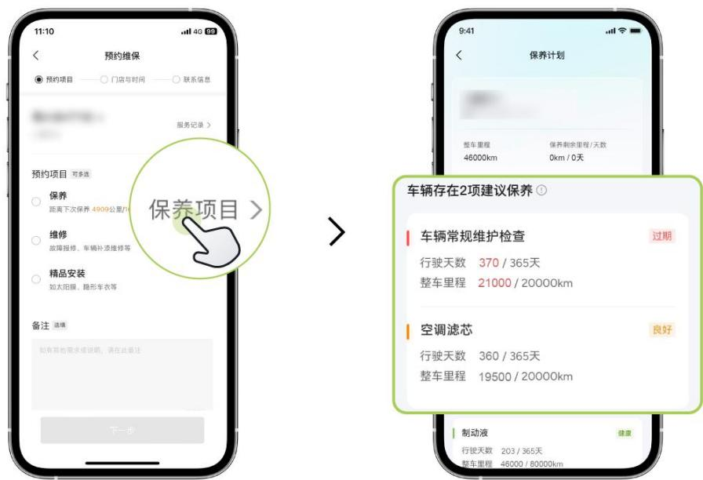

## MONA L03 纯电版保修/保养手册

## 一、有限质量保证

## 1.质量保证范围

本《保修/保养手册》适用于用户在中华人民共和国境内（不含香港特别行政区、澳门特别行政区及台湾地区）购买和使用的小鹏车型。在本手册下文所规定的有限质量保证期限（有限质量保证期）内，如因产品质量问题（即产品设计、制造或原材料缺陷）而引起损坏的，小鹏汽车将提供对该损坏的保修服务（“三包免责条款”规定的项目除外），并承担由此产生的零部件费用、维修工时费用和其它经小鹏汽车确认的合理费用（指小鹏汽车服务中心授权人员的救援和上门服务费用、合理的交通费用补偿）。

## 2.质量保证期限

本手册规定的车辆有限质量保证期分为关键零部件保修期、易损耗零部件保修期、整车保修期等不同的有限质量保证期限，时间与里程数以先到者为准，详见以下表格:

<table><tr><td>分类</td><td>内容</td><td>有限质量保证期限</td></tr><tr><td>关键零部件</td><td>动力电池及管理系统、驱动电机及其控制器</td><td>96 个月或 160,000 公里</td></tr><tr><td rowspan="2">易损耗零部件</td><td>雨刮片</td><td>6 个月或 10,000 公里</td></tr><tr><td>遥控器电池、空调滤芯、制动摩擦片、轮胎、保险丝及普通继电器(不含集成控制单元)</td><td>12 个月或 20,000 公里</td></tr><tr><td>整车</td><td>关键零部件、易损耗零部件之外的整车原车零部件</td><td>非营运车:60 个月或120,000 公里营运车:36 个月或60,000 公里</td></tr></table>

## 3. 保修期说明：

关键零部件保修期、易损耗零部件保修期及整车保修期均从交付日期开始计算，时间或里程以先到者为准。如有单独约定质量保证期限的附件或精品件，以约定质量保证期限为准。用户车辆的使用性质有进行过变更登记的，则车辆整车保修期一律按营运车执行。擅自修改车辆行驶里程参数的，以车辆实际行驶里程参数作为小鹏汽车履行质保义务的标准。

家用汽车产品的三包有效期为 24 个月或行驶里程 $5 0 { , } O O O$ 公里（以交付日期开始计算，时间或里程以先到者为准）。家用汽车产品指消费者为生活消费需要而购买和使用的乘用车和皮卡车。在三包有效期内，如果家用汽车产品的故障符合国家或地方强制性法规中的更换或退货条件，用户可以凭《三包凭证》和购车发票等有效凭证向小鹏汽车申请更换或退货。

## 4.所有权转移

本手册所规定的车辆有限质量保证不受车辆所有权的转移而发生变化，但仍应以该车辆首位车主的交付之日为起点计算车辆剩余有限质量保证期。

## 二、更换零部件的有限质量保证

小鹏汽车为维护车辆的安全与性能而推荐用户购买和使用的，并且在小鹏汽车服务中心（以下简称“服务中心”）更换的原厂零部件（即小鹏汽车提供或者认可的零部件），享有零部件有限质量保证服务。在零部件的有限质量保证期限（“零部件有限质量保证期”）内，零部件在车辆正常使用情况下出现零部件的设计、制造或原材料缺陷质量问题的，小鹏汽车将对前述零部件提供保修服务。更换的零部件根据不同的零部件更换情形而相应具有不同的更换零部件有限质量保证期，具体包括：

## 1.非因质量原因更换的原厂零部件

非因零部件的设计、制造或原材料缺陷质量问题在服务中心更换的原厂零部件，享有自服务中心维修工单结算之日起 12 个月或行驶里程 ${ 2 0 , 0 0 0 }$ 公里的零部件有限质量保证期，雨刮片的有限质量保证期为自维修工单结算之日起 6 个月或行驶里程 ${ \mathcal { 1 0 } } { \mathcal { O 0 0 } }$ 公里，以上时间或里程以先到者为准。

## 2.因质量原因更换的原厂零部件

因零部件的设计、制造或原材料缺陷质量问题在小鹏汽车服务中心免费更换的原厂零部件的零部件有限质量保证期，与被更换零部件的剩余的有限质量保证期相一致，并随被更换零部件的剩余有限质量保证期的结束而结束。

## 三、三包免责条款

由下列情形导致的故障或连带损坏将不能享受质量担保服务（以下简称“质保”）:

1. 顾客购买时已经被书面告知存在不违反法律、法规或者强制性国家标准的瑕疵。

2. 未按照《用户手册》要求，使用、维护、保养而造成的损坏。

3. 汽车被用于非家用用途包括不限于试验、比赛竞技、表演娱乐、军事行动、征用等。

4. 《用户手册》中明示不得改装、调整、拆卸的系统或零部件，但顾客自行改装、调整、拆卸而造成损坏的。

5. 发生产品质量问题，顾客自行处置不当而造成损坏的。

6. 因不可抗力、超出生产厂家控制的因素：

意外事故、人为因素或自然灾害等环境因素或其它不可抗力造成的损坏或间接损坏。

因使用环境超出产品正常使用条件导致的故障（如环境电磁干扰导致遥控距离变短、不起作用等）。

由于自然磨损引起的零部件消耗。

超出质保期限的故障。

动力电池容量正常衰减。

人为或意外发生的碰撞、水浸等引起动力电池的损坏。

附加及间接费用，不属于小鹏汽车承担责任的范围，例如：

a.无法使用车辆造成的经济和时间损失。

b.储存或车辆租借费用。

c.寄宿、就餐及其它沿途费用等。

7. 其它并非是由于车辆产品质量问题而导致车辆损坏的。

## 四、争议处理

如您所购的小鹏家用汽车产品，对其三包责任有任何疑问，请联系小鹏汽车服务中心或销售服务店，也可以联系小鹏汽车官方客服（电话 400-783-6688）/小鹏汽车 APP-服务-鹏管家专属服务群协助处理。小鹏汽车销售服务店将根据《家用汽车产品修理、更换、退货责任规定》第三十四条之规定与您协商解决。

## 五、质量保证相关注意事项

## 1.质量保证凭证

a.如遇《三包凭证》丢失，用户应及时向小鹏汽车申请补办，补办后，用户可以继续享受相关保修服务。

b.购车发票、《三包凭证》以及维修工单等是用户享受保修服务的重要证明资料，小鹏汽车提醒用户妥善保管，以防丢失、损坏。

## 2.维修保养记录

若用户的车辆进行了某些维修或保养项目，用户应保留好相关的合法凭证，它将是证实用户已经按照《用户手册》要求正确进行了相关维修或保养的重要依据。

## 3.维修时间

用户的车辆在小鹏汽车服务中心进行维修时，请给予服务中心合理充分的时间，服务中心会尽快维修并将维修后的车辆交还给用户。

## 4.维修方案

在符合相关法律法规的前提下，小鹏汽车及其服务中心有权根据技术要求和用户车辆的实际情况决定具体的修理或更换零部件的维修方案，并且在保修服务过程中被更换下的零部件归小鹏汽车所有。

## 5.产品变更

小鹏汽车保留对车辆进行设计变更的权利，且没有义务对其已经销售的车辆执行任何相同或类似的变更。

## 6.召回活动

进行产品召回时，小鹏汽车将根据产品的缺陷提供合理的维修方案。一般情况下，通过修理或更换零部件即能解决问题。为了能够尽快地消除车辆的缺陷、保障用户的行驶安全，用户应在收到小鹏汽车召回通知或通过官方渠道获知相关召回信息后，积极配合小鹏汽车及其服务中心，以便其提供与召回相关的维修服务。

## 7.其他事项

本车是智能电动汽车，包括很多先进的科技，因此用户应在使用车辆前认真阅读《用户手册》，并遵从前述手册的要求使用和保养车辆。用户在非小鹏汽车服务中心对车辆进行紧急维修之前，应事先与小鹏汽车联系。

如果用户对本手册中与质量保证有关的用户权利或义务内容有任何疑问，可直接联系小鹏汽车。

## MONA L03 超级增程版保修/保养手册

## 一、有限质量保证

## 1.质量保证范围

本《保修/保养手册》适用于用户在中华人民共和国境内（不含香港特别行政区、澳门特别行政区及台湾地区）购买和使用的小鹏车型。在本手册下文所规定的有限质量保证期限（有限质量保证期）内，如因产品质量问题（即产品设计、制造或原材料缺陷）而引起损坏的，小鹏汽车将提供对该损坏的保修服务（“三包免责条款”规定的项目除外），并承担由此产生的零部件费用、维修工时费用和其它经小鹏汽车确认的合理费用（指小鹏汽车服务中心授权人员的救援和上门服务费用、合理的交通费用补偿）。

## 2.质量保证期限

本手册规定的车辆有限质量保证期分为关键零部件保修期、易损耗零部件保修期、整车保修期等不同的有限质量保证期限，时间与里程数以先到者为准，详见以下表格:

<table><tr><td>分类</td><td>内容</td><td>有限质量保证期限</td></tr><tr><td>关键零部件</td><td>动力电池及管理系统、驱动电机及其控制器</td><td>96个月或160,000公里</td></tr><tr><td rowspan="3">易损耗零部件</td><td>雨刮片</td><td>6个月或10,000公里</td></tr><tr><td>增程器机油滤清器</td><td>12个月或10,000公里</td></tr><tr><td>遥控器电池、空调滤芯、空气滤芯、制动摩擦片、轮胎、保险丝及普通继电器(不含集成控制单元)、火花塞</td><td>12个月或20,000公里</td></tr><tr><td>整车</td><td>关键零部件、易损耗零部件之外的整车原车零部件</td><td>非营运车:60个月或120,000公里营运车:36个月或60,000公里</td></tr></table>

## 3. 保修期说明：

关键零部件保修期、易损耗零部件保修期及整车保修期均从交付日期开始计算，时间或里程以先到者为准。如有单独约定质量保证期限的附件或精品件，以约定质量保证期限为准。用户车辆的使用性质有进行过变更登记的，则车辆整车保修期一律按营运车执行。擅自修改车辆行驶里程参数的，以车辆实际行驶里程参数作为小鹏汽车履行质保义务的标准。

家用汽车产品的三包有效期为 24 个月或行驶里程 $5 0 { , } O O O$ 公里（以交付日期开始计算，时间或里程以先到者为准）。家用汽车产品指消费者为生活消费需要而购买和使用的乘用车和皮卡车。在三包有效期内，如果家用汽车产品的故障符合国家或地方强制性法规中的更换或退货条件，用户可以凭《三包凭证》和购车发票等有效凭证向小鹏汽车申请更换或退货。

## 4.所有权转移

本手册所规定的车辆有限质量保证不受车辆所有权的转移而发生变化，但仍应以该车辆首位车主的交付之日为起点计算车辆剩余有限质量保证期。

## 二、更换零部件的有限质量保证

小鹏汽车为维护车辆的安全与性能而推荐用户购买和使用的，并且在小鹏汽车服务中心（以下简称“服务中心”）更换的原厂零部件（即小鹏汽车提供或者认可的零部件），享有零部

件有限质量保证服务。在零部件的有限质量保证期限（“零部件有限质量保证期”）内，零部件在车辆正常使用情况下出现零部件的设计、制造或原材料缺陷质量问题的，小鹏汽车将对前述零部件提供保修服务。更换的零部件根据不同的零部件更换情形而相应具有不同的更换零部件有限质量保证期，具体包括：

## 1.非因质量原因更换的原厂零部件

非因零部件的设计、制造或原材料缺陷质量问题在服务中心更换的原厂零部件，享有自服务中心维修工单结算之日起 12 个月或行驶里程 ${ 2 0 , 0 0 0 }$ 公里的零部件有限质量保证期，雨刮片的有限质量保证期为自维修工单结算之日起 6 个月或行驶里程 ${ \mathcal { 1 0 } } { \mathcal { O 0 0 } }$ 公里,增程器机油滤清器的有限质量保证期为自维修工单结算之日起12个月或行驶里程 ${ \mathcal { 1 0 } } { \mathcal { O 0 0 } }$ 公里，以上时间或里程以先到者为准。

## 2.因质量原因更换的原厂零部件

因零部件的设计、制造或原材料缺陷质量问题在小鹏汽车服务中心免费更换的原厂零部件的零部件有限质量保证期，与被更换零部件的剩余的有限质量保证期相一致，并随被更换零部件的剩余有限质量保证期的结束而结束。

## 三、三包免责条款

由下列情形导致的故障或连带损坏将不能享受质量担保服务（以下简称“质保”）:

1. 顾客购买时已经被书面告知存在不违反法律、法规或者强制性国家标准的瑕疵。

2. 未按照《用户手册》要求，使用、维护、保养而造成的损坏。

3. 汽车被用于非家用用途包括不限于试验、比赛竞技、表演娱乐、军事行动、征用等。

4. 《用户手册》中明示不得改装、调整、拆卸的系统或零部件，但顾客自行改装、调整、拆卸而造成损坏的。

5. 发生产品质量问题，顾客自行处置不当而造成损坏的。

6. 因不可抗力、超出生产厂家控制的因素：

意外事故、人为因素或自然灾害等环境因素或其它不可抗力造成的损坏或间接损坏。

因使用环境超出产品正常使用条件导致的故障（如环境电磁干扰导致遥控距离变短、不起作用等）。

由于自然磨损引起的零部件消耗。

超出质保期限的故障。

动力电池容量正常衰减。

人为或意外发生的碰撞、水浸等引起动力电池的损坏。

附加及间接费用，不属于小鹏汽车承担责任的范围，例如：

a.无法使用车辆造成的经济和时间损失。

b.储存或车辆租借费用。

c.寄宿、就餐及其它沿途费用等。

7. 其它并非是由于车辆产品质量问题而导致车辆损坏的。

## 四、争议处理

如您所购的小鹏家用汽车产品，对其三包责任有任何疑问，请联系小鹏汽车服务中心或销售服务店，也可以联系小鹏汽车官方客服（电话 400-783-6688）/小鹏汽车 APP-服务-鹏管家专属服务群协助处理。小鹏汽车销售服务店将根据《家用汽车产品修理、更换、退货责任规定》第三十四条之规定与您协商解决。

## 五、质量保证相关注意事项

## 1.质量保证凭证

a.如遇《三包凭证》丢失，用户应及时向小鹏汽车申请补办，补办后，用户可以继续享受相关保修服务。

b.购车发票、《三包凭证》以及维修工单等是用户享受保修服务的重要证明资料，小鹏汽车提醒用户妥善保管，以防丢失、损坏。

## 2.维修保养记录

若用户的车辆进行了某些维修或保养项目，用户应保留好相关的合法凭证，它将是证实用户已经按照《用户手册》要求正确进行了相关维修或保养的重要依据。

## 3.维修时间

用户的车辆在小鹏汽车服务中心进行维修时，请给予服务中心合理充分的时间，服务中心会尽快维修并将维修后的车辆交还给用户。

## 4.维修方案

在符合相关法律法规的前提下，小鹏汽车及其服务中心有权根据技术要求和用户车辆的实际情况决定具体的修理或更换零部件的维修方案，并且在保修服务过程中被更换下的零部件归小鹏汽车所有。

## 5.产品变更

小鹏汽车保留对车辆进行设计变更的权利，且没有义务对其已经销售的车辆执行任何相同或类似的变更。

## 6.召回活动

进行产品召回时，小鹏汽车将根据产品的缺陷提供合理的维修方案。一般情况下，通过修理或更换零部件即能解决问题。为了能够尽快地消除车辆的缺陷、保障用户的行驶安全，用户应在收到小鹏汽车召回通知或通过官方渠道获知相关召回信息后，积极配合小鹏汽车及其服务中心，以便其提供与召回相关的维修服务。

## 7.其他事项

本车是智能电动汽车，包括很多先进的科技，因此用户应在使用车辆前认真阅读《用户手册》，并遵从前述手册的要求使用和保养车辆。用户在非小鹏汽车服务中心对车辆进行紧急维修之前，应事先与小鹏汽车联系。

如果用户对本手册中与质量保证有关的用户权利或义务内容有任何疑问，可直接联系小鹏汽车。

## 保养指南

## 一、保养的必要性

1. 为保证车辆的正常使用和良好的驾乘感受，确保车辆高效和可靠，并降低可能发生的维修费用，对车辆进行日常维护和定期保养是十分必要的。

2. 对于《用户手册》中所明确规定的可由用户自行完成车辆的日常维护项目，用户可按照《用户手册》的相关说明完成车辆的日常维护。

3. 考虑到车辆的系统复杂性以及国家法律法规对新能源汽车的严格售后服务要求，小鹏汽车强烈建议用户在小鹏汽车服务中心完成车辆的定期保养。

4. 如果用户对于如何保养车辆存有疑问，可直接与小鹏汽车联系。

## 二、日常维护和注意事项

日常维护是保证行车安全与减少车辆故障非常重要的措施，用户在行车前应注意以下项目，如发现异常请及时与小鹏汽车联系。

a.续航里程和放电深度有关。为避免放电过深而影响动力电池的性能，建议您在发现车内仪表有低电量警告灯报警时及时充电。

b.车辆实际续航里程会随着车龄的增加有所降低。

c.空调的使用会降低整车续航里程。

d.极端温度和低电量下，由于动力电池特性，可能会出现加速无力、动力不足的情况。

e.定期对车辆进行保养。

f.保持胎压正常。

g.尽量少在高温或严寒气候下使用车辆。

h.冬天使用车辆完毕后，不要停放太久，应尽快充电。

i.去除掉不必要的物品，以减轻车辆负载。

j.必要时，关闭空调等大功率电器设备或调整制热或制冷的温度，以减少大功率用电器消耗的能量，增加续航里程。

k.在高车速下，关闭车窗，以降低空气阻力，减少电耗。

l.保持车辆匀速行驶，减少急加速，急制动。

m.加速时，尽量轻踩加速踏板。

## 三、定期保养

1.车辆保养包含首保、整车基础保养和增程器（如装配有）保养。定期保养对保证车辆在良好状态、降低使用成本与延长车辆使用寿命非常重要，强烈建议用户按照《用户手册》要求定期到小鹏汽车服务中心对车辆进行全方位的检查与保养。

2.您可以在小鹏汽车App"服务-预约维保-保养项目"界面，查看下次保养时间和每个零件健康状态：

a.绿色表示处于健康状态，可以继续使用。

b.黄色表示临近到期，建议更换。

c.红色表示达到使用零件使用寿命，必须更换。

保养项目是根据车辆正常行驶情况下制定，对于经常在恶劣条件下使用的车辆，应增加保养频率，具体事宜请联系小鹏汽车及其服务中心：

a.在高尘土的环境中行驶。

b.在严寒（0℃以下）或高温（40℃以上）的环境下行驶。

c.在潮湿环境下行驶或经常涉水。

d.在多盐或腐蚀性材料路面上行驶。

e.频繁制动或在多山地区行驶。

f.从事营运性活动，或经常用于高负荷使用等特殊用途。

g.从事赛车或竞技类活动。

h.加装或改装导致车辆运行条件变化的。