## 朗逸系列车型

使用维护说明书本说明书适用于下列表中各种型号的上汽大众朗逸系列车型用户在使用本公司产品以前，必须认真阅读本使用维护说明书，阅读后需妥善保存，任何不当的使用、保养和修理都可能导致车辆的损坏及影响质量担保服务。因此，在使用产品前请认真阅读本使用维护说明书，并对照表中的型号确认您的车型。

<table><tr><td>型号</td><td>发动机</td><td>变速箱</td></tr><tr><td>SVW71417AL</td><td>CST</td><td>五挡手动变速器</td></tr><tr><td>SVW71417BL</td><td>CST</td><td>七挡自动变速器</td></tr><tr><td>SVW71617AM</td><td>CSR</td><td>五挡手动变速器</td></tr><tr><td>SVW71617BM</td><td>CSR</td><td>六挡自动变速器</td></tr><tr><td>SVW71217BN</td><td>CYA</td><td>七挡自动变速器</td></tr><tr><td>SVW7167NMD</td><td>CUC</td><td>五挡手动变速器</td></tr><tr><td>SVW71617GM</td><td>CSR</td><td>五挡手动变速器</td></tr><tr><td>SVW71617HM</td><td>CSR</td><td>六挡自动变速器</td></tr><tr><td>SVW71217AN</td><td>CYA</td><td>五挡手动变速器</td></tr><tr><td>SVW71417CL</td><td>CST</td><td>五挡手动变速器</td></tr><tr><td>SVW71417GL</td><td>CSS</td><td>七挡自动变速器</td></tr><tr><td>SVW71217CN</td><td>CYA</td><td>七挡自动变速器</td></tr><tr><td>SVW71417HL</td><td>CSS</td><td>七挡自动变速器</td></tr><tr><td>SVW71417JL</td><td>CST</td><td>五挡手动变速器</td></tr><tr><td>SVW71417KL</td><td>CST</td><td>七挡自动变速器</td></tr><tr><td>SVW71617LM</td><td>CSR</td><td>五挡手动变速器</td></tr><tr><td>SVW71617MM</td><td>CSR</td><td>六挡自动变速器</td></tr><tr><td>SVW71617RM</td><td>CSR</td><td>五挡手动变速器</td></tr><tr><td>SVW71617SM</td><td>CSR</td><td>六挡自动变速器</td></tr><tr><td>SVW7157AFD</td><td>DLF</td><td>五挡手动变速器</td></tr><tr><td>SVW71517AF</td><td>DLF</td><td>五挡手动变速器</td></tr><tr><td>SVW71517BF</td><td>DLF</td><td>六挡自动变速器</td></tr><tr><td>SVW71517CF</td><td>DLF</td><td>五挡手动变速器</td></tr><tr><td>SVW71517DF</td><td>DLF</td><td>六挡自动变速器</td></tr></table>

企业标准号：Q/JQAB 167-2015 Q/JQAB 166-2015 Q/JQAB 171-2015 Q/JQAB 174-2015 Q/JQAB 180-2015 Q/JQAB 181-2015 (Q31/0114000127C006-2015) Q/JQAB 195-2016(Q31/0114000127C024-2016) Q/JQAB 196-2016(Q31/0114000127C035-2016) Q/JQAB 211-2017 Q/JQAB 226-2018 Q/JQAB 289-2019 Q/JQAB 290-2019 Q/JQAB 299-2019

本使用维护说明书描述了该车型车辆在当前范围的配置、功能及操作的一般通用信息，但用户车辆的实际配置和功能等信息以具体交付时的为准。

本公司将持续对各种车型进行改进，各车型在外形、配置、功能和结构设计等方面也可能随时会发生变化，故本公司有权在法律法规允许的范围内对本说明书有关版本进行更改，补充，若用户对此有疑义请及时拨打上汽大众客户服务热线400-820-1111 予以咨询。

未经本公司书面同意，不得复制、翻译或摘录本使用维护说明书。

上汽大众汽车有限公司依法保留对本说明书有关版本进行更改、补充等的一切权利。中国印刷。上汽大众汽车有限公司公司地址：中国上海安亭于田路公司电话：59561888邮政编码：201805

## 亲爱的用户

亲爱的车主朋友：

感谢您对上汽大众的信任与厚爱！

在您选择了上汽大众产品的同时，您已经启动了全新的汽车生活之旅。在整个旅行过程中，上汽大众和旗下900多家大众品牌特许销售商/特约维修站都将始终陪伴您左右。衷心希望您的每一天行车生活，都因有上汽大众的同行而更精彩！如果您对车辆使用有任何疑问，上汽大众经销商随时随地为您提供帮助，我们的上汽大众客户服务中心全国统一寻呼 400-820-1111 也将是您的坚强后盾。

2005年10月18日，上汽大众正式发布了

“Techcare”服务品牌。2014年9月，上汽大众以“匠心·挚诚”重新定义售后服务，将其作为上汽大众售后服务品牌的全新服务理念。依托业界领先的售后服务体系，逐年稳步推出了11项服务产品和承诺，确保您在享受到上汽大众产品带来的一流驾乘感受的同时，更能亲身体验完善、强大的售后服务体系为您提供的悉心呵护。

随着大众品牌客户群规模的不断壮大，上汽大众更加着力加强客户对增值服务的感知。加入上汽大众的大家庭，不仅有四季关爱服务活动为您提供差异化保养维护增值服务；爱车课堂为您全方位提供形象统一、内容权威的用车养车指导服务；原装附件为您带来精彩纷呈的产品，不断丰富您的用车生活；您更可在大众一家·上汽大众俱乐部、上汽大众官网 www.svw-volkswagen.com 车主中心版块、上汽大众大众品牌官方微博与志同道合的车主会员分享精彩的有车生活。

祝您驾驶愉快！

上汽大众汽车有限公司

## 敬告用户

● 本公司为您提供质量担保服务，同时要求您严格按照本书要求使用您的车辆，请认真阅读本书“质量担保服务”一章，其中详述了质量担保服务的条件、范围和方法。

● 消费者对本公司产品自行进行各种改装或加装各种设备，尤其是对电器、制动、转向等涉及产品安全的系统进行改装或加装其他设备，可能会影响车辆的性能、安全系统，导致发生事故、车辆着火及车辆损坏。本公司及其经销商对由此引起的产品质量问题，将不承担责任。

● 本公司为产品设定了不同阶段的维护保养规定，其中首次保养免费。上述设定的维护保养对您安全使用车辆和使车辆始终保持良好状态都非常重要。如果未按照本说明书要求正确使用、维护和保养，本公司将不承担质量担保义务。

● 请保存好合格证，二维条码处不得皱褶破损。

● 您的车辆如果在使用中发现问题，建议经由上汽大众经销商进行检修。在检修过程中本公司或上汽大众经销商有权根据情况，决定在修理或更换零部件的范围内进行维修。

● 本书“自己动手”一章向您介绍本公司允许用户可以自己动手的范围，请您使用由本公司提供的零部件产品（简称：原装零件），并到上汽大众经销商购买上汽大众“原装零件”。任何使用非“原装零件”而导致的直接或间接损失，本公司将不承担责任。

● 本公司不办理邮寄零件、工具等服务，务必请您注意。

● 您购车后请仔细核对车辆合格证及购车发票等，如发现问题请立即与上汽大众经销商或本公司联系。

● 如果您在仔细阅读本书过程中遇有不清楚的地方，本公司及上汽大众经销商会向您作更详细的解释。

祝您驾驶愉快！

## 质量担保条例

质量担保期：从本公司正常售出的新车的质量担保期自车辆交付之日起计，出租/营运车辆\*为一年或行驶里程十万公里，非出租/非营运车辆为三年或行驶里程十万公里，时间数和里程数两者以先到达者为准。在质量担保期内，用户所购车辆出现生产质量问题，由上汽大众相应品牌经销商予以免费修理。质量担保期内，生产质量问题经本公司确认技术上无法修理时，则予以更换车辆。如用户购买车辆符合国家《家用汽车产品修理、更换、退货责任规定》所规定的条件，则车辆质量担保期限以及质量担保内容和范围按该规定执行。

用户应严格按照《使用维护说明书》规定使用自己的车辆。为了保证修理质量、确保用户的质量担保权利，请用户按时在上汽大众相应品牌经销商处对车辆进行保养及检修。因用户未按照《使用维护说明书》要求正确使用、维护、修理产品，而造成损坏的，上汽大众及其经销商可以不承担相应的质量担保责任。

如果用户车辆在使用中出现故障，只有上汽大众相应品牌经销商有权受理质量担保申请，而且故障一旦出现，应立即前往上汽大众相应品牌经销商进行检修或及时与上汽大众相应品牌经销商联系。

新车质量担保期的起始日期是车辆交付日期，其有效凭证为用户购车发票，发票开具日期与交付家用汽车日期不一致的，自交付之日起计算。用户在要求质量担保服务时，应当向上汽大众相应品牌经销商出示购车发票。没有这一证明，上汽大众相应品牌经销商将无法向用户车辆提供相应的质量担保服务。

质量担保服务范围包括根据技术要求调换或维修损坏的零部件，如果零部件通过维修可以继续使用的话，则从常规和技术的角度来看，不必要进行更换。用于更换的零部件可采用由上汽大众提供的新的或再制造的零部件。

维修过程中换下的零部件归本公司所有。

质量担保维修工作所产生的工时及材料费用由本公司承担。

凡有下列原因造成的损坏或故障均不属于质量担保范围：

——不当的保养及维修造成的损坏

——已装上未经本公司许可的零部件或未经本公司许可对车辆作了改装、加装、拆卸

——用户未严格遵守车辆的使用规定（说明书中的要求）

——因发生交通事故而造成车辆实际或潜在的损坏车辆零部件自然磨损、车辆的使用条件超出本说明书规定范围引起的损坏不属于质量担保范围。同样，使用了不符合标准或规定要求的油料或燃料、以非法方式使用、使用不当或滥用（如用于货运，用作赛车、试验用车等）所造成的损坏、损失也不属于质量担保范围，即使在质量担保期内。

车辆部分零部件属于易损件，其中空气滤清器、空调滤清器、机油滤清器、燃料滤清器、火花塞、制动衬片、离合器片、轮胎、遥控器电池、灯泡、刮水器刮片等易损件的质量担保期为六个月或行驶里程一万公里；蓄电池、保险丝及普通继电器（不含集成控制单元）的质量担保期为十二个月或两万公里。时间数和里程数两者以先到达者为准。

另外一些调整和测量工作是不属于质量担保范围的，具体内容如下：

调整车门、行李厢盖以保证良好的接触，避免可能的泄漏和风噪

——车轮定位、轮胎平衡、油耗测量及发动机调整工作

用户车辆在购买后质量担保期内发生质量问题而更换的原装零件（易损件除外），质量担保期随整车的质量担保期结束而结束。

用户车辆在上汽大众相应品牌经销商进行正常修理（用户付费）更换的本公司原装零件（易损件除外），从更换之日起，享有十二个月的质量担保服务。

法律法规没有明确规定的义务以及用户违反本《使用维护说明书》明确规定的使用规范而造成的损失，本公司不予承担。

如需要《车主关于汽车产品缺陷的报告》，请致电上汽大众客户服务热线:400-820-1111索取，或登陆 www.csvw.com 或 www.qiche365.org.cn 下载，谢谢！

\*出租/营运车辆包括但不限于出租车、租赁车、驾校培训用车辆。

# 上汽大众大众一家会员俱乐部

诚邀阁下加入上汽大众大众一家会员俱乐部！

作为上汽大众大众品牌唯一官方会员组织，大众一家会员俱乐部自2005年成立以来致力于为会员打造覆盖用车生活的全方位尊贵服务与专属体验，为会员搭建交流分享的社区平台，推出卡券权益、V豆福利、专属活动等丰富权益。

敬请扫描下方二维码，诚邀您注册入会，绑定爱车，智慧出行。更全面的养车用车交流，更多的精彩福利活动、卡券权益、V豆福利，等您来领取。

大众一家，连接你我！

24 小时服务热线：400-820-1111（节假日无休）

大众一家会员俱乐部官方网站: http://club.svw-volkswagen.com

扫码下载上汽大众超级App并入会绑车（含车联功能） 扫码关注上汽大众大众品牌官方微信公众号并入会绑车

<table><tr><td>会员权益简述</td><td>会员权益具体描述</td></tr><tr><td>获取V豆/电子券</td><td>成功推荐购车可累积消费V豆成功推荐试驾可累积消费V豆参与App社区签到可累积消费V豆参与App社区互动可累积消费V豆维修保养可累积定级V豆通过指定页面激活智慧车联系统或使用APP或智慧车联服务或购买智慧车联商品可累积消费V豆参加“薅羊毛养车”可累积消费V豆参加上汽大众大众品牌活动可累积消费V豆俱乐部不定期向会员发放维修保养电子券俱乐部不定期向会员发放俱乐部福利券</td></tr><tr><td>兑换V豆/电子券</td><td>在经销商处使用定级V豆/消费V豆/电子券抵扣新车车款在经销商处使用定级V豆/消费V豆/电子券抵扣消费费用(仅限车主会员)通过上汽大众超级APP兑换周边在上汽大众官方商城使用定级V豆/消费V豆/电子券兑换产品兑换充电卡在上汽大众大众品牌官方微信/官网使用V豆兑换权益赢取活动资格</td></tr><tr><td>专属活动</td><td>参加新车上市发布会或品牌活动参加新车试驾会参观上汽大众生产基地车展观展会员专属活动</td></tr></table>

\*会员权益将不定期调整和升级，APP/微信/网站可查询最新权益，请以线上展示为准。

## 电子首保卡服务

为了给您提供更好地服务体验，上汽大众推出了电子首保卡服务，您可以通过上汽大众官方APP或微信公众号，获取该服务：

上汽大众官方 APP：

1.扫描“上汽大众超级APP”官方下载二维码或搜索应用；

2.完成注册，进入“我的”管理“我的爱车”，绑定车辆，成为大众一家认证会员；

3.成功入会之后，点击“我的卡券”，查看“爱车券”，点击对应车辆的可用券“查看全部”；

4.在“可用”卡券中查看电子首保卡与激活码。

上汽大众官网微信公众号：

1.扫描“上汽大众大众品牌”官方公众号二维码或搜索公众号；

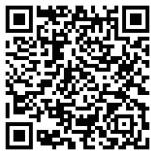

2.关注公众号，进入注册页面，完成会员认证，绑定车辆，成为大众一家会员；

3.成功入会之后，点击菜单“大众一家”，进入“我的钱包”；

4.在“可用”卡券中查看电子首保卡与激活码。 

## 售后服务

秉承“售后服务先行”的发展战略，上汽大众汽车有限公司多年来在服务网络建设、服务组织标准化管理、客户服务等各方面不断创新。我们拥有完善的服务体系、严谨的服务标准、丰富的服务产品、高效的售后服务组织。在中国我们拥有 900多家大众品牌特许销售商/特约维修站、为全国广大上汽大众客户提供售后服务。

在聚焦客户需求的基础上，我们始终践行

“Techcare”售后服务品牌的理念，将“匠心•挚诚”的品牌精神贯穿于售后服务全过程，为每一个客户提供优质的售后服务。

同时依靠客户服务中心构建起高效率的用户接触平台，让我们能倾听每一个用户的声音，如果您有问题、建议和意见，可及时联系我们。

上汽大众客户服务热线：400-820-111

## 关于本用户手册

本手册中描述了所有装备和车型，没有标出特殊装备或衍变车型。因此所描述的装备可能在本车上未安装或仅在某些市场提供。本车装备信息请查阅销售资料（购车合同或车辆配置表），并请检验实车，与此相关的详细信息敬请垂询上汽大众经销商。

本用户手册中的所有数据以定稿时的信息状态为准。为满足客户的需求以及符合法规的要求，上汽大众对产品的配置及性能将持续进行优化和改进。

因此汽车与本用户手册中的说明之间可能存在偏差。各个数据、插图或说明均不能作为提出任何要求的依据。

● 如果未另加说明，方向说明如左、右、前、后通常指的是行驶方向。

● 插图用于帮助理解，也可视为原理图。

出售或出借本车时，请确保车内应始终备有整套随车资料。

## 符号说明

表示参阅某个章节内始终需遵守的带重要信息和安全提示  的段落。

表示本章节未完，接下页。

表示本章节已结束。

表示必须立即停车。

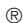

表示注册商标。没有这个标记并不意味着保证无偿使用。

这类符号表示参阅相同段落中或所示页面

上的警告说明，以提醒可能存在的事故和

受伤危险以及应该如何避免。

⇒  表示参阅该章节内或相应页面中的“提示”内容。

## 危险

带有这个符号的文字内容表示忽视时会导致死亡或重伤的危险情况。

## 警告

带有这个符号的文字内容表示忽视时可能会导致死亡或重伤的危险情况。

## 小心

带有这个符号的文字内容表示忽视时可能会导致轻伤或中等伤害的危险情况。

## ①提示

带有这个符号的文字内容表示若忽视时可能会导致汽车损坏的情况。

带有这个符号的文字内容包含关于环境保护的提示。

带有这个符号的文字内容包含附加信息。

## 图片说明

本手册的图片用于辅助说明，以帮助理解。

图片仅起示意作用，并非您所购车辆的真实图片，如有关碰撞安全的说明图片等。

## ① 提示

书中标明型号的图片和说明仅对该车型有效

## 目录

汽车概览 . . . . . . . . . . . . . . . . . . . . . . . . . . . . . . . . . . . . . . . . . . . . . . . . . . . . . . . . . . . . . . . . . . . . . . . . . . . . . . . . . . . . . . . . . . . . . . . . . . . . 11

外观视图
- 侧视图 . . . . . . . . . . . . . . . . . . . . . . . . . . . . . . . . . . . . . . . . . . . . . . . . . . . . . . . . . . . . . . . . . . . . . . . . . . . . . . . . . . . . . . . . . . . . . . . . . . . .. 11

- 前部视图 . . . . . . . . . . . . . . . . . . . . . . . . . . . . . . . . . . . . . . . . . . . . . . . . . . . . . . . . . . . . . . . . . . . . . . . . . . . . . . . . . . . . . . . . . . . . . . . . . 12

- 前部视图（部分车型） . . . . . . . . . . . . . . . . . . . . . . . . . . . . . . . . . . . . . . . . . . . . . . . . . . . . . . . . . . . . . . . . . . . . . . . . . . . . . . . . . . . . . . . . . . . . . . . . . . . - 13

- 尾部视图 . . . . . . . . . . . . . . . . . . . . . . . . . . . . . . . . . . . . . . . . . . . . . . . . . . . . . . . . . . . . . . . . . . . . . . . . . . . . . . . . . . . . . . . . . . . . . . . . 14

- 尾部视图（部分车型） . . . . . . . . . . . . . . . . . . . . . . . . . . . . . . . . . . . . . . . . . . . . . . . . . . . . . . . . . . . . . . . . . . . . . . . . . . . . . . . . . . . . . . . . . . . . 15

汽车内部空间
- 车门概览 . . . . . . . . . . . . . . . . . . . . . . . . . . . . . . . . . . . . . . . . . . . . . . . . . . . . . . . . . . . . . . . . . . . . . . . . . . . . . . . . . . . . . . . . . . . . . . . . . 16

- 驾驶员侧概览 . . . . . . . . . . . . . . . . . . . . . . . . . . . . . . . . . . . . . . . . . . . . . . . . . . . . . . . . . . . . . . . . . . . . . . . . . . . . . . . . . . . . . . . . . . . . . . . . . - 21

- 中控台概览 . . . . . . . . . . . . . . . . . . . . . . . . . . . . . . . . . . . . . . . . . . . . . . . . . . . . . . . . . . . . . . . . . . . . . . . . . . . . . . . . . . . . . . . . . . . . . . . . . .. 21

- 副驾驶员侧概览 . . . . . . . . . . . . . . . . . . . . . . . . . . . . . . . . . . . . . . . . . . . . . . . . . . . . . . . . . . . . . . . . . . . . . . . . . . . . . . . . . . . . . . . . . . . . . . . . 22

组合仪表
- 警告灯和指示灯 . . . . . . . . . . . . . . . . . . . . . . . . . . . . . . . . . . . . . . . . . . . . . . . . . . . . . . . . . . . . . . . . . . . . . . . . . . . . . . . . . . . . . . . . . . . . . . . . . . . : 23

- 信息显示 . . . . . . . . . . . . . . . . . . . . . . . . . . . . . . . . . . . . . . . . . . . . . . . . . . . . . . . . . . . . . . . . . . . . . . . . . . . . . . . . . . . . . . . . . . . . . . . . . . .  25

驾驶前 . . . . . . . . . . . . . . . . . . . . . . . . . . . . . . . . . . . . . . . . . . . . . . . . . . . . . . . . . . . . . . . . . . . . . . . . . . . . . . . . . . . . . . . . . . . . . . . . . . . ... 37

起步前
- 驾驶提示 . . . . . . . . . . . . . . . . . . . . . . . . . . . . . . . . . . . . . . . . . . . . . . . . . . . . . . . . . . . . . . . . . . . . . . . . . . . . . . . . . . . . . . . . . . . . . . . . . . . --- 37

- 技术数据 . . . . . . . . . . . . . . . . . . . . . . . . . . . . . . . . . . . . . . . . . . . . . . . . . . . . . . . . . . . . . . . . . . . . . . . . . . . . . . . . . . . . . . . . . . . . . . . . . . . — 39

打开和关闭
- 钥匙 . . . . . . . . . . . . . . . . . . . . . . . . . . . . . . . . . . . . . . . . . . . . . . . . . . . . . . . . . . . . . . . . . . . . . . . . . . . . . . . . . . . . . . . . . . . . . . . . . . . .
- 中央门锁和锁止系统 . . . . . . . . . . . . . . . . . . . . . . . . . . . . . . . . . . . . . . . . . . . . . . . . . . . . . . . . . . . . . . . . . . . . . . . . . . . . . . . . . . . . . . . . . . . . . . . . . . . -. 50

- 车门 . . . . . . . . . . . . . . . . . . . . . . . . . . . . . . . . . . . . . . . . . . . . . . . . . . . . . . . . . . . . . . . . . . . . . . . . . . . . . . . . . . . . . . . . . . . . . . . . . . .. 53

- 行李厢盖 . . . . . . . . . . . . . . . . . . . . . . . . . . . . . . . . . . . . . . . . . . . . . . . . . . . . . . . . . . . . . . . . . . . . . . . . . . . . . . . . . . . . . . . . . . . . . . . . . . . · 58

- 电动车窗升降器 . . . . . . . . . . . . . . . . . . . . . . . . . . . . . . . . . . . . . . . . . . . . . . . . . . . . . . . . . . . . . . . . . . . . . . . . . . . . . . . . . . . . . . . . . . . . . . . . . . .
- 天窗 . . . . . . . . . . . . . . . . . . . . . . . . . . . . . . . . . . . . . . . . . . . . . . . . . . . . . . . . . . . . . . . . . . . . . . . . . . . . . . . . . . . . . . . . . . . . . . . . . . .

正确和安全地就座
- 调整座椅位置 . . . . . . . . . . . . . . . . . . . . . . . . . . . . . . . . . . . . . . . . . . . . . . . . . . . . . . . . . . . . . . . . . . . . . . . . . . . . . . . . . . . . . . . . . . . . . . . . . . . 
- 车辆座椅参数 . . . . . . . . . . . . . . . . . . . . . . . . . . . . . . . . . . . . . . . . . . . . . . . . . . . . . . . . . . . . . . . . . . . . . . . . . . . . . . . . . . . . . . . . . . . . . . . . . . .

行李物品装载
- 驾驶提示 ..... 114
- 行李厢 ..... 116
实用装备
- 杂物箱 ..... 119
- 饮料罐托架 ..... 123
- 车载电源 ..... 126
- 灭火器支架 ..... 127
在行驶过程中 ..... 129
启动、换挡、驻车
- 点火开关 ..... 129
- 启动和关闭发动机 ..... 131
- 换挡 ..... 135
- 制动、停车和驻车 ..... 141
- 提高行驶经济性/降低环境污染 ..... 148
- OBD 系统 ..... 152
- 转向系统 ..... 154
驾驶员辅助系统
- 起步辅助系统 ..... 156
- 驻车距离报警系统 ..... 157
- 定速巡航装置 ..... 161
- Start-Stop 启停系统 ..... 164
- 被动式轮胎气压报警系统 ..... 167
空调
- 手动空调 ..... 169
- 自动空调 ..... 174
在加油站
- 加油 ..... 182
- 汽油 ..... 185
养护、清洁、维护 ..... 187
发动机舱内
- 在发动机舱中作业的准备工作 ..... 187
- 发动机机油 ..... 191
- 发动机冷却液 ..... 195
- 汽车蓄电池 ..... 198
- 喷油嘴 ..... 200
- 火花塞 ..... 201
- 前后悬架系统和转向系统 ..... 201
- 燃油胶管 ..... 201

\- 汽车保养 ..... 202
- 其他售后服务项目 ..... 207
汽车养护和维护
- 汽车外部养护和清洁 ..... 208
- 车内养护和清洁 ..... 215
- 车轮和轮胎 ..... 220
- 附件、零部件更换、维修和改装 ..... 228
- 发动机控制单元和废气净化装置 ..... 233
自己动手 ..... 235
实用提示
- 问题和回答 ..... 235
- 在紧急情况下 ..... 236
- 应急关闭或打开 ..... 238

\- 随车工具 ..... 241
- 更换车轮 ..... 243
- 保险丝 ..... 250
- 更换灯泡 ..... 253
- 应急启动 ..... 254
- 牵引启动和牵引 ..... 256
安装收音机
- 一般说明 ..... 260
无线电设备
- 一般说明 ..... 261
- 事件数据记录系统（Event Data Recorder） ..... 261

## 汽车概览外观视图

## 侧视图

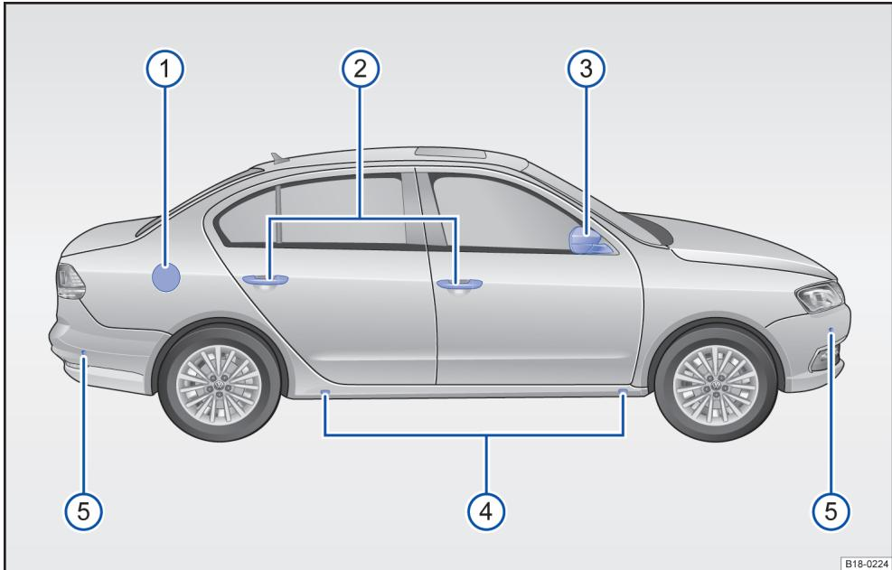

## 图 1 汽车侧面概览

$\Rightarrow$ 图 1 的图例:
① 油箱盖板 ..... 183
② 车门把手 ..... 58
③ 车外后视镜 ..... 111
- 转向信号灯 ..... 98
④ 汽车千斤顶的支撑点 ..... 247
⑤ 前后部驻车距离报警系统传感器 ..... 157

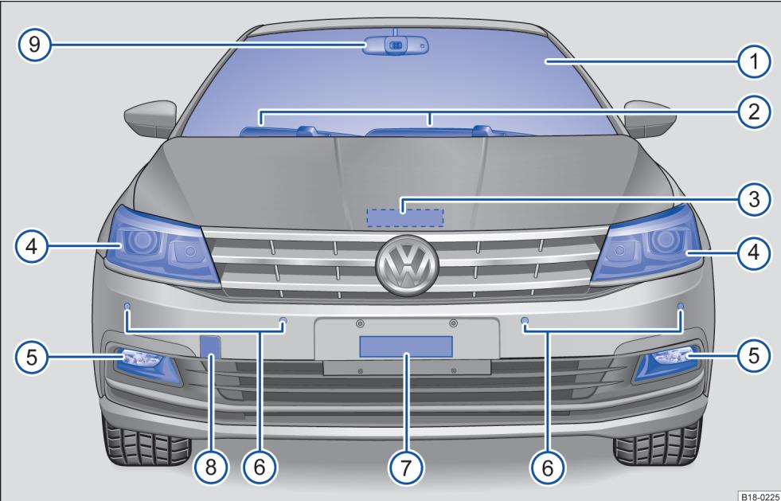

## 图 2 汽车前部视图

⇒图 2 的图例:
① 车窗玻璃
② 前部车窗玻璃刮水器 ..... 105
③ 发动机舱盖解锁拨杆 ..... 189
④ 前大灯 ..... 98
⑤ 前雾灯或弯道行车灯 ..... 98
⑥ 前部驻车距离报警系统传感器
⑦ 前部牌照支架
⑧ 盖板后的前部牵引环的支座 ..... 257
⑨ 后视镜座上的传感器，用于：
- 雨量传感器
- 光线传感器 ..... 108

## 前部视图（部分车型）

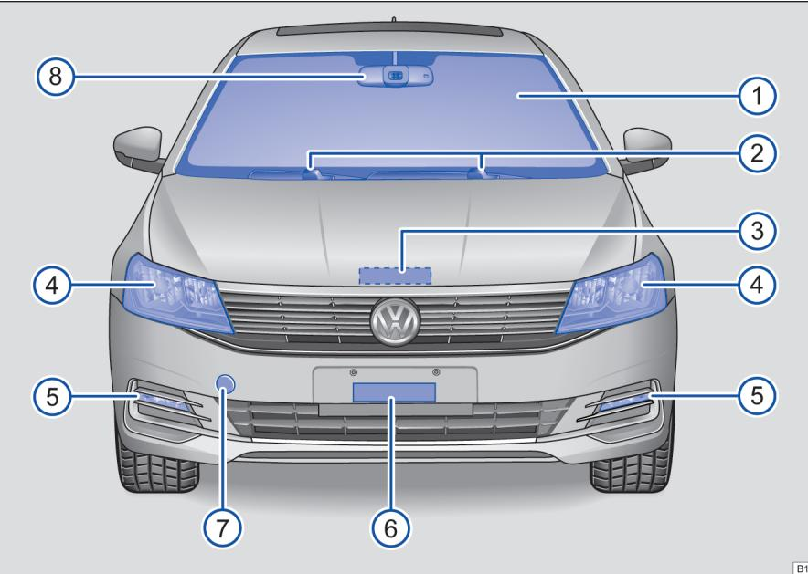

## 图 3 汽车前部视图(部分车型)

⇒图 3 的图例:
① 车窗玻璃
② 前部车窗玻璃刮水器 ..... 105
③ 发动机舱盖解锁拨杆 ..... 189
④ 前大灯 ..... 98
⑤ 前雾灯或弯道行车灯 ..... 98
⑥ 前部牌照支架
⑦ 盖板后的前部牵引环的支座 ..... 257
⑧ 后视镜座上的传感器，用于:
- 雨量传感器
- 光线传感器 ..... 108

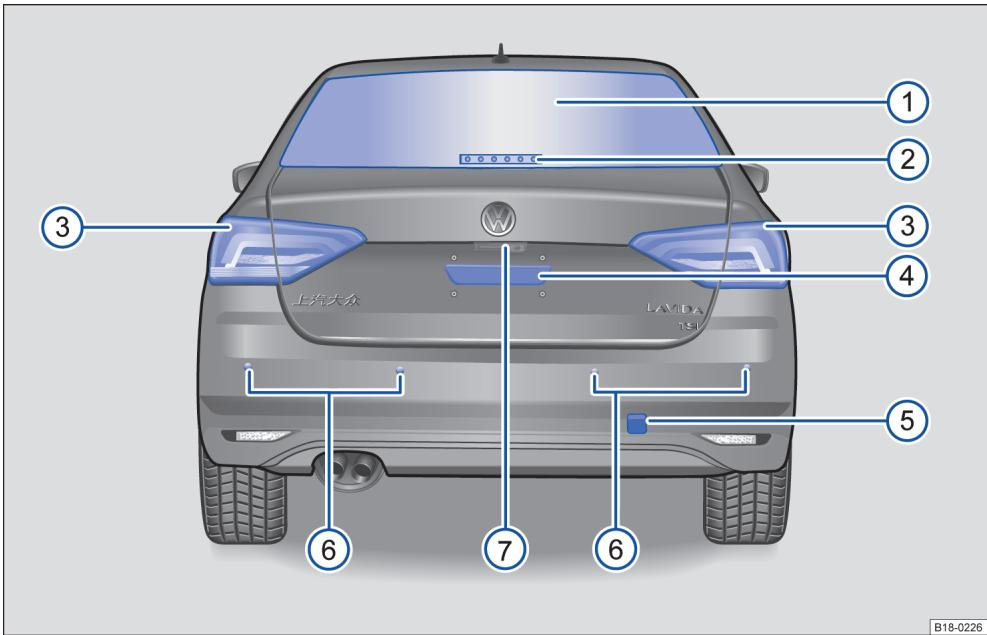  
图 4 汽车尾部概览

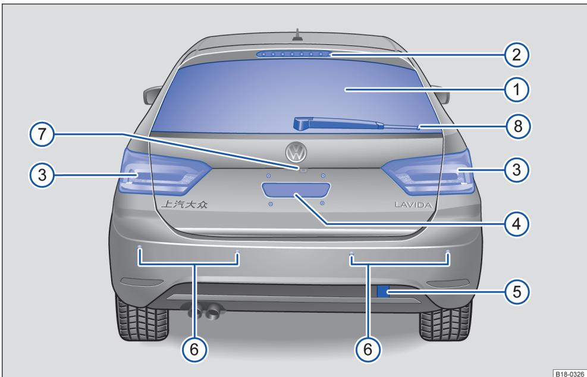  
图 5 两厢车型汽车尾部概览

⇒图 4、⇒图 5 的图例:
① 后窗玻璃
- 后窗玻璃加热 ..... 169
- 车窗玻璃天线
② 高位制动信号灯
③ 尾灯 ..... 98
④ 后部牌照支架
⑤ 盖板后的后部牵引环的支座 ..... 258
⑥ 后部驻车距离报警系统传感器 ..... 157
⑦ 驻车辅助系统摄像头
⑧ 后风窗玻璃刮水器 ..... 105

## 尾部视图（部分车型）

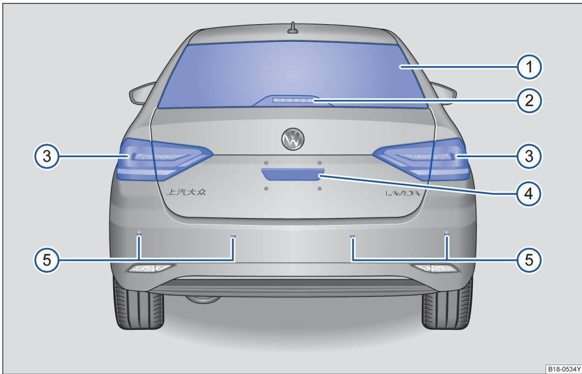

⇒图 6 的图例:
① 后窗玻璃
- 后窗玻璃加热 ..... 169
- 车窗玻璃天线
② 高位制动信号灯
③ 尾灯 ..... 98
④ 后部牌照支架
⑤ 后部驻车距离报警系统传感器 ..... 157

## 汽车内部空间

## 车门概览

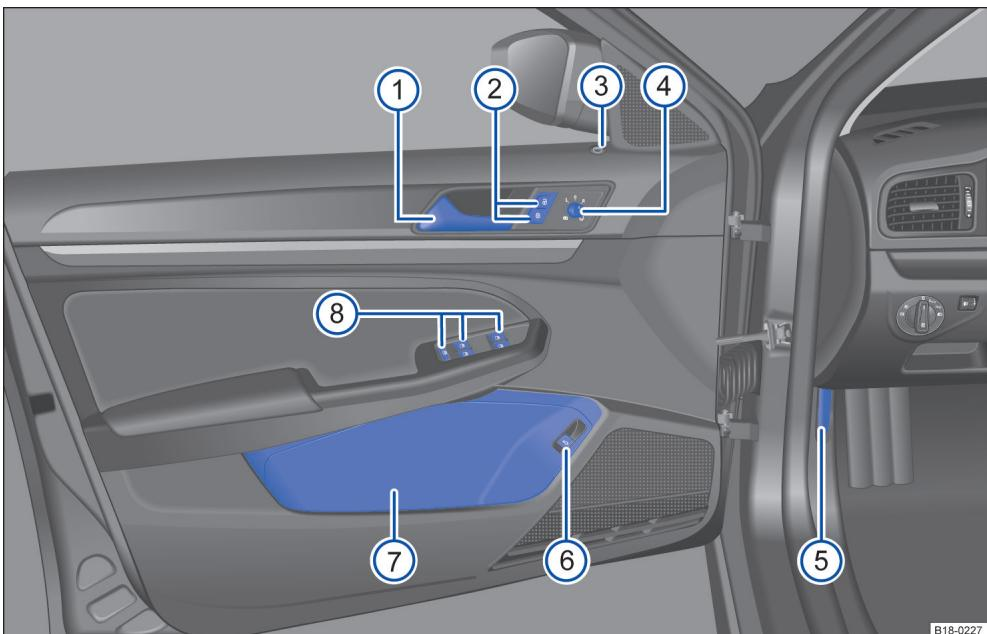

⇒图 7 的图例:
① 开门把手 ..... 58
② 用于汽车锁止和解锁的中央门锁按钮 ⏻ - ⏻ ..... 55
③ 集控门锁指示灯
④ 用于调整车外后视镜的开关 ..... 112
- 车外后视镜设置 L - O - R
- 车外后视镜加热 ⏻
- 车外后视镜折叠 ⏻
⑤ 用于解锁发动机舱盖的手柄 ..... 189
⑥ 行李箱解锁
⑦ 杂物箱
⑧ 用于操控电动车窗升降器的按钮 ..... 63
- 电动车窗升降器 ⏻
- 后部车窗升降器的安全按钮 ⏻

## 驾驶员侧概览

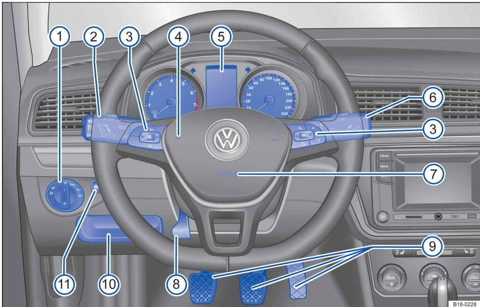  
图 8 驾驶员侧概览

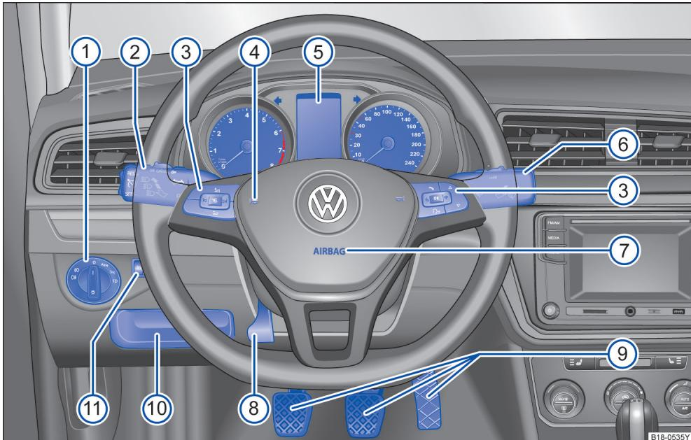  
图 9 驾驶员侧概览（部分车型）

⇒图 8、⇒图 9 的图例:
① 车灯开关 ⚙ . . . . . . . . . . . . . . . . . . . . . . . . . . . . . . . . . . . . . . . . . . . . . . . . . . . . . . . . . . . . . . . . . . . . . . . . . . . . . . . . . . . . . . . . . . . . . . . . . . . . 98
- 关闭车灯 ⚠
- 驻车灯和近光灯 ⚠ ⚠ ⚠
- 前后雾灯 ⚠ ⚠
② 以下部件的操作杆 . . . . . . . . . . . . . . . . . . . . . . . . . . . . . . . . . . . . . . . . . . . . . . . . . . . . . . . . . . . . . . . . . . . . . . . . . . . . . . . . . . . . . . . . . . . . . . . . . . .98
- 远光灯 ⚠
- 远光灯变光功能 ⚠
- 转向灯 ⚠
- 停车灯 ⚠
- 定速巡航装置 . . . . . . . . . . . . . . . . . . . . . . . . . . . . . . . . . . . . . . . . . . . . . . . . . . . . . . . . . . . . . . . . . . . . . . . . . . . . . . . . . . . . . . . . . . . . . . . . . . .161
③ 多功能方向盘的操作元件
- 音响系统、导航系统的音量设置 ⚠ - ⚠
- 收音机静音切换 ⚠
- 调出电话主菜单或接听电话 ⚠ 蓝牙功能⇒手册导航系统
- 激活语音指令 ⚠
- 用于操作音响系统、导航系统的按钮 ⚠ - ⚠
- 用于操作信息显示器的按钮 ⚠ - OK - ⚠、 ⚠、 ⚠
④ 喇叭（仅在点火开关已打开的情况下工作）
⑤ 组合仪表
- 仪表 . . . . . . . . . . . . . . . . . . . . . . . . . . . . . . . . . . . . . . . . . . . . . . . . . . . . . . . . . . . . . . . . . . . . . . . . . . . . . . . . . . . . . . . . . . . . . . . . . . .23
- 显示屏 . . . . . . . . . . . . . . . . . . . . . . . . . . . . . . . . . . . . . . . . . . . . . . . . . . . . . . . . . . . . . . . . . . . . . . . . . . . . . . . . . . . . . . . . . . . . . . . . . . ..26
- 警告灯和指示灯 . . . . . . . . . . . . . . . . . . . . . . . . . . . . . . . . . . . . . . . . . . . . . . . . . . . . . . . . . . . . . . . . . . . . . . . . . . . . . . . . . . . . . . . . . . . . . . . . . . .3
⑥ 车窗玻璃刮水器和车窗玻璃清洗器的操作杆 . . . . . . . . . . . . . . . . . . . . . . . . . . . . . . . . . . . . . . . . . . . . . . . . . . . . . . . . . . . . . . . . . . . . . . . . . . . . . . . . . . . . . . . . . . . . . . . . . 105
- 车窗玻璃刮水器 ⚠
- 车窗玻璃间歇刮水 ⚠
- “点动刮水” ⚠
- 车窗玻璃刮水器 ⚠
- 车窗玻璃的刮水和自动清洗功能 ⚠
- 操作杆，带用于操作信息显示的按钮 RESET . . . . . . . . . . . . . . . . . . . . . . . . . . . . . . . . . . . . . . . . . . . . . . . . . . . . . . . . . . . . . . . . . . . . . . . . . . . . . . . . . . . . . . . . . . . . . . . . . . .5
⑦ 驾驶员前部安全气囊 . . . . . . . . . . . . . . . . . . . . . . . . . . . . . . . . . . . . . . . . . . . . . . . . . . . . . . . . . . . . . . . . . . . . . . . . . . . . . . . . . . . . . . . . . . . . . . . . . . .4
⑧ 用于方向盘位置调节的操作杆 . . . . . . . . . . . . . . . . . . . . . . . . . . . . . . . . . . . . . . . . . . . . . . . . . . . . . . . . . . . . . . . . . . . . . . . . . . . . . . . . . . . . . . . . . . . . . . . . .1
⑨ 踏板 . . . . . . . . . . . . . . . . . . . . . . . . . . . . . . . . . . . . . . . . . . . . . . . . . . . . . . . . . . . . . . . . . . . . . . . . . . . . . . . . . . . . . . . . . . . . . . . . . . . .
⑩ 杂物箱 . . . . . . . . . . . . . . . . . . . . . . . . . . . . . . . . . . . . . . . . . . . . . . . . . . . . . . . . . . . . . . . . . . . . . . . . . . . . . . . . . . . . . . . . . . . . . . . . . . .
⑪ 大灯照明距离调节器
- 用于大灯照明距离调节的调节器 ⚠ . . . . . . . . . . . . . . . . . . . . . . . . . . . . . . . . . . . . . . . . . . . . . . . . . . . . . . . . . . . . . . . . . . . . . . . . . . . . . . . . . . . . . . . . . . . . . . . . . . .

## 中控台概览

## 中控台上部分

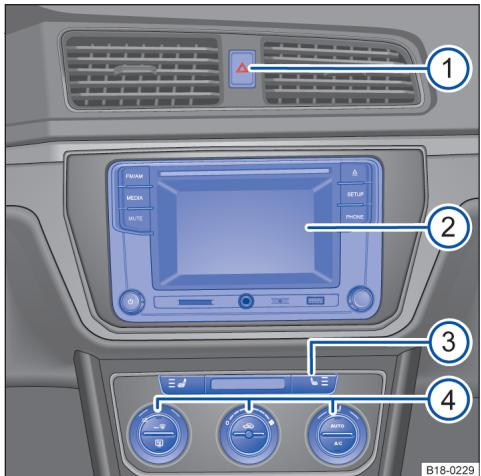  
图 10 中控台上部分概览

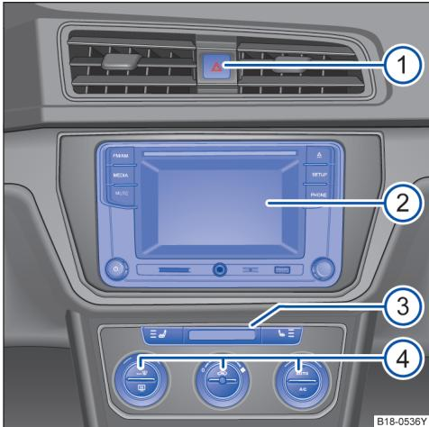  
图 11 中控台上部分概览（部分车型）

⇒图 10、⇒图 11 的图例：
① 用于打开和关闭危险警报灯的按钮 ▲ ..... 236
② 音响系统或导航系统⇒手册收音机或⇒手册导航系统
③ 前座椅加热调节器 🔊 ..... 80
④ 操作元件，用于：
- 手动空调 ..... 169
- 自动空调 ..... 169

## 中控台下部分

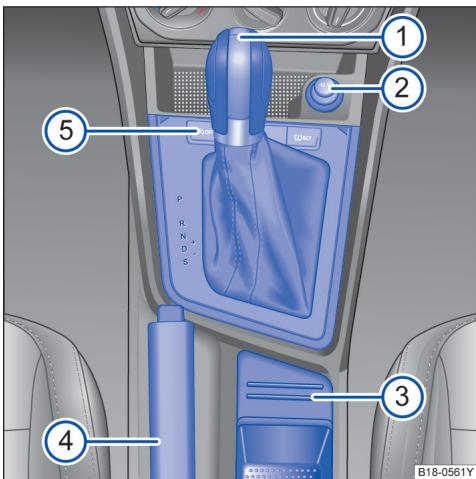  
图 12 中控台下部分概览

⇒图 12 的图例:
① 变速箱换挡杆:
- 手动变速箱 ..... 137
- 自动变速箱 ..... 137
② 12V 电源 ..... 126
③ 插卡槽
④ 手制动杆
⑤ 按钮，用于:
牵引力控制系统（ASR）关闭开关 ..... 147
Start-Stop 启停系统开关(A) OFF ..... 164
轮胎气压监测系统 (L) SET ..... 167

副驾驶员侧概览  
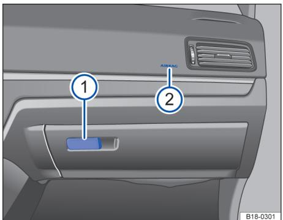  
图 13 副驾驶员侧概览

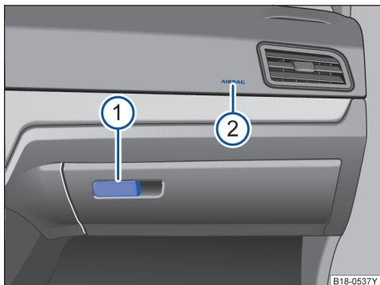  
图 14 副驾驶员侧概览（部分车型）

$\Rightarrow$ 图 13、 $\Rightarrow$ 图 14 的图例：
① 杂物箱开启把手 ..... 120
② 副驾驶员前部安全气囊 ..... 90

## 车顶内饰上的符号

<table><tr><td>符号</td><td>含义</td></tr><tr><td></td><td>车内照明灯和阅读灯⇒第 103 页。</td></tr><tr><td></td><td>天窗 ⇒第 67 页。</td></tr></table>

## 组合仪表

## 警告灯和指示灯

警告灯和指示灯显示警告 ⇒  、故障⇒  或某些功能。某些警告灯和指示灯在点火开关接通时亮起，在发动机运转时或在行驶过程中必须熄灭。

视车型而定，组合仪表的显示屏中还可能显示提供其它信息或要求进行操作的文字信

息⇒ 第 26 页。

视汽车装备而定，可能在显示屏上显示一个符号图示来代替警告灯。

某些警告灯和指示灯亮起时还会发出声音信号。

<table><tr><td>符号</td><td>含义 ⇒▲</td><td>参见</td></tr><tr><td></td><td>请勿继续行驶!制动液液位过低或制动系统有故障。</td><td>⇒第 141 页</td></tr><tr><td></td><td>请勿继续行驶!冷却液温度过高或冷却液液位过低:停车让发动机冷却。检查冷却液液位。</td><td>⇒第 195 页</td></tr><tr><td></td><td>请勿继续行驶!发动机机油压力过低,请关闭发动机,然后检查发动机机油油位</td><td>⇒第 191 页</td></tr><tr><td></td><td>请勿继续行驶!至少有一扇车门开着或未正确关闭。</td><td>⇒第 58 页</td></tr><tr><td></td><td>请勿继续行驶!行李厢已打开或未正确关闭。</td><td>⇒第 60 页</td></tr><tr><td></td><td>请系好安全带!</td><td>⇒第 81 页</td></tr><tr><td></td><td>发电机有故障,请到上汽大众经销商检修</td><td>⇒第 198 页</td></tr><tr><td></td><td>手制动杆已拉起.</td><td>⇒第 141 页</td></tr><tr><td></td><td>电控机械式转向系失灵</td><td>⇒第 154 页</td></tr><tr><td></td><td>电控机械式转向系作用下降</td><td>⇒第 154 页</td></tr><tr><td></td><td>亮起:ESP 有故障或牵引力控制系统(ASR)已关闭</td><td>⇒第 141 页</td></tr><tr><td></td><td>闪烁:电子稳定系统(ESP)正在调节</td><td>⇒第 141 页</td></tr><tr><td></td><td>牵引力控发动机数据制系统(ASR)已手动关闭。</td><td>⇒第 141 页</td></tr><tr><td></td><td>防抱死制动系统(ABS)有故障,请到上汽大众经销商处理</td><td>⇒第 141 页</td></tr><tr><td></td><td>后雾灯已打开</td><td>⇒第 98 页</td></tr><tr><td></td><td>灯泡故障</td><td>⇒第 98 页</td></tr><tr><td></td><td>OBD 系统指示灯,表明尾气排放相关的系统或者零部件有故障,请到上汽大众经销商检修</td><td rowspan="2">⇒第 233 页</td></tr><tr><td></td><td>电子节气门控制系统故障,请联系上汽大众经销商处理</td></tr><tr><td></td><td>胎压过低。</td><td>⇒第 167 页</td></tr><tr><td></td><td>被动式轮胎气压监控系统:某个车轮的轮胎充气压力过低,请检查轮胎充气压力;或者有系统故障,请到上汽大众经销商处理</td><td>⇒第 167 页</td></tr><tr><td>符号</td><td>含义 ⇒ ⚠</td><td>参见</td></tr><tr><td></td><td>安全气囊系统故障,请到上汽大众经销商检修</td><td>⇒第 90 页</td></tr><tr><td rowspan="2"></td><td>左侧转向信号灯已打开</td><td rowspan="2">⇒第 98 页</td></tr><tr><td>右侧转向信号灯已打开</td></tr><tr><td></td><td>远光灯已打开</td><td>⇒第 98 页</td></tr><tr><td></td><td>请踩下制动踏板</td><td>换挡 ⇒第 135 页制动 ⇒第 141 页</td></tr><tr><td></td><td>定速巡航系统已开启</td><td>⇒第 161 页</td></tr></table>

## 警告

● 如果不注意亮起的警告灯或指示灯、不遵守相应的说明和警告提示，可能会导致受伤或汽车严重损坏。

● 停在道路中的汽车具有极大的发生交通事故的隐患。请使用三角警告牌，使其他道路使用者注意到停住的本车。

## 警告（续）

● 车辆的发动机舱是危险的作业区域！打开发动机舱盖前以及在发动机舱内进行作业前：关闭发动机并让其冷却下来，以防止烫伤或其它伤害。请务必阅读和遵守相关的警告说明。

## ① 提示

出现故障时相应的指示灯亮起，显示屏上可能还会显示相应的信息，向您通报情况或要求进行必要的操作。

## 信息显示

##  主题引言

该章节包含有关下列主题的信息：
组合仪表 ..... 26
多功能显示器 ..... 27
燃油存量 ..... 27
数字时钟 ..... 28
车辆信息显示装置 ..... 29
存储器 ..... 29
信息显示选择按钮 ..... 30
外部环境温度 ..... 30
冷却液温度 ..... 31
行驶时间 ..... 31
瞬时油耗 ..... 32
平均油耗 ..... 32
有效距离 ..... 33
行驶距离 ..... 33
平均速度 ..... 34
当前车速 ..... 34
车速报警 ..... 35
行驶里程计数器 ..... 35

维护保养提示信息 ..... 36
变速箱挡位指示 ..... 36

在点火开关已打开的情况下，可以通过这些菜单调出显示屏的各种不同的功能。
显示屏上的显示范围取决于汽车电子系统和汽车的装备范围。
上汽大众经销商可以根据汽车装备对其它功能进行编程或更改。
某些菜单项只能在汽车静止时调出。
补充信息和警告说明：
- 车外后视镜 ⇒ 第 111 页

## 警告

如果驾驶员转移注意力，则可能导致事故和受伤。切勿在行驶期间调出组合仪表多功能显示器中的菜单。

## 组合仪表

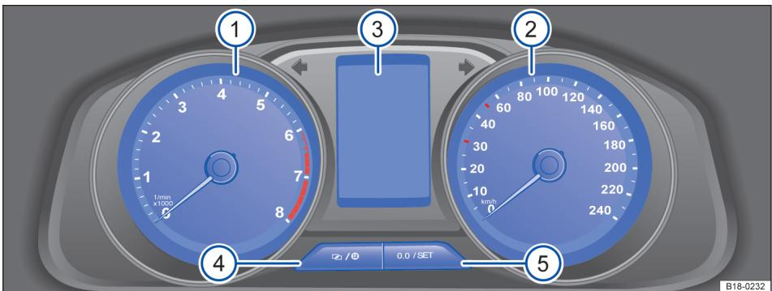  
图 15 车辆组合仪表

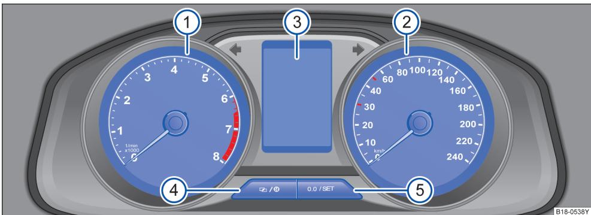  
图 16 车辆组合仪表（部分车型）

 请首先阅读并注意引导信息和安全提示，见 ，第 25 页。

根据车辆配置不同，组合仪表也有所区别。请对照您购买车辆的实际装备阅读以下内容。

● 发动机转速表

● 车速表

● 数字时钟调节按钮

● 多功能显示器

● 燃油存量

● 数字时钟

● 车辆信息

● 行驶里程

● 变速箱挡位

● 复位按钮

## 发动机转速表

转速表的指针指示发动机的转速，为防止损坏发动机，不可使发动机转速过高，应避免转速表指针在刻度盘的红色范围内运转。

## ① 提示

驾驶车辆时，请务必遵守当地的交通法规及限速规定！

## 多功能显示器

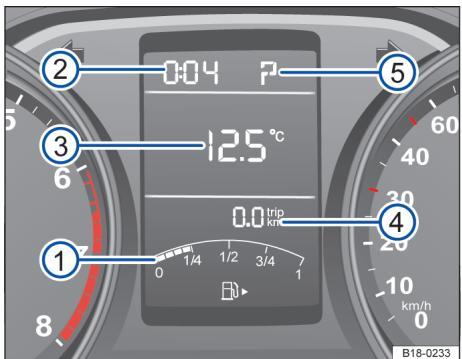  
图 17 车辆多功能显示器

## 燃油存量

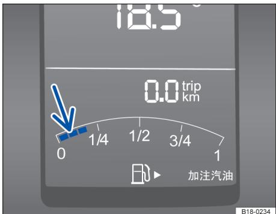  
图 18 燃油存量

##  请首先阅读并注意引导信息和安全提示，见 ，第 25 页。

由于车辆存在多种装备状态，多功能显示器中显示的内容也不同，请对照车辆实际装备，阅读以下内容。

燃油存量1

数字时钟2

车辆信息3

行驶里程4

变速箱挡位 5

##  请首先阅读并注意引导信息和安全提示，见 ，第 25 页。

国五车型：燃油箱容积约为55升，国六车型：燃油箱容积约为52.8升。燃油存量指示器在点火开关接通的状态下工作，如果燃油存量指示器从四格跳至三格（左图所示），指示灯亮起并伴有警告音，说明剩余燃油不足11升，请及时加注燃油。

## ① 提示

切勿行驶到油箱燃油耗尽！供油不规律会导致发动机点火不良。未燃烧的燃油可能进入废气排放装置并损坏催化净化器。

## 数字时钟

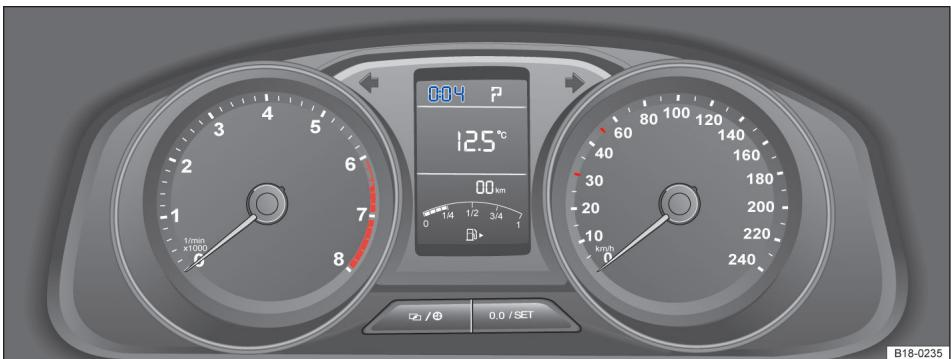  
图 19 车辆组合仪表中的数字时钟

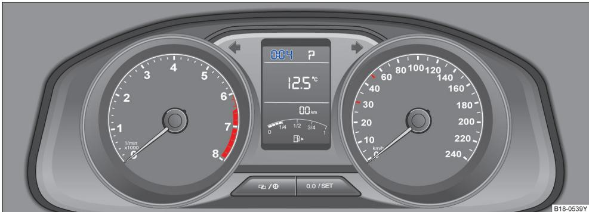  
图 20 车辆组合仪表中的数字时钟（部分车型）  
 请首先阅读并注意引导信息和安全提示，见 ，第 25 页。

通过时钟调节按钮 4 和复位按钮 5 ⇒ 图 15可以调节小时和分钟。

反复按下按钮 4 ，切换到屏幕上小时数闪烁状态后按下复位按钮 可以调节小时。 反复按下按钮

4 ，切换到屏幕上分钟数闪烁状态后按下复位按钮5 可以调节分钟。

## 车辆信息显示装置

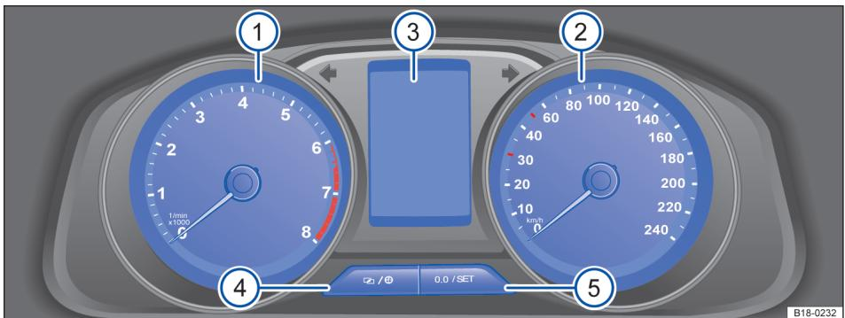  
图 21 车辆组合仪表

请首先阅读并注意引导信息和安全提示，见 ，第 25 页。

多功能显示器为您提供大量车辆信息和数据：

– 外部环境温度

– 行驶时间

– 瞬时油耗

– 有效距离

– 行驶距离

– 平均速度

– 当前车速

– 车速报警

– 冷却液温度

– 平均油耗

## 存储器

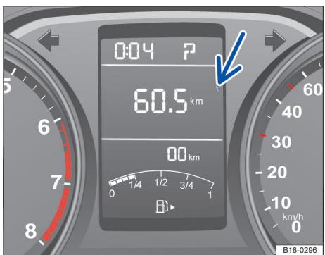  
图 22 存储器（1）

  
 请首先阅读并注意引导信息和安全提示，见 ，第 25 页。

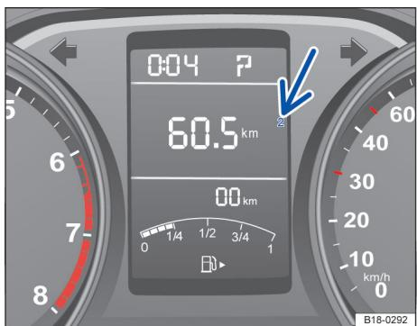  
图 23 存储器（2）  
多功能显示器配备有两个存储器。当前选择的存储器在显示器的右上角显示。 如果在显示器上出现1，则显示单独行程存储器。 如果在显示器上出现2，则显示累计行程存储器。 单独行程存储器（1）记录从点火开关打开到关闭期间的行驶数据。当点

火开关关闭超过2小时，存储器会自动清除先前记录。 累计行程存储器（2）存储着多次单独行使数据直至上限。超出上限，则存储器中的各项值都被

## 信息显示选择按钮

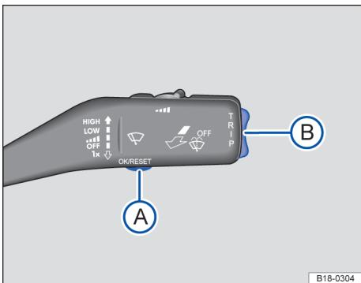  
图 24 信息显示选择按钮

 请首先阅读并注意引导信息和安全提示，见 ，第 25 页。

## 选择存储器

● 点火开关打开后短按风窗玻璃洗涤器拨杆上的按钮 A 可在存储器1，2之间进行切换。

● 配备多功能方向盘的车型，可通过方向盘菜单切换按钮或或键⇒图25在存储器1，2之间进行切换。

## 外部环境温度

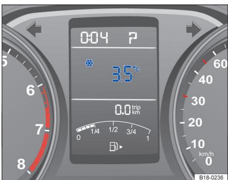  
图 26 外部环境温度

清除并重新记录。与单独行程存储器的不同之处在于：累计行程存储器中的数据在点火开关关闭超过2小时的时候不会自动清除。

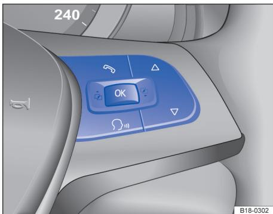  
图 25 部分车型信息显示选择按钮

## 清空存储器

● 选择要清空的存储器。

● 按住风窗玻璃洗涤器拨杆上的按钮 A 或按压多功能方向盘上的OK 键超过2秒可清空当前存储器。

## 选择显示信息

● 按压风窗玻璃洗涤器拨杆上按钮 B 或按压多功能方向盘上的或的两端（左图所示），可以使各项行驶数据在显示器上逐个显示。

##  请首先阅读并注意引导信息和安全提示，见 ，第 25 页。

显示车辆当前的外部温度，当外部温度低于+4℃时，外部温度显示屏上会出现一个冰晶符号“\*”（冰面路滑警告）。

## ① 提示

即使没有显示“冰晶符号”报警，也可能存在冰雪或湿滑情况。因此，不要过分依赖此项显示——以免发生事故造成危险！

i 车辆静止或在低速度行驶时，由于发动机的热量辐射，显示的温度可能稍高于外部实际温度。

## 冷却液温度

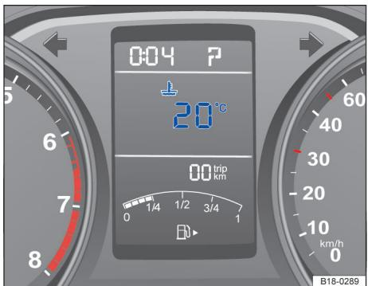  
图 27 冷却液温度

## 行驶时间

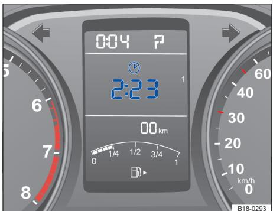  
图 28 行驶时间

 请首先阅读并注意引导信息和安全提示，见 ，第 25 页。

显示车辆当前的冷却液温度。

## 冷却液温度过高

观察冷却液温度表的温度计数，若冷却液温度过 高，应立即停车，关闭发动机，检查冷却液液位。 

 请首先阅读并注意引导信息和安全提示，见 ，第 25 页。

行驶时间显示的是上一次清空信息储存器后的车辆累计行驶时间，如果您想从某个特定时间点开始累计行驶时间您必须首先按动按钮⇒ 图 24 A 或按压多功能方向盘上的OK 键⇒ 图 25，清除这一存储信息。

该存储器收集任意次数行驶时间，如果超出最大值，存储器便会自动删除并重新从零开始。

## 瞬时油耗

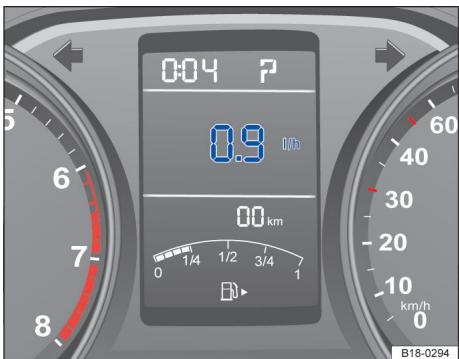  
图 29 瞬时油耗

## 平均油耗

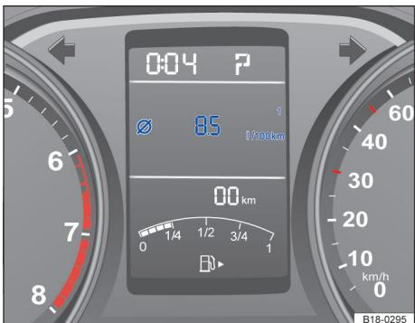  
图 30 平均油耗

 请首先阅读并注意引导信息和安全提示，见 ，第 25 页。

瞬时油耗是以升/100公里为单位显示的。此信息能帮助您调整您的驾驶习惯以达到您所期望的油耗值，如果车辆停止或以低速行驶时，则以升/小时显示瞬时油耗。

 请首先阅读并注意引导信息和安全提示，见 ，第 25 页。

平均油耗是以升/100公里为单位显示上一次清空信息存储器后的平均油耗，此信息能帮助您调整驾驶习惯以达到期望的油耗值，如果想测算某特定行驶周期内的平均油耗，在开始测算油耗前请先按动按钮⇒ 图 24 A 或按压多功能方向盘上的OK键⇒ 图 25将信息存储器清空。清除记录后需要再行驶约300米后才能再次显示油耗。

i 油耗显示根据喷油时间计算得出，可能与实际油耗存在偏差。

## 有效距离

  
图 31 有效距离

## 行驶距离

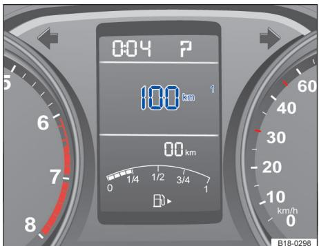  
图 32 行驶距离

 请首先阅读并注意引导信息和安全提示，见 ，第 25 页。

根据现在的驾驶模式和油箱内的燃油存量可估算并显示出您还可以继续行驶的距离。如果您采用更加经济的模式驾驶您的爱车，这一距离有可能进一步扩大。

i 有效距离仅供参考，请在燃油报警灯亮后尽快加油。

 请首先阅读并注意引导信息和安全提示，见 ，第 25 页。

行驶距离显示的是上一次清空信息储存器后的车辆累计行驶距离，如果您想从某个特定时间点开始累计行驶距离请先长按按钮⇒ 图 24 A或按压多功能方向盘上的OK 键⇒ 图 25，清除这一存储信息。超出累计行驶距离上限后存储器自动归零并重新开始计数。 

## 平均速度

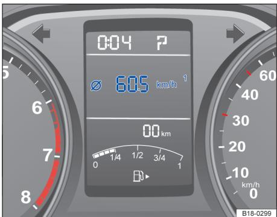  
图 33 平均速度

## 当前车速

  
图 34 当前车速

 请首先阅读并注意引导信息和安全提示，见 ，第 25 页。

平均速度显示的是上一次清空信息储存器后的车辆平均行驶速度，如果您想从某个特定时间点开始计算平均行驶速度，请先长按按钮⇒ 图 24 A 或按压多功能方向盘上的OK键⇒ 图 25，清除这一存储信息。在清除存储信息后需要再行驶约100米后才能再次显示平均速度。

 请首先阅读并注意引导信息和安全提示，见 ，第 25 页。

当前车速将在组合仪表显示器中以数字形式显示。⇒ 图 34

## 车速报警

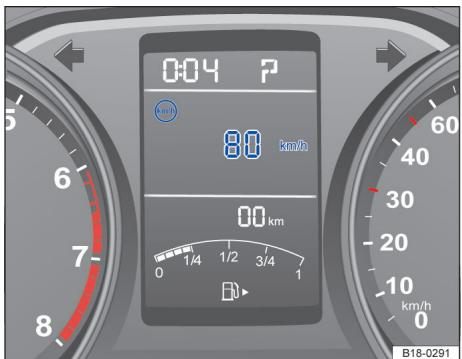  
图 35 车速报警

##  请首先阅读并注意引导信息和安全提示，见 ，第 25 页。

此处显示的是您根据实际情况设置的车速报警信息。如果您想重新设定报警的车速，您必须首先按动按钮⇒ 图 24 A 将报警车速复位。或按压多功能方向盘上的OK 键⇒ 图 25。然后再次按动按钮重新进行设置：拨动开关上端，可提高报警车速；按动开关下端⇒ 图 24 B ，可降低报警车速。或按动多功能方向盘上的按钮或⇒图 25按钮设定完闭后，按下按钮确认报警车速修改信息。 当行驶速度超过设定的车速时，设置的速度显示闪烁,同时伴随有警告音响起。

## 行驶里程计数器

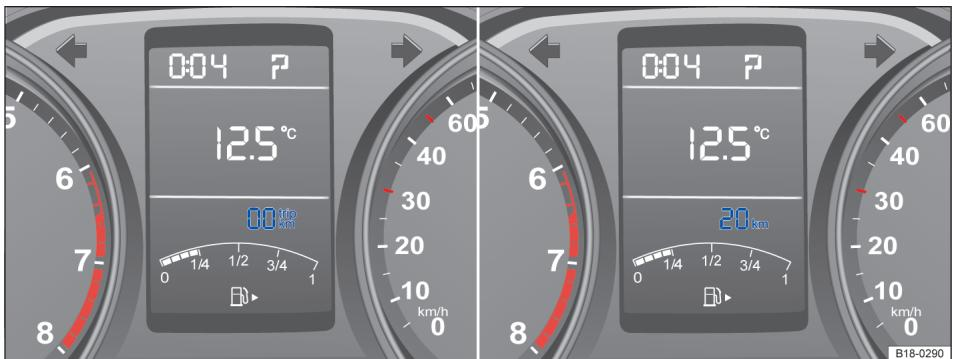  
图 36 车辆行驶里程计数器

##  请首先阅读并注意引导信息和安全提示，见 ，第 25 页。

对于1.6L车辆，关闭点火开关后，里程计数器将在显示区显示兑的行吨用程打开点火开关后你可以通过按压复位按钮 5 ⇒ 图 21选择所需的里程计数器显示在屏幕上。 总行驶里程计数器 该行驶里程计数器显示汽车已经行驶的总公里数。 短程行驶里程计数器（带trip记号） 短程行驶里程显示了您将计数器清零之后所行驶的距离。 在打开点火开关的情况下，快速按下复位按钮 5 ⇒ 图 21，您可以在总行驶里程计数器与短程行驶里程计数器之间来回切换，根据需要确认哪一个行驶里程计数器显示在显示屏上。 在短程行驶里程出现后。如果长按复位按钮 5 ，短程行驶里程的计数器将被清零。 

## 维护保养提示信息

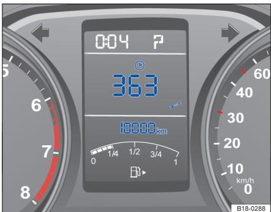  
图 37 外部环境温度

## 变速箱挡位指示

 请首先阅读并注意引导信息和安全提示，见 ，第 25 页。

##  请首先阅读并注意引导信息和安全提示，见 ，第 25 页。

当到达维护保养日期时，打开点火开关后，显示器上会显示一个闪烁的扳手图标，该符号提醒您尽快前往就近的上汽大众经销商对您的爱车进行维护保养。您可以通过以下方法手动查看距离下次保养的剩余里程和剩余天数： 连续按下时钟调节按钮4 ⇒ 图 21,直到信息显示器上显示上图所示的相关保养信息。

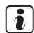

根据车辆装备的不同，显示区的显示内容将会有所不同。

部分车型挡位信息位于显示屏的右上角。⇒ 第 140 页

# 驾驶前 起步前 驾驶提示

##  主题引言

该章节包含有关下列主题的信息：

行驶准备和行驶安全性 ..... 37
在道路上涉水行驶 ..... 38
磨合轮胎和制动摩擦片 ..... 38

补充信息和警告说明：

● 正确和安全地就座 ⇒ 第 81 页⇒ 第 69 页

● 行李物品装载 ⇒ 第 114 页

● 启动、换挡、驻车 ⇒ 第 129 页

● 有环保意识地驾驶⇒ 第 148 页

## 警告

酒精、药物和麻醉剂可能显著影响感觉、反应时间和行驶安全，从而导致对车辆失去控制。

## 行驶准备和行驶安全性

请首先阅读并注意引导信息和安全提示，见 ，第 37 页。

## 核对表

为了自身和乘员的安全，每次行车前和每次行驶期间都必须注意以下事项 ⇒  ：

确保车灯正常工作。

检查轮胎充气压力⇒ 第 221 页和燃油存量⇒ 第 182 页。

确保所有车窗玻璃的视野清晰。

确保无物品干涉踏板操作。

驾驶员和乘员应按身高调节座椅,头枕,和后视镜。⇒ 第 69 页。

用合适的儿童座椅保护儿童，并帮助其系好安全带。⇒ 第 94 页

采取正确坐姿⇒ 第 69 页。

正确佩戴安全带⇒ 第 81 页。

固定随车行李。

行驶中切勿因外界因素分散精力（例如，与乘员交谈或打电话）。

反应能力下降时切勿驾驶汽车（例如，药品和酒精均会削弱人的反应能力）。

严格遵守交通规则和法定车速限制。

必须按能见度、天气状况、道路及交通状况适时调整车速和驾驶方式。

## 警告

要始终遵守现行交通规则和车速限制并有预见性地驾驶。正确评估行驶状况能使您安全到达行驶目的地。

运行条件下，某些保养工作可能在下次保养到期之前就需要进行。例如需要反复起步以及在恶劣环境的地区行驶。其它信息请向上汽大众经销商咨询。

i 在车辆上进行定期的保养工作不仅能使本车保值，而且还有助于提高运行和交通安全性。因此请按照保养手册的规定进行保养工作。在恶劣的

## 在道路上涉水行驶

 请首先阅读并注意引导信息和安全提示，见 ，第 37 页。

通过积水路面时，为避免损坏您的汽车，请注意以下几点：

● 在涉水行车前先确定水深。水最多允许达到车身下边缘 ⇒  。

● 行车速度不得高于步行速度。

● 涉水行驶时,切勿停车,倒车或关闭发动机。

● 迎面车辆会将积水激起波浪，抬高水位，不利于轿车在水中安全行驶。

## 磨合轮胎和制动摩擦片

 请首先阅读并注意引导信息和安全提示，见 ，第 37 页。

最初500km内应谨慎行驶，使轮胎磨合良好；新制动摩擦片应在最初200到300km内仔细磨合，使之达到最佳摩擦状态。

最初200到300km内制动器摩擦片尚未达到最佳摩擦状态，故制动效果不能达到最佳状态，此时，可适当加大制动踏板踏力，补偿制动效果。紧急制动时新制动器摩擦片的制动距离要比磨合后的制动器摩擦片长。

## 警告

轿车驶过积水、泥泞、淤泥路段后，因制动盘和制动衬块受潮或结冰（冬季），制动器可能反应滞后，制动距离加长。

● 轻踏制动踏板数次即可“去除制动器里的水和冰”。操作时须谨慎，注意不要影响过往车辆行驶和违反法规要求。

● 驶过积水路段后切勿突然急刹车。

● 驶过湿滑路面时请勿紧急制动。

## 提示

● 如果驶过积水路面，汽车上发动机、传动系统、变速箱和电子系统可能受到严重损害。

● 盐水具备腐蚀性，汽车上被盐水浸泡过的部件必须用清水冲洗。

## 警告

未经磨合的新轮胎和制动器摩擦片达不到最佳附着状态和摩擦状态。

● 新轮胎尚不具备最佳附着力，故最初500km内须谨慎行驶，使轮胎磨合良好，谨防发生事故！

● 最初200至300km内新制动器摩擦片尚不具备最佳摩擦特性，故必须经过磨合，此阶段制动效果略有下降，可通过加大制动踏板的踏力补偿制动效果。更换后的新制动器摩擦片也必须按上述要求进行磨合。

● 行驶时切勿距其它车辆太近或发生须紧急制动的情况，使用新制动器摩擦片和新轮胎行驶时尤须谨慎，杜绝发生上述情况，避免引发事故！

## 技术数据

##  主题引言

该章节包含有关下列主题的信息：
汽车特性数据 ..... 40
发动机数据 ..... 40
车身结构及尺寸 ..... 43
动力性 ..... 44
最大爬坡度 ..... 46
燃油类型和耗油量 ..... 46
重量 ..... 48

## 本书所列所有技术数据均以汽车正式文件为准。

除专门注明或单独列出的数据外，本书所列所有数据适用于基本配置汽车。汽车随车正式文件内列有您所购汽车配备的发动机类型。

安装选装设备的汽车或特种车型或出口型车型的技术数据可能不同于本书所列的数据。

从保养手册中的汽车数据牌上或正式汽车文件上，可以得知汽车配备的是哪种发动机。

应始终以正式汽车文件中的数据为准。本说明书中的所有数据适用于基本车型。由于选装装备不同或车型不同，以及针对特种车辆和用于其它国家的汽车而言，给出的数值可能会有所不同。

## 补充信息和警告说明：

● 行李物品装载 ⇒ 第 114 页

● 有环保意识地驾驶⇒ 第 148 页

● 燃油 ⇒ 第 182 页

● 发动机机油 ⇒ 第 191 页

● 发动机冷却液 ⇒ 第 195 页

● 车轮和轮胎 ⇒ 第 220 页

## 警告

务必严格按所列技术数据使用本车！若使用中忽视或超过本说明书所列质量、有效载荷、整车尺寸和最高车速等规定值，则可能引发事故，严重时会致伤人员!

## ① 提示

车型型号参见于产品标牌或正式的汽车文件。 

## 汽车特性数据

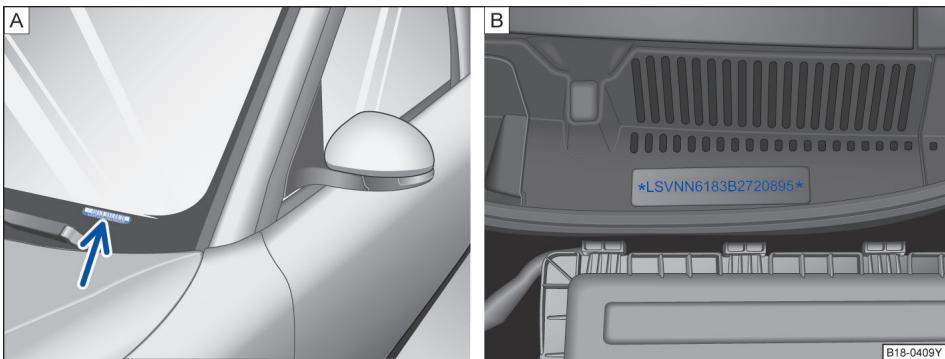  
图38A车辆识别代号B发动机舱内的车辆识别代号钢印位置

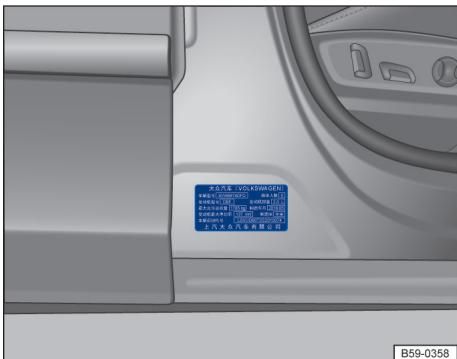  
图 39 B柱下方整车产品标牌。

 请首先阅读并注意引导信息和安全提示，见 ，第 39 页。

## 车辆识别代号 （VIN）

可在车外通过前风窗左下侧的视窗读取汽车识别码（车辆识别代号）⇒ 图 38。此外，发动机舱内以及整车产品标牌上也标有相应识别码（车辆识别代号）⇒ 图 38或⇒ 图 39。

## 通过诊断接口读取车辆识别号

车辆识别号也保存在 ECU（电子控制单元）中，可通过相应的诊断仪读取。

## 发动机数据

 请首先阅读并注意引导信息和安全提示，见 ，第 39 页。

诊断接口位于仪表板下方驾驶员侧脚部空间内。

上汽大众经销商配备大众车型专用诊断仪，可联系上汽大众经销商读取车辆识别号。如需自行读取车辆识别号，可与本公司联系购买大众车型专用诊断仪，或购买车载通信接口插头符合SAE J1962 定义且支持ISO 15765-4 及其引用标准定义的诊断仪读取。

## 产品标牌

产品标牌位于前排乘员侧车门B柱下端⇒ 图 39。

## 油箱盖板上的标签

此标签位于油箱盖板内侧。标签包含以下信息：

● 规定的燃油标号

● 轮胎充气压力值

## 发动机型号和编号

发动机型号和编号位于发动机左侧。

## 警告

打开发动机舱盖前请务必仔细阅读和遵守相关安全警告说明⇒  ，在主题引言中，见第 187 页。

由于行驶技术许可和税收方面的原因，其它国家的某些发动机的规定功率和动力性可能与以下数据有所不同。

发动机数据

<table><tr><td>整车型号</td><td>额定功率</td><td>形式</td><td>最大输出扭矩</td><td>排量</td></tr><tr><td>SVW7147ALD</td><td rowspan="16">96 kW/5000±200 r/min</td><td rowspan="16">水冷直列式四缸四冲程四气门汽油直喷涡轮增压中冷汽油机</td><td rowspan="16">225 N.m / (1400~3500)±200 r/min</td><td rowspan="16">1.395 L</td></tr><tr><td>SVW7147BLD</td></tr><tr><td>SVW7147ELD</td></tr><tr><td>SVW7147FLD</td></tr><tr><td>SVW7147LLD</td></tr><tr><td>SVW7147JLD</td></tr><tr><td>SVW7147KLD</td></tr><tr><td>SVW7147YLD</td></tr><tr><td>SVW7147VLD</td></tr><tr><td>SVW7147WLD</td></tr><tr><td>SVW7147XLD</td></tr><tr><td>SVW71417AL</td></tr><tr><td>SVW71417BL</td></tr><tr><td>SVW71417DL</td></tr><tr><td>SVW71417EL</td></tr><tr><td>SVW71417CL</td></tr><tr><td>SVW7167AMD</td><td rowspan="18">81kW/5800±200 r/min</td><td rowspan="18">水冷直列式四缸四冲程四气门电子控制多点喷射汽油机</td><td rowspan="18">155 N.m / 3800±200 r/min</td><td rowspan="18">1.598 L</td></tr><tr><td>SVW7167BMD</td></tr><tr><td>SVW7167EMD</td></tr><tr><td>SVW7167FMD</td></tr><tr><td>SVW7167LMD</td></tr><tr><td>SVW7167JMD</td></tr><tr><td>SVW7167KMD</td></tr><tr><td>SVW7167VMD</td></tr><tr><td>SVW7167WMD</td></tr><tr><td>SVW7167XMD</td></tr><tr><td>SVW71617AM</td></tr><tr><td>SVW71617BM</td></tr><tr><td>SVW71617CM</td></tr><tr><td>SVW71617DM</td></tr><tr><td>SVW71617GM</td></tr><tr><td>SVW71617HM</td></tr><tr><td>SVW71617JM</td></tr><tr><td>SVW71617KM</td></tr><tr><td>SVW71217BN</td><td>81kW/5000±200 r/min</td><td>水冷直列式四缸四冲程四气门汽油直喷涡轮增压中冷汽油机</td><td>200N.m / (2000~3500)±200 r/min</td><td>1.197 L</td></tr><tr><td>SVW71217AN</td><td>81kW/5000±200 r/min</td><td>水冷直列式四缸四冲程四气门涡轮增压汽油直喷发动机</td><td>175N.m / (1500~4000)±200 r/min</td><td>1.197 L</td></tr><tr><td>SVW71617EM</td><td>81kW/5800±200 r/min</td><td>水冷直列式四缸四冲程四气门电子控制多点喷射汽油机</td><td>155 N.m / 3800±200 r/min</td><td>1.598 L</td></tr><tr><td>SVW71417FL</td><td>96kW/5000±200 r/min</td><td>水冷直列式四缸四冲程四气门涡轮增压汽油直喷发动机</td><td>225 N.m / (1400~3500)±200 r/min</td><td>1.395 L</td></tr><tr><td>SVW71417GL</td><td>110kW/5000±200 r/min</td><td>水冷直列式四缸四冲程四气门涡轮增压汽油直喷发动机</td><td>250 N.m / (1750~3000)±200 r/min</td><td>1.395 L</td></tr><tr><td>SVW71217CNSVW71217DN</td><td>81kW/5000 r/min</td><td>水冷直列式四缸四冲程四气门涡轮增压汽油直喷发动机</td><td>200 N.m / 2000~3500 r/min</td><td>1.197 L</td></tr><tr><td>SVW71417JLSVW71417KLSVW71417LLSVW71417MLSVW71417NL</td><td>96kW/5000 r/min</td><td>水冷直列式四缸四冲程四气门涡轮增压汽油直喷发动机</td><td>225 N.m / 1400~3500 r/min</td><td>1.395 L</td></tr><tr><td>SVW71417HL</td><td>110kW/5000 r/min</td><td>水冷直列式四缸四冲程四气门涡轮增压汽油直喷发动机</td><td>250 N.m / 1750~3000 r/min</td><td>1.395 L</td></tr><tr><td>SVW71617LMSVW71617MMSVW71617NMSVW71617PMSVW71617QMSVW71617RMSVW71617SM</td><td>81kW/5800 r/min</td><td>水冷直列式四缸四冲程四气门电子控制多点喷射汽油机</td><td>155 N.m / 3800 r/min</td><td>1.598 L</td></tr><tr><td>SVW7157AFDSVW71517AFSVW71517BFSVW71517CFSVW71517DF</td><td>82kW/6100 r/min</td><td>水冷直列四缸四气门电子控制多点喷射汽油机</td><td>145 N.m / 4000 r/min</td><td>1.498 L</td></tr></table>

## 车身结构及尺寸

## 请首先阅读并注意引导信息和安全提示，见 ，第 39 页。

<table><tr><td>整车型号</td><td>SVW7147ALDSVW7147BLDSVW7167AMDSVW7167BMDSVW7167JMDSVW7167KMDSVW7147JLDSVW7147KLDSVW7147YLDSVW71417ALSVW71417BLSVW71617AMSVW71617BMSVW71217BNSVW71617GMSVW71617HMSVW71217ANSVW71417CLSVW71417GLSVW71217CNSVW71417HLSVW71417JLSVW71417KLSVW71617LMSVW71617MMSVW71617RMSVW71617SM</td><td>SVW7157AFDSVW71517AFSVW71517BF</td><td>SVW71517CFSVW71517DF</td><td>SVW71617CMSVW71617DMSVW71417DLSVW71417ELSVW71617JMSVW71617KMSVW71217DNSVW71417LLSVW71617NMSVW71417MLSVW71617PM</td><td>SVW7167EMDSVW7167FMDSVW7147ELDSVW7147FLDSVW7167VMDSVW7167WMDSVW7147VLDSVW7147WLD</td><td>SVW7147LLDSVW7167LMDSVW7167XMDSVW7147XLD</td><td>SVW71617EMSVW71417FLSVW71417NLSVW71617QM</td></tr><tr><td>总长</td><td colspan="2">4,605 mm</td><td>4 613</td><td>4,445 mm</td><td>4,454 mm</td><td>4,467 mm</td><td>4,446 mm</td></tr><tr><td>总宽</td><td colspan="6">1,765 mm</td><td>1,767 mm</td></tr><tr><td>总高(空载)</td><td colspan="3">1,460 mm</td><td>1,485 mm</td><td>1,460 mm</td><td>1490 mm</td><td>1495 mm</td></tr><tr><td>轴距(半载)</td><td colspan="7">2,610 mm</td></tr><tr><td>最小转弯直径</td><td colspan="7">10.6 m</td></tr><tr><td>前轮距(半载)</td><td colspan="7">1,517 mm</td></tr><tr><td>后轮距(半载)</td><td colspan="7">1,493 mm</td></tr><tr><td>最小离地间隙(满载)</td><td colspan="5">120 mm</td><td colspan="2">130 mm</td></tr><tr><td>行李厢容积</td><td colspan="3">478 L</td><td colspan="4">412 L</td></tr><tr><td>油箱容积</td><td>55 L</td><td colspan="2">52.8 L</td><td colspan="4">55 L</td></tr></table>

不计入车辆外廓尺寸的部件：

车辆长度：可拆卸的拖曳装置（比如：车辆牵引环）。

车辆宽度：外后视镜、门把手。

车辆高度：车顶天线的可拆卸部分。

## ① 提示

● 在带突出路沿围边或固定限位块的停车场中应小心行驶。这些突出地面的物体在驶入和驶出时可能损坏保险杠和其它汽车部件。

 请首先阅读并注意引导信息和安全提示，见 ，第 39 页。

由于行驶技术许可和税收方面的原因，其它国家的某些发动机的规定功率和动力性可能与以下数据有所不同。

动力性

<table><tr><td>整车型号</td><td>发动机</td><td>变速箱类型</td><td>机组号</td><td>最高车速</td><td>驱动型式</td></tr><tr><td>SVW7167AMD</td><td>1.6L 汽油发动机</td><td>NYZ</td><td>02T.S</td><td>188 km/h</td><td>前轮驱动</td></tr><tr><td>SVW7167BMD</td><td>1.6L 汽油发动机</td><td>NKN</td><td>09G.D</td><td>183 km/h</td><td>前轮驱动</td></tr><tr><td>SVW7167EMD</td><td>1.6L 汽油发动机</td><td>NYZ</td><td>02T.S</td><td>188 km/h</td><td>前轮驱动</td></tr><tr><td>SVW7167FMD</td><td>1.6L 汽油发动机</td><td>NKN</td><td>09G.D</td><td>183 km/h</td><td>前轮驱动</td></tr><tr><td>SVW7147ALD</td><td>1.4TSI 汽油发动机</td><td>PCM</td><td>02J.S</td><td>200 km/h</td><td>前轮驱动</td></tr><tr><td>SVW7147BLD</td><td>1.4TSI 汽油发动机</td><td>QPH</td><td>0AM.V</td><td>200 km/h</td><td>前轮驱动</td></tr><tr><td>SVW7147ELD</td><td>1.4TSI 汽油发动机</td><td>PCM</td><td>02J.S</td><td>200 km/h</td><td>前轮驱动</td></tr><tr><td>SVW7147FLD</td><td>1.4TSI 汽油发动机</td><td>QPH</td><td>0AM.V</td><td>200 km/h</td><td>前轮驱动</td></tr><tr><td>SVW7147LLD</td><td>1.4TSI 汽油发动机</td><td>QPH</td><td>0AM.V</td><td>200 km/h</td><td>前轮驱动</td></tr><tr><td>SVW7167LMD</td><td>1.6L 汽油发动机</td><td>NKN</td><td>09G.D</td><td>183 km/h</td><td>前轮驱动</td></tr><tr><td>SVW7147JLD</td><td>1.4TSI 汽油发动机</td><td>PCM</td><td>02J.S</td><td>200 km/h</td><td>前轮驱动</td></tr><tr><td>SVW7147KLD</td><td>1.4TSI 汽油发动机</td><td>QPH</td><td>0AM.V</td><td>200 km/h</td><td>前轮驱动</td></tr><tr><td>SVW7147YLD</td><td>1.4TSI 汽油发动机</td><td>QPH</td><td>0AM.V</td><td>205 km/h</td><td>前轮驱动</td></tr><tr><td>SVW7167JMD</td><td>1.6L 汽油发动机</td><td>NYZ</td><td>02T.S</td><td>188 km/h</td><td>前轮驱动</td></tr><tr><td>SVW7167KMD</td><td>1.6L 汽油发动机</td><td>NKN</td><td>09G.D</td><td>183 km/h</td><td>前轮驱动</td></tr><tr><td>SVW7147VLD</td><td>1.4TSI 汽油发动机</td><td>PCM</td><td>02J.S</td><td>200 km/h</td><td>前轮驱动</td></tr><tr><td>SVW7147WLD</td><td>1.4TSI 汽油发动机</td><td>QPH</td><td>0AM.V</td><td>200 km/h</td><td>前轮驱动</td></tr><tr><td>SVW7147XLD</td><td>1.4TSI 汽油发动机</td><td>QPH</td><td>0AM.V</td><td>200 km/h</td><td>前轮驱动</td></tr><tr><td>SVW7167VMD</td><td>1.6L 汽油发动机</td><td>NYZ</td><td>02T.S</td><td>188 km/h</td><td>前轮驱动</td></tr><tr><td>SVW7167WMD</td><td>1.6L 汽油发动机</td><td>NKN</td><td>09G.D</td><td>183 km/h</td><td>前轮驱动</td></tr><tr><td>SVW7167XMD</td><td>1.6L 汽油发动机</td><td>NKN</td><td>09G.D</td><td>183 km/h</td><td>前轮驱动</td></tr><tr><td>SVW71617AM</td><td>1.6L 汽油发动机</td><td>NYZ</td><td>02T.S</td><td>188 km/h</td><td>前轮驱动</td></tr><tr><td>SVW71617BM</td><td>1.6L 汽油发动机</td><td>PRZ</td><td>09G.P</td><td>183 km/h</td><td>前轮驱动</td></tr><tr><td>SVW71417AL</td><td>1.4TSI 汽油发动机</td><td>PCM</td><td>02J.S</td><td>200 km/h</td><td>前轮驱动</td></tr><tr><td>SVW71417BL</td><td>1.4TSI 汽油发动机</td><td>QPH</td><td>0AM.V</td><td>200 km/h</td><td>前轮驱动</td></tr><tr><td>SVW71217BN</td><td>1.2TSI 汽油发动机</td><td>QQK</td><td>0CW.C</td><td>196 km/h</td><td>前轮驱动</td></tr><tr><td>SVW71617CM</td><td>1.6L 汽油发动机</td><td>NYZ</td><td>02T.S</td><td>188 km/h</td><td>前轮驱动</td></tr><tr><td>SVW71617DM</td><td>1.6L 汽油发动机</td><td>PRZ</td><td>09G.D</td><td>183 km/h</td><td>前轮驱动</td></tr><tr><td>SVW71417DL</td><td>1.4TSI 汽油发动机</td><td>PCM</td><td>02J.S</td><td>200 km/h</td><td>前轮驱动</td></tr><tr><td>SVW71417EL</td><td>1.4TSI 汽油发动机</td><td>QPH</td><td>0AM.V</td><td>200 km/h</td><td>前轮驱动</td></tr><tr><td>SVW71617GM</td><td>1.6L 汽油发动机</td><td>NYZ</td><td>02T.S</td><td>188 km/h</td><td>前轮驱动</td></tr><tr><td>SVW71617HM</td><td>1.6L 汽油发动机</td><td>PRZ</td><td>09G.P</td><td>183 km/h</td><td>前轮驱动</td></tr><tr><td>SVW71617JM</td><td>1.6L 汽油发动机</td><td>NYZ</td><td>02T.S</td><td>188 km/h</td><td>前轮驱动</td></tr><tr><td>SVW71617KM</td><td>1.6L 汽油发动机</td><td>PRZ</td><td>09G.P</td><td>183 km/h</td><td>前轮驱动</td></tr><tr><td>SVW71217AN</td><td>1.2TSI 汽油发动机</td><td>QPJ</td><td>0AH.L</td><td>196 km/h</td><td>前轮驱动</td></tr><tr><td>SVW71417CL</td><td>1.4TSI 汽油发动机</td><td>QME</td><td>02J.S</td><td>200 km/h</td><td>前轮驱动</td></tr><tr><td>SVW71617EM</td><td>1.6L 汽油发动机</td><td>PRZ</td><td>09G.P</td><td>183 km/h</td><td>前轮驱动</td></tr><tr><td>SVW71417FL</td><td>1.4TSI 汽油发动机</td><td>QPH</td><td>0AM.V</td><td>200 km/h</td><td>前轮驱动</td></tr><tr><td>SVW71417GL</td><td>1.4TSI 汽油发动机</td><td>QPH</td><td>0AM.V</td><td>210 km/h</td><td>前轮驱动</td></tr><tr><td>SVW71617LM</td><td>1.6L 汽油发动机</td><td>NYZ</td><td>02T.S</td><td>188 km/h</td><td>前轮驱动</td></tr><tr><td>SVW71617MM</td><td>1.6L 汽油发动机</td><td>PRZ</td><td>09G.P</td><td>183 km/h</td><td>前轮驱动</td></tr><tr><td>SVW71417JL</td><td>1.4TSI 汽油发动机</td><td>PCM</td><td>02J.S</td><td>200 km/h</td><td>前轮驱动</td></tr><tr><td>SVW71417KL</td><td>1.4TSI 汽油发动机</td><td>QPH</td><td>0AM.V</td><td>200 km/h</td><td>前轮驱动</td></tr><tr><td>SVW71417HL</td><td>1.4TSI 汽油发动机</td><td>QQK</td><td>OCW.C</td><td>210 km/h</td><td>前轮驱动</td></tr><tr><td>SVW71217CN</td><td>1.2TSI 汽油发动机</td><td>QQK</td><td>OCW.C</td><td>196 km/h</td><td>前轮驱动</td></tr><tr><td>SVW71617NM</td><td>1.6L 汽油发动机</td><td>NYZ</td><td>02T.S</td><td>188 km/h</td><td>前轮驱动</td></tr><tr><td>SVW71617PM</td><td>1.6L 汽油发动机</td><td>PRZ</td><td>09G.D</td><td>183 km/h</td><td>前轮驱动</td></tr><tr><td>SVW71617QM</td><td>1.6L 汽油发动机</td><td>PRZ</td><td>09G.D</td><td>183 km/h</td><td>前轮驱动</td></tr><tr><td>SVW71417LL</td><td>1.4TSI 汽油发动机</td><td>PCM</td><td>02J.S</td><td>200 km/h</td><td>前轮驱动</td></tr><tr><td>SVW71217DN</td><td>1.2TSI 汽油发动机</td><td>QPH</td><td>0AM.V</td><td>196 km/h</td><td>前轮驱动</td></tr><tr><td>SVW71417ML</td><td>1.4TSI 汽油发动机</td><td>QQK</td><td>OCW.C</td><td>200 km/h</td><td>前轮驱动</td></tr><tr><td>SVW71417NL</td><td>1.4TSI 汽油发动机</td><td>QQK</td><td>OCW.C</td><td>200 km/h</td><td>前轮驱动</td></tr><tr><td>SVW71617RM</td><td>1.6L 汽油发动机</td><td>NYZ</td><td>02J.S</td><td>185 km/h</td><td>前轮驱动</td></tr><tr><td>SVW71617SM</td><td>1.6L 汽油发动机</td><td>PRZ</td><td>09G.D</td><td>183 km/h</td><td>前轮驱动</td></tr><tr><td>SVW7157AFD</td><td>1.5L 汽油发动机</td><td>-</td><td>02T.S</td><td>185 km/h</td><td>前轮驱动</td></tr><tr><td>SVW71517AF</td><td>1.5L 汽油发动机</td><td>-</td><td>02T.S</td><td>185 km/h</td><td>前轮驱动</td></tr><tr><td>SVW71517BF</td><td>1.5L 汽油发动机</td><td>-</td><td>09G.R</td><td>183 km/h</td><td>前轮驱动</td></tr><tr><td>SVW71517CF</td><td>1.5L 汽油发动机</td><td>-</td><td>02T.S</td><td>185 km/h</td><td>前轮驱动</td></tr><tr><td>SVW71517DF</td><td>1.5L 汽油发动机</td><td>-</td><td>09G.R</td><td>183 km/h</td><td>前轮驱动</td></tr></table>

i 动力性是在没有降低动力性的装备（如车顶行的。

## 最大爬坡度

 请首先阅读并注意引导信息和安全提示，见 ，第 39 页。

最大爬坡度:30%

## 燃油类型和耗油量

 请首先阅读并注意引导信息和安全提示，见 ，第 39 页。

## 造成耗油量提高的因素

以下说明可能并不全面。

<table><tr><td>耗油装备</td></tr><tr><td>接通的后窗玻璃加热装置</td></tr><tr><td>接通的空调器制冷设备</td></tr><tr><td>接通的座椅加热装置</td></tr></table>

## 耗油量

## 提示

以下条件对最大爬坡度也有影响：

● 不同路面的附着系数不同，会影响爬坡能力和爬坡角度。

● 轮胎气压需符合燃油箱加油口盖板内侧标签标注的数值，花纹深度不低于新胎90％。

● 车辆载荷会对爬坡度产生影响，需要均匀分布前后轴的载荷。

<table><tr><td>导致给定耗油量升高的因素</td></tr><tr><td>以过低的轮胎充气压力行车</td></tr><tr><td>负荷过大的行车</td></tr><tr><td>以高发动机转速行车</td></tr><tr><td>以运动方式行车和在山区行车</td></tr><tr><td>短途行驶(特别是在冬季)</td></tr></table>

<table><tr><td>整车型号</td><td>90 km/h 等速油耗,L/100km</td></tr><tr><td>SVW7167AMD</td><td>4.90</td></tr><tr><td>SVW7167BMD</td><td>5.50</td></tr><tr><td>SVW7167EMD</td><td>4.90</td></tr><tr><td>SVW7167FMD</td><td>5.50</td></tr><tr><td>SVW7147ALD</td><td>4.80</td></tr><tr><td>SVW7147BLD</td><td>4.90</td></tr><tr><td>SVW7147ELD</td><td>4.80</td></tr><tr><td>SVW7147FLD</td><td>4.90</td></tr><tr><td>SVW7147LLD</td><td>4.90</td></tr><tr><td>SVW7167LMD</td><td>5.50</td></tr><tr><td>SVW7167JMD</td><td>4.90</td></tr><tr><td>SVW7167KMD</td><td>5.50</td></tr><tr><td>SVW7147JLD</td><td>4.80</td></tr><tr><td>SVW7147KLD</td><td>4.90</td></tr><tr><td>SVW7147YLD</td><td>4.70</td></tr><tr><td>SVW7167VMD</td><td>4.90</td></tr><tr><td>SVW7167WMD</td><td>5.50</td></tr><tr><td>SVW7167XMD</td><td>5.50</td></tr><tr><td>SVW7147VLD</td><td>4.80</td></tr><tr><td>SVW7147WLD</td><td>4.90</td></tr><tr><td>SVW7147XLD</td><td>4.90</td></tr><tr><td>SVW71617AM</td><td>4.90</td></tr><tr><td>SVW71617BM</td><td>4.90</td></tr><tr><td>SVW71417AL</td><td>4.80</td></tr><tr><td>SVW71417BL</td><td>4.90</td></tr><tr><td>SVW71217BN</td><td>4.40</td></tr><tr><td>SVW71617CM</td><td>4.90</td></tr><tr><td>SVW71617DM</td><td>4.90</td></tr><tr><td>SVW71417DL</td><td>4.80</td></tr><tr><td>SVW71417EL</td><td>4.90</td></tr><tr><td>SVW71617GM</td><td>4.90</td></tr><tr><td>SVW71617HM</td><td>4.90</td></tr><tr><td>SVW71617JM</td><td>4.90</td></tr><tr><td>SVW71617KM</td><td>4.90</td></tr><tr><td>SVW71217AN</td><td>4.40</td></tr><tr><td>SVW71417CL</td><td>4.80</td></tr><tr><td>SVW71617EM</td><td>4.90</td></tr><tr><td>SVW71417FL</td><td>4.90</td></tr><tr><td>SVW71417GL</td><td>4.90</td></tr><tr><td>SVW71217CN</td><td>4.40</td></tr><tr><td>SVW71417HL</td><td>4.90</td></tr><tr><td>SVW71417JL</td><td>4.80</td></tr><tr><td>SVW71417KL</td><td>4.90</td></tr><tr><td>SVW71617LM</td><td>4.90</td></tr><tr><td>SVW71617MM</td><td>4.90</td></tr><tr><td>SVW71217DN</td><td>4.40</td></tr><tr><td>SVW71417LL</td><td>4.80</td></tr><tr><td>SVW71417ML</td><td>4.90</td></tr><tr><td>SVW71417NL</td><td>4.90</td></tr><tr><td>SVW71617NM</td><td>4.90</td></tr><tr><td>SVW71617PM</td><td>4.90</td></tr><tr><td>SVW71617QM</td><td>4.90</td></tr><tr><td>SVW71617RM</td><td>4.80</td></tr><tr><td>SVW71617SM</td><td>5.50</td></tr><tr><td>SVW7157AFD</td><td>4.80</td></tr><tr><td>SVW71517AF</td><td>4.80</td></tr><tr><td>SVW71517BF</td><td>4.80</td></tr><tr><td>SVW71517CF</td><td>4.80</td></tr><tr><td>SVW71517DF</td><td>4.80</td></tr></table>

提示

● 汽车空车的重量可能因配置而有所不同,从而耗油量可能会略有不同。

请首先阅读并注意引导信息和安全提示，见 ，第 39 页。

<table><tr><td>整车型号</td><td>整备质量</td><td>最大允许总质量</td><td>最大允许总质量(前轴)</td><td>最大允许总质量(后轴)</td></tr><tr><td>SVW7167AMD</td><td>1,225 kg</td><td>1,735 kg</td><td>834 kg</td><td>901 kg</td></tr><tr><td>SVW7167BMD</td><td>1,265 kg</td><td>1,775 kg</td><td>874 kg</td><td>901 kg</td></tr><tr><td>SVW7167EMD</td><td>1,235 kg</td><td>1,745 kg</td><td>839 kg</td><td>906 kg</td></tr><tr><td>SVW7167FMD</td><td>1,275 kg</td><td>1,785 kg</td><td>879 kg</td><td>906 kg</td></tr><tr><td>SVW7147ALD</td><td>1,285 kg</td><td>1,795 kg</td><td>889 kg</td><td>906 kg</td></tr><tr><td>SVW7147BLD</td><td>1,305 kg</td><td>1,815 kg</td><td>909 kg</td><td>906 kg</td></tr><tr><td>SVW7147ELD</td><td>1,295 kg</td><td>1,805 kg</td><td>898 kg</td><td>907 kg</td></tr><tr><td>SVW7147FLD</td><td>1,315 kg</td><td>1,825 kg</td><td>918 kg</td><td>907 kg</td></tr><tr><td>SVW7147LLD</td><td>1,315 kg</td><td>1,825 kg</td><td>918 kg</td><td>907 kg</td></tr><tr><td>SVW7167LMD</td><td>1,275 kg</td><td>1,785 kg</td><td>879 kg</td><td>906 kg</td></tr><tr><td>SVW7167JMD</td><td>1,225 kg</td><td>1,735 kg</td><td>834 kg</td><td>901 kg</td></tr><tr><td>SVW7167KMD</td><td>1,265 kg</td><td>1,775 kg</td><td>874 kg</td><td>901 kg</td></tr><tr><td>SVW7147JLD</td><td>1,285 kg</td><td>1,795 kg</td><td>889 kg</td><td>906 kg</td></tr><tr><td>SVW7147KLD</td><td>1,305 kg</td><td>1,815 kg</td><td>909 kg</td><td>906 kg</td></tr><tr><td>SVW7147YLD</td><td>1,305 kg</td><td>1,815 kg</td><td>909 kg</td><td>906 kg</td></tr><tr><td>SVW7167VMD</td><td>1,235 kg</td><td>1,745 kg</td><td>839 kg</td><td>906 kg</td></tr><tr><td>SVW7167WMD</td><td>1,275 kg</td><td>1,785 kg</td><td>879 kg</td><td>906 kg</td></tr><tr><td>SVW7147VLD</td><td>1,295 kg</td><td>1,805 kg</td><td>898 kg</td><td>907 kg</td></tr><tr><td>SVW7147WLD</td><td>1,315 kg</td><td>1,825 kg</td><td>918 kg</td><td>907 kg</td></tr><tr><td>SVW7167XMD</td><td>1,275 kg</td><td>1,785 kg</td><td>879 kg</td><td>906 kg</td></tr><tr><td>SVW7147XLD</td><td>1,315 kg</td><td>1,825 kg</td><td>918 kg</td><td>907 kg</td></tr><tr><td>SVW71617AM</td><td>1,210 kg</td><td>1,720 kg</td><td>829 kg</td><td>891 kg</td></tr><tr><td>SVW71617BM</td><td>1,245 kg</td><td>1,755 kg</td><td>859 kg</td><td>896 kg</td></tr><tr><td>SVW71417AL</td><td>1,270 kg</td><td>1,780 kg</td><td>884 kg</td><td>896 kg</td></tr><tr><td>SVW71417BL</td><td>1,290 kg</td><td>1,800 kg</td><td>904 kg</td><td>896 kg</td></tr><tr><td>SVW71217BN</td><td>1,280 kg</td><td>1,790 kg</td><td>894 kg</td><td>896 kg</td></tr><tr><td>SVW71617CM</td><td>1,220 kg</td><td>1,730 kg</td><td>834 kg</td><td>896 kg</td></tr><tr><td>SVW71617DM</td><td>1,255 kg</td><td>1,765 kg</td><td>869 kg</td><td>896 kg</td></tr><tr><td>SVW71417DL</td><td>1,280 kg</td><td>1,790 kg</td><td>889 kg</td><td>901 kg</td></tr><tr><td>SVW71417EL</td><td>1,300 kg</td><td>1,810 kg</td><td>909 kg</td><td>901 kg</td></tr><tr><td>SVW71617GM</td><td>1,210 kg</td><td>1,720 kg</td><td>829 kg</td><td>891 kg</td></tr><tr><td>SVW71617HM</td><td>1,245 kg</td><td>1,755 kg</td><td>859 kg</td><td>896 kg</td></tr><tr><td>SVW71617JM</td><td>1,220 kg</td><td>1,730 kg</td><td>834 kg</td><td>896 kg</td></tr><tr><td>SVW71617KM</td><td>1,255 kg</td><td>1,765 kg</td><td>869 kg</td><td>896 kg</td></tr><tr><td>SVW71217AN</td><td>1,250 kg</td><td>1,760 kg</td><td>864 kg</td><td>896 kg</td></tr><tr><td>SVW71417CL</td><td>1,275 kg</td><td>1,785 kg</td><td>889 kg</td><td>896 kg</td></tr><tr><td>SVW71617EM</td><td>1,280 kg</td><td>1,790 kg</td><td>884 kg</td><td>906 kg</td></tr><tr><td>SVW71417FL</td><td>1,310 kg</td><td>1,820 kg</td><td>914 kg</td><td>906 kg</td></tr><tr><td>SVW71417GL</td><td>1,300 kg</td><td>1,810 kg</td><td>914 kg</td><td>896 kg</td></tr><tr><td>SVW71217CN</td><td>1,280 kg</td><td>1,790 kg</td><td>894 kg</td><td>896 kg</td></tr><tr><td>SVW71417HL</td><td>1,300 kg</td><td>1,810 kg</td><td>914 kg</td><td>896 kg</td></tr><tr><td>SVW71417JL</td><td>1,270 kg</td><td>1,780 kg</td><td>884 kg</td><td>896 kg</td></tr><tr><td>SVW71417KL</td><td>1,290 kg</td><td>1,800 kg</td><td>904 kg</td><td>896 kg</td></tr><tr><td>SVW71617LM</td><td>1,210 kg</td><td>1,720 kg</td><td>829 kg</td><td>891 kg</td></tr><tr><td>SVW71617MM</td><td>1,245 kg</td><td>1,755 kg</td><td>859 kg</td><td>896 kg</td></tr><tr><td>SVW71217DN</td><td>1,290 kg</td><td>1,800 kg</td><td>904 kg</td><td>896 kg</td></tr><tr><td>SVW71417LL</td><td>1,280 kg</td><td>1,790 kg</td><td>889 kg</td><td>901 kg</td></tr><tr><td>SVW71417ML</td><td>1,300 kg</td><td>1,810 kg</td><td>909 kg</td><td>901 kg</td></tr><tr><td>SVW71417NL</td><td>1,310 kg</td><td>1,820 kg</td><td>914 kg</td><td>906 kg</td></tr><tr><td>SVW71617NM</td><td>1,220 kg</td><td>1,730 kg</td><td>834 kg</td><td>896 kg</td></tr><tr><td>SVW71617PM</td><td>1,255 kg</td><td>1,765 kg</td><td>869 kg</td><td>896 kg</td></tr><tr><td>SVW71617QM</td><td>1,280 kg</td><td>1,790 kg</td><td>884 kg</td><td>906 kg</td></tr><tr><td>SVW71617RM</td><td>1,215 kg</td><td>1,725 kg</td><td>834 kg</td><td>891 kg</td></tr><tr><td>SVW71617SM</td><td>1,245 kg</td><td>1,755 kg</td><td>859 kg</td><td>896 kg</td></tr><tr><td>SVW7157AFD</td><td>1,210 kg</td><td>1,670 kg</td><td>845 kg</td><td>825 kg</td></tr><tr><td>SVW71517AF</td><td>1,210 kg</td><td>1,670 kg</td><td>840 kg</td><td>830 kg</td></tr><tr><td>SVW71517BF</td><td>1,245 kg</td><td>1,705 kg</td><td>865 kg</td><td>840 kg</td></tr><tr><td>SVW71517CF</td><td>1,210 kg</td><td>1,670 kg</td><td>840 kg</td><td>830 kg</td></tr><tr><td>SVW71517DF</td><td>1,245 kg</td><td>1,705 kg</td><td>865 kg</td><td>840 kg</td></tr></table>

## 警告

● 运载重物时整车重心将发生变化，从而影响汽车操作稳定性谨防引发事故！故务必根据道路状况和相关要求随时调整车速和驾驶方式。

## 警告（续）

● 车桥载荷和汽车总重量均不得超过规定值，否则，可能恶化汽车操作稳定性，谨防引发事故，致伤人员，损坏汽车。

## 打开和关闭

## 钥匙

##  主题引言

该章节包含有关下列主题的信息：
遥控钥匙 ..... 51
解锁和闭锁 ..... 51
更换电池 ..... 52
遥控钥匙同步调整 ..... 52

除遥控钥匙外，某些车型还会配备一把机械钥匙。

## 配置钥匙

出于安全方面的原因，只有在上汽大众经销商处才能维修或配置钥匙。

补充信息和警告说明：

● 中央门锁和锁止系统 ⇒ 第 53 页

● 启动和关闭发动机 ⇒ 第 131 页

● 应急关闭或打开⇒ 第 238 页

## 警告

● 切勿让儿童或需要帮助的人员单独留在车内，发生紧急情况时儿童和需要帮助人员可能被困在车内，无法自行安全撤离或自救。例如，随季节变化，关闭的汽车内可能极冷或极热，车内人员极易受伤和患病，甚至死亡，尤其对儿童的影响更为严重。

● 切勿将车钥匙遗忘在车内而无人看管！滥用车钥匙（例如儿童玩耍时）可能会导致严重的人身伤害和事故：

– 可能会无意间启动发动机。

– 如果打开了点火开关，便能操作电气装备，这样会有发生例如电动车窗升降器把人挤伤的危险。

– 汽车车门可能会通过遥控钥匙闭锁，这样在紧急情况下会加大从车外救助的难度。

– 因此，每次离开汽车都要随身携带车钥匙。

● 汽车在移动期间切勿将钥匙从点火开关中拔出。否则转向锁可能会突然锁止，此时您无法使汽车转向。

## 遥控钥匙

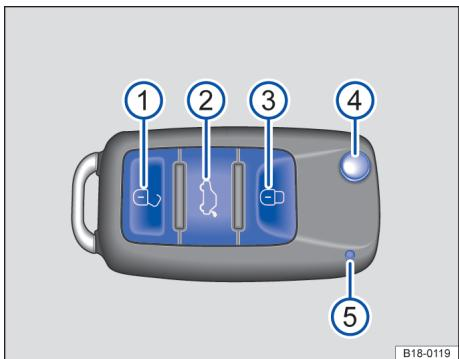  
图 40 遥控钥匙

 请首先阅读并注意引导信息和安全提示，见 ，第 50 页。

## 遥控钥匙

使用遥控钥匙可在距汽车一定距离范围内解锁和闭锁汽车。

带电池的发射器安放在遥控钥匙内。接收器在车内。遥控钥匙的作用范围在电池电量充足的情况下可在汽车周围达数十米。

如果汽车无法用遥控钥匙打开或关闭，则必须对遥控钥匙重新进行同步处理 ⇒ 第 51 页或更换遥控钥匙中的电池。

本车可配备多把遥控钥匙。

## 解锁和闭锁

  
图 41 遥控钥匙

 请首先阅读并注意引导信息和安全提示，见 ，第 50 页。

## ① 提示

● 每把钥匙内都有电子部件！请保护好钥匙，避免受潮和强烈震动。

● 请保持钥匙头凹槽的清洁。杂质（如织物纤维、灰尘等）会对钥匙的正常使用和点火锁造成不良影响。

i ● 在驾驶员车门开着的情况下，无法用遥控钥匙将车辆闭锁。这样可以防止驾驶员将自己锁在车外。

● 遥控钥匙只有在其作用范围之内才能将汽车解锁和闭锁。

● 汽车解锁后，如果 30 秒钟内没有打开车门或行李厢盖，汽车便会自动重新闭锁。这一功能可防止汽车在无意中被解锁。

● 如果用遥控钥匙无法将汽车解锁或闭锁，则必须对遥控钥匙进行同步处理，或者更换遥控钥匙中的电池。

● 如果汽车附近有发射器（如无线电设备、移动电话等）以相同的频率范围工作，遥控钥匙的功能会因这种干扰而暂时受到影响。请再次按压闭锁或解锁按钮启动相应功能。

● 按下解锁按钮后，转向灯闪烁2次。

● 按下闭锁按钮后，待所有车门及行李厢盖关闭后，转向灯闪烁1次。

● 遥控钥匙或中央门锁失效时，可以将遥控钥匙的折叠钥匙头翻开，手动将车门和行李厢盖解锁或闭锁。

按压遥控钥匙上的按钮 4 ⇒ 图 41可以将钥匙头打开。

在按下按钮的同时，遥控钥匙上的电池指示灯亮起5 。

遥控发射器和电池集成在遥控钥匙内，遥控接收器安装在车内。在电池电量充足的情况下，遥控钥匙的作用范围为汽车周围数十米。遥控钥匙与汽车之间的障碍物、恶劣的天气状况以及电池电量较低等情况都会使作用距离缩短。

## 车辆解锁

按压遥控钥匙上的按钮 1 ⇒ 图 41即可将车门、行李厢盖和油箱盖板解锁。

## 车辆闭锁

按压遥控钥匙上的按钮 3 ，可将所有车门、行李厢盖和油箱盖板闭锁。

## 行李厢盖解锁

按压遥控钥匙上的按钮 2 ，可将行李厢盖解锁。 

## 更换电池

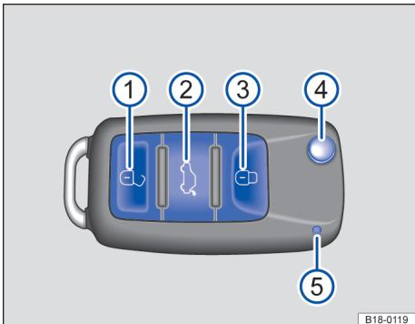  
图 42 遥控钥匙的电池指示灯

## 遥控钥匙同步调整

 请首先阅读并注意引导信息和安全提示，见 ，第 50 页。

如果遥控钥匙不能将汽车解锁或闭锁，则必须对其进行同步处理。

按压一下遥控钥匙上的按钮。⇒ 图 42

然后在一分钟之内用钥匙头将汽车解锁。

 请首先阅读并注意引导信息和安全提示，见 ，第 50 页。

在按压遥控器钥匙上的按钮时，如果遥控钥匙中的电池指示灯不亮 5 ⇒ 图 42，则必须尽快更换遥控钥匙中的电池。

建议前往上汽大众经销商处更换电池。

## ① 提示

使用的电池如果不合适，可能会损坏遥控钥匙。换上去的新电池电压和结构尺寸要与旧电池相同。

请按环保要求回收处理废旧电池。

如果经常在遥控钥匙的作用距离之外按压按钮则可能导致无法用遥控钥匙将汽车解锁和闭锁。此时必须对遥控钥匙进行同步调整。

额外的遥控钥匙可在上汽大众经销商处配制 并必须在那里进行同步处理。

补充信息和警告说明：
- 信息显示器中的个人便捷设置。
- 遥控钥匙 ⇒ 第 50 页
- 车门 ⇒ 第 58 页
- 行李厢盖 ⇒ 第 60 页
- 电动车窗升降器 ⇒ 第 63 页
- 天窗 ⇒ 第 67 页
- 应急关闭或打开 ⇒ 第 238 页

## 中央门锁和锁止系统

##  主题引言

该章节包含有关下列主题的信息：
中央门锁描述 ..... 54
从车外将汽车解锁和锁止 ..... 54
从车内将汽车解锁和锁止 ..... 55
防盗警示功能 ..... 55
解锁和锁止配备 Kessy 系统的汽车 ..... 55

当所有车门和行李厢盖都已完全关闭时，中央门锁才正常工作。在驾驶员侧车门已打开时，无法用遥控钥匙将汽车锁止。

如果将已解锁的汽车较长时间停放（例如在自家车库中），可能导致汽车蓄电池电量耗尽并且发动机无法再启动。

## i ● 遥控钥匙或中央门锁失灵时，可以手动将所有车门和行李厢盖解锁和闭

锁。⇒ 第 55 页

## 中央门锁描述

 请首先阅读并注意引导信息，见第 53 页。

中央门锁能以中控方式将所有车门和行李厢盖解锁或锁止：

● 从车外用遥控钥匙。

● 从车外通过 Kessy（无钥进入系

统）⇒ 第 55 页。

● 从车内用中央门锁按钮 ⇒ 第 55 页。

在遥控钥匙或中央门锁失灵时，可以对车门和行李厢盖进行手动解锁或锁止。 

## 从车外将汽车解锁和锁止

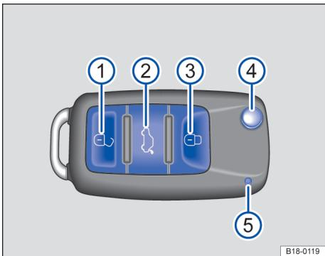

 请首先阅读并注意引导信息，见第 53 页。

## 图 43 遥控钥匙

<table><tr><td>功能</td><td>用遥控钥匙上的按钮⇒图 43 操作</td></tr><tr><td>汽车解锁。</td><td>按压按钮 1,按住即可便捷开启。</td></tr><tr><td>将汽车锁止。</td><td>按压按钮 3,按住即可便捷关闭。</td></tr><tr><td>行李厢盖解锁。</td><td>长按按钮 2,行李厢盖自动解锁。</td></tr></table>

当电池电量充足且遥控钥匙在汽车周围一定距离范围内时，遥控钥匙才能将汽车解锁和闭锁。转向信号灯通过闪烁，指示汽车解锁或闭锁。

在驾驶员侧车门已打开时，汽车无法用遥控钥匙锁止。如果将汽车解锁而不打开任何车门或行李厢盖，则汽车在30秒钟后会重新自动锁止。这一功能可防止汽车意外一直处于解锁状态。

## 便捷开启和关闭

● 参见电动车窗升降器 - 功能⇒ 第 63 页。

● 参见天窗 – 功能。⇒ 第 67 页

## 从车内将汽车解锁和锁止

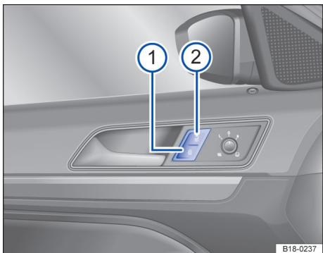  
图 44 驾驶员侧车门内：中央门锁按钮

 请首先阅读并注意引导信息，见第 53 页。

## 防盗警示功能

请首先阅读并注意引导信息，见第 53 页。

当车辆遇到以下情况时，防盗警示功能启动，警示喇叭响起：

## 解锁和锁止配备Kessy系统的汽车

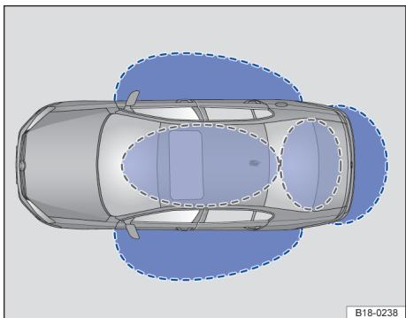  
图 45 无钥匙系统 Kessy：接近范围

请首先阅读并注意引导信息，见第 53 页。

Kessy 是一种无钥匙系统，它可以实现在不操作遥控钥匙的情况下解锁或锁止汽车。操作者只需随身携带一把有效遥控钥匙，并处于车门或行李厢盖的

## 按压按钮⇒ 图 44：

 汽车解锁。

 将汽车锁止。

中央门锁按钮在点火开关已打开和关闭的情况下都工作。

如果用中央门锁按钮锁止汽车，则会出现以下情况：

● 从车外无法打开车门和行李厢盖，例如遇交通信号灯停车时。

● 可以从车内通过拉动开门把手将车门解锁并打开。必要时必须重复拉动开门把手。

● 已打开的驾驶员侧车门不会同时锁止。这样可以防止驾驶员把自己锁在车外。

● 车辆闭锁约30秒后，若有人拉起车门锁止按钮并拉动车门内开扳手打开车门时。

该功能可以有效保护您的爱车及减少车内财物被盗的风险。

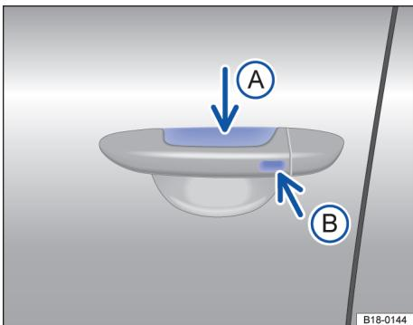  
图 46 无钥匙系统 Kessy：车门拉手上的传感区

有效感应区域内⇒ 图 45，同时触摸车门拉手上的传感区之一 图 46或按压行李厢盖上的按钮进行简单操作即可实现。

## 基本原理

如果有一把有效遥控钥匙在有效感应区域⇒ 图 45内，则无钥匙系统 Kessy 会将访问权限授予该钥匙。紧接着可以在不主动操作遥控钥匙的情况下执行以下功能：

● 无钥匙解锁：通过前门拉手或行李厢盖上的按钮将汽车解锁。

● 无钥匙启动：启动发动机并行驶。为此在车内必须有一把有效的遥控钥匙。

● 无钥匙闭锁：通过前门拉手之一将汽车锁止。

中央门锁和控制锁止系统如正常解锁和锁止时，系统一样工作。只是操作元件不一样。

通过所有转向信号灯的两次闪烁指示汽车解锁，通过所有转向信号灯的一次闪烁指示锁止。

如果将汽车解锁而不打开任何车门或行李厢盖，则汽车在30秒钟后会重新自动锁止。

## 解锁车门并打开

● 将手伸入前排车门拉手内侧区域⇒ 图 46（箭头A ）。

● 打开车门。

## 关闭车门并锁止

● 关闭驾驶员侧车门，触摸车门拉手上的传感器区⇒ 图 46（箭头 B ）一次。汽车锁止。

## 行李厢盖解锁和锁止

如果在行李厢盖的有效感应区域内⇒ 图 45有一把有效的遥控钥匙。

● 行李厢盖可如普通行李厢盖一样打开或关闭⇒ 第 61 页。

行李厢盖关闭后自动闭锁。

## 传感器的自动关闭

如果汽车较长时间未解锁或锁止，则副驾驶员侧车门和后车门上的传感器自动关闭。

如果在汽车已锁止时车门拉手上的一个传感区过于频繁地触发（例如由于树枝摩擦车尾），则汽车相关侧的所有传感区自动关闭约 30 分钟。如果只涉及驾驶员侧车门上的传感区，则只这个传感区自动关闭。

当出现下列情况之一，这些传感器重新激活：

● 30 分钟已过去。

● 或：用遥控钥匙上的按钮  将汽车解锁。

● 或：打开行李厢盖。

● 或：用钥匙将汽车机械解锁。

## 舒适功能

● 要便捷关闭所有电动车窗和天窗，请用手指按住车门拉手上的传感区⇒ 图 46 B 几秒钟。

● 松开传感区⇒ 图 46 B 即可中断该功能。如果在松开车门拉手上的传感区⇒ 图 46 B 后立即将手放入A 内，则所有车窗自动打开（安全功能）⇒ 第 63 页。

## 暂时关闭无钥匙进入系统（Keyless Access）

\- 用车辆钥匙上的按键闭锁车辆。

\- 同时在五秒钟之内通过车门闭锁传感器锁止车辆。

\- 则可暂时关闭无钥匙进入系统（KeylessAccess）。

此时，只能通过车辆钥匙解锁车辆。

车辆在下次解锁后，将重新激活“无钥匙进入系统（Keyless Access）”

无钥匙进入系统是否具有关闭功能，视车辆配置及软件状态而定。详情请咨询上汽大众经销商。

## 警告

配备Kessy系统的车辆,必须在上电的情况下拖车。

## 小心

在对后保险杠进行清洗或维修作业时可能会意外地打开行李厢盖，可能导致行李厢开启范围内的人员受伤或物品损坏。

● 请不要将有效钥匙放置在行李厢盖感应开启的范围内。

## ① 提示

配备Kessy系统的车辆,如果有钥匙遗留在车内,此时在车外将车门闭锁,车辆暂时不会锁止,所有转向信号灯闪烁四次.请注意,如果不进行其他操作(例如开启车门),短时间后车辆会自动锁止,钥匙将被锁在车里。

## ①提示

车门把手严重脏污可能影响传感器的功能。如果有一股强力水柱或水流从车门把手位置处喷出，且有一把有效的车钥匙处于工作范围内，则可能启用车门把手内的传感器。

## ① 提示

如果有水柱或水流从车门把手传感器⇒ 图 46 A （箭头）处暂时移开，然后又移回（例如洗车时），则所有车窗均有可能打开⇒ 第 56 页，便捷功能。

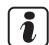

当使用Kessy系统锁止汽车后，2秒内将无法再次使用Kessy系统解锁汽车。

i 在汽车蓄电池或遥控钥匙中的电池电量低或电量耗尽时，可能无法通过 kessy 解锁或锁止汽车。

i 如果系统没有搜索到车内有效的钥匙，则将在仪表组显示器内显示相应的提示信息。

i Kessy系统使用无线电通信。当车辆处在下述环境中，Kessy键启动功能可能会受到影响。

● 遥控钥匙电池电量耗尽时

● 靠近电视塔、移动通信基站、飞机场或其他产生强烈无扰的设施时

● 当附近有移动电话、对讲机或其他通信设备工作时

● 当附近有其他遥控钥匙工作时

● 遥控钥匙和金属物体接触被其覆盖时

i 车门把手传感器的功能可能会由于污物受限，例如积盐。如有必要清洁车辆⇒ 第 208 页

i 配备自动变速箱的汽车只有当选挡杆在位置 P上时，才能锁止。 

## 车门

##  主题引言

该章节包含有关下列主题的信息：

58儿童安全锁 . . . 58

补充信息和警告说明：

● 外观视图 ⇒ 第 11 页

● 遥控钥匙 ⇒ 第 50 页

● 中央门锁和锁止系统 ⇒ 第 53 页

● 应急关闭或打开⇒ 第 238 页

<table><tr><td>警告</td></tr><tr><td>未正确关好的车门可能会自行开启,可能导致人身伤害和交通事故!</td></tr><tr><td>关闭车门时切勿疏忽大意。否则可能会给您自己或他人造成严重的人身伤害!每次关闭车门时都要确保车门的转动范围内没有人。</td></tr></table>

## 警告灯

请首先阅读并注意引导信息和安全提示，见 ，第 58 页。

<table><tr><td>亮起</td><td>可能的原因</td><td>解决措施</td></tr><tr><td></td><td>至少一个车门已打开或未正确关闭。</td><td>请勿继续行驶!请打开相应的车门并重新关闭。</td></tr></table>

在打开点火开关时，某些警告灯和指示灯会短暂亮起，表明在进行功能检测。如果车辆状态正常，在几秒钟后会消失。

如果一个车门已打开或未正确关闭，则显示屏上的警告灯  会亮起。

## 儿童安全锁

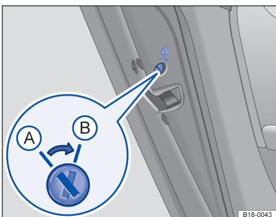

图 47 在左后车门中：儿童安全锁 A 已关闭、 B已接通

视汽车装备而定，可能在显示屏上显示一个符号来代替警告灯。显示在点火开关已关闭的情况下也能看到。

 请首先阅读并注意引导信息和安全提示，见 ，第 58 页。

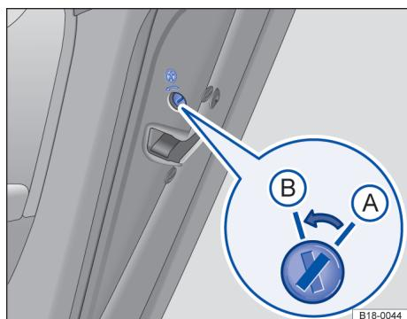  
图 48 在右后车门中：儿童安全锁 A 已关闭、 B已接通

儿童安全锁可防止从车内打开后车门，例如可避免儿童在行驶过程中意外打开车门。在儿童安全锁已接通时，车门只能从车外打开。

## 接通或关闭儿童安全锁

● 将汽车解锁，然后打开相应的后车门。

● 用钥匙将槽口转到所需位置。

槽口的位置⇒ 图 47 或⇒ 图 48：

儿童安全锁已关闭。A

儿童安全锁已接通。B

## 警告

在儿童安全锁已接通时，相应的车门无法从车内打开。

● 在车门锁止的情况下，切勿将儿童或需要帮助的人员留在车内。否则可能导致这些人员将自己困在车内。在紧急情况下，他们可能无法自行离开汽车或无法自救。困在车内的人员可能要承受很高或很低的温度。

● 视季节而定，在锁止的汽车中可能出现很高或很低的温度，尤其可能引起幼儿受伤和生病或导致死亡。

## 行李厢盖

##  主题引言

该章节包含有关下列主题的信息：

警告灯 60

打开行李厢盖 . 61

关闭行李厢盖 . . 62

## 补充信息和警告说明：

● 外观视图 ⇒ 第 11 页

● 中央门锁 ⇒ 第 53 页

● 运输行李物品装载 ⇒ 第 114 页

● 应急关闭或打开⇒ 第 238 页

## 警告

行车期间行李厢盖都必须处于关闭状态。

● 请注意在行李厢盖关闭后锁止机构是否完全牢靠地锁止好。否则其在行车期间可能会突然打开。

## 警告（续）

● 关闭行李厢盖时切勿疏忽大意。否则可能会给您自己或他人造成严重伤害！要确保在行李厢盖的转动范围内没有人。

● 打开行李厢盖时没有固定好的松散物品可能会掉落出来造成人身伤害。

● 请勿让儿童在汽车内或汽车旁玩耍。取决于季节情况，已闭锁的汽车内可能会非常热或非常冷，可能导致车内乘员严重伤害、生病，甚至死亡。在不使用汽车时，要关好并锁止行李厢盖及所有其它车门。在此之前要确认车中无人。

● 如果在某些情况下不得不开着行李厢盖行驶，则务必注意所有的有关说明，以减少因废气进入车内而带来的中毒危险。

## 警告灯

## 请首先阅读并注意引导信息和安全提示，见 ，第 60 页。

<table><tr><td>亮起</td><td>可能的原因</td><td>解决措施</td></tr><tr><td></td><td>行李厢盖已打开或未正确关闭。</td><td>请勿继续行驶!请打开行李厢盖然后重新关闭。</td></tr></table>

在打开点火开关时，某些警告灯和指示灯会短暂亮起，表明在进行功能检测。如果车辆状态正常，在几秒钟后会消失。

如果行李厢盖已打开或未正确关闭，则显示屏上的警告灯  会亮起。

视汽车装备而定，可能在显示屏上显示一个符号来代替警告灯。显示在点火开关已关闭的情况下也能看到。

## 打开行李厢盖

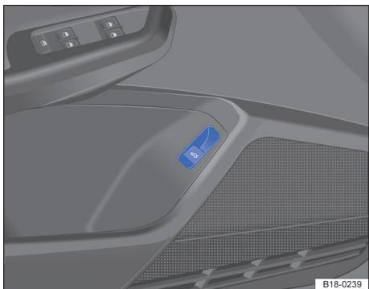  
图 49 部分车型行李厢盖解锁按钮

 请首先阅读并注意引导信息和安全提示，见 ，第 60 页。

## 行李厢盖解锁

按住按钮 ⇒ 图 49，行李厢盖解锁。

按住遥控钥匙上的按钮 ⇒ 图 43 2 ，行李厢盖解锁。

如果行李厢盖开着或未正确关闭，显示屏中就会出现相应显示。

## 配备Kessy系统的汽车

钥匙在行李厢盖的有效范围内，可以直接通过行李厢盖上的按钮将其打开⇒ 图 50。

## 手动打开

● 按住按钮 ⇒ 图 49，行李厢盖解锁。

● 向上拉起图示按钮⇒ 图 50打开行李厢。

## 警告

如果您在某些情况下不得不开着行李厢盖行驶，则请注意以下警告说明：

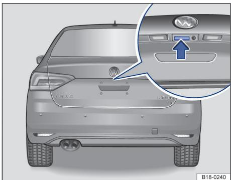  
图 50 从车外打开行李厢盖

## 警告（续）

● 为减少废气进入车内造成中毒的危险：

● 关闭所有车窗。

● 关闭天窗。

● 关闭空气内循环模式。

● 打开仪表板上的出风口。

● 将鼓风机开到最高挡。

● 小心并有预见性地驾驶。避免急加速或紧急制动，因为此时开着的行李厢盖可能会发生移动，

## 有人身伤害危险！

● 对从行李厢中伸出的物品必须加以特别的标识，否则有发生事故的危险！在此情况下，请遵守有关的现行法规。

● 务必将所有物品牢靠安全地固定在行李厢中。松散的物品可能会从车中掉出来，威胁到后方车辆与行人。

## ①提示

遥控钥匙或中央门锁失灵时可以手动将行李厢盖解锁。

## 关闭行李厢盖

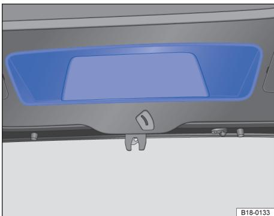  
图 51 行李厢盖：用来拉动箱盖的凹槽

 请首先阅读并注意引导信息和安全提示，见 ，第 60 页。

## 关闭行李厢盖

● 抓住行李厢盖内饰中的凹槽⇒ 图 51或⇒ 图 52。

● 快速用力向下拉行李厢盖，直到其卡止在锁中。

● 拉动行李厢盖检查是否也已可靠卡止。

在车辆闭锁的情况下，如果用遥控钥匙将行李厢盖单独解锁，行李厢盖关闭后会立刻锁止。

如果行李厢盖开着或未正确关闭，显示屏中会出现相应显示。

## 警告

如果没有按规定关闭行李厢盖，可能会有危险。

● 不要用手压在后窗玻璃上关闭行李厢盖。否则车窗玻璃可能会破裂，有人身伤害危险！

● 请确认在行李厢盖关闭后锁止机构是否被牢靠地锁止。否则，在行车期间行李厢盖可能会突然打开。

● 请勿让儿童在汽车内或汽车旁玩耍。取决于季节情况，已闭锁的汽车内可能非常热或非常冷，可能导致车内乘员受到严重伤害，生病，基至死亡。在不使用汽车时，要关好并锁止行李厢盖及所有其它车门。在此之前要确认车中无人。

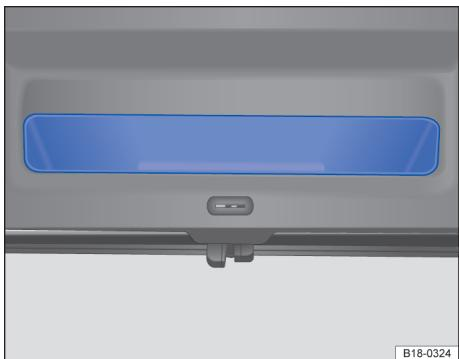  
图 52 部分车型行李厢盖：用来拉动箱盖的凹槽

## 警告（续）

● 关闭行李厢盖时切勿疏忽大意。否则可能会给您自己或他人造成严重伤害！要确保在行李厢盖的转动范围内没有人。

● 请阅读和遵守关于使用行李厢盖的安全说明⇒  ，在主题引言中，见第 60 页。

## 警告

行车期间行李厢盖都必须处于关闭状态。

● 请注意在行李厢盖关闭后锁止机构是否完全牢靠地锁止好。否则其在行车期间可能会突然打开。

● 关闭行李厢盖时切勿疏忽大意。否则可能会给您自己或他人造成严重伤害！要确保在行李厢盖的转动范围内没有人。

● 打开行李厢盖时没有固定好的松散物品可能会掉落出来造成人身伤害。

● 请勿让儿童在汽车内或汽车旁玩耍。取决于季节情况，已闭锁的汽车内可能会非常热或非常冷，可能导致车内乘员严重伤害、生病，甚至死亡。在不使用汽车时，要关好并锁止行李厢盖及所有其它车门。在此之前要确认车中无人。

● 如果在某些情况下不得不开着行李厢盖行驶，则务必注意所有的有关说明，“打开行李厢盖”，以减少因废气进入车内而带来的中毒危险。

## 电动车窗升降器

##  主题引言

该章节包含有关下列主题的信息：
电动打开或关闭车窗 ..... 64
前排乘员和后排车门的电动车窗升降器 ..... 65
电动车窗防夹功能 ..... 65
点火开关关闭状态下的车窗玻璃升降器功能 ..... 65
车窗玻璃自动升降及防夹功能的恢复 ..... 66
车窗玻璃升降电机过热保护 ..... 66

## 补充信息和警告说明：

● 信息显示器 ⇒ 第 27 页

● 中央门锁和锁止系统 ⇒ 第 53 页

## 警告

如果没有按规定使用车窗升降开关，可能导致人身伤害！

## 警告（续）

● 关闭车窗时切勿疏忽大意。否则可能会给您自己或他人造成严重伤害！因此要确保车窗的移动范围内没有人。

● 每次离开汽车时都要随身携带车钥匙。

● 切勿让儿童或需要帮助的人员单独逗留在车内，因发生紧急情况时，可能无法自行打开车窗。滥用车钥匙（例如儿童玩耍）可能会导致严重的人身伤害和事故。

● 每次离开汽车时都要随身携带所有汽车钥匙。在关闭点火开关后，只要没有打开驾驶员车门或副驾驶员车门，在短时间内仍能通过车门内的按钮打开或关闭车窗。

● 在后排长条座椅上带乘儿童时，务必通过安全按钮停用后部车窗升降器，以免车窗可能被打开或关闭。

电动打开或关闭车窗

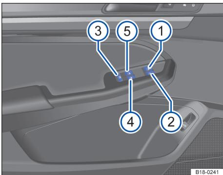  
图 53 在驾驶员侧车门内：前部和后部车窗升降器的按钮

 请首先阅读并注意引导信息和安全提示，见 ，第 63 页。

## 驾驶员侧车门上的按钮

⇒ 图 53 的图例：

用于左前车门上的车窗。1

用于右前车门上的车窗。2

安全按钮。3

用于右后车门上的车窗。4

用于左后车门上的车窗。5

## 打开或关闭车窗

<table><tr><td>功能</td><td>操作</td></tr><tr><td>打开:</td><td>按压按钮 📄。</td></tr><tr><td>关闭:</td><td>拉动按钮 📄。</td></tr><tr><td>停止自动升降:</td><td>再次按压或拉起相应车窗的按钮。</td></tr><tr><td></td><td>安全按钮⇒图 533停用后车门内的车窗升降器按钮。这时按钮中的黄色指示灯亮起。</td></tr></table>

在关闭点火开关后，只要没有打开驾驶员侧车门或副驾驶员侧车门，在短时间内仍能通过车门内的按钮打开或关闭车窗。在从点火开关中拔出遥控钥匙并打开驾驶员侧车门后，通过操作驾驶员侧车门内的相应车窗按钮并保持住，可以打开或关闭所有电动车窗。便捷开启或关闭在数秒钟后开始。

## 前排乘员和后排车门的电动车窗升降器

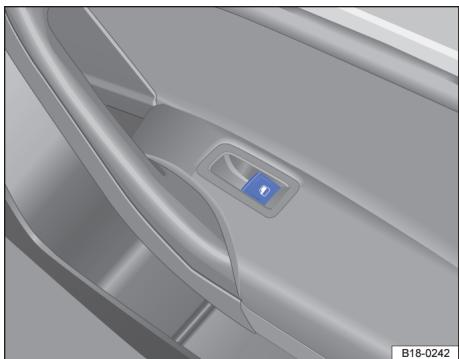  
图 54 在前排乘员和后排车门内：车窗升降器的按钮

## 电动车窗防夹功能

 请首先阅读并注意引导信息和安全提示，见 ，第 63 页。

电动车窗防夹功能可以降低关闭车窗时的挤伤危险⇒  。如果某个车窗的自动上升（关闭过程）不畅或受阻，则该车窗会立即重新自动打开。

● 请检查该车窗为何关闭受阻。

● 重新尝试关闭该车窗。

● 在关闭过程中如果车窗在10秒内有2次因被障碍物阻止而重新打开，自动上升功能便会暂停10秒钟。

● 如果连续几次车窗在关闭过程中一直因运行不畅或碰到障碍物而不能关闭，车窗便会停在这个位置，防夹功能会暂时失效⇒  。

● 如果发生故障，则自动升降功能以及防夹功能都无法正常运行。在这种情况下请联系上汽大众经销商寻求支持。

## 点火开关关闭状态下的车窗玻璃升降器功能

 请首先阅读并注意引导信息和安全提示，见 ，第 63 页。

只要驾驶员或前排乘员侧车门没有打开，车窗玻璃升降器在点火开关关闭后约10分钟内仍可操作。

在点火开关关闭后，车辆玻璃升降器无自动上升、自动下降和防夹功能。 在车外关闭或打开前排车窗玻璃，只需将钥匙插在驾驶员侧锁孔内并保持在闭锁或解锁位置。

请首先阅读并注意引导信息和安全提示，

见 ，第 63 页。

前排乘员和后排车门上的按钮

打开或关闭车窗

<table><tr><td>功能</td><td>操作</td></tr><tr><td>打开:</td><td>按压按钮 📄。</td></tr><tr><td>关闭:</td><td>拉动按钮 📄。</td></tr></table>

在关闭点火开关后，只要没有打开驾驶员侧车门或副驾驶员侧车门，在短时间内仍能通过车门内的按钮打开或关闭车窗。在从点火开关中拔出遥控钥匙并打开驾驶员侧车门后，通过操作驾驶员侧车门内的相应车窗按钮并保持住，可以打开或关闭所有电动车窗。

## 警告

如果没有按规定使用车窗升降开关，可能导致人身伤害！

● 当您离开汽车（包括临时走开）时，务必随手拔出点火钥匙。请注意，切勿让儿童逗留在汽车内无人照料。

● 关闭车窗时切勿疏忽大意。否则可能会给您自己或他人造成严重伤害！因此要确保车窗的移动范围内没有人。

● 从车外将汽车闭锁时车内不得有人，因为造成人身伤害的危险情况时无法从车内打开车窗！

● 防夹功能不能防止手指等部位被挤压到车窗框上，谨防人身伤害！

## 警告

由于此时车窗玻璃升降器没有防夹功能，因此在关闭车窗时需格外当心，不加留意地或不加控制地关闭车窗玻璃可能造成严重挤伤！

## ①提示

在断开后重新接通汽车蓄电池，电动车窗玻璃升降器的自动升降功能可能会暂时失效。

## 车窗玻璃自动升降及防夹功能的恢复

 请首先阅读并注意引导信息和安全提示，见 ，第 63 页。

## 车窗玻璃升降电机过热保护

 请首先阅读并注意引导信息和安全提示，见 ，第 63 页。

在车窗玻璃自动升降及防夹功能失效后，您可以拉起或按下相应车窗的升降开关并保持，将车窗玻璃升到顶，之后松开车窗玻璃升降开关并再次拉起或按下。恢复车窗玻璃自动升降及防夹功能。

当您连续升降车窗玻璃数次后，为防止玻璃升降电机过热发生损坏，车窗玻璃升降功能将可能会暂时关闭几秒钟，请您等待功能恢复后再操作。

该章节包含有关下列主题的信息：
打开或关闭天窗 ..... 67
天窗 - 功能 ..... 67
天窗的防夹功能 ..... 68

## 天窗

##  主题引言

补充信息和警告说明：

● 信息显示器⇒ 第 27 页

● 中央门锁和锁止系统⇒ 第 53 页

● 应急关闭或打开⇒ 第 238 页

## 警告

不正确地或无人监管地使用天窗,可能造成人身伤害！

## 警告（续）

● 打开和关闭天窗时切勿疏忽大意。否则可能会给您自己或他人造成严重伤害！应确保天窗的移动范围内没有人。

● 每次离开汽车时都要随身携带遥控钥匙。

● 切勿让儿童或需要帮助的人员单独逗留在车内，特别是在他们能接触到遥控钥匙时。滥用遥控钥匙可能导致启动发动机或操作电气装备（例如天窗），有发生事故的危险！如果用遥控钥匙将汽车车门闭锁，在紧急情况下会加大从车外救助的难度。

● 关闭点火开关后打开前排车门，则天窗旋转开关不起作用。

## ① 提示

每次离开本车前都应关闭天窗。在天窗开着的情况下，降雨可能会使车内湿透，从而导致车辆损坏。

## 打开或关闭天窗

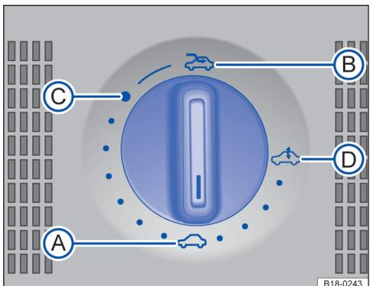

图 55 在顶篷中：天窗的旋转开关

请首先阅读并注意引导信息和安全提示，见 ，第 67 页。

## 天窗 – 功能

请首先阅读并注意引导信息和安全提示，见 ，第 67 页。

便捷关闭

天窗可以从车外用遥控钥匙关闭：

将转动开关⇒ 图 55转到所需的位置，以调至天窗的以下位置：

关闭。A

完全滑动打开。B

水平开启。C

倾斜开启。D

天窗只在点火开关已打开的情况下工作。关闭点火开关后，只要没有打开驾驶员侧车门或副驾驶员侧车门，在短时间内仍能打开或关闭天窗。

## 活动顶篷

活动顶篷与天窗一起打开，并且可在天窗已关闭时手动滑动关闭。

● 按住遥控钥匙的锁止按钮。天窗于是关闭。

● 松开锁止按钮即可中断该功能。

在便捷关闭时，首先关闭车窗，然后关闭天窗。

## 警告

不按规定使用天窗和遮阳卷帘可能导致人身伤害。

## 天窗的防夹功能

 请首先阅读并注意引导信息和安全提示，见 ，第 67 页。

防夹功能可以降低关闭天窗时的挤伤危险 ⇒  。如果天窗的关闭不畅或受阻，则天窗会立即重新自动打开。

● 检查天窗为何未关闭。

● 重新尝试关闭天窗。

● 如果天窗仍旧因不畅或受阻而无法关闭，则天窗在相应的位置上停住。然后在无防夹功能的情况下关闭天窗。

## 在无防夹功能的情况下关闭天窗

● 将转动开关在前部位置⇒ 图 55 A 处按住，直到天窗完全关闭为止。

● 如果天窗仍旧无法关闭，请到上汽大众经销商检修。

## 警告（续）

● 打开和关闭天窗或遮阳卷帘时切勿疏忽大意。否则可能会给您自己或他人造成严重伤害！请确保全景滑动天窗和遮阳卷帘的移动范围内没有人。

i ● 便捷开启或关闭天窗时，天窗的旋转开关处于上次所选的位置，开始行车前必须将其重 ●置。

● 如果汽车附近有发射器（如无线电设备、移动电话等）以相同的频率范围工作，遥控钥匙的功能会因这种干扰而暂时受到影响。请再次按压闭锁或解锁按钮启动相应功能。

## 警告

不正确地使用天窗和遮阳卷帘可能导致人身伤害。

● 关闭天窗或遮阳卷帘时切勿疏忽大意。否则可能会给您自己或他人造成严重伤害！因此要确保天窗或遮阳卷帘的移动范围内没有人。

● 天窗关闭过程中具有自动防夹功能，但出于保护电机需要，不要无故尝试。

● 避免在灰尘较大、路面情况不好等情况下开启天窗，以免天窗轨道油脂受到污染，造成机构零件过度磨损，天窗排水管堵塞等现象。

● 为确保天窗能正常工作，请经常洗车并按照保养要求前往上汽大众经销商处对天窗进行检修保养。

● 在洗车房洗车时一定要完全关闭天窗。不得使用高压水枪的水流直接冲击天窗密封条，避免由于高压水枪压力太高而造成天窗漏水。

i 防夹功能在用遥控钥匙便捷关闭车窗和天窗时也起作用

## 正确和安全地就座

## 调整座椅位置

##  主题引言

正确坐姿 ..... 70
错误坐姿引起的危险 ..... 70
调整方向盘位置 ..... 71
前部手动座椅调节 ..... 72
前座椅上的电动操作元件 ..... 73
电动座椅调节 ..... 73
后排座椅调节 ..... 74
头枕调整 ..... 75
头枕拆卸和安装 ..... 76

## 座位数

本车总共有五个座位：两个前部座位和三个后部座位。每个座位都配备有安全带。

补充信息和警告说明：

● 座椅功能 ⇒ 第 80 页

● 安全带 ⇒ 第 81 页

● 安全气囊系统 ⇒ 第 90 页

● 儿童座椅（附件）⇒ 第 94 页

## 警告

在突然行驶和制动时、在发生撞车或事故时和在安全气囊触发时，错误的坐姿会增大受伤或致命伤的风险。

● 所有乘员在起步前都必须始终以正确的坐姿坐好并在行驶过程中保持正确坐姿。这也适用于安全带的佩戴。

● 乘员数不得超过车内配安全带的座位数。

● 儿童要始终用许可的、合适的且符合其身高和体重的乘员保护系统固定在车内⇒ 第 94 页、⇒ 第 90 页。

## 警告（续）

● 轿车行驶时双脚务必始终置于各自脚部空间内，切不可将双脚搁在仪表板或伸到车窗外，否则，安全气囊和安全带将不能充分发挥保护作用，发生事故时极易受伤。

## 警告

在每次行车前，务必将座椅、安全带和头枕进行正确调节并确认所有乘员都已正确系好安全带。

● 尽量往后移动副驾驶员座椅。

● 调节驾驶员座椅，确保胸部和方向盘中部之间至少有 25 cm的距离。如果由于身体情况不能满足该要求，务必与上汽大众经销商联系，以便在必要时安装特殊装备。

● 切勿在座椅靠背向后倾斜过大的情况下驾驶。座椅靠背越向后倾，因安全带佩戴走向错误和坐姿错误而导致的受伤风险就越大。

● 切勿在座椅靠背向前倾斜的情况下驾驶。前部安全气囊触发时可能向后猛击座椅靠背并伤害到后座上的乘员。

● 轿车行驶时前排人员应离方向盘和仪表板尽可能远。

在前座椅已正确调节好后，就座时务必背部垂直靠在座椅靠背上。不得使任何身体部位紧贴安全气囊的安装位置，或与之靠得太近。

● 若后排乘员因安全带佩戴部位不当导致坐姿不正，将更易严重受伤。

## 警告

不恰当地调节座椅可能导致事故和受伤。

● 只能在汽车停住时调节座椅，否则座椅可能在行驶过程中意外自行移动并且汽车可能会失去控制。此外在调节时会采取错误的坐姿。

● 调整座椅高度或位置时一定要小心！调整前座椅时如不注意可能会造成挤伤。

● 不允许有物品限制前排座椅的调节范围。

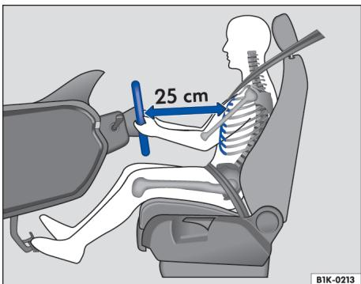  
图 56 驾驶员与方向盘之间至少保持为25 cm的距离

##  请首先阅读并注意引导信息和安全提示，见 ，第 69 页。

下面给出了所有汽车乘员的正确坐姿。

## 驾驶员的正确坐姿

驾驶员的坐姿是否正确对安全性和降低疲劳程度至关重要。

为降低事故伤亡程度，建议驾驶员对座椅作如下调节：

● 调节方向盘，使驾驶员胸部与方向盘之间至少保持 25cm 的距离⇒ 图 56。

● 前后移动座椅至合适位置，稍弯膝即可完全踏下加速踏板、制动踏板及离合器踏板。

● 调整座椅高度至合适位置，使双手可够到方向盘的最高点。

● 调节头枕，使头枕的上沿与您的头顶等高，不可低于眼睛，头部尽可能贴近头枕。⇒ 图 57。

● 将靠背调节至合适位置，使背部完全贴合靠背。

● 正确佩戴安全带⇒ 第 81 页。

● 将双脚置于脚部空间内自己觉得舒服的位置。

## 前排乘员的正确坐姿

前排乘员与仪表板之间必须保持适当的距离，发生事故安全气囊触发时安全气囊方能充分发挥保护作用。

## 错误坐姿引起的危险

 请首先阅读并注意引导信息和安全提示，见 ，第 69 页。

坐姿不正确可能导致乘员严重受伤！

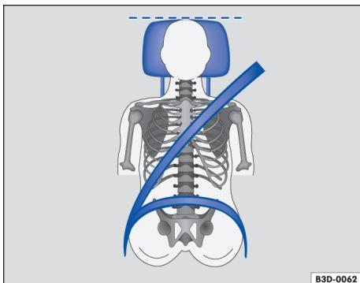  
图 57 驾驶员头枕的正确位置

为降低事故伤亡程度，建议前排乘员对座椅作如下调节：

● 尽可能后移座位。

● 将靠背调节至合适位置，使背部与靠背完全贴合。

● 调节头枕，使头枕上沿与头顶等高，但勿低于眼睛，头部尽可能靠近头枕⇒ 第 75 页。

● 双脚置于座椅前的脚部空间内。

● 正确佩戴安全带⇒ 第 81 页。

## 后排乘员的正确坐姿

为降低紧急制动或发生事故时的伤亡率，后排乘员须遵守下列事项：

● 将靠背锁定在直立位置。

● 正确调节头枕，使其上沿与头顶等高，但勿低于眼睛，头部尽可能贴近头枕⇒ 第 75 页。

● 请以垂直姿势坐在后座椅上，以使背部可以完全靠在靠背上。

● 双脚置于后排座椅前的脚部空间内。

● 正确佩戴安全带⇒ 第 81 页。

● 携带儿童行驶时应采用合适的儿童座椅保护儿童⇒ 第 94 页 。

正确佩戴安金带方能充分发挥其保护作用、而坐资不正确且安全带佩戴不当时将大大降低安全带的保护功能，加大乘员的受伤风险。作为驾驶员，您有责任对您自身及乘员的安全，尤其是儿童的安全负责！

下列不正确坐姿均可能危及车内所有驾乘人员。虽未涵盖所有不正确坐姿，但上汽大众希望您了解不正确坐姿的危害性。

## 因此，行驶中务必杜绝下列不正确坐姿：

● 站在车内；

● 站在座椅上；

● 跪在座椅上；

● 靠背向后过度倾斜；

● 倚靠在仪表板上；

● 躺在后排座椅上；

● 坐在座椅前沿；

● 倚坐在一侧；

● 倚靠在车窗上；

● 双脚伸出车窗；

● 双脚搁在仪表板上；

● 双脚搁在座椅面上；

● 在脚部空间内活动；

● 不系安全带在座椅上活动；

● 在行李厢里载人。

## 警告

上述不正确坐姿均可导致乘员严重受伤！

● 发生事故时触发的安全气囊将撞击坐姿不正的乘员，使之严重受伤。

● 汽车起步前，驾驶员应采取正确坐姿，并在途中全程保持正确坐姿。同时，提醒车内乘员也保持正确坐姿 。

## 调整方向盘位置

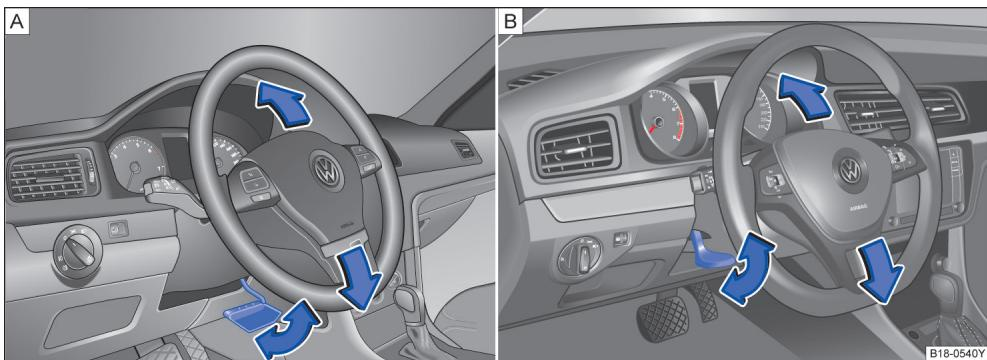  
图 58 调节方向盘位置

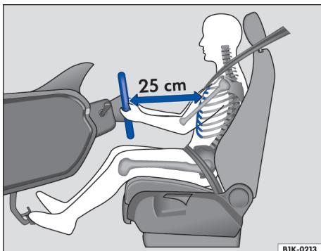  
图 59 示意图：驾驶员的正确坐姿

  
请首先阅读并注意引导信息和安全提示，见 ，第 69 页。

在行驶前并且只能在汽车停住时调节方向盘。

● 将图示操纵杆向下翻转。

● 调节方向盘，确保双手握住外缘（9 点钟和 3点钟位置）时手臂处于略微弯曲的状态。

● 将操作杆用力向上推，直到它回复到锁止位置。⇒  。

## 警告

不恰当地使用方向盘位置调节和错误调节方向盘可能导致受伤或致命伤。

● 每次调节后都要用力向上转动操作杆，以免方向盘在行驶过程中意外发生位置变化。

● 切勿在行驶过程中调节方向盘。如果在行驶过程中确定必须进行调节，则请安全停车，然后正确调节方向盘。

## 警告（续）

● 调节好的方向盘必须始终朝着胸部方向而非面部方向，以免在发生事故时影响驾驶员前部安全气囊的保护效果。

● 在行驶过程中始终只能用双手从侧面握住方向盘外缘（9点钟和3点钟位置），以降低驾驶员前部安全气囊触发时造成的伤害。

● 切勿在12点钟位置上或以其它方式握住方向盘，例如握住方向盘中心。驾驶员安全气囊触发时可能给双臂、双手和头部造成受伤。

## 警告（续）

● 调整好驾驶员座椅或方向盘，使方向盘与胸部之间的距离至少为25cm⇒ 图 59。如果没有保持上述最小距离，则安全气囊系统无法对您进行保护，会有生命危险！

## 前部手动座椅调节

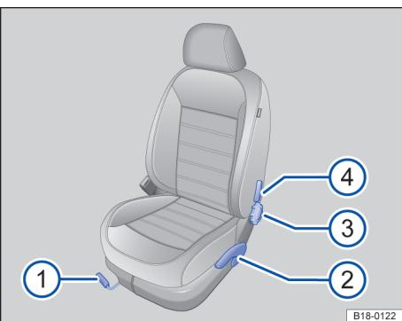

##  请首先阅读并注意引导信息和安全提示，见 ，第 69 页。

通过调整操作杆 4 可以加大或减小腰部支撑衬垫的拱形程度，从而有效地支撑自然弯曲的腰部脊柱。

图 60 前部手动座椅上的操纵元件

<table><tr><td>⇒图 60</td><td>功能</td><td>操作</td></tr><tr><td>1</td><td>调整座椅前后位置</td><td>向上拉动手柄,然后前后移动座椅。</td></tr><tr><td>2</td><td>调整座椅高度</td><td>上拉或下压操作杆,可调节座椅高度。</td></tr><tr><td>3</td><td>调整座椅靠背倾斜角度</td><td>略微离开靠背,然后转动手轮可调整靠背倾斜角度。</td></tr><tr><td>4</td><td>调整腰部支撑</td><td>旋转操作杆,可调整腰部支撑。</td></tr></table>

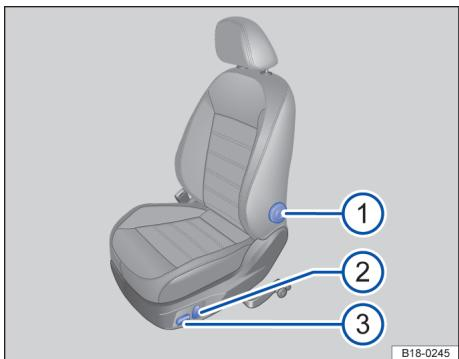  
图 61 电动调整式座椅的操作元件

 请首先阅读并注意引导信息和安全提示，见 ，第 69 页。

请移动相应的开关⇒ 图 61 ，把座椅调整得与身材相适应。

调整腰部支撑。1

调整座椅靠背倾斜角度。2

调整座椅前后位置、座椅面高度。3

## 警告

粗心或无人监管地使用电动前座椅可能导致受伤。

● 前座椅的电动调节在点火开关已关闭的情况下仍然工作。切勿将儿童或需要帮助的人员留在车内。

## 电动座椅调节

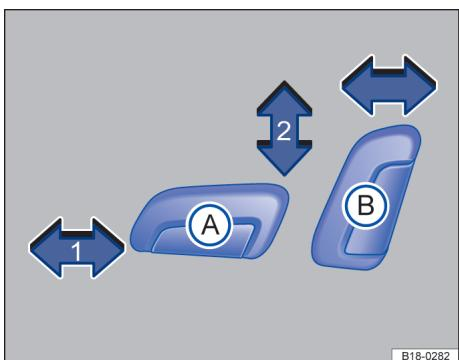  
图 62 开关：调整座椅的前后位置、座椅面的高度和座椅靠背的倾斜角度

## 警告

不正确地使用座椅套或座椅垫可能意外启动电动座椅，导致前排座椅在驾驶时意外移动。为此你可能失去对车辆的控制，导致事故和受伤。此外，可能损坏前部座椅的控制元件。

● 不要将座椅套安装到电动座椅控制器上。

● 不要使用未经上汽大众认可的前排座椅套或座椅垫。

## ① 提示

为了避免损坏前座椅中的电动部件，请勿跪在前座椅上或使座椅面和座椅靠背承受类似的负荷。

在汽车蓄电池的电量过低时，可能无法电动调节座椅。

在启动发动机时，可能正在进行的座椅调节会被取消。

请首先阅读并注意引导信息和安全提示，见 ，第 69 页。

该图为驾驶员座椅侧面开关的示意图。座椅、椅面、靠背和腰部支撑随着相应开关的移动而调整。

座椅上的机械式和电动操作元件可以组合安装。

沿箭头方向按压开关：

<table><tr><td rowspan="2">A</td><td>1</td><td>向前或往后移动座椅。</td></tr><tr><td>2</td><td>调高或调低座椅。</td></tr><tr><td>B</td><td>向前或往后。</td><td>调节座椅靠背的倾斜度。</td></tr></table>

## 警告

● 行驶期间切勿调整驾驶员座椅或副驾驶员座椅。调整座椅期间坐姿会变得不正确，有生命危险！只能在汽车停住时调整驾驶员座椅或副驾驶员座椅。

● 在点火开关已关闭的情况下，仍然可以对前排座椅进行电动调整。因此，切勿让无人照料儿童单独逗留在车内，否则有人身伤害危险！

● 调整座椅高度或前后位置时一定要小心！调整前座椅时如不注意可能会造成挤伤！

● 为了降低紧急制动时或发生交通事故时驾驶员和副驾驶员人身伤害的危险，切勿在座椅靠背向后倾斜过大的情况下行车！只有在座椅靠背处于

## 警告（续）

垂直位置且驾驶员和副驾驶员已正确系好安全带的情况下，才能发挥安全带的最佳保护作用。座椅靠背向后倾斜越大，因安全带使用方式不正确而带来的人身伤害危险也越大！

## ① 提示

为避免损坏前座椅的电动部件，请勿跪在前座椅上或者使座椅面和座椅靠背承受点状负荷。

i 同，例如在某些座椅上可能组合安装有机械式 ● 依车型而定，操作元件的型号可能有所不和电动式操作元件。

● 前排乘员侧的操作元件可能与驾驶员侧的不同。 

## 后排座椅调节

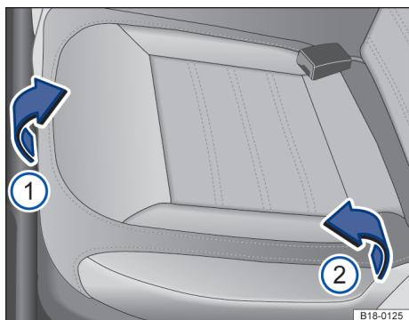  
图 63 翻折后排座椅坐垫

 请首先阅读并注意引导信息和安全提示，见 ，第 69 页。

为增大行李箱空间，可将后排座椅靠背向前折叠；对于后排座椅为分体式的车型还可单独折叠其中任一座椅靠背。

## 向前折叠后排座椅靠背

－ 为了避免在后排座椅向前折叠时产生损坏，在折叠前，请首先将前座椅向前调整并将相应的后排座椅坐垫向前翻折。

－ 将后排安全带拉出，并置于车身内饰板边

## 缘。⇒ 图 64 B

－ 拉起靠背两侧闭锁键⇒ 图 64 A ，沿箭头方向拉动并将座椅靠背向前折叠⇒ 图 64。

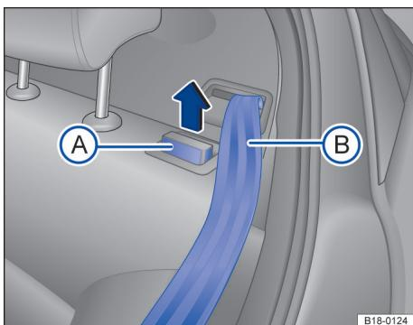  
图 64 调整后排座椅靠背

－ 拆卸后排座椅头枕。

## 将后座折回到原位

－ 安装后排座椅头枕。

－ 先将后排安全带拉出，并置于车身内饰板的边缘⇒ 图 64。

－ 然后将后排座椅靠背推回至锁止位置。

－ 再次拉动后排座椅靠背以确保正确锁止。

－ 确定锁止键的上端与饰框边缘齐平，红色标识完全嵌入饰框中。

－ 向后折回后排座椅坐垫⇒ 图 63。

## 向前翻折后排座椅坐垫

－ 沿箭头⇒ 图 63 1 方向向上抬起坐垫前端。

－ 沿箭头⇒ 图 63 2 方向向前翻折后排座椅坐垫。

## 向后折回后排座椅坐垫

－ 沿与箭头⇒ 图 63 2 相反的方向向后折回后排座椅坐垫。

－ 沿与箭头⇒ 图 63 1 相反的方向向下按下坐垫前端。

－ 略微拉动后排座椅坐垫前端，确保坐垫被牢固的固定在座椅底部支架上。

## 警告

● 为防止座椅在行驶过程中意外的移动，增加制动或事故发生时伤害的风险，请在每次安装完后排座椅坐垫后确认坐垫被牢固的固定。

## 警告（续）

● 切勿在后排座椅坐垫或靠背被翻折的情况下乘坐在车辆后排，这样不但会影响安全带的正常保护作用，而且会在制动或发生事故时对乘员造成致命的伤害！

## 警告

● 在将后座和后座靠背折叠回原位后，安全带和安全带锁也必须处于原来的位置。

● 后排座椅靠背必须稳妥的定位锁止，这样在紧急制动时，行李箱中的物品才不至滑入车内。

● 请确保后座靠背妥善地锁止。只有这样三点式安全带才能真正发挥它的功能。

● 将后座折回到原位之前，请将后座侧边的安全带放在车身内饰板边缘。避免安全带挤入内饰板与靠背之间，遭到损坏。

## 头枕调整

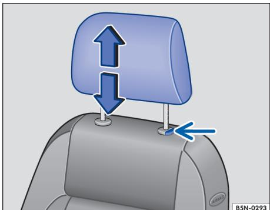  
图 65 调整前排头枕

请首先阅读并注意引导信息和安全提示，见 ，第 69 页。

所有座位都配备有头枕。后部中间的头枕只用于后排座椅的中间座位。因此，头枕不得安装到其它位置。

## 调节头枕高度

● 沿箭头方向向上移动头枕，或在按住箭头所示按钮向下移动头枕 ⇒  。

● 头枕必须在某个位置上牢固卡止。

## 正确的头枕调整

调节好头枕，使头枕的上沿尽可能与头顶齐平，不得低于双眼的高度。头后部要始终尽量靠近头枕。推移头枕使其上沿尽可能靠近头后部

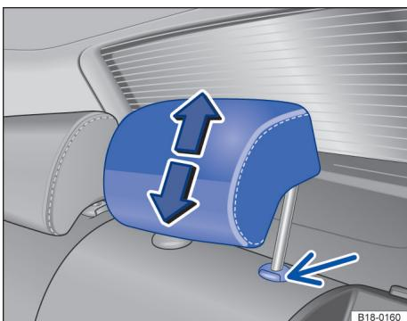  
图 66 调整后排头枕

## 针对身材矮小乘员的头枕调整

将头枕向下推到底，即使头部仍然低于头枕上沿也应如此。在最下方位置上，头枕与靠背之间可能会留有一段空隙。

## 针对身材高大乘员的头枕调整

将头枕向上移动，直到限位位置。

## 警告

如果在头枕已拆下或调节错误的情况下行驶，在发生事故和突然行驶和制动时会提高受伤或致命伤的风险。

● 在座位上有人时，始终在头枕已正确安装并调节好的情况下行驶。

## 警告（续）

● 每位乘员都必须根据其身材对头枕进行正确调节，以降低在出现事故时颈部受伤的风险。此时头枕上沿必须尽可能与头顶齐平，不得低于双眼高度。头后部要尽量靠近头枕。

## 警告（续）

● 切勿在行驶过程中调整头枕。

## 头枕拆卸和安装

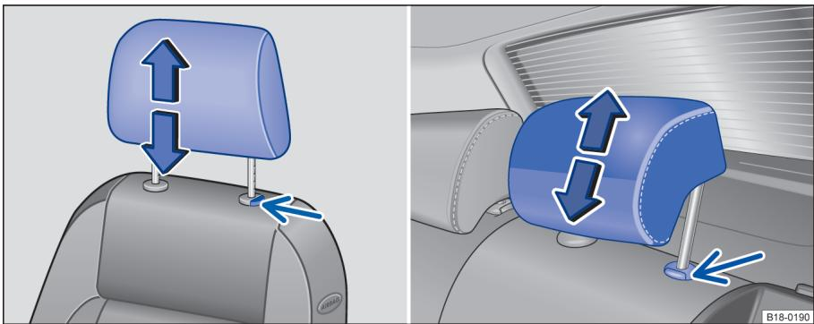  
图 67 （图左）前排头枕拆卸和安装（图右）后排头枕拆卸和安装

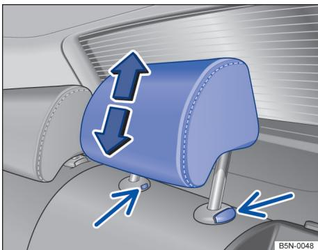  
图 68 部分车型后排头枕拆卸和安装  
 请首先阅读并注意引导信息和安全提示，见 ，第 69 页。

所有座位都配备有头枕。后部中间的头枕只用于后排座椅的中间座位。因此，头枕不得安装到其它位置。

## 前部头枕拆卸

● 必要时调节座椅靠背，以便能够拆卸头枕。

● 将头枕向上移到底 ⇒  ，在头枕调整中，见第 75 页。

● 在箭头所示按钮按到底的情况下将头枕完全拉出。

## 前部头枕安装

● 将头枕正确定位到头枕导向件上，然后插入相应座椅靠背的导向件中。

● 在如箭头所示按钮按到底的情况下向下移动头枕。

● 按照正确的坐姿调节头枕 ⇒ 第 75 页。

## 后部头枕拆卸

● 将后排座椅的座椅靠背解锁并向前翻转 。

● 将头枕向上移到底 ⇒  。

● 按压图片右侧箭头所示按钮，另一个人将头枕完全拉出。

● 部分车型将钥匙插入图片左侧箭头所指缝隙处，同时按压图片右侧箭头所示按钮，才可将头枕完全拉出。⇒ 图 68

● 将后排座椅的座椅靠背向后翻转并让其可靠卡止。

## 后部头枕安装

● 将后排座椅的座椅靠背解锁并向前翻转 。

● 将头枕正确定位到头枕导向件上，然后插入相应座椅靠背的导向件中。

● 按住图片右侧箭头所示按钮向下移动头枕。

● 将后排座椅的座椅靠背向后翻转并让其可靠卡止。

● 按照正确的坐姿调节头枕 ⇒ 第 75 页。

图 69 座椅坐垫深

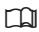

该章节包含有关下列主题的信息:
座椅设计位置 ..... 77
座椅坐垫深 ..... 77
座椅座宽 ..... 78
座椅座间距 ..... 78
座椅靠背正常使用位置说明 ..... 79

## 警告

如果在头枕已拆下或调节错误的情况下行驶，在发生事故和突然行驶和制动时会提高受伤或致命伤的风险。

● 在座位上有人时，始终在头枕已正确安装并调节好的情况下行驶。

## 车辆座椅参数

##  主题引言

## 座椅设计位置

 请首先阅读并注意引导信息，见第 77 页。

前排座椅设计位置：

前后位置:座椅最后往前滑动53.5mm。

高度位置：座椅最低向上调节20mm。

靠背角为设计角（21.3°）。

## 座椅坐垫深

B  
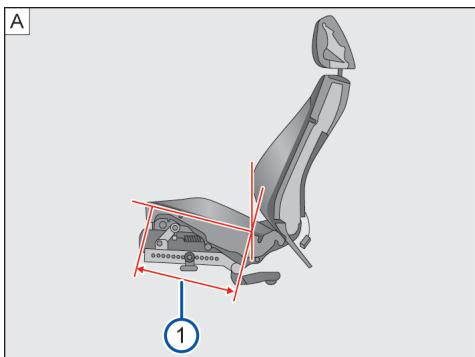

请首先阅读并注意引导信息，见第 77 页。

当前排位置处于设计位置时，坐垫深=416mm⇒ 图 69 1 。

## 警告（续）

● 拆下的头枕应立即重新装上，以使乘员能得到正确的保护。

## ① 提示

在拆卸和安装头枕时请确保头枕不碰到顶篷或前座椅靠背。否则可能使顶篷和其他汽车部件受损。

后排座椅设计位置：

坐垫位于装车位置。

靠背处于锁止状态。

即位于设计位置（靠背角为25°）。

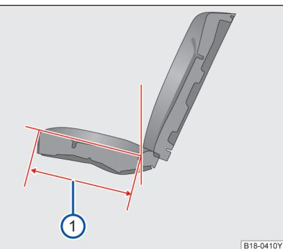

当后排位置处于设计位置时，坐垫深=401mm⇒ 图 69 1 。

## 座椅座宽

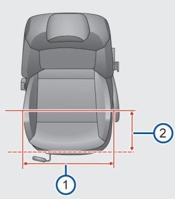

图 70 座椅座宽  

 请首先阅读并注意引导信息，见第 77 页。

如图⇒ 图 70在距离前排座椅边缘 200mm时⇒ 图 70 2 ，前排座椅座垫宽度 为 499mm⇒ 图 701 。

## 座椅座间距

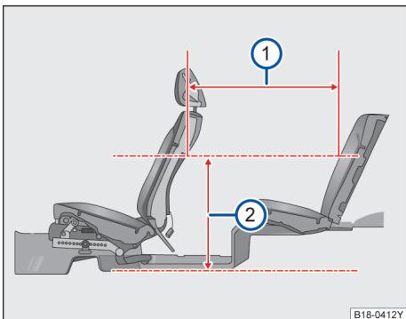  
图 71 座椅座间距

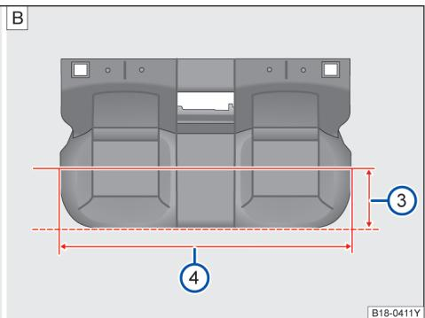  
如图⇒ 图 70在距离后排座椅边缘200mm时⇒ 图 70 3 ，后排座椅座垫宽度 为1288mm⇒ 图 70 4 。

##  请首先阅读并注意引导信息，见第 77 页。

当前排座椅前后位置：座椅最后往前滑动99mm，高度及靠背角都处于设计位置；后排座椅位于设计位置时，在距离地板位置620mm 处⇒ 图 71 2 ，座间距为 872mm⇒ 图 71 1 。

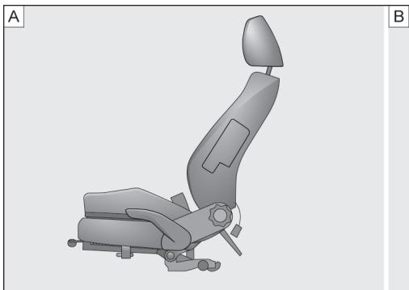  
图 72 座椅靠背正常使用位置说明

 请首先阅读并注意引导信息，见第 77 页。

前排座椅靠背正常使用位置：

⇒ 图 72

座椅靠背角接近设计角（大概21.3°）。

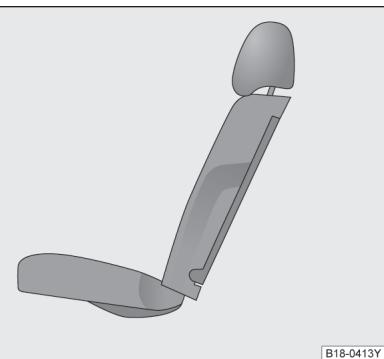

后排座椅靠背正常使用位置：

⇒ 图 72

座椅靠背完全锁住状态，解锁红色指示器完全隐藏起来。

## 座椅舒适功能

##  主题引言

该章节包含有关下列主题的信息：

座椅加热 . 80

补充信息和警告说明：

● 调整坐姿 ⇒ 第 69 页

● 安全带 ⇒ 第 81 页

● 安全气囊系统 ⇒ 第 90 页

● 座椅安全⇒ 第 94 页

● 车外后视镜 ⇒ 第 112 页

## 警告

不恰当地使用座椅舒适功能可能导致受伤。

● 开始行驶之前要采取正确的坐姿，在行驶过程中保持正确的坐姿。此要求也适用于所有乘员。

● 只可在汽车停住时调节带记忆功能的座椅。

● 手、手指和脚或其它身体部分要始终保持在座椅的功能范围和调节范围之外。

## 座椅加热

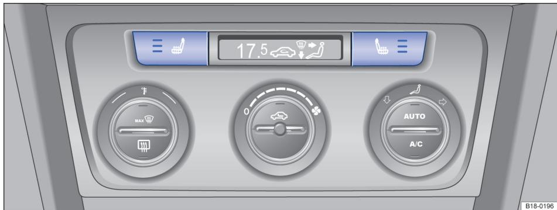  
图 73 座椅加热按钮

 请首先阅读并注意引导信息和安全提示，见 ，第 80 页。

根据车型配置不同，座椅可能配备了座椅加热装置，通过空调控制开关进行控制的。

在点火开关已打开的情况下，座椅加热装置可以以电热方式对坐垫和靠背进行加热。

如果座椅上没有人，请关闭座椅加热。

<table><tr><td>功能</td><td>操作座椅加热功能⇒图 73。</td></tr><tr><td>打开:</td><td>按压按钮 ⚡️。座椅加热随即以最大加热功率接通。</td></tr><tr><td>调节加热功率:</td><td>反复按压按钮 ⚡️,直至调节到所需加热功率。</td></tr><tr><td>关闭:</td><td>反复按压按钮 ⚡️,直至按钮中不再有指示灯亮起。</td></tr></table>

## 警告

由于用药、瘫痪或因慢性疾病（例如糖尿病）而疼痛感或温度感受限或丧失的人，在使用座椅加热时可能烫伤背部、臀部和腿部，需要很长的恢复时间或不能再完全康复。对于自身健康状态的问题，请就医。

● 疼痛感或温度感受限的人绝对不允许使用座椅加热。

## ①提示

● 为避免损坏座椅加热装置的加热元件，请勿跪在座椅上或使座椅面和靠背承受其它点负荷。

● 座椅上的液体、尖锐物品和隔热材料可能损坏座椅加热装置。

● 在产生异味时应立即关闭座椅加热装置，并让上汽大众经销商检查。

座椅加热装置只可接通实际需要的时间。否则会不必要地消耗燃料。

## 安全带

##  主题引言

该章节包含有关下列主题的信息：
警告灯 . . . . . . . . . . . . . . . . . . . . . . . . . . . . . . . . . . . . . . . . . . . . . . . . . . . . . . . . . . . . . . . . . . . . . . . . . . . . . . . . . . . . . . . . . . . . . . . . . . . . 82
正面碰撞及其物理原理 . . . . . . . . . . . . . . . . . . . . . . . . . . . . . . . . . . . . . . . . . . . . . . . . . . . . . . . . . . . . . . . . . . . . . . . . . . . . . . . . . . . . . . . . . . . . . . . . . . . .. 83
乘员未系安全带时会出现什么情况？ . . . . . . . . . . . . . . . . . . . . . . . . . . . . . . . . . . . . . . . . . . . . . . . . . . . . . . . . . . . . . . . . . . . . . . . . . . . . . . . . . . . . . . . . . . . . . . . . . . . .
安全带的保护功能 . . . . . . . . . . . . . . . . . . . . . . . . . . . . . . . . . . . . . . . . . . . . . . . . . . . . . . . . . . . . . . . . . . . . . . . . . . . . . . . . . . . . . . . . . . . . . . . . . . .
与安全带相关的工作 . . . . . . . . . . . . . . . . . . . . . . . . . . . . . . . . . . . . . . . . . . . . . . . . . . . . . . . . . . . . . . . . . . . . . . . . . . . . . . . . . . . . . . . . . . . . . . . . . . ..
佩戴安全带 . . . . . . . . . . . . . . . . . . . . . . . . . . . . . . . . . . . . . . . . . . . . . . . . . . . . . . . . . . . . . . . . . . . . . . . . . . . . . . . . . . . . . . . . . . . . . . . . . . . 
安全带佩戴走向 . . . . . . . . . . . . . . . . . . . . . . . . . . . . . . . . . . . . . . . . . . . . . . . . . . . . . . . . . . . . . . . . . . . . . . . . . . . . . . . . . . . . . . . . . . . . . . . . . . .<nl>
安全带高度调节 . . . . . . . . . . . . . . . . . . . . . . . . . . . . . . . . . . . . . . . . . . . . . . . . . . . . . . . . . . . . . . . . . . . . . . . . . . . . . . . . . . . . . . . . . . . . . . . . . . . - 88
安全带自动回卷装置、燃爆式预收紧装置、限
力装置 . . . . . . . . . . . . . . . . . . . . . . . . . . . . . . . . . . . . . . . . . . . . . . . . . . . . . . . . . . . . . . . . . . . . . . . . . . . . . . . . . . . . . . . . . . . . . . . . . . .88
安全带燃爆预收紧式卷收器的工作原理 . . . . . . . . . . . . . . . . . . . . . . . . . . . . . . . . . . . . . . . . . . . . . . . . . . . . . . . . . . . . . . . . . . . . . . . . . . . . . . . . . . . . . . . . . . . . . . . . . . 188
燃爆预收紧式卷收器使用须知 . . . . . . . . . . . . . . . . . . . . . . . . . . . . . . . . . . . . . . . . . . . . . . . . . . . . . . . . . . . . . . . . . . . . . . . . . . . . . . . . . . . . . . . . . . . . . . . . . . .189

要定期检查所有安全带的状态。在安全带织物、安全带连接件、安全带自动回卷装置或锁扣损坏时，要尽快由上汽大众经销商更换相应的安全带 ⇒  。上汽大众经销商可提供与汽车、装备和车款相符的正确配件。

补充信息和警告说明：

● 调整坐姿 ⇒ 第 69 页

● 安全气囊系统 ⇒ 第 90 页

● 儿童座椅（附件） ⇒ 第 94 页

● 附件、零部件更换、维修和改装⇒ 第 228 页

## 警告

安全带佩戴不当或根本不系安全带将引发严重伤亡事故！

● 紧急制动或发生事故时，佩戴正确的安全带可大大降低乘员的受害程度。因此，行驶时所有驾乘人员必须正确佩戴安全带。

● 孕妇或残疾人也须正确佩戴安全带，否则，发生事故时也可能严重受伤，保护未出生婴儿的最佳方法就是保护孕妇。

## 警告

● 所有乘员均应坐在各自的座椅上。

● 所有驾乘人员均须佩戴各自的安全带。

● 行驶时应按照儿童的体型采用合适的儿童保护系统加以保护。

## 警告

安全带佩戴不当或根本不系安全带可能引发严重伤亡事故！正确使用安全带方能充分发挥其保护作用。

## 警告（续）

● 行驶时，即使在市区内行驶时也务必系好安全带，同车的其他乘员均须系好安全带！

● 安全带的走向及位置必须正确。否则，安全带将不能充分发挥保护作用。

● 行驶时双脚必须置于各自座椅前的脚部空间内。

● 行驶中切勿解开安全带，否则，发生事故时，乘员极易严重致伤，甚至致死！

● 切勿扭曲安全带。

● 切勿使安全带卡在某处，或与尖角棱边相摩擦，损坏安全带。

● 为避免受伤，切勿将安全带压在诸如眼镜，钢 笔等坚硬或易碎的物品上。

● 切勿将安全带压在手臂上或处于任何不正确位置。

● 佩戴安全带时应脱去宽松笨重的服装，以免影响安全带的保护作用。

● 切勿用卡夹、固定环或类似器具改变安全带的走向。

● 一个人只可系一条安全带。

● 切勿将儿童或婴儿抱在怀里乘车和共用安全带。

● 行驶期间使用与儿童体重和身材相符的乘员保护系统以及正确系好的安全带保护车内的儿童⇒ 第 94 页。

● 锁舌始终只可插入相应座椅的安全带锁中，然后牢固卡止。使用不属于相应座椅的安全带锁会降低保护作用，并且可能导致受伤。

● 切勿让异物和液体进入安全带锁的锁扣插口中。否则可能影响安全带锁和安全带的功能。

● 安全带必须始终保持清洁！脏污的安全带可能影响安全带自动收卷器的收卷功能。

## 警告

损坏的安全带意味着很大的危险，并且可能导致受伤或致命伤。

● 如安全带、安全带连接件、安全带收卷器或锁止件破损，则发生事故时可能导致人员严重受伤！因此，务必定期检查车内所有安全带的状况。

● 切勿将安全带卡在车门内，或座椅机械机构中，从而造成损坏。

## 警告（续）

● 凡因事故损坏或受力伸长的安全带必须及时到上汽大众经销商处更换，即使无明显损伤，也须更换。同时，还应检查安全带固定装置是否损坏。

## 警告（续）

● 切勿自已尝试修理、改装或拆卸安全带。安全带、安全带自动回卷装置和锁扣的所有维修只可由上汽大众经销商进行。

## 警告灯

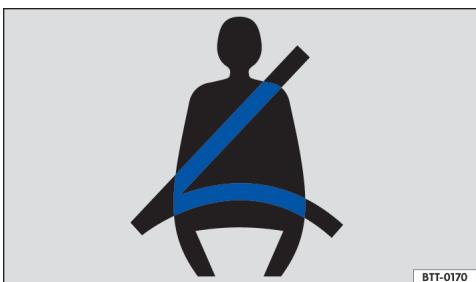  
图 74 安全带未系警告灯

 请首先阅读并注意引导信息和安全提示，见 ，第 81 页。

<table><tr><td>亮起或闪烁</td><td>可能的原因</td><td>解决措施</td></tr><tr><td></td><td>前排驾驶位或副驾驶位置坐有乘客时,未系上安全带。</td><td>系上安全带。</td></tr><tr><td></td><td>副驾驶员座椅上放有物品。</td><td>前排乘客系上安全带或将物品从副驾驶员座椅上取下并可靠存放。</td></tr></table>

在打开点火开关时，某些警告灯和指示灯会短暂亮起，表明在进行功能检测。它们在几秒钟后会消失。

如果开始行驶且车速超过 25 km/h（15 mph）时没有系上安全带，或在行驶期间松开安全带，则会发出一个声音信号。此外安全带警告灯  也会闪烁。

当驾驶员和副驾驶员在点火开关已打开的情况下系好安全带时，安全带警告灯  才会熄灭。

## 警告

● 正确系好安全带便能在紧急制动和交通事故中降低受伤的危险。因此，您和乘员在汽车行驶期间都要一直正确系好安全带。

● 如果忽视亮起的警告灯、相应的提示和警告说明，可能会导致严重的人身伤害、汽车损坏或交通事故。

## 正面碰撞及其物理原理

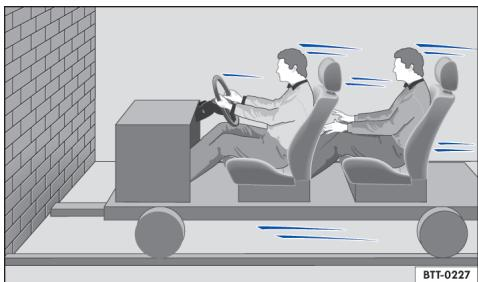  
图 75 汽车驶向一砖墙，驾乘人员未系安全带  
 请首先阅读并注意引导信息和安全提示，见 ，第 81 页。

## 汽车正面碰撞时会产生大量动能。

汽车正面碰撞的物理原理相当简单。行驶中的汽车和乘员均具有能量-动能 ⇒ 图 75。

“动能”的强弱取决于汽车的车速和车内驾乘人员的质量。车速越高，质量越大，则碰撞时释放的能量越强，而其中车速是决定因素，例如，车速自25km/h提高到50 km/h，则动能将增加四倍。

乘员未系安全带时会出现什么情况？  
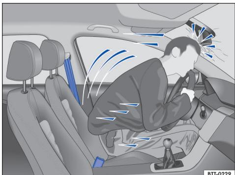  
图 77 碰撞时未系安全带的驾驶员被猛烈抛向前方  
 请首先阅读并注意引导信息和安全提示，见 ，第 81 页。  
普遍存在一种错误观念，认为汽车发生轻度碰撞时用双手控制身体即可免遭伤害！

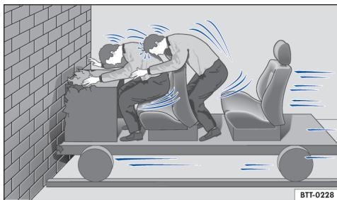  
图 76 载有未系安全带的驾乘人员的汽车撞到墙上  
即使汽车以 30 km/h 至 50 km/h 的时速行驶，碰撞时产生的作用在人体上的力也可超过一吨。车速越高，碰撞时产生的作用力越大。

未系安全带的乘员未与汽车 “结合为一体” ，因此，碰撞时未系安全带的乘员仍以碰撞前的车速向前运动。本例介绍的碰撞物理原理不仅适用于汽车正面碰撞，也适用于汽车其它所有碰撞类型。

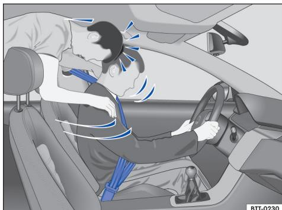  
图 78 未系安全带的后排乘员被猛烈前抛，撞击佩戴安全带的驾驶员  
普遍存在一种错误观念，认为汽车发生轻度碰撞时用双手控制身体即可免遭伤害！

即使低速行驶，碰撞时作用在人体上的力也很大，根本不可能用双手控制住自己的身体。正面碰撞时未系安全带的驾乘人员将被前抛，猛烈撞击方向盘、仪表板、风窗玻璃或前抛车中的任何物品⇒ 图 77。

安全气囊不能取代安全带。发生碰撞事故安全气囊触发时，安全气囊仅提供辅助保护作用，因此，行驶中所有乘员（包括驾驶员）必须正确佩戴安全带。

## 安全带的保护功能

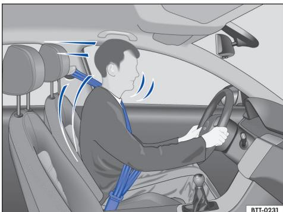

图 79 紧急制动时正确佩戴的安全带可有效保护驾驶员

请首先阅读并注意引导信息和安全提示，见 ，第 81 页。

发生事故时未系安全带的驾乘人员极易严重受伤！

正确佩戴安全带不仅能将驾乘人员保持在不易受伤的合适位置，并能吸收碰撞产生的大部分动能，有助于防止可能导致驾乘人员受伤的失控运动。此外，正确佩戴安全带还可避免驾乘人员被抛出汽车⇒ 图 79。

## 与安全带相关的工作

请首先阅读并注意引导信息和安全提示，见 ，第 81 页。

核对表

与安全带相关的工作 ⇒  ：

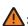

要定期检查所有安全带的状态。

保持安全带清洁。

无论是否配备安全气囊，正确佩戴安全带均能有效降低事故伤亡率。

请注意，安全气囊只能触发一次。为获得最佳保护效果，务必正确佩戴安全带。发生事故时，即使安全气囊不触发，安全带也能提供有效保护。

后排乘员也须正确佩戴安全带，否则，发生事故时也将被猛烈前抛。未系安全带的后排乘员不仅会伤及自身，也会危及车内其他人员⇒ 图 78。

安全带是主要的乘员保护装置，吸收碰撞产生的大部分动能。此外，汽车前部防撞压损区和其它被动安全系统（如安全气囊）同时吸收碰撞产生的动能，协同安全带进一步降低作用在乘员身上的力，有效保护乘员免遭伤害，或将伤害降至最小程度。

本例介绍的正面碰撞原理同样适用于其它类型的碰撞事故，因此，每次行驶前，即使在就近驾车遛弯，也请您务必佩戴安全带，同时，督促车内其他乘员系好安全带。

交通事故统计表明，正确佩戴安全带能有效降低事故的伤亡率，提高乘员的存活率。同时，还能充分利用安全气囊的辅助保护功能。因此，大多数国家的交通法规明令行驶时驾乘人员必须佩戴安全带。即使汽车配备安全气囊，但基于下述理由，所有驾乘人员必须佩戴安全带。以前排正面安全气囊为例，发生严重正面碰撞时该气囊方触发，但发生轻微正面碰撞、侧面碰撞、追尾碰撞或侧翻时，系统不会触发该安全气囊。因此，行驶前务必系好安全带，并督促车内所有乘员正确系好安全带。

## 核对表（续）

异物和液体务必要远离安全带、锁舌和安全带锁的锁扣插口。

例如在关闭车门时请勿夹住或损坏安全带和锁舌。

切勿拆卸、更改或修理安全带和安全带固定元件。

在每次行驶之前，务必要正确系好安全带，行驶过程中也要保持安全带正确系好。

## 拧转的安全带

如果安全带很难从安全带导向件中拉出，则可能是由于松开安全带时安全带过快缩回导致安全带在侧饰板内拧转：

● 拉住锁舌将安全带缓慢而小心地完全拉出。

● 排除安全带的拧转，然后将安全带用手缓缓送回。

即使安全带的拧转无法排除，仍要系上安全带。此时请勿将安全带的拧转部分直接贴在人体上！立即到上汽大众经销商检修，以排除拧转。

## 警告

安全带佩戴不当或根本不系安全带可能引发严重伤亡事故！正确使用安全带方能充分发挥其保护作用。

● 行驶时，即使在市区内行驶时也务必系好安全带，同车的其他乘员均须系好安全带！

● 安全带的走向及位置必须正确。否则，安全带将不能充分发挥保护作用。

● 切不可两人（包括儿童）共用一条安全带。

● 行驶时双脚必须置于各自座椅前的脚部空间内。

● 行驶中切勿解开安全带，否则，发生事故时，乘员极易严重致伤，甚至致死！

## 警告（续）

● 切勿扭曲安全带。

● 切勿使安全带卡在某处，或与尖角棱边相摩擦，损坏安全带。

● 为避免受伤，切勿将安全带压在诸如眼镜，钢 笔等坚硬或易碎的物品上。

● 切勿将安全带压在手臂上或处于任何不正确位置。

● 佩戴安全带时应脱去宽松笨重的服装，以免影响安全带的保护作用。

● 安全带锁舌的插口内切勿被纸张或其它物品堵塞，否则，锁舌和插口不能可靠啮合。

● 切勿用卡夹、固定环或类似器具改变安全带的走向。

● 如安全带、安全带连接件、安全带收卷器或锁止件破损，则发生事故时可能导致人员严重受伤！因此，务必定期检查车内所有安全带的状况。

● 凡因事故损坏或受力伸长的安全带必须及时到上汽大众经销商处更换，即使无明显损伤，也须更换。同时，还应检查安全带固定装置是否损坏。

● 切勿自行修理损坏的安全带！任何情况均不得拆卸和改装安全带。

● 安全带必须始终保持清洁！脏污的安全带可能影响安全带自动收卷器的收卷功能。

## 佩戴安全带

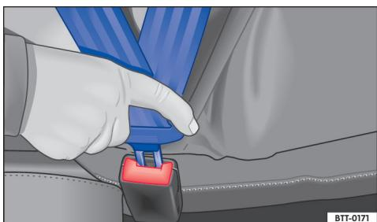  
图 80 安全带锁扣和插口

 请首先阅读并注意引导信息和安全提示，见 ，第 81 页。

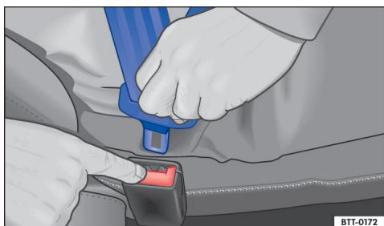  
图 81 从插口上松开安全带锁舌

正确系好的安全带在紧急制动操作或发生事故时可将乘员保持在位，从而能够提供最大保护 ⇒  。

## 系上安全带

佩戴后，安全带的走向及位置必须正确，否则，安全带将不能充分发挥保护作用⇒  ，在主题引言中，见第 81 页。

● 正确调节前排座椅及头枕⇒ 第 75 页。

● 慢拉安全带锁舌，将安全带横过胸部和髋部⇒ 第 86 页。

● 将锁舌插入所属座椅的安全插锁内，下压，直至听到啮合声⇒ 图 80。安全带锁舌被锁扣锁止。

● 拉一下安全带，确保锁舌和插口牢靠啮合。

安全带均为自动锁止卷收器。慢拉肩部安全带，安全带可自由伸缩，但紧急制动、急加速、在山区上下坡行驶或转弯时，安全带被自动锁止。

## 解开安全带

安全带只可在汽车停住时松开 ⇒  。

● 按压插口边的红色按钮，安全带锁舌自插口内弹出。

● 抓住锁舌往回送，确保安全带能自动卷回，不会在回收过程中缠绕损坏。

## 警告

发生事故时走向不正确的安全带可能引发严重伤亡事故！

● 座椅靠背处于直立位置，并正确佩戴安全带时，安全带方能充分发挥保护作用。

● 安全带锁舌必须插在所属座椅的插口内，若插在其它座椅的插口内，则安全带将不能发挥保护作用，加大事故受伤风险。

● 若乘员未正确佩戴安全带，则安全带将不能为其提供有效保护。发生事故时，位置不正的安全带可能造成致命伤害！

## 警告

行驶中切勿解开安全带，否则，发生事故时可能严重致伤或致死乘员！

## 安全带佩戴走向

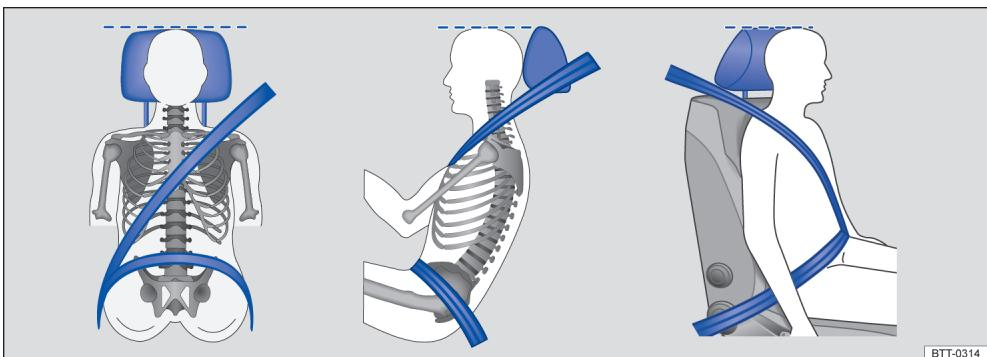  
图 82 正确的安全带佩戴走向和正确的头枕调节

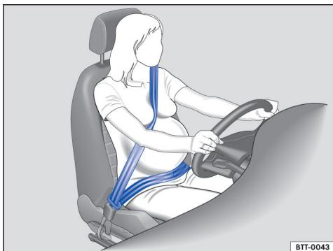  
图 83 正确的孕妇安全带佩戴走向

##  请首先阅读并注意引导信息和安全提示，见 ，第 81 页。

在安全带佩戴走向正确时，系好的安全带在发生事故时才能提供最佳保护并降低受伤或致命伤的风险。此外，正确的安全带佩戴走向可把乘员保持在位，确保安全气囊触发时能够提供最大保护。因此要始终系上安全带并注意正确的安全带佩戴走向。

错误的坐姿可能导致严重的或致命的伤害⇒ 第 69 页，调整座椅位置。

## 正确的安全带佩戴走向

● 肩部安全带部分必须通过肩部中间，切勿勒过颈部、勒过手臂、从手臂下或背部后面通过。

● 腰部安全带部分必须始终从髋部前面通过，切勿从腹部勒过。

● 要让安全带始终平展且牢固地紧贴在身体上。如有必要，略微拉紧安全带。

孕妇必须将安全带均匀地通过胸部并尽可能低地在髋部前穿过，然后平展紧贴，从而使小腹上不受到压力的作用 - 并在整个怀孕过程中都是如此⇒ 图 83。

## 使安全带佩戴走向与身材相匹配

可以通过以下装备调节安全带佩戴走向：

● 前座椅安全带高度调节机构。

● 高度可调的前座椅。

## 警告

错误的安全带佩戴走向在发生事故或突然进行紧急制动和驾驶操作时可能导致受伤。

● 在靠背处于垂直位置且已正确系好安全带时，才能发挥安全带的最佳保护作用。

● 安全带本身或松动的安全带会在安全带从较硬的身体部分滑向较软的部分（如腹部）时，导致受伤。

● 安全带肩部部分必须通过肩部中间，切勿从手臂下或从颈部勒过。

● 安全带必须平展且紧贴上身。

● 腰部安全带部分必须从髋部前面通过，切勿从腹部勒过。安全带必须平展且紧贴髋部。如有必要，略微拉紧安全带。

● 孕妇所佩戴安全带必须尽可能低地在髋部前通过，然后平展地紧贴“隆起的”腹部周围。

● 佩戴时请勿拧转安全带。

● 切勿用手将安全带拉离身体。

● 安全带不得勒在坚硬或易碎的物品上，例如眼镜、圆珠笔或钥匙。

● 切勿通过安全带夹、固定环或类似物品改变安全带佩戴走向。

i 由于身体情况不能获得最佳安全带佩戴走向的人，应向上汽大众经销商了解可能的特殊装备信息，以确保实现安全带和安全气囊的最佳保护作用。

## 安全带高度调节

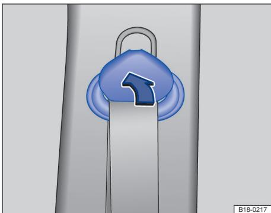  
图 84 前座椅旁：安全带高度调整机构

见 ，第 81 页。

用前排座椅安全带高度调节器可将肩部安全带调至合适位置。

● 用手抓住整个安全带导向环沿图示方向扳拧。⇒ 图 84

● 上下移动导向件，按自身体型将安全带调至合适位置 。⇒ 第 86 页。

● 松开肩部安全带导向件。

● 调节后用力拉一下肩部安全带，检查导向件是否牢固锁止。

## 警告

切勿在行驶期间调节安全带高度。

## 安全带自动回卷装置、燃爆式预收紧装置、限力装置

 请首先阅读并注意引导信息和安全提示，见 ，第 81 页。

本车中的安全带是汽车安全防护体系的组成部分⇒ 第 91 页，并由以下重要功能组成：

安全带自动回卷装置

每个安全带都配备有一个自动回卷装置。缓慢拉动安全带的锁舌，可以自由拉出安全带。但在快速拉出安全带或是车辆急加速、紧急制动时，安全带会锁止。

## 燃爆式预收紧装置

前排座椅配备有燃爆式预收紧装置。车辆在发生严重的正面、侧面和尾部碰撞时会激活燃爆式预收紧装置。燃爆式预收紧装置会与安全气囊协同工作。

## 安全带燃爆预收紧式卷收器的工作原理

 请首先阅读并注意引导信息和安全提示，见 ，第 81 页。

发生严重的正面、侧面和追尾碰撞时安全带回卷装置将前排座椅的安全带自动收紧

本车前排座椅安全带均配有安全带燃爆收紧式卷收器。汽车的正面、侧面和尾部发生严重碰撞时气囊控制器触发安全带回卷装置，卷收器将安全带向回卷方向收紧，限制乘员的运动。

燃爆式预收紧装置触发时可能会散发出白色的烟雾，这是正常现象，不表示汽车失火。

## 限力装置

事故发生时，限力装置能降低安全带作用于身体上的作用力。

i 在对汽车或该系统的部件进行报废处理时，必须遵守所有安全规定。上汽大众经销商了解这些规定，可为您提供咨询服务。

燃爆预收紧式卷收器的功能由安全气囊控制单元触发。

燃爆预收紧式卷收器只能触发一次。

汽车发生轻微的正面、侧面和追尾碰撞或侧翻以及无显著作用力的事故时，气囊控制器不会触发燃爆预收紧式卷收器。

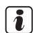

i ● 燃爆预收紧式卷收器触发时会释放少许烟雾，此属正常现象，不表明汽车发生火灾，无需担心。

● 报废整车或系统部件时务必遵守相关安全条例。上汽大众经销商熟悉相关条例，可为您提供咨询服务。

## 燃爆预收紧式卷收器使用须知

##  请首先阅读并注意引导信息和安全提示，见 ，第 81 页。

安全带回卷装置是本车座位安全带的一个部件。对安全带回卷装置的任何作业及因维修其它部件需拆装安全带回卷装置部件的作业必须由上汽大众经销商实施，否则，可能损坏安全带。发生事故时，安全带卷收器将不能正常工作或根本不起作用。

为确保安全带卷收器充分发挥保护作用和保护环境，处理拆下的相关部件时必须遵守相关法规，上汽大众经销商熟知这些法规，并可为您提供咨询服务。

## 警告

若由非专业人员维修安全带卷收器或不正确使用安全带卷收器，发生事故时安全带卷收器可能不触发或不应触发时触发，从而加大乘员伤亡风险。

● 切不可试图自行维修、调节和拆装安全带及卷收器。

● 安全带及卷收器（包括自动收卷器）不可维修！

● 对安全带及卷收器的任何作业，包括因维修相邻部件需拆装卷收器系统部件的作业须由上汽大众经销商实施。

● 安全带卷收器只能触发一次。因事故触发过的安全带卷收器必须更换。

## 安全气囊系统

##  主题引言

该章节包含有关下列主题的信息：

安全气囊描述和功能 ..... 90
前部安全气囊 ..... 92
侧面安全气囊 ..... 93

汽车为驾驶员和副驾驶员配备了前部安全气囊。在座椅、安全带、头枕以及方向盘（针对驾驶员）正确调节和使用的情况下，前部安全气囊能对驾驶员和副驾驶员的胸部和头部提供额外保护。安全气囊只是为提供额外保护而设计的。安全气囊不能替代安全带，安全带必须始终系好，即使前部座位配备了前部安全气囊也一样。

## 补充信息和警告说明：

● 驾驶提示 ⇒ 第 37 页

● 正确的坐姿 ⇒ 第 69 页

● 安全带 ⇒ 第 81 页

● 儿童座椅（附件） ⇒ 第 94 页

● 车内养护和清洁⇒ 第 215 页

● 附件、零部件更换、维修和改装⇒ 第 228 页

## 警告

切勿仅仅依靠安全气囊系统来保护自己。

● 即使是触发了安全气囊，它也只能提供辅助性的防护功能。

● 安全气囊系统与已正确系上的安全带配合提供最佳保护效果并减小受伤的风险 ⇒ 第 81 页，安全带。

● 每位乘员在每次行驶前都必须采取正确的坐姿，正确系上自己座位的安全带，而且在行驶过程中保持正确系好安全带。此要求适用于所有乘员。

## 警告

如果乘员和安全气囊膨胀范围之间有物体存在，则安全气囊触发时受伤风险会增高。安全气囊的膨胀范围会因此改变或物品会被抛向人体。

● 切勿在行驶期间将物体握在手中，或抱在怀里。

## 安全气囊描述和功能

请首先阅读并注意引导信息和安全提示，

见 ，第 90 页。

## 警告（续）

● 切勿在副驾驶员座椅上运载物品。在突然进行制动或驾驶操作时，这些物品可能进入安全气囊的膨胀范围，并在安全气囊触发时在车内被抛飞而带来生命危险。

● 前座椅上以及后部外侧座位上的乘员与安全气囊的膨胀范围之间不得有其他人员、宠物或者物体。请确保儿童和乘员都遵守此规定。

## 警告

安全气囊系统的保护功能只能用一次。如果安全气囊已触发，则必须更换该系统。

● 已触发的安全气囊和所涉及到的系统部件要立即用上汽大众许可用于本车的新部件更换。

● 汽车的维修和改装只可请上汽大众经销商进行。上汽大众经销商拥有必要的工具、诊断设备、维修信息和具备资质的工作人员。

● 切勿将从旧车中拆下的或回收利用的安全气囊部件安装到本车中。

● 切勿改变安全气囊系统的任何组件。

## 警告

安全气囊触发时可能产生细小的尘埃。这是正常现象，不表示汽车失火。

● 这种细小尘埃可能刺激皮肤和眼粘膜以及导致呼吸不畅，尤其是对于患有或曾经患有哮喘或其它影响呼吸的疾病的人。为了减轻呼吸不畅，可下车或打开车窗或车门，以便呼吸新鲜空气。

● 接触这种灰尘后，在就餐前要用中性肥皂和水清洗双手和面部。

● 请勿让灰尘进入眼睛或开放性伤口。

● 如果灰尘进入眼内，用水冲洗眼睛。

## 警告

含有溶剂的清洁剂会使安全气囊模块的素面变得疏松多孔。发生伴有安全气囊触发的事故时，脱落的塑料部件可能导致受伤。

● 切勿用含有溶剂的清洁剂处理仪表板和安全气囊模块的表面。

在发生正面和侧面碰撞事故时安全气囊可抑制乘员朝碰撞方向的运动，从而对乘员起到保护作用。

每个触发的安全气囊都会由一个气体发生器充气。于是相应的安全气囊盖板裂开，安全气囊在大力作用下在数毫秒内在其膨胀范围内胀开。当已系好安全带的乘员陷入膨胀的安全气囊时，气囊中的气体逸出，以便接住乘员并缓冲。于是可以降低受伤和致命伤的风险。安全气囊触发不能保护乘员免受如红肿、瘀伤和表皮擦伤等其它伤害。触发的安全气囊膨胀时，还可能产生摩擦热。

安全气囊不能对手臂和人体下部提供保护。

最重要的安全气囊触发因素有事故种类、碰撞角度、车速和汽车碰到的物体的特性。因此，安全气囊不是在每次有可见车辆损坏时都会触发。

安全气囊系统的触发取决于由碰撞引起的汽车减速率，此减速率由一个电子控制单元记录。如果减速率值低于控制单元中编程设定的标准值，尽管事故可能已导致严重的车辆损坏，但安全气囊并不会触发。车辆损坏、维修费用或发生事故时汽车避免了损坏都不是用来衡量安全气囊是否应触发的迹象。因为各种碰撞的情况差异很大，所以不能定义车速和参照值的带宽。因此不可能涵盖会导致安全气囊触发的所有能考虑到的碰撞类型和碰撞角度类型。此外，最重要的安全气囊触发因素还有汽车碰到的物体的特性（硬或软）、撞击到汽车上的角度以及车速。

安全气囊只是三点式安全带的补充，而且前提是发生事故时汽车减速度达到足以触发安全气囊。安全气囊只触发一次，并且只在某些条件下触发。而安全带时刻为乘员提供保护，无论是在安全气囊不会触发的情况下，还是在当安全气囊已触发的情况下。例如事故中第一次碰撞后，本车与另一辆汽车再次发生碰撞时或被另一辆汽车再次碰撞时。

## 为何必须佩戴安全带并保持正确坐姿？

发生碰撞事故时，安全气囊在几十毫秒内高速膨胀，若此时乘员坐姿不正，则可能严重受伤。因此，行驶时所有驾乘人员必须始终保持正确坐姿。

因事故紧急制动时，未系安全带的乘员将被抛向安全气囊膨胀区域，高速膨胀的气囊可能严重致伤，甚至致死乘员，尤其是儿童，伤情将更为严重。

前排人员距安全气囊应尽可能远，从而使安全气囊触发后可完全膨胀，有效保护前排人员。

安全气囊系统是整个汽车被动安全防护体系的组成部分。只有与正确系好的安全带和正确的坐姿配合，安全气囊系统才能起到最大可能的保护作用⇒ 第 69 页。

## 汽车安全防护体系的组成部分

本车中的以下安全装备共同构成汽车安全防护体系，以降低受伤和致命伤的风险。视装备而定，某些装备在本车中可能未安装，或在某些市场不能购买。

● 所有座位上的安全带。

● 驾驶员和副驾驶员以及后部外侧座位上的安全带限力器。

● 前座椅安全带高度调节机构。

● 安全带警告灯。

● 驾驶员和副驾驶员的前部安全气囊。

● 驾驶员、副驾驶员的侧面安全气囊。

● 安全气囊指示灯 。

● 控制单元和传感器。

● 高度可调式头枕。

● 可调式方向盘。

● （必要时）后部外侧座位上的儿童座椅固定点。

● （必要时）儿童座椅的上部固定带的固定点。

## 前部安全气囊不触发的情况：

● 关闭点火开关后；

● 轻微正面碰撞；

● 侧面碰撞；

● 追尾碰撞；

● 翻车；

● 其他特殊情况。

## 侧面安全气囊不触发的情况：

● 关闭点火开关后；

● 轻微侧面碰撞；

● 正面碰撞；

● 追尾碰撞；

● 翻车；

● 其他特殊情况。

## 前部安全气囊

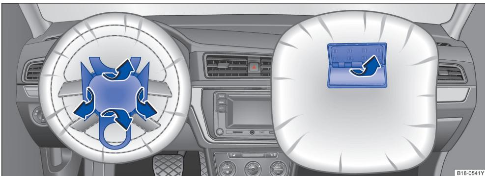

图 85 前排正面安全气囊的安装位置和膨胀范围  
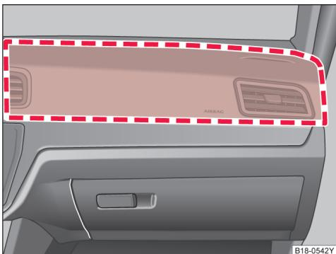  
图 86 出租车车型严禁额外安装或摆放零件的区域

##  请首先阅读并注意引导信息和安全提示，见 ，第 90 页。

发生严重正面碰撞时方能触发前排正面安全气囊⇒ 图 85。

发生某些特殊类型的碰撞事故时系统可能同时触发正面、头部及侧面安全气囊。

系统一旦触发，气体立即充入气囊，迅速在前排驾乘人员前膨胀，充满气体的安全气囊有效减缓乘员的前冲运动，从而降低乘员头部及胸部的受伤风险。

安全气囊在乘员身体的压力下以特定速率逸出气体，使乘员头部及上身进一步缓冲。一旦冲击能量完全被吸收，气体排出气囊，前方视线不再受阻。

为充分发挥安全气囊的保护作用，安全气囊必须在几十毫秒内迅速膨胀。气囊膨胀时可能释放少量烟雾，此属正常现象，不表示汽车发生火情，无需担心。

## 前部安全气囊安全注意事项

安全气囊触发时的覆盖范围内不得安置任何物品和器具⇒ 图 85。

前排正面安全气囊触发时方向盘或仪表板上的安全气囊罩盖随即打开，但罩盖仍连接在方向盘或仪表板上。

为了在发生危险时，安全气囊有效保障前排乘客的人生安全，出租车车型⇒ 图 86指定区域严禁额外安装或摆放零件。

## 危险

● 驾驶员与方向盘之间至少保持25 cm的距离；为安全起见，前排乘员要在正常位置，不要太前也不要太后。否则，安全气囊将不能提供保护，发生事故时，乘员极易严重致伤，甚至致死！此外，驾乘人员还须按自身身高将前排座椅和头枕调至正确位置。

● 行驶时若不系安全带，或身体前倾，或采取其它任何不正确坐姿，则发生事故时极易受伤。若同时触发安全气囊，则在气囊的冲击下，乘员受伤程度将更为严重。

● 行驶时前排乘员切不可怀抱儿童、宠物或任何其它物品，从而占据安全气囊与乘员之间的膨胀空间。

● 安全气囊系统只能触发一次。因事故触发过的安全气囊必须更换。

● 诸如杯架或电话架等器具不得安装在安全气囊组件的罩壳上。

● 切勿将诸如便笺本及电话架等物品安装在前排乘员正面安全气囊上方的风窗玻璃上。一旦前排乘员正面安全气囊触发，上述物品将飞越整个车厢，致伤车内乘员。

● 切勿试图自行改装安全气囊系统的任何部件。

● 不得在受正面安全气囊保护（激活状态下）的座位上使用后向儿童约束系统。

## 侧面安全气囊

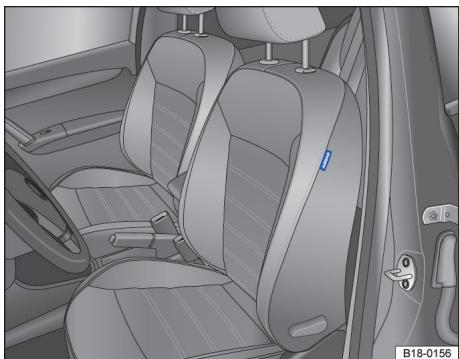  
图 87 前座椅上侧面：侧面安全气囊的安装位置

##  请首先阅读并注意引导信息和安全提示，见 ，第 90 页。

侧面安全气囊安装在驾驶员座椅和前排乘员座椅的靠背内 ；靠背上标有“AIRBAG”字样。

发生严重侧面碰撞时侧面安全气囊协同安全带对乘员上身提供附加保护。

发生侧面碰撞时侧面安全气囊可降低前排座椅乘员处于碰撞部位的上身受伤程度。除基本保护功能外，安全带还可将前排驾乘人员保持在侧面安全气囊能发挥充分保护作用的位置。

安全气囊系统决不可取代安全带，仅属整车被动安全系统的一个组成部分。切记，乘员正确佩戴安全带时安全气囊系统方能有效工作。

因此，行驶时所有驾乘人员必须始终佩戴安全带，不仅遵守交通法规，同时确保您的安全！

## 警告

● 若行驶时不系安全带，或身体前倾，或靠坐在一侧，或采取任何不正确的坐姿，则发生事故侧面安全气囊触发时乘员将严重受伤。

● 为充分发挥侧面安全气囊的保护作用，行驶时所有驾乘人员必须正确佩戴安全带并保持正确坐姿。

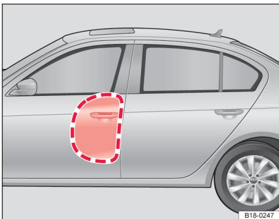  
图 88 汽车左侧胀开的侧面安全气囊

## 警告（续）

● 为了确保侧面安全气囊为您提供有效的安全保护，严禁在配有侧面安全气囊的座椅上使用影响安全气囊展开的座椅保护套或遮挡物，以防影响侧面安全气囊有效开启。

● 行驶时前排乘员切不可怀抱儿童、宠物或任何其它物品，从而占据安全气囊与乘员之间的膨胀空间，也不得让儿童和其他乘员占据该位置。此外，车门上不得悬挂任何附件（如杯架等），否则，将降低侧面安全气囊的保护功能。

● 为了确保侧面安全气囊为您提供有效的安全保护，严禁在配有侧面安全气囊的座椅上使用影响安全气囊展开的座椅保护套或遮挡物，以防影响侧面安全气囊有效开启。

● 靠背不得过度受力（如敲击或脚踢），否则，可能损坏系统，从而无法触发侧面安全气囊。

● 若座椅皮套或安全气囊组件发生损坏，必须尽快到上汽大众经销商处维修。

● 安全气囊系统只能触发一次。因事故触发过的安全气囊必须更换。

● 若儿童坐姿不正，发生事故时儿童将严重受伤。尤其在前排座椅携带儿童行驶安全气囊触发时情况更为严重，可能致死儿童！

● 对侧面安全气囊的任何作业或因维修其它部件（如维修前排座椅）需拆装安全气囊部件的作业必须由上汽大众经销商实施，否则，安全气囊系统将不能正常工作。

● 切勿试图改装安全气囊系统的任何部件。

## 儿童座椅

##  主题引言

该章节包含有关下列主题的信息：

在车内带乘儿童的通用信息 . . . . . . . . 94
在后座上使用儿童座椅 . . . . . . . . . 95
用下部固定点固定儿童座椅（ISOFIX） . . 96
用顶部紧固绳固定儿童座椅 . . . . . . . 97
用顶部紧固绳固定儿童座椅（两厢车型） . 97

## 警告

● 行驶时所有驾乘人员，尤其是儿童，必须始终保持正确坐姿，并系好安全带。

● 切勿怀抱婴幼儿共用一条安全带，否则，撞车时极易致死婴幼儿！

● 行驶时切不可让儿童在车内随意活动，或站在车内，或跪坐在座椅上，撞车时儿童可能被抛离原位，严重受伤，同时致伤车内其它乘员。

● 汽车行驶中若儿童坐姿不正，紧急制动或发生事故时极易受伤，尤其在前排座椅携带儿童行驶安全气囊触发时情况更为严重，可能致死儿童！

● 选用合适的儿童座椅可有效保护儿童！

● 确保儿童座椅上无坚硬或锐利的物品，例如玩具，发生事故时这些物品可能致伤儿童。

● 车内儿童应有成人照管，切不可将儿童单独留在车内。

## 在车内带乘儿童的通用信息

 请首先阅读并注意引导信息和安全提示，见 ，第 94 页。

各种条例和法规原则上优先于本使用维护说明书的描述。对于儿童座椅的使用及其安装方式存在不同的标准和条例（⇒ 表格，见第 96 页）。因此，在某些国家例如可能禁止在车内的某些座位上使用儿童座椅。

在碰撞时，或发生其它类型事故时作用于车辆的物理定律，同样适用于儿童 ⇒ 第 81 页。然而与成年人和青年人有区别，儿童的肌肉和关节尚未发育成熟。对儿童而言，发生事故时受伤的风险远高于成年人。

## 核对表

在车内带乘儿童 ⇒  ：

要遵守本国特有的法律规定。

上汽大众建议，12 岁以下的儿童要始终在后座椅上随车同行。

## 警告（续）

● 因当地气候条件，车内可能变得极冷或极热，无论对车内的人，还是对车内的动物来说，这种情况都是致命的！

● 若无儿童保护系统，身高1.5米以下的儿童不得使用常规安全带，否则，紧急制动或发生事故时可能导致儿童腹部和颈部受伤。

● 切勿扭曲安全带，或使其卡在某处，或与尖角棱边相摩擦。

● 即便轻度碰撞或急转弯，若安全带佩戴不当，也可能致伤乘员。

● 正确佩戴安全带方可充分发挥其保护作用。

● 切不可让两个儿童共用一个儿童座椅。

## 警告

在突然进行紧急制动操作或紧急驾驶操作时以及在发生事故时，不牢固的、未使用的儿童座椅可能在车内被抛起并造成伤害。

● 未使用的儿童座椅在行驶过程中要可靠固定或可靠存放在行李厢中。

● 儿童不能坐在侧面展开区域内，坐姿不正确、未使用儿童安全座椅的儿童会受侧面安全气囊的伤害。

在发生事故后要更换承受了重负荷的儿童座

椅，这是因为可能已经产生了看不到的损坏。

因为儿童的身体未完全发育，所以儿童必须使用专门与其身材、体重和体格相匹配的乘员保护系统。在许多国家中，法律规定要为婴儿和幼儿使用许可的儿童座椅系统。

只可使用适用于相应汽车、已认可和许可的儿童座椅。如有疑问，敬请垂询上汽大众经销商。

## 核对表（续）

车内的儿童要始终保护在一个乘员保护系统中。此乘员保护系统必须适合于儿童的身高、体重和体形。

每个儿童座椅只可带乘一个儿童。

要遵守相应儿童座椅制造商的操作手册，并随车携带以备查阅。

在用安全带固定儿童座椅时，应根据儿童座椅制造商的说明将安全带穿过或围过儿童座椅。

注意儿童的安全带佩戴走向是否正确和是否保持正确的坐姿。

儿童座椅最好安装在副驾驶员座椅后的后座椅上，以便儿童能够从人行道侧下车。

在行驶过程中请勿把玩具或其它物品松散放在儿童座椅内或放在座椅上。

## 警告

忽视这个对自身安全至关重要的核对表会导致事故和伤害。

● 请遵照核对表并相应操作。

● 肩部安全带必须大致通过肩部中央，切勿在颈部和上臂处，并使其与上身贴合；腰部安全带须紧贴骨盆部位，并按需要收紧安全带。

 请首先阅读并注意引导信息和安全提示，见 ，第 94 页。

在将一个儿童座椅固定在后座椅上时，必须调节前座椅的位置，使儿童有足够的空间。让前座椅与儿童座椅的尺寸和儿童的身材相适应。同时也要注意副驾驶员的正确坐姿  ⇒ 第 70 页。

## 在后座上使用儿童座椅

## 儿童安全座椅推荐：

为确保安全，上汽大众推荐使用上汽大众原装附件ISOFIX 儿童安全座椅:

1.对于体重不高于18kg的儿童（组别 0 — 组别Ⅰ）：

为确保安全，推荐使用上汽大众原装附件ISOFIX儿童安全座椅,CCC 号为 2020012207355211。 注：对于体重不超过18kg（参考年龄3岁）的儿童，该儿童安全座椅必须使用后向（反向）安装方式,且在车辆行驶中，后向座椅靠背须调整到最竖直位置。

## 警告（续）

● 请务必认真阅读和遵守与儿童座椅使用相关的警告说明。

## 警告

在发生事故时，后座椅原则上是已正确系好安全带的儿童最安全的位置。

● 一个合适的、正确安装在后排外侧座椅之一上的儿童座椅，在大多数事故情况下可为不超过 12岁的儿童提供最高的保护。

2.对于体重介于15kg\~36kg的儿童（组别 Ⅱ — 组别 Ⅲ）：

为确保安全，推荐使用上汽大众原装附件ISOFIX儿童安全座椅,CCC 号为 2014012207000009。

## 注意事项：

如果儿童安全座椅安装过程中与头枕发生干涉，可将头枕移除，若头枕无法拆除，可将头枕调节至最高位置。

如果前排座椅影响儿童安全座椅安装，可适当调整前排座椅位置。若儿童座椅安装侧的座椅可以上下或前后调节，需要将座椅调节到最后最下位置。

儿童安全座椅在汽车上的安装位置说明：

由于本车配备安全气囊或气帘，不同乘坐位置对儿童约束系统的适用性见下表。

不同乘坐位置对儿童约束系统的适用性要求

<table><tr><td rowspan="3">质量组</td><td rowspan="3">推荐适用年龄</td><td colspan="4">乘坐位置(或其他位置)</td></tr><tr><td colspan="2">第一排(前排)乘员</td><td rowspan="2">第二排座椅外侧</td><td rowspan="2">第二排座椅中间</td></tr><tr><td>气囊开启状态</td><td>气囊关闭状态</td></tr><tr><td>级别 0:10 公斤以下</td><td>9 个月以下</td><td>X</td><td>X</td><td>UR</td><td>X</td></tr><tr><td>级别 0+:13 公斤以下</td><td>18 个月以下</td><td>X</td><td>X</td><td>UR</td><td>X</td></tr><tr><td>级别 I:9 到 18 公斤</td><td>4 岁以下</td><td>X</td><td>X</td><td>UR</td><td>X</td></tr><tr><td>级别 II:15 到 25 公斤</td><td>约 3 至 7 岁以下</td><td>X</td><td>X</td><td>UR</td><td>X</td></tr><tr><td>级别 III:22 到 36 公斤</td><td>约 6 至 12 岁以下</td><td>X</td><td>X</td><td>UR</td><td>X</td></tr></table>

注：填入表中的字母含义为：

● U：适用于获得本质量组批准的通用类儿童约束系统。

● R：C-ISO/R3适用于获得本质量组批准的全尺寸的后向初学走路儿童用座椅。

● UF：适用于获得本质量组批准的前向通用类儿童约束系统。

● L: 适用于清单上的特殊类儿童约束系统。这些约束系统可能时特殊车辆类、受限制类或半通用类。

● B: 适用于获得本质量组批准的内置式儿童约束系统。

● X: 本座椅位置不适用于本质量组的儿童约束系统，即此位置不可安装儿童安全座椅。

## 警告

后排座椅上的儿童座椅中的儿童在玩耍未使用的可锁止式安全带时可能受到致命伤害。

● 后排座椅上未使用的可锁止式安全带必须始终锁好。

## 用下部固定点固定儿童座椅（ISOFIX）

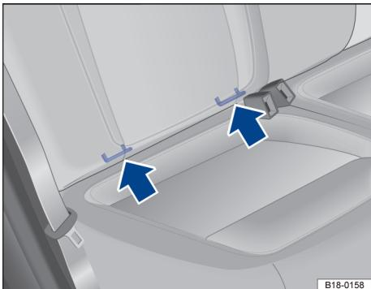  
图 89 汽车座椅上的儿童座椅下部固定点标记

 请首先阅读并注意引导信息和安全提示，见 ，第 94 页。

配备ISOFIX系统的儿童座椅可快捷、方便、安全地安装在配备相应装置的车内座椅上。

请严格按儿童座椅制造商的使用说明拆装儿童座椅。

## 安装儿童座椅

● 向上移动儿童座椅后的汽车座椅头枕至限位位置，以避免和儿童座椅产生干涉。

● 按上图箭头所示将儿童座椅压到ISOFIX固定环上 图 89，直至听到儿童座椅的啮合声。

● 安装后拉一下儿童座椅的两侧，检查是否安装牢固。

## 警告

携带儿童行驶时须用适合儿童体型和重量的儿童座椅保护儿童。

● 固定环只可用于ISOFIX儿童座椅。

● 不得将紧固带、非ISOFIX儿童座椅或任何其他物品连接到紧固环上，发生事故时，可能严重致伤，甚至致死儿童！

## ① 提示

后排外侧座椅配有两个ISOFIX固定环，与车身相连⇒ 图 89。

● 为确保安全，推荐使用上汽大众原装儿童座椅。 <

用顶部紧固绳固定儿童座椅  
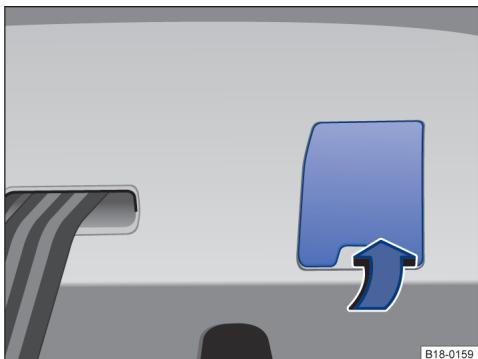  
图 90 Top Tether 固定点

  
 请首先阅读并注意引导信息和安全提示，见 ，第 94 页。

● 在拆卸和安装时注意儿童座椅制造商的说明

⇒  。

● 向上移动儿童座椅后的汽车座椅头枕至限位位置。

● 在下部固定点上固定儿童座椅。

● 打开后排座椅后的盖板⇒ 图 90。

● 将上部固定带钩入相应的固定环中⇒ 图 90。

● 用力张紧固定带，以便儿童座椅上部紧贴在座椅靠背上。

## 警告

带下部固定点和上部固定带的儿童座椅必须按照相应的制造商说明进行安装。否则可能导致受伤。

● 始终只将儿童座椅的一个固定带固定在一个固定环上。

## 用顶部紧固绳固定儿童座椅（两厢车型）

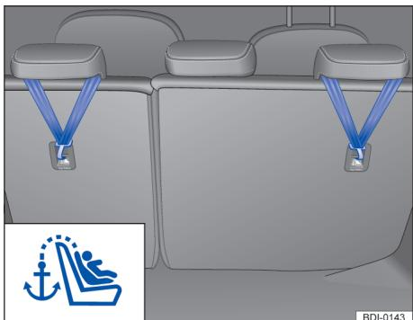  
图 91 带顶部紧固绳的ISOFIX 儿童座椅

##  请首先阅读并注意引导信息和安全提示，见 ，第 94 页。

请严格按照儿童座椅的使用说明拆装儿童座椅。

● 将儿童座椅插到ISOFIX固定环上⇒ 图 91，直到听见儿童座椅的啮合声。

● 拉动儿童座椅的两侧 检查其是否安装牢固

● 拆卸行李厢盖板。

● 将儿童座椅后的头枕稍稍向上推移。

● 安装正向儿童座椅时，将座椅靠背尽可能向前调节，使其靠在儿童座椅上⇒ 图 91。

● 将顶部紧固绳从头枕下穿过，或根据儿童座椅的结构将顶部紧固绳置于头枕的两侧。

● 将顶部紧固绳固定到行李厢紧固环上⇒ 图 91。

● 收紧顶部紧固绳，使儿童座椅紧贴后排座椅靠背。

● 安装行李厢盖板。

为确保安全，推荐使用上汽大众原装儿童座椅。

## 警告

携带儿童行驶时必须用适合儿童体型和重量的儿童座椅保护儿童。

● 后排座椅的 ISOFIX 固定装置只可用于 ISOFIX儿童座椅。

● 不得将紧固带、非ISOFIX儿童座椅或任何其它物品连接到紧固环上。

● 将后排座椅靠背翻回直立位置时应注意勿损坏安全带或将安全带卡在某处。

● 只可将顶部紧固绳连接到行李厢内的后部紧固环上，任何其他绳索均不得占用后部紧固环。

## ① 提示

● 配备ISOFIX系统和顶部紧固绳的儿童座椅可快捷、方便、安全地安装在后排外侧座椅上。

● 带有ISOFIX装置和顶部紧固绳的儿童座椅上标有一个示意图⇒ 图 91。

## 车灯与视野

## 车灯

##  主题引言

该章节包含有关下列主题的信息:
指示灯 . . . . . . . . . . . . . . . . . . . . . . . . . . . . . . . . . . . . . . . . . . . . . . . . . . . . . . . . . . . . . . . . . . . . . . . . . . . . . . . . . . . . . . . . . . . . . . . . . . . . 99
转向信号灯和远光灯操作杆 . . . . . . . . . . . . . . . . . . . . . . . . . . . . . . . . . . . . . . . . . . . . . . . . . . . . . . . . . . . . . . . . . . . . . . . . . . . . . . . . . . . . . . . . . . . . . . . . . . .100
接通和关闭车灯 . . . . . . . . . . . . . . . . . . . . . . . . . . . . . . . . . . . . . . . . . . . . . . . . . . . . . . . . . . . . . . . . . . . . . . . . . . . . . . . . . . . . . . . . . . . . . . . . . . 100
车灯与视野 - 功能 . . . . . . . . . . . . . . . . . . . . . . . . . . . . . . . . . . . . . . . . . . . . . . . . . . . . . . . . . . . . . . . . . . . . . . . . . . . . . . . . . . . . . . . . . . . . . . . . . . .. 101
回家照明和离家照明功能 . . . . . . . . . . . . . . . . . . . . . . . . . . . . . . . . . . . . . . . . . . . . . . . . . . . . . . . . . . . . . . . . . . . . . . . . . . . . . . . . . . . . . . . . . . . . . . . . . . . .
大灯照明距离调节 . . . . . . . . . . . . . . . . . . . . . . . . . . . . . . . . . . . . . . . . . . . . . . . . . . . . . . . . . . . . . . . . . . . . . . . . . . . . . . . . . . . . . . . . . . . . . . . . . . .
车内照明灯和阅读灯 . . . . . . . . . . . . . . . . . . . . . . . . . . . . . . . . . . . . . . . . . . . . . . . . . . . . . . . . . . . . . . . . . . . . . . . . . . . . . . . . . . . . . . . . . . . . . . . . . .1 102
车内照明灯和阅读灯 . . . . . . . . . . . . . . . . . . . . . . . . . . . . . . . . . . . . . . . . . . . . . . . . . . . . . . . . . . . . . . . . . . . . . . . . . . . . . . . . . . . . . . . . . . . . 103

遵守关于使用汽车照明的国别法律规定。

驾驶员始终对正确使用大灯调节装置和行车灯负有责任。

## 补充信息和警告说明：

● 外观视图 ⇒ 第 11 页

● 信息显示器 ⇒ 第 27 页

● 更换灯泡 ⇒ 第 253 页

## 警告

大灯调节得过高和不恰当地使用远光灯可能转移其它车辆驾驶员或行人的注意力和导致眩目。从而导致事故和受伤。
- 请确保大灯始终调节正确。
- 如果可能造成其它车辆驾驶员或行人眩目，绝对不能使用远光灯或远光灯变光功能。

## 提示

对于出租车车型，顶灯公司在设计顶灯支架的时候需考虑到顶灯线束的保护，如果实在无法避免，建议增加胶布进行保护并优先选用后门布线方案。

## 指示灯

请首先阅读并注意引导信息和安全提示，见 ，第 98 页。

<table><tr><td>亮起</td><td>可能的原因</td><td>解决措施</td></tr><tr><td rowspan="2"></td><td>行车灯完全或部分失灵。</td><td>更换相应的灯泡 ⇒第 253 页。如果所有灯泡都正常,则必要时请到上汽大众经销商检修。</td></tr><tr><td>弯道行车灯有故障。</td><td></td></tr><tr><td></td><td>后雾灯已接通。</td><td rowspan="2"></td></tr><tr><td></td><td>前雾灯已接通。</td></tr><tr><td></td><td>左右转向信号灯。如果汽车上有一个转向信号灯失灵,则指示灯会以两倍于平常的频率闪烁。</td><td>必要时检测本车的照明。</td></tr><tr><td></td><td>远光灯已接通或远光灯变光功能已操作。</td><td>⇒第 100 页。</td></tr></table>

<table><tr><td>闪烁</td><td>可能的原因</td><td>解决措施</td></tr><tr><td></td><td>弯道行车灯有系统故障。</td><td>请到上汽大众经销商检修。</td></tr></table>

在打开点火开关时，某些警告灯和指示灯会短暂亮起，表明在进行功能检测。它们在几秒钟后会消失。

## 警告

忽视亮起的警告灯和文字信息会导致在道路交通中抛锚，引起事故和受伤。

● 切勿忽视亮起的警告灯和文字信息。

● 一旦可行且安全，就立即停车。

## 警告（续）

● 将汽车停在与车流保持安全距离处，请勿让排气装置部件接触到汽车下的易燃物质，例如干草，燃油，机油等。

● 抛锚的汽车会给自身和其它车辆带来高事故风险。如有必要，接通危险警报灯并支起三角警告牌，以便警示其它车辆。

## ① 提示

忽视亮起的指示灯和文字信息可能导致汽车损坏。 

转向信号灯和远光灯操作杆

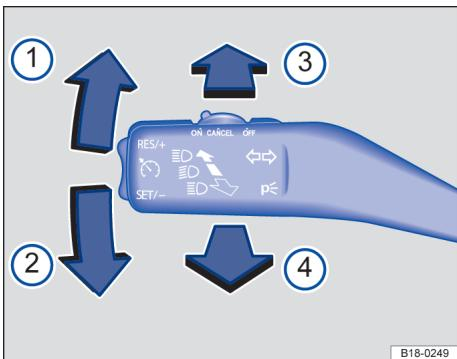  
图 92 转向信号灯 / 远光灯操作杆

 请首先阅读并注意引导信息和安全提示，见 ，第 98 页。

将操作杆移动到所需位置 ：

右转信号灯。1

左转信号灯。2

## 接通和关闭车灯

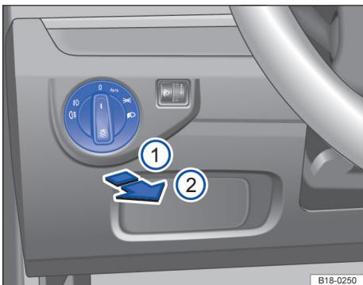

3 接通远光灯 ⇒  。在远光灯已接通时，组合仪表上的指示灯  亮起。

4 关闭远光灯或操作远光灯变光功能。只要拉动操作杆，便会执行远光灯变光功能。指示灯 亮起。

## 警告

不恰当地使用远光灯可能导致事故和受伤，因为远光灯可能会转移其它车辆驾驶员或行人的注意力和导致眩目。

i 转向信号灯在点火开关已打开的情况下才能工作。危险警报灯在点火开关已关闭的情况下也同样能工作。

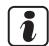

当本车上的一个转向信号灯失灵时，该指示灯以约正常情况下两倍的频率快速闪烁。

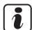

在近光灯已接通的情况下才能够接通远光灯。

 请首先阅读并注意引导信息和安全提示，见 ，第 98 页。

图 93 仪表板局部视图：灯光开关

<table><tr><td>挡</td><td>点火开关关闭</td><td>点火开关接通</td></tr><tr><td>0</td><td>近光灯和位置灯关闭。</td><td>近光灯和位置灯关闭。</td></tr><tr><td>AUTO</td><td>自适应大灯可能已接通。回家离家功能可能已接通⇒第 101 页</td><td>自动行车灯控制和(必要时)日间行车灯已接通。离家功能可能已接通⇒第 101 页</td></tr><tr><td> $\geqslant \leqslant$ </td><td>位置灯打开。</td><td>位置灯打开。</td></tr><tr><td> $\leqslant$ D</td><td>近光灯关闭,位置灯打开。</td><td>位置灯和近光灯打开。</td></tr></table>

将车灯开关转到所需位置

## 雾灯：

车灯开关中的指示灯扣或另外还指示已接通的雾灯。

● 打开前雾灯扣：将车灯开关从位置或拉出到第一挡。

● 打开后雾灯 0：将车灯开关从位置 或完全拉出。

● 如要关闭雾灯，则按压车灯开关或将其转到位置。

## 车灯未关闭时的警告音

在遥控钥匙已从点火开关中拔出并且驾驶员侧车门已打开时，在以下情况下会发出警告音。用于提醒在必要时关闭车灯。

● 在驻车灯已接通时 ⇒ 第 100 页。

● 车灯开关处于位置 。

## 静态弯道行车灯

在低速转弯时或在很窄的弯道上，部分车型前雾灯中集成的静态弯道行车灯会自动接通。此静态弯道行车灯只在车速低于 40 km/h 时工作。

## 警告

停车灯的亮度不足以充分照亮道路并让其他车辆或行人看到。

● 在黑暗、降雨和能见度差时务必接通近光灯。

## ① 提示

根据车辆配置不同，雾灯装置有一定区别，在某些低配车型中无前雾灯，大灯雾灯挡只有一挡。

## 车灯与视野 - 功能

 请首先阅读并注意引导信息和安全提示，见 ，第 98 页。

## 驻车灯

在驻车灯（右侧或左侧转向信号灯）已接通时，汽车相应侧的大灯与停车灯和尾灯亮起。在点火开关已关闭并且转向信号灯 / 远光灯操作杆在操作前处于中间位置时，驻车灯才亮起。

## 自动行车灯控制 AUTC

自动行车灯控制只是一种辅助手段，并且不能充分识别所有行驶状况。

如果车灯开关处于位置AUTO，则汽车照明以及仪表 / 开关照明会在以下情况下自动打开和关闭⇒  ：

<table><tr><td>自动接通:</td><td>自动关闭:</td></tr><tr><td>光敏传感器识别到黑暗,例如在隧道行驶时。</td><td>在识别到足够的亮度时。</td></tr><tr><td>在高于一定车速行驶数秒时。</td><td>在以低于 65 km/h 的车速行驶数分钟时。</td></tr><tr><td>雨量传感器识别到降雨并接通车窗玻璃刮水器。</td><td>当车窗玻璃刮水器数分钟未刮水时。</td></tr></table>

## 警告

当道路未充分照亮并且本车不能被或很难被其它交通参与者发现时，可能发生事故。

● 自动行车灯控制（AUTO）只在亮度变化时接通近光灯，例如在下雾时不接通。

i 在下雨或洗车的情况下，前照灯、尾灯和转向信号灯内部可能暂时蒙上水雾。这是灯内温度明显高于环境温度或环境湿度较大时，透镜内表面的水汽遇冷凝结导致（类似车窗玻璃的起雾现象）。这属于正常的物理现象，不影响车灯的功能和寿命。当车灯出现雾气时，将车辆停放在干燥、通风的地方，雾气会逐渐减少直至消失；在车辆行驶或有阳光照射的情况下雾气消散的速度会加快。但是，如果看到灯内大量积水或大量水滴，请到上汽大众经销商处检查车辆。

## 回家照明和离家照明功能

请首先阅读并注意引导信息和安全提示，见 ，第 98 页。

“回家照明”功能需手动接通；“离家照明”功能则由雨量光线传感器自动控制。

“回家照明”和“离家照明”

<table><tr><td>回家照明</td><td>操作</td></tr><tr><td>接通</td><td>-关闭点火开关;-向驾驶员方向操作灯光控制拨杆约一秒钟;-打开驾驶员车门。</td></tr><tr><td>关闭</td><td>-在延时关闭时间结束后。</td></tr></table>

<table><tr><td>离家照明</td><td>操作</td></tr><tr><td>接通</td><td>-解锁汽车,如果车灯开关位于位置Auto上,且雨量光线传感器识别出光线不足。</td></tr><tr><td>关闭</td><td>-在延时关闭时间结束后。-或者将汽车上锁。-或者将车灯开关转到位置0上。</td></tr></table>

  
“回家照明”功能接通的情况下，在打开驾驶  
员车门时，不会发出报警音提示车灯已接通。 

## 大灯照明距离调节

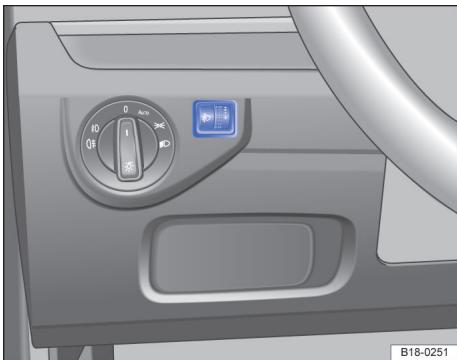  
图 94 在方向盘旁边：大灯照明距离调节的调节器

 请首先阅读并注意引导信息和安全提示，见 ，第 98 页。

## 大灯照明距离调节

大灯照明距离调节⇒ 图 94根据设定值将大灯光束与汽车的负荷状态无级匹配。因此驾驶员具有最大可能的视野并且不会给对面的道路使用者造成眩目⇒  。

大灯的调节仅在近光灯已接通时才能进行。

要调节时转动调节器⇒ 图 94：

<table><tr><td>设定值</td><td>汽车的负荷状态</td></tr><tr><td>-</td><td>前座椅已占用、行李厢空。</td></tr><tr><td>1</td><td>所有座位已占用、行李厢空。</td></tr><tr><td>2</td><td>所有座位已占用、行李厢满载。</td></tr><tr><td>3</td><td>仅驾驶员座椅占用、行李厢满载。</td></tr></table>

## 警告

汽车配备很重物品时，可能导致大灯转移其他车辆驾驶员注意力和眩目。从而导致事故和受伤。

● 务必根据汽车的负荷状态对光束进行调节，以免造成其他车辆驾驶员眩目。

## 车内照明灯和阅读灯

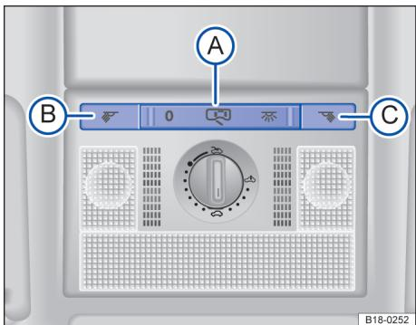  
图 95 前部车内照明灯

 请首先阅读并注意引导信息和安全提示，见 ，第 98 页。

<table><tr><td>按钮 / 位置</td><td>功能</td></tr><tr><td>0</td><td>关闭车内照明灯。</td></tr><tr><td></td><td>接通车内照明灯。</td></tr><tr><td></td><td>接通车门接触开关(中间位置)。车内照明灯在汽车解锁时、打开某个车门时或从点火开关中拔出遥控钥匙时自动接通。在关闭所有车门几秒钟后、在将汽车锁止或打开点火开关时,车灯自动熄灭。</td></tr><tr><td></td><td>接通或关闭阅读灯。</td></tr></table>

## 杂物箱和行李厢照明灯

在打开和关闭副驾驶员侧杂物箱或行李厢盖时，一个照明灯会自动接通或关闭。

i 阅读灯在汽车锁止时或在将遥控钥匙从点火开关中拔出几分钟后熄灭。这样可避免汽车蓄电池电量耗尽。

## 遮阳板

##  主题引言

该章节包含有关下列主题的信息：
遮阳板 104

## 遮阳板

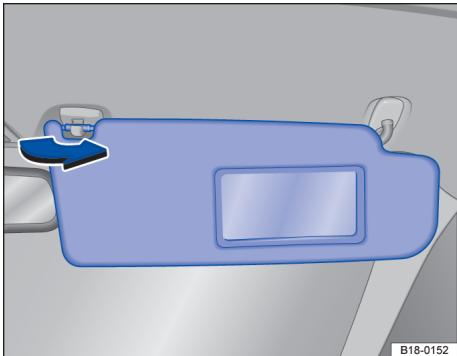  
图 96 遮阳板

## 警告

翻下的遮阳板和拉出的遮阳卷帘会使能见度降低。

● 如果不需要使用遮阳板和遮阳卷帘，则务必将其收回到固定装置内。

 请首先阅读并注意引导信息和安全提示，见 ，第 104 页。

驾驶员和副驾驶员的遮阳板调节方法：

● 朝车窗玻璃翻转。

● 从固定装置中拉出，然后翻向车门。

● 将已朝车门转动的遮阳板沿纵向向后移动。 

## 车窗玻璃刮水器和清洗器

##  主题引言

该章节包含有关下列主题的信息：
车窗玻璃刮水器操作杆 ..... 106
车窗玻璃刮水器功能 ..... 106
车窗玻璃刮水器的维护位置 ..... 107
雨量传感器 ..... 108
后窗雨刮器 ..... 109
检查车窗玻璃清洗液液位并添加 ..... 110

## 补充信息和警告说明：

● 外观视图 ⇒ 第 11 页

● 空调器的车内空气循环运行模式 ⇒ 第 169 页

● 在发动机舱中作业的准备工作 ⇒ 第 187 页

● 汽车外部养护和清洁⇒ 第 208 页

## 警告

车窗玻璃清洗液在防冻效果不够时可能在车窗玻璃上冻结并限制向前的能见度。

## 警告（续）

● 在具有足够的防冻效果时才可在冬季温度下使用车窗玻璃清洗装置。

● 只要车窗玻璃未通过车内暖风通风装置进行加热，就切勿在冬季温度下使用车窗玻璃清洗装置。否则清洗液可能在车窗玻璃上结冰并限制能见度。

## 警告

用坏或脏污的车窗玻璃刮水片会降低能见度并提高事故和受伤的风险。

● 当车窗玻璃刮水片已损坏或用坏并且不能再充分清洁车窗玻璃时，务必更换车窗玻璃刮水片。

## ① 提示

寒冷季节在接通车窗玻璃刮水器之前，要检查车窗玻璃刮水片有没有被冻住！在寒冷的天气里停车，将车窗玻璃刮水器放置在维护位置会对您很有帮助⇒ 第 107 页。

车窗玻璃刮水器操作杆

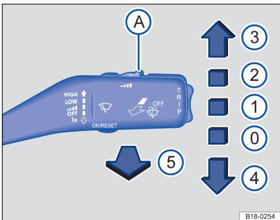  
图 97 操作车窗玻璃刮水器

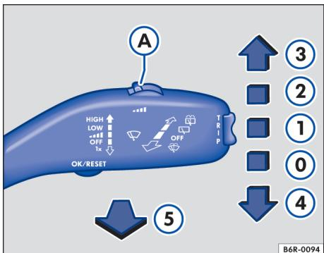  
图 98 两厢车型操作车窗玻璃刮水器

  
 请首先阅读并注意引导信息和安全提示，见 ，第 105 页。

将操作杆移动到所需位置 ⇒  ：

<table><tr><td>0</td><td>OFF</td><td>车窗玻璃刮水器已关闭。</td></tr><tr><td>1</td><td></td><td>对车窗玻璃进行间歇刮水。使用开关⇒图97A使用合适的间歇挡位(不配备雨量传感器的汽车)或调节雨量传感器的灵敏度。</td></tr><tr><td>2</td><td>LOW</td><td>慢速刮水。</td></tr><tr><td>3</td><td>HIGH</td><td>快速刮水。</td></tr><tr><td>4</td><td>1x</td><td>点动刮水 - 短促刮水。将操作杆向下按住较长时间,以快速刮水。</td></tr><tr><td>5</td><td></td><td>拉住操作杆时用于清洁车窗玻璃的刮水和自动清洗功能。</td></tr></table>

## ① 提示

如果在车窗玻璃刮水器已在接通的情况下关闭点火开关，则车窗玻璃刮水器在重新打开点火开关时在相同的刮水挡中继续刮水。在车窗玻璃或后窗玻璃上有霜、雪和其它障碍物时，可能导致车窗玻璃刮水器和车窗玻璃刮水器马达损坏。

i 车窗玻璃刮水器只在点火开关已打开且发动机舱盖或行李厢盖已关闭的情况下工作。

i 车窗玻璃的间歇刮水根据车速进行变化。车速越快，车窗玻璃刮水器就越频繁地刮水。

## 车窗玻璃刮水器功能

 请首先阅读并注意引导信息和安全提示，见 ，第 105 页。

车窗玻璃刮水器在不同情况下的状态：

<table><tr><td>在汽车静止时:</td><td>已接通的刮水挡暂时被调整到相邻的低挡位。</td></tr><tr><td>在自动刮水清洗过程中:</td><td>空调器切换到车内空气循环运行模式约30秒钟,以免车窗玻璃清洗液的气味进入汽车内部空间。</td></tr><tr><td>在间歇刮水时:</td><td>根据车速控制刮水周期。车速越高,刮水周期就越短。</td></tr></table>

i 当刮水器在车窗玻璃上遇到障碍物时，会试图将其推开。如果刮水器继续受阻，它会停止动作。请去除障碍物并重新接通刮水器。

## 车窗玻璃刮水器的维护位置

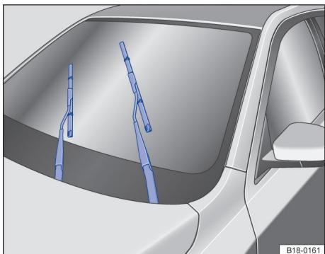  
图 99 车窗玻璃刮水器在维护位置

 请首先阅读并注意引导信息和安全提示，见 ，第 105 页。

在维护位置上可以将车窗玻璃刮水器摆臂从车窗玻璃上掀起⇒ 图 99。为了将车窗玻璃刮水器置于维护位置，要进行以下操作：

● 发动机舱盖必须关闭 ⇒ 第 106 页。

● 打开点火开关然后再重新关闭。

● 向下短按车窗玻璃刮水器操作杆⇒ 图 100 4 。

开始行驶前将车窗玻璃刮水器摆臂重新翻回车窗玻璃上！车窗玻璃刮水器摆臂在起步后会重新返回初始位置，或可通过操作车窗玻璃刮水器操作杆使其返回初始位置。

## 将车窗玻璃刮水片抬起并翻离

● 将车窗玻璃刮水器摆臂置于维护位置 ⇒  。

● 只可在刮水片固定件区域内握住车窗玻璃刮水器摆臂。

## ①提示

● 为避免发动机舱盖和车窗玻璃刮水器摆臂损坏，只能在维护位置将车窗玻璃刮水器的刮水器摆臂向前翻。

● 开始行驶前务必将车窗玻璃刮水器摆臂翻回车窗玻璃上。

## 雨量传感器

  
图 100 车窗玻璃刮水器操作杆：调节雨量传感器A 。

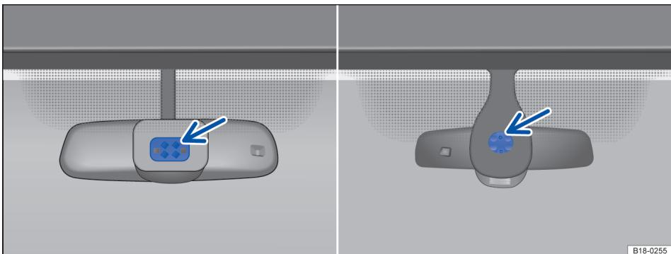  
图 101 雨量传感器的传感表面

 请首先阅读并注意引导信息和安全提示，见 ，第 105 页。

已激活的雨量传感器自动根据降雨强度控制车窗玻璃刮水器周期 ⇒  。雨量传感器的灵敏度可以手动调节。手动刮水 ⇒ 第 106 页。

将操作杆按压到所需位置⇒ 图 100：

雨量传感器已停用。0

雨量传感器激活 – 必要时自动刮水。1

调整雨量传感器的灵敏度：A

– 开关向右调节 – 高灵敏度。

– 开关向左调节 – 低灵敏度。

在关闭再重新打开点火开关后，雨量传感器保持激活状态并且当车窗玻璃刮水器操作杆在位置 1 上且车速高于 16 km/h（10 mph）时重新工作。

## 影响的雨量传感器触发原因

雨量传感器的传感表面内 ⇒ 图 101发生故障和误读的可能原因有：

● 损坏的刮水片：损坏的刮水片形成的水膜或刮痕，可能导致接通持续时间延长、刮水间隔大大缩短或快速持续刮水。

● 昆虫：昆虫撞击可能导致刮水触发。

● 盐渍：在冬季可能会在车窗玻璃上形成盐渍，从而在几乎干燥的车窗玻璃上发生异常的长时间惯性刮水情况。

● 污物：干燥的灰尘、蜡、玻璃涂层（荷叶效应）、清洗剂残留物（自动洗车装置）可能使雨量传感器越来越不灵敏，反应越来越迟、越来越慢或根本不再有反应。

● 车窗玻璃上的裂痕：石击可能会在雨量传感器打开的情况下触发一次刮水循环。接着雨量传感器便会识别到传感面缩小，于是按此进行调整。石击面的大小不同，传感器触发特性的变化也可能不同。

## 警告

雨量传感器并不能充分识别每次降水并激活车窗玻璃刮水器。

## 警告（续）

● 如果车窗玻璃上的雨水影响了能见度，则应在需要时及时手动接通车窗玻璃刮水器。

定期清洁雨量传感器的传感表面，然后检查刮水片是否损坏。

## 后窗雨刮器

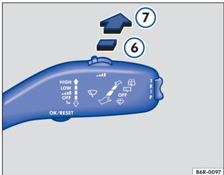  
图 102 挡风玻璃雨刮器拨杆：后窗雨刮器操作

 请首先阅读并注意引导信息和安全提示，见 ，第 105 页。

挡风玻璃雨刮器拨杆还可操作后窗的挡风玻璃雨刮器和自动清洗功能。

适用于：配备后窗挡风玻璃雨刮器的车辆

开启间歇刮水功能

\- 将挡风玻璃雨刮器拨杆向前按到位置6 ⇒ 图 102。大约每隔六秒，雨刮器刮一次车窗⇒  。

## 关闭间歇刮水功能

\- 将挡风玻璃雨刮器拨杆从位置 6 往后拉回原位。

## 开启清洗刮水功能

\- 将挡风玻璃雨刮器拨杆向前按到位置 7 ⇒  。清洗功能立即开始，雨刮器稍后也开始工作。

\- 释放拨杆，雨刮器继续工作几秒钟，然后处于间歇刮水状态。

为了去除蜡渍和反光层，推荐使用含酒精的玻璃清洁剂。

## 抬起或翻转雨刮片

抬起或翻转雨刮片时，应抓住雨刮片安装点周围的挡风玻璃雨刮器摇臂。

## 警告

● 磨损或脏污的雨刮片会阻碍您的视线，降低行驶安全性。

● 如风窗玻璃表面较脏或有粘贴物，请首先进行清洁并去除粘贴物，否则粘贴物会卡在雨刮器上造成雨刮器和风窗玻璃刮水马达损坏。

● 为安全起见，每年请更换雨刮片一至两次。雨刮片可在上汽大众经销商处购得。

● 在冬季温度较低时请勿立刻使用车窗玻璃清洗功能。否则玻璃清洁剂可能冻结在后挡风玻璃上并影响向后的视野。

● 请务必参考并遵守警告注意事项⇒ 第 210 页。

## 提示

● 如果发现雨刮片被冰冻在挡风玻璃上，请勿使用热水直接冲洗，这样可能导致挡风玻璃因温度突然升高而爆裂或雨刮器变形。正确的方法是开启后风窗加热功能，使冰冻慢慢消融或者在前一天晚上将雨刮器翘起脱离挡风玻璃。

● 寒冬季节首次使用雨刮器前，务必检查雨刮片是否被冻在玻璃上！假如在雨刮片已冻住的情况下打开风窗玻璃雨刮器，可能会损坏雨刮片和雨刮器的电机！

i ● 只有点火开关开启时，后窗雨刮器才工作。

● 如果在挡风玻璃雨刮器开启的情况下选择倒挡(手动变速箱)或将选挡杆移动到位置R（自动变速箱），后窗雨刮器将刮一下

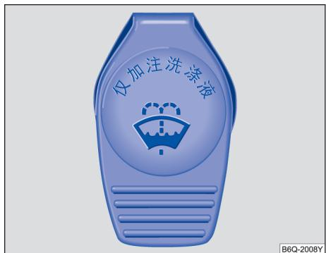  
图 103 发动机舱内：风窗清洗液容器盖

 请首先阅读并注意引导信息和安全提示，见 ，第 105 页。

定期检测车窗玻璃清洗液液位，并在必要时添加清洗液。

● 打开发动机舱盖 ⇒ 第 187 页 。

● 车窗玻璃清洗液储液罐可通过盖子上的符号 识别 ⇒ 图 103。

● 检查储液罐中是否还有足够的车窗玻璃清洗液。

● 在车外温度低时要加入专用防冻液，以防水结冰⇒  。

## 警告

在发动机舱内作业时务必格外谨慎！

● 在发动机舱内作业时务必遵守相关安全警告说明 ⇒  ，在主题引言中，见第 187 页。

● 切勿在车窗玻璃清洗液中添加冷却液防冻剂或类似添加剂。否则车窗玻璃上会形成一层油质薄膜，严重影响视野，有发生事故的危险！

## 小心

● 风窗清洗液内不得加入散热器防冻液或其它任何添加剂。

● 推荐使用上汽大众原装风窗清洗液。其它添加剂或皂液会堵塞扇形喷嘴的小孔。

## 后视镜

##  主题引言

该章节包含有关下列主题的信息：
车内后视镜 ..... 112
车外后视镜 ..... 112

补充信息和警告说明：

● 外观视图 ⇒ 第 11 页

● 换挡 ⇒ 第 135 页

● 制动、停车和驻车 ⇒ 第 141 页

## 警告

自动防眩后视镜含有电解液，镜面玻璃破碎时可能会逸出。这种液体会刺激皮肤、眼睛和呼吸器官。

## 警告（续）

● 流出的电解液可能刺激皮肤、眼睛和呼吸器官，对于有哮喘或类似疾病的人影响尤为严重。要立即呼吸足够的新鲜空气并下车，如果不能下车，则打开所有车窗和车门。

● 在眼睛和皮肤接触电解液时，要立即用大量清水冲洗至少 15 分钟并去就医。

● 在鞋子和衣服接触电解液时，要立即用大量清水冲洗至少 15 分钟。在重新使用前要彻底清洁鞋子和衣服。

● 如果误吞电解液，要立即用大量清水冲嘴至少15 分钟。医生未要求前不可催吐。应立即就医。

## ① 提示

自动防眩后视镜的镜面玻璃破碎时，可能会流出电解液。这种液体会腐蚀塑料表面。要使用湿海绵等物尽快清除液体。

## 车内后视镜

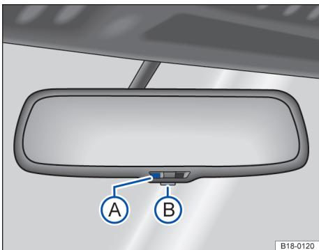  
图 104 自动防眩车内后视镜

 请首先阅读并注意引导信息和安全提示，见 ，第 111 页。

驾驶员必须调整车内后视镜，保证通过后窗玻璃向后有足够的视野。

驾驶员必须调整车内后视镜，保证通过后窗玻璃向后有足够的视野。

## 手动防眩车内后视镜

手动防眩车内后视镜的下缘处有一个操纵

杆⇒ 图 105，在基本位置时，操纵杆指向前方。如需防眩，请将操纵杆向后拉。

## 自动防眩车内后视镜

在点火开关已打开的情况下，车内后视镜可根据后面射入车内的光线自动防眩。如果已挂上倒车挡，后视镜便会切换到无自动防眩状态。

## 车外后视镜

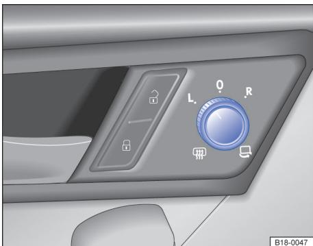  
图 106 在驾驶员侧车门内：车外后视镜旋钮

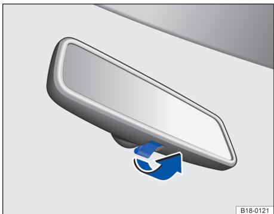  
图 105 手动防眩车内后视镜

自动防眩功能可以用车内后视镜上的开关

B ⇒ 图 104打开和关闭。在自动防眩功能已打开的情况下，指示灯 A 亮起。

## 警告

自动防眩后视镜的镜面玻璃如果破裂，可能会溢出电解液。该液体会刺激皮肤、眼睛和呼吸系统。如果不慎接触到该液体，请立即用大量清水清洗。必要时请就诊。

i 自动防眩后视镜的镜面玻璃如果破裂，可能会溢出电解液。该液体会腐蚀塑料表面。请尽快用湿海绵擦掉该液体。

 请首先阅读并注意引导信息和安全提示，见 ，第 111 页。

## 将旋钮转到所需位置：

<table><tr><td>[KD42]</td><td>以电动方式将车外后视镜折叠 ⇒▲。</td></tr><tr><td>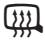</td><td>接通车外后视镜加热装置。</td></tr><tr><td>L</td><td>通过向上、向下、向右或向左转动旋钮调节左侧车外后视镜。</td></tr><tr><td>R</td><td>通过向上、向下、向右或向左转动旋钮调节右侧车外后视镜。</td></tr><tr><td>0</td><td>零位。车外后视镜已翻折出、车外后视镜加热装置已关闭、不能调整车外后视镜。</td></tr></table>

## 警告

粗心地折叠和翻回车外后视镜可能导致受伤。

● 当运行范围内没有人时，才可折叠或翻回车外后视镜。

● 请务必确保在移动车外后视镜时，手指没有卡在车外后视镜和后视镜座之间。

## 警告

如果估算与后车的距离不准确，则可能导致事故和受伤。

● 拱形镜面（凸面或球面）会扩大视野并使物体 在后视镜中变小，看起来距离更远。

● 使用拱形镜面估算与后车之间的距离不准确，并且可能导致事故和受伤。

## 警告（续）

● 要准确断定与后车或其它物体之间的距离时，请尽可能使用车内后视镜。

● 确保向后有足够好的视野。

## ① 提示

● 切勿以机械方式手动折叠或翻回电动折叠式车外后视镜，否则会损坏电动驱动装置。

车外后视镜加热装置只可接通实际需要的时间。否则会不必要地消耗燃料。

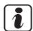

车外后视镜加热装置开始以最高功率加热，在约两分钟后根据环境条件加热。

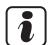

发生故障时，可以通过按压镜面边缘以机械方式手动调整电动车外后视镜。

# 行李物品装载

## 驾驶提示

##  主题引言

该章节包含有关下列主题的信息：

存放行李件 . 114

驾驶已装载的汽车 . . . . 115

重装载物务必可靠收存在行李厢中，并确保后座椅靠背在垂直位置上可靠卡止。务必使用捆绑环及合适的捆绑绳来固定重物。切勿使汽车超载。有效载荷及负荷在车内的分布对行驶状况和制动效果有影响 ⇒  。

## 补充信息和警告说明：

● 行李厢盖 ⇒ 第 60 页

● 向前翻折副驾驶员座椅靠背 ⇒ 第 69 页

● 车灯 ⇒ 第 98 页

● 行李厢 ⇒ 第 116 页

● 车轮和轮胎 ⇒ 第 220 页

## 警告

未固定或错误固定的物品在突然进行紧急驾驶 /制动操作时和发生事故时可能导致受伤。这尤其适用于，安全气囊触发时击中物体，导致其在车内被抛飞的情况。为了降低受伤风险，请注意以下事项：

● 车内的所有物品都要安全收存。行李和重物应始终存放在行李厢内。

## 存放行李件

 请首先阅读并注意引导信息和安全提示，见 ，第 114 页。

## 将车内的所有行李件都安全收存

● 沉重的物品要尽量在行李厢内靠前放置，并将后座椅靠背在垂直位置上牢固卡止。

● 调整大灯的照明距离 ⇒ 第 102 页。

● 根据负荷调整胎压。遵照胎压标签⇒ 第 220 页。

● 在配备被动式轮胎气压监控系统的汽车上，必要时应对新的负荷状态进行调整⇒ 第 167 页。

## 警告（续）

● 每次都要用合适的捆绑绳或拉紧带固定物品，避免物品在突然进行驾驶操作和紧急制动时进入侧面安全气囊或前部安全气囊的膨胀范围内。

● 正确存放车内的物品，确保它们在行驶过程中绝对不会进入安全气囊的膨胀范围。

● 行驶过程中要让杂物箱始终保持关闭。

● 在向前翻折副驾驶员座椅靠背时，必须取下副驾驶员座椅座垫上的所有物品。即使轻小物品也可能被向前翻下的副驾驶员座椅靠背压入座垫下的重量识别垫中，并因此向安全气囊控制单元发送错误的信息。

● 存放的物品切勿导致乘员采取错误的坐姿。

● 如果存放的物品堵住某个座位，则乘员切勿在该座位上乘坐和使用。

## 警告

在运送面积较大和沉重的物品时，行驶特性以及制动效果会显著变化。

● 要使车速和驾驶方式与能见度、天气情况、路面状况和交通状况相匹配。

● 要特别仔细和小心地加油门。

● 避免突然的制动和行驶操作。

● 比正常情况下提前制动。

## 提示

应避免后窗台板上的物品磨蹭后窗玻璃，可能导致后窗玻璃中的加热丝及天线损毁。

 请首先阅读并注意引导信息和安全提示，见 ，第 114 页。

为保证已装载的汽车具有良好的行驶性能，请注意以下事项：

● 安全收存所有行李件 ⇒ 第 114 页。

● 要特别仔细和小心地加油门。

● 避免突然的制动和行驶操作。

● 比正常情况下提前制动。

## 警告

滑动的载荷可能显著影响汽车的行驶稳定性和行车安全，并因此导致事故和受伤。

● 把载荷按规定固定好以防滑动。

● 对于沉重的物品要使用合适的捆绑绳或拉紧带。

● 让后座椅靠背在竖直位置上牢牢卡止。

## 行李厢

##  主题引言

该章节包含有关下列主题的信息：
向前翻折和翻回后排座椅靠背 ..... 117
固定环 ..... 118
行李厢盖板 ..... 118

重装载物务必存放在行李厢中，并确保后座椅靠背在垂直位置上可靠卡止。务必使用固定环及合适的捆绑绳。切勿使汽车超载。有效载荷及负荷在车内的分布对行驶状况和制动效果会有影响 ⇒  。

补充信息和警告说明：

● 安全气囊系统⇒ 第 90 页

● 车灯 ⇒ 第 98 页

● 行李物品装载 ⇒ 第 114 页

● 车轮和轮胎⇒ 第 220 页

## 警告

在不使用或无人照管汽车时务必将所有车门和行李厢盖锁止，以减小受伤或致命伤的风险。

● 切勿让儿童无人照管，尤其是在行李厢盖已打开时。儿童可能进入行李厢内，关闭行李厢盖并无法自行出来。可能导致受伤或致命伤。

● 切勿让儿童在汽车内或汽车周围玩耍。

● 切勿让任何人在行李厢内乘车。

## 警告

未固定或错误固定的物品在突然进行紧急驾驶 /制动操作时和发生事故时可能导致受伤。这尤其适用于，安全气囊触发时击中物体，导致其在车内被抛飞的情况。为了降低受伤风险，请注意以下事项：

## 警告（续）

● 车内的所有物品都要安全收存。行李和重物应始终存放在行李厢内。

● 每次都要用合适的捆绑绳或拉紧带固定物品，避免物品在突然进行驾驶操作和紧急制动时在车内被抛起进入侧面安全气囊或前部安全气囊的膨胀范围内。

● 行驶过程中要让杂物箱始终保持关闭。

● 请勿将坚硬、沉重或锋利的物品存放在车内的敞开杂物箱内、后座椅靠背后面的平面上或仪表板上。

● 将坚硬、沉重或锋利的物品从车内的衣服和袋子中取出，并安全收存。

## 警告

当运送沉重的物品时，汽车的行驶性能会发生改变，制动距离会增加。未按规定存放或固定的重货可能导致失去对汽车的控制，然后导致受伤。

● 在运输重物时，汽车的行驶性能会因中心偏移而发生变化。

● 载荷务必均匀且尽可能低地分布在车内。

● 行李厢中的重物要始终尽量远地牢靠存放在后轴前。

## ① 提示

应避免放置在后风窗搁板上的物品磨蹭后窗玻璃，可能损毁后窗玻璃上的加热丝和天线。

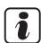

i 为能排出车内的污浊空气，不得盖住后窗玻璃和后窗台板之间的排气口。

## 向前翻折和翻回后排座椅靠背

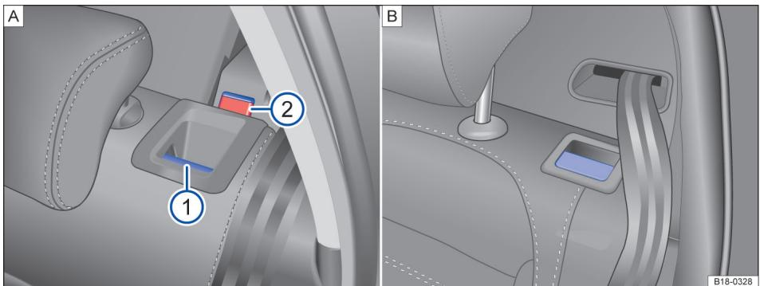

图 107 后排座椅靠背：分离按钮  
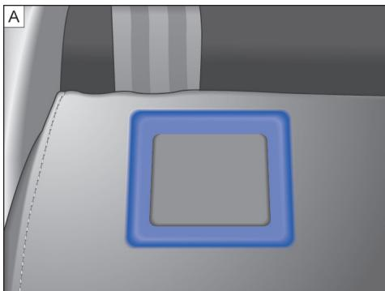

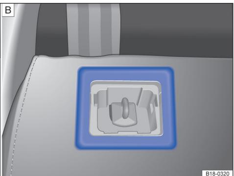  
图 108 部分车型调整后排座椅靠背

##  请首先阅读并注意引导信息和安全提示，见 ，第 116 页。

分体式的后座椅靠背结构。后座椅靠背的每个部分都可单独向前翻折，以增大行李厢容积。

## 用解锁拨杆向前翻折后座椅靠背

● 将头枕拆卸下来。

● 向前拉分离按钮⇒ 图 107 1 ，同时前折靠背。

● 松开后排座椅靠背后应能看见按钮上的红色标记2 。

● 部分车型抓住相应的后排座椅靠背上部，拉起座椅上部的解锁装置⇒ 图 107；部分车型用钩子拉起座椅上部的解锁装置 图 108。并向前翻折靠背，将靠背压到座垫上。

● 翻回靠背时，将靠背完全翻回，直至听到锁止声。

## 警告

如果后座椅靠背已向前翻折，则不得有乘员或儿童坐在这个座位上随车同行。

● 向前翻折或向后翻回后座椅靠背时不加注意可能会造成挤伤，有人身伤害危险！

● 向后翻回座椅靠背时必须把后座椅靠背牢靠锁止，以防止行李厢中的物品在汽车紧急制动时窜到汽车前部来。

● 翻折座椅靠背时，请注意防止夹住安全带而造成其损坏。

## 提示

● 翻折后座椅靠背时，儿童座椅安装装置（ISOFIX）的导向套不得处于安装状态。

为防止发生损坏，必要时请在翻折后座椅靠背之前先调整前排座椅位置，使后座椅头枕或靠背不会顶撞到前排座椅。

## ① 提示（续）

● 向前翻折后座椅靠背时，后排座椅的座椅面会略微向下和向前移动。为避免造成损坏，必要时需要事先将物品从脚部空间中取出。

## 固定环

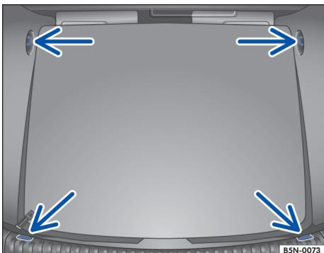  
图 109 行李厢局部视图：固定环

 请首先阅读并注意引导信息和安全提示，见 ，第 116 页。

## 提示（续）

● 向后翻回后座椅靠背时，后排座椅的座椅面会略微向上和向后移动。为避免造成损坏，必要时需要请将物品从座椅面的移动区域内取出。

部分车型行李厢内有用于固定行李件物品的固定环。

## 行李厢内的固定环

行李厢中安装了用于绑紧行李的固定环。

## 警告

如果用不合适的或已损坏的紧固带把行李物品绑在固定环上，在制动操作或发生交通事故时可能会造成人身伤害。

● 为了防止行李物品被抛入汽车前部，每次随车携带品时都要使用合适的紧固带将其牢靠地固定在固定环上。

● 切勿将儿童座椅固定在此固定环上。

## 行李厢盖板

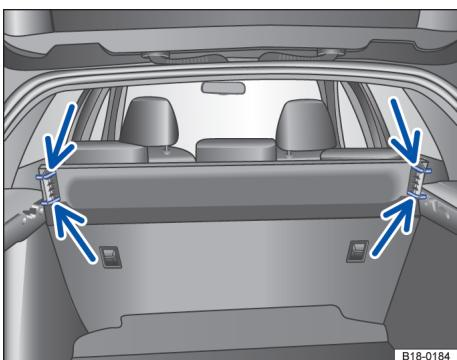  
图 110 拆卸和安装行李厢盖板

 请首先阅读并注意引导信息和安全提示，见 ，第 116 页。

如要运送庞大笨重的行李，可将该盖板拆下。

行李厢盖板仅可用来放置轻便物品。但是放置的物品不得影响驾驶员的向后视野。

## 拆卸行李厢盖板

将盖板从侧面固定支架⇒ 图 110（下面的箭头）中拉出。

## 安装行李厢盖板

将盖板向前推入两侧的固定支架中。

## 警告

切勿将坚硬、沉重或尖锐的物品放在衣服口袋内或行李厢盖板上。也不允许将宠物放在行李厢盖板上。紧急制动或急加速以及发生交通事故时，这些物品或宠物会危及所有乘员的安全，有人身伤害危险！

## ① 提示

放置在行李厢盖板上的物品摩擦后窗玻璃可能会毁坏玻璃上的加热丝或天线。

● 为避免行李厢盖板损坏，行李厢内的装载物不得超高，即关闭行李厢盖时行李厢盖板不得压到装载物上。

● 为了能够排出车内空气，不允许遮盖行李盖板两侧托架下面的通风口。

● 行李厢的结构与车型配置有关，请以实车为准。 

## 实用装备

## 杂物箱

##  主题引言

该章节包含有关下列主题的信息：

驾驶员侧的杂物空间 . . . . . . . . . . . 119
后部中央通道处的储物盒 . . . . . . . . . 120
前排乘员侧的杂物箱 . . . . . . . . . . 120
前部中央扶手中的杂物箱 . . . . . . . . . 121
AUX-IN 和 USB 输入端 . . . . . . . . . 121
后备箱的行李网 . . . . . . . . . . . 122

杂物箱只可用于存放重量轻或体积较小的物品。

在前部中央扶手内的杂物箱中可能有出厂时安装的AUX-IN 插口和 USB 插口。

补充信息和警告说明：

● 车内养护和清洁⇒ 第 215 页

● ⇒ 手册收音机或⇒ 手册导航系统

## 警告

松散物品可能在突然的驾驶或紧急制动操作时在车内抛飞。这样可能导致受伤，还可能导致失去对车辆的控制。

● 请勿将宠物或坚硬、沉重或锋利的物品存放在车内的敞开杂物箱内、仪表板上、后座椅后面的后窗台板上、车内的衣服和袋子内。

## 驾驶员侧的杂物空间

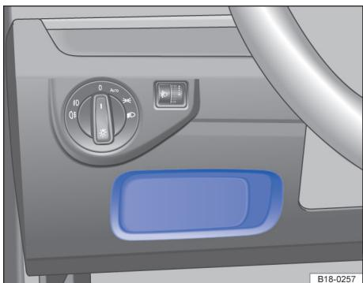  
图 111 驾驶员侧的储物空间

## 警告（续）

● 行驶过程中要让杂物箱始终保持关闭。

## 警告

驾驶员脚部空间内的物品可能妨碍顺畅操作踏板。可能导致对汽车失去控制，加大受伤的风险。

● 要确保始终能够顺畅踩下所有踏板。

● 脚垫要始终可靠固定在脚部空间内。

● 切勿把脚垫或其它地毯置于已安装的脚垫上。

● 请确保任何物体都不会在行驶期间落入驾驶员的脚部空间内。

## ① 提示

● 应避免后窗台板上的物品磨蹭后窗玻璃，可能导致后窗玻璃中的加热丝和天线损毁。

● 请勿在车内保存对温度变化敏感的物品、食品或药物。高温和低温都可能使其损坏或不再可用。

● 车内放置的由透明材料制成的物品（如眼镜、放大镜或车窗玻璃上的透明吸盘）可能使阳光聚焦并因此导致汽车损坏。

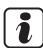

i 为能排出车内的污浊空气，不得盖住后窗玻璃和后窗台板之间的排气口。

请首先阅读并注意引导信息和安全提示，见 ，第 119 页。

## 警告

储物空间内存放物品应确保物品不翻出，以防止行车期间紧急制动时，储物空间内的物品在车内乱窜，从而降低发生交通事故时造成人身伤害的危险。

后部中央通道处的储物盒  
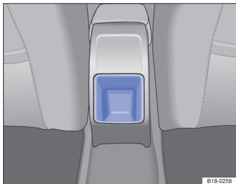  
图 112 后部中央通道处的储物空间

## 前排乘员侧的杂物箱

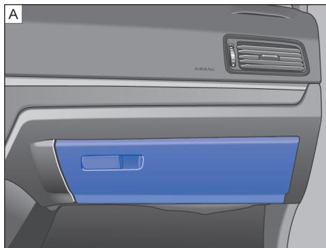  
图 113 A 前排乘员侧：杂物箱、 B 打开的杂物箱

 请首先阅读并注意引导信息和安全提示，见 ，第 119 页。

拉动开启把手⇒ 图 113 A ，即可打开杂物箱。

向上按压杂物箱盖，即可关闭杂物箱。

部分车型前排乘员侧杂物箱具有锁止功能 A ，可以用车钥匙将其解锁。

## 安全反光背心

随车配备一件安全反光背心，根据配置不同，安全反光背心可能位于副驾驶员侧的储物箱内。

反光背心具有安全警示作用，如车辆发生抛锚等紧急情况需要离开车辆时，请穿戴好安全反光背心，这样不仅可以为自身安余提供有效的防护措施，也能有效的提醒其他道路参与者安全驾驶。

见 ，第 119 页。

i 为避免被盗，不要将卡片插槽用于存放支票夹或信用卡。

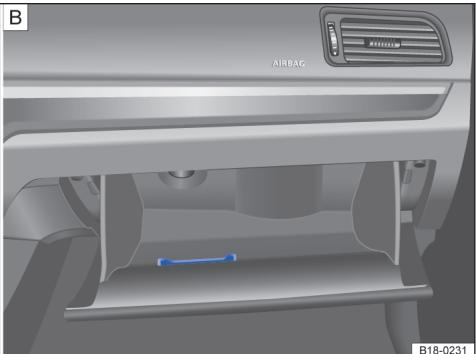

## 警告

行车期间储物盒应处于关闭状态，以防止在紧急制动下里面的物品在车内乱窜，从而降低发生交通事故时造成人身伤害的危险。

## ① 提示

为避免小件物品通过前排乘员侧杂物箱中的开口从饰板后掉落，导致发出异响或损坏车辆，请不要在杂物箱中存放特别小的物品。

## ①提示

请将安全反光背心放置在车内储物箱内，以备及时取用。

前部中央扶手中的杂物箱

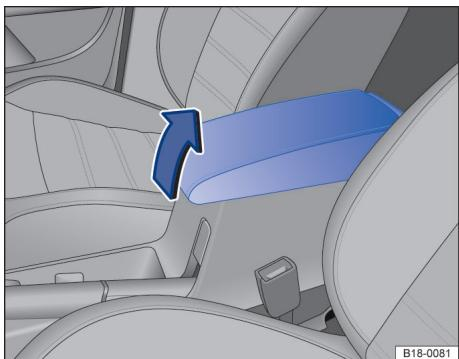  
图 114 带杂物箱的前部中央扶手

  
 请首先阅读并注意引导信息和安全提示，见 ，第 119 页。

AUX-IN 和 USB 输入端  
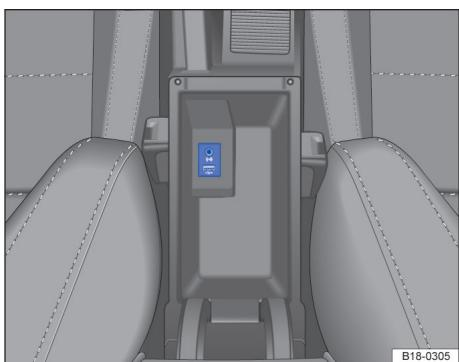  
图 115 AUX-IN 和 USB 输入端位于中央扶手内  
 请首先阅读并注意引导信息和安全提示，见 ，第 119 页。

在前部中央扶手内的杂物箱中可能有出厂时安装的AUX-IN 插口和 USB 插口⇒ 图 115。

## 打开或关闭杂物箱

如要打开此杂物箱，请把扶手沿箭头方向朝上完全抬起⇒ 图 114。

如要关闭杂物箱，请将扶手放下。

## 警告

行车期间该杂物箱须一直处于关闭状态，以降低紧急制动或发生交通事故时因中央扶手向上翻折而造成人身伤害的危险。

## ① 提示

请勿在前部中央扶手杂物箱中存放诸如录音磁带、巧克力或药物等对热敏感的物品。

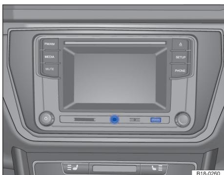  
图 116 部分车型AUX-IN和USB输入端位于中控台上  
部分车型在中控台上可能有出厂时安装的AUX-IN插口和 USB 插口⇒ 图 116。 

## 后备箱的行李网

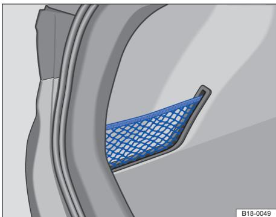  
图 117 后备箱的行李网

 请首先阅读并注意引导信息和安全提示，见 ，第 119 页。

此行李网可用于运载小型物品。

## 警告

● 在行李网中只允许摆放轻便的物品。它不能固定沉重的物品，有人身伤害的危险！

● 请勿将带有尖锐棱角边缘的物品放在行李网中，可能会损坏行李网。

## 饮料罐托架

##  主题引言

该章节包含有关下列主题的信息：

前部中控台内的饮料罐托架 . . . . . . . . 123
中央通道上的卡片插槽 . . . . . . . . . 124
前排车门上的杯架 . . . . . . . . . . 124
后部中央扶手中的饮料罐托架 . . . . . . 125

## 饮料瓶托架

饮料瓶托架位于驾驶员侧车门和副驾驶员侧车门的敞开杂物箱中。

补充信息和警告说明：

● 车内养护和清洁⇒ 第 215 页。

## 警告

不恰当地使用饮料罐托架可能导致伤害。

● 切勿将热饮料置于饮料罐托架内。在行驶过程中、在突然进行紧急制动操作时和在发生事故时，饮料罐托架中的热饮可能泼出并导致烫伤。

● 确保饮料瓶或其它物品在行驶过程中不会进入驾驶员脚部空间，从而可能挡住踏板。

## 前部中控台内的饮料罐托架

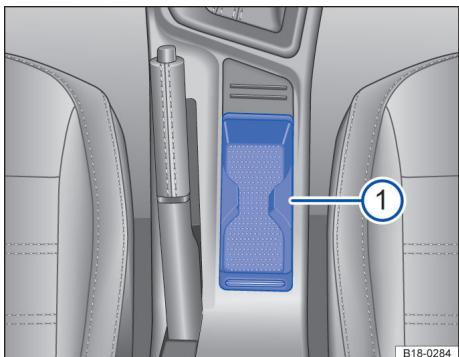  
图 118 前部中控台内的饮料罐托架

请首先阅读并注意引导信息和安全提示，见 ，第 123 页。

## 警告（续）

● 切勿将重的杯子、食品或其它重物置于饮料罐托架内。这些重物可能在发生事故时在车内抛飞，然后导致受伤。

## 警告

封闭的饮料瓶可能在汽车内受热爆炸和结冰爆裂。

● 切勿将关闭的饮料瓶放在剧烈升温或剧烈降温的车内。

## 提示

行驶过程中不得在饮料罐托架内放置打开的饮料。泼出的饮料（例如在制动时）可能导致汽车和电气装置发生损坏。

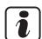

饮料罐托架的内芯可取出以进行清洁。

前排座椅之间的中央通道上有两个饮料杯支架⇒ 图 118。

## 警告

● 请勿将热饮料放入饮料杯支架。在急加速、紧急制动或发生交通事故时，热饮都有可能洒出，有烫伤危险！

● 切勿让封闭的饮料瓶长时间置于阳光直射的环境中或温度很高的车中。封闭的饮料瓶可能会爆炸。

## ① 提示

● 行驶时饮料杯支架内不得放置打开的饮料。在车辆制动时，饮料可能会泼洒出来，造成车辆损坏。

● 当移动式烟灰盒放在带有卷帘的杯托中时，卷帘是不能实现完全关闭的。

中央通道上的卡片插槽  
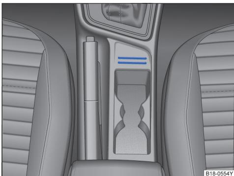  
图 119 中央通道上的卡片插槽

## 前排车门上的杯架

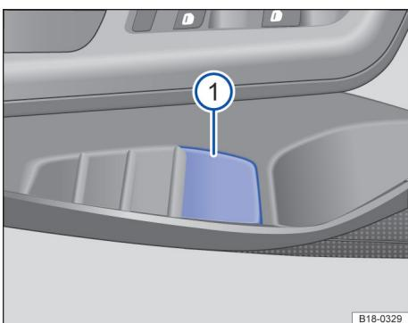  
图 120 驾驶员车门中的饮料瓶支架

 请首先阅读并注意引导信息和安全提示，见 ，第 123 页。

前可放置饮料瓶的饮料瓶支架⇒ 图 120 1 位于驾驶员和副驾驶员车门内侧的杂物箱内。

 请首先阅读并注意引导信息和安全提示，见 ，第 123 页。

中央通道处有两个卡片插槽，可用于放置加油卡等类似的物品⇒ 图 119。

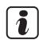

i 为避免被盗，不要将卡片插槽用于存放支票卡或信用卡。

## 警告

饮料瓶支架使用不当可能会造成人身伤害。

● 为安全起见，各饮料瓶支架中只能放置体积合适的饮料瓶。

● 请勿将热饮料放入饮料杯支架。在急加速、紧急制动或发生交通事故时，热饮有可能洒出，有烫伤危险！

● 请注意防止饮料瓶罐或其它物品在行车期间落入驾驶员的脚部空间中。饮料瓶罐或其它物品落入踏板区域，会妨碍驾驶员操纵踏板。在紧急的行驶操作或制动时可能无法操纵制动、离合器或油门踏板，有发生事故的危险！

● 切勿让封闭的饮料瓶长时间置于阳光直射的环境中或温度很高的车中。否则封闭的饮料瓶可能会爆炸。

## ① 提示

行驶时饮料杯支架内不得放置打开的饮料。在车辆制动时，饮料可能会泼洒出来，造成车辆损坏。

## 后部中央扶手中的饮料罐托架

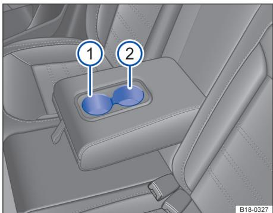  
图 121 部分车型后排中央扶手上的饮料杯支架

 请首先阅读并注意引导信息和安全提示，见 ，第 123 页。

## 后排中央扶手上的饮料杯支架

将后排中央扶手翻下后，可看到存放饮料杯的支架。

## 警告

● 请勿将热饮料放入饮料杯支架。在急加速、紧急制动或发生交通事故时，热饮有可能洒出，有烫伤危险！

● 切勿让封闭的饮料瓶长时间置于阳光直射的环境中或温度很高的车中。否则封闭的饮料瓶可能会爆炸。

## ① 提示

● 行驶时饮料杯支架内不得放置打开的饮料。在车辆制动时，饮料可能会泼洒出来，造成车辆损坏。

● 由于车辆配置不同，饮料杯支架样式可能不同，具体以实车为准。

## 车载电源

##  主题引言

该章节包含有关下列主题的信息：

汽车内的电源 . . . . . . . . 126车顶行李架 . 127

在车内的电源上可以连接电气附件。

所连接的装置必须性能状态完好，不得有故障。

补充信息和警告说明：

● 附件、零部件更换、维修和改装⇒ 第 228 页

## 警告

不恰当地使用电源和电气附件可能导致火灾和受伤。

● 切勿将儿童无人监管地留在车内。在点火开关已打开的情况下可以使用电源和其上连接的装置。

● 如果连接的电气装置温度过高，要立即关闭装置并断开电源连接。

## 汽车内的电源

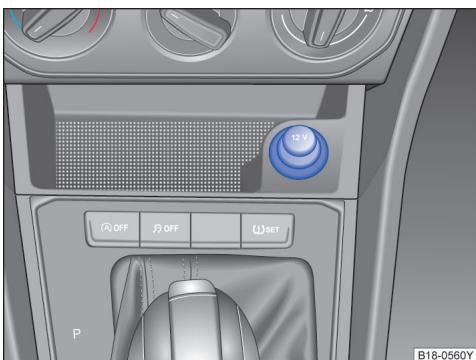  
图 122 12V 电源插座

 请首先阅读并注意引导信息和安全提示，

最大消耗功率

<table><tr><td>电源</td><td>额定功率</td></tr><tr><td>12伏</td><td>120瓦</td></tr></table>

## ① 提示

● 为避免损坏电气装置，切勿将输出电流的附件（例如太阳能电池板或蓄电池充电装置）连接到 12伏电源上给汽车蓄电池充电。

● 只可使用符合规范并通过电磁兼容性检测的附件。

● 为了避免电压波动导致损坏，在打开或关闭点火开关前以及在启动发动机前必须关闭 12 伏电源上连接的用电器。

● 切勿将耗电超出给定瓦数的用电器连接到 12 伏电源上。如果超过最大消耗功率，则可能损坏本车的电气装置。

请勿让发动机在停车状态下运转。

在发动机处于关闭状态、开着点火开关和电气附件的情况下，汽车蓄电池会自行放电。

未加屏蔽的装置可能干扰汽车收音机和汽车电子系统。

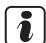

如果在后窗玻璃天线附近使用电气装置，则收音机在 AM 波段中可能发生接收干扰。

只有在点火开关已打开的情况下12V电源插座和点烟器才能工作，插座和点烟器可为电气附件供电。但汽车上任何插座上的用电负荷都不允许超过120瓦。

当发动机停止工作时，只能短时使用连接在插座或点烟器上的用电设备，以避免蓄电池电量过低。

## 警告

插座和与之连接的电气附件在点火开关已打开或发动机运转的情况下工作。使用插座或电气附件不当可能会导致严重人身伤害或发生火灾。因此，切勿让儿童单独逗留在车内而无人照料，有人身伤害的危险！

## 提示

● 利用电源插座时请使用相匹配的插头，避免损坏插座。

● 请使用上汽大众汽车有限公司认可的附件产品。

## 提示（续）

● 注意连接的装置的操作手册！在打开或关闭点火开关之前以及起动发动机之前，请关闭与这个12伏插座相连的电器，以免电压波动造成损坏。

● 在发动机已关闭、开着点火开关和电气附件的情况下，汽车蓄电池会耗电。

## 车顶行李架

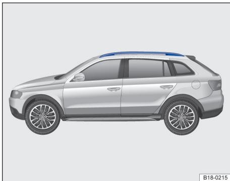  
图 123 朗境（Cross Lavida）车型: 车顶行李架

## 灭火器支架

##  主题引言

该章节包含有关下列主题的信息：
灭火器支架 128

## ①提示

● 注意连接的装置的操作手册！

● 切勿超过最大消耗功率，否则可能损坏整个汽车电气系统。

● 12 伏电源：

– 只可使用符合规范并通过电磁兼容性检测的附件。

– 切勿向电源中送电。

请首先阅读并注意引导信息和安全提示，

见 ，第 126 页。

朗境（Cross Lavida）

## 车顶行李架

车顶行李架属于车辆外饰部件，为避免损坏车辆，请勿利用其承载物品。

## 灭火器支架

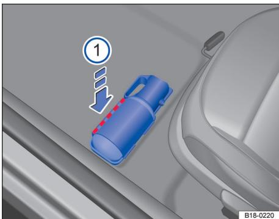  
图 124 灭火器支架

##  请首先阅读并注意引导信息，见第 127 页。

部分车型驾驶员座椅下面安装有灭火器支架，用于固定灭火器。

## 取出灭火器

– 按箭头方向施力按下盖板边缘（图中红色虚线区域）⇒ 图 124 1 ，松开 1 处卡孔对卡扣的紧固。

– 同时，用手指抓住盖板下沿，沿⇒ 图 1252 方向打开即可。

## 固定灭火器

– 按箭头方向施力按下盖板边缘，盖板会自然卡紧关闭⇒ 图 124。

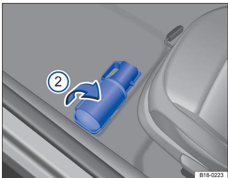  
图 125 灭火器支架

## 警告

由于灭火器的安装，朗逸原装脚垫无法用于出租车车型上，用户如需安装脚垫，需验证是否匹配，如不匹配需用户自行裁剪脚垫，以匹配主驾驶位置空间，且脚垫与主地毯脚垫扣必须安全固定才能使用。否则，可能产生脚垫滑移，造成驾驶事故。

## 警告

固定灭火器时，请确保灭火器支架两个固定卡扣均已卡入盖板。

# 在行驶过程中启动、换挡、驻车

##  主题引言

点火开关锁孔位置 ..... 129
点火钥匙安全联锁功能 ..... 130
发动机电子防盗系统 ..... 130

本章介绍点火开关的使用方法、功能，及使用中应注意的有关事项。

## 警告

● 离开车辆时务必拔下点火钥匙！以防单独留在车内的人员误启动发动机，或操作车内电气设备（如电动门窗）导致伤害。

## 警告（续）

● 离开车辆时切勿将儿童或需要帮助的人员单独留在车内。用遥控钥匙闭锁汽车后可能使车内人员陷入困境。在不同气候条件下车内温度可能很高或很低，极易使车内人员患病或受伤。

● 汽车未停稳前切勿拔出点火钥匙，以免行驶中突然闭锁方向盘，引发事故！

● 汽车停稳后应拉起手制动杆，防止汽车移动。

● 发动机切忌进水！汽车在低洼积水路面行驶时注意避免发动机进水，否则，势必严重损坏发动机，由此导致的故障和损坏，上汽大众不承担任何责任。

## 点火开关锁孔位置

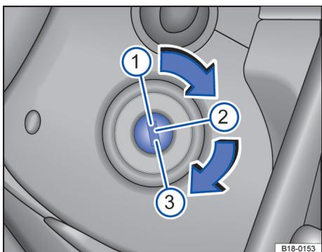  
图 126 点火开关锁孔位置

 请首先阅读并注意引导信息和安全提示，见 ，第 129 页。

1 切断点火开关电源/关闭发动机/锁止方向盘点火钥匙处于该位置时⇒ 图 126 1 ，关闭点火开关，发动机熄火，同时啮合方向盘锁止机构，锁止方向盘。

拔出点火钥匙后应转动一下方向盘，直至听到方向盘锁止机构的啮合声，确保锁止方向盘。

## 2 接通点火开关

若钥匙难以或无法自位置 1 拧至位置 2 ，则应来回转动方向盘，使方向盘锁止机构分离。

## 3 启动发动机

在这个位置启动发动机，此时，汽车内的大功率耗电设备将被暂时关闭。

若一次启动未能成功，再次启动前必须将点火钥匙拧回至位置 1 。

## 警告

● 离开车辆时务必拔下点火钥匙！以防单独留在车内的人员误启动发动机，或操作车内电气设备（如电动门窗）导致伤害。

● 离开车辆时切勿将儿童或需要帮助的人员单独留在车内。用遥控钥匙闭锁汽车后可能使车内人员陷入困境。在不同气候条件下车内温度可能很高或很低，极易使车内人员患病或受伤。

● 汽车未停稳前切勿拔出点火钥匙，以免行驶中突然闭锁方向盘，引发事故！

● 汽车停稳后应拉起手制动杆，防止汽车移动。

● 发动机切忌进水！汽车在低洼积水路面行驶时注意避免发动机进水，否则，势必严重损坏发动机，由此导致的故障和损坏，上汽大众不承担任何责任。

## 小心

● 汽车处于静止状态时方可操作启动机（钥匙处于位置 ⇒ 图 126 2 )，否则，将损坏发动机和启动机。

## 点火钥匙安全联锁功能

请首先阅读并注意引导信息和安全提示，见 ，第 129 页。

自动变速箱选挡杆挂入P挡位时方能拔出点火钥匙。

## 发动机电子防盗系统

 请首先阅读并注意引导信息和安全提示，见 ，第 129 页。

电子防盗保险装置可防止他人非法启动车辆。

在钥匙头内有一枚集成芯片。借助它可以在钥匙打开点火开关时对电子防盗装置取消激活。

## 小心（续）

● 用正确编码的原装钥匙方能启动发动机。

i ● 如果在发动机关闭的情况下长时间地把钥匙置于点火开关位置 ⇒ 图 126 2 ，会导致汽车蓄电池亏电。

配备自动变速箱的汽车，关闭点火开关后必须将选挡杆挂入P挡方能拔出点火钥匙。

拔出点火钥匙后选挡杆被锁止在挡位P。

一旦点火开关关闭，该装置就会自动激活，因此只有经正确编码的上汽大众原装钥匙才能启动发动机。

## 启动和关闭发动机

##  主题引言

该章节包含有关下列主题的信息：
启动按钮 ..... 131
启动发动机 ..... 132
关闭发动机 ..... 133

## 推动或牵引启动

出于技术上的原因，本车不得推动启动或牵引启动。而要使用辅助启动。

## 补充信息和警告说明：

● 遥控钥匙套件 ⇒ 第 50 页

● 换挡 ⇒ 第 135 页

● 制动、停车和驻车 ⇒ 第 141 页

● 转向系统 ⇒ 第 154 页

● 起步辅助系统 ⇒ 第 156 页

● 加油 ⇒ 第 182 页

● 燃油 ⇒ 第 185 页

● 应急关闭或打开⇒ 第 238 页

● 辅助启动⇒ 第 254 页

● 牵引启动和牵引 ⇒ 第 256 页

## 警告

在行驶过程中关闭发动机会使停车更困难。这可能使汽车失去控制，导致事故和受伤。

## 启动按钮

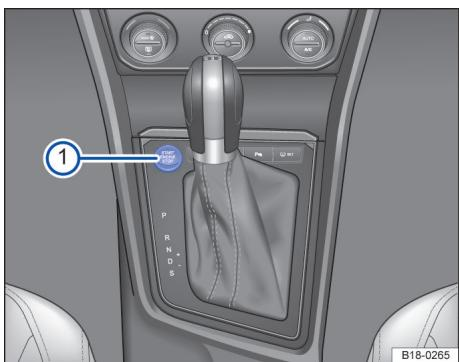  
图 127 中控台下部分中的启动按钮

## 警告（续）

● 本车中的制动和转向助力系统、安全气囊系统、安全带卷收器以及其它安全装备仅在发动机运转时起作用。

● 只可在汽车停住时关闭发动机。

## 警告

在发动机运行状态下，或在启动发动机时，受伤的风险会降低。

● 切勿在不通风或封闭的空间内启动或运行发动机。发动机废气中可能含有无色无味的有毒一氧化碳气体。一氧化碳可致人昏迷及死亡。

● 切勿让本车在发动机运转时处于无人看管状态。汽车可能突然自行移动或发生异常事件，从而导致损坏和受伤。

● 切勿使用启动加速剂。启动加速剂可能导致爆炸和发动机突然高速转动。

## 警告

排气装置的部件可能会很热。可能导致火灾和受伤。

● 停车时切勿让排气装置部件接触到汽车下的易燃物质（例如矮林、树叶、干草、泼出的燃油等）。

● 切勿在排气管、尾气催化净化器或隔热板上使用附加的底部保护层或防腐材料。

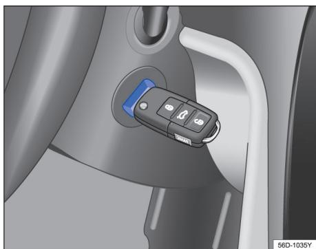  
图 128 应急启动

##  请首先阅读并注意引导信息和安全提示，见 ，第 131 页。

只在车内有一把有效的遥控钥匙时，此钥匙才起作用。

可以用启动按钮或用遥控钥匙通过应急启动

来⇒ 图 128⇒ 图 127 启动汽车。

在离开汽车时，如果点火开关已关闭，则打开驾驶员侧车门就会激活电子转向柱锁止装置⇒ 第 154 页。

## 接通或关闭点火开关

● 短促按下启动按钮一次，且请勿踩下制动或离合器踏板。

## 应急启动

如果识别到车内没有有效遥控钥匙，则将遥控钥匙头靠近图示位置⇒ 图 128的同时按下启动按钮，可以应急启动发动机。可能在诸如遥控钥匙内的电池电量较少或已耗尽时出现这样的情况。

## 应急关闭

如果发动机无法通过短促按下启动按钮进行关闭，则必须执行应急关闭：

● 在一秒钟内连按两下启动按钮，或按住启动按钮超过一秒钟 ⇒  ，在关闭发动机中，见第 133 页。

● 发动机自动关闭。

## 启动发动机

 请首先阅读并注意引导信息和安全提示，见 ，第 131 页。

## 发动机重新启动功能

如果在关闭发动机后未在汽车内部空间内识别到有效的遥控钥匙，则在大约 5 秒钟内还可以重新启动发动机。显示屏上会显示一条相应的信息。

超过这段时间后，如果车内没有有效的遥控钥匙则无法再启动发动机。

## 警告

汽车意外移动可能导致受伤。

● 如果只需打开点火开关，则不必踩下制动或离合器踏板，否则发动机可能会意外启动。

## 警告

粗心或无人监管地使用遥控钥匙可能导致事故和受伤。

● 每次离开汽车时都要随身携带所有遥控钥匙。儿童或擅自操作的他人可能把本车锁止、启动发动机或打开点火开关，并操作电动装备例如车窗升降器。

## 警告

配备Kessy系统的车辆,必须在上电的情况下拖车。

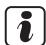

i 在配备Kessy 的汽车上，如果发动机必须进行预热，则发动机启动可能会延迟。

只有经过正确编码的上汽大众原装钥匙才能起动发动机。

启动车辆时，车内必须有一把有效的遥控钥匙。

操作只可按给定顺序执行。

<table><tr><td>步骤</td><td>用机械钥匙通过点火开关 启动汽车⇒第 131 页</td><td>用启动按钮 ⇒第 131 页(Kessy)启动汽车</td></tr><tr><td>1.</td><td>起动前请首先拉起手制动器。</td><td>踩下制动踏板并保持,直至车辆启动才可松开。</td></tr><tr><td>2.</td><td>手动变速器:挡位置于空挡,完全踩下离合器踏板并保持,这时起动机只带动发动机转动。</td><td>将换挡杆置于 P 或 N 挡。</td></tr><tr><td>3.</td><td>自动变速器:换挡杆置于位置 “P” 或 “N”,踩下制动踏板并保持。</td><td></td></tr><tr><td>4.</td><td>点火钥匙转到位置⇒图 1263,起动发动机。</td><td>按压启动按钮(此时请勿踩下油门踏板)。</td></tr><tr><td>5.</td><td>一旦发动机起动,请立刻松开点火钥匙。避免起动机被发动机拖带运行。</td><td>当发动机启动后,松开启动按钮。</td></tr></table>

操作只可按给定顺序执行。

<table><tr><td>步骤</td><td>用机械钥匙通过点火开关 启动汽车⇒第 131 页</td><td>用启动按钮 ⇒第 131 页(Kessy)启动汽车</td></tr><tr><td>6.</td><td>冷态的发动机起动后,会短时发出较强的运转噪声,这是因为发动机配气机构存在一定的配合间隙,需要通过油压的建立来调整和消除。这是正常现象,无需多虑。</td><td>如果发动机未能成功启动,请取消启动过程并在约一分钟后重复上述启动过程。</td></tr><tr><td>7.</td><td>如果发动机还没有达到工作温度,应该避免发动机的高转速和全油门。</td><td>如要起步,请放下手制动杆。</td></tr></table>

## 警告

切勿在发动机运转的情况下离开汽车。汽车可能突然自行移动，特别是在已挂入挡位或已挂入行驶挡时可能导致事故和受伤。

## 警告

启动加速剂可能导致爆炸或发动机突然高速旋转。

● 切勿使用启动加速剂。

## ①提示

● 如果在行驶过程中尝试启动发动机或在关闭发动机后立即重新启动发动机，可能损坏启动机或发动机。

## 提示（续）

● 在发动机处于冷态时要避免高发动机转速、油门全开和大发动机负荷。

● 不得通过推动或牵引启动汽车。否则未燃烧的燃油可能损坏催化净化器。

请勿在停车状态下预热发动机，在透过车窗玻璃向外的视野良好时要立即起步。这样发动机可更快达到其工作温度并且有害物质排放更少。

i 例如在遥控钥匙的电池电量低或电量耗尽时，不能通过启动按钮启动发动机。在这种情况下用遥控钥匙通过应急启动方式启动汽车。

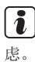

i 在发动机启动时，会暂时关闭功率较大的用电器。

i 发动机冷机启动后，由运行情况决定可能短时发出较大的运转噪音。此为正常情况，无需多虑。

## 关闭发动机

请首先阅读并注意引导信息和安全提示，见 ，第 131 页。

<table><tr><td colspan="3">操作只可按给定顺序执行。</td></tr><tr><td>步骤</td><td>用机械钥匙通过点火开关 ⇒第 50 页关闭发动机</td><td>用启动按钮 ⇒第 131 页(Kessy)关闭发动机</td></tr><tr><td>1.</td><td colspan="2">将汽车完全停住 ⇒⚠️。</td></tr><tr><td>2.</td><td colspan="2">踩下并踩住制动踏板,直至步骤 4 执行完毕为止。</td></tr><tr><td>3.</td><td colspan="2">对于自动变速箱将选挡杆置于 P。</td></tr><tr><td>4.</td><td colspan="2">拉起手制动杆。</td></tr><tr><td>5.</td><td>将点火钥匙转到位置 ⇒图 126 $^{0}$ 。</td><td>短促按下启动按钮。如果无法停下发动机,则应执行应急关闭 ⇒第 132 页。</td></tr></table>

## 警告

汽车还在移动期间切勿关闭发动机。否则可能导致对汽车失去控制，导致事故和受伤。

● 在点火开关已关闭的情况下，安全气囊和安全带自动回卷装置都不起作用。

## 警告（续）

● 在发动机已关闭的情况下，制动助力器不起作用。要停车时必须用更大的力踩下制动踏板。

● 转向助力器在发动机已关闭的情况下不工作，操作汽车转向时需要更大的力。

● 如果将遥控钥匙从点火开关中拔出，转向锁可能卡止，而且汽车无法再转向。

## ① 提示

如果汽车曾较长时间在较高的发动机负荷下行驶，则发动机在关闭后可能过热。为了避免发动机损坏，在关闭发动机前要先让其在空挡位置上运转约两分钟。

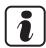

i 对于带自动变速箱的汽车，遥控钥匙只能在选挡杆位置P上取出。

i 在关闭发动机后，发动机舱内的散热器风扇在点火开关已关闭或遥控钥匙已拔出的情况下仍可能继续运转几分钟。此散热器风扇会自动关闭。 

## 换挡

##  主题引言

该章节包含有关下列主题的信息：
警告灯和指示灯 ..... 136
踏板 ..... 136
手动变速箱：挂入挡位 ..... 137
自动变速箱：挂入挡位 ..... 137
利用 Tiptronic 手动电控换挡程序换挡 ..... 139
紧急程序 ..... 139
通过自动变速箱驾驶 ..... 140
挡位建议 ..... 140

## 在已挂入倒挡且已打开点火开关时，会出现以下情况：

● 倒车信号灯亮起。

● 驻车距离警报系统自动启动。

补充信息和警告说明：

● 仪表 ⇒ 第 23 页

● 制动、停车和驻车 ⇒ 第 141 页

● 前后驻车距离报警系统 ⇒ 第 157 页

● 空调 ⇒ 第 169 页

● 应急关闭或打开 ⇒ 第 238 页

● 发动机控制单元和废气净化装置⇒ 第 233 页

## 警告

特别是在光滑的道路上，快速加速可能导致牵引力损失和侧滑。可能导致对汽车失去控制，导致事故和受伤。

● 在视野、天气、路面和交通状况允许时，才可使用强制降挡或快速加速。

## 警告

切勿让制动器过于频繁和时间过长地“摩擦”，或过于频繁和时间过长地踩下制动踏板。持续制动会导致制动器过热。于是制动功率明显降低、制动距离显著增大并且可能导致制动装置完全失灵。

## ① 提示

● 如果不真正需要制动，切勿通过轻踩踏板让制动器“磨擦”。否则会加快磨损。

● 在驶过较长的陡下坡之前要降低车速，挂入某个较低的挡位或选择某个较低的行驶挡。这样可以充分利用发动机制动并减轻制动器负荷。否则制动器会过热并可能失灵。只在为了减速或停车而需要时，才可使用制动器。

## 警告灯和指示灯

请首先阅读并注意引导信息和安全提示，见 ，第 135 页。

<table><tr><td>亮起</td><td>可能的原因</td><td>解决措施</td></tr><tr><td> $\{022x\}$ </td><td>制动踏板未踩下。</td><td>起步前踩下制动踏板。</td></tr></table>

在打开点火开关时，某些警告灯和指示灯会短暂亮起，表明在进行功能检测。它们在几秒钟后会消失。

## 警告

忽视亮起的警告灯和文字信息会导致在道路交通中抛锚，引起事故和受伤。

## 踏板

## 警告（续）

请首先阅读并注意引导信息和安全提示，见 ，第 135 页。

所有踏板的操作和移动都绝对不允许受物品或脚垫影响。

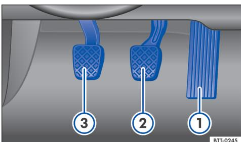  
图 129 带手动变速箱的汽车上的踏板： 1 油门踏板 2 制动踏板 3 离合器踏板

只可使用保证踏板区域自由并且已在脚部空间内进行防滑固定的脚垫。

BTT-0245

某个制动回路失灵时，为了使汽车停下来，将制动踏板踩到底的时间必须长一些。

● 切勿忽视亮起的警告灯和文字信息。

## 警告

● 当汽车静止或为进行维修必须停车时，务必与道路保持安全距离停车，接通危险警报灯、关闭发动机和采取其它安全措施向后面的车辆示警。

● 一旦可行且安全，就立即停车。

驾驶员脚部空间内的物品可能妨碍顺畅操作踏板。可能导致对汽车失去控制，加大受伤的风险。

## ① 提示

忽视亮起的指示灯和文字信息可能导致汽车损坏。 

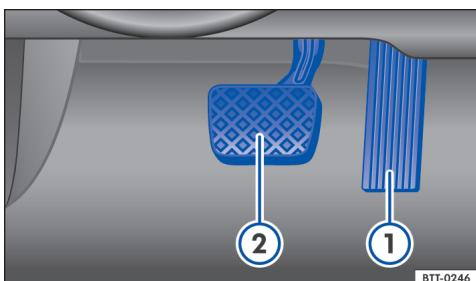  
图 130 带自动变速箱的汽车上的踏板： 1 油门踏板、 2 制动踏板

## 警告（续）

● 要确保始终能够顺畅踩下所有踏板。

● 脚垫要始终可靠固定在脚部空间内。

● 切勿把脚垫或其它地毯置于已安装的脚垫上。

● 要确保在行驶过程中任何物品都不会进入驾驶员脚部空间内。

## ①提示

踏板必须始终能够毫无阻碍地踩下。例如在某个制动回路失灵时，为了使汽车停下来，所需的制动踏板行程就更长。这时将制动踏板踩到底的时间必须长一些并且要更用力。

## 手动变速箱：挂入挡位

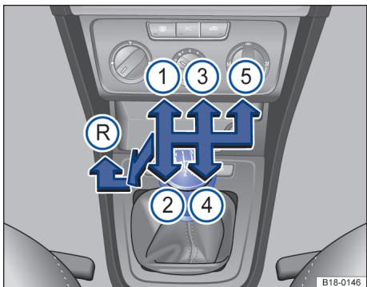  
图 131 手动变速箱挡位示意图

 请首先阅读并注意引导信息和安全提示，见 ，第 135 页。

## 倒挡

● 车辆完全停稳后，发动机怠速运转时将离合器踏板踩到底。

● 将挡位杆移入空挡。

自动变速箱：挂入挡位  
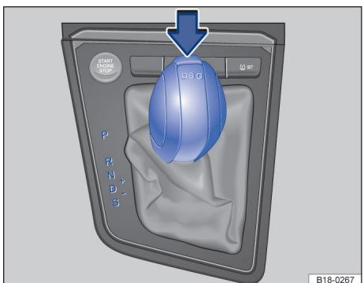  
图 132 带锁止按钮（箭头所示）的自动变速箱选挡杆

 请首先阅读并注意引导信息和安全提示，

此选挡杆装备有一个选挡杆锁止机构。在将选挡杆从位置P 切换到某个行驶挡时应踩下制动踏板并沿箭头方向按压选挡杆手柄内的锁止按

● 停顿数秒钟后下压换挡杆，然后往左推到底，再将换挡杆向前推至换挡手柄上所示的倒挡位置 R 。

打开点火开关后挂入倒挡时下列功能将被激活：

● 倒车信号灯点亮。

● 驻车距离警报系统自动开启。

## 警告

● 发动机处于运转状态时一旦挂入某个前进挡，汽车立即起步行驶。

● 车辆行驶时切不可突然挂入倒挡，否则，可能引发严重事故！

## ① 提示

● 车辆行驶时请勿将手搁在换挡杆上，以免手的压力传到变速箱内的换挡拨叉上，导致拨叉过早磨损。

● 换挡时必须将离合器踏板踩到底，避免不必要的磨损和损坏。

● 在坡道上请勿采用控制离合器踏板的方式停车，这样会导致离合器提前磨损。

● 车辆行驶时请勿空挡滑行，有事故危险！

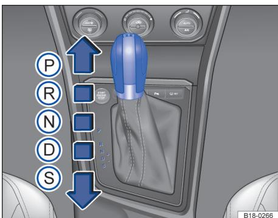  
图 133 自动变速箱选挡杆

钮⇒ 图 132。当换挡杆在位置N已经停留了2秒以上时，为了将选挡杆从位置 N 切换到位置 D 或R，要事先踩下制动踏板并保持。

在点火开关已打开的情况下，显示屏上显示当前的选挡杆位置。

<table><tr><td>选挡杆位置</td><td>名称</td><td>含义  $\Rightarrow$ ⚠️</td></tr><tr><td>P</td><td>驻车锁</td><td>驱动轮已机械锁死。仅在汽车停住时才可挂入。要退出此选挡杆位置时,踩下制动踏板,另外打开点火开关。</td></tr><tr><td>R</td><td>倒挡</td><td>倒挡已接通。仅在汽车停住时才可挂入。</td></tr><tr><td>N</td><td>空挡(怠速挡)</td><td>变速箱处在空挡(怠速挡)。此时没有力传递到车轮且无法使用发动机的制动作用。</td></tr><tr><td>D</td><td>前进挡位置(常规换挡程序)</td><td>所有前进挡都可自动换高挡和降挡。换挡时刻取决于发动机负荷、个人的驾驶风格和行驶速度。</td></tr><tr><td>S</td><td>前进挡位置(运动型换挡程序)</td><td>与在选挡杆位置 D 上相比,所有前进挡都可自动滞后换高挡和提前降挡,以便充分利用发动机的后备功率。换挡时刻取决于发动机负荷、个人的驾驶风格和行驶速度。</td></tr></table>

## 选挡杆锁止机构

在位置 P 或 N 上，选挡杆锁止机构可防止意外挂入某个行驶挡而使汽车意外移动。

如要松开选挡杆锁止机构，在点火开关已接通的情况下踩下制动踏板并保持。同时按压选挡杆上的锁止按钮。

在经过位置 N 迅速换挡（例如从 R 切换到 D）时，选挡杆不被锁止。如果在制动踏板处于未踩下状态超过约2秒钟时和在车速低于约 5 km/h

（3 mph）时选挡杆在位置 N 上，则选挡杆锁止。

## 警告

挂入错误的选挡杆位置可能会失去对汽车的控制、导致事故和受伤。

● 在发动机运转且已挂入行驶挡的情况下，一松开制动踏板，汽车就开始移动。

● 切勿在行驶过程中挂入倒挡或驻车锁。

## 警告

汽车意外移动可能导致受伤。

● 驾驶员切勿在发动机运转且已挂入行驶挡的情况下离开驾驶员座椅。如果必须在发动机运转的情况下离开本车，务必拉起手制动杆并将选挡杆置于位置 P。

## 警告（续）

● 在发动机运转且已挂入行驶挡 D、S 或 R 的情况下，务必用脚制动器将本车停住。即使在怠速转速下，动力传递也不会完全中断并且汽车仍会“挪动”。

● 如果汽车正在移动，切勿切换到行驶挡 R 或P。

● 切勿在挂入行驶挡 N 的情况下离开汽车。否则汽车会顺山坡向下滑行，无论发动机是否运转。

## ①提示

如果在汽车停住时未拉起手制动杆，同时在选挡杆位置 P 上松开制动踏板，则本车可能自行向前或向后移动数厘米。

## ① 提示

对自动挡车，当挡位不在 P 挡，用户暂时离开车时，仪表上会显示警告符号：-->P ，提醒用户请挂P 挡（不同车型仪表上显示的功能可能不同，具体以实车为准）。

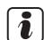

如关闭发动机并将选挡杆移入N挡位后仍让汽车滑行，自动变速箱将无法得到润滑而损坏。 

# 利用 Tiptronic 手动电控换挡程序换挡

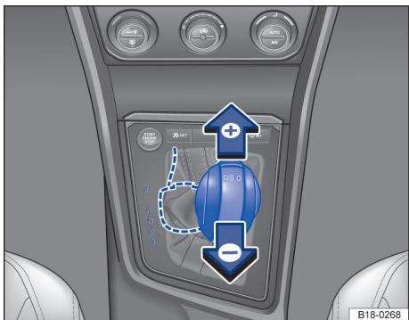  
图 134 选挡杆在 Tiptronic 手动电控换挡程序位置上

##  请首先阅读并注意引导信息和安全提示，见 ，第 135 页。

通过 Tiptronic 手动电控换挡程序可以在自动变速箱上手动换高挡和换低挡。在切换到 Tiptronic 手动电控换挡程序时，会保留当前正在使用的挡位。只要系统未由于当前的行驶状态自动换挡，这种情况就一直延续。

通过选挡杆操作 Tiptronic 手动电控换挡程序● 将选挡杆从位置D上向右按入 Tiptronic 手动电控换挡程序换挡凹槽内 。

● 向前 + 或向后–短促按压选挡杆，即可换高挡或降挡。⇒ 图 134

汽车加速行驶时发动机达到最高允许转速前自动变速箱自动换到临近的高挡。

若选挡杆处于挡位D，汽车以3挡速度行驶时将选挡杆右推入 “Tiptronic” 挡位槽，则汽车仍以3挡速度行驶。

## 紧急程序

 请首先阅读并注意引导信息和安全提示，见 ，第 135 页。

当系统出现故障时将调用紧急运行程序。

如果变速箱电子元件有功能性故障，变速箱启动相应的紧急运行程序。此时，所有的信号灯会亮起或熄灭。

此时仍然可以移动换挡杆至任何位置。在位置D和S，变速箱挡位停留在3挡。您也可以起动倒车挡R。

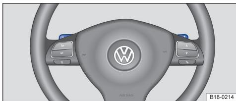  
图 135 部分车型方向盘上的换挡拨片

## 通过换挡拨片执行手动换挡

● 当选挡杆处于位置D或S时，请按压方向盘左侧的换挡拨片 - 或右侧的换挡拨片 + ⇒ 图 135

● 按压方向盘右侧的拨片 + OFF，升一挡。

● 按压方向盘左侧的拨片 - ，降一挡。

● 长按方向盘右侧的拨片 + OFF约一秒，关闭手动换挡模式。

如果在一段时间内未操作换挡拨片，则手动换挡模式自动关闭。

## ①提示

● 在加速时，变速箱在即将达到允许的最高发动机转速之前会自动换到相邻的较高挡位。

● 如选择较低挡位，则发动机在不会超速运转时自动变速箱才会换入低挡。

对于DSG变速箱：也可以移动换挡杆至任何位置，在位置D和S,变速箱只有部分挡位可以使用，某些故障情况下，倒车挡R无法使用。

在应急程序中，手动换挡“Tiptronic”被关闭。

如果变速箱切换到紧急模式，请小心将车开到离您最近的上汽大众经销商检测并排除故障。

## 通过自动变速箱驾驶

 请首先阅读并注意引导信息和安全提示，见 ，第 135 页。

前进挡可自动升挡或降挡。

## 在下坡路面上行驶

下坡坡道越陡，选择的挡位应该越低。较低的挡位可提高发动机制动效果。切勿让汽车在空挡（怠速挡） N 上在山区或丘陵地区滑行。

● 要降低车速。

● 将选挡杆从位置 D 中向右按入 Tiptronic 手动电控换挡程序的换挡凹槽内 ⇒ 第 139 页。

● 向后短促按压选挡杆，降挡。

## 上坡停车和起步

上坡坡道越陡，选择的挡位就应越低。

如果在已挂入行驶挡的情况下在上坡上停车，则务必通过踩下制动踏板或接通驻车制动器防止汽车自行移动。在起步时才可松开制动踏板或松开手制动杆⇒  。

## 强制降挡

该功能可使汽车达到最大加速性能。

完全踩下油门踏板，变速箱将根据发动机转速及车速自动切入某个低速挡，使汽车达到最大加速性能。

## 挡位建议

 请首先阅读并注意引导信息和安全提示，

在正常挂挡行驶过程中，某些汽车的组合仪表显示屏上会以下图方式显示选择某个节省燃油的挡位的建议：

<table><tr><td>显示</td><td>含义</td></tr><tr><td>{677Y}</td><td>已选择最佳挡位。</td></tr><tr><td>↑</td><td>建议升到某一挡。</td></tr><tr><td>↓</td><td>建议降到某一挡。</td></tr></table>

发动机达到该挡位的最大允许转速时变速箱方会自动切入临近高挡。

## 警告

特别是在光滑的道路上，快速加速可能导致牵引力损失和侧滑。可能导致对汽车失去控制，导致事故和受伤。

● 只有当视野、天气、路面和交通状况都允许，且不会因汽车的加速以及驾驶风格而危及其他车辆的情况下，才能采用强制降挡或加速行驶。

● 注意，如果关闭了 ASR，尤其是当道路光滑的情况下，驱动轮便可能打滑，车辆可能滑行。

## ① 提示

● 在已挂入行驶挡的情况下在上坡路段停车时，请勿通过加油门防止本车自行移动。否则自动变速箱会过热及受损。

● 切勿让本车在行驶挡 N挡中滑行，尤其是在发动机已关闭时。否则自动变速箱会得不到润滑并可能因此损坏。

● 双离合器变速箱具有过载保护功能，当离合器过热时，组合仪表会发出警告信息。请停车，关闭发动机。待离合器冷却（仪表中警告消失）后，再继续行驶。

## 小心

此挡位建议只是一种辅助手段。

● 在相应的行驶状况下正确选择合适挡位完全是驾驶员的责任，例如在超车、上坡或者下坡行驶时。

最佳选择的挡位有助于节省燃油。

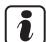

在踩下离合器踏板时，挡位建议显示消失。

## 制动、停车和驻车

##  主题引言

该章节包含有关下列主题的信息：
警告灯和指示灯 ..... 141
驻车 ..... 142
关于制动器的信息 ..... 143
制动踏板自由行程的合理范围及制动摩擦副的合理使用范围 ..... 144
制动辅助系统 ..... 145
电子稳定系统（ESP） ..... 147
制动液 ..... 148

制动轮速系统包括防抱死制动系统（ABS）、紧急制动提示（NBW）、制动辅助系统（HBA）、发动机阻力矩控制（MSR）、制动力分配系统（EBD）、坡道起步辅助系统（HHC）、液压制动助力（HBV）、轮胎气压监测系统（RKA+）、牵引力控制系统（ASR）和电子稳定系统（ESP）。

补充信息和警告说明：

● 起步辅助系统 ⇒ 第 156 页

● 车轮和轮胎 ⇒ 第 220 页

● 附件、零部件更换、维修和改装⇒ 第 228 页

## 警告

在制动摩擦片已磨损到极限或制动装置有故障的情况下行驶会导致事故和受伤。

## 警告

不恰当的驻车可能导致受伤。

● 汽车还在移动期间切勿将遥控钥匙从点火开关中拔出。否则转向锁会卡止，汽车无法再转向或操控。

● 停车时切勿让排气装置部件接触到汽车下的易燃物质（例如矮林、树叶、干草、泼出的燃油等）。

● 每次停车或驻车时，务必拉起手制动杆。

● 切勿将儿童或需要帮助的人员留在车内。他们可能松开手制动杆、操作选挡杆或换挡杆并因此使本车移动。从而导致事故和受伤。

● 每次退出汽车时都要随身携带所有遥控钥匙。否则有人可能启动发动机和操作车窗升降器等电动装备，可能导致受伤。

● 切勿将儿童或需要帮助的人员单独留在车内。在紧急情况下，这些人员无法自行离开汽车或无法自救。例如视季节而定，在关闭的汽车中可能出现很高或很低的温度，尤其可能导致幼儿受伤和生病或死亡。

## ① 提示

● 在带突出路沿围边或固定限位块的停车场中要始终小心行驶。这些突出地面的物体在驶入和驶出时可能损坏保险杠和其它汽车部件。为了避免损坏，要在车轮接触限位块或路沿之前停车。

● 要小心地驶过道路、坡道、路沿和其它物体。低置汽车部件如保险杠、扰流板和底盘、发动机或排气装置的部件在通过时可能受损。

## 警告灯和指示灯

请首先阅读并注意引导信息和安全提示，见 ，第 141 页。

<table><tr><td>常亮</td><td>可能的原因 ⇒▲</td><td>解决措施</td></tr><tr><td rowspan="2">(!)</td><td>制动装置有故障。</td><td>请勿继续行驶!立即请专业人员处理 ⇒第 143 页。</td></tr><tr><td>制动液液位过低。</td><td>请勿继续行驶检查制动液液位 ⇒第 148 页。</td></tr><tr><td>(P)</td><td>手制动拉起。</td><td>在不需拉起手制动杆时放下手制动杆</td></tr><tr><td rowspan="4"></td><td>ESP/ASR受限或已关闭。</td><td>关闭点火开关,然后再接通。必要时行驶一小段路程。</td></tr><tr><td>ESP/ASR有故障。</td><td>请到上汽大众经销商检修。</td></tr><tr><td>与ABS指示灯◎一起:ABS有故障。</td><td>请到上汽大众经销商检修。</td></tr><tr><td>汽车蓄电池已重新连接。</td><td>⇒第198页</td></tr><tr><td></td><td>牵引力控制系统(ASR)已手动关闭。</td><td>接通牵引力控制系统(ASR)⇒第147页。通过接通和关闭点火开关自动接通牵引力控制系统(ASR)或再次按下ESP OFF按钮◎。</td></tr><tr><td></td><td>防抱死制动系统(ABS)有故障。</td><td>请到上汽大众经销商检修。</td></tr><tr><td rowspan="2"></td><td rowspan="2">制动踏板未踩下。</td><td>起步前踩下制动踏板。</td></tr><tr><td>松开手制动杆时踩下制动踏板。</td></tr></table>

<table><tr><td>闪烁</td><td>可能的原因 ⇒⚠️</td><td>解决措施</td></tr><tr><td>(!)</td><td>制动系统有故障。</td><td>请到上汽大众经销商检修,因为本车可能无法安全驻车。</td></tr><tr><td></td><td>快速闪烁:ESP 或 ASR 正在进行调节。</td><td>将脚从油门踏板上抬起。使驾驶方式与道路状况相匹配。</td></tr></table>

在打开点火开关时，某些警告灯和指示灯会短暂亮起，表明在进行功能检测。它们在几秒钟后会消失。

## 警告

忽视亮起的警告灯和文字信息会导致在道路交通中抛锚，引起事故和受伤。

● 切勿忽视亮起的警告灯和文字信息。

● 一旦可行且安全，就立即停车。

## 警告

使用有缺陷的制动器行驶可能导致事故和受伤。

● 如果制动装置警告灯  不熄灭或在行驶过程中亮起，说明储液罐中的制动液液位过低或制动装置存在某个故障。要尽快停车，然后请专业人员处理 ⇒ 第 148 页，制动液。

## 驻车

 请首先阅读并注意引导信息和安全提示，见 ，第 141 页。

停车和驻车时要注意相关法律规定。

## 停车

操作只可按给定顺序执行。

● 将汽车停在合适的地面上 ⇒  。

● 踩下并踩住制动踏板，直至发动机关闭。

● 对于自动变速箱将选挡杆置于位置 P。

● 关闭发动机，拉起手制动杆，松开制动踏板。

## 警告（续）

●如果制动装置警告灯与ABS 指示灯一起亮起，则说明 ABS 的调节功能可能已失灵。于是在制动时后车轮可能较快抱死。抱死的后车轮可能导致失去对汽车的控制！如果可行，则降低车速并小心地以较低车速行驶到最近的上汽大众经销商，让其检查制动装置。在前往途中要避免紧急制动。

● 如果 ABS 指示灯  不熄灭或在行驶过程中亮起，则 ABS 未正确工作。只能通过正常制动使本车停车（无 ABS 功能）。于是没有 ABS 提供的保护作用。请尽快到上汽大众经销商检修。

## ①提示

忽视亮起的指示灯和文字信息可能导致汽车损坏。 

● 将钥匙从点火开关中取出。

● 必要时略微转动方向盘，使转向锁卡止。

● 对于手动变速箱在平地和上坡上挂入 1 挡或在下坡上挂入倒挡，然后松开离合器踏板。

● 确保所有乘员特别是儿童都下车。

● 如果离开本车，请随身携带所有遥控钥匙。

● 将汽车锁止。

## 在上坡和下坡路面上的附加事项

在关闭发动机前转动方向盘，使已驻车的汽车在自动移动时前车轮顶上路沿。

● 在下坡路面时，偏转前车轮，使其朝着路沿方向。

● 在上坡路面时，偏转前车轮，使其朝着路面中央。

## 警告

排气装置的部件可能会很热。可能导致火灾和受伤。

## 关于制动器的信息

 请首先阅读并注意引导信息和安全提示，见 ，第 141 页。

新制动摩擦片在前 200 至 300 km 期间还不具备充分的制动效果，而且必须首先进行“磨合” ⇒  。然而可以通过更用力踩制动踏板来补偿略有降低的制动力。在磨合期间，全制动或紧急制动时的制动距离会比制动摩擦片已磨合好时长。在磨合期间要避免全制动和制动器承受高负荷。例如在距离过近跟车行驶时。

制动摩擦片的磨损情况完全取决于使用条件和驾驶方式。在经常市区行驶和短途行驶时以及采用运动型驾驶方式时，要比保养手册中的规定更频繁地到上汽大众经销商检测制动摩擦片厚度。

在制动器潮湿的情况下行车时（例如涉水行车后、强降雨时或清洗汽车后），制动效果可能由于潮湿或冬季制动盘结冰而变差。通过多次在较高车速小心的制动，尽快“干燥制动”。同时要确保不会危及后面的车辆或行人⇒  。

制动盘和制动摩擦片上的盐层会延迟制动效应和延长制动距离。如果在撒有化雪盐的道路上较长时间行驶未曾制动，则必须通过小心地制动磨掉盐层⇒  。

制动盘上的锈蚀和制动摩擦片的脏污可能由于长时间停放、行驶里程少和使用率低而加重。如果制动摩擦片不使用或使用率低以及存在锈蚀，建议通过多次制动来清洁制动盘和制动摩擦片。同时选择安全区域和路况⇒  。

## 制动装置有故障

如果必须进行制动而汽车不能再像往常一样制动（制动距离突然变长），则可能是某个制动回路已失录 如果发现警告灯和必要时通过一条文字信息指示，请立即到最近的上汽大众经销商检修排除故障。在前往上汽大众经销商的路上要以较低的车速行驶，同时针对制动距离变长和踏板压力变大调整驾驶方式。

## 警告（续）

● 停车时切勿让排气装置部件接触到汽车下的易燃物质（例如矮林、树叶、干草、泼出的燃油）。

## ①提示

● 在带突出路沿围边或固定限位块的停车场中要始终小心行驶。这些突出地面的物体在驶入和驶出时可能损坏保险杠和其它汽车部件。为了避免损坏，要在车轮接触限位块或路沿之前停车。

● 要小心地驶过道路、坡道、路沿和其它物体。低置汽车部件如保险杠、扰流板和底盘、发动机或排气装置的部件在通过时可能受损。

## 制动助力器

制动助力器只在发动机运行时起作用，它增强驾驶员施加到制动踏板上的踏板压力。

如果制动助力器不工作或对本车进行牵引，必须用力踩下制动踏板，因为此时制动距离会因缺少制动助力而变长 ⇒  。

## 警告

新制动摩擦片在开始时不具备最佳制动效果。

● 新制动摩擦片在前 200至300 km时还不具备充分的制动效果，而且必须首先进行“磨合”。这时可以通过在制动踏板上施加更大的压力来提高降低的制动效果。

● 为了降低事故、受伤和失去对汽车的控制的风险，使用新制动摩擦片时要特别小心地驾驶。

● 在新制动摩擦片磨合期间切勿距离太近跟在其它汽车后行驶，或陷入制动器承受高负荷的行驶状况。

## 警告

过热的制动器会降低制动效果和显著延长制动距离。

● 在下坡路面行驶时制动器的负荷特别高，并且会很快过热。

● 在驶过较长的陡下坡之前要降低车速，挂入某个较低的挡位。这样可以充分利用发动机制动并减轻制动器负荷。

● 非标配的或损坏的前扰流板可能影响制动器的通风，并导致制动器过热。

## 警告

潮湿的制动器或结冰或含盐的制动器制动较迟缓，并会延长制动距离。

## 警告（续）

● 要小心地尝试着试验制动器。

● 在视野、天气、路面和交通状况允许的情况下，务必通过几次小心的制动操作，使制动器干燥，并去除冰和盐。

## 警告

不配备制动助力器行驶时制动距离会显著变长，会因此导致事故和受伤。

● 切勿在发动机已关闭的情况下让汽车滑行。

● 如果制动助力器不工作或对本车进行牵引，必须用力踩下制动踏板，因为此时制动距离会因缺少制动助力而变长。

## ① 提示

● 如果不真正需要制动，切勿通过轻踩踏板让制动器“磨擦”。在制动踏板上持续施加压力会导致制动器过热。于是制动效果明显降低、制动距离显著增大并且可能导致制动装置完全失灵。

● 在驶过较长的陡下坡之前要降低车速，挂入某个较低的挡位或选择某个较低的行驶挡。这样可以充分利用发动机制动并减轻制动器负荷。否则制动器会过热并可能失灵。只在为了减速或停车而需要时，才可使用制动器。

i 在检查前部制动摩擦片时，也应同时检查后部制动摩擦片。要定期通过轮辋开口或从汽车底部检查制动摩擦片，目测所有制动摩擦片的厚度。如有必要，拆下车轮以进行彻底检查。请您前往上汽大众经销商进行专业的检查。

## 制动踏板自由行程的合理范围及制动摩擦副的合理使用范围

 请首先阅读并注意引导信息和安全提示，见 ，第 141 页。

制动踏板的自由行程应与该车型的技术要求一致。制动踏板自由行程的合理范围：10-35 mm。

前后摩擦片使用极限是至摩擦材料的所剩厚度为3mm的位置，前后制动盘使用极限是至总厚度磨掉3mm 位置。

对于Taxi车型，后制动如果为鼓式制动器，后摩擦片使用极限是磨铆钉位置，后制动鼓使用极限是至制动鼓摩擦面直径磨掉1.5mm，后制动如果为盘式制动，后摩擦片使用极限是至摩擦材料的所剩厚为3mm的位置，后制动盘使用极限是至总厚度磨掉2mm位置。

##  请首先阅读并注意引导信息和安全提示，见 ，第 141 页。

制动辅助系统 ESP 包括 ABS、EBD、HHC、HBA、HBV、MSR、NBW、RKA+和 ASR 只在发动机运行时工作，对提高主动行驶安全性起重要作用。

## 电子稳定系统（ESP）

ESP 可识别动态行驶极限状态如汽车转向过度和转向不足或驱动轮打滑。系统通过有针对性的对单个车轮进行制动干预或降低发动机扭矩帮助稳定汽车。

利用ESP可以提高在动态行驶情况下对车辆的控制。例如，车辆在弯道高速行驶时，可根据路面情况降低侧滑危险，从而改善汽车的行驶稳定性。

每次启动发动机，ESP会自动打开并进行自检。ESP控制单元处理来自各个系统的数据以及感应器传来的附加测量数据：包括绕车辆横摆角速度、侧向加速度、制动管路压力、方向盘转向角等。

借助于转向角度和车速，系统可以确定驾驶员的行车意图，并不断与汽车的实际状态进行比较。在发生偏差时（比如汽车出现打滑），ESP将自动调节相应车轮的制动力。

通过调节各车轮的制动力，车辆会重新恢复到稳定状态，如果车辆转向过度，ESP主要对处于弯道外侧的前轮进行制动；反之，如果车辆转向不足，则主要对处于弯道内侧的后轮进行制动；在进行制动干预中会伴有噪音。

在 ESP 中集成有 ESP 包括 ABS、EBD、HHC、HBA、HBV、MSR、NBW、RKA+和 ASR 系统。ESP 始终处于激活状态。如果在某些行驶状况下无法再达到足够的牵引力，则可通过按压 ASR 按钮关闭 ASR 。请确保当牵引力重新存在时，始终重新接通 ASR。

## 防抱死系统（ABS）

ABS能显著提高汽车的主动安全性。由于车轮没有抱死。因此，相对于传统的制动系统，它的主要优点是在任何路面情况下都能保持良好的转向能力

即使是在湿滑路面上完全制动。然而ABS不能在所有情况下缩短制动距离。例如在沙地上或新下雪的路面上行驶，应该小心谨慎低速行驶，这时制动距离可能更长。

如果一个车轮的圆周速度相对车速而言较小并且趋向于抱死时，这个车轮的制动压力会降低。前轮制动压力会单独调整，后轮制动压力则一同调整，这样两个后轮的制动效果相同，尽可能地保持了汽车的稳定性。这个调整过程通过伴有噪音的制动踏板脉冲运动可以感觉到。以此作为对驾驶员的提醒，让他知道一个车轮或几个车轮已趋于抱死。为了让ABS在这个范围内进行最优的调整控制。必须始终踏住制动踏板。任何情况下不可以点刹车。

即使是ABS也不能超越物理学极限，尤其是在光滑和潮湿路面上更要小心。当ABS开始起作用时，必须立刻让车速适合路面及交通条件。

对汽车的改动（例如发动机、制动装置、底盘或车轮/轮胎）可能影响ABS的功能。

不可指望 ABS 在所有情况下都能缩短制动距离。在砂石路面或新雪覆盖而冰冷或光滑的路面上，制动距离甚至会更长。

## 制动力分配系统（EBD）

EBD是一种ABS的可靠附加功能，该功能集成在ABS基本功能中，电子制动力分配系统在车辆作常规制动时通过建立合理的制动压力来避免后轮过度制动。至今为止通常在后桥安装制动比例阀来避免后轮过度制动。事实上出于安全原因后轮制动压力往往被调节得过低而导致制动距离的延长。EBD通过滑移率调节对后轮施加更大的制动压力，在保证制动稳定性的前提下获得最短的制动距离。EBD的安全性优势特别体现在弯道制动的工况。传统的比例阀对后制动压力限制得过早过大，而EBD则通过ABS对制动滑移率的合理调节允许后轮产生更大的制动压力而又能避免后轮抱死。

## 发动机阻力矩控制（MSR）

MSR是ABS的功能扩展,该功能也集成在ABS的控制逻辑对发动机阻力矩进行控制. 如果在低附着路面条件下行驶时突然松开油门，或在发动机高转速下减挡，将产生较大的发动机阻力矩，在不需要踩制动的情况下也会对车辆产生制动作用，这种发动机制动作用会使驱动轮滑移率过高而导致车辆不稳定，在雨天或冰雪路面上行驶时，这种情况会经常发生。MSR的作用是借助轮速传感器对滑移率的识别，降低发动机阻力矩，达到降低滑移率的目的来保证车辆的行驶稳定性。

## 牵引力控制系统（ASR）

ASR是一种只有发动机介入的牵引力控制系统，该功能也售成在ABS的控制软件中ASR通过CAN数据总线与发动机建立通讯联系,电子控制单元根据轮胎路面间的附着条件对发动机牵引力矩进行调节，若司机“给油”太多，发动机发出的扭矩（或者说发动机功率）过大会导致驱动轮的滑转，ASR系统通过与发动机控制器相连接的数据总线对节气门开度，喷油量及点火正时进行调节来降低发动机扭矩，使牵引力降低到与路面附着力相适应的水平,防止驱动轮的滑转。因此能提高车辆在滑溜路面上的起步和加速能力，ASR功能的发挥不受车速的限制。

ASR与ABS一起工作。如果ABS系统出现故障，ASR将不起作用。

当ASR出现故障时，组合仪表上的ASR警告灯亮起。

ASR也不能超越物理极限。尤其在光滑和潮湿路面上行驶时更要注意这一点。因此行驶方式必须始终适合路面和交通条件。ASR提供了更高的安全性，但不应以此去冒险！

为了确保ASR功能不受干扰，所有车轮必须安装相同的轮胎，如果轮胎滚动半径不同，可能导致发动机功率意外降低。

对汽车的改动（例如，发动机，制动装置，底盘或车轮/轮胎）可能会影响 ABS、EBD、HHC、HBA、MSR和 ASR 的功能。⇒ 第 226 页

牵引力控制系统（ASR）可以手动接通或关闭⇒ 第 147 页。

## 液压辅助制动系统(HBA）

在紧急刹车过程中，液压辅助制动系统会增加制动力，这样在制动系统中快速产生足够的压力。

大多数的司机在危险情况下都能及时刹车，但却没有用足够的力量踩下刹车踏板，因此，制动系统没有产生最大的制动力，导致制动行程增加。

快速踩下制动踏板时将启动液压辅助制动系统。此时将产生一个比正常制动时更大的制动压力，使得制动系统能够在最短的时间内产生汽车最大减速时所需要的压力。您必须用力踩住制动踏板并保持，以获得最短的制动距离。

液压辅助制动系统利用制动系统内快速产生的压力，帮助您在紧急情况下获得较短的制动距离。它充分利用了ABS的特性。制动踏板释放后，液压辅助制动系统会自动关闭，制动系统回到正常工作状态。

## 坡道辅助系统（HHC）

坡道辅助系统帮助驾驶员在坡道路段更舒适地起步。在松开制动踏板后，系统继续保持踩下制动踏板产生的制动压力约2秒钟，使驾驶员有足够的时间去踩油门踏板起步，从而避免溜坡。

如果2秒内驾驶员施加的驱动力矩大于车辆的阻力矩，则制动压力会逐渐释放，顺利完成坡道起步。如果车辆无法在2秒内完成起步或者驾驶员施加给车辆的驱动力矩不够大，则车辆的制动压力自动释放，车辆会开始溜坡。

如果在HHC工作的2秒内，驾驶员打开驾驶员侧车门，则HHC立即退出工作，从而制动压力被释放，随即车辆会开始溜坡。仅当驾驶员车门关闭，在上坡路段前进或在下坡路段倒车时，HHC系统被激活。

对于手动挡车辆，从刹车松开到离合器结合的间隙内，HHC系统保持制动压力，从而防止车辆倒溜，驾驶员就可以专注于油门与离合器的配合，这样，即使新驾驶员也可以从容应对以往令人紧张的坡道起步。

## 紧急制动提示（NBW）

紧急制动提示是一种ABS的附加功能，该功能集成在ABS控制软件中，在某些紧急制动情况下自动触发制动尾灯快速闪烁和三角报警指示灯装置开关，警示后方车辆注意保持安全车距。

例如：在以下紧急制动情况下，制动尾灯快速闪烁，紧接着三角报警指示灯装置开关会自动打开并在制动结束开始加油门时自动关闭：

● 在高附着系数路面（如水泥/柏油路面）上车速约80kw/h以上时，以足够大的制动强度进行紧急制动的情况。

● 在低附着系数路面（如湿滑/冰雪路面）进行相对较长时间的ABS持续调节制动的情况。

## 轮胎气压监测系统（RKA+）

胎压监测系统通过与ABS系统的配合工作，监测轮胎气压的变化情况，如果车轮的轮胎气压低于系统的设定值，组合仪表上的警告灯会亮

起⇒ 第 167 页。

## 液压制动助力（HBV）

车辆在真空度不足导致在真空助力器有效工作范围以外制动时，制动踏板会变硬。HBV功能通过一个真空度传感器来识别真空主力器有效工作范围的临界点。HBV帮助司机在真空助力器的真空度不足和助力器工作范围以外制动时触发ESP泵电机额外提高制动压力以平衡真空度缺乏等引起的制动力不足以及改善踏板舒适性。

这一功能在空气稀薄的高原地区行驶时特别有帮助。

## 连续碰撞制动（MKB）

发生事故时该功能对轿车自动施加制动，降低轿车发生侧滑及二次碰撞的风险。

因事故发生正面、侧面和车尾碰撞，且车速高于10km/h 时若安全气囊控制单元探测到已达相应触发临界点，连续碰撞制动功能方起作用。

如事故中ESP 和轿车电气系统未遭损坏并仍可工作，ESP 自动对轿车施加制动。

发生事故时如驾驶员进行下列操作，则该功能不会自动对轿车施加制动：

● 驾驶员踏油门踏板时，不会自动施加制动。

● 驾驶员踩制动踏板产生的制动力大于系统提供的制动力时，轿车被驾驶员人为制动。

## 警告

在结冰、光滑或潮湿的道路上快速行驶可能导致失去对汽车的控制，导致驾驶员和乘员受伤。

● 要使车速和驾驶方式与能见度、天气情况、路面状况和交通状况相匹配。不可凭借制动助力系统 ESP 包括 ABS、EBD、HHC、HBA、HBV、MSR、NBW、RKA+和ASR提高了安全性而冒险行车。

## 警告（续）

● 制动辅助系统不能超越物理规律的限制。即使有 ESP 和其它系统，光滑和潮湿的道路仍旧有很大的危险。

● 在潮湿的路面上过快行驶可能导致车轮失去与路面的接触而“发漂”。此时请勿对其进行紧急制动、快速转向。

● 如果距离过近跟车行驶或车速对于相应的行驶状况来说过快，则制动轮速系统不能避免事故。

● 尽管制动辅助系统非常有效并且可在困难的行驶状况下帮助控制汽车，仍要始终记得，行驶稳定性取决于轮胎的地面附着力。

● 在光滑的路面上（例如在冰或雪上）加速时，要小心地踩下油门踏板。即使有制动辅助系统，车轮也可能打滑，从而可能导致失去对汽车的控制。

## 警告

如果涉及行驶动力学的其它组件和系统未按规定保养或不能运转，则 ESP 的效果会大大降低。这也涉及，但又不只涉及制动器、轮胎和其它前述系统。

● 要始终记得，汽车的改装和更改会影响ESP包括 ABS、EBD、HHC、HBA、HBV、MSR、NBW、RKA+和ASR 的功能。

● 更改汽车悬架或使用未许可的车轮和轮胎组合会影响 ESP 包括 ABS、EBD、HHC、HBA、HBV、

MSR、NBW、RKA+和ASR的功能，以及降低它们的效果。

● ESP 的效果同样由合适的轮胎确定⇒ 第 220 页。

i 仅在全部四个车轮配备相同的轮胎时，ESP 或会导致发动机功率意外下降。

在 ABS 发生故障时，ESP、ASR也失灵。

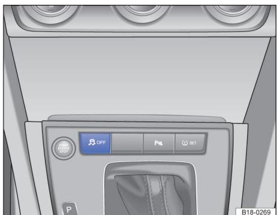

## 电子稳定系统 (ESP)

图 136 副仪表板局部图：ESP OFF 按钮开关  

电子稳定系统可有效降低汽车侧滑的危险。

发动机运转时 ESP 方起作用。ESP 包括 ABS、EBD、HHC、HBA、HBV、MSR、NBW、RKA+和 ASR 等功能模块组成。

在上述系统的调节过程中可能出现运行噪音。

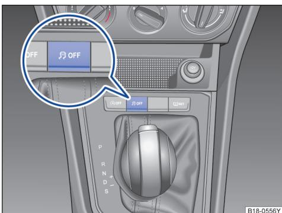  
图 137 副仪表板局部图：ESP OFF 按钮开关（部分车型）

行驶时ESP应始终处于打开状态，特殊情况时可按下 ESP OFF 按钮  ⇒ 图 136 或⇒ 图 137。

## 例如：

● 汽车装防滑链行驶时。

● 在汽车在深雪或松软路面上行驶时。

● 汽车陷于某处（例如，陷在泥泞路段），需前后移动时。

如无上述情况，请使ASR功能保持在开启状态。

## 制动液

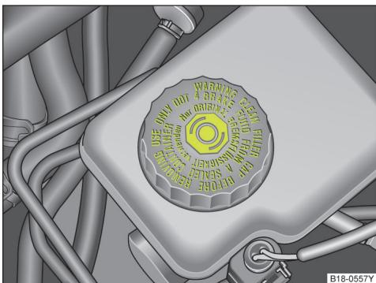  
图 138 发动机舱内：制动液容器的盖子

 请首先阅读并注意引导信息和安全提示，见 ，第 141 页。

制动液随着时间流逝会吸收周围空气中的水分。制动液的含水量过高会导致制动装置损坏。水会显著降低制动液的沸点。如果含水量过高，则在制动器负荷高和全制动时会在制动装置中形成气泡。气泡会降低制动效果、显著延长制动距离，甚至可能导致制动装置完全失灵。自身安全和其它车辆及行人的安全取决于始终正常起作用的制动装置。 ⇒  。

## 制动液液位

制动液液位必须始终介于制动液容器的 MIN（最小）和 MAX（最大）标记之间或在 MIN（最小）标记之上 ⇒  。

并非在所有车型上都可以准确检测制动液液位，这是因为发动机部件会妨碍观察制动液容器内的液位。如果无法准确读取制动液液位，请让专业人员处理。

因为制动摩擦片磨损和制动器自动调整，制动液液位在行驶模式下会略微下降。

## 更换制动液

制动液非出租 / 非营运车辆：首次3 年，以后每2 年，出租 / 营运车辆：每 50000 公里 / 2 年必须更换。

建议由上汽大众经销商更换制动液。

## 提高行驶经济性/降低环境污染

##  主题引言

该章节包含有关下列主题的信息：
一般说明 ..... 149
有预见性地驾驶汽车 ..... 149制动液具有吸水性，使用过程中制动液不断吸收周围空气中的水分。若制动液含水量过高，则将腐蚀制动系统，还会大大降低制动液的沸点，紧急制动时可能产生气阻，恶化制动效果。因此，制动液非出租 / 非营运车辆：首次3 年，以后每 2 年，出租 / 营运车辆：每 50000 公里 / 2 年必须更换！

## 警告

打开发动机舱盖，检查制动液液位前请务必仔细阅读和遵守相关安全警告说明。

● 若制动系统警告灯  不熄灭或行驶时亮起，表明制动液液位过低，为防引发事故，须立即停车，切勿继续行驶，应尽快请专业人员检修系统。

## 警告

废旧制动液或不合适的制动液势必恶化制动效果、甚至导致制动系统失效。

● 必须使用上汽大众原装制动液，且必须使用新的制动液。

● 制动液包装容器上标有制动液规格，任何情况均须使用规格正确的制动液。

● 制动液属有毒物质。

● 切勿将制动液存放在空食品容器、瓶或任何非原装机油容器内，否则，可能将制动液误认作食品，导致事故！

● 务必将制动液装在密封的原装容器内，并置于远离儿童的安全场所，谨防引发中毒事故！

● 制动液非出租 / 非营运车辆：首次3 年，以后每 2 年，出租 / 营运车辆：每 50000 公里 /2 年必须更换。制动液使用时间过长，制动时系统可能产生气阻，恶化制动效果，降低行驶安全性，甚至导致制动系统失效，极易引发事故！

## ① 提示

制动液对车身漆面有腐蚀作用，应及时清除溅到漆面上的制动液。

放出或处理废制动液时务必遵守相关环保法规。

定期保养 149
避免短途行驶 150
发动机 150

排放 150
排放控制关键零部件信息 152

耗油量、环境污染以及发动机、制动器和轮胎的磨损主要取决于三个因素：

● 个人的驾驶风格。

● 使用条件（气候、路面特性）。

● 技术前提条件。

## 一般说明

 请首先阅读并注意引导信息和安全提示，见 ，第 148 页。

燃油消耗率主要取决于驾驶员的驾驶风格。

燃油消耗率、对环境的影响程度和发动机、制动器及轮胎的磨损率主要取决于下列三大因素：

● 驾驶员的驾驶风格。

● 汽车使用条件（气候，路面状况等）。

● 整车技术状态。

## 有预见性地驾驶汽车

请首先阅读并注意引导信息和安全提示，见 ，第 148 页。

## 定期保养

 请首先阅读并注意引导信息和安全提示，见 ，第 148 页。

按规定将汽车送到上汽大众经销商处进行定期保养是确保燃油经济性的基础。经良好保养的发动机不仅能提高燃油经济性，延长使用寿命，并且有助于汽车保值。

## 警告

车速和与前车之间的安全距离要始终与视野、天气、路面和交通状况相匹配。

若有预见性地采取经济驾驶方式行驶，可轻易将燃油消耗率降低10-15%。为降低汽车使用成本和对环境的污染程度，本章列出了与此相关的驾驶要领，请务必仔细阅读。

定期检查曲轴箱通风系统各零部件之间连接是否可靠，有无泄漏或损坏。

汽车加速行驶会增加燃油消耗量，故应根据道路和交通状况预先计划好行车路线，尽可能减少制动和加速的频次。

保养不良的发动机将严重影响燃油经济性。

每次添加燃油时应同时检查机油油位。机油消耗量主要取决于发动机的负荷及转速，根据不同的驾驶风格，机油消耗量可能会达到0.5L/1000 km。

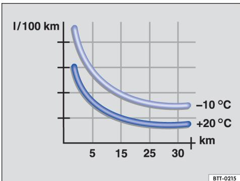  
图 139 两种不同环境温度时的百公里油耗

 请首先阅读并注意引导信息和安全提示，见 ，第 148 页。

## 发动机

 请首先阅读并注意引导信息和安全提示，见 ，第 148 页。

高温天气、高原条件对发动机性能的影响：

夏天外界环境温度高，如果发动机冷却不充分，可能会造成发动机过热，使部分零部件膨胀变形，磨损加剧影响使用寿命。因此，在夏季高温天气来临前，建议您请前往上汽大众经销商对发动机的冷却系统进行全面检查。

## 排放

 请首先阅读并注意引导信息和安全提示，见 ，第 148 页。

国五排放：

a）当使用符合 GB 18352.3－2005 附录 J 中的汽油时，汽车排放污染物限值及测试方法按GB 18352.3一2005 中 LIⅣVVI型试验的规定 还必须满足双怠速试验（测定双怠速的CO、HC和高怠速的λ值）和车载诊断（OBD）系统试验的规定。

b）车辆的双怠速试验按 GB 18352.3－2005 附录 D的方法进行；发动机应运转平稳、动力性能良好、无异响、机油压力正常；除发动机运转所必须的装置开启外，其他装置均关闭；空调处于关闭状态，发动机和催化转换器达到正常 工作温度 时燃油消耗率方能达到正常状态，正常发挥净化作用。处于冷态的发动机，启动后的瞬时油耗极高，行驶数公里后发动机方能达到工作温度，油耗恢复至正常水平，因此，应尽可能避免短途行驶。环境温度对油耗具有决定性影响。

汽车在同一路段行驶，环境温度分别为 +20° C 和-10° C 时的百公里油耗曲线，显然，冬季油耗远高于夏季油耗。参见⇒ 图 139。

节省燃料的另一个有效方法是早换到高挡：如果不早换入高挡，发动机高速运转，则会消耗不必要的燃油。

因高温、高原条件下空气密度减小，进入气缸的充气量亦会相应减少。为了减少这种物理现象对发动机性能的影响，车辆在高温地区都做过全面的高温匹配。因此充气效率的下降在一般车辆上不会有影响，只有小排量的车辆在高温环境中急加速时才可能会感到发动机功率略有下降。

水温超过80℃；蓄电池容量达80%以上；此时怠速转速、污染物和λ限值规定如下：SVW7167AMD、SVW7167BMD、SVW7167EMD、SVW7167FMD、SVW7167LMD 的怠速转速为 700r/min±50r/min（只适合低海拔，非寒冷地区）；SVW7147ALD、SVW7147BLD、SVW7147ELD、SVW7147FLD、SVW7147LLD 的怠速转速为 650+300-100r/min（只适合低海拔，非寒冷地区），f排放污染物限值（体积分数）为 CO≤0.3％，HC≤80×10－6；高怠速转速为 2500r/min ±200r/min，排放污染物限值（体积分数）为 CO≤0.2％，HC≤60×10－6；过量空气系数 λ 控制要求 1.00±0.03。

b）车辆的双怠速试验按 GB 18352.3－2005 （中国IV阶段）附录D的方法进行；发动机应运转平稳、动力性能良好、无异响、机油压力正常；除发动机运转所必须的装置开启外，其他装置均关闭；空调处于关闭状态，水温超过 80℃；此时怠速转速、污染物和λ限值规定如下：SVW71617GM、SVW71617HM、SVW71617JM、SVW71617KM 的正常怠速转速为 700r/min±50r/min（只适合低海拔，非寒冷地区）；排放测试仪精度（CO±0.01％，HC±1×10－6，λ±2％）上检测，排放污染物限值（体积分数）为CO≤0.3％，HC≤80×10－6；高怠速转速为 2500r/min ±200r/min，排放污染物限值（体积分数）为CO≤0.2％，HC≤60×10－6；过量空气系数 λ 控制要求 1.00±0.03。

a）当使用符合 GB 18352.5－2013 附录 J 中的汽油时，汽车排放污染物限值及测试方法按GB 18352.5－2013中Ⅰ、Ⅲ、Ⅳ、Ⅴ、Ⅵ型试验的规定，还必须满足双怠速试验（测定双怠速的CO、HC和高怠速的λ值）和车载诊断（OBD）系统试验的规定。

b）车辆的双怠速试验按 GB 18352.5－2013 附录 D的方法进行；发动机应运转平稳、动力性能良好、无异响、机油压力正常；除发动机运转所必须的装置开启外，其他装置均关闭；空调处于关闭状态，水温超过80℃；此时怠速转速、污染物和λ限值规定如下：SVW7167JMD、SVW7167KMD、SVW7167VMD、SVW7167WMD、SVW7167XMD 的怠速转速为 700r/min±50r/min（只适合低海拔，非寒冷地区），SVW7147JLD、SVW7147KLD、SVW7147YLD、SVW7147VLD、SVW7147WLD、SVW7147XLD 的正常怠速转速为 650+300 -100 r/min（只适合低海拔，非寒冷地区）；排放测试仪精度（CO±0.01％，HC±1×10－6，λ±2％）上检测，排放污染物限值（体积分数）为 CO≤0.5％，HC≤100×10－6；高怠速转速为 2 500r/min±100r/min，排放污染物限值（体积分数）为 CO≤0.3％，HC≤100×10－6；过量空气系数 λ 控制要求 1.00±0.03。SVW71617AM、SVW71617BM、SVW71617CM、SVW71617DM、SVW71617EM 的怠速转速为 700r/min±50r/min（只适合低海拔，非寒冷地区），SVW71217BN、SVW71417AL、SVW71417BL、SVW71417DL、SVW71417EL 、SVW71217AN、SVW71417CL、SVW71417FL，SVW71417GL 的正常怠速转速为 650+300r/min（只适合低海拔，非寒冷地区）；排放测试仪精度（CO±0.01％，HC±1×10－6，λ±2％）上检测，排放污染物限值（体积分数）为CO≤0.3％，HC≤80×10－6；高怠速转速为 2 500r/min+200r/min、排放污染物限值（休积分数）为CO≤0.2％，HC≤60×10－6；过量空气系数λ控制要求 1.00±0.03。

b) 车辆的双怠速试验按 GB 18352.5－2013 附录 D的方法进行；发动机应运转平稳、动力性能良好、无异响、机油压力正常；除发动机运转所必须的装置开启外，其他装置均关闭；空调处于关闭状态，水温超过80℃；此时怠速转速、污染物和λ限值规定如下：SVW71217CN、SVW71417HL、SVW71417JL、SVW71417KL 的正常怠速转速为 750r/min±100r/min (只适合低海拔、非寒冷地区)，

SVW71617LM、SVW71617MM 的正常怠速转速为 700r/min±50r/min(只适合低海拔、非寒冷地区)；排放测试仪精度(CO±0.01％，HC±1×10-6，λ±2％)上检测，排放污染物限值(体积分数)为CO≤0.3％，HC≤80×10-6；高怠速转速为 2 500r/min±100r/min，排放污染物限值(体积分数)为CO≤0.2％，HC≤60×10-6；过量空气系数λ控制要求 1.00±0.03。

b) 车辆的双怠速试验按 GB 18352.5－2013 附录 D的方法进行；发动机应运转平稳、动力性能良好、无异响、机油压力正常；除发动机运转所必须的装置开启外，其他装置均关闭；空调处于关闭状态，水温超过80℃；此时怠速转速、污染物和λ限值规定如下： SVW71217DN、SVW71417LL、SVW71417ML、SVW71417NL 的正常怠速转速为 750r/min±100r/min (只适合低海拔、非寒冷地区)，SVW71617NM、SVW71617PM、SVW71617QM 的正常怠速转速为 700r/min±50r/min(只适合低海拔、非寒冷地区)；排放测试仪精度(CO±0.01％，HC±1×10-6，λ±2％)上检测，排放污染物限值(体积分数)为 CO≤0.3％，HC≤80×10-6；高怠速转速为 2500r/min±200r/min，排放污染物限值(体积分数)为 CO≤0.2％，HC≤60×10-6；过量空气系数λ控制要求 1.00±0.03。

b) 车辆的双怠速试验按 GB 18352.5－2013 附录 D的方法进行；发动机应运转平稳、动力性能良好、无异响、机油压力正常；除发动机运转所必须的装置开启外，其他装置均关闭；空调处于关闭状态，水温超过80℃，蓄电池电量充足；此时怠速转速、污染物和λ限值规定如下：SVW71617SM 的正常怠速转速为 700r/min±50r/min(只适合低海拔、非寒冷地区)；排放测试仪精度(CO±0.01％，HC±1×10-6，λ±2％) 上检测，排放污染物限值(体积分数)为 CO≤0.3％，HC≤80×10-6；高怠速转速为 2500r/min± 100r/min，排放污染物限值(体积分数)为 CO≤0.2％，HC≤60×10-6；过量空气系数λ控制要求 1.00 ±0.03。

c）车辆在合理可预测的行驶工况下，车载诊断（OBD）系统的实际监测频率（IUPR）的限值及测量方法按 GB 18352.5－2013 中附件 IA.7 的规定；车载诊断（OBD）系统的NO 排放量的限值及测量方法按 GB 18352.5－2013 中附录 I.3.3.2 的规定。

## 国六排放：

a) 当使用符合 GB 18352.6－2016 附录 K 中的汽油时，汽车排放污染物限值及测试方法按GB 18352.6－2016 中Ⅰ、Ⅲ、Ⅳ、Ⅴ、Ⅵ、Ⅶ型试验的规定，还必须满足双怠速试验(测定双怠速的CO、HC 和高怠速的λ值)和车载诊断(OBD)系统试验的规定。

b) 车辆的双怠速试验按 GB 18285－2018 附录 A 的方法进行；发动机应运转平稳、动力性能良好、无异响、机油压力正常；除发动机运转所必须的装置开启外，其他装置均关闭(无空调等负载开启工况)，水温超过80℃，蓄电池电量充足；此时怠速转速、污染物和λ限值规定如下：SVW7157AFD、SVW71517AF、SVW71517BF 正常怠速转速为 750r/min±50r/min(只适合低海拔地区、非寒冷地区)；排放测试仪精度(CO±0.01％，HC±1×10-6，λ±2％)上检测，排放污染物限值(体积分数)为CO≤0.6％，HC≤80×10-6；高怠速转速为 2500r/min±200r/min，排放污染物限值(体积分数)为CO≤0.3％，HC≤50×10-6；过量空气系数 λ 控制要求 1.00±0.05。

b) 车辆的双怠速试验按 GB 18285－2018 附录 D 的方法进行；发动机应运转平稳、动力性能良好、 无异响、机油压力正常；除发动机运转所必须的装置开启外，其他装置均关闭(无空调等负载开启工况)， 水温超过80℃，蓄电池电量充足；此时怠速转速、污染物和λ限值规定如下：SVW71517CF、SVW71517DF 正常怠速转速为 750r/min ±50r/min(只适合低海拔地区、非寒冷/非炎热地区)；排放测试仪精度(CO±0.01％，HC±1×10-6，λ

## 排放控制关键零部件信息

 请首先阅读并注意引导信息和安全提示，见 ，第 148 页。

±2％)上检测，排放污染物限值(体积分数)为CO≤0.6％，HC≤80×10-6；高怠速转速为 2 500rmin ±200r/min，排放污染物限值(体积分数)为CO≤0.3％，HC≤50×10-6；过量空气系数 λ 控制要求 1.00 ±0.05。

c) 车辆在合理可预测的行驶工况下，车载诊断(OBD)系统的实际监测频率(IUPR)的限值及测量方法按 GB 18352.6－2016 中附录 J.3.3.2 的规定；车载诊断(OBD)系统的氮氧化物(NOX)排放量的限值及测量方法按 GB 18352.6－2016 中附录 J.5.2 的规定。

## ① 提示

由于中国不同地区所实施的排放标准不同，所公布的排放水平会有所不同。

排放控制关键零部件信息可登陆上汽大众官方网站查询：

http://club.svw-volkswagen.com

## OBD 系统

##  主题引言

该章节包含有关下列主题的信息：

对 OBD 系统产生影响的主要因素 . . . . . . 152

OBD 英文全称为 On-Board Diagnostics，即车载诊断。车载诊断系统能在车辆运行过程中对影响发动机尾气排放质量的各系统及零部件的运行状况进行实时监控。不稳定的运行将以代码的形式存储在发

## 对OBD系统产生影响的主要因素

 请首先阅读并注意引导信息，见第 152 页。

## 燃油品质

目前我国都已采用无铅汽油，但部分地区仍然采用含锰等金属元素的汽油抗爆剂，并且汽油中的硫含量和烯烃含量较高。这对OBD系统中的部分控制部件和排放值超标有较大的影响。

如果汽油中锰含量较高，其燃烧后的锰化合物将会沉积在点火系统的火花寒，氧传感器以及三元催化净化装置的内表面、造成点火困难、氧传感器失效以及三元催化净化装置堵塞。

动机控制器中，以便于指导今后的检测、调整及维修。如果仪表中的OBD系统指示灯点亮或闪烁，提醒您与排放相关的系统或零件出现故障，需要尽快前往到上汽大众经销商进行检查。上汽大众经销商采用专业的诊断测试设备读取车载控制器中记录的信息与代码。

如果汽油中硫含量较高，燃烧后的硫化物将随尾气排出而产生酸性物质，形成酸雨，影响大气环境；同时硫化物还影响三元催化净化装置的活性，影响氮氧化物NOx的排放。如果汽油中烯烃、芳烃以及胶质等含量较高，将在发动机燃烧室、进气阀和燃油喷射系统等部位形成沉积物、积碳和胶质，并且导致尾气排放的碳氢化合物超标。

上述燃油品质问题是引起OBD指示灯点亮的最大原因为避免造成您在时间和费田上的无谓支出我们建议您：到正规且信誉良好的加油站加油，加注的汽油必须是无铅汽油，同时需满足燃油标准要求；加注汽油后，请向加油站索取发票，以便出现燃油质量问题后有据可查；在车辆使用过程中，注意避免将汽油使用到燃油表的红线刻度，以免造成油箱底部脏物进入燃油系统；如果误加入劣质汽油，需要及时对燃油系统进行清洗，包括清洗汽油泵、油箱、喷油嘴、燃油管等，同时检查氧传感器和三元催化净化装置。上述工作请到上汽大众经销商处进行。

## 维护保养

如果您的车辆没有按照保养要求到上汽大众经销商进行定期维护和更换零件（如空气滤清器、机油滤清器、火花塞等），我们将无法确保您的车辆始终保持在正常状态下工作，车辆可能出现如油耗增加、加速不良、怠速不稳等问题，并导致车辆的尾气排放污染物超出国家的标准，OBD指示灯点亮或闪烁。因此，定期对您的车辆进行维护保养非常重要，所以我们建议您：

● 请按照上汽大众制订的车辆保养计划，定期到上汽大众经销商对车辆进行维护保养，并在规定时间内更换火花塞、空气滤清器、汽油滤清器、机油及机油滤清器，避免出现排放超标或者缺火等故障现象；

● 定期对发动机喷油嘴、燃烧室、进气道、节气门、空气质量计进行清洁；

● 对于经常低速行驶的车辆，容易出现燃烧室、喷油嘴、火花塞上的积碳问题，建议在条件允许的前提下，每隔一段时间采用高转速行驶；

● 根据车辆状况使用上汽大众专用汽油清净剂，以减少积碳、胶质对燃油系统、进气系统以及排气系统的影响。

## 维修配件的质量

当您的车辆需要进行维护保养、修理换件时，请务必使用原装零件。维修零件的质量好坏是影响车辆安全性、经济性以及环保性的重要因素。例如：使用非原装火花塞会由于其热值，电极型号的不同而出现发动机点火和燃烧不正常，从而产生一系列影响发动机动力性、经济性和排放可靠性的问题；而使用非原装空气滤清器将可能无法过滤掉空气中的灰尘和颗粒物，从而导致发动机异常磨损，并影响三元催化净化装置的功能。通常情况下由于用户缺乏专业鉴别原装零件的能力，为此，我们建议您：

当您的车辆需要进行维修或保养时，请选择上汽大众经销商。因为，只有上汽大众经销商才能为您提供原装零件，保障您车辆的正常运行。

## ① 提示

● 车辆启动后，建议请勿原地热车，可低速缓慢行驶，待发动机温度上升到正常工作温度后，即可正常行驶。这样可使发动机在较短的时间进入正常工作温度，减少不正常的尾气排放；

● 驾驶时，应在合适的转速下变换挡位，避免出现高转速换入低挡或者低转速换入高挡的错误操作。 

## 转向系统

##  主题引言

该章节包含有关下列主题的信息：

警告灯和指示灯 . . . . . . . . . . . . 154关于的信息 . 154

转向助力是采用电控机械方式。该转向系的优点

是，液压软管、液压油、泵、过滤器和其他零件都不再需要。电控机械式系统能节约燃油。液压系统需要系统中有持续的油压，而在电控机械式转向系中，只有在转向时才需要能量输送。

电控机械式转向系的转向助力会根据车速、转向力矩和车轮转向角度自动调整。电控机械式转向系只在发动机运行时起作用（牵引工况除外）。

补充信息和警告说明：

● 启动和关闭发动机 ⇒ 第 131 页

● 汽车蓄电池 ⇒ 第 198 页

● 牵引启动和牵引⇒ 第 256 页

## 警告

如果转向助力不工作，则要用很大的力量才能转动方向盘，而且会使汽车转向变得困难。

● 转向助力只在发动机运行时工作（牵引工况除外）。

● 切勿关闭发动机让汽车滑行。

● 汽车还在移动期间切勿将遥控钥匙从点火开关中拔出。否则转向锁会卡止，汽车无法再转向。

## 警告灯和指示灯

请首先阅读并注意引导信息和安全提示，见 ，第 154 页。

<table><tr><td>亮起</td><td>可能的原因</td><td>解决措施</td></tr><tr><td></td><td>电控机械式转向系失灵。</td><td>立即让上汽大众经销商检测转向系。</td></tr><tr><td></td><td>电控机械式转向系作用降低。</td><td>立即让上汽大众经销商检测转向系。如果此黄色警告灯在重新启动发动机并短暂行驶后不重新亮起,则不需要到上汽大众经销商检修。</td></tr></table>

在打开点火开关时，某些警告灯和指示灯会短暂亮起，表明在进行功能检测。它们在几秒钟后会消失。

## 警告

忽视亮起的警告灯和文字信息会导致在道路交通中抛锚，引起事故和受伤。

● 切勿忽视亮起的警告灯和文字信息。

● 一旦路面情况允许且安全，就立即停车。

## 提示

忽视亮起的指示灯和文字信息可能导致汽车损坏。 

## 关于的信息

请首先阅读并注意引导信息和安全提示，见 ，第 154 页。

为了减少车辆被盗的风险，在每次退出汽车前都要将转向系锁止。

## 电子转向柱锁止装置

如果在汽车停住时将遥控钥匙从点火开关中拔出，则转向柱即被锁止。如果在拔出遥控钥匙后本车处在移动中超过约 10 秒钟，电子转向柱锁止装置不会锁止。

## 电控机械式转向系统

电控机械式转向系的转向助力会根据车速、转向力矩和车轮转向角度自动调整。电控机械式转向系只在发动机运行时起作用（牵引工况除外）。

如果转向助力减小或消失，则转向时需要用比平常明显大的力。

# 驾驶员辅助系统起步辅助系统

##  主题引言

补充信息和警告说明：

● 信息显示器⇒ 第 27 页

● 制动、停车和驻车 ⇒ 第 141 页

● 汽车蓄电池 ⇒ 第 198 页

● 车轮和轮胎⇒ 第 220 页

● 附件、零部件更换、维修和改装⇒ 第 228 页

● 辅助启动 ⇒ 第 254 页

## 警告

起步辅助系统的智能技术不能超越物理规律的限制。切勿凭借起步辅助系统提高了舒适性而冒险行驶。

● 汽车意外移动可能导致受伤。

● 起步辅助系统不能代替驾驶员的注意力。

● 要使车速和驾驶方式始终与能见度、天气情况、路面状况和交通状况相匹配。

● 起步辅助系统并非在任何情况下都能将汽车保持在上坡路面上或制动在下坡路段上（例如在光滑或结冰的地面上）。

## 驻车距离报警系统

##  主题引言

该章节包含有关下列主题的信息：

后部驻车距离警报系统 ..... 157
倒车雷达装置 ..... 158
前后驻车距离报警系统 ..... 160

在调车和泊车时，驻车距离报警系统为驾驶员提供支持。如果汽车接近前部或后部区域内的某个障碍物，会根据距离发出更高或更低的间歇音。离障碍物的距离越近，声音信号的间歇距离越短。如果离障碍物已经很近，则发出持续的声音信号。

如果在出现了持续音后，继续驶近障碍物，系统便无法再测量距离了。

保险杠内的传感器发送并接收超声波。在超声波运行期间（发射、障碍物的反射和接收），系统持续计算保险杠和障碍物之间的距离。

补充信息和警告说明：

● 外观视图 ⇒ 第 11 页

● 附件、零部件更换、维修和改装 ⇒ 第 228 页

## 警告

驻车距离报警系统不能代替驾驶员对周围环境的 观察。

● 传感器有无法探测到人员和物体的盲区。

● 要始终注意观察汽车周围，因为传感器并非在任何情况下都能识别到幼儿、宠物和物品。

## 后部驻车距离警报系统

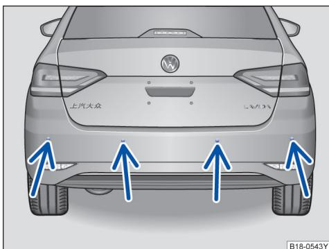  
图 140 后部驻车距离探头位置

## 警告（续）

● 物品和衣服的某些表面可能不反射驻车距离报警系统传感器的信号。系统可能无法识别或错误地识别这些物品和穿着此类衣服的人员。

● 外部声源可能影响驻车距离报警系统传感器的信号。与此同时在某些情况下可能无法识别人员和物品。

## ① 提示

● 在某些情况下，传感器可能识别不到诸如细杆、篱笆、隔离柱和树木等，因此过分依赖可能导致汽车损坏。

● 某些障碍物尤其是较矮或较高的障碍物，在距离较远时驻车距离报警系统可能已经识别到并发出了警告通报，但在本车接近时它们可能从驻车距离报警系统的探测范围中消失并且不能再识别到。因此其也不会因这些物体再次发出警告。如果忽视驻车距离报警系统此前的警告，可能导致严重的汽车损坏。

● 保险杠中的传感器可能因碰撞（例如在泊车时）而错位或损坏。

● 为了保证系统正确工作，要保持保险杠中的传感器洁净、无冰雪覆盖，能短时间用较小水流清洁而且不得用贴签或其它物品遮住这些传感器。

i 噪音源可能导致驻车距离报警系统发出错误信息，例如粗糙的沥青、鹅卵石路面和其他车辆的干扰声。

 请首先阅读并注意引导信息和安全提示，见 ，第 157 页。

驻车距离警报系统属驻车辅助装置，发现汽车后部区域有障碍物时该装置将向驾驶员发出警报信号。

调车和驻车时驻车距离警报系统可协助驾驶员操控汽车当汽车后端发现障碍物，系统发出间断声响警报。汽车距离障碍物越近，发出的警报声越短促，汽车距离障碍物非常近时系统将发出持续警报音。

若汽车继续接近障碍物，系统可能无法识别到障碍 物！

驻车距离报警系统借助后保险杠内的传感器探测本车至障碍物间的距离。传感器发射和接收超声波。电子系统根据超声波的传播时间（发射、从障碍物反射及接收过程）计算出汽车与障碍物之间的距离。

驻车距离报警系统只能够在低于15 km/h的车速下 工作。

## 打开驻车距离报警系统

在点火开关打开的情况下，挂入倒挡后即可打开驻车距离报警。此时会发出一个短声音信号。如果没有发出这个声音信号，说明驻车距离报警没有打开。如发出一个3秒以上的声音信号，说明系统发生故障。请前往上汽大众经销商进行检查。

## 关闭驻车距离报警系统

移出倒挡，即可关闭驻车距离报警系统。

## 警告

本车虽配备驻车距离报警系统，但驾驶员仍须集中注意力，安全驻车和调车。

● 传感器存在盲区，从而探测不到盲区里的障碍物和人员。

● 倒车时须特别留意幼童或小宠物，因传感器可能发现不了他们。

● 请注意，某些物品（如服装等）的表面不能反射驻车距离报警系统发出的信号。故驻车距离报警系统可能探测不到这类物品或穿着此类服装的人。

## 警告（续）

● 请注意，车外噪音可能干扰驻车距离报警系统，导致系统不能正常探测到物品或人员。

## ① 提示

● 驻车距离警报系统不是总能探测到诸如挂车、细栏杆、篱笆、柱子等物品，从而可能损坏汽车。

● 若驻车距离报警系统探测到一障碍物，汽车接近该障碍物时该障碍可能在传感器探测范围内消失（探测过高和过低的障碍物时极易发生这种情况），从而探测不到这些物品。切勿忽视驻车距离报警系统发出的警报，否则，您的汽车可能严重损坏。

● 车速低于15 km/h时驻车距离警报系统方起作用。

● 保险杠内的传感器必须保持清洁，无冰雪覆盖。 用压力喷嘴和蒸汽清洗时只可短时喷洗传感器，并 且与传感器之间必须保持10 cm的距离。

● 驻车距离警报系统将水也视为障碍物。

U. 当驻车距离警报系统打开时，收音机导航系统的声音被关闭，以帮助您更清晰地听到报警音。当驻车距离报警系统关闭时，系统声音恢复原来的状态。

## 倒车雷达装置

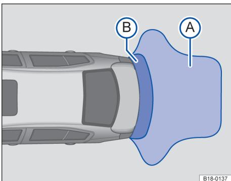  
图 141 倒车雷达装置

 请首先阅读并注意引导信息和安全提示，见 ，第 157 页。

倒车雷达装置通过集成在后保险杠内的超声波传感器测定倒车时后保险杠与障碍物间的距离。

## 激活:

点火开关打开的状态下挂入倒挡，倒车雷达装置被激活，同时可听见车辆发出一声短促的提示音。表明该装置进入工作状态。

若此时无该提示音，则表明倒车雷达装置未被激活，应将车辆送至上汽大众经销商检修。

关闭：

将变速杆退出倒挡，倒车雷达装置关闭。

## 感应器范围：

倒车时，车辆距后障碍物约160 cm时，装置开始发出警报声，距离障碍物越近，警报声越急促。

当车辆倒至与障碍物之间的距离小于40 cm时，装置将发出连续警报声。

此时如果继续倒车，则将不能有效识别障碍物！

<table><tr><td>汽车至障碍物的距离</td><td>声音信号</td></tr><tr><td>后部:约 41 - 160 cm</td><td>间歇声音</td></tr><tr><td>后部:约 0 - 40 cm</td><td>连续音</td></tr></table>

## 警告

该装置虽然能在倒车时帮助驾驶员避免发生事故，但驾驶员仍应集中注意力，切勿疏忽大意！

● 该装置的传感器存在盲点，可能探测不到某些区域的障碍物。倒车时，务必确保轿车附近无儿童或动物，因为传感器可能发现不了他们。

● 倒车时，须注意防止车后的细柱子、篱笆，因为系统可能识别不了这些障碍。

● 请保持倒车报警装置传感器外表面的清洁，如发现上面由雪、水、霜、泥浆、灰尘等物体覆盖，请及时清除，以免影响功能。

● 不可使用具有磨损性或尖锐的物体清洁传感器。

## ①提示

● 当车速超过15km/h时，该系统不能正常工作，此时不能有效分辨障碍物。

● 保证系统正常工作，必须使传感器保持清洁，无积雪和冰。

● 避免用高压清洗机或蒸汽清洗机对传感器进行清洁，以免损坏传感器。清洗车辆时只能使用较小的水流短时间冲洗传感器表面，且至少保持10cm以上的距离。

## 提示

汽车在如下场景时，汽车雷达可能会出现干扰，当遇到干扰情况时，应以驾驶人员自身的判断为主，并做出正确的选择。

● 配备汽车雷达的车辆不慎驶入国家射电天文台的干扰保护距离内。

● 当同一区域有多个同频段汽车雷达工作时。

## 前后驻车距离报警系统

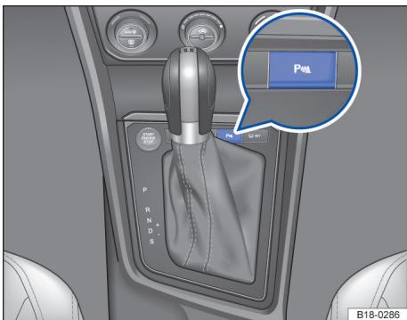  
图 142 在中控台中：用于接通或关闭前后驻车距离报警系统的按钮

 请首先阅读并注意引导信息和安全提示，见 ，第 157 页。

在调车和泊车时，前后驻车距离报警系统为驾驶员提供支持。如果汽车接近前部或后部区域内的某个障碍物，会根据距离发出更高或更低的间歇音。离障碍物的距离越近，声音信号的间歇距离越短。如果离障碍物已经很近，则发出持续的声音信号。

## 接通和关闭前后驻车距离报警系统

● 在点火开关已打开的情况下按压按钮 ⇒ 图 142。

● 在点火开关已打开的情况下 挂入倒挡。

● 自动关闭： 车速高于约 15 km/h。

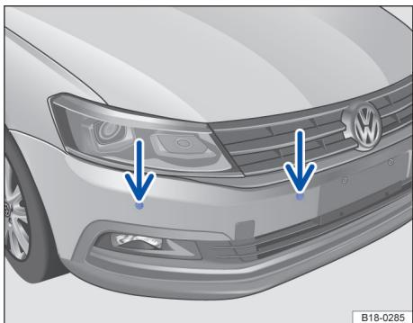  
图 143 保险杠中的前部驻车距离报警系统传感器

按钮中的指示灯在功能接通时亮起。

## 感应器范围：

倒车时，车辆距后障碍物约160 cm时，装置开始发出警报声，距离障碍物越近，警报声越急促。

当车辆倒至与障碍物之间的距离小于30 cm时，装置将发出连续警报声。

此时如果继续倒车则障碍物将不能被有效识别！

<table><tr><td>汽车至障碍物的距离</td><td>声音信号</td></tr><tr><td>后部:约 31 - 160 cm</td><td>间歇声音</td></tr><tr><td>后部:约 0 - 30 cm</td><td>连续音</td></tr><tr><td>前部:约 31 - 120 cm</td><td>间歇声音</td></tr><tr><td>前部:约 0 - 30 cm</td><td>连续音</td></tr></table>

## 前后驻车距离报警系统的特点

● 前后驻车距离报警系统在某些情况下会将传感器上的水视为障碍物。

● 在距离保持不变时声音警告在几秒钟后音量变小。在发出持续的声音信号时，音量保持不变。

● 一旦汽车驶离障碍物，间歇音就会自动关闭。在再次接近时，间歇音会自动接通。

● 如果选挡杆在位置 P 上，则系统静音。

i 在第一次接通时如果系统传出一个长的持续声音以及按钮中的指示灯闪烁指示前后驻车距离报警系统有功能故障。请用按钮关闭前后驻车距离报警系统，并尽快让上汽大众经销商检测。 

## 定速巡航装置

##  主题引言

该章节包含有关下列主题的信息：
警告灯和指示灯 ..... 162
操作定速巡航装置 ..... 162
暂时关闭定速巡航系统 ..... 163

该系统可在约20 km/h以上的车速进行设置使汽车以设定的车速恒速行驶。

一旦达到所需车速，并设定存储后，驾驶员即可将脚抬离油门踏板，汽车将以设定的车速恒定行驶。

配备自动变速箱的汽车：选挡杆位于P, N或R挡时，定速巡航系统不起作用。

打开定速巡航系统时内的指示灯  随之点亮，但这不一定表明任何情况下定速巡航系统均能正常控制车速。

## 补充信息和警告说明：

● 换挡 ⇒ 第 135 页

● 附件、零部件更换、维修和改装 ⇒ 第 228 页

## 警告

若在不适合恒速行驶条件下使用定速巡航系统，则极易引发伤亡事故！

● 在车流密集的路段、坡道、多弯道路段或湿滑路面上（例如，冰雪潮湿或砂石路面）行驶时切勿使用定速巡航系统，否则，极易引发事故。

● 设定的车速及与前车的距离必须与当时的交通状况相适应，驾驶员应谨慎使用定速巡航系统，因定速巡航系统仅是一种驾驶辅助系统。

● 在无路地区或无路面路段行驶时切勿使用定速巡航系统，该系统只适用于铺设路面的坚硬道路，否则，可能极易引发事故！

● 应根据当时的道路、交通及气候状况设定车速，车速不宜过高，否则，可能引发事故。

● 使用后务必关闭定速巡航系统，避免误用定速巡航系统，引发事故。

## ①提示

下坡行驶时，定速巡航系统不能使汽车保持一个恒定的车速。汽车根据自身的重量而加速，请选择一个较低的挡位或踩制动踏板。

## 警告灯和指示灯

请首先阅读并注意引导信息和安全提示，见 ，第 161 页。

<table><tr><td>亮起</td><td>可能的原因</td></tr><tr><td></td><td>定速巡航装置已激活。</td></tr></table>

在打开点火开关时，某些警告灯和指示灯会短暂亮起，表明在进行功能检测。它们在几秒钟后会消失。

在不设定车速的情况下,显示屏显示 --- km/h。

您也可以通过踩下油门踏板提高车速。松开油门踏板后，车速会自动下降到之前存储的数值。然而，如果当前车速超出储存车速10 km/h，且保持时间长于5分钟，则车速将不会再下降到之前存储的数值。

## 警告

忽视亮起的警告灯和文字信息会导致在道路交通中抛锚，引起事故和受伤。

● 切勿忽视亮起的警告灯和文字信息。

● 一旦路面情况允许且安全，就立即停车。

## ①提示

忽视亮起的指示灯和文字信息可能导致汽车损坏。 

## 操作定速巡航装置

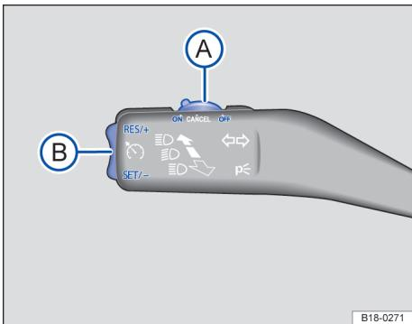  
图 144 定速巡航系统控制机构

 请首先阅读并注意引导信息和安全提示，见 ，第 161 页。

打开定速巡航系统

将开关拨到位置ON。

关闭定速巡航系统

将开关A拨到位置OFF。

## 设定车速

达到所需的车速时，按动按钮B下端的SET/-次，松开后速度被存储。指示灯  将亮起。当关闭定速巡航系统时，存储的速度会被删除。

## 加速

按住按钮B上端的RES/+直至达到所需的车速后松开，于是汽车会以这个恒定的车速行驶。

## 减速

按住按钮B下端的SET/-直至达到所需的车速后松开，于是汽车会以这个恒定的车速行驶。

## 警告

应根据当时的道路交通及气候状况设定车速，车速不宜过高，否则，极易引发事故！

● 在不适合以恒定车速行驶的情况下，使用定速巡航系统极易引发事故！ 请参阅有关安全警告说明。

## 暂时关闭定速巡航系统

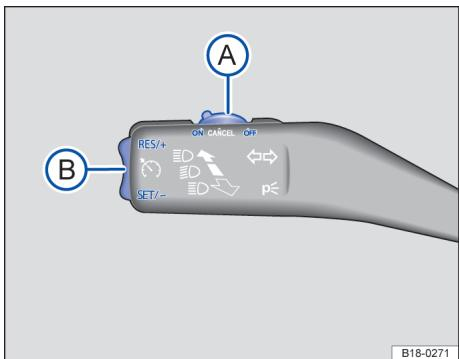  
图 145 定速巡航系统控制机构

 请首先阅读并注意引导信息和安全提示，见 ，第 161 页。

## 暂时关闭系统

● 踩下制动踏板或

● 踩下离合器踏板或

● 将开关A拨到中间位置CANCEL

## 重新启动系统

● 放开制动踏板和离合器踏板，松开开关 A 回到oN位置，并将车速提升到20km/h以上。

● 按下按钮B上端的 RES/ +。

若系统暂时关闭，此时存储的车速仍继续保留在存储器中。仪表中的指示灯  将熄灭。如果没有速度被存储（例如关闭定速巡航系统后），将按钮 A拨至位置ON，按下按钮B上端的RES/+，定速巡航系统将重新启动，并以当前的车速行驶。

## 警告

应根据当时的道路交通及气候状况设定车速，车速不宜过高，否则，极易引发事故！

● 在不适合以恒定车速行驶的情况下，使用定速巡航系统极易引发事故！ 有关安全警告说明请参阅。

## Start-Stop 启停系统

##  主题引言

该章节包含有关下列主题的信息：

警告灯和指示灯 . . . . . . . . . 164启停系统说明 . . 165

## 补充信息和警告说明：

● 换挡⇒ 第 135 页

## 警告

在发动机关闭时制动助力装置以及助力转向装置无法运转。

## ① 提示

当在车外温度非常高的情况下较长时间行驶，则车辆蓄电池可能受损。

## ① 提示

即使配备了Start-Stop启停系统，车辆在坡道上停车时也必须拉起手制动杆，以免溜坡。

## ① 提示

● 如果车辆在室外极寒冷天气下较长时间停车，可能要几小时后车辆蓄电池的内部温度才会达到适于启停系统正常工作的温度值。

● 在利用外接电源对车辆蓄电池充电时，请勿将充电器的负极接在蓄电池的负极上，必须连接到发动机舱内的接地点处。⇒ 第 254 页

● 如果自动空调以自动模式运行，在某些情况下发动机无法自动关闭。

## 警告灯和指示灯

● 车辆涉水行驶时，需手动关闭启停系

统。⇒ 第 165 页

请首先阅读并注意引导信息和安全提示，见 ，第 164 页。

<table><tr><td>亮起</td><td>可能的原因</td><td>参照</td></tr><tr><td></td><td>激活启停功能</td><td>⇒第 165 页</td></tr><tr><td></td><td>启停功能被禁止</td><td>⇒第 165 页</td></tr></table>

## 启停系统说明

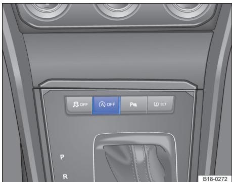  
图 146 启停系统按钮

##  请首先阅读并注意引导信息和安全提示，见 ，第 164 页。

启停系统有助您节省燃油以及减少有害排放。

在每次接通点火装置时自动激活该功能。

启停系统正常工作时，发动机将在车辆停止时自动关闭，并在车辆起步时自动启动。

组合仪表的显示屏中将显示有关启停系统当前状态的信息。

## 发动机自动关闭（车辆需处于停止状态）

● 踩下制动踏板直到车辆停止。

● 对于自动挡，仍然保持踩住制动踏板，注：如果停车时间较长，需要松开制动踏板，可将换挡杆切换至P挡。对于手动挡，将换挡杆置于空挡，松开离合器踏板。

● 发动机自动关闭。

● 仪表上显示“”，启停功能被激活。

## 发动机自动重新启动（启动状态）

● 对于自动挡，松开制动踏板或挡位从P转出或瞬 时轻踩油门。对于手动挡，踩下离合器踏板。

● 发动机自动启动。

● 仪表上不再显示“” 。

## 关闭和开启启停系统

● 通过按下按钮⇒ 图 146 或⇒ 图 147 启停系统按钮。

● 按钮中的指示灯亮起，启停功能关闭。再按一次，按钮中的指示灯熄灭，启停功能开启。

## 以下列出了启停系统生效时的主要前提条件

（均满足时，发动机自动关闭）

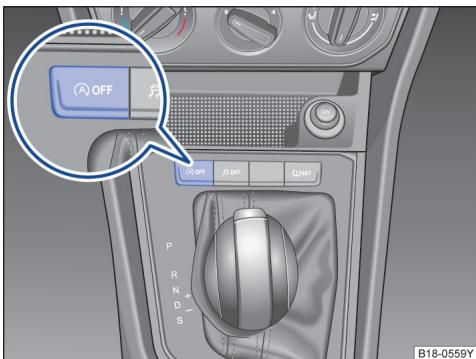  
图 147 部分车型启停系统按钮

<table><tr><td>车辆处于静止状态,并且未处于陡坡上。</td></tr><tr><td>踩下制动踏板并保持,或换挡杆切换至P挡,拉起手制动杆。</td></tr><tr><td>驾驶员系好安全带,驾驶员侧车门关闭,发动机舱盖关闭。</td></tr><tr><td>换挡杆不处于倒挡位置。</td></tr><tr><td>发动机处于暖机运行状态,发动机转速低于1200转/分钟。</td></tr><tr><td>车辆蓄电池的充电状态充足,蓄电池温度正常。</td></tr><tr><td>车内实际温度与空调设置温度差值不大,不处于Lo+AC/Hi(最低温度+制冷模式或最高温度)状态,风窗最大除霜/除雾MAX功能未被接通。</td></tr><tr><td>方向盘转角小于四分之三圈(对于自动挡)。</td></tr><tr><td>自上次发动机自动关闭后车速超过2km/h,手动点火启动需车速超过10km/h。</td></tr></table>

启停功能中断的主要条件（满足以下任意条件时，发动机将自动重新启动，且不会自动关闭）

<table><tr><td>松开制动踏板或轻踩油门(对自动挡),踩下离合器踏板(对于手动挡)。</td></tr><tr><td>换挡杆切换至倒挡。</td></tr><tr><td>空调温度设置为最高/最低,或由于车内实际温度与空调设置温度差值过大。</td></tr><tr><td>空调鼓风机设置为 $Lo+AC/Hi$ (最低温度+制冷模式或最高温度)状态。</td></tr><tr><td>风窗玻璃最大除霜/除雾MAX功能被接通。</td></tr><tr><td>启停系统被关闭。</td></tr><tr><td>车辆蓄电池的充电状态不足。</td></tr><tr><td>制动系统中的真空度不足。</td></tr></table>

组合仪表的信息

<table><tr><td>显示屏上断闪烁</td><td>启停控制系统中有故障</td><td>请及时前往上汽大众经销商进行维修。</td></tr><tr><td>显示屏上亮</td><td>无法进行发动机自动关闭</td><td>可能是由于安全带未系紧,车门未关闭,空调温差、蓄电池电量等不满足条件的情况引起。</td></tr><tr><td>显示屏上A长亮</td><td>发动机自动关闭(停止状态)</td><td>车辆停止后发动机自动关闭。(正常工作状况)</td></tr><tr><td>连续5声警告,显示屏上长亮</td><td>离车警告(提示手动关闭发动机)</td><td>可能是由于发动机自动关闭后松开安全带并开起车门所致。</td></tr><tr><td>指示灯长亮</td><td>手动启动发动机</td><td>可能是由于发动机自动关闭后长时间松开安全带或开起车门所致,需手动启动发动机。</td></tr></table>

## 被动式轮胎气压报警系统

##  主题引言

该章节包含有关下列主题的信息：

被动式轮胎气压报警系统警告灯 . . . . . . 167

补充信息和警告说明：

● 信息显示器

● 运输

● 制动、停车和驻车

● 汽车外部养护和清洁

● 车轮和轮胎

● 附件、零部件更换、维修和改装

## 警告

车轮和轮胎处理不当可能导致轮胎突然失压、花纹裂开甚至导致轮胎爆裂。

## 警告（续）

● 要定期检测胎压，并始终保持规定的胎压值。过低的胎压可能使轮胎剧烈变热，从而发生花纹裂开和轮胎爆裂。

● 务必遵守贴签上所规定的冷态轮胎正确充气压力 。

● 要定期在轮胎处于冷态时检查胎压。如有必要，需根据规定的压力值及时进行调整。

● 要定期检查轮胎是否有磨损或损坏痕迹。

● 切勿超出安装的轮胎允许的最高车速和载荷。

在胎压过低时，耗油量和轮胎磨损会增大。

i 请勿完全依赖于轮胎气压报警系统。定期检查象，例如刺伤、割伤、裂纹和凸痕。只要异物未刺入轮胎内部，就要将异物从轮胎花纹中清除。

## 被动式轮胎气压报警系统警告灯

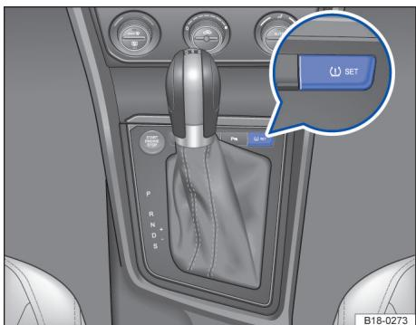  
图 148 被动式轮胎气压报警系统设定按钮

 请首先阅读并注意引导信息和安全提示，见 ，第 167 页。

被动式轮胎气压报警系统“RKA+”借助 ABS / ESP传感器比较各个车轮的转速以及滚动周长。当车轮的滚动周长发生变化时，组合仪表中的警告灯将亮起。

被动式胎压报警系统初始化设置后，需要经过一定的里程后，才能进行胎压报警。

在下列情况下轮胎的周长可能会发生变化：

● 轮胎压力过低。

● 轮胎的结构已损坏。

● 车辆单侧承受负载。

● 前轴/后轴车轮上的载荷过重（例如在挂车行驶、山区行车或下坡行驶时）。

● 装上了防滑链条。

● 换上了备用车轮。

● 更换了其他车轮。

● 环境温度变化过大。

每行驶一万公里，需要重新检查胎压，并对胎压监控系统进行重新标定。

被动式轮胎气压报警系统的基本设置

在调整轮胎气压或更换车轮后，必须按如下方式对系统进行设置：

● 按照标准轮胎气压对轮胎压力进行调节（见燃油箱盖板内侧的标签）⇒ 第 225 页。

● 打开点火开关

● 按下设定按钮  超过 2 秒钟⇒ 图 148⇒ 第 167 页，待仪表发出“咚”一声提示音，确认储存好新的参数后警告灯熄灭。

在基本设置完成后，车辆一般正常行驶约一小时以后，轮胎气压报警系统将具备对轮胎漏气的监控能力。

## 警告灯亮起后的正确操作步骤：

1）请在路况允许并确保安全的情况下立即停车，检查轮胎和胎压是否正常（建议用气压计测量）；

2）如果胎压不足或胎压过高时，请按油箱盖上标准胎压值调整胎压；

3）将车辆熄火等待数秒；

4）重新打开点火开关；

5）长按胎压设定按钮  超过2秒，在听到“咚”的提示音后完成对胎压监控系统的基本设置；

6）如果按下设定按钮  2秒后还不能使其熄灭，说明系统存在故障。请前往就近的上汽大众经销商检查并排除故障。

如果无法继续行驶，请联系就近的上汽大众经销商进行维修。

## 警告

胎压不同或胎压过低可能导致轮胎失效、失去对汽车的控制、引发事故、人员受伤和死亡。

● 若警告灯  亮起，必须立即降低车速，避免急转弯和紧急制动，就近停车，尽快检查轮胎气压。

● 驾驶员必须负责使所有轮胎始终保持正确气压，因此，必须定期检查轮胎气压，最好在添加燃油时和长途行驶前检查轮胎气压。

## 警告（续）

● 轮胎气压必须符合规定，若轮胎气压不足，持续高速行驶将加剧轮胎挠曲或者轮胎过热，可能导致胎面脱壳或轮胎爆裂 。

● 某些行驶条件下（例如，以运动型的风格驾驶汽车，或在寒冷季节或地区行驶，或在非平坦路面行驶），警告灯  可能反应滞后或根本不显示。

## 警告

忽视亮起的警告灯和文字信息可能会导致车辆在道路行驶中抛锚，引起事故和受伤。

● 切勿忽视亮起的警告灯和文字信息。

● 一旦路面情况允许且安全，就立即停车。

## ① 提示

● 装防滑链行驶时轮胎气压报警系统可能显示错误警告信息，因防滑链加大了轮胎滚动周长。

● 如前后轮换位，则必须重新设定轮胎监控系统。

● 当驾驶员由于外部的影响而导致一个或者多个轮胎爆胎，胎压监测系统不能给予驾驶员以提醒。

● 装备非上汽大众标配或选装轮胎时可能会引起的误报警。

● 当在非常坏的路面行驶时，极低的可能会引起误报警。

● 没有正确设置胎压（调整胎压、更换轮胎、更换减震器等情况后需要重新设置胎压）会引起误报警。

## 空调

## 手动空调

##  主题引言

该章节包含有关下列主题的信息：

空气内循环模式 ..... 170
操作元件 ..... 171
车内采暖和制冷 ..... 172
前部通风 ..... 173

空调采暖及制冷装置仅在发动机运转且鼓风机打开的情况下工作。

补充信息和警告说明：

● 外观视图⇒ 第 11 页

● 车窗玻璃刮水器和清洗器⇒ 第 105 页

● 汽车外部养护和清洁 ⇒ 第 208 页

## 警告

车窗玻璃的视野不良会加大发生交通事故和人身伤害的危险。

● 保持所有车窗玻璃无冰雪和水雾覆盖对交通安全性至关重要。因为只有这样才能确保视野良好。

● 必须熟悉如何正确操纵暖风、通风以及车窗玻璃除雾和除霜功能。

● 空气内循环模式下，新鲜空气不会进入车内。关闭制冷装置后，在空气内循环模式下车窗玻璃会很快结有水雾并严重影响向外视野，有发生事故的危险！

● 车辆停在车库或空气流通不畅的地方时，应开启空气内循环模式，避免废气进入车内而带来的中毒危险。

## 警告

车内空气浑浊可能会加速驾驶员疲劳并使其注意力分散，由此可能会引发交通事故并造成人身伤害。

● 切勿较长时间关闭鼓风机，而且切勿较长时间使用车内空气循环运行模式，否则没有新鲜空气进入车内。

● 不需要使用空气内循环模式时，请将其关闭。

## ① 提示

● 如果您怀疑空调系统有故障，为了避免空调系统损坏，应关闭空调系统，然后尽快前往上汽大众经销商处检修。

● 空调系统的修理工作需要专业知识和专用设备和工具。因此，如果发生故障建议到上汽大众经销商处去处理。

● 暖风装置由于利用了发动机冷却液循环的热量，因此几乎不会增加燃油消耗。

● 制冷装置开启后会影响发动机功率，并使油耗增加。因此，在不开启制冷装置也能达到所需的车内温度时，应选择新鲜空气通风。

i 在制冷装置关闭的情况下，不会对吸入的车外议把制冷装置打开。方法是按压按钮 A/C。按钮中的指示灯随即亮起。

i 在车外空气湿度较大且温度较高时，会有冷凝水从制冷装置蒸发器中滴出并在汽车下面形成水洼。这属于正常情况，并不表示有泄漏！

i 为了不影响采暖或制冷功率并防止车窗玻璃上出现水雾，必须保证挡风玻璃前的进风口没有冰雪或树叶遮挡。

## 空气内循环模式

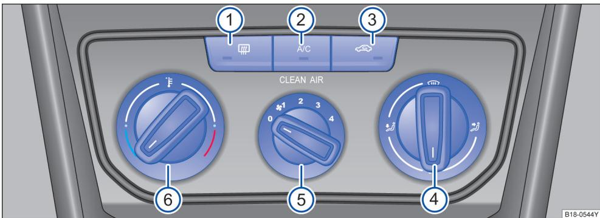  
图 149 中控台上：手动空调的操作元件

##  请首先阅读并注意引导信息和安全提示，见 ，第 169 页。

在空气内循环模式下，可阻止车外空气进入车内。

按压按钮⇒ 图 149 3 ，即可打开或关闭空气内循环模式。如果此按钮中的指示灯亮起，说明其处于打开状态。

在空气内循环模式下，车外空气不会进入车内。空气仅仅在车内循环运行。因此，开启空气内循环模式可防止车外混浊难闻的空气进入车内。

在车外温度较低时，开启空气内循环模式可以改善加热效率，因为此时只对车内的空气进行加热。

在车外温度较高时，开启空气内循环模式可以改善制冷效率，因为此时只对车内的空气进行制冷。

为安全起见，在空气内循环模式下，如果把空气流向调节开关转到位置，空气内循环模式便会关闭。再次按压按钮可以重新打开空气内循环模式。

在打开空气内循环模式的情况下请勿吸烟，因为烟雾会沉积在制冷装置的蒸发器和空调滤清器上，从而导致难以去除的异味。

## 警告

车窗玻璃的视野不良会加大发生交通事故和人身伤害的危险。

● 保持所有车窗玻璃无冰雪和水雾覆盖对交通安全性至关重要。因为只有这样才能确保视野良好。

● 必须熟悉如何正确操纵暖风、通风以及车窗玻璃除湿和除冰霜功能。

● 在空气内循环模式下，新鲜空气不会进入车内。关闭制冷装置后，在空气内循环模式下车窗玻璃会很快结有水雾并严重影响向外的视野，有发生事故的危险！

● 不需要使用空气内循环模式时，请务必将其关闭。

● 车内空气浑浊可能会加速驾驶员疲劳并使其注意力分散，由此可能会引发交通事故并造成人身伤害。

## 操作元件

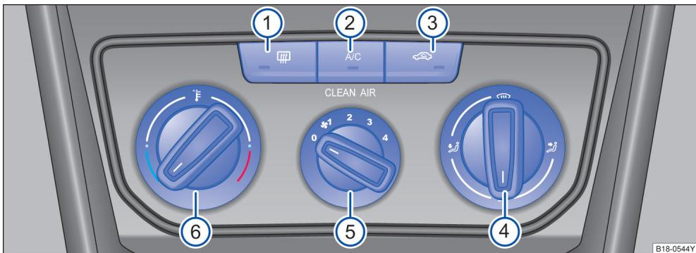  
图 150 中控台上：手动空调的操作元件

##  请首先阅读并注意引导信息和安全提示，见 ，第 169 页。

空调采暖及制冷装置仅在发动机运转且鼓风机打开的情况下工作。

– 旋转开关 6 、 4 和 5 ，可以调节温度、空气流向和鼓风机转速。

– 按压 1 至 3 之间的按钮可以开启或关闭相应功能，开启某项功能后按钮内的指示灯随之亮起。再按一下该按钮，该功能即被关闭。

1 后风窗加热按钮。后风窗加热功能仅在发动机运转的情况下才工作。打开大约10分钟后，加热功能会自动关闭。也可以按压此按钮提前关闭加热功能。

2 制冷装置按钮A/C。制冷装置开启后，按钮中的指示灯随即亮起。

空气内循环按钮。3

空气流向调节开关4

–  气流吹向前挡风玻璃。

–  气流吹向上身。

–  气流吹向脚部空间。

–  气流吹向上身和脚部空间。

5 鼓风机开关。鼓风机可分4挡调节空气流量大小。行车时建议至少将鼓风机开启在较低的挡位上运行，以便随时都会有新鲜空气进入车内。

温度调节开关 ⇒ 第 172 页。6

## 警告

车窗玻璃的视野不良会加大发生交通事故和人身伤害的危险。

● 保持所有车窗玻璃无冰雪和水雾覆盖对交通安全性至关重要。因为只有这样才能确保视野良好。

● 必须熟悉如何正确操纵暖风、通风以及车窗玻璃除雾和除霜功能。

● 为了提高制冷效果，可以短时接通空气内循环模式，但不要将空气内循环模式接通较长时间，因为“污浊”的空气可能使驾驶员和乘员疲劳、注意力下降，并可能导致风窗玻璃蒙上水雾，事故风险增大。一旦风窗玻璃蒙上水雾，请立即关闭空气内循环运行模式。

● 空气内循环模式下，新鲜空气不会进入车内。关闭制冷装置后，在空气内循环模式下车窗玻璃会很快结有水雾并严重影响向外视野，有发生事故的危险！

● 不需要使用空气内循环模式时，请将其关闭。

● 车内空气浑浊可能会加速驾驶员疲劳并使其注意力分散，由此可能会引发交通事故并造成人身伤害。

● 车辆停在车库或空气流通不畅的地方时，应开启空气内循环模式，避免废气进入车内而带来的中毒危险。

## ①提示

● 请留意相关的概述。

● 由于汽车装备不同，按钮的布局及按钮上的标记也可能不同。请以实车为准。

## 车内采暖和制冷

  
图 151 中控台上：手动空调的操作元件

 请首先阅读并注意引导信息和安全提示，见 ，第 169 页。

手动空调能尽快地将气流温度调节到预设的温度水平，并保持这一状态。

## 车内采暖

\- 旋转温度调节开关 6 ，设置适合的温度。（建议将调节开关调节至中间偏右位置）

\- 旋转鼓风机开关 5 ，设定鼓风机转速。

\- 转动空气流向调节开关 4 ，调节送风方向。（建议选择脚部送风）

## 车内制冷

\- 旋转鼓风机开关 5 ，设定鼓风机转速。

\- 按下按钮A/C ，开启制冷装置。按钮上的指示灯随即亮起。

\- 旋转温度调节开关 6 ，设置适合的温度。(建议将调节开关调节至中间位置或偏左位置)

\- 转动空气流向调节开关 4 ，调节送风方向。（建议选择上身送风）

## 车内快速制冷

\- 旋转鼓风机开关 5 ，设定鼓风机转速。

\- 逆时针旋转温度调节开关 6 至极限位置（最低温度处），开启空调A/C 2 功能和内循环 3 功能。

\- 转动空气流向调节开关 4 ，调节送风方向。（建议选择上身送风）

## 前风窗除霜

\- 将空气流向调节开关 4 转到位置。

\- 将鼓风机开关 5 转到3挡。

\- 将温度调节开关 6 顺时针转到底。

\- 将仪表板两侧的出风口的送风方向调向侧面车窗。

## 前风窗侧窗除雾

汽车前风窗及侧窗之所以会起雾，是由于空气中湿度较大车辆内外部有一定的温差时，温度较低一侧的风窗和侧窗玻璃表面因潮湿空气凝结而形成雾气。在雨天时风窗和侧窗玻璃表面更容易出现雾气，如需快速除雾，建议进行如下调节：

\- 将温度调节开关 6 转到合适位置。

\- 将鼓风机开关 5 转到2挡或3挡。

\- 将空气流向调节开关 4 转到位置 ，此时空调A/C 2 功能将自动开启，内循环开关 3 将自动调节到外循环模式。

\- 将仪表板两侧的出风口的送风方向调向侧面车窗。

\- 风窗玻璃除雾完毕后，调节空气流向调节开关离开位置，返回到进行除雾前的设定状态。

## 关闭手动空调

\- 将鼓风机开关 5 转到位置0，即可关闭空调系统。

## 新鲜空气通风

\- 按下制冷装置按钮A/C，关闭制冷装置。

\- 按压空气内循环按钮，关闭空气内循环模式。

\- 将温度调节开关 6 逆时针转到左侧极限位置。

\- 将鼓风机开关 5 转到合适位置。

\- 将空气流向调节开关 4 转到位置。

## 采暖系统

只有在发动机达到工作温度时，才能发挥最大可能的加热功率并快速除去车窗玻璃上的冰雪。

## 制冷系统

在制冷装置打开时不仅可以降低车内温度，而且空气湿度也会降低。这样可在车外湿度较高的情况下提高乘员的舒适度，并能防止车窗玻璃形成水雾。如果无法打开制冷装置，可能有以下原因：

● 没有启动发动机。

● 鼓风机已关闭。

● 车外温度低于约 +3 °C。

● 制冷装置的压缩机由于发动机冷却液温度过高而暂时关闭。

● 空调的保险丝损坏了。

● 其它故障。请前往上汽大众经销商检查空调系统。

## 警告

车窗玻璃的视野不良会加大发生交通事故和人身伤害的危险。

● 保持所有车窗玻璃无冰雪和水雾覆盖对交通安全性至关重要。因为只有这样才能确保视野良好。

## 警告（续）

● 必须熟悉如何正确操纵暖风、通风以及车窗玻璃除湿和除霜功能。

● 在空气内循环模式下，新鲜空气不会进入车内。关闭制冷装置后，在空气内循环模式下车窗玻璃会很快结有水雾并严重影响向外的视野，有发生事故的危险！

● 不需要使用空气内循环模式时，请务必将其关闭。

● 车内空气浑浊可能会加速驾驶员疲劳并使其注意力分散，由此可能会引发交通事故并造成人身伤害。

● 暖风装置由于利用了发动机冷却液循环的热量，因此几乎不会增加燃油消耗。

● 制冷装置开启后会影响发动机功率，并使油耗增加。因此，在不开启制冷装置也能达到所需的车内温度时，应选择新鲜空气通风。

● 请留意相关的概述。

● 由于汽车装备不同，按钮的布局也可能不同。但是按钮上的标记是相同的。

## 前部通风

  
图 152 前部通风口

 请首先阅读并注意引导信息和安全提示，见 ，第 169 页。

利用出风口中间的导流片可以上下/左右调节气流方向。此外，还可以通过此导流片旋转相应的出风口调节空气流向。

## 提示

为避免损坏出风口叶片，请勿在出风口上附加香水、支架等物品。

## 自动空调

##  主题引言

该章节包含有关下列主题的信息：

空气内循环模式 ..... 174
操作元件 ..... 176
自动模式 ..... 177
手动模式 ..... 179
前部通风 ..... 180
基本说明 ..... 181

空调采暖及制冷装置仅在发动机运转且鼓风机打开的情况下工作。

自动空调有自动和手动两种运行模式：

补充信息和警告说明：

● 外观视图⇒ 第 11 页

● 车窗玻璃刮水器和清洗器⇒ 第 105 页

● 汽车外部养护和清洁⇒ 第 208 页

## 警告

车窗玻璃的视野不良会加大发生交通事故和人身伤害的危险。

● 保持所有车窗玻璃无冰雪和水雾覆盖对交通安全性至关重要。因为只有这样才能确保视野良好。

● 必须熟悉如何正确操纵暖风、通风以及车窗玻璃除雾和除霜功能。

● 空气内循环模式下，新鲜空气不会进入车内。关闭制冷装置后，在空气内循环模式下车窗玻璃会很快结有水雾并严重影响向外视野，有发生事故的危险！

● 车辆停在车库或空气流通不畅的地方时，应开启空气内循环模式，避免废气进入车内而带来的中毒危险。

## 空气内循环模式

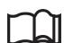

请首先阅读并注意引导信息和安全提示，见 ，第 174 页。

## 警告（续）

● 由于车辆设计的实际原因,空气内循环模式不能保证完全隔绝外界空气,在车库或空气流通不畅的地方长时间使用空气内循环模式也会造成中毒的危险.

## 警告

车内空气浑浊可能会加速驾驶员疲劳并使其注意力分散，由此可能会引发交通事故并造成人身伤害。

● 切勿较长时间关闭鼓风机，而且切勿较长时间使用车内空气循环运行模式，否则没有新鲜空气进入车内。

● 不需要使用空气内循环模式时，请将其关闭。

## ① 提示

● 如果您怀疑空调系统有故障，为了避免空调系统损坏，应关闭空调系统，然后尽快前往上汽大众经销商处检修。

● 空调系统的修理工作需要专业知识和专用设备和工具。因此，如果发生故障建议到上汽大众经销商处去处理。

● 暖风装置由于利用了发动机冷却液循环的热量，因此几乎不会增加燃油消耗。

● 制冷装置开启后会影响发动机功率，并使油耗增加。因此，在不开启制冷装置也能达到所需的车内温度时，应选择新鲜空气通风。

i 在制冷装置关闭的情况下，不会对吸入的车外议把制冷装置打开。方法是按压按钮 A/C。按钮中的指示灯随即亮起。

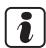

i 在车外空气湿度较大且温度较高时，会有冷凝水 洼。这属于正常情况，并不表示有泄漏！

i 为了不影响采暖或制冷功率并防止车窗玻璃上出现水雾，必须保证挡风玻璃前的进风口没有冰雪或树叶遮挡。

## 空气内循环模式

打开或关闭空气内循环模式- 按压按钮⇒ 图 153 6 ，即可打开空气内循环模式。按钮上的指示灯随即亮起。

\- 再次按压按钮，可关闭空气内循环模式。按钮中的指示灯随即熄灭。

在空气内循环模式下，车外空气极少进入车内。空气仅仅在车内循环运行。因此，开启空气内循环模式可防止车外混浊难闻的空气进入车内。

在车外温度较低时，开启空气内循环模式可以改善加热效率，因为此时只对车内的空气进行加热。

在车外温度较高时，开启空气内循环模式可以改善制冷效率，因为此时只对车内的空气进行制冷。

为安全起见，在空气内循环模式开启的情况下如果按压除霜按钮，空气内循环模式便会关闭。再次按压按钮可以重新打开空气内循环模式。

在打开空气内循环模式的情况下请勿吸烟，因为烟雾会沉积在制冷装置的蒸发器和空调滤清器上，从而导致经久难除的异味。

在空气内循环模式下，如果制冷装置已关闭，则不会对吸入的空气除湿。为了避免挡风玻璃上产生水雾，建议按下按钮A/C⇒ 图 153 8 ，打开制冷装置。按钮中的指示灯随即亮起。

## 警告

车窗玻璃的视野不良会加大发生交通事故和人身伤害的危险。

● 保持所有车窗玻璃无冰雪和水雾覆盖对交通安全性至关重要。因为只有这样才能确保视野良好。

● 必须熟悉如何正确操纵暖风、通风以及车窗玻璃除湿和除冰霜功能。

● 在空气内循环模式下，新鲜空气不会进入车内。关闭制冷装置后，在空气内循环模式下车窗玻璃会很快结有水雾并严重影响向外的视野，有发生事故的危险！

● 不需要使用空气内循环模式时，请务必将其关闭。

● 车内空气浑浊可能会加速驾驶员疲劳并使其注意力分散，由此可能会引发交通事故并造成人身伤害。

## ①提示

● 如果您怀疑空调系统有故障，为了避免空调系统损坏，应关闭空调系统，然后尽快前往上汽大众经销商处检修。

● 空调系统的修理工作需要专业知识和专用设备和工具。因此，如果发生故障建议到上汽大众经销商处修理。

● 不按照保养规定更换空调滤清器，可能造成大量灰尘与杂质附着在过滤器内，使进风量减少并削弱采暖及制冷效果，影响车内空气质量。

## 操作元件

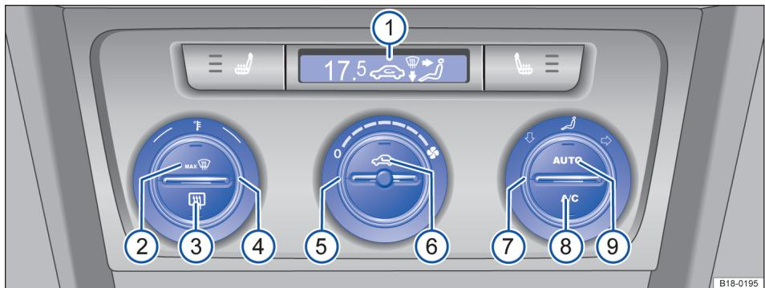  
图 153 中控台上：自动空调的操作元件

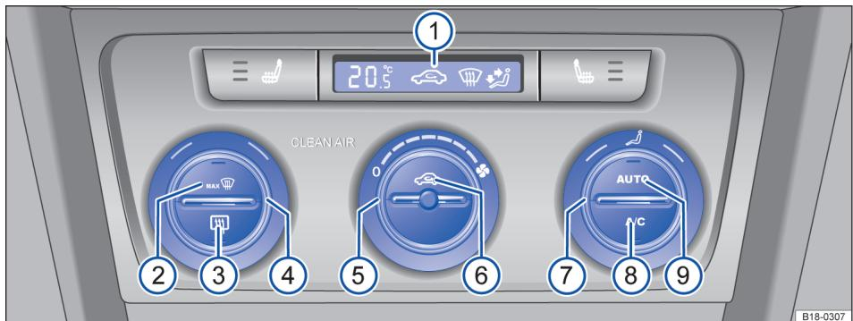  
图 154 部分车型中控台上：自动空调的操作元件

##  请首先阅读并注意引导信息和安全提示，见 ，第 174 页。

空调采暖及制冷装置仅在发动机运转且鼓风机打开的情况下才能工作。

– 转动温度调节开关 4 ⇒ 图 153，即可设定驾驶员侧和前排乘员侧的温度。

按钮中的指示灯显示相应功能是否激活。

## 显示器1

2 按钮 – 前风窗玻璃除霜/除雾功能。吸入的车外空气吹向前风窗玻璃及前排侧窗玻璃。若在空气内循环模式接通时打开风窗玻璃除霜除雾功能，空气内循环模式自动关闭。在符合压缩机开启的条件下，制冷装置还会自动接通，鼓风机自动调到合适的挡位，降低空气中的湿度并尽快清除风窗玻璃上的水雾或冰雪。

3 按钮 – 后风窗加热按钮。后风窗加热仅在发动机运转的情况下才工作。后风窗加热功能接通时，按钮中的指示灯亮起。后窗玻璃加热在开启约10分钟后会自动关闭。也可以再次按压按钮提前关闭加热功能。

温度调节旋钮4

鼓风机挡位调节旋钮 。5

按钮 – 空气内循环模式。6

⑦旋钮-气流分布调节旋钮。

8 按钮A/C – 打开或关闭制冷装置。如果按钮A/C 中的指示灯亮起，说明制冷装置已开启。另外请注意在自动运行模式下的说明。

按钮AUTO – 自动调节气流温度、鼓风机转速9和空气流向。

## 警告

车窗玻璃的视野不良会加大发生交通事故和人身伤害的危险。

## 警告（续）

● 保持所有车窗玻璃无冰雪和水雾覆盖对交通安全性至关重要。因为只有这样才能确保视野良好。

● 必须熟悉如何正确操纵暖风、通风以及车窗玻璃除湿和除冰霜功能。

● 在空气内循环模式下，新鲜空气不会进入车内。关闭制冷装置后，在空气内循环模式下车窗玻璃会很快结有水雾并严重影响向外的视野，有发生事故的危险！

● 不需要使用空气内循环模式时，请务必将其关闭。

● 车内空气浑浊可能会加速驾驶员疲劳并使其注意力分散，由此可能会引发交通事故并造成人身伤害。

## 警告（续）

● 车辆停在车库或空气流通不畅的地方时，应开启空气内循环模式，避免废气进入车内而带来的中毒危险。

## ① 提示

● 请留意有关的概述。

● 由于汽车装备不同，按钮的布局及按钮上的标记也可能不同。请以实车为准。

## 自动模式

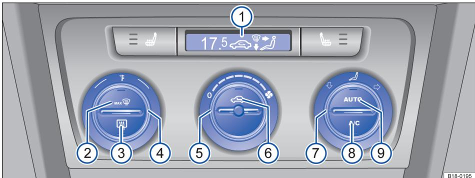  
图 155 中控台上：自动空调的操作元件

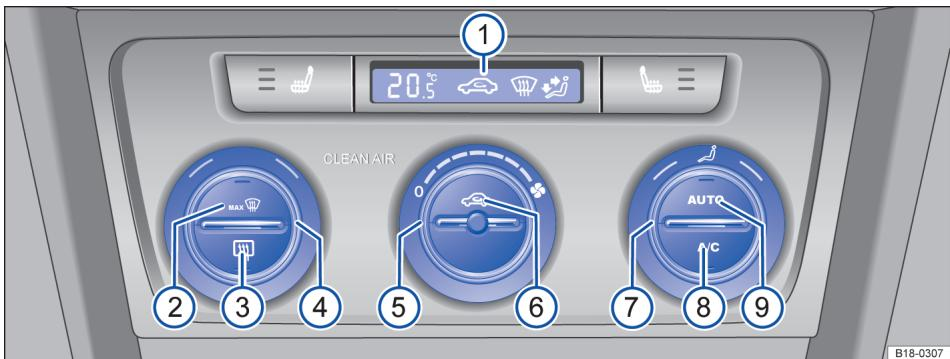  
图 156 部分车型中控台上：自动空调的操作元件

  
请首先阅读并注意引导信息和安全提示，  
见 ，第 174 页。

在自动运行模式下，气流温度、风量大小和空气流向会自动调节，以便尽快达到预设的温度并保持恒温。

## 打开自动运行模式

\- 按下“AUTO ”按钮⇒ 图 155，按钮上的黄灯亮起。

\- 转动温度调节旋钮，设置车内的理想温度。我们建议设置为22℃。

采用自动运行模式并温度设置为22℃时，车内会快速实现舒适的气温。因此仅在有特定的个人舒适度和环境要求时，才改变温度设置。车内温度设置范围是+16℃至+29.5℃。取决于车外温度，设置的温度可以稍高于或低于此温度值。

空调系统会自动保持恒定的温度。为此，出风口温度、鼓风机挡位和气流分布自动改变。强烈阳光照射时空调系统也会自动作出调节，无需再进行手动调节。因此几乎在所有情况下，自动运行模式一年四季都会满足车辆乘员的舒适度要求。

当手动调节除温度调节旋钮及A/C 按钮外的其他按键，自动运行模式停止。但温度会继续得到控制。

## 风窗除雾

汽车前风窗及侧窗之所以会起雾，是由于空气中湿度较大车辆内外部有一定的温差时，温度较低一侧的风窗和侧窗玻璃表面因潮湿空气凝结而形成雾气。在雨天时风窗和侧窗玻璃表面更容易出现雾气，如需快速除雾，建议进行如下调节：

按压按钮,在符合压缩机开启的条件下，制冷装置还会自动接通，鼓风机自动调节到合适的挡位，可快速的降低空气中的湿度并清除风窗上的水雾。

除雾完毕后,重新按压按钮键，使空调恢复到除霜前的设定状态，或在雾气消除后按下AUTO 键，空调将根据实际情况自动进行调节。

## 警告

车窗玻璃的视野不良会加大发生交通事故和人身伤害的危险。

● 保持所有车窗玻璃无冰雪和水雾覆盖对交通安全性至关重要。因为只有这样才能确保视野良好。

● 必须熟悉如何正确操纵暖风、通风以及车窗玻璃除湿和除冰霜功能。

● 在空气内循环模式下，新鲜空气不会进入车内。关闭制冷装置后，在空气内循环模式下车窗玻璃会很快结有水雾并严重影响向外的视野，有发生事故的危险！

● 不需要使用空气内循环模式时，请务必将其关闭。

● 车内空气浑浊可能会加速驾驶员疲劳并使其注意力分散，由此可能会引发交通事故并造成人身伤害。

## ① 提示

● 在制冷装置关闭的情况下，不会对吸入的车外空气除湿。为了避免挡风玻璃上产生水雾，建议把制冷装置打开。方法是按压按钮A/C，按钮中的指示灯随即亮起，并开启车外循环。

● 长期处于最大除雾或后风窗加热模式将增加车辆油耗，且对于低排量的车型在恶劣工况下可能会导致发动机功率不足。

## 手动模式

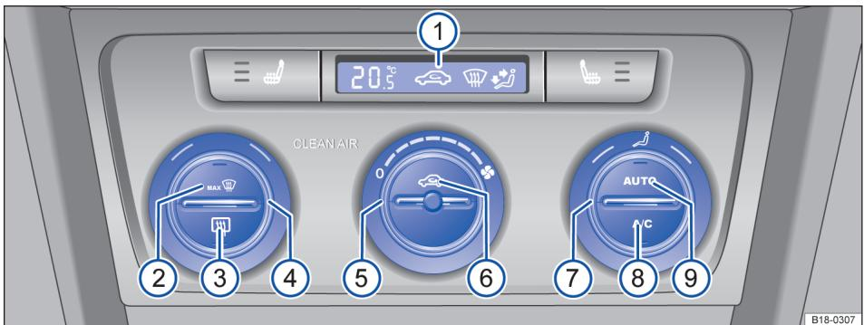  
图 157 中控台上：自动空调的操作元件

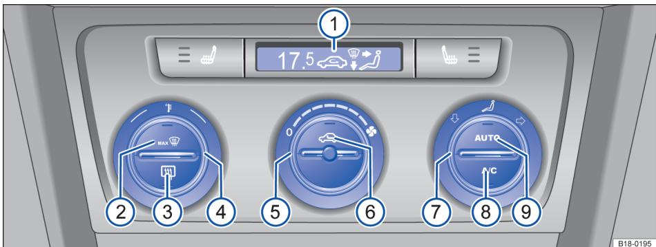  
图 158 部分车型中控台上：自动空调的操作元件

 请首先阅读并注意引导信息和安全提示，见 ，第 174 页。

在手动模式下，可自行确定气流温度、风量大小和空气流向。

## 打开手动操作模式

\- 按下按钮 2 3 6 的其中一个，或转动鼓风机调节开关 5 和气流分布调节开关 7 中的一个，AUTO 按钮上的黄灯熄灭，空调系统进入手动操作模式。

## 关闭手动运行模式

\- 按压按钮AUTO，即可关闭手动运行模式，并打开自动运行模式。

## 温度

打开点火开关后，您可以通过温度调节旋钮④设定车内温度。

车内温度设置范围是+16℃－+29.5℃。取决于车外温度，设置温度可以稍高于或低于此温度值。 如果设置温度低于16℃，显示器上显示“LO”。制冷装置以最大制冷功率运行，车内温度不再进行调节。如果设置温度高于29.5℃，显示器上显示“HI”。

## 鼓风机转速

鼓风机共有7个挡位。

空调系统自动控制鼓风机转速与车内温度相协调。但您也可以手动调节鼓风机风速，以满足您的要求。

－ 逆时针（降低风速）/顺时针（提高风速）转动鼓风机挡位调节旋钮 5 。

－ 逆时针旋转鼓风机挡位调节旋钮。关闭鼓风机，空调系统也被关闭。

鼓风机的挡位将通过调节旋钮上方的指示灯显示出来。

## 空气流向

你可以通过转动气流分布旋钮 7 对气流分布进行手动调节。

显示器 1 显示 表示气流流向乘员上身。

显示器 1 显示 表示气流流向脚部空间。

显示器 1 显示表示气流流向乘员上身及脚部空间。

显示器 1 显示表示气流流向风窗玻璃。

显示器 1 显示表示气流流向脚部空间及风窗玻璃。

当AUTO 按钮指示灯亮起时，气流流向自动调节。

## 打开和关闭制冷装置

－ 按下A/C 开关，按钮中的指示灯亮起。

－ 设定温度范围在 +16度到+29.5度之间。

－ 当再次按下A/C 按钮时，制冷装置被手动关闭。

按下A/C 开关可以手动开启/关闭制冷装置。指示灯熄灭时制冷装置关闭，在这种运行状态下加热和通风系统将自动调节（无空气除湿和制冷作用），在这个运行过程中，所希望的车内温度尽可能快地达到并保持恒温。

在A/C 按钮关闭的情况下，车内的空气不会被冷却，湿度也不会下降。

如果您设定的温度低于+16度，显示器上就会显示 LO，如果您设定的温度高于+29.5 度，显示器上就 会显示HI。

如果不能打开制冷装置，可能有以下原因：

● 没有启动发动机。

● 鼓风机已关闭。

● 车外温度低于约 +3 °C。

● 制冷装置的压缩机由于发动机冷却液温度过高而暂时关闭。

● 空调系统的保险丝损坏了。

● 汽车出现了某种其它的故障。请到上汽大众经销商去检查空调系统。

## 警告

车窗玻璃的视野不良会加大发生交通事故和人身伤害的危险。

● 保持所有车窗玻璃无冰雪和水雾覆盖对交通安全性至关重要。因为只有这样才能确保视野良好。

● 必须熟悉如何正确操纵暖风、通风以及车窗玻璃除湿和除冰霜功能。

● 空气内循环模式下，新鲜空气不会进入车内。关闭制冷装置后，在空气内循环模式下车窗玻璃会很快结有水雾并严重影响向外的视野，有发生事故的危险！

● 不需要使用空气内循环模式时，请务必将其关闭。

● 车内空气浑浊可能会加速驾驶员疲劳并使其注意力分散，由此可能会引发交通事故并造成人身伤害。

## ①提示

● 内循环模式下并不能完全将车内与车外空气进行隔离。

## 前部通风

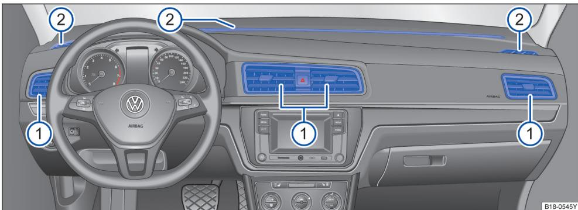  
图 159 前部通风口

  
请首先阅读并注意引导信息和安全提示，

见 ，第 174 页。

利用出风口中间的导流片可以上下/左右调节气流方向。此外，还可以通过此导流片旋转相应的出风口调节空气流向。

## ①提示

为避免损坏出风口叶片，请勿在出风口上附加香水、支架等物品。

## 基本说明

 请首先阅读并注意引导信息和安全提示，见 ，第 174 页。

## 空调滤清器

空调滤清器（包含花粉滤清器和粉尘滤清器）可明显降低或阻挡车外空气中的有害成分（例如灰尘和花粉）进入车内。

为确保空调系统可以高效工作，必须按照保养要求规定的时间间隔更换空调滤清器。

如果发现进风量明显减少，可能需要提前更换空调滤清器。

在空气内循环模式情况下车内应禁止吸烟，因为从车内吸入的烟雾会附着在空调蒸发器上，这会导致无法消除的异味，只能通过更换蒸发器来解决。

如遇风沙天气，请开启空气内循环模式。否则车外的沙尘会随着空气进入空调系统，堵塞过滤器并进入车内污染车内环境。

如果制冷装置长期未开，蒸发器中的附着物可能会产生异味。因此为了去除异味建议每个月至少要开启一次制冷装置，同时将鼓风机挡位调节到最大并保持5分钟，即使在冬季也是这样，在进行上述操作的同时也请打开车窗片刻。

## 警告

车窗玻璃的视野不良会加大发生交通事故和人身伤害的危险。

● 保持所有车窗玻璃无冰雪和水雾覆盖对交通安全性至关重要。因为只有这样才能确保视野良好。

● 必须熟悉如何正确操纵暖风、通风以及车窗玻璃除湿和除冰霜功能。

● 在空气内循环模式下，新鲜空气不会进入车内。关闭制冷装置后，在空气内循环模式下车窗玻璃会很快结有水雾并严重影响向外的视野，有发生事故的危险！

## 警告（续）

● 不需要使用空气内循环模式时，请务必将其关闭。

● 为了提高采暖或制冷效果，可以短时接通空气内循环模式，但不要将空气内循环模式接通较长时间，因为“浑浊”的空气可能使驾驶员和乘员疲劳、注意力下降，并可能导致车窗玻璃蒙上水雾，由此可能会引发交通事故并造成人身伤害。一旦车窗玻璃蒙上水雾，请立即关闭空气内循环模式。

## ①提示

● 如果您怀疑空调系统有故障，为了避免空调系统损坏，应关闭空调系统，然后尽快前往上汽大众经销商处检修。

● 空调系统的修理工作需要专业知识和专用设备和工具。因此，如果发生故障建议到上汽大众经销商处去处理。

● 不按照保养规定更换空调滤清器，可能造成大量灰尘与杂质附着在过滤器内，使进风量减少并削弱采暖及制冷效果，影响车内空气质量。

i ● 在车外空气湿度较大且温度较高时，会有冷凝水从制冷装置蒸发器中滴出并在汽车下面形成水洼。这属于正常情况，并不表示有泄漏！

● 为了不影响采暖或制冷功率并防止车窗玻璃上出现水雾，必须保证挡风玻璃前的进风口没有冰雪或树叶遮挡。

● 车内空气会经过后部侧窗玻璃旁的通风口排出。因此请留意以防止衣服等物品挡住这个通风口，导致空气流通不畅。

● 在车窗和天窗都关闭时，空调系统能更加有效地工作。但当车辆静止时由于强烈的阳光照射而使车内温度很高时，短时间打开车窗有助于加快制冷过程。

## 在加油站

## 加油

##  主题引言

该章节包含有关下列主题的信息：

指示灯和燃油存量指示 182
添加燃油 183
加油时检查 184

油箱盖位于汽车后部右侧。

补充信息和警告说明：

● 外观视图 ⇒ 第 11 页

● 燃油 ⇒ 第 185 页

● 在发动机舱中作业的准备工作⇒ 第 187 页

## 警告

不正确添加燃油可能引发火灾，爆炸，致伤，甚至致死人员！

● 燃油属高可燃性及可爆性物质，可导致人员严重烧伤和其它伤害。

● 必须将加油枪正确置于加油口内，否则，燃油可能溢出和溅出油箱。溢出和溅出的燃油可能引发火灾，烧伤人员。

## 指示灯和燃油存量指示

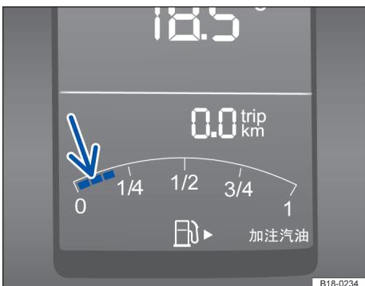  
图 160 组合仪表局部视图：燃油存量表

 请首先阅读并注意引导信息和安全提示，见 ，第 182 页。

## 警告（续）

● 要始终确保油箱锁正确关闭，以免燃油蒸发和泼出。

● 添加燃油时切勿进入车内，若不得不进入车内，则必须关闭车门，并在再次接触加油枪前应触摸一下金属表面，这样可去除身上的静电荷，否则，可能产生电火花，加油时可能引发火灾。

● 为安全起见，在加油时必须关闭发动机。

● 添加燃油时切勿吸烟，远离明火，谨防引爆燃油！

● 安全起见，建议不要随车携带备用油罐，以免发生事故时油罐破损泄漏，引发火灾。

## ① 提示

● 要立即从车漆上清除溢出的燃油，以免损坏轮罩、轮胎和车漆。

燃油可能污染环境。请收集流出的油液并由专业人员废弃处理。

油箱盖不能应急解锁。必要时请专业人员处理。

## 警告

在燃油存量过少时行驶可能导致在道路交通中抛锚，引起事故和受伤。

● 过少的燃油存量可能导致发动机的燃油供给不规律，特别是在驶过上坡或下坡路段时。

● 当发动机由于缺少燃油或燃油供给不规律而“运转不均匀”或熄火时，转向系、所有驾驶员辅助系统和制动辅助系统不工作。

● 当油箱中的燃油只剩 1/4 时，为了避免汽车因燃油不足而抛锚，务必加油。

## ① 提示

● 切勿行驶到油箱燃油完全耗尽。不规律供油可能导致缺火，于是未燃烧的燃油进入排气装置。尾气催化净化器会因此损坏！

## 添加燃油

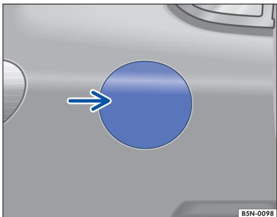  
图 161 打开燃油箱盖板

 请首先阅读并注意引导信息和安全提示，见 ，第 182 页。

燃油箱盖板由中央集控门锁控制。

添加燃油前务必关闭发动机。

打开加油口盖

\- 使用钥匙或中央集控门锁系统解锁汽

车。⇒ 第 50 页

\- 沿箭头方向按压燃油箱盖板⇒ 图 161。

\- 打开燃油箱盖板，逆时针拧下加油口盖。

\- 将加油口盖挂到燃油箱盖板上⇒ 图 162。

关闭加油口盖

\- 顺时针拧加油口盖，直至听到啮合声。

\- 关闭油箱盖板，直至听到其卡定声。

燃油箱盖板位于汽车右后侧。

一旦燃油箱内的燃油降至备用油位，指示灯亮起并伴有警告音，此时燃油箱内剩约10升燃油。

本车燃油箱容量约为55升。

油箱盖板内侧有一标签，其上标有适用于本车的燃油标号。

若无法打开油箱盖板，则应请专业人员处理。

## 警告

不正确添加燃油可能引发火灾，爆炸，致伤，甚至致死人员！

● 燃油属高可燃性及可爆性物质，可导致人员严重烧伤和其它伤害。

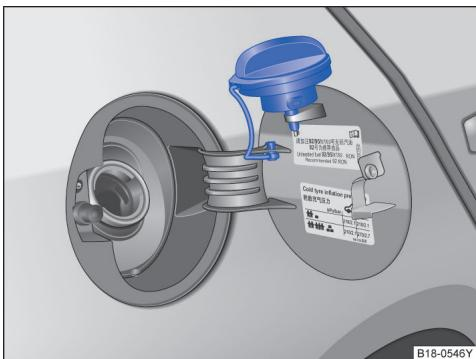  
图 162 拧下的加油口盖可挂在打开的燃油箱盖板上

## 警告（续）

● 必须将加油枪正确置于加油口内，否则，燃油可能溢出和溅出油箱。溢出和溅出的燃油可能引发火灾，烧伤人员。

● 添加燃油时切勿进入车内，若不得不进入车内，则必须关闭车门，并在再次接触加油枪前应触摸一下金属表面，这样可去除身上的静电荷，否则，可能产生电火花，加油时可能引发火灾。

● 添加燃油时切勿吸烟，远离明火，谨防引爆燃油！

● 安全起见，建议不要随车携带备用油罐，以免发生事故时油罐破损泄漏，引发火灾。

## 警告

若特殊情况不得不携带备用油罐，则请务必遵守下列规定：

● 不得将备用油罐置于车内或车上面添加燃油，否则，加油时可能产生静电荷，点燃燃油蒸汽，引爆燃油！

● 加油时必须将备用油罐置于地上。

● 加油时应尽可能将加油枪插入备用油罐。

● 若使用金属备用油罐，则加油时加油枪不得与油罐接触，防止产生静电荷。

● 请务必遵守使用、储存及随车携带备用油罐的相关法规。

● 注意切勿将燃油溅到车内或行李厢内，否则，可能引爆燃油蒸汽，谨防引发致命事故！

## ①提示

● 应及时清除溅到车身漆面上的燃油。

● 切勿让发动机运转至燃油箱内无油，不规则供油可能导致发动机缺火，未燃燃油将进入和损坏催化转换器。

自动加油枪自动关闭后切勿试图继续加油，否

则，温度升高时燃油可能溢出油箱。

## 加油时检查

请首先阅读并注意引导信息和安全提示，见 ，第 182 页。

## 核对表

如果不熟悉必要的操作和通用的安全防护措施并且没有正确的零部件及合适的工具，切勿在发动机上和在发动机舱内作业 ！否则请将所有作业交由上汽大众经销商进行。确保定期，最好在加油时检查以下内容：

车窗玻璃清洗液液位 ⇒ 第 110 页

发动机机油油位⇒ 第 191 页

发动机冷却液液位 ⇒ 第 195 页

制动液液位 ⇒ 第 141 页

胎压⇒ 第 167 页

保证交通安全所需的汽车照明⇒ 第 98 页：

– 转向信号灯

– 停车灯、近光灯和远光灯

– 尾灯

– 制动信号灯

– 后雾灯

## 汽油

##  主题引言

该章节包含有关下列主题的信息：

汽油标号 . 185

汽油清净剂 . . . 185

补充信息和警告说明：

● 加油 ⇒ 第 182 页

● 发动机控制单元和排气装置⇒ 第 233 页

## 警告

不恰当地处理燃油可能导致爆炸、火灾、严重烫伤和伤害。

● 燃油具强烈爆炸性且易燃。

● 注意关于使用燃油的适用安全提示和当地规定。

## 汽油标号

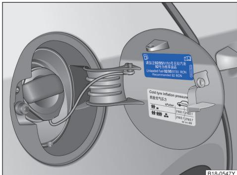  
图 163 油箱加油口盖板内侧的标签

 请首先阅读并注意引导信息和安全提示，见 ，第 185 页。

油箱加油口盖板内标有适用于本车的燃油标号。

汽油按辛烷值分级，例如:90,92,93,95 或 97 RON(RON 为“研究法辛烷值”)等，可以使用辛烷值高于本车适用值的汽油，但不会提高发动机功率和降低燃油消耗率。

## 汽油清净剂

 请首先阅读并注意引导信息和安全提示，

汽油清净剂能有效清除发动机燃油系统积碳、油泥等沉积物；提高发动机动力性、燃油经济性、怠速稳定性并改善排放。

为保证车辆性能，2.0TSI及3.0L 汽油发动机请使用95号（RON）或95号以上优质无铅汽油，其他排量发动机请使用92号（RON）或92号以上优质无铅汽油。汽油必须符合 GB 18352.5-2013 或 GB17930-2013 标准。

## ①提示

● 本车必须使用符合 GB 18352.5-2013、GB

17930-2013的规定或地方标准，且辛烷值标号正确的汽油，否则，可能严重损坏发动机及其燃油系统，还可能降低发动机功率或无法运转。

● 若紧急情况不得不使用辛烷值低于本车适用值的汽油，则发动机切不可高速大负荷运转，应以适中转速运转，否则，极易损坏发动机。应尽快添加辛烷值适用本车的汽油。

● 仅用一箱含铅汽油即可严重恶化催化转换器的净化效率，损坏催化转换器。

● 使用推荐油品可以使发动机达到最佳性能，并且降低燃油消耗，延长发动机寿命。

● 请优先使用油箱加油口盖板标签上推荐的燃油。 

上汽大众经销商提供经过验证的“上汽大众专用汽油清净剂”。

并不是所有的汽油清净剂都有效。使用不合适的汽油清净剂存在导致发动机损坏的危险。推荐使用上汽大众汽车有限公司认可的汽油清净剂

## 警告

● 汽油清净剂为化学制品，对皮肤有刺激，请放置于儿童无法接触到的地方，以避免触及皮肤。使用时请带防护手套，如不慎接触皮肤或眼睛，应立即用水清洗并及时求医。

● 汽油清净剂不可饮用，如不慎吞饮，请带上本产品立即看医生。

● 使用汽油清净剂时禁止吸烟，同时应远离火源。

## 警告（续）

● 汽油清净剂勿贮放于阳光直射处。

● 如果本产品滴落在车辆油漆表面，应立即清洗干净。

## ① 提示

● 请务必在上汽大众经销商的指导下使用汽油清净剂。

● 不得添加未经本公司认可的任何添加剂。

汽油清净剂对水生生物有害，可能对水生环境产生长期的副作用，请务必按照当地环保法规的要求妥善处理。

# 养护、清洁、维护发动机舱内在发动机舱中作业的准备工作

##  主题引言

该章节包含有关下列主题的信息：

在发动机舱中作业的准备 ..... 188
打开发动机舱盖 ..... 189
关闭发动机舱盖 ..... 190

在发动机舱中进行一切作业前，务必在一处水平而有承载能力的地面上停车。

汽车的发动机舱是一个有危险的区域⇒  。如果不熟悉必要的操作和通用的安全防护措施，如果没有正确的工作部件和工作油液以及合适的工具可用，切勿在发动机上和发动机舱内作业 ！并请将所有作业交由上汽大众经销商进行。不恰当的作业可能导致受伤。

补充信息和警告说明：

● 外观视图⇒ 第 11 页

● 车窗玻璃刮水器和清洗器⇒ 第 105 页

● 启动和关闭发动机⇒ 第 131 页

● 制动液 ⇒ 第 141 页

● 加油时检查

● 发动机机油 ⇒ 第 191 页

● 发动机冷却液 ⇒ 第 195 页

● 汽车蓄电池 ⇒ 第 198 页

● 附件、零部件更换、维修和改装 ⇒ 第 228 页

## 警告

凡汽车发动机舱均属高危区域，谨防引发伤亡事故！

● 若可见蒸汽或冷却液逸出发动机舱，则切不可打开发动机舱盖，谨防烫伤！待发动机冷却，看不到蒸汽或冷却液时方可打开舱盖。

● 务必按安全操作规程进行操作，切勿冒险！

● 发动机舱内进行诸如检查和添加油液等所有作业时均可能致伤和烫伤操作人员，甚至引发火灾。

● 不熟悉操作流程，无工具使用经验和不了解安全操作规定的人员不得在发动机舱内作业，否则，极易引发伤亡事故！若无把握，则必须由上汽大众经销商进行处理。

● 关闭发动机，拔下点火钥匙。

## 警告（续）

● 打开驻车制动器，并将换挡杆挂入空挡或将变速杆挂入挡位P。

● 儿童远离汽车。

● 在打开发动机舱盖之前，务必让发动机冷却。

● 切勿触碰处于热态的发动机部件，谨防烫伤！

● 注意切勿将车用油液溅到热态发动机及其尾气排放控制系统上，谨防引发火灾！

● 避免电气系统短路，尤其须注意跨接电缆连接点，否则，蓄电池可能爆炸！

● 切勿触碰散热器风扇，因其受温度控制，即使关闭发动机，拔下点火钥匙后风扇仍可能突然自动启动。

● 发动机处于热态时切不可打开冷却液补偿容器盖！因冷却液处于热态时冷却系统处于高压状态。

● 打开膨胀罐盖时应用一块大厚布包住膨胀罐盖，防止冷却液烫伤脸部、手和手臂。

● 切勿将诸如清洗布和工具遗忘在发动机舱内。

● 若在车下作业，则更须谨慎，应采取合适的措施防止汽车溜车或用合适的支座支撑汽车。此种情况不宜用随车千斤顶支撑汽车，谨防致伤车下操作人员！

## 警告

若不得不在发动机启动或运转时作业，则更为危险，务必时刻留意，谨防诸如传动带、发电机、散热器风扇等旋转部件和高压点火系统致伤操作人员！同时，请注意下列事项：

● 切勿触碰点火系统导线。

● 千万注意勿让首饰、宽松的服装、长发卷入发动机旋转部件，否则，可能引发致命事故！作业前务必取下首饰和领带，并包住头发，穿紧身服装。

● 踏油门踏板时务必谨慎，须检查变速箱是否已挂入某个挡位，否则，即使施加驻车制动，一旦踏油门踏板，汽车即可移动，势必引发伤亡事故！

## 警告

电气装置的高压可能导致电击、烧伤、受伤和死亡！

● 切勿让电气装置短路。否则汽车蓄电池可能爆炸。

● 为了降低触电和受伤的风险，在发动机运行或启动过程中要注意以下事项：

– 切勿触摸点火装置的电线。

– 切勿接触气体放电灯的电缆和接口。

## 警告

若须对燃油系统或电气系统进行检修，还须遵守下列安全操作规定：

● 切勿吸烟。

● 工作区域及附近无明火。

● 手头备有灭火器。

## 在发动机舱中作业的准备

请首先阅读并注意引导信息和安全提示，见 ，第 187 页。

## 核对表

在发动机舱中进行任何作业前都务必先按规定顺序进行以下操作 ⇒  ：

在一处平坦而坚实的地面上停车。

关闭发动机，拔下点火钥匙。

打开驻车制动器。

将换挡杆挂入空挡或将变速杆挂入挡位P。

待发动机冷却。

让儿童远离汽车。

打开发动机舱盖 ⇒  ，在主题引言中，见第 187 页。

请确保汽车不会意外自行移动。

## 警告

忽视这个对自身安全至关重要的核对表可能会导致受伤。

● 务必遵循核对表中的操作，并遵守通用的安全防护措施。

## ① 提示

更换或添加车用油液时切勿加错油液，必须按系统功能添加品种和规格均无误的油液，否则，将导致严重功能故障，损坏发动机！

车用油液对环境有害！故应定期检查车下地面上是否有油液斑点或污迹，若发现斑点或污

迹，则请与上汽大众经销商联系检修。

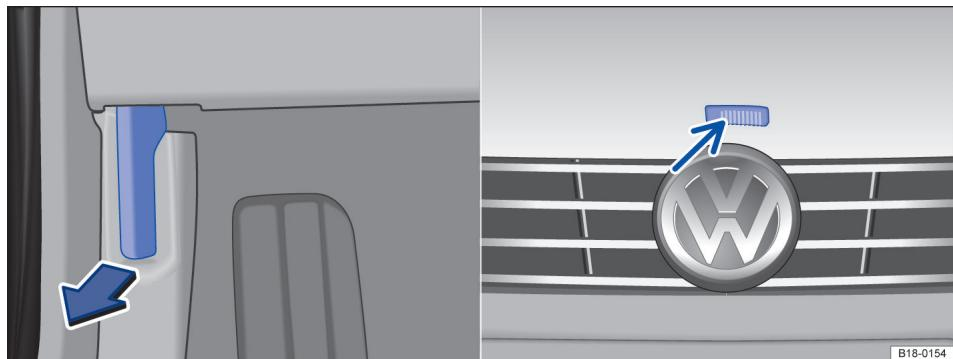  
图 164 驾驶员侧脚部空间和散热器格栅局部视图：解锁并打开发动机舱盖

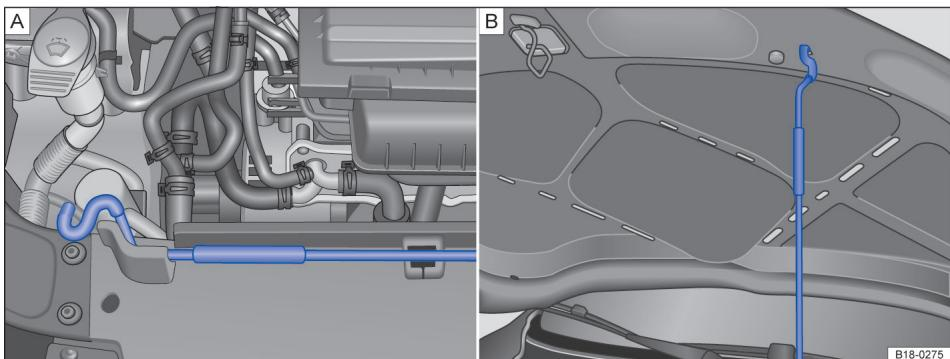  
图 165 发动机舱盖支撑杆处于安放及固定位置

 请首先阅读并注意引导信息和安全提示，见 ，第 187 页。

## 发动机舱盖可在车内开启

## 打开发动机舱盖

● 打开发动机舱盖前切勿将风窗刮水器臂抬离风窗玻璃，否则，可能损坏舱盖漆面。

● 沿图示箭头方向拉动开启手柄⇒ 图 164，舱盖在弹簧机构的作用下弹开稍许。

● 沿箭头上提开启拉手 ，抬起发动机舱盖并将其打开。⇒ 图 $1 6 4 \Rightarrow \triangle$

● 将发动机舱盖支撑杆⇒ 图 165从其固定支架上取下。

● 将发动机舱盖支撑杆挂入图示位置的开口上⇒ 图 165。

## 警告

谨防被高温冷却液烫伤！

● 若可见蒸汽或冷却液逸出发动机舱，则切不可打开发动机舱盖。待无蒸汽、烟雾或冷却液逸出发动机舱，并待发动机冷却后方可打开舱盖。

● 在发动机舱内作业前请务必仔细阅读和遵守相关安全警告说明。⇒  ，在主题引言中，见第 187 页

## 警告

未正确关闭的发动机舱盖可能在行驶过程中突然打开，从而挡住向前的视野导致事故和受伤。

● 关闭舱盖后应检查一下舱盖是否正确关好，关好后的舱盖应与邻接车身齐平。

● 关闭发动机舱盖时须确保舱盖范围内无人。

● 若行驶时发现舱盖未关严，则必须立即停车，关好舱盖，谨防引发事故！

## 提示

● 为了避免损坏发动机舱盖和车窗玻璃刮水器摆臂，只能在车窗玻璃刮水器已折叠的情况下打开发动机舱盖。

## 关闭发动机舱盖

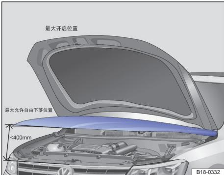  
图 166 关闭发动机舱盖

 请首先阅读并注意引导信息和安全提示，见 ，第 187 页。

## 关闭发动机舱盖

将发动机舱盖支撑杆取下压入其固定支架内。

## 提示（续）

● 开始行驶前务必将车窗玻璃刮水器摆臂重新翻回车窗玻璃上。

大 清洁发动机时，可能会有附着的油脂、机油等与清洗的液体一起流出，为避免对环境造成污染，建议由具备专业处理能力的经销商或维修站进行处理。

● 将发动机舱盖下降至距离舱盖锁扣板约400mm位置。

● 松手使发动机舱盖自行下落至锁紧装置中，-不要用力按压！

● 用手轻抬发动机舱盖检查是否完全锁止。

如果发现发动机舱盖未完全关闭，请将发动机舱盖重新打开并按上述方法再次操作，直至确认完全关闭。

## 警告

未正确关闭的发动机舱盖可能在行驶过程中突然打开，从而挡住向前的视野导致事故和受伤。

● 关闭舱盖后应检查一下舱盖是否正确关好，关好后的舱盖应与邻接车身齐平。

● 关闭发动机舱盖时须确保舱盖范围内无人。

● 若行驶时发现舱盖未关严，则必须立即停车，关好舱盖，谨防引发事故！

## 发动机机油

##  主题引言

该章节包含有关下列主题的信息：

警告灯和指示灯 191
发动机机油规范 191
检查机油的液面高度 192
补充发动机机油 193
更换发动机机油 193

## 补充信息和警告说明：

● 在发动机舱中作业的准备工作 ⇒ 第 187 页

● 附件、零部件更换、维修和改装 ⇒ 第 228 页

## 警告

不恰当地处理发动机机油可能导致严重烫伤和伤害。

● 仅在具有必须的专业知识情况下，才可自行更换发动机机油！

● 每次在发动机舱中进行作业之前，请阅读并遵守警告说明。

## 警告（续）

● 处理发动机机油时务必佩戴防护眼镜。

● 发动机机油在发动机运转时会变得特别热，可能严重烫伤皮肤。务必让发动机冷却。

● 发动机机油有毒，必须保存在儿童的接触范围之外。

● 发动机机油只可保存在封闭的原装容器中。此规定也适用于废弃处理之前的废机油。

● 切勿用空食品盒、瓶子和其它容器保存发动机机油，否则可能会误导他人喝下其中的发动机机油。

● 经常接触发动机机油可能损伤皮肤。务必用清水和肥皂彻底清洗沾有发动机机油的皮肤。

● 在任何情况下都不允许将废弃机油直接排入下水道或留存在地面上。

● 由于更换机油需要必备的专用设备和专业知识，更换发动机机油和机油滤清器请在上汽大众经销商处进行。

## 警告灯和指示灯

请首先阅读并注意引导信息和安全提示，见 ，第 191 页。

<table><tr><td>闪烁</td><td>可能的原因</td><td>解决措施</td></tr><tr><td></td><td>发动机机油压力过低。</td><td>不要继续行驶!关闭发动机。检查发动机机油油位。- 如果尽管发动机机油油位正常,但警告灯闪烁,不要继续行驶或让发动机运转。否则会损坏发动机。请让专业人员处理。</td></tr></table>

## 警告

忽视亮起的警告灯和文字信息会导致在道路交通中抛锚，引起事故和受伤。

## 警告（续）

● 切勿忽视亮起的警告灯和文字信息。

● 一旦道路情况允许且安全，就立即停车。

## ① 提示

忽视亮起的指示灯和文字信息可能导致汽车损坏。

## 发动机机油规范

请首先阅读并注意引导信息和安全提示，见 ，第 191 页。

发动机机油的加注必须严格遵守上汽大众的规范要求。

出厂时发动机已加注了一种优质多粘度级的机油。除了极端气候，这种机油可以全年使用。

当然，发动机机油也在不断地开发和改进中，因此本使用维护说明书中的说明仅适用于说明书交付印刷时的状态。

上汽大众经销商为您提供经上汽大众认可的机油产品，为您的爱车提供持久的保护。

上汽大众汽车有限公司会及时通知上汽大众经销商最新更改信息。因此我们建议您前往上汽大众经销商处为您的爱车更换发动机机油。

## 适用于您车辆的机油规范

<table><tr><td>发动机类型</td><td>机油规范</td></tr><tr><td>1.6L汽油发动机1.2TSI汽油发动机1.4TSI汽油发动机</td><td>VW 50200(或兼容VW 50200的更高VW标准)</td></tr></table>

请使用由上汽大众经销商提供的、经上汽大众认可的机油产品，购买机油时必须核对包装容器上注明的机油规范。

## 检查机油的液面高度

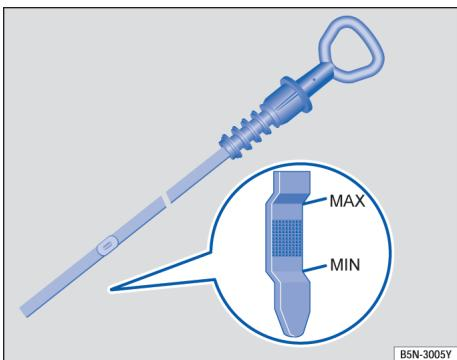  
图 167 带液位标记的机油标尺

  
 请首先阅读并注意引导信息和安全提示，见 ，第 191 页。

## 机油标尺指示发动机机油液位。

检查机油液位高度

\- 将车停放在水平地面。

\- 关闭发动机。

\- 打开发动机舱盖。

## 机油特性

上汽大众认可的机油产品具有如下的特点：

● 在各种室外温度下可全年使用

● 良好的清洁能力

● 在各种发动机温度和负载工况下良好的润滑能力

● 良好的抗老化能力

● 减少发动机磨损

● 良好的低温启动能力

## 小心

发动机机油仅可添加由上汽大众经销商提供的经认可的添加剂产品。注意！不得使用未经本公司认可的任何添加剂。这些添加剂所造成的损伤不在质量担保范围内。

## ①提示

我们建议，在长距离行驶前为您的汽车购买相应规格的发动机机油并随车携带。这样您随时可添加合适的发动机机油。

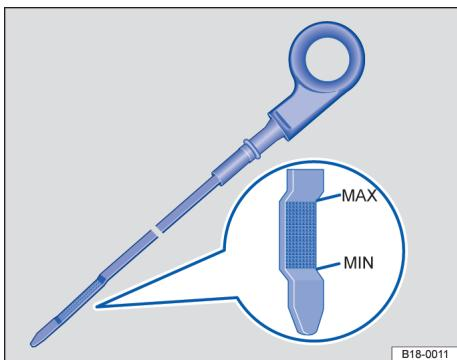  
图 168 带液位标记的机油标尺

\- 等待几分钟后拉出机油标尺。

\- 用一块干净的布擦净机油标尺，然后把机油标尺重新插入到底。

\- 再次抽出机油标尺，读出机油液面位置。

发动机消耗机油是正常的。根据驾驶方法以及车辆运行状况而不同，机油消耗量可能会达到0.5L/1000km。最初5000km内的机油消耗量可能稍高。因此，必须定期检查机油液面的高度，最好在每次加油和长途行车前检查机油液面高度，必要时进行补充。

“MAX”（机油标尺上拐点）标示的是机油液面高度的上限。⇒ 图 167 或⇒ 图 168

“MIN”（机油标尺下拐点）标示的是机油液面高度的下限。⇒ 图 167 或⇒ 图 168

加注时必须注意机油液面高度，既不能超出“MAX”上限也不能低于“MIN”下限。建议加注至两个标示中间偏上的位置。

## 小心

● 机油液位不得超过“MAX”上限，否则废气净化装置有损坏的危险。

## 补充发动机机油

 请首先阅读并注意引导信息和安全提示，见 ，第 191 页。

– 检查发动机机油液位。⇒ 第 192 页

– 拧开发动机机油加注口的盖子。

– 以小份额补充合适的发动机机油。⇒ 第 191 页

– 检查发动机机油液位。⇒ 第 191 页

– 小心地拧紧加注口的盖子，并把机油标尺向下插到底，否则发动机运转时机油可能溢出。

## 更换发动机机油

 请首先阅读并注意引导信息和安全提示，见 ，第 191 页。

必须在维修保养周期规定的时间内，更换发动机机油。

对于使用条件比较恶劣的车辆，特别是经常停车/启动、发动机长时间怠速运转（如出租车）以及常在低温或高原环境下使用的车辆，应该常检查机油液面，建议每5000公里更换机油和机油滤清器。

## 警告

● 仅在具有必须的专业知识情况下，才可自行更换发动机机油！

## 小心（续）

● 在某些条件下如果无法添加合适的发动机机油，请不要继续行驶。关闭发动机并联系上汽大众经销商寻求专业支持。

● 由于高原行车时车辆的运行条件比较恶劣，发动机工作温度升高，机油粘度变小，容易造成机油消耗增加。因此，长期在高原环境下行驶的车辆，建议每5000公里检查发动机机油。

● 对于使用条件比较恶劣的车辆，特别是经常停车/启动、发动机长时间怠速运转（如出租车）以及常在低温或高原环境下使用的车辆，应经常检查机油液面，建议每5000公里更换机油和机油滤清器。

## 提示

机油规范。⇒ 第 191 页

## 小心

● 在补充机油时，机油不要滴落到灼热的发动机零部件上——有燃烧的危险！

● 在发动机舱内进行工作前，请仔细阅读在发动机舱中作业的警告说明。

机油液位不得超过“MAX”上限。否则机油会被通过曲轴箱的通风孔吸入，并可能通过废气排放装置进入大气。机油可能在废气净化装置中燃烧并损坏废气净化装置。⇒ 第 191 页

## 警告（续）

● 每次在发动机舱中进行作业之前，请阅读并遵守警告说明。

● 更换发动机机油前先让发动机充分冷却，热机油有烫伤的危险。

● 要佩带防护眼镜，否则洒出的机油可能会对眼睛造成伤害。

● 为了放出机油，请您使用一个足够大的容器，以便容纳废弃机油。

● 当您用手旋出放油螺栓时，手臂要保持水平，以使流出的机油不会顺着您的手臂往下流。

● 机油有毒！废机油在按规定回收之前要妥善保存，以确保儿童和未经许可的人员无法触及。

● 在任何情况下都不允许将废弃机油直接排入下水道或留存在地面上。 入下水道或留存在地面上。

● 由于更换机油需要必备的专用设备和专业知识，更换发动机机油和机油滤清器请在上汽大众经销商处进行。

i ● 如果您的皮肤碰触过机油，必须彻底清洗干净。

## 发动机冷却液

##  主题引言

该章节包含有关下列主题的信息：

冷却液温度/液位警告灯  . . . . . 195

发动机冷却液规格 . . . . . . 196

检查冷却液液位和加注冷却液 . . . . . . 196

如果不熟悉必要的操作并且没有合适的工具以及正确的工零作部件和油液，切勿在发动机冷却系统上进行作业 ⇒  ！请将所有作业交由上汽大众经销商进行。

不恰当的作业可能导致受伤。

补充信息和警告说明：

● 牵引启动和牵引⇒ 第 256 页

● 在发动机舱中作业的准备工作 ⇒ 第 187 页

● 附件、零部件更换、维修和改装 ⇒ 第 228 页

## 警告

在发动机舱内作业时务必格外谨慎！

## 警告（续）

● 在发动机舱内作业时务必遵守相关安全警告说明⇒ 第 187 页。

● 发动机达到暖态或热态时冷却液系统处于高压状态！此时切不可拧开膨胀罐盖，否则，可能被高温蒸汽烫伤。

## 警告

发动机冷却液有毒！

● 发动机冷却液只可装在封闭的原装容器中保存在安全的地方。

● 切勿使用空食品盒、瓶子或其他容器盛放发动机冷却液，否则可能有人饮用其中装着的发动机冷却液。

● 发动机冷却液要保存在儿童的接触范围之外。

● 确保根据汽车运行时的最低预期环境温度规定正确的冷却液添加剂的比例。

冷却液和冷却液添加剂可能污染环境。请收集流出的油液，按环保要求专业地废弃处理。

## 冷却液温度/液位警告灯 

请首先阅读并注意引导信息和安全提示，见 ，第 195 页。

冷却液温度过高或液位偏低时该警告灯将亮起。

若警告灯出现下列情况，表明系统存在故障：

● 打开点火开关后该警告灯亮数秒钟后不熄灭。

● 行驶中该警告灯亮起或闪亮，同时系统发出警告

## 。⇒

上述情况表明冷却液液位偏低或温度过高。

## 冷却液温度过高

首先观察冷却液温度表的温度计数，若冷却液温度过高，应立即停车，关闭发动机，检查冷却液液位

## 。⇒

若冷却液液位正常，系统过热可能是散热器风扇故障导致的，请联系上汽大众经销商检修。

若短距离行驶后警告灯再次亮起，则必须立即停车，关闭发动机，与上汽大众经销商联系检修。

## 冷却液液位偏低

首先观察冷却液温度表的温度读数，若处于正常范围内，则尽早添加冷却液。⇒

## 警告

忽视亮起的警告灯和文字信息会导致在道路交通中抛锚，引起事故和受伤。

● 务必注意亮起的警告灯和文字信息。

● 切勿忽视亮起的警告灯和文字信息。

● 一旦道路条件允许且安全，就立即停车。

## 警告

在发动机舱内作业时务必格外谨慎！

● 汽车发动机舱属高危区域！打开发动机舱盖前请仔细阅读和遵守相关安全警告说明，“发动机舱内安全作业注意事项”。

● 若汽车因技术原因停车，应将汽车停驻在远离主车道的安全场所，关闭发动机，打开危险警告灯。

● 若可见蒸汽或冷却液逸出发动机舱，则切不可打开发动机舱盖，谨防烫伤。直至无蒸汽或冷却液逸出时方可打开发动机舱盖。

## ⑨ 提示

忽视亮起的指示灯和文字信息可能导致汽车损坏。 

## 发动机冷却液规格

 请首先阅读并注意引导信息和安全提示，见 ，第 195 页。

上汽大众在冷却系统内已经加入了一种长效冷却液。

新车所加注的冷却液不仅可以在低温环境中提供防冻保护，而且保护冷却系统中的所有轻合金零部件防止腐蚀，除此之外还可以防止沉积物并显著提高冷却液沸点。因此，冷却液的浓度即使在温暖季节或地区也不可以因为补水而降低。

如果由于气候原因，需要更强的防冻保护，请联系上汽大众经销商选择防冻能力更强的原装冷却液。

其它冷却添加剂可能会明显损害防腐作用。由此而产生的腐蚀损伤可能导致冷却液损失，结果导致严重的发动机故障。

## 警告

冷却液添加剂属有毒物质！

● 冷却液添加剂必须存放在原装容器内，勿让儿童接触！放出的废冷却液也应按此处理。

## 检查冷却液液位和加注冷却液

## 警告（续）

图 169 冷却液补偿容器上的液位标记  
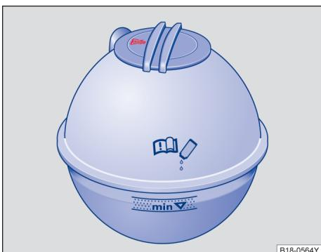

● 切勿将冷却液存放在空食品容器、瓶或任何非原装机油容器内，否则，可能将冷却液误认作食品，导致中毒事故！

● 严寒气候条件下为确保冷却液防冻能力，应根据环境温度加入规定浓度的冷却液，否则，冷却液可能冻结，导致汽车抛锚，同时，采暖系统不工作，致使驾乘人员暴露在严寒之中，有受伤的风险。

## ①提示

冷却液中不得加入任何其它类型的添加剂，否则，将大大降低其防腐能力，导致冷却液系统腐蚀，冷却液流失，严重损坏发动机！

冷却液和冷却液添加剂应收集并按规定处理。

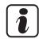

i ● 上汽大众经销商为您提供按严格要求配置的原装冷却液溶液，在通常情况下，您可以直接将其添加到冷却系统中。

● 任何情况下原装冷却液不能同其它冷却液添加剂混合。

● 在这种情况下必须立刻更换冷却液！

● 你可以根据红颜色识别出补偿容器中的冷却液。如果补偿容器中的液体颜色发生变化，说明冷却液同其它冷却液添加剂混合了！

● 否则会出现严重的功能故障或发动机故障！ 

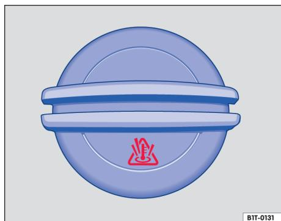  
图 170 冷却液补偿容器盖

##  请首先阅读并注意引导信息和安全提示，见 ，第 195 页。

冷却液液位是否正常对发动机冷却系统的正常工作极其重要。

如果发动机冷却液液位过低，发动机冷却液警告灯会亮起。

## 准备工作

● 将汽车停放在水平而坚实的地面上。

● 让发动机冷却 ⇒  。

● 打开发动机舱盖  ⇒ 第 187 页。

● 发动机冷却液补偿罐可通过盖子上的符号  识别。

## 检查发动机冷却液液位

● 发动机处于冷态时检查冷却液液位是否处在膨胀罐侧面的标记范围内⇒ 图 169。

● 若液位低于 “min” 标记，则须立即添加冷却液。

打开冷却液补偿容器盖。

● 关闭发动机，待其冷却。

● 为防烫伤，用厚布包住膨胀罐盖⇒ 图 170，然后慢慢拧下膨胀罐盖⇒  。

## 添加发动机冷却液

● 务必将一块合适的抹布置于补偿罐的盖子上，防止面部、双手和双臂受热的发动机冷却液或蒸气伤害。

● 将此盖子小心地拧下 ⇒  。

● 只可添加符合上汽大众规格⇒ 第 196 页的原装冷却液 ⇒  。

● 发动机冷却液液位必须在补偿罐的标记范围内。不得添加超过标记区域的上边缘 ⇒  ！

● 牢固拧紧盖子。

● 如果在紧急情况下没有符合要求的规格（⇒ 第 196 页）的发动机冷却液，不要使用其它发动机冷却液添加剂！而暂时只添加蒸馏水 ⇒  。然后用规定的发动机冷却液添加剂尽快恢复正确的混合比 ⇒ 第 196 页。

## 警告

在发动机舱内作业时务必格外谨慎！

● 在发动机舱内作业时务必遵守相关安全警告说明 ⇒ 第 187 页。

● 发动机达到暖态或热态时冷却液系统处于高压状态！此时切不可拧开膨胀罐盖，否则，可能被高温蒸汽烫伤。

## ① 提示

● 添加时只可使用蒸馏水！所有其它类型的水由于含有的化学成分可能在发动机中导致显著的锈蚀损坏。也可能导致发动机失灵。如果未添加蒸馏水而添加了其它水，要尽快请上汽大众经销商完全更换发动机冷却系统中的液体。

● 发动机冷却液只可添加至标记区域的上边缘。否则多余的发动机冷却液在受热时会被从发动机冷却系统中挤出，并可能导致损坏。

● 在发动机冷却液损失较多时，只可在发动机完全时加注发动机冷却液。冷却液损失较多的原因是发动机冷却系统泄漏。应立即让上汽大众经销商检测发动机冷却系统。否则会导致发动机损坏！

● 在添加油液时要确保往正确的容器中加注。如果使用错误的油液，可能导致严重的功能缺陷和发动机损坏！

## 汽车蓄电池

##  主题引言

该章节包含有关下列主题的信息：

<table><tr><td>充电警告灯</td><td>198</td></tr><tr><td>检查汽车蓄电池的电解液液位</td><td>199</td></tr><tr><td>蓄电池充电和更换蓄电池</td><td>200</td></tr></table>

汽车蓄电池是车内电气装置的组成部分。

如果不熟悉必要的操作和通用的安全防护措施并且没有合适的工具，切勿在电气装置上进行作业

⇒  ！请将所有作业交由上汽大众经销商进行。不恰当的作业可能导致受伤。

## 汽车蓄电池上的警告说明的解释

<table><tr><td>符号</td><td>含义</td></tr><tr><td></td><td>佩戴护目镜!</td></tr><tr><td></td><td>蓄电池电解液属强腐蚀性有毒物质,操作时必须佩戴防护手套和护目镜。</td></tr><tr><td>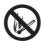</td><td>禁止工作场所有明火、火源、火花和吸烟!</td></tr><tr><td></td><td>充电时蓄电池产生易燃易爆气体!</td></tr><tr><td>[4Y37]</td><td>儿童必须远离电解液和蓄电池!</td></tr></table>

## 补充信息和警告说明：

● 应急启动 ⇒ 第 254 页

● 在发动机舱中作业的准备工作 ⇒ 第 187 页

● 附件、零部件更换、维修和改装 ⇒ 第 228 页

## 警告

对蓄电池和电气系统进行作业时务必充分了解其危险性，操作不当可能引发事故、火灾及化学灼伤，故作业前务必阅读和遵守下列安全警告说明：

● 对电气系统作业前必须关闭发动机、点火开关及所有用电设备，断开蓄电池负极电缆。更换灯泡时仅需关闭相应灯光开关即可。

## 充电警告灯

请首先阅读并注意引导信息和安全提示，见 ，第 198 页。

## 警告（续）

● 必须让儿童远离蓄电池和电解液！

● 操作时务必佩戴护目镜！防止酸液和含铅颗粒溅到眼睛、皮肤和衣服上。

● 蓄电池电解液属强腐蚀性有毒物质，操作时务必戴护目镜和防护手套；切勿倾斜蓄电池，否则，电解液可能从排气孔中溅出；万一电解液溅入眼睛，须用清水冲洗数分钟，然后尽快就医诊治；洒到皮肤或衣服上的酸液可用肥皂液中和，并用清水彻底冲洗；若误饮了电解液，则必须立即就医诊治。

● 禁止工作场所及周围有明火、火花、无外罩电灯和吸烟！操作电气系统及电缆时必须注意防止产生电火花和静电；注意切勿使蓄电池接线柱短路，否则，短路产生的高能电火花可能致伤操作人员。

● 充电时蓄电池产生易燃易爆气体！故充电场所必须通风良好。

● 将蓄电池与整车电气系统断开时必须先拆负极电缆，然后方可拆正极电缆。

● 请注意电源的极性，上电前必须检查电源极性的匹配情况。

● 每次通电时间不得小于5秒，避免频繁快速通断操作。

● 连接蓄电池前必须关闭所有用电设备，且须先接正极电缆，后接负极电缆；切勿接错电缆极性，否则，可能引发火灾！

● 切不可对结冰的蓄电池或刚解冻的蓄电池进行充电，否则，可能导致蓄电池爆炸和化学灼伤，结冰的蓄电池必须更换！注意，无电蓄电池在 结冰的蓄电池必须更换！注意，无电蓄电池在

0°C左右时即可结冰。

● 切勿使用损坏的蓄电池，否则，可能导致蓄电池爆炸！因此，损坏的蓄电池必须及时更换。

## ①提示

● 打开点火开关，发动机处于运转状态时切不可断开蓄电池！否则，可能损坏电气系统或电子部件。

● 切勿让蓄电池长时间处在阳光直射下，因强紫外线可损坏蓄电池壳体。

● 若在低温条件下汽车长期停放不用，应采取适当措施保护蓄电池，防止其因 “结冰” 损坏。

打开点火开关时警告灯  亮起，发动机启动运转时该警告灯应熄灭

行驶时若警告灯  亮起，表明发电机不再对蓄电池充电，遇此情况，应尽快驾车到就近的上汽大众经销商处检修电气系统。

途中若无绝对需要，尽可能不要使用电气设备，否则，蓄电池将快速放电。

此外，显示屏可能显示相关文本信息，提示或警告驾驶员需立即执行相关操作。

## 检查汽车蓄电池的电解液液位

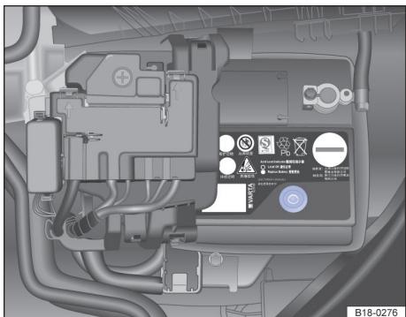  
图 171 蓄电池  
 请首先阅读并注意引导信息和安全提示，见 ，第 198 页。

高里程汽车或在炎热地区行驶或蓄电池使用时间过长，则应定期检查电解液液位。

## 准备工作

● 为在发动机舱中作业准备好汽车 ⇒ 第 187 页。

● 打开发动机舱盖 ⇒ 第 187 页。

## 检查蓄电池电解液液位

● 为能清楚识别颜色，要确保足够的照明。切勿用明火或闪烁着火星的物品作为照明。

● 汽车蓄电池上侧的圆形视窗根据电解液液位变换颜色显示。

若属下列使用条件或状况，则应定期检查电解液液位：

● 高里程汽车。

● 在炎热地区行驶。

● 蓄电池过于老旧。

在其它使用条件下蓄电池可免维护。

蓄电池顶部的圆形窗口内的颜色随充电量和电解液液位而变。

## 警告

忽视亮起的警告灯和文字信息会导致在道路交通中抛锚，引起事故和受伤。

● 切勿忽视亮起的警告灯和文字信息。

● 一旦道路条件允许且安全，就立即停车。

## ① 提示

忽视亮起的指示灯和文字信息可能导致汽车损坏。 

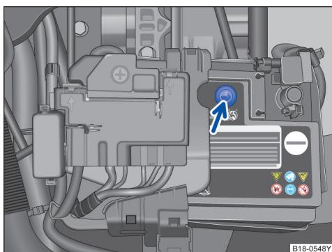  
图 172 蓄电池(部分车型)  
若电眼呈黑色，表明蓄电池正常。

若电眼呈白色，表明电解液液位偏低，应尽快到上 汽大众经销商处更换蓄电池。

对于不带电眼的蓄电池，请按照保养要求，定期前往上汽大众经销商处检查。

## 警告

在汽车蓄电池上作业可能导致严重的酸液灼伤、爆炸或触电。

● 务必佩戴防护眼镜和防护手套。

● 蓄电池电解液有很强的侵蚀性。它可能灼伤皮肤和使眼睛失明。在处理蓄电池时尤其要防止双手、双臂和面部被溅出的电解液伤害。

● 切勿翻倒汽车蓄电池。电解液可能从排气孔中流出，从而导致酸液灼伤。

● 切勿打开汽车蓄电池。

● 在电解液溅到皮肤上或眼睛内时，要立即用冷水冲洗相关部位数分钟。然后要立即就医。

● 在误吞下电解液时要立即就医。

## 警告

● 切勿强行打开蓄电池，否则，可能导致蓄电池爆炸和化学灼伤。

## 蓄电池充电和更换蓄电池

请首先阅读并注意引导信息和安全提示，见 ，第 198 页。

对蓄电池的所有操作均需具备必要的专业知识。

若汽车经常短途行驶或长期停放不用，则应在规定的保养周期之间增加检查蓄电池的次数。

若蓄电池损坏，蓄电池电流不足，从而导致汽车起步困难，若遇此情况，请尽快到上汽大众经销商处充电或更换蓄电池。

## 蓄电池充电

因蓄电池充电须具备相关专业知识，并须在可控环境内进行充电，故建议由上汽大众经销商对蓄电池进行充电。

## 用电设备自动关闭功能

本车智能化电气系统可在蓄电池负荷过高时自动采取下列相应措施防止蓄电池快速放电。

● 提高怠速转速，增加发电机发电量。

● 若仍不足以解决问题，则减少方便用电设备（例如，电动门窗或后风窗加热器）的供电量，或干脆关闭这些设备，降低蓄电池的负荷。

● 发动机启动期间暂时中断12 V插座和点烟器的供电。

本车虽配备智能化电气系统管理功能，但若发动机熄火后点火开关仍长时间处于打开状态或驻车后侧小灯或驻车灯长时间处于打开状态，蓄电池仍可能快速放电。

## 喷油嘴

## TSI汽油直喷发动机的高压喷油嘴

凭借缸内直喷技术并辅以涡轮增压技术，TSI发动机在功率、扭矩、油耗以及排放方面展现了优越的技术性能。

## 警告（续）

● 切勿将损坏或渗漏的蓄电池连接到车上，必须妥善处理损坏或渗漏的蓄电池。

● 对蓄电池作业前务必仔细阅读和遵守相关警告说明。⇒  ，在主题引言中，见第 198 页

## 更换蓄电池

本车蓄电池安装位置经过严格的设计布置，并具有特殊的安全性。

上汽大众原装蓄电池符合汽车维护保养及安全性相关规定。

## 因事故触发安全气囊后蓄电池自动切断功能

蓄电池位于行李厢内的汽车，一旦发生事故，触发安全气囊时，蓄电池和启动机之间的电气连接立即自动切断，防止电气系统发生短路故障。

## 警告

● 在对蓄电池进行所有作业之前，请阅读和遵守有关的警告说明。⇒  ，在主题引言中，见第 198 页

## ①提示

为避免汽车电气装置发生损坏，切勿将诸如太阳能电池板或汽车蓄电池充电器的附件连接在12V插座或点烟器上。

蓄电池含有有毒物质，如硫酸和铅。因此，废蓄电池必须按照规定回收，不得作为生活垃圾处理！

TSI汽油直喷发动机高压喷嘴采用多孔喷油嘴设计，相对于传统喷油嘴而言，TSI发动机的喷油嘴能提供更高的喷油压力，更加均匀的雾化效果，提高了燃油的燃烧效率和燃油经济性。

TSI汽油直喷发动机高压喷油嘴要求使用低硫高品质的燃油，为此，请务必确保在正规的加油站加注符合标准的优质燃油，否则将直接影响高压喷油嘴的正常工作，并影响发动机性能。

## 火花塞

## 火花塞说明

火花塞应在上汽大众所制定的汽车维护保养规定周 期内更换。

火花塞与点火系统以及发动机是经过匹配的，对降低排气中的有害物质是有利的。为了避免废气排放超标或不抗干扰的火花塞造成的工作故障、发动机损坏和运行故障，应该使用上汽大众指定的原装火花塞。因为原装火花塞都经过严格的匹配和测试，电极的数量、间隙、热值以及抗无线电干扰功能。

## 前后悬架系统和转向系统

## 前后悬架系统和转向系统（一般说明）

建议按照《保养手册》的要求，定期到上汽大众经销商处检查前后悬架和转向系统，包括各类橡胶件，密封件，易损件等，如出现损坏，请及时进行维修和更换。

## 燃油胶管

## 燃油胶管（更换周期）

燃油（燃气）胶管的合理更换周期：15 年 或240,000 公里（适用于橡胶燃油管以及尼龙燃油管）。

## ①提示

高压喷油嘴的定期检查及清洗对改善发动机工作状况、提高功率、降低排放及油耗、延长各部件的使用寿命具有极为关键的作用。因此，请定期到上汽大众经销商对车辆进行保养和检查，必要时清洗或更换喷油嘴。

由于技术上的原因，火花塞型号有可能会变化，因此建议仅使用由上汽大众经销商所提供的原装火花塞。

## ⑨提示

如果加注了不符合品质要求的汽油，将会使火花塞过早失效。

## 汽车保养

## 本公司服务体系简介

秉承“售后服务先行”的发展战略，上汽大众汽车有限公司多年来在服务网络建设、服务组织标准化管理、客户服务等各方面不断创新。我们拥有完善的服务体系、严谨的服务标准、丰富的服务产品、高效的售后服务组织。在中国我们拥有1000余家大众品牌特许销售商/特约维修站、为全国广大上汽大众客户提供售后服务。

在聚焦客户需求的基础上，我们始终践行

“Techcare”售后服务品牌的理念，将“匠心•挚诚”的品牌精神贯穿于售后服务全过程，为每一个客户提供优质的售后服务。

## 保养的重要性

本章节告诉您什么时候需进行哪种保养。由于不同车型要执行的保养范围有所不同，因此可到上汽大众经销商处询问汽车具体所需的保养。

上汽大众经销商时刻准备为您服务！

安全注意事项：

诸如轮胎、发动机机油、火花塞和蓄电池等所有车用油液和易损件均在不断开发更新之中。建议由本公司特许经销商更换车用油液和易损件，因本公司特许经销商掌握车用油液和易损件的最新发展动态。为使您的汽车始终保持良好的状态，建议到本公司特许经销商处更换车用油液和易损件。

## 警告

保养不充分或未进行保养以及忽视保养周期可能会导致在道路交通中抛锚，引起交通事故和重伤。

● 务必按《使用维护说明书》的规定定期保养汽车。

## 汽车保养一般说明

如何确定本车何时须进行保养？

●组合仪表以及信息娱乐系统可显示车辆的保养周期⇒ 手册使用维护说明书。

## 车辆使用条件的相关说明

保养周期是根据汽车的正常行驶条件制定的，如在恶劣条件下使用汽车，则需在常规保养之间增加若干保养项目的保养次数，或缩短保养周期。

同时依靠客户服务中心构建起高效率的用户接触平台，让我们能倾听每一个用户的声音，如果您有问题、建议和意见，可及时联系我们。

上汽大众客户服务热线：400-820-111

## 警告（续）

● 务必按本车使用维护说明书的说明使用汽车。

## ① 提示

务必按系统功能添加品种及规格均正确的车用油液！注意切勿加错车用油液，否则，势必引发功能故障，损坏发动机！

## ① 提示

使用了不符合标准或规定要求的油料或燃料、以非法方式使用、使用不当或滥用（如用于货运，用作赛车、试验用车等）所造成的损坏、损失也不属于质量担保范围，即使在质量担保期内。

大 泄漏的车用油液对环境有污染。必须及时清除泄漏的车用油液，并按环境保护法规正确收集和处理废弃的车用油液。

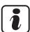

i 正确保养汽车不仅可使汽车保持良好的状态，《使用维护说明书》的规定按时保养汽车。

以下情况属于恶劣条件：

● 使用含硫燃油

● 经常短途行驶

● 发动机长时间怠速运转（如出租车）

● 在高尘地区或环境下行驶

● 走走停停为主的行驶模式（如市区行车）

● 长时间在寒冷气候下行驶，等在恶劣条件下使用汽车，需增加下列部件的保养频次：

● 灰尘及花粉过滤器

● 空气滤清器

● 发动机机油

● 发动机机滤

● 齿形皮带

● 活动天窗等

下述章节列出了基础保养和专业保养，所列保养项目仅适用于本书印刷时的车辆技术状态。基于技术升级等原因，本公司可能会对保养项目作相应修订，本公司特许经销商将会告知您需实施的保养项目。

车辆保养的费用取决于汽车车型及装备，上汽大众经销商会告知您实际所需的保养工时费和材料费。

## 保养范围

上汽大众经销商的服务人员将根据您的汽车使用条件建议您保养频次及保养项目（例如检查照明或制动装置），以保证汽车的使用安全性和交通安全性。

## 保养周期

<table><tr><td colspan="2">保养类型</td><td>保养周期</td></tr><tr><td rowspan="2">基础保养</td><td>首次保养</td><td>自购车之日起 1 年内(以购车发票为准),首次行驶里程达 5000 公里</td></tr><tr><td>常规保养</td><td>车辆行驶到 10000 公里或首保后 1 年以及后续每 10000 公里或每 1 年定期保养</td></tr><tr><td>专业保养</td><td colspan="2">详情请参见⇒第 204 页。</td></tr></table>

## 更换制动液：

非出租 / 非营运车辆：首次3年，以后每 2 年；出租 / 营运车辆：每 50000 公里 / 2 年⇒  。

发动机机油规格⇒ 手册使用维护说明书

## 警告

若制动液使用时间过长，频繁制动时可能使制动系统内产生气阻，严重恶化制动效果和行驶安全性。

## 警告

● 必须使用上汽大众原装制动液，且必须使用新的制动液。

● 必须按规定时间进行制动液更换，否则，可能引发事故！

保养项目

<table><tr><td>基础保养</td><td>项目</td><td colspan="2">周期</td></tr><tr><td rowspan="2">换油服务</td><td>发动机机油:更换。如拆卸油底壳螺栓,必须按照要求更换放油螺栓和垫片</td><td rowspan="24">首次保养:5000公里/6个月</td><td rowspan="34">常规保养:10000公里/首保后6个月以及后续每10000公里/每1年</td></tr><tr><td>发动机机油滤芯:更换</td></tr><tr><td rowspan="32">检测服务</td><td>喇叭:检查功能</td></tr><tr><td>顶篷内灯、行李箱灯:检查功能</td></tr><tr><td>行车安全灯:检查近光灯、远光灯、转向灯、雾灯、警示灯功能、倒车灯、车牌灯、制动灯、驻车灯、弯道行车灯功能、辅助行车灯功能</td></tr><tr><td>自诊断:用专用VAS诊断设备读取并清除控制器故障信息</td></tr><tr><td>TSI发动机燃油喷嘴检查:用专用VAS诊断设备读取发动机测量值,与标准值进行比较,超差时请按规定清洗或更换</td></tr><tr><td>前风窗玻璃雨水槽:清洁</td></tr><tr><td>冷却系统:检查冷却液液位和冰点,必要时补充原装冷却液</td></tr><tr><td>风窗清洗液:检查冰点,如有必要进行添加</td></tr><tr><td>制动液液位:检查,必要时补充</td></tr><tr><td>助力转向液液位:检查,必要时补充(仅适用于EA111 1.4T车型)</td></tr><tr><td>空气滤清器:清洁罩壳和滤芯</td></tr><tr><td>蓄电池:使用专用检测仪检测蓄电池状况,检查正、负极连接状态</td></tr><tr><td>发动机及发动机舱内部件:检查是否泄漏和损坏</td></tr><tr><td>变速箱/传动轴护套:检查是否泄漏和损坏,连接是否牢固</td></tr><tr><td>主销球头防尘套、下摆臂轴承、连接杆及稳定杆支座:检查是否损坏</td></tr><tr><td>转向横拉杆球头:检查间隙及防尘套,连接是否牢固</td></tr><tr><td>制动系统:检查制动液管路、制动系统零部件是否泄漏和损坏</td></tr><tr><td>排气系统:检查是否泄漏、固定是否牢靠、是否有损坏情况</td></tr><tr><td>车身底部:检查底部管路是否干涉、底部饰板、闷盖及保护层是否损坏</td></tr><tr><td>前后部螺旋弹簧、前部防尘罩和后部止动缓冲器:检查是否损坏</td></tr><tr><td>轮胎/轮毂(包括备胎):检查轮胎磨损情况,必要时进行轮胎换位,同时校正轮胎气压(若配备胎压报警功能,在校正轮胎气压后,必须进行标定)</td></tr><tr><td>车轮固定螺栓:检查并按规定扭矩紧固</td></tr><tr><td>安全气囊和安全带:检查外表是否受损,检查安全带功能</td><td rowspan="10"></td></tr><tr><td>楔形皮带:检查,必要时更换</td></tr><tr><td>助力转向皮带:检查,必要时更换(仅适用于EA111 1.4T车型)</td></tr><tr><td>雨刮器/清洗装置:检查雨刮片止位、雨刮和清洗装置功能,必要时调整;检查并清洁雨刮片,必要时更换</td></tr><tr><td>发动机舱盖锁扣:润滑</td></tr><tr><td>车门限位器:润滑</td></tr><tr><td>制动摩擦片厚度、制动盘状态:检查,必要时更换</td></tr><tr><td>前大灯:检查灯光照射位置,必要时调整(如果配备大灯清洗装置,请检查其功能)</td></tr><tr><td>保养周期显示器:复位</td></tr><tr><td>试车:性能检查</td></tr></table>

保养项目

<table><tr><td>专业保养</td><td>项目</td><td>周期</td></tr><tr><td rowspan="9">更换服务</td><td>灰尘及花粉过滤器:清洁罩壳并更换滤芯</td><td>每10000公里/1年(建议)</td></tr><tr><td>空气滤清器:清洁罩壳并更换滤芯</td><td>每20000公里/2年</td></tr><tr><td>火花塞:更换</td><td>TSI:每20000公里MPI:每30000公里</td></tr><tr><td>6档自动变速箱09G ATF油:更换</td><td rowspan="2">每60000公里</td></tr><tr><td>燃油滤清器:更换</td></tr><tr><td>楔形皮带:更换</td><td rowspan="2">每100000公里</td></tr><tr><td>助力转向皮带:更换(仅适用于EA111 1.4T车型)</td></tr><tr><td>制动液:更换</td><td>非出租/非营运车辆:首次3年后续每2年出租/营运车辆:每50000公里/2年</td></tr><tr><td colspan="2">TSI发动机燃油系统清洁:请使用上汽大众专用汽油清洁剂进行维护,使用方法请参照汽油清洁剂使用说明</td></tr><tr><td rowspan="4">检测服务</td><td>活动天窗:检查功能、清洁导轨,涂敷专用油脂</td><td rowspan="2">每10000公里/1年</td></tr><tr><td>活动天窗排水功能:检查,必要时清洁</td></tr><tr><td>正时齿形皮带:检查状态,必要时更换</td><td rowspan="2">首次在90000公里,后续每30000公里</td></tr><tr><td>水泵齿形皮带:检查状态,必要时更换</td></tr><tr><td colspan="3">说明:首次保养要求新车行驶里程达到5000公里或行驶时间达到6个月时进行保养。常规保养要求车辆行驶到10000公里或首保完成后6个月以及后续行驶每10000公里/每1年进行保养。1)本表格的保养内容适用于上汽大众生产的朗逸(Lavida)、新朗逸(New Lavida)、朗行(Gran Lavida)、朗境(Cross Lavida)系列配备EA111 1.4T以及EA211 1.5L/1.6L/1.2T/1.4T发动机的车型。保养项目需根据车型的不同配置进行选择。2)本表格的保养内容和周期是根据汽车在正常行驶情况下制定的。对于使用条件比较恶劣的车辆,特别是经常停车启动、发动机长时间怠速运转(如出租车)以及常在低温或高原环境下使用的车辆,应经常检查机油液面,并建议每5000公里更换机油和机油滤清器。3)在灰尘较大环境里行驶的车辆,应缩短空气滤清器滤芯、空调系统花粉过滤器和活动天窗的保养间隔(如每5000公里更换)。注:花粉过滤器滤芯脏污将影响空调制冷效果,空气滤清器滤芯脏污可能导致涡轮增压器损坏,请注意检查并及时更换。4)本表格的保养内容将根据车辆技术状态变化进行调整,请以最新版本为准。</td></tr></table>

汽油和CNG两用燃料车保养项目

<table><tr><td>基础保养</td><td>项目</td><td colspan="3">周期</td></tr><tr><td rowspan="6">CNG系统检测服务</td><td>高压压力表指示:检查是否正常</td><td rowspan="6">首次1000公里CNG系统检查</td><td rowspan="6"></td><td rowspan="6"></td></tr><tr><td>加注口及其密封圈:检查其状态,必要时进行清洁</td></tr><tr><td>CNG系统高低压燃气管路、燃气共轨以及相关线束与周边部件:检查是否有干涉或损坏</td></tr><tr><td>CNG系统的机械部件:检查是否完好,安装是否牢固</td></tr><tr><td>系统密封性检测:使用专业检漏仪检测CNG系统密封性</td></tr><tr><td>气瓶:检查气瓶表面是否锈蚀、气瓶支架固定是否牢固、气瓶固定钢带是否吊紧、气瓶距车身左右间距是否合适</td></tr><tr><td rowspan="2">换油服务</td><td>发动机机油:更换。如拆卸油底壳螺栓,必须按照要求更换放油螺栓和垫片</td><td rowspan="23" colspan="3">首次保养:5000公里/6个月</td></tr><tr><td>发动机机油滤芯:更换</td></tr><tr><td rowspan="30">检测服务</td><td>喇叭:检查功能</td></tr><tr><td>顶篷内灯、行李箱灯:检查功能</td></tr><tr><td>行车安全灯:检查近光灯、远光灯、转向灯、前后雾灯、警示灯功能、倒车灯、车牌灯、制动灯、驻车灯</td></tr><tr><td>自诊断:用专用VAS诊断设备读取并清除控制器故障信息</td></tr><tr><td>节气门检查:用专用VAS诊断设备读取发动机控制单元测量值,并与标准值进行比较,必要时清洗节气门</td></tr><tr><td>前风窗玻璃雨水槽:清洁</td></tr><tr><td>冷却系统:检查冷却液液位和冰点,必要时补充原装冷却液</td></tr><tr><td>风窗清洗液:检查冰点,如有必要进行添加</td></tr><tr><td>制动液液位:检查,必要时补充</td></tr><tr><td>空气滤清器:清洁罩壳和滤芯</td></tr><tr><td>蓄电池:使用专用检测仪检测蓄电池状况,检查正、负极连接状态</td></tr><tr><td>发动机及发动机舱内部件:检查是否泄漏和损坏</td></tr><tr><td>变速箱/传动轴护套:检查是否泄漏和损坏,连接是否牢固</td></tr><tr><td>主销球头防尘套、下摆臂轴承、连接杆及稳定杆支座:检查是否损坏</td></tr><tr><td>转向横拉杆球头:检查间隙及防尘套,连接是否牢固</td></tr><tr><td>制动系统:检查制动液管路、制动系统零部件是否泄漏和损坏</td></tr><tr><td>排气系统:检查是否泄漏、固定是否牢靠、是否有损坏情况</td></tr><tr><td>车身底部:检查底部管路是否干涉、底部饰板、闷盖及保护层是否损坏</td></tr><tr><td>前后部螺旋弹簧、前部防尘罩和后部止动缓冲器:检查是否损坏</td></tr><tr><td>轮胎/轮毂(包括备胎):检查轮胎磨损情况,必要时进行轮胎换位,同时校正轮胎气压</td></tr><tr><td>车轮固定螺栓:检查并按规定扭矩紧固</td></tr><tr><td>安全气囊和安全带:检查外表是否受损,检查安全带功能</td><td rowspan="9" colspan="3">常规保养:10000公里/首保后6个月以及后续每10000公里/每1年</td></tr><tr><td>楔形皮带:检查,必要时更换</td></tr><tr><td>雨刮器/清洗装置:检查雨刮片止位、雨刮和清洗装置功能,必要时调整;检查并清洁雨刮片,必要时更换</td></tr><tr><td>发动机舱盖锁扣:润滑</td></tr><tr><td>车门限位器:润滑</td></tr><tr><td>制动摩擦片厚度、制动盘状态:检查,必要时更换</td></tr><tr><td>前大灯:检查灯光照射位置,必要时调整</td></tr><tr><td>保养周期显示器:复位</td></tr><tr><td>试车:性能检查</td></tr></table>

汽油和CNG两用燃料车保养项目

<table><tr><td>专业保养</td><td>项目</td><td>周期</td></tr><tr><td rowspan="6">更换服务</td><td>灰尘及花粉过滤器:清洁罩壳并更换滤芯</td><td>每 10000 公里 / 1 年(建议)</td></tr><tr><td>空气滤清器:清洁罩壳并更换滤芯</td><td>每 20000 公里 / 2 年</td></tr><tr><td>火花塞:更换</td><td>每 30000 公里</td></tr><tr><td>燃油滤清器:更换</td><td>每 60000 公里</td></tr><tr><td>楔形皮带:更换</td><td>每 100000 公里</td></tr><tr><td>制动液:更换</td><td>非出租 / 非营运车辆:首次 3 年后续每 2 年出租 / 营运车辆:每 50000 公里 / 2 年</td></tr><tr><td rowspan="2">检测服务</td><td>正时齿形皮带:检查状态,必要时更换</td><td rowspan="2">首次在 90000 公里,后续每 30000 公里</td></tr><tr><td>水泵齿形皮带:检查状态,必要时更换</td></tr><tr><td colspan="3">说明:首次保养要求新车行驶里程达到 5000 公里或行驶时间达到 6 个月时进行保养。常规保养要求车辆行驶到 10000 公里或首保完成后 6 个月以及后续行驶每 10000 公里 / 每 1 年进行保养。1)本表格的保养内容适用于上汽大众生产的朗逸(New Lavida)配备汽油和 CNG 两用燃料的 EA211 1.6L 发动机车型。保养项目需根据车型的不同配置进行选择。2)本表格的保养内容和周期是根据汽车在正常行驶情况下制定的。对于使用条件比较恶劣的车辆,特别是经常停车启动、发动机长时间怠速运转(如出租车)以及常在低温或高原环境下使用的车辆,应经常检查机油液面,并建议每 5000 公里更换机油和机油滤清器。3)在灰尘较大环境里行驶的车辆,应缩短空气滤清器滤芯、空调系统花粉过滤器和活动天窗的保养间隔(如每 5000 公里)。注:花粉过滤器滤芯脏污将影响空调制冷效果,请注意检查并及时更换。4)本表格的保养内容将根据车辆技术状态变化进行调整,请以最新版本为准。</td></tr></table>

## 其他售后服务项目

## 上汽大众原装零件

上汽大众原装零件是专为本车设计，并特别在安全方面经上汽大众认可原装零件在规格。尺寸精度和材料方面均严格符合规定。因此，建议使用上汽大众原装零件。上汽大众不对非原装零件的可靠性、安全性和适用性负责。

## 上汽大众原装附件

## 建议在本车上使用上汽大众原装附件。

如果想为本车装备附件，应注意下列事项：

建议在本车上使用上汽大众原装附件。上汽大众对这些附件的可靠性、安全性和适用性已进行认可。上汽大众不对非原装附件的可靠性、安全性和适用性负责。

上汽大众经销商为上汽大众原装零件提供质量担保。应妥善保存上汽大众经销商出具的发票，用以证明质量担保服务的起始日期。

详细信息请咨询上汽大众经销商。

上汽大众经销商为上汽大众原装附件提供保修。应妥善保存上汽大众经销商出具的发票，用以证明保修服务的起始日期。

详细信息请咨询上汽大众经销商。

## 汽车养护和维护

## 汽车外部养护和清洁

##  主题引言

该章节包含有关下列主题的信息：

清洗汽车 208  
用高压清洗器清洗 209  
清洁车窗玻璃和车外后视镜 210  
清洁风窗玻璃刮水片 210  
更换风窗刮水器刮水片 211  
汽车油漆上蜡和抛光 212  
清洁镀铬部件 212  
钢车轮的维护 212  
合金车轮的维护 213  
养护橡胶密封条 213  
去除车门锁芯内的积冰 213  
车身底部防护层的维护 214  
清洁发动机舱 214

定期和专业的养护可使本车保值。对于车身的锈蚀损坏和油漆缺陷来说，专业养护是保修要求获得承认的前提条件之一。

为便于您养护汽车，上汽大众经销商备有专为本车设计的系列养护材料使用前请务必仔细阅读材料外包装上的使用说明。

补充信息和警告说明：

● 在发动机舱中作业的准备工作 ⇒ 第 187 页

● 车内养护和清洁 ⇒ 第 215 页

● 附件、零部件更换、维修和改装 ⇒ 第 228 页

## 警告

清洗或保养汽车前务必关闭发动机，拔下点火钥匙、拉起手制动杆。

## 警告

汽车养护材料内可能含有有毒和有害物质，使用不当可能导致人员中毒或损坏汽车。

## 清洗汽车

请首先阅读并注意引导信息和安全提示，

见 ，第 208 页。

## 警告（续）

● 保存汽车养护材料的原装密封容器必须存放在安全场所，谨防儿童接触，保存不当可能导致人员中毒。

● 切勿将汽车养护材料存放在装过食物的瓶罐等非原装容器内，以免误食中毒！

● 切勿让儿童接触汽车养护材料。

● 使用养护材料前务必阅读和遵守外包装上的使用说明和安全警告说明。

● 若所用材料释放有害烟雾，则必须在室外或通风良好的场所使用此类材料。

● 切勿使用燃油、松节油、发动机机油、除漆剂或其它挥发性液体清洗或养护汽车，因上述材料均属有毒和高可燃性物质，极易引发火灾和爆炸！

## 警告

汽车部件养护和清洁不当可能影响汽车的安全装备，从而导致受伤。

● 只可按照制造商说明清洁和养护汽车部件。

● 要使用认可或推荐的清洁剂。

## ① 提示

含有溶剂的清洁剂会腐蚀材料并可能将其损坏。

● 汽车表面处于干燥状态时切勿试图清除其上的污物、泥浆或灰尘，须先用大量清水泡软污物；清洁汽车表面时不可使用干布或干泡沫塑料，因其可能损坏漆面或玻璃。

只可在专门规定的洗车点清洗汽车，以免可能受到机油、油脂和燃油污染的污水进入下水道中。在某些地区，除了这样的洗车点以外，禁止在其它任何地方清洗汽车。

● 请尽可能选购对环境无害的汽车养护材料。

● 剩余的养护材料不得当作家庭垃圾处理，请按包装上的说明处理剩余的养护材料。

昆虫残渍、鸟粪、树脂、路面尘土和工业灰尘、沥青、煤烟粒、化雪盐和其它侵蚀性沉积物在汽车油漆上附着愈久，其损害作用就愈大。高温（例如由于强烈的阳光照射）会加剧侵蚀作用。也要定期彻底清洗汽车底部。

## 自动清洗

自动洗车前请与自动清洗机操作员一起检查汽车上是否有额外安装的部件，并遵守操作员提供的建议8

车身漆面的强度足以承受自动清洗机的冲洗，但须注意对漆面的影响，其影响程度主要取决于清洗机的结构、清洗刷、清洗水的过滤状态及清洗剂和蜡溶剂的种类。如洗车后发现车身漆面变暗或有划痕，则应立即通知操作员，设法纠正，如必要，应用另一台不同结构的洗车机清洗汽车。

洗车后因制动盘和制动器摩擦片受潮，甚至结冰，制动效果可能稍有下降。

如何清除车窗上的蜡残留物，防止刮擦刮水器，请参阅⇒ 第 105 页。

## 手工清洗

● 先用大量清水软化污垢，并冲洗干净。

● 用柔软的海绵、手套或刷子自车顶向下轻轻清洗汽车。

● 洗车期间应经常冲洗海绵或手套等洗车工具。

● 粘结牢固的污物应用专用清洁剂加以清除。

● 车轮和门槛等部位应最后清洗，清洗时换一块海绵或手套。

● 用清水彻底冲洗汽车。

● 用麂皮仔细擦干漆面。

● 寒冷气候条件下应用干净布擦干橡胶密封件及其周围表面，防止其结冰，并用硅树脂喷涂橡胶密封件。

## 用高压清洗器清洗

 请首先阅读并注意引导信息和安全提示，见 ，第 208 页。

用高压清洗器清洗汽车时务必格外谨慎。

务必严格按高压清洗器使用说明清洗汽车，尤其须注意其工作压力和喷洗距离。

\- 应远距离喷洗柔软部件和涂漆保险

杠。⇒ 第 208 页

\- 切勿用高压清洗器清除车窗上的冰雪。

\- 切勿用“集束喷嘴”清洗汽车。⇒ 第 208 页

## 洗车后

洗车后应尽可能避免紧急制动，须轻踏数次制动踏板，“蒸发” 掉制动器上的水分。

## 警告

洗车时谨防被车底的尖锐部件刮伤！

● 清洗车身底部时注意不要被尖锐部件刮伤手和手臂。

## 警告

制动系统上如有水、冰或防滑盐时将降低制动效果，延长制动距离，极易引发事故！

● 轻踏制动踏板，测试制动器。

● 轻踏制动踏板，去除制动器上的水、冰或防滑盐。

● 洗车后应尽可能避免紧急制动。

● 请仔细阅读和遵守相关安全警告说明⇒  ，在中，见第 208 页。

## ① 提示

● 汽车表面处于干燥状态时切勿试图清除其上的污物、泥浆或灰尘。清洁汽车表面时不可使用干布或干泡沫塑料，因其可能损坏漆面或玻璃。

● 寒冷天气洗车时，若用软管冲洗汽车，则切不可对准锁孔或车门、行李厢或发动机舱的接缝处冲洗，防止上述部位结冰。

● 应尽可能避免在烈日下清洗汽车，以免损坏车身漆面。

\- 洗车后应尽可能避免紧急制动，须先轻踏数次制动踏板，去除制动器上的水分。

## 警告

如不当使用高压清洗器，则可能对轮胎造成永久性可见或不可见损伤。从而可能引发严重伤亡事故。

● 切不可用 “集束喷嘴”清洗轮胎，即使远距离短时喷洗也将对轮胎造成可见或不可见损伤，从而可能引发事故！

## 警告

制动系统内如有水、冰或防滑盐时将降低制动效果、延长制动距离，极易引发事故！

● 轻踏制动踏板，测试制动效果。

● 轻踏制动踏板，去除制动器上的水、冰和防滑盐。

● 洗车后应尽可能避免紧急制动。

● 请仔细阅读和遵守相关安全警告说明。

## 清洁车窗玻璃和车外后视镜

 请首先阅读并注意引导信息和安全提示，

## 清洁车窗玻璃和车外后视镜

推荐使用上汽大众原装玻璃清洁剂弄湿车窗和车外后视镜，然后用干净的麂皮或不起毛的布擦干玻璃表面。擦过车身漆面的麂皮不得再用于擦拭车窗和车外后视镜的玻璃，因其上残留的蜡会使玻璃模糊。玻璃上残留的橡胶、机油、油脂和硅酮须用玻璃清洁剂或硅酮清除剂加以清除。

## 清除车蜡残余物

用洗车机和汽车养护材料清洗汽车后玻璃表面可能残留有蜡，蜡渍只可用专用清洁剂或保洁布加以清除。残留在风窗上的蜡可能刮擦刮水片，建议每次清洗汽车时用保洁布去除风窗上残留的蜡。

含专用除蜡清洁剂的风窗清洗液可防止蜡渍刮擦刮水片。但须按规定比例添加除蜡清洁剂。油脂清除剂不能去除蜡残留物。⇒

建议使用上汽大众原装清洗液。

## 清除积雪

可用小刷子清除车窗和车外后视镜上的积雪。

## 清洁风窗玻璃刮水片

 请首先阅读并注意引导信息和安全提示，见 ，第 208 页。

刮水片保持洁净状态方能使前方视野清晰。

\- 将刮水器臂置于维护位置。⇒

\- 然后将刮水器臂抬离风窗。

\- 用柔软的布擦去刮水片上的灰尘和脏物。

## ① 提示

● 清洗水温度不得高于 60°C，否则，可能损坏汽车。

● 保险杠内的驻车距离警告系统传感器必须保持清 洁，无冰雪覆盖。用压力软管和蒸汽清洗时只可短 时喷洗传感器，并且喷嘴和传感器之间必须保持10 cm的距离。

● 为防止损坏汽车，切勿近距离喷洗诸如橡胶软管、塑料件、绝缘材料等柔软部件，也不可近距离喷洗涂漆保险杠，距离越近，损坏越重。

## 清除积冰

最好用除冰喷雾剂清除积冰，如用刮冰铲清除积冰，则必须沿同一方向刮水，切勿来回刮擦。⇒

## 警告

车窗模糊不清势必加大事故风险！

● 为安全起见，所有车窗不得有冰、雪及雾气，确保前方视野清晰。

## ①提示

● 上汽大众推荐的原装清洗剂切不可与其它清洗剂混合使用，否则，可能分解清洗剂成份，堵塞风窗清洗液喷嘴。

● 切勿用温水或热水清除车窗和后视镜上的冰雪，否则，可能导致玻璃爆裂！

● 刮冰铲切勿在玻璃上来回刮擦，否则，车窗上的污物可能刮坏车窗。

● 为避免损坏位于后风窗内侧的加热丝，切勿用不干胶将加热丝粘在后风窗内侧。

\- 用风窗清洗剂清洗刮水片，粘结牢固的污垢可用海绵或布清除。

\- 更换损坏的刮水片。

## 维护位置

如短暂打开然后关闭点火开关，并下压风窗刮水器操纵杆，即可将风窗刮水器移至维护位置。在此位置可将刮水器臂抬离风窗，以免其冬季冻结在风窗上。

起步行驶前必须将刮水器臂推回到风窗上，汽车一旦起步行驶，刮水器臂自动返回初始位置。

## 警告

用坏或脏污的车窗玻璃刮水片会降低能见度并提高事故和受伤的风险。

● 当车窗玻璃刮水片已损坏和用坏或不能再充分清洁挡风玻璃时，务必更换车窗玻璃刮水片。

## 更换风窗刮水器刮水片

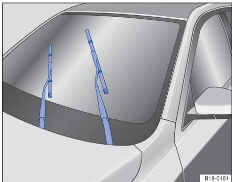  
图 173 处于保养位置的刮水片

 请首先阅读并注意引导信息和安全提示，见 ，第 208 页。

破损的刮水片必须及时更换。

必须定期检查刮水片状况，并按规定更换刮水片。

更换风窗刮水器刮水片

● 短时打开点火开关并重新关闭。

● 将风窗玻璃刮水器拨杆向下拨至点动刮水位置。使刮水器处于保养位置。⇒ 图 173

● 翻转刮水器臂，使其离开玻璃。翻转过程中不能抓住刮水片。

● 按住分离按钮 A 同时从定位销中拉出刮水片。

● 将规格和长度均相同的新刮水片插到刮水器臂上，压入卡定。

● 将刮水器臂推回到风窗玻璃上，一旦打开点火开关并操纵刮水器拨杆时，刮水器臂自动返回其初始位置。

上汽大众经销商备有原装刮水片。

若刮水片损坏，刮水不畅，则应及时更换；如脏污而刮水不畅，则应及时清洗。⇒

## ①提示

● 寒冷冰冻条件下首次使用刮水器前务必检查刮水片是否冻结在风窗玻璃上，否则，一旦使用刮水器就可能损坏刮水片和刮水器电机。

● 刮水器处于维护位置时方可将刮水器臂抬离风窗，否则，可能损坏发动机舱盖和刮水器臂。

● 避免在没有水的情况下使用刮水器（干刮）;若风窗玻璃及雨刮器片表面较脏（灰尘、油渍、污物），请勿用雨刮器片清洗风窗玻璃，否则会造成雨刮器片永久性损坏。

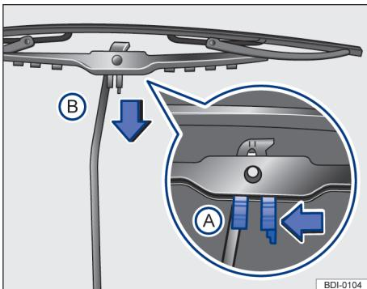  
图 174 更换风窗刮水器刮水片

## 警告

磨损和脏污的刮水片将影响前方视野，降低行驶安全性！

● 所有车窗均视野清晰方可安全行驶！

● 须定期清洗刮水片和所有车窗。

● 每年应更换一或两次刮水片。

## ① 提示

● 除非在维护位置，不得将刮水器臂抬离风窗玻璃，否则，可能损坏发动机舱盖漆面或刮水器臂。

● 破损或脏污的刮水器可能刮伤风窗玻璃。

● 不得用燃油、指甲油清除剂、油漆稀释剂或类似材料清洗车窗，因上述材料可能损坏刮水片。

● 清除风窗玻璃表面灰尘时，请勿使用干抹布或掸子直接擦拭挡风玻璃，因为表面灰尘中含有大量细小沙粒，上述的擦车过程中会在玻璃上留下划痕。建议采用水流冲洗或使用风窗玻璃洗涤功能清洗风窗表面，避免风窗表面的灰尘沙粒损坏刮水片及玻璃。

## ① 提示（续）

● 避免在没有水的情况下使用刮水器（干刮）;若风窗玻璃及雨刮器片表面较脏（灰尘、油渍、污物），请勿用雨刮器片清洗风窗玻璃，否则会造成雨刮器片永久性损坏。

## 汽车油漆上蜡和抛光

请首先阅读并注意引导信息和安全提示，见 ，第 208 页。

## 上蜡

清洗汽车后车身表面无水滴滚落即可上优质防护蜡。

良好的蜡层不仅可有效保护车身漆面免遭外界不良环境的侵蚀，并能抵御轻微机械刮擦。

尽管定期用含蜡清洗水清洗汽车，但为有效保护车身漆面，建议至少每年上两次优质硬蜡。

## 清洁镀铬部件

 请首先阅读并注意引导信息和安全提示，见 ，第 208 页。

– 用湿布清洗镀铬部件。

– 用铬清洁剂清除其表面污垢和附着物。

– 用柔软的干布抛光镀铬部件表面。

## 钢车轮的维护

 请首先阅读并注意引导信息和安全提示，见 ，第 208 页。

– 定期用专用海绵清洁钢车轮。

用工业清洁剂清除制动磨屑，如出现油漆损坏，必须在金属锈蚀前加以修补。

## 警告

制动系统内如有水、冰或防滑盐时将降低制动效果，延长制动距离，极易引发事故！

● 轻踏制动踏板，测试制动效果。

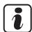

关好发动机舱盖后刮水器臂方可移动至维护位置。

## 抛光

漆面暗淡，即使上蜡也不能恢复其光泽时方需对漆面进行抛光处理。

若抛光剂不含蜡，则抛光后必须上蜡。

## ①提示

为避免损坏车身漆面，请注意下列事项：

● 塑料件和喷涂亚光漆的部件不得抛光或上蜡。

● 切勿在沙尘环境里抛光汽车。

## 提示

为防止刮伤镀铬部件表面，请注意下列事项：

● 切勿用研磨剂处理镀铬部件。

● 切勿在沙尘环境里清洗和抛光镀铬部件。

## 警告（续）

● 轻踏制动踏板，去除制动器上的水、冰或防滑盐。

● 洗车后应尽可能避免紧急制动。

● 请仔细阅读和遵守相关安全警告说明。⇒  ，在主题引言中，见第 220 页

## 警告

如不当使用高压清洗器，则可能对轮胎造成永久性可见或不可见损伤。从而可能引发严重伤亡事故。

● 切勿用集束喷嘴冲洗轮胎，即使远距离短时喷洗也会在轮胎上造成可见或不可见的损伤，极易引发事故！

## 合金车轮的维护

##  请首先阅读并注意引导信息和安全提示，见 ，第 208 页。

## 每两周：

– 清洗合金车轮上的防滑盐和制动磨屑。

– 用无酸清洁剂清洗车轮。

## 每三个月：

– 在车轮上涂硬蜡。

合金车轮需定期维护方能保持美观，尤其需定期清除车轮上的防滑盐和制动磨屑，否则，将影响其表面光洁度。

必须用无酸清洁剂清洗合金车轮。

不得用汽车抛光剂或其它研磨剂处理车轮。若合金车轮表面防护层损坏（如石击），则必须及时修复损伤处。

## 养护橡胶密封条

 请首先阅读并注意引导信息和安全提示，见 ，第 208 页。

## 养护良好的橡胶密封条不易被冻住。

建议您定期清洁和养护汽车的密封件。

天窗橡胶密封条的养护

\- 完全打开天窗。

\- 用柔软、不起毛的清洁布和大量清水除去橡胶密封件上的尘土和污物。

\- 必要时还要除去密封件支撑部位表面油漆上的尘土和污物。

\- 让橡胶密封件充分干燥。

\- 对已干燥的橡胶密封条，推荐使用上汽大众原装附件的养护物来处理。

养护行李厢盖和车门上的橡胶密封条

## 去除车门锁芯内的积冰

 请首先阅读并注意引导信息和安全提示，见 ，第 208 页。

## 警告

制动系统内如有水、冰或防滑盐时将降低制动效果，延长制动距离，极易引发事故！

● 轻踏制动踏板，测试制动效果。

● 轻踏制动踏板，去除制动器上的水、冰或防滑盐。

● 洗车后应尽可能避免紧急制动。

● 请仔细阅读和遵守相关安全警告说明。⇒  ，在主题引言中，见第 220 页

## 警告

如不当使用高压清洗器，则可能对轮胎造成永久性可见或不可见损伤。从而可能引发严重伤亡事故。

● 切勿用集束喷嘴冲洗轮胎，即使远距离短时喷洗也将对轮胎造成可见或不可见损伤，极易引发事故！

\- 用柔软的保洁布和大量清水除去橡胶密封件上的尘土和污物。

\- 必要时还需去掉橡胶密封件涂漆表面上的尘土和污物。

\- 让橡胶密封件充分干燥。

\- 对已干燥的橡胶密封条，推荐上汽大众原装养护套件来处理。

如果您不时地用合适的橡胶养护剂对车门、车窗等的橡胶密封件加以处理，就能使它们保持柔韧弹性、延长使用寿命。关于密封件的养护剂和养护的其它信息请咨询上汽大众经销商。

对橡胶件进行养护还能避免密封条提早磨损并防止不密封。车门更便于开启。养护良好的橡胶密封条即使在冬季也不易冻住。

## ① 提示

使用不合适的养护剂可能会导致密封件损坏。敬请垂询上汽大众经销商了解关于合适养护剂的信息。

冬季车门锁芯可能结冰。

只可用具有润滑及防腐特性的上汽大众经销商原装喷雾剂清除锁芯内的积冰。

## 车身底部防护层的维护

 请首先阅读并注意引导信息和安全提示，见 ，第 208 页。

车身底板涂有防护层，防止其锈蚀和损坏。

汽车使用过程中防护层可能出现破损，建议定期检查车身底部和行走系统的防护层，若有破损，应及时修补，最好春末秋初各检查一次。

建议由上汽大众经销商修补防护层和进行防腐处理，因上汽大众经销商备有必要的材料和设备，并配有专业技术人员。

## 清洁发动机舱

 请首先阅读并注意引导信息和安全提示，见 ，第 208 页。

## 清洗发动机舱时务必格外谨慎!

## 防腐处理

汽车出厂时发动机舱已作防腐处理。

冬季行驶条件下，经常在撒盐路面上行驶时良好的防腐涂层尤其重要。为防止防滑盐腐蚀汽车，撒盐期前后应彻底清洗整个发动机舱。

若用油脂清除剂清洗发动机舱或由他人清洗发动机，则防腐涂层通常会被洗掉，故清洗后必须对发动机舱的所有表面、缝隙、结合处和部件进行防腐处理。

## 提示

不可用含油脂溶化剂的除冰喷雾剂清除锁芯内的冰，否则，门锁可能生锈。

## 小心

发动机运转时催化转换器的温度很高！

● 切勿将汽车停驻在诸如干草或汽油等可燃物上方，以免处于高温状态的催化转换器引燃这些物质，造成无为损失。

● 尾气排放控制系统隔热罩、排气管和催化转换器上不得涂覆车身底板防护剂或密封剂，否则，处于高温状态的发动机和尾气排放控制系统可能点燃防护剂或密封剂。

## 警告

凡在发动机舱内作业时务必谨慎，防止被刮伤、 烫伤和引发伤亡及火灾事故！

● 在发动机舱内作业前请务必仔细阅读和遵守⇒ 第 187 页一节的相关安全警告说明。

● 打开发动机舱盖前务必关闭发动机，打开驻车制动器，拔下点火钥匙。

● 务必待发动机冷却后再清洗发动机舱。

● 清洗时注意勿被发动机舱内和汽车上的金属锐边刮伤。否则，可能导致伤害！

● 制动系统内如有水、冰和防滑盐，则将大大降低制动效果，极易引发事故！洗车后应尽可能避免紧急制动。

● 清洗时切勿触碰散热器风扇，因其受温度控制，即使关闭发动机，拔下点火钥匙后风扇仍可能突然自动启动。

清洗发动机时用清洗水冲残留燃油、油脂和机油后产生的污水必须用油水分离器进行处理。因此，应由上汽大众经销商清洗发动机。

## 车内养护和清洁

##  主题引言

该章节包含有关下列主题的信息：

塑料件和仪表板的清洁和维护 . . . . . . . 215
软垫和织物饰面的清洁 . . . . . . . . . 215
清洁人造皮革椅套 . . . . . . . . . . . 216
天然皮革 . . . . . . . . . . . . . . 216
天然皮革椅套的清洁和养护 . . . . . . . . 217
Alcantara 座椅套的清洁 . . . . . . . . 218
清洁杂物箱、饮料罐托架和烟灰缸 . . . . 218
清洁安全带 . . . . . . . . . . . . 218

现代的服装面料，例如深色牛仔面料，有时色牢度不足。由于这些服装面料会褪色，尤其是浅色的座套（织物或天然皮革）即使按规定使用也可能会产生明显的变色。这不是座套面料的缺陷，而是因为服装面料的色牢度有缺陷。

补充信息和警告说明：

● 汽车外部养护和清洁 ⇒ 第 208 页

● 附件、零部件更换、维修和改装 ⇒ 第 228 页

## 警告

养护剂有毒和有害。不合适的养护剂和不恰当地使用养护剂可能导致事故、受伤、烫伤和中毒。

## 警告（续）

● 养护剂只可保存在封闭的原装容器中。

● 切勿使用空食品盒、瓶子或其他容器盛放养护剂，因为人们不能总是认出其中装着的是养护剂。

● 注意包装的随附信息。

● 使儿童远离所有养护剂。

## 塑料件和仪表板的清洁和维护

请首先阅读并注意引导信息和安全提示，见 ，第 215 页。

● 使用时可能产生有害的蒸气。因此，养护剂只可在室外或在通风良好的空间内使用。

● 切勿使用燃油、松脂精、发动机机油、洗甲水或其它易挥发性液体来清洗、养护或清洁汽车。它们有毒并且易燃。

● 只可按照制造商说明清洁和养护汽车部件。

## 警告

汽车部件养护和清洁不当可能影响汽车的安全装备和导致受伤。

含溶剂的清洗剂会损坏塑料件。

\- 若清洗效果不佳，则可用不含溶剂的塑料清洗剂进行操作。

\- 用干净的湿布清洗塑料件和仪表板。

## 软垫和织物饰面的清洁

● 要使用认可或推荐的清洁剂。

 请首先阅读并注意引导信息和安全提示，

## 提示

● 含有溶剂的清洁剂会腐蚀材料并可能将其损坏。

● 请让大众汽车经销商去除不易清除的污斑，以免导致损坏。

可以在上汽大众经销商购买适用的养护剂。

## 警告

切勿用含溶剂的清洗剂清洗仪表板和安全气囊组件的表面，否则，将使表面疏松，一旦安全气囊触发，碎裂的塑料可能严重致伤乘员。

● 切勿用含溶剂的驾驶舱喷雾剂和清洁剂清洗仪表板和安全气囊组件的表面。

## 小心

含溶剂的清洗剂会损坏材料。

应定期用吸尘器清吸软垫、织物饰面和地毯底板垫。由此去除它们表面黏附的污物，防止其在使用中揉进织物里面。请勿使用蒸汽清洁机，因为蒸汽会使污物进入织物更深并固化。

## 普通保洁

我们建议一般都是用柔软的海绵或常用的、不起毛的细纤维布清洁。刷子只允许用来清洁地毯底板垫和脚垫，因为其它的织物表面都可能会因使用刷子清洁而受到损坏。

如果表面只是一般性的脏污，则可以用常用的泡沫清洁剂处理。用柔软的海绵把泡沫分布在织物表面并轻轻地涂擦。但是要避免织物湿透。然后用吸水性较好的干燥清洁布（例如细纤维布）把泡沫擦净，待完全干燥后再用吸尘器处理。

## 清除污斑

清除污斑时，要清洁的或许不仅只是逐个污斑，而是整个表面。尤其是留有常见的使用痕迹的部位。请勿只对污斑进行点处理，否则可能会导致处理过的表面比未处理的颜色浅。

对饮料（例如咖啡、果汁等）造成的污斑可以用高级洗涤溶剂处理。用海绵蘸洗涤溶剂涂擦如果污斑不易清除，可以直接在污斑处涂擦一块洗涤膏。然后需要用清水进行后处理，去除洗涤剂残渍。方法是把一块打湿的清洁布或海绵蘸水抹擦，然后用吸水性较好的于清洁布擦净

巧克力或化妆品造成的污斑用一块洗涤膏（例如牛胆汁皂）涂擦。然后用一块打湿的海绵去除洗涤膏。

对油脂、油液、口红或圆珠笔痕迹用中性肥皂粉，必要时加上去牛胆汁皂处理。溶解的油脂或颜料成分必须用吸水性好的材料吸走。需要用水进行后续处理，操作时不得使垫子湿透。

对于椅套和织物饰面的严重的常见脏污，建议委托上汽大众经销商清洗。

## ① 提示

● 请让上汽大众经销商去除厚重的污斑，以免造成损坏。

● 含有溶剂的清洁剂会腐蚀材料并可能将其损坏。

● 进入皮革毛孔、摺皱和拼缝中的灰尘及污物颗粒会磨损、损坏皮革表面。

● 开着的尼龙搭扣可能会导致软垫和织物饰面损坏。因此，要扣好所有可能与软垫或织物饰面发生接触的尼龙搭扣。

● 棱角尖利的物品、衣服和腰带上的镶嵌饰件（例如拉链、铆钉、人造钻石等）可能会损坏软垫和织物饰面。

## 清洁人造皮革椅套

 请首先阅读并注意引导信息和安全提示，见 ，第 215 页。

适用于带人造皮革椅套的汽车

仅使用水和中性清洁剂清洁人造皮革椅套。

## 天然皮革

请首先阅读并注意引导信息和安全提示，见 ，第 215 页。

适用于带有天然皮革椅套的汽车

上汽大众力求使天然皮革制品完全保持其独有的特性

## 提示

● 绝不允许用溶剂（如汽油、松脂精）、地板蜡、鞋油、污斑清除剂以及类似物品处理人造皮革。这样会导致材料硬化以及由此引起的提前开裂。

● 请让上汽大众经销商去除厚重的污斑，以免造成损坏。

● 棱角尖利的物品、衣服和腰带上的镶嵌饰件（例如拉链、铆钉、人造钻石等）可能会在人造皮革表面留下不可恢复的划伤或刮痕。

皮革的着色程度决定了其视觉效果及特性，从皮革表面领略天然皮革的独特风采，呈现顶级的座椅氛围，非纯自然风格的纳帕软革莫属。细腻的纹理、完整的粒面、昆虫叮咬的痕迹、皱纹以及朦胧渐变的色彩仍保持清晰可见，展示天然皮革的纯正特征。

您应事先考虑到儿童、宠物或其它方面的影响会使皮革产生严重的磨损。

带有或厚或薄的罩色层的皮革相比之下更耐磨。这会提高皮革在日常使用中的耐用性。但是，罩色层会使皮革特有的天然特征几乎或完全无法识别出，

## 天然皮革椅套的清洁和养护

 请首先阅读并注意引导信息和安全提示，见 ，第 215 页。

## 适用于带有天然皮革椅套的汽车

## 对天然皮革需要加以特别的关注和养护

## 普通清洁

\- 用插在吸尘器风口上的刷子头吸去松散的污物。

\- 用略微潮湿的纯棉抹布或羊毛抹布擦净有脏污的 皮革表面。⇒

## 厚重污物的去除

\- 把抹布先在中性的肥皂溶液（两汤匙中性肥皂粉溶于一升水）中浸透，然后拧干用来清洁污物厚重的部位。

\- 清洁时要留意防止水浸透皮革的任何部位，也不要让水进入接缝处的针孔内。

## 污斑的清除

\- 用吸水性较好的保洁布或纸巾清除新洒上的水质污斑（如咖啡、茶、果汁、血等）。如污斑已干则请使用合适的清洁剂。⇒

\- 新洒上的油质污斑（如黄油、色拉油、巧克力等）如果还没有浸入皮革表面，可以用吸水性较好的抹布、纸巾或合适的清洁剂清除。⇒

\- 对已干的油污请用除油喷剂处理。

\- 对特殊污斑（如圆珠笔、记号笔、指甲油、乳胶漆、鞋油等所致），请用皮革专用的污斑清除剂处理。

## 皮革养护

\- 每隔半年就要用合适的皮革养护剂对天然皮革加以养护处理。⇒

\- 涂上薄薄一层清洁养护用品。

\- 最后用柔软的抹布擦干。

有关皮革养护和清洁的所有问题请咨询上汽大众经销商。

## 养护和处理

由于汽车所用皮革类型的专用性和天然特性（如对机油、油脂、污渍等的敏感性），在使用和养护汽车皮革时必须周到细致⇒  。

却不会使皮革本身的质量有任何变化。与表面经过处理的皮革相比，纯自然风格的天然皮革绝对具有独特天然特征的亮点。

例如，深色的（特别是潮湿且染色有问题的）服装面料会将其颜色染到皮座椅上。进入皮革毛孔、摺皱和拼缝中的灰尘及污物颗粒会磨损、损坏皮革表面。因此应定期或根据皮革的使用情况加以养护。

使用较长一段时间后，您的皮座椅会出现一种独特的铜绿色。这是天然皮革制品的特性，是真皮品质的标志。

为了使天然皮革在整个使用寿命中保持其天然材料的价值，请留意以下说明：

● 定期及每次清洁后，请使用具有防光照和浸渍功能的养护油。养护油可滋养皮革，使其柔韧透气且恢复水分。同时还能在其表面建立一道保护层。

● 每两到三个月清洁一次皮革，及时除去新的污渍。

● 要尽快清除圆珠笔、墨水、口红、鞋油等留下的新污斑。

● 还要对皮革颜色加以养护。根据需要在有色差的部位涂上专用的彩色皮革油。

## 皮革养护剂

有关皮革清洁和养护的问题请咨询上汽大众经销商。他们很乐意为您提供咨询建议。

## 提示

● 绝不允许用溶剂（如汽油、松脂精、地板蜡、鞋油、污斑清除剂和类似物品）处理皮革。

● 请让上汽大众经销商去除厚重的污斑，以免造成损坏。

● 进入皮革毛孔、摺皱和拼缝中的灰尘及污物颗粒会磨损、损坏皮革表面。

● 棱角尖利的物品、衣服和腰带上的镶嵌饰件（例如拉链、铆钉、人造钻石等）可能会在皮革表面留下经久不去的划伤或刮痕。

● 要及时用吸水性较好的毛巾吸去洒上的液体，因为皮革无法长时间防水。

● 如果较长时间地将汽车停放在露天，应保护皮革不受阳光直射，以免褪色。使用时引起轻度的变色是正常的。

## Alcantara 座椅套的清洁

 请首先阅读并注意引导信息和安全提示，见 ，第 215 页。

## 适用于配备Alcantara座椅套的汽车

清除灰尘和污物

\- 用温布擦拭座椅套。

清除斑点

\- 用温水或稀释的酒精沾湿布。

\- 自外向内擦试、去除斑点。

清洁杂物箱、饮料罐托架和烟灰缸  
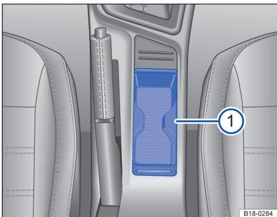  
图 175 饮料罐托架

请首先阅读并注意引导信息和安全提示，见 ，第 215 页。

## 清洁安全带

 请首先阅读并注意引导信息和安全提示，见 ，第 215 页。

脏污的安全带可能不能正常工作，发挥保护作用。绝对不允许拆下安全带进行清洁。

● 小心拉出脏污的安全带，并保持在拉出位置。

● 用淡皂液清洗脏污的安全带。

● 待安全带完全干透。

● 干透前切勿收卷安全带。脏污的安全带将无法正常收卷。

也可用合适的清洁剂清除灰尘和污物。

## ① 提示

● 切勿用皮革养护剂、溶剂、抛光蜡、鞋油、去斑剂或类似材料处理皮革制品。

● 为避免损坏皮革制品，应由专业清洁公司去除皮革上粘结牢固的污物。

● 进入皮革毛孔和接缝内的灰尘和污物颗粒如研磨 剂，极易损坏皮革表面。

● 如将汽车长时间停放在烈日下，应采取措施防止烈日直射皮革，导致皮革褪色。但因皮革制品的天然属性，使用中颜色稍有变化是正常的。

## 杂物箱和饮料罐托架清洁

有些杂物箱和饮料罐托架的底部有一个可取出的橡胶衬垫。清洁杂物箱、饮料罐托架和橡胶衬垫时，应将一块干净且不起毛的抹布用水蘸湿然后清洁这些部件。

如果效果不好，请使用专用的无溶剂塑料清洁养护剂⇒  。

## 清洁烟灰缸

● 取出烟灰缸将其清空。然后用抹布擦净烟灰缸。

● 清洁灭烟器时请使用牙签或类似的物品，以清除剩余的烟灰。

## ①提示

含有溶剂的清洁剂会腐蚀材料并可能将其损坏。 

## 警告

务必定期检查车内所有安全带的状况。若发现安全带带基、连接件、收卷机构或锁损坏，则必须到上汽大众经销商处更换安全带。

● 切勿用化学清洁剂清洗安全带，否则，可能损坏安全带带基，此外，安全带切不可与腐蚀性液体接触。

● 损坏的安全带必须及时更换，且新安全带的规格及结构必须与本车相同。发生车祸后，即使安全带表面无可见损伤，也必须更换安全带。

## 警告（续）

● 切勿试图自行维修损坏的安全带，任何情况均不得拆卸和改装安全带。

## 警告（续）

● 请仔细阅读和遵守安全带相关安全警告说明⇒ 第 81 页。

## 车轮和轮胎

##  主题引言

该章节包含有关下列主题的信息：

一般说明 ..... 220
检查轮胎气压 ..... 221
轮胎使用寿命 ..... 221
新轮胎和新车轮 ..... 223
17寸车轮和轮胎的使用 ..... 224
轮胎气压 ..... 225
车轮螺栓 ..... 226
冬季轮胎 ..... 226
防滑链 ..... 227

上汽大众建议，将和轮胎的所有作业交由上汽大众经销商进行。因为那里备有需要的专用工具和配件，具备必要的专业知识并已准备好处理废旧轮胎。

## 补充信息和警告说明：

● 行李物品装载 ⇒ 第 114 页

● 牵引启动和牵引⇒ 第 256 页

● 制动、停车和驻车⇒ 第 141 页

● 被动式轮胎气压监控系统⇒ 第 167 页

● 汽车外部养护和清洁 ⇒ 第 208 页

● 更换车轮⇒ 第 220 页

## 一般说明

 请首先阅读并注意引导信息和安全提

## 车轮故障预防措施

– 汽车驶过路缘或类似障碍物时应尽可能沿障碍物垂直方向慢速行驶。

– 注意勿使轮胎接触油脂、机油和燃油。

– 定期检查轮胎损伤状态（如割胎、开裂或鼓包等损伤）；清除嵌在轮胎花纹里的外来杂物。

## 警告

最初新轮胎的道路附着性不可能达到最佳状态，故应以适中车速谨慎驾驶，防止引发事故！

● 未经磨合的轮胎及磨损的轮胎的道路附着力不足，直接影响制动效果。

● 不得用损坏的轮胎行驶！否则，可能导致爆胎，引发伤亡事故。

● 轮胎气压必须符合规定，若轮胎气压不足，持续高速行驶将加剧轮胎挠曲，轮胎极易过热，结果可能导致胎面脱落或轮胎爆裂。

● 切勿使用损坏或已磨损至轮胎花纹磨损标记的轮胎，应及时更换这类轮胎。

● 切勿松开带螺栓连接式轮圈的轮辋上的螺栓，谨防引发事故！

● 尽可能避免使用胎龄超过6年的轮胎，若不得已而用之，则驾驶时务必格外谨慎，且应慢速行驶。

● 任何情况均勿使用不知来历的旧车轮或轮胎，因这类车轮或轮胎虽无明显损伤，但可能已损坏，从而行驶时可能导致汽车失控，引发严重事故。

● 行驶时若发现汽车非正常振动或跑偏，则必须立即停车，检查轮胎是否损坏。

出于技术上的原因，一般情况下不能使用其它汽车的轮辋。在某些情况下，即使汽车车型相同，轮辋也不能互用。请注意官方汽车文件，并在必要时向上汽大众经销商询问。

## 轮胎存放须知

– 拆卸轮胎前应在轮胎上做标记，安装时按标记复位，使车轮的旋转方向和动平衡状态保持不变。

– 拆下的车轮或轮胎应存放在凉爽干燥处，最好存放在无阳光的暗处。

– 未装配到车轮上的轮胎应直立存放。

## 新轮胎

新轮胎必须经过磨合 ⇒ 第 223 页新轮胎的花纹深度取决于轮胎品牌、型号及花纹类型。

## 隐蔽性损伤

轮胎和轮辋的损伤往往难以发现，行驶中如发现汽车异常振动或跑偏，则表明某个轮胎存在故障，遇此情况，必须尽快到上汽大众经销商处检修轮胎。

## 定向旋转轮胎

这种轮胎的侧壁上标有表示轮胎旋转方向的箭头，必须按标注的旋转方向安装轮胎，确保轮胎的道路附着性及抗浮滑性，降低滚动噪音和轮胎磨损率。

## 警告

最初新轮胎的道路附着性不可能达到最佳状态，故应以适中车速谨慎驾驶，防止引发事故！

● 未经磨合的轮胎及磨损的轮胎的道路附着力不足，直接影响制动效果。

● 不得用损坏的轮胎行驶！否则，可能导致爆胎，引发伤亡事故。

## 检查轮胎气压

 请首先阅读并注意引导信息和安全提示，见 ，第 220 页。

根据车型不同，上汽大众原装轮胎气压规定值标注在燃油箱盖板内侧的标签上。

1.从轮胎气压规定值标签上查取本车轮胎气压值（其上标注的气压值适用于夏季和冬季轮胎）。

2.拧下气门嘴防护帽，将气压监测装置装到气门嘴上。

## 轮胎使用寿命

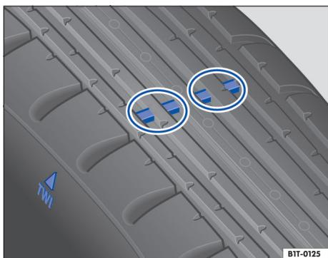  
图 176 轮胎花纹磨损标记

## 警告（续）

● 轮胎气压必须符合规定，若轮胎气压不足，持续高速行驶将加剧轮胎挠曲，轮胎极易过热，结果可能导致胎面脱壳或轮胎爆裂。

● 切勿使用损坏或已磨损至轮胎花纹磨损标记的轮胎，应及时更换这类轮胎。

● 切勿松开带螺栓连接式轮圈的轮辋上的螺栓，谨防引发事故！

● 尽可能避免使用胎龄超过6年的轮胎，若不得已而用之，则驾驶时务必格外谨慎，且应慢速行驶。

● 任何情况均勿使用不知来历的旧车轮或轮胎，因这类车轮或轮胎虽无明显损伤，但可能已损坏，从而行驶时可能导致汽车失控，引发严重事故。

● 行驶时若发现汽车非正常振动或跑偏，则必须立即停车，检查轮胎是否损坏。

3.检查轮胎气压时轮胎必须处于冷态。温度升高，气压略高于规定值，但无须降低轮胎气压。

4.根据汽车负荷和驾驶需要适当调整轮胎气压，可按照轮胎气压标牌⇒ 图 178上的信息对轮胎气压进行调整。

5.同时应检查备用车轮的轮胎气压。

6.重新拧上气门嘴防护帽。

7.如果轮胎充气压力已改变，则在带有轮胎气压监控系统的汽车上按压中控台内的按钮，直至听到一个声音提示。

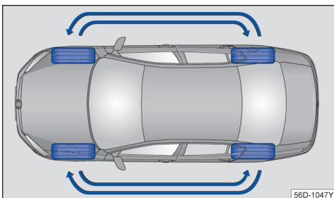  
图 177 前后车轮换位

 请首先阅读并注意引导信息和安全提示，见 ，第 220 页。

轮胎使用寿命取决于轮胎气压、驾驶风格及装配状况。

## 轮胎花纹磨损标记

本车原装轮胎上设有若干横穿花纹，高度为1.6mm的磨损标记⇒ 图 176。根据轮胎品牌，轮胎外圆周上通常均匀分布6到8个磨损标记（如字母“TWI” 或其它符号)，用于指示磨损标记所在位置。在磨损标记旁测得的纹槽深度降至1.6 mm时该轮胎即达法定允许的最小花纹深度，该轮胎必须更换 。

## 轮胎气压

轮胎气压不正确将导致轮胎早期磨损，甚至可能爆胎！因此，应每月检查一次轮胎气压，长途行驶前也须检查一次轮胎气压 。

## 驾驶方式

急转弯、急加速和紧急制动均将加剧轮胎磨损，应尽可能避免上述驾驶方式。

## 前后轮换位

若前轮轮胎的磨损比后轮严重，建议如图所示将前后轮换位安装⇒ 图 176 ，从而可保证所有轮胎使用寿命大致相同。

## 车轮平衡

汽车出厂时车轮已作平衡处理。但行驶中有诸多因素影响车轮平衡性，导致车轮不平衡，转向摆振。

不平衡的车轮应及时进行平衡处理，否则，将导致转向机构、悬挂系统和轮胎过度磨损。安装新轮胎后也须重新平衡车轮。

车轮总成动平衡要求：单侧轮辋 ≤ 10g

## 车轮定位失准

车轮定位失准将导致轮胎不均匀过度磨损，恶化行 驶安全性，若发现轮胎不均匀过度磨损，则应尽快 到上汽大众经销商处检查车轮定位。

<table><tr><td colspan="5">除Cross Lavida车型</td></tr><tr><td rowspan="10">空载时前后轮定位参数</td><td rowspan="6">前轮</td><td colspan="2">前束(双轮)</td><td> $0^{\circ} \pm 10'$ </td></tr><tr><td colspan="2">车轮外倾角(不可调)</td><td> $-21' \pm 30'$ </td></tr><tr><td colspan="2">左右轮外倾角最大允差(不可调)</td><td> $30'$ </td></tr><tr><td colspan="2">主销后倾角(不可调)</td><td> $7^{\circ} 25' \pm 30'$ </td></tr><tr><td colspan="2">左右主销后倾角最大允差(不可调)</td><td> $30'$ </td></tr><tr><td colspan="2">主销内倾角(不可调)</td><td> $14^{\circ} 15' \pm 1^{\circ} 20'$ </td></tr><tr><td rowspan="4">后轮</td><td rowspan="2">前束(双轮,不可调)</td><td>出厂检验ZP8</td><td> $10' \pm 10'$ </td></tr><tr><td>DIN 700 20</td><td> $14' \pm 10'$ </td></tr><tr><td colspan="2">车轮外倾角(不可调)</td><td> $-1^{\circ} 27' \pm 20'$ </td></tr><tr><td colspan="2">左右轮外倾角最大允差</td><td> $30'$ </td></tr><tr><td colspan="2">检测方法</td><td colspan="3">采用车轮定位检测台测试。</td></tr></table>

<table><tr><td colspan="5">Cross Lavida 车型</td></tr><tr><td rowspan="9">空载时前后轮定位参数</td><td rowspan="5">前轮</td><td colspan="2">前束(双轮)</td><td> $0^{\circ} \pm 10'$ </td></tr><tr><td colspan="2">车轮外倾角(不可调)</td><td> $-14' \pm 30'$ </td></tr><tr><td colspan="2">左右轮外倾角最大允差(不可调)</td><td> $30'$ </td></tr><tr><td colspan="2">主销后倾角(不可调)</td><td> $7^{\circ} 10' \pm 30'$ </td></tr><tr><td colspan="2">左右主销后倾角最大允差(不可调)</td><td> $30'$ </td></tr><tr><td rowspan="4">后轮</td><td rowspan="2">前束(双轮,不可调)</td><td>出厂检验 ZP8</td><td> $6' +10' -7'$ </td></tr><tr><td>DIN 700 20</td><td> $10' +10' -7'$ </td></tr><tr><td colspan="2">车轮外倾角(不可调)</td><td> $-1^{\circ} 27' \pm 20'$ </td></tr><tr><td colspan="2">左右轮外倾角最大允差</td><td> $30'$ </td></tr><tr><td colspan="2">检测方法</td><td colspan="3">采用车轮定位检测台测试。</td></tr></table>

由于车型配置的差异，以下车型（SVW71617EM、

SVW71417FL、SVW71417GL、SVW71617SM）车轮定位

参数如下表：

<table><tr><td colspan="4">整车型号</td><td>SVW71617EM</td><td>SVW71417FL</td><td>SVW71417GLSVW71617SMSVW71517CFSVW71517DF</td></tr><tr><td rowspan="9">空载时前后轮定位参数</td><td rowspan="5">前轮</td><td colspan="2">前束(双轮)</td><td colspan="2"> $0^{\circ} \pm 10'$ </td><td> $0^{\circ} \pm 10'$ </td></tr><tr><td colspan="2">车轮外倾角(不可调)</td><td colspan="2"> $-14' \pm 30'$ </td><td> $-21' \pm 30'$ </td></tr><tr><td colspan="2">左右轮外倾角最大允差(不可调)</td><td colspan="2"> $30'$ </td><td> $30'$ </td></tr><tr><td colspan="2">主销后倾角(不可调)</td><td colspan="2"> $7^{\circ} 10' \pm 30'$ </td><td> $7^{\circ} 25' \pm 30'$ </td></tr><tr><td colspan="2">左右主销后倾角最大允差(不可调)</td><td colspan="2"> $30'$ </td><td> $30'$ </td></tr><tr><td rowspan="4">后轮</td><td rowspan="2">前束(双轮,不可调)</td><td>出厂检验ZP8</td><td colspan="2"> $6' +10' -7'$ </td><td> $10' \pm 10'$ </td></tr><tr><td>DIN 700 20</td><td colspan="2"> $10' +10' -7'$ </td><td> $14' \pm 10'$ </td></tr><tr><td colspan="2">车轮外倾角(不可调)</td><td colspan="2"> $-1^{\circ} 27' \pm 20'$ </td><td> $-1^{\circ} 27' \pm 20'$ </td></tr><tr><td colspan="2">左右轮外倾角最大允差</td><td colspan="2"> $30'$ </td><td> $30'$ </td></tr><tr><td colspan="2">检测方法</td><td colspan="5">采用车轮定位检测台测试。</td></tr></table>

## 警告

<table><tr><td>行驶时若轮胎爆裂或漏气,可能引发严重伤亡事故!</td></tr><tr><td>轮胎花纹磨损至磨损标记时必须更换轮胎,否则,可能引发事故!因磨损轮胎的道路附着力急剧下降,尤其在潮湿路面上高速行驶时极易造成汽车浮滑,严重影响行驶安全性。</td></tr><tr><td>若轮胎气压不足,持续高速行驶将加剧轮胎挠曲变形,轮胎过热,可能导致胎面脱壳,甚至爆胎,极易引发事故!故轮胎气压必须符合规定。</td></tr></table>

## 新轮胎和新车轮

 请首先阅读并注意引导信息和安全提示，见 ，第 220 页。

新轮胎和新车轮必须经过磨合。

轮胎和车轮属汽车关键部件。本车轮胎和车轮经上汽大众严格认证，完全与本车特性相匹配，具有良好的道路附着性和操纵稳定性。如需安装未经上汽大众认可的轮胎或车轮，则请咨询上汽大众经销商，确定其是否适用本车。选用轮胎和车轮时尤其须注意整车重量和最高允许车速。

建议对轮胎和车轮的任何作业均中上汽大众经销商实施。因其熟悉操作流程，并配有必要的专用工具和备件及合适的报废轮胎处理设施。上汽大众经销商掌握轮胎、车轮及车轮装饰件的安装和更换技术，有关事项请咨询上汽大众经销商。

安全起见，轮胎应成对更换（即同时更换两个前轮或两个后轮），尽可能不要单个更换。

<table><tr><td>警告(续)</td></tr><tr><td>若发现轮胎不均匀过度磨损,则应尽快到上汽大众经销商处检查汽车行驶系统。注意切勿使化学物质、机油、油脂、燃油及制动液接触轮胎。避免使用胎龄超过6年的轮胎,若不得已而用之,则务必慢速谨慎行驶。损坏的车轮和轮胎必须及时更换!切勿使用来历不明的旧轮胎,即使外观无可见损伤,旧车轮和轮胎可能已损坏,故极可能导致汽车失控,引发严重事故。</td></tr></table>

## 轮胎型号代码

了解轮胎型号及其含义有助于正确选用轮胎，子午线轮胎的侧壁上标有轮胎型号代码。例如：

195/65 R15 91H

其含义如下：

轮胎宽度，单位：mm195

65 高/宽比(%)

R R子午线轮胎

15 轮辋直径，单位：英寸

91 承载能力代码

H 轮胎速度级别

轮胎上可能还标有下列信息：

XL “Reinforced” 代表加强型轮胎

(或 M/S) 代表轮胎花纹适用于冬季行驶的轮M+S胎 (雪泥地轮胎)

轮胎旋转方向

## 轮胎速度级别

P 最高允许车速 150 km/h

Q 最高允许车速 160 km/h

R 最高允许车速 170 km/h

S 最高允许车速 180 km/h

T 最高允许车速 190 km/h

H 最高允许车速 210 km/h

V 最高允许车速 240 km/h

W 最高允许车速 270 km/h

Y 最高允许车速 300 km/h

某些轮胎制造商用代码 “ZR” 代表最高允许车速高于 240 km/h 的轮胎。

## 轮胎识别代码 (TIN)

TIN码是轮胎的序码号，以字母“DOT”开头，表示该轮胎符合相关法规要求，随后是轮胎制造商代码和轮胎制造日期缩写⇒ 第 224 页，其它数字和字母则属轮胎制造商内部用代码。

## 轮胎制造日期

轮胎制造日期也标注在轮胎侧壁上（可能只标在车轮内侧）：

“DOT ... 0305 ...” 表示该轮胎是 2005 年第 3周生产的。

## 行驶轮胎和备胎尺寸规格

请向上汽大众经销商了解适用于您的车辆的轮辋和轮胎的最新消息。

在朗逸系列车型上可使用的行驶轮辋和轮胎，有以下尺寸规格：

<table><tr><td>行驶轮辋尺寸</td><td>6.5J×16 ET42</td><td>6.5J×17 ET40</td></tr><tr><td>行驶轮胎尺寸</td><td>205/55 R1691V</td><td>205/50 R1789V</td></tr></table>

在朗逸丝绸之路系列车型上可使用的行驶轮辋和轮胎，有以下尺寸规格：

<table><tr><td>行驶轮辋尺寸</td><td>6J×15 ET38</td><td>6.5J×16 ET42</td></tr><tr><td>行驶轮胎尺寸</td><td>195/65 R1591H</td><td>205/55 R1691V</td></tr></table>

在朗逸系列车型上可使用的备用轮辋和轮胎的尺寸规格如下：

## 17寸车轮和轮胎的使用

 请首先阅读并注意引导信息和安全提示，见 ，第 220 页。

2015 年及之后上市的新款 New LavidaSport、Cross Lavida 车型，出厂时即是 17寸轮毂和轮胎。

备用轮辋尺寸：6J×15 ET38

备用轮胎尺寸：195/65 R15 91H

在朗逸丝绸之路系列车型上可使用的备用轮辋和轮胎的尺寸规格如下：

备用轮辋尺寸：6J×15 ET38

备用轮胎尺寸：195/65 R15 91H

## 警告

若使用不适合本车的轮胎，则可能危及交通安全，谨防引发事故！

● 尽可能避免使用胎龄超过6年的轮胎，若不得已而用之，则必须慢速谨慎行驶。

● 若加装车轮装饰罩，则必须确保有足够的冷却气流通向制动器，否则，可能导致制动器过热。

● 四个车轮必须安装类型、尺寸（滚动周长）及花纹类型均相同的子午线轮胎。

● 切勿安装来历不明的旧轮胎和车轮，即使外观无可见损伤，旧轮胎和车轮也可能已损坏，从而可能导致汽车失控，引发事故！

● 切勿拧松车轮螺栓，谨防引发事故！

● 若备用车轮的轮胎规格不同于在用轮胎（例如，冬季轮胎、小尺寸备胎）则只可短时间使用，行驶时务必格外谨慎，应尽快换回标准轮胎。

● 车速不得高于所装轮胎的最高允许车速 。若车速超过轮胎最高允许车速，轮胎可能突然失压，脱壳，甚至爆胎，极易引发事故！

## 小心

● 由于技术原因，任何情况均不得使用其它汽车的车轮，包括同车型其它车上的车轮。

● 若在本车使用未经上汽大众认可的车轮或轮胎，则可能违反道路行驶车轮注册条件。

必须严格按当地相关法规处理废旧轮胎。

i 在轮胎损坏的情况下，只允许暂时以谨慎小心上标准的车轮。

以下车型可选装17寸轮毂和轮胎：

– 2015 年及之后上市的朗逸(New lavida)1.4T 豪华版。

– 2015年及之后上市的全新朗行(GranLavida) 1.4T 豪华版。

其余车型不可选装17寸轮毂和轮胎。

如果您的车辆选装了17寸车轮和轮胎替代了原配的16寸/15寸车轮和轮胎，请您仔细阅读以下内容。

17寸车轮较其他尺寸车轮相比，车轮直径更大，轮胎高宽比（轮胎胎侧高度）更小。这些尺寸的变化不仅使整车外观变得更加豪华动感，更大大提高了驾驶的操控性，必将使您在驾驶过程中体验更多精确驾驶的乐趣，但在恶劣路况环境下可能会对您的驾乘舒适感造成影响。

由于17寸轮胎胎侧高度较低，在碰撞（凸起或凹陷的）障碍物时可能会出现因轮胎在障碍物与轮辋凸缘之间被严重挤压变形而造成的胎体子线断裂现象，从而可能导致出现轮胎胎侧鼓包或开裂的安全隐患。同时也可能出现因冲击而造成车轮轮辋处变形或开裂的安全隐患。因此，为了确保您驾驶的安全性及舒适性，在您充分享受驾驶乐趣之前，我们提醒您为了您及家人的安全，请您认真阅读并严格按照以下注意事项驾驶车辆：

## 轮胎气压

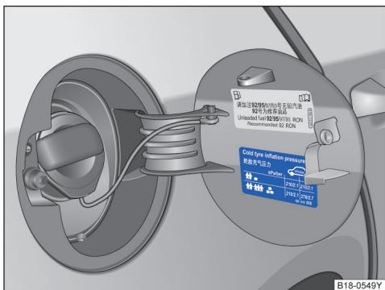  
图 178 轮胎气压数据标牌（具体信息请参考实车标牌）

##  请首先阅读并注意引导信息和安全提示，见 ，第 220 页。

原装轮胎气压规定值标注在一标牌上，其上所列数据冬夏季均适用。标牌位于燃油箱盖板内侧⇒ 图 178。

无论轮胎气压过高或过低均会导致轮胎早期磨损，恶化轿车操纵稳定性⇒  。高速行驶时轮胎气压尤为重要，轮胎气压不符合要求将加剧轮胎磨损，轮胎极易爆裂。

因此，应每个月和长途行驶前检查一次轮胎气压。轮胎气压规定值适用于冷态轮胎，行驶时轮胎温度高，气压会略高于冷态时的气压。

上汽大众汽车有限公司在法律允许的范围内保留对以下注意事项的最终解释权。

● 选择路况良好的路面行驶。

● 请选择正确规范的车位停车，严禁以冲撞方式上街沿或台阶。

● 驾驶过程中请集中注意力，及时避让前方（凸起或凹陷的）障碍物，如无法避免，请务必降低车速，慢速通过。

● 定期经常检查轮胎和车轮是否有异常现象，包括轮胎胎冠和内外侧。确保轮胎气压长期处于规定的范围内（详见使用维护说明书及加油盖内侧数值）。如发生胎侧鼓包或车轮轮辋变形，请立刻前往上汽大众特许销售商/维修站进行更换。

## ①提示

● 轮胎属于易损件，由于用户使用不当或滥用所造成的损坏不属于质量担保范围。

但如冷态气压符合规定，则无需降低热态时的轮胎气压，否则，将导致轮胎气压不足，行驶时可能突然爆裂。

## 检查轮胎气压

轿车在过去三小时里仅低速行驶数公里时方可检查轮胎气压。

● 应定期检查轮胎气压，检查时轮胎应处于冷态，并且应检查所有轮胎的气压（包括备用车轮轮胎的气压）。如轿车在寒冷地区使用，则应增加检查胎压的频次，并且须在轿车未行驶过的情况下检查轮胎气压。必须用功能正常的轮胎气压表检查轮胎气压。

● 必须按轿车负荷调整轮胎气压。

● 调整轮胎气压后务必拧紧气门防护帽。关于被动式轮胎气压监控系统设置的说明和提示可参阅本说明书相关章节⇒ 第 167 页。

备用车轮或应急备用车轮轮胎气压标注在位于燃油箱盖板内侧标牌上⇒ 图 178。

## 警告

轿车行驶时气压过高或过低的轮胎均可能突然失压，甚至爆裂，极易引发严重伤亡事故！

● 气压不足，轮胎极易过热，导致胎面脱壳，甚至爆裂。

● 轿车高速超载行驶时轮胎极易过热，轮胎突然损坏（包括爆胎和胎面剥落），导致轿车失控。

● 无论轮胎气压过高或过低均会导致轮胎早期磨损，恶化轿车操纵稳定性。

## 警告（续）

● 定期检查轮胎气压，至少一个月检查一次，长途行驶前也应检查轮胎气压。

● 务必根据轿车负载正确调整所有轮胎的气压。

● 切勿降低轮胎热态时的气压。

## ① 提示

● 连接轮胎气压表时应使气压表与气门嘴成一条直线，否则，可能损坏轮胎气门嘴。

## 车轮螺栓

 请首先阅读并注意引导信息和安全提示，见 ，第 220 页。

必须按规定力矩拧紧车轮螺栓！

车轮螺栓的结构必须与轮辋相匹配。若安装不同类型的轮辋，则必须使用长度、规格及螺栓头部形状均适合的螺栓。确保车轮安装稳固，制动系统正常工作。

车轮螺栓拧紧力矩为120Nm。

不可使用不同车型的车轮螺栓，甚至不能使用同车型其它车上的车轮螺栓

## 冬季轮胎

 请首先阅读并注意引导信息和安全提示，见 ，第 220 页。

冬季轮胎可大大提高汽车在冰雪路面上行驶时的操纵稳定性。建议气温低于 -7°C时即应换装冬季轮胎。

汽车在冬季道路条件下行驶时冬季轮胎可大大提高汽车的操纵稳定性。而夏季轮胎因其结构（轮胎宽度、橡胶成分、花纹类型等）原因在冰雪路面上的防滑能力较差。

建议使用和原车轮胎尺寸相同的冬季轮胎。

轮胎花纹深度磨损至4 mm时冬季轮胎的防滑性能将 明显降低。

## 提示（续）

● 丢失气门嘴防护帽或气门嘴防护帽安装不当均可能损坏轮胎气门嘴，务必使用与原装气门嘴防护帽规格一致的气门嘴防护帽，并正确安装防护帽。

轮胎气压不足势必提高燃油消耗率。

i 如轮胎监控系统发出警报，警示至少一个车轮的轮胎气压偏低时，必须用轮胎气压表检查轮胎气压。仅凭轮胎外观无法确定轮胎气压是否偏低，轮胎花纹深度过小时也如此。

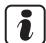

检查轮胎气压时请参阅被动式轮胎气压监控系统相关说明⇒ 第 167 页。

## 警告

若车轮螺栓紧固不当，汽车行驶时车轮可能松动，极易引发事故！

● 车轮螺栓和轮毂上的螺纹必须洁净，易于拧动。

● 车轮螺栓和轮毂上的螺纹上不得沾有油脂或机油，否则，虽已拧紧至规定力矩，但汽车行驶时螺栓仍可能松动，极易引发事故！

● 必须使用本车自己的车轮螺栓。

● 不得在本车使用不同的车轮螺栓。

● 若车轮螺栓拧紧力矩小于规定值，汽车行驶时螺栓可能松动，极易引发事故；若大于规定值，则可能损坏车轮螺栓和轮毂的螺纹。

在冬季道路条件下方可使用冬季轮胎，并且四个车轮均须安装冬季轮胎。冬季轮胎的 最高允许车速以轮胎速度级别为准 。

此外，还可通过菜单对车速警告进行设置⇒ 第 35 页。

一旦气温升高到7℃以上，则应立即换用夏季轮胎，因在无冰雪路面上行驶时夏季轮胎的操纵稳定性优于冬季轮胎。

若轮胎漏气，换用备用车轮时请参阅备用车轮使用说明 。

## 警告

车速不得超过所装冬季轮胎最高允许车速。若车速超过冬季轮胎最高允许车速，轮胎可能突然失压，脱壳，甚至爆胎，极易引发事故！

## 警告（续）

● 务必根据当时的气候、道路及交通状况调整车速，切勿利用冬季轮胎提供的防滑性能冒险，谨防引发事故！

● 安装冬季轮胎行驶时应在驾驶员视觉范围内粘贴标有最高允许车速的不干胶标签。

● 制动时四轮驱动汽车的操纵性能与前轮驱动汽车相同。

## 防滑链

 请首先阅读并注意引导信息和安全提示，见 ，第 220 页。

防滑链只可安装在前轮，并且只可装在规定轮胎上，该规定也适用于四轮驱动汽车。

请参阅和遵守应急轮胎相关说明。

安装防滑链前必须拆掉车轮装饰罩和装饰环。

朗逸系列车型可使用防滑链的车轮和轮胎尺寸规格如下：

钢车轮：6J×15 ET38

轮胎：195/65 R15 91H

只允许使用突出轮胎外廊不超过15mm的细扣防滑链条（包括张紧装置）。

我们推荐您前往就近的上汽大众经销商咨询合适的轮辋、轮胎及防滑链尺寸信息。

朗逸丝绸之路系列车型可使用防滑链的车轮和轮胎尺寸规格如下：

钢车轮：6J×15 ET38

轮胎：195/65 R15 91H应根据气候状况及时换用夏季轮胎，因其滚动噪音小，磨损慢，油耗低。

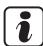

若在配备被动式轮胎气压监控系统的汽车上安装新轮胎，则系统必须对其“重新记忆”。

只允许使用突出轮胎外廊不超过15mm的细扣防滑链条（包括张紧装置）。

我们推荐您前往就近的上汽大众经销商咨询合适的轮辋、轮胎及防滑链尺寸信息。

## 警告

若使用不适合本车的防滑链或防滑链安装不当，则可能引发事故，致伤人员。

● 不同车型应采用不同尺寸的防滑链，并务必按防滑链制造商的装配说明安装防滑链。

● 安装防滑链行驶时务必遵守相关法规，且车速不得超过最高允许车速。

## 提示

● 在无冰雪路面上行驶时必须拆掉防滑链，否则，势必恶化汽车操纵稳定性，加速磨损，损坏轮胎。

● 防滑链与车轮直接接触可能划伤或损坏车轮，故必须正确安装防滑链。

装防滑链行驶的最高允许车速为50 km/h。

## 附件、零部件更换、维修和改装

##  主题引言

该章节包含有关下列主题的信息：

磨合 228  
制动效果和制动距离 228  
附件和零部件 229  
油液和零部件 230  
维修和技术更改 230  
安全气囊系统维修和对安全气囊系统的损害 231  
车载电话和对讲机 231

## A 警告

不适用的备件和附件以及违规进行的作业、改装和维修可能导致汽车损坏、事故和受伤。

## 磨合

 请首先阅读并注意引导信息和安全提示，

1000km 以内

● 不全开油门。

● 切勿以最大油门行驶。

● 避免发动机高速运转。

● 不得牵引挂车。

1000 到 1500km

● 在此范围内可将车速和发动机转速（rpm）提高至最高允许速度。

## 制动效果和制动距离

请首先阅读并注意引导信息和安全提示，见 ，第 228 页。

制动效果和制动距离主要受汽车行驶环境，道路状况及驾驶方式影响。

制动效果和制动距离主要受汽车行驶环境，道路状况及驾驶方式影响。

磨损的制动器摩擦片不能对汽车实施有效制动，制动器摩擦片的磨损程度主要取决于汽车使用条件及驾驶方式。如经常在市区行驶，或短途行驶，或用作赛车，建议您在⇒ 章节保养手册规定的保养周期

## 警告（续）

● 上汽大众强烈建议，只使用许可的上汽大众附件和上汽大众原厂配件®。上汽大众公司已确认了这些产品的可靠性、安全性和适用性。

● 汽车的维修和改装只可请上汽大众经销商进行。上汽大众经销商拥有必要的工具、诊断设备、维修信息和具备资质的工作人员。

● 只可在本车上安装型号和特性与出厂时安装的部件相符的部件。

● 切勿将诸如饮料罐托架、电话支座等物品放置、固定或安装在安全气囊模块的盖板上或附近，或安全气囊的膨胀范围内。

● 只可使用上汽大众许可用于本车型的轮辋和轮胎组合。

磨合初期，发动机的内摩擦阻力比磨合后大得多，发动机所有运动部件磨合后方能达到最佳配合状态。

按上述要求磨合发动机后不仅能延长发动机使用寿命，并可降低油耗。

内增加制动器摩擦片厚度的检查次数。涉水、暴雨或洗车后制动器可能受潮或（冬季）结冰，制动效果将有所下降，这种情况下必须轻踏制动踏板，使制动器摩擦生热，将水分蒸发掉，恢复制动效果。

雨天及湿滑路面行车时，应控制车速防止打滑；在遇到积水时，应低挡匀速通过。在经过积水较深的路段后，由于制动摩擦片和制动盘都会被水浸湿，影响制动效果，要轻踩几下刹车，使制动零件保持干燥恢复性能。

由于高原地区山高坡长，制动器使用频率高、时间长且经常在强制动工况下连续工作，这些因素都会使制动效果变差。因此我们建议车辆在下坡时，切勿空挡滑行并避免频繁制动。尽量使用低挡通过发动机本身的制动作用控制车速，这样可以减轻车轮制动器的工作强度，降低制动器温度。在采用发动机制动时，变速箱挡位越低，发动机转速越高，产生的拖滞力越大，制动效果越明显。

高原地区空气稀薄、气压低，与平原的大气压力不同，所产生的助力效果不同。在高原地区，由于作用在制动助力器膜片单位面积上的大气压力已经小于一个标准大气压力，所以制动助力就会变小，并且产生相同助力效果的时间会变长，这是一个正常的物理现象，所以在高原地区制动时需要更大的制动踏板力。当需要制动时，不要多次猛踩制动踏板，而是将脚保持在制动踏板上通过控制制动踏板力保证制动效果。

由于冰雪路面的摩擦系数低，当制动时，制动距离会大大延长,并且制动距离会随着车速的提高而加大，所以在冰雪路面行驶时应特别注意控制车速、与前车或者侧向车辆保持较大的安全距离。

在冰雪路面行车时不允许空挡滑行，当需要减速停车时，建议通过连续减挡的方式进行制动。

当需要紧急制动时，可通过发动机的制动并配合制动踏板制动，达到迅速降低车速的效果。（例如，车辆4挡行驶时需要紧急制动，先将右脚从油门踏板松开并踩下制动踏板，左脚则迅速踩下离合器，将挡位直接换到2挡甚至 1挡，迅速抬起离合器踏板，配合制动踏板以达到快速降低车速的效果）。

制动液至少每两年更换一次。 若制动液在制动系统内存留时间过长，则制动时可能在系统管路内产生气阻，严重恶化制动效果。

## 警告

未经磨合的新轮胎和新制动器摩擦片不具备最佳附着特性和摩擦特性。

● 新轮胎尚不具备最佳附着力，故最初500 km内须谨慎驾驶，使轮胎磨合良好，谨防发生事故。

● 最初200至300 km内新制动器摩擦片不具备最佳摩擦特性，故必须经过磨合此阶段内制动效果略有下降，可通过加大制动踏板的踏力补偿制动效果，更换后的新制动器磨擦片也须按上述要求进行磨合。

## 附件和零部件

 请首先阅读并注意引导信息和安全提示，见 ，第 228 页。

购买附件和零部件前请务必咨询上汽大众经销商。

上汽大众采用最新安全技术设计本车，确保本车具有优良的主动安全性和被动安全性。

安装附件和更换零部件前请咨询上汽大众经销商。上汽大众经销商可向您推荐适用于您所购汽车的附件和零部件，并可向您介绍相关法规。请务必使用

## 警告（续）

● 行驶时切勿距其它车辆太近或发生须紧急制动的情况，使用新轮胎和新制动蹄块行驶时尤须谨慎，杜绝发生上述情况，避免引发事故。

## 警告

若制动器受潮或结冰，或驶经撒盐路面后制动效果可能滞后，导致制动距离加长，务须谨慎，防止引发事故！

● 制动距离过长及制动系统存在故障均将提高事故发生率。

● 轻踏制动踏板，检测制动器。

● 谨慎制动，干燥已浸湿的制动器或去除制动器上的冰或盐。

● 请仔细阅读和遵守相关安全警告说明。

## 警告

制动器过热将降低制动效果，并增长制动距离。

● 注意勿使制动器过热。

● 下坡行驶时制动器负荷增大，极易过热。

● 沿陡坡长距离下行前建议挂入低挡，降低车速，利用发动机的制动效应，减轻制动器的负荷。

● 切勿持续踏住制动踏板，使制动器处于摩擦状 态，持续制动将导致制动器过热，增长制动距 离，应对汽车实施间歇制动。

● 切勿关闭发动机让汽车惯性滑行，因此时制动助力器不工作，故将大大增长制动距离。

●每两年必须更换一次制动液，如制动液在制动系统内存留时间过长，制动时系统管路内将产生气阻，恶化制动效果，降低行驶安全性，甚至可能导致制动系统失效，极易引发事故！

● 安装非标准前扰流板或前扰流板损坏均将阻碍通向制动器的冷却气流，导致制动器过热，恶化制动效果。

● 购买附件前请仔细阅读并遵守相关安全警告说明⇒ 第 229 页 。

上汽大众原装零部件和经上汽大众认可的附件，因这些零部件和附件的适应性、可靠性和安全性均已通过上汽大众严格认证。上汽大众经销商备有充足的上汽大众认可的附件和零部件，并具有丰富的安装经验和必备的设施，可确保正确安装零部件和附件。

尽管上汽大众不断对附件和零部件市场进行考察，但不可能评估市场上销售的所有非上汽大众原装附件和零部件的可靠性、安全性和适应性，因此，若安装非上汽大众原装附件和零部件所产生的车辆故障或事故，上汽大众一概不予质量担保。

若对汽车行驶性能有直接影响的设备（如车速巡航控制系统或电控悬挂）进行改装，则必须经上汽大众认可，且其上必须标有标记“e”(欧洲经济共同体授权标记)或“CCC”（中国强制认证）。

如加装诸如电冰箱、电脑、风扇等与汽车操作无关的电气设备，则其上必须标有标记“CE”（欧洲经济共同体制造商一致性声明标记）或“CCC”（中国强制认证）。

## 警告

对汽车的不当改装或安装不合适的附件均可能引发故障，导致致命事故！

● 请务必使用上汽大众原装零部件和经本公司认可的附件。因这些零部件和附件的适应性、可靠性和安全性均已通过上汽大众严格认证。

## 油液和零部件

 请首先阅读并注意引导信息和安全提示，见 ，第 228 页。

所有工作油液和零部件都在不断地进行后续开发，例如齿形皮带、轮胎、发动机冷却液、发动机机油以及火花塞和汽车蓄电池。因此请让上汽大众经销商更换工作油液和零部件。

## 警告

不合适的工作油液和零部件及其不恰当的使用可能导致事故、受伤、烫伤和中毒。

● 油液只可保存在封闭的原装容器中。

● 切勿使用空食品盒、瓶子或其他容器盛放油液，否则可能有人饮用其中装着的油液。

● 使儿童远离所有油液和工作部件。

## 维修和技术更改

请首先阅读并注意引导信息和安全提示，见 ，第 228 页。

进行维修和技术更改时必须遵守上汽大众的规范⇒  ！

## 警告

对汽车的不当维修或改装均可能影响安全气囊的保护效能，引发故障，导致致命事故。

● 切勿将诸如杯架、电话架等附件安装在安全气囊组件的外壳上或其作用范围内。

● 发生事故，安全气囊触发时安装在安全气囊组件外壳上或其作用范围内的附件可能导致乘员严重致伤，甚至致死！

● 请仔细阅读和遵守相关安全警告说明⇒ 第 90 页。

## 警告（续）

● 务必阅读并遵守油液外包装上的信息和警告。

● 在使用会产生有害蒸气的产品时，务必在室外或在通风良好的区域内作业。

● 切勿使用燃油、松脂精、发动机机油、洗甲水或其它挥发性液体进行汽车养护。这些物质有毒并且高度易燃。它们可能引起火灾和爆炸！

## ① 提示

● 只可添加适用的工作油液。绝对不可混淆工作油液。否则会导致严重的功能缺陷和发动机损坏！

● 冷风入口前面的附件和其它加装件会降低发动机冷却液的冷却效果。在环境温度高且发动机负荷大时，发动机可能过热！

大 泄漏的工作油液会污染环境。要将流出的工作油液收集在合适的容器中，然后按环保要求专业地废弃处理。

未经上汽大众授权对本车电子部件或软件的技术更改均可能引发功能故障。因电子部件相互连接形成一网络系统，一旦某个电子部件发生故障，势必影响其它系统，从而大大降低行驶安全性，导致部件过度磨损，使汽车不符合道路行驶要求。

上汽大众对不当改装及作业造成的损坏概不承担质量担保，故必须由上汽大众经销商实施维修和技术改装。

特殊辅助设备或车身部件的制造商必须保证所产部件符合现行环保法规。

车主必须保存所装辅助设备及部件的成套文件，并在汽车报废时将所有文件交给拆车公司。从而可按环保要求处理报废车和翻新旧车。

## 警告

对汽车的不当作业或改装均可能导致功能故障，致伤人员，引发事故。

## 警告（续）

● 本车不得安装不同于原装零部件特性和规范的零部件。也不得安装未经上汽大众认可的车轮和轮胎。

## 警告

对汽车的不当维修和改装均可能导致功能故障，引发致命事故！

● 对汽车的不当作业和改装（例如，对发动机、制动系统、行驶系统或影响车轮及轮胎性能的部件的改装）均会影响安全气囊系统的功能，从而严重致伤，甚至致死乘员。

● 请仔细阅读和遵守相关安全警告说明⇒ 第 90 页。

## 安全气囊系统维修和对安全气囊系统的损害

 请首先阅读并注意引导信息和安全提示，见 ，第 228 页。

进行维修和技术更改时必须遵守上汽大众的规范⇒  ！

前保险杠、车门、前座椅、顶篷或车身的改装和维修只可请上汽大众经销商进行。在这些汽车部件上可能有安全气囊系统的系统组件和传感器。

对安全气囊系统进行的一切作业以及因其它维修工作而拆装其系统部件，都可能损坏安全气囊系统的部件。其结果可能导致安全气囊在发生交通事故时不能正确触发或不起作用。

为了不影响安全气囊的效能以及避免已拆下的部件导致受伤及污染环境，必须遵守相关规定。上汽大众经销商了解这些规定。

改装车轮悬架可能影响发生碰撞时安全气囊系统的性能。例如由于使用未经上汽大众许可的轮辋和轮胎组合、由于降低汽车高度、由于更改包括弹簧、减震支柱、减震器等的悬架硬度，可能改变由安全气囊传感器测得并发送到电子控制单元的力。悬架的某些改装例如可能增大由传感器测得的力，从而使安全气囊系统在发生未进行改装时一般不应触发的碰撞时触发。其它改装可能减小由传感器测得的力，从而导致安全气囊在应触发时不触发。

## 车载电话和对讲机

 请首先阅读并注意引导信息和安全提示，见 ，第 228 页。

车载电话和对讲机必须配备车外天线

务必按下列规定安装车载电话和对讲机：

## 警告

违规进行的维修和改装可能导致汽车损坏和发生功能故障，并影响安全气囊系统的效能。从而可能导致事故和受伤或致命伤。

● 汽车的维修和改装只可请上汽大众经销商进行。

● 安全气囊模块不能修理，必须更换。

● 切勿将从旧车中拆下的或回收利用的安全气囊部件安装到本车中。

## 警告

改装本车的车轮悬架包括使用未许可的轮辋和轮胎组合，可能改变安全气囊的性能并增大发生事故时受伤或致命伤的风险。

● 切勿安装与本车中安装的原厂部件具有不同特性的车轮悬架部件。

● 切勿使用未经上汽大众许可的轮辋和轮胎组合。

● 正确安装车外天线。

● 车载电话和对讲机的最大发射功率不得超过10W。

安装车外天线方能获得最佳通话范围。

若需安装发射功率高于10W的车载电话或对讲机，则务必先与上汽大众经销商商洽，确认改装高功率车载电话或对讲机是否技术可行。

建议由上汽大众经销商安装车载电话和对讲机。

## 警告

驾驶员必须始终集中精力驾驶汽车，切勿因通话分散注意力，谨防引发事故。

● 道路、交通及天气状况允许时方可使用电话或对讲机。

● 音量应调节适中，以便随时能听到车外诸如警车或消防车发出的信号。

● 在无移动电话网络或网络信号很弱的地区以及隧道、车库或地道内可能无法通话。也不能进行紧急呼叫。

## 警告（续）

● 若无车外天线或车外天线安装不当，使用车载电话或对讲机时车内的电磁辐射将超过允许值、对车内的驾乘人员的健康极为不利。

## 警告

● 在加油站内加油时必须关闭车载电话和对讲机，因电磁辐射可能产生火花，引发火灾！

● 切勿在安全气囊组件的外壳上或安全气囊作用范围内安装或固定诸如杯架、电话架等物品。

● 发生事故，安全气囊触发时安装在安全气囊组件外壳上或其作用范围内的附件可能严重致伤，甚至致死乘员！

## 小心

对汽车操作不当可能引发功能故障。若违反上述规定，可能导致汽车电子系统发生故障，常见错误如下：

● 未安装车外天线。

● 车外天线安装错误。

● 车载电话或对讲机的最大发射功率超过10W。

## 发动机控制单元和废气净化装置

##  主题引言

该章节包含有关下列主题的信息：

指示灯 . . . . . 233尾气催化净化器 . . . 233

补充信息和警告说明：

● 换挡 ⇒ 第 129 页

● 加油⇒ 第 182 页

● 汽油 ⇒ 第 185 页

● 发动机机油 ⇒ 第 191 页

● 汽车蓄电池 ⇒ 第 198 页

● 已存储在控制单元中的信息 ⇒ 第 228 页

● 牵引启动和牵引⇒ 第 256 页

## 警告

<table><tr><td>排气装置的部件可能会很热。于是可能引起火灾。不要让排气装置部件接触到汽车下的易燃物质(例如干草)。切勿在排气管、尾气催化净化器、隔热板上使用附加的底部保护层或防腐材料。</td></tr></table>

## 指示灯

请首先阅读并注意引导信息和安全提示，见 ，第 233 页。

<table><tr><td>亮起</td><td>可能的原因</td><td>解决措施</td></tr><tr><td></td><td>电子节气门控制系统故障(Electronic Power Control)。</td><td>尽快让上汽大众经销商检测发动机。</td></tr><tr><td></td><td>OBD系统指示灯,表明尾气排放相关的系统或者零部件有故障。</td><td>谨慎地行驶到最近的上汽大众经销商进行检测。</td></tr></table>

在打开点火开关时，某些警告灯和指示灯会短暂亮起，表明在进行功能检测。它们在几秒钟后或者启动发动机后隐去。

只要指示灯，或EPC亮起，就必须考虑到发动机故障、耗油量提高以及发动机功率下降。

## 警告

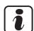

关于排放控制关键零部件信息，请登陆大众品牌官网（www.svw-volkswagen.com）查询。 

● 行车建议只可在合适的视野、天气、路面和交通状况下执行。

● 不得危及其它车辆及行人。

## 提示

为了避免汽车损坏，务必注意亮起的指示灯以及相应的描述和提示。

## 尾气催化净化器

请首先阅读并注意引导信息和安全提示，见 ，第 233 页。

尾气催化净化器用于废气后处理，帮助降低废气中的有害物质排放值。为保证汽油发动机的排气装置和尾气催化净化器长时间正常工作：

● 只可添加无铅汽油。

● 切勿行驶到油箱燃油完全耗尽。

● 不要加注过多的发动机机油 ⇒ 第 191 页。

● 不要牵引启动汽车，而要使用辅助启动。

如果在行驶期间发生失火（缺缸）、功率下降或发动机运转不平稳，要立即降低车速，并让上汽大众经销商检测汽车。否则未燃烧的燃油会因此进入排气装置，从而进入大气中。此外，尾气催化净化器也可能因过热而损坏！

即使废气净化装置工作无碍，在发动机的某些状态下也可能出现含硫类物质的废气气味。这取决于燃油的含硫量。 

## 自己动手实用提示

## 问题和回答

如果在操纵本车时怀疑本车存在功能失效或损坏，则在去上汽大众经销商检修前请阅读并遵守以下提示。此外，关键词条目“特点”或“核对表”可提供帮助。

<table><tr><td>特点</td><td>可能的原因及其它</td><td>可能的解决措施</td></tr><tr><td rowspan="3">发动机不启动。</td><td>汽车蓄电池电量耗尽。</td><td>-进行辅助启动⇒第254页。-给汽车蓄电池充电⇒第198页。</td></tr><tr><td>使用错误的汽车钥匙。</td><td>使用有效的汽车钥匙⇒第50页。</td></tr><tr><td>燃油存量过少。</td><td>加油⇒第182页。</td></tr><tr><td>汽车无法用汽车钥匙解锁或锁止。</td><td>-汽车钥匙中的电池电量耗尽。-距离汽车过远。-在作用范围之外按压按钮。</td><td>-更换电池。-走近汽车。-对汽车钥匙进行同步⇒第51页。-将汽车手动解锁或锁止⇒第238页。</td></tr><tr><td>异常噪音。</td><td>发动机处于冷态。</td><td></td></tr><tr><td rowspan="2">汽车中没有汽车千斤顶或汽车中没有备用车轮或轮胎应急套件。</td><td>装备视汽车而定。</td><td rowspan="2">无直接的解决措施可用,因为视装备而定。必要时向上汽大众经销商咨询⇒第241页。</td></tr><tr><td>汽车有带自封式轮胎的车轮。</td></tr><tr><td>车内监控触发错误警报。</td><td>-车窗或滑动天窗已打开。-后视镜挂饰件摆动。-移动电话在车内振动。</td><td>排除错误警报风险。</td></tr><tr><td>功能与用户手册中描述的不一样。</td><td>在上汽大众信息系统中进行过设置。</td><td>检查并在必要时复位至出厂设置。</td></tr><tr><td>不能正确照亮路面。</td><td>-大灯是针对靠左或靠右行驶进行调节的。-大灯调得过高。-灯泡失灵。-近光灯未接通。</td><td>-将大灯调整为针对靠左或靠右行驶。-调节照明距离⇒第102页。-更换灯泡⇒第253页。-接通近光灯⇒第98页</td></tr><tr><td rowspan="3">用电器不工作。</td><td>汽车蓄电池电量耗尽。</td><td>给汽车蓄电池充电⇒第198页。</td></tr><tr><td>燃油存量较少。</td><td>加油⇒第182页。</td></tr><tr><td>保险丝已烧断。</td><td>检查保险丝并在必要时更换⇒第250页。</td></tr><tr><td rowspan="7">耗油量高于给出值。</td><td>-短途行驶。-“不停地踩下油门踏板”。</td><td>-避免短距离行驶。-有预见性地驾驶。-均匀踩下油门踏板。</td></tr><tr><td>用电器处于接通状态。</td><td>关闭不需要的用电器。</td></tr><tr><td>发动机控制单元有故障。</td><td>排除故障⇒第233页。</td></tr><tr><td>胎压过低。</td><td>调整胎压⇒第220页。</td></tr><tr><td>在山区行驶。</td><td>无直接的解决措施可用。</td></tr><tr><td>在高负荷下行车。</td><td>无直接的解决措施可用。</td></tr><tr><td>以高发动机转速行车。</td><td>选择较高的挡位。</td></tr></table>

## 在紧急情况下

##  主题引言

该章节包含有关下列主题的信息：保护自己和汽车 . . . . . . . . 236三角警告牌 . 237

● 制动、停车和驻车

● 应急关闭或打开 ⇒ 第 238 页

● 随车工具 ⇒ 第 241 页

● 更换车轮 ⇒ 第 243 页

## 警告

在道路交通中抛锚的汽车会给自身和其它车辆带来高事故风险。

● 一旦可行且安全，就立即停车。将汽车停在与车流保持安全距离处，在紧急情况下将所有车门可靠地锁止。接通危险警告灯，向其它车辆示警。

● 如果将所有车门锁止，切勿将儿童、残疾人士或需要帮助的人员单独留在车内。否则可能导致他们在紧急情况被困在车内。困在车内的人员可能要承受很高或很低的温度。

## 保护自己和汽车

图 179 仪表板局部视图：危险警告灯开关  
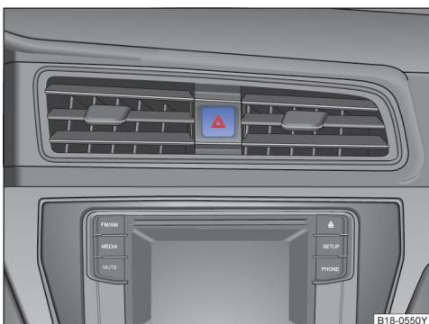

##  请首先阅读并注意引导信息和安全提示，见 ，第 236 页。

请遵守保护抛锚汽车的法律规定。在许多国家例如规定打开危险警告灯和放置三角警告牌⇒ 第 237 页。

## 核对表

为了自身安全和乘员安全，要按给出顺序遵照以下事项 ⇒  ：1. 与车流保持安全距离在合适的地面上停车 ⇒  。2. 用按钮  接通危险警告灯 ⇒ 图 179。3. 拉起手制动杆。4. 将换挡杆置于空挡位置或将选挡杆置于位置 P。5. 关闭发动机，然后将汽车钥匙从点火开关中取出。6. 请所有乘员下车并到远离车流的安全地带，例如到公路护栏后面。7. 如果离开本车，请随身携带所有汽车钥匙。8. 支起三角警告牌，使其他车辆驾驶员注意到本车。9. 让发动机充分冷却，如有必要请让专业人员处理。

在危险警告灯已接通的情况下，例如在牵引过程中可以通过操纵转向信号灯操纵杆显示转向或变换行东道，危险警报灯被暂时断开

例如在以下情况时要接通危险警告灯：

● 当前方车辆突然减速或道路拥堵时，以此向后方车辆示警。

● 存在某种紧急情况时。

● 当本车停止运转时。

● 在牵引时。

务必遵守当地关于使用危险警告灯的规定。

如果危险警告灯不工作，则必须根据法律规定使其它车辆注意到本车已抛锚。

## 警告

忽视这个对自身安全至关重要的核对表会导致事故和受伤。

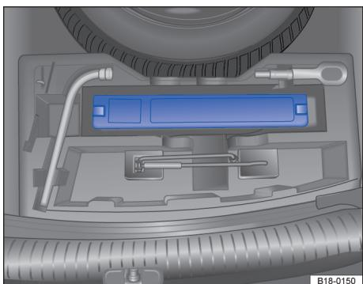  
图 180 行李厢地板下：三角警告牌的固定支架

## 三角警告牌

## 警告（续）

 请首先阅读并注意引导信息和安全提示，见 ，第 236 页。

三角警告牌位于行李厢地板下，并用紧固带固定。

● 务必遵循核对表中的操作，并遵守通用的安全防护措施。

## 警告

排气装置的部件可能会很热。可能导致火灾和受伤。

● 正确停车，切勿使排气装置部件接触到汽车下的易燃物质（例如干草、燃油）。

i 当危险警告灯较长时间处于接通状态时，汽车下也一样。

i 某些汽车在车速高于约 80 km/h（50 mph）时全制动期间，制动信号灯可能会闪烁，以此向后方的车辆示警。当制动继续进行时，在车速低于约 10 km/h 时，危险警告灯会自动接通。制动信号灯持续亮起。在加速时，危险警告灯重新自动关闭。

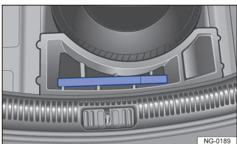  
图 181 两厢车型行李厢地板下：三角警告牌的固定支架

## 提示

三角警告牌的使用必须符合法律方面的规定。 

## 应急关闭或打开

##  主题引言

该章节包含有关下列主题的信息：

手动开启和闭锁驾驶员侧车门 . . . . . . 238

手动将副驾驶员车门和后车门上锁 . . . 239

行李厢盖应急解锁 . . . . 240

车门、行李厢盖和滑动 / 外翻式天窗例如在汽车钥匙或中央门锁失灵时可以手动锁止和部分解锁。

## 补充信息和警告说明：

● 汽车钥匙套件 ⇒ 第 50 页

● 中央门锁和锁止系统⇒ 第 53 页

● 车门⇒ 第 58 页

● 行李厢盖 ⇒ 第 60 页

● 天窗⇒ 第 67 页

● 在紧急情况下⇒ 第 236 页 ⇒ 第 236 页

## 警告

粗心地应急关闭或应急打开可能导致受伤。

● 切勿将儿童或需要帮助的人员单独留在车内。在紧急情况下，这些人员无法自行离开汽车或无法自救。

● 视季节而定，在锁止的汽车中可能出现很高或很低的温度，尤其可能引起幼儿受伤和生病或导致死亡。

## 警告

车门、行李厢盖和滑动 / 外翻式天窗的运行范围充满危险，并且可能造成伤害。

● 当翻转范围内没有人时，才可打开或关闭车门、行李厢盖和滑动 / 外翻式天窗。

## ① 提示

为了避免汽车损坏，在进行应急关闭或应急打开时要小心地拆卸和正确地装回部件。

## 手动开启和闭锁驾驶员侧车门

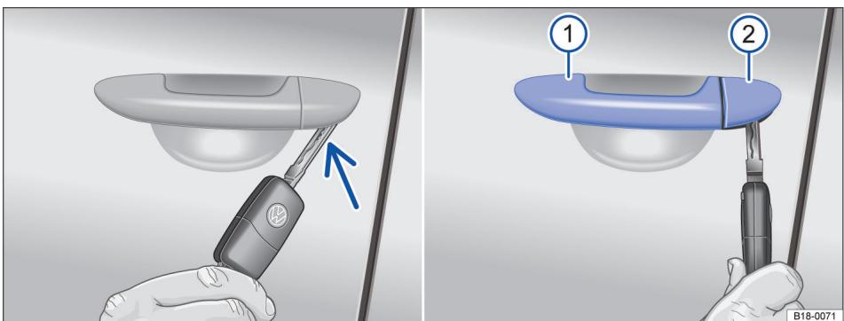  
图 182 取下在驾驶员车门内车门锁的盖罩

见 ，第 238 页。

驾驶员车门可以在无线遥控钥匙或中央门锁失灵时手动开锁和上锁。

● 拉起开门把手 ⇒ 图 182 1 。

● 将无线遥控钥匙的钥匙头从下面插入盖罩的开口内⇒ 图 182 2 。

● 转动钥匙以便松开盖罩并取下⇒ 图 182。

● 用钥匙头通过驾驶员车门上的车门锁将驾驶员车门手动上锁或开锁。

## 警告

● 把车门关闭上锁时切勿大意或失控。否则可能会给您自己或他人造成严重伤害！注意车门的转动范围内没有人。

## 手动将副驾驶员车门和后车门上锁

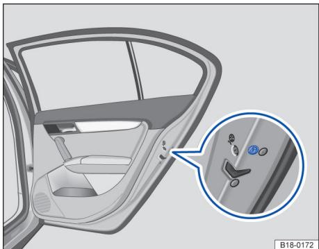  
图 183 左侧后车门端面处的应急上锁装置（由橡胶密封件遮盖着）

 请首先阅读并注意引导信息和安全提示，见 ，第 238 页。

## 车门可以手动上锁。

您可以将副驾驶员车门和后车门单独手动上锁。

副驾驶员车门和后车门上锁

● 打开副驾驶员车门或一扇后车门。

● 取下车门端面处的黑色橡胶密封件。⇒ 图 183

● 翻出钥匙头⇒ 第 51 页。

● 将钥匙插入槽口并向车外转动⇒ 图 184。

● 拔出钥匙并重新固定橡胶密封件。

● 将车门完全关闭⇒  。

● 检查此车门是否上锁。

● 在其它车门上进行同样的操作。

● 尽快到上汽大众经销商处检查本车。

## 警告（续）

● 切勿让儿童或需要帮助的人员单独逗留在车内。如果他们操作中央门锁按钮，便会将所有车门上锁。这样，儿童或者需要帮助的人员便无法自行离开汽车或者在发生紧急情况时进行自救。在发生交通事故时或紧急情况下，上了锁的车门会加大从车外救助乘员的难度。

● 尽可能把汽车停在远离车流的地方，然后进行相应的作业。

## ① 提示

松开盖罩时必须小心，以免造成汽车油漆损伤。

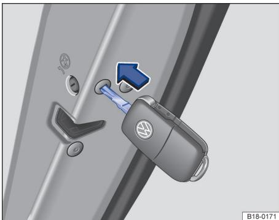  
图 184 车门应急上锁装置及汽车钥匙

## 警告

● 把车门关闭上锁时切勿大意或失控。否则可能会给您自己或他人造成严重伤害！注意车门的转动范围内没有人。

● 切勿让儿童或需要帮助的人员单独逗留在车内。如果他们操作中央门锁按钮，便会将所有车门上锁。这样，儿童或者需要帮助的人员便无法自行离开汽车或者在发生紧急情况时进行自救。在发生交通事故时或紧急情况下，上了锁的车门会加大从车外救助乘员的难度。

● 尽可能把汽车停在远离车流的地方，然后进行相应的作业。

i 如果拉动相应开门把手一次，可从车内重新将副驾驶员车门和后车门解锁。再次拉动车门开启把手即可打开车门。

行李厢盖应急解锁  
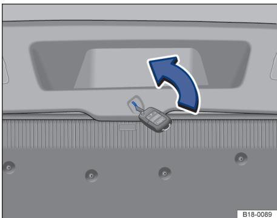  
图 185 行李厢盖应急开锁

  
 请首先阅读并注意引导信息和安全提示，见 ，第 238 页。

蓄电池电量过低时或门锁装置损坏时，可以从汽车内将行李厢盖开锁。

— 翻开汽车的遥控钥匙。

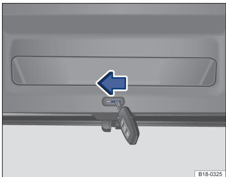  
图 186 部分车型行李厢盖应急开锁

— 将钥匙头完全插入行李厢盖饰板上的开口内⇒ 图 185 或⇒ 图 186。

— 将遥控钥匙沿箭头方向按压⇒ 图 185或⇒ 图 186以便使行李厢盖开锁。

## 警告

尽可能把汽车停在远离车流的地方，然后进行相应的作业。

## 随车工具

##  主题引言

该章节包含有关下列主题的信息：

放置 241

组件 242

在故障情况下保护本车时要遵守所在国的法律规定。

补充信息和警告说明：

● 在发动机舱中作业的准备工作 ⇒ 第 187 页

● 在紧急情况下 ⇒ 第 236 页

● 更换车轮 ⇒ 第 243 页

● 轮胎应急套件⇒ 第 243 页

## 警告

松散的随车工具、轮胎应急套件和备用车轮在突然进行紧急驾驶或制动操作时以及在发生事故时可能在车内抛飞并导致受伤。

● 要始终确保，随车工具、轮胎应急套件或备用车轮已可靠地固定在行李厢内。

## 警告

不适用的或损坏的随车工具可能导致事故和伤害。

● 切勿用不合适的或损坏的随车工具作业。

## 放置

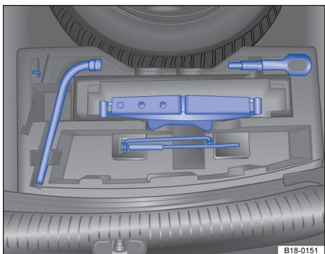  
图 187 行李厢盖板下部的随车工具

##  请首先阅读并注意引导信息和安全提示，见 ，第 241 页。

将行李厢地板向上翻开。

随车工具在行李厢地板下。

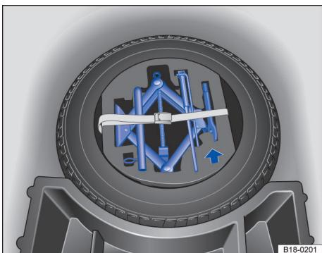  
图 188 两厢车型行李厢盖板下部的随车工具

## 警告

● 如果没有正确固定好随车工具，那么在突然制动时和发生交通事故时这些物品可能会在车内被抛起，造成严重的人身伤害。

● 请注意，每次都要将随车工具牢固地固定在行李厢内。

## 组件

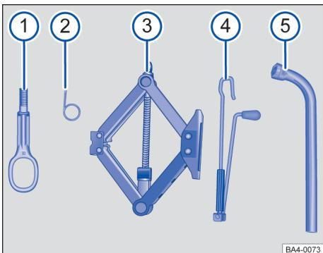  
图 189 随车工具的组件

 请首先阅读并注意引导信息和安全提示，见 ，第 241 页。

## 随车工具的组件

牵引环1

用于拔出车轮螺栓封盖的钢丝钩2

3 汽车千斤顶。将汽车千斤顶重新放回之前，应将千斤顶起重爪拧回至相应位置。三厢车型，应将起重爪完全拧回去；两厢车型应将起重爪拧至千斤顶箭头位置。

## 千斤顶摇把4

车轮扳手5

## 警告

错误使用汽车千斤顶可能造成严重的人身伤害

● 出厂时提供的汽车千斤顶按规定只能用于本车型。不得用它举升更重的汽车或其它重物，否则有人身伤害危险！

● 只能在坚实、平坦的地面上使用汽车千斤顶。

● 在汽车被举升时，切勿启动发动机，有发生事故的危险！震动的发动机可能使汽车从千斤顶上落下来。

● 在汽车仅由随车汽车千斤顶支撑着的情况下，身体部位（例如手臂和腿）切勿伸到汽车下面，有人身伤害危险！

● 如果需要到汽车下面去作业，必须另外用合适的垫块将汽车牢固支撑好，否则有人身伤害危险！

\- 轮胎损坏时，应尽可能将汽车停靠在远离车流的地方。并打开双跳灯、支起三角警告牌，请遵守有关的法规。
- 让所有乘员下车。
- 挂入某一挡位或将选挡杆置于位置P，拉起手制动杆，并固定住对侧的车轮。
- 请注意，地面应平坦且不光滑。必要时可在汽车千斤顶下面垫一块坚固的大垫板。
- 只能使用已经过上汽大众认可用于本车的汽车千斤顶。
- 不允许使用其它的、包括用于其它上汽大众车型的汽车千斤顶。汽车千斤顶可能会滑移，有人身伤害危险！
- 如果汽车处于朝一侧倾斜的状态，则切勿举升汽车，有人身伤害危险！
- 汽车举升起来后切勿启动发动机，有发生事故的危险！震动的发动机可能使汽车从千斤顶上落下来。
- 在汽车仅由随车汽车千斤顶支撑着的情况下，身体部位（例如手臂和腿）切勿伸到汽车下面，有人身伤害危险！
- 如果需要到汽车下面去作业，必须另外用合适的垫块将汽车牢固支撑好，否则有人身伤害危险！
- 如果是带有旋接式轮辋锁圈的轮辋，切勿松开螺栓连接，有发生事故的危险！

## 更换车轮

##  主题引言

该章节包含有关下列主题的信息：
更换车轮的准备工作 ..... 243
应急车轮 ..... 244
车轮螺栓 ..... 245
车轮螺栓 ..... 246
用汽车千斤顶举升汽车 ..... 247
更换车轮 ..... 248
更换车轮后 ..... 248
备用轮胎应急行驶须知 ..... 248

某些车型或车款出厂时不带汽车千斤顶和车轮扳手。在此类情况下，请让上汽大众经销商更换车轮。

只有当汽车已安全停车、熟悉必要的操作和安全防护措施且有合适的工具时，才能自行更换车轮！否则要请专业人员处理。

补充信息和警告说明：

● 外观视图 ⇒ 第 11 页

● 汽车钥匙套件 ⇒ 第 51 页

● 车轮和轮胎 ⇒ 第 220 页

● 在紧急情况下 ⇒ 第 236 页

● 随车工具 ⇒ 第 241 页

## 警告

## 更换车轮的准备工作

请首先阅读并注意引导信息和安全提示，见 ，第 243 页。

## 核对表

作为更换车轮的准备工作，务必按给出的顺序进行以下操作 ⇒  ：

1. 在轮胎失压时要尽可能与车流保持安全距离将汽车停到平坦而坚实的地面上。

2. 拉起手制动杆。

3. 自动变速箱：将选挡杆置于位置 P。

4. 关闭发动机，然后将汽车钥匙从点火开关中取出。

5. 手动变速箱：挂入挡位。

6. 请所有乘员下车并到安全地带，例如到公路护栏后面。

7. 用一块石头或其它合适的物品卡住斜对角的车轮。

8. 在行李厢已装载时：取出行李件。

## 核对表（续）

9. 从行李厢中取出备用车轮和随车工具。

10. 拆下车轮盖板 ⇒ 第 220 页。

## 警告

忽视这个对自身安全至关重要的核对表会导致事故和受伤。

● 务必遵循核对表中的操作，并遵守通用的安全防护措施。

## 应急车轮

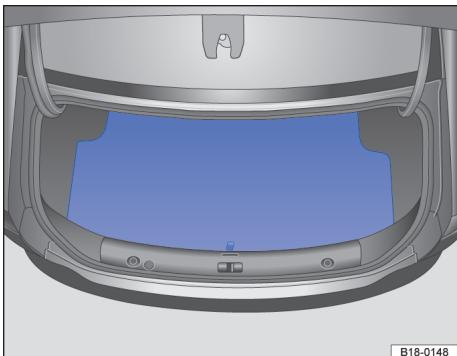  
图 190 抬起行李厢底板

 请首先阅读并注意引导信息和安全提示，见 ，第 243 页。

应急车轮在行李厢中底板下面。

## 取出应急车轮

— 打开行李厢盖。

— 提拉行李厢活动底板上的拉手环，以便使行李厢底板翻开。

— 向上翻起行李厢底板并将其拿出。

— 拿出工具盒⇒ 图 191 2 ，以便取出应急车轮。

— 将应急车轮中部的螺栓完全拧出⇒ 图 191 1 。

— 从行李厢中取出应急车轮。

## 警告

● 如果应急车轮未正确固定好，那么在突然制动时和发生交通事故时它可能会在车内被抛起，造成严重的人身伤害。

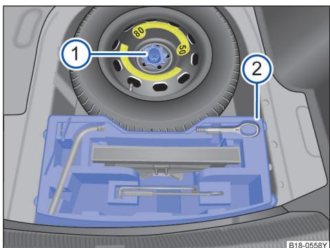  
图 191 向上翻起的行李厢底板下的应急车轮

## 警告（续）

● 请注意，每次都要把应急车轮或换下来的车轮牢靠地固定在行李厢中。

● 切勿使用已受损或轮胎已磨损到磨损标记的应急车轮。

● 尽快用普通轮胎更换应急车轮，因为应急车轮仅适合暂时短时使用。

● 仅在应急的情况下才能使用寿命已超过6年的应急车轮，驾驶汽车时要特别小心。

● 行驶车速请勿超过80km/h（50mph）！请避免油门全开加速、紧急制动和急转弯行驶！

● 在前轴（驱动桥）上安装了应急车轮的情况下，行驶距离切勿超过200km。

● 同一部汽车上不能安装一个以上的应急车轮行驶。

● 安装应急车轮后尽快检查轮胎充气压力，“检查轮胎气压”。轮胎充气压力与本车使用的普通轮胎的相同。轮胎充气压力标在油箱盖内侧的一个贴签上。

● 出于技术上的原因，不允许在应急车轮上使用防滑链。如果必须使用防滑链行车，则在前轮发生故障的情况下要将紧凑型应急车轮安装在后轴

## 警告（续）

上。然后将这个空出来可供行驶的后轮替换有故障的前轮。建议在准备安装车轮前先捆好防滑链。

## 车轮螺栓

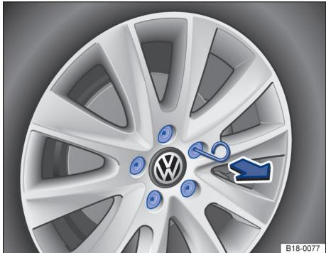  
图 192 从车轮螺栓上拔下盖罩

##  请首先阅读并注意引导信息和安全提示，见 ，第 243 页。

拧松车轮螺栓时只能使用本车随附的车轮扳手。

只要本车还没有用千斤顶举升起来，就只能将车轮螺栓拧松约一圈。

如果某个车轮螺栓无法拧松，可以小心地用脚踩在车轮扳手的端部向下压。同时要固定住汽车，并确保可靠静止。

## 拔下车轮螺栓的盖罩

● 从随车工具中取出钢丝钩。

● 将钢丝钩穿过开口插入盖罩内⇒ 图 192，然后沿箭头方向将其拔下。

● 用此钢丝钩将所有其它盖罩拔下来。

## 拧松车轮螺栓

● 将车轮扳手套到车轮螺栓上，然后推到限位位

置⇒ 图 193。

● 握住车轮扳手的一端，将车轮螺栓向左转动大约一圈。⇒

● 如果无法拧动车轮螺栓，可以小心地用脚踩在车轮扳手的端部向下压。此时要用手扶住汽车站稳。

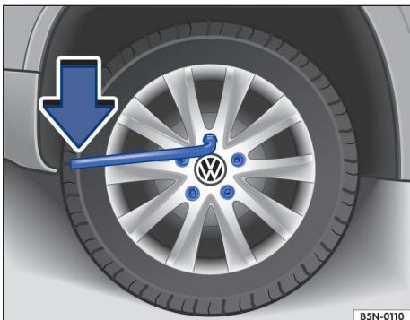  
图 193 更换车轮：松开车轮螺栓

## 警告

错误拧紧的车轮螺栓在行驶过程中可能松开，然后导致事故、受伤和失去对汽车的控制。

● 请仅使用与各个轮辋对应的车轮螺栓。

● 切勿使用不同的车轮螺栓。

● 车轮螺栓和轮毂的螺纹线必须洁净、易拧、无机油和油脂。

● 务必只用汽车出厂时随附的车轮扳手来松开和固定车轮螺栓。

● 只要本车还没有用千斤顶举升起来，就只能将车轮螺栓拧松约一圈。

● 切勿在车轮螺栓上和轮毂中的螺纹线上涂敷油脂或涂油。否则即使具有规定的拧紧力矩，在行驶期间也可能松开。

● 切勿松开带旋接式轮辋锁圈的轮辋的螺栓连接。

● 如果用过低的拧紧力矩拧紧车轮螺栓，则车轮螺栓和轮辋在行驶期间可能松开。拧紧力矩过高则可能导致车轮螺栓或螺纹损坏。

## 车轮螺栓

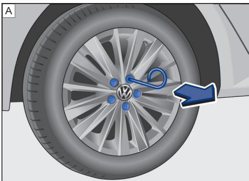

B  
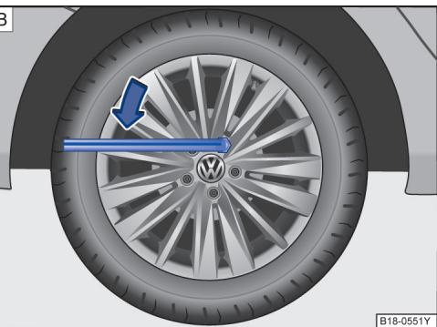  
图 194 .从车轮螺栓上拔下盖罩，B.更换车轮：松开车轮螺栓

##  请首先阅读并注意引导信息和安全提示，见 ，第 243 页。

拧松车轮螺栓时只能使用本车随附的车轮扳手。

只要本车还没有用千斤顶举升起来，就只能将车轮螺栓拧松约一圈。

如果某个车轮螺栓无法拧松，可以小心地用脚踩在车轮扳手的端部向下压。同时要固定住汽车，并确保可靠静止。

## 拔下车轮螺栓的盖罩

● 从随车工具中取出钢丝钩。

● 将钢丝钩穿过开口插入盖罩内⇒ 图 194，然后沿箭头方向将其拔下。

● 用此钢丝钩将所有其它盖罩拔下来。

## 拧松车轮螺栓

● 将车轮扳手套到车轮螺栓上，然后推到限位位置⇒ 图 194。

● 握住车轮扳手的一端，将车轮螺栓向左转动大约一圈。⇒▲

## 警告

错误拧紧的车轮螺栓在行驶过程中可能松开，然后导致事故、受伤和失去对汽车的控制。

● 请仅使用与各个轮辋对应的车轮螺栓。

● 切勿使用不同的车轮螺栓。

● 车轮螺栓和轮毂的螺纹线必须洁净、易拧、无机油和油脂。

● 务必只用汽车出厂时随附的车轮扳手来松开和固定车轮螺栓。

● 只要本车还没有用千斤顶举升起来，就只能将车轮螺栓拧松约一圈。

● 切勿在车轮螺栓上和轮毂中的螺纹线上涂敷油脂或涂油。否则即使具有规定的拧紧力矩，在行驶期间也可能松开。

● 切勿松开带旋接式轮辋锁圈的轮辋的螺栓连接。

● 如果用过低的拧紧力矩拧紧车轮螺栓，则车轮螺栓和轮辋在行驶期间可能松开。拧紧力矩过高则可能导致车轮螺栓或螺纹损坏。

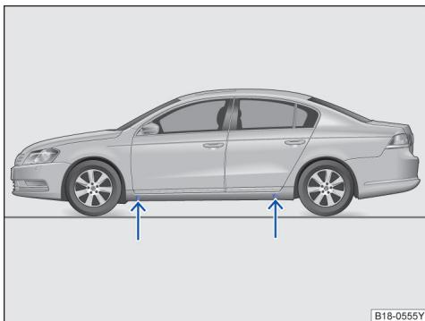  
图 195 用于汽车千斤顶的支撑点

 请首先阅读并注意引导信息和安全提示，见 ，第 243 页。

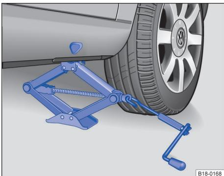  
图 196 安放汽车千斤顶  
只允许在汽车千斤顶支撑点上举升汽车。  
在将要更换的车轮的螺栓拧松之后，再举升汽车

汽车千斤顶只允许放置在图示支撑点（车身上的标记）处⇒ 图 195 或 ⇒ 图 196。在每个车轮旁都有相应的支撑点 ⇒  。

## 核对表

为了自身安全和乘员安全，要按给出顺序遵照以下事项 ⇒  ：

1. 为举升汽车选择平坦而坚实的地面。

2. 挂入某一挡位或将选挡杆置于位置 P。

3. 固定或用合适的物品卡住与待更换车轮成对角的车轮。例如，如要更换左后车轮，则卡住右前车轮。

4. 将千斤顶摇把末端钩入汽车千斤顶丝杆轴上的孔内，保证两者可靠链接。

5. 找到汽车千斤顶的支撑点（标记位于车身上）⇒ 图 195。

6. 摇高汽车千斤顶，直到还能将其放到汽车支撑点下为止。

7. 检查千斤顶底座的整个平面是否牢靠地贴在地面上。

8. 调准汽车千斤顶，同时继续摇高千斤顶卡爪，直到卡爪抓住汽车下面的棱边⇒ 图 196⇒  。

9. 继续摇高汽车千斤顶，直到汽车车轮刚好离开地面。

## 警告

不恰当操作千斤顶可能使汽车滑下，由此造成严重的伤害。为了降低人身伤害的危险，请阅读并注意下列几点：

● 汽车千斤顶下的地面松软会导致汽车从汽车千斤顶上滑下。因此必须将汽车千斤顶安放在坚实的地面上。必要时可在千斤顶下面垫一块坚固的大垫板。在光滑地面（例如瓷砖地面）上应在千斤顶底座下垫一块防滑垫（例如橡胶垫）。

● 将汽车千斤顶置于汽车下面相应的支撑点下。

● 如果汽车千斤顶没有放在所描述的位置上，便会有人身伤害危险！此外，还可能会导致汽车损坏。

## 警告（续）

● 汽车千斤顶的起重爪必须卡住汽车边梁的棱边，这样汽车千斤顶在举升汽车时便不会发生滑移 。

● 在汽车仅由随车汽车千斤顶支撑着的情况下，身体部位（例如手臂和腿）切勿伸到汽车下面，有人身伤害危险！

● 让所有乘客下车。他们下车后应待在远离危险区域的地方，例如到公路护栏的后面。

● 只有在汽车中无人时，才可举升汽车。

● 汽车举升起来后切勿启动发动机，有发生事故的危险！震动的发动机可能使汽车从千斤顶上落下来。

● 如果汽车处于朝一侧倾斜的状态，则切勿举升汽车，有人身伤害危险！

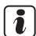

## 警告

忽视这个对自身安全至关重要的核对表会导致事故和受伤。

## 更换车轮

 请首先阅读并注意引导信息和安全提示，见 ，第 243 页。

## 取下车轮

● 将车轮螺栓完全拧出，并放在干净的垫子上。

● 取下车轮，并将该车轮放入行李厢中。

## 安装应急车轮

● 放上应急车轮。

● 拧上所有的车轮螺栓。

● 用汽车千斤顶放下汽车。

● 用车轮扳手拧紧车轮螺栓。请勿依次拧紧螺栓，而是要以对角的形式交替地逐步拧紧。

● 必要时安装盖罩、车轮中心装饰罩或全封闭式车轮装饰罩 ⇒ 第 243 页。

更换车轮时如发现车轮螺栓已锈蚀或难以拧动，则检查拧紧力矩前必须更换这些螺栓和清洁轮毂的螺纹线。

尽快更换这个损坏的车轮。

## 标有滚动方向的轮胎

花纹有方向性的轮胎必须按规定转动方向安装。

## 更换车轮后

 请首先阅读并注意引导信息和安全提示，见 ，第 243 页。

汽车上配备应急车轮。

● 将行李厢垫向上翻，将行李厢垫的拉手钩在行李厢顶部的橡胶条上固定。

● 将替换下来的车轮放入备用车轮槽中，并用固定手柄固定。

● 放下行李厢垫并安置妥当。

● 关闭行李厢盖。

● 尽快更换这个损坏的车轮。

## 备用轮胎应急行驶须知

 请首先阅读并注意引导信息和安全提示，见 ，第 243 页。

## 警告（续）

● 务必遵循核对表中的操作，并遵守通用的安全防护措施。

如果轮胎花纹有方向性，则可从轮胎侧壁上标示滚动方向的箭头上看出。必须按这个规定的转动方向使用轮胎。只有这样，才能使这个轮胎在附着性、减低噪音、耐磨损和抗滑水方面完全发挥其最佳性能。

如果不得不逆着转动方向安装车轮，则行驶时必须小心，因为在这种情况下不能保证轮胎的最佳性能。在潮湿的路面上更要注意。为了能重新充分利用有方向性要求的轮胎的优点，要尽快更换或更换轮胎，重新恢复轮胎的正确转动方向。

## 警告

● 在更换车轮时，要保持车轮螺栓及其在轮毂中的螺纹线的清洁。车轮螺栓必须易拧。

● 切勿在车轮螺栓及轮毂中的螺纹线上涂油脂或机油。否则即使用规定的拧紧力矩拧紧了，车轮螺栓在行车期间也可能会自行松开，有发生事故的危险！

● 请阅读和遵守有关的信息和警告说明⇒ 第 245 页。

更换车轮时如发现车轮螺栓已锈蚀或难以拧动，则检查拧紧力矩前必须更换这些螺栓和清洁轮毂的螺纹线。

● 对于装备有黄色限速警告标记的应急备用轮胎的车辆，该备用轮胎只作紧急状态下使用，请尽快修复或更换新的轮胎。

● 如果汽车带有胎压监测系统，在更换车轮后必须让系统重新记忆有关的参数。

## 备用轮胎应急行驶须知

– ESP必须处于打开状态，如已关闭，则应将其打开。

– 务必慢速（最高不超过80 km/h)谨慎行驶。

– 尽可能避免紧急制动和急转弯。

– 避免驶越障碍物（如路缘）和坑洼路面。

– 尤其须注意，ESP进入调节状态时如轮胎冒出烟雾，闻到橡胶味，汽车开始颤动，并发出敲击声时，切不可继续行驶，必须立即停车！ 

## 保险丝

##  主题引言

该章节包含有关下列主题的信息：

汽车中的保险丝 250
更换烧断的保险丝 251
车内保险丝列表 251

由于汽车的持续后续开发、保险丝视装备而定的分配和通过一个保险丝同时保护多个用电器，所以手册印刷时不能给出某个用电器的保险丝位置的最新概览。保险丝配置的细节信息可向上汽大众经销商咨询。

原则上多个用电器可以通过一个保险丝共同加以保护。反过来，一个用电器也可以有多个保险丝。

在已排除故障原因时，才可更换保险丝。如果新安装的保险丝不久后再次熔断，则必须尽快让上汽大众经销商检测电气装置。

补充信息和警告说明：

● 在发动机舱中作业的准备工作 ⇒ 第 187 页

## 警告

电气装置的高压可能导致电击、严重烧伤和死亡！

● 切勿触摸点火装置的电线。

## 汽车中的保险丝

请首先阅读并注意引导信息和安全提示，见 ，第 250 页。  
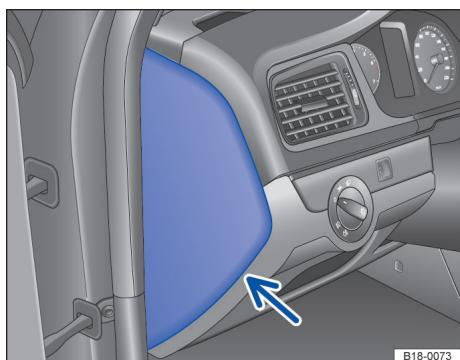  
图 197 仪表板的左侧：保险丝盒的盖板

## 警告（续）

● 避免电气装置中发生短路。

## 警告

使用不合适的保险丝、修理保险丝和在不使用保险丝的情况下跨接电路可能导致火灾和受伤。

● 切勿安装额定电流值更高的保险丝。损坏的保险丝只可用具有相同电流强度（相同颜色和相同印刷文字）和相同尺寸的保险丝更换。

● 切勿修理损坏的保险丝。

● 切勿用金属条、回形针或类似物品代替保险丝。

## ①提示

● 为了避免损坏车内电气装置，每次更换保险丝前都要关闭点火开关、车灯和所有用电器，将汽车钥匙从点火开关中拔出。

● 如果用电流更大的保险丝更换损坏的保险丝，则电气装置的其它部位也可能出现损坏。

● 必须防止污物和湿气渗入已打开的保险丝盒。保险丝盒中的污物和湿气会造成电气装置损坏。

个用电器可以有多个保险丝。

多个用电器可以通过一个保险丝共同加以保护。

损坏的保险丝只可用具有相同电流强度（相同颜色和相同印刷文字）和相同尺寸的保险丝更换。

打开仪表板中的保险丝盒

● 关闭点火开关和相关电器。

● 打开驾驶员侧车门。

● 将平头物品插入凹槽⇒ 图 197中（箭头），然后小心地撬下盖板。

## ① 提示

● 为了避免汽车损坏，要小心地拆下和重新正确安装保险丝盒的盖板。

● 必须防止污物和湿气渗入已打开的保险丝盒。保险丝盒中的污物和湿气会造成电气装置损坏。

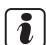

本车中还有本章中未说明的其它保险丝。这些保险丝只可由上汽大众经销商更换。

## 更换烧断的保险丝

 请首先阅读并注意引导信息和安全提示，见 ，第 250 页。

## 准备工作

● 关闭点火开关、车灯和所有用电器。

● 打开相应的保险丝盒 ⇒ 第 250 页。

## 识别烧断的保险丝

烧断的保险丝可通过熔断的金属条来识别。

用手电筒照亮保险丝。这样可更好地识别烧断的保 险丝。

## 更换保险丝

● 拔出有关的保险丝。

● 如果保险丝已烧断，只可使用一个具有相同电流强度（相同颜色和相同印刷文字）和相同尺寸的新保险丝更换。⇒

● 重新安装盖板。

汽车上的每个电路均由熔断式保险丝保护。建议时刻随车携带若干备用保险丝。可到上汽大众经销商处购买。

如果用电流更大的保险丝更换损坏的保险丝，则电气装置的其它部位可能出现损坏。

## 车内保险丝列表

 请首先阅读并注意引导信息和安全提示，见 ，第 250 页。

## 仪表板内保险丝盒的保险丝分配

下面是重要电器的保险丝位置一览表。右列是安插位置，后面的括号里为保险丝电流强度（安培）。

<table><tr><td>电器</td><td>保险丝编号(后面括号中为相应电流强度,单位:安培)</td></tr><tr><td>尾灯/后盖(Bluemotion、Crossline 车型:左侧位置灯)</td><td>1 (5/20)</td></tr><tr><td>尾灯/后盖(Bluemotion、Crossline 车型:右侧位置灯)</td><td>2 (5/20)</td></tr><tr><td>背光/牌照灯/氛围灯</td><td>3 (5)</td></tr><tr><td>左侧近光灯</td><td>4 (10)</td></tr><tr><td>右侧近光灯</td><td>5 (10)</td></tr><tr><td>左侧远光灯/右侧远光灯</td><td>6 (15)</td></tr><tr><td>收音机左侧远光灯/右侧远光灯(BCM MAX 车型)</td><td>7 (5/15)</td></tr></table>

如果新更换的保险丝不久后再次熔断，则必须尽快让上汽大众经销商检查本车的电气系统。

## 警告

● 使用不合适的或修理过的保险丝可能会引起失火，导致人身伤害和事故。

● 切勿对已损坏的保险丝进行修理。

● 切勿将额定电流较大的保险丝作为替换品使用。

● 用来更换的保险丝必须额定功率相同（颜色和印刷标识都相同）、结构尺寸也相同。

● 切勿把金属条、回形针或者类似的物品用作保险丝，即使短时间也不行！

## 提示

● 如果用电流更大的保险丝更换损坏的保险丝，则电气装置的其它部位可能出现损坏。

发动机舱内另有一个保险丝盒。

<table><tr><td>电器</td><td>保险丝编号(后面括号中为相应电流强度,单位:安培)</td></tr><tr><td>雾灯</td><td>8(10)</td></tr><tr><td>BCMB(处理器)/CNG Relay</td><td>9(15)</td></tr><tr><td>收音机/BCMA</td><td>10(5)</td></tr><tr><td>诊断接口</td><td>11(5)</td></tr><tr><td>停车灯/驻车灯</td><td>12(7.5/10)</td></tr><tr><td>外后视镜调节</td><td>13(5)</td></tr><tr><td>自动防眩目后视镜/PDC 控制器/定速巡航/空调/收音机/诊断开关/大灯开关/计价器</td><td>14(5/10/15)</td></tr><tr><td>转向柱开关/倒车灯开关/近光灯高度调节电机/DCDC 控制器/大灯高度调节</td><td>15(5/10)</td></tr><tr><td>BCMB</td><td>16(7.5/10)</td></tr><tr><td>换挡手柄/P 挡锁止/kessy 控制器</td><td>17(5)</td></tr><tr><td>BCMA</td><td>18(10)</td></tr><tr><td>雨量传感器/后视摄像头/BCMA/后视镜加热/诊断接口/转向柱开关</td><td>19(7.5/10)</td></tr><tr><td>自动空调</td><td>20(5)</td></tr><tr><td>1.6仪表/1.4仪表/仪表</td><td>21(5)</td></tr><tr><td>燃油泵继电器/离合器传感器/1.4T燃油泵/1.6发动机控制器/1.4发动机控制器/发动机控制器/离合器控制器</td><td>22(5)</td></tr><tr><td>刹车灯传感器/ESP控制器/ESP开关/转向柱开关/组合开关/ABS</td><td>23(10)</td></tr><tr><td>气囊控制器</td><td>24(5/10)</td></tr><tr><td>机械空调/自动空调/1.6仪表/1.4仪表/仪表</td><td>25(5/10)</td></tr><tr><td>1.6仪表/1.4仪表/BCMA/整流器/电子转向柱</td><td>26(5/20/10)</td></tr><tr><td>诊断接口</td><td>27(5)</td></tr><tr><td>燃油泵/KL86继电器/1.6燃油泵继电器/1.4燃油泵控制器/燃油泵控制器</td><td>28(15)</td></tr><tr><td>转向柱开关(光喇叭)/大灯开关</td><td>29(15)</td></tr><tr><td>空调压缩机继电器</td><td>30(10/15)</td></tr><tr><td>远/近光灯</td><td>31(30)</td></tr><tr><td>雨刮水泵</td><td>32(7.5/10)</td></tr><tr><td>点烟器</td><td>33(10/15)</td></tr><tr><td>启动继电器/(Bluemotion车型:DCDC控制器)/收音机(带/不带启停功能车型)/顶灯/顶灯继电器</td><td>34(10/20/40)</td></tr><tr><td>左前摇窗机/左侧门摇窗机</td><td>35(20/30)</td></tr><tr><td>右前摇窗机/右侧门摇窗机</td><td>36(20/30)</td></tr><tr><td>天窗/车顶灯/防盗/GPS</td><td>37(20)</td></tr><tr><td>自动空调/机械空调/鼓风机</td><td>38(30)</td></tr><tr><td>座椅加热控制器/BCMB/顶灯继电器</td><td>39(15/20/30)</td></tr><tr><td>kessy用转向柱(后雨刮)(Bluemotion、Crossline车型:转向柱开关、前雨刮开关)/雨刮开关</td><td>40(10)</td></tr><tr><td>倒车灯开关/后雨刮电机/DCDC控制器/启动继电器/KL50继电器/启动继电器(两厢车型:后雨刮电机)</td><td>41(7.5/10/15)</td></tr></table>

<table><tr><td>电器</td><td>保险丝编号(后面括号中为相应电流强度,单位:安培)</td></tr><tr><td>ESP 控制器/计价器/空车灯/空车灯开关</td><td>42(10/20)</td></tr><tr><td>前氧传感器/后氧传感器/1.4MQ 前氧传感器/Movo 对接件/前氧/后氧传感器</td><td>43(15)</td></tr><tr><td>转向柱开关/kessy 用转向柱/空调压缩机继电器(Bluemotion、Crossline)车型:冷却风扇/空调压缩继电器/Movo 对接件/空调压力传感器/冷却风扇控制器/刹车灯传感器/燃油剂量计/循环泵</td><td>44(7.5/10)</td></tr><tr><td>1.6 变速箱/1.4 变速箱/换挡手柄/防盗/GPS/1.6 自动变速箱控制器/1.4 自动变速箱控制器/1.2 自动变速箱控制器</td><td>45(5/10/15)</td></tr><tr><td>制动灯/转向灯</td><td>46(25)</td></tr><tr><td>前雨刮</td><td>47(25)</td></tr><tr><td>后风窗加热</td><td>48(25/30)</td></tr><tr><td>中央集控</td><td>49(20)</td></tr><tr><td>喇叭</td><td>50(20)</td></tr><tr><td>收音机/导航收音机(Bluemotion 车型:DCDC 控制器)/DCDC 控制器</td><td>51(20/30)</td></tr><tr><td>后门摇窗机</td><td>52(30)</td></tr><tr><td>喷油嘴/1.6 喷油嘴/1.6 凸轮轴调节阀/1.6 活性炭容器电磁阀/1.4 机油压力阀/1.4 活性炭容器电磁阀/1.4 凸轮轴调节阀/机油压力阀/活性炭容器电磁阀/凸轮轴调节阀</td><td>53(10/15)</td></tr><tr><td>点火线圈</td><td>54(20)</td></tr></table>

● 多个电器可能会共同由某一个保险丝加以 保护。

● 车内还有其它的保险丝。这些保险丝应由上汽大众经销商来更换。

● 不同型号和装备的汽车其保险丝号码和插接位置，请参照保险丝盒上的孔位标示符，本书中的保险丝信息均以定稿时的车辆状态为准，如今后车辆状态发生变化，车辆保险丝的分配情况可能与表中列出的有所不同。相关信息请咨询上汽大众经销商。

## 更换灯泡

## 一般说明

通常不先拆下其它的汽车零件是无法更换灯泡的。对于那些只能从发动机舱才能接近的灯泡，情况更是如此。因此进行这项工作需要专门的技能。

因此我们建议您前往上汽大众经销商处更换灯泡。

## 小心

在发动机舱工作时要特别小心注意！

● 灯泡是有压力的，更换时有可能爆炸——注意伤害危险！

## 应急启动

##  主题引言

该章节包含有关下列主题的信息：

跨接起动操作方法 . . . . 254

若因蓄电池放完电无法启动发动机，则可通过跨接电缆连接另一辆汽车的蓄电池启动发动机。

用于连接的跨接电缆的横截面面积必须足够大。

补充信息和警告说明：

● 起步辅助系统⇒ 第 156 页（发动机自动起停运行模式）

● 在发动机舱中作业的准备工作⇒ 第 187 页

● 汽车蓄电池⇒ 第 198 页

## 警告

● 汽车发动机舱属高危区域，谨防引发伤亡事故！在发动机舱内作业前务必仔细阅读和遵守相关完全警告说明 。

● 对蓄电池作业前务必仔细阅读和遵守相关警告说明。

## ① 提示

● 跨接启动时两车切勿相互接触，否则，一旦连接两蓄电池正极，电流立即流通。

● 无电蓄电池必须与整车电气系统正确连接。

## 跨接起动操作方法

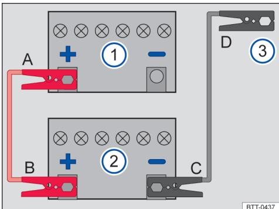  
图 198 图 191 跨接起动不带发动机自动起停系统轿车时的跨接电缆连接方法：无电蓄电池 1 和供电蓄电池 2

 请首先阅读并注意引导信息和安全提示，见 ，第 254 页。

无电蓄电池必须与轿车电气系统正确连接。

两车不得相互接触，否则，一旦连接正极，电流立即流通。

跨接电缆线夹与蓄电池接线柱之间的金属必须接触 良好。

如发动机未能立即起动，则约 10 秒钟后关闭起动机，约半分钟后再次尝试起动发动机。

## 连接跨接电缆

必须按上图所示A–B–C–D的顺序连接跨接电缆⇒ 图 198 和⇒ 图 199。

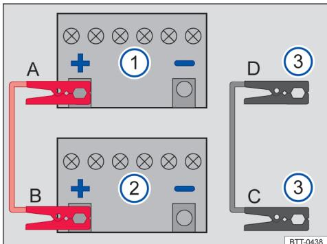  
图 199 图 192 跨接起动带发动机自动起停系统轿车时的跨接电缆连接方法：无电蓄电池 1 和供电蓄电池 2

● 关闭两车点火开关。

● 打开发动机舱内的蓄电池盖板。

● 将红色跨接电缆的一端连接到无电蓄电池 1 的正极接线柱⇒ 图 198 + 或⇒ 图 199 + ⇒  。

● 将红色跨接电缆的另一端连接到供电蓄电池 2的正极接线柱 + 。

● 不带发动机自动起停系统的轿车：将黑色跨接电缆的一端连接到供电蓄电池 2 的起动连接点（接地点），如无起动连接点，则连接到供电蓄电池的负极接线柱 - ⇒ 图 198。

● 带发动机自动起停系统的轿车：将黑色跨接电缆3 的一端连接到跨接起动点（接地点），如无跨接起动点，则连接到轿车前端牵引环上，或连接到发动机缸体上或发动机缸体上的螺栓连接金属部件上 ⇒ 图 199。

● 将黑色跨接电缆 3 的另一端连接到无电蓄电池1 的跨接起动点（接地点），如无跨接起动点，则连接到轿车前端牵引环上 ，或连接到发动机缸体上或发动机缸体上的螺栓连接金属部件上⇒  。

● 连接跨接电缆时须妥善安置跨接电缆，注意勿使电缆与发动机舱内的运动部件接触。

## 起动发动机

● 起动供电蓄电池轿车的发动机，起动后怠速运转。

● 起动无电蓄电池轿车的发动机，等一至两分钟，直至发动机“平稳”运转。

## 拆卸跨接电缆

● 拆卸跨接电缆前必须关闭处于打开状态的近光前 照灯。

● 打开无电蓄电池轿车空调系统鼓风机和后风窗加热器，降低拆卸跨接电缆时产生的电压峰值。

● 必须按上图所示D-C-B-A的顺序拆卸跨接电缆⇒ 图 198 和⇒ 图 199。

● 关闭蓄电池盖板。

● 必要时，拆下轿车前端牵引环 。

## 警告

不按上述操作规程跨接起动发动机可能导致蓄电池爆炸，严重致伤人员！为防止蓄电池爆炸，操作时务必遵守下列规定：

● 对轿车蓄电池和电气系统作业时务必充分了解其危险性。操作不当极易引发火灾、化学灼伤和触电，故对轿车蓄电池作业前务必仔细阅读本说明书相关警告和安全说明，轿车蓄电池。

● 操作时务必戴护目镜，注意不要倾斜蓄电池。

## 警告

跨接电缆使用不当可能导致蓄电池爆炸，引发严重伤亡事故！为降低事故风险，请务必遵守下列规定：

● 在发动机舱内作业时请务必仔细阅读和遵守相关安全警告说明 。

## 警告（续）

● 请务必仔细阅读和遵守蓄电池作业相关安全警告说明 。

● 供电蓄电池的电压必须与无电蓄电池的电压（12V）相同，两蓄电池的容量也应尽可能相同

（见蓄电池上标注的规格），否则，可能引起爆炸！

● 若蓄电池结冰，则不得使用跨接电缆启动发动机，否则，极易引起爆炸！即便蓄电池解冻后其内的电解液也可能泄漏，导致化学烧蚀。故结冰的蓄电池必须更换！

● 请严格按跨接电缆制造商提供的操作说明进行操作。

● 不得将负极电缆直接连接到无电蓄电池的负极接线柱上，否则，蓄电池产生的气体可能被电火花点燃，引起爆炸！

● 蓄电池附近不得有静电，因蓄电池内的气体可能被静电产生的电火花点燃，引起爆炸！

● 不得将负极电缆连接到燃油系统部件上或制动软管/管路上。

● 接线夹的非绝缘部位不得相互接触，此外，与蓄电池正极接线柱连接的跨接电缆不得与汽车的金属部件接触，否则，可能短路。

● 适当安置跨接电缆，注意避免使其与发动机舱内的运动部件接触。

● 操作时切勿俯身对着蓄电池，谨防被酸液烧伤！

## ① 提示

在利用外接电源对车辆蓄电池充电时，请勿将充电器的负极接在蓄电池的负极上，必须连接到发动机壳体上或发动机机舱内的接地点处。

● 跨接电缆连接不当可能严重损坏整车电气系统。● 两车不得相互接触，否则，一旦连接正极，电流立即流通。

i 连接电缆线夹时应使其与蓄电池接线柱之间的金属良好接触。

● 若未能成功启动，则10秒钟后关闭启动机，约等半分钟后再次尝试启动。

## 牵引启动和牵引

##  主题引言

该章节包含有关下列主题的信息：

牵引启动提示 256
关于牵引的提示 257
安装前部牵引环 257
安装前部牵引环（部分车型） 258
安装后部牵引环 258
牵引时的驾驶提示 259

在牵引时要遵守相关法律规定。

出于技术上的原因，不允许牵引汽车蓄电池电量耗尽的汽车。

补充信息和警告说明：

● 外观视图 ⇒ 第 11 页

● 发动机控制单元和废气净化装置⇒ 第 233 页

## 警告

基于技术原因，不得牵引启动蓄电池无电的汽车。

## 牵引启动提示

 请首先阅读并注意引导信息和安全提示，见 ，第 256 页。

原则上不要牵引启动汽车。而要使用辅助启动⇒ 第 254 页。

出于技术上的原因，不得牵引启动以下汽车：

● 带自动变速箱的汽车。

● 带Kessy无钥匙系统的汽车，因为电子转向柱锁止装置可能不能解锁。

● 在汽车蓄电池电量耗尽的汽车上，发动机控制单元可能不正常工作。

然而如果必须牵引启动汽车（手动变速箱）：

● 挂入 2 挡或 3 挡。

● 保持踩下离合器。

## 警告（续）

● 行驶中切不可从点火开关上拔下点火钥匙，否则，极易引发事故！因电子转向柱锁可能突然锁止，汽车不能转向。

## 警告

牵引时汽车的行驶性能和制动反应特性均将发生变化，故牵引时务必注意下列要点，防止受伤和引发事故：

● 无经验的驾驶员切勿试图进行牵引作业，引发事故！

● 被牵引车驾驶员须知：

– 因制动助力器不工作，故制动时必须用比正常情况大得多的力量踏制动踏板，注意不要撞到前面的牵引车。

● 牵引车驾驶员须知：

– 加速时务必格外谨慎，并尽可能避免急转弯。

– 应根据情况提前制动，但应轻踏制动踏板。

## ① 提示

● 牵引启动发动机时燃油可能进入并损坏催化转换器。

● 打开点火开关和危险警告灯。

● 当两辆汽车都处在移动中时，松开离合器。

● 发动机一启动，立即踩下离合器并退出挡位，以防止被牵引汽车撞上牵引汽车。

## ①提示

在牵引启动时，未燃烧的燃油可能进入尾气催化净化器从而导致损坏

## 关于牵引的提示

 请首先阅读并注意引导信息和安全提示，见 ，第 256 页。

## 牵引绳或牵引杆

使用牵引杆可最谨慎和最安全地牵引。只在没有牵引杆时，才可使用牵引绳。

牵引绳应当有弹性，以保护两辆汽车。最好使用人造纤维绳或由类似弹性材料制成的绳索。

牵引绳或牵引杆只可固定在规定用于牵引汽车的牵引环或牵引装置上。

## 牵引带自动变速箱的汽车

对于被牵引的汽车要注意以下事项：

● 挂入选挡杆位置 N。

● 切勿以高于 30 km/h 的车速牵引。

● 牵引距离不得超过 50 km（30 英里）。

● 使用专用牵引车时只允许抬起被牵引车的前车轮进行牵引。

## 何时不允许牵引本车？

在以下情况时不允许牵引本车，而必须用专用运输车或挂车运输：

● 某种损坏使本车的变速箱不再有润滑剂时。

● 在汽车蓄电池电量耗尽时，因为转向系保持锁死状态并且可能此前已电子转向柱锁止装置无法松开。

● 带自动变速箱的汽车的牵引距离超过 50 km（30 英里）时。

## 警告

若无视上述规定强行牵引本车，则可能引发事故，严重损坏汽车。

i 当电子转向柱锁止装置处于松开状态时，才允许牵引本车。在电气装置供电中断或有故障时，可能必须通过辅助启动启动发动机，以便松开电子转向柱锁止装置。

## 安装前部牵引环

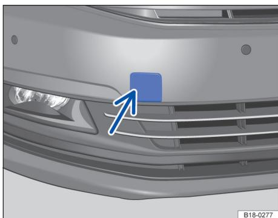  
图 200 在保险杠的右前部：拆卸盖板

 请首先阅读并注意引导信息和安全提示，见 ，第 256 页。

可拧入式牵引环的支座位于前保险杠上右侧的一个盖板后。

牵引环必须时刻随车携带。

要遵守关于牵引的提示⇒ 第 257 页。

## 安装前部牵引环

● 从行李厢随车工具中取出牵引环和车轮扳手。

● 先按压盖板外侧，直至开启，再拆下盖板并将其挂在汽车上。⇒ 图 200

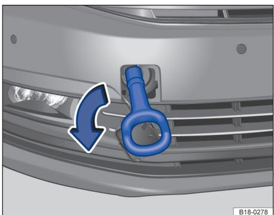  
图 201 在保险杠的右前部：安装牵引环

● 将牵引环朝箭头方向拧入螺纹孔内，直到限位位置⇒ 图 201。

● 用车轮扳手作为杠杆进一步拧紧牵引环。

● 牵引过程结束后，逆箭头方向拧出牵引环，然后重新安装盖板。

● 必要时清洁牵引环和车轮扳手，然后将其放回随车工具中。

## ①提示

牵引环必须始终充分和牢固地拧入支座中。否则牵引环在牵引启动或牵引时可能从支座中扯断。

## 安装前部牵引环（部分车型）

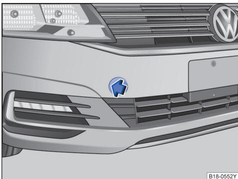  
图 202 在保险杠的右前部：拆卸盖板

 请首先阅读并注意引导信息和安全提示，见 ，第 256 页。

可拧入式牵引环的支座位于前保险杠上右侧的一个盖板后。

牵引环必须时刻随车携带。

要遵守关于牵引的提示⇒ 第 257 页。

## 安装前部牵引环

● 从行李厢随车工具中取出牵引环和车轮扳手。

● 先按压盖板外侧，直至开启，再拆下盖板并将其挂在汽车上。⇒ 图 202

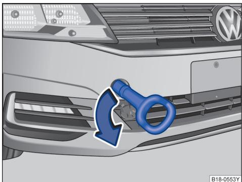  
图 203 在保险杠的右前部：安装牵引环

● 将牵引环朝箭头方向拧入螺纹孔内，直到限位位置⇒ 图 203。

● 用车轮扳手作为杠杆进一步拧紧牵引环。

● 牵引过程结束后，逆箭头方向拧出牵引环，然后重新安装盖板。

● 必要时清洁牵引环和车轮扳手，然后将其放回随车工具中。

## ① 提示

牵引环必须始终充分和牢固地拧入支座中。否则牵引环在牵引启动或牵引时可能从支座中扯断。

## 安装后部牵引环

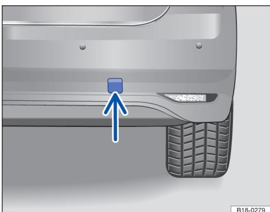  
图 204 在保险杠右后部：拆卸盖板

 请首先阅读并注意引导信息和安全提示，见 ，第 256 页。

牵引环的固定架位于保险杠的右后部⇒ 图 204。要看到固定架，必须拆下盖板。

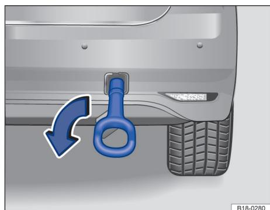  
图 205 在保险杠右后部：安装牵引环  
要遵守关于牵引的提示⇒ 第 256 页。

安装后部牵引环（出厂时不带牵引装置的汽车）

● 从行李厢随车工具中取出牵引环和车轮扳手

● 先按压盖板下部，直至开启，再拆下盖板并将其挂在汽车上。⇒ 图 204

● 将牵引环朝箭头方向拧入螺纹孔内，直到限位位置 。

● 用车轮扳手作为杠杆进一步拧紧牵引环。

● 牵引过程结束后，逆箭头方向拧出牵引环，然后重新安装盖板。

● 必要时清洁牵引环和车轮扳手，然后将其放回随车工具中。

## 牵引时的驾驶提示

 请首先阅读并注意引导信息和安全提示，见 ，第 256 页。

因技术原因，不得牵引启动蓄电池无电汽车。

牵引作业，尤其用牵引绳进行牵引需具备一定的经验，两车驾驶员应熟悉牵引流程和相关技术要求，无经验的驾驶员切勿试图进行牵引。

牵引时应避免牵引力过大或猛烈牵引，在不平路面上牵引时牵引连接点将过载，甚至损坏。

牵引时被牵引车的点火开关必须处于打开状态，从而使方向盘处于自由状态，并可松开手制动杆，转向信号灯、喇叭、风窗刮水器和清洗器均可使用。

本车被牵引时即使点火开关和危险警告灯均处于打开状态，仍可使用转向信号灯指示方向。按需指示的方向拨转向信号灯操纵杆即可打开转向信号灯，转向信号灯工作时危险警告灯停止闪烁，一旦转向信号灯操纵杆返回初始位置，危险警告灯立即自动开始闪烁。

发动机运转时制动助力器方起作用，因此，制动时必须用比正常情况大得多的力量踏制动踏板。

## ①提示

● 牵引环必须始终充分和牢固地拧入支座中。否则牵引环在牵引启动或牵引时可能从支座中扯断。 

发动机运转时助力转向机构方起作用，因此，转向时必须用比正常情况大得多的力量转向方向盘。

## 被牵引车的驾驶员：

● 打开危险警告灯，但应遵守当地相关法规。

● 将换挡杆挂入空挡或将变速杆移入挡位N。

● 牵引绳必须始终处于绷紧状态。

## 牵引车的驾驶员

● 打开危险警告灯，但应遵守当地相关法规。

● 慢慢起步行驶，直至牵引绳绷紧，再小心加速行驶。

● 起步时必须轻缓啮合离合器；自动变速箱汽车应慢慢踏下油门踏板。

● 切记，牵引时被牵引车的制动助力器和助力转向机构不工作！因此，应提前制动，但应轻踏制动踏板。

## 安装收音机

## 一般说明

如果要安装别的收音机，取代原厂安装的收音机，应注意汽车上的连接插头。带其它连接插座的收音机必须使用转接电缆，请向上汽大众经销商咨询。

此外私自安装收音机可能损坏重要的电子组件或影响其功能。例如，如果干扰了速度信号，会导致错误控制发动机、自动变速箱、ABS 等等。

如果收音机具有自动音量调节功能，那么收音机必定和速度信号相连，其它生产厂商非上汽大众认可的收音机可能会导致这方面的故障。

● 上汽大众原装认可的收音机符合车辆技术要求，确保安装质量。这些收音机采用了先进的技术并且造型精细，易于操作。

● 扬声器、安装组件、天线和防干扰组件也应使用上汽大众认可的原装配件。这些配件是专门为原厂车型开发的。

## 提示

连接电缆不得切断和撕去绝缘层。必要时使用转接器。否则电缆可能过载或短路，失火危险！

i ● 建议在上汽大众经销商处安装收音机。上汽大众经销商具有专业的技术能力，提供上汽大众原装认可的收音机，并按厂商规定的准则进行安装。

## 无线电设备

## 一般说明

无线电设备的安装请向上汽大众经销商进行咨询。使用无线电设备时，在以下情况下汽车电器可能发生故障：

● 没有外部天线

● 外部天线安装不正确

● 传送功率大于 10 瓦

因此，如果没有外部天线或者天线安装不正确，车内不可使用无线电设备。

## 前风窗玻璃处微波窗口推荐位置

微波窗口上边沿位于距离前挡风玻璃上边沿约5cm，微波窗口左边沿距挡风玻璃垂直中轴线约10cm，一般位于车内后视镜背部靠右位置。

## 提示

● 如果没有外部天线或外部天线安装不正确，在汽车内使用无线电设备由于会产生特强电磁场而可能损害健康！

● 此外，只有用外部天线才能达到最佳传送范围。

● 必须遵照无线电设备的操作说明！

● 如果您要使用传送功率大于10瓦的无线电设备，请询问上汽大众经销商。他们了解改装无线电设备的技术可能性。

## 事件数据记录系统（Event Data Recorder）

##  主题引言

本车配备了事件数据记录系统（EDR）。事件数据记录系统的主要作用是让人更好地理解事故情况下的车辆系统反应。事件数据记录系统只会在事故或类似事故的情境下记录短时间（5 秒钟或更短时间）内的行驶动态和约束系统数据。

当出现以下情境时，事件数据记录系统会触发记录：

● 被识别为事故情形

● 被识别为类似事故情形

● 引发紧急制动功能

由于存储空间有限，因此记录的事件数据分为可覆盖和不可覆盖事件。当系统存储空间已被全部占用时，如果再出现新的事件，那么最早存储的可覆盖事件会被后续事件覆盖。可覆盖事件是类似事故的场景，例如没有超过安全气囊的触发阈值。不可覆盖事件持续保存在事件数据记录系统中，例如安全气囊系统触发或安全带预紧装置触发。

记录以下数据：

（由于产品批次不同，事件数据记录系统实际记录的数据请以东辆公告信息为准

● 纵向速度delta-V – 车辆纵向速度的改变量，这只是整体速度变化的纵向分量。

● 纵向速度变化最大记录 – 事件数据记录系统记录的纵向速度累计变化的最大值，此数据与“达到纵向速度变化最大记录的时间”结合使用。

● 达到纵向速度变化最大记录的时间 – 从事件识别时间点到事件数据记录系统记录的纵向速度累计变化最大值的时间点之间的时间。此数据与“纵向速度变化最大记录”结合使用。

● 削波标志 – 事件数据记录系统采集的加速度值（横向、纵向）首次超出传感器量程（相对事件识别时间点）的时间点。

● 车辆速度 – 车辆速度是基于主驱动车轮的车轮速度。

● 行车制动器，操控或未操控 – 驾驶员是否踩踏制动踏板。

● 驾驶员安全带状态 – 驾驶员座椅上的安全带锁扣开关的状态（事件发生前1秒钟）。

● 加速踏板位置 – 加速踏板位置占总踏板行程的百分比。

● 发动机每分钟转速（rpm） – 车辆主发动机曲轴每分钟的转速。纯电动汽车和插电式混合动力电动汽车不记录。

● 事件中的上电周期 – 从事件数据记录系统的控制器首次使用以来到事件发生时，点火开关从“关闭”模式到“开启”模式的变换次数。

● 读取时上电周期 从事件数据记录系统的控制器首次使用以来到读取事件数据发生时，点火开关从“关闭”模式到“开启”模式的变换次数。

● 事件数据记录完整状态 – 事件数据记录系统记录的数据是否被完整记录和储存在存储器中。

● 本次事件距离上次事件的时间间隔 – 如果5秒内发生两个事件，则此数据元素显示两个事件起点之间的时间间隔。

● 车辆识别代号 – 车辆识别代号，底盘号VIN。

● EDR控制器的硬件配件号 – 安全气囊控制器的配件号。

● EDR控制器序列号 – 安全气囊控制器的序列号。

● EDR控制器的软件编号 – 安全气囊控制器的软件版本号。

这些数据有助于更好地理解事故和受伤发生的缘由。

请注意：车辆数据只在发生事故或类似事故的情况下才被储存。在正常行驶条件下，不会储存数据。此外，不会储存汽车内部空间或车辆周围的音频或视频数据，个人资料或事故发生地点信息。但是，在事故调查过程中，执法单位等第三方可能使用储存的数据与个人数据挂钩。

除了车辆生产方，只有第三方（如执法单位）能接触到车辆和事件数据记录系统控制器，那么他们也可能读取并分析储存的数据。

为读取事件数据记录系统（EDR）中的数据，必须拥有车辆并使用符合国标“GB39732-2020汽车事件数据记录系统”标准或其它适用于国标的专用读取工具，通过车载诊断系统OBD的诊断接口在点火开关打开的情况下获取数据。请根据读取设备的使用维护说明书的指令操作。如需获取EDR数据读取工具的进一步信息，请致电上汽大众服务热线：

400-820-1111。

上汽大众不会访问、读取或编辑事件数据记录系统上的数据，除非车主（或是出租车辆的承租人）同意这么做，合同或法律规定的例外情况除外。根据关于产品监测的法定义务，上汽大众可以将已经读取的数据用于领域监测以及研究目的和车辆安全系统的质量改进。上汽大众以匿名形式将数据用于研究目的，也就是无法追溯到个人的车辆、车主或者租借人。