## 前言

欢迎您选用比亚迪汽车。为帮助您正确使用和保养车辆，请您在使用前务必仔细阅读本手册全部内容，阅读后并妥善保存。

特别说明：比亚迪汽车工业有限公司建议您选用纯正备件，并按照使用手册要求正确使用、维护、修理车辆。使用非纯正备件更换、改装车辆将影响整车的性能，特别是安全性和耐久性，对此产生的车辆损坏及性能问题，均不在保修范围之内，除此之外对车辆的改装还有可能触犯国家法律法规和当地政府条例。

感谢您选用比亚迪汽车，欢迎您提出宝贵意见和建议。为了确保更好的为您服务，请务必提供准确的联系方式，如有变更，请及时联系比亚迪汽车授权服务店在系统上更新。同时，请您及时关注国家相关法律和法规及当地政策规定，尽快为车辆上牌，否则可能存在无法上牌风险。

网络安全事件及漏洞收集：如果您发现与网络安全相关的事件或者漏洞，请及时通过电子邮件方式发送到cve.auto@byd.com，我们会对反馈的内容进行核查，并会根据国家相关规定及要求进行通报。若反馈的漏洞信息涉及到其他组织单位，我们会及时告知对方。感谢您的关注与支持！

本手册中带有“\*”标号的描述仅适用于部分车型，使用图片仅采样于其中一个配置，如与您所购车辆有差异，请以实车为准。

本手册中，注有“警告”、“注意”和“温馨提示”的地方，必须小心根据提示的内容来避免受伤或损坏的可能性。提示类型的表示和使用方法如下所示：

警告

为保护人身安全而必须遵守的事项。

注意

为避免损坏车辆而必须遵守的事项。

温馨提示

为使检修方便等而必须遵守的事项。

左图所示的安全标记表示“不可以如此做”或“不可以让此发生”。

本手册的用途在于帮助您正确地使用产品，并不代表对本产品配置及软件版本的任何说明。有关产品配置和软件版本情况，请查阅与本产品相关合约 (若有)，或咨询向您出售产品的销售商。

比亚迪汽车官网：https://www.bydauto.com.cn

比亚迪汽车官方客服电话：400-830-3666

动力电池回收网点查询请登录比亚迪汽车官网：

https://www.byd.com/cn/socialresponsibility/batteryrecycle.html

详细的产品使用说明请扫描以下小程序二维码查询：

比亚迪汽车工业有限公司版权所有

未经比亚迪汽车工业有限公司书面许可授权，不得转载或复制、存储或翻译本手册的部分或全部内容，也不得以电子或其他任何形式进行传播

翻版必究

图片索引 按照插图检索
1 安全 确保通读本部分内容
2 仪表组 如何读取仪表、各种警告灯和指示灯等
3 控制器的操作 打开和关闭车门与车窗、驾驶前的调节等
4 使用和驾驶 驾驶时的必要操作和建议
5 车内装置 使用车内装置等
6 保养及维护 车辆维护和保养步骤
7 发生故障时 发生故障时或紧急情况下的应对措施
8 车辆规格 车辆规格和可定制功能等
字母索引 字母索引

前言.... 1

## 1 安全

1-1 座椅安全带....16
安全带简介....16
使用安全带....17
1-2 安全气囊....21
安全气囊简介....21
驾驶员及前排乘员安全气囊....22
前排座椅侧安全气囊....23
侧帘式安全气囊....24
安全气囊触发条件及注意事项....24
1-3 儿童保护装置....29
儿童保护装置分类....29
安装儿童保护装置....29
1-4 双模系统工作模式....34
双模系统工作模式简介....34
双模系统工作模式选择....36
双模系统工作模式注意事项....37
1-5 防盗系统....41
防盗系统....41
1-6 哨兵模式\*....43
哨兵模式\*....43
1-7 汽车事件数据记录系统....45
汽车事件数据记录系统....45

## 2 仪表组

2-1 组合仪表....50
组合仪表视图....50
仪表指示灯....51

## 3 控制器的操作

3-1 车门和钥匙....65
钥匙简介....65
闭锁/解锁车门....71
自动关窗功能\*....82
智能进入和智能启动系统....83
电子儿童锁....85
3-2 座椅....87
座椅须知....87
前排座椅调节....88
中排座椅调节....92
后排座椅折叠....94
头枕....94
3-3 转向盘....98
转向盘开关组....98
转向盘调节....101
3-4 雨刮....103
雨刮开关....103
更换雨刮....105
3-5 后视镜....107
内后视镜....107
外后视镜....108
3-6 开关....110
灯光开关....110

驾驶员侧车门开关组....112
紧急告警灯开关....114
天窗开关....114
E-Call/云-Call 开关....117
室内灯开关....118

## 4 使用和驾驶

4-1 充/放电说明....123
充电说明....123
充电方法....127
放电装置\*....136
充电口电锁控制功能....139
电量平衡功能....141
4-2 电池....145
动力电池....145
低压蓄电池....147
4-3 使用要领....149
磨合期....149
挂车拖曳....149
安全驾驶注意事项....149
用车建议....150
燃油....151
如何节省燃油并延长车辆的使用寿命....154
运载行李....155
一氧化碳中毒的危险性....158
车辆涉水....159
预防火灾....160
4-4 启动和驾驶....162
启动车辆....162
驾驶车辆....164低油耗驾驶车辆....166
智能底盘\*....167
驾驶模式....169
云辇 C\*....170
换挡操纵机构....171
电子驻车(EPB)....172
自动驻车(AVH)....175
驾驶要领....177
4-5 驾驶辅助功能....181
驾驶辅助系统简介....181
行车辅助....190
泊车辅助....238
前向安全辅助....266
侧向安全辅助....283
后向安全辅助....293
驾驶辅助拓展功能....300
抬头显示(HUD)\*....304
胎压监测....305
低速提示音(AVAS)....307
驾驶员监测辅助(DMS)\*....308
驾驶安全系统....310
4-6 其他主要功能说明....317
车载 ETC\*....317
行车记录仪....317

## 5 车内装置

5-1 多媒体系统....323  
中控屏....323  
多媒体系统界面....324  
多媒体车辆设置....325  
情景模式....326

手势及响应\*....327
蓝牙电话....328
音响\*....328
无麦K歌\*....329
OTA升级....330
智能语音....331
我的车....331
其他应用....331
手车互联\*....333
5-2 空调系统....338
空调面板视图....338
空调操作界面....338
功能定义....339
空调设置项....343
绿净系统\*....344
香氛系统\*....345
出风口....346
智能开启空调\*....347
5-3 比亚迪App....348
比亚迪App介绍\*....348
比亚迪App的使用\*....348
比亚迪蓝牙操控驾驶\*....349
5-4 储物装置....352
车门储物盒....352
手机槽....352
杂物箱....353
中央扶手箱....353
文件袋....354
眼镜盒....354
杯托....355
5-5 其他装置....357
遮阳板....357

安全拉手....357
USB 接口....358
车载电源....359
手机无线充电....360
5-6 冰箱\*....363
冰箱\*....363

## 6 保养及维护

6-1 保养须知....370
保养周期及保养内容....370
6-2 定期保养....376
定期保养....376
车辆防腐蚀....377
漆面保养提示....378
车辆外部清洗....379
车辆内部清洁....381
6-3 自行保养....384
自行保养....384
天窗保养....387
车辆的存放....387
前舱盖....388
发动机保养....389
冷却系统....391
制动系统....392
洗涤系统....392
空调系统....393
雨刮器刮片....393
轮胎....394
保险丝....398

## 7 发生故障时

7-1 发生故障时....402
反光背心....402
如果智能钥匙电池电量耗尽....402
如果出现高压故障....403
如果车辆不能启动....403
如果在驾驶中发动机启动失败....404
如果发动机过热....404
如果车辆发生碰撞....405
如果电池泄露....406
如果车辆起火....407
如果车辆需要牵引....407
如果轮胎漏气或胎压不足..409
8 车辆规格
8-1 数据信息....414
整车参数....414
8-2 提示信息....418
车辆标识....418
警告标签....419
微波窗口....422

## 车外

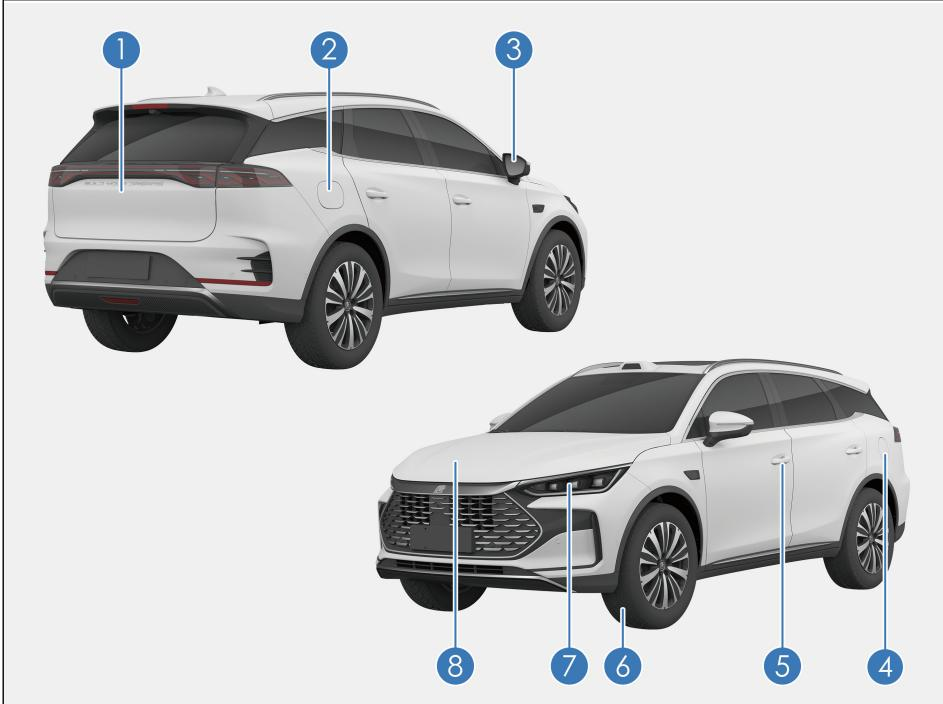

① 后背门.... P76
② 充电前检查.... P127
家用便携式交流充电.... P127
充电桩单相/三相交流充电.... P130
充电桩直流充电\*.... P132
③ 电动外后视镜.... P108
④ 加注燃油.... P152
⑤ 闭锁/解锁车.... P72

⑥ 轮胎....P394
如果轮胎漏气....P409
⑦ 车灯....P386
灯光开关....P110
⑧ 前舱盖....P388
发动机机油....P389
冷却系统....P391
制动系统....P392
洗涤器....P392

## 仪表板

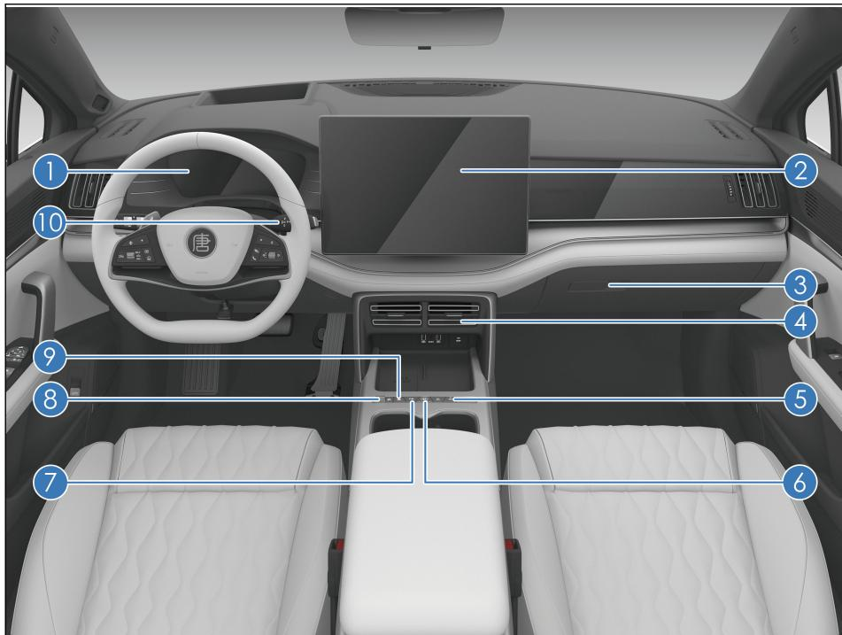

① 组合仪表.... P50  
② 中控屏.... P323  
③ 杂物箱.... P353  
④ 前排中央出风口.... P346  
⑤ 前排空调面板.... P338  
⑥ 启动/停止按钮.... P162  
⑦ 自动泊车按键.... P238

⑧ 双模系统工作模式按键.... P36
⑨ 紧急告警灯开关.... P114
⑩ 换挡操纵机构.... P171

## 车门

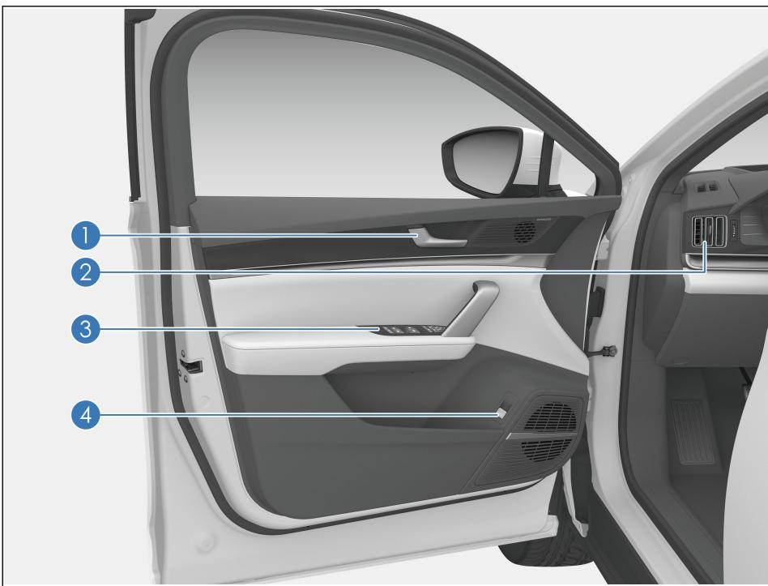

① 门板扣手.... P72
② 前排侧出风口.... P346
③ 驾驶员侧车门开关组.... P112
④ 后背门开启/关闭开关\*.... P76

## 车内

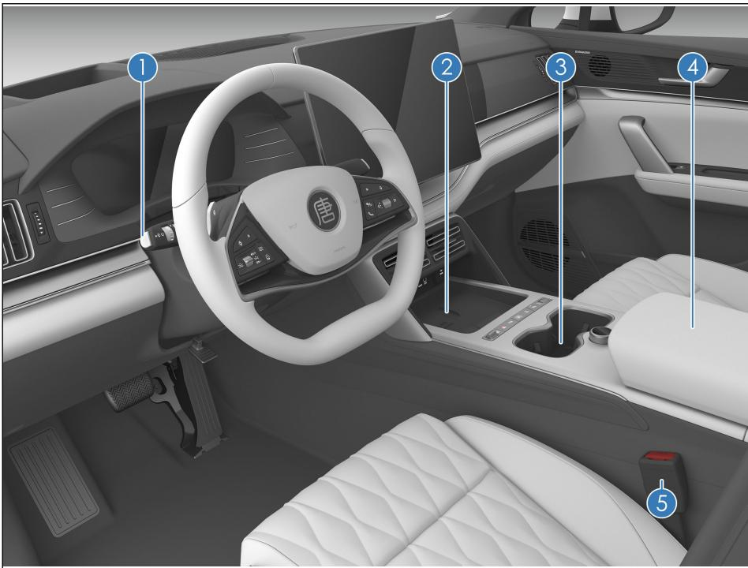

① 灯光开关.... P110
雨刮开关.... P103
② 手机无线充电.... P360
③ 前排杯托.... P355
④ 中央扶手箱.... P353
车载冰箱\*.... P363
⑤ 使用安全带.... P17

## 安全

1-1 座椅安全带....16
安全带简介....16
使用安全带....17
1-2 安全气囊....21
安全气囊简介....21
驾驶员及前排乘员安全气囊....22
前排座椅侧安全气囊....23
侧帘式安全气囊....24
安全气囊触发条件及注意事项..24
1-3 儿童保护装置....29
儿童保护装置分类....29
安装儿童保护装置....29
1-4 双模系统工作模式....34
双模系统工作模式简介....34
双模系统工作模式选择....36
双模系统工作模式注意事项....37
1-5 防盗系统....41
防盗系统....41
1-6 哨兵模式\*....43
哨兵模式\*....43
1-7 汽车事件数据记录系统....45
汽车事件数据记录系统....45

## 安全带简介

研究表明，在紧急制动、突然转向和碰撞事故中，正确使用安全带能大大减少车内乘员的伤亡。请仔细阅读以下内容并严格遵守。

## 警告

车辆行驶前，应确保车中所有乘员均已正确系好安全带。以免在紧急制动或发生碰撞事故时，造成人身伤害甚至危及生命。

车辆上的安全带主要根据成人体型设计，不适用于儿童，请根据您孩子的年龄和体型选择合适的儿童保护装置(请参见儿童保护装置分类)。

若安全带出现损坏或异常，建议立即联系比亚迪汽车授权服务店进行确认和处理，在此之前，请勿使用相应座椅。

比亚迪汽车极力强调车上的驾驶员和乘员不论何时均应系好安全带，以免在事故中造成人身伤害甚至危及生命。

建议让儿童坐在后排座椅上并务必使用座椅安全带和合适的儿童保护装置。在紧急制动或发生碰撞时，未被保护的儿童将受到严重的伤害甚至危及生命。同样，请勿让儿童坐在腿上，避免在紧急制动或发生碰撞时，儿童不能得到充分的保护。

## 安全带紧急锁止(ELR)功能\*

一 车辆急转弯、紧急制动、发生碰撞或乘员迅速前倾时安全带会自动锁紧，实现对乘员的有效约束和保护。

车辆平稳行驶时，安全带随着乘员缓慢、平稳的移动而拉出回卷，乘员可活动自如。

若由于安全带回卷过快导致的锁死情况，需要扯拉织带，使织带有一定松弛量并能回收，这样就可以顺利拉出安全带。

## 安全带的预紧限力功能\*

当车辆发生严重的正面碰撞，满足预紧装置触发条件时，预紧装置迅速卷收部分安全带并将其锁紧以加强对乘员的保护作用。限力装置将安全带对乘员身体的束缚力限定在一定范围之内，从而避免因束缚力太大而对乘员造成伤害。

## 使用安全带

1. 调整座椅至合适位置，调整靠背至合适角度。(参见前排座椅电动调节)

2. 调节三点式安全带的位置。

一 保持正确的坐姿，将安全带织带平顺地拉出，使之从肩部位置斜跨胸前，安全带织带不应位于手臂下方或从颈部后方跨过。

一 须将腰部安全带尽可能保持在低至髋部的位置，请勿扣在腰部位置。

3. 将锁舌插入带扣，直到听到“咔嗒”声，反方向拉锁舌，确认锁止成功。注意安全带不能扭曲。

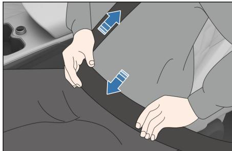

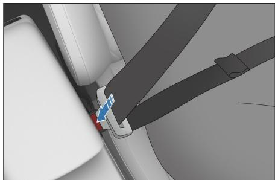

4. 调整安全带高度调节器(前排)至合适位置，以获得最佳舒适性和保护作用。

①按压安全带高度调节器释放按钮。

②握住安全带高度调节器上下移动，将前排座椅安全带调整至合适高度，松开前排座椅安全带高度调节器。

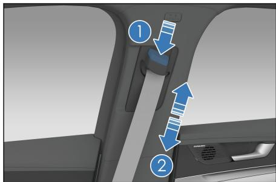

5. 调整完毕后，用力拉一下肩部安全带，检查安全带高度调节器是否锁止。

## 警告

肩部安全带应从肩部中间位置跨过。安全带应远离颈部且不能轻易从肩部滑脱。否则，紧急制动或发生事故时安全带将不发挥应有的保护作用，甚至对乘员造成严重伤害。

腰部安全带应尽可能低地横跨于髋部，避免发生事故时安全带勒紧腹部而使乘员受伤。

安全带应紧贴身体以实现更好的保护作用。

6. 解锁安全带。

按下带扣上的红色解锁按钮，锁舌自动弹出，安全带即会自动收缩。

一 如果安全带不能顺畅地自动缩回，则应拉出检查，看是否扭曲。

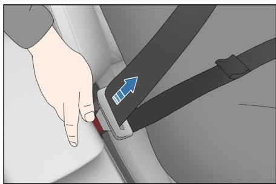

## 警告

每条安全带仅限一人使用。请勿二人或二人以上(包括儿童)同时使用同一条安全带。

避免将座椅靠背过度倾斜。座椅靠背直立向上时，安全带所起的保护作用最佳。

## 警告(续)

请勿使安全带、锁舌、带扣被车门夹住，否则可能损坏安全带。

定期检查安全带。检查有无切痕、磨损、松动等异常情况。发现异常建议立即联系比亚迪汽车授权服务店进行确认和处理，在此之前，请勿使用相应座椅。

切勿擅自拆卸、拆解、改装安全带。

事故发生后建议到比亚迪汽车授权服务店检查安全带。如果预紧功能被激活，须更换安全带。

每次必须更换安全带时，请务必使用合格的安全带替换。

如果发生严重事故，即使安全带未出现明显损坏，也应连同座椅总成一起更换，并对安全气囊系统进行全面检查。

孕妇需按正确的方法使用安全带，将安全带腰带部分尽可能低地横跨于髋部，避免发生事故时安全带勒紧腹部而对孕妇和胎儿造成严重伤害。

一 后排座椅安全带佩戴方法与前排一样，为使后排座椅安全带能够起到正确的防护作用，在使用后排座椅安全带时请确保对应的安全带锁舌插入到对应的安全带扣内，驾驶员有责任提醒乘员正确佩戴安全带。

请勿在带扣中插入硬币、回形针或其他异物，避免阻碍锁舌和带扣的正确连接。

## 安全带未系提醒功能

若车辆启动后，驾驶员或前排乘员未系安全带，声光报警系统将开始工作，直到驾驶员和前排乘员系好安全带。

安全带未系主指示灯

任一位置安全带未系触发报警时，安全带未系主指示灯闪烁。

安全带未系位置显示

任一位置安全带未系触发报警时，对应位置的指示灯点亮。

前排乘员安全带未系提醒

电源挡位处于“ON/OK”挡，当驾驶员座椅安全带未系，或副驾座椅载有乘员，且该乘员未系安全带时，安全带未系主指示灯点亮，相应位置显示上的指示灯点亮，车辆行驶时仍未系安全带，安全带未系指示灯点亮的同时，并伴以警示音以提醒驾乘人员。

当驾驶员和前排乘员安全带均系上后，安全带未系主指示灯熄灭，相应位置显示上所有指示灯熄灭。

## 警告

若上述功能异常或失效，建议立即联系比亚迪汽车授权服务店，在功能恢复正常之前，请勿使用相应座椅。

车辆行驶中，车内驾乘人员必须坐在座椅上，正确系好安全带。以免在紧急制动或发生碰撞事故时，造成人身伤害甚至危及生命。

## 安全气囊简介

一 安全气囊属于辅助约束系统(SRS)的一部分，是对座椅和安全带的补充，当车辆发生较严重碰撞事故，达到系统展开条件时，安全气囊会快速展开，与安全带一起为驾乘人员的头部和胸部等提供额外的保护，以减少人员伤亡的概率。

一 按照碰撞类型的不同，安全气囊系统一般分为正面安全气囊和侧面安全气囊。其中正面安全气囊包括驾驶员安全气囊、前排乘员安全气囊，侧面安全气囊包括座椅侧安全气囊和侧帘式安全气囊。

安全气囊系统不能取代安全带，它是汽车整个被动安全保护体系的一个组成部分。安全气囊只有与系好的安全带一起工作，才能使安全气囊系统发挥最大保护作用。

## 警告

请保持正确坐姿，使安全带和安全气囊系统发挥最大的保护作用。

请勿私自拆装安全气囊部件。

切勿在侧面安全气囊和乘员之间放置任何物品。

使用本公司正品以外的座椅套可能会导致安全气囊性能的降低或使乘员受到意外伤害。切勿在侧面安全气囊和乘员之间放置任何物品。

请勿过度地在装有侧安全气囊的座椅侧面对座椅施加力。

车辆发生碰撞事故后，即使安全气囊未爆开、预紧安全带未锁死，为了确保气囊系统可正常工作，建议您尽快联系比亚迪汽车授权服务店进行检测。

## 安全气囊警告灯

该安全气囊系统由电子控制单元监控，并且具有自诊断功能，通过组合仪表上的警告灯显示系统状态。

整车电源处于“ON”挡后，安全气囊警告灯亮5s左右然后熄灭，表示系统正常。

## 警告

如果安全气囊警告灯常亮，说明系统出现故障，建议尽快到比亚迪汽车授权服务店检查安全气囊系统，否则将影响安全气囊的功能实现。

## 警告(续)

如果您的车辆进水(如地毯潮湿/车浸在水中等)或因进水损坏时，切勿对车辆进行上电操作，同时需断开低压蓄电池，否则安全气囊可能展开，导致人员严重受伤甚至危及生命。

## 驾驶员及前排乘员安全气囊

驾驶员安全气囊安装在转向盘内部，前排乘员安全气囊安装在仪表台内部，并标有“AIRBAG”字标。当车辆上电后受到中等至严重程度的撞击，达到对应的安全气囊触发条件时，安全气囊将会展开，以减轻您受伤害的程度。

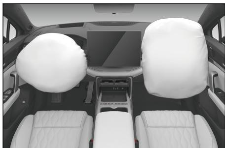

## 正面安全气囊的启动过程

一 如果遇到中等至严重程度的正面撞车事故，传感器会感知到车辆正在急剧减速，并向控制装置送出信号，使正面安全气囊立即膨胀。

当发生正面撞车时，座椅安全带可协助固定住您的下半身和躯干，安全气囊相当于一个气垫，协助稳定及保护您的头部和胸部。

一 当撞击的剧烈程度不能达到安全气囊充气膨胀的临界值时，座椅安全带将提供主要的保护功能，安全气囊提供微乎其微的辅助保护作用。

正面安全气囊充气后将立刻放气，不会影响驾驶员的视线及操纵转向盘或其他控制装置的能力。

安全气囊在达到触发条件能快速展开充气，从而能在事故中为驾乘人员提供额外保护。

安全气囊展开时会有较大响声，一般不会造成伤害(但不排除导致耳鸣或暂时性失聪的可能，会很快恢复)。

一 撞车后，安全气囊展开可能会看到烟雾及粉尘。尽管这些烟雾和粉末无毒，但有呼吸道疾患的乘员，仍可能感到某种暂时的不适，如有严重不适请及时就医。

## 警告

■ 诸如电话支架、杯子、烟灰缸等任何附件禁止安装在安全气囊的饰盖上或其作用范围之内。否则在发生事故时，安全气囊的展开会加剧您受伤的危险性。

## 前排座椅侧安全气囊

座椅侧安全气囊安装在前排座椅靠背的外侧，并标有“AIRBAG”字标。当车辆上电后受到中等至严重程度的撞击，达到座椅侧安全气囊触发条件时，安全气囊将会展开用来协助保护被碰撞侧乘员的胸部，以减轻其受伤害的程度。

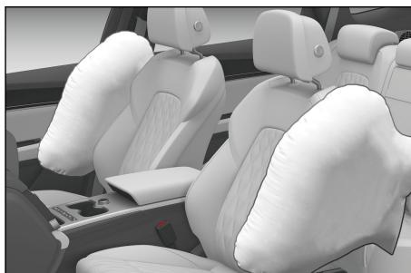

## 警告

请勿弄湿座椅靠背，以免妨碍座椅侧安全气囊的正常运作。

请勿自行覆盖或更换座椅背套。不合适的座椅背套替换品或覆盖物，在撞车时会妨碍座椅侧安全气囊的展开。

在遇到侧面撞击达到系统展开条件时，被碰撞侧的安全气囊会展开。

为获得座椅侧安全气囊的最佳保护，乘员必须系紧安全带，并且坐姿端正，紧靠椅背。

## 侧帘式安全气囊

左侧帘式安全气囊和右侧帘式安全气囊安装在车身侧围与顶棚连接处，在A柱护板、B 柱护板和C柱护板上均标有“气帘AIRBAG”字样，当车辆上电后受到中等至严重程度的撞击，达到侧帘式安全气囊触发条件时，侧帘式安全气囊将会展开用来协助保护驾乘人员的头部，以减轻其受伤害的程度。

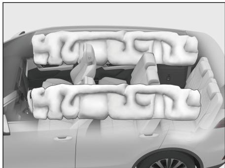

## 警告

为获得侧帘式安全气囊的最佳保护，乘员必须系紧安全带，并且坐姿端正，紧靠椅背。

## 安全气囊触发条件及注意事项

## 安全气囊触发条件

一 安全气囊触发条件如下：汽车发生碰撞时，是否触发安全气囊的决定性因素与汽车发生碰撞时能量的大小、事故类型、碰撞角度、障碍物及车速有关；在发生特殊碰撞事故时，安全气囊系统可能被触发。

一 安全气囊系统并不是在发生任何事故时都会起作用，在发生轻微的正面碰撞、侧面碰撞、车尾碰撞或翻车时，安全气囊系统一般不会触发。在这种情况下，驾乘人员通过正确佩戴安全带，以正常方式受到保护。

安全气囊系统触发的决定性因素：碰撞时产生，并由电子控制单元(ECU)获得的减速度曲线与设定值之间进行全面智能比较和判断，如果碰撞时产生并被测到的汽车减速度曲线等信号低于ECU 内预先设定的相关参照值，则安全气囊就不会触发，即使汽车可能已经在事故中严重变形。

一 比亚迪汽车安全气囊系统的ECU，在设定时已充分考虑到国内常见的各种误用和道路状况。但由于发生撞车事故的原因及形态千变万化，为了您的安全，请严格遵守此用户手册，正确使用汽车，避免误用，否则无法保证安全气囊达到预期效果。

## 安全气囊可能会展开的情况

①越过较深凹槽时，车头撞击地面。

②撞到路边的凸起物、街边石等。

③下陡坡时车头碰撞到地面。

④车辆侧方遭遇其他车辆撞击。

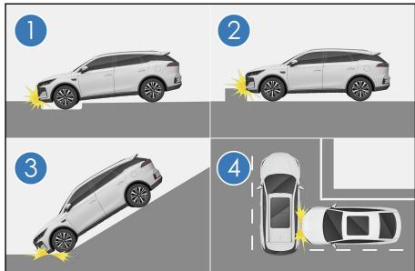

## 安全气囊可能不会展开的情况

①撞到水泥柱子、树木或其他细长物体上。

②车辆后方遭遇其他车辆追撞。

③钻入卡车等大货车下方

④车辆发生侧向翻滚。

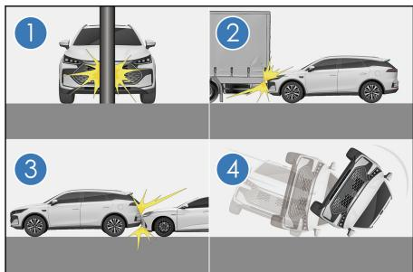

⑤非正面撞上墙壁或车辆。

⑥乘员室以外部位受到侧面撞击时。

⑦侧面受到斜方向撞击。

⑧侧面撞击柱状物体。

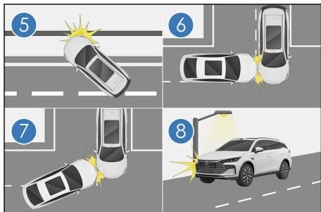

## 警告

安全气囊是为指定车型开发匹配的，对悬挂、轮胎尺寸、保险杠、底盘和原厂配备设备的任何改变，都会对安全气囊系统产生不利影响。并且不能将安全气囊系统的任何部件挪用在其他车型上，否则可能导致安全气囊系统失效，造成人身伤害。

对驾驶员来说，胸部与转向盘至少保持25cm的距离，这样才能在该系统触发时为驾驶员提供最有效的保护。

安全气囊系统展开后，气囊反应产生的高温气体会从气囊排气孔排出，应避免触摸其部件，请保持手握转向盘的正确姿势，否则安全气囊展开会存在烫伤的可能性。

一 汽车在行驶过程中，请系好安全带并保持正确坐姿。如果您没有系上安全带，行驶期间身体向前靠或坐姿不正确，那么在发生事故时，安全气囊的展开会加剧您受伤的危险性。

转向盘饰盖及驾驶员安全气囊的表面、仪表板右边安全气囊位置及附近的表面上、A、B、C 柱上护板表面及座椅侧安全气囊位置及附近的表面上不得粘贴、蒙上任何物品或做其他装饰处理。只允许用干燥或稍浸湿的抹布清洁，不得用力敲打。

禁止未成年人毫无保护或成人怀抱坐在前排座椅上。如果发生事故时触发了安全气囊，可能会造成严重伤害甚至危及生命。

侧安全气囊和侧帘式安全气囊展开的速度很快且冲击力量很大，所以装有该安全气囊的车辆在行驶中不允许任何人斜靠在车门上。否则会造成严重伤害甚至危及生命。

一 请勿在侧帘式安全气囊作用范围，例如风窗玻璃、侧门玻璃、A柱护板、顶棚、B柱护板、C柱护板和辅助拉手处放置其他饰件或物品，侧帘式安全气囊展开时饰件或物品会由于侧帘式安全气囊的强力而被

## 警告(续)

抛出，或造成侧帘式安全气囊不能正常展开，从而导致严重伤害甚至危及生命。

在转让汽车时，请将所有随车资料交给新车主，以便新车主了解车辆安全气囊情况。

请勿改装或更换座椅或带侧气囊的座椅饰件，这些改动会妨碍侧气囊的正常展开，使系统失效或引起侧气囊意外展开，从而导致严重伤害甚至危及生命。

请勿分解或修理含有侧帘式安全气囊的A柱护板、顶棚、B柱护板、C柱护板。这些改动会使系统失效或者气帘意外展开，从而导致严重伤害甚至危及生命。

安全气囊系统的所有组成部件均不允许进行任何改动，包括相应标签。对安全气囊的任何操作，建议由比亚迪汽车授权服务店完成。

安全气囊只能提供一次性事故防护功能。一旦安全气囊被触发或损坏，则必须更换该系统。

在对汽车或安全气囊系统的各部件进行报废处理时，请遵守与此有关的安全规定和报废程序。

安全气囊系统对其周围的电磁有较强的抗干扰和抗骚扰能力。但为避免意外，请勿在超出国家允许的电磁环境下使用汽车。

本车安全气囊系统已充分考虑到国内常见的各种误用和道路状况，但为避免意外，切勿使汽车底部发生撞击，或在恶劣的道路环境下粗暴驾驶。

本车安全气囊系统已充分验证，原车线束系统与安全气囊系统完全匹配。对整车线束的任何改装、改动都可能导致安全气囊在正常情况下误触发或达到碰撞条件时不触发。

出现下列情况时，建议立刻与比亚迪汽车授权服务店联系。

任一安全气囊已经展开。

组合仪表上安全气囊警告灯 异常点亮。

车辆的前方(图示阴影部分)发生碰撞事故，但安全气囊未展开。

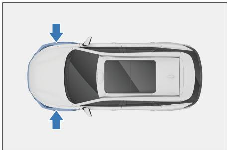

车辆的车门部分(图示阴影部分)遇到事故时，不足以引起安全气囊展开。

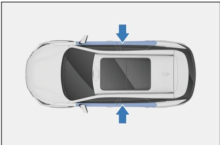

安全气囊盖(图示阴影部分)已经刮破、裂开或有其它损坏。

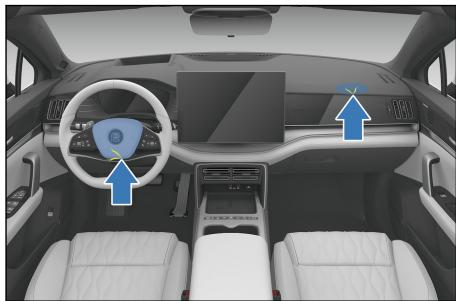

装备侧安全气囊的座椅表面被划伤、出现裂缝或其它类似损坏。

内有帘式安全气囊的A柱、车顶纵梁和C柱的装饰(衬垫)部分被划伤、出现裂缝或其它类似损坏。

安全气囊需要拆卸、拆解、安装、修理。

## 儿童保护装置分类

根据儿童的年龄和体型，请选择一套合适的儿童保护装置。如果孩子体型太大而不能使用儿童保护装置，则应坐在后排座椅上并使用座椅安全带。

一 不使用儿童保护装置时，请将儿童保护装置正确固定在座椅上，切勿将该装置随意放置在乘员座椅上或后备箱内。

## 警告

必须根据儿童的年龄和体型大小使用座椅安全带或儿童保护装置来对其加以约束保护，以便在发生事故或紧急停车时有效保护儿童。将儿童抱在怀中并不能代替儿童保护装置所起的作用。事故中，儿童可能会碰到风窗玻璃或被挤在您与车厢之间。

带侧帘式安全气囊的车辆：即使已将儿童安置在儿童保护装置中，也不要让他将头部或身体的任何部位倚在车门、座椅、前后柱或车顶侧梁上(侧帘式安全气囊的张开部位)。否则，侧帘式安全气囊在张开时，其强大的冲击力可能导致儿童受到严重的伤害甚至危及生命。

请遵照儿童保护装置制造厂提供的安装说明正确安装儿童保护装置。否则在紧急停车或发生事故时可能导致儿童受到严重的伤害甚至危及生命。

车辆行驶时请勿让儿童站在车内或跪在座椅上，否则在发生紧急制动或发生碰撞时容易受到严重的身体伤害甚至危及生命。

比亚迪汽车强烈建议您使用儿童保护装置。研究显示，将儿童保护装置安装在中后排座椅比安装在前排座椅上更加安全。

## 安装儿童保护装置

请遵照儿童保护装置制造厂提供的安装说明。将儿童保护装置牢固固定至后排座椅。本车第二排和第三排座椅均配备了适宜安装儿童座椅的ISO儿童安全座椅固定系统(ISOFIX)的接口，安装儿童保护装置时应固定住顶部拉带。

一 二排座椅和三排座椅上提供有专用固定杆的位置，显示锚定位置的标签附在座椅上。座椅靠背后面配备有拉带固定杆。

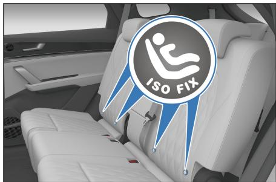

## 用ISOFIX钢性固定锚安装儿童保护装置

## 安装儿童保护装置步骤：

1. 检查专用固定杆的位置，并将儿童保护装置安装到座椅上。

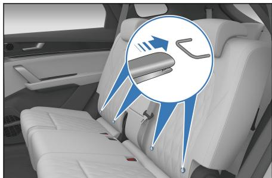

2. 提升头枕，将卡钩紧扣到靠背后固定杆上，并紧固顶部拉带，确保将顶部拉带扣牢。

中排座椅安装位置：

①顶部拉带

②卡钩

③固定锚支座

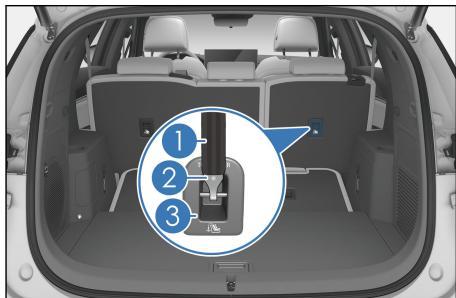

后排座椅安装位置：

①顶部拉带

②卡钩

③固定锚支座

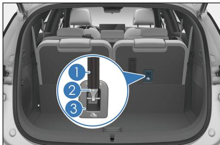

## 温馨提示

为方便儿童安全座椅的固定接口对准固定杆，建议购买有导向槽的儿童座椅或加装导向槽增加便利性。

3. 重新调整头枕至合适位置。

## 温馨提示

如果儿童保护装置配有顶部拉带，则应将顶部拉带固定到锚定装置上。

一 如果驾驶员座椅妨碍儿童保护装置的正确安装，则将儿童保护装置安装在中排右侧座椅上。

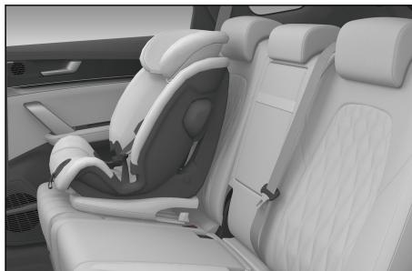

一 不得在受正面安全气囊保护(激活状态下)的座椅上使用后向的儿童约束系统(儿童保护装置)，否则发生事故时，前排乘员安全气囊急剧张开的冲击力会导致儿童受到严重的伤害甚至危及生命。

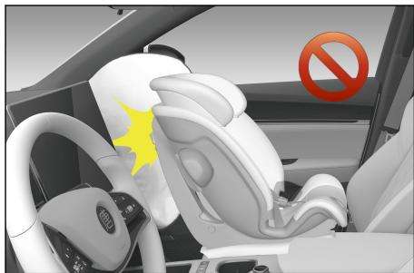

## 警告

向不同方向推拉儿童座椅，确保已安装牢固。

使用下部锚定装置时，确保锚定装置周围无异物且安全带没有卡在儿童座椅后面；确保儿童保护装置牢固固定，否则，紧急停车或发生事故时，可能导致儿童受到严重的伤害甚至危及生命。

请勿在前排座椅上安装儿童座椅。

请勿让儿童玩弄座椅安全带，否则可能导致儿童受到严重的伤害甚至危及生命。

若使用前向安装的儿童座椅时，如果头枕影响儿童座椅靠背与后排座椅贴合，则应取下头枕。

儿童保护装置的固定杆只能承受正确安装的儿童保护装置所施加的负载。任何情况下都不能将其用作成人安全带、束带或用于将其它物品或设备固定在车上。

关于不同乘坐位置对儿童约束系统的适用性信息

<table><tr><td colspan="8">乘坐位置</td></tr><tr><td>乘坐位置编号</td><td>1</td><td>2</td><td>3</td><td>4</td><td>5</td><td>6</td><td>7</td></tr><tr><td>适于通用型安全带的座椅位置(是/否)</td><td>是</td><td>是</td><td>是</td><td>是</td><td>是</td><td>是</td><td>是</td></tr><tr><td>适于i-Size的座椅位置(是/否)</td><td>否</td><td>否</td><td>否</td><td>否</td><td>否</td><td>否</td><td>否</td></tr><tr><td>适于侧向固定模块(L1/L2)的座椅位置(是/否)</td><td>否</td><td>否</td><td>否</td><td>否</td><td>否</td><td>否</td><td>否</td></tr><tr><td>适于最大的后向固定模块(R1/R2X/R2/R3)的座椅位置</td><td>否</td><td>否</td><td>否</td><td>否</td><td>否</td><td>否</td><td>否</td></tr><tr><td>适于最大的前向固定模块(F2X/F2/F3)的座椅位置</td><td>否</td><td>否</td><td>F2X/F2</td><td>否</td><td>F2X/F2</td><td>F2X/F2</td><td>F2X/F2</td></tr><tr><td>适于最大的增高椅固定模块(B2/B3)的座椅位置</td><td>否</td><td>否</td><td>否</td><td>否</td><td>否</td><td>否</td><td>否</td></tr></table>

注：方向是正常的车辆行驶方向。

乘坐位置编号

<table><tr><td>乘坐位置编号</td><td>在车辆上的位置</td></tr><tr><td>1</td><td>前排左侧</td></tr><tr><td>2</td><td>前排右侧</td></tr><tr><td>3</td><td>第二排左侧</td></tr><tr><td>4</td><td>第二排中间</td></tr><tr><td>5</td><td>第二排右侧</td></tr><tr><td>6</td><td>第三排左侧</td></tr><tr><td>7</td><td>第三排右侧</td></tr></table>

## 双模系统工作模式简介

## EV-纯电动工作模式

一 纯电动工作模式下，动力电池提供电能由电机驱动车辆，可以满足多种工况行驶，如起步、倒车、怠速、加速、匀速行驶等。

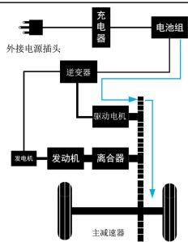

## 温馨提示

一 急加速、车速过高、爬坡、温度高、温度低、电量低等情况，车辆可能会自动切换到“HEV”模式，如需继续“EV”模式行驶，需在满足EV条件下手动切回。温度过高或过低时建议继续使用“HEV”模式。

## HEV-双模动力工作模式

一 在HEV模式下，当高电量或低功率需求时发动机不启动，整车会优先纯电驱动。

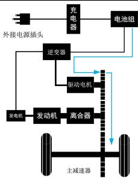

在HEV模式下，低电量或大功率需求时，发动机启动进入串联模式，满足动力性需求。

HEV 模式发动机发电给电池充电及驱动电机驱动。

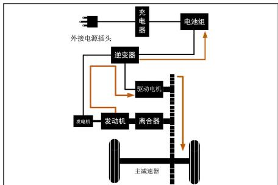

HEV 模式发动机发电及电池放电供驱动电机驱动。

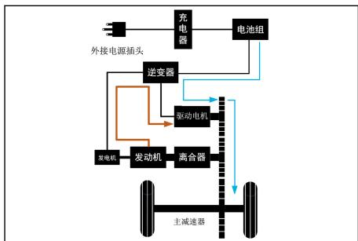

在HEV模式下，中高车速，部分工况发动机启动进入并联模式，提高燃油经济性。

HEV 模式发动机与电机同时驱动。

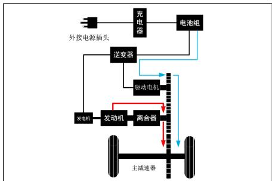

HEV 模式发动机驱动，电机发电回收能量。

HEV 模式发动机驱动，电机不工作。

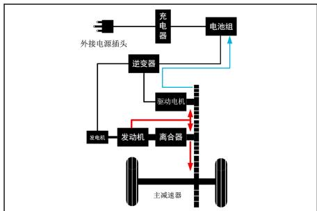

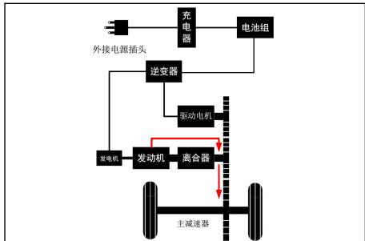

## 双模系统工作模式选择

① “模式”按键

② “EV/HEV”按键

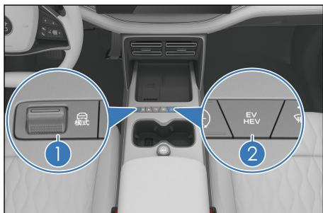

## EV-经济模式

一 按下“EV/HEV”按键，仪表上EV 指示灯点亮时，表示在EV模式。连续拨动“模式”按键，直至仪表上经济模式指示灯点亮，或者通过点击中控屏→设置 →驾驶→驾驶控制，在驾驶控制的驾驶模式中点击“经济”，进入到经济模式，最大限度节约电量。

## EV-舒适模式

按下“EV/HEV”按键，仪表上EV 指示灯点亮时，表示在EV模式。连续拨动“模式”按键，直至仪表上舒适模式指示灯点亮，或者通过点击中控屏→设置 →驾驶→驾驶控制，在驾驶控制的驾驶模式中点击“舒适”，进入到舒适模式，同时兼顾舒适性与用电量。

## EV-运动模式

按下“EV/HEV”按键，仪表上 EV 指示灯点亮时，表示在EV模式。连续拨动“模式”按键，直至仪表上运动模式指示灯点亮，或者通过点击中控屏→设置 →驾驶→驾驶控制，在驾驶控制的驾驶模式中点击“运动”，进入到运动模式，以保证较好的动力性能。

## HEV-经济模式

一 按下“EV/HEV”按键，仪表上的HEV指示灯点亮时，表示在HEV模式。连续拨动“模式”按键，直至仪表上经济模式指示灯点亮，或者通过点击中控屏→设置 →驾驶→驾驶控制，在驾驶控制的驾驶模式中点击“经济”，进入到经济模式，提供最佳燃油经济性。

## HEV-舒适模式

一 按下“EV/HEV”按键，仪表上的HEV指示灯点亮时，表示在HEV模式。连续拨动“模式”按键，直至仪表上舒适模式指示灯点亮，或者通过点击中控屏→设置 →驾驶→驾驶控制，在驾驶控制的驾驶模式中点击“舒适”，进入到舒适模式，提供最佳舒适性同时兼顾燃油经济性。

## HEV-运动模式

按下“EV/HEV”按键，仪表上的HEV指示灯点亮时，表示在HEV模式。连续拨动“模式”按键，直至仪表上运动模式指示灯点亮，或者通过点击中控屏→设置 →驾驶→驾驶控制，在驾驶控制的驾驶模式中点击“运动”，进入到运动模式，提供最佳的动力性。

关于驾驶模式请参见“驾驶模式功能”。

## 双模系统工作模式注意事项

## 车辆在汽油和电力的组合下运转，特别注意以下各项：

动力电池在低温环境下的性能会下降。为防止动力电池损坏，会存在以下情况：

温度低时，车辆会限制充电、放电功率及电量。

温度低于 $\mathfrak { - 3 0 \% }$ 或者高于 $6 0 ^ { \circ } \mathrm { C }$ ，车辆无法充电。

温度低于 $\mathfrak { - 3 5 \mathrm { { C } } }$ 或者高于 $6 0 ^ { \circ } \mathrm { C }$ ，车辆无法放电。

建议在 $\mathfrak { - 2 0 \% }$ 以上环境中使用车辆。如遇以上特殊环境，建议使用发动机驱动车辆。

电池的最佳使用温度为 $\mathsf { 2 5 \mathrm { { ‰} } }$ ；温度过高或过低时，电池会限制输出功率，纯电里程也会缩短。

## 注意高压和高温部件

车辆装备有连接到动力电池和其他高电压组件的橙色电缆。

## 警告

请勿触摸或接触橙色电缆或动力电池电极。电击可能造成重伤甚至危及生命。

请阅读所有的警告标签。

电机、冷却液散热器和一些其他部件会在行驶时达到高温。对这些零部件使用警告标签加以标识。请仔细阅读并遵守这些警告标签上的说明。

## 警告

切勿拆卸或分解任何高电压零部件，否则可能造成重伤甚至危及生命。

在发生碰撞、涉水等存在可能引起高压系统损坏的情况时，建议联系比亚迪汽车授权服务店处理，避免触电风险。

如车辆有漏电提示或经比亚迪汽车授权服务店诊断车辆存在漏电时，请勿继续使用车辆，避免触电风险。

切勿触摸带有高电压的零部件，以免操作不当导致电击，造成重伤甚至危及生命。

因为车辆是借助汽油发动机和电机来行驶的，可能会听到从发动机室传出的引擎声。

一 车辆启动上电或下电时，可能会听到从副仪表台下方的高压部件传出声响(接触器吸合或断开的声音)，此并非故障。

如果“OK”指示灯点亮，则表示车辆可以行驶，即使汽油发动机未启动(仅由电机驱动)。

一 驻车时，务必按下“P”挡按键。在“P”或“N”挡位，动力电池剩余电量(SOC)低于一定电量时，发动机可能会起动，给动力电池充电。如果手握换挡杆置于“N”、“R”或“D”挡位时间过长，会误报挡位卡滞。因此挂挡完成后，请务必将换挡杆松开。离开车辆时，务必拉起电子驻车开关，按下“P”挡按键，带走钥匙，并将所有车门锁好。

如果低压蓄电池故障，导致电量完全耗尽，即便用12V外接电源也无法进行车辆的跨接启动，建议联系比亚迪汽车授权服务店。

## 警告

离车时，务必将动力系统关闭。

离车时，务必按下“P”挡按键，因为在“OK”指示灯点亮而发动机停机的情况下，车辆也能低速怠速行驶(电机可以驱动)。

在“OK”指示灯点亮时，如果将换挡杆挂入“R”或“D”挡位，未踩制动踏板时，车辆会低速行驶，请务必注意。

要进行车辆修理或维护，建议向比亚迪汽车授权服务店咨询。

如果车辆因事故或其他原因而无法修理，建议向比亚迪汽车授权服务店咨询。

因为车辆使用了密封混合低压蓄电池，所以对车辆进行处理时，建议向比亚迪汽车授权服务店咨询。

## 警告

如果发生事故，执行下列操作，以降低高压电泄露的风险。

将车辆移到安全地带。

踩下制动踏板，按下电子驻车开关。

按下“P”挡按键，停止双模系统。

如果车辆损坏严重，则可能会遭到电击。为避免电击，切勿触摸高电压零部件(电池组件等)或连接部件的电缆(橙色)。如果在车内或车外有裸露的电线，请勿触摸，以免遭到电击。

如果液体泄漏或流入车辆的某些零部件，切勿触摸这些液体，因为这可能是来自低压蓄电池的电解液。如果液体进入皮肤或眼睛，请立即用大量清水进行冲洗(最好是硼酸溶液)并立即就医以避免重伤。

## 警告(续)

如果车辆失火，使用电火专用灭火器灭火。只用少量的水可能会很危险，因此请使用大量水(如使用消防栓)或者等候消防队的到来。

如果车辆需要拖曳，请选择四车轮离地拖曳方式，拖曳时如果车轮着地，电机可能会继续发电，从而导致漏电。

## 防盗系统

## 启用防盗

1. 整车断电至“OFF”挡。

2. 所有乘员下车。

3. 所有车门闭锁，防盗系统约在 8s 后自动设定。

## 触发报警

防盗系统启用时，发生下列情况都将触发警报\*，且转向灯闪烁：

未使用智能钥匙进入功能，任一车门、后背门或前舱盖解锁。

使用机械钥匙解锁车门。

## 解除防盗

通过下列方式将停止报警：

使用有效智能钥匙/手机App解锁车门或后背门。

携带有效智能钥匙使用微动开关解锁车门。

使用有效智能钥匙/手机App遥控开启后背门。

使用有效NFC钥匙解锁车门。

使用有效智能钥匙遥控启动车辆。

携带有效智能钥匙在车内按下“启动/停止”按键。

使用有效的手机App开启空调。

## 警告

不得以修改或添加方式改装防盗系统，此类改动可能导致系统故障。

## 防盗指示灯

防盗设定状态下，防盗指示灯常亮约10s。

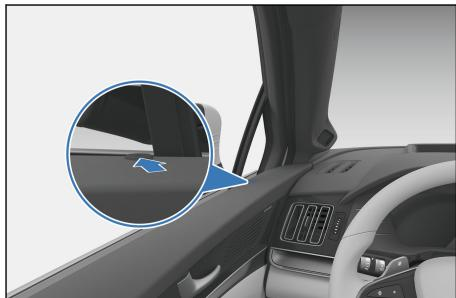

## 行车密码\*

用户可在车辆“P”挡状态下，通过中控屏→设置 →门窗与锁界面，点击行车密码设置项按照引导开启行车密码功能。

功能开启后，上电后首次挂挡时，中控屏会弹出输入密码界面，输入正确密码方可解除挡位禁用。密码输入次数达到上限后，车辆进入防盗状态，可按照提示解除防盗，恢复车辆正常使用。

忘记密码时，请在输入密码界面点击忘记密码，并按照提示修改密码。

如需关闭行车密码，请点击行车密码设置项，输入正确密码以关闭行车密码。

## 注意

设置行车密码前，请将车辆置于“P”挡。

行车密码只针对智能钥匙解锁或智能钥匙配合微动开关解锁限制，使用手机端操作解锁车辆时，不触发行车密码功能。

行车密码开启后，如果因中控屏故障不能输入，导致无法行车，请联系比亚迪汽车授权服务店进行处理。

## 哨兵模式\*

哨兵模式是一种辅助监测停车安全的功能，在哨兵模式进入工作状态的前提下，当车辆感知到有人靠近车身特定范围内，或车身受到碰撞、敲击等车辆侦测到震动的情况下，哨兵模式将录制风险事件视频存储在车内存储卡中，您可以通过车辆中控屏上的哨兵模式应用查看、删除相关视频。届时若您已下载比亚迪App，还可以在手机端远程启动哨兵模式并接收相应消息通知。

## 功能入口

哨兵模式可通过中控屏开启或通过手机远程开启：

中控屏开启：通过点击中控屏→哨兵模式 App/下拉便捷栏点击情景模式→哨兵模式/语音唤醒进入哨兵模式应用主页， 打开功能开关，熄火锁车时自动开启。

远程开启：通过比亚迪 App 可以远程开启哨兵模式。在手机 App 爱车页面，点击“哨兵模式”图标进入哨兵模式界面， 可选择开启哨兵工作模式。

## 开启条件

启用哨兵模式至少需同时满足以下条件：

车辆处于熄火锁车状态；

可检测到有效存储卡，且有足够可用存储空间；

车辆电量不少于最低保留电量(具体最低保留电量以“哨兵模式→设置→保留电量”中的设置为准)；

如上述任一条件不满足，将不能正常使用哨兵模式。

首次启动哨兵模式后，您可以通过“哨兵模式→设置→开启周期”设置哨兵模式启动的时间。

## 录像说明

一 哨兵模式在工作过程中将持续监测车身周围环境并录像，当车辆面临潜在侵害或正在受到侵害时，将触发中控亮屏警告并且产生报警信息推送至手机并将事件视频存储于车内存储卡中。

哨兵模式视频列表内，包含低、高风险事件录制视频：

低风险视频(橙色标签)：车辆摄像头感知到人或物体靠近车辆特定距离时，录制的前、后、左、右视角的低风险事件相关视频。

高风险视频(红色标签)：车辆检测到车身受到碰撞、敲击、拍打等异常震动时，录制的前、后、左、右视角的高风险事件相关视频。

## 设置项

进入哨兵模式设置界面后，可以设置如下功能：

保留电量：可以根据用车需求，设置保留电量，当耗电至该设定电量时，哨兵模式将自动停止运行。

开启周期：

始终开启：哨兵模式在每次熄火锁车后，将自动激活；

单次开启：哨兵模式仅本次熄火锁车开启。

恢复默认设置：点击该选项会弹出“恢复默认设置”确认弹窗，确认后会将哨兵模式设置界面所有设置项恢复到出厂默认状态。

## 警告

在使用哨兵模式前，车主应根据当前停车位置和环境自行判断是否适用哨兵模式，如涉及国家军事、政治等重要敏感区域信息，如军事管理区、国防科工单位以及县级以上党政机关等重要敏感区域的地理信息、人员流量、车辆流量等(包括但不仅限于此)禁止使用本功能，如在以上区域使用哨兵模式，风险将由车主个人承担。

为保护车主和他人的合法权益请勿向第三方传播或分享。同时，车主不得利用哨兵模式工作中录制的相关视频侵犯车外第三方主体的合法权益(包括但不限于车外人员信息和/或车外的其他车辆、设施设备及其附带的信息，如车牌信息)；不得存储、发布、传送、传播违反国家法律法规禁止的内容，同时车主不应存储、发送、发布、传播他人隐私信息或资料或者擅自用该等资源进行非法谋取利益行为，否则，由该等行为产生的相关法律法规责任及风险将由车主个人承担。

## 注意

当哨兵模式启动后，将调用全景摄像头侦测车辆周围环境，风险事件视频数据仅存储在车内存储卡上，请务必妥善保管视频数据。

– 为保证哨兵模式拍摄画面最佳，车辆后视镜将会被展开，请注意车辆两侧空间距离，避免损坏后视镜。(若未配置电动折叠后视镜，建议手动展开以保证监测效果)。

## 汽车事件数据记录系统

本车配备了汽车事件数据记录系统(EDR)。 EDR 主要用于记录某种碰撞或类似碰撞(如安全气囊展开或车辆撞到路边障碍物)时的车辆系统相关数据。

一 本车按照法规 GB 39732-2020《汽车事件数据记录系统》要求的 A+B级数据元素进行相应的记录，记录的数据包括：车辆速度、行车制动状态、加速踏板状态、驾驶员安全带状态等。 EDR 所记录数据项的含义请见 GB 39732-2020《汽车事件数据记录系统》中的相关解释。

EDR 所储存的数据分为锁定事件数据和非锁定事件数据。对于锁定事件数据，不能被后续事件的数据覆盖。对于非锁定事件数据，当存储空间满后，当前事件数据会覆盖之前非锁定事件数据，存储覆盖机制为按照时间顺序依次覆盖。

EDR 数据读取需要采用专用的设备通过连接整车或者直接连接 EDR 控制器进行读取，仅对数据拥有读取授权的人员和机构可以读取。若需从整车制造商获取 EDR 读取设备，可以联系比亚迪汽车授权服务店。

除以下情况外，比亚迪汽车不会将 EDR 数据披露给第三方：

获得车主(或车辆承租人)单独同意；

基于法律的披露：在法律、法律程序、诉讼或政府主管部门强制性要求。

一 比亚迪汽车有可能将已获取的 EDR 数据用于产品性能提升和产品开发研究。比亚迪汽车对此数据的研究将采用匿名化的方式，也即无法识别到特定车辆车主或者车辆租借人且不能复原的方式。

## 个人信息及隐私保护

一 我们尊重和注重保护个人隐私，深知个人信息的重要性，将隐私保护理念贯彻于产品设计的过程，并且尽我们最大努力采取相应的技术措施来保护您的个人信息。

我们通过手机App和车机系统提供了详细的隐私政策，您可以通过以下路径查询：

比亚迪App：设置→隐私中心；

中控屏：设置→DiLink→系统→隐私政策。

## 温馨提示

以上路径可能与手机App、车机系统实际路径略有出入，具体请以实际路径为准。

需特别注意的是，我们提供的汽车产品中可能包含了我们开发、联合第三方开发或者由第三方单独提供的产品或服务，因此在使用汽车产品特定功能前，请务必注意仔细阅读和充分理解特定功能对应的用户协议、隐私政策或者其他说明提示。

一 通常情况下，我们按照以下方式收集、处理您的个人信息，具体请以车辆所对应的手机 App、车机系统、特定功能对应的用户协议、隐私政策或其他说明提示为准。

## 我们如何收集个人信息

数据收集的方式包括主动收集和后台收集。我们通过App隐私政策、车机端隐私政策获得明确授权同意前提下才开始处理相关信息。收集个人敏感信息前，亦会通过明示的弹窗获得用户的单独同意。如个人信息的处理目的、处理方式和处理的个人信息种类发生变更等，我们会重新取得个人同意。个人也可以通过便捷的撤回方式撤回其同意。我们收集信息的数量、种类、频率均属最小范围。

## 温馨提示

当车辆报废处理或转让时，建议您恢复出厂设置以保护您的个人隐私。

## 我们如何使用个人信息

我们仅会基于隐私政策所述的目的或法律法规或向监管部门报告的情况下，使用个人信息。如我们将个人信息用于隐私政策未载明的其他用途，或者将基于特定目的收集而来的信息用于其他目的时，会事先征求您的同意。

## 我们如何共享、转移、公开个人信息

共享：除获得明确同意的情况下或法律法规的规定外，我们不会与任何公司、组织和个人共享您的个人信息，对我们与之共享个人信息的公司、组织和个人，我们会要求他们按照我们的说明、隐私政策以及其他任何相关的保密和安全措施来处理个人信息。

转移：除根据明确请求转移至您指定的个人信息处理者或涉及合并、收购或破产清算时外，我们不会将您的个人信息转移给任何公司、组织和个人。如涉及到个人信息转移，我们会向您披露接收方的名称、联系方式、处理目的、处理方式和个人信息的种类，要求接收您个人信息的公司、组织继续受相关隐私政策的约束，并在必要时要求该公司、组织重新征求您的授权同意。

一 公开：我们仅会在获得您单独同意后或在法律、法律程序、诉讼或政府主管部门强制性要求的情况下，公开个人信息。

## 我们如何存储个人信息

我们仅为您提供我们的产品与/或服务之目的所必需且最短的期间或法律法规规定内保留个人信息。根据您使用的产品/服务不同，您的个人信息存储期限可能会有所差别。

您的个人信息将会被存储在位于中国大陆的云服务器上，且未经您的单独同意，我们不会传输至境外。

## 我们如何处理未成年人的个人信息

我们一直非常重视并致力于对未成年个人信息的保护。我们产品和/或服务只面向成年人，如果用户是未成年人，在没有父母或其他法定监护人的同意时，不得创建自己的用户账号。对于经法定监护人同意而收集不满十四周岁未成年人个人信息的情况，我们只会在受到法律允许、法定监护人明确同意或者保护不满十四周岁未成年人合法权益所必要的情况下使用此数据。

一 如果您对本章节或者相关隐私政策、说明提示等有任何疑问，或者希望行使您的个人信息主体权利，您可以通过拨打官方客服电话400-830-3666 联系我们，我们将尽快为您解答或者处理。

## 仪表组

## 2

2-1 组合仪表....50
组合仪表视图....50
仪表指示灯....51

## 组合仪表视图

## 全液晶组合仪表

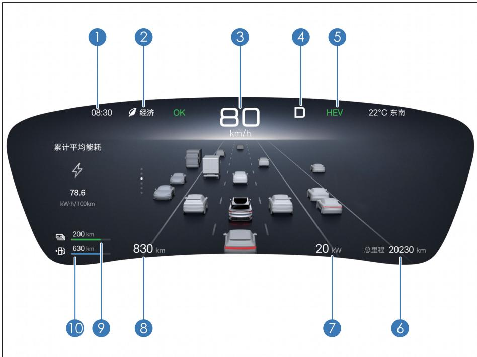

1 时间2 驾驶模式3 车速表4 挡位5 双模工作模式

6 里程表7 功率表8 续航里程9 电量表10 油量表

## 温馨提示

一 用户可通过中控屏→设置 →声音显示→仪表设置仪表亮度调节、仪表里程信息、仪表电量表显示和仪表限速提醒。

## 简易模式\*

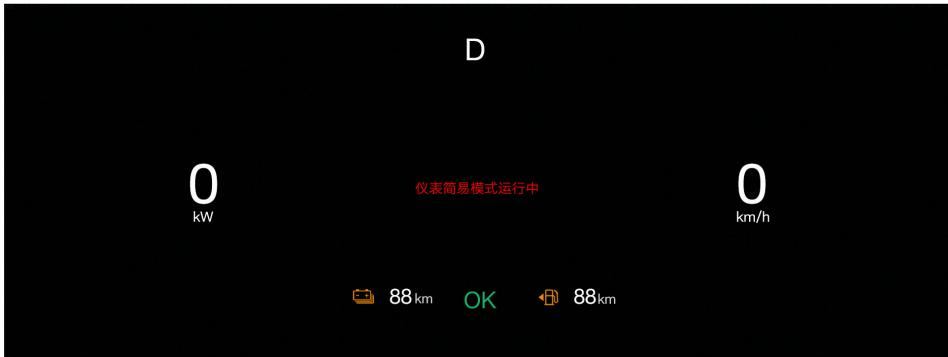

## 温馨提示

一 仪表系统偶发通讯延迟时，为保障安全，仪表将自动切换到简易模式，此时仍可正常显示驾驶信息且不影响行驶，系统正常后自动退出简易模式，若持续未恢复可尝试以下操作切换：

长按3s副仪表板上滚轮按键重启仪表信息显示系统；

在确认车辆安全的情况下，重启车辆。

– 如果进行以上操作后，仪表仍显示简易模式，建议及时与比亚迪汽车授权服务店联系检查车辆。

组合仪表视图仅供参考，具体示意请以出厂配置为准。

## 仪表指示灯

## 指示灯/警告灯标识

<table><tr><td>指示灯图标</td><td>指示灯名称</td><td>指示灯图标</td><td>指示灯名称</td></tr><tr><td></td><td>转向指示灯</td><td>→00</td><td>小灯指示灯</td></tr><tr><td></td><td>放电指示灯</td><td>OK</td><td>OK 指示灯</td></tr><tr><td></td><td>GPF 需要再生指示灯</td><td></td><td>近光指示灯</td></tr><tr><td></td><td>AVH 工作指示灯</td><td></td><td>HEV 指示灯</td></tr><tr><td></td><td>EV 指示灯</td><td></td><td>AI 能耗指示灯*</td></tr><tr><td></td><td>长续航模式指示灯*</td><td></td><td>防晕车模式指示灯*</td></tr><tr><td></td><td>盲区监测激活指示灯*</td><td></td><td>车道领航状态指示灯*</td></tr><tr><td></td><td>车道辅助系统指示灯*</td><td></td><td>远光灯指示灯</td></tr><tr><td>[B07W]</td><td>领航辅助指示灯*</td><td></td><td>ACC 工作状态指示灯*</td></tr><tr><td></td><td>经济模式指示灯</td><td></td><td>自适应前照灯指示灯*</td></tr><tr><td>* 雪地</td><td>雪地模式指示灯</td><td></td><td>运动模式指示灯</td></tr><tr><td></td><td>车道辅助系统故障警告灯*</td><td></td><td>舒适模式指示灯</td></tr><tr><td></td><td>机油寿命监测指示灯*</td><td>[472S]</td><td>驱动功率限制警告灯</td></tr><tr><td></td><td>主告警指示灯</td><td>[YX60]</td><td>胎压故障警告灯</td></tr><tr><td>[AGWC]</td><td>电子车身稳定系统故障警告灯</td><td></td><td>智能钥匙系统警告灯</td></tr><tr><td></td><td>排放故障指示灯</td><td></td><td>电子车身稳定系统关闭指示灯</td></tr><tr><td></td><td>前照灯故障警告灯</td><td>[72X3]</td><td>后雾灯指示灯</td></tr><tr><td></td><td>GPF 需要再生故障灯</td><td></td><td>ABS 故障警告灯</td></tr><tr><td></td><td>ACC 故障警告灯*</td><td></td><td>低速提示音关闭指示灯</td></tr><tr><td></td><td>盲区监测故障警告灯*</td><td></td><td>驾驶员监测辅助系统故障警告灯*</td></tr><tr><td></td><td>电子驻车指示灯</td><td></td><td>自动紧急制动指示灯*</td></tr><tr><td></td><td>安全带未系指示灯</td><td></td><td>燃油低指示灯</td></tr><tr><td></td><td>转向系统故障警告灯</td><td></td><td>驻车系统故障警告灯</td></tr><tr><td></td><td>机油压力低警告灯</td><td></td><td>安全气囊故障警告灯</td></tr><tr><td></td><td>低压供电系统警告灯</td><td></td><td>冷却液温度高警告灯</td></tr><tr><td></td><td>电机过热警告灯</td><td></td><td>动力电池充电连接指示灯</td></tr><tr><td></td><td>动力电池故障警告灯</td><td></td><td>前照灯故障警告灯</td></tr><tr><td></td><td>动力系统故障警告灯</td><td></td><td>动力电池过热警告灯</td></tr><tr><td>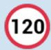</td><td>交通限速标识指示灯*</td><td></td><td></td></tr></table>

## 警告灯/指示灯说明

## 排放故障警告灯

一 电源挡位位于“ON”挡，指示灯自检常亮。如在其它任何时候点亮，则表示整车的某一控制系统可能发生故障。即使您可能察觉不到车辆性能有异常，在这种状态下持续运转，可能导致车辆严重损坏。

如果非自检时此警告灯点亮，应将车辆安全地驶到路边，整车断电至“OFF”挡，重新上电至“OK”挡。启动发动机并查看此警告灯，如果该警告灯仍然点亮，建议尽快到比亚迪汽车授权服务店检查车辆。在比亚迪汽车授权服务店查明故障之前，应小心驾驶，避免油门全开或高速行驶。

■ 如果此警告灯频繁点亮，即使在依照上述步骤处理后熄灭，也建议到比亚迪汽车授权服务店检查车辆。

## 注意

如果在排放故障警告灯点亮后持续行驶，可能会损坏车辆的排放控制系统和发动机本身。

## 燃油低警告灯

一 此指示灯位于燃油表上。如果此指示灯点亮，表示油箱里的燃油存量已不多，提示用户燃油将用完，需要尽快加油。在斜面或弯道时，油箱中燃油晃动，燃油低警告灯可能较通常早些点亮。

## 智能钥匙系统警告灯

按下“启动/停止”按钮，如果此时没有钥匙，则此警告灯点亮数秒，并且会伴随扬声器鸣响一声，显示屏内显示“未检测到钥匙”。

如果在携带钥匙的情况下按下“启动/停止”按钮，此警告灯不会点亮，此时可以使整车上电启动。

如果在此警告灯点亮的数秒内将钥匙拿进车内，此警告灯熄灭。

如果按下“启动/停止”按钮后，警告灯闪烁，则表示钥匙电池电量不足。

## ABS 故障警告灯

■ 电源挡位位于“ON”挡时，此警告灯点亮。如果防抱死制动系统工作正常，则几秒后此灯熄灭。此后，如果系统发生故障，此灯将再次点亮直至故障消除。

当ABS故障警告灯点亮时(驻车系统故障警告灯熄灭)，防抱死制动系统不工作，但是驻车系统仍将正常工作。

当ABS故障警告灯点亮时(驻车系统故障警告灯熄灭)，由于防抱死制动系统不工作，在紧急制动或在较滑路面上制动时车轮会抱死。

如果发生下列任何一种情况，则表示由警告灯系统监控的部件中发生故障，建议尽快与比亚迪汽车授权服务店联系检查车辆。

电源挡位位于 $\therefore \angle O N ^ { \prime }$ ”挡时，此警告灯不亮或持续点亮。

驾驶中此警告灯点亮。

## 警告

如果驻车系统故障警告灯和ABS故障警告灯同时点亮，立刻将车辆停在安全的地方并建议与比亚迪汽车授权服务店联系。因为此时制动时不但防抱死制动系统不起作用，车辆也将变得极端不稳定。

ABS具有自检功能。如果发生任何故障，ABS故障警告灯点亮。这意味着制动系统的防抱死制动功能已经失灵。此时，制动器仍会像没有防抱死功能的常规车辆那样提供普通的制动能力。建议尽快联系比亚迪汽车授权服务店专业人员检查车辆。

如果ABS警告灯和驻车系统故障警告灯同时点亮，并且电子驻车已完全释放，则表明前后轮制动力分配系统也已失灵。

一 如果制动踏板感觉不正常，则应当立刻采取措施。由于制动系统是双回路设计，即使系统的一部分发生故障，仍然可制动另两个车轮。此时，您感到必须将制动踏板踩得更深，车辆方能开始减速，制动距离亦变得更长。换至低挡，让车辆减速，安全地将车辆开到路边。由于需要较长的停车距离，所以驾车是很危险的，应请人将车辆拖走，并尽快修理。

如果您不得不在这种状态下短距离驾驶，务必低速行驶并格外小心。

## 胎压故障警告灯

电源挡位位于“ON”挡时，此警告灯点亮。如果胎压监测系统工作正常，则几秒后此警告灯熄灭。此后，如果系统发生故障，此警告灯将再次点亮。

当胎压故障警告灯点亮或闪烁，同时仪表信息显示屏显示“请检查胎压监测系统”，胎压显示界面数值位显示“---”时，表示胎压系统有故障。

当轮胎提示“信号异常”时，表示车辆所在位置胎压信号可能受到干扰或者胎压监测模块损坏。

当胎压故障警告灯常亮，同时组合仪表胎压显示界面有一个或多个数值变黄时，表示对应轮胎处于欠压状态。有一个或多个轮胎及温度数值变黄时，表示轮胎温度过高。

如果发生任何一种上述情况，建议尽快与比亚迪汽车授权服务店联系检查车辆。

## 电子车身稳定系统故障警告灯

电源挡位位于“ON”挡时，此警告灯点亮。如果电子车身稳定系统(ESC)工作正常，则几秒后此警告灯熄灭。此后，如果系统发生故障，此警告灯再次点亮直至系统故障消除。

当车辆在行驶过程中，ESC故障警告灯闪烁时，表明ESC系统正在工作。

当ESC故障警告灯点亮时(ABS 故障警告灯、驻车系统故障警告灯熄灭)，ESC 车辆稳定性控制失效，但是防抱死制动系统及制动系统仍将正常工作。

当ESC 故障警告灯点亮时(ABS 故障警告灯、驻车系统故障警告灯熄灭)，由于车辆稳定性控制系统不工作，所以在紧急转弯、紧急躲避前方障碍物时，车辆将处于极其不稳定的状态。

如果发生下列任何一种情况，则表示由警告灯系统监控的部件发生故障，建议尽快与比亚迪汽车授权服务店联系检查车辆：

电源挡位位于“ON”挡时，此警告灯上电后一直不亮(无 5s 自检)或持续点亮。

驾驶中此警告灯持续点亮。

## 警告

一 如果ABS故障警告灯、驻车系统警告灯点亮的同时，ESC 故障警告灯仍然点亮，建议立刻将车辆停在安全的地方并与比亚迪汽车授权服务店联系。因为此时制动时不但车辆变得极其不稳定，而且车辆防抱死制动系统完全不起作用。

## 电子车身稳定系统关闭警告灯

电源挡位位于“ON”挡时，此灯点亮几秒后熄灭。

当“电子车身稳定系统关闭”功能开启时，此灯应持续点亮，此时车辆稳定性控制系统不起作用。当“电子车身稳定系统关闭”功能关闭后，此灯应熄灭，且车辆稳定性控制系统功能恢复正常。

## 警告

如果“电子车身稳定系统关闭”警告灯点亮时，在紧急转弯以及躲避突然出现的障碍物时，驾驶员务必提高警惕并保持低速行驶。因为此时制动时ESC系统功能不起作用，车辆将会变得不稳定。

## 驱动功率限制警告灯

当整车动力受到限制时，此警告灯点亮，建议及时与比亚迪汽车授权服务店联系。

主告警指示灯

此指示灯点亮时表示应注意，信息显示区有故障提示信息。

自适应巡航故障警告灯

此警告灯常亮时，建议将车辆送到比亚迪汽车授权服务店进行检查。

盲区监测故障警告灯

此警告灯点亮时表示驾驶辅助功能受限，建议将车辆送到比亚迪汽车授权服务店进行检查。

## 安全带未系指示灯

一 此指示灯提醒驾驶员和乘员扣好座椅安全带。电源挡位位于“ON”挡时，若驾驶员和乘员的座椅安全带未扣紧，则相应座椅安全带指示灯\*点亮。除非扣紧安全带，否则指示灯持续点亮。

## 安全气囊故障警告灯

电源挡位位于“ON”挡时，此警告灯点亮，约几秒后，此警告灯熄灭，表示安全气囊系统工作正常。警告灯系统用于监控安全气囊ECU、碰撞传感器、充气装置、警告灯、接线和电源。

如果发生下列任何一种情况，则表示由警告灯系统监控的部件中某处发生故障，建议尽快与比亚迪汽车授权服务店联系检查车辆：

电源挡位位于“ON”挡时，此警告灯上电后一直不亮或持续点亮。

驾驶中此警告灯点亮或闪烁。

驻车系统故障警告灯

一 当制动液液位低且制动系统故障时，此警告灯点亮，如果发生下列任何一种情况，立刻将车辆停在安全的地方并建议与比亚迪汽车授权服务店联系。

电源挡位处于“ON”挡且当制动液液位低时，此警告灯点亮时。

启动车辆后，如果制动液液位正常，并且电子驻车系统正常工作时(电子驻车启动正常、释放正常，没有提示“请检查电子驻车系统”)，此故障警告灯常亮时(短暂点亮为正常现象)。

驻车系统故障警告灯和 ABS 故障警告灯同时点亮。此时，制动系统和电子驻车系统可能工作不正常，制动距离将变长。制动时 ABS 将不起作用，车辆制动时会不稳定，请小心驾驶。

## 警告

在制动液液位低的状态下，请勿持续进行驾驶。

## 转向系统故障警告灯

转向系统出现故障，此警告灯常亮时，建议将车辆送到比亚迪汽车授权服务店进行检查。

## 温馨提示

转向系统采用电机来减小转动转向盘所需的力。

转动转向盘时，可能会听到电机工作的声音(“嗡嗡”声)。这并不表示出现了故障。

转向盘打到极限位置的持续时间不超过 5s，否则会启动温度保护导致转向沉重或损坏。

长时间频繁的原地转动转向盘时，转向系统故障警告灯未点亮，但感觉转向沉重，此现象为非故障模式。

如果长时间频繁的原地转动转向盘，则转向系统的助力效果会降低，以防系统过热，导致在操作转向盘时感到沉重。如果发生这种情况，则应避免频繁转动转向盘或停车并熄灭发动机，10min 内系统恢复正常。

## 警告

如果转向系统故障警告灯点亮，请立刻将车辆停在安全的地方并建议与比亚迪汽车授权服务店联系。

## 冷却液温度过高警告灯

一 电源挡位位于“ON”挡时，此灯点亮表示冷却液的温度高，建议停车冷却车辆。在恶劣的条件下，例如酷暑季节或长时间爬坡、高速行驶，发动机可能产生过热现象。

## 机油压力低警告灯

■ 此警告灯用于警告机油压力过低。在行驶中，如果此警告灯闪烁或保持点亮状态，须驶离道路将车辆停在安全地点并立刻熄灭发动机，建议与比亚迪汽车授权服务店联系请求帮助。

– 当发动机空转时，此警告灯可能会偶尔闪烁或紧急制动后短暂点亮。当发动机渐渐加速时如果此灯熄灭，则机油压力正常。

当机油液位非常低时，此警告灯也将点亮。

## 注意

请勿在警告灯点亮的状态下驾驶车辆，即使是一小段距离。否则将毁坏发动机。

## 低压供电系统故障警告灯

如果在驾驶中此警告灯点亮，表示充电系统/DC系统/低压供电系统存在故障。发动机点火能够继续进行，但是只能进行到电池放完电为止。应关闭空调、风扇、多媒体等，建议尽快将车开到最近的比亚迪汽车授权服务店进行维修。

## 动力系统故障警告灯

如果动力系统发生故障，此警告灯点亮。

2

如果发生下列任何一种情况，则表示由警告灯系统监控的部件中某处发生故障，建议尽快与比亚迪汽车授权服务店联系检查车辆：

电源挡位位于 $" \bigcirc \mathsf { K } "$ 挡时，此警告灯持续点亮。

驾驶中此警告灯点亮。

## 注意

尽量不要在警告灯点亮的情况下驾驶车辆，建议尽快行驶到比亚迪汽车授权服务店进行检查确认问题。

## 动力电池过热警告灯

如果此灯点亮，表示动力电池温度太高，须停车降温。动力电池过热警告灯闪烁时，建议立即安全停车并尽快撤离车辆。

在下列工作条件中，动力电池可能会产生过热现象，例如：

在炎热的天气进行长时间长途爬坡。

在长时间停停走走的交通状态，频繁急加速、急刹车的状况，或长时间车辆运转得不到休息的状况。

## 动力电池故障警告灯

当整车电源挡位刚切换到“OK”挡电时，此灯点亮。如果动力电池系统工作正常，则几秒钟后此灯熄灭。此后，如果系统发生故障，此灯将再次点亮。建议尽快与比亚迪汽车授权服务店联系检查车辆。

如果发生下列任何一种情况，则表示由警告灯系统监控的部件发生故障，建议尽快与比亚迪汽车授权服务店联系检查车辆。

当整车处于“OK”挡电时，此灯持续发亮。

驾驶中此灯持续或偶然点亮。

自动紧急制动报警警告灯\*

此警告灯点亮或闪烁时，注意与前车的距离，不要离得太近，小心发生碰撞。

交通标志识别指示灯\*

此指示图标点亮时，代表系统识别到当前路段的限速值。

GPF需要再生指示灯\*

当颗粒捕集器(GPF)碳载量(排放颗粒物)达到一定量时，GPF会主动进入再生状态，GPF 指示灯处于绿色常亮状态，此时在路况允许的情况下尽量多跑高速工况，待颗粒物处理完成，GPF指示灯会自动熄灭。

GPF 需要再生故障灯\*

一 当GPF碳载量(排放颗粒物)达到最大值时，导致油耗上升，动力性能下降，GPF指示灯处于黄色常亮状态，此时需要到比亚迪汽车授权服务店检查车辆。

## 温馨提示

若用户长时间EV 行驶，会触发发动机保养需求启动发动机，仪表会提示：为了发动机保养需求已自动启动发动机。

## 仪表其他故障说明

仪表可能出现以下故障提示信息，请按照推荐的处理方法进行操作：

<table><tr><td>显示图标</td><td>故障提示</td><td>处理方法</td></tr><tr><td rowspan="5"></td><td>请检查车载充电系统</td><td>车载充电系统有故障,请检查充电连接有无异常,重新连接充电设备。如不能解决,建议与比亚迪汽车授权服务店联系。</td></tr><tr><td>为了您的安全,遥控驾驶暂停使用</td><td>遥控驾驶出现异常,请暂停使用。</td></tr><tr><td>请检查车辆网络</td><td>表示当前车辆的数据网络可能存在故障,应立即停车并建议与比亚迪汽车授权服务店联系。</td></tr><tr><td>发动机附件功能受限</td><td>表示发动机附件有故障,建议与比亚迪汽车授权服务店联系。</td></tr><tr><td>请检查记忆系统*</td><td>表示记忆系统有故障,建议与比亚迪汽车授权服务店联系。</td></tr></table>

2-1 组合仪表

<table><tr><td>显示图标</td><td>故障提示</td><td>处理方法</td></tr><tr><td></td><td>请检查前照灯系统</td><td>表示前照灯系统有故障,建议与比亚迪汽车授权服务店联系。</td></tr><tr><td></td><td>请检查挡位系统</td><td>表示挡位控制器存在故障,应立即停车并建议与比亚迪汽车授权服务店联系。</td></tr><tr><td></td><td>请检查 HDC 系统</td><td>表示 HDC 系统有故障,建议与比亚迪汽车授权服务店联系。</td></tr></table>

## 控制器的操作

## 3

3-1 车门和钥匙....65
钥匙简介....65
闭锁/解锁车门....71
自动关窗功能\*....82
智能进入和智能启动系统....83
电子儿童锁....85
3-2 座椅....87
座椅须知....87
前排座椅调节....88
中排座椅调节....92
后排座椅折叠....94
头枕....94
3-3 转向盘....98
转向盘开关组....98
转向盘调节....101
3-4 雨刮....103
雨刮开关....103
更换雨刮....105
3-5 后视镜....107
内后视镜....107
外后视镜....108
3-6 开关....110
灯光开关....110
驾驶员侧车门开关组....112
紧急告警灯开关....114
天窗开关....114

## 3

E-Call/云-Call 开关.... 117
室内灯开关.... 118

## 钥匙简介

钥匙包括电子智能钥匙、机械钥匙(安装在电子智能钥匙内)、蓝牙钥匙和NFC 钥匙。

## 电子智能钥匙

电子智能钥匙——携带电子智能钥匙按左右前门微动开关，可以解/闭锁所有车门；还可通过智能钥匙上按键进行车门解/闭锁、后背门开启及遥控启动等功能。

①指示灯

②闭锁按键

③解锁按键

④后背门开启/关闭按键

⑤启动/熄火按键

⑥机械钥匙

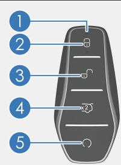

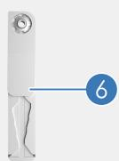

## 警告

智能钥匙中的纽扣电池具有危险性，任何纽扣电池都必须始终远离儿童。

纽扣锂电池如果被误吞或进入人体任何部位，两个小时内即可造成严重伤害或危及生命。

如果怀疑纽扣电池已经被误吞或进入人体任何部位，请立即就医。

## 注意

智能钥匙是一个电子元件，应遵守以下说明，以防损坏智能钥匙：

请勿将智能钥匙放置在高温处，例如仪表台上。

请勿将智能钥匙随意拆解。

请勿用智能钥匙用力敲击其它物体或使其落地。

3

## 注意(续)

请勿将智能钥匙浸入水中或在超声波洗涤器中清洗。

请勿将智能钥匙与放射电磁波的装置放在一起，例如移动电话。

请勿在智能钥匙上附加任何会切断电磁波的物体(例如金属密封件)。

可给同一辆车登记备用钥匙。有关详细说明，建议您与比亚迪汽车授权服务店联系。

如果智能钥匙不能在正常距离内操作车门，或钥匙上的指示灯暗淡、不亮时：

检查附近有无干扰智能钥匙正常操作的无线电台或机场的无线电 发射器。

智能钥匙的电池电量可能已耗尽。检查智能钥匙内的电池。如需更换电池，建议您联系比亚迪汽车授权服务店。

如果丢失智能钥匙，建议您尽快与比亚迪汽车授权服务店联系，避免车辆被盗或发生意外事故。

■ 请勿擅自更改发射频率、加大发射功率(包括额外加装发射频率放大器)，请勿擅自外接探测天线或改用其它发射探测天线。

使用时请勿对各种合法的无线电通信业务产生有害干扰；一旦发现有干扰现象时，应立即停止使用，并采取措施消除干扰后，方可继续使用。

使用微功率无线电设备，必须远离各种无线电业务的干扰或工业、科学及医疗应用设备的辐射干扰。

请勿在飞机和机场附近使用。

植入心脏起搏器或心脏去纤颤器的人应远离智能进入和启动系统的探测天线，因为电磁波会影响此类器械的正常使用。

一 除了植入心脏起搏器或心脏去纤颤器的用户，使用其它电子医疗器械的用户，也应向制造厂咨询在电磁波的影响下使用该器械的相关信息。电磁波可能会对这类医疗器械的使用产生难以预料的后果。

离开车辆时，务必随时携带钥匙并锁止车辆，切勿将人员(尤其是儿童)单独留在车内。

## 机械钥匙

机械钥匙(在智能钥匙内)——可实现左前车门的解锁和闭锁。不使用时，应确保将机械钥匙放回，盖上电子智能钥匙后盖即可。

## 取出机械钥匙

使用电子智能钥匙中的机械钥匙时，如图所示先按箭头①方向拉住锁扣，同时将锁扣部分的锁止结构往箭头②方向推动分离电子智能钥匙后盖，用智能钥匙后盖两端的凸起部分勾住机械钥匙头部孔往箭头③方向拉动即可取出机械钥匙。

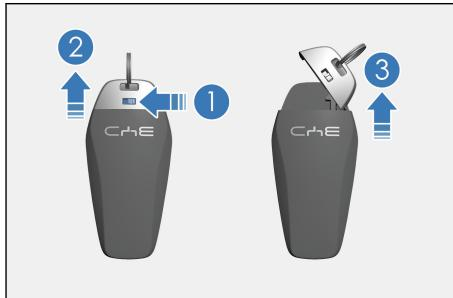

## 组装机械钥匙

机械钥匙使用完毕，按箭头③反方向插入机械钥匙，机械钥匙不可装反，然后合上钥匙后盖即可。

## 比亚迪蓝牙钥匙

## 蓝牙钥匙介绍

比亚迪汽车蓝牙钥匙是通过近距离蓝牙连接车辆，实现对车辆的控制，包含控制车门解锁、车门上锁等。

在应用市场下载并安装最新版“比亚迪”App，内部集成比亚迪汽车蓝牙钥匙功能。

带蓝牙钥匙配置的车辆，开通远程服务功能后自动激活该车蓝牙钥匙功能。

应用端开启蓝牙后，靠近车辆会自动进行蓝牙连接，亦可手动选择蓝牙进行连接蓝牙连接成功后，可使用蓝牙钥匙。

蓝牙钥匙具体支持的功能以车辆配置为准。

– 选择要进行的操作项，发送指令进行控制。通过蓝牙解锁的车辆在一定时间内具备1 次免钥影启动权限，直接按车辆端启动按钮成功启动车辆后可挂档行驶，超时或进行其他操作后免钥匙启动权限失效，蓝牙解锁后可重获权限。

## 注意

蓝牙钥匙激活前需确保车辆端网络信号良好，若激活失败，可尝试移动或重新启动车辆再次在应用端激活蓝牙钥匙。

蓝牙解锁后，短时间内车辆未发生任何操作，车门将自动落锁。

多次蓝牙连接失败或多次蓝牙操作失败时，可尝试关闭系统蓝牙后再打开，或尝试重启应用。

蓝牙钥匙使用距离受限于车周环境，车辆密集情况下，使用距离将减小。

蓝牙钥匙与手机存在兼容性关系，存在少数不支持的手机设备。

## NFC 钥匙\*

## NFC 钥匙简介

NFC钥匙是“比亚迪”App为用户提供的一种可以将手机或可穿戴设备注册为车钥匙，可实现解闭锁车门及启动车辆的功能。

■ 您可以使用支持车钥匙功能的手机或可穿戴设备，通过比亚迪NFC钥匙添加流程将手机或可穿戴设备注册为车钥匙，手机或可穿戴设备即可当车钥匙使用。

添加手机NFC钥匙前请确认以下条件是否满足：

该手机在支持的机型列表中；

该手机系统 NFC 功能开启；

Android 手机NFC设置的默认应用为“钱包”；

该 Android 手机钱包账号或 iPhone Apple ID 账号已登录；

比亚迪App账号已登录，且已完成比亚迪车主认证；

手机与车辆网络状态良好。

## 手机 NFC 钥匙添加入口

配置NFC钥匙的车辆，开通并登录App账号后，可进入 $\ " { \mathsf { N F C } } ^ { \prime \prime }$ 钥匙管理页，按照App指引操作，完成添加。

– $\mathsf { \Omega } ^ { \mathrm { * } } \mathsf { N F C } ^ { \mathrm { * } }$ 钥匙管理页进入路径如下：

在首页点击车辆 $\mathsf { \Omega } ^ { \ast } \mathsf { N F C } ^ { \prime \prime }$ 图标，进入 $\because N F C ^ { \prime \prime }$ 钥匙管理页。

选择“我的”页点击“我的车”，点击“NFC 数字钥匙 ”进入钥匙管理页。

## 开通手机NFC 钥匙\*

Android 手机用户按照App 指引操作将手机添加为车钥匙。每辆车最多支持开通9 个Android NFC 钥匙(包括车主/可穿戴设备钥匙和授权钥匙)。

iPhone 用户需按照App指引操作将手机添加为车钥匙。最多支持开通1把车主钥匙。

## 手机 NFC 钥匙使用\*

使用手机NFC钥匙前请确认以下条件是否满足：

该手机已成功添加NFC钥匙；

该手机系统 NFC功能开启；

该手机默认刷卡设置为车钥匙；

部分车型仅熄火状态下可用，具体功能以实际车型配置为准。

具有解锁权限\*的手机车钥匙，将手机背面顶部贴近车辆外后视镜读卡器感应区，可以解闭锁车门。

具有解锁与驾驶权限\*的手机车钥匙，将手机放置在车辆NFC标识处，可以启动车辆。标识位置具体以仪表提示为准，如需帮助可咨询服务店或拨打客服热线。

## 分享手机 NFC 钥匙\*

针对 Android 车主：

打开App，在车主卡面点击“分享”(或者直接打开比亚迪App→“我的”页面)→点击“授权管理”→新建授权→钥匙服务→默认勾选授权范围包含NFC钥匙→输入授权手机号、授权期限及到期时间→点击“授权”，弹窗点击“确定”，验证操作密码成功后，即授权成功1把NFC钥匙开通权限。

## 针对 iPhone 车主：

– 打开App，在车主卡面点击“分享”→选择“通过钱包分享钥匙”(或者直接打开手机钱包→选择需要分享的车钥匙卡片)→点击页面右上角的分享按钮→选择短信图标→跳转至短信编辑界面→选择对应收件人，确认无误后，点击发送→按指示双击手机右侧电源键，并进行安全密码认证，按指示可完成分享。

■ iPhone 手机分享钥匙后车主钥匙被删除，已开通的分享钥匙可以继续使用，未开通的分享钥匙将无法开通。

## 更换手机NFC钥匙\*

■ 此功能仅适用于iPhone 手机，登录比亚迪 App，点击进入车主钥匙详情，可更换手机(更换NFC车主钥匙)，更换手机后会生成一把新的NFC 车主钥匙，原NFC车主钥匙会被移除，不可使用。

您也可通过多媒体系统设置项更换手机，具体参考多媒体系统相关使用说明。

## 查看和移除手机 NFC 钥匙\*

■ 登录比亚迪App，点击NFC钥匙进入车主钥匙，可查看手机NFC 数字钥匙开通状态及其他关联信息，也可移除NFC钥匙，移除后手机车钥匙将无法使用。

## 开通可穿戴设备 NFC 钥匙\*

添加可穿戴设备NFC钥匙前请确认以下条件是否满足：

需开通的可穿戴设备在支持的设备列表中；

● 该可穿戴设备已与手机通过特定应用进行了绑定，如 OPPO、一加Watch 通过“OPPO 健康”应用与支持的安卓手机进行了绑定；HUAWEI Watch 通过“运动健康”应用与支持的安卓手机进行了绑定；vivo Watch 通过“健康”应用与支持的安卓手机进行了绑定；HONORWatch 通过“荣耀运动健康”应用与支持的安卓手机进行了绑定；MIWatch 通过“小米运动健康”应用与支持的安卓手机进行了绑定；三星Watch 通过“三星智能卡智能穿戴套件”和“三星智能穿戴”应用与支持的安卓手机进行了绑定。

手机及车辆网络状态良好，手机与可穿戴设备保持稳定的蓝牙连接。

安卓可穿戴设备用户需在与其绑定的Android 手机上登录比亚迪App，将该安卓可穿戴设备添加为本车车钥匙。

## 分享可穿戴设备 NFC 钥匙\*

Apple Watch 用户需在其绑定的 iPhone 手机“Watch”应用中按照界面指引将该Watch添加为本车车钥匙。每辆车最多支持8个Apple Watch可穿戴设备车钥匙。

分享可穿戴设备NFC钥匙前请确认以下条件是否满足：

需开通的可穿戴设备和将与其绑定的手机均在支持的设备列表中；

该手机已添加为本车车钥匙；

Apple Watch 通过“Watch”应用与支持的 iPhone 进行了绑定；

手机及车辆网络状态良好，手机与可穿戴设备保持稳定的蓝牙连接。

## 可穿戴设备NFC钥匙使用\*

使用可穿戴设备 NFC钥匙前请确认以下条件是否满足：

该可穿戴设备已成功添加NFC钥匙；

该可穿戴设备NFC功能开启；

该可穿戴设备默认车钥匙刷卡设置为车钥匙；

部分车型仅熄火状态下可用，具体功能以实际车型配置为准。

将可穿戴设备正面贴近车辆外后视镜读卡器感应区，可以解闭锁车门。

具有启动车辆权限\*的可穿戴设备车钥匙，将可穿戴设备放置在车辆NFC标识处\*，可以启动车辆。

## 查看和移除可穿戴设备 NFC 钥匙\*

■ 登录比亚迪 App，可查看可穿戴设备NFC钥匙开通数量、状态及其他关联信息，也可移除可穿戴设备 NFC钥匙，移除后可穿戴设备车钥匙将无法使用。

若您的可穿戴设备丢失，请及时登录比亚迪App，进入NFC钥匙列表，删除此可穿戴设备车钥匙。

## 闭锁/解锁车门

## 机械钥匙闭锁/解锁

拉动左前门把手至最大开启角度，将机械钥匙插入锁孔并转动钥匙，然后拔出钥匙，拉动车门把手，打开车门。

解锁主驾车门：顺时针转动钥匙

闭锁主驾车门：逆时针转动钥匙

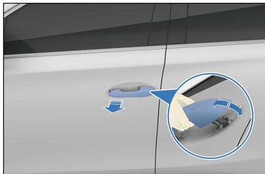

## 注意

拔出机械钥匙后，拉动左前门把手，才能打开车门。

## 门板扣手打开车门

在整车解锁状态下，拉动一次扣手，即可在车内打开车门。

■ 在整车闭锁状态下，连续拉动两次扣手，才可在车内打开车门。

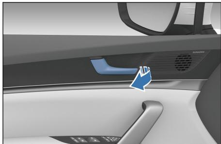

## 警告

请勿让儿童把玩门扣手，以免行车过程中误开车门，引起意外风险。

有儿童在车内时，请确认开启儿童锁功能。

## 注意

门板扣手通过机械连接控制车门开关，在整车断电情况下也可以打开车门。

– 由于车型配置电子儿童锁，后门需在电子儿童锁解锁的情况下在车内拉动扣手才有效，否则在车内无法打开车门。

## 智能钥匙闭锁/解锁

无线遥控功能用于在近距离对所有车门解锁或闭锁，以及实现附加功能。

携带已登记的智能钥匙进入激活区域时，缓慢而稳固地按下智能钥匙上的按键即可为所有车门闭锁或解锁。

闭锁：

所有车门及前舱盖关闭时，按下闭锁按键，所有车门同时闭锁。如果车辆已熄火，此时外后视镜折叠(外后视镜自动折叠开关开启时)，转向信号灯闪烁1次。如果车辆未熄火，外后视镜不折叠，转向信号灯不闪烁，同时报警器鸣响1声。检查所有车门是否牢固锁止。

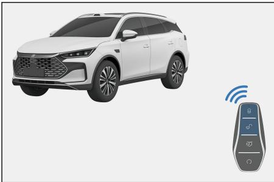

如果任一车门、前舱盖或后背门未关闭，转向信号灯不闪烁，同时喇叭鸣响1 声。

## 解锁：

按下解锁按键，所有车门同时解锁。转向信号灯闪烁2次。

用智能钥匙同时解锁所有车门时，即使车门未打开，室内灯(可在前室内灯开启DOOR功能)也将点亮15s，然后熄灭。

防盗状态下，使用智能钥匙解锁车门后，请在 30s内打开任一车门。否则，所有车门将自动闭锁。

在锁车状态下将钥匙放在车内，关上车门，为了不将钥匙锁在车内，车辆会主动解锁，且伴随有转向信号灯闪烁2次。

## 智能钥匙寻车操作

当车辆处于防盗状态下，按下闭锁按键，车辆鸣响1声，且转向信号灯闪烁15 次。当无法确认自己车辆的位置时，可使用此功能寻找车辆具体位置。

当车辆处于寻车状态时，再次按下闭锁按键，则重新进入下一次寻车状态。

## 智能钥匙升/降窗

整车电源挡位处于“OFF”挡：

长按智能钥匙闭锁按键，可以实现四门玻璃自动上升功能。

长按智能钥匙解锁按键，可以实现四门玻璃自动下降功能。

## 警告

当使用遥控升窗功能时，请注意车内乘员安全，在确保不卡住或夹住乘员的任何身体部位时，再进行操作。

## 温馨提示

用户可通过中控屏→设置 →门窗与锁→车窗界面开启或关闭长按遥控钥匙解/闭锁开/关窗功能(以实车配置为准)。

## 微动开关闭锁/解锁

## 闭锁操作

– 车门关闭且未锁止时，携带有效智能钥匙进入激活区域，按下前车门把手上的微动开关。所有车门同时闭锁。如果车辆已熄火，此时外后视镜折叠(外后视镜自动折叠开关开启时)，转向信号灯闪烁1次。如果车辆未熄火，外后视镜不折叠，转向信号灯不闪烁，同时报警器鸣响1 声。

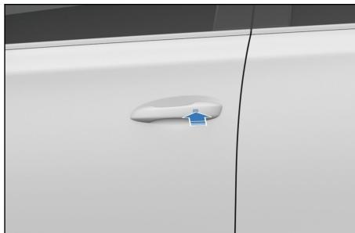

– 如果任一车门、前舱盖或后背门未关闭，使用微动开关依然可以对关闭的车门进行闭锁，但是转向信号灯不闪烁，同时喇叭鸣响1声。

## 解锁操作

– 在闭锁状态下，携带有效智能钥匙进入激活区域时，按下前车门把手上的微动开关，所有车门同时解锁，转向信号灯闪烁 2次。

防盗状态下，使用解锁功能后，请在30s内打开车门。否则，所有车门将自动重新闭锁。

下列情况，按下微动开关将不进行解/闭锁：

打开或关闭车门的同时，按压微动开关。

智能钥匙留在车内时。

## 温馨提示

如果智能钥匙距离车门外把手或车窗太近，则可能不会激活进入功能。

## 微动开关升/降窗

整车电源处于“OFF”挡时，携带有效智能钥匙，长按前车门把手微动开关，可以实现四门玻璃自动上升/下降(用户可通过中控屏→设置 →门窗与锁→车窗界面开启或关闭长按微动开关解/闭锁开/关窗功能)。

## NFC 钥匙闭锁/解锁\*

## 闭锁车门：

■ 车门关闭且未锁止，将有效NFC钥匙靠近驾驶员侧外后视镜上指令区域，所有车门同时闭锁。如果车辆已熄火，此时，转向信号灯闪烁1 次。

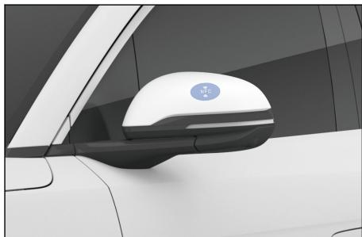

## 解锁车门：

在闭锁状态下，携带有效NFC钥匙靠近驾驶员侧外后视镜上指令区域，所有车门同时解锁。转向信号灯闪烁2次。

下列情况，有效NFC钥匙靠近驾驶员侧外后视镜上指令区域将不进行解/闭锁：

打开或关闭车门的同时，有效 NFC 钥匙靠近驾驶员侧外后视镜上指令区域。

手机NFC钥匙使用前需打开手机NFC 功能开关，将手机背面顶部区域贴近驾驶员侧外后视镜NFC标示处。

## 注意

部分手机型号不支持关机使用。

## 注意(续)

请尽量避免在手机无电关机情况下长时间、高频率的使用。

## 温馨提示

防盗状态下，使用有效NFC钥匙解锁后，请在30s 内打开车门。否则所有车门将自动重新闭锁。

使用有效NFC钥匙解锁后，在规定时间内提供用户启动权限，此权限在有效操作闭锁之后解除。

有关手机NFC钥匙的设置操作请参见 NFC钥匙\*。

## 后背门闭锁/解锁

## 智能钥匙打开/关闭后背门

双击智能钥匙上的“后背门开启”按键，后背门打开，此时转向信号灯闪烁2次。再单击“后背门开启”按键，后背门打开动作停止，再双击，后背门反向运动。

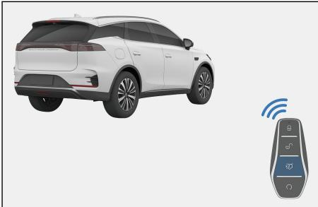

## 温馨提示

后背门在打开或关闭的过程中，再次操作后背门开启按键，后背门停止当前动作。

## 从车内打开/关闭后背门\*

后背门处于关闭状态时，拉一次此开关，后背门则会解锁并开启到设定位置(默认最大高度)。

■ 后背门在打开过程中，再次拉此开关，后背门立即平稳的停在当前位置。

整车上电后且后背门处于开启状态 时，拉起此开关1s以上，则后背 门会自动关闭，松手后立即停止关 闭。

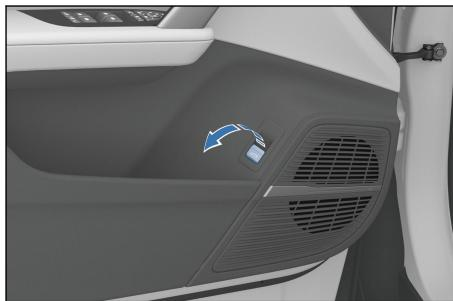

## 后背门外开关打开后背门

整车解锁时，按下后背门外开关，后背门即可打开。

整车闭锁时，携带本车有效智能钥匙，需解锁整车，按下后背门外开关，后背门即可打开。

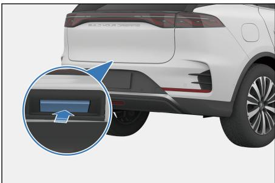

## 温馨提示

后背门在动作过程中，按下后背门外开关，后背门停止当前动作。

## 电动关闭后背门\*

## ①后背门内开关关闭后背门\*

当后背门处于打开静止状态时，按下后背门关闭开关，后背门执行关闭动作。

若在关闭的过程中再次按下后背门关闭开关，则后背门停止在当前位置。若后背门动作过程中停止后再次按下后背门关闭开关，后背门则执行相反动作。

## ②整车闭锁按键\*

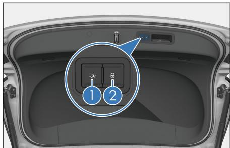

整车电源挡位处于“OFF”挡，后背门处于打开状态时，携带有效智能钥匙，按下闭锁开关，后背门关闭且闭锁整车，同时进入防盗状态。

## 注意

电动关闭后背门前，需确认车门、车窗、天窗等是否已关好，以免造成财产损失。

## 手动关闭后背门\*

整车解锁状态下，可手动关闭后背门。

## 后背门打开高度设置

– 将后背门手动或自动开启至所需位置并将其保持在该位置，长按后背门内开关3s 以上，扬声器鸣叫1s，提示后背门当前高度设置成功。

用户可通过中控屏→设置 →门窗与锁→车门界面，对后背门的高度进行设置。

## 防夹功能

如果电动后背门在关闭的过程中受到阻碍其运动的力，则后背门将自动反向打开；若是打开的过程中受到阻碍其运动的力，则立即停止动作。

如果后背门电动功能失效

手动完全关闭后背门即可恢复电动功能。

## 重新连接低压蓄电池时

需手动关闭后背门，电动后背门才可正常工作。

## 警告

操作后背门时请遵守下列注意事项，否则可能夹住身体的某部分而导致严重伤害甚至危及生命。

切勿使用身体的某个部位来故意激活防夹功能。

如果附近有人，则确保其安全并告知后背门即将打开或关闭。

关闭后背门时，应特别小心防止手指等被夹住。

打开或关闭后背门时，彻底检查以确保周围区域安全。

车辆行驶时，请关好后背门。

## 警告(续)

打开后背门之前清除沉重的负载，如雪和冰。否则可能导致后背门在打开后突然再次关闭。

后背门电动开启或关闭过程中，请勿手动操作后背门。

有风的天气里打开或关闭后背门时要小心，因为其可能因强风而突然移动。

后背门即将完全关闭前，如果有物体被夹住，则防夹功能可能不起作用。

● 如果后背门未完全打开，则其可能突然关闭。在斜坡上打开或关闭后背门比在水平地面上要费力，所以应小心后背门意外地自行打开或关闭。使用后备箱之前，确保后背门完全打开并固定。

根据被夹物体的形状，防夹功能可能不起作用。小心请勿让手指或任何其他物体被夹住。

## 脚踢自动感应开启后背门\*

携带有效智能钥匙站在后背门传感器有效的检测区域内，在后保险杠下方将脚舒适流畅的抬起做一个类似脚踢的动作，不需要接触到后保险杠。

若后背门为关闭状态，则后背门开启。

若后背门为完全开启状态，则后背门关闭。

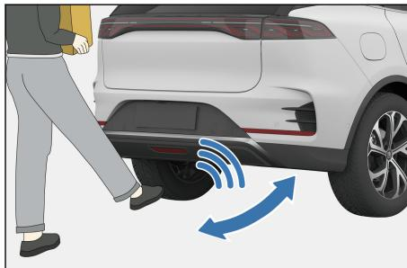

若后背门正在开启/关闭过程中，则后背门悬停，再次进行脚踢，则后背门执行相反动作。

## 警告

请务必确保仅在传感器的探测范围内做脚踢动作。否则，您可能会因触碰到排气系统而被烫伤。

## 警告(续)

做脚踢动作时，确保平稳地站在地面上并与车辆后部保持足够的间隙。否则，您可能失去平衡(例如：在冰面上时)。

下列情况下，请勿随身携带智能钥匙，以防后背门意外开启。

在车辆后方放置或捡拾物品时。

对车辆后部进行抛光等养护工作时。

## 温馨提示

整个脚踢动作在1s内完成。

使用脚踢自动感应功能时，请确保智能钥匙在距离后背门1m以内。

一 当冲洗车辆、雨水形成水流穿过或雪覆盖住后保险杠时，脚踢感应开启后背门会有延时，上述环境消失一段时间后，脚踢感应自动恢复至正常工作。

– 后背门门锁吸合过程中，再次使用脚踢不响应。

## 车内紧急解锁后背门

打开后背门内工具盒盖板，面对后背门，左边有一个手柄在工具盒侧面，粘贴在后背门内侧。取下手柄，向左侧拉动的同时用手向车外方推动后背门，即可开启后背门。

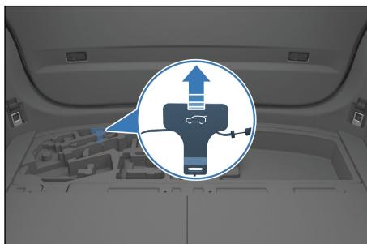

## 温馨提示

整车断电时，可从车内紧急解锁后背门。

## 中控门锁闭锁/解锁

## 用中控门锁开关实现整车解锁和闭锁

请参见“中控门锁”。

车门的自动闭锁和解锁

当车速超过约8km/h 时，所有车门将自动闭锁。

按下“启动/停止”按键，整车电源挡位从“ON/OK”转为“OFF”挡时，所有车门自动解锁。

所有车门的同时闭锁和解锁

■ 当车辆没有进入防盗模式，整车闭锁后，中控门锁闭锁按键的背光灯会点亮，在整车处于解锁状态时，背光灯熄灭。

按下中控门锁闭锁按键，所有车门将同时闭锁，此时外部开启失效，欲打开车门，需先拉动内扣手一次，此门门锁实现解锁，再一次拉动内扣手时此车门打开。

## 温馨提示

车辆遭受强烈撞击时，所有车门将自动解锁。是否自动解锁根据具体的撞击力度和事故类型而定。

## 整车紧急机械锁止

当中控锁系统或智能钥匙失效时，可利用机械钥匙进行紧急闭锁或解锁。

## 闭锁

1. 从智能钥匙中取出机械钥匙。

2. 打开除主驾外的其它三个车门，用机械钥匙齿沿箭头方向，向下拨动白色滑片，如图所示，将车门关闭即可锁止。

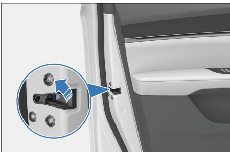

3. 将主驾外的其它三个车门锁止后，再打开主驾车门，抬起并握住门把手，将门把手拉开至最大开启角度。

4. 将机械钥匙插入车门锁孔，施加一定力量沿逆时针旋转钥匙至最大角度，机械钥匙复位到初始位置并将其拔出（请参见“机械钥匙闭锁/解锁”）。

5. 松开门把手并关上主驾车门。

6. 检查所有车门是否已锁止。

## 解锁

1. 从智能钥匙中取出机械钥匙。

2. 抬起并握住门把手，将门把手拉开至最大开启角度。

3. 将机械钥匙插入车门锁孔，施加一定力量沿顺时针旋转钥匙至最大角度，机械钥匙复位到初始位置并将其拔出。

4. 松开门把手，并通过再次拉门把手打开主驾车门。

5. 除主驾外的其余三个车门解锁：进入车内后，操作车门内扣手两次解锁对应车门。

## 温馨提示

操作时需防止用力过大导致机械钥匙变形或者断裂。

## 自动关窗功能\*

## 自动关窗功能\*

用户可通过点击中控屏→设置 →门窗与锁→车窗进入自动关窗相关设置界面进行开启和关闭。

## 锁车自动升窗

当“锁车自动升窗”设置项开启时，整车电源挡位处于“OFF”挡，左前门有开启操作，且前舱盖、后背门、四门关闭状态时，短按遥控钥匙闭锁按键，四门玻璃自动上升。

## 雨天自动关窗\*

当“雨天自动关窗”设置项开启时，整车处于“ON/OK”挡，雨刮感应器感受到一定的雨量后，四门车窗自动关闭。

车辆启动后，自动车窗功能仅生效一次，熄火重启后，功能再次生效。

## 高速自动关窗\*

– 当“高速自动关窗”设置项开启时，车辆行驶速度超过一定车速后，四门车窗和天窗会自动关闭。

## 智能进入和智能启动系统

携带有效智能钥匙可为车门解/闭锁并启动车辆。

## 进入功能

携带有效智能钥匙，可为车门解锁或闭锁。(参见“智能钥匙闭锁/解锁”和“微动开关闭锁/解锁”)

## 启动功能

携带智能钥匙，踩下制动踏板，按下“启动/停止”按键，启动车辆(参见“车内启动车辆”)。

## 探测天线位置

①位于车厢内的探测天线

②位于车厢外的探测天线

## 激活区域

已登记的智能钥匙在激活区域内时，智能进入和启动功能方可生效。

①进入功能激活区域——距前门把手和后背门外开关大约1m的范围内。

②启动功能激活区域——车厢内。

其他车辆的智能钥匙接近本车的智能钥匙时，车门解锁的时间可能要比平时长一些，属正常现象。

## 温馨提示

在下列情况下，智能进入和启动系统可能不会正常工作：

当附近有释放强电磁波的设施，例如电视塔、发电站、广播站时。

将智能钥匙与通讯装置一同携带时，比如双向无线电通讯设备或移动电话。

当智能钥匙与金属物体接触或被其覆盖时。

迅速操作车门把手时。

智能钥匙接近车门把手时。

当他人在附近的另一辆车上操作无线遥控功能时。

当智能钥匙电池电量耗尽时。

智能钥匙在高压设备或产生噪音的设备附近时。

一 当智能钥匙在同其他车辆智能进入和启动系统的钥匙或其他发射无线电波的装置一起携带时。

即使在激活区域内，在某些位置(如仪表板上、杂物箱内、地板上)智能钥匙也可能不会正常工作。

如果智能进入系统不正常工作，无法进入车内时，则可使用附在智能钥匙上的机械钥匙为驾驶员侧车门解锁和闭锁，或者用无线遥控功能为所有车门解锁和闭锁。

按下“启动/停止”按键时，启动功能不能正常起作用，可能由下列原因引起：

如果智能钥匙不起作用，组合仪表上的智能钥匙系统警告灯点亮，且组合仪表显示提示信息“钥匙电池电量低”，则钥匙的电池电量可能已耗尽。

车辆在短时间内反复启动。需等10s，然后启动车辆。

如果智能进入和智能启动系统因系统故障不能正常运行，建议携带所有智能钥匙到比亚迪汽车授权服务店进行维修。

## 节约电量

即使没有驾驶车辆，智能钥匙和车辆之间也能进行通信。因此，请勿将智能钥匙留在车内或距离车辆2m的范围内。

■ 如果智能钥匙长期接收强电磁波，则电池电量会急速耗尽。请勿将其置于可产生磁场的电气设备附近，至少保持1m的距离，例如：

电视机

个人电脑

手机充电器

电灯架

荧光台灯

## 电子儿童锁

儿童锁是为防止坐在后排座椅上的儿童无意中打开后排车门而设计的，左后门、右后门的侧面均有儿童锁装置。

①左侧儿童锁按键

②右侧儿童锁按键

按下左/右侧儿童锁按键，左/右后门窗开关不能控制玻璃升降，且不能从车内打开左/右后车门。欲打开左/右后车门，需使用车门外的车门把手。

## 警告

驾驶之前，特别是有儿童在车中时，须确认车门关闭并开启儿童锁功能。

正确使用安全带并开启儿童锁，有助于防止驾驶员和乘客在发生事故时被甩出车外。同时也能防止车门意外打开。

## 座椅须知

调节主驾座椅，使脚踏板、转向盘和仪表板控制器都位于驾驶员容易控制的范围之内。

在车辆运行中最有效的防护措施是将座椅靠背保持直立，在座椅上始终将身体很好地靠在靠背上并将安全带调整在合适的位置。

在车辆行驶过程中不能折叠后排座椅。

适当地固定行李，防止其滑行或者移动。放置行李不要高过座椅靠背。

头枕调整在有效位置来保护头部，如果头枕因为某些原因被移动，要经常及时地调整并放回原来的有效位置。

## 警告

调节座椅时，请确保座椅周围及后排儿童/乘员/宠物等留有相对安全空间。避免挤压、碰撞到后排儿童/乘员/宠物。

调节座椅时，请确保自身与周边乘员脚部留有相对安全的空间，避免夹伤。

请勿让儿童在无监护人看护的情况下独自调节座椅，避免夹伤。

禁止坐在折叠的座椅靠背上部、后备箱区域或货物上，以免在紧急制动或发生碰撞时，因未正确坐在座椅上或没有正确系好安全带，可能给相关人员带来严重伤害。

请勿在座椅下放置物品，否则会影响座椅锁定机构或意外地将座椅位置调节杆推向上方，造成座椅突然移动，导致驾驶员对车辆失去控制。

调节座椅时，请勿将手放在座椅下边或靠近运作中的部件，以防被轧伤。

调节完座椅靠背，将身体向后靠以确认座椅靠背已锁定。如果没有完全锁止，在事故中或急刹车时可能造成人员伤害。

在开车或者乘车时请勿将座椅靠背放倒。由于安全带上肩带不能正确地贴在身体上，在事故中，您和您的乘客可能会撞击在肩带上造成颈部或其他部位严重伤害，也可能从腰带中滑出造成严重伤害。

车辆在行驶中请勿调节驾驶员座椅，以免因此产生不可预测的移动而导致驾驶员对车辆失去控制。

车内乘员没有正确坐好之前，请勿驾驶车辆。

## 注意

在折叠座椅时注意不要损坏座椅安全带。

请将座椅调整至合适位置后再系安全带。

## 前排座椅调节

前排座椅调节包含座椅位置调节、座椅靠背角度调节、腰部支撑调节\*、座椅按摩功能调节\*和腿托调节\*。其中副驾座椅无座椅上下位置和座椅座盆角度调节功能。根据您实车配有的功能对应以下调节方法。

## ①座椅靠背角度调节开关

前、后摆动靠背角度调节开关，可调节靠背角度。

## ②座椅位置调节开关

座椅位置调节包括座椅前后位置、座椅座盆角度\*和座椅上下位置\*。

前、后拨动座椅位置调节开关，可调节座椅前、后位置。

上、下调节开关前端，可调节座椅座盆角度。

上、下调节开关后端，可调节座椅上下位置。

## ③腰部支撑调节开关\*

按压开关前/后/上/下可调节座椅腰部支撑。

## ④座椅按摩调节开关\*

座椅按摩 按键在腰部支撑调节按键中心位置上，按压可开启或关闭按摩模式。也可以在中控屏开启或关闭座椅按摩功能。

座椅腰部支撑调节功能和座椅按摩功能不能同时使用。座椅按摩 按键按压开启时，调节方向键是对按摩功能的调节，座椅按摩 按键按压关闭时，调节方向键进入腰部支撑调节模式。按摩功能使用时，长按方向键任意按键2秒以上，按摩功能也会结束。

按摩功能模式开启，上下按键为按摩模式切换，前后按键为按摩强度切换，按摩模式切换时，按摩强度不随之改变。

按摩功能调节带有记忆功能，会记忆上一次的按摩模式及按摩强度设置。

按摩模式顺序为“波浪(默认)→脉冲→伸展→松弛→舒缓→波浪”，按“上”按键，则依次按照按摩顺序切换，按“下”按键，则反向顺序切换，按摩模式可循环切换。

按摩强度为3挡，默认强度为2挡，按“前”按键，按摩强度切换至3挡，再按无反应；按“后”按键，按摩强度切换至1挡，再按无反应。按摩强度模式切换不可循环切换。

■ 座椅按摩功能使用时，从上一次调节动作结束时开始，若中间无操作，座椅按摩会在15 分钟后自动结束按摩动作。若用户还需要继续使用座椅按摩功能，重新操作座椅按摩开关或者在中控屏按摩界面重新操作即可。

## 腿托调节\*

拉住座椅下方伸缩腿托的拉杆，沿纵向推移腿托到合适的位置，然后松开。

## 温馨提示

松开开关会使座椅停在该位置，请勿在座椅下面放置任何物品，否则可能妨碍座椅的运行。

调节前排座椅时，请勿过度前移，避免碰触到顶棚或遮阳板。

## 记忆系统\*

## 记忆开关位置

– 用户可通过下拉中控屏的便捷菜单或点击中控屏→我的车→座椅调节界面设置记忆开关，共2个记忆挡位。

## 记忆设置条件

整车电源挡位处于启动状态、无车速。

主驾座椅、左右外后视镜已调至需求位置。

主驾座椅、左右外后视镜均无动作。

## 记忆设置操作方法

在中控屏座椅记忆设置项界面长按任一记忆开关，这时的主驾座椅、外后视镜的位置将会被记住， 记忆设置完成。

## 温馨提示

如果记忆开关上位置按键已经被设置过，那么已经被设置的位置将被覆盖。

## 记忆唤醒功能

“OK”挡条件下记忆唤醒功能

挡位处于“P”挡，若符合下述条件，短按记忆系统开关中的任意一个，主驾座椅、左右外后视镜等记忆系统将执行记忆唤醒操作：

整车未进入防盗状态。

无车速。

记忆开关信号有效。

主驾座椅、左右外后视镜均无动作。

通过下列方法，可中断当前记忆唤醒操作：

按下或拨动主驾任一座椅调节开关。

按下中控屏座椅记忆设置项界面任一记忆开关。

## 警告

座椅记忆功能唤醒前，请确保座椅周围无障碍物。

座椅记忆功能唤醒过程中，请确保身体各部位未处于座椅的移动范围内。

请勿让儿童操作记忆开关，以防在座椅移动过程中被夹伤。

## 座椅迎宾功能

## 自动后退功能：

驾驶员取车时，遥控钥匙解锁整车，开启主驾车门，若座椅位置处于全行程前段，座椅将自动后退一段距离，方便驾驶员上车。

电源由“启动”状态切换至“停止”状态时，若座椅位置处于全行程前段，驾驶员开启左前门时，座椅将自动后退一段距离，方便驾驶员下车。

## 自动前进功能：

电源由“停止”状态切换至“启动”状态时，若上次退电执行过自动后退功能且退电开门后未对座椅水平方向进行过电动调节，则上电后，驾驶员关门时，座椅会自动前进至退电前的位置。

● 电源由“启动”状态切换至“停止”状态时，若驾驶员开启左前门触发了自动后退功能后未对座椅水平方向进行过电动调节，则驾驶员下车关门时，座椅会自动前进至退电前的位置，为下一次迎宾做准备。

## 用户设置：

用户可通过中控屏→ →驾驶→舒适用车进入“主驾座椅迎宾”设置界面，选择开启或关闭。

座椅自动后退过程中关闭主驾车门，或座椅自动前进过程中开启主驾车门，可中断座椅迎宾功能。

## 温馨提示

主驾后排座椅已有乘员或安全带已扣时，主驾座椅迎宾功能将不执行，以防夹伤风险。

## 加热通风系统\*

用户可通过中控屏顶部状态栏下滑打开“便捷”界面开启或关闭座椅加热通风系统，也可以通过空调操作界面开启或关闭座椅加热通风系统。

## 加热系统调节

座椅加热：用户通过操作中控屏上的座椅加热开关，来控制加热垫工作的挡位，加热功能分为两个挡位：一挡、二挡。

● 每次上电后，中控屏主驾座椅加热挡位状态会记忆上一次退电前座椅加热指示挡位状态（关闭、一挡、二挡）。其他非主驾位置的座椅加热挡位\*状态默认为关闭。

上电后，如果座椅加热挡位为关闭状态，第一次点击中控屏界面的座椅加热图标，座椅加热图标显示加热二挡（高挡）。

第二次按中控屏界面的座椅加热图标，座椅加热图标显示加热一挡（低挡）。

第三次按中控屏界面的座椅加热图标，座椅加热图标显示加热关闭。

## 通风系统调节

– 座椅通风：用户通过操作中控屏上的座椅通风开关，来控制通风风扇工作的挡位，座椅通风分二个挡位：一挡、二挡。

每次上电后，中控屏界面主驾座椅通风挡位状态会记忆上一次退电前座椅通风指示挡位状态（关闭、一挡、二挡）。其他非主驾位置的座椅通风挡位\*状态默认为关闭。

上电后，如果座椅通风挡位为关闭状态，第一次按中控屏界面的座椅通风图标，座椅通风图标显示通风二挡（高挡）。

第二次按中控屏界面的座椅通风图标，座椅通风图标显示通风一挡（低挡）。

第三次按中控屏界面的座椅通风图标，座椅通风图标显示通风关闭。

## 通风功能与加热功能不能同时开启

按下通风开关，通风风扇开始工作，此时若按下加热开关，通风风扇将停止工作，加热器开始工作。

按下加热开关，加热器开始工作，此时若按下通风开关，加热器将停止工作，通风风扇开始工作。

## 中排座椅调节

## 中排座椅手动调节(七座版)\*

中排座椅手动调节包含座椅位置调节、座椅靠背调节。根据您实车配有的功能对应以下调节方法。

## 座椅位置调节

握住调节拉杆向上拉起，然后利用轻微的身体压力把座椅前后滑动到所需要的位置后释放调节扣手。

– 前后位置调节完毕之后，前后滑动座椅，保证听到滑轨锁止声音，确认座椅锁定在位置上。

## 座椅靠背调节

– 向上拉起靠背调节手柄，同时用背部靠住靠背，向前或向后倾斜，调整靠背到所需位置，释放手柄。

## 第三排乘客上、下车方法

第三排乘客可以从中排右侧座椅后方上、下车。

向上拉起一键前移手柄，座椅会向前翻转一定角度，然后顺势向前移动靠背，右侧中排座椅会整体前移一段距离，满足第三排乘客上下车的需求。

## 后排座椅折叠

靠背翻转放平：

垂直椅背拉动拉绳。

推动靠背往前或后使其翻转。往前翻转至靠背和坐垫接触，往后翻转至靠背锁止位置(听到锁止声)。

## 注意

调节后排座椅前，请确保后备箱两侧护板上的行李固定接口已复位，避免造成接口损坏。

关于座椅折叠，需注意以下几点：

车辆行驶过程中，禁止靠背放倒。

车辆行驶过程中，禁止座椅翻起。

进入第三排，请乘客注意，避免砸脚。

车辆行驶前，需保证第二排座椅完全锁止。

禁止同时操作靠背调节手柄与靠背翻转解锁拉绳，如误操作请竖起靠背且拉绳复位，功能可恢复。

## 头枕

## 前排头枕调节

## 前排四向头枕调节\*

前排头枕杆为弯曲杆设计，有上下、前后四向调节功能。

## 1. 提升头枕

沿头枕杆方向，向上拉起头枕到合适位置，听到锁止声后松开。

## 2. 降低头枕

按下头枕左侧的调节按钮，降低头枕至合适位置，然后小幅度向上拉起头枕，听到锁止声后松开。

## 3. 向前调节头枕

向前推动头枕到合适位置，听到锁止声后松开。

## 4. 向后调节头枕

按住头枕左侧的调节按钮，向后推动头枕到合适位置，听到锁止声后松开。

## 前排四向头枕拆除\*

## 1. 提升头枕

由1人按住头枕左侧的调节按钮，向上拉起头枕至最高位置。

## 2. 解锁一侧头枕杆

由第1 人持续按住头枕左侧的调节按钮；第2人采用直径略小于2mm细针；抵住头枕下方塑料饰盖小圆孔特征；第1人向上拉起同侧头枕杆，直至头枕杆卡槽外露完成一侧头枕杆解锁。

## 3. 解锁另一侧头枕杆

重复步骤2操作，解锁另一侧头枕杆。

## 4. 拆除头枕

向上拉起头枕，直至头枕脱离座椅；完成头枕拆除。

## 前排两向头枕调节\*

## 1. 提升头枕

沿头枕杆方向向上拉起头枕到合适位置，听到锁止声后松开。

## 2. 降低头枕

按下头枕高度调节按钮，降低头枕到合适位置后松开按钮，然后小幅度调整头枕直到听到锁止声后松开。

## 3. 取下头枕

按住头枕高度调节按钮，拔下头枕，松开按钮。

## 4. 安装头枕

将头枕杆插入衬套中，并保持凹槽朝前。按住头枕高度调节按钮，向下按头枕到合适位置并松开。

## 中、后排头枕调节

## 头枕调节

## 1. 提升头枕

沿头枕杆方向向上拉起头枕到合适位置，听到锁止声后松开。

## 2. 降低头枕

按下头枕高度调节按钮，降低头枕到合适位置后松开按钮，然后小幅度调整头枕直到听到锁止声后松开。

## 头枕取下和安装

## 1. 取下头枕

按住头枕高度调节按钮，拔下头枕，松开按钮。

## 2. 安装头枕

将头枕杆插入衬套中，并保持凹槽朝前。按住头枕高度调节按钮，向下按头枕到合适位置并松开。

## 温馨提示

头枕能让您及乘员避免发生颈部损伤和其它头部伤害。将头枕调节到乘员的后脑勺正好对准头枕中央时，头枕方能发挥最大的保护作用。根据乘员实际身高将头枕调节至合适位置。

调节头枕高度，使其中心与耳朵上部平齐。

头枕调节完毕后，确保锁定在新的位置上。

请勿驾驶未装有头枕的车辆。

请勿系任何东西在头枕杆上。

## 转向盘开关组

1 全景影像按键2 自定义按键3 行车信息按键4 一键限速按键\*5 车距+按键6 复位/+/设定/-拨杆7 车距-按键8 驾驶辅助拨片\*

9 自定义按键10 语音识别按键11 向右按键12 滚轮13 向左按键14 电话按键15 仪表/返回按键

## 左侧按键

全景影像按键

按下此按键，开启或关闭全景影像系统。

## 自定义按键

长按进入自定义按键设置界面，可选择自定义功能按键；短按执行自定义功能。

## 行车信息按键

短按此按键，循环切换行车信息界面；长按此按键，对应行车信息清零。

一键限速按键\*

■ 若处于NOA\*/ICC\*/ACC\*功能下，按下此按键，系统将巡航目标车速自动设定为当前道路限速值。

## 车距+按键

ACC巡航跟车功能中调整与前车的时距，增加一挡，共四挡。

## 拨杆

复位/+：激活ACC系统并调用上一次系统设置参数。

设定/-：将当前车速设置为目标巡航车速。

## 车距-按键

ACC 巡航跟车功能中调整与前车的时距，减小一挡，共四挡。

驾驶辅助拨片\*

– 处于人工驾驶时，若ICC、NOA\*功能环境条件皆满足，单拨拨片，可激活NOA\*功能；若仅满足 ICC激活条件，则仅激活ICC功能；若NOA\*/ICC 激活条件均不满足，则激活 ACC功能。

## 温馨提示

有关巡航功能使用，详细信息请查看自适应巡航\*。

## 右侧按键

语音识别按键

按下此按键，中控屏弹出语音识别窗口，可录入语音指令。

再次按下此按键，退出语音识别界面。

## 滚轮

向上转动滚轮：单步增大音量，直至音量最大值停止。

向下转动滚轮：单步降低音量，直至音量最小值停止。

向下短按滚轮：为暂停/播放功能。

## 向左/向右按键

多媒体电台模式下：

按 按键，播放上一电台。

按 按键，播放下一电台。

多媒体 USB/蓝牙音乐/第三方音乐App 等模式下：

按 按键，播放上一首(曲目号－1)。

按 按键，蓝牙通话记录、电话簿界面，向上选择。

按 按键，播放下一首(曲目号＋ 1)。

按 按键，蓝牙通话记录、电话簿界面，向下选择。

## 电话按键

按下此按键，拨打或接听电话(音响系统将静音)。

– 当系统处在与蓝牙无关的界面下时，蓝牙未连接情况下，短按此按键，系统跳转到话机选择主界面；蓝牙已经连接的情况下，系统跳转到拨号主界面。

当在拨号界面输入电话号码或者通话记录、电话簿界面选择一条记录，短按可实现拨号功能。

在蓝牙已连接、拨号主界面下并且无号码输入的情况下，短按此按键，系统直接跳转到通话记录界面下的已拨电话界面，再次点击，系统自动呼叫已拨电话界面的第一条记录。

## 仪表/返回按键

非蓝牙通话界面时，短按仪表/返回按键，循环切换仪表菜单设置，长按进入确认界面。

蓝牙通话界面时，短按结束通话。

喇叭按键

按下喇叭按键区域，喇叭鸣笛，松手后，喇叭停止鸣笛。

## 注意

请勿长时间按下喇叭按键区域，否则极易损坏喇叭。

## 温馨提示

请遵守交通法规，合理使用喇叭。

## 转向盘调节

## 转向盘手动调节

要调整转向盘的角度时，可握住转向盘，进行以下操作：

将转向盘调节手柄向下按，将转向盘倾斜至需要的角度，或调整至需要的轴向位置，然后将手柄恢复至锁紧位置。

## 警告

车辆在行驶中，禁止调节转向盘，否则可能错误操纵车辆，导致意外事故发生。

调节转向盘之后，将它上下移动以确认被牢固锁定。

## 转向助力模式设置

转向助力手感因人而异，不同用户对转向助力手感评价及需求也不一样。

用户可通过中控屏→设置 →驾驶→进入驾驶控制设置界面，选择“舒适”/“运动”转向模式设置项。

## 温馨提示

一 车辆在高速行驶时，若感觉转向盘较轻，建议您将转向助力模式设置为运动模式。转向助力模式设置在普通驾驶模式、车道保持功能关闭且车速低于80km/h 时才可设置。

## 转向盘加热功能\*

■ 用户可通过中控屏→ →通风加热→点击方向盘旁加热图标选择开启或关闭转向盘加热功能\*。

■ 用户也可通过“比亚迪”App→我的车→空调组件→座椅→加热点击方向盘加热图标远程开启方向盘加热功能，提前为用户提供一个舒适的驾驶体验。

## 雨刮开关

## 风窗玻璃刮水器与洗涤器

## 前雨刮

控制杆用来控制前风窗玻璃刮水器和洗涤器，此杆共分五个挡位：

：前雨刮关闭

：自动雨刮1 挡/间歇挡位1挡

：自动雨刮2 挡/间歇挡位2挡

：低速刮水模式

：高速刮水模式

如需选择挡位，向上或向下拨动挡位滚轮即可。

在低速与高速挡位时，雨刮连续刮水。

用户通过点击中控屏→设置 →驾驶→舒适用车打开自动雨刮开关时，雨刮刮刷一次，然后进入自动雨刮挡位，雨刮根据雨量自动工作。

在自动雨刮挡位时，拨动雨刮滚轮可调节自动雨刮挡位。

## 警告

电源挡位处于“ON/OK”挡时，将雨刮开至自动挡位，此时若用手触碰或用布擦拭传感器上部的玻璃，均有可能引起雨刮运转，造成意外事故。

## 注意

在洗车、较干燥季节或无雨天气时要关闭自动雨刮，否则有可能会造成雨刮无意间运转。

因积雪等原因，雨刮中途停止运转时，请关闭雨刮，将车辆停放在安全地点，然后清除积雪等杂物，以便雨刮能够正常工作。

一 下雪天由于雪花的形状不同，有时即使雪花碰触到雨量传感器，传感器也不能正常感知，致使雨刮不能正常工作。雪花融化后，有可能造成雨刮自动刮刷。

如需让雨刮在点刮模式下运作，请按压控制杆端部按键至第一挡位置，雨刮将低速刮水，直至将按键松开位置。

## 前风窗玻璃洗涤器

清洗前风窗玻璃时，可按压控制杆端部按键至第二挡位置，洗涤器持续喷水，之后雨刮开始工作。

松开控制杆或者持续操作的时间超过10s时，洗涤器将停止喷水，雨刮刮刷3\~4个循环后停止工作。

## 后雨刮

将雨刮开关中段滚轮拨到“ ”位置，后雨刮进入间歇挡；

将雨刮开关中段滚轮拨到“ ”位置或者后背门开启时，后雨刮停止工作；

一 将雨刮开关中段滚轮拨到“ ”位置并保持，后风窗刮水器和洗涤器同时启动；

将雨刮开关中段滚轮拨到“ ”位置并释放，在喷射洗涤液之后，刮水器将工作2\~3次后停止。

## 注意

定期检查刮片，清除粘在刮片上的污物。

一 尽量避免刚下雨时就开启雨刮，此时雨水混合着泥沙、灰尘，不但刮不干净风窗玻璃，反而在瞬间造成视野一片模糊，影响行车安全。

请使用玻璃清洗剂。水或其他类型洗涤剂可能会导致洗涤电机损坏。

请勿使洗涤器连续工作10s以上或者在洗涤液罐空置时操作，否则可能导致电机过热损坏。

## 更换雨刮

– 至少每六个月检查一次雨刮器刮片状况，查看橡胶有无裂缝或者局部硬化。如发现这些现象，则应更换刮片，否则，使用时会留下条纹或刮不净的地方。

– 整车电源在“ON”挡或“OK”挡，用户可通过中控屏→ →DiLink→检修设置界面开启或关闭前/后雨刮检修功能，开启相应的雨刮检修设置，则雨刮旋转出来，便于检修和更换雨刮。

## 更换前雨刮

1. 首先拉起驾驶员侧的刮水器臂，然后再拉起乘员侧的刮水器臂。

2. 按下刮片锁止按钮①。

3. 握住刮片卡扣处，沿图示方向②取出来。

4. 手握雨刮器壁上喷水管一端，将其从刮片上拔出。

5. 新刮片装配时，按照取出刮片相反的步骤进行操作。

## 更换后雨刮

1. 首先拉起后雨刮的刮水器臂。

2. 用手握住刮臂位置①，沿图示方向拔出刮片。

3. 新刮片装配时，按照取出刮片相反的步骤进行操作。

## 注意

提起刮臂时，禁止打开前舱盖，否则会损坏前舱盖和刮水器臂。

洗完车放下雨刮刮片时，禁止直接推雨刮刮臂让刮片直接撞击到风窗玻璃上。

禁止折弯雨刮刮片、雨刮运行时禁止阻挡雨刮刮片。

冬季雨雪天，建议通过中控屏进入车辆检修设置界面开启前雨刮检修后，将前雨刮手动抬起，以免雨刮被冻住。

关于雨刮保养详见雨刮器刮片保养。

## 内后视镜

上下、左右转动内后视镜，将内后视镜调至合适位置。

## 警告

请勿在内后视镜上悬挂重物，或用力摇晃、拖拽。

手动调节内后视镜时，卡滞后切勿暴力调节，以免造成内后视镜脱落。

请在车辆行驶前调节好内后视镜。应避免行驶过程中调节内后视镜，以免分散驾驶员注意力，导致意外事故发生。

## 自动防眩目内后视镜\*

自动防眩目内后视镜搭载了电子防眩功能，可以根据车辆周边环境对内后视镜镜片颜色进行自动调节，以减弱后方强眩光对驾驶员视野的干扰。

## 手动防眩目内后视镜\*

手动防眩目内后视镜有普通和防眩两种工作模式：

普通模式——将控制杆置于位置①，在此位置时，后视镜镜像最清晰。

防眩模式——将控制杆置于位置②，在此位置时，能有效降低夜晚后方来车大灯灯光干扰。需注意在降低眩光的同时，可能会令后方视野清晰度下降。

## 外后视镜

通过外后视镜开关，可将外后视镜调节至合适角度，使驾驶员刚好可以在后视镜中看到车辆两侧。

选择开关：用于选择需要调节的外后视镜。

：左侧后视镜按键

：右侧后视镜按键

外后视镜方向调节按键 ：选择需调节的外后视镜后，再按下此按键，可将该外后视镜的镜片调节至合适位置。

## 外后视镜折叠

## 手动折叠外后视镜\*

■ 用力抵住外后视镜外侧边缘，使后视镜镜体绕折叠轴旋转至锁定位置。

## 电动折叠外后视镜

按下 按键 , 电动外后视镜折叠，再次按下此按键，电动外后视镜展开。

– 进入防盗时两个后视镜自动折叠，解除防盗时两个后视镜自动展开。

用户可通过中控屏→设置 →驾驶→舒适用车界面开启或关闭外后视镜自动折叠功能。

外后视镜倒车辅助功能\*

电源挡位为“ON/OK”挡，当进入倒车挡位时，外后视镜镜片会自动翻转下翻一定角度，便于驾驶员观察车辆后方环境。

## 警告

请在车辆行驶前调节好外后视镜。应避免行驶过程中调节外后视镜，以免分散驾驶员注意力，导致意外事故发生。

## 温馨提示

– 如果后视镜被冰冻住，请勿操作控制器或刮后视镜的表面，须用喷雾式除冰器除去后视镜表面的冰。

## 灯光开关

自动灯、位置灯、近光灯、后雾灯和日间行车灯开关集成在多媒体系统上。

■ 用户可通过点击中控屏→设置 →灯光→车外灯光进入“大灯控制 ” 界面，选择开启或关闭自动灯、位置灯、近光灯、后雾灯和日间行车灯，及关闭所有灯光。

## 左右转向灯

– 通过上下拨动组合开关手柄操纵左右转向灯的开启或关闭，向上拨动开启右转向灯，向下拨动开启左转向灯。

## 超车灯与远光灯

通过前后拨动组合开关手柄操纵超 车灯与远光灯的开启或关闭，向前 拨动开启远光灯，向后拨动开启超 车灯。

## 温馨提示

四合一传感器位于风窗玻璃上端，请勿将传感器遮挡，或者溅上任何液体。

## 自动熄灯功能

自动熄灯功能开启条件：在灯光调节为“位置灯”或“近光灯”开启时，电源由“启动”状态切换至“停止”状态时，该功能启动。

启动自动熄灯功能后，如果主驾车门处于关闭状态，10s 后，自动熄灯功能会自动将已打开的前大灯、位置灯、后雾灯、远光灯熄灭。

启动自动熄灯功能后，如果主驾车门处于打开状态，10min后，自动熄灯功能会自动将已打开的前大灯、位置灯、后雾灯、远光灯熄灭。

自动熄灯后，若灯光挡状态改变，则按新状态点亮各灯，若此时仍满足自动熄灯开启条件，则再次进入自动熄灯功能。

自动熄灯功能结束：整车电源启动后，自动熄灯功能结束，灯光正常操作。

自动熄灯功能使灯熄灭，且进入防盗状态后，再解除防盗，解除防盗后，若未打开离家照明功能，则灯光不会点亮，若打开离家照明功能，灯光会先按照离家照明设置时间计时点亮，此时若打开车门且整车电源处于“停止”状态，自动熄灯功能会在10min 后将灯熄灭，开门触发灯光点亮后再关门，自动熄灯功能会在 10s后将灯熄灭。

## 回家照明延时和离家照明延时功能

## 回家照明：

● 用户可通过点击中控屏→设置 →灯光→迎宾灯光进入“回家照明延时 ”设置界面设置，默认时间为 10s，灯光调节为“自动灯”、“位置灯”或“近光灯”开启时，用户退电至“OFF”挡闭锁四门试图离开车辆时，相应的灯光会继续点亮10s(或您所设置的时间)提供照明光源。

离家照明：

● 用户可通过点击中控屏→设置 →灯光→迎宾灯光进入“离家照明延时 ”设置界面设置，默认时间为 10s，灯光调节为“自动灯”、“位置灯”或“近光灯”开启时，用户解锁车辆试图靠近车辆时，相应的灯光会点亮 10s(或您所设置的时间)提供照明光源。

## 大灯高度调节

用户可通过点击中控屏→设置 →灯光→车外灯光进入“大灯高度调节 ”界面设置。

出厂默认最大高度0挡。

## 驾驶员侧车门开关组

## 电动车窗开关

■ 整车电源挡位处于“OK”挡时，车窗控制开关可控制车门玻璃的升降。

车门玻璃下降——按下车窗控制开关。

车门玻璃上升——拉起车窗控制开关。

## 手动操作

按下车窗控制开关至①挡位置并保持，车窗下降，松开后车窗停止工作；拉起车窗控制开关至①挡位置并保持，车窗上升，松开后车窗停止工作。

## 自动升降

按下车窗开关按键至②挡位置后松开，车窗自动下降；拉起车窗控制开关按键至②挡位置后松开，车窗自动上升，在升降的过程中向任意方向操作一下窗控开关按键即可停止升降窗。

## 防夹功能

若玻璃在上升过程中，有人或物体被夹住，则玻璃会停止上升并自动下降一定距离。

## 车窗自动上升功能或防夹功能失灵

如果车窗自动上升或防夹功能失灵，可以采取以下方法恢复此功能。

O 拉起窗控开关上升挡，使玻璃上升至最顶端并保持约 2s，再按压窗控开关下降挡，使玻璃下降至最底部并保持约 2s，即可恢复自动上升及防夹功能。

## 延时功能

退电后，如果不开前门，则四门窗控开关有10min 升降功能延时，可以继续操作车窗升降。在此期间，如果打开前门，延时功能取消，则四门窗控不能再操作车窗升降。

## 警告

切勿使用身体的某个部位来故意激活防夹功能。

为避免导致严重的人员伤害甚至死亡，关闭车窗时请遵守下列注意事项：

操作车窗时应仔细检查，以确保不会夹住驾乘人员身体的任何部位。

切勿让儿童操作电动车窗。

## 注意

如果车窗即将完全关闭时有物体被夹住，则防夹功能可能不起作用。

当车窗自动上升功能和防夹功能不起作用时，建议您联系比亚迪汽车授权服务店检修。

## 中控门锁

驾驶员侧车门配有电动门锁开关。这两个开关可以将所有的车门闭锁或解锁。

## ①解锁

按“中控锁解锁”按键，四门门锁同时解锁，闭锁红色指示灯熄灭。

## ②闭锁

按“中控锁闭锁”按键，四门门锁同时闭锁，闭锁红色指示灯点亮。

## 紧急告警灯开关

按下开关 ，所有的转向信号灯开始闪烁，仪表转向指示灯同步闪烁；再次按下开关 停止闪烁。

## 天窗开关

操纵天窗时，整车电源挡位处于“OK”挡或“OFF”挡退电延时时间范围内。

## 打开天窗

– 触摸天窗开启按键①并保持，天窗手动开启，中途松开按键，天窗将停在当前位置。

– 触摸天窗开启按键①后立即松开，天窗自动开启，中途触摸按键①或按键②，天窗将停在当前位置。

## 关闭天窗

触摸天窗关闭按键②并保持，天窗手动关闭，中途松开按键，天窗将停在当前位置。

如果已初始化，当触摸天窗关闭按键②后立即松开，天窗自动关闭，中途触摸按键①或按键②，天窗将停在当前位置。

## 遮阳帘开启/关闭

## 开启遮阳帘

触摸遮阳帘开启按键①并保持，遮阳帘手动开启，中途松开按键，遮阳帘将停在当前位置。

触摸遮阳帘开启按键①后立即松开，遮阳帘自动开启，中途触摸按键①或按键②，遮阳帘将停在当前位置。

## 关闭遮阳帘

– 触摸遮阳帘关闭按键②并保持，遮阳帘手动关闭，中途松开按键，遮阳帘将停在当前位置。

如果已初始化，当触摸遮阳帘关闭按键②后立即松开，遮阳帘自动关闭，中途触摸按键①或按键②，遮阳帘将停在当前位置。

## 温馨提示

天窗未关闭(停留在某一位置)，遮阳帘关闭位置不会超过天窗关闭位置(避免天窗未关闭时，遮阳帘遮挡)。

## 遮阳帘联动打开功能

在天窗打开动作的同时遮阳帘会随天窗联动打开。

## 天窗防夹功能

在天窗或遮阳帘关闭过程中，有人或物体被夹住，则天窗或遮阳帘会自动打开一段距离。

## 警告

开关天窗时，如果夹住某乘员的手或头部，会造成极为严重的伤害。

车辆行驶中，禁止将头、手或身体的任何部位伸出天窗外，否则，将造成严重的伤害甚至危及生命。

## 注意

如果雨、雪或洗车后操作天窗，则水可能会进入车内。操作之前，请用干布将天窗擦拭干净。

如果试图在 $0 \%$ 以下的环境中，或者被冰雪覆盖时打开天窗，则可能会损坏天窗或电机。

## 温馨提示

天窗打开时，遮阳帘也会自动打开；天窗停止时，遮阳帘也会自动停止。

## 初始化方法

整车电源挡位处于“OK”挡，保持信号有效，且天窗处于未初始化的情况下，可尝试按如下操作进行初始化设置：

1. 手动关闭天窗至全关位置并保持，持续时间 5 秒以上再松开，完成天窗初始化；

2. 天窗已完成初始化且天窗完全关闭，手动关闭遮阳帘至全关位置并保持，持续时间5秒以上再松开，完成遮阳帘初始化。

## 注意

整个初始化的过程中需要长按着天窗/遮阳帘的关闭开关不放开，直到初始化完毕之后才能松开开关。

## E-Call/云-Call 开关

## ① E-Call

E-Call 指紧急救援，当用户车辆出现严重碰撞，或遭遇紧急情况，用户可按下该键以最高优先级接通呼叫中心，人工客服将同时获取客户和车辆的重要数据并协助驾驶员脱离危险，如有需要立即派出救护车赶往现场以保证用户的安全。

■ 当用户触摸E-Call 按钮小于2s时，多媒体会弹出提示框，显示“请长按SOS呼叫紧急救援”字样。

当用户触摸E-Call 按钮大于等于 2s时，多媒体则会直接拨打紧急救援中心电话，如需挂断，请点击多媒体上 挂断按钮即可。

## 温馨提示

为保证用户安全，只要用户按下 E-Call 按钮超过2s，即使挂断，比亚迪紧急救援中心也会有专员回拨用户电话。

当出现严重安全事故时，车机系统会自动拨打紧急救援中心电话。为防紧急情况发生，E-Call 自动拨打为默认接听。

## ②云-Call

云-Call 指道路救援，当用户车辆发生故障，按下该键向比亚迪智慧服务中心发送“道路救援”信号，在服务中心的帮助下获得道路救援、信息提供、人文关怀等一系列帮助。

■ 当用户触摸云-Call 按钮小于 2s时，多媒体会弹出提示框，显示“请长按呼叫比亚迪智慧服务”字样。用户需要使用该功能，必须按下此按钮2s以上。

– 当用户触摸云-Call 按钮大于等于 2s时，多媒体则会直接拨打智慧服务中心电话，以保证用户的出行。如需挂断，请点击多媒体上 挂断按钮即可。

当用户不知道具体地点或者不方便操作时，可要求云-Call 协助进行远程导航。云-Call 会将目的地进行定位，并下发到车机。车机会自动启动地图，并导航到目的地。

## 室内灯开关

## 前室内灯

任意电源挡位下触摸前室内灯面罩，前室内灯点亮。

“DOOR”挡开关打开时，开门状态下触摸开关，室内灯会高低亮切换，不会熄灭(用户可通过中控屏顶部状态栏下滑打开“便捷”界面开启或关闭“DOOR”挡开关)。

## 左/右后侧室内灯

触摸侧室内灯面罩，侧室内灯点 亮。

## 后室内灯

触摸后室内灯面罩，后室内灯点亮。

## 氛围灯

用户可通过中控屏→设置 →灯光→车内灯光→氛围灯进入设置界面，对氛围灯亮度、颜色和区域进行控制。

## 使用和驾驶

4-1 充/放电说明....123
充电说明....123
充电方法....127
放电装置\*....136
充电口电锁控制功能....139
电量平衡功能....141
4-2 电池....145
动力电池....145
低压蓄电池....147
4-3 使用要领....149
磨合期....149
挂车拖曳....149
安全驾驶注意事项....149
用车建议....150
燃油....151
如何节省燃油并延长车辆的使用寿命....154
运载行李....155
一氧化碳中毒的危险性....158
车辆涉水....159
预防火灾....160
4-4 启动和驾驶....162
启动车辆....162
驾驶车辆....164
低油耗驾驶车辆....166
智能底盘\*....167
驾驶模式....169

## 4 使用和驾驶

云辇 C\*....170  
换挡操纵机构....171  
电子驻车(EPB)....172  
自动驻车(AVH)....175  
驾驶要领....177  
4-5 驾驶辅助功能....181  
驾驶辅助系统简介....181  
行车辅助....190  
泊车辅助....238  
前向安全辅助....266  
侧向安全辅助....283  
后向安全辅助....293  
驾驶辅助拓展功能....300  
抬头显示(HUD)\*....304  
胎压监测....305  
低速提示音(AVAS)....307  
驾驶员监测辅助(DMS)\*..308  
驾驶安全系统....310  
4-6 其他主要功能说明....317  
车载 ETC\*....317  
行车记录仪....317

## 充电说明

## 充电安全警告

禁止未成年人进行充电作业或触摸使用充电设备，充电枪为高压用电器件，在充电时请勿让未成年人靠近。

请选择在相对较安全的环境下充电，如避免有危化液体、火源、热源、雷电、易燃易爆等环境。

使用满足国家相关标准的电动汽车专用充电设备：

请勿私自对充电设备及相关端口进行改装、拆卸或维修，若有故障请联系比亚迪汽车授权服务店进行处理，避免导致充电故障，引起火灾。

严禁使用不合格产品。

应小心使用充放电设备，避免设备跌落，移动时需轻拿轻放，请勿直接拉扯线缆移动此设备。

严禁湿手操作，触摸充电口或充电座的裸露金属，否则可能引起触电、电击，造成人身伤害。

充电时，如果发现车辆或充电设备异常，如产生异味、冒烟等现象，请立即停止充电，并建议与比亚迪汽车授权服务店联系。

充电时，为避免损坏车辆，请勿晃动充电枪，可能会损坏车辆充电口。

充电时，禁止对车辆进行维修。

车辆行驶前，请确保拔出充放电设备，并关闭充电口盖。

在直流充电\*时，请保持交流充电口保护盖处于关闭状态；在交流充电时，请保持直流充电口保护盖处于关闭状态。

充电前，请确保车辆、供电设备和充电设备的充电端口内没有水等异物，并确保金属端子没有因生锈或腐蚀而造成的破坏、影响等情况，若出现上述情况，请勿充电。

为了避免造成严重的人身伤害，车辆正在充电时，注意以下预防意识：

禁止接触充电端口、充电连接器或者插头的金属连接处。

当有雷雨天气时，禁止给车辆充电或触摸车辆，闪电击中可能导致充电设备损坏、引起人身伤害。

如果您使用任何医疗电子设备，如可移植心脏起搏器或者可移植心脏血管去纤颤器，在启动充电操作之前与医疗电子设备的制造商核对一下充电对医疗电子设备的影响，因为充电可能影响到医疗电子设备，并且导致严重的人身伤害或者死亡。

## 充电注意事项

■ 任何电源挡位下都可以进行交流充电、直流充电\*，为保证安全，充电前，建议退电至“OFF”挡，充电时车辆无法进入“OK”挡。

当外部电网短时间断电并再次供电时，原装充电设备会自动重新启动充电，无需重新连接充电设备。

– 在未充满电的情况下，需要提前结束充电，请通过充电设备设置提前结束充电，尽量不要带载断电。

如果车辆长时间不使用，建议至少1个月充电一次。

## 充电设备注意事项

为了避免对充电设备及车辆造成损坏，注意以下预防事项：

è 启动车辆前，请确保充电设备已拔开，避免充电枪未插到位状态下，车辆可能会上“OK”挡，并能够挂挡行驶，会导致充电设备及车辆损坏。

请勿在充电口保护盖打开的状态下关闭充电口盖。

● 为防止充电口盖失灵，切勿反复开闭充电口盖，建议两次开闭充电口盖的时间间隔>1s。

充电口盖、充电枪因天气等原因导致被冻住时，请解冻后再操作，切勿强行开启充电口盖或强行拔枪。

充电时，为避免损坏车辆，请勿晃动充电枪，可能会损坏车辆充电口。

请勿在电锁锁止状态强行插入充电枪。

应小心使用充放电设备：

充电连接线长度有限，不可强行拉扯充电连接线，请勿用力拉或者扭转充电电缆。

请勿撞击充放电设备，移动时需轻拿轻放，以防止跌落、外力冲撞等机械损伤。

请勿在温度高于 $5 0 \%$ 的环境下存放或者使用充电设备。

请勿把充电设备放在靠近加热器或其它热源的地方。

不建议使用外加的电线或者适配器/转接器。

## 充电前注意事项

先确保充电枪和充电口无异物，且充电枪端子的防触帽没有松动或变形。

开启充电口盖，手握充电枪，将充电枪对准充电口并推入，确保充电枪插入到位。

## 充电中注意事项

充电时建议人员不要停留在车辆内。

充电时空调可正常使用，但会降低充电功率。

建议将车辆停放在通风处，车头半米内请勿遮挡。

当电池加热工作后，仪表显示充电功率可能有短时波动，属于正常现象。

电池冷却可能会启动，压缩机、风扇等零部件按需工作，前舱会有一定的声音，属于正常现象。

充电完成前，为提高电池使用寿命，会开启电池均衡，可能会存在充电时间较长的现象。

在直流充电\*时，建议充到 80%\~90%即可，若时间允许可充满。

充电时，充电连接线不能盘放，会影响散热。

电池温度过低或过高时，车辆的充电性能会受到影响：

低温充电时，电池热管理可改善电池低温充电能力，但充电时间会延长，加热耗电量会增加，属于正常现象。

北方气温较低区域，建议用户在有供暖的室内进行充电。

南方气温较高区域，建议用户在阴凉通风处充电。

组合仪表上会提示预计剩余充满电时间。不同温度、电量、充电设施等情况下，剩余充满电时间存在一定偏差，属于正常现象。

## 充电结束时注意事项：

先停止充电，并确保充电口已解锁。

手握充电枪，并按住充电枪上的按钮，拔出充电枪。

充电结束后，请先解锁后，再拔出充电插头。

使用家用便携式交流充电连接装置建议：停止充电时先断开充电设备的车辆插头，再断开电源端供电插头。

– 拔下充电枪后，请确保充电口保护盖及充电口盖处于闭合状态，避免水等异物进入充电端口，影响正常使用。

## 为提升用车体验建议如下：

■ 当组合仪表动力电池剩余电量(SOC)指示条颜色到达红色区域时， 表明动力电池电量即将耗尽，请及时充电。

建议用车结束后立即充电，充电性能更佳。

## 一般充电故障诊断

<table><tr><td>故障状态</td><td>可能原因</td><td>解决方法</td></tr><tr><td rowspan="7">不能充电:物理连接完成,已启动充电</td><td>充电卡欠费或充电桩故障</td><td>充电卡费用查询或联系场站工作人员解决。</td></tr><tr><td>交流充电连接装置未正确连接</td><td>确认充电枪开关已弹起,注意充电设备的插头长短不同和连接位置不同。</td></tr><tr><td>12V低压蓄电池过度放电</td><td>从其他车辆上搭接12V电源,车辆启动后,会给低压蓄电池充电。</td></tr><tr><td>220V 50Hz 10A标准带接地插座无电</td><td>确认电源是否已过载保护,请换至另外插座使用。</td></tr><tr><td>车辆或交流充电连接装置故障</td><td>确定仪表盘上有动力系统故障灯点亮,或是有充电系统故障提示语,则停止充电,建议与比亚迪汽车授权服务店联系。</td></tr><tr><td>动力电池温度过低或过高时</td><td>在充电前允许动力电池加热或冷却,将车辆置于适宜温度的环境内,待温度正常后再充电。</td></tr><tr><td>动力电池已充满</td><td>动力电池已充满时,充电会自动停止。</td></tr><tr><td>充电中途停止充电</td><td>充电电缆没有连接完全充电连接装置开关被按下</td><td>确认充电连接装置电缆没有虚接。充电连接装置开关被按下则停止充电,需重新连接充电连接装置,启动充电。</td></tr><tr><td rowspan="3"></td><td>电源断电</td><td>在一定时间内,电源恢复后,需重新连接充电连接装置,启动充电。</td></tr><tr><td>动力电池温度过高</td><td>充电会自动停止,待电池冷却后再充电。</td></tr><tr><td>车辆或充电桩发生故障</td><td>确认充电桩或车辆有故障提示,建议联系比亚迪汽车授权服务店。</td></tr></table>

## 充电方法

## 充电前检查：

确保供电设备、充电枪、充电口、充电连接装置等没有电缆磨损、端口生锈、壳体破裂或端口内有异物等异常情况。

当供电插头/供电插座或充电枪/充电口的金属端子因生锈、腐蚀、烧蚀而造成有损坏或连接松动时。

当充电枪/充电口和供电插头/供电插座有明显污渍或潮湿时，请用干燥清洁的布擦拭，确保连接处干燥、洁净。

若出现以上情况，禁止充电，否则可能导致短路或电击，引起人身伤害。

下雨充电时，请注意对充电装置进行保护，避免进水。

## 家用便携式交流充电\*

## 使用家用便携式交流充电前：

为避免造成严重人身伤害，请仔细阅读并遵守本章节充电说明中的充电安全警告事项。

为避免造成充电设备及车辆损坏，请仔细阅读并遵守本章节充电说明中的充电安全注意事项。

## 设备说明

交流充电连接装置\*可将车辆与家用标准(220V 50Hz 10A 单相两极带地)插座相连，为车辆充电。

– 该装置\*由符合国家标准的供电插头、充电枪、充电枪保护盖、充电线缆组成，简称三转七。供电插头连接家用标准供电插座，充电枪连接车辆充电口。

供电插座应选用符合国家标准的家用插座，避免因大功率充电导致线路损坏和保护跳闸，影响其他设备的正常使用。

推荐使用 220V 10A的专用交流线路和电源插座。

充电时间：请参考组合仪表上的充电时间提醒。

## 温馨提示

请联系比亚迪汽车授权服务店，按充电设备要求选择合适的电源。

使用三转七充电时，注意开启充电防盗。

## 充电操作指南

1. 打开充电口盖：

电源挡位建议退至“OFF”挡电，按下车辆右侧的充电口盖，充电口盖自动开启。

2. 打开交流充电口保护盖：

打开充电枪和充电口的保护盖， 确保充电枪插头和充电插座的端部没有障碍物。

3. 连接供电口端：

将三转七插头插入家用插座中，三转七充电指示灯常亮。

4. 连接车辆接口：

将三转七的充电枪连接至充电口，并可靠锁止。

■ 插好充电枪，组合仪表充电连 接指示灯点亮。三转七充电指 示灯会闪烁。

充电过程中，仪表显示相关充电参数，同时显示充电画面。

此时可以通过多媒体设置预约充电，设置流程参见“智慧充电”功能设置。

## 停止充电操作指南

1. 结束充电：

车辆电量充满会自动结束充电。

如需提前结束充电直接进入下一步。

2. 断开充电口连接：

■ 若电锁工作模式为停用防盗，则直接按下充电枪的机械按钮，拔出充电枪。

■ 若电锁工作模式为启用防盗，需要按钥匙解锁按钮或按下门把手上微动开关(钥匙在附近时)，再按下充电枪的机械按钮，拔出充电枪。

## 温馨提示

整车解锁，按钥匙解锁按钮(“OFF”挡充电时)或按下门把手上微动开关(钥匙在附近时)。

启用防盗时，拔出充电枪前，请操作整车解锁以解除充电口的电锁，并在2min 内拔出充电枪头，否则充电口的电锁会重新锁止。

电锁工作模式可通过多媒体设置，设置步骤参见“充电口电锁控制功能”设置。

## 温馨提示(续)

若解锁操作后无法拔下充电枪，可多次尝试解锁，仍无法拔枪时，可尝试应急解锁，操作步骤参见“充电口应急解锁”。

电量较低时，不能使用预约充电。

3. 断开供电插头。

4. 关闭车辆充电口保护盖和车辆充电口盖。

5. 妥善放置充电设备\*。

## 交流充电桩充电\*

## 使用充电桩单相/三相交流充电前：

– 为避免造成严重人身伤害，请仔细阅读并遵守本章节充电说明中的充电安全警告事项。

为避免造成充电设备及车辆损坏，请仔细阅读并遵守本章节充电说明中的充电安全注意事项。

## 设备说明

单相交流充电盒\*

单相交流充电盒\*：该装置由充电盒、充电枪和连接线缆组成，断路器、急停开关等信息参见充电盒说明书。

使用充电盒\*为车辆充电，充电设备的使用请参考其使用手册或按其指导步骤操作。

## 单相交流充电桩

使用公共场所的单相交流充电桩为车辆充电。部分充电桩未配备充电枪，需准备交流充电连接器。

交流连接装置\*

该装置由符合国标标准要求的供电插头、充电枪、插头/充电枪保护盖和连接线缆组成，简称七转七。供电插头连接充电桩供电插座，充电枪连接车辆充电口。

## 温馨提示

七转七在使用过程中，为避免接反，注意供电插头与充电枪的标识。

## 三相交流充电桩\*

使用公共场所的交流充电桩为车辆充电。交流充电桩通常安装在大型超市、购物广场及停车场等公共场所。

也可使用比亚迪三相交流充电桩为车辆充电，充电设备的使用请参考其使用手册或按其指导步骤操作。

充电时间：请参考组合仪表上的充电时间提醒。

## 充电操作指南

1. 打开充电口盖和充电口保护盖：

参照家用便携式交流充电\*的充电方式，打开车辆右侧的充电口盖、充电口保护盖。

2. 连接供电口端：

若使用充电盒为车辆充电，则无需此步操作。

■ 若使用交流充电桩且充电桩配备充电枪，则无需此步操作。

■ 若使用单相交流充电桩且充电桩未配备充电枪，则需使用七转七\*，使用时需将供电插头连接至充电桩上供电插座。

3. 连接车辆接口：

将充电装置的充电枪连接至车辆充电口，并可靠锁止。

4. 充电设置：

对于单相交流充电盒或公共场所没有设置选项的交流充电桩，可跳过此步骤。

■ 对于公共场所有设置选项的交流充电桩/盒，需要刷卡或扫二维码等操作，具体操作见充电桩/盒使用说明。

5. 组合仪表充电连接指示灯 点亮

## 温馨提示

充电过程中，组合仪表显示相关充电参数，同时显示充电画面。

此时可以通过多媒体设置预约充电，设置流程详见“智慧充电”功能设置。

## 停止充电操作指南

1. 结束充电：

充电设备设置提前结束或电量充满车辆自动结束充电。

2. 断开充电口连接：

参照家用便携式交流充电\*断开充电口连接。

3. 断开供电插头：

若使用交流充电桩且充电桩配备充电枪，则无需此步操作。

若使用七转七，建议先拔出充电枪，后拔出供电插头。

若使用充电盒为车辆充电，则无需此步操作。

4. 关闭交流充电口保护盖和车辆充电口盖(参照家用便携式交流充电\*)。

5. 整理充电设备，并妥善放置。

若使用交流充电桩/盒，将充电枪放到充电桩/盒的指定位置。

若使用七转七，将其整理好，并妥善放置。

## 充电桩直流充电\*

## 使用充电桩直流充电前：

为避免造成严重人身伤害，请仔细阅读并遵守本章节充电说明中的充电安全警告事项。

为避免造成充电设备及车辆损坏，请仔细阅读并遵守本章节充电说明中的充电安全注意事项。

## 设备说明

使用公共场所的直流充电桩为车辆充电，直流充电桩一般安装在特定的充电站。

设备规格：请查看充电机相关说明。

充电时间：请参考组合仪表上的充电时间提醒。

## 充电操作指南

1. 打开充电口盖：

电源挡位建议退至“OFF”挡，按下车辆右侧的充电口盖，充电口盖自动弹开。

2. 打开直流充电口保护盖：

– 打开充电枪和车辆插座的保护盖，确保充电枪头和充电插座的端部没有障碍物。

3. 连接车辆接口：

将充电桩的充电枪连接至车辆直流充电口，并可靠锁止。

4. 启动充电：

按充电设备指导步骤操作，启动充电。

5. 组合仪表充电连接指示灯 点亮。

充电过程中，组合仪表显示相关充电参数，同时显示充电画面。

## 停止充电操作指南

1. 结束充电：

直流充电桩设置提前结束或充满后自动结束充电。

2. 断开充电口连接：

按下直流充电枪上的机械锁止按钮，拔出充电枪。

3. 关闭充电口保护盖与车辆充电口盖。

4. 整理充电设备：

■ 直流充电桩充电结束后，整理充电设备，并妥善放置，将充电枪放到直流充电桩的指定位置。

## 注意

充完电后，若充电枪不能拔出，请及时联系充电站客服人员。

高温直流充电，电池热管理性能可能会受乘员舱空调影响，出现充电性能下降，充电时间延长现象。为保证充电效率，建议充电过程中关闭空调。

## 整车交流充电/放电指示灯\*

■ 充电/放电指示灯位于车身右侧充电口盖内。分别以绿色、黄色、红色、蓝色、白色颜色来说明充电状态。

若不连接充/放电枪，白色常亮一段时间后会熄灭。使用过程中，若整车闭锁，指示灯点亮一段时候后熄灭。整车解锁时，指示灯再次点亮。

<table><tr><td>功能</td><td>状态</td><td>点亮状态</td><td>颜色</td></tr><tr><td>照明</td><td>充电口打开(无电枪连接)</td><td>白色常亮</td><td></td></tr><tr><td rowspan="2">充电</td><td>充放电初始化过程</td><td>黄色闪烁</td><td></td></tr><tr><td>充电预约中/充电暂停</td><td>黄色常亮</td><td></td></tr><tr><td rowspan="2">充电</td><td>充电中</td><td>绿色闪烁</td><td></td></tr><tr><td>充电完成</td><td>绿色常亮</td><td></td></tr><tr><td>放电</td><td>放电中</td><td>蓝色闪烁</td><td></td></tr><tr><td>故障</td><td>充放电故障</td><td>红色常亮</td><td></td></tr></table>

## 智慧充电

用户可通过多媒体或智能语音设置充电模式，以下方式均可进入设置界面：

通过中控屏→设置 →能量→设置进入“智慧充电”界面；

è 通过呼唤“你好小迪，打开智慧充电/预约充电”、“你好小迪，我要智 慧充电/预约充电”、“你好小迪，请帮我打开智慧充电/预约充电”等快 速进入。

本车可通过点击返回键 /home 键 或智能语音退出智慧充电页面：

通过呼唤“你好小迪，关闭智慧充电/预约充电”、“你好小迪，退出智慧充电/预约充电”等快速退出。

## 智慧充电设置页面

①预约充电开关

②充电起止时间

③重复周期

④切换到预约用车模式\*

## ⑤设置

出厂时车辆默认设置为立即充电，预约充电开关关闭。

如需进行预约充电，点击预约充电开启按钮①，设置充电起止时间②和重复周期③，点击“确定”保存设置。

预约设置成功后，若您连接充电枪或按下电源按键使车辆下电，多媒体将提醒您充电开始时间，您可根据需要改为立即充电。

## 预约用车\*设置页面

①预约用车开关

②预约用车时间

③重复周期

④电价优惠时段

⑤切换到预约充电模式

如需进行预约用车，点击预约用车开启按钮①，设置用车时间②，重复 周期③和电价优惠时段④，点击“确定”保存设置。

预约设置成功后，若您连接充电枪，多媒体将提醒您充电开始时间，您可根据需要改为立即充电。

用户可点击智慧充电设置图标，在“预约充电提醒”中关闭连接充电枪及下电提醒功能。

## 注意

智慧充电功能只针对比亚迪配送的交流慢充设备研发，车主使用非比亚迪认证的交流慢充充电设备时，应关闭本功能，否则可能因充电设备不响应导致无法预约或立即充电，造成车辆亏电、电池电量不足。如需要在公共充电设施上应用，请确认设施可支持车端预约。

## 温馨提示

一 预约充电等待过程中，整车电耗增加。长时间的等待，整车电量、续驶里程会有少量减少，属于正常现象。

一 电池电量过低时，车辆在进入预约前将进行保底充电，保底充电时多媒体仍会进行下电提醒和充电枪连接提醒，仪表下方将出现相应的温馨提示。

若车辆处于寒冷环境中，预约用车将智能开启电池预加热，电池加热功能不连接充电枪也可以使用，这将消耗部分电量。

提醒弹框“改为立即充电”只针对本次预约，如需取消全部预约，请在设置界面关闭预约充电开关。

连接直流充电枪\*，预约设置无效，车辆将进入立即充电。

## 放电装置\*

本车拥有车辆对外放电功能，车外放电功能为车辆对负载放电(V2L)。

## 警告

切勿在放电时接触放电排插、车辆充电口的金属端子。

放电期间，若出现异味、冒烟等异常情况，请立即停止使用放电功能。

放电安全警告同充电安全警告。

不使用时请将该产品存放于阴凉干燥处。

放电时，切勿将设备放置于后备箱、车头下以及轮胎附近。以免车辆碾压、设备掉落及人为踩踏。

严禁在插排线变软以及放电枪电缆磨损、绝缘层破裂或者其他任何损坏的情况下，使用该设备。

当放电枪、供电插排断开、破裂或者表面露出有任何损坏状况的情况时，严禁使用该设备。

## 注意

放电连接装置使用注意事项参照充电注意事项中的充电设备注意事项。

V2L放电前，请确保负载处于关闭状态。

整车在使用车辆对外放电时，在整车电量较低时发动机会启动，请注意避免在密闭空间或易燃易爆物附近使用。

放电前请确认整车电量，预估剩余续驶里程，尽量在SOC 较高时使用该功能。

## 温馨提示

一 “OFF”挡长期连接V2L连接装置而不输出时，整车静态功耗增加，建议用户在不用设备时拔下放电枪。

## 车外放电\*

## 放电前检查

放电安全警告同充电安全警告，为避免造成严重人身伤害，请仔细阅读并遵守本章节充电说明中的充电安全警告事项。

放电注意事项同充电注意事项，为避免造成充电设备及车辆损坏，请仔细阅读并遵守本章节充电说明中的充电安全注意事项。

放电车辆处于解除防盗状态，放电车辆的整车电量不低于15%。

若出现以下情况，禁止放电，否则可能导致短路或电击，引起人身伤害。

V2L 连接装置\*出现壳体破裂、电缆磨损、插头生锈或有异物等异常情况。

充电口端口内有水或外来物，金属端子生锈或者存在因腐蚀造成的破坏、影响等异常情况。

## 开始放电操作指南

1. 打开充电口盖和充电口保护盖：

打开车辆右侧的充电口盖、充电口保护盖(参照家用便携式交流充电)。

2. 连接放电装置\*：

将V2L 放电枪\*连接至充电口，并可靠连接。

3. 放电开始：

■ 按下放电插座上开关等待几秒后，插座指示灯常亮(红色)，表示插座可以使用。

放电装置连接好后，车辆开始放电，车辆仪表显示放电信息。

## 设置放电时长操作指南

车辆连接放电枪后会自动开启对外放电功能，同时在仪表和多媒体屏幕上可观察到倒计时开启，多媒体上开启默认单次放电时长为5小时。

用户可通过中控屏→设置 →能量→充电与放电进入“对外放电”设置界面。

● 车辆连接放电枪后，可点击“对外放电”按钮开启或关闭。

车辆在“OFF”挡电源下放电至低电量时，如果需要开启发动机继续放电，可点击“电量过低时启动发动机发电”按钮进行设置。

## 温馨提示

整车电源若在“ON”挡或“OK”挡下放电至低电量，车辆会自动启动发动机发电，无需设置。

用户在多媒体上点击单次放电时长的“设置”按钮，可进入放电时长设置界面设置需要的放电时长。

## 注意

未连接放电枪无法开启放电功能，点击“对外放电”按钮会点亮一会儿又置灰，此为正常现象。

一 若开启放电时车辆电量过低、车辆电量较低同时又没有汽油进行发电或设置的放电时间过长，则车辆无法保证能按设置的时长进行放电，对外放电会提前关闭，此为正常现象。

## 停止放电操作指南

## 1. 结束放电：

按下放电插座上的开关，断开负载。

紧急情况可直接进行下一步(不推荐使用)。

2. 断开放电连接装置\*：

按下放电枪机械按钮，将放电枪从充电口中拔出。

关闭充电口保护盖和充电口盖(参照家用便携式交流充电)。

## 3. 整理设备：

放电完成后将放电设备\*放入后备箱储物盒或网兜内。

## 充电口电锁控制功能

为防止充电枪被盗，本车在充放电过程中充电口具备防盗功能。该功能默认为“停用”状态，用户可通过中控屏→ →能量→充电与放电进入“充电口电锁防盗”设置界面，选择“启用”开启充电口防盗功能。

在“启用/智能”模式下，充电过程中用户可以通过以下几种方式进行解锁拔下充电枪：

● “OFF”挡下按智能钥匙解锁按键进行解锁。

按主驾门外门把手旁边的微动开关进行解锁。

按主驾门内车窗下的中控锁进行解锁。

若车辆已充满电，充电枪会自动解锁(仅“智能”模式)。

<table><tr><td>序号</td><td>“电锁防盗工作模式”设置状态</td><td>整车四门防盗锁状态</td><td>车辆是否充满电</td><td>充电枪能否被拔出</td></tr><tr><td>1</td><td>启用</td><td>闭锁</td><td>/</td><td>不可以</td></tr><tr><td>2</td><td>启用</td><td>开启</td><td>/</td><td>可以</td></tr><tr><td>3</td><td>停用</td><td>闭锁</td><td>/</td><td>可以</td></tr><tr><td>4</td><td>停用</td><td>开启</td><td>/</td><td>可以</td></tr><tr><td>5</td><td>智能</td><td>闭锁</td><td>车辆已充满电</td><td>可以</td></tr></table>

140 4-1 充/放电说明

<table><tr><td>序号</td><td>“电锁防盗工作模式”设置状态</td><td>整车四门防盗锁状态</td><td>车辆是否充满电</td><td>充电枪能否被拔出</td></tr><tr><td></td><td></td><td></td><td>车辆未充满电</td><td>不可以</td></tr><tr><td>6</td><td>智能</td><td>开启</td><td>/</td><td>可以</td></tr></table>

如上面表格，车辆若处于2/3/4/6状态下，用户除上述解锁操作外，可通过按充电枪按钮进行解锁拔枪，但此操作有可能影响充电口或充电枪的使用寿命，为应急操作，不建议频繁进行此操作。

## 温馨提示

解锁充电枪后，2min 内可拔枪，2min后电锁会重新闭合。

锁车后充满电，在“停用”模式下电锁会自动解开，在“启用/智能”模式下电锁须按上述方法手动解开。

为保证充电完成后正常行车，拔枪后请关闭充电口盖。

## 交流充电口应急解锁

当电锁出现故障，导致充电枪不能拔出时，可通过以下操作应急解锁拔出充电枪。

1. 打开后背门；

2. 用力拔出后备箱右侧扶手骨架；

3. 轻拉应急拉绳即可应急解锁充电枪；

4. 解锁完成后复位拉绳卡扣。

## 温馨提示

若上述功能异常或失效，建议联系比亚迪汽车授权服务店。

## 电量平衡功能

本车在双模模式下行驶时具有电量平衡功能，为急加速等工况储备电量。当车辆以较稳定的工况行驶时，SOC会在平衡点附近波动。

整车控制器拥有记忆功能，会记忆上一次设置的电量平衡点。

## 温馨提示

发动机启动后，车辆以一定车速较稳定行驶时，发动机输出的一部分扭矩会驱动发电机进行发电，对动力电池进行充电。

若当前SOC与电量平衡点的差值较大时，平衡时间可能会较长。

## 电量平衡设置

一 电量平衡功能可使车辆在行驶过程中达到用户期望车辆达到的电量状态，用户可通过中控屏→设置 →能量→能量管理进入设置界面。

AI 能耗管理：车辆将使用 AI 算法，根据导航、环境、车辆状态及用车习惯，智能调节整车电量、切换 HEV/EV 模式，以达到最佳燃油经济性。

强制保电：在整车 HEV 模式下设置强制保电，将优先电量保持，SOC尽量接近设置值。

若目的地充电方便，建议将目标电量调低，或切换为AI能耗管理，以充分利用存储的电能驱动车辆，节省燃油的消耗。

若目的地充电不方便，建议调高目标电量以便车辆电量保持，提升用车体验。

为保证驾乘体验，车辆会根据海拔高度和环境温度等因素自动调整目标电量下限。

## 注意

一 强制保电仅在HEV模式下生效，若在 EV 模式下开启强制保电，该功能将无法生效，为保证您的用车体验，建议切换至HEV模式后再开启强制保电功能。

## 长续航模式\*

开启长续航模式，可以使用更多的动力电池电量，增加纯电续航里程。

用户可通过中控屏→设置 →能量→能量管理开启或关闭长续航模式，也可通过“智能语音助手”开启/关闭，如“打开/关闭长续航”。

模式开启后，仪表显示 功能指示灯。

## 温馨提示

开启后驾驶模式将切换为经济模式，且强制保电不可用。

动力电池电量低或放电能力低，发动机会启动，维持合适的电量以满足用车需求。

电量过低时车辆动力会减弱，不建议长时间低电量使用。

## 能量回馈强度设置

驾驶过程中，能源在车辆减速时通过再生制动器得以回收，不过为了更有效的使用，请勿对车辆进行不必要的加速或减速。

用户可通过中控屏→设置 →能量→能量管理进入设置界面设置，并根据驾驶习惯选择相应的能量回馈模式，车辆会依据回馈模式及实际工况为用户提供最优的回馈体验。

标准：松加速踏板时电机控制器回收能量标准，车辆减速度标准。

较大：松加速踏板时电机控制器回收能量较大，车辆减速度较大。

## 温馨提示

与较大模式相比，标准模式需要更长时间进行减速且滑行距离更远。

用户可以根据自己对松加速踏板时的减速感需求自由选择回馈强度，体验不同减速感，获得不同的驾驶乐趣。

能量回馈强度设定以后，具有记忆功能，即使车辆退电以后，下次再上电时，仍保持上次设定的回馈模式。

## 注意

车辆在高速行驶过程中，应避免设置回馈强度。否则可能分散驾驶员注意力，导致发生意外事故。

车辆电池温度过低、过高或电量较高时，能量回收可能受限。

能量回收不能替代常规制动，在车辆需较大减速度、较大下坡等场景下，驾驶员应根据实际情况及时施加制动。

在HEV模式下，发动机根据需要自动启停，以便为电池充电或提供额外的动力；某些情况下，发动机可能会自动启动；若发动机已启动则可能会自动停止。

整车动力在电量低时，较电量高时弱。

## 原地发电功能

驻车时，SOC 低于一定电量时，发动机将带动发电机给动力电池充电。发电过程中，发动机转速与正常怠速转速不同，此属于正常现象。直至SOC达到高于一定电量后，将退出原地发电。

## 模式记忆功能

当整车电量较高时，整车会在上电时自动切换到EV模式，建议您优先使用EV。

■ 当整车电量适中时，整车会在上电时记忆您上次的驾驶模式。上电后，驾驶员可以通过模式开关手动选择需求的模式。

## 踩油门发电功能

车辆处于P 挡、HEV模式下，SOC低于一定值时，踩加速踏板可以触发发电功能。控制油门深度可以达到不同发电功率的效果。

## 温馨提示

建议不要长时间踩油门发电。

在特殊工况(气温较低或较高等条件)下，踩油门发电功率会受到电池充电功率或电机发电能力限制，仪表显示发电功率有变化。

## 动力电池

车辆主要动力源之一是动力电池，位于车辆地板下，可进行多次反复充电。通过外接电源给动力电池进行充电的主要方式为：家用便携式充电、交流充电桩充电、直流充电桩充电\*，车辆在制动、滑行或发动机开启时，亦可通过电机为动力电池充电。

## 注意

动力电池位于车身底部，如遇崎岖路面，请谨慎驾驶。

## 温馨提示

车辆上“ON”挡或“OK”挡时高压线路都将处于连通状态。

对于新车在动力电池状态正常的情况下，由于驾驶习惯、路况、气温和用电设备开启与否等不同，纯电里程会有所增减。

为了延长电池使用寿命以及保证电池安全，电池系统在充电至高电量时会切换至涓流充电模式，充电时间可能会加长。

一 由于电池本身化学特性所致，已使用一段时间的车辆，电池容量存在自然衰减现象，其纯电里程会有所减少。当您发现爱车纯电里程有所减少时，可以到比亚迪汽车授权服务店进行检查。店端检查可以确认纯电里程的减少是否属于正常衰减。

## 动力电池保养

为了使电池处于最佳状态，请定期使用交流充电连接装置为电池充满电，建议每周至少充满一次。

当车辆不使用超过7天时，为延长其使用寿命，建议电池电量保持在40%\~60% SOC 区间内。超过 3个月不使用时，须先充电至100%再放电至 40%\~60% SOC，以避免电池性能降低，甚至损坏。

## 动力电池低温加热功能

当外界温度较低时，动力电池加热系统将启动并加热电池，提升低温充电速度和保证整车动力性及续航里程。

## 警告

非专业人员请勿打开动力电池包。私自拆卸、拆解电池导致的环境污染或安全事故，单位或个人将承担相应责任。

## 注意

动力电池出现故障时，建议您联系比亚迪汽车授权服务店。

## 温馨提示

动力电池正常工作温度区间为-35\~60℃。

动力电池工作温度较高或者较低时，充电时间可能会延长。

## 动力电池回收

当新能源汽车达到报废要求时，建议您按以下流程操作：

1. 将车辆送至比亚迪回收服务网点，比亚迪将对动力电池进行残值评估。

2. 将评估后的车辆送至报废汽车回收拆解企业拆卸动力电池。

3. 将汽车回收拆卸机构拆卸的废旧动力电池移交至回收服务网点，回收服务网点将对动力电池进行回购。

## 警告

新能源汽车所有人有责任和义务将废旧动力电池移交回收服务网点。私自将废旧动力电池移交给其他单位或个人，私自拆卸、拆解动力电池，由此导致环境污染或安全事故的，应承担相应责任。

## 低压蓄电池

– 本车低压蓄电池具备智能充电功能。当动力电池电量充足时，车辆可以自动开启动力电池对低压蓄电池充电，以延长低压蓄电池续航时长。

## 温馨提示

电源挡位处于“OFF”挡智能充电时，车辆会发出正常上“OK”挡时发出的声音，属正常现象。

如果您离开车辆时，请确保已关闭所有用电设备，且车门已经关好。

## 车辆亏电后唤醒功能

## 左前门微动开关唤醒

低压蓄电池具有休眠唤醒功能。车辆长期存放后，若使用智能钥匙将无法实现寻车及车辆解锁功能，低压蓄电池可能已进入休眠状态。此时需按下左前门把手的微动开关(请参考“微动开关闭锁/解锁”)，即可唤醒低压蓄电池。对车辆解锁后，车辆即可正常使用。

## 前舱对火唤醒

当车辆无法通过左前门微动开关唤醒和解锁时，可以使用机械钥匙打开车门。此时可以利用 12V 规格电源通过两根搭火专用电缆线搭火启动车辆。此时低压蓄电池电量较低，仪表可能提示“蓄电池电量不足，车辆即将退电”，车辆会再次休眠。需立即启动车辆发电并保持启动状态 15 分钟以上，以保证低压蓄电池充满电量。

● 搭火操作只能通过前舱配电盒专用接口进行。前舱配电盒搭火点如图所示。

若上述操作均无法唤醒并启动车辆，建议请及时联系比亚迪汽车授权服务店处理。

## 警告

严禁车辆未上“OK”挡即对其他车辆进行搭接对火，否则可能会损坏低压蓄电池。

■ 当出现低压蓄电池亏电或无法正常使用等紧急需要临时搭火情况，请详细阅读用户手册该部分内容，并严格按照说明进行搭接或操作。

低压蓄电池内部包含智能控制模块，非紧急情况下，请勿私自拆卸或破坏，避免低压蓄电池损坏。

在更换零部件及整车维修检查前，请断开低压蓄电池负极。

## 注意

前舱配电盒搭火操作空间有限，同时存在一定的电路安全风险，搭火操作建议在专业人员指导下进行。

低压蓄电池不能用液体清洗，避免让液体进入电池中。

## 智能充电功能

低压蓄电池电量低时，会触发智能充电功能，以延长低压蓄电池续航时长。当动力电池电量低时，车辆可能启动发动机发电，以满足智能充电功能需求。本车具有智能充电功能，长时间停放时，无需断开低压蓄电池负极。

## 注意

低压蓄电池电量低时会触发智能充电功能，导致仪表显示动力电池SOC或纯电续航里程下降，属于正常现象。

锁车后，动力电池电量低至触发启动发动机发电功能时，会消耗少量燃油，并有少量废气排出。

## 磨合期

如果动力总成难以启动或经常停止转动，须立刻检查车辆。

如果动力总成有异常的响声，应停车检查。

如果动力总成有严重的冷却液、润滑油泄漏现象，应停车检查。

动力总成需要进行磨合，建议“ HEV-ECO”模式下的最初2000km 进行磨合，平稳驾驶，避免高速驾驶，遵守以下的简单要领，可有效延长车辆的使用寿命：

在启动和驾驶时，避免将加速踏板踩到底。

使用过程中避免车辆超速行驶。

在最初的 300km之内，避免紧急制动。

请勿以单一的速度长时间进行快速或慢速行驶。

磨合期 HEV 模式驾驶里程数(发动机参与工作)不少于总里程数的50%。

## 挂车拖曳

本车主要是为运载乘客而设计的，为了自己和他人的安全，请勿过载或拖车。

拖曳挂车，将对操纵、性能、制动、耐久性、经济驾驶以及燃油消耗等各方面产生不良影响。

驾驶的安全和舒适，完全依靠设备的正确使用和小心驾驶的习惯。

因拖曳挂车造成的损坏或故障不在保修范围之内。

## 安全驾驶注意事项

## 严禁酒后驾车

即使少量饮酒也会降低您对道路交通条件变化的应变能力，饮酒越多，反应越迟钝，因此，严禁酒后驾车。

## 控制车速

超速是发生撞车伤亡事故的主要原因，一般来说，速度越快危险性就越大，请您根据道路交通情况保持安全车速。

## 保持车辆处于安全驾驶状态

轮胎爆裂或机械故障都是极端危险的，为减少这类故障发生的可能性，应经常检查车况，并定期完成规定的各个检查项目。

## 警告

驾驶员必须取得驾驶证后才能驾驶车辆。

请勿疲劳驾驶。

驾驶车辆时务必遵守交通法则。

驾驶时请务必专注驾驶，不要进行与驾驶无关的操作(如接打电话、调节按钮等)。

## 用车建议

为了延长动力电池使用寿命，有以下建议：

车辆长时间存放前，建议充满电后放电至 40%\~60%，电量不宜太高或太低，车辆存放时请关好车门、窗。

车辆长时间存放时，建议每3个月满充和满放电一次，再充电至40%\~60%存放。

车辆使用时，若仪表SOC指示条进入红色警戒格时，电池电量已不足，请及时充电避免长时间低电量使用。

车辆使用时，建议每1\~2周可以使用车载充电设备为车辆满充电一次。

气温较高时，应避免车辆长期满电存放，建议车辆充满电后放电至95%以下。

温度很低或很高时，建议车辆不要长时间室外停放。

使用车辆时，应尽量避免反复急加速和急减速。

使用车辆时，应尽量避免长时间连续使用，长时间工作可能会导致电池温度过高，影响车辆性能。

使用车辆时，若仪表出现故障指示，建议及时前往比亚迪汽车授权服务店检查。

电池温度较高时，车辆性能会有一定限制，请将车辆静置待电池温度下降后再使用。

## 警告

在低温或高温环境下，纯电续航里程较常温下有所减少，动力性能会受到影响。

## 注意

如果仪表显示的电里程下降到0，必须充电，如果7天之内未充电，会导致永久损坏电池，由此造成的动力电池包损坏比亚迪将不再履行质保条款。

续驶里程取决于车辆的可用电量、车龄(当前电池寿命)、天气、温度、路况、驾驶习惯等。

## 燃油

## 燃油选用

– 正确地选择燃油是充分发挥发动机性能的基础，也是控制排放及保护相关零部件的关键。

请使用 92# 或以上的无铅汽油。

## 注意

请勿使用含铅汽油。使用含铅汽油，将导致三元催化转化器失效并且造成排气污染控制装置功能失常，同时也增加保养费用。

由于使用不适当的燃油而造成的发动机损坏或排放超标，不在保修范围之内。

## 注意(续)

使用低标号或者劣质汽油会降低发动机寿命。

## 加注燃油

加油口盖位于车辆的左侧，请将此侧靠近加油站油泵停车。

关闭车辆使其处于熄火断电状态。

1. 打开加油口盖。

按压车辆左侧的加油口盖即可打开加油口盖。

2. 逆时针旋转取下燃油箱盖。

■ 请耐心等待5\~10s后，逆时针旋 转手柄取下燃油箱盖。等待期间燃 油箱盖空转属于正常现象。由于油 箱内真空的补气，您可能会听到嘶 嘶声。

如果燃油箱盖一直空转无法打开，请联系比亚迪汽车授权服务店。需紧急开启加油时：请先撬开燃油箱盖手柄中心处的小堵盖，用一细长导杆(如中性笔笔芯等)沿小孔同轴方向插入至导杆无法继续伸入时并保持，同时逆时针旋转取下燃油箱盖。

燃油箱盖用挂绳与车身盖板连在一起，以防不慎将燃油箱盖丢失。加油时，应将燃油箱盖放在加油口盖的托架上。

3. 燃油加注结束后，顺时针拧紧燃油箱盖，关闭加油口盖。

## 警告

燃油易燃烧和爆炸，加注燃油时，应注意以下事项：

建议在室外加注燃油。

在加燃油时，禁止吸烟，以防止产生火花或明火，明火容易引起燃烧。

加油与充电不得同时进行，在插上充电枪时，不要加油并且应与易燃品保持足够的安全距离，否则在未按规定插拔充电枪时存在设备受损和人员受伤的危险，例如燃烧的燃油。

## 温馨提示

在加油枪自动切断后，应停止加油。严禁将油箱加得太满，应留出温度变化时燃油膨胀的空间。

加注燃油完成后应及时检查燃油箱盖和加油口盖是否关紧。

如果燃油箱盖未拧紧，可能会导致仪表上 点亮。

如果加油口盖打开 15min 内未完成燃油加注，请将加油口盖板关闭后再次打开，然后再加注燃油，否则加油时可能会出现油液反喷现象。

## 紧急解锁加油口盖

一 如果按下加油口盖开关后，无法开启加油口盖，用户可以通过安装在后备箱内左侧护板上的加油口盖应急拉绳紧急开启加油口盖。

使用应急拉绳时，拉线方向应尽量垂直于侧护板，拉动后出现拉动阻力较大时，表示加油口盖已解锁。

## 注意

切勿瞬间大力拉扯加油口盖应急拉绳，正常拉动即可。

加油口盖开启后请及时将应急拉绳塞回原位，以免拉绳卡滞进而影响加油口盖的关闭。

## 警告

应急拉绳只能在紧急情况下才能使用。

应急拉绳扣在侧位护板上较紧时，可以用钥匙或其他较薄的金属片挑出，请勿使用手指甲挑出。

紧急解锁加油口盖操作不属于正常操作，会出现溢油现象，请务必小流量加油。

## 如何节省燃油并延长车辆的使用寿命

节省燃油是简单的也是轻松的，这也有助于延长车辆的使用寿命。以下是一些节省燃油和修理费的要领：

匀速驾驶有助于节省燃油。急加速、急转弯及急刹车都将消耗更多的燃油。

根据交通状况，尽量保持匀速。车辆的每次减速或加速都将额外地消耗燃油。

在适当的驾驶条件下，使用定速巡航控制能更节省燃油。

空调的开启使发动机增加额外的负荷，从而消耗更多的燃油。关闭空调，以减少燃油消耗。当车外大气温度适宜时，应采用外循环模式通风。

保持正确的轮胎气压。轮胎气压的不足将导致轮胎磨损和燃油浪费。

请勿在车辆上装载不需要的重量。过多的重量，将增加发动机的负荷量，导致消耗大量的燃油。

● 切勿停车预热发动机，启动后应立即起步缓慢行驶，这样做可以使发动机尽快达到工作温度，并能减少有害物质的排放。除非是在极端低温环境，可以在 HEV-运动模式及 N 挡下用轻踩加速踏板保持较高的怠速，暖车后即可起步缓慢行驶。

发动机处于冷态时，启动后，切勿马上高速运转或大油门行驶，以防损坏发动机。

避免发动机长时间空转。如果在交通不繁忙的地区而又要长时间等人，则最好关闭发动机，过后再启动。

避免发动机加载减速或超速运转。应根据行车的路面条件来选择适当的速度挡位。

避免连续不断的加速和减速。停停走走的驾驶方式将浪费燃油。

避免不必要的停车或制动。保持平稳的车速，配合交通信号灯进行驾驶，即可将停车的次数减到最少的程度；或利用无交通信号灯的通行大道行驶，与前车应保持适当的行驶距离来避免紧急制动，这也将减少制动器的磨损。

尽可能避开交通繁忙或交通堵塞的道路。

车辆行驶中请勿长时间将脚放在制动踏板上，这将引起过早的磨损、过热和消耗大量燃油。

在高速公路上应保持适当的车速。车速越高，耗油量也就越多。将车速保持在经济时速范围内，可节省燃油。

前轮应保持正确的定位。避免碰撞路边侧石，在崎岖路面上要缓慢驾驶。前轮定位不准，不仅会引起轮胎的过快磨损，还会使发动机增加负荷，也就是会增加油耗。

车底盘应保持洁净、没有泥浆等物。这不但可以减轻车身的重量，也可防止腐蚀。

( 调整车辆并保持在最佳的工作状态。空气滤清器过脏；火花塞过多积碳；机油和润滑油过脏、变质或粘稠；未调整好的制动器等，均会影响发动机的性能并浪费燃油。为了使所有的部件都保持较长的使用寿命，降低运行费用，则须进行定期保养。如果经常在恶劣的条件下行驶，则应缩短保养间隔时间。

## 温馨提示

车辆行驶中，严禁空挡滑行。

## 运载行李

本车备有多个便利的储物空间，使您可以方便的放置物品。

杂物箱、车门储物盒及座椅靠背文件袋是为存放小件及轻量物品而设计的，后备箱则用来放置较大、较重物品。

运载太多的行李或者装载不当，可能会影响车辆的操纵性、稳定性及正常运转，并降低车辆的安全性。

在装载行李时，车辆本体、全体乘员、行李的总质量不允许超过最大容许质量。

所以在运载行李之前，请务必阅读以下内容。

## 警告

超载及不当的装载都会影响车辆的操纵性及稳定性，并可能导致撞车事故。

请遵守本手册中有关总载荷极限及其他装载准则。

请勿随车携带具有强磁性的物品，以免干扰车辆正常运行。

## 在乘员区运载物品

必须将碰撞时可能被抛向车内伤及乘员的所有物品收放好或固定好。

要保证放置在前排座椅后侧地板上的物品不会在座椅下滚动，从而避免影响驾驶员操纵踏板的能力或对座椅的正常调节。不可将货物堆至超过前排椅背。

驾驶时，要保证杂物箱一直关闭。如果杂物箱处于打开状态，在碰撞或急停车时，可能会伤及乘员的膝部。

## 警告

在车里堆满儿童玩具存在安全隐患，特别是在出现紧急制动或碰撞等情况时，这不仅会影响行车安全，还可能对孩子造成伤害。

## 在后备箱内运载行李

后备箱两侧护板上安装有行李固定接口。

将行李均匀地放置在后备箱地板上，将最重的行李放在底部并尽可能往前放。

用绳子或锁链将物品固定好，使其不会在驾驶过程中移动。请勿使堆积的物品高于前排座椅的椅背。

## 注意

使用完毕后，请及时复位行李固定接口，防止因重物挤压、座椅碰撞等原因导致接口损坏。

## 车顶行李架

使用车顶行李架，车辆的能耗消耗将会提高，您的车辆可能会出现不同的行驶特性。

行李架上放置行李时请不要打开天窗，防止天窗打开过程中碰到行李或者横梁，造成天窗结构损坏或者其他的伤害。

安装车顶行李架时，请阅读并遵循制造厂商的说明。

在车顶横梁上加载时，建议保持负载均匀分布，保持低重心，负载时车辆重心变高，操控可能会和没有负载时不同。

在驾驶高负载车辆时，应采取一些额外的预防措施，如减速和增加制动距离。

均匀分布在横梁上的最大推荐负载是：50kg。

## 注意

一定不能将负载直接放在车顶钣金上。车顶钣金不是为放置负载设计的。

正确的使用车顶行李架功能，请将负载安放在行李架的横梁上。

## 注意(续)

确保负载被牢固绑定，在驾驶前和途中停留时，请检查负载是否牢固。

## 一氧化碳中毒的危险性

发动机排气中含有一氧化碳气体。如果您正确保养车辆，在正常驾驶中，一氧化碳不会进入车内。

在下列几种情况下，应检查排气系统是否泄漏：

排气声音有异常。

车辆经受过可能损坏车辆底部的事故。

## 警告

一氧化碳气体有毒。吸入该气体会导致丧失知觉甚至危及生命。应避开任何会导致一氧化碳中毒的封闭环境及活动。

高浓度的一氧化碳气体会迅速集中在封闭的区域，例如在车库里，不要在车库门关闭时起动发动机。即使车库的门是开着的，发动机的运转时间亦应被控制在能将车辆开出车库的时间为限。

一 当后背门打开时，气流会将排出的废气带入车内，造成危险的环境。如必须在后背门打开的情况下发动车辆，应将所有车窗打开，并按照下列提示，调节车内空气环境控制系统：

选择“外循环”模式。

选择“吹面吹脚”模式。

风扇速度设定在“高转速”。

## 车辆涉水

驶入积水路段前必须查明积水深 度，积水高度不得超过车身下边 缘。

如需涉水行车，在车辆起步前将空调关掉，然后轻踩加速踏板且不要松脚，否则会造成排气回压将水倒吸入发动机而造成发动机的严重损坏，轻踩加速踏板以稳定而缓慢的速度通过积水路段。

切勿将车辆停在水中，也切不可在水中倒车和关闭发动机。

顺利涉水通过积水区后，必须连续轻踩制动踏板数次将制动盘上的水蒸发，以便尽快恢复正常的制动性能。

驾驶经过深水时可能会弄湿制动器，应小心驾驶。

## 警告

制动盘表面如有水、泥浆时可能导致制动器反应滞后，从而延长制动距离，谨防引发事故。

驾驶经过积水路段后尽可能避免紧急制动。

发动机切忌进水。若汽车在低洼积水路面行驶。请注意避免发动机进水，否则势必严重损坏发动机。由此导致的车辆故障及损坏，将无法进行质保。

车辆驾驶经过积水路段后，传动系统、行驶系统和汽车电气系统等汽车部件也可能严重受损。由此导致的车辆故障及损坏，也将无法进行质保。

注意强对流天气下尽量选择有避雨条件的场所充电；如车辆泡水或涉水超过门槛位置，可能导致高压零部件内部进水，建议及时联系比亚迪汽车授权服务店进行妥善检测和处理。

严禁在积水超过轮胎一半的路面行驶。

## 高压零部件内部进水的影响：

高压零部件属于电子器件，车辆泡水后对高压零部件进行晒干、风干等方式均无法保证水分充分蒸发。

高压零部件内部进水后对自身的绝缘性有很大的影响；同时，水分中含有较多导电物质，导电物质可能引起高压零部件内部短路或者使高压系统存在短路风险。在这种情况下，整车的安全性能和使用性能受到严重的影响。

高压零部件内部进水后对产品防护等级、耐压值等性能均有较大影响，存在较大的安全风险。

## 预防火灾

为及时有效的预防车辆火灾，在使用中要注意以下事项：

禁止持续踩加速踏板使发动机高转速运转。

车内禁止存放易燃易爆物品。

在炎热的夏季，停在阳光下的车辆内部温度可高达 70℃以上，如车内存放有打火机、清洗剂、香水等易燃易爆物品，极易引起火灾甚至爆炸。

吸烟后要确认烟头已完全熄灭。

吸烟，不但有害身体健康，还可能会引发火灾。如果烟头在没有完全熄灭的状态下，有可能会引起火灾。

建议定期联系比亚迪汽车授权服务店进行检查。

定期检查发动机舱有无漏油现象，及时清理发动机上的油垢、油污等。

对于全车线路也要定期检查，电器接插件和线束的连接、绝缘及固定位置等是否正常，如果发现问题应及时进行处理。

禁止改装车辆线路、不建议加装电器部件。

加装其他用电器(如大功率音响、灯具等)会造成线路负荷过大，线束容易发热造成火灾。电器、线路改装不规范，会产生接触电阻而异常发热引发火灾。

严禁使用超出用电器额定规格的保险丝或其他金属丝代替保险丝。

正确选择停车位置。

车辆在停放期间，尤其是在夏季，一定要注意车底是否有易燃物，比如干草、枯枝树叶或麦秆等，因车辆长时间行驶后三元催化器温度升高，如果车底有易燃物，很有可能引起火灾。

车辆在行驶过程中，也应尽量避开堆积有干树叶、麦秆、杂草等易燃物的路段，或在经过此类路段后及时停车检查车底是否挂有易燃物等。在停车时，也要尽量避开太阳曝晒的地方。

车辆在维修或保养时，需断开低压蓄电池负极线。

车上要常备轻便的灭火器，并要掌握使用方法。

为保证车辆安全，应在车上配备灭火器，并且要定期检查和更换。同时要熟悉灭火器的使用方法，做到有备无患，以免发生意外时束手无策。

如果车辆发生火灾，应及时冷静的采取有效措施进行处理，最大限度的降低损失。

火灾一般有初期前兆，例如车身有异响、异味等，一旦发现异常情况时，应及时熄火停车，根据实际情况进行积极扑救。

及时拨打 119 火警，同时建议联系比亚迪汽车授权服务店和保险公司。

查找起火点，如果发现前舱冒烟，请勿立刻打开前舱盖(因为这样做会因为空气的大量进入，而加剧火势的燃烧和蔓延，本来前舱的燃烧物很有限，保持前舱盖关闭的状态，能控制火势燃烧缓慢，有利于扑救)。可用车载灭火器，从发动机盖缝隙处对准起火部位喷射灭火或向过路车辆求救，如果能借到多个灭火器，可以在外部基本看不到火的情况下，打开前舱盖，继续扑救。

消防队灭火后，索要出警证明，并要求其出具起火原因说明。

事故发生后，及时联系保险公司进行事后处理。

## 温馨提示

为了防止车辆发生意外给您带来的损失，建议您购买“自燃损失险”车辆险种。

## 启动车辆

## 正常启动车辆方法

携带有效智能钥匙，在踩制动踏板①的同时按“启动/停止”按键②，当仪表上“OK”指示灯点亮表示车辆达到可行驶状态。

将挡位置于“D”/“R”挡位，电子手刹会自动释放。听到电子手刹系统电机的释放声音即可行驶。

## 车辆不能启动的情况

在下列情况下，车辆将不能启动：

按下“启动/停止”按键时， 如果智能钥匙系统警告灯点亮，车辆中的扬声器鸣叫，且组合仪表上中间信息显示屏显示“未检测到钥匙”，则表明电子智能钥匙不在车内或受干扰车辆检测不到。

电子智能钥匙在车内，却放在不正确的位置(例如地板上、杯托内、后备箱内或杂物箱内)时，也可能无法启动车辆。

## 应急启动车辆方法

牢固施加驻车制动。

关闭所有不需要的车灯和附件。

将挡位置于“P”挡。

电源挡位处于“OFF”挡。

电子智能钥匙在车内。

长按启动按键15s以上可启动车辆。

## 警告

车辆正常行驶时请勿触摸“启动/停止”按键。

## 智能上下电

用户可通过中控屏→ →驾驶→舒适用车界面打开智能上电和智能下电功能。出厂默认功能关闭。

打开智能上电功能，可通过以下两种方式上电：

● 方式一：使用有效的智能钥匙/微动开关/手机 NFC\*/蓝牙\*/比亚迪App\*解锁，携带本车有效钥匙第一次打开主驾车门后车辆上电。

方式二：携带有效的智能钥匙/手机 NFC\*/比亚迪 App\*，踩下制动踏板，车辆进入可挂挡行驶状态。

打开智能下电功能，可通过下面两种方式下电：

方式一：按下“启动/停止”按钮即可下电。

方式二：将车辆挡位切换至“P”挡，使用有效的智能钥匙/微动开关/手机 NFC\*在车外闭锁，车辆下电闭锁。

## 温馨提示

只有本车钥匙解锁后第一次开主驾车门可以上电，之后开主驾车门无上电功能。

车辆解锁后，如果首先打开非主驾车门：

车辆未上电时，第一次打开主驾车门可自动上电；

车辆上电后再退电，打开主驾车门无法自动上电。

智能上电功能关闭时，需踩下制动踏板和按下启动按钮上电。

前舱盖打开时，不支持智能上电功能。

为防止误触发下电，使用比亚迪App\*闭锁时只响应闭锁，不执行下电功能。

## 遥控启动

1. 长按电子智能钥匙“遥控启动/熄火”按键 2s 可启动车辆，启动成功后转向灯闪烁3次。

2. 遥控启动成功后，10min 内没有进行任何有效操作，将熄火并退电至“OFF”挡，转向灯闪烁 2次。

3. 启动成功后，长按电子智能钥匙“遥控启动/熄火”按键 2s，将熄火并退电至“OFF”挡，转向灯闪烁2次。

## 驾驶车辆

## 驾驶前的安全检查

远途开车前，最好对车辆进行一次安全检查，这将对您的行驶安全有所保障，同时增加驾驶乐趣，也可以委托比亚迪汽车授权服务店代为检查。

## 车辆外部

轮胎：检查胎压，并仔细检查胎面是否存在切口、损坏、异物，轮胎是否异常、过度磨损。

车轮螺母：确认螺母是否松脱或遗失。

渗漏：车停下稍许过后，检查车底是否有燃油、机油、冷却液或其他液体(因开空调而产生的水滴则是正常现象)渗漏。

照明：确认大灯、位置灯、转向信号灯和其他照明全部工作。检查大灯灯光强度。

## 车辆内部

安全带：检查带扣是否能扣牢。确认安全带没有磨损或擦伤。

组合仪表：特别要确认保养提示指示灯、仪表照明和除霜器工作正常。

制动踏板：确认制动踏板具有足够的运动空间。

低压蓄电池和电缆：检查接头有无腐蚀或松脱，低压蓄电池壳体有无裂痕。

## 前舱内部

备用保险丝：确认备有各类保险丝，应备有保险丝盒中各种额定电荷量的规格。

冷却液液位：确认冷却液液位正确。

燃油管：检查管路是否有漏油和连接松脱。

## 车辆启动后检查

排气系统：听声音确认有无漏气，如有任何漏气，应立刻维修。

机油位：热机后停止发动机 10min，将车辆停在平坦地面，检查机油位。

组合仪表：确认保养提示指示灯及车速表工作正常。

– 制动器：在安全的地方，驾驶车辆直线行驶，握紧转向盘然后减速制动时，确认整车行驶方向不偏向任何一方。

其他不正常现象：检查是否有松脱的部分和渗漏，是否有不正常的噪音。

如果一切正常，则可放心享受驾驶的乐趣。

## 驾驶前的准备工作

进入车内之前，须检查一下车辆四周的情况。

调节座椅位置、座椅靠背角度、座椅坐垫高度、头部保护装置高度、转向盘角度和高低。

调节内后视镜和外后视镜。

关上所有的车门。

系好座椅安全带。

## Kick-Down 功能\*

车辆行驶中，当车辆在爬坡或需急加速或需深踩油门时，踩至接近加速踏板末端，踏板阻力增大，触发该功能，发动机转速上升，为整车提供较大的动力。

电量越高，动力电池放电功率充足，发动机工作正常，会有更好的加速体验。

电池故障，发电机故障，发动机故障等影响Kick-Down 动力输出。

频繁触发Kick-Down 功能，会导致整车电量较快下降。

## 低油耗驾驶车辆

油耗和续驶里程与许多因素有关。采取一些相应措施，如良好的驾驶方式和定期保养不仅可以提升续驶里程和降低油耗，同时也有利于环境保护。

尽量保持“ECO”模式行驶

保持良好车况

进行保养：定期对车辆进行保养，可以保证本车有较长的使用寿命和最佳的经济性。

定期检查轮胎气压：一个月至少检查轮胎气压两次，长途行驶前应检查轮胎气压，必要时校正胎压。(轮胎气压过小会增大滚动阻力，这样会增大耗电量和耗油量同时加剧轮胎的磨损)

## 尽量多的使用经济车速

保持经济车速能有效提升续驶里程和降低油耗。无论车速过高或过低对节油都不利，在保证安全的前提下，尽量让您的爱车保持在经济车速行驶。

## 有预见性的行驶

在保证驾驶安全的前提下；

避免不必要的急加速和制动过程；

与前方行驶的车辆保持适当距离；

在驶进红灯时应该松开加速踏板，让车辆利用惯性滑行；

尽量保持匀速行驶。

## 合理使用能量回收系统

在保证安全的前提下，不同路况下选择合适的制动强度，用以匹配车辆的行驶状态。为充分利用能量回收系统，请尽量轻踩制动来减速，避免急减速。

减少不必要的车内物品

附加重量会增大能量消耗。

正确使用空调系统

● 加热和制冷过程是非常耗能的，会明显减少续驶里程和增大耗油量，合理的使用空调系统能有效的降低耗电量和耗油量。

关闭暂时不需要的功能

车内加热装置会消耗大量电能(例如座椅加热\*等)，当不需要这些功能时，应将其关闭。

## 温馨提示

磨合期间，车辆不要大负荷运行，车速不能超过最高车速。

有加速需求时建议缓加油门，减少急加油门对车辆带来的损耗。

## 智能底盘\*

## 高速爆胎稳行\*

在车辆高速行驶过程中识别爆胎工况，通过控制悬架阻尼刚度\*，RWS\*保持中位以减小对车辆动态的影响，通过智能动力制动系统实施差动制动以抑制车身横摆，通过智能动力制动系统降低车速直至车辆完全稳定。

高速爆胎稳行应用在高速铺装路面下发生的爆胎工况。

爆胎功能为车辆驾驶辅助功能，目的是辅助驾驶员应对车辆爆胎工况。

爆胎辅助功能控制是有限制条件的，在未满足激活条件下，即使爆胎了，功能也不会激活。

爆胎辅助功能控制在下列情况可能无法激活或者退出，包括但不限于：大曲率、超高速、低速情况、大动态、特殊地形类可能不激活。

爆胎传感器失灵时可能不激活。

在严苛工况下，爆胎辅助功能可能会短暂激活后退出。

驾驶员有接管意图被识别到，例如方向盘转速过大，功能会退出。

## 警告

本功能仅为紧急避险辅助性功能，无法完全取代高速爆胎后驾驶员作为车辆驾驶人而操作的驾驶行为。在爆胎时，请时刻保持对车辆状态及车辆周边情况的监控，注意和遵守道路交通安全法律法规，以避免发生交通事故或其他危险情况，避免给驾乘人员或者他人造成不必要的财产损失、人身伤亡。

驾驶员应遵守国家法律法规、交通规则以及车辆相关操作指南。本功能最终解释权归比亚迪所有。

发生爆胎时驾驶员需冷静驾驶，扶稳方向盘，缓踩刹车踏板，及时观察周边环境，安全靠边停车检查，并开启紧急告警灯，按法规要求在车辆后方相应位置放置三角警告牌，呼叫救援。

## 智能防晕车\*

智能防晕车功能联动底盘、驱动和座舱三大系统，基于悬架控制、制动控制、动力输出和空调温度，从多维度预防/缓解驾乘人员的晕车感受。功能开启后，仪表会有显示图标 。

用户可通过点击中控屏→应用中心→云辇App进入云辇-C 设置界面，点击悬架设置，选择“智能防晕车”即可开启。

如语音功能\*已启用，可通过语音指令激活智能防晕车功能，语音识别开启功能(仅主驾可用)，通过语音识别字段“防晕”、“晕车”等，打开/关闭智能防晕车功能。

## 功能退出

防晕功能开启后，切换驾驶模式、云辇模式或舒适控制挡位，该功能自动退出。

本功能仅单次生效。

## 系统局限性

仅驾驶模式为经济、舒适、运动时支持开启，其他模式下该功能不可用。

驾驶辅助模式下，该功能不可用。

## 注意

智能防晕车功能下，动力输出变弱，加速时间变长。

在大坡度、快速超车工况请谨慎驾驶。

## 驾驶模式

用户可通过拨动“模式”按键，进行经济模式、舒适模式、运动模式、雪地模式的切换。

用户还可以通过点击中控屏→ →驾驶→驾驶控制，在驾驶控制的驾驶模式界面，进行驾驶模式及功能的切换。

## 经济模式

车辆调校优先考虑经济性，动力输出弱，响应平缓，调校较柔和，车辆加速感和加速踏板整体线性度较好，加速过程不冲，在保证驾驶质感的同时降低能耗。

## 舒适模式

车辆调校相对均衡，动力输出充沛、响应适中，电机扭矩标准，扭矩调校正好处于中间的水平，车辆可以达到动力和能耗的均衡。减振器阻尼设置在舒适特性下，乘坐体验更加舒适。

## 运动模式

– 车辆调校加速更灵敏，动力输出强劲、响应迅速，提高最佳的动力性。减振器阻尼设置在运动特性下，提高操控稳定性。

## 雪地模式

适用于覆盖浅雪、雨水或草地等低摩擦力的路面。优化湿滑工况下的牵引、行驶、操控特性，优化四轮抓地力，适当减弱扭矩输出，提升路面抓地力与稳定性。

## 注意

不适用于深雪、深水等极端工况路面。冰雪路面制动距离相对较长，请谨慎驾驶、减速过弯，建议更换冬季专用轮胎。

一 如果在松软雪地条件下因动态稳定控制启用而导致动力性能下降，则关闭ESC系统可能会有用。当克服困难后，必须重新启动ESC。

## 云辇 C\*

云辇-C系统是一种电控减振器悬架系统，云辇-C 系统通过控制电控减振器阻尼力调节乘坐舒适性和操作稳定性。用户可通过点击中控屏→应用中心 →云辇App，进入云辇模式设置界面，选择“舒适”/“运动”模式设置项。

## 舒适控制

舒适控制功能：车辆加速和减速时由于载荷转移产生俯仰动作，通过对车辆电控悬架阻尼和制动末端压力协调融合控制抑制车辆俯仰，提高乘坐舒适性。

用户可通过点击中控屏→应用中心 →云辇App，进入舒适控制设置界面，选择“偏弱”/“适中”/“较强”模式设置项。

## 注意

车辆在紧急制动情况下，功能效果可能会降低。

## 换挡操纵机构

变速器挡位标示在换挡操纵手柄上。

启动车辆后，踩下制动踏板，并上下拨动操纵杆，即可切换挡位。

驻车挡（“P”挡）

踩下制动踏板使车辆完全停止，按下“P”挡按键可切换至驻车挡。

前进挡（“D”挡）

当车辆处于“P”挡时，踩下制动踏板，并向下拨动操纵杆两挡，可切换至“D”挡。

倒车挡（“R”挡）

当车辆处于“P”挡时，踩下制动踏板，并向上拨动操纵杆两挡，可切换至“R”挡。

空挡（“N”挡）

当车辆处于“P”挡时，踩下制动踏板，并向上或向下拨动操纵杆，短暂保持后可切换至“N”挡。

当车辆处于“D”挡时，在车速≤10Km/h 的情况下，向上拨动操纵杆一挡，短暂保持后可切换至“N”挡。

● 当车辆处于“R”挡时，在车速≤10Km/h 的情况下，向下拨动操纵杆一挡，短暂保持后可切换至“N”挡。

## 警告

禁止车辆在“N”挡下坡行驶，否则可能损坏变速箱和影响行车安全。

换挡时切勿踩加速踏板，谨防发生事故。踩下加速踏板时，无法切换“D”挡或“R”挡。

车辆行驶中切勿将操纵杆推入“R”挡或按下“P”挡按键，谨防发生事故。

## 注意

换挡后务必通过仪表确认挡位，若仪表显示挡位与切换挡位不一致， 需重新换挡。

倒车时请注意车辆周围环境，避免发生意外事故。

停车时，请确认挂入“P”挡后再离开车辆。

## 温馨提示

拨动操纵杆后，手松开，操纵杆会自动回到中间位置。

如果当前行驶速度下不允许换挡或未踩下制动踏板时拨动操纵杆，仪表会提示相应信息，同时挡位保持不变。

只有在仪表“OK”指示灯点亮时才能将挡位切换至“D”挡或“R”挡。

## 电子驻车(EPB)

驻车及离车时务必保证电子驻车 (EPB) 处于开启状态。

## 手动开启EPB

车辆处于静止状态下，在非“P”挡时，用户可通过中控屏→设置 →驾驶→驾驶控制→电子驻车制动，触发电子驻车开关，EPB会施加适当的驻车力，仪表上的指示灯 会先闪烁，常亮之后代表EPB已开启，并有文字提示“电子驻车已启动”。

## 注意

闪烁时表示EPB 正在工作，若处于坡道上，此时尽量不要松开制动踏板，以免造成溜车风险，待 常亮后再松开制动踏板。

## EPB 自动开启

EPB自动开启功能旨在提高整车自主安全性，并不建议过分依赖或频繁使用。为确保安全，请务必确保车辆挂入“P”挡且开启EPB后再离开车辆。

■ 电源挡位由“OK”挡切换至“OFF”挡时，EPB会自动开启，仪表上指示灯会点亮。

踩制动踏板将车停稳，挂“P”挡后，EPB会自动开启，待仪表上指示灯由闪烁变为常亮且有文字提醒“电子驻车已启动”后，再松开制动踏板。

踩制动踏板将车停稳，并持续施加制动，挡位处于“D”挡或“R”挡时打开主驾车门，待仪表上指示灯 由闪烁变为常亮且有文字提醒“电子驻车已启动”后，再松开制动踏板。

## 警告

驻车过程中不应提前松开制动踏板，尤其车辆停在坡道上，否则会存在溜车的风险。

## 起步时自动解除EPB

## 换挡解除：

在平路或小坡上(坡度小于 10˚)，车辆处于驻车状态，启动车辆，持续踩下制动踏板，将挡位由“P”或“N”挡挂入“D”或“R”等行驶挡位后，EPB会自动解除，指示灯熄灭，并有文字提示“电子驻车已解除”。

## 注意

请按照正确的换挡操作进行，在整个换挡过程中需要始终踩下制动踏板，待确认仪表显示挡位为目标挡位后松开制动踏板。

车辆启动后的几秒内，EPB 系统处于上电自检过程中，期间不会响应所有功能。

踩加速踏板解除：

## 174 4-4 启动和驾驶

当车辆已经启动，换挡杆处于“D”或“R”等行驶挡位时，使用多媒体设置项“电子驻车制动”开启EPB 后，只需缓慢踩下加速踏板到一定深度，EPB会自动解除，指示灯 熄灭，并有文字提示“电子驻车已解除”。

## 制动踏板失效时的紧急制动功能

车辆行驶过程中，如果出现制动受阻或失效的情况时，持续按下“P”挡开关 2s 以上，可实现紧急制动。

## 警告

为保障行车安全，正常行车时，应尽量避免使用 P挡开关或EPB开关(若装有时)进行紧急制动。

当助力制动器失效或制动踏板受阻等紧急情况发生时，驾驶员必须一直保持对车辆的控制和正常驾驶的情况下使用紧急制动功能。

应尽量避免使用EPB强制制动，只有在发生脚制动器失效或制动踏板受阻等紧急情况时方可启用应急制动功能。

EPB不可能超越道路附着力的物理极限，通过弯道、危险路段、交通拥堵路段或在恶劣天气条件下行驶时启动应急制动功能可能导致车辆甩尾、侧滑或跑偏，谨防引发事故。

## EPB 系统指示灯

整车电源上电时，若EPB 处于开启状态，则仪表上的指示灯 将常亮。

关闭整车电源时，若EPB 处于开启状态，则仪表上的指示灯 点亮后将在几秒之后熄灭。

一 整车电源上电时，EPB系统进行自检，仪表上的指示灯 点亮几秒之后会熄灭，若不灭，则代表EPB系统或制动系统可能有故障。建议您立即与比亚迪汽车授权服务店联系。

## EPB 工作声音

当EPB开启或解除的过程中，驾驶员会听见EPB电机运转的声音。

在启用应急制动功能之后，若闻到烧焦的味道或听到不正常的噪音，建议您立即与比亚迪汽车授权服务店联系。

## 警告

为了防止溜坡，在离开车辆时，请勿采用换挡机构取代EPB 进行驻车，必须采用EPB驻车且挡位处于“P”挡。

车辆行驶时，禁止车内乘客操作EPB开关，避免导致严重事故。

■ EPB正在执行开启或解除的过程中，请尽量踩下制动踏板以防止EPB不能提供足够驻车力时，车辆出现溜车并由此引发的挡位卡滞等现象发生。

## 自动驻车(AVH)

自动驻车(AVH)：在行驶中的车辆需要较长时间静止等待时，车辆自动进入驻车状态，维持长时间的驻车，如斜坡上拥堵跟车、等红绿灯等情形。

## 自动驻车(AVH)待命状态

整车处于“OK”挡，用户可通过点击中控屏→设置 →驾驶→驾驶控制→自动驻车设置界面，开启或关闭自动驻车功能。

自动驻车功能开启时，仪表上自动驻车(AVH)待命指示灯 亮起。

## 自动驻车(AVH)功能激活

仪表上自动驻车(AVH)待命指示灯 常亮时，踩下制动踏板至车辆静止(车速由有到无)，自动驻车(AVH)功能激活。此时车辆进入自动驻车状态，仪表上自动驻车(AVH)工作指示灯 亮起。

## 注意

自动驻车(AVH)功能激活需同时满足以下条件：

驾驶员系好安全带，且车门已关闭。

智能动力制动系统和电子驻车(EPB)系统无故障。

## 注意(续)

■ 踩加速踏板、切换到“P”挡或者手动拉起EPB都会退出自动驻车(AVH)激活状态，回到自动驻车(AVH)待命状态。

自动驻车(AVH)带有记忆功能，重新上电时保持上一次下电时的状态。

## 自动驻车(AVH)功能运行

自动驻车(AVH)功能激活，车辆制动灯及高位制动灯点亮，且仪表上自动驻车(AVH)工作指示灯 常亮，自动驻车(AVH)功能正常运行。

在车辆静止10min 后，车辆自动退出自动驻车(AVH)激活状态，进入待命状态，仪表上自动驻车(AVH)待命指示灯 亮起，车辆自动切换为"P"挡 。

若需激活自动驻车(AVH)功能， 请将挡位切换至"D"挡， 车辆正常行驶后，踩下制动踏板至车辆静止(车速由有到无)即可。

## 自动驻车(AVH)功能退出

当自动驻车(AVH)功能正常运行时，若驾驶员进行以下操作，会导致车辆退出自动驻车功能，从"D"挡自动切换为"P"挡：

打开主驾车门。

解锁驾驶员安全带。

停车时车辆处于“D”挡，激活EPB。

制动踏板松开时， 按下自动驻车(AVH)开关， 关闭自动驻车(AVH)功能。

## 自动驻车(AVH)功能抑制

切换“R”挡进入低速挪车工况，此时自动驻车(AVH)功能进入挪车工况状态。在“R”挡低速倒车，或由“R”挡切换“D”挡低速行驶，自动驻车(AVH)都处于无法激活状态，维持待命，以便于挪车操作。

进入挪车工况后，通过按下自动驻车(AVH)开关，或控制车速超过10km/h，即可退出挪车工况。此时自动驻车(AVH)功能处于待命状态，可以正常激活。

## 驾驶要领

在逆风中应缓慢行驶，这样便于控制车辆。

在有镶边石道路行驶时，应缓慢行驶，并尽可能保持正确的角度。避免在具有高而尖锐边缘的物体上或其他道路障碍物上行驶。否则将导致轮胎严重损坏。

在经过颠簸路面或在坎坷不平的道路上行驶时要减慢车速。否则，冲击将严重损坏车轮。

– 清洗车辆或驾驶经过深水将弄湿制动器。检查它们是否被弄湿时，先要确认周围是否安全，然后轻轻地踩制动踏板。如果没有感到正常的制动力，则制动器可能被弄湿了，需使其干燥，可以在使用电子驻车开关的情况下，小心驾驶的同时轻踩制动踏板。

## 警告

驾驶员应确保车内乘员的乘车安全，指导乘员正确使用车辆配置功能，避免车内儿童等乘客出现错误操作车内车窗等控制开关的情况。

车辆在行驶中请勿将头、手伸出窗外，避免发生交通事故，危及生命，特别是车中有儿童时请随时保持警惕。

进行长距离下陡坡行驶时，应减速慢行。须记住，如果踩制动踏板次数过多，就会产生制动盘过热的现象而无法正常工作。

加速或是在光滑的路面制动时，都应小心。急剧的加速或制动，都将导致车辆打滑或跑偏。

发动机或者驱动电机在运转中，请勿离开车辆。

## 注意

一 当车辆正常行驶时，若长按“启动/停止”按钮3s以上，车辆会切断动力输出，实现紧急退电，此时建议您打开双闪，逐步滑行靠边行驶，通过尝试踩制动踏板、低车速时拉手刹或周边障碍物等方法实现逐渐减速至车辆停止。

驾驶之前，须确认电子驻车被充分释放，电子驻车指示灯熄灭。

行驶中请勿长时间将脚同时放在制动踏板和加速踏板上，以免导致危险的过热现象、磨损和电能的浪费。

车辆在潮湿的路面上行驶时，应避免驾驶经过积水量过多的路面。

## 注意(续)

大量的水进入前舱，将导致发动机动力系统或电器部件受到损坏。

## 温馨提示

如整车电量低，可使用原地发电功能，建议您参考充电说明章节。

## 冬季驾驶要领

确认冷却液具有正确的防冻保护作用。

使用与原车型号相同的冷却液，根据环境温度选择合适的冷却液型号加注到冷却系统中。

使用不适当的冷却液将损坏冷却系统。

检查电池和电缆状况。

寒冷的天气会使低压蓄电池的能量降低，因此，低压蓄电池应保持有充分的电量以用于冬季启动。

确认机油的粘度适合冬季驾驶。

避免冰雪冻结车门锁。

在车门锁孔内，喷入一些除冰剂或甘油，以防结冰。

使用含有抗冻剂的洗涤液。

这类产品在比亚迪汽车授权服务店和所有的汽车零件店，均有供应。

水和抗冻剂的混合比率要符合厂商的说明。

## 注意

为防止车辆漆面的损伤，请使用专用洗涤液。

避免挡泥板的下方积有冰雪。

挡泥板的下方积有冰雪，会造成转向困难。在严寒的冬季驾驶时，应时常停车，检查挡泥板下是否积有冰雪。

根据行驶路况的不同，建议携带若干必要的紧急用具或物品。

防滑链、车窗刮刀、一袋沙或盐、信号闪光装置、小铲、连接电缆等物品最好能放在车中。

## 冬季轮胎

冬季轮胎在积雪路面上具有较好的抓地力。特殊的橡胶配方和胎面设计使轮胎受低温环境的影响较小，并提供优异的制动性能，从而提高驾驶安全性。

## 使用建议

建议车辆在冰雪路面行驶、温度低于7℃时使用冬季轮胎。当温度上升到7℃时，应迅速更换为夏季轮胎或四季轮胎，以保证行车安全和性能。

使用冬季轮胎时，应选用与车辆原厂设计相同的轮胎规格、负荷等级、速度等级。

冬季轮胎要有足够的花纹深度。花纹深度不能低于4mm，否则在冬季的适用性会受限制。

冬季轮胎与夏季轮胎是为相应季节的特定加速条件而设计的，建议在对应的季节使用，否则可能会导致轮胎附着力差、制动能力差等。

冬季轮胎的最大速度相对较低，所以不要超过最大速度。

冬季轮胎安装后，需按设计胎压进行胎压检测。

## 防滑链须知

■ 雪地防滑链只供应急或者在驾车驾驶经过法律上有明文规定的特定地区时使用。

请将雪地防滑链安装在前轮，在冰雪路面上驾驶装有雪地防滑链的车辆时，需格外谨慎。某些雪地防滑链可能损坏车辆的轮胎、车轮、悬架和车身，建议选用细枝防滑链，且防滑链链体厚度或直径尺寸不要超过10mm，以使轮胎与轮罩内其他零件之间有足够的自由空间。

请仔细查看和阅读部件组装图以及防滑链厂家的其他说明。

在您欲购买防滑链并安装于车上之前，应向您购买车辆时的比亚迪汽车授权服务店咨询。

为了最大限度地减轻轮胎和防滑链的磨耗，应避免在无冰雪的路面上安装防滑链行驶。

## 温馨提示

安装防滑链后，行驶速度不得超过 30km/h或防滑链制造厂规定的极限速度中较低的速度。

请小心驾驶，注意隆起物、孔洞和急转弯，这些都将造成车辆跳越。

装有防滑链的车辆，应避免急转弯或抱死车轮制动，在进入转弯之前要减速，以免失控发生事故。

请左右对称安装防滑链，驶出雪地路面后请立即拆掉防滑链。

一 如果听到防滑链发出异常噪音，请立即安全停车查看悬架、车身或制动管路等部件是否正常，确保与防滑链无干涉。

请将车辆熄火并施加驻车制动后安装防滑链。切勿在胎压不足的情况下安装轮胎防滑链。

## 驾驶辅助系统简介

驾驶辅助系统功能分为行车辅助、泊车辅助、安全辅助和驾驶辅助拓展功能四大类。

行车辅助：提供自适应巡航(ACC)、车道巡航辅助(ICC)、领航辅助(NOA)\*和拨杆变道(ILCA)四种不同智能程度的驾驶辅助功能，辅助驾驶员驾驶。

O 泊车辅助：提供驻车辅助系统(PDC&SDW)、泊车辅助(APA)、遥控泊车辅助(RPA)、下车泊入等多种泊车辅助功能，辅助驾驶员完成泊车。

安全辅助：提供前、侧、后向的安全辅助功能，辅助驾驶员安全驾驶。

驾驶辅助拓展功能：提供自适应前照灯、路面预瞄\*、驾驶辅助节能\*功能。

## 警告

驾驶员应在使用系统功能前认真阅读、理解相关协议和配套文件，详细了解、掌握使用系统的相关知识（包括但不限于驾驶辅助系统使用向导、驾驶辅助系统通用局限性、各驾驶辅助功能的具体含义、适用范围和使用方法、注意事项等），并在使用过程中严格遵守相关操作说明，否则可能会引发事故，甚至导致财产损毁、人身伤亡。因驾驶员未遵守本手册、相关协议和配套文件而导致的财产损毁、人身伤亡等，除法律法规另有强制性规定外，比亚迪汽车不承担责任。

系统不能取代驾驶员的专注驾驶和准确判断。使用系统功能时，驾驶员应确保遵守当地法律法规使用车辆，并应始终手握方向盘，并保持警惕，密切注意周围各种危险情形，必要时及时人工干预或控制车辆，确保安全驾驶，否则可能会引发事故，甚至导致财产损毁、人身伤亡。

本手册中所使用的控制车辆及相关表述，意在通过简练的语言传达驾驶员使用系统过程中的相关事项。但在系统运行过程中，驾驶员始终是车辆的唯一驾驶主体，应全程对车辆和系统运行情况、车辆外部环境和相关目标进行持续监测和必要响应，并在必要时立即通过本手册中规定的操作方式人工干预和控制车辆行驶，确保行车安全，否则可能会引发事故，甚至导致财产损毁、人身伤亡。

## 警告(续)

驾驶员应以自己的名义注册、登录使用车主账号或车主授权账号以及使用驾驶辅助系统软件服务。系统将以注册人为账号所有人。驾驶员应妥善保管账号信息，因未按要求使用账号、被他人登录驾驶员本人账号，可能造成驾驶员的个人信息泄露、财产损失，也可能影响车辆安全，造成严重的人身损伤乃至伤亡。因不当使用账号、被他人登录账号所引起的全部责任由驾驶员承担。

将车辆交给他人使用时，驾驶员务必退出自己的账号，并督促对方登录其个人账号使用车辆，否则可能会造成驾驶员的个人信息泄露、财产损失，也可能影响车辆安全，造成严重的人身损伤乃至伤亡。因驾驶员外借账号而导致的伤害和损失，由驾驶员自行承担，比亚迪汽车不承担责任。

驾驶员应遵守当地的法律法规要求合法使用驾驶辅助系统功能，不得在系统上添加功能、App、工具等进行任何不当或违反法律的行为，也不得违法收集和使用个人信息与地理信息数据。比亚迪汽车对用户的任何滥用、错误使用或未经授权修改系统功能服务导致的违法行为不承担任何责任，并有权临时关停系统功能，乃至终止向用户提供服务，并有权对用户的违法行为所涉及到的数据进行留存，以便作为证据提供给具有依法调取程序的机构。

## 注意

一 驾驶辅助系统仅为辅助驾驶员驾驶而设计，并非自动驾驶或无人驾驶系统。系统不能替代驾驶员的专注驾驶和准确判断。尽管系统能够提供一定程度的帮助，但其无法完全应对在驾驶过程中因交通、路况、能见度、复杂天气等环境变化可能出现的所有情况。因此，驾驶员始终是驾驶车辆行为的完全第一责任人，需承担按照当地法律法规安全驾驶的全部责任。

## 驾驶辅助系统传感器

本车驾驶辅助系统配备激光雷达\*、毫米波雷达、摄像头、超声波雷达等多种传感器。

## 传感器清洁与维护

驾驶员应保证所有雷达和摄像头都是洁净的，且前挡风玻璃清洁，无结霜或起雾。雷达或摄像头表面有脏污、遮挡物或附着物，或前挡风玻璃脏污、结霜或起雾，均可能会影响系统的功能或性能。

当雷达或摄像头遮挡或脏污时，仪表显示屏或中控屏可能会显示对应的文字提示，驾驶员可相应进行清洁维护。必要时，请联系比亚迪汽车官方客服。

## 常见的雷达或摄像头遮挡或脏污场景及相应处理建议

– 雷达或摄像头窗口表面结冰或结霜建议用温水或含防冻剂的清洗液进行清洗至融化后，用干燥光学擦拭布、棉布、绒布将表面水渍擦拭干净至窗口表面无明显污渍遗留。

■ 雷达或摄像头窗口表面粘附灰尘、泥点（含泥沙水渍）、或鸟类粪便等污渍建议用流动清水或车窗专用清洗剂，冲洗至脏污粘结物软化或脱落后，再用干燥光学擦拭布、棉布、绒布将表面脏污擦拭干净至窗口表面无明显污渍遗留。

雷达或摄像头窗口表面有水渍或产生自然凝露建议用干光学擦拭布、棉布、绒布表面凝露擦拭干净至窗口表面无明显水渍遗留。

车辆行驶在单边高架桥、隧道、沙漠、草原或雪地等光线较差或易遮挡场景下建议将车辆尽快驶离当前场景，当遮挡消失后，该类遮挡故障会消除，无需进一步处理。

## 清洁与维护提示

当车窗起雾或有起雾风险时，建议打开车窗除雾功能，防止玻璃起雾或结霜。

建议使用中性清洗剂（例如肥皂水）来清洁雷达上的污渍。清洁完成后，应先用清水喷淋雷达表面，再使用洁净的无尘布将雷达表面擦干。

请勿在雷达外部区域进行贴膜、打蜡、使用非原厂漆重新喷涂、贴车衣或镀层等操作，否则将影响雷达感知性能。

请勿使用清洁刷清洗雷达或摄像头，避免砂石混入清洗刷带来的视窗及壳体磨损。

请勿使用热水清除视窗上的冰雪，避免视窗破裂。

请勿大力擦拭视窗，避免损坏视窗光学涂层。

请勿使用金属或其他硬物刮铲视窗及壳体表面的污染物或冰雪，以免损坏视窗表面。

用高压水冲洗车身时，请尽量避免直接冲洗雷达和摄像头。

– 毫米波雷达分别安装在前后保险杠内，因此，为避免影响毫米波雷达性能，请保持保险杠清洁，切勿私自对保险杠进行喷漆、加装包围、安装金属或合金（含电镀工艺）装饰件等操作。

## 传感器局限性

雷达和摄像头存在（但不限于）以下限制：

雷达和摄像头对于周边环境的探测存在盲区。

雷达和摄像头可能误检，如错误地识别物体的距离或者速度，或在无物体时错误地检出物体。

● 雷达和摄像头可能漏检，如只识别到部分或完全没识别到某些车辆、人、动物或其他障碍物。

许多因素会影响传感器的性能，进而导致其误检或漏检。请仔细阅读驾 驶辅助系统通用局限性。

## 警告

激光雷达\*工作时可能温度较高，请避免车辆运行时或刚下电后触碰激光雷达，避免烫伤。

激光雷达\*虽已满足人眼安全标准，但请勿在车辆上电时长时间近距离直视激光雷达。

严禁使用强碱强酸类、含氨清洗溶剂、漂白剂、水泥克星、柏油清洗剂、除胶剂、抛光剂或脱漆剂等清洗光学视窗及壳体。

如需更换雷达或摄像头，请联系比亚迪汽车授权服务店进行更换。切勿安装使用未经比亚迪认可的零配件或进行未经比亚迪认可的改装。

如果需要更换前挡风玻璃、翼子板、外后视镜、保险杠或后尾门，请联系比亚迪汽车授权服务店，以确保妥善处理雷达和摄像头。

如果安装雷达、摄像头等传感器的区域发生损伤或碰撞，导致传感器偏移或损坏，系统可能不可用。此时，请联系比亚迪汽车授权服务店，妥善检查处理。

## 警告(续)

更换雷达、摄像头等传感器后，应参照本手册及时进行校准。未成功进行校准可能会影响系统正常工作。

违反上述操作会影响驾驶员驾驶车辆，可能会引发事故，甚至导致财产损毁、人身伤亡。

## 通过驾驶辅助系统考试

为了确保驾驶员能充分理解驾驶辅助功能的适用范围、使用方法和注意事项，在使用车道巡航辅助(ICC)、 高快领航辅助(HNOA)等驾驶辅助功能前，驾驶员需先完整观看安全教学视频并通过考试。

## 使用方法

确保手机App应用已升级到最新版本，且已登录驾驶员的个人账号。

在手机App应用中进入我的→驾驶辅助考试，按提示观看视频并考试。

## 注意

考试内容对驾驶安全有重要影响，请驾驶员认真学习。

如果您将车辆授权给他人使用，为安全起见，请确保被授权用户先登录其个人账号完成并通过驾驶辅助考试后，再使用该功能。

如果车辆更换驾驶员，为安全起见，请新驾驶员进入手机App进行学习，未经过学习并通过考试的驾驶员应避免使用驾驶辅助功能。

驾驶辅助的课程及考试要求可能会随着驾驶辅助功能的变化和法规要求而调整。

## 温馨提示

一 考试通过的结果仅针对当前登录的账号，如车辆更换登录账号，建议该登录账号重新学习并通过考试后再开启相应驾驶辅助功能。

在注册账号前，驾驶员应确保已详细阅读理解并同意使用驾驶辅助软件服务的相关法律文件。

## 驾驶辅助系统通用局限性

辅助驾驶功能应用多传感器融合算法，许多因素都会影响辅助驾驶功能的性能，进而导致其无法实现预期的功能。常见的限制因素包括但不限于系统自身设备问题（含驾驶员误操作导致）、使用环境影响（天气、道路环境等）、周围车辆和其他交通参与者影响等，包括不限于以下因素：

## 系统自身设备因素（包含人为使用原因）

■ 激光雷达\*、毫米波雷达、超声波雷达、摄像头未校准、损坏、表面覆盖有异物（如冰雪、水、霜、泥浆、灰尘等物体覆盖）。

– 有强烈反光物体的环境中（如高速公路上的交通标识牌、金属围栏，路面积水反光等）。

发生如下情况请务必联系比亚迪汽车授权服务店对系统进行专业校准与确认，包括但不限于：

拆卸前视摄像头、前挡风玻璃。

因车轮跑偏，重新进行四轮定位后。

车辆因发生剐蹭、碰撞等而导致车辆传感器异常或者车辆结构异常。特别是保险杠、前挡风玻璃、外后视镜、蒙皮（如翼子板、后尾门）、车架等因车辆碰撞或其他原因变形或损坏，导致传感器安装位置变化。

如果装有挂车钩或装载的物体从车辆周围突出。

– 自行安装在车辆后方的物体（如自行车架）造成干扰或阻碍。

将过多车漆（车漆厚度发生变化）或胶粘制品（如胶带、贴纸，车衣等）涂抹或粘贴到车辆上造成的阻碍。

对于配有电容传感器的车型，请勿安装方向盘套，可能会导致功能异常。

– 下列的情况下，本系统可能无法总是达到最优的性能水平，包括但不限于：

刹车片过度磨损或者制动系统异常时。

轮胎充气不当或轮胎过度磨损时。

安装了不符合规定的轮胎时。

安装了轮胎防滑链时。

使用小型备胎或应急补胎工具时。

车辆重载时。

## 使用环境影响因素

若车辆长时间行驶在环形停车场、隧道等特殊道路条件下，雷达因探测特性局限性，可能会出现短暂的功能故障，当离开当前特殊道路后，功能恢复。

当进入和驶出弯道时，目标的选择有可能延迟或受到干扰。在这些情况下 车辆将可能不按预期减速或延迟减速。

– 在急转弯道路（如蛇行道路）上或道路弯道曲率过大时可能出现前车由于传感器视野限制在几秒钟内发生丢失，这可能导致车辆自动加速。

对静止或缓慢移动的物体，例如车辆、车流尾端、收费站、摩托车、自行车或者行人， 系统可能无法准确识别，存在发生碰撞的风险，需要驾驶员时刻注意车辆周边情况。

如车辆处于拖车/雪地/泥地/沙地/山地等特殊驾驶模式时， 系统功能不能激活。

– 在某些环境中探测有可能受到影响或者发生延迟，如目标的雷达反射截面积过小(可能是自行车、三轮车、四轮马车、行人、电动自行车或者摩托车)时，系统存在无法确认与前方目标距离的风险，可能出现对该类车辆反应延迟或无法反应的情况。

雨雪雾霾浓雾等极端天气下，结冰及湿滑弯道上。

周围环境视野差，例如浓烟，溅起的水花，扬尘，周围车辆排放的尾气等。

车道线过度磨损或被遮挡、覆盖、消失，新旧标线重叠，因道路施工临时调整或变化迅速。

系统易受地图实时性、车辆网络和道路环境的影响，途径边境线，军事基地等特殊区域时，系统功能不可用。

车辆定位天线被金属遮挡物（含金属改色膜）覆盖。

隧道、高大山体、多层高架、高压线密集区域等影响高精定位和信号传输。

强光（由于迎面而来的前照灯灯光或直射的阳光等）、光线昏暗（如黎明、黄昏、夜晚）。

极端的光线反差，例如隧道入口或出口。

温度极高或极低。

对于限重、限宽标识不规范，不满足国家规定尺寸要求的情况，可能会被误识别为限速标识，造成误识别。

道路限速标志不清晰或者存在扭曲、倾斜、反光、部分遮挡或覆盖等，将导致摄像头识别能力下降或无法识别。

在大型车辆遮挡前方视线或横穿时，系统可能无法准确感知交通灯，进而可能引发不当制动或违反交通灯的行为。

交通拥堵情况下，路面的通行方向箭头可能被遮挡，系统可能无法正确识别车道行驶方向，进而可能引发不当制动或违反交通灯的行为。

感知系统无法识别所有类型的交通灯和路面的通行方向箭头，当有临时摆放交通灯、特殊类型交通灯或特殊类型的通行方向箭头时，系统可能无法准确识别交通灯和车道行驶方向，进而可能引发不当制动或违反交通灯的行为。

– 受环境光线或车辆尾灯等影响，系统可能将无交通信号灯的路口误识别为有交通信号灯的路口，进而可能引发不当制动。

道路情况复杂，如陡坡、急弯、连续弯道、蜿蜒小路、窄路、越野路、崎岖道路或带沟槽、凹坑（如消防井等）的道路、一侧有向下的台阶或悬崖的道路、凸起路肩、超宽车道、施工区域（例如布置了锥桶的区域）或者车辆进出匝道、交叉路口、闸机等。

道路情况不佳，如路面湿滑或松软（路面积水、结冰、积雪或烂泥路、石子路、沙土路等）、车道线或道路标志不清晰、破损等。

狭窄车位，如狭窄道路、墙角处、拐角处、极限小车位。

车位内侧存在立柱、立柱靠近泊车路径、或墙面上有突出的墙块。

附近存在悬空类障碍物，如悬空大车、消防箱、充电箱、外卖箱、车辆后方或者前方外凸拖车钩、悬空（倾斜或笔直）的水管、消防门上的悬空锁、消防类器材上的悬空开关旋钮尖角、打开的车门、半开的上卷式车门等。

■ 附近存在低矮和细小障碍物，如低矮的石头、灌木丛、花台、石墩、石狮子、矮墙（40cm以下）、窄墙、细杆、铁丝、铁丝网篱笆、卷闸门、牵引杆、纸箱、打开的地锁、限位块或其他无法正常反射雷达探测波的物体。

附近有下行台阶、凸起路肩、凹坑、凹陷水槽或其他地面不平。

附近存尖锐的障碍物，如直角柱子、多棱柱、墙尖角、悬挂及落地消防箱、落地充电箱等。

附近及车位上方存在高度变化，易剐蹭碰撞顶部，如通风管道、倾斜顶棚等。

– 附近存在具备特殊表面和结构的物品，如海绵、泡沫等，或者表面反光的物体，如玻璃、地面积水、反光的地坪漆车位等。

电磁干扰（如5G基站）影响蓝牙、射频等信号无法传递。

## 周围车辆和其他交通参与者的影响因素

被其他物体遮挡的行人。

行人的典型轮廓无法与背景相互区别。

– 近距离非机动车包括但不限于二轮车、三轮车、自行车、摩托车等，其他近距离的小推车、婴儿车、购物车，小动物及行人（尤其是儿童）。

异形车辆（例如工程车，大型板车，公路养护车，车外装载钢筋水泥管等物品的车辆等），侧翻车辆，尺寸严重异常车辆等。

附近存在形状不规则的非典型目标物，如透明凳子、桌椅、水马、雪糕筒以及其他各类难以被系统识别的障碍物等。

大片单一背景颜色过于接近的车辆等。

– 交通情况复杂，例如遇到突然快速出现并快速靠近自车的车辆，行人，骑行人，小动物或其他障碍物，或者车辆进出匝道，交叉路口，收费站等。

## 警告

车辆发生剐蹭或碰撞后（含轻微碰撞）传感器可能发生位置变化或损坏，请勿使用驾驶辅助功能，可以联系比亚迪汽车授权服务店 进行检修。

出于安全考虑，请尽量不要在恶劣天气条件下或光照条件极差情况下使用辅助驾驶功能。

出于安全考虑，请不要故意测试辅助驾驶功能，例如碰到紧急突发情况不采取行动，等待驾驶辅助功能触发等。

请详细阅读各个子功能使用说明，避免由于操作不当引发的功能退出或危险情况发生，例如在开启自动紧急制动功能时猛踩加速踏板时系统会优先响应加速请求而不触发紧急刹停。

由于系统限制，驾驶辅助系统可能在监测周围环境时产生不当告警或干预。驾驶辅助系统也可能因未正确理解驾驶员的操作而误告警，驾驶员应始终保持警惕。

## 警告(续)

由于系统限制，辅助驾驶系统目前无法准确检测和应对周围环境中的突发状况，驾驶员应始终保持警惕，必要时及时干预或控制车辆（例如减速，制动，转向等），确保驾驶安全。违反以上操作可能会引发事故，甚至导致人员伤亡。

## 行车辅助

## 自适应巡航(ACC)

自适应巡航(ACC)是在传统定速巡航的基础上，采用前置毫米波雷达或前视摄像头等传感器探测前方车辆与自车的相对距离和相对速度，根据驾驶员在使用时设定的跟车时距和目标巡航车速，控制自车行驶速度，以达到辅助驾驶员进行自适应巡航的目的。如果自车前方畅通，自车将保持设定的目标巡航速度向前行驶。如果检测到前方有车辆，自车将根据驾驶员设定的跟车时距调整车速，以跟随前车行驶。

## 注意

一 ACC功能默认开启且无法关闭，驾驶员激活ACC 后可使用，可在中控屏→设置 →DiPilot→行车辅助中进行“ACC 功能设置项”设置。

ACC功能仅能辅助驾驶员进行巡航控制，仍需要驾驶员主动操控方向盘，确保车辆行驶方向正确。

## 功能设置

ACC功能可在中控屏→设置 →DiPilot→行车辅助中选择到“自适应巡航”、“车道巡航辅助”、“领航辅助”时开启。

设置项中选择“自适应巡航”时ACC功能为开启状态。

– 设置项中选择“车道巡航辅助”、“领航辅助”时ACC功能均为开启状态。驾驶员主动激活功能时将优先激活“车道巡航辅助”、“领航辅助”，若相关功能无法激活，但满足ACC功能条件时则可激活ACC 功能开启。

## 驾驶辅助指示灯状态设定

可在中控屏→设置 →DiPilot→行车辅助→驾驶辅助指示灯进行设置。

驾驶辅助指示灯设置项具备记忆功能，默认出厂为开启。

驾驶辅助指示灯开关开启且ACC功能激活时，蓝绿色驾驶辅助指示灯亮起。

驾驶辅助指示灯开关关闭时，驾驶辅助指示灯不点亮。

## 温馨提示

灯光优先级：转向灯、双闪灯优先于驾驶辅助指示灯。

转向灯开启时：对应侧驾驶辅助指示灯不再亮起，另一侧驾驶辅助指示灯保持蓝绿色常亮。

双闪开启时：两侧驾驶辅助指示灯均不再亮起。

## 功能状态说明

ACC待激活状态：此时系统处于待激活状态，满足所有ACC 激活条件。

– ACC激活状态：此时系统处于正常工作状态， 系统能够以设定的目标巡航车速定速行驶或主动调节与前方目标车辆的距离稳定跟车行驶。

超越加速状态：驾驶员在ACC激活状态下踩下加速踏板，使车辆响应驾驶员的加速行为。

ACC 无法激活状态/ACC 故障状态：此时系统处于无法激活状态/故障状态，不显示图标，如驾驶员尝试激活 ACC功能，仪表将出现功能不可用提示。

<table><tr><td>功能状态</td><td>图标</td><td>显示状态</td><td>含义</td><td>说明</td></tr><tr><td>ACC 待激活状态</td><td></td><td>点亮</td><td>ACC 可激活,本次上电循环内未激活过</td><td>满足所有 ACC 激活条件显示</td></tr><tr><td>ACC 待激活状态</td><td></td><td>点亮</td><td>ACC 可激活,本次上电循环内激活过(图标内显示上次激活退出时设定的巡航车速)</td><td>满足所有 ACC 激活条件显示</td></tr><tr><td>ACC 激活状态</td><td></td><td>点亮</td><td>ACC 功能已经激活(图标内显示当前设定的巡航车速)</td><td>ACC 激活时显示</td></tr><tr><td>超越加速状态</td><td></td><td>闪烁</td><td>ACC 功能处于超越加速状态(图标内显示当前设定的巡航车速)</td><td>ACC 激活后驾驶员踩油门时显示</td></tr></table>

192 4-5 驾驶辅助功能

<table><tr><td>ACC 无法激活状态/ACC 故障状态</td><td>/</td><td>熄灭</td><td>ACC 当前处于无法激活状态</td><td>ACC 处于无法激活的状态或故障时不显示图标</td></tr></table>

## 功能使用

## ACC 激活条件

EPB 未拉起。

车辆挡位处于“D”挡上。

车辆无后溜。

车辆四门两盖关闭。

主驾安全带系上。

电子车身稳定系统未被关闭。

自车车速≤130km/h。

停车时（车速为0），驾驶员踩住制动踏板，或者开启自动驻车功能时可激活。

车辆行驶中（车速大于0），驾驶员不踩制动踏板时可激活。

仪表上无整车网络通讯故障提示。

自动紧急制动功能未激活。

## 注意

当电子车身稳定系统没有开启的情况下ACC不能被激活。

ACC适合在高速公路和路况良好的道路上使用，不适合在复杂城市道路或者山路上使用。

## ACC 激活方式

当仪表显示 时，代表ACC可以激活，此时驾驶员可以通过以下操作激活功能。在本次车辆上电周期内，首次使用功能时，只可以通过单拨拨片①激活功能。 每次车辆上电周期内，非首次使用ACC时，可单拨拨片①或上拨按键④激活 ACC。

首次功能激活时，系统将主动把当前车速设置为目标巡航车速，若当前车速小于30km/h，则目标巡航车速将设置为30km/h；非首次使用ACC时，若通过上拨按键④激活ACC，目标巡航车速设为上次退出功能前设定的车速。（若上次巡航车速低于 30km/h，则在通过上拨按键④恢复ACC激活状态时，恢复的上次巡航车速也可低于 30km/h）

## 警告

ACC无法基于路况和驾驶条件主动调节行驶速度。驾驶员应根据当地的交通法律法规和实际道路状况来设置目标车速，并在情况变化时及时调节，始终确保安全驾驶。

## 设定目标巡航车速

功能处于激活状态，通过向上或向下拨动按键④，可以在5\~130km/h范围内设置目标巡航车速。短促向上拨动按键④，目标巡航车速单次增加5km/h；短促向下拨动按键④，目标巡航车速单次减少5km/h；持续向上拨动按键④，目标巡航车速连续增加1km/h；持续向下拨动按键④，目标巡航车速连续减少 1km/h。

## 警告

ACC可能无法立即将车速降低到期望的数值。切勿过度依赖定速巡航来充分降低车速。

一 驾驶员应始终保持警惕，密切注意周围可能的各种危险情形，必要时及时人工干预或控制车辆（例如适当减速、制动、转向等），确保安全驾驶。违反上述操作会影响驾驶员的安全驾驶，可能会引发事故，甚至导致财产损毁、人身伤亡。

## 设定跟车距离

驾驶员可以通过③和⑤按键，增大和减小自车与跟车目标的跟车时距。每一挡位下，车速越快，自车与前车距离越大。

ACC应当按 1\~4挡依次减小和增大时距调节响应。默认跟车时距为 3挡。

## 一键限速设置

功能处于激活状态，通过按下“一键限速”按钮②，系统主动将当前路段道路限速值设置为当前的ACC巡航车速。

“一键限速”按键触发时刻根据道路限速调整ACC巡航车速，如后续道路限速值变化，ACC巡航车速不会跟随道路限速值变化进行主动调整。

## 温馨提示

一 一键限速的最终限速值，综合用户对限速偏移的设置值，即一键限速值=【道路限速值】+目标车速偏移值。

此速度偏移值参考ISLC功能的速度偏移设定，但和ISLC功能是否开启无关。

## 定速巡航

当未检测到前方车辆阻碍自车行驶时，ACC会辅助驾驶员控制车辆以设定的速度巡航

## 跟车巡航

当检测到前方车辆阻碍自车行驶时，ACC会辅助驾驶员控制车辆保持安全车距，跟随前车行驶，并支持跟随前车进行加减速、停车、起步等操作。

跟车巡航时，仪表显示屏上会将跟随的前车蓝色高亮显示。跟车距离与车速、跟车时距挡位有关，非固定数值。（参考“设定跟车距离”）

跟车巡航过程中，ACC会在跟车目标切出或有其他车辆切入时辅助驾驶员调整车速并更新跟车目标，如果没有新的跟车目标则进行定速巡航。

## 车辆跟停/起步

ACC 可以控制车辆在正常行驶工况下跟随前车停止：

跟停前车短时间内(≤2.5min)，自车可主动跟随前车起步。

若长时间跟停(2.5min ＜跟停时间≤3min)，需要驾驶员根据提示踩下加速踏板或通过上拨 ACC 巡航按键④来确认起步。

若跟停时间过长(>3min)，ACC 功能会主动退出并开启电子驻车制动。此时需驾驶员松开电子驻车制动并踩住制动踏板才可完成 ACC静止下激活。

## 警告

驾驶员应根据当地的交通法律法规和实际道路状况来设置目标车速和跟车时距，并在情况变化时及时调节，始终确保安全驾驶。

ACC 无法处理对向来车。

自车距离前方车辆或行人过近时，ACC可能无法正确识别目标。

在弯道上进行跟车巡航时，车辆可能会跟随错误的目标，导致车辆未按预期车速行驶或行驶方向偏移。驾驶员应专注驾驶，当发现跟车错误时及时正确控制车辆。

切勿过度依赖跟车巡航功能的速度调节和跟车时距调节来保持准确、安全的跟车距离，以免发生碰撞。驾驶员有责任确定并始终保持安全的跟车距离。

一 在车辆停车待行期间按下功能激活拨片/按键或用力踩下制动踏板后松开会导致车辆退出 ACC，可能导致车辆因怠速突然向前行驶，进而引发事故。请时刻关注系统提示与注意行车环境，若发生怠速行驶的情形，请及时纠正并主动控制车辆，确保安全驾驶。

驾驶员应始终保持警惕，密切注意周围可能的各种危险情形，必要时及时人工干预或控制车辆（例如适当减速、制动、转向等），确保安全驾驶。违反上述操作会影响驾驶员的安全驾驶，可能会引发事故，甚至导致财产损毁、人身伤亡。

使用ACC 过程中主动提速/减速（适用ICC、NOA功能）

ACC 处于激活状态时，驾驶员可通过主动踩加速踏板加速，驾驶员加速干预期间，车辆将优先响应驾驶员操作，驾驶辅助系统不再辅助驾驶员控制车辆速度，也无法完成减速，此时驾驶员应对驾驶安全负责。

可通过加速踏板快速提高当前车速，松开加速踏板时可提高巡航车速的设置值。

– 若踩加速踏板的同时，向下拨动拨杆④，会将当前车速设置为目标巡航车速。

向上拨动拨杆④，会增加目标巡航车速，短按按键可以单次加速5km/h，长按按键可以连续加速1km/h。若车速大于135km/h 或持续踩加速踏板时间超过5分钟， ACC 功能退出。

## ACC 退出

– 功能处于激活状态时，如果车辆处于非静止状态，可以通过拨动一次拨片①或者主动踩制动踏板退出功能；如果车辆处于静止状态，仅可以通过拨动一次拨片①退出功能。

## 系统局限性

## ACC功能外部传感器

前置毫米波雷达和摄像头安装在车辆的前方区域，其视野被覆盖物遮挡会干扰预期功能，尤其传感器被完全覆盖遮挡时，系统会退出。系统将会通过人机界面向驾驶员传递系统退出的信息。此时，将覆盖物清除，重新启动车辆或沿正常道路行驶一段距离，系统功能即可恢复正常。

在某些环境中探测有可能受到影响或者发生延迟，如目标的雷达反射截面积过小(可能是自行车、三轮车、四轮马车、行人、电动自行车或者摩托车)时，系统存在无法确认与前方目标距离的风险，可能出现对该类车辆反应延迟或无法反应的情况。

若车辆长时间行驶在环形停车场、隧道等特殊道路条件下，前置毫米波雷达因探测特性局限性，可能会出现短暂的功能故障，当离开当前特殊道路后，功能主动恢复。

毫米波雷达由于受到其它毫米波雷达源干扰导致故障或者误识别。

路轨或筑路用金属板等金属物体均可能干扰前置毫米波雷达，使其无法正常工作。

探测还可能被噪声或电磁波影响，从而产生延迟或受到干扰。

● 前置毫米波雷达传感器和摄像头可能受到振动或者碰撞影响，使系统性能下降。建议联系比亚迪汽车授权服务店。

– 当进入和驶出弯道时，目标的选择有可能延迟或受到干扰。在这些情况下ACC车辆将可能不按预期减速或延迟减速。

在急转弯道路(如蛇行道路)上可能出现前车由于传感器视野限制在几秒钟内发生丢失，这可能导致车辆主动加速。

## 警告

ACC无法处理急弯、连续弯道等复杂弯道，驾驶员仍需时刻观察前方路况，必要时及时控制车速或施加制动。

驾驶员须依据前方车流量、当前的道路周边环境状态等综合判断并适当调整跟车距离，对ACC进行合理设置。 ACC进行合理设置后，驾驶员仍需在任何时候都保证可使车辆减速至停止状态。

对静止或缓慢移动的物体，例如车辆、车流尾端、收费站、摩托车、自行车或者行人等， ACC 可能无法准确识别，存在发生碰撞的风险，需要驾驶员时刻注意车辆周边情况。

ACC 只能实现有限的制动，不能实现紧急制动。

## 警告

ACC不属于碰撞告警或碰撞规避系统，不能取代防撞预警、防撞制动等主动安全辅助功能。强烈建议驾驶员始终开启防撞预警、防撞制动等各项主动安全辅助功能 （请参阅安全辅助章节）。

ACC无法处理柱子、石墩等所有障碍物，驾驶员仍需时刻观察前方路况，必要时及时控制车速或施加制动。

切勿过度依赖ACC对车辆进行充分减速来避免碰撞。驾驶员仍需时刻观察前方路况，必要时及时施加制动。

当前方存在可能发生碰撞风险的目标时，自车可能无法避免碰撞，特别是前方为静止目标或自车速度高于80km/h 时。

驾驶员应始终保持警惕，密切注意周围可能的各种危险情形，必要时及时人工干预或控制车辆（例如适当减速、制动、转向等），确保安全驾驶。违反上述操作会影响驾驶员的安全驾驶，可能会引发事故，甚至导致财产损毁、人身伤亡。

如车辆处于拖车/雪地/泥地/沙地/山地等特殊驾驶模式\*时， ACC 不能激活。

ACC遇到（但不限于）下方场景时，ACC 及其相关功能可能不当工作或退出：

自车状态问题（包括驾驶员不当操作但不限于）：

车速高于 135km/h。

车辆任一车门、前后盖未关闭或故障。

车辆胎压异常。

车辆安全气囊异常。

车辆处于以下任一状态：非 D挡、正在制动、激活陡坡缓降系统或上坡起步辅助功能或牵引力控制系统、发生碰撞、已下电。

■ 车辆底盘、制动系统、牵引力控制系统、车身电子稳定系统发生故障或需要维修。

驾驶员安全带未系上。

驾驶辅助系统发生故障或需要维修。

外部环境影响（包括但不限于以下天气、能见度、道路环境等因素）

夜晚、雨/雪/雾天、扬尘/无路灯/暗光/逆光/炫光等能见度不佳场景。

道路豁口、路口、窄路、陡坡。

山路、乡村道路。

积水、结冰、积雪路段。

急弯、蛇形弯、盘山路等大曲率弯道。

烂泥路、石子路、越野路等非铺装路面。

存在路沿等低矮、静态或离自车较近的障碍物。

周围车辆和其他交通参与者影响（包括但不限于以下因素）

拥堵路口。

人、车在路口随意穿行。

有行人、骑行人、动物等突然从视觉盲区中闯出。

前车急刹。

相邻大车驶入自车道。

行人或他车等强行加塞、抢道、大角度斜穿汇入甚至逆行。

遇到异型车（大型板车、工程车、公路养护车、车外装载钢筋水泥管等物品的车辆等）、静止车辆、侧翻车辆等。

前车/侧前车打开车门或车上有物品掉落。

其他问题

包括但不限于：通用局限性中提到的其他场景。

## 警告

当电子车身稳定系统没有开启的情况下ACC不能被激活。

ACC适合在高速公路和路况良好的道路上使用，不适合在复杂城市道路或者山路上使用。

与前车保持车距是驾驶员应有的责任。驾驶员设定的ACC跟车时距应符合当地驾驶环境中的最小车距要求。

在ACC工作时，如果驾驶员踩踏加速踏板或制动踏板，车辆将被驾驶员控制，此时驾驶员应注意保持与前车的安全距离。

如果前车突然制动(紧急制动)， ACC 无法作出反应或对前车的反应过慢，从而导致制动过晚的风险。

在某些情况下(前车相对自车速度过慢，自车过快变道，或与前车安全距离过小等)，系统可能没有足够的时间来减小相对速度，系统无法在每种情况下都及时发出警告，在这种情况下驾驶员必须适当及时地作出反应。

在车辆静止情况下激活 ACC，系统会将车辆前方的静止障碍物识别为车辆并保持静止，目的是确保车辆的安全起步，避免不预期的起步导致与静止目标碰撞。但该功能并不能覆盖所有障碍物，因此驾驶员必须保证在车辆的正前方没有障碍物或者其他的交通参与者。

如果激活了 ACC车辆与相邻车道距离过小(或者是相邻车道上的车辆太靠近自车所在车道)，有可能发生ACC对该车辆作出反应并制动。

如果车辆变道到ACC车辆的路径中，且在前视摄像头的探测范围中，则将被识别成目标车辆，并且按照目标车辆进行反应，这有可能导致强力制动或较晚制动。

当ACC无法将前方车辆识别为目标车辆（无仪表上高亮目标），此时需驾驶员保持对车辆的控制。

## 警告(续)

当在跟随前车停止过程中，在极少数情况下，系统将不能识别前方车辆的尾部(例如有较高底盘的卡车后轴或者车辆的保险杠)。系统可能无法保证适当的跟车距离，驾驶员必须保持警惕并且随时准备制动。

结构性改装车辆，例如，降低底盘高度可能影响ACC。

在能见度较差、坡道及多弯路段，或在湿滑路面(例如冰雪、潮湿、或积水路段)上行驶时，切勿使用 ACC。

系统对道路限速的识别结果，易受道路环境的影响，从而道路限速值识别错误，用户需要时刻保持对当前道路限速的关注，以保证ACC巡航车速满足交通法规的要求。

发生如下情况请务必前往比亚迪汽车官方授权店对前视摄像头进行专业校准与确认，包括但不限于：

拆卸前视摄像头、前挡风玻璃。

因车轮跑偏，重新进行四轮定位后。

车辆发生碰撞后。

察觉 ACC 性能下降或仪表提示系统异常。

## 注意

一 自适应巡航功能仅作为一种驾驶辅助功能，注意事项仅包含常见影响自适应巡航功能的情况，除此之外可能还有其他因素也可能影响功能的性能。请驾驶员始终注意观察周边情况，并对驾驶安全负全部责任。

请根据个人需求结合交通状况及道路环境自行决定是否使用自适应巡航功能。

## 车道巡航辅助(ICC)

车道巡航辅助(ICC)可以在0\~130km/h 辅助驾驶员速度范围内控制车辆沿当前车道行驶，主要适用于车道线清晰、路况良好的道路场景。使用ICC时，驾驶员需自行控制行车路线，功能激活运行时，驾驶员需要始终手握方向盘并在必要时人工主动控制车辆。

ICC通过雷达、摄像头等传感器检测车辆前方行驶环境，在此基础上辅助驾驶员控制车辆的行驶方向和速度，使车辆在ACC功能的基础上保持在当前车道内行驶。

ICC仅辅助驾驶员控制车辆沿当前车道行驶，不辅助控制车辆的导航路线。在用户使用ICC 时，驾驶员需要始终手握方向盘，驾驶员应在需要调整行车路线时主动操控方向盘，并注意仪表屏提示、声音提示，做好随时主动控制车辆的准备，确保车辆正确、安全行驶。驾驶员双手离开方向盘超过规定时长会触发驾驶员运动脱离提醒。

## ICC 图标含义

<table><tr><td>图标</td><td>显示状态</td><td>含义</td><td>说明</td></tr><tr><td rowspan="2"></td><td>点亮</td><td>ICC 可用,但未激活</td><td>满足 ICC 条件时显示</td></tr><tr><td>闪烁</td><td>ICC 已暂停(ICC 不再辅助驾驶员控制方向)</td><td>驾驶员干预方向盘时显示</td></tr><tr><td rowspan="2"></td><td>点亮</td><td>ICC 已激活,正在使用中</td><td>/</td></tr><tr><td>闪烁</td><td>ICC 已激活,驾驶员正在干预加速踏板</td><td>驾驶员踩加速踏板时显示</td></tr></table>

## 警告

激活ICC功能时， 车辆可能无法立即进入稳定状态。 驾驶员应全程手握方向盘，确保车辆安全行驶在当前车道内， 并高度关注车辆驾驶情况， 必要时及时人工干预或控制。

激活ICC功能时， 驾驶员应保证车辆周边安全， 避免过度依赖系统。

驾驶员应始终保持警惕， 密切注意周围可能的各种危险情形， 必要时及时人工主动控制车辆， 确保安全驾驶。

ICC 会受天气、照明度和车道线的清晰度影响，在背光、日落、路面被冰雪覆盖以及车道线磨损严重等情况下，性能会显著下降，此时请谨慎使用ICC。

在有急转弯的连续弯道、结冰及湿滑弯道上或者在天气条件(如浓雾、大雨、大雪等)会阻碍前视摄像头视野时，请勿使用 ICC。

系统对道路限速的识别结果，易受地图实时性、车辆网络和道路环境的影响，从而道路限速值识别错误，用户需要时刻保持对当前道路限速的关注，以保证ICC巡航车速满足交通法规的要求。

## 注意

请在车辆稳定运行后(方向盘回正、车头摆正、车辆处于车道中央区域且车辆未进行大幅转弯)再尝试激活ICC。

车辆行驶在路口时可能导致ICC激活失败。可以驶过路口，进入稳定车道后再尝试激活 ICC功能。

## 功能使用

## 激活 ICC

仪表显示屏上显示 ，表示ICC可用，可以激活ICC。

操作方法

驾驶员可通过中控屏→设置 →DiPilot→行车辅助设置界面选择车道巡航辅助。车辆启动时，系统默认为上一次的设置状态。

在以下任一时刻，观察仪表显示屏上是否显示 。

车辆行驶在车道线清晰的车道中央区域。

挡位为 D 挡。

单拨拨片，激活ICC功能。

激活成功后，仪表显示屏上的 ICC 图标显示为 。目标车速在 中显示。

## 巡航辅助

ICC在 ACC功能的基础上辅助驾驶员控制车辆，保持车辆在当前车道中央区域行驶，行驶过程中支持定速巡航、跟车巡航等全部ACC功能，支持调节目标车速、跟车时距等全部ACC操作。

## 警告

驾驶员应根据当地的交通法律法规和实际道路状况来设置目标车速和跟车时距，并在情况变化时及时调节，始终确保安全驾驶。

ICC无法识别所有风险场景， 驾驶员仍需时刻观察前方路况， 必要时及时控制车速或施加制动。 请驾驶员务必始终双手握住方向盘，并观察道路和周围环境，随时准备迅速主动控制车辆，采取纠正措施。

一 切勿过度依赖ICC 来维持车辆在车道内行驶。 在弯道等场景， 车辆仍可能出现压线或偏离车道中央区域的情况， 驾驶员有责任确保车辆行驶在正确的路线上。

在车辆停车待行期间按下方向盘驾驶辅助拨片/DiPilot 按键或用力踩下制动踏板后松开会导致车辆退出ICC， 可能导致车辆因怠速突然向前行驶，进而引发事故。请时刻关注系统提示与注意行车环境，若发生怠速行驶的情形，请及时纠正并主动控制车辆， 确保安全驾驶。

驾驶员应始终保持警惕， 密切注意周围可能的各种危险情形， 必要时及时主动控制车辆， 确保安全驾驶。

## 标准路口通行

在通过路口前方车道线与路口对向侧车道车道线对齐的标准直行路口时，车辆会默认继续使用ICC，直线行驶通过路口，进入对侧相应车道内行驶；若通过路口时车辆正在跟车巡航，则自车会继续跟随前方车辆，直行通过路口。

若遇到路口前方车道线与路口对向侧车道车道线非对齐的复杂路口时，若驾驶员不及时人工干预，车辆可能会主动退出ICC。

如驾驶员需进行转弯、掉头或停车，应提前主动控制车辆，确保车辆安全行驶。

## 警告

切勿依赖ICC来通过路口。ICC仅能辅助驾驶员控制车辆直行， 经过路口时，请驾驶员务必时刻关注仪表屏提示、 声音提示和周围环境，必要时及时控制车辆。

驾驶员应根据当地的交通法律法规和实际道路状况控制车辆通过路口，尤其是复杂路口， 确保安全通行。

## 警告(续)

ICC仅支持直行通过路口前方车道线与通过路口前车道线对齐的标准路口，切勿依赖ICC 通过复杂路口或汇入场景，例如环岛、 路口两端车道线非对齐路口、异型路口等。

驾驶员应始终保持警惕， 密切注意周围可能的各种危险情形， 必要时及时主动控制车辆。

## 障碍物和风险避让

以下场景时，ICC 会辅助驾驶员控制车辆临时偏离车道中央区域行驶：

避让障碍物：自车车道内存在锥桶、静止车辆等静止障碍物时，自车会尝试在本车道内绕过障碍物行驶或小幅占用相邻车道绕过障碍物行驶，绕过障碍物后再回到车道中央区域行驶。

避让大车：相邻前方车道存在货车等大型车辆，自车会在接近该车辆时偏向车道内远离大车的一侧行驶，从而避让大型车辆，降低风险。

## 警告

驾驶员应始终保持对车辆的控制，实时关注路况变化，在遇到复杂路况(尤其是系统发出风险提示时)立即控制车辆，确保安全驾驶。

切勿过度依赖 ICC 来躲避风险或避免碰撞。驾驶员仍需时刻观察前方路况，必要时及时人工干预或控制车辆。

驾驶员应始终保持警惕，密切注意周围可能的各种危险情形，必要时及时主动控制车辆。

## 驾驶员运动脱离提醒

使用ICC时，如果车速＞10km/h，系统会对驾驶员是否手握方向盘进行持续检测，并在检测到驾驶员持续驾驶员运动脱离达到规定时长时发出提醒。此时，驾驶员需立即重新手握方向盘以解除驾驶员运动脱离提醒，否则驾驶员运动脱离提醒会逐步升级，直至进入安全停车。

随着驾驶员持续驾驶员运动脱离的时长增加，仪表显示屏显示的提示会逐步升级，提示升级后伴有不同的提示音。

请手握方向盘提示(随显示时长增强，增强后伴有提示音)表示驾驶员持续运动脱离达到规定时长，触发驾驶员运动脱离提醒。此时，驾驶员应及时重新手握方向盘来解除提醒。解除提醒后，驾驶员应保持手握方向盘并专心驾驶。

若驾驶员在仪表显示屏显示请手握方向盘提示后规定时长内仍未重新手握方向盘，则该提醒会升级显示效果并伴有提示音，加强对驾驶员的提示。

请立即控制车辆提示(伴有连续提示音)表示驾驶员持续驾驶员运动脱离达到规定的最大时长，ICC会进入安全停车。此时，驾驶员应立即控制车辆的行驶方向和速度。驾驶员控制车辆后，车辆会主动退出ICC。

■ 因触发驾驶员运动脱离提醒导致人工控制车辆时，会在接下来的数分钟内被禁用ICC。驾驶员可等待仪表屏上再次出现灰色ICC图标后，重新尝试激活。驾驶员可通过停车挂"P"挡后重新起步的方式来解除ICC的禁用限制。

## 警告

■ 切勿过度依赖系统发出的驾驶员运动脱离提醒来判断和决定人工主动控制车辆的时机。驾驶员应始终专注驾驶，注意仪表显示屏提示、声音提示和周围环境并安全驾驶，必要时及时控制车辆。

驾驶员有责任遵守交通法律法规的规定，确保安全驾驶。请主动全程双手握住方向盘并系好安全带，勿将驾驶员运动脱离提醒用作保证驾驶安全的措施，勿采用任何手段欺骗驾驶员运动脱离检测系统。

驾驶员应始终保持警惕，密切注意周围可能的各种危险情形，必要时及时人工干预或控制车辆(制动、转向等)，确保安全驾驶。

## 安全停车

系统会对驾驶员运动脱离进行持续检测，在满足以下条件时，进入安全停车：

如果持续长时间(≥60s)驾驶员运动脱离，或单次上电周期内累积 3 次以上满足持续(≥45s)驾驶员运动脱离；

自车车速在(10km/h, 135km/h)范围内。

系统执行安全停车时：

● 无安全风险时系统采用舒适减速度进行减速，有安全风险时系统采取ICC避障的减速策略。

## 警告

切勿过度依赖系统的安全停车来判断和决定控制车辆的时机。驾驶员应始终专注驾驶，注意仪表屏提示、声音提示和周围环境并安全驾驶，必要时及时控制车辆。

驾驶员有责任遵守交通法律法规的规定，确保安全驾驶。请主动全程双手握住方向盘并系好安全带，勿将安全停车用作保证驾驶安全的措施，勿采用任何手段欺骗驾驶员运动脱离检测系统。

驾驶员应始终保持警惕，密切注意周围可能的各种危险情形，必要时及时人工干预或控制车辆(制动、转向等)，确保安全驾驶。

## 驾驶辅助指示灯

用户可在中控屏→设置 →DiPilot→行车辅助→驾驶辅助指示灯设置驾驶辅助指示灯的状态。

驾驶辅助指示灯设置项具备记忆功能，默认出厂为开启。

驾驶辅助指示灯开关开启且ICC功能激活时，蓝绿色驾驶辅助指示灯亮起。

驾驶辅助指示灯开关关闭时，驾驶辅助指示灯不点亮。

灯光优先级：转向灯、双闪灯优先于驾驶辅助指示灯。具体表现为：

转向灯开启时：对应侧驾驶辅助指示灯不再亮起，另一侧驾驶辅助指示灯保持蓝绿色常亮。

双闪开启时：两侧驾驶辅助指示灯均不再亮起。

## 一键限速设置

– 车道巡航辅助激活状态，通过按下“一键限速”按钮②，系统主动将当前路段道路限速值设置为当前的ICC巡航车速。

“一键限速”按键触发时刻根据道路限速调整ICC巡航车速，调整至 ICC巡航车速后，如后续道路限速值变化，ICC巡航车速不会跟随道路限速值变化进行主动调整。

## 温馨提示

一键限速的最终限速值，综合用户对限速偏移的设置值，即一键限速值=【道路限速值】+目标车速偏移值。

## 拨杆变道(ILCA)

– 拨杆变道(ILCA)是一项基于车道巡航辅助扩展的舒适性的驾驶辅助功能，当车辆处于车道巡航辅助 (ICC)或领航(NOA)驾驶模式下，车速在20-130kph 区间内，且开启转向灯时，如系统条件及道路交通条件等满足，系统将辅助驾驶员进行车道变换。

## 使用方法

## 开启拨杆变道

如要使用拨杆变道功能，需确保满足以下条件：

1. 正在使用车道巡航辅助(ICC)或领航(NOA)功能；

2. 车道线清晰；

3. 存在足够变道空间且自车车速车速在20-130kph 之间。

请实时观察交通环境，确保存在足够的变道空间，没有其他车辆干扰自车变道。 您可根据个人偏好，在中控屏→设置 →DiPilot→行车辅助→拨杆变道中选择仅重拨或重拨轻拨都可激活本功能：

仅重拨：仅允许驾驶员通过重拨转向灯的方式激活拨杆变道；

重拨轻拨：允许驾驶员通过重拨和轻拨转向灯的方式激活拨杆变道。

满足前置条件后，向变道方向拨转向灯拨杆，即可发起拨杆变道。

变道时，仪表显示屏上的目标车道和车辆轨迹会蓝色高亮，变道后的目标位置显示为白色矩形框。

## 注意

一 如要使用拨杆变道，驾驶员应在检查盲区、车道线和周围环境，确认可以安全合规地驶入目标车道后，及时拨动转向灯拨杆，以避免因拨杆过晚、系统响应时间不足而导致无法变道。

## 取消拨杆变道

当系统处于变道等待状态时，反方向拨动转向灯操作杆将取消本次变道操作；

当车辆已经开始移动，但车头未跨越车道线时，反方向拨动转向灯操作杆将取消本次变道操作，车辆将返回原车道并保持居中；

当车辆已经开始移动且车头大幅度越过车道线后，反方向拨动转向灯操作杆将不能取消本次变道操作，车辆将继续移动至目标车道；

此外，在变道过程中的任意时刻，驾驶员都可以通过较大幅度地转动方向盘，系统会主动取消拨杆变道。

## 警告

拨杆变道是一项驾驶辅助功能，切勿在以下场景使用拨杆变道：

结冰、 湿滑或崎岖不平的道路；

急转弯的连续弯路、 新旧车道线交替或车道线磨损严重的道路；

天气恶劣（例如大雨、大雪、浓雾等）。

一 驾驶员应有责任遵守当地交通法律法规，在开始变道前， 务必检查盲区、 车道线和周围环境， 确认可以安全合规地驶入目标车道； 在车辆变道过程中， 注意观察仪表屏提示和周围环境， 随时做好人工主动控制车辆的准备， 确保安全驾驶。

车辆可能会错误识别车道线类型，务必在确认好车道线类型后再发起拨杆变道，避免违反交通规则。

如果变道时经过虚线变实线或实线变虚线的路段， 车辆可能在接近虚实线交界处压到实线。

拨杆变道可能因实时车流过于拥堵等原因而导致变道失败， 也可能因车道线误检而导致变道错误。切勿过度依赖拨杆变道功能来确定行驶路线。

驾驶员应始终保持警惕， 密切注意周围可能的各种危险情形， 必要时及时人工主动控制车辆， 确保安全驾驶。

## 注意

拨杆变道每次只能辅助驾驶员变换一条车道，不能连续变道。

除驾驶员主动取消外，变道过程也可能因旁车占道等原因受阻或取消，如果始终不满足变道条件，导致无法执行变道，则自车会在等待

## 注意(续)

超时后取消变道;如果在执行变道的过程中，出现突发情况导致自车无法继续变道，则自车会尝试返回原车道。

## 领航辅助(NOA)\*

一 领航辅助(NOA)是一项可以辅助驾驶员控制车辆沿导航路线行驶的组合驾驶辅助功能，适用于驾驶员在中控屏的导航App上设置好导航路线并已开启导航的场景。

NOA通过毫米波雷达、激光雷达、摄像头等传感器检测车辆前方行驶环境并确定自车位置，在此基础上辅助驾驶员控制车辆在NOA可用路段上按照导航路线完成驾驶任务。

■ 使用 NOA时，驾驶员应始终保持手握方向盘，注意仪表显示屏和声音提示，做好随时干预或控制车辆的准备，确保车辆正确、安全行驶。驾驶员运动脱离超过规定时长会触发驾驶员运动脱离提醒，直至安全停车。

## 温馨提示

一 NOA功能配置了语音播报提醒，驾驶员可通过中控屏→设置 →DiPilot→行车辅助→驾驶辅助提示模式设置“简洁/详细”的语音播报模式。

NOA功能激活运行需使用车辆定位数据，驾驶员在开启车辆定位权限后，可通过中控屏→设置 →DiPilot→行车辅助设置界面开启或关闭本功能。

NOA使用时，安全辅助中的车道偏离预警、车道保持辅助和红绿灯提醒等功能不生效（无论对应的功能开关是否开启）。

一 NOA使用时，车辆会在不满足NOA条件但满足ICC/ACC 条件（例如驶离NOA可用路段、车辆偏航）时自动降级到ICC/ACC，并可以在再次满足NOA条件时，主动升级到NOA。

NOA根据所行驶路段的区别分为高快领航(HNOA)和城市领航(CNOA)\*。

HNOA 适用于高速公路和城市快速路上的 NOA 路段。在设置好导航后行驶至功能覆盖的高速或城市快速路，驾驶员可主动激活功能，车辆会按照导航规划的路径辅助驾驶员完成车道保持、超车变道、导航变道、上/下匝道、进/出互通立交、进/出服务区、收费站通行等驾驶任务。

● CNOA\*适用于除城市快速路外的一般城市道路、乡村道路的 NOA 路段。在设置好导航后行驶至功能覆盖的城市道路、乡村道路时，驾驶员可主动激活功能，车辆会按照导航规划的路径辅助驾驶员完成车道保持、超车变道、导航变道、分流/合流、路口通行(直行、左转、右转、掉头等)、红绿灯通行、障碍物避让等驾驶任务。

## 温馨提示

部分车型不支持CNOA功能。

车辆具体支持的 NOA功能，请以实车软件版本为准。

## 功能状态

<table><tr><td>图标</td><td>显示状态</td><td>含义</td><td>说明</td></tr><tr><td></td><td>点亮</td><td>NOA 可用,但未激活</td><td>满足 NOA 条件时显示</td></tr><tr><td></td><td>闪烁</td><td>NOA 不再辅助驾驶员减速</td><td>驾驶员踩加速踏板时显示</td></tr><tr><td></td><td>闪烁</td><td>NOA 已暂停(NOA 不再辅助驾驶员控制车辆方向)</td><td>驾驶员干预方向盘时显示</td></tr><tr><td></td><td>点亮</td><td>NOA 已激活,正在使用中</td><td>-</td></tr><tr><td></td><td>点亮</td><td>NOA 的实时目标限速</td><td>-</td></tr><tr><td></td><td>点亮</td><td>NOA 的实时道路限速</td><td>-</td></tr></table>

## 功能设置

NOA功能可在中控屏→设置 →DiPilot→行车辅助中开启“领航辅助”。

行车辅助模式的卡片选择到“领航辅助”时也视为ACC、ICC功能开启。驾驶员主动激活功能时将优先激活NOA功能，若NOA功能无法激活，但满足 ACC/ICC功能条件时则可激活ACC/ICC 功能。

进入中控屏→设置 →DiPilot→行车辅助界面，可根据需要和个人偏好设置NOA的功能参数。

– 设置NOA的变道风格（适用于该开放功能的车型）。变道风格是驾驶员偏好的辅助驾驶员变道的风格，可设置的参数如下表所示。参数默认值分别为保守、标准。

<table><tr><td>选项</td><td>说明</td></tr><tr><td>保守</td><td>超车变道仅在前车明显阻碍自车行驶时发起;导航变道发起时机会早一些,确保车辆变道至正确车道的成功率</td></tr><tr><td>标准</td><td>超车变道将在前车阻碍自车行驶时尽快发起;导航变道发起时机会更灵活,再保证成功率的前提下,尽量提升通行效率</td></tr></table>

– 设置拨杆变道的激活方式。中控屏→设置 →DiPilot→行车辅助→拨杆变道→激活方式选择仅重拨、重拨或轻拨都可拨杆变道。

设置NOA的限速辅助参数，包括目标车速偏移方式和偏移量，目标车速偏移方式分为固定值和百分比两种：

选择固定值时，偏移量与道路限速无关，所有道路使用相同的固定值。

选择百分比时，偏移量为相对于道路限速的百分比值，道路限速不同则偏移量不同。

目标车速偏移方式和偏移量用于计算限速辅助时的目标车速。参数默认值分别为0km/h。

设置NOA的通行效率优先参数。若开启通行效率优先开关，可以跟随周边车辆的速度智能调节自车车速。通行效率优先开关默认关闭。

## 驾驶辅助指示灯状态设定

可在中控屏→设置 →DiPilot→行车辅助→驾驶辅助指示灯进行设置。

驾驶辅助指示灯设置项具备记忆功能，默认出厂为开启。

驾驶辅助指示灯开关开启且 ACC功能激活时，蓝绿色驾驶辅助指示灯亮起。

驾驶辅助指示灯开关关闭时，驾驶辅助指示灯不点亮。

## 温馨提示

灯光优先级：转向灯、双闪灯优先于驾驶辅助指示灯。

## 温馨提示(续)

转向灯开启时：对应侧驾驶辅助指示灯不再亮起，另一侧驾驶辅助指示灯保持蓝绿色常亮。

双闪开启时：两侧驾驶辅助指示灯均不再亮起。

## 收费站通行

– 可通过中控屏→设置 →DiPilot→行车辅助→收费站通行设置收费站通行开关。

<table><tr><td>选项</td><td>说明</td></tr><tr><td>关闭</td><td>收费站通行功能关闭,到达收费站前NOA会提前退出</td></tr><tr><td>优先ETC</td><td>收费站通行功能开启,且优先选择ETC通道通行,适用于已安装ETC设备的车辆</td></tr><tr><td>优先人工</td><td>收费站通行功能开启,且优先选择人工通道通行,适用于未安装ETC设备的车辆</td></tr><tr><td>无偏好</td><td>收费站通行功能开启,随机选择ETC或人工通道通行,适用于已安装ETC设备的车辆且收费站支持人工通道使用ETC设备</td></tr></table>

## 警告

开启通行效率优先开关后，车辆可能会在一些场景下超速行驶，驾驶员应注意时刻保持安全驾驶，必要时及时控制车辆。

将目标车速偏移量设置为正数可能导致车辆的目标车速超过道路限速。请严格遵守交通法律法规。

## 使用方法

## NOA 激活条件

车辆定位权限已打开。

功能开关已开启。

导航规划路线设置完毕。

车辆当前位置位于本功能覆盖的道路。

自车道双侧车道线清晰且自车处于车道中央。

EPB 未开启。

车辆挡位处于前进挡（D 挡）上。

车辆无后溜。

车辆四门两盖关闭。

主驾安全带未系提示灯已灭。

电子车身稳定系统开启。

自车车速≤130km/h。

车速＞0km/h时，未踩下制动踏板。

自动紧急制动（AEB）功能未激活。

## NOA 功能激活

一 驾驶员在导航地图界面设置目的地、 确认导航路线，如系统检测到车辆按照导航路线行驶至功能覆盖的道路，则进入待机状态，此时仪表显示图标，此状态表示驾驶员可以激活NOA功能。

■ 功能待机状态下，驾驶员可以通过单拨方向盘拨片①激活该功能。

激活成功后，仪表屏上的NOA图标显示为 ，伴有提示音。目标车速在 中显示。

激活NOA时的初始目标车速：取决于激活NOA时的路况、车辆实时车速和道路限速：

若车辆的实时车速＜道路限速，则初始目标车速为道路限速。

若车辆的实时车速≥道路限速，则初始目标车速为实时车速。

初始目标车速不低于30km/h。

## 温馨提示

车辆由ICC（车道巡航辅助）主动升级到NOA时的初始目标车速，同样适用上述“NOA初始目标车速”的设定规则。

若驾驶员在踩制动踏板时激活NOA，则应在激活NOA后尽快松开制动踏板，否则 NOA不会辅助驾驶员控制车辆起步。

若驾驶员在车辆静止时激活NOA，则NOA会在满足条件时辅助驾驶员控制车辆起步，必要时发起变道以汇入主路。

请在车辆稳定运行后（方向盘回正、车头摆正、车辆处于车道中央区域且车辆未进行大幅转弯）再尝试激活NOA。

## 警告

激活NOA功能中，驾驶员应全程手握方向盘，确保车辆安全行驶在正确的道路内，并高度关注车辆驾驶情况，必要时及时人工干预或控制车辆。

激活NOA功能中，驾驶员应保证车辆周边安全，避免过度依赖系统。例如：

当自车距离前方车辆过近时，车辆可能无法正确识别目标.

当车辆从静止状态起步时，车辆可能需汇入主路，驾驶员应充分目视检查判断，并及时应对。

驾驶员应始终保持警惕，密切注意周围可能的各种危险情形，必要时及时人工干预或控制车辆（制动、转向等），确保安全驾驶。违反上述操作会影响驾驶员的安全驾驶，可能会引发事故，甚至导致财产损毁、人身伤亡。

## 人工调节限速

激活NOA后，默认按照限速辅助调节巡航车速，用户可通过按键④手动调节巡航车速，也可以通过踩加速踏板调节巡航车速。人工调节巡航车速后，本次功能激活期间系统将不会根据道路限速主动调节巡航车速。

HNOA 的可调节的目标车速范围为 5km/h\~130km/h，CNOA\*的可调节的目标车速范围为 5km/h\~85km/h。

调节限速方法

向上短拨一次按键④，当前车速如果是 5 的倍数时目标车速增加5km/h。当前车速如果不是 5 的倍数时增加为最近的 5 的倍数值。（例如，当前车速为 63km/h，向上短拨一次按键④，车速调整为65km/h）。

向下短拨一次按键④，当前车速如果是 5 的倍数时目标车速减少5km/h。当前车速如果不是 5 的倍数时减少为最近的 5 的倍数值。（例如，当前车速为 63km/h，向下短拨一次按键④，车速调整为60km/h）。

向上持续拨动按键④，目标巡航车速以1km/h为步进连续增加。

向下持续拨动按键④，目标巡航车速以1km/h为步进连续减小。

踩加速踏板至实时车速低于最大可调节目标车速，松开加速踏板，目标车速调节为加速后的实时车速。

一键限速：点击一键限速按钮②主动恢复到当前道路限速，并恢复限速辅助控制。

仪表显示屏中会显示新设置的目标速度。车辆会辅助驾驶员逐步调整到目标车速，具体耗时取决于调整的速度差值和实际交通情况。

## 警告

驾驶员应根据当地的交通法律法规和实际道路状况来设置目标车速，并在情况变化时及时调节，始终确保安全驾驶。

通过按键调节目标车速，可能无法立即将车速降低到期望的数值。切勿过度依赖调速拨杆调节来充分降低车速。

在干预加速踏板期间调节的目标车速不会立即生效，车辆的实时速度完全取决于干预加速踏板情况。驾驶员应确定当前速度是否合理并相应调整。

一 驾驶员应始终保持警惕，密切注意周围可能的各种危险情形，必要时及时人工干预或控制车辆（制动、转向等），确保安全驾驶。违反上述操作会影响驾驶员的安全驾驶，可能会引发事故，甚至导致财产损毁、人身伤亡。

## 温馨提示

踩加速踏板至实时车速高于最大目标限速，NOA会退出至手动驾驶。

## 巡航辅助

NOA在 ICC功能的基础上辅助驾驶员控制车辆按导航路线向目的地行驶，支持调节目标车速、调节跟车时距、拨杆变道等全部ICC操作。

即将驶离NOA路段或到达终点时，车辆会辅助驾驶员优先从NOA降级到ICC，无法降级到ICC则会退出NOA到人驾或ACC。

发生主动降级或退出时，仪表屏上会显示相应的提示，驾驶员应注意相关提示并及时响应，必要时及时人工干预或控制车辆，确保驾驶安全。

## 警告

驾驶员应根据当地的交通法律法规和实际道路状况来设置目标车速和跟车时距，并在情况变化时及时调节，始终确保安全驾驶。

请驾驶员务必始终双手握住方向盘，并观察道路及周围环境，随时准备迅速控制车辆，采取纠正措施。

NOA不能取代碰撞提醒、紧急制动等主动安全辅助功能。强烈建议驾驶员始终开启防撞制动等各项主动安全辅助功能。

导航APP提供的信息并非始终准确。请驾驶员务必时刻关注路况，当发现地图显示数据与现实情况不一致时及时主动控制车辆，确保安全驾驶。

切勿过度依赖 NOA对车辆进行充分减速来避免碰撞。

切勿过度依赖 NOA来确定行驶路线（例如当车道超宽时，NOA可能辅助驾驶员控制车辆在车道中央区域行驶，存在与对向车辆碰撞的风险）。驾驶员应根据交通和道路状况，及时调整行驶路线。

驾驶员应始终保持警惕，密切注意周围可能的各种危险情形，必要时及时人工干预或控制车辆（制动、转向等），确保安全驾驶。违反上述操作会影响驾驶员的安全驾驶，可能会引发事故，甚至导致财产损毁、人身伤亡。

## 变道辅助

变道辅助可以根据实时交通情况和导航路线辅助驾驶员控制车辆变道，从而快速、准确地到达目的地。常见的变道辅助场景包括：

超车变道：因前车阻碍而无法在当前车道按目标车速行驶时发起的变道；

导航变道：因导航要求在匝道口汇入或汇出、路口左/右转等场景时发起的变道；

避让变道：因本车道前方存在锥桶、施工工程车等静止障碍物而发起的变道等。

满足变道辅助条件时，仪表屏会显示变道提醒（伴有提示音），车辆同时打开相应方向的转向灯。此时，驾驶员应检查盲区、车道线和周围环境，判断是否可以安全合规地驶入目标车道，进而确认或取消变道。车辆变道过程中，驾驶员应注意观察仪表屏提示、声音提示和周围环境，随时做好人工干预或控制车辆的准备，确保安全驾驶。变道辅助完成后，车辆会主动熄灭相应方向的转向灯。

## 取消变道

若满足取消变道的条件，驾驶员可以择机取消变道，具体如下表所示。

<table><tr><td>时机</td><td>操作方法</td><td>作用</td></tr><tr><td>车辆开始执行变道之前</td><td>反向拨动转向灯拨杆(轻拨、重拨均可)</td><td>取消变道</td></tr><tr><td>车辆开始执行变道后、车头大幅度越过中间车道线之前</td><td>反向拨动转向灯拨杆(轻拨、重拨均可)</td><td>取消变道</td></tr></table>

## 拨杆变道

参见拨杆变道(ILCA)。

## 警告

切勿过度依赖变道辅助来确定行驶路线。例如：

变道辅助可能因需在短距离内连续变道而实时车流过于繁忙等原因变道失败，进而导致车辆偏航；

在遇道路施工只能压实线变道、道路拥堵导致车辆无法提前变道、变道时位于在虚线变实线的交界路段等场景时，车辆可能会压实线变道。

驾驶员应有责任遵守当地交通法律法规，在开始变道前，务必检查盲区、车道线和周围环境，确认可以安全合规地驶入目标车道。

变道前及变道过程中，驾驶员需要时刻手握方向盘。

## 警告(续)

驾驶员应始终保持警惕，密切注意周围可能的各种危险情形，必要时及时人工干预或控制车辆（制动、转向等），确保安全驾驶。违反上述操作会影响驾驶员的安全驾驶，可能会引发事故，甚至导致财产损毁、人身伤亡。

## 温馨提示

车头大幅度越过中间车道线之后，驾驶员将无法通过反向拨动转向灯拨杆来取消变道。

除驾驶员主动取消外，变道过程也可能因旁车插入等原因受阻或取消，例如：

如果始终不满足变道条件，导致无法执行变道，则自车会在等待超时后取消变道；

如果在执行变道的过程中，出现突发情况导致自车无法继续变道，则自车会尝试返回原车道。

一 若不变道会导致车辆偏航或车辆无法通行（例如遇锥桶改道、前方存在障碍物等场景），则不满足取消变道的条件，驾驶员无法通过操控转向灯拨杆来取消变道辅助。

车辆变道受阻时，仪表屏上原蓝色高亮的目标车道和车道线会变为红色高亮。

一 若车辆在执行变道后因变道空间不足、变道超时等原因无法进入目标车道，则车辆会发出控制车辆提醒，此时驾驶员应立即控制车辆。若驾驶员没有及时控制车辆，可能会出现车辆偏航的情况。

## 路口通行

NOA可根据标准机动车交通信号灯指示和导航路线，辅助驾驶员控制车辆在十字路口、丁字路口、直行路口、异形路口等路口等待红灯、直行、左转、右转或掉头（有充分掉头空间的前提下）。

当前车道的标准机动车交通信号灯为红灯时，若前方存在清晰的停止线，则自车会根据红灯指示停车等待。

如需转向或掉头，自车会提前开启相应转向灯，提醒其他车辆。

如需掉头但NOA掉头空间不足，则 NOA会提醒驾驶员控制车辆，此时驾驶员应主动控制车辆并完成掉头。

若前方存在左转待行区，自车会根据当前左转车道的标准机动车交通信号灯，行驶进入左转待行区。

若前方存在直行待行区，需要驾驶员控制车辆进入待行区等待。

## 警告

NOA可能因前方无清晰的停止线、机动车交通信号灯识别不准确等多种原因无法采取恰当的行为。驾驶员应始终专注驾驶，必要时及时干预或控制车辆。

驾驶员应根据当地的交通法律法规和实际道路状况通过路口，尤其是超大路口、异形复杂路口，确保安全通行。例如，若前方车辆掉头，驾驶员应避免自车抢行，以规避潜在的碰撞风险。

路口交通情况复杂，请驾驶员务必时刻关注仪表显示屏提示、声音提示和周围环境（例如，当路口存在低矮路沿时，车辆转向时可能存在剐蹭路沿的风险），必要时及时控制车辆，确保安全驾驶。

切勿过度依赖 NOA来高速通过交叉路口。高速经过交叉路口时，驾驶员应谨慎驾驶，必要时提前主动控制车辆。

切勿过度依赖NOA进行掉头。掉头空间不足等场景下，NOA可能掉头失败。

驾驶员应始终保持警惕，密切注意周围各种危险情形，必要时及时人工干预或控制车辆（制动、转向等），确保安全驾驶。违反上述操作会影响驾驶员的安全驾驶，可能会引发事故，甚至导致财产损毁、人身伤亡。

## 温馨提示

一 自车在路口直行但前方标准机动车交通信号灯被遮挡时，若自车前方有前车、相邻车道为直行车道且该车道上有其他车辆以较高车速前向直行时，自车会跟随车流直行通过路口。

通过路口时，NOA会辅助驾驶员控制车辆在路口内选道，不需要驾驶员确认，以提高通行效率。

## 收费站通行

HNOA可根据实时识别的ETC/人工标志牌、通道的可通行状态以及导航路线辅助驾驶员控制车辆通过收费站。

如果设置了“优先ETC”，系统会选择 ETC通道并辅助驾驶员从收费站广场慢行驶入ETC收费通道，待闸机杆抬起后舒适控制车速驶出ETC收费通道并汇入主路。

如果设置了“优先人工”，系统会选择人工通道并辅助驾驶员从收费站广场驶入人工收费通道，并在闸机杆前舒适刹停，待人工完成缴费且闸机杆抬起后舒适控制车速驶出人工收费通道并汇入主路。

– 如果设置了“无偏好”，系统会根据车道排队情况优先选择通行效率高的收费通道并辅助驾驶员从收费站广场驶入收费通道。如果驶入的收费通道为ETC通道则按照ETC 通道的处理策略通过，如果驶入的收费通道为人工通道则按照人工通道的处理策略通过。

如果设置了“关闭”，系统会在距离收费站500m左右时开始发出语音及文字提示，提示驾驶员控制车辆，在到达收费站广场时降级至ICC。

## 警告

收费站广场内车流复杂，随意变道、加塞的车辆众多，驾驶员应对收费站广场内车流保持高度警惕，必要时及时人工干预或控制车辆，确保安全驾驶。

切勿过度依赖 NOA来控制进入收费广场的车速，驾驶员应谨慎驾驶，必要时提前主动控制车辆。

进入收费通道行驶中，系统可能对闸机杆、路沿等识别不稳定，导致有碰撞闸机杆、剐蹭路沿等的风险，驾驶员应注意观察，必要时提前主动控制车辆。

进入人工收费通道行驶中，系统可能无法准确停靠到收费亭位置，驾驶员应注意观察，必要时提前主动控制车辆。

驾驶员应始终保持警惕，密切注意周围各种危险情形，必要时及时人工干预或控制车辆（制动、转向等），确保安全驾驶。违反上述操作会影响驾驶员的安全驾驶，可能会引发事故，甚至导致财产损毁、人身伤亡。

## 温馨提示

收费站通行适用于开放该功能的车型。

## 通行效率优先

若开启中控屏→设置 →DiPilot→行车辅助下的通行效率优先开关，则在使用NOA时车辆可以辅助驾驶员根据实时车流调节车速，以提升通行效率。

车流限速：遇到周边车辆速度明显高于道路限速的场景时，系统会辅助驾驶员根据周边车辆的速度动态调节目标车速，以保持与周边车辆相近的车速行驶。

## 警告

请充分了解，开启通行效率优先开关后，车辆可能会在一些场景下超速行驶，驾驶员应注意时刻保持安全驾驶，必要时及时控制车辆。

驾驶员有责任遵守当地的交通法律法规，充分了解通行效率优先功能可能误触发或不触发，请时刻保持谨慎，必要时及时人工干预或控制车辆，确保安全驾驶。

## 驾驶员运动脱离提醒

使用NOA时，如果车速＞10km/h，系统会对驾驶员是否手握方向盘进行持续检测，并在检测到驾驶员持续运动脱离达到规定时长时发出提醒。此时，驾驶员需立即重新手握方向盘以解除驾驶员运动脱离提醒，否则驾驶员运动脱离提醒会逐步升级，直至进入安全停车。

随着驾驶员运动脱离的时长增加，仪表显示屏显示的提示会逐步升级，提示升级后伴有不同的提示音。

■ 请手握方向盘提示（随显示时长增强，增强后伴有提示音）表示驾驶员持续运动脱离达到规定时长，触发驾驶员运动脱离提醒。此时，驾驶员应及时重新手握方向盘来解除提醒。解除提醒后，驾驶员应保持手握方向盘并专心驾驶。

若驾驶员在仪表显示屏显示请手握方向盘提示后规定时长内仍未重新手握方向盘，则该提醒会升级显示效果并伴有提示音，加强对驾驶员的提示。

请立即控制车辆提示（伴有连续提示音）表示驾驶员持续运动脱离达到规定的最大时长，NOA会进入安全停车。此时，驾驶员应立即控制车辆的行驶方向和速度。驾驶员控制车辆后，车辆会主动退出 NOA。

当触发驾驶员运动脱离提醒导致人工控制车辆时，NOA会在接下来的数分钟内被禁用。驾驶员可等待仪表屏上再次出现灰色NOA图标后，重新尝试激活。驾驶员可通过停车挂P挡后重新起步的方式来解除NOA的禁用限制。

## 警告

切勿过度依赖系统发出的驾驶员运动脱离提醒来判断和决定人工主动控制车辆的时机。驾驶员应始终专注驾驶，注意仪表显示屏提示、声音提示和周围环境并安全驾驶，必要时及时控制车辆。

驾驶员有责任遵守交通法律法规的规定，确保安全驾驶。请主动全程双手握住方向盘并系好安全带，勿将驾驶员运动脱离提醒用作保证驾驶安全的措施，勿采用任何手段欺骗驾驶员运动脱离检测系统。

一 驾驶员应始终保持警惕，密切注意周围可能的各种危险情形，必要时及时人工干预或控制车辆（制动、转向等），确保安全驾驶。违反上述操作会影响驾驶员的安全驾驶，可能会引发事故，甚至导致财产损毁、人身伤亡。

## 安全停车

系统会对驾驶员运动脱离进行持续检测，并满足一定条件，进入安全停车：

如果持续长时间(≥60 秒)驾驶员运动脱离，或单次上电周期内累积 3次以上满足持续(≥45 秒)驾驶员运动脱离；

自车车速在(10km/h, 135km/h)范围内。

系统执行安全停车时：

系统执行在本车道内安全停车

无安全风险时系统采用舒适减速度进行减速，有安全风险时系统采取NOA避障的减速策略。

## 警告

■ 切勿过度依赖系统的安全停车来判断和决定控制车辆的时机。驾驶员应始终专注驾驶，注意仪表屏提示、声音提示和周围环境并安全驾驶，必要时及时控制车辆。

一 驾驶员有责任遵守交通法律法规的规定，确保安全驾驶。请主动全程双手握住方向盘并系好安全带，勿将安全停车用作保证驾驶安全的措施，勿采用任何手段欺骗驾驶员运动脱离检测系统。

一 驾驶员应始终保持警惕，密切注意周围可能的各种危险情形，必要时及时人工干预或控制车辆（制动、转向等），确保安全驾驶。违反上述操作会影响驾驶员的安全驾驶，可能会引发事故，甚至导致财产损毁、人身伤亡。

## 升级或降级

■ 若驾驶员在导航APP 上设置了导航，但在行驶过程中仅想使用 ICC，则可以在激活NOA后，点触导航APP上的提示岛卡片，主动切换到ICC。

使用提示岛卡片升降级方法，确保车辆满足以下条件：

已激活 NOA；

未处于变道过程中；

未处于路口。

确保驾驶员未干预方向盘或加速踏板。

在中控屏上，点触导航APP上的提示岛卡片。

点触后，若车辆可以切换至 ICC，则提示岛会显示“已降至车道巡航辅助”的文字提示，数秒后消失。

## 温馨提示

一 若点触提示岛后无法切换至ICC，则提示岛会显示暂无法切换的文字提示，数秒后消失。驾驶员可以等待数秒，检查车辆满足切换至ICC的条件后重试。

切换至 ICC后，驾驶员再次点触提示岛，可以重新切换回NOA。

一 使用领航辅助图标升降级：驾驶员快速双击（5秒内）中控导航地图界面的 图标，功能将会从NOA降级到ICC，且系统不会主动恢复至NOA。如驾驶员在功能降级至ICC后，再次单击图标，系统会恢复至NOA。

NOA功能可能在不满足使用条件的情况下主动降级。

再次满足条件后，功能会主动升级。

## 警告

驾驶员应充分了解ICC 和NOA的差异后，再决定是否切换至ICC。

一 驾驶员应充分了解，ICC 的基本功能是辅助驾驶员控制车辆保持在车道中央区域行驶，无法像NOA一样辅助驾驶员控制车辆沿导航行驶、限速辅助、变道辅助等。切换至 ICC后，驾驶员应根据行驶目的地实际道路状况来控制车辆的行驶路线和速度，并在情况变化时及时调节，始终确保安全驾驶。

## 警告(续)

驾驶员应始终保持警惕，密切注意周围可能的各种危险情形，必要时及时人工干预或控制车辆（制动、转向等），确保安全驾驶。违反上述操作会影响驾驶员的安全驾驶，可能会引发事故，甚至导致财产损毁、人身伤亡。

## 干预和控制

– NOA使用过程中，驾驶员可以根据实际交通情况干预方向盘、干预加速踏板以及控制车辆。

在经过路口、变道、脱困避让等场景时，驾驶员可以在使用NOA的过程中短时间主动转动方向盘来临时控制车辆的行驶方向。

干预方向盘期间，系统不再辅助驾驶员控制行车方向，且不会对机动车交通信号灯的信号做出反应，不会因为路口的机动车交通信号灯为红灯而减速或刹停。

干预方向盘期间仪表显示屏上显示的蓝色高亮自车行驶轨迹会消失，NOA图标变为灰色（ ）闪烁，伴有弹窗、提示音和语音播报。

干预方向盘后，请确保车辆已在车道中央行驶且NOA已恢复后，再停止干预方向盘。

长时间干预方向盘会导致仪表显示屏和声音提示逐步升级，若干预方向盘超过规定时长会导致NOA主动退出。主动退出NOA前，系统会发出连续告警音，并升级弹窗和语音播报。此时，驾驶员应立即轻踩刹车控制车辆。若驾驶员始终未控制车辆，则系统提示会升级为请立即控制车辆并主动退出NOA，驾驶员需及时响应，主动控制车辆方向和速度，确保安全驾驶。

## 警告

干预方向盘时，请时刻注意行车速度及周边环境，确保安全驾驶。例如，干预方向盘时，如果前方自车道机动车交通信号灯为红灯，驾驶员应主动刹停车辆，避免违反交通规则。

在驾驶员干预方向盘期间，车辆行驶方向完全由驾驶员控制，系统不再辅助驾驶员控制车辆行驶方向。

驾驶员无意触碰方向盘、物体卡压方向盘等场景可能也会导致系统进入干预方向盘的状态。请注意系统提示，若发生误触发干预方向盘的情形，请及时纠正并主动控制车辆，确保安全驾驶。

## 警告(续)

驾驶员应始终保持警惕，密切注意周围可能的各种危险情形，必要时及时人工干预或控制车辆（制动、转向等），确保安全驾驶。违反上述操作会影响驾驶员的安全驾驶，可能会引发事故，甚至导致财产损毁、人身伤亡。

一 驾驶员可以在使用 NOA的过程中主动踩加速踏板来干预车辆行驶速度。干预加速踏板期间，系统不再辅助驾驶员控制车速，仪表显示屏上的NOA图标蓝色（ ）闪烁，伴有弹窗、提示音和语音播报。

■ 长时间干预加速踏板会导致仪表显示屏和声音提示逐步升级，若干预加速踏板超过规定时长或加速到车速超过最高可行驶车速会导致NOA主动退出。主动退出NOA前，系统会发出连续告警音，并升级弹窗和语音播报。此时，驾驶员应立即轻踩刹车控制车辆。

若驾驶员始终未控制车辆，则系统提示会升级为请立即控制车辆并主动退出 NOA。

## 警告

驾驶员应根据当地的交通法律法规和实际道路状况来控制车速，并在情况变化时及时调节，始终确保安全驾驶。例如，在车辆转向时干预加速踏板可能会导致车辆因速度过快失去控制而发生侧滑、侧翻等危险情况，建议驾驶员在弯道路段、换道、路口转向等场景非必要不加速，避免潜在风险。

干预加速踏板时，请时刻注意行车方向及周边环境，确保安全驾驶。

在驾驶员干预加速踏板期间，车辆行驶速度完全由驾驶员控制，系统不再辅助驾驶员控制车辆速度。

若驾驶员误触碰加速踏板或因物品掉落等其他原因导致车辆加速的，系统会进入干预加速踏板的状态。请时刻关注系统提示与注意行车环境，若发生误触发干预加速踏板的情形，请及时纠正并主动控制车辆，确保安全驾驶。

干预加速踏板期间，驾驶员应特别注意仪表显示屏上显示的蓝色高亮自车行驶轨迹，若其与预期不符，请立即控制车辆行驶方向，主动控制车辆。

驾驶员应始终保持警惕，密切注意周围可能的各种危险情形，必要时及时人工干预或控制车辆（制动、转向等），确保安全驾驶。违反上

## 警告(续)

述操作会影响驾驶员的安全驾驶，可能会引发事故，甚至导致财产损毁、人身伤亡。

■ 当仪表显示屏上显示请立即控制车辆提示（伴有大红手、连续提示音和语音播报）时，表示车辆会主动退出NOA。此时，驾驶员应立即控制车辆的行驶方向和速度（建议驾驶员可适当踩刹车退出NOA，并注意同时控制好车辆的方向和速度），确保安全驾驶。

控制车辆成功后，仪表屏上的请立即控制车辆提示会消失。

## 警告

切勿过度依赖系统发出的控制车辆提醒来判断和决定控制车辆的时机。系统无法保证在出现故障或紧急情况时，能提前或及时发出控制车辆提醒。

请驾驶员始终专注驾驶，务必注意仪表显示屏提示、声音提示和周围环境，必要时及时控制车辆。

遇到（但不限于）以下场景时，建议驾驶员主动干预或控制车辆，确保安全驾驶，以免引发事故，甚至导致财产损毁、人身伤亡。

红灯路口、转向车道等超出 NOA适用场景的路段；

自车压实线行驶或意图跨实线变道；

前方出现可能无法被系统识别的目标，例如石块、路沿、锥桶、水马、倒地行人或骑行人、小动物、侧翻车、异型车（例如工程车）等；

他车非正常驾驶行为，例如前车急刹、侧方车辆强行加塞或快速切入、前方遇到静止车辆等；

高风险场景，例如急弯、前方存在行人/骑行人/三轮车、道路施工、前方发生道路事故、前方存在工程车/洒水车等道路作业异型车等。

驾驶员应始终保持警惕，密切注意周围可能的各种危险情形，必要时及时人工干预或控制车辆（制动、转向等），确保安全驾驶。违反上述操作会影响驾驶员的安全驾驶，可能会引发事故，甚至导致财产损毁、人身伤亡。

NOA功能会在下列任一条件满足的情况下退出（包括但不限于）：

车辆即将到达目的地或已经到达目的地；

驾驶员变更导航路线，新路线未下发给系统或新路线不满足 NOA 条件；

驾驶员退出导航（或导航异常主动退出）；

驾驶员通过单拨方向盘左拨片退出功能；

驾驶员点触导航APP导航界面上的提示岛卡片，切换至ICC功能；

驾驶员快速双击中控导航地图界面的领航辅助图标，切换至 ICC 功能；

驾驶员在车辆行驶中轻踩制动踏板；

车辆挡位切换为非D挡；

驾驶员长时间干预加速踏板；

驾驶员干预加速踏板至车速高于系统最高目标车速；

驾驶员在车辆转向时干预加速踏板，导致自车速度过快，存在侧滑、侧翻等安全风险；

驾驶员长时间干预方向盘；

驾驶员在驾驶员运动脱离超时等场景时控制车辆（转方向盘或踩制动踏板）；

驾驶员未系好安全带（例如中途解开安全带）；

触发 ABS/TSC/AEB 等主动安全功能；

其他不满足 NOA条件的情况，参阅 NOA局限性。

## 警告

车辆可能因遇急弯、车速过快等不满足 NOA条件的场景或其他不可预见的原因而退出NOA。

驾驶员应始终保持警惕，密切注意周围可能的各种危险情形，必要时及时人工干预或控制车辆（制动、转向等），确保安全驾驶。违反上述操作会影响驾驶员的安全驾驶，可能会引发事故，甚至导致财产损毁、人身伤亡。

## 温馨提示

NOA到达目的地时，车辆会优先尝试降级到ICC；若无法降级到ICC，则 NOA 退出。

NOA切换至ICC后，驾驶员还可以再次点触导航界面上的提示岛卡片来切换回NOA功能。

在车辆发出请立即控制车辆提示后，驾驶员应立即控制车辆。

跟停超过规定时长后，车辆辅助驾驶员拉EPB并NOA退出。

## 系统局限性

■ NOA是一项驾驶辅助功能，无法应对所有交通、天气、能见度、道路、车辆和其他交通参与者等情况。遇到（但不限于）下文提到的场景时，NOA功能可能产生不当工作、降级到 ACC/ICC或退出。

外部环境影响（天气、能见度、道路环境等）包括但不限于：

夜晚/无路灯/暗光/逆光/炫光、雨天/雪天/雾霾天、扬尘/浓烟等能见度不佳场景。

车道线模糊，例如车道标线过度磨损。

车道线混乱，例如新旧标线重叠、因道路施工临时调整。

无车道线、道路划线不清晰、新旧道路标识重叠。

车道线迅速变化，例如车道分岔、横穿或合并。

车道过宽。

道路施工、道路变更、改道（特别是锥桶改道的场景）。

铁道路口、道路豁口、路口、窄路、陡坡。

积水、结冰、积雪路段。

急弯、蛇形弯、盘山路等大曲率弯道。

非铺装路面。

存在路沿、静止车辆等低矮、静态、细小或离自车较近的障碍物。

存在异形障碍物。

道路两旁存在沟渠/悬崖、不规则形状路沿、栅栏，或路面存在凹坑、塌陷路段等其他路面存在高度差场景。

小半径掉头、小半径转弯等。

临时交通信号灯、交通信号灯遮挡或失效等。

周围车辆和其他交通参与者影响包括但不限于：

拥堵道路/路口。

人、车在路口随意穿行。

行人、骑行人、动物等突然近距离闯出。

前车急刹。

相邻大车驶入自车道。

行人或他车等强行加塞、抢道、大角度斜穿汇入甚至逆行。

多车道汇入、拥堵变道。

● 遇到异型车（大型板车、工程车、公路养护车、装载钢筋水泥管等伸出物的车辆等）、慢速车辆、静止车辆、侧翻故车辆等。

遇到不规则通用障碍物（石块、石墩、纸箱、塑料袋、包装袋、立柱、电线杆、悬空横杆、斜拉钢丝绳、悬空吊臂、货车悬空伸出物、突出的路沿、倒地锥桶、倒地水马、倒地的两轮车、倒地行人或骑行人等）。

前车/侧前车打开的得车门，前车上掉落中的物品。

其他问题包括但不限于：

车辆无法联网或网络状况不佳。

车辆定位不准。

地图导航的数据与现实环境不符。

驾驶员双手脱离方向盘超过规定时长。

驾驶员异常操作（例如，在变道确认时，长时间保持向变道的反方向拨动转向灯拨杆可能导致车辆退出NOA）。

系统通用局限性中提到的场景。

车辆故障（含系统发生故障或需要维修）。

## 警告

除上述局限性外，NOA还可能出现（但不限于）如下不符合预期的行为：

## 警告(续)

对不存在或不在所行驶车道上的车辆或物体做出反应，造成车辆不必要或不当减速；

由于车辆重载、车辆处于坡道上等原因无法提供足够的速度控制，导致下坡时实际车速超过目标车速或道路限速；

NOA无法探测识别到所有障碍物，造成车辆无法及时减速或刹停避障，可能产生碰撞、剐蹭风险。例如，NOA可能无法探测识别翻倒的车辆、柱子、石墩、前车驶离后突然出现在自车前方的静止或行驶缓慢的车辆或障碍物等。

在急弯、山路、积水或结冰等湿滑路段、暴雨天气等高风险场景，驾驶员应立即主动退出NOA并控制车辆。

请勿在服务区内使用 NOA。若使用NOA时途径服务区，请在进入服务区前主动退出 NOA并控制车辆。

请谨慎在路况多变或可能有行人、非机动车出现的复杂路段使用NOA。

NOA可能无法稳定检出道路两侧的绿植、护栏等障碍物，驾驶员应时刻注意观察周围环境，必要时及时人工干预或控制车辆。

使用NOA时，驾驶员应时刻关注系统提示，确认系统是否已暂停、已降级至ICC/ACC、或已退出 NOA，并及时响应确保安全驾驶。

驾驶员应始终保持警惕，密切注意周围可能的各种危险情形，必要时及时人工干预或控制车辆（制动、转向等），确保安全驾驶。违反上述操作会影响驾驶员的安全驾驶，可能会引发事故，甚至导致财产损毁、人身伤亡。

## 温馨提示

一 NOA功能可能产生不当工作（包括但不限于）：偏离导航路线、偏离车道、压线行驶、超速行驶、异常刹停、非预期加速、非预期制动、非预期转向、碰撞VRU/车辆、剐蹭障碍物、轮胎压到小障碍物、走错车道等。

NOA依赖导航APP导航。使用NOA时需全程开启导航APP 导航，否则会导致 NOA 退出。

## 温馨提示(续)

一 由于车辆的导航APP未及时更新到最新版本，或道路建设、城市环境发展等难以预测的客观因素的影响，地图数据可能会与现实环境不符。

由于卫星状况、天气情况（例如冰、雨、雪等）、道路情况（例如道路施工）、交通状况（例如交通拥堵）等因素影响，车辆定位可能不准。

## 交通灯提醒(TLA)\*

交通灯提醒（TLA）是一种驾驶辅助功能，通过前视摄像头识别与自车相关的交通信号灯，并将当前交通灯信号状态在仪表显示提醒驾驶员，从而减少闯红灯风险、降低急刹频率，提升用户路口通行效率。（TLA仅激光雷达版本配置）

## 功能设置

用户可通过中控屏→设置 →DiPilot→行车辅助→交通灯提醒设置 开启或关闭交通灯提醒功能。车辆出厂功能默认关闭。车辆启动时，系统默认为上一次下电前的设置状态。

## 系统局限性

根据不同的道路和交通状况，TLA系统在以下场景可能无法实现预期功能，包括但不限于：

铁路公路交叉道口：系统可能无法准确识别道口专用信号灯或警示装置状态，存在误判风险。

收费站/枢纽等非常规指示灯（如通行杆、收费提示灯等）不在系统识别范围内 。

人行通道：独立控制的行人通行灯或非机动车车道指示灯不纳入TLA识别范围。

临时交通信号灯：施工或事故现场临时设置的信号设备可能不能被正确识别。

多相位、多方向指示的大型立交桥或丁字路口，系统可能因信号灯组合逻辑复杂而识别错误或不识别。

雨雪、雾霾、沙尘等导致摄像头视野模糊，或冰雹造成传感器表面结冰/积雪可能会导致识别错误。

迎面车辆远光灯、极端背光（如隧道出口）等可能引发图像过曝或过暗可能会导致不能正确识别。

除法规规定的圆形交通灯、箭头灯外，其他不符合法规安装的交通灯或者异形交通灯（如非圆形灯组、倾斜角度过大）或特殊造型灯组可能导致识别失败。

位置较偏、高度较高超出摄像头可视范围的交通灯不能被正确识别。

前视摄像头被其它障碍物（大货车/树木等）遮挡可能导致不能识别。

交通信号灯、地面标志被其他车辆或树木等遮挡或无法清晰识别。

交通信号灯出现故障，如：红灯闪烁、交通灯不亮、黄灯不亮等可能导致不能正确识别。

驾驶辅助系统通用局限性中提到的场景。

驾驶辅助系统发生故障或需要维修。

## 警告

TLA为驾驶辅助功能，不可替代人工判断。系统提示仅供参考，驾驶员仍需根据实际路况操作，安全驾驶。

若提示信息与现场信号灯状态明显矛盾，请以真实交通灯为准，并及时检查系统是否故障。

在上述限制场景中，系统可能提前发出“功能受限”预警，驾驶员需驾驶员需根据实际路况操作，安全驾驶。

## 交通灯路口通行(TLC)\*

交通灯路口通行(TLC)是一项舒适性的辅助驾驶功能，在车道巡航辅助(ICC)激活状态下，可以辅助驾驶员通过交通灯路口。（TLC仅激光雷达版本配置）

在直行车道和包含直行箭头的合用车道上，系统会识别直行交通灯，辅助驾驶员完成红灯停车和绿灯起步。

– 在左转或右转专用车道上，系统会识别对应方向交通灯，辅助完成红灯停车，在绿灯时提醒驾驶员控制车辆起步和转向。

## 绿灯通过路口

当TLC功能开启状态下，若自车所在车道的行驶方向上的红绿灯状态为绿灯，则TLC功能会辅助驾驶员通过前方路口，根据所在车道的不同分为以下几种情况：

前方路口仅包含直行的车道：TLC 功能将辅助驾驶员直行通过前方路口。

前方路口包含直行方向的组合车道：TLC 功能将辅助驾驶员直行通过前方路口，并在自车越过停止线前通过仪表弹窗和提示音提醒驾驶员“请注意行驶方向”。

前方路口不包含直行方向的车道：TLC 功能将辅助驾驶员以不高于30km/h 的速度通过路口，并在自车越过停止线前通过仪表弹窗和提示音提醒驾驶员“请手动转向”。

## 红灯路口刹停

当TLC功能激活状态下，若自车所在车道的行驶方向上的红绿灯状态为红灯，则 TLC将辅助驾驶员在前方路口的停止线前刹停，并通过仪表弹窗和提示音提醒驾驶员“红灯停车”，同时在仪表停止线的位置渲染出停车墙。

若 TLC无法辅助驾驶员完成在停止线前刹停，则TLC 会持续减速至车辆停止，并通过仪表弹窗和提示音提醒驾驶员“请立即减速”。

## 绿灯起步通行

当TLC功能激活状态下，自车作为首车时，若自车所在车道的行驶方向上的红绿灯状态由红灯转为绿灯，则TLC 将取消停车墙，并辅助驾驶员起步并通过前方路口，根据所在车道的不同分为以下几种情况：

前方路口仅包含直行的车道：TLC 功能将辅助驾驶员起步并通过前方路口。

包含直行方向的组合车道：TLC 功能将辅助驾驶员起步并通过前方路口，并在自车越过停止线前通过仪表弹窗和提示音提醒驾驶员“请注意行驶方向”。

不包含直行方向的车道：TLC 功能会在红灯变绿后通过提示音的方式提示驾驶员起步需要驾驶员轻踩油门进行起步确认，并在自车越过停止线前通过仪表弹窗和提示音提醒驾驶员“请手动转向”。

## 功能设置

开启TLC前，驾驶员需要先在中控屏上开启ICC，详见车道巡航辅助(ICC)操作说明。

开启ICC后，驾驶员可通过中控屏设置 →DiPilot→行车辅助界面开启或关闭TLC。车辆启动时，系统默认维持上次设置状态。

开启TLC后，使用ICC 时，系统将识别并辅助驾驶员响应交通灯信号。

## 温馨提示

TLC 功能仅在车速低于 80 km/h (50 mph) 时可用。

开启 ICC 后，才能开启 TLC 功能。

一 TLC功能不具备左右转能力，当车辆处于左转或右转专用车道时，驾驶员需及时控制车辆，完成转向。

当车辆处于包含直行箭头的合用车道或无道路通行方向标志的车道时，系统将按直行处理，驾驶员需根据导航路线及时控制车辆。

## 系统局限性

以下场景，请勿使用TLC，包括但不限于：

光照或者能见度受限。

交通灯、地面标志或停止线被其他车辆或树木等遮挡或无法清晰识别。

ICC性能受限或者降级至自适应巡航(ACC)。

异形交通灯。

复合箭头信号灯。

公交车、非机动车、电车等专用交通灯路口。

主辅路、分流等专用交通灯。

道路分流或者车道通行关闭指示灯。

位置较偏、高度较高超出摄像头可视范围的交通灯。

路面的通行方向箭头、停止线缺失或磨损或不清晰或新旧标志同时存在。

交通灯亮度或颜色、形状、安装位置不满足国家标准。

信号灯出现故障，如：红灯闪烁、交通灯不亮、黄灯不亮等。

场景中灯光杂乱。

弯道路段、上下坡路段、主路易绑定辅路、T 型路口或者匝道或交通灯设置复杂的路口。

以下场景，系统可能无法准确识别交通灯状态，请谨慎使用TLC，包括但不限于：

多组同方向的车道级交通灯。

临时设立的交通灯。

长路口、大路口的交通灯。强光照（比如迎面而来的前照灯灯光或直射的阳光）下的交通灯。

根据不同的道路和交通状况， TLC系统在以下场景可能无法实现预期功能，驾驶员需及时控制车辆，包括但不限于：

系统无法在掉头车道响应交通灯。

è 系统无法识别路面上的直行、左转、右转待转区标志以及相关的可驶入待转区的文字提示，驾驶员需要及时控制车辆并根据实际情况驶入待转区。

系统无法识别悬挂式车道方向标志。

在绿灯闪烁或黄灯亮起的情况下，系统将依据车辆的当前速度与至停止线的距离，执行通行或制动的操作，系统的实际响应可能与个人预期存在偏差。

系统性能高度依赖于摄像头对交通灯、路面车道指示标志及停止线的准确感知，在雨、雪、雾等恶劣天气条件下，系统的感知能力及相应功能可能受限。

若路面的通行方向箭头或停止线存在磨损、模糊不清或新旧标志重叠，系统可能无法准确识别车道行驶方向和停止线位置，进而可能引发不当制动或违反交通灯的行为。

在大型车辆遮挡前方视线或横穿时，系统可能无法准确感知交通灯，进而可能引发不当制动或违反交通灯的行为。

交通拥堵情况下，路面的通行方向箭头可能被遮挡，系统可能无法正确识别车道行驶方向，进而可能引发不当制动或违反交通灯的行为。

感知系统无法识别所有类型的交通灯和路面的通行方向箭头，当有临时摆放交通灯、特殊类型交通灯或特殊类型的通行方向箭头时，系统可能无法准确识别交通灯和车道行驶方向，进而可能引发不当制动或违反交通灯的行为。

受环境光线或车辆尾灯等影响，系统可能将无交通信号灯的路口误识别为有交通信号灯的路口，进而可能引发不当制动。

系统仅在 ICC 下可用，在 ACC 下不可用。应尤其注意，当驾驶员在路口控制车辆使得 ICC 降级至 ACC 时，驾驶员应根据交通灯信号手动控制车辆。

受限于摄像头对交通灯和停止线的识别距离，当车辆以超过 80km/h的速度行驶时，系统在红灯情况下的制动性能可能受限，存在无法及时停止的风险。驾驶员应严格控制车速，并在必要时立即控制车辆减速。

系统在交通信号灯变化时可能响应延迟，导致制动不及时或制动力过大。

交通信号灯、地面标志被其他车辆或树木等遮挡或无法清晰识别

交通信号灯出现故障，如：红灯闪烁、交通灯不亮、黄灯不亮等可能导致不能正确识别。

以上注意及限制未尽述影响TLC 正常工作的所有情况。

驾驶辅助系统局限中提到的场景。

驾驶辅助系统发生故障或需要维修。

## 警告

TLC为驾驶辅助功能，不可替代人工判断。系统提示仅供参考，驾驶员仍需根据实际路况操作。

若提示信息与现场信号灯状态明显矛盾，请以真实交通灯为准，并及时检查系统是否故障。

在上述限制场景中，系统可能提前发出“功能受限”预警，驾驶员需立即控制车辆并对路况的全面监控。

交通灯提醒仅为辅助驾驶功能，使用TLC 时，驾驶员需始终保持手握方向盘，始终关注路况，并随时准备控制车辆。驾驶员对驾驶安全负全部责任。

## 限速控制（ISLC）\*

– 限速控制(ISLC)\*有两种工作模式：手动确认速度控制和系统速度控制。系统工作车速范围为 30-130km/h。

手动确认：当交通标志识别系统识别到的限速值大于60km/h并且本车辆设定 ACC 目标巡航车速值与用户设定的偏移值加限速值偏差小于40km/h时，系统会提示用户是否按照限速值进行目标巡航车速控制。当用户按下“设定”按键时，将按照限速值加偏移值进行目标巡航车速控制。

系统控速：当交通标志识别系统识别到的限速值大于60km/h并且本车辆设定 ACC 目标巡航车速值与用户设定的偏移值加限速值偏差小于40km/h时，系统会直接按照限速值加偏移值进行目标巡航车速控制。

## 功能设置

驾驶员通过中控屏→设置 →DiPilot→行车辅助→限速控制设置。

限速控制功能默认为关闭。

关闭：不开启任何限速控制功能。

è 手动确认：功能激活时系统会提示用户是否按照限速值加偏移值进行目标巡航车速控制。当用户按下“设定”按键时，将按照限速值加偏移值进行目标巡航车速控制。

系统控速：功能激活时系统直接按照限速值加偏移值进行目标巡航车速控制。

车辆启动时，系统默认为上一次的设置状态。

驾驶员通过中控屏→设置 →DiPilot→行车辅助→目标车速偏移值设置数值。

目标车速偏移值默认为百分比，默认值为0。

数值：限速控制功能激活时 ACC 目标巡航车速设定为限速值加用户设定的偏移数值。

百分比：限速控制功能激活时 ACC 目标巡航车速设定为限速值加用户设定的偏移百分比。

车辆启动时，系统默认为上一次的设置状态。

## 注意

一 限速控制功能为自适应巡航功能和交通标志识别功能的组合功能，使用过程中，用户需要严格遵守自适应巡航功能和交通标志识别功能的注意事项及警告要求，同时充分了解并考虑系统局限性。

## 泊车辅助

## 驻车辅助系统(PDC&SDW)

■ 驻车辅助系统包括倒车雷达(Parking Distance Control, PDC)和侧边距离提醒(Side Distance Warning, SDW)功能。

车辆在倒车、泊车、窄道行驶中遇到障碍物时，倒车雷达利用超声波监测车辆与障碍物之间的距离，通过中控屏、仪表屏进行视觉提示，同时发出报警音以提示用户车辆与障碍物之间的距离信息；侧边距离提醒根据前、后雷达探测到的障碍物实时计算车辆轨迹，实现对障碍物的追踪，并通过视觉方式对用户进行警示。

## 功能设置

用户可通过中控屏→设置 →DiPilot→泊车辅助设置界面开启或关闭倒车雷达、侧边距离提醒。

用户还可通过全景界面的软开关 开启或关闭倒车雷达功能。

## 温馨提示

一 关闭倒车雷达功能后，当整车重新上电，挡位从非 R挡切换到R挡，倒车雷达设置项会恢复到开启状态。

关闭侧边距离提醒后，需用户再次点击开关，才能再次开启侧边距离提醒功能。

## 功能开启

车辆上电，车辆由驻车挂入“R”挡、由“R”挡挂入“D”挡，前后方雷达均工作。

车辆由驻车挂入“D”挡时，车辆前方雷达工作，后方雷达待机状态。

车辆在驻车挡“P”挡时，驻车辅助系统待机状态。

车辆在“N”挡时，驻车辅助系统会维持上一挡位状态。

驻车辅助系统工作速度区间为 0-10km/h。

## 注意

一 当驻车辅助系统激活报警且在车辆静止一段时间后，倒车雷达会进入静音状态以减少对用户的打扰。当车辆重新运动或障碍物靠近时，报警音会重新发出。

一 当驻车辅助系统激活，车辆在系统工作速度区间内运动一段距离后，倒车雷达探测距离范围会发生变动，请注意谨慎驾驶。

## 视觉提示和声音报警

当系统激活并探测到障碍物时，中控屏、仪表屏通过线条、距离数值显示障碍物的方位与距离信息，并发出报警音进行警示。

车辆正前方和正后方最大探测距离范围为 120cm；前后边角最大探测距离范围为 60cm。

倒车雷达 工作示例（R挡）

<table><tr><td>报警范围(cm)</td><td>视觉提示示例</td><td>报警提示音</td></tr><tr><td>较远但存在碰撞风险约71~120cm</td><td></td><td>缓鸣</td></tr><tr><td>较近约31~70cm</td><td></td><td>急鸣</td></tr><tr><td>非常近约0~30cm</td><td></td><td>长鸣</td></tr></table>

## 侧边距离提醒工作示例

240 4-5 驾驶辅助功能

<table><tr><td>报警范围(cm)</td><td>视觉提示示例</td></tr><tr><td>较近约31~50cm</td><td></td></tr><tr><td>非常近约0~30cm</td><td></td></tr></table>

## 注意

不同挡位下，报警距离存在差异，请谨慎驾驶。

当驻车辅助系统异常时，仪表屏会进行不可用的文言提示，如“泊车雷达系统暂不可用”等。

■ 当车辆处于涉水模式、浮水模式、深雪模式、极限续航、洗车模式、驾驶辅助节能模式时，驻车辅助系统无法工作。

若周边无障碍物，而报警现象持续存在，建议到比亚迪汽车官方授权店进行检修。

## 系统局限性

驻车辅助系统在以下条件（但不限于）可能无法正常工作，导致功能出现失效、未及时报警或误报警。

雷达表面脏污、安装位置发生变动或错位。

雷达受雨雪等极端天气影响时。

雷达被异物（如树叶、泥巴等）、水、冰雪、车衣、弯曲变形的车辆牌照、牌照框等物体遮挡或被其他物体近距离遮挡时。

遇到以下场景（但不限于）时，驻车辅助系统可能因为障碍物材质、形状等多种因素影响，导致功能出现失效、未及时报警或误报警。

细、尖、低矮或悬空的障碍物，如线缆、锁链、柱子棱角、低矮的石墩、花坛、悬空的消防箱等。

障碍物表面材质具有吸波特性，如积雪、棉质材料等。

● 系统可能会对反射率不同的道路交界处发生误报警，如坡道连接处、路面接缝、减速带、井盖等。

处于传感器探测盲区的障碍物，或过于贴近车辆的障碍物。

穿行的动态障碍物，如成人、儿童、二轮车等。

车辆周围外界超声波所造成的同频干扰。

车辆安装了外部防护装置或牵引装置。

车速过快。

## 警告

请勿在传感器周边安装自行车支架、外部防护装置等附件，否则将会影响系统正常工作。

请勿在雷达区域进行贴膜、使用非原厂漆重新喷涂、贴车衣或镀层等操作，否则将会影响系统正常工作。

传感器探测存在盲区，驻车辅助系统无法在所有状态下都能检测到障碍物。

任何情况下，均不能使用驻车辅助系统代替人工观察。用户应时刻注意周围环境，不应过度依赖该功能，必要时立即停车，否则可能会造成严重财产损坏、人员伤害或死亡。

## 全景影像系统

全景影像系统即360影像系统，通过安装在车辆前/后/左/右的 4 个广角摄像头的图像无缝拼接的实时图像信息(鸟瞰图像)，了解车辆周边视线盲区，帮助驾驶员更好地了解车辆地面盲区。

## 全景影像进入

## 手动开启

用户可通过转向盘上的 按键进入全景影像界面。

车辆挂R 挡，中控屏自动进入全 景影像界面，显示车辆后方影像。

用户可通过中控屏→ →车辆影像进入全景影像界面。

## D 挡触发\*

多媒体系统开机后，车辆首次从“P”挡切换至“D”挡会自动触发全景影像功能。

## 雷达触发

雷达检测到车辆周围有障碍物时会自动触发全景影像功能。

## 转向灯触发\*

用户可通过全景影像左侧边栏 →触发设置→低速转向联动开启或关闭转向灯触发功能。

车辆处于“D”挡且车速小于等于15km/h时，开启转向灯，自动触发全景影像功能；车速大于等于30km/h时，自动退出全景影像功能。

## 全景影像操作

## 视角切换

点击左边区域车模的前方/后方/右方/左方区域，可切换右边影像区域显示视角。

右边影像区域为前视/后视视图时，双击影像区域，可切换成广角视角，全屏显示。

## 视图切换

点击双视图按键 ， 可切换视图为2D 全景双视图/2D 全景单视图。

点击局部放大按键 ，可切换视图为车模局部放大的全景视图/默认车模大小的全景视图。

## 雷达显示

点击全景影像中的雷达按键 ，可以开启/关闭全景影像中的雷达显示。打开雷达显示后，雷达会根据监测到的车辆与障碍物之间的距离，在影像中进行视觉提示，同时配以提示音\*提醒用户注意驾驶安全。

## 透明全景影像

点击全景影像中的车模，可以切换透明车模和非透明车模图像。车辆车速大于等于30km/h时，透明全景影像自动关闭。

车辆每次上电周期内，首次使用透明全景影像时，透明全景界面显示上次退电前影像，此时车底及周边盲区异物可能与实际不符，需要车辆开动后车底图片才会实时更新，超过车身距离后方可更新完成。

## 全景影像设置

一 用户可通过点击全景影像左侧边栏 进入全景影像设置界面，设定车身图像、触发方式或恢复默认设置。

## 警告

本系统使用的是广角鱼眼摄像头，故显示画面中的物体与实际物体可能存在一定变形。

全景影像系统仅作为辅助泊车/行车使用，仅靠该系统进行泊车或者行车是不安全的，因为车辆前后存在一定范围盲区。泊车/行车过程中仍然需要通过其他方式观察车辆四周情况，以免发生事故。

当车外后视镜没有展开到位时，请勿使用全景影像系统，并确保在使用全景影像系统操作车辆时，所有车门都关闭到位。

全景影像界面所显示的物体距离可能与主观感觉上有差异，尤其当物体越靠近车辆时，驾驶员需根据多种途径判断车辆与物体距离。

摄像头安装在前格栅上、左右车外后视镜下侧以及后牌照板上方。请务必保证摄像头无遮挡。

用高压水枪冲洗车身时，要尽量避免直接冲洗摄像头，以免影响摄像头使用性能。若摄像头上有水或者灰尘，应及时擦拭干净。

请勿以任何方式敲击摄像头，敲击会引起摄像头故障或损坏。

## 警告(续)

车辆启动后，若多媒体系统还未完全启动，此时操作全景影像启动按键或挂倒挡，全景影像显示界面输出会延时或出现画面闪屏，此为摄像头启动时的上电过程，属正常现象。

全景影像有透明全景功能，即可看到车底影像，该功能仅在车辆泊车/行车时辅助观察车底使用。在对车底异物、危险情况排查时，须通过其他方式进行排查，以便确保人员与车辆安全。

在低速挪动车辆过程中，透明全景功能由于受到车速波动或多次停刹车的影响，车底图像与车外图像会存在错位现象。

## 泊车辅助(APA)\*

■ 泊车辅助(Auto Parking Assist，APA)通过摄像头、超声波雷达、激光雷达\*等传感器感知车位及障碍物信息，辅助驾驶员将车辆泊入或泊出车位。泊车辅助功能默认开启。

■ APA可支持车位线清晰、完整，且光照条件良好的平行、垂直、斜列车位，同时支持一些没有车位线，但车位区域一侧或两侧有其他车辆的空间车位。此外，在没有车位线场景下，驾驶员还可以使用自选车位泊车。

泊车辅助功能暂不支持机械车位。

## 温馨提示

一 为确保驾驶员能充分理解泊车辅助功能的适用范围、使用方法和注意事项，确保安全驾驶，我们为驾驶员准备了安全教学视频和考试。使用泊车辅助功能前，建议驾驶员先完整观看安全教学视频并通过考试。

## 功能设置

一 进入中控屏泊车辅助界面，点触 设置按钮，进入设置项卡片，驾驶员可以设置倒挡联动状态\*（开启、关闭）、泊车速度参数\*（极速、标准、舒适）和车外语音交互（开启、关闭）。（倒挡联动状态和泊车速度设置仅激光雷达版本配置）

## 各个设置项的说明如下：

<table><tr><td>倒挡联动*</td><td>泊车辅助为驾驶员提供了快捷进入的方式,驾驶员可根据需要进行开启或关闭。系统后台搜索到可泊车位后,车辆刹停,挡位由非R挡切换至R挡,系统将进入泊车辅助界面;若后台未搜索到可泊车位,切换至R挡将进入全景影像界面。倒挡联动进入泊车辅助界面后,切换到D挡继续向前行驶,车速达到15km/h时,泊车辅助界面将退出。</td></tr><tr><td rowspan="2">泊车速度设置*</td><td>三速模式泊车辅助为驾驶员提供了不同的泊车速度模式,分别为极速模式、标准模式和舒适模式。极速模式下,车辆的加减速更加显著,支持的最大速度值更大;驾驶员可根据需要自行选择,建议设置为“标准模式”。请谨慎选择泊车速度。驾驶员需关注周围环境,如遇潜在风险,请立即暂停泊车并控制车辆。</td></tr><tr><td>双速模式泊车辅助为驾驶员提供了不同的泊车速度模式,分别为极速模式和舒适模式。极速模式下,车辆的加减速更加显著,支持的最大速度值更大,驾驶员可根据需要自行选择;请谨慎选择泊车速度。驾驶员需关注周围环境,如遇潜在风险,请立即暂停泊车并控制车辆。</td></tr><tr><td>车外语音交互*</td><td>下车泊入*为驾驶员提供了车外语音播报功能,此功能默认开启,驾驶员可根据需要进行关闭或重新开启。车外语音交互功能*启用后,驾驶员锁车开始下车泊入时,车外将播报语音提示“开始泊车,请注意安全”;泊入过程中,若车辆遇到行人或者其他车辆阻碍,车外将播报“正在泊车,请让一下,谢谢”。</td></tr></table>

## 警告

泊车辅助仅作为一种驾驶辅助功能，无法取代驾驶员目视检查，中控屏显示的物体图像可能与实际环境存在差异，请勿过度依赖车机中控屏显示的画面。驾驶员需对驾驶安全负责，务必检查功能使用环境并确保环境适宜和安全，切勿过度依赖泊车辅助功能。

泊车过程中，方向盘会出现快速转动。请务必留意方向盘，防止手部受伤，并确保在突发状况下能迅速控制车辆。

## 警告(续)

系统存在探测盲区，在出现风险时可能不告警、误告警或延迟告警，不能取代驾驶员对周围环境的观察。切勿过度依赖系统的警告信息。

在特别狭窄的停车位（如狭窄街道、墙角或拐角处的车位），传感器的性能会受到限制，导致车辆或周围物体发生碰撞风险。当判断可能发生剐蹭或碰撞风险时，请及时踩制动踏板控制车辆，避免安全风险。

■ 使用泊车辅助功能过程中，请密切关注周围环境，尤其是儿童、小动物或其他细、尖、矮、悬空的障碍物。 当判断可能发生剐蹭或碰撞风险时，请及时踩制动踏板控制车辆，避免安全风险。

许多不可预见的情况都会影响泊车能力。驾驶员务必牢记泊车辅助仅作为一种驾驶辅助功能，无法完全替代驾驶员正确操控车辆，驾驶员需随时准备立即控制车辆。

驾驶员应始终保持警惕，密切注意周围可能的各种危险情形，必要时及时人工干预控制车辆，确保安全驾驶。

违反上述操作会影响驾驶员的安全驾驶，可能会引发事故，甚至导致财产损毁、人身伤亡。

## 泊入车位

驾驶员驾驶车辆以D 挡小于25km/h 或R挡小于5km/h 的速度行驶，直至搜索到安全适宜的可泊车位（支持进入泊车辅助界面或者不进入泊车辅助界面进行车位搜索）。

## 注意

在使用泊车辅助功能时，请注意以下可能导致误识别或漏识别车位的情形：

垂直车位或水平车位内已有车辆但停靠位置较深时，系统可能将其误识别为可泊车位。

● 若其他车辆车身涂装有横向装饰条，该装饰条有可能与地面的线框组合，导致系统误识别为可泊车位。

泊车辅助功能可能会在道路上、通道入口、灌木丛等非停车区域误识别出可泊车位。

## 注意(续)

● 系统可能无法判断车位是否合法和安全可靠，如残疾人专用停车位、地面禁停标识车位、禁停线、女士车位、有车头朝向要求的车位等，需要驾驶员自行判断。

车位内地面标识、涂鸦、红黄地砖等被误识别为打开地锁，导致车位不释放。

受特殊环境影响，部分车位可能漏识别，如车位内存在阴影、反光、裂缝、污渍、涂鸦等，车位线模糊或破损，有台阶的草坪、地砖车位，四角点车位，车位后方或者周边有灌木丛等情况。

上述情况并未尽述影响泊车辅助功能误识别或漏识别车位的全部情形。驾驶员应密切关注车辆周围环境，自行确认是否满足泊入条件，不可完全依赖泊车辅助系统。

驾驶员可以通过以下任一方式开启中控屏泊车辅助界面：

点击泊车辅助功能的实体按键。

车辆刹停后，挂 R 挡。请确认泊车辅助界面的设置 →倒挡联动\*已设置为“开启”，且搜索到可泊车位。

唤醒车辆语音说出指令如打开APA、 打开泊车。

在全景影像界面，点击“泊车辅助” 按钮。

踩下制动踏板，待车辆完全停稳后，选择中控屏上的可泊车位。

下图中各车位框含义说明如下（标注P的车位为可泊车位）：

<table><tr><td>图示</td><td>车位含义</td></tr><tr><td></td><td>车位不可泊</td></tr></table>

248 4-5 驾驶辅助功能  

窄车位可泊

已选车位

在没有车位线的场景下，驾驶员也可以选择自选车位方式完成车位选择：

在泊车辅助界面，保持车辆刹停（如挂 P 挡、踩住刹车等），点击影像区域“自选车位”按钮，将出现自选车位框。

将自选车位框放置到安全合适的位置：您可以拖动车位框调整位置，控制车位框的旋转图标 或者车位框\*可进行角度调整。

● 调整完毕后，待自选车位框变为蓝色后，表明可以泊入该位置。如果车位框未变成蓝色，请重新调整车位至合适位置。

选择到符合条件的车位后，驾驶员需踩住刹车并点击“开始泊入”按钮，根据中控屏提示松开刹车和方向盘。系统控制车辆开始泊入。驾驶员应时刻关注周边环境和车辆状况，确保泊车安全。

泊入到目标车位后，系统将挡位切换至 P挡，同时通过语音和界面图标提示驾驶员“泊入已完成”，泊车辅助功能将退出。

## 警告

■ 泊入目标车位前，请驾驶员确认车位内无障碍物，如自行车、雪糕筒、石头、细柱子、铁丝网篱笆或牵引杆、纸箱、打开的地锁、凹坑、台阶以及其他形状不规则的物品，避免车辆存在碰撞风险。

在使用自选车位泊入时，应将车位放置到安全合适的位置，避免放置在过于狭窄、有其它物体、地面不平整、临近台阶或悬崖、机械车位等可能导致功能受限或构成安全隐患的位置。

泊车过程中，方向盘会出现快速转动。请务必留意方向盘，防止手部受伤，并确保在突发状况下能迅速控制车辆。

泊车过程中，车辆可能会占用其他车道，请密切注意来往行人与车辆，必要时进行人为主动干预，暂停或退出泊车。

## 警告(续)

在泊入垂直或者斜列窄车位时，车辆将折叠车辆外后视镜，并进行语音提示。

泊车过程中，建议驾驶员将右脚搭在制动踏板上。发生危险时，请随时刹停车辆，确保安全泊车。

驾驶员应始终保持警惕，密切注意周围可能的各种危险情形，必要时及时人工干预或控制车辆，确保安全驾驶。

为了确保泊车安全，驾驶员在低速行驶时需要先将车辆刹停，再点选合适的车位进行泊车。

一 为确保屏幕操作有效性，请务必使用指腹点击中控屏上的“开始泊入”按钮。如您使用指尖、美甲或佩戴手套等方式点击或轻划此按钮，系统可能无法识别到您的点击操作，导致无法进入泊车控车状态。

若驾驶员选中车位后，未点击或未有效点击“开始泊入”按钮就松开刹车，车辆可能发生溜车。驾驶员需要确保点击“开始泊入”按钮进入泊车，进入泊车后中控屏有文言提示和语音播报。当驾驶员注意到出现溜车或收到溜车提醒时（文言及语音提示：“请踩刹车，泊车未开始”），应及时控制车辆（如：踩下刹车、控制转向），确保安全泊车。

在使用泊车辅助功能过程中，如即将发生或者存在剐蹭或碰撞风险时，驾驶员应及时控制车辆（如：踩下刹车、控制转向），确保安全驾驶。

违反上述操作会影响驾驶员的安全驾驶，可能会引发事故，甚至导致财产损毁、人身伤亡。

## 泊车出位

车辆停泊在车位中，驾驶员启动车辆后，可通过泊车辅助按键 、语音指令等方式进入泊车辅助界面（可参阅泊入车位中的步骤进入泊车辅助界面）。

驾驶员根据界面提示选择泊出方向。

## 注意

驾驶员选择泊出方向时，需确认泊出方向安全可用，遵循停车场通行方向。

泊出箭头方向为泊出完成后车头指向的方向。

驾驶员选中方向后，踩住刹车后点击“开始泊出”，根据中控屏提示松开刹车和方向盘。此时系统将控制车辆泊出车位。泊出过程中，驾驶员应时刻关注周边环境和车辆状况，确保泊车安全。

## 警告

为确保屏幕操作有效性，请务必使用指腹点击中控屏上的“开始泊出”按钮。如您使用指尖、美甲或佩戴手套等方式点击或轻划此按钮，系统可能无法识别到您的点击操作，导致无法进入泊车控车状态。

一 若驾驶员选中泊出方向后，未点击“开始泊出”按钮就松开刹车，车辆可能发生溜车。驾驶员需确保点击“开始泊入”按钮进入泊出，进入泊出后中控屏有文言提示和语音播报。当驾驶员注意到出现溜车或收到溜车提醒（文言及语音提示：“请踩刹车，泊车未开始”），应及时控制车辆（如：踩下刹车、控制转向），确保安全泊车。

在使用泊车辅助功能过程中，如即将发生或者存在剐蹭或碰撞风险时，驾驶员应及时控制车辆（如：踩下刹车、控制转向等），确保安全泊车。

违反上述操作会影响驾驶员的安全驾驶，可能会引发事故，甚至导致财产损毁、人身伤亡。

泊出完成后，系统将挡位切换至P挡，同时通过语音和界面图标提示驾驶员“泊出已完成”，泊车辅助功能将退出。

## 等待、暂停与恢复泊车

等待：泊车过程中检测到动态障碍物有碰撞风险，系统将刹停车辆，一定时间内碰撞风险解除，系统将恢复泊车。

暂停：泊车过程中，驾驶员可通过踩下刹车暂停泊车。

恢复：泊车暂停条件消失，如需恢复泊车，需及时松开刹车，否则泊车将超时退出。

## 注意

除驾驶员通过以上方式暂停泊车辅助功能外，如在泊车过程中，系统检测到出现以下任意情况，泊车辅助功能将暂停，包括但不限于：

● 当车门、引擎盖、后背门打开及后视镜人为折叠等情况也会进入暂停。解除以上阻碍原因后点击“继续”按钮可恢复泊车。

恢复泊车前，需满足功能使用方法的各项条件。

## 退出泊车

泊车暂停后，点击泊车辅助界面下方的“退出”按钮，退出泊车功能。

点击泊车辅助界面的退出 按钮，退出泊车功能。

## 注意

除驾驶员通过以上方式退出泊车辅助功能外，如在泊车过程中，系统检测到出现以下任意一种情况，泊车辅助功能将退出，包括但不限于：

人为干预（方向盘、挡位、电子手刹等）。

操作其它按键（home 按键、全景软按键、泊车辅助硬按键）。

泊车系统故障（超声波探头故障/遮挡、全景摄像头故障/遮挡、激光雷达\*故障/遮挡、泊车辅助控制器故障等）。

关联系统故障（制动系统、驱动系统、转向系统、挡位系统、多媒体系统、遥控设备等）。

泊车条件超限（泊车总时间过长、空间受限、暂停时间超时、等待时间超时、暂停次数过多、坡度较大、车轮卡住、泊车速度超限等）。

路径规划失败。

其他功能激活（主动安全功能、充电枪启用、安全气囊展开等）。

驾驶模式为非普通模式（非经济、舒适、运动）或非个性化模式。

## 系统局限性

在使用泊车辅助功能前，请确保满足以下条件：

车辆未开启行车辅助功能。

车辆车门、前舱盖、后备门均已关闭，后视镜处于展开（窄车位泊出场景除外）状态，且车辆未在充电。

坡度小于 5°。

驾驶员处于驾驶位，且驾驶员视线避免离开泊车范围。

激光雷达传感器\*、超声波传感器和摄像头功能正常。

泊车辅助功能无故障，车辆其他执行器无故障。

车辆处于普通的驾驶模式（经济、舒适、运动），未在运输、洗车、蠕行模式或其他特殊驾驶场景。

■ 传感器可能无法识别以下障碍物，请驾驶员注意观察周围环境，及时控制车辆，包括但不限于：

è 能见度差，如恶劣天气（大雨、大雪、浓雾、重霾、沙尘暴等），周边环境视野差（车辆排出的尾气、溅起的水花、雪花、车辆扬尘等）。

周围环境昏暗，如黎明、黄昏、夜晚或光线不足的停车场。

强光，如摄像头被太阳直射或斜射、被对向或尾随车辆的前照灯灯光干扰等。

温度极高或极低。

附近存在有同频干扰源的设备或者噪声。

电磁干扰，电子产品与物理钥匙接触，电磁干扰导致蓝牙、射频等信号无法传递。

泊车辅助在遇到车辆传感器状态异常及车辆结构异常时，无法正常使用，驾驶员需注意车辆状态，包括但不限于：

激光雷达\*、毫米波雷达、超声波雷达、组合定位或摄像头未校准、损坏、表面覆盖有异物（如冰雪、水、霜、泥浆、灰尘等物体覆盖）或者工作状态异常时。

车辆过于靠近前方车辆，导致摄像头视野被遮挡。

车辆外后视镜未处于正确展开状态。

车辆因发生剐蹭、碰撞等而导致车辆传感器异常或者车辆结构异常。特别是保险杠、前挡风玻璃、外后视镜、蒙皮（如翼子板、后尾门）、车架等因车辆碰撞或其他原因变形或损坏，导致传感器安装位置变化。

使用泊车辅助辅助功能前，轮胎气压与轮胎尺寸不满足规格要求（如使用尺寸偏小的备胎、轮胎气压过低等），会影响泊车辅助性能。

● 改装车辆可能会导致泊车辅助受影响，容易在泊车过程中发生刮碰或碰撞。如车身存在附着物、改装件导致阻碍和干扰，像安装自行车架、门踏板、较大的车牌框、重新喷漆导致的车漆过厚、粘贴遮挡超声波雷达或摄像头的贴膜、或在车身上粘贴胶带、贴纸、橡胶涂料等。

如果装有挂车钩或装载的物体从车辆周围突出，请勿使用泊车辅助功能。

– 泊车辅助在遇到下面车位场景时，无法正常使用，驾驶员需时刻注意周围环境，包括但不限于：

不具备必要的操纵空间的狭窄停车位。

车位附近有透明度较高的玻璃墙或门。

机械车位。

道路情况复杂，如陡坡、急弯、连续弯道、蜿蜒小路、窄路、越野路、崎岖道路或带沟槽、凹坑（如消防井等）的道路、一侧有向下的台阶或悬崖的道路、凸起路肩、超宽车道、施工区域（例如布置了锥桶的区域）或者车辆进出匝道、交叉路口、闸机等。

● 道路情况不佳，如路面湿滑或松软（路面积水、结冰、积雪或烂泥路、石子路、沙土路等）、车道线或道路标志不清晰、破损等。

– 泊车辅助可能无法识别以下障碍物或及时应对复杂情况，驾驶员需时刻注意车辆周围环境，及时踩下刹车控制车辆，包括但不限于：

道路情况复杂，如陡坡、急弯、连续弯道、蜿蜒小路、窄路、越野路、崎岖道路或带沟槽、凹坑（如消防井等）的道路、一侧有向下的台阶或悬崖的道路、凸起路肩、超宽车道、施工区域（例如布置了锥桶的区域）或者车辆进出匝道、交叉路口、闸机等。

道路情况不佳，如路面湿滑或松软（路面积水、结冰、积雪或烂泥路、石子路、沙土路等）、车道线或道路标志不清晰、破损等。

– 泊车辅助可能无法识别以下障碍物或及时应对复杂情况，驾驶员需时刻注意车辆周围环境，及时控制车辆，包括但不限于：

交通情况复杂，如遇突然快速出现并快速靠近自车的车辆、自行车、行人、小动物或其他障碍物。

紧贴车位的障碍物，例如处于感知盲区的方柱、紧贴车位或部分侵入车位的铁门、破损不完整的墙体等。

狭窄车位，如狭窄道路、墙角处、拐角处、极限小车位。

车位内侧存在立柱、立柱靠近泊车路径。

附近存在悬空类障碍物，如悬空箱式大车、消防箱、消防阀、消防栓、充电箱、外卖箱、车辆后方或者前方外凸拖车钩、车辆后备胎、空调外机、悬空广告牌、悬空（倾斜或笔直）的水管、悬空墙壁/横梁、墙面上有突出的墙块、悬空阳台、消防门上的悬空锁、消防类器材上的悬空开关旋钮尖角、打开的车门、半开的上卷式车门等。

附近存在低矮和细小障碍物，如低矮的石头、灌木丛、花台、花坛、石墩、石板凳、石狮子、矮墙（40cm 以下）、窄墙、细杆、细小立柱、铁丝、铁丝网篱笆、卷闸门、牵引杆、纸箱、打开的地锁、限位块或其他无法正常反射雷达探测波的物体。

附近有下行台阶、凸起路肩、凹坑、凹陷水槽或其他地面不平。

附近存尖锐的障碍物，如直角柱子、多棱柱、墙尖角、悬挂及落地消防箱、落地充电箱等。

附近及车位上方存在高度变化，易剐蹭碰撞顶部，如通风管道、倾斜顶棚等。

附近存在具备特殊表面和结构的物品，如海绵、泡沫等，或者表面反光的物体，如玻璃、地面积水、反光的地坪漆车位等。

O 附近有近距离非机动车包括但不限于二轮车、三轮车、自行车、摩托车等，其他近距离的小推车、婴儿车、购物车，小动物及行人（尤其是儿童）。

附近存在形状不规则的非典型目标物，如大型板车、公路养护车、与大片单一背景色颜色过于接近的车辆、透明凳子、桌椅、水马、雪糕筒以及其他各类难以被系统识别的障碍物等，均需要额外注意。

## 警告

泊车辅助功能仅作为一种驾驶辅助功能，驾驶员应对驾驶安全负全部责任。

上述注意事项并未尽述影响泊车辅助功能正常工作的全部情形，许多不可预见的情况都可能影响泊车能力。驾驶员必须时刻关注泊车状况和车辆周边环境，根据个人需求谨慎判断是否使用本功能并确保泊车安全。如遇突发状况，驾驶员需及时暂停并控制车辆，否则可能造成严重财产损坏或人员伤害。

使用泊车辅助功能的过程中，请务必遵守当地的道路交通及其他相关法律法规。

## 遥控泊车辅助(RPA)

遥控泊车辅助 RPA(Remote Parking Assist)支持驾驶员在车外通过比亚迪App 遥控车辆泊入或泊出车位，适用于空间狭窄车位场景，避免因停车空间紧凑导致的下车困难。

遥控泊车辅助 RPA包括以下子功能：

遥控泊入：当搜索到可泊车位后，驾驶员可下车通过比亚迪 App 应用的遥控泊车辅助功能将车辆泊入车位；

遥控泊出：当车辆处于车位停泊状态，驾驶员无需上车启动车辆，驾驶员可直接通过汽App 应用的遥控泊车辅助功能将车辆泊出车位。

RPA支持的车位类型同泊车辅助(APA)\*支持的车位类型一致。

## 警告

遥控泊车辅助仅作为一种驾驶辅助功能，无法取代驾驶员目视检查。车机中控屏中显示的物体图像可能与实际环境存在差异，请勿过度依赖车机中控屏显示的画面。驾驶员需对驾驶安全负责，务必检查功能使用环境并确保环境适宜和安全，切勿过度依赖遥控泊车辅助功能。

系统存在探测盲区，在出现风险时可能不告警、误告警或延迟告警，不能取代驾驶员对周围环境的观察。切勿过度依赖系统的警告信息。

一 在特别狭窄的停车位（如狭窄街道、 墙角或拐角处的车位）以及昏暗环境等场景下，传感器的性能也会受到限制，导致车辆与周围物体有碰撞风险。当判断可能发生剐蹭或碰撞风险时，请及时暂停车辆，避免安全风险。

使用遥控泊车辅助功能的过程中，请时刻关注周围环境，包括但不限于儿童、小动物和其他细、尖、矮、悬空的障碍物等。当判断可能发生剐蹭或碰撞风险时，请及时暂停车辆，避免安全风险。

手机性能可能影响遥控泊车辅助功能体验。如部分机型可能会因为受限于资源加载能力不足导致比亚迪App 运行异常，出现比亚迪App无法正常响应驾驶员控车意愿的情况。可通过拉开车门暂停RPA，暂停后请及时控制车辆。

许多不可预见的情况都会影响泊车能力。驾驶员务必牢记RPA仅为驾驶辅助功能，无法完全替代驾驶员正确操控车辆，驾驶员需随时准备立即控制车辆。

在泊车过程中驾驶员应始终保持警惕，确保车辆始终在视野范围之内，并密切注意周围可能的各种危险情形，必要时及时人工干预控制车辆，确保安全驾驶。

违反上述操作会影响驾驶员的安全驾驶，可能会引发事故，甚至导致财产损毁、人身伤亡。

## 温馨提示

一 为了确保驾驶员能充分理解泊车辅助功能的适用范围、使用方法和注意事项，确保安全驾驶，我们为驾驶员准备了安全教学视频和考试。使用遥控泊车辅助功能前，建议驾驶员先完整观看安全教学视频并通过考试。

## 遥控泊入

■ 驾驶员驾驶车辆以D 挡小于25km/h 或R挡小于5km/h 的速度行驶，直至搜索到安全适宜的可泊车位后。（支持进入泊车辅助界面或者不进入泊车辅助界面进行车位搜索）。

可通过车辆中控泊车按键 、语音指令等方式进入泊车辅助界面（详细功能开启方式请参阅泊车辅助-泊入车位）。

驾驶员踩住刹车，待车辆停稳后，在中控屏泊车辅助界面中选择想要泊入的目标车位。

驾驶员将车辆挂至P 挡后，所有人员带齐行李物品下车并关好车门，与车辆保持适当距离。

– 驾驶员需在手机上打开比亚迪App，点击爱车→遥控泊车辅助，进入遥控泊车辅助界面。

● 如果驾驶员未提前完成手机与车辆的蓝牙连接，界面将提示需先完成蓝牙连接，驾驶员按照界面提示完成蓝牙连接即可。

在比亚迪App 遥控泊车辅助界面内，点击“开始泊入” 按钮，系统将控制车辆泊入车位。

遥控泊入成功后车辆将自动熄火锁车，请等待车辆锁车后再离场。

## 注意

一 如果RPA泊车过程中遇到剐蹭或碰撞风险，但比亚迪App应用运行异常，可通过拉开车门暂停RPA，暂停后请及时控制车辆。

使用遥控泊车辅助功能时，需要与车辆保持适当距离（建议离车范围大于2m，不超过 6m）。请注意不要站在目标车位或泊车轨迹范围内。

一 关闭车门下车前，请确认车辆挂P挡后，携带好手机和车辆钥匙，并确保车内无儿童、宠物及没有驾驶能力的乘员等。

## 温馨提示

窄车位泊入时，车辆外后视镜将折叠。

## 遥控泊出

– 当车辆处于车位停泊状态，驾驶员无需上车启动车辆，驾驶员可直接通过比亚迪App 应用的遥控泊车辅助功能泊出车位。

驾驶员检查确认泊出环境是否安全适宜。

车辆停泊在车位中，驾驶员在手机比亚迪 App→爱车→遥控泊车辅助，点击“遥控泊车辅助” 卡片进入遥控泊车辅助界面。

● 如果驾驶员未提前完成手机与车辆的蓝牙连接，界面将提示需先完成蓝牙连接，驾驶员按照界面提示完成蓝牙连接即可。

在手机遥控泊车辅助界面选择泊出方向，点击“开始泊出” 按钮，开始遥控泊出。泊车完成后，系统将退出。

驾驶员可直接使用系统推荐的泊出方向，也可通过点触箭头选择其他泊出方向。

## 注意

一 如果RPA泊车过程中遇到剐蹭或碰撞风险，但比亚迪App应用运行异常，可通过拉开车门暂停RPA，暂停后请及时控制车辆。

使用遥控泊车辅助功能时，需要与车辆保持适当距离（建议离车范围大于 2m，不超过 6m）。请注意不要站在目标车位或泊车轨迹范围内。

驾驶员选择泊出方向时，需确认泊出方向安全可用，遵循停车场通行方向。

## 暂停与恢复泊车

等待：泊车过程中检测到动态障碍物有碰撞风险，系统将刹停车辆，一定时间内碰撞风险解除，系统将恢复泊车。

暂停：泊车过程中如需暂停，按下比亚迪App提示区域的“暂停” 按钮。

恢复：泊车暂停条件消失，如需恢复泊车，需及时按下“继续” 恢复泊车，否则泊车将超时退出。

## 注意

除驾驶员通过以上方式暂停遥控泊车辅助功能外，如在泊车过程中，系统检测到出现以下任意情况，遥控泊车辅助功能将自动暂停，包括但不限于：

泊车过程中出现电话接听、短信查看、手机熄屏等导致泊车界面被推至后台的操作，或者将车辆App进程关闭泊车将暂停，如需恢复遥控泊车辅助功能需及时返回到泊车界面并按下“继续” 按钮。

远离车辆或其他原因导致蓝牙链接信号弱。

驾驶员踩下刹车。

● 当车门、引擎盖、后背门打开及后视镜人为折叠等情况也会进入暂停。解除以上阻碍原因后点击“继续” 按钮可恢复泊车。

恢复泊车前，需满足功能使用方法的各项条件。

## 退出泊车

– 若驾驶员在使用遥控泊车辅助功能过程中，需要提前退出泊车，可点击手机泊车界面右上角“结束” 按钮，在所弹窗对话框中选择对应操作：

选择“结束泊车”，泊车将退出，比亚迪 App界面回到爱车首页

选择“熄火并锁车”，泊车将退出，车辆熄火锁车，比亚迪 App 界面回到爱车首页。

选择对话框底部“X”，将关闭对话框，返回泊车界面，用户可在泊车界面点击“继续”按钮继续泊车。

## 注意

除驾驶员通过以上方式退出泊车辅助系统外，如在泊车过程中，系统检测到出现以下任意一种情况，遥控泊车辅助功能将自动退出，包括但不限于：

人为干预（方向盘、挡位、电子手刹等）。

■ 泊车系统故障（超声波探头故障/遮挡、全景摄像头故障/遮挡、激光雷达\*故障/遮挡、 遥控泊车辅助控制器故障等）。

关联系统故障（制动系统、驱动系统、转向系统、挡位系统、多媒体系统、遥控设备等）。

## 注意(续)

泊车条件超限（泊车总时间过长、空间受限、暂停时间超时、暂停次数过多、等待时间超时、 坡度较大、车轮卡住、泊车速度超限等）。

路径规划失败。

其他功能激活（主动安全功能、充电枪启用、安全气囊展开等）。

驾驶模式为非普通模式（非经济、舒适、运动）或非个性化模式。

蓝牙连接信号断开连接（信号干扰、距离过远、设备兼容性问题等）。

## 系统局限性

在使用遥控泊车辅助功能前，请确保满足以下条件：

车辆未开启行车辅助功能。

车辆车门、前舱盖、后备箱均已关闭，后视镜处于展开（窄车位泊出场景除外）状态，且车辆未在充电。

坡度小于 5° 。

超声波传感器和摄像头功能正常。

驾驶员视线避免离开泊车范围。

遥控泊车辅助功能无故障，车辆其他执行器无故障。

车辆处于普通的驾驶模式（经济、 舒适、 运动），未在运输、洗车、蠕行模式或其他特殊驾驶场景。

传感器可能无法识别以下障碍物，请驾驶员注意观察周围环境，及时踩下制动踏板控制车辆，包括但不限于：

能见度差，如恶劣天气（大雨、 大雪、 浓雾、 重霾、 沙尘暴等），周边环境视野差（车辆排出的尾气、溅起的水花、雪花、车辆扬尘等） 。

周围环境昏暗，如黎明、黄昏、夜晚或光线不足的停车场。

强光， 如摄像头被太阳直射或斜射、 被对向或尾随车辆的前照灯灯光干扰等。

温度极高或极低。

附近存在有同频干扰源的设备或者噪声。

电磁干扰，电子产品与物理钥匙接触，电磁干扰导致蓝牙、射频等信号无法传递。

– 遥控泊车辅助在遇到车辆传感器状态异常及车辆结构异常时，无法正常使用，驾驶员需注意车辆状态，包括但不限于：

激光雷达\*、毫米波雷达、超声波雷达、组合定位或摄像头未校准、损坏、表面覆盖有异物（如冰雪、水、霜、泥浆、灰尘等物体覆盖）或者工作状态异常时。

车辆过于靠近前方车辆，导致摄像头视野被遮挡。

车辆外后视镜未处于正确展开状态。

● 车辆因发生剐蹭、碰撞等而导致车辆传感器异常或者车辆结构异常。特别是保险杠、前挡风玻璃、外后视镜、蒙皮（如翼子板、后尾门）、车架等因车辆碰撞或其他原因变形或损坏，导致传感器安装位置变化。

使用遥控泊车辅助功能前，轮胎气压与轮胎尺寸不满足规格要求（如使用尺寸偏小的备胎、轮胎气压过低等），会影响泊车性能。

改装车辆可能会导致遥控泊车辅助受影响，容易在泊车过程中发生刮碰或碰撞。如车身存在附着物、改装件导致阻碍和干扰，像安装自行车架、门踏板、较大的车牌框、重新喷漆导致的车漆过厚、粘贴遮挡超声波雷达或摄像头的贴膜、或在车身上粘贴胶带、贴纸、橡胶涂料等。

如果装有挂车钩或装载的物体从车辆周围突出，请勿使用遥控泊车辅助功能。

遥控泊车辅助在遇到下面车位场景时，无法正常使用，驾驶员需时刻注意周围环境，包括但不限于：

不具备必要的操纵空间的狭窄停车位。

车位附近有透明度较高的玻璃墙或门。

机械车位。

道路情况复杂，如陡坡、急弯、连续弯道、蜿蜒小路、窄路、越野路、崎岖道路或带沟槽、凹坑（如消防井等） 的道路、一侧有向下的台阶或悬崖的道路、凸起路肩、超宽车道、 施工区域（例如布置了锥桶的区域）或者车辆进出匝道、交叉路口、闸机等。

● 道路情况不佳，如路面湿滑或松软（路面积水、结冰、积雪或烂泥路、石子路、沙土路等）、车道线或道路标志不清晰、破损等。

遥控泊车辅助可能无法识别以下障碍物或及时应对复杂情况，驾驶员需时刻注意车辆周围环境， 及时控制车辆，包括但不限于：

● 交通情况复杂，如遇突然快速出现并快速靠近自车的车辆、自行车、行人、小动物或其他障碍物。

紧贴车位的障碍物，例如处于感知盲区的方柱、紧贴车位或部分侵入车位的铁门、破损不完整的墙体等。

狭窄车位，如狭窄道路、墙角处、拐角处、极限小车位。

车位内侧存在立柱、立柱靠近泊车路径。

附近存在悬空类障碍物，如悬空箱式大车、消防箱、消防阀、消防栓、充电箱、外卖箱、车辆后方或者前方外凸拖车钩、车辆后备胎、空调外机、悬空广告牌、悬空（倾斜或笔直）的水管、悬空墙壁/横梁、墙面上有突出的墙块、悬空阳台、消防门上的悬空锁、消防类器材上的悬空开关旋钮尖角、打开的车门、半开的上卷式车门等。

附近存在低矮和细小障碍物，如低矮的石头、灌木丛、花台、花坛、石墩、石板凳、石狮子、矮墙（40cm 以下）、窄墙、细杆、细小立柱、铁丝、铁丝网篱笆、卷闸门、牵引杆、纸箱、打开的地锁、限位块或其他无法正常反射雷达探测波的物体。

附近有下行台阶、凸起路肩、凹坑、凹陷水槽或其他地面不平。

附近存尖锐的障碍物，如直角柱子、多棱柱、墙尖角、悬挂及落地消防箱、落地充电箱等。

附近及车位上方存在高度变化，易剐蹭碰撞顶部，如通风管道、倾斜顶棚等。

● 附近存在具备特殊表面和结构的物品，如海绵、泡沫等，或者表面反光的物体，如玻璃、地面积水、反光的地坪漆车位等。

附近有近距离非机动车包括但不限于二轮车、三轮车、自行车、摩托车等，其他近距离的小推车、婴儿车、购物车，小动物及行人（尤其是儿童）。

附近存在形状不规则的非典型目标物，如大型板车、公路养护车、与大片单一背景色颜色过于接近的车辆、透明凳子、桌椅、水马、雪糕筒以及其他各类难以被系统识别的障碍物等，均需要额外注意。

## 警告

遥控泊车功能仅作为一种驾驶辅助功能，驾驶员应对驾驶安全负全部责任。在泊车过程中，遥控泊车操作人员不要远离车辆（建议距离6m范围内）。

上述注意事项并未尽述影响遥控泊车辅助功能正常工作的全部情形，许多不可预见的情况都可能影响泊车辅助能力。驾驶员必须时刻关注泊车状况和车辆周边环境，根据个人需求谨慎判断是否使用本功能并确保泊车安全。如遇突发状况，驾驶员需及时暂停并接管车辆，否则可能造成严重财产损坏或人员伤害。

使用遥控泊车辅助功能的过程中，请务必遵守当地的道路交通及其他相关法律法规。

## 下车泊入\*

下车泊入功能支持驾驶员在中控屏选择车位后直接下车，与车辆保持适当距离，通过任意锁车方式，激活车辆泊入目标车位并熄火。必要时驾驶员在中途也可通过任意解锁车方式，暂停和继续泊车过程。

下车泊入支持的车位类型同泊车辅助(APA)支持的车位类型。

下车泊入暂不支持自选车位泊入。

## 注意

下车泊入为泊车辅助功能，无法取代驾驶员的判断和操作。中控屏中显示的物体图像可能与实际环境存在差异，请勿过度依赖中控屏显示的画面。驾驶员需对驾驶安全负责，务必检查功能使用环境并确保环境适宜和安全，切勿过度依赖下车泊入功能。

下车泊入系统存在探测盲区，使用过程中，请时刻关注周围环境，包括但不限于儿童、小动物和其他细、尖、矮、悬空的障碍物等，当判断可能发生剐蹭或碰撞风险时，请及时暂停车辆，避免安全风险。在黑暗无光、墙角或拐角处车位等场景下，传感器的性能也会受到限制，导致车辆与周围物体有碰撞风险。

许多不可预见的情况都会影响泊车辅助能力，泊车过程中，驾驶员需保持警惕，密切注意周围各种危险情形，必要时及时人工干预进行暂停确保安全泊车。

## 温馨提示

一 为了确保驾驶员能充分理解泊车辅助功能的适用范围、使用方法和注意事项，确保安全驾驶，我们为驾驶员准备了安全教学视频和考试。使用下车泊入前，建议驾驶员先完整观看安全教学视频并通过考试。

## 功能使用方法

在使用下车泊入功能前，请确保满足以下条件：

车辆未开启行车辅助功能。

车辆车门、前舱盖、后备门均已关闭，后视镜处于展开状态，且车辆处于未充电状态。

小坡度。

驾驶员处于驾驶位。

超声波传感器和摄像头功能正常。

泊车辅助功能无故障，车辆其他执行器无故障。

车辆处于普通的驾驶模式（经济、舒适、运动、个性化），未在运输、洗车、蠕行模式或其他特殊驾驶场景。

## 泊入车位

1. 可通过中控泊车按键 、语音指令等方式进入泊车界面，点击“下车泊入”按键 ，进入下车泊入功能界面，开始搜索周围车位。

2. 驾驶员以"D"挡小于 25km/h 或"R"挡小于 5km/h 的速度行驶，搜索周围车位。

3. 系统搜索到符合条件的车位后，驾驶员踩住刹车，待车辆停稳后，在中控屏泊车界面中选择想要泊入的目标车位。

4. 驾驶员保持刹车并点击“代客泊入”，此时中控屏会进入下车泊入全屏提示界面。所有人员带齐行李物品下车并关好车门，与车辆保持适当距离。

5. 驾驶员在车外进行锁车操作，可通过以下任意方式完成锁车：

物理钥匙。

比亚迪App。

车型适配 $\mathsf { N F C ^ { \star } }$ 。

车型适配微动开关（如需使用该方式锁车，请携带物理钥匙下车）。

6. 锁车后车辆将升窗、鸣笛、双闪，此时系统开始控制车辆进行泊入。

7. 泊入成功后车辆将执行熄火，车主手机将收到泊入成功的短信通知，比亚迪App 将推送泊入成功的消息通知。请等待车辆熄火后再离场。

## 注意

若泊入失败，手机短信和比亚迪 App推送泊入失败的消息通知。驾驶员收到失败通知应第一时间上车控制车辆，如需重新使用下车泊入，需在中控屏泊车界面选择车位后重试。

关闭车门下车前，请确认车辆挂P 挡后，请携带好手机和车辆钥匙，并确保车内无儿童、宠物及没有驾驶能力的乘员。

驾驶员选择目标车位下车后，需要与车辆保持适当距离。请注意不要站在目标车位或泊车轨迹范围内。

使用下车泊入时，车位释放、目标车位选择等限制、注意点需要包含泊车辅助(APA)。

## 等待、暂停与恢复泊车

– 等待：泊车过程中检测到动态障碍物有碰撞风险，系统将刹停车辆，一定时间内碰撞风险解除将恢复泊车。

■ 暂停：泊车过程中可使用物理钥匙、比亚迪App等方式解锁车辆，下车泊入功能暂停。

恢复：如果是用户解锁进入暂停后，可及时通过任意方式锁车，恢复下车泊入；如果是因系统检测到障碍物功能自动进暂停，在障碍物移除之后可及时通过任意方式解锁车辆然后重新锁车，恢复泊车功能。

驾驶员可使用物理钥匙、比亚迪App等方式解锁车辆以暂停泊车。待车辆停止后，驾驶员上车点击下车泊入功能界面左上方的退出按钮 ，即可退出下车泊入功能。

## 注意

除驾驶员通过以上方式主动退出下车泊入功能外，如在泊车过程中系统检测到出现以下任意一种情况，下车泊入功能将退出，包括但不限于：

人为干预（方向盘、挡位、电子手刹等）。

● 泊车系统故障（超声波探头故障/遮挡、全景摄像头故障/遮挡、激光雷达\*故障/遮挡、泊车辅助控制器故障等）。

## 注意(续)

关联系统故障（制动系统、驱动系统、转向系统、挡位系统、多媒体系统、遥控设备等）。

泊车条件超限（泊车总时间过长、空间受限、暂停时间超时、暂停次数过多、坡度较大、车轮卡住等）。

路径规划失败。

其他功能激活（主动安全功能、拖车装置、充电枪启用等）。

驾驶模式为非普通模式（非经济、舒适、运动、个性化/自定义）。

## 系统局限性

下车泊入功能局限性请参阅泊车辅助功能的通用局限性。

## 警告

下车泊入功能仅作为一种驾驶辅助功能，驾驶员应对驾驶安全负全部责任。在泊车过程中，视线不要离开泊车范围（建议离车距离不要超过6m）。

上述注意事项并未尽述影响下车泊入辅助功能正常工作的全部情形，许多不可预见的情况都可能影响泊车辅助能力。驾驶员必须时刻关注泊车状况和车辆周边环境，根据个人需求谨慎判断是否使用本功能并确保泊车安全。如遇突发状况，驾驶员需及时暂停并控制车辆，否则可能造成严重财产损坏或人员伤害。

下车泊入使用功能的过程中，请务必遵守当地的道路交通及其他相关法律法规。

## 前向安全辅助

## 前向碰撞提醒(FCW)

– 前向碰撞提醒(FCW)功能利用前置毫米波雷达或摄像头等传感器检测自车前方的车辆、行人和骑行人，系统判定自车可能与前方车辆、行人或骑行人存在碰撞风险时，将发出声光报警提醒驾驶员采取必要的措施以减轻或避免碰撞风险。

前向碰撞提醒（FCW）功能分为以下三个子功能：

## 安全距离报警：

当车辆以约 65km/h\~150km/h（工作速度区间需根据车型实际情况更改）的速度行驶时，系统实时检测车辆前方行驶环境，当识别到自车长时间近距离跟随前方的车辆行驶时发出安全距离报警，提示驾驶员自车跟随前车的距离过近。

安全距离报警时，仪表通过点亮指示灯，文言提示“请保持安全车距”，向驾驶员提示风险。

## 预报警：

● 当车辆以约 30km/h\~150 km/h（工作速度区间需根据车型实际情况更改，针对不同目标类型或不同运动状态性能若有差异，需明确说明）的速度行驶时，当系统判定自车与前方目标存在碰撞风险时，发出预报警。驾驶员需及时采取适当的操作，保证安全的跟车距离。

预报警时，将会以视觉和听觉的方式进行提示，仪表指示灯点亮，同时蜂鸣器报警，文言提示“车距过近”。

## 紧急报警：

当车辆以约 30km/h\~150km/h（工作速度区间需根据车型实际情况更改，针对不同目标类型或不同运动状态性能若有差异，需明确说明）的速度行驶时，驾驶员没有在预报警后及时采取适当的操作，碰撞风险加剧，系统将会发出紧急报警。驾驶员需及时采取适当的操作，保证安全的跟车距离。

紧急报警时，将会以听觉，视觉和触觉的方式进行提示，仪表指示灯点亮，蜂鸣器报警，文言提示“请制动”，同时可能伴随短促制动提醒。

## 警告

前向碰撞提醒仅作为一种驾驶辅助功能，预警时机会受到诸多因素影响，如自车行驶速度、感知准确性、目标物类型、与目标物位置关系、系统延时等，可能无法及时发出提醒或漏触发提醒，也可能因误识别导致系统误触发提醒。前向碰撞提醒不能代替驾驶员判断和操作。

## 功能设置

驾驶员可通过中控屏→设置 →DiPilot→安全辅助设置界面开启或关闭前向碰撞提醒功能。

前向碰撞提醒参数取值及含义如下：

关：关闭前向碰撞提醒。

较晚：开启前向碰撞提醒，预警时机较晚。

适中：开启前向碰撞提醒，预警时机适中。

较早：开启前向碰撞提醒，预警时机较早。

## 温馨提示

一 前向碰撞提醒参数默认值为适中。

若本次行程未关闭前向碰撞提醒开关，当车辆重新启动后，前向碰撞提醒会重新开启，且使用上次关闭之前的参数设置。

若本次行程中关闭前向碰撞提醒开关。当车辆重新启动后，前向碰撞提醒会重新开启，参数设置为默认值“适中”。

## 系统局限性

针对以下目标，前向碰撞提醒可能不会发出提醒，包括但不限于：

迎面向自车驶来的车辆、行人或骑行人；

斜向切入到自车行驶路径的车辆、行人或骑行人；

相邻车道行驶的车辆、行人或骑行人；

各类动物；

各类异型车辆，如洒水车，厢式货车，道路施工车等。

在下列情况下，前向碰撞提醒可能会受影响或不起作用，包括但不限于：

天气条件差，如雨、雪、雾等天气；

光照条件差，如黑夜、眩光、太阳直射等环境；

传感器脏污、起雾、损坏或被遮挡；

前舱引擎盖和后备箱未关好或行驶中打开前舱引擎盖和后备箱；

驾驶员踩刹车；

驾驶员猛踩加速踏板；

驾驶员在行驶过程中频繁切换加速踏板和刹车；

电子车身稳定系统关闭或故障灯点亮时；

驾驶员改装车辆，如重新喷漆导致车身车漆过厚，贴膜或粘贴胶带、装饰等，影响摄像头或毫米波雷达性能；

系统启动过程中（例如车辆刚上电或系统重启等）；

系统通用局限性中提到的场景；

系统发生故障或需要维修。

在复杂的交通情况下，前向碰撞提醒可能无法对以下情况做出正确反应，包括但不限于：

快速移入传感器探测范围内的行人或车辆；

被其他物体遮挡的行人；

行人的典型轮廓无法与背景相互区别；

未探测到行人，例如由于特殊衣物或其他物体覆盖；

在半径很小的弯道上；

在某些环境中探测有可能受到影响或者发生延迟，如目标的雷达反射截面积过小(可能是自行车、三轮车、四轮马车、行人、电动自行车、摩托车或异型车等)时，系统存在无法确认与前方目标距离的风险，可能出现对该类目标反应延迟或无法反应的情况；

毫米波雷达由于受到其它毫米波雷达源干扰导致故障或者误识别；

探测还可能被噪声或电磁波影响，从而产生延迟或受到干扰；

前向碰撞提醒可能会对地面的水渍、路面阴影、井盖、铁板或道路指示牌等触发非必要的提醒；

è 若车辆长时间行驶在环形停车场、隧道等特殊道路条件下，前置毫米波雷达因探测特性可能会出现短暂的功能受限，当离开当前特殊道路后，功能将恢复。

## 警告

请驾驶员务必安全驾驶，时刻注意观察周围交通状况，在任何情况下，均不得使用前向碰撞提醒代替正常的驾驶员判断和操作。

如果前向碰撞提醒发出警报，则驾驶员必须根据交通状况施加制动来降低车速或通过转向避开障碍物。

如果长时间近距离跟车行驶，那么安全距离报警会发出距离警告。如 果在前方行驶的车辆紧急制动，那么碰撞无法避免。

行人保护场景因无法克服一些物理条件的限制，在系统规定的速度区间内，功能可能无法完全施展开。因此，采取及时有效的制动行为的责任始终依赖于驾驶员。行人保护场景是否发出警告，需要基于实际情况。

行人保护场景无法依托系统自身，完全避免事故和严重伤害。

人保护场景在一些复杂工况下，可能会误触发不需要的提醒，例如，在弯曲的主路上。

功能故障时，可能会有不需要的警报介入，例如，由于雷达/前视摄像头角度失准。

请勿自行尝试使用纸箱、铁板、假人等物体测试前向碰撞提醒，系统可能不会正常工作，从而导致事故发生。

发生如下情况请务必前往比亚迪汽车官方授权店对毫米波雷达进行专业校准：

拆卸毫米波雷达或前视摄像头。

在进行四轮定位的过程中已调节前束或后桥车轮外倾。

车辆发生过碰撞后。

ACC 系统性能下降或异常。

请根据个人需求结合交通状况及道路环境自行决定是否使用前向碰撞提醒功能。

## 温馨提示

一 前向碰撞提醒功能不能保证在任何情况下都发出提醒，在复杂的交通状况下，系统无法总是清楚地识别车辆、行人或骑行人。

一 雷达或前视摄像头表面出现污浊或异物覆盖时，组合仪表显示屏将显示相应信息，则应按要求清除传感器表面异物（表面污浊或被异物覆盖会导致传感器致盲）。在传感器污浊或被异物覆盖时，前向碰撞提醒功能关闭，清除之后，前向碰撞提醒功能正常。

## 自动紧急制动(AEB)

自动紧急制动(AEB)功能是利用前置毫米波雷达或摄像头等传感器检测自车前方的车辆、行人和骑行人，系统判定自车可能与前方车辆、行人或骑行人存在较严重碰撞风险时，则会自动施加必要的紧急制动，以辅助驾驶员避免碰撞或者减轻碰撞。

当车辆以约 8km/h\~130km/h的速度行驶时，自动紧急制动(AEB)系统实时检测车辆前方行驶环境，当识别到自车即将与前方的车辆、行人或骑行人碰撞时，自动实施制动以降低车辆速度。

紧急制动时，仪表显示制动图标，显示提示弹窗动画，文言显示“紧急制动中”，同时伴有声音报警。

## 警告

自动紧急制动是一项驾驶辅助功能，其设计初衷并非避免碰撞，只能辅助驾驶员避免碰撞或者减轻碰撞。

制动会受到诸多因素影响，如自车行驶速度、感知准确性、目标物类型、与目标物位置关系、系统延时、制动系统性能、轮胎状态等。也可能因误识别导致系统误触发制动。自动紧急制动功能不能代替驾驶员判断和操作。

## 功能设置

驾驶员可通过中控屏→设置 →DiPilot→安全辅助界面开启或关闭自动紧急制动功能。

驾驶员可通过点击“自动紧急制动关联安全带”进入二级座位选择菜单，在二级菜单中可选择自动紧急制动是否关联各座位的安全带状态（除主驾位外）。若选择关联，则表示该座位乘客需系上安全带，自动紧急制动功能才能激活。

二级座位选择菜单中，驾驶员可通过选择勾选“记忆当前设置”按钮，在后续车辆重新启动后保持当前的关联状态。

## 警告

建议驾驶员不要关闭自动紧急制动功能。如关闭自动紧急制动功能，车辆将无法帮助驾驶员降低车辆速度，无法辅助驾驶员尽量避免碰撞或者减轻碰撞。

## 温馨提示

自动紧急制动功能默认开启。

关闭“自动紧急制动”开关仅对本次行程生效。当车辆重新启动后，自动紧急制动会重新开启。

自动紧急制动与各座位安全带状态关联状态默认为“关联”。

“记忆当前设置”开关状态默认为“关”。

## 系统局限性

■ 自动紧急制动在行驶速度大于8km/h 时才可激活，该功能是为了减轻碰撞的可能风险，并不代表在所有车速下都能避免碰撞。请注意该系统并不能保证任何工况都能够准确触发，请小心驾驶。

针对以下目标，自动紧急制动可能不会制动，包括但不限于：

迎面向自车驶来的车辆、行人或骑行人。

斜向切入到自车行驶路径的车辆、行人或骑行人。

相邻车道行驶的车辆、行人或骑行人。

各类动物。

各类异型车辆，如洒水车，厢式货车，道路施工车等。

在下列情况下，自动紧急制动可能会受影响或不起作用，包括但不限于：

天气条件差，如雨、雪、雾等天气。

光照条件差，如黑夜、眩光、太阳直射等环境。

道路条件差，如凹坑、凸起、湿滑、坡道角度过大等。

传感器脏污、起雾、损坏或被遮挡。

前舱引擎盖和后备箱未关好或行驶中打开前舱引擎盖和后备箱。

驾驶员未系或解开安全带。

针对于选择自动紧急制动功能与安全带关联的座位，该座位乘客未系安全带或解开安全带。

驾驶员猛踩加速踏板。

驾驶员在行驶过程中频繁切换加速踏板和刹车。

电子车身稳定系统关闭或故障灯点亮时。

驾驶员改装，如重新喷漆导致车身车漆过厚，贴膜或粘贴胶带、装饰等，影响摄像头或毫米波雷达性能。

系统启动过程中（例如车辆刚上电或系统重启等）。

系统通用局限性中提到的场景。

系统发生故障或需要维修。

在复杂的交通情况下，自动紧急制动可能无法对以下情况做出正确反应，包括但不限于：

快速移入传感器探测范围内的行人或车辆。

被其他物体遮挡的行人。

行人的典型轮廓无法与背景相互区别。

未探测到行人，例如由于特殊衣物或其他物体覆盖。

在半径很小的弯道上。

在某些环境中探测有可能受到影响或者发生延迟，如目标的雷达反射截面积过小（可能是自行车、三轮车、四轮马车、行人、电动自行车、摩托车或异型车等）时，系统存在无法确认与前方目标距离的风险，可能出现对该类目标反应延迟或无法反应的情况。

毫米波雷达由于受到其它毫米波雷达源干扰导致故障或者误识别。

探测还可能被噪声或电磁波影响，从而产生延迟或受到干扰。

在下列的情况下，系统可能无法总是达到最优的性能水平，包括但不限于：

由于事故或其他原因导致前保险杆受到强烈冲击时。

刹车片过度磨损或者制动系统异常时。

轮胎充气不当或轮胎过度磨损时。

安装了不符合规定的轮胎时。

安装了轮胎防滑链时。

使用小型备胎或应急补胎工具时。

车辆重载时。

车辆处于磨合期内。

自动紧急制动可能会对地面的水渍、路面阴影、井盖、铁板或道路指示牌等触发非必要的制动。

若车辆长时间行驶在环形停车场、隧道等特殊道路条件下，前置毫米波雷达因探测特性可能会出现短暂的功能受限，当离开当前特殊道路后，功能将恢复。

车辆处于带拖车行驶、雪地、泥地、沙地、山地等特殊驾驶模式时，自动紧急制动不能激活。

自动紧急制动不会频繁激活，距前一次自动紧急制动激活后数十秒内，系统可能不会再次触发自动紧急制动。

## 警告

请驾驶员务必安全驾驶，时刻注意观察周围交通状况，在任何情况下，均不得使用自动紧急制动代替正常的驾驶员判断和操作。

行人保护场景因无法克服一些物理条件的限制，在系统规定的速度区间内，功能可能无法完全施展开。因此，采取及时有效的制动行为的责任始终依赖于驾驶员。行人保护场景是否制动，需要基于实际情况。

行人保护场景无法依托系统自身，完全避免事故和严重伤害。

行人保护场景在一些复杂工况下，可能会误触发不需要的制动，例如，在弯曲的主路上。

功能故障时，可能会有不需要的制动介入，例如，由于雷达/前视摄像头角度失准。

## 警告(续)

请勿自行尝试使用纸箱、铁板、假人等物体测试自动紧急制动，系统可能不会正常工作，从而导致事故发生。

发生如下情况请务必前往比亚迪汽车官方授权店对毫米波雷达进行专业校准：

拆卸毫米波雷达或前视摄像头。

在进行四轮定位的过程中已调节前束或后桥车轮外倾。

车辆发生过碰撞后。

ACC 系统性能下降或异常。

请根据个人需求结合交通状况及道路环境自行决定是否使用自动紧急制动功能。

## 温馨提示

紧急报警时，若驾驶员已警觉（例如，驾驶员打方向盘转弯、深踩加速踏板和刹车），系统不会继续触发自动紧急制动。

一 自动紧急制动功能不能保证在任何情况下都紧急制动，在复杂的交通状况下，系统无法总是清楚地识别车辆、行人或骑行人。

一 雷达或前视摄像头表面出现污浊或异物覆盖时，组合仪表显示屏将显示相应信息，则应按要求清除传感器表面异物（表面污浊或被异物覆盖会导致传感器致盲）。在传感器污浊或被异物覆盖时，自动紧急制动功能关闭，清除之后，自动紧急制动功能正常。

## 前方横向碰撞提醒(FCTA)

■ 当车辆以约10-20km/h 的速度行驶时，前方横向碰撞提醒(FCTA)通过布置在车辆前保险杠左右两侧的毫米波雷达或摄像头等传感器，实时检测自车前方行驶环境，当探测自车可能与前方横穿的车辆，行人或骑行人碰撞时发出预警提醒驾驶员。

– 预警时，蜂鸣器通过报警音，仪表屏通过对应侧雷达波渲染、目标物渲染向驾驶员提示风险。

## 功能设置

驾驶员可通过中控屏→设置 →DiPilot→安全辅助界面开启或关闭前方横向碰撞提醒功能。

## 温馨提示

车辆出厂功能默认关闭。车辆启动时，系统默认为上一次下电前的设置状态。

## 系统局限性

■ 前方横向碰撞提醒是一项驾驶辅助功能，无法应对所有交通，天气、能见度、道路和车辆状况。

遇到以下场景时，系统可能无法发出预警，包括但不限于：

目标物不在毫米波雷达的探测范围内。

能见度差，例如夜间，雨天、雪天等恶劣天气、浓烟等。

功能开关处于“关闭”。

挡位在非“D”挡。

前舱引擎盖和后备箱未关好或行驶中打开前舱引擎盖和后备箱。

驾驶员未系或解开安全带。

驾驶员大幅度或快速转动方向盘。

驾驶员深踩加速踏板。

驾驶员深踩制动踏板又松开。

系统初始化未完成。

系统启动过程中（例如车辆刚上电或系统重启等）。

系统通用局限性中提到的场景。

系统发生故障或需要维修。

遇到以下场景时，系统可能因前方遮挡或目标物类型、出现时机等因素影响而漏检、误检或未及时检出障碍物，导致系统未提醒，误提醒或未及时提醒，包括但不限于：

当目标车辆从侧方以很快的速度接近自车时，系统可能无法提供提醒。

车辆前保险杠左右两侧的毫米波雷达安装部位若覆盖泥土、雪花等遮挡物。

系统探测可能被噪声或电磁波等影响，产生延迟或受到干扰，功能可能会受影响或不起作用。

侧方来车在最后时刻变道。

目标车被遮挡。

目标雷达反射截面积过小（可能是自行车、电动车等）时。

恶劣天气，如雨、雪天气。

毫米波雷达位置松动、脱落或被遮挡。

复杂的金属护栏等道路环境。

急弯、坡道等场景探测到侧前方来车太迟。

其他超出自车雷达或摄像头检测条件和范围的情形。

毫米波雷达传感器的校准可能受到振动或者碰撞影响，使系统性能下降。在这种情况下，建议驾驶员联系比亚迪汽车授权服务店。

强光或反光等光线不佳场景下，系统可能会对地面的水渍、路面阴影、井盖、铁板或道路指示牌等触发非必要的提醒。

## 警告

前方横向碰撞提醒仅作为一种驾驶辅助功能，局限性仅包含常见影响前方横向碰撞提醒功能的情况，许多因素都可能影响功能性能。请驾驶员始终观察周边情况，发现危险时及时采取必要的措施控制车辆。驾驶员对驾驶安全负全部责任。

前方横向碰撞提醒功能受天气和道路环境等若干因素影响可能会失效或提醒不及时。

请根据个人需求结合交通状况及道路环境自行决定是否使用前方横向碰撞提醒功能。

由于系统性能限制，前方横向碰撞提醒可能无法及时发出预警、漏发预警或误预警。

## 前方横向碰撞制动(FCTB)

■ 当车辆以约4\~20km/h 的速度行驶时，前方横向碰撞制动(FCTB)通过布置在车辆前保险杠左右两侧的毫米波雷达或摄像头等传感器，实时检测自车前方行驶环境，当探测自车可能与前方横穿的车辆，行人或骑行人碰撞时，自动制动以辅助驾驶员避免或减轻碰撞。

制动时，仪表屏通过文言提示、对应侧雷达波渲染、目标物渲染向驾驶员提示风险。

## 警告

前方横向碰撞制动仅作为一种驾驶辅助功能，其设计初衷并非避免碰撞，只能辅助驾驶员避免碰撞或者减轻碰撞。

制动会受到诸多因素影响，如自车行驶速度、感知准确性、目标物类型、与目标物位置关系、系统延时、制动系统性能、轮胎状态等。也可能因误识别导致系统误触发制动。

请驾驶员始终观察周边情况，发现危险时及时采取必要的措施控制车辆。驾驶员对驾驶安全负全部责任。

## 功能设置

一 驾驶员可通过中控屏→设置 →DiPilot→安全辅助界面开启或关闭前方横向碰撞制动功能。

## 温馨提示

只有选择“提醒+制动”时，前方横向碰撞制动功能才为开启。

车辆出厂功能默认关闭。车辆启动时，系统默认为上一次下电前的设置状态。

## 系统局限性

前方横向碰撞制动是一项驾驶辅助功能，无法应对所有交通、天气、能见度、道路和车辆状况。

遇到以下场景时，前方横向碰撞制动功能将无法实施制动，或正在实施制动时可能停止继续实施制动，包括但不限于：

目标物不在毫米波雷达的探测范围内。

能见度差，例如夜间、雨天、雪天等恶劣天气、浓烟等。

功能开关处于“关闭”或“提醒”。

挡位在非“D”挡。

前舱引擎盖和后备门未关好或行驶中打开前舱引擎盖和后备门。

驾驶员未系或解开安全带。

驾驶员大幅度或快速转动方向盘。

驾驶员深踩加速踏板。

驾驶员深踩制动踏板又松开。

系统初始化未完成。

系统启动过程中（例如车辆刚上电或系统重启等）。

系统通用局限性中提到的场景。

系统发生故障或需要维修。

遇到以下场景时，系统可能因前方遮挡或目标物类型、出现时机等因素影响而漏检、误检或未及时检出障碍物，导致系统未制动，误制动或不及时制动，包括但不限于：

当目标车辆从侧方以很快的速度接近自车时，系统可能无法制动。

车辆前保险杠左右两侧的毫米波雷达安装部位若覆盖泥土、雪花等遮挡物。

系统探测可能被噪声或电磁波等影响，产生延迟或受到干扰，功能可能会受影响或不起作用。

侧方来车在最后时刻变道。

目标车被遮挡。

目标雷达反射截面积过小（可能是自行车、电动车等）时。

恶劣天气，如雨、雪天气。

毫米波雷达位置松动、脱落或被遮挡。

复杂的金属护栏等道路环境。

车辆重载时。

急弯、坡道等场景探测到侧前方来车太迟。

其他超出自车雷达或摄像头检测条件和范围的情形。

毫米波雷达传感器的校准可能受到振动或者碰撞影响，使系统性能下降。在这种情况下，建议驾驶员联系比亚迪汽车授权服务店。

强光或反光等光线不佳场景下，系统可能会对地面的水渍、路面阴影、井盖、铁板或道路指示牌等触发非必要的制动。

前方横向碰撞制动功能不会频繁激活，距前一次前方横向碰撞制动激活后数十秒内，系统不会再次触发前方横向碰撞制动。

## 警告

一 前方横向碰撞制动仅作为一种驾驶辅助功能，局限性仅包含常见影响前方横向碰撞制动功能的情况，许多因素都可能影响功能性能。请驾驶员始终观察周边情况，发现危险时及时采取必要的措施控制车辆。驾驶员对驾驶安全负全部责任。

前方横向碰撞制动功能受天气和道路环境等若干因素影响可能会失效或提醒不及时。

请根据个人需求结合交通状况及道路环境自行决定是否使用前方横向碰撞制动。

由于系统性能限制，前方横向碰撞制动可能无法及时发出预警、漏发预警或误预警。

## 交通标志识别(TSR)

■ 交通标志识别(TSR)通过摄像头或地图等获取道路限速信息，仪表点亮限速指示图标，提示驾驶员将车速控制在合理范围之内。交通标志识别默认开启，驾驶员无需操作。

系统能够识别到车辆行驶路径上的限速标志时，仪表将对应显示识别到的限速图标。

当仪表显示车速大于系统识别到的限速值加驾驶员设置的目标车速偏移值时，仪表限速图标会进行提醒，提醒驾驶员请勿超速驾驶。

## 温馨提示

一 当并排车道上出现多个限速标志时，系统会按照限速值最高的限速标识用于限速提醒的显示，驾驶员需确保车辆行驶在正确的车道之内。

仪表限速提醒图标会在系统识别之后一定距离内取消显示，驾驶员需注意将车速控制在合理范围之内。

一 交通标志识别只能完成限速标志的识别，不能识别其他交通标志，并不参与车辆的主动控制，车辆的控制权始终保持在驾驶员手中，请安全驾驶。

前视摄像头的视野不能被物体遮挡，或强光干扰。视野短暂性的覆盖和强光干扰，功能会暂时退出，待视野正常后可自行恢复。若不能自行恢复，建议联系比亚迪汽车授权服务店处理。

交通标志功能故障时，此时交通标志识别功能不可用。请联系比亚迪汽车授权服务店。

## 系统局限性

交通标志识别是一项驾驶辅助功能，无法应对所有交通、天气、能见度、道路状况。

交通标志识别系统对限速标志牌的检测容易受环境干扰，在下列情况下，系统可能会不起作用或性能显著下降，包括但不限于：

前挡风玻璃脏污、起雾或前视摄像头前方有遮挡物；

环境亮度发生骤变，如进/出隧道；

道路限速标志不清晰或者存在扭曲、倾斜、反光、部分遮挡或覆盖；

下雪、下雨、有雾造成的视线不佳；

限重、限宽标识不规范，不满足国家规定尺寸要求的情况；

● 因为地图限速数据有时效性限制，可能会导致识别系统获取的限速错误，例如道路施工、限速牌限速变更、道路新增/取消限速牌等；

车辆定位不准确，例如多层高架道路、主辅路并行等复杂路况。

前视摄像头视野内风窗玻璃破裂，车辆挡风玻璃着色、增加不符合规范的涂层，仪表板上放置反射光线的物品，及任何影响前视摄像头视线的外加物品都有可能影响系统正常工作。

## 警告

切勿过度依赖交通标志识别功能，交通标志识别功能仅可发出车辆超速的预警信息，无法辅助控制车辆行驶速度。

交通标志识别功能仅作为一种驾驶辅助功能，局限性及注意事项仅包含常见影响交通标志识别功能的情况，许多因素都可能影响功能性能。请驾驶员始终观察周边情况，及时采取必要的措施控制车辆。驾驶员应对驾驶安全负全部责任。

## 注意

以下场景不保证一定被识别，包括但不限于：

不清晰的限速标志牌；

有缺失的限速标志牌。

以下情况可能导致前视摄像头识别障碍或功能激活不及时，包括但不限于：

前视摄像头位置松动、脱落或被遮挡；

雨雪雾霾等极端天气。

以下场景，交通标志识别功能可能不工作、不当工作或退出：

驾驶辅助系统启动过程中（例如车辆刚上电或驾驶辅助系统重启等）；

驾驶辅助系统通用局限性中提到的场景；

驾驶辅助系统故障或需要维修。

## 弯道超速提醒(CSW)

弯道超速提醒(CSW)功能利用摄像头检测行驶路径上弯道的曲率并结合自车车速进行判断自车在弯道是否超速，旨在帮助驾驶员提高弯道通行的安全性。

当自车即将进入前方弯道或者在弯道行驶过程中，如果车速超过安全过弯车速且满足其他激活条件时，系统将发出超速提醒。会在危险情况下以文字和声音提醒的方式警示驾驶员注意安全，从而降低事故风险。

## 功能设置

驾驶员可通过中控屏→设置 →DiPilot→安全辅助→弯道超速提醒设置界面开启或关闭弯道超速提醒功能。车辆出厂功能默认关闭。车辆启动时，系统默认为上一次下电前的设置状态。

当功能处于开启状态时，功能在整车上电后默认进入待机状态，无需进行其他操作。

CSW功能仅支持人工驾驶模式下激活。

## 系统局限性

CSW 只有在自车车速处于 30km/h≤V≤150km/h 速度区间内才可激活。

CSW只有在弯道半径处于 50m≤R≤1000m 长度区间内才可激活。

如车辆处于雪地/泥地/沙地/山地等特殊驾驶模式\*时，CSW 不能激活。

■ 当车辆处于以下状态：牵引力控制系统(TCS)或车辆动态控制系统(VDC)激活，CSW 不能激活。

## 警告

CSW功能仅为驾驶辅助报警类功能，无法帮助驾驶员降低车辆速度，需驾驶员在收到报警提醒时主动控制过弯车速。

受天气元素影响，如夜晚、背光、日落、雨天、雾、霾、冰雪覆盖、沙尘、亮度突然变化等情况下可能导致识别能力下降，导致功能受限或报警不及时，请驾驶员注意遵守道路交通法律法规，对驾驶安全负全部责任。

受道路状况影响，如复杂路口道路车道线复杂、车道线不清晰、新旧车道线重叠、无车道线等情况下，可能存在功能无法作用或者功能误报，请驾驶员注意遵守道路交通法律法规，对驾驶安全负全部责任。

请根据个人需求结合交通状况及道路环境自行决定是否使用CSW功能。

## 侧向安全辅助

## 车道偏离辅助(LDA)

在车辆无意识偏离当前车道时，提醒驾驶员或者辅助将车辆纠回当前车道。

车道偏离辅助(LDA)包含两个子功能：车道偏离提醒(LDW)和车道偏离抑制(LDP)。系统工作车速范围为 60-150km/h。

车道偏离提醒(LDW)：通过摄像头等传感器识别道路上的车道线，并检测自车在车道中的位置， 当驾驶员没有转向输入（大力转动方向盘、打转向灯）同时车辆无意识偏离当前车道时，系统通过仪表提示（偏离侧车道线显示为红色）、触觉(方向盘振动)或声音报警（适用海外车型）来触发车道偏离报警提醒驾驶员，辅助避免或减轻车道偏离带来的风险。

车道偏离抑制(LDP)：通过摄像头等传感器识别道路上的车道线，并检测自车在车道中的位置，当驾驶员没有转向输入（大力转动方向盘、打转向灯）同时车辆无意识偏离当前车道时，系统通过仪表提示（偏离侧车道线显示为蓝色），同时通过控制方向盘对车辆行驶路径进行纠偏，防止车辆偏离出当前车道，辅助避免或减轻车道偏离带来的风险。

## 功能设置

设置路径：中控屏→设置 →DiPilot→安全辅助→车道偏离辅助

车道偏离辅助功能默认关闭。

关闭：不开启任何车道偏离辅助功能。

方向盘振动： 仅开启车道偏离提醒功能，不会辅助转动方向盘。

纠偏：仅开启车道偏离抑制功能，转动方向盘对车辆纠偏。

车辆启动时，系统默认为上一次的设置状态。

## 温馨提示

若驾驶员开启了转向灯且向转向灯方向进行变道，车道偏离辅助功能将被抑制。

## 温馨提示(续)

若驾驶员持续压线行驶车道偏离辅助功能将被抑制。

车道偏离抑制功能激活过程中如果驾驶员此时大力踩下制动踏板、加速踏板或转动方向盘，功能会退出。

车辆任一车门或前后盖未关闭或发生故障车道偏离辅助功能将被抑制。

一 摄像头的视野不能被物体遮挡，或强光干扰。视野短暂性的覆盖和强光干扰，功能会暂时退出， 待视野正常后可自行恢复。若不能自行恢复，建议联系比亚迪汽车授权服务店处理。

一 LDP功能激活期间，驾驶员双手不能脱离方向盘，否则仪表会弹窗提示驾驶员控制车辆方向盘。文字提示根据驾驶员运动脱离频次有所不同，短时间首次脱离方向盘提示“请轻转方向盘”，二次脱离提示“请轻转方向盘”，三次脱离提示“请立即控制车辆”。

车道偏离辅助功能故障时，仪表显示故障图标 和发出声音提示，并伴随文字提醒，此时车道偏离辅助功能不可用。请联系比亚迪汽车授权服务店。

## 系统局限性

车道偏离辅助功能是一项驾驶辅助功能，无法应对所有交通、天气、能见度、道路和车辆状况。

– 车道偏离辅助系统对车道线的检测容易受环境干扰，在下列情况下，系统可能会不起作用或性能显著下降，包括但不限于：

前挡风玻璃脏污、起雾或前视摄像头前方有遮挡物。

由于阳光直射、路面积水反射、对向来车等造成眩光。

环境亮度发生骤变，如进/出隧道。

晴天阳光直射路面，车道线被树荫等干扰。

下雪、下雨、有雾等造成的视线不佳。

车道线混乱，例如新旧标线重叠或车道线因道路施工临时调整。

车道线迅速变化，例如车道分叉、横穿或合并。

车道线不明显、过细、磨损、模糊或被污垢/积雪覆盖。

车道过窄，车道数增多或减少，短时变换标线，如匝道或高速公路出口，或者车道线穿行复杂时。

行驶在陡坡或急弯道路上，与前车距离过近或前车遮挡了车道标线。

系统可能因道路湿滑、自车侧向偏离速度过大等原因无法及时纠偏，例如：

道路状况不佳，如洒水车作业后或雨雪后路面湿滑等。

自车侧向偏离速度过大或过小。

其他影响或降低车辆转向性能的情形。

■ 前视摄像头视野内风窗玻璃破裂，车辆挡风玻璃着色、增加不符合规范的涂层，仪表板上放置反射光线的物品，及任何影响前视摄像头视线的外加物品都有可能影响系统正常工作。

## 注意

以下情况建议关闭车道偏离辅助，包括但不限于：

以极具运动的风格驾驶车辆时；

遇到恶劣天气时；

驶经劣质路段时。

以下场景不保证一定被识别，包括但不限于：

不清晰的车道线；

有缺失的车道线。

以下情况可能导致摄像头识别障碍或功能激活不及时，包括但不限于：

摄像头位置松动、脱落或被遮挡；

雨雪雾霾等极端天气；

车辆处于带拖车行驶、雪地、泥地、沙地、山地等特殊驾驶模式时LDW 和LDP 不能激活。

以下场景，车道偏离辅助功能可能不工作、不当工作或退出：

驾驶辅助系统启动过程中（例如车辆刚上电，或驾驶辅助系统重启等）。

驾驶辅助系统通用局限性中提到的场景。

驾驶辅助系统故障或需要维修。

## 警告

为了驾驶员的驾驶安全，请不要自行测试车道偏离辅助功能。

一 切勿过度依赖车道偏离辅助功能，车道偏离提醒功能仅可发出车道偏离的预警信息，无法辅助控制车辆行驶方向。车道偏离抑制功能只会在车辆偏离车道时辅助纠正车辆回到原车道，无法持续辅助驾驶员控制车辆保持在车道中央区域行驶，切勿过度依赖车道偏离抑制功能来避免侧面碰撞。

■ 车道偏离辅助功能仅作为一种驾驶辅助功能，局限性及注意事项仅包含常见影响车道偏离辅助功能的情况，许多因素都可能影响功能性能。请驾驶员始终观察周边情况，功能被抑制或退出时及时采取必要的措施控制车辆。驾驶员应对驾驶安全负全部责任。

请根据个人需求结合交通状况及道路环境自行决定是否使用车道偏离辅助功能。

## 邻车靠近避让(ELKA)

在车辆无意识偏离当前路面或者无意识偏离车道且与相邻同向车道后方车辆或对向车道来车存在碰撞风险时，辅助转动方向盘进行纠偏，以规避和减轻可能的碰撞风险。

邻车靠近避让(ELKA)是通过摄像头等传感器探测前方道路边界和车道线，并结合角毫米波雷达来探测邻车道车辆。如果系统识别到驾驶员出现无意识偏离路面或者判断自车有偏离风险且与目标车辆之间存在的碰撞风险时，将会辅助控制方向盘进行转向纠偏，从而实现控制车辆保持在当前车道行驶，以避免或减轻车辆无意识穿越道路边界或者与对向迎面来车或者相邻车道超车来车发生碰撞的风险。

系统工作车速范围：60km/h-150km/h。

## 功能设置

设置路径：中控屏→设置 →DiPilot→安全辅助→邻车靠近避让。

邻车靠近避让功能默认关闭。车辆启动时系统默认为上一次下电前的设置状态。

关闭：不开启邻车靠近避让功能。

开启：开启邻车靠近避让功能。

## 温馨提示

邻车靠近避让功能激活过程中如果驾驶员此时大力踩下制动踏板、加速踏板或转动方向盘，功能会退出。

一 若驾驶员开启了转向灯且向转向灯方向进行变道，“向道路边沿偏离”场景和“向对向车道偏离且有对向来车”场景，邻车靠近避让功能将被抑制。

若驾驶员持续压线或压道路边沿行驶，邻车靠近避让功能将被抑制。

一 如果出现了偏离路面或者侧面碰撞的风险，但车辆可能与纠偏后路径上的其他障碍物发生碰撞，则邻车靠近避让功能不会干预车辆行驶方向。

一 前视摄像头的视野不能被物体遮挡，或强光干扰。视野短暂性的覆盖和强光干扰，功能会暂时退出，待视野正常后可自行恢复。若不能自行恢复，建议联系比亚迪汽车授权服务店处理。

邻车靠近避让功能故障时，仪表 图标常亮，此时邻车靠近避让功能不可用。请联系比亚迪汽车授权服务店。

## 系统局限性

一 邻车靠近避让系统对车道线、道路边沿或者障碍物的检测容易受环境干扰，系统可能会不起作用、不当作用或性能显著下降，包括但不限于：

前挡风玻璃脏污、起雾或前视摄像头前方有遮挡物。

由于阳光直射、路面积水反射、对向来车等造成眩光。

环境亮度发生骤变，如进/出隧道。

晴天阳光直射路面，车道线被树荫等干扰。

无法识别的道路与侧边草、土壤或路缘等的边界线。

下雪、下雨、有雾造成的视线不佳。

车道线混乱，例如新旧标线重叠或车道线因道路施工临时调整。

车道线迅速变化，例如车道分叉、横穿或合并。

车道线不明显、过细、磨损、模糊或被污垢/积雪覆盖。

车道过窄，车道数增多或减少，短时变换标线，如匝道或高速公路出口，或者车道线穿行复杂时。

行驶在陡坡或急弯道路上，与前车距离过近或前车遮挡了车道标线。

– 系统可能因障碍物类型、位置、出现时机、被遮挡等多种因素影响而漏检、误检或未及时检出，导致系统未及时作用，例如：

自车前方存在大型车辆，遮挡自车雷达或摄像头的探测区域。

其他障碍物快速移动或近距离移动到自车前方或者侧面。

自车侧前/侧后方存在栅栏、水马、锥桶等系统可能漏检的障碍物。

自车侧前/侧后方被遮挡，例如存在车辆、行人、骑行人等遮挡自车雷达或摄像头的探测区域的障碍物。

自车侧前/侧后方存在与前方视线环境的光线对比不强烈的障碍物。

自车侧前/侧后方存在需自车变道后才能探测到的目标。

自车侧前/侧后方目标处于弯道中。

其他超出自车雷达或摄像头检测条件和范围的情形。

系统可能因道路湿滑、自车侧向偏离速度过大等原因无法及时纠偏，例如：

道路状况不佳，例如洒水车作业后或雨雪后路面湿滑等。

自车侧向偏离速度过大或过小。

其他影响或降低车辆转向性能的情形。

前视摄像头视野内风窗玻璃破裂，车辆挡风玻璃着色、增加不符合规范的涂层，仪表板上放置反射光线的物品，及任何影响前视摄像头视线的外加物品都有可能影响系统正常工作。

## 注意

以下情况可能导致摄像头识别障碍或报警不及时，包括但不限于：

摄像头位置松动、脱落或被遮挡。

雨雪雾霾等极端天气。

摄像头镜头被部分遮挡或全部遮挡。

以下情况可能导致毫米波雷达识别障碍或报警不及时，包括但不限于：

毫米波雷达位置松动、脱落或被遮挡。

## 注意(续)

雨雪雾霾等极端天气。

某些金属护栏等道路环境。

车辆处于带拖车行驶、 雪地、 泥地、 沙地、 山地等特殊驾驶模式\*时ELKA 不能激活。

以下场景，邻车靠近避让功能可能不工作、不当工作或退出：

自车处于路口。

驾驶辅助系统启动过程中（例如车辆刚上电，或驾驶辅助系统重启等）。

驾驶辅助系统通用局限性中提到的场景

驾驶辅助系统故障或需要维修。

## 警告

为了驾驶员的驾驶安全，请不要自行测试邻车靠近避让功能。

邻车靠近避让功能只会在车辆偏离路面或者偏离车道时存在碰撞风险时辅助纠正车辆回到原车道，无法持续驾驶辅助员控制车辆保持在车道中央区域行驶，切勿过度依赖邻车靠近避让功能来避免侧面碰撞。

邻车靠近避让功能仅作为一种驾驶辅助功能，局限性及注意事项仅包含常见影响邻车靠近避让功能的情况，许多因素都可能影响功能性能。请驾驶员始终观察周边情况，发现危险时及时采取必要的措施控制车辆。驾驶员对驾驶安全负全部责任。

请根据个人需求结合交通状况及道路环境自行决定是否使用邻车靠近避让功能。

## 盲区监测(BSD)

在检测到驾驶员视觉盲区内的目标时发出风险预警提示，提醒驾驶员注意安全驾驶。本功能默认开启。

盲区监测（BSD）功能利用雷达和摄像头等传感器检测车辆侧方驾驶员盲区内的目标（车辆、骑行人）。当车辆以约15km/ h\~150km/h的速度行驶时，盲区监测系统会在检测到盲区内存在目标时，点亮目标侧外后视镜上的报警灯；如果此时驾驶员拨动转向灯拨杆，则该报警灯（目标侧外后视镜上的报警灯）闪烁，仪表图标点亮且仪表同侧浅色雷达波闪烁，并可选发出提示音（参见功能设置），提醒驾驶员有碰撞危险。

## 温馨提示

请勿在外后视镜镜片上粘贴任何物体，以免影响正常使用盲区监测功能。

一 驾驶员应保证盲区监测功能的正常工作，对盲区监测辅助雷达安装部位的状态应保持良好，如覆盖泥土、积雪等遮挡物，需要及时清理干净。

带拖车行驶模式下，盲区监测将不会工作。

一 盲区监测的侧方辅助雷达传感器的校准可能受到振动或者碰撞影响，使系统性能下降。在这种情况下，建议驾驶员联系比亚迪汽车授权服务店。

## 功能设置

驾驶员可通过中控屏→设置 →DiPilot→安全辅助，设置盲区监测参数。

关：关闭盲区监测。

视觉：开启盲区监测，通过报警灯的方式提示盲区风险。

视觉+声音：开启盲区监测，在报警灯提示的基础上，如果驾驶员在存在盲区风险时拨动转向灯拨杆，座舱会发出提示音提醒。

该参数默认值为视觉。

## 系统局限性

盲区监测是一项驾驶辅助功能，无法应对所有交通、天气、能见度、道路和车辆状况。

遇到（包括但不限于）以下场景时，盲区监测及其相关功能可能不当工作或退出：

能见度差，例如雨、雪、雾等恶劣天气、浓烟等。

车辆行驶在急转弯路段。

车辆行驶速度低于15km/h。

自车正在超越前车或会车。

系统启动过程中（例如车辆刚上电，或系统重启等）。

系统通用局限性中提到的场景。

系统发生故障或需要维修。

强光、反光等光线不佳场景下，系统可能误检，例如系统可能将铁轨、龙门架、限高杆或交通指示牌、反光的地面道钉等误检为障碍物，进而触发提醒。

## 警告

在盲区监测系统发出预警时，驾驶员应避免向预警侧车道进行变道。驾驶员应确保始终以安全方式变更车道。

盲区监测不能取代内外后视镜的作用。

驾驶员应始终保持警惕，密切注意周围可能的各种危险情形，必要时及时人工干预或控制车辆（例如适当减速、制动、转向等），确保安全驾驶。违反上述操作会影响驾驶员的安全驾驶，可能会引发事故，甚至导致财产损毁、人身伤亡。

## 开门安全提醒(DOW)

– 开门安全提醒(DOW)功能通过雷达等传感器检测自车左右两侧的目标（车辆、骑行人）。当车辆在上电状态下静止时，开门安全提醒系统会在检测到自车开门有碰撞风险时，点亮目标侧外后视镜上的报警灯，该报警灯将保持长亮状态，直至开门安全提醒解除，以提醒驾驶人员注意风险；如果此时驾乘人员打开相应车门，则相应侧的外后视镜报警灯闪烁，伴有提示音，提醒驾乘人员注意碰撞风险。

## 温馨提示

请勿在外后视镜镜片上粘贴任何物体，以免影响正常使用开门安全提醒功能。

一 驾驶员应保证开门安全提醒功能的正常工作，对开门安全提醒辅助雷达安装部位的状态应保持良好，如覆盖泥土、积雪等遮挡物，需要及时清理干净。

## 温馨提示(续)

带拖车行驶模式下，开门安全提醒将不会工作。

一 开门安全提醒的侧方辅助雷达传感器的校准可能受到振动或者碰撞影响，使系统性能下降。在这种情况下，建议驾驶员联系比亚迪汽车授权服务店。

## 功能设置

可通过中控屏→设置 →DiPilot→安全辅助→开门安全提醒来开启或关闭开门安全提醒(DOW)功能。

本功能默认开启。

## 系统局限性

开门安全提醒是一项驾驶辅助功能，无法应对所有交通、天气、能见度、道路和车辆状况。遇到（包括但不限于）以下场景时，开门安全提醒及其相关功能可能不当工作或退出：

能见度差，例如雨、雪、雾等恶劣天气、浓烟等。

自车在转弯处或墙体旁等位置停留。

自车后方存在大型车辆，遮挡自车的雷达探测区域。

存在较小的目标或缓慢移动的目标。

目标速度太快或有转向行为，例如目标车辆变道至自车正后方、其他车辆在自车正后方突然变道出现在检测区域中。

系统启动过程中（例如车辆刚上电，或驾驶辅助系统重启等）。

系统通用局限性中提到的场景。

系统发生故障或需要维修。

强光、反光等光线不佳场景下，系统可能误检，例如系统可能将铁轨、龙门架、限高杆或交通指示牌、反光的地面道钉等误检为障碍物，进而触发预警。

## 警告

开门安全提醒不能透过其他车辆或障碍物探测到其后的物体。

开门安全提醒不能取代内外后视镜及驾乘人员的目视检查。 开门下车前主动观察开门环境是驾乘人员保证人身安全最有效的措施和责任。

开门安全提醒可能会在不存在碰撞风险时发出预警。请保持警觉，时刻关注交通状态，以便预测是否需要采取任何措施。

开门安全提醒仅能通过预警提示碰撞风险，不能避免碰撞事故。

驾驶员应始终保持警惕，密切注意周围可能的各种危险情形，必要时及时人工干预或控制车辆（ 例如适当减速、制动、转向等），确保安全驾驶。违反上述操作会影响驾驶员的安全驾驶，可能会引发事故，甚至导致财产损毁、人身伤亡。

## 后向安全辅助

## 后向碰撞提醒(RCW)

车辆前行时，在检测到车辆可能被后方车辆追尾时发出提醒。本功能默认开启。

当车辆以约150km/h以下的速度前行时，后向碰撞预警(RCW)系统通过雷达和摄像头等传感器实时检测车辆后方行驶环境，当识别到后方车辆可能碰撞到自车（即追尾）时发出提醒。

提醒时，车内氛围灯及前排左右侧氛围灯（对应方向）常亮，仪表车尾红色区域高亮提示。除通过仪表向自车驾驶员预警外，车辆还会同时打开危险报警灯，向后车驾驶员提示碰撞风险。

倒车时，后向碰撞提醒系统不起作用。

## 警告

后向碰撞提醒是一项驾驶辅助功能，其提醒时机会受到如自车行驶车速、障碍物类型、与障碍物的距离、行车环境、系统反应延迟等诸多因素的影响，可能无法及时发出提醒、漏发预警或误预警。后向碰撞提醒不能代替驾驶员的驾驶和判断。

## 警告(续)

驾驶员应保证后向碰撞提醒功能的正常工作，对后向碰撞提醒辅助雷达安装部位的状态应保持良好，如覆盖泥土、积雪等遮挡物，需要及时清理干净。

带拖车行驶模式下，后向碰撞提醒将不会工作。

后向碰撞提醒的后方辅助雷达传感器的校准可能受到振动或者碰撞影响，使系统性能下降。在这种情况下，建议驾驶员联系比亚迪汽车授权服务店 。

## 功能设置

驾驶员可通过中控屏→设置 →DiPilot→安全辅助设置界面开启或关闭后向碰撞提醒功能。

## 系统局限性

后向碰撞提醒是一项驾驶辅助功能，无法对所有交通、天气、能见度、道路和车辆状况。

后向碰撞提醒系统仅在自车静止或向前行驶时生效。倒车时，自车不会对正后方的碰撞风险进行提醒。

遇到（包括但不限于）以下场景时，系统可能无法发出提醒：

能见度差，例如雨、雪、雾等恶劣天气、浓烟等。

车辆任一车门或前后盖未关闭或发生故障。

驾驶员转动方向盘，或者车辆有横向失稳风险（如方向盘转角或转速过大）。

驾驶员深踩制动踏板。

系统启动过程中（例如车辆刚上电或驾驶辅助系统重启等）。

系统通用局限性中提到的场景。

系统发生故障或需要维修。

遇到（包括但不限于）以下场景时，系统可能因后方遮挡或后方目标类型、位置、出现时机等多种因素影响而漏检、误检或未及时检出障碍物，导致系统未提醒或不及时提醒：

天气条件不佳，例如雨、雪、雾天等。

自车后方存在大型车辆，遮挡自车雷达或摄像头的探测区域。

自车后方存在被遮挡，或障碍物与前方视线环境的光线对比不强烈等导致障碍物识别不清晰、不准确、不完整的情况。

自车或后方目标处于弯道中。

自车后方存在需自车变道后才能探测到的目标。

探测对象速度过快，例如突然有其他车辆快速移动或近距离移动到自车后方。

自车正在倒车。

其他超出自车雷达或摄像头检测条件和范围的情形。

强光、反光等光线不佳场景下，系统可能误检，例如系统可能将铁轨、龙门架、限高杆或交通指示牌、反光的地面道钉等误检为障碍物，进而触发提醒。

## 警告

一 后向碰撞提醒是一项驾驶辅助功能，其提醒时机会受到如自车行驶车速、 障碍物类型、与障碍物的距离、行车环境、系统反应延迟等诸多因素的影响。 后向碰撞提醒仅提供提醒辅助，不能代替驾驶员的驾驶和判断。切勿过度依赖后向碰撞提醒系统发出的提醒，切勿用后向碰撞提醒代替驾驶员的观察和判断。

后向碰撞提醒仅能通过提醒来提示碰撞风险，不能避免碰撞事故或减轻碰撞伤害。当车辆发出提醒时，驾驶员应立即采取安全措施，避免车辆陷入进一步的危险中。

由于系统性能限制，后向碰撞提醒可能无法及时发出提醒、漏发提醒或误提醒。

驾驶员应始终保持警惕，密切注意周围可能的各种危险情形，必要时及时人工干预或控制车辆（例如适当减速、制动、转向等），确保安全驾驶。违反上述操作会影响驾驶员的安全驾驶，可能会引发事故，甚至导致财产损毁、人身伤亡。

## 后方横向碰撞提醒(RCTA)

当车辆倒车时，后方横向碰撞提醒(RCTA)功能探测车辆后方盲区内是否有行驶的其他车辆。如果探测到自车与后方侧向横穿车辆、行人或骑行人存在碰撞风险时发出预警。后方横向碰撞提醒系统的工作车速范围为0\~15km/h。

预警时，仪表通过显示自车对应侧浅灰色雷达波，文言提示、报警音和语音播报，触发目标物渲染等向驾驶员提示风险。

## 警告

后方横向碰撞提醒仅作为一种驾驶辅助功能，提醒时机会受到诸多因素影响，如自车行驶速度、感知准确性、目标物类型、与目标物位置关系、系统延时等，可能无法及时发出提醒或漏触发提醒，也可能因误识别导致系统误触发提醒。请驾驶员始终观察周边情况，发现危险时及时采取必要的措施控制车辆。驾驶员对驾驶安全负全部责任。

## 功能设置

驾驶员可通过中控屏→设置 →DiPilot→安全辅助界面开启或关闭后方横向碰撞提醒功能。

## 温馨提示

车辆出厂功能默认关闭。车辆启动时，系统默认为上一次下电前的设置状态。

## 系统局限性

后方横向碰撞提醒是一项驾驶辅助功能，无法应对所有交通，天气、能见度、道路和车辆状况。

遇到以下场景时，系统可能无法发出预警，包括但不限于：

目标物不在毫米波雷达的探测范围内。

能见度差，例如夜间，雨天、雪天等恶劣天气、浓烟等。

功能开关处于“关闭”。

挡位在非“R”挡。

系统初始化未完成。

系统启动过程中（例如车辆刚上电或系统重启等）。

系统通用局限性中提到的场景。

系统发生故障或需要维修。

遇到以下场景时，系统可能因后方遮挡或后方目标类型、位置、出现时机等多种因素影响而漏检、误检或未及时检出障碍物，导致系统未预警或不及时预警，包括但不限于：

后方来车在最后时刻变道。

目标车辆从后方以很快的速度接近自车时。

急弯、坡道等场景。

目标物被遮挡。

恶劣天气，如雨、雪天气。雷达位置松动、脱落或被遮挡。某些金属护栏等道路环境。

● 在某些环境中探测有可能受到影响或者发生延迟，如目标的雷达反射截面积过小（可能是自行车、三轮车、四轮马车、行人、电动自行车、摩托车或异型车等）时，系统存在无法确认与前方目标距离的风险，可能出现对该类车辆反应延迟或无法反应的情况。

毫米波雷达由于受到其它毫米波雷达源干扰导致故障或者误识别。

带拖车行驶模式下，后方横向碰撞提醒将不会工作。

– 毫米波雷达传感器的校准可能受到振动或者碰撞影响，使系统性能下降。在这种情况下，建议驾驶员联系比亚迪汽车授权服务店。

强光或反光等光线不佳场景下，系统可能会对地面的水渍、路面阴影、井盖、铁板或道路指示牌等触发非必要的提醒。

## 警告

后方横向碰撞提醒仅作为一种驾驶辅助功能，局限性仅包含常见影响后方横向碰撞提醒的情况，许多因素都可能影响功能性能。请驾驶员始终观察周边情况，发现危险时及时采取必要的措施控制车辆。驾驶员对驾驶安全负全部责任。

## 警告(续)

后方横向碰撞提醒受天气和道路环境等若干因素影响可能会失效或提醒不及时。

请根据个人需求结合交通状况及道路环境自行决定是否使用后方横向碰撞提醒。

由于系统性能限制，后方横向碰撞提醒可能无法及时发出提醒、漏提醒或误提醒。

## 后方横向碰撞制动(RCTB)

后方横向碰撞制动(RCTB)功能用于在驶出垂直/倾斜停车位时遇到后方侧向横穿车辆、行人或骑行人且存在碰撞风险的情况下，警告并协助驾驶员制动，辅助避免与横穿道路的车辆碰撞，特别是在驾驶员的视野被旁边停放的车辆遮挡的情况下。后方横向碰撞制动系统的工作车速范围为 0\~10km/h。

■ 制动时，仪表通过显示自车对应侧浅灰色雷达波，文言提示等向驾驶员提示风险。

## 警告

后方横向碰撞制动仅作为一种驾驶辅助功能，其设计初衷并非避免碰撞，只能辅助驾驶员避免碰撞或者减轻碰撞。

制动会受到诸多因素影响，如自车行驶速度、感知准确性、目标物类型、与目标物位置关系、系统延时、制动系统性能、轮胎状态等。也可能因误识别导致系统误触发制动。请驾驶员始终观察周边情况，发现危险时及时采取必要的措施控制车辆。驾驶员对驾驶安全负全部责任。

## 功能设置

驾驶员可通过中控屏→设置 →DiPilot→安全辅助界面开启或关闭后方横向碰撞制动功能。

## 温馨提示

车辆出厂功能默认关闭。车辆启动时，系统默认为上一次下电前的设置状态。

## 系统局限性

后方横向碰撞制动是一项驾驶辅助功能，无法应对所有交通、天气、能见度、道路和车辆状况。

遇到以下场景时，系统可能无法制动，包括但不限于：

目标物不在毫米波雷达的探测范围内。

能见度差，例如夜间、雨天、雪天等恶劣天气、浓烟等。

功能开关处于“关闭”或“提醒”。

挡位在非“R”挡。

驾驶员深踩加速踏板。

系统初始化未完成。

系统启动过程中（例如车辆刚上电或系统重启等）。

系统通用局限性中提到的场景。

系统发生故障或需要维修。

– 遇到以下场景时，系统可能因后方遮挡或后方目标类型、位置、出现时机等多种因素影响而漏检、误检或未及时检出障碍物，导致系统未制动或不及时制动，包括但不限于：

后方来车在最后时刻变道。

目标车辆从后方以很快的速度接近自车时。

急弯、坡道等场景。

目标物被遮挡。

恶劣天气，如雨、雪天气。雷达位置松动、脱落或被遮挡。某些金属护栏等道路环境。

在某些环境中探测有可能受到影响或者发生延迟，如目标的雷达反射截面积过小（可能是自行车、三轮车、四轮马车、行人、行人、电动自行车、摩托车或异型车等）时，系统存在无法确认与前方目标距离的风险，可能出现对该类车辆反应延迟或无法反应的情况。

毫米波雷达由于受到其它毫米波雷达源干扰导致故障或者误识别。

带拖车行驶模式下，后方横向碰撞制动将不会工作。

– 毫米波雷达传感器的校准可能受到振动或者碰撞影响，使系统性能下降。在这种情况下，建议联系比亚迪汽车授权服务店。

– 强光或反光等光线不佳场景下，系统可能会对地面的水渍、人影、井盖、铁板或道路指示牌等触发非必要的制动。

后方横向碰撞制动功能不会频繁激活，距前一次后方横向碰撞制动激活后数十秒内，系统不会再次触发后方横向碰撞制动。

## 警告

一 后方横向碰撞制动仅作为一种驾驶辅助功能，局限性仅包含常见影响后方横向碰撞制动的情况，许多因素都可能影响功能性能。请驾驶员始终观察周边情况，发现危险时及时采取必要的措施控制车辆。驾驶员对驾驶安全负全部责任。

后方横向碰撞制动受天气和道路环境等若干因素影响可能会失效或制动不及时。

请根据个人需求结合交通状况及道路环境自行决定是否使用后方横向碰撞制动。

由于系统性能限制，后方横向碰撞制动可能无法及时制动、漏制动或误制动。

## 驾驶辅助拓展功能

## 自适应前照灯(AFL)

自适应前照灯(AFL)是一种驾驶辅助功能，能帮助驾驶员在黑暗环境下正确使用远光灯。在黑暗场景下可由近光灯切换为远光灯，为驾驶员提供最大视野。在前方出现车辆时可以自动由远光灯切换为近光灯，以防使其他驾驶员产生炫目；以及在城市区域或其他条件下自动由远光灯切换为近光灯。

## 功能设置

在中控屏→设置 →灯光→车外灯光→自适应前照灯，用户点击DiLink灯光辅助界面的 AFL软按键开启或关闭自适应前照灯功能；

车辆启动时，系统默认为上一次的设置状态；

自适应前照灯指示灯示例：

<table><tr><td>自适应前照灯待机状态</td><td>自适应前照灯激活状态</td><td>自适应前照灯故障状态</td></tr><tr><td></td><td></td><td></td></tr></table>

## 远光灯开启/关闭条件

自动开启条件：

灯光处于AUTO挡。

车速大于 35km/h，且小于 140km/h。

车辆前方区域为黑暗环境。

白天/夜晚工况下，驾驶环境周围道路光源照明充足时会抑制远光灯。

夜间工况，自车前方一定范围内有其他道路交通参与者时会抑制远光灯。

自动关闭条件：

夜间工况，若驾驶员开启转向灯时会抑制远光灯，转向灯关闭后，若 满足激活条件，会重新开启远光灯。

## 警告

受限于多种环境因素和条件，自适应前照灯可能会错误的触发或失效。典型情况包括但不限于：

大雾、大雨或大雪等极为不利于行车的气候条件下。

自身照明差的交通参与者(诸如行人、自行车)， 道路附近的铁路或水路交通，以及有野生动物出没的路段。

有强烈反光景物的环境中(如高速公路上的交通标识牌、路面积水反光等)。

## 警告(续)

前风窗玻璃蒙有雾气、脏污或被标签、饰物等遮住的情况下。

## 注意

– 自适应前照灯系统是对灯光控制的辅助功能，但系统无法完全代替驾驶员，驾驶员应时刻按照道路法规要求，根据道路环境变化主动切换远近光灯。

当车辆发生碰撞事故或传感器被重新拆装时，建议联系比亚迪汽车授权经销商对传感器进行校准，避免影响系统的性能。

## 温馨提示

系统功能异常或灯光系统故障会影响自适应前照灯功能。

驾驶员手动开启远光灯会抑制自适应前照灯功能。

## 驾驶辅助节能功能\*

驾驶辅助节能功能是指一键关闭驾驶辅助功能，仅保留全景影像(AVM)功能，使用该功能可一定程度上提升车辆续航表现。

## 功能设置

一 驾驶员可通过中控屏→设置 →DiPilot→行车辅助界面开启或关闭驾驶辅助节能功能\*。驾驶辅助节能开关状态不记忆，车辆熄火下电后重新上电，系统默认功能关闭。

驾驶辅助节能功能的开启条件为车辆处于P挡。

车辆运行过程中，可关闭驾驶辅助节能功能。

## 警告

驾驶辅助节能功能仅为一种驾驶辅助功能，为保障行车安全，该功能适用于车辆续航低时使用，不建议在正常使用过程中开启。请驾驶员始终观察周边情况，确保安全驾驶。驾驶员对驾驶安全负全部责任。

## 温馨提示

智驾节能功能开启后，以下功能将会受到影响，包括但不限于：

如您在使用驾驶辅助节能功能时需要 OTA，请先退出驾驶辅助节能功能，否则会导致 OTA异常

行车辅助、泊车辅助及安全辅助等功能受限，能使用AVM全景影像；

抬头显示安全辅助融合及导航融合功能受限；

自适应前照灯的调节功能受限。

## 路面预瞄系统\*

■ 预瞄系统是一个检测车前方路面信息的感知系统，通过车前的摄像头实时监测识别路面情况，一旦发现坑洼、井盖和减速带时，就会提前调整主动悬架状态来吸收路面激励，提高驾乘体验。

## 功能设置

车辆出厂时系统默认为开启状态。在车辆重新上电后仍保持为开启状态。

在中控屏→应用中心，选择进入云辇App，点击悬架设置→路面预瞄来开启或关闭此功能。

车辆重启后预瞄开关默认打开；车辆恢复出厂设置后，预瞄开关默认打开。

## 路面预瞄功能运行的前提条件(以下条件需同时满足)

多媒体系统上的路面预瞄功能为开启状态。

摄像头姿态正常且无遮挡及损坏。

车辆行驶在常规路面(包括普通公路、高速路和水泥路等)。

光照和车速条件需满足以下三种情况：

在 白 天 光 线 充 足 且 无 强 光 、 眩 光 干 扰 的 情 况 下 ， 车 速 在0\~100km/h。

在夜晚环境，路灯、车灯光线充足情况下，车速在0\~80km/h。

在特殊气候或环境(如小到中雨、小雪或薄雾等)下，车速在0\~80km/h。

## 系统局限性

根据不同的道路和交通状况，路面预瞄功能在以下场景可能无法实现预期功能，包括但不限于：

夜间道路光线不充足时。

环境条件过于恶劣(如：暴雨、暴雪、沙尘暴等)时。

摄像头有脏污、模糊不清、损坏或被遮挡时。

有强光、太阳直射或者剧烈变化的环境光线下。

路面没有光学结构或没有反射光线。

驾驶时距离前车过近。

某段路面的转弯半径过小。

进行突然的驾驶操作，如急刹或突然加速。

## 抬头显示(HUD)\*

抬头显示(HUD)，将车速、导航、限速、ACC自适应巡航、车道偏离、盲区监测等重要信息投影到前风窗玻璃外，由前风窗玻璃将这些信息反射到驾驶员视野中，避免人眼焦点频繁切换，提高行车安全性。

## 使用方法

用户可通过中控屏→设置 →声音显示→抬头显示开启或关闭抬头显示功能。出厂默认为开启状态，HUD有显示画面，点击关闭时，HUD无显示画面。车辆重新启动后，系统记忆上一次的设置状态。

高度调节：调节 HUD 虚像高度，挡位-10\~10，共 21 挡，默认为 0挡。

亮度调节：调节 HUD 虚像亮度，挡位 1\~11，共 11 挡，默认为 6挡。

角度调节：调节HUD虚像角度，共11挡，默认值为0°。

模式设置：经典模式、雪地模式，根据使用环境选择不同的模式，默认为经典模式。

可选显示内容：安全驾驶辅助和导航。默认为全部开启，点击按键切换为选中状态，表示 HUD 显示该项，再次点击取消选中状态，关闭该项。

## 注意

请确保抬头显示屏无遮挡。

请使用柔软棉布或纸巾擦拭抬头显示屏防尘板上的灰尘。

请确保抬头显示屏开口处无水或其他液体流入。

## 胎压监测

直接胎压监测系统是实时监测轮胎气压，提高整车行驶安全性和舒适性，并减少因气压不足造成的轮胎加速磨损和车辆能耗增加的辅助系统。

用户可通过转向盘上 按键，进入行车信息栏，选择切换到胎压显示界面。

## 胎压系统报警

– 当四轮中的任意一轮胎压值低于标准胎压值的75%且系统运行状态下，胎压故障灯点亮，胎压值变为黄色，建议您停车检查相应的轮胎是否有慢漏气的现象，并将气压充到合理的范围。

当四轮中的任意一轮胎温值连续3分钟高于85℃时，胎压系统会进行高温报警，相应轮胎胎温值变为黄色显示，建议您停车待胎温冷却后再继续行驶。

在系统运行状态下，发生故障后胎压故障灯闪烁后常亮，组合仪表上显示“信号异常”或“请检查胎压监测系统”，请检查相应的胎压监测模块是否正常，是否长时间处于大电场范围内，如果长时间报警，请联系比亚迪汽车授权服务店处理。

## 警告

如果轮胎气压不正常，本系统不会阻止汽车行驶。因此，在每次行驶前，用户应确保轮胎的气压符合厂家规定的胎压值。如果不符合厂家规定胎压，请勿驾驶车辆，否则将可能损坏车辆，或对自己或他人造成可能的人身伤害。

驾驶时如果发现轮胎气压不正常，应立即检查轮胎气压。如果低压警告灯点亮，请避免突然转向或紧急刹车，同时降低车速，把车辆开向路边并尽快停车。低胎压行驶可能造成轮胎永久性损坏，并增加轮胎报废的可能性。若轮胎损坏严重，可能导致交通事故引起严重的人员伤亡。

## 注意

胎压监测模块的使用时间与每日行驶的距离等因素有关。

一 胎压监测模块定时向显示器传输轮胎气压等信息，因此如果在行驶时轮胎气压骤然下降或爆胎，监测模块只能在下一次监测时，才会将数据传输至显示器上，因此有可能出现驾驶失控的局面。如果轮胎损坏的同时损坏了监测模块而不能发出信息，或者您怀疑某个轮胎已损坏，请立即停止驾驶，不要待显示器发出报警信号后才停车。

胎压监测模块安装不正确，会影响到轮胎的气密性，安装和更换监测模块时建议由比亚迪汽车授权服务店专业技术人员根据安装说明书的要求进行安装。

由于轮胎压力会随着地区温度的变化而变化，请根据仪表上显示的胎压值以及轮胎的标准压力值视需求进行充气或者放气。

## 注意(续)

– 如果车辆上加装了非比亚迪认可的电器配件，胎压监测系统可能会受到干扰，请勿误解为胎压系统故障。

当更换车轮轮辋、备胎\*或四轮位置对调时，胎压系统需要重新匹配，请到比亚迪汽车授权服务店重新进行胎压匹配。

## 低速提示音(AVAS)

## 系统功能

低速提示音系统(AVAS)指当车辆低速行驶时，对临近车辆的行人发出提示声音。

## 车辆前进时：

■ 当车速小于等于20km/h 时，提示声随车速的增加而增大。

当车速大于 20km/h 且小于等于30km/h时，提示声随车速的增加而降低。

当车速大于 30km/h 时，提示声音自动停止。

## 倒挡行驶时：

车辆发出持续均匀的提示声。

## 系统暂停/开启控制

用户可通过中控屏顶部状态栏下滑打开“便捷”界面开启或关闭引擎音模拟器。车辆出厂时系统默认为开启状态。引擎音模拟器设置开关不记忆下电前状态，在车辆重新上电后保持为开启状态。

## 警告

低速提示音系统暂停开关仅在短距离内没有其他道路使用者，且周围环境明显不需要提示音时才可使用（例如交通堵塞或者高速公路上），只要行人有可能出现在车辆周围，低速提示音系统就需要开启。

如果车辆在低速提示音系统关闭的状态下低速行驶，将无法提醒行人车辆临近，可能会引起车祸，严重时甚至会导致人员伤亡。

一 若在低速行驶中听不到低速提示音系统的提示声，请将车辆停靠在相对安全和安静的地方，打开车窗，“D”挡匀速20km/h 行驶听（此时最大音量）验证发声效果。若确认听不到提示声，建议联系比亚迪汽车授权服务店处理。

## 驾驶员监测辅助(DMS)\*

驾驶员监测辅助系统包含疲劳驾驶提醒、分心驾驶提醒、手持打电话提醒等功能，主要通过驾驶员监测辅助系统摄像头拍摄车内环境照片，在车辆本地对驾驶员驾驶状态进行监测和判断(原始照片将在判断完成后立即删除，不会保存或者上传服务器)，根据判断结果及时提醒驾驶员谨慎驾驶，注意行车安全。

## 使用方法

该功能使用的驾驶员监测辅助系统摄像头在主驾A柱位置。使用前请确认驾驶员监测辅助摄像头滑盖\*已打开或者无遮挡。

整车电源处于“OK”状态，用户可通过点击中控屏→设置 →驾驶→座舱感知来设置驾驶员监测辅助的开启或关闭。

如驾驶员监测辅助摄像头开启，驾驶员监测辅助按钮为“关闭”时，驾驶员监测辅助系统不会向驾驶员发送任何监测提醒。

## 疲劳驾驶提醒

当车辆速度满足功能激活条件且疲劳驾驶提醒按钮为“开启”时，系统监测到驾驶员疲劳驾驶(如闭眼或者连续驾驶时间过长等)，会通过智能语音、仪表、报警音等方式及时提醒驾驶员注意休息。

## 分心驾驶提醒

– 当车辆速度满足功能激活条件且分心驾驶提醒按钮位置为“开启”时，驾驶员监测辅助系统摄像头滑盖已打开且无遮挡，若系统监测到驾驶员注意力不在驾驶上(如视线偏离正前方一定时间)，并且车辆无转向行为或转向灯未开启，会通过智能语音、仪表、报警音等方式及时提醒驾驶员集中注意力。

## 手持打电话提醒

– 当车辆速度满足功能激活条件且手持打电话提醒按钮位置为“开启”时，驾驶员监测辅助系统摄像头滑盖已打开且无遮挡，若系统监测到驾驶员驾驶过程中存在手持打电话的危险动作行为，会通过智能语音、仪表、报警音等方式及时提醒驾驶员专心驾驶。

## 人脸识别\*

人脸识别开关开启，驾驶员监测辅助系统摄像头将识别驾驶员的人脸信息，自动登录所绑定的系统账号。

## 标准模式和灵敏模式

低灵敏模式下，驾驶员监测辅助功能响应频度低；

标准模式下，驾驶员监测辅助功能响应频度较高；

高灵敏模式下，驾驶员监测辅助功能响应频度最高。

驾驶员监测辅助功能激活条件：

车辆速度达到设定值；

驾驶员监测辅助系统已开启；

相应功能按钮位置为“开启”；

摄像头滑盖完全打开且摄像头无遮挡。

## 注意

驾驶员监测辅助系统摄像头镜片建议使用温和干净的棉布擦拭，并且注意避免划伤镜片。

## 注意事项

驾驶员监测是辅助性系统，无法确保在任何情况下都能有效识别并报警。本系统不能完全代替驾驶员的主观观察判断，驾驶员必须一直保持对车辆的控制和正常驾驶，遵守所有的道路法规，并且对车辆负有全部责任。

驾驶员监测辅助系统的功能正常运行及其准确率可能会受到多种因素影响，包括但不限于：

车内摄像头权限未打开；

驾驶员监测辅助系统功能被关闭；

驾驶员监测辅助系统摄像头被遮挡或摄像头滑盖未完全打开；

驾驶员监测辅助系统摄像头被强光直射时；

驾驶员脸部被光线局部照射或脸部特征不完整；

驾驶员戴红外线阻隔眼镜或高度近视厚镜片眼镜；

驾驶员戴口罩或者其它物体遮挡嘴部；

驾驶员坐姿异常超出常规驾驶姿态范围，或者驾驶员脸部在摄像头盲区范围内。

## 警告

当驾驶员发觉疲劳驾驶时，请尽快安全停车休息。

## 驾驶安全系统

为提高车辆的行驶安全性，以下驾驶安全系统将根据各种行驶条件自动工作。但是，切记这些系统仅具有辅助功能，驾驶车辆时不应对其过分依赖。

## 智能动力制动系统

智能动力制动系统是一种先进的解耦式电液制动系统，集成了真空助力器、电子真空泵及防抱死制动系统(ABS)电子车身稳定系统(ESC)等产品功能。

一 智能动力制动系统可以按照驾驶员的制动需求，按需为车辆制动提供助力，并能提供 ABS、EBD、TCS、VDC、ACC、AEB、CST、CRBS等高级控制功能，提高车辆稳定性和舒适性, 增强制动能量回收效率。

## 车身动态控制系统(VDC)

在车辆行驶过程中突然转向时，VDC 系统根据转向盘转角和车速等信息确定驾驶员的驾驶意图，并持续与车辆实际状况进行对比，如果车辆出现偏离正常行驶路线情况，VDC将通过对相应的车轮施加制动进行修正，以帮助驾驶员控制侧滑，保持车辆的方向稳定性。

## 牵引力控制系统(TCS)

TCS通过降低发动机功率防止车辆的驱动轮在加速行驶时打滑，必要时施加制动力控制，以防止驱动轮空转。在不利的行驶条件下TCS可使车辆易于起步、加速和爬坡。

## 警告

下列情况下，TCS可能无法有效工作：

在湿滑路面上行驶时，即使 TCS系统正常工作，也可能无法控制方向和达到动力要求。

请勿在可能失去稳定性和动力的状况下驾驶车辆。

## 坡起辅助系统(HHC)

在松开制动踏板后，HHC 能保持驾驶员所施加的制动压力1s时间，防止车辆后溜。

## 液压制动辅助系统(HBA)

驾驶员快速踩下制动踏板时，HBA能识别出车辆处于紧急状态，迅速将制动压力提高至最大值，从而使 ABS更迅速介入，有效地缩短制动距离。

## 减速度控制系统(CDP)

在拉起电子驻车开关时，CDP功能开始工作，车辆会以恒定的减速度(只拉起电子驻车开关不踩制动时减速度为0.4g，在拉起电子驻车开关同时踩下制动踏板时减速度为0.8g)制动，直至车辆停止，如果驾驶员松开电子驻车开关，CDP功能就会停止工作。

## 陡坡缓降系统(HDC)

工作原理：HDC是一项改善汽车舒适性的 ESC 系统增值功能。HDC功能可以通过中控屏→设置 →驾驶→智能辅助进入行车辅助设置界面开启或关闭。HDC的主要作用是通过主动制动的方式帮助驾驶员以低速上下坡。在HDC工作期间，当车轮滑移率超过ABS 触发门限时，ABS就会激活。能让驾驶员能安全而平稳下坡，甚至倒车。

## 打开 HDC：

● 在车速低于 38km/h 的情况下，可以通过点击中控屏“陡坡缓降”打开功能，打开时，仪表的HDC 功能状态指示灯会常亮。

HDC 车速的控制：

HDC 功能约在 11\~38km/h 车速范围内起作用，在此范围内时，您可以通过踩下/松开加速踏板或制动踏板调整车速，会以油门、制动踏板松开时的为准。HDC 正在工作时，仪表的 HDC 状态指示灯闪烁代表 HDC工作正在起作用。

## 关闭 HDC：

如无需使用 HDC 功能时，可再次点击中控屏“陡坡缓降”关闭，此时仪表的指示灯随即熄灭。

当车速超过约65km/h 时，HDC 也会自动停用。

## HDC 功能故障：

在下长坡等一些特殊工况下，HDC 功能会因制动器温度过高而暂时不可使用。

此时仪表会提示“请检查 HDC 系统”，您需要注意安全驾驶。如需要恢复功能，需要停车待制动器温度冷却。

## 智能动力制动系统相对原来ESC系统新增以下功能：

## 制动助力模式

制动助力模式用于调节制动踏板脚感，不同模式下，制动踏板深度与整车减速度的关系曲线不同，驾驶员可以选择自己喜欢的制动踏板感风格。

● 用户可通过中控屏→设置 →驾驶→驾驶控制进入“转向与踏板”设置界面，选择调节“舒适”/“运动”制动助力模式。

## 舒适停车\*

舒适停车功能：在汽车非紧急情况减速停车时，智能动力制动系统通过控制四个制动器的制动压力， 减小停车瞬间的悬架俯仰和冲击，为驾驶员提供平稳停车的感觉。

用户可通过中控屏→云辇 App 进入“舒适停车”设置界面，选择开启或关闭此功能。

舒适停车功能触发后，可能会导致制动距离轻微增加 2\~5cm，故停车前请适当增大与前车或前车障碍物的距离。

## 舒适控制\*

舒适控制功能:车辆加速和减速时由于载荷转移产生俯仰动作，通过对车辆电控悬架阻尼和制动末端压力协调融合控制抑制车辆俯仰，提高乘坐舒适性。

用户可通过中控屏→云辇 App 进入“舒适控制”设置界面，选择"较弱"/"适中"/"较强"模式设置项。

## 制动盘擦拭

制动盘擦拭功能：在打开雨刮开关或者通过雨量传感器检测到下雨时，智能动力制动系统通过对四个制动器施加很小的制动压力，使制动片与制动盘接触，除去制动盘上的水膜，达到减小制动响应时间、缩短制动距离的目的。

只要系统检测到下雨或雨刮开启信号，便会在一定间隔后重复擦拭制动盘，以提高安全性。

## ESC系统操作说明

## ESC系统工作时

如果车辆在斜坡上启动时有打滑或倒退的危险，或任何一个驱动轮有空转，则ESC指示灯闪烁，表示ESC系统正在工作。

## 禁用 ESC 系统

如果车辆陷入积雪或泥地中，ESC 系统可能会降低从发动机输出至车轮的动力。您可能需要关闭该系统以便摆脱陷车困境。

## 关闭 ESC 系统

需要关闭 ESC 系统时，用户可通过中控屏→设置 →驾驶→驾驶控制→电子车身稳定系统关闭按键，选择关闭此功能。此外，ESC 会实时检查其工作状态。如果 ESC 系统正在工作，此时按下电子车身稳定关闭按键关闭 ESC 系统，ESC 系统不会立即执行此“关闭”命令，而是先完成这一次的主动干预控制，干预控制完成后，ESC 系统才会执行电子车身稳定关闭的命令。

当电子车身稳定系统关闭后，如果再次点击“电子车身稳定系统关闭”按键或者车速超过阈值(80km/h)，被关闭的 ESC 系统部分功能将会重新打开。为了避免 ESC 系统功能打开的过于突然，只有在 ESC系统没有处于车辆动态干预保留的状态下才能重新激活 ESC 系统功能。

## 重新启动 ESC 系统

关闭ESC系统后，重新启动车辆将自动再启动ESC系统。

## ESC系统的启动与车速联动

如果 ESC 系统被关闭，在车速增加并超过阈值(80km/h)时，车辆变得极其不稳定，此时ESC系统将会自行启动。

## ESC 系统激活时

如果ESC故障指示灯 闪烁，请谨慎驾驶。

## ESC 系统关闭时

应特别小心，并以与路况相适合的车速驾驶，ESC 系统能保证车辆的稳定性和驱动力，如无必要，请勿关闭。

## 更换轮胎

确保所有轮胎具有相同尺寸、品牌、胎面花纹和总负载量。另外，确保将轮胎充气至建议的胎压。

如果车辆混装了不同的轮胎，则ABS和ESC系统将无法正常工作。

有关更换轮胎或车轮的详情，建议联系比亚迪汽车授权服务店。

## 轮胎和悬架的处理

使用有任何问题的轮胎或改装悬架都将对驾驶安全系统造成影响，并可能引起该系统的故障。

## 防抱死制动系统

■ ABS液压系统有两个独立的回路。每个回路都沿着对角线方向穿过车辆(左前轮制动器与右后轮制动器连接等)。若一个回路出了问题，仍然有两个车轮能被制动。

ABS在突然施加制动时或在湿滑路面行驶施加制动时，有助于防止车轮抱死，从而有助于保持转向控制。

ABS工作时，仪表ESC指示灯 将闪烁，您将会感到制动踏板振动，并且可能会听到噪声。这是正常现象，是ABS正在脉动式快速制动的缘故。此时，应一直踩下制动踏板，切勿脉动式地反复踩踏制动踏板，否则，会使ABS无法正常工作。在打转向盘回避危险时，应该一直保持给制动踏板一个有力而稳定的踏板力，以便ABS发挥作用。

## 警告

下列情况下，ABS不能有效工作：

使用了抓地力不足的轮胎(如在积雪覆盖的路面上使用磨损过度的轮胎)。

高速行驶在湿滑路面时车辆打滑。

ABS并非为缩短车辆的制动距离而设计。下列情况下，务必与前方行驶的车辆保持安全距离：

在湿滑、泥泞、砂石或积雪路面上行驶时。

在多坑路面或不平路面行驶时。

在颠簸路面行驶时。

## 注意

如果制动系统警告灯点亮的同时，ABS故障警告灯仍然点亮，立刻将车辆停在安全的地方，建议与比亚迪汽车授权服务店联系。

## 注意(续)

在这种场合制动时不但防抱死制动系统不起作用，且车辆也将变得极端不稳定。

ABS(防抱死制动装置)不能减少刹住车辆所需要的时间与距离。该装置只是在制动时帮助您控制转向。您始终都应与其他车辆保持安全的车距。

ABS 不能防止稳定性的降低。紧急制动时，转向要适度。行驶中大转弯或急转弯，可能使车辆转向迎面而来的车流或者冲出路面。

ABS 不能防止由于突然改变方向所造成的打滑，比如试图快速地拐弯或突然变换车道。不论路面情况及天气条件如何，都应始终谨慎地以安全速度驾驶车辆。

一 在湿滑或松软或者凹凸不平的路面(如积水水泥路面或积水环氧油漆路面或砂石或积雪路面等)上行驶时，与没有ABS的车辆相比，配备有ABS的车辆有可能需要更长的制动距离。在此类情况下，应降低车速，并与其他车辆保持较大的车距。

## 车载 ETC\*

## 车载 ETC 介绍

电子不停车收费系统(ETC)在出厂时已经在车内预装，不影响车窗美观度，无须插卡。激活后，可帮助本车实现过高速不停车电子收费。车载ETC可与DiLink 系统互联互通，支持车主在车机开关ETC功能。

## 激活方法

1. 点击中控屏→ →ETC，调出二维码，使用比亚迪 App 扫描中控屏上的二维码，按照提示上传驾驶证、身份信息等资料，选择自动扣款方式；

2. 在车机 ETC 激活引导界面中点击“开启 ETC 蓝牙”，并保持手机蓝牙开启，在 App端验证设备列表中选择本车ETC蓝牙名称完成激活。

## 使用方法

– 车载ETC内载有车辆信息，汽车在经过收费站时，可行驶至 ETC专用收费通道，无须停车，收费站机器自动感应抬闸，车辆即可通过。通行费将从您设置的缴费渠道中自动扣除。

## 行车记录仪

用户可通过中控屏→ →行车记录仪设置界面开启或关闭行车记录仪系统功能。车辆启动时，系统默认为上一次的设置状态。

行车记录仪分实时影像、回放列表和设置三个操作界面，供您查询和设置行车信息。

■ 行车记录仪摄像头位于前挡风玻璃上部中间位置。

## 318 4-6 其他主要功能说明

前排中央出风口下方设有行车记录仪专用SD卡槽。

本车的行车记录仪推荐使用容量为64\~128G之间、卡速为class10 及以上、分区格式为 FAT32 的 TF(Micro-SD)存储卡。

## 注意

插卡时须垂直插入；

插卡后若行车记录仪录影界面有红点闪烁，则存储卡已被识别并开始正常工作；若存储卡无法识别或视频写入异常，则中控屏有相应提示；

使用不兼容的存储卡可能会导致行车记录仪无法正常写入和保存录影文件；

分区格式非FAT32的TF存储卡在首次使用前需先进行格式化，将其转为FAT32格式，否则系统可能无法识别；

拔卡前须先点击停止录影或关闭多媒体主机，否则容易造成视频文件损坏。

## 实时影像

用户可通过中控屏→ →行车记录仪设置界面开启或关闭实时影像。

行车记录仪控制按钮

：开启录像

：暂停录像

：进行拍照

：锁定当前正在录影的视频，或触发紧急录影

## 行车记录仪运行状态

：暂停录制

## ：行车记录仪功能异常

## 行车记录仪回放列表界面

行车记录仪回放列表包含：行车视频、锁定视频、图片。

## 行车记录仪设置界面

点击“录音”按钮，开启或关闭录音功能(默认关闭)。

点击“视频叠加行驶信息”按钮，可设置是否将行驶信息叠加至行车记录仪视频中。

通过“碰撞灵敏度”选项，可设置碰撞灵敏度等级。低、中、高三个等级可选，默认设置为“低”。

点击“删除记录仪数据”，可清空行车记录仪常规录影文件文件夹内的所有数据。

点击“格式化储存卡”，对SD 卡进行重新格式化，原有所有数据将被清空，分区格式为 Fat32。

点击“用户协议”，用户可以知悉本产品的功能特性及相关信息。

## 车内装置

## 5

5-1 多媒体系统....323
中控屏....323
多媒体系统界面....324
多媒体车辆设置....325
情景模式....326
手势及响应\*....327
蓝牙电话....328
音响\*....328
无麦 K 歌\*....329
OTA 升级....330
智能语音....331
我的车....331
其他应用....331
手车互联\*....333
5-2 空调系统....338
空调面板视图....338
空调操作界面....338
功能定义....339
空调设置项....343
绿净系统\*....344
香氛系统\*....345
出风口....346
智能开启空调\*....347
5-3 比亚迪 App....348
比亚迪 App 介绍\*....348
比亚迪 App 的使用\*....348
比亚迪蓝牙操控驾驶\*....349

## 5

## 车内装置

5-4 储物装置....352
车门储物盒....352
手机槽....352
杂物箱....353
中央扶手箱....353
文件袋....354
眼镜盒....354
杯托....355
5-5 其他装置....357
遮阳板....357
安全拉手....357
USB 接口....358
车载电源....359
手机无线充电....360
5-6 冰箱\*....363
冰箱\*....363

## 中控屏

当电源挡位处于“ON/OK”挡时，将显示初始画面数秒，系统开始工作。

①中控触摸屏

②滚轮按键

多媒体启动时，往上（车前方向）旋转滚轮，增大音量；往下（车后方向）滚轮，减小音量。

多媒体启动时，按下滚轮按键，音响静音、并进入屏保界面或熄屏；再次按下滚轮按键，关闭静音、屏幕点亮。

长按滚轮按键3秒，多媒体重启。

## 恢复出厂设置

用户通过点击中控屏→ →DiLink→版本管理→恢复出厂设置→恢复按钮操作，即可恢复出厂设置。

如果您确定使用恢复出厂设置功能，多媒体设备中的所有数据都会恢复到出厂状态。

请您在恢复出厂设置过程中不要碰触多媒体的任何键，更不要在此过程中断开汽车电源，以免在恢复出厂设置过程中发生错误；

多媒体恢复出厂设置需要2\~5 分钟，请您耐心等待。

## 警告

请勿在车上使用大功率的逆变器，否则会导致多媒体系统异常。

严禁私自刷机或Root，否则会导致多媒体系统或者整车异常。

## 注意

为防止损坏触摸屏

5

## 注意(续)

用手轻轻触按屏幕，如果无响应，请从屏幕上移开手指然后再次触按。

用柔软的布擦拭屏幕上的灰尘，请勿使用洗涤剂。

使用触摸屏

当显示屏温度较低时，显示的图象可能较暗，或系统工作可能比正常时稍慢。

戴太阳镜看屏幕可能较暗或难以看清楚。请改变看屏幕的角度或摘下太阳镜。

触摸屏显示界面仅供参考，具体以实车为准。

为更好体验多媒体系统的相关功能(如智能语音、App、视频通话等)，建议在连接网络后使用。

## 多媒体系统界面

系统首次启动时，会弹出警告页面，点击“同意”后进入系统界面。

多媒体系统启动后，自动进入桌面，该界面包含以下几个模块：状态栏、导航栏、便捷菜单、桌面小组件等。

顶部状态栏：

支持显示时间、网络、蓝牙、基站信号等常用功能状态图标。

提供行车记录仪\*异常、麦克风\*使用、位置信息等功能在满足条件时触发显示。

支持部分常用功能的快速直达，如点击语音形象可以唤醒智能语音等功能。

便捷菜单：屏幕顶部下滑可打开便捷菜单。便捷栏分为固定功能区域及自定义功能区域。

固定功能区域包含音量、亮度、情景模式\*、强制保电\*等功能操作模块。

自定义功能区域可提供更多车控功能，用户可根据个人需求定制功能操作模块。

底部导航栏

：点击返回按钮，返回上一页或者退出程序；

：点击主页按钮，可以返回到主页；

：点击设置按钮，进入车辆设置页面；

：点击应用列表按钮，进入应用列表界面；

：点击分屏按钮，进入分屏状态，再次点击可以退出分屏；

：点击空调按钮，进入空调设置界面。

## 温馨提示

长按导航栏图标可进入导航栏编辑状态，用户可以根据用车偏好设置导航栏功能。

底部导航栏提供空调、设置、应用中心等常用功能的操作入口。

任务管理中心：屏幕底部上滑可打开任务管理中心。

桌面小组件：桌面出厂默认显示定制组件，用户也可以根据自己的喜好自行添加、删除或者改变小组件位置。

## 温馨提示

桌面小组件内容以实车配置为准。

■ 应用中心：应用中心界面提供应用列表、最近使用应用。同时支持语音打开应用。用户可以通过点击图标启动应用。

## 注意

多媒体发生故障时，可通过【实用工具】相关功能上传故障信息。

应用搭载情况以车辆实际配置为准。

## 多媒体车辆设置

多媒体系统车辆设置主要包括：搜索、常用、灯光、门窗与锁、声音显示、能量、DiLink 、DiPilot 等功能模块。

## 常用

5

常用功能会根据使用习惯推荐高频使用的功能，便捷设置。

## 车控类功能

灯光、门窗与锁、声音显示、驾驶可快捷设置车控功能，因整车配置存在差异，具体选项以实际车辆配置为准。

## 能量

包含能量管理、充电与放电、能耗等选项。

DiPilot

包含驾驶辅助相关设置选项，例如：车道领航、倒车雷达等选项。

DiLink

包含软件版本检查更新、系统语言、蓝牙设置等选项。

## 情景模式

## 小憩模式\*

模式进入：用户有短暂休息需求时，可通过下拉中控屏便捷菜单栏→情景模式→小憩模式，或使用语音进入小憩模式界面，设置小憩时长后点击“确认”开启小憩模式，点击“立即结束”退出小憩模式。

闹钟设置：小憩结束后，会有闹钟提醒，点击“取消”结束闹铃。若用户无任何操作则闹钟默认延长一段小憩时间，时间到后闹钟会再次提醒。

模式效果：用户进入小憩模式后，主驾座椅自动放倒至默认位置，空调自动打开，整车自动落锁，车窗、天窗等系统将自动关闭，中控屏显示小憩模式界面，仪表屏熄灭，为用户营造舒适休息空间。

## 注意

进入小憩模式前，请确认仪表“OK”灯点亮，且车辆挂入“P”挡。

进入小憩模式前，请关闭所有车门及后背门，保证安全。

进入小憩模式前，请注意车辆续航，以免造成不便。

车辆安全停稳后，请注意观察车底，以免发动机排放管引燃易燃物(比如干草、枯叶、麦秆等)。

## 注意(续)

请勿在空气流通性差的环境中开启小憩模式。

车辆充电或放电时，请勿在车内小憩。

进入小憩模式前请确保后排座椅无乘客及物品，以免造成后排乘客夹伤或物品损坏。

车辆在某些情况下将自动退出小憩模式，如车辆处于非P档、车辆退电等，属正常情况。

## 宝宝模式\*

模式进入：在用车过程中，可通过下拉中控屏便捷菜单栏→情景模式→宝宝模式或使用语音开启宝宝模式。

模式效果：进入宝宝模式后，多媒体音量降低，后排车窗关闭，儿童锁开启，遮阳帘关闭，同时多媒体随机播放儿童相关音乐。

## 注意

进入宝宝模式前请关闭所有车门及后背门。

宝宝模式开启后，请勿将儿童单独留在车内。

车辆无网络或酷我音乐\*被卸载时，儿童音乐将不会播放。

## 手势及响应\*

手势操作及响应如下：

点击：如欲打开应用程序、选择功能、按下屏幕上的按键或使用屏幕键输入字符，用手指点击即可。

拖动：如欲将图标、缩略图或预览移至新位置，将其按住并拖至目标位置后松开即可。

滑动：在主页面或应用程序界面可进行此操作。

双击：双击可将图片放大、再次双击返回。

分开/合拢：在图像上分开两指可将某一部分放大，合拢进行缩小。

5

三指触摸屏幕左滑/右滑：调节空调风量。

三指触摸屏幕上滑/下滑：调节空调温度。

屏幕顶部下滑：打开便捷菜单。

屏幕底部上滑：打开任务管理中心。

屏幕左侧/右侧内滑：执行返回。

## 蓝牙电话

## 蓝牙连接

1. 进入蓝牙电话界面，点击“连接蓝牙”按钮，进行跳转连接；

2. 点击“搜索设备”开始搜索可用设备；

3. 选择可用设备可发起配对，确定手机端与车机端配对码一致；

4. 连接成功后可以对蓝牙进行各种常用设置。

## 蓝牙电话

蓝牙连接成功后，进入拨号页面。

可点击联系人、最近通话和未接来电记录进行呼叫，或在数字键盘输入电话号码拨打电话；

蓝牙通话过程中，上滑通话卡片/点击空白处，可以缩小通话弹窗；

影像界面下来电时，会以小窗口的形式通知驾驶员接听。

## 音响\*

用户可通过中控屏→设置 →声音显示→音响进入音响设置界面。

本车丹拿音响\*设置项有丹拿声场聚焦、丹拿声音特色和音量随速调节，分别在对应的HMI界面进行设置。

## 丹拿声场聚焦

丹拿声场聚焦分为全车、主驾驶、副驾驶、后排、环绕、自定义，使用丹拿聚焦技术为每个位置的乘客周围创建平衡的声场。

## 丹拿声音特色

丹拿声音特色分为原声、动感、柔和、演说、自定义5种模式，可提供不同的音乐体验。

原声：精确重现音乐原版声音，细致而富有力量；

动感：针对喜欢摇滚、喜欢感受演唱力量的音乐爱好者推出，即使是在最大音量下也可提供逼真的音效；

柔和：可提供愉悦而细致的音效体验，推荐用于收听低分辨率的录音或广播；

演说：专注于人声重现，推荐用于收听新闻广播、有声图书或免提通讯设备；

自定义：基于丹拿原声模式，用户可根据自身喜好，调节“重低音”、“低”、“中”、“高”频段，系统会将其转换成与原车调音匹配的信号进行处理，使得调节随心而动。

## 音量随速调节

基于声学“掩蔽效应”，利用SDVC 降噪技术，结合丹拿独有的高级算法有效掩蔽路躁、胎噪、风噪等环境噪音，为用户打造安静的音乐播放环境。用户可在0\~7之间调节，其中0为关闭，默认值为4。

## 无麦 K 歌\*

车辆配置有无麦K 歌功能，可以让用户在车内无需使用手持麦克风即可K歌。

用户通过中控屏，选择中控屏任意音乐App的任一音源，播放歌曲后在歌词界面开启或关闭无麦K歌功能。

开启无麦 K 歌后，会出现无麦 K 歌悬浮球，点击悬浮麦克风图标，打开无麦 K歌调音弹窗，可调节音量、音效及伴唱等功能。

## 温馨提示

为保证良好 K歌体验，建议使用适当降低导航音量。

部分音乐 App平台在使用无麦K歌时，不支持语音唤醒，可采用方向盘按键 唤醒智能语音助手。

在线音乐内容由第三方提供，如有任何疑问可联系第三方公司或联系我们的客服进行协助。

5

## OTA 升级

车辆具备软件升级功能，当车辆有软件更新时将会推送提示信息，以提醒您进行软件升级。您可以根据用车情况在多媒体系统或比亚迪汽车App 选择立即升级或预约升级任意一种方式启动系统软件升级，使您的车辆功能处于最新状态。

多媒体系统操作方式：通过点击中控屏→设置 →DiLink→版本管理→版本升级→升级，可进入车机端升级界面；

比亚迪汽车 App 操作方式：通过点击比亚迪 App→App 主界面→更多功能→OTA 升级，可进入手机端升级界面。

## 注意

OTA升级需确保车辆停靠在安全区域，挡位处于“P”挡，且移动通信网络处于连接正常状态下方可进行。

OTA升级过程中车辆不能进行充电与放电，请确保车辆电量充足后再进行升级。

OTA升级前或升级过程中，请勿在车载诊断接口处安装任何第三方设备。

OTA 升级过程中车辆将无法行驶，除车辆解闭锁/室内灯开关/紧急告警灯/车窗开关功能外，其他车辆功能将被暂时禁用。

如果OTA升级失败，请重试升级，若重试升级仍失败，请您拨打比亚迪汽车官方客服电话或联系比亚迪汽车授权服务店处理。

如果OTA升级失败，仪表上故障警告灯（如驻车制动故障警告灯、ABS 故障警告灯、动力系统故障警告灯等）异常点亮，请勿驾驶车辆，并尽快联系比亚迪汽车授权服务店检查车辆状态。

## 温馨提示

– 升级操作路径可能与车机系统、手机App 实际路径略有出入，具体请以实际路径为准。

OTA升级完成后，车辆部分功能可能会发生变更，您可以通过点击新版本号查看升级说明，再次了解更新的功能。

## 智能语音

智能语音助手支持车主语音控制导航、音乐、空调、电话等操作。只需轻声一唤：“你好小迪”，即可启动智能语音助手，识别并执行您的指令。支持连续对话，无需重复唤醒；随时打断，即刻响应。

车主可通过点击方向盘上的按键 或点击桌面语音图标 或语音唤醒词“你好小迪”唤醒语音助手。

用户唤醒智能语音系统后，智能语音助手开始识别用户的语音指令。

用户可通过语音控制空调、车窗、遮阳帘\*、氛围灯\*、座椅通风\*、座椅加热\*、音视频类多媒体应用等功能。

## 我的车

车辆控制包括快捷控制和3D 车模控制\*。

快捷控制：用户可以通过左边快捷栏及底部卡片入口快捷功能一键控制。

3D 车模控制：用户可点击车模热点区域控制车辆，例如天窗、遮阳帘、车窗等。

车身换色功能：用户点击换肤功能图标，可切换车身颜色。

车辆控制自定义功能：用户可点击更多查看全部快捷功能，长按快捷功能拖动可互换快捷功能位置。

## 温馨提示

应用搭载情况以车辆实际配置为准。

## 其他应用

## 定制应用——地图

地图支持定位、搜索、路径规划、导航、手车互联、组队等功能。

地图整体界面的交互控件主要设计在左半屏，更符合驾车使用场景。您可以方便快捷的查找附近的充电站、停车场等兴趣点。

## 外部应用

本多媒体系统为安卓开发系统，本部分所指外部应用，是指除预装、应用市场以外的第三方应用程序。

外部应用安装和使用

1. 下载好您所需要的应用程序；

2. 点击应用程序文件，选择“允许安装外部来源的应用”后进行应用安装；

3. 安装完成之后，您可在应用列表中找到已安装好的应用，点击即可使用。

## 注意

建议您优先安装“应用市场”内的应用。

外部应用未与本车机系统适配，使用过程中可能出现卡顿、不兼容等情况，请谨慎安装和使用。

建议安装发行方官方认证的应用程序，未经应用发行方官方认证的应用程序，可能侵犯发行方相关权利或损害您个人相关利益，或无法正常使用，请谨慎安装和使用。

系统内存有限，若安装大量应用程序，可能导致系统卡顿，请谨慎安装和使用。

一 因您自行安装的外部应用导致的本系统及其包含的功能和服务故障或其他异常情形，与比亚迪无关，除法律强制性规定外，相应责任和后果由您自行承担。

## 外部应用卸载

1. 进入设置→应用管理→应用， 您可看到安装的应用， 选择您想要卸载的应用程序；

2. 点击“卸载”，并确认。

## 注意

本多媒体系统出厂时已预装的应用程序无法卸载。

## 手车互联\*

## 警告

请谨慎驾驶。驾驶过程中，避免任何可能分散驾驶员注意力的行为，以免引发事故。

## 温馨提示

请切换至“P”挡，开启多媒体系统，等待手车互联应用设置完成后再开始驾驶车辆。

初次设置可能需要在手机或车机端完成授权。请查阅手机端安全信息、接受隐私政策，并完成必要授权。

为了保证车机互联功能的稳定性，可以修改车辆热点名称避免重名干扰。

请确保手机在移动数据网络覆盖范围内且有可用流量。

手机 App 需通过 HUAWEI HiCar 的白名单审核才能在 HUAWEIHiCar 上显示。

## ICCOA Carlink\*

ICCOA Carlink 是智慧车联开放联盟推出的手机连接汽车协议，支持通过镜像投屏模式或隐私模式的方式进行互联操作。

## 互联窗口操作

点击互联窗口上方的“• • •”，弹出悬浮窗。

点击隐藏图标 进行互联窗口的隐藏。

点击切换图标 可以切换镜像模式/隐私模式。

点击全屏图标 可以将支持全屏的应用进行全屏展示。

点击关闭图标“X”关闭应用。

## 镜像模式/隐私模式

在镜像模式下，手机中的内容将完全同步到车机上，对手机进行操作也会反应在车机的互联窗口中，互联窗口相当于手机的镜像。

在隐私模式下，只会呈现用户所添加的白名单应用，且操作手机不会同步在车机中。

## 导航流转

OPPO（包括一加、真我）

流转方式：地址页面摇一摇、点击地址。

支持应用：美团、小红书、大众点评、快手、快手极速版、飞猪旅行、同程旅行，具体以实际支持应用为准。

Xiaomi（包括 REDMI）

流转方式：地址页面摇一摇。

支持应用：美团、小红书、大众点评、抖音、快手、抖音极速版、快手极速版、飞猪旅行和同程旅行，具体以实际支持应用为准。

vivo（包括 iQOO）

流转方式：复制地址后点击灵动岛、长按地址拖动到灵动岛。

支持应用：不限制应用，能复制能拖动的信息都可以流转。

## 温馨提示

使用此功能需确认地址流转功能权限已打开。

## 应用续接

手机使用应用能够无缝的把当前页面和状态流转至车机中继续使用：

在镜像模式\*下的音频直接流转到车机播放，正在使用的应用可以在车机投屏显示；

在隐私模式\*下互联成功 2 分钟内有应用续接的界面，点击“继续使用”后应用流转到车机继续使用。

## 温馨提示

目前仅OPPO、一加、真我手机支持续接。

## HUAWEI HiCar\*

HUAWEI HiCar 是华为推出的人 - 车 - 家全场景智慧互联方案，可以通过选择支持的互联应用进行上车体验。

## 融合桌面

在手车互联连接后，将在应用中心手机应用分页展示手机中的应用。通过点击手车互联桌面卡片或应用中心中手车互联APP可以调出当前界面。

## 导航流转

流转方式：地址页面摇一摇。

支持应用：大众点评、美团、抖音、快手、携程、同程、去哪儿，具体以各鸿蒙系统版本支持的应用为准。

## 温馨提示

使用此功能需确认地址流转功能权限已打开。

## 荣耀车联\*

荣耀车联是荣耀推出的车载智能互联系统，您可以通过互联窗口开启智能车机生活新体验。

## 互联窗口

在手车互联连接后，将在手车互联窗口展示手机中的部分应用，且操作手机不会同步在车机中

点击互联窗口上方的“• • •”，弹出悬浮窗。

点击隐藏图标 进行互联窗口的隐藏。

点击全屏图标 可以将支持全屏的应用进行全屏展示。

点击关闭图标“X”关闭应用。

## 导航流转

通过目的地任意门进行地址流转：

长按包含地址信息的内容，触发任意门，将地址信息拖动到传送门“荣耀车联”图标中发起流转。

5

指关节敲击并画圈，触发荣耀任意门，点击“荣耀车联”图标中发起流转。

## 应用流转

手机运行特定应用时（白名单管控），手机侧边栏出现“应用流转”的悬浮球，点击一下即可把手机上当前正在使用的应用流转到车机上继续使用。

## 温馨提示

连接成功后，进入手机荣耀车联→点击已连接车辆卡片→进入已连接设备管理页面→点击应用流转，管理应用流转开关。

## 连接/断开方式

## 功能入口

用户可在中控屏→手车互联 App 进入。

用户可点击手车互联桌面卡片进入。

用户可在中控屏→设置 →DiLink→手车互联进入。

用户可通过智能语音：“连接手车互联”、“打开手车互联”进入。

## 首次连接

手机端打开蓝牙和Wi-Fi、车机端打开蓝牙。

点击功能入口，根据自己的手机品牌选择对应的卡片ICCOA Carlink /HUAWEI HiCar/荣耀车联进行连接。

确认连接后，在手机上输入对应的连接码完成连接。

## 自动回连

若先前已通过某手机完成手车互联操作，后续携带该手机进入车辆后，当手机的蓝牙、Wi-Fi和车机的蓝牙均处于开启状态，且蓝牙成功配对时，无需操作即可实现自动回连。

当手车互联失败时，您可以通过中控屏的指引弹窗操作提示进行重试。

## 断开连接

用户可在中控屏→设置 →DiLink→手车互联模块或手车互联 App，选择断开连接。

用户可通过智能语音：“断开手车互联”断开连接。

用户下车自动断卡连接。

手机端停止投屏。

## 温馨提示

手车互联连接注意事项：

关闭手机热点。如手机正连接或曾连过车机热点，需要在手机侧 断开连接，并删除连接记录。

保持手机处于解锁状态。

## 新手引导

如需了解更多使用技巧，可以前往手车互联功能介绍模块：包括ICCOA Carlink/HUAWEI HiCar/荣耀车联功能详细介绍、支持的手机型号以及常见问题答疑等。

查看方式

当进行连接操作时，用户可在中控屏→手车互联 App→选择设备类型界面的右上角查看功能介绍，帮助了解手车互联功能。

当连接成功后会弹出已连接的消息提示，点击蓝色的“前往查看”进入功能介绍。

5

## 空调面板视图

前排空调面板

前风窗玻璃除霜按键

## 空调操作界面

前排空调操作界面

1 空调操作界面按键

10 前风窗玻璃除霜按键

2 座椅通风加热按键\*

11 后风窗玻璃及外后视镜除霜按键

3 绿净操作界面按键\*

12 内外循环按键

4 香氛操作界面按键\*

13 通风按键

5 空调设置按键

14 主驾温度调节按键

6 空调开/关按键

15 分控按键

7 自动模式按键

16 吹风模式按键

8 空调制冷按键

17 风量挡位调节按键

9 最大制冷按键

18 副驾温度调节按键

## 功能定义

## 空调开/关按键

空调开启状态下，按下此按键，可关闭空调。

空调关闭状态下，按下此按键，可开启空调。

## 自动模式按键

按下此按键，按键点亮(前排空调面板上自动按键指示灯点亮)，压缩机状态、风量大小、吹风模式自动进行调节。

如果对风量大小或吹风模式进行设定，则退出全自动控制，除对其进行操作的功能外，其他功能仍保持自动模式。

## 空调制冷按键

按下此按键可以进行制冷功能。

再次按下此按键则关闭制冷功能。

## 最大制冷按键

按下此按键，空调进入最大制冷控制，压缩机开启，温度调节显示为“Lo”，风量调节为最大风量，内外循环状态为内循环，吹风模式为吹面。

再次按下此按键，空调可退出最大制冷控制。

## 前风窗玻璃除霜按键

5

按下此按键，按键点亮(前排空调面板上前除霜按键指示灯点亮)，空调进入前除霜控制，送风模式改为前除霜模式。

再次按下此按键，按键熄灭(前排空调面板上前除霜按键指示灯熄灭)，空调退出前除霜控制。

## 后风窗玻璃及外后视镜除霜按键

■ 按下此按键，可开启后风窗玻璃加热除霜和外后视镜加热除霜功能。若无再次操作，工作15min后自动关闭。

再次按下此按键，可关闭后风窗玻璃和外后视镜除霜功能。

该功能不是用来干燥雨滴和融雪的。

## 温馨提示

长时间使用此功能可能导致镜片过早老化，不需要时请您及时关闭除霜按键。

## 警告

由于后风窗玻璃及外后视镜表面会变热，因此打开后除霜按键后请勿触摸后风窗玻璃外后视镜镜面。

## 内外循环按键

按下内外循环按键，进风模式为内循环。

再次按下内外循环按键，进风模式为外循环。

## 温馨提示

一 驻车自动内循环设置项开启时，为保证车内空气质量，避免驻车时汽车尾气进入车内，驻车时循环会切换至内循环。

## 通风按键

按下“通风”按键，空调进入通风控制，出风为自然风。

再次按下按键，空调退出通风控制。

## 温度调节按键

按上侧箭头或向下侧滑动，温度升高。按下侧箭头或向上侧滑动，温度降低。

当温度调节至最低时，显示“Lo”；温度调节至最高时，显示“Hi”。

## 分控按键

按下此按键，按键点亮，主驾侧和副驾侧温度设定为独立模式。

再次按下此按键，可从独立模式切换为关联模式。

独立模式：主驾侧和副驾侧的温度可以分别设定。

关联模式：可通过主驾侧温度调节按键同时调节主驾侧和副驾侧的设定温度。

在关联模式下操作副驾侧温度调节按键时，将自动切换成独立模式。

## 吹风模式按键

按下中控屏上相应的图标选择相应的吹风模式。

吹风模式可进行自由组合，根据需求最多可同时开启三种吹风模式。

可根据以下送风示意进行调节。

——空气流主要吹向上半身。

——空气流主要吹向脚部。

——空气流主要吹向前风窗玻璃及侧车窗玻璃。

## 风量挡位调节按键

按下合适的风量挡位，挡位越高，风量越大。

## 使用要领

如需使在烈日下停放的车辆尽快冷却，可打开车窗驾驶数分钟。这样有助于排出热气，加快空调对车内的冷却。

如需快速降温，可将温度调节至“Lo”，进风模式选择内循环一段时间。

如需快速降温，可开启最大制冷模式，空调会自动进入最佳制冷运行状态，保证车内环境快速达到舒适。

如空调效果不符合预期，建议开启空调自动模式，此模式下空调会自动调节至适宜的出风温度、模式和风挡，满足乘员舒适性需求。

请确保前风窗玻璃前方的进气格栅没有堵塞(例如，树叶或积雪)。

在潮湿的天气，不要让冷气吹到风窗玻璃上，因为风窗玻璃内外侧的温差会引起风窗玻璃起雾。

建议保持前排座椅的下方空敞，以使车内的空气得到充分的循环。

在寒冷的天气，可将风扇转速设定为高转速并持续 1分钟来清除进气通道的积雪或湿气，这样有助于减少车窗起雾。

在寒冷的天气，为使车厢尽快升温，可选用内循环数分钟。车厢升温之后，为避免车窗起雾，可选择外循环进风。

在多尘的道路上尾随其他车辆行驶时，或在有风和灰尘的情况下行驶时，建议关闭所有的车窗，将进气模式设置为内循环，并打开空调风扇。

采暖时，按下制冷按键，使按键点亮(压缩机开启)，可降低气流中的湿气。

通风模式下，系统可将车外的自然风引入车内，适用于春秋季节。

## 温馨提示

## 空调异味现象：

空调刚开启时，空调送风可能会带有潮霉异味，属于正常现象，这是因为空调使用过程中，蒸发器容易附着空调冷凝水、吸附未过滤掉的车内人体汗液、烟尘等，湿润的蒸发器表面很容易滋生毒菌，长时间发酵后易产生异味。

预防、减少空调异味方法：

停车前关掉冷气通自然风，保持相对干燥。

定期检查、清洁或更换空调滤网及过滤器。

尽量保持车厢内干净、空气清新。

如进行上述操作后空调异味现象并未改善，建议与比亚迪汽车授权服务店联系进行维修。

一 为改善空调异味现象，若整车退电锁车之前空调处于开启状态，锁车后空调鼓风机可能会自动开启工作，请不要担心，此为正常现象。其主要目的是吹干蒸发器表面冷凝水，以免蒸发器表面滋生毒菌发酵产生异味。

## 空调设置项

用户可通过点击中控屏→底部导航栏→ →进入空调系统操作界面点击设置，进入空调设置界面。

## 空调自动模式设置

可选择经济或舒适模式。

遥控开启空调运行时间设置

■ 可选择遥控开启空调运行的时间。

## 自动净化设置

按下此按键，开启自动净化功能。

再次按下此按键，关闭自动净化功能。

## 驻车自动内循环设置

按下此按键，开启驻车自动内循环。

再次按下此按键，关闭驻车自动内循环。

## 隧道自动内循环设置

按下此按键，开启隧道自动内循环。

再次按下此按键，关闭隧道自动内循环。

## 蓝牙通话自动降风速设置

按下此按键，开启蓝牙通话自动降风速。

再次按下此按键，关闭蓝牙通话自动降风速。

## 绿净系统\*

绿净系统(PM2.5)具备净化空气PM2.5 颗粒物的功能，即通过开启空调可深层净化吹向车厢内空气中的PM2.5颗粒物。

绿净操作界面

  
4 车外PM2.5数值及等级显示

1 绿净操作界面按键

2 PM2.5 检测按键

5 车内PM2.5数值及等级显示

3 快速净化按键

## PM2.5 检测按键

按下此按键，同时检测车内、车外空气的PM2.5值，中控屏上实时显示车内、车外空气的PM2.5检测值及等级。

再次按下此按键可以关闭PM2.5检测。

## 快速净化按键

按下此按键，开启快速净化功能。

再次按下此按键，退出快速净化功能。

## 车外PM2.5数值及等级显示

显示车外检测数值及等级。

## 车内PM2.5 数值及等级显示

显示车内检测数值及等级。

## 温馨提示

车载绿净系统检测的为该车辆附近空气短时内的PM2.5数值，与国家及相关政府部门发布的日报或实时播报的空气PM2.5浓度可能有所差异。

在以下环境下应减少 PM2.5检测设备的使用频率：

沙尘暴等极端恶劣环境；

寒冷地区(环境温度低于-20℃)；

高湿环境(相对湿度大于 90%)；

温度交变环境(容易结露)，如从寒冷环境驶入温度较高的室内或停车场。

内循环模式下，风量调节至最大，可快速降低车内空气中细颗粒物的浓度。

## 香氛系统\*

用户可通过中控屏→ →进入空调系统操作界面选择“香氛”，根据需要设置香氛浓度与香型。 当香氛余量不足时，多媒体系统会提示用户更换香氛瓶。

香氛瓶位于杂物箱内，如图。

取出：推动托盘组件固定卡扣，托盘弹出，即可取出香氛瓶；

安装：芯片朝上安装，推动托盘与香氛基座主体卡接到位，托盘关闭，即可完成安装。

## 温馨提示

香氛香味嗅觉适应现象：

在刚打开香氛时感受较为敏感，持续一段时间后，会对同种香味产生嗅觉疲劳，导致主观感受上香味变淡甚至闻不到，此为正常现象。

对香氛有过敏史用户请谨慎使用。

打开香氛会同时打开空调，使用香氛前请确认前排中央出风口开启。

香氛瓶为消耗品，如需更换请联系比亚迪汽车授权服务店购买或在官网购买。

更换香氛瓶完毕后请检查香氛系统功能是否正常，如出现异常，建议联系比亚迪汽车授权服务店进行检查。

一 空调吹风模式为吹脚或除霜时开启香氛，香氛香味处于自然扩散状态；空调吹风模式调整为吹面，香氛香气扩散速度快，香味变浓，此为正常现象。

不可冲洗或浸泡香氛瓶。

## 出风口

## 前排出风口

## 前排中央出风口

左右拨动出风口调节片，可以调节出风量的大小或打开与关闭出风口。

上下拨动出风口调节片，可以调节出风角度。

## 前排侧出风口

通过出风口旁的调节旋钮可以调节出风量的大小或打开与关闭出风口。

拨动出风口中央的调节片可以调节出风角度。

## 后出风口

上下拨动出风口调节片，可以调节出风角度。

左右拨动出风口调节片，可以调节出风口的角度或开启/关闭出风口。

## 智能开启空调\*

开启空调：在“比亚迪”App控制界面操作“开启空调”按键，调节“设定温度”、“开启时长”、“循环模式”后，点击“开启空调”按键，输入密码后即可远程开启空调。

关闭空调：在App控制界面操作“关闭空调”按键，输入密码后即可远程关闭空调。

预约开空调：在App控制界面操作“预约开空调”按键，点击“创建预约”按键，调节“开启时间”、“设定温度”、“开启时长”、“循环模式”后，点击“保存”按键即可。到设定的时间，空调即可自动开启。

手机蓝牙连接车机后即可通过蓝牙在车外远距离控制空调开启和关闭。

开启空调：在“比亚迪”App蓝牙控制界面操作“开启空调”按键，即可开启空调。

关闭空调：在“比亚迪”App蓝牙控制界面操作“关闭空调”按键，即可关闭空调。

## 比亚迪App介绍\*

“比亚迪”App 是一款车联网移动应用产品，可以轻松实现远程控制、查看实时车况和使用车主服务，带您进入车联网的云时代。

在应用市场或访问 https://profilesys.bydauto.com.cn/byd/home/index-mobile.html，下载并安装“比亚迪”App。

## 温馨提示

通过App 指引或购车时在服务店工作人员的指引下完成“比亚迪”App账号的注册、车主认证和云服务网联功能。

## 比亚迪App的使用\*

“比亚迪”App 开通云服务网联功能后，即可查看车辆相关信息，如车辆位置、车辆状态等。

设置操作密码后，即可使用各项车辆控制功能。

1. App 控制界面查看车辆状态和操作相关网联功能(具体支持网联功能根据车型适配)；

2. 选择要进行的操作项，输入操作密码，发送指令到车辆进行响应；

3. 查看车辆当前位置，查找附近充电站、加油站等并导航；

4. 查看其他功能，如车辆健康、能耗排名等。

## 温馨提示

App 控制功能主要为远程使用场景，请注意手机和车辆周围信号情况。

## 比亚迪蓝牙操控驾驶\*

## 蓝牙遥控驾驶介绍

蓝牙遥控驾驶是通过近距离蓝牙连接车辆，遥控车辆低速行驶一段距离 的功能。

在应用市场下载并安装最新版“比亚迪”App，内部集成比亚迪汽车蓝牙遥控驾驶功能。

应用端开启系统蓝牙后，靠近车辆会自动进行蓝牙连接，亦可手动选择蓝牙进行连接。

选择“遥控驾驶”操作项，可开始蓝牙遥控驾驶。

## 蓝牙遥控启动及熄火：

蓝牙连接成功后，向右滑动即可进入功能，进入功能将会自动启动车 辆，启动成功后车辆转向灯闪烁 3次。若当前车辆已启动将自动跳过启 动页。

蓝牙遥控启动后，一段时间内未进行任何有效操作，车辆将自动退电并熄火转向灯闪烁 2次。

结束遥控驾驶时，可点击“结束”，选择“仅结束遥控驾驶”仅退出操作界面，选择“结束并熄火”，车辆将退电并熄火，转向灯闪烁2次。

## 蓝牙遥控驾驶操作：

5

进入蓝牙遥控驾驶操作界面后，默认车头朝上，可点击右上方图标进入设置页进行车头朝向调整，便于驾驶员对应车辆位置。

遥控转向

长按界面下方左/右箭头（默认车头朝上)，将控制车辆左/右转，松开后，停上转向。

遥控行进、停止

拖拽车模上的按钮至上方/下方并保持长按(默认车头朝上)，车辆将缓慢前进/后退，转向灯双闪，后退时倒车灯将同时点亮;松开按钮后，车辆缓慢停止，转向灯及倒车灯熄灭。

单次操作最多可控制车辆行驶1分钟。

## 蓝牙遥控驾驶注意事项

驾驶员注意事项：

未成年人及无驾驶证人员请勿使用；

饮酒后请勿使用；

使用该功能时必须遵守所在国家道路交通法规；

确保所有成员均下车，勿在车内进行遥控驾驶操作；

确保在车周 5m范围内进行遥控驾驶；

遥控驾驶过程中需持续关注车周环境，预判有安全风险时需及时停止操控，请按下门把手微动开关制动；

确保按用户手册要求进行操作。

## 使用环境注意事项：

检查车辆周围情况，确保车辆周围无行人或障碍物；

确保当前行驶路面平坦，无坡度、积雪、积水、凹凸不平等复杂路况；

确保操作环境周围无高压设备、电视塔、发电站、无线电台、大显示屏、飞机场或其他产生强无线电波或电噪干扰的设施。

## 车辆使用注意事项：

确保车辆转向盘上无转向锁等阻碍转向盘转动的装置；

确保车辆当前为P挡；

确保车辆当前车门状态为关闭状态；

确保车辆当前油量或电量充足；

确保车辆动力系统及制动系统正常；

确保车辆当前为普通地形模式。

## 操作设备注意事项：

确保在设备正常使用温度范围内操作；

确保设备电量充足；

确保设备触摸屏、显示屏及贴膜状态良好，无污渍、潮湿、水雾等覆盖；

确保设备硬件正常，经维修过的设备不建议用于操作；

检查设备内存及CPU占用情况，尽量结束其他非必要应用。

## 保护模式：

1. 蓝牙遥控驾驶操作过程中，请确保操作设备在车辆蓝牙有效连接范围内，且无其他信号干扰；若连接中断，需靠近车辆重新连接后，再进行蓝牙遥控驾驶。

2. 蓝牙遥控驾驶过程中，当车辆异常、发生故障或路况不适合遥控驾驶时，应用端界面将会弹出告警提示，此时需结束遥控驾驶。

3. 蓝牙遥控驾驶过程中，当车辆端发生人为操作时，如挂挡、操作转向盘、踩下制动踏板、按下微动开关、打开车门等操作，应用端界面将会弹出告警提示，此时，请结束遥控驾驶。如需继续遥控驾驶，请确保人为操作解除或车辆状态还原。

4. 蓝牙遥控驾驶达当次行驶最大限制时，应用端界面将会弹出告警提示，此时，请结束遥控驾驶；如需继续请确保当前车周环境、车辆状态及应用设备正常后点击继续。

5. 蓝牙遥控驾驶操作时，需确保设备系统蓝牙正常，若异常关闭，需重新打开蓝牙后再进入蓝牙遥控驾驶。

## 车门储物盒

每扇车门都备有车门储物盒，可用于存放饮料瓶或小型物品。

## 手机槽

每扇车门(除主驾车门)都备有手机槽，可用于存放手机或小型物品。

## 注意

只能在手机槽内放置大小合适的手机或物品。

## 杂物箱

拉动扣手，即可打开杂物箱。

关闭时，向上推动杂物箱即可。

## 中央扶手箱

直接向上抬起扶手箱盖板，即可开启中央扶手箱。

## 温馨提示

为减少在发生不测事故或紧急制动时人员受伤的可能性，驾驶时须保 持中央扶手箱的关闭。

## 文件袋

前排座椅背部设有文件袋，可用于存放杂志、报纸。(不同配置文件袋会有所不同，以实车为准)

## 眼镜盒

若要打开眼镜盒，按下眼镜盒盖即可。

## 杯托

## 前排杯托

前排杯托位于中央扶手箱前方。

## 注意

杯子可能因其尺寸或形状而无法存放至杯托内。

驾驶前，请收起前排杯托内可能影响驾驶员视线的杯子或其他物品。

## 中排座椅杯托\*

1. 翻转后排座椅扶手。

2. 点按杯托盖板开关，即可自动打开。

## 后排杯托\*

后排杯托位于后排座椅左右两侧内。

## 注意

放置热饮时，请注意避免烫伤。同时，为防止液体溅出烫伤您或者乘客，请勿突然启动或制动。

请勿将开口杯或未拧紧的饮料瓶放置在杯托中，以免车门开闭以及行驶过程中出现液体挥洒的情况。

请勿在杯托内放置玻璃杯、陶瓷杯等硬质饮具或物品。发生事故或紧急制动时，此类物品可能甩出导致人员受伤。

为保证驾车安全，严禁司机在行驶过程中将杯子拿出或者放入杯托。

## 遮阳板

## ①遮阳板

欲遮挡来自前方的光线，将遮阳板向下拉即可。

欲遮挡来自侧方的光线，可把回转套从固定支座上取下，将遮阳板转向侧窗。

## ②化妆镜

使用化妆镜时，翻下遮阳板，滑开化妆镜盖即可。

## 温馨提示

合理正确使用遮阳板能提高驾驶时的舒适性和安全性。

## 安全拉手

安全拉手：使用安全拉手时将其拉下，不使用时松手即可自行回位。

衣帽挂钩：中排座椅两侧的安全拉手配有衣帽挂钩。

## 注意

请勿在安全拉手和挂钩上挂重物，以免造成人身伤害或安全拉手和挂钩损坏。

## 注意(续)

一 请将衣帽直接挂在挂钩上。不要在挂钩上悬挂其他物品(如衣架或尖锐物品)，否则帘式安全气囊展开时，这些物品会因强大冲力而甩出，或可能导致帘式安全气囊不能展开。

## USB 接口

前排中央出风口下方设置 有 2 个USB 接口。

①Type-A 数据接口

②Type-A 充电接口

后排 USB 接口位于中央扶手箱后方。

①Type-A 充电接口

②Type-C 快充接口

USB接口在整车电源挡位处于“ON/OK”挡方可使用。

## 注意

推荐使用分区格式为NTFS，内存为8\~128G的USB存储设备。

为避免损坏此车机多媒体系统或用户USB设备中的数据，请用户勿私自使用特殊类别的USB存储设备。

## 车载电源

## 12V 备用电源

## 前排备用电源

前排12V电源位于前排中央出风口下方。

## 后排备用电源

后排12V电源位于后备箱内。

## 温馨提示

备用电源可供工作电流小于10A、用电功率小于180W 附件使用。

12V备用电源为汽车附件供电。

使用12V备用电源时，需掀开其盖，且整车电源挡位必须处于“ON/OK”挡。

## 注意

为防止保险丝熔断，用电量不得超过车辆的总负载量 12V/180W。

为防止低压蓄电池电量耗尽，在发动机未运行时，请勿长时间使用12V备用电源。

## 注意(续)

一 不使用12V备用电源时，应关闭12V 备用电源盖。除合适的插头以外，请勿在 12V备用电源里插入其它物体或让任何液体进入插座，否则可能会造成电气故障。

## 手机无线充电

手机无线充电区域位于中控台中央扶手箱前部，用户可通过中控屏顶部状态栏下滑打开“便捷”界面点击 打开或关闭无线充电。

车辆启动后，将手机放置在无线充电区域的防滑橡胶垫上，手机屏幕朝上，手机自动进入无线充电，并伴随有中控屏UI界面充电图标显示。

手机无线充电功能是通过线圈将电能以电磁波感应原理传输给手机电 池，使手机在不需要导线连接的条件下实现手机充电。

手机无线充电功能并不适用于所有手机，仅适用于通过 Qi官方标准认证的手机。

## 注意

在手机无线充电系统工作时，请确保智能钥匙远离无线充电区域25cm 以上。

请勿将硬币、金属钥匙、金属环或其它含有金属成分的物品与手机一起放置在无线充电区域，避免出现无线充电功能异常甚至引发安全事故。

请勿在充电区域放置重物，以免充电区域受到损坏。

如果手机无线充电系统有故障，不能正常使用时，建议您联系比亚迪汽车授权服务店。

## 注意(续)

任何因非正常使用造成的问题，本公司不承担任何责任；如果曾经拆开或改造产品，将终止免费保修服务。

驾驶员不在车内时，请勿放置手机在车内充电，以免造成安全隐患。

驾驶车辆过程中，请勿长时间查看手机充电状况，避免造成交通安全隐患。

手机无线充电时，如发现有金属异物在手机和无线充电区域之间，请勿立即用手移除异物，以避免烫伤。

为达到更好的充电效果，手机线圈的中心必须对准无线充电器的中心(充电区域字符位置)。

请勿把液体洒在充电区域，以免进入无线充电器，造成充电器故障。

当温度过高时手机充电可能会停止，待温度降低后会继续充电。

外接无线充电线圈带来的问题本公司不做承诺，请谨慎使用。

手机无线充电系统支持通过Qi官方标准认证的手机进行充电，未通过 Qi官方标准认证的手机不作正常充电承诺。

请勿在充电时将银行卡、NFC卡片\*钥匙等带芯片的卡片放置在手机盒与手机之间，避免烧坏卡片。

## 温馨提示

每次仅支持一部手机充电。

手机壳太厚可能会导致充不上电。

行驶在颠簸路面时，手机无线充电功能可能会出现间歇性的停止充电和恢复充电的情况。

尽量保证手机放置面与充电模块平行，如手机偏离无线充电区域并停止充电，需将手机移回至无线充电区域。

一 若手机无法正常充电，请确保无线充电区域无异物存在，等待无线充电区域冷却后再次尝试。若仍无法充电，建议您联系比亚迪汽车授权服务店。

退电后，若手机还在充电，打开主驾车门，仪表会响一下，并有文字“请勿遗忘手机”显示5s。

为兼容大部分品牌、型号的手机，车载端无线快充\*充电模块充电速率比原厂充电座稍慢。

## 温馨提示(续)

手机无线快充\*充电功率取决于手机端自身所支持的快充功率，车载端快充\*最大支持50W。

个别手机端充电程序非最新版本，可能存在无法进入快充\*的使用场景。

## 冰箱\*

车载冰箱位于中央扶手箱内，上翻掀起扶手箱盖，冰箱门即可打开。

## 冰箱系统操作

用户可通过中控屏→应用中心 →冰箱，进入冰箱操作界面开启/关闭冰箱，冰箱温度调节和模式调节也可以通过冰箱旋钮屏控制。

冰箱操作界面

①冰箱关闭按键

②制冷模式按键

③制热模式按键

④冰箱温度调节按键

⑤冰箱设置按键

⑥专属保存按键-速冷模式\*

⑦专属保存按键-冰镇模式\*

⑧专属保存按键-保鲜模式\*

⑨专属保存按键-热饮模式\*

## 冰箱设置界面

用户可通过点击中控屏冰箱设置按键⑤进入冰箱设置界面，调节冰箱运行模式、开启或关闭退电记忆、延时断电功能。

## 冰箱实体按键操作

①冰箱工作状态显示屏及按键

②冰箱温度调节旋钮

功能切换：可通过按压按键切换冰箱关闭、制冷与制热三种工作模式。

短按按键可切换冰箱制冷、制热状态；

长按按键可关闭冰箱功能。

温度调节：在冰箱功能开启时，旋转旋钮可调节温度。温度单位随整车切换℃或℉。

顺时针旋转可增加温度；

逆时针旋转可减少温度。

## 冰箱功能介绍

## 冰箱工作模式设置

冰箱有关闭、制冷与制热三种工作模式；

冰箱处于关闭模式时，将不可调节温度；

冰箱处于制冷模式时，可在 ${ \cdot } 6 ^ { \circ } \mathsf { C } { \sim } 1 5 ^ { \circ } \mathsf { C }$ 调节制冷温度；

冰箱处于制热模式时，可在 $3 5 ^ { \circ } \mathsf { C } \sim 5 0 ^ { \circ } \mathsf { C }$ 调节制热温度，达到设定温度后进行保温。

## 温馨提示

环境温度低于 $5 \%$ 时，冰箱制冷不工作，属于正常现象。

## 专属保存快捷模式设置\*

冰箱处于速冷模式时，冰箱自动调节为 $\scriptscriptstyle - 6 \mathcal { C }$ 制冷温度。

冰箱处于冰镇模式时，冰箱自动调节为 $3 \%$ 制冷温度。

冰箱处于保鲜模式时，冰箱自动调节为 $1 0 \%$ 制冷温度。

冰箱处于热饮模式时，冰箱自动调节为 $4 5 \mathrm { { ^ \circ C } }$ 制热温度。

## 冰箱运行模式设置

冰箱有智能与经济两种运行模式；

冰箱处于智能模式时，冰箱工作时将会与空调、车窗等系统联动；

冰箱处于经济模式时，冰箱工作以节能为主。

## 退电记忆

用户可通过冰箱设置界面和语音来开启和关闭退电记忆功能；

按下此按键，按键点亮，功能开启，车辆下电再次启动后，冰箱工作状态将与下电前的保持一致；

再次按下此按键，按键置灰，功能关闭，车辆下电再次启动后，冰箱将保持关闭状态。

## 延时断电

当冰箱工作时，用户可通过冰箱设置界面和语音对冰箱延时断电时长进行设置，有1h～12h 共12 个挡位可选。若车辆在冰箱工作时下电，冰箱将持续工作至设定时长；

当电量低于30%时，冰箱将停止工作；

车辆下电后，若延迟断电功能关闭，冰箱将不再继续工作。

## 冰箱照明灯

冰箱门开启时，照明灯点亮；

冰箱门关闭时，照明灯熄灭。

## 冰箱门未关提醒

当冰箱处于工作状态且冰箱门持续打开超过 1 分钟时，中控屏冰箱操作界面提示“冰箱门未关，请及时关闭冰箱门”。

## 制热防爆提醒

当冰箱由关闭状态或制冷状态切换为制热状态时，中控屏冰箱操作界面提示“已开启制热功能，请勿在冰箱内放置可乐等易爆物品”。

## 空调除湿关窗提醒

开启冰箱制冷时，在潮湿天气下，中控屏提示“车内湿度较大，是否开启空调并关窗进行除湿除雾”。

## 冰箱语音控制

用户可通过语音控制冰箱开启/关闭，工作模式调节和温度调节；

■ 用户可通过语音控制冰箱延时断电、退电记忆功能；

## 冰箱远程启动

用户可通过操作比亚迪App远程控制冰箱工作模式设置及温度设置。

## 警告

开启制热功能前，需确保冰箱内无易燃易爆物品，无受热易膨胀、易变质或挥发物质（打火机、碳酸饮料、酒精、湿巾）等。

开启 0°以下制冷前，需确认冰箱内无受冷易膨胀物品，如碳酸饮料等。

冰箱内壁若有水等污渍，请及时处理，避免滋生细菌，冰箱产生异味。

冰箱内不宜放置未密封容器饮料，避免车辆行驶过程中饮料溢出。

冰箱内不宜放置易碎、易腐烂或有异味的物品，如有放置，需及时取走。

冰箱内请勿放置过热、有腐蚀性、尖锐物品，以免损坏冰箱，请勿用锋利的器物擦刮内壁。

车辆启动前，请确认冰箱门已关闭，避免行驶过程中物品从冰箱飞出。

车辆行驶过程中，请勿长时间开启冰箱门。避免在紧急制动或转向时，导致冰箱内的物品飞出致伤乘客。

不可冲洗冰箱或将冰箱浸泡在水中清洁。

冰箱内胆不可直接倒入液态水或盛放液体，避免渗漏导致电路故障或腐蚀内壁。建议使用密封容器盛放液体。

清洁冰箱前，请关掉所有电源。请以微湿软布清洁冰箱，避免使用诸如漂白水、酸性清洁剂等过于刺激性的清洁剂，以免对冰箱产生腐蚀。避免使用钢丝球或铁刷等硬物，以免刮伤冰箱表面。

## 温馨提示

一 冰箱实际制冷效果受车内环境影响，长时间打开车门或车窗，可能无法达到设定温度；若需冰箱达到理想制冷效果，建议关闭车窗并开启空调。

一 开启冰箱制冷后，潮湿天气下，湿空气容易在冰箱附近冷凝，属于正常现象，建议及时擦拭处理，关闭车窗并开启空调，避免冷凝滋生细菌和产生异味。

开启冰箱制冷后，冰箱门长时间开启时，冰箱内部会产生冷凝水，取放物品后建议及时关门，并及时擦拭处理。

开启或关闭冰箱制冷时，会有轻微启动声音，属于正常现象。

冰箱运行时会持续消耗动力电池电量，建议无冰箱使用需求时关闭冰箱功能。

冰箱处于制冷模式且延时断电功能开启时，车辆下电后，为避免湿空气在冰箱附近冷凝，车内湿度较高时会同步开启空调。

冰淇淋等冷冻食品的最佳保存温度为-18℃以下，冰箱设置为-6℃制冷时可用于短时存放，但难以将已软化的冰淇淋冻结，离车时请及时取走。

冰箱控制面板为电子元器件，若有发热情况，属于正常现象。

## 保养及维护

## 6

6-1 保养须知....370
保养周期及保养内容....370
6-2 定期保养....376
定期保养....376
车辆防腐蚀....377
漆面保养提示....378
车辆外部清洗....379
车辆内部清洁....381
6-3 自行保养....384
自行保养....384
天窗保养....387
车辆的存放....387
前舱盖....388
发动机保养....389
冷却系统....391
制动系统....392
洗涤系统....392
空调系统....393
雨刮器刮片....393
轮胎....394
保险丝....398

## 保养周期及保养内容

## 车辆保养计划

保养计划是用于保证行车稳定、减少故障发生、确保安全以及经济的驾驶。

保养周期表列出了为保持您的爱车始终处于最佳运行状态所必须的全部保养项目，这些项目均非常重要，需按表格所列的时间间隔进行保养。

保养项目中，若软管出现任何劣化或损坏，应立即更换。橡胶软管(用于冷气和暖气系统、制动系统等)应按保养周期表，由专业技术人员进行检查。

## 保养计划须知

车辆须按照正常保养周期表进行保养。

如果主要是在下列一种或一种以上的特殊条件下操作车辆，则某些保养项目需要更频繁地进行。

路面状况

在崎岖、泥泞或融雪路面上行驶。

在多尘路面上行驶。

行驶状况

拖曳挂车，使用野营挂车或车顶托架。

在8km以内，进行反复短距离的行驶以及外界气温在零度以下。

长期空转/或低速长途行驶，诸如警车、出租汽车或运送货物的车辆等。

## 保养周期表

## 首次保养

车辆在6个月或5000km(HEV 里程)进行首保，保养时间和保养里程以先到者为准。

首次保养项目包含整车基础保养、更换发动机机油及机油滤清器，检查发动机怠速、曲轴箱通风系统。

## 常规保养

常规保养项目包含整车基础保养、其他项目保养和发动机项目保养。

整车基础保养：首次保养后，整车基础保养按照以下保养时间和保养里程(总里程)执行，以先到者为准。

<table><tr><td>保养项目</td><td>保养时间和里程间隔</td></tr><tr><td>检查冷却水管有无损伤,并确认连接管部是否锁紧</td><td>首保后每12个月或20000km</td></tr><tr><td>检查制动摩擦块和制动盘</td><td>首保后每12个月或20000km</td></tr><tr><td>检查紧固底盘固定螺丝</td><td>首保后每12个月或20000km</td></tr><tr><td>检查制动踏板和电子驻车开关</td><td>首保后每12个月或20000km</td></tr><tr><td>检查制动系统管路和软管</td><td>首保后每12个月或20000km</td></tr><tr><td>检查转向盘、拉杆</td><td>首保后每12个月或20000km</td></tr><tr><td>检查传动轴防尘罩</td><td>首保后每12个月或20000km</td></tr><tr><td>检查球销和防尘罩</td><td>首保后每12个月或20000km</td></tr><tr><td>检查前后悬架装置</td><td>首保后每12个月或20000km</td></tr><tr><td>检查前轮定位、后轮定位</td><td>首保后每12个月或20000km</td></tr><tr><td>检查轮胎磨损情况</td><td>保养时检查,必要时进行轮胎换位;恶劣工况时,增加检查频次,必要时进行轮胎换位</td></tr><tr><td>检查车轮轴承有无游隙</td><td>首保后每12个月或20000km</td></tr><tr><td>检查EPS搭铁处是否有异物或者被烧蚀</td><td>首保后每12个月或20000km</td></tr><tr><td>检查EPS接插件是否松动,接插件引脚是否被烧蚀</td><td>首保后每12个月或20000km</td></tr><tr><td>检查EPS ECU外观是否被腐蚀</td><td>首保后每12个月或20000km</td></tr><tr><td>检查EPS ECU和电机连接处是否有异物或者被腐蚀*</td><td>首保后每12个月或20000km</td></tr><tr><td>检查车门限位器用湿润软布去除拉杆灰尘,在拉杆、铆接处及转轴涂抹0.3~0.8g润滑脂</td><td>首保后每12个月或20000km</td></tr></table>

372 6-1 保养须知

<table><tr><td>保养项目</td><td>保养时间和里程间隔</td></tr><tr><td>检查前舱盖锁及其紧固件</td><td>首保后每12个月或20000km</td></tr><tr><td>检查副水箱内冷却液液面高度</td><td>首保后每12个月或20000km</td></tr><tr><td>检查制动液</td><td>首保后每12个月或20000km</td></tr><tr><td>检查整车模块故障码(记录后清除)</td><td>首保后每12个月或20000km</td></tr><tr><td>检查动力电池托盘、防撞杆、护板、防爆阀、保温棉和安装扭矩</td><td>首保后每12个月或20000km</td></tr><tr><td>检查动力总成是否漏液、磕碰</td><td>首保后每12个月或20000km</td></tr><tr><td>检查高压配电盒、直流充配电盒等紧固件</td><td>首保后每12个月或20000km</td></tr><tr><td>检查高压线束或接插件是否松动、引脚是否烧蚀</td><td>首保后每12个月或20000km</td></tr><tr><td>检查高压模块外观件是否变形、是否有油液</td><td>首保后每12个月或20000km</td></tr><tr><td>检查各充电连接器接口处是否有异物、烧蚀等情况</td><td>首保后每12个月或20000km</td></tr><tr><td>检查高压部件是否有涉水痕迹</td><td>首保后每12个月或20000km</td></tr><tr><td>检查整车模块是否有软件更新,有则更新</td><td>首保后每12个月或20000km</td></tr><tr><td>检查灯具灯泡、LED是否点亮正常</td><td>首保后每12个月或20000km</td></tr><tr><td>检查前灯调光功能是否正常</td><td>首保后每12个月或20000km</td></tr><tr><td>近光初始下倾度校准</td><td>首保后每12个月或20000km</td></tr><tr><td>检查普通滤网*</td><td>首保后每12个月或20000km,如遇恶劣环境或出风减少时,建议及时检查,必要时更换空调滤网</td></tr><tr><td>检查高效过滤器*</td><td>首保后每12个月或20000km,如遇恶劣环境或出风减少时,建议及时检查,必要时更换空调滤网</td></tr><tr><td>检查PM2.5速测仪滤网*</td><td>首保后每12个月或20000km,如遇恶劣环境或出风减少时,建议及时检查,必要时更换空调滤网</td></tr><tr><td>检查和更换车载香氛瓶总成*</td><td>首保后每12个月或20000km;恶劣工况地区,每6个月进行检查,必要时更换</td></tr><tr><td>检查雨刮刮臂锁紧螺母力矩</td><td>首保后每12个月或20000km</td></tr><tr><td>检查整车玻璃胶粘贴情况</td><td>首保后每12个月或20000km</td></tr><tr><td>检查排气管接头是否漏气</td><td>首保后每24个月或40000km</td></tr><tr><td>检查三元催化器外观是否磕碰</td><td>首保后每24个月或40000km</td></tr><tr><td>检查燃油箱盖、燃油管和接头</td><td>首保后每24个月或40000km</td></tr><tr><td>检查活性碳罐</td><td>首保后每24个月或40000km</td></tr></table>

其他项目保养： 按照以下保养时间和保养里程(总里程)执行，以先到者为准。

<table><tr><td>保养项目</td><td>保养时间和里程间隔</td></tr><tr><td>动力电池包密封性检测</td><td>每2年或者40000km检测,必要时更换透气阀</td></tr><tr><td>更换发动机冷却液及驱动电机电控冷却液</td><td>每4年或100000km更换长效有机酸型冷却液</td></tr><tr><td>更换制动液</td><td>保养时检查,每2年或40000km更换</td></tr><tr><td>检查和更换EHS专用齿轮油*</td><td>保养时检查EHS齿轮油量,每4年或60000km更换油液</td></tr><tr><td>容量测试及校正</td><td>每6个月或72000km</td></tr></table>

发动机项目保养： 发动机项目保养按照以下保养时间及保养里程(HEV里程)执行，以先到者为准。

<table><tr><td>保养项目</td><td>保养时间和里程间隔</td></tr><tr><td>更换机油及机油滤清器</td><td>首保后每12个月或10000km更换</td></tr><tr><td>检查曲轴箱通风系统(PCV阀和通风软管)</td><td>首保后每12个月或10000km检查</td></tr><tr><td>检查发动机怠速</td><td>首保后每12个月或10000km检查</td></tr><tr><td>汽油清净剂(涡轮增压发动机)</td><td>除首保,每12个月或10000km添加</td></tr><tr><td>火花塞</td><td>首次42个月或35000km更换,之后每48个月或40000km更换</td></tr><tr><td>燃油滤清器(集成在燃油泵上)</td><td>每120个月或150000km更换</td></tr><tr><td>更换空气滤清器滤芯</td><td>首次18个月或15000km更换,之后每24个月或20000km更换;严酷使用条件下检查,必要时更换</td></tr><tr><td>更换碳罐灰尘过滤器*</td><td>每2年或30000km或加油频繁跳枪时</td></tr></table>

## 温馨提示

除首次保养外，涡轮增压发动机要求添加汽油清净剂，每次添加量为1 瓶(180ml/瓶)。

一 先加汽油清净剂，再加满油，在仪表提示加油或燃油指示灯亮黄灯前，不要另加入额外的汽油和汽油添加剂。

一 为了使动力电池处于最佳状态，需要定期(至少6个月或72000km，先到为准)对车辆进行满充满放，达到电池自我校正的目的，您也可以联系比亚迪汽车授权服务店进行容量的测试与校正。

在以下情况下，您的爱车处于恶劣的使用工况，为了保护您的爱车，建议您在常规保养间隔里程基础上根据实际情况缩短保养里程：长期在低温环境下使用(环境温度<5℃)，并且在使用HEV模式时，每次持续行驶时间过短(<15min) 或经常长时间处于缓速蠕行(车速<10km/h) 工况。

## 备注

表中保养周期为自购买日起开始计算。

为了让车辆达到最佳的使用状态，请您按照以下模式正确操作车辆。

首次保养前，在经济模式下磨合，HEV(混动)模式使用比例应不低于50%。

首次保养后，HEV(混动)模式使用比例应不低于 10%。

可根据汽油机的脏污程度缩短机油滤清器的更换时间。特别是在寒冷环境下，建议用户按折半里程进行保养(只更换机油机滤)，即5000km(HEV 里程)或 6 个月进行更换。

恶劣工况是指：

经常在多尘的地区行驶或经常暴露在含盐分的空气中。

经常在颠簸的路面、有积水的路面或山路上行驶。

在寒冷地区行驶。

频繁地使用制动器、经常急刹车。

经常作为牵引拖车。

作为出租汽车使用。

在 32℃以上的温度下，在交通拥挤的市区行驶时间超过总行驶时间的 50%。

在 30℃以上的温度下，以 120km/h 以上的车速行驶时间超过总行驶时间的50%。

经常超载行驶。

售后更换全新发动机后，首次保养需按更换后的5000km(HEV 里程)或6 个月更换机油及机油滤清器(保养里程和月数以先到者为准)。

## 定期保养

一 为了确保车辆以最佳的工作效率行驶、减少故障发生，须按保养周期表的计划进行保养。

计划保养的间隔可参看保养周期表，按里程表的读数或时间间隔而定，以先到者为准。

对于已经超过最后期限的保养项目，也应在同样的时间间隔里进行保养。

保养工作应依照比亚迪汽车工业有限公司的标准及规格，建议由当地比亚迪汽车授权服务店完成。

保养周期表中列出的检修项目以及行驶时间或距离，是假设您将车辆作为正常的交通工具用来运载乘员及物品而制订的，避免超过车辆的载重极限。

## 注意

请按照比亚迪汽车《三包凭证及保养服务手册》中的要求定期对车辆进行保养。

## 车辆检修

一 注意车辆的性能、声音的变化以及用于指示需要检修的直观预兆。如果发生以下情况，建议尽快将车辆送到比亚迪汽车授权服务店进行检查或维修：

异常的电动机启动噪音。

冷却水温度持续过高，冷却水不流动、有泄漏现象。

电机有卡滞现象及异常响声。

电机运转时有过大振动。

电机无法启动。

电动总成有漏油现象。

电动总成有异味排出。

动力显著降低。

车辆下部漏水(使用后的空调滴水，是正常的)。

轮胎泄气；转弯时，过度的轮胎噪音；不均匀的轮胎磨损。

在平坦地面上直线行驶中，车辆偏向一侧。

和悬架装置移动有关的异常噪音。

制动效果丧失；制动踏板或离合踏板有海绵感觉；踏板几乎接触到地板；制动时，车辆偏向一侧。

电动机冷却液温度持续偏高。

电池容量显著下降。

电池温度持续高温、过热保护、无动力输出。

仪表出现“请检查发动机系统”提醒。

前舱出现明显异常振动或噪音。

发动机有漏油漏水现象。

排气冒蓝烟或浓烈黑烟。

空调制冷不吹冷风，或空调制热不吹热风。

## 警告

请勿继续驾驶未经检查的车辆，否则将造成严重的车辆损坏和人身伤害。

## 车辆防腐蚀

引起车辆腐蚀最常见的原因是：

在车辆下面积满盐碱、灰尘和湿气。

高湿度环境或者车辆的某些部位长期处于潮湿高温环境。

因轻微碰撞或由于石块和砂砾而划破油漆层或底层。

为防止车辆腐蚀，应遵守以下准则：

勤于洗车。

如果冬季在含有盐碱的道路上行驶，或住在海边，则至少每月将车辆的着陆部分冲洗一次，用高压水枪或者蒸汽清洗底盘和轮罩，以减少腐蚀，冬季过后，将车辆底盘彻底清洗。

检查车身的油漆和装饰件。

如果发现油漆层有任何碎片或裂纹，应立刻修补，以防止腐蚀。如果碎片或裂纹从金属面上剥落，建议到比亚迪汽车授权服务店修复。

检查车厢内部。

水分和灰尘长时间堆积在地毯的下面会导致腐蚀，应经常检查地毯的下面，确保这些部位干燥。

运输化学物品、清洁剂、化肥、盐等物品时，应特别小心，须采用适当的容器进行运输。如果发现有溅出或渗漏，请立刻清洗干净并保持干燥。

使用挡泥板。

如在盐碱地区或砾石路面行驶，挡泥板能保护车辆。挡泥板尺寸越大、越接近地面越好。

将车辆停在充分通风且干燥的地方。

## 漆面保养提示

及时清洗车辆。

漆面若无明显划痕，不要轻易进行二次喷漆，以防止漆色不合或结合不好。

一 车辆长期停放，应停在车库或通风良好的地方，冬天应用专用车身罩覆盖。临时停放时，要选择阴凉的地方。

防止对车身漆膜进行强烈冲击、磕碰或划痕。如发现漆面有伤痕、凹陷或脱落应及时进行修补，最好是到专业的汽车美容店修补。

一 注意不要用带有油污的脏手触摸车身漆面或用油抹布随意擦洗漆面，不要将粘有油污的工具或含有有机溶剂的擦布置于车身上，以免产生化学反应。

每月一次或者当车身表面不能很好地抗水时，须对漆面进行上蜡保护并定期(每季度一次)到汽车专业美容店进行养护，及时恢复车身漆面的亮丽光泽。

一 采用优质的抛光剂和车蜡。如果车身的抛光已严重风化，使用和车蜡分开的汽车清洁抛光剂。仔细遵守制造厂商的说明以及预防措施，镀铬面和油漆面一样要抛光和打蜡。

## 注意

如果车辆被重新喷油漆，并且停放在高温的油漆上蜡工作间中，须取下车辆的塑料保险杠，高温将损坏保险杠。

## 车辆外部清洗

在以下情况，将引起油漆层的剥落或导致车身和零件腐蚀，须及时清洗车辆：

在沿海一带行驶时。

在撒有防冻剂的路面上行驶时。

在粘有煤焦油道路上行驶时。

树脂、鸟粪和昆虫尸体粘在车辆上时。

在含有大量烟尘、煤灰、灰尘、铁屑或化学物质的地区行驶时。

车辆被尘埃和泥浆明显弄脏时。

雨后。

## 注意

洗车前，请确认车辆四门两盖、天窗\*及口盖已关闭。

清洗车辆时，请勿打开口盖对其内部进行清洗。

请勿在炎热且阳光直射的环境下洗车。

## 手工洗车

在阴凉处，等待车辆充分降温后，再清洗车辆。

用水管将松动的脏物冲掉，将车辆底部和车轮凹陷部的所有泥浆或道路盐碱全部冲掉。

6

一 用中性洗车剂清洗车辆，洗车剂的混合应根据制造厂的说明进行。用软布浸上清洁液，应顺着水流的方向自上而下轻轻地擦拭，请勿画圈和横向擦拭。

充分冲洗——洗车剂风干后会形成斑纹。在高温天气洗车后，必须正确地用清水将各部分冲洗干净。

为了防止留有水迹，须用干净的软毛巾将车身抹干，避免用力擦或按压，否则会擦伤油漆面。

## 高压清洗设备洗车

若采用高压清洗设备进行洗车，需要遵守以下操作说明：

高压水枪喷头与车身清洗表面距离大于30cm。

高压水枪压强推荐使用60bar以内，最高不超过100bar。

水枪喷水形式选用扇形或雾状喷射模式（切勿使用高压水柱直射）。

清洗时应让喷头不断移动，切勿对某一位置定点停留冲洗。

洗车时请务必遵守以上洗车说明，否则可能对车辆及零部件造成损伤或损坏。

避免用高压水枪直接冲洗密封条，这样不仅容易使密封条在高压水枪的压力下变形甚至损坏，还容易引起车内进水。

## 注意

一 请勿使用碱性大的洗衣粉、肥皂水、洗涤灵，脱蜡洗涤剂、有机物(汽油、煤油、挥发油或强力溶剂)。

清洗车灯时，请勿使用醇类(如酒精、玻璃水)、酮类(如香蕉水、昆虫清洁剂)或其他化学溶剂(如汽油、稀释剂、四氯化碳)擦拭灯具表面，否则会导致灯具面罩开裂。

行驶在沿海或污染严重地区的车辆，建议每天冲洗一次。

一 不可使用刀片刮或汽油消除车身污物，塑料车轮装饰件很容易被有机物弄伤。如果有任何有机物溅到装饰件上，一定要用水将其洗去并检查装饰件是否被弄伤，请及时更换遭受严重损坏的塑料车轮装饰件，否则在车辆移动中车轮装饰件可能会飞离车轮而造成事故。

请勿使用含有磨料的清洗剂擦洗保险杠。

对镀光金属件的清洗，应使用炭精清洗剂，并定期对其上蜡进行保护。

清洗地板下面或底盘时，须注意安全，避免割伤手。

## 自动洗车

在自动洗车站洗车须注意某些类型的刷子、未经过滤的冲洗水或机器自定的冲洗程序，可能会擦伤油漆面。油漆面的擦伤，将降低油漆面的耐久性和光泽度，尤其是对深色的车辆。洗车之前最好先咨询洗车站的工作人员或查阅车辆自动洗车机上的指示，了解哪种洗车程序，对车辆的油漆面最为安全。

## 注意

在使用自动洗车设备前，请确认关闭自动驻车功能。

清洗车辆前，请向内折叠外后视镜。并在驾驶前展开外后视镜。

## 车辆内部清洁

## 温馨提示

清洗车辆内部或外部时，请勿让水直接流到仪表台、地板上或附近电器组件内，因为进水可能会引起功能失常。

请勿用水清洗车辆地板，避免引起车身腐蚀。

## 地毯

使用优质的泡沫型洗涤剂清洗地毯。

先用吸尘器尽可能将灰尘吸干净。有几种类型的泡沫洗涤剂可以使用，一些是装在喷雾罐中的；另一些是粉末或液体，与水混合来产生泡沫。用浸有泡沫的海棉或刷子清洗地毯，按画圆圈的方式擦洗。

请勿使用清水，尽可能保持地毯干燥。

## 安全带保养

安全带可以用中性肥皂水或微温的水来清洗。

使用海绵或软布擦洗安全带。在清洗中，须检查安全带及安全带固定机构有无过度磨损、磨破或切痕。

## 警告

请勿采用染色剂或漂白剂清洗安全带，否则会使安全带的强度减弱。

安全带未干燥之前，不得使用。

## 门窗

门窗可以用普通家庭用的任何清洁剂来清洗。

定期对车门限位器进行检查，如发现限位器拉杆有明显积灰现象，需要使用湿润的软布对车门限位器进行擦拭，去除表面灰尘。然后在支架与拉杆铆接轴，拉杆与滑块间涂抹 0.3\~0.8g 润滑脂。

## 注意

在清洁后车窗的内侧时，注意请勿擦伤或损坏电热丝及接头。

空调控制板、汽车音响、仪表板、控制面板和开关

空调控制面板、汽车音响、仪表板、控制面板和开关用潮湿的软布来清洁。

将一块干净的软布在水中或微温的水中浸湿，然后把灰尘轻轻拭去。

## 注意

请勿使用有机物质(溶剂、煤油、酒精、汽油等)或酸碱溶液。否则将会导致表面变色、沾污或剥落。

如果使用清洁剂或抛光剂，须确认它们的组成成分中未含上述物质。

如果使用新型的液体洗车剂，请勿将液体溅到车辆的内部表面。液体中可能含有上述成分。如果液体溅出，需迅速将所有溅出的液体清洗干净。

## 车身内部的皮革饰件

皮革饰件可以使用用于羊毛织品的中性清洁剂进行清洗。

■ 可以使用中性清洁剂溶液的软布擦拭灰尘, 然后用一块干净的湿布将残留的清洁剂彻底擦干净。

洗净之后或是皮革的任何部分弄湿了，用干净的软布擦干。让皮革处于通风阴凉的地方使之干燥。

如果对车辆的清洗有任何疑问，建议咨询当地比亚迪汽车授权服务店。

## 注意

如果用中性清洁剂不能洗去脏物，可使用不含有机溶剂的清洁剂清洗。

请勿使用诸如挥发油、酒精、汽油或酸碱溶液等有机物质清洗皮革。这些物质将造成皮革褪色。

使用尼龙刷子或人造纤维布等将会刮坏皮革表面良好的纹路。

肮脏的皮革饰件将会产生霉菌。须特别注意避免油污，要经常保持饰件的清洁。

长时间暴露在阳光下面将造成皮革的表面硬化或收缩。因此须将车辆停放在阴凉的地方，特别是在夏季。

一 在炎热的夏季，由于车辆内部的温度容易升高，因此要避免在饰件上放置由乙烯塑料或含蜡的材料所做成的物品。这些物品在高温的环境下将粘住皮革。

对皮革饰件不正确的清洗将造成褪色或产生斑点。

## 自行保养

## 自行保养注意事项

如果要自己进行保养，须确保按照本章节的正确步骤进行。

需注意，不正确和不全面的保养，都将影响车辆的良好使用。

本章节仅列出了用户本人能够进行的较简单的保养说明。但仍有许多项目必须由合格的技术人员用专用工具来完成。

保养车辆时必须特别小心，防止意外伤害。以下是一些注意事项，请务必遵守。

## 注意

车辆部分电路和零部件带有高电流或高电压，谨防短路。

如果溢出冷却液，应用干布或纸将其擦拭干净并及时补充冷却液，以防损坏部件或漆面。

只能使用规定类型的火花塞。使用其他类型的火花塞将导致发动机的性能丧失或损坏，也可能对车上其他电子产品造成无线电干扰。

请勿通过清洁或重新调整火花塞间隙的方式重复使用火花塞。

如果溢出制动液，应用水将其冲洗干净，以防损坏部件或漆面。

请勿在拆除空气滤清器情况下驾驶车辆，否则将导致发动机过度磨损。

更换雨刮片时请勿让雨刮器刮伤玻璃表面。

关闭发动机罩时，检查工具、抹布等是否遗留在发动机舱内。

发动机运转时，手、衣服和工具远离运转中的风扇(建议取下戒指、手表和领带等物)。

刚驾驶完毕，由于发动机、散热器、排气歧管和火花塞罩等的温度都很高，需小心，切勿触摸。机油和其他液体的温度也可能很高。

如果发动机非常热，请勿取下或拧松副水箱盖或拆卸水泵，以防烫伤。

请勿在车辆内部或车辆附近吸烟，以免产生火花或明火，引起燃烧。

## 注意(续)

如果在电子风扇或散热器栅格附近工作时，要确保整车熄火。整车上电时，如果发动机冷却液温度很高或空调打开时，电子风扇可能会自动开始启动。

无论在车上或车下工作，都要使用护目镜，以防飞起或落下的物体或液体等进入眼中。

由于制动液会损伤皮肤或眼睛，因此在加注制动液时应小心。如果制动液溅到皮肤上或眼睛中，则应立即用清水冲洗液体溅到的部位。如果仍感到手或眼睛不适应，应立即到医院检查。

## 自行检查

应依照使用情况或所规定的里程，检查下列项目：

冷却液液位——应每月检查一次散热器副水箱。

风窗玻璃洗涤液——应每月检查一次储液罐中洗涤液的存量，因天气不好而频繁使用洗涤液时，应增加检查液体存量的频率。

一 风窗玻璃雨刮器——每月检查一次雨刮器状况。如果雨刮器不能刮净风窗玻璃，应检查其是否有磨损、龟裂或其他损伤。

制动液液位——每月检查一次液位。

制动踏板——检查制动踏板是否操作自如，并检查制动灯开关限位垫是否老化破损。

电子驻车开关——检查开关是否功能完好。

低压蓄电池——每月检查一次电池的状况以及端子的腐蚀状况。

空调系统——每周都应检查空调装置的运转情况。

轮胎——每月检查一次轮胎胎压。检查胎面的磨耗状况及是否嵌有异物。

风窗玻璃除霜装置——每月都应在使用暖风装置和空调时，检查除霜装置出风口。

车灯——每月检查一次前大灯、小灯、尾灯、高位制动灯、转向信号灯、后雾灯、制动灯及牌照灯的状况。

车门——检查后背门及其他所有的车门(包括后排车门) 是否开关自如、上锁牢固。

喇叭——检查喇叭是否正常。

## 温馨提示

请勿继续驾驶未经检查的车辆，否则将造成严重的车辆损坏和人员受伤。

## 车灯

## 前大灯调整

一 新车出厂时，前大灯已经调准。如果您经常携带重物，则前大灯可能需要重新调准。前大灯的调准工作建议由比亚迪汽车授权服务店来进行。

## 车灯雾气

经历大雨或者清洗后，组合灯、尾灯或外后视镜的转向灯可能会出现雾气现象。这与下雨期间车内一侧的车窗出现冷凝现象类似，并不表明您的爱车有故障。

灯具是一个相对密闭且狭小的空间，点亮时的温度很高(面罩、反射镜等容易被烧变形)，所以灯具需要散热。为满足点亮时的散热要求，灯具在灯壳部分都会开有散热孔与周边环境产生对流散热，温差越大，对流就越活跃。在对流的过程中，空气中的水汽不可避免的被带到灯具内部，由于受太阳照射、对流、灯泡发热量等因素影响，空气中的水汽容易在灯具温度较低的表面凝结成雾气或者水珠，称为车灯雾气现象。

## 警告

前大灯灯泡在点亮时，将变得非常灼热。灯泡玻璃表面上的油脂、汗渍或刮痕会导致灯泡过热而破裂。

## 温馨提示

一 若大灯内侧、外后视镜中的转向信号灯内侧出现雾气，可能是因为空气湿度很高或者车辆及其四周环境之间的温度差较大，驾驶时开启大灯或转向灯，灯内的水雾在行驶一小段时间后消失。

若灯具内部有明显积水，建议将车辆开往比亚迪汽车授权服务店进行检修。

## 天窗保养

## 全景天窗保养方法

用湿布擦拭天窗外侧密封条上的灰尘或者沙子，避免划伤密封条，导致天窗密封性能下降。

用湿布擦拭前玻璃注塑边上的灰尘或者沙子，防止划伤密封条，导致天窗密封性能下降。

一 经常清理后玻璃前端(前玻璃完全打开后)，避免灰尘、沙粒、树叶等杂物沉积，防止排水孔被这些杂物堵住，导致天窗排水不畅。

经常清理两侧导轨及前水槽，避免灰尘、沙粒、树叶等杂物沉积，防止排水孔被这些杂物堵住，导致天窗排水不畅。

洗车过程中，避免用高压水枪将水柱直接对准密封条，这样不仅容易使密封条在高压水枪的压力下变形甚至损坏，还容易引起车内进水。

一 冬天时天窗容易被冻住，如果此时强行打开天窗，会损坏密封条或者天窗其他部件，应该热车一段时间，同时开启空调暖风系统，加快天窗上的冰雪融化速度，待车内达到一定温度后再尝试开启天窗，要把天窗上的残余水分擦干，避免天窗被冻住。

一 在极为颠簸的道路上请勿完全打开天窗，否则可能因天窗和导轨之间震动太大而引起相关部件变形，甚至损坏电机。此外，下雨或清洗车辆时禁止开启天窗。

## 车辆的存放

如果需要长期(一个月以上)停放车辆，应做好下列准备。适当的准备有助于防止车况恶化，并易于重新使用车辆。如有可能，请将车辆停放在室内。

彻底清洗、干燥车身外表。

清扫车辆内部，确保地毯、地席等完全干燥。

将换挡杆设置在驻车挡。

如果车辆需长期存放，应使用千斤顶将车身撑起，以使轮胎离开地面。

一 如果车辆需长期存放，车辆状态正常下可以不断开蓄电池，但需注意存放前做好满充，避免频繁唤醒车辆，否则可能导致电池SOC 累计偏差过大，影响车辆启动。

将前刮水器臂用折叠的毛巾或布片垫起，使其不与风窗玻璃接触。

为减少粘黏，应在所有车门及后背门密封处喷上硅酮润滑剂，并且在车门及后背门密封条相接触的油漆表面涂上车身蜡。

使用由棉布之类的“多孔材料”制成的透气覆盖物覆盖车身。塑料布之类的无孔材料会积聚水气，损坏车身表面漆。

如有可能，应定期运转发动机片刻(最好每月一次)。如果车辆停放了一年或更长的时间，建议到比亚迪汽车授权服务店做一次全车保养。

## 前舱盖

## 前舱盖的开启与关闭

## 前舱盖的开启

1. 将挡位置于“P”/“N”挡，拉起电子手刹，连续拉起位于仪表台下本体左侧的前舱盖开启手柄 2 次，前舱盖将打开稍许。

2. 将前舱盖向上抬起超过前舱盖开启平衡位置后，松开手前舱盖即可自行开启至最大角度。

## 前舱盖的关闭

1. 关闭前舱盖时，下拉前舱盖超过平衡位置后，稍微用力向下按前舱盖并松手，即可关闭前舱盖。

2. 关闭前舱盖后，应检查锁扣是否已被锁定牢固。

## 警告

确认前舱盖已关闭且被锁定牢固。否则，在驾驶中前舱盖可能突然打开而导致发生事故。

锁止前舱盖时，请勿用力下放前舱盖。

请勿单手关闭前舱盖，避免作用力集中在一个区域，造成前舱盖损坏。

请勿用力按压前舱盖前部边缘，以免造成车辆损坏。

## 发动机保养

## 发动机保养须知

发动机长时间未启动会导致碳罐饱和，有燃油泄漏风险，需要定期对碳罐进行脱附。

■ 用户若长时间EV行驶，会触发该功能启动发动机，直到碳罐负荷满足要求，退出该功能。

## 发动机机油

必须使用正确规格的发动机机油。

购买机油时须核对包装容器上注明的机油规格，所注规格必须符合本车使用规定。

## 推荐使用的机油

一 机油对保证发动机的性能和寿命有重要的作用，故应使用优质净化的机油。建议您使用比亚迪汽车原厂发动机机油。

机油的消耗量与驾驶习惯、天气条件以及驾驶路况有关。新发动机耗油率可能会更高些。

## 检查机油

1. 将车辆停在水平路面上，启动发动机至正常工作温度后停机。

2. 停机 10min 后拆下右装饰盖板，然后拔出机油标尺，观察油面高度和机油状况，检查是否在①和②之间。根据需要加注或更换机油。

3. 插回机油标尺。

当机油压力低警告灯点亮时，请及时添加机油。

## 警告

注意请勿将机油溅到车辆部件上。

机油、发动机组件及排气系统均为高温部件，可能会造成人员烫伤。在前舱内作业时，务必小心并穿上防护服。

长期或经常接触使用过的机油会引起皮肤疾病。当皮肤上粘有这类机油时，可以用肥皂水和清水进行清洗。

## 发动机清缸

在严寒地区，发动机启动失败可能导致发动机淹缸，需要对发动机进行清缸操作：

1. 整车“OK”指示灯点亮，工作模式为“EV”模式，运行模式为“经济”模式，发动机处于未运行状态，将挡位由“P”挡切换至“N”挡；

2. 确认电子驻车已启动，同时将刹车和加速踏板踩到底，等待数秒，即可进入清缸功能。

## 冷却系统

## 冷却液的选择

如果冷却液副水箱中的冷却液液位在最大值(MAX)和最小值(MIN)刻度线之间，则符合要求。

– 如果低于下限刻度线，则应添加冷却液，使液位上升到最大值(MAX)刻度线。检查冷却系统有无泄漏现象。

冷却液应始终使用与原厂相同规格的冷却液。无需添加任何混合剂。不同品牌和型号的冷却液不能混合使用。

## 温馨提示

切勿向冷却系统内添加任何防锈剂或其他添加物。因为添加物可能与冷却液或电动机组件不相容。

在打开冷却液副水箱盖之前，必须确认发动机、电机、高压电控集成模块、冷却液副水箱盖及散热器均已冷却。

在加注冷却液时，请勿打开前舱配电盒上盖。

需用专业工具加注冷却液，以防加液时液体流到配电盒里。

## 制动系统

一 应每月检查一次储液罐内的液位，制动液应依照保养计划表中规定的行驶时间与里程数进行更换。

务必使用与原厂相同规格的制动液，而且不同型号的制动液不能混合使用。

液位在储液罐"MAX"(最高刻度线液位)和"MIN"(最低刻度线液位) 标记线之间，则符合要求。

如果液位处于或者低于"MIN"标记线，则需要检查制动系统是否有渗漏以及制动摩擦片是否磨损至极限。

## 洗涤系统

一 正常使用时，应每月至少查看一次风窗玻璃洗涤器储液罐的液位。

在天气恶劣的情况下，若经常使用洗涤器，应增加查看洗涤器储液罐的液位频率。

一 应添加优质风窗玻璃洗涤液，这可提高除污能力，并能防止在寒冷天气中冻结。

– 当您给储液罐再次添加洗涤液时，要用干净的布沾上风窗玻璃洗涤液，清洗风窗玻璃雨刮器的刮片，这将有助于使刮片刃口处于良好状态。

## 注意

切勿向风窗玻璃洗涤器储液罐内注入醋水溶剂。

建议使用合格的风窗玻璃洗涤液。

## 空调系统

一 车上的空调系统是一个密闭系统，任何重要保养工作建议由比亚迪汽车授权服务店的专业人员来进行。

您自己可以进行如下操作，以确保空调系统有效地工作。

定期检查散热器以及空调冷凝器。清除积塞在其前表面的树叶、昆虫及尘土。这些积物会阻碍气流，从而降低制冷效果。建议联系比亚迪汽车授权服务店处理。

在天气寒冷的月份，应至少每周开启一次空调，每次至少 10min，这是为了让冷媒内所含的润滑油循环。

如果空调系统的制冷效果不如以前，建议到比亚迪汽车授权服务店检修。

## 注意

无论何时检修空调系统，都应要求检修站保证使用冷媒再循环系统。

该系统可回收冷媒进行再利用，将冷媒释放于大气中会污染环境。

## 雨刮器刮片

刮片胶条材质为合成橡胶，属于易损件，各种车辆的使用环境和驾驶员使用习惯均可能会对刮片造成损坏，所以为了保证刮片的使用寿命和汽车行驶安全，请您注意以下事项：

请勿用刮片刮除风窗玻璃表面上结的冰，应该使用专用的刮冰器。

请勿在脏污、有油污或有蜡的风窗玻璃表面刮刷。

保持玻璃表面干净，请勿刮刷玻璃表面的灰尘、沙粒、昆虫和异物等。

洗车和车身油漆保养时，无需对风窗玻璃打蜡，蜡层在光线不好时会反光，影响视线和行车安全。洗车后应该用纯净水漂洗刮片，使用专用的玻璃蜡层清洗剂去除风窗玻璃上的蜡层。

洗车时不能直接用水枪冲洗刮片，防止水压过大损坏刮片。

## 保养细则

定期清洗风窗玻璃和刮片(建议一至两周一次)。

即使不下雨，也建议定期刮拭(建议一至二天一次)。

使用刮片刮拭风窗玻璃时，必须保持玻璃充分湿润(未下雨时，必须预先开启洗涤液喷洒玻璃)。

使用专用风窗玻璃清洗剂清洗风窗玻璃。

风窗玻璃上粘附有泥土、昆虫的尸体时应及时用抹布擦拭干净。

风窗玻璃上有碎石敲击的伤痕时，应及时进行保养(建议使用风窗玻璃修复树脂类产品，伤痕较多或过大建议更换风窗玻璃)。

定期更换雨刮刮片，建议半年一次。

清洗风窗玻璃时必须预先抬起雨刮刮臂，具体操作方法为：

1. 整车电源在“ON”挡或“OK”挡，点击中控屏→设置 →DiLink→检修开启前/后雨刮检修功能，雨刮旋转出来。

2. 抓住刮臂上端，小心地提起刮臂和刮片总成。

## 轮胎

为安全驾驶车辆，轮胎的型号和尺寸必须适合您的车型，并具有状态良好的胎纹和标准胎压。

以下内容，将详细地介绍如何检查胎压、轮胎的损伤和磨耗及轮胎换位时的操作方法。

## 警告

使用过度磨损、胎压不足或胎压过高的轮胎将会引发事故，造成人身伤亡。

须遵照本手册中关于轮胎充气及保养的所有说明。

## 充气

保持轮胎适当充气，可提供操纵性、胎面寿命和驾驶舒适性三者的最佳组合。

使用充气不足的轮胎会导致轮胎磨损不均匀，并且影响操纵和能耗，更可能由于过热而漏气。

使用充气过度的轮胎会降低车辆的舒适性，也更容易因路面的不平而受损，严重时有爆胎风险，严重威胁整车安全；同时也会导致轮胎磨损不均匀，影响轮胎寿命。

车辆配有胎压监测装置。冷胎时，您可以根据仪表上显示的各轮胎胎压值，决定是否需要补充胎压。

应该在轮胎处于冷态时测量胎压。这意味着至少要在停车三个小时之后再测量。如果您必须在测量胎压之前行驶，只要行驶距离不超过1.6km，仍可以认为轮胎是处于冷态。

如果在轮胎处于热态时(行驶数千米后)检查胎压，压力读数将比冷态时的读数高 30\~40kPa(0.3\~0.4kgf/cm²)，此类现象属正常，请勿为了达到规定的冷态胎压读数而放气，否则将导致轮胎胎压不足。

## 温馨提示

推荐使用的胎压(贴在驾驶员侧门框上)标签标牌注明了推荐的冷胎气压。

一 无内胎轮胎在被刺破时，具有自我封闭功能。但是，由于漏气通常非常缓慢，所以，只要轮胎开始降压，便应仔细找出漏气的部位。

## 检查轮胎

在每次检查轮胎充气状态时，还应该同时检查轮胎有无外伤、异物刺入及其磨耗情况。

胎面或侧面的损伤及凸起。如发现任何一种情况，便应更换轮胎。

● 轮胎侧面的刮伤、裂缝或断裂。如能看到轮胎布或帘线，则应更换轮胎。

过度的胎面磨耗。

车辆轮胎的胎面内部铸有磨耗标记。当胎面磨耗至此处时，您就会看到一条横跨胎面的带状标记，这表示轮胎只剩下厚度不足1.6mm 的胎面，磨耗至此种程度的轮胎，在湿滑路面上的附着力很小。

在轮胎胎面磨损到露出磨耗标识时，轮胎性能损失很多，便应更换轮胎。

## 轮胎保养

除适当充气外，正确的车轮定位也有助于减少胎面的磨耗。

如果发现轮胎磨耗不均匀，建议您到领汇授权经销商检查车轮定位状态。

车辆出厂前已进行过轮胎平衡，但在行驶一段时间后，也许需要重新进行轮胎平衡。

– 如果您在以较高速度(80km/h)驾驶时感觉到某种连续震动，而低速时没有，建议您到领汇授权经销商检查轮胎。

如果某一轮胎曾经修补过，则一定要重新进行轮胎平衡。

在安装新轮胎或更换新车轮时，一定要进行轮胎平衡。

轮毂出现污垢后，请使用中性洗涤剂，尽快去除，之后用清水充分冲洗。

## 注意

不适当的车轮平衡块将会卡装不牢固、脱落，行车时将会伤害到您的爱车或周边物体。

不适当的车轮平衡块将会损坏您车辆的铝合金轮辋。因此，建议您使用原厂车轮平衡块，使其保持平衡。

## 轮胎换位

一 为了使轮胎的磨损相同以及延长轮胎的使用寿命，我们建议您定期(不超过 10000km)检查轮胎内侧及外侧花纹的磨损情况，必要时进行轮胎换位，同时进行四轮定位检查调整。

若车辆轮胎为临时备胎时，请勿进行换位。

更换轮胎后，请前往比亚迪汽车授权服务店进行轮胎胎压匹配。

## 有方向性轮胎

一 购买更换轮胎时，有些轮胎是“有方向性的”，只能向一个方向换位。若使用有方向性轮胎，轮胎换位时只能前后轮对调。

车辆轮胎换位如图所示：

① 无方向性轮胎及车轮

② 有方向性轮胎及车轮

## 更换轮胎与车轮

一 本车的原装轮胎，是为了最大限度地发挥车辆性能而选择的，同时，可为您提供操纵性、乘坐舒适性以及使用寿命的最佳组合。

建议到比亚迪汽车授权服务店更换原装轮胎。

如使用尺寸、负荷范围、额定转速以及最大冷胎气压(标记在轮胎的侧面) 不相同的子午线轮胎进行更换，或混合使用子午线轮胎和斜纹轮胎，都会降低车辆的制动能力、驱动力(地面附着力)以及转向精确度。

安装不适合的轮胎会影响车辆的操作灵活性和稳定性，并可能导致事故而造成伤亡。

最好同时更换四个轮胎，如果不可能或没有必要，则应成对更换两个前胎或后胎。只更换一个轮胎会严重地影响车辆的操纵性。

ABS(防抱死制动装置) 是通过比较车轮的转速而工作的。故更换轮胎时，必须使用与车辆原装轮胎尺寸一致的轮胎，轮胎的尺寸及结构会影响车轮转速，并可能导致系统的动作不协调。

如需更换车轮，应确保新车轮的规格与原装车轮的规格相符。新车轮可在比亚迪汽车授权服务店购买到，在更换车轮之前，建议向比亚迪汽车授权服务店咨询。

## 警告

请遵守下列事项，否则会引起典型的操纵危险而导致车辆失去控制。

车辆上请勿混用子午线轮胎、带束斜线轮胎或斜纹帘布层轮胎。

请勿使用厂商推荐尺寸外的其它轮胎。

## 保险丝

车辆上所有电路均设有保险丝，以防止短路或超负荷。

前舱保险丝盒位于前舱左翼子板旁。

拆下前舱保险丝盒上盖，翻转保险丝盒上盖里面即可看前舱保险丝盒 标签。

仪表板保险丝盒位于主驾仪表台下护板内部。

正极保险盒位于副驾座椅下边，低压蓄电池旁边。

用安培值较高的保险丝来更换烧断的保险丝，将极大地增加损坏该电气系统的可能性。

如果您没有安培值与电路相匹配的替代保险丝，应该使用安培值较低的保险丝代替。

## 温馨提示

请勿使用高于额定安培数的保险丝，或任何其它物体代替保险丝，否则将引起严重的损坏并可能造成火灾。

保险丝烧断后，建议到比亚迪汽车授权服务店进行检查或更换。

## 发生故障时

## 7

7-1 发生故障时....402
反光背心....402
如果智能钥匙电池电量耗尽....402
如果出现高压故障....403
如果车辆不能启动....403
如果在驾驶中发动机启动失败404
如果发动机过热....404
如果车辆发生碰撞....405
如果电池泄露....406
如果车辆起火....407
如果车辆需要牵引....407
如果轮胎漏气或胎压不足....409

## 反光背心

反光背心放置在随车工具盒中。

当您驾驶车辆遇到突发故障需要紧急下车检查或者处理车辆事故时，请及时正确穿戴反光背心再下车检查及处理故障，以保证自身的安全。

## 如果智能钥匙电池电量耗尽

如果电子智能钥匙指示灯不闪烁，且使用启动功能不能启动车辆时，则可能是电池电量耗尽。建议尽快联系比亚迪汽车授权服务店更换电池。此时可以使用无电模式启动车辆。

## 注意

切勿将钥匙放在高温区域。

请勿用硬物击打或摔钥匙。

– 无线电台、变电站或机场的无线电发射器等产生的磁场可能会干扰智能钥匙，影响无电钥匙启动车辆功能的正常使用。

一 当车门上锁并开启防盗功能后，如果不使用车辆，请将钥匙远离车辆放置，以免车辆自动寻卡功能通讯消耗车辆低压蓄电池和电子钥匙的电量。

1. 使用机械钥匙解锁。

2. 将智能钥匙靠近副仪表台无电标识。

3. 踩下制动踏板并按下“启动/停止”按键，正常启动车辆。

# 如果出现高压故障

如果车辆发生故障，组合仪表显示“低压供电系统故障，请安全停车并联系服务店”，请立即安全停车并联系比亚迪汽车授权服务店处理。

## 如果车辆不能启动

## 简单检查

进行这些检查之前，须确认是否按照正确启动程序启动车辆(参见“车内启动车辆”)，并检查燃油是否充足。同时，检查使用备用钥匙是否可启动车辆。如果可以启动，则原钥匙可能已经损坏。建议委托比亚迪汽车授权服务店检查原钥匙。如果所有的钥匙均不能用，则钥匙或智能钥匙系统可能发生故障，建议与比亚迪汽车授权服务店联系。

## 如果按钥匙车辆无任何反应

1. 长按微动开关10s，观察车辆或者仪表是否有反应。

2. 如车辆或仪表无反应，检查低压蓄电池接头是否拧紧。

3. 如低压蓄电池已拧紧，则打开前室内灯。如果室内灯不亮或光线暗淡，则表示低压蓄电池电量不足。

4. 建议与比亚迪汽车授权服务店联系。

如果发电机启动发动机以正常转速转动，但发动机不能运转：

1. 重新启动车辆。

2. 如果发动机不能启动，则可能由于反复启动而导致发动机溢油、BMS电池管理器模块故障或发电机模块等启动相关模块故障。

3. 如果发动机仍然不能启动，就需要进行调整或修理。建议与比亚迪汽车授权服务店联系。

## 启动溢油发动机

如果发动机不能启动，则可能由于反复启动而导致发动机溢油。

如果发生发动机淹缸的情况，可手动进行以下操作：

1. 整车 $" \bigcirc \mathsf { K } "$ 指示灯点亮，工作模式为“EV”模式，运行模式为“经济”模式，发动机处于未运行状态，将挡位由“P”挡切换至“N”挡；

2. 确认电子驻车已启动，同时将刹车和加速踏板踩到底，等待数秒，即可进入清缸功能。

如果启动了5s，发动机仍不能启动时，等数分钟后，再次启动。

如果发动机仍不能启动，则需要进行调整或修理。建议与比亚迪汽车授权服务店联系。

## 温馨提示

若连续启动发动机失败，仪表报“发动机启动失败，请行驶到安全区域检查”，建议不要再尝试启动发动机，否则将造成发电机和线路系统过热。

## 如果在驾驶中发动机启动失败

须慢慢减低车速，保持直线行驶。小心地将车驶离道路至安全的地点。

打开紧急告警灯。

再试一次启动发动机。

## 如果发动机过热

如果发动机冷却液温度高警告灯点亮、发现动力损失，则表示发动机过热，应按以下程序处理：

1. 将车辆安全地驶离交通繁忙的路段，并停靠在安全地点，停车并打开紧急告警灯开关，拉上电子驻车开关并按下“P”挡按键。如果在使用空调，则关闭空调，然后按法规要求在车辆后方相应位置放置三角警告牌。

2. 如果发动机冷却液温度高警告灯亮起，则停止发动机。若发动机前舱内有“呲呲”声及冷却液喷出现象，则待蒸气消退后打开发动机罩。如果没有冷却液喷出，则确认冷却风扇在停机前、后是否处于工作状态。如果没有，则关闭电源。

## 温馨提示

一 为了避免人员受伤，须保持发动机罩关闭的状态，直至没有冷却液流出为止。冷却液的流出表示具有很高的压力。

3. 检查散热器、软管和车辆下面有无明显的冷却液泄漏。

## 警告

发动机在运转中，手和衣服须与转动中的风扇和发动机皮带轮保持一定的距离。

4. 如果冷却液泄漏，应立刻停止发动机，建议与比亚迪汽车授权服务店联系请求帮助。

5. 如果没有明显的泄漏，则检查冷却液副水箱。如果冷却液不足，务必在发动机冷却液温度下降到正常温度后打开副水箱盖，在发动机运转的状态下，往副水箱中加入冷却液，加至上刻度线，盖紧副水箱盖，启动发动机大循环(不开空调状态下，风扇启动)2\~3 次。待发动机冷却液温度下降到正常温度后，再次检查副水箱中的冷却液液位。必要时，再加到合适刻度。冷却液严重缺失表明系统中有泄漏，建议立刻联系比亚迪汽车授权服务店进行检查。

## 警告

发动机和散热器在高温状态下，严禁打开副水箱盖，以免高温蒸汽和液体喷出对人造成严重伤害。

## 如果车辆发生碰撞

当车辆发生碰撞事故时：

1. 停车退电，打开紧急告警灯，疏散乘员至安全区域，并按照当地法规在车后放置危险警告标识。

2. 拨打报警电话，并联系比亚迪汽车授权服务店请求救援。

车辆碰撞会激活紧急关闭系统，OK指示灯会熄灭，车辆将不能转换至驾驶就绪的状态。此时请联系比亚迪汽车授权服务店处理。

如果无法估计车辆碰撞后的损坏程度，请不要靠近接触车辆，避免发生高压触电危险。

– 如果驾乘人员被困需要切割车辆进行救援，请联系专业的切割救援人员，在断开高压系统后再进行切割。切割示意图可参见随车文件中的救援信息卡，或者联系比亚迪汽车授权服务店获得。

## 警告

禁止任何人员在车辆未完全断电时对车辆进行维修操作。

请勿拆解、移动或更改动力电池部件及连接线，因为连接器可引发严重烧伤或触电，并有可能导致人员伤亡。橙色连接线为高压线束。用户不可对车辆高压系统进行自行维修，如果有任何维修需要，建议您到比亚迪汽车授权服务店进行维修。

## 如果电池泄露

若当车辆碰撞后电池发生漏液、车内有酸液气味、车外有明显酸液流出、电池包内部出现烟雾：

1. 请将车辆退电至"OFF"挡并疏散乘员，建议立即拨打比亚迪汽车授权服务店的电话请求救援。

2. 在条件允许的情况下，佩戴防护面罩和防腐蚀手套断开低压蓄电池。

3. 在条件允许的情况下，可自行进行简单检查：查看动力电池托盘边缘是否开裂，有无明显液体流出。

发生少量泄漏时，请将车辆远离火源，使用吸液垫吸附泄漏液体，然后将吸液垫置于密闭容器中，或采用焚烧方式处理。操作前请佩戴防腐蚀手套。发生大量泄漏时，请统一收集，按照危险化学品处理，可加入葡萄糖酸钙溶液来处理有毒气体氟化氢(HF)。

一 当人体不慎接触泄露液体时，应立即用大量水冲洗10\~15min，如果有疼痛感可用2.5%的葡萄糖酸钙软膏涂敷，或用2\~2.5%的葡萄糖酸钙溶液浸泡止痛。若无改善或出现不适症状，请立即就医。

## 警告

请勿触碰泄漏出的液体，远离发生泄漏的车辆或动力电池。

## 警告(续)

泄漏液体，请勿随意弃于水、土壤等环境中。

本车系统使用高压直流电。车辆启动时及车辆断电时，系统会产生大量热量，请注意高压和高温。

请勿拆解、移动或更改动力电池部件及连接线，因为连接器可引发严重烧伤或触电，并有可能导致人员伤亡。橙色连接线为高压线束。用户不可对车辆高压系统进行自行维修，如果有任何维修需要，建议您到比亚迪汽车授权服务店进行维修。

携带有医疗设备的人员，电动车的遥控钥匙、整车高压组件，会有可能对其造成影响和伤害。

## 如果车辆起火

如果车辆起火，应立即停车退电，并疏散乘员远离车辆。在确保人身安全的前提下，根据实际状况进行以下操作：

1. 根据现场情况拨打报警救援电话，并联系比亚迪汽车授权服务店。

2. 如果现场火势较小，发展较慢，请使用干粉灭火器进行灭火。

3. 如果现场火势较大，发展较快，请立即远离车辆站至上风口位置，等待专业人员救援。

## 注意

请使用指定类型灭火器进行灭火，使用少量的水或错误类型的灭火器灭火可能会导致触电。

如遇其他特殊情况导致飞出飞射物(例如内饰件、玻璃等)，请远离车辆，并及时通知比亚迪汽车授权服务店到现场处理。

如果不慎吸入浓烟，请立即转移就医。

## 如果车辆需要牵引

如果车辆需要牵引，建议联系比亚迪汽车授权服务店或专业牵引服务部门，或者向您加入的提供路边救助服务的组织求助。

## 注意

请勿让别的车辆仅用绳索或铁链来牵引您的爱车。

建议使用的牵引车辆的方法：

平板式装置

车辆发生故障需要救援时，建议使用平板式装置，运送车辆时请务必使车辆四个车轮离开地面，以免车辆单前轮或单后轮着地对部分高压元器件造成伤害。

## 注意

用平板拖车移动车辆时，请确保妥善固定被移车辆，避免车辆后溜。

建议使用专业的轮胎捆绑带和收紧器，推荐采用一字捆绑方式固定被移车辆。

固定车辆时，请勿将捆绑带、绳索等固定装置穿过车轮或扎在底盘、悬架和车身的其他部件上，以免损坏车辆。

运输车辆时，务必使被移车辆的车轮处于无法转动的状态，以免损坏车辆。

## 牵引钩

车辆牵引钩堵盖位置位于前格栅右下角处，安装位置如图所示：

1. 在牵引钩盖的缺口位置，使用一字起或翘板轻微翘起，牵引钩盖即可打开；

2. 将牵引钩安装在牵引孔内。

若车辆需要救援，请联系专业救援机构或拨打客服热线求助。

在紧急情况下，车辆若需要被牵引救援，请遵守以下注意事项，避免造成车辆损坏甚至人身伤害。

牵引车辆状态完好，被牵引的车辆处于“N”挡，牵引速度不得超过5km/h；

禁止弹射拖拽；

被牵引的车辆除驾驶员外不得载人；

牵引车与被牵引车均应开启紧急告警灯；

只能使用随车附带的牵引钩，以免损坏车辆；

牵引车与被牵引车之间的距离应大于4m并小于10m；

被牵引车的宽度与重量不得大于牵引车的宽度与重量；

牵引车辆时，应确保四周宽敞通畅，无人员靠近牵引装置；

车辆脱困时，控制车辆行驶方向与牵引受力方向一致，禁止从侧面或垂直角度拖拽；

被牵引车驾驶员必须坐在车内控制车辆，并且车辆转向系统与制动系统需处于正常状态。

## 警告

如果车辆出现卡陷或托底事故，禁止使用牵引钩方式救援车辆，建议联系专业救援机构或拨打客服热线求助。

若被牵引车转向系统或制动系统失效，请联系专业救援或拨打客服热线求助，切勿直接牵引救援。

## 如果轮胎漏气或胎压不足

– 须慢慢降低车速，保持直线行驶。将车驶离道路至远离交通繁忙的安全地点。避免停在高速公路的中央分叉道上。

将车停在坚实平坦的地面上，避免停在高速公路的中央分叉道上。

确保车辆处于"P"挡且电子驻车已开启。

整车退电，并打开紧急告警灯。

车上的所有人员都须下车到远离交通繁忙的安全地点。

固定车辆以防溜车，须在漏气轮胎的对角线方向的轮胎下面放置挡块。

## 注意

请勿使用漏气轮胎继续驾驶车辆，即使是行驶一小段距离，也将导致轮胎损坏到不能修复的地步。

## 随车工具

随车工具存放在后备箱盖板下的工具盒内。

随车工具包含如下：

① 三角警告牌

② 反光背心

③ 车轮螺母装饰盖拆卸夹

④ 充气泵

⑤ 牵引钩

## 注意

在紧急状态下，需要自己维修车辆时，必须熟悉随车工具的使用方法和它们的保管位置。

使用随车工具后，需将其放回原始位置，以防丢失或造成意外事故。

## 放置三角警告牌

三角警告牌用于警告后方车辆，避免后方车辆车速过快或刹车不及时造成与前方正在停泊或维修的车辆碰撞，发生危险。

## 温馨提示

在公共道路上停车维修车辆时，请按当地法规要求正确放置三角警告牌。三角警告牌红色的一面应朝向后方来车，警示后方车辆，以免发生危险。

使用结束后，请收回三角警告牌，以备下次使用。

## 三角警告牌使用方法：

1. 将三角警告牌从包装盒中取出。

2. 组合三角警告牌为封闭的三角形。

3. 将三角警告牌支撑支架释放，工作状态如图所示。

## 使用充气泵

从后备箱盖板下取出充气泵。

轮胎气压过高或低时，可使用充气泵调整轮胎气压。

充气泵的详细使用方法可参考充气泵上的标贴。

当轮胎气压过低时，可按如下步骤补充轮胎气压：

如果充气泵需要连接电源，请将电源插头插在车内的 12V 插座上，启动汽车，并将充气泵开关打开。

通过胎压表观察轮胎气压，当胎压达到到标准胎压时（具体可参考 B柱下方胎压标签），请关闭充气泵并关闭电源。

## 温馨提示

将电源插头插在车内的12V 插座上时，确保充气泵开关处于关闭状态。

充气泵单次连续运行请勿超过10分钟。

电源插头使用时不能超过备用电源标注的额定电压12V和额定功率180W，否则会产生安全隐患。

## 温馨提示(续)

启动车辆时，应将车辆位于室外或通风良好的场所(例如建筑物内)，在不通风或通风不良的场所运行发动机可能造成人员窒息。

当轮胎气压过高时，可按如下步骤降低轮胎气压：

按压充气泵泄压按钮进行轮胎放气，通过胎压表观察轮胎气压，当胎压降低到标准胎压时，松开泄压按钮。

充气泵使用完毕后，请妥善放置。

## 警告

请勿使用气压过高或过低的轮胎，避免引发事故。

请勿在轮胎气压异常的状态下驾驶车辆，避免因爆胎、转向和制动等性能下降从而引发事故。

## 注意

如果轮胎气压反复降低，请联系比亚迪汽车授权服务店检修。

如果车辆在行驶过程中发生强烈震动，行驶性能不稳定或有噪音，请勿继续驾驶车辆。

## 车辆规格

## 8

8-1 数据信息....414  
整车参数....414  
8-2 提示信息....418  
车辆标识....418  
警告标签....419  
微波窗口....422

## 整车参数

车辆尺寸参数

<table><tr><td>项目</td><td>参数</td></tr><tr><td>产品型号</td><td>BYD6490ST6HEV23/ BYD6490ST6HEV26</td></tr><tr><td>总长(mm)</td><td>4905</td></tr><tr><td>总宽(mm)(不包含外后视镜)</td><td>1950</td></tr><tr><td>总高(mm)</td><td>1725</td></tr><tr><td>轴距(mm)</td><td>2820</td></tr><tr><td>前轮距(mm)</td><td>1650</td></tr><tr><td>后轮距(mm)</td><td>1660</td></tr><tr><td>前悬(mm)</td><td>1005</td></tr><tr><td>后悬(mm)</td><td>1080</td></tr><tr><td>接近角(°)</td><td>21</td></tr><tr><td>离去角(°)</td><td>21</td></tr></table>

整车质量参数

<table><tr><td>项目</td><td>参数</td></tr><tr><td>产品型号</td><td>BYD6490ST6HEV23/ BYD6490ST6HEV26</td></tr><tr><td>整备质量(kg)</td><td>2180</td></tr><tr><td>整备前轴荷(kg)</td><td>1200</td></tr><tr><td>整备后轴荷(kg)</td><td>980</td></tr><tr><td>最大允许总质量(kg)</td><td>2795</td></tr><tr><td>最大允许总质量前轴荷(kg)</td><td>1322</td></tr><tr><td>最大允许总质量后轴荷(kg)</td><td>1473</td></tr><tr><td>乘员数(人)</td><td>7</td></tr></table>

## 发动机参数

<table><tr><td>项目</td><td>参数</td></tr><tr><td>发动机型号</td><td>BYD472ZQB</td></tr><tr><td>发动机型式</td><td>直列四缸、四冲程、缸内直喷、点燃式、涡轮增压、液冷</td></tr><tr><td>排量(mL)</td><td>1498</td></tr><tr><td>发动机额定功率(kW/rpm)</td><td>115/5500</td></tr><tr><td>发动机最大净功率(kW/rpm)</td><td>110/5500</td></tr><tr><td>最大扭矩(N·m/rpm)</td><td>225/2500-4500</td></tr><tr><td>排放标准</td><td>国六B</td></tr></table>

## 驱动电机参数

<table><tr><td>项目</td><td>参数</td></tr><tr><td>驱动电机型号</td><td>TZ210XYD</td></tr><tr><td>驱动电机类型</td><td>永磁同步电机</td></tr><tr><td>驱动型式</td><td>前驱</td></tr><tr><td>驱动电机额定功率/转速/转矩(kW/rpm/N·m)</td><td>90/6600/130</td></tr><tr><td>驱动电机峰值功率/转速/转矩(kW/rpm/N·m)</td><td>200/20000/315</td></tr></table>

## 整车经济和动力性能参数

<table><tr><td>项目</td><td>参数</td></tr><tr><td>最大设计车速(km/h)</td><td>200</td></tr><tr><td>最大爬坡度(%)</td><td>30</td></tr><tr><td>WLTC 燃料消耗量(L/100km)</td><td>5.45</td></tr></table>

## 车轮与轮胎参数

<table><tr><td>项目</td><td>参数</td><td>参数</td></tr><tr><td>产品型号</td><td>BYD6490ST6HEV23</td><td>BYD6490ST6HEV26</td></tr><tr><td>轮胎规格</td><td>255/50 R20</td><td>255/50 R20</td></tr><tr><td>轮胎胎压(kPa)</td><td>260±10</td><td>经济模式:290舒适模式:260</td></tr><tr><td>车轮动平衡要求(g)</td><td>&lt; 10</td><td>&lt; 10</td></tr></table>

## 车轮定位数值(整备质量下)

<table><tr><td>项目</td><td>参数</td></tr><tr><td>前轮外倾角(°)</td><td>-0.48±0.75</td></tr><tr><td>前轮总前束(°)</td><td>0.08±0.16</td></tr><tr><td>主销内倾角(°)</td><td>11.13±0.75</td></tr><tr><td>主销后倾角(°)</td><td>11.13±0.75</td></tr><tr><td>后轮外倾角(°)</td><td>-0.56±0.75</td></tr><tr><td>后轮总前束(°)</td><td>0.22±0.16</td></tr></table>

## 制动系统技术参数

<table><tr><td>项目</td><td>参数</td></tr><tr><td>制动踏板自由行程范围(mm)</td><td>1~5</td></tr><tr><td>前制动盘标准厚度(mm)</td><td>28</td></tr><tr><td>前制动盘最小厚度(mm)</td><td>26</td></tr><tr><td>后制动盘标准厚度(mm)</td><td>20</td></tr><tr><td>后制动盘最小厚度(mm)</td><td>18</td></tr><tr><td>前摩擦片材料标准厚度(mm)</td><td>8</td></tr><tr><td>前摩擦片材料最小厚度(mm)</td><td>2.5</td></tr><tr><td>后摩擦片材料标准厚度(mm)</td><td>6.5</td></tr><tr><td>后摩擦片材料最小厚度(mm)</td><td>2</td></tr></table>

## 动力电池参数

<table><tr><td>项目</td><td colspan="2">参数</td></tr><tr><td>产品型号</td><td>BYD6490ST6HEV23</td><td>BYD6490ST6HEV26</td></tr><tr><td>动力电池类型</td><td>磷酸铁锂电池</td><td>磷酸铁锂电池</td></tr><tr><td>动力电池额定容量(Ah)</td><td>78.4</td><td>75</td></tr></table>

## 座椅参数

<table><tr><td>项目</td><td>参数</td></tr><tr><td>(测量座垫深时)前排座椅前后位置</td><td>滑轨行程最后位置向前 30mm</td></tr><tr><td>(测量座垫深时)前排座椅靠背角度位置</td><td>23°</td></tr><tr><td>前排座椅靠背的正常使用状态</td><td>设计位置向前 24°,向后 42°,滑轨向前 200mm,向后 30mm,滑轨角度 4.5°</td></tr><tr><td>(测量座垫深时)中排座椅前后位置</td><td>滑轨行程最后位置向前 40mm</td></tr><tr><td>(测量座垫深时)中排座椅靠背角度位置</td><td>23°</td></tr><tr><td>中排座椅靠背的正常使用状态</td><td>设计位置向前 7.5°,向后 11.5°,滑轨向前 110mm,向后 40mm 有效行程</td></tr><tr><td>(测量座垫深时)后排座椅前后位置</td><td>无滑轨</td></tr><tr><td>(测量座垫深时)后排座椅靠背角度位置</td><td>20°</td></tr><tr><td>后排座椅靠背的正常使用状态</td><td>设计位置向前 102.6°,向后 5.8°,无滑轨</td></tr></table>

## 推荐油液和加注量

<table><tr><td>项目</td><td>参数</td></tr><tr><td>发动机机油型号</td><td>0W-16 低粘度机油</td></tr><tr><td>发动机机油加注量(L)</td><td>3.7(不更换机滤);4(更换机滤)</td></tr><tr><td>EHS 专用变速器齿轮油型号</td><td>出光齿轮油 EHSF-2LV</td></tr><tr><td>EHS 专用变速器齿轮油加注量(L)</td><td>3.2±0.1</td></tr><tr><td>制动液型号</td><td>合成制动液 HZY6</td></tr><tr><td>制动液加注量(mL)</td><td>1115±100(加注至 MAX 线,误差 0~5mm)</td></tr><tr><td>发动机冷却液型号</td><td>乙二醇型防冻液(冰点-40°C)</td></tr><tr><td>发动机冷却液加注量(L)</td><td>7.0±0.5</td></tr><tr><td>电机冷却液型号</td><td>乙二醇型防冻液(冰点-40°C)</td></tr><tr><td>电机冷却液加注量(L)</td><td>8.2</td></tr></table>

## 注意

推荐的油液型号经比亚迪测试和认可，使用其他油液型号可能影响车辆性能，甚至导致车辆故障或部件损坏。

## 车辆标识

## 车辆识别代码(VIN)

## VIN码粘贴位置：

①前舱盖内板下方

②仪表板上本体左前角

③前变速器后侧面

④前防撞梁上

⑤后背门底部

⑥左后轮罩钣金上

⑦左后门槛钣金上

⑧左前门内板下方

## VIN 码刻印位置：

VIN码刻印于副驾驶座椅下方。可通过连接车辆VDS，选择车型后在右上角读取车辆识别代码(VIN)，具体可参考VDS使用说明书。

## 发动机、驱动电机型号及编号

①发动机型号及编号粘贴在发动机前端上方的零件(中冷器)上

②发动机型号及编号刻印在发动机缸体上

③前驱动电机型号及编号刻印在前驱动电机壳体上

④前驱动电机型号及编号粘贴在前舱盖内板上

## 整车铭牌

整车铭牌位于右侧 B 柱下方。整车铭牌包含公司名称、品牌、制造国、整车型号、乘坐人数、制造年月、驱动电机型号、驱动电机峰值功率、发动机型号、动力电池系统额定电压、发动机最大净功率、动力电池系统额定容量、车辆识别代号、发动机排量、最大允许总质量等信息。

## 警告标签

安全气囊警告标签烫印在右侧遮阳板上。

轮胎气压标签粘贴在左侧B柱下方。

空调加注、冷却风扇标识粘贴在前舱盖锁环左侧。

油标指示牌粘贴在加油口盖内侧。

拔充电枪提示标签\*粘贴在充电口盖内侧。

## 撑杆机构警告标识\*

本车撑杆机构内含高压气体，具有一定危险性，切勿自行拆卸。产品上警告符号含义如下：

<table><tr><td colspan="2">符号</td><td>符号名称</td></tr><tr><td colspan="2"></td><td>警告</td></tr><tr><td></td><td></td><td>加压气缸</td></tr><tr><td></td><td></td><td>参考用户手册</td></tr><tr><td></td><td></td><td>禁止明火</td></tr><tr><td></td><td></td><td>用户不可维修</td></tr><tr><td></td><td></td><td>禁止丢弃(注:请联系比亚迪授权服务店回收)</td></tr><tr><td></td><td></td><td>禁止手摇</td></tr><tr><td></td><td></td><td>禁止脚踩</td></tr></table>

## 微波窗口

微波窗口位于前风窗玻璃右侧上部位置。

## 注意

粘贴电子标识时请勿与玻璃边框和其他物体重叠。

## 1,2,3...

12V 备用电源 .... 359

## 字母

K歌\*....329
USB/充电接口\*....358

## A

安全带保养....381
安全带简介....16
安全带紧急锁止(ELR)功能\*....16
安全驾驶注意事项....149
安全拉手....357
安全气囊触发条件及注意事项...24
安全气囊简介....21
安装儿童保护装置....29

## B

保养周期及保养内容 .... 370
爆胎稳定控制\* .... 167
比亚迪 App 开空调\* .... 347

## C

侧帘式安全气囊....24
车灯....386
车辆保养计划....370
车辆存放须知....387
车辆防腐蚀....377
车辆检修....376
车辆碰撞救援....405

车辆起火救援....407  
车辆清洗....379  
车辆涉水....159  
车辆识别代码(VIN)....418  
车门储物盒....352  
车身内部的皮革饰件....383  
车外放电\*....137  
车载ETC\*....317  
充电安全警告....123  
充电口电锁控制功能....139  
充电口应急解锁....140  
充电注意事项....124  
充电桩直流充电\*....132

## D

地毯....381  
灯光开关....110  
低速提示音系统....307  
低压蓄电池....147  
低油耗驾驶车辆....166  
电池泄漏救援....406  
电动车窗开关....112  
电量平衡功能....141  
电子儿童锁....85  
电子驻车(EPB)....172  
定期保养....376  
冬季驾驶要领....178  
动力电池....145  
动力电池回收....146

## E

儿童保护装置分类 …… 29

## F

防抱死制动系统....315  
防盗系统....41  
防滑链....179  
放电说明....136  
风窗玻璃刮水器与洗涤器....103

## G

更换雨刮片....105
功能定义....339
挂车拖曳....149

## H

后背门闭锁/解锁....76
后出风口....347
后排座椅折叠....94
后室内灯开关....119
换挡操纵机构....171

## J

机械钥匙闭锁/解锁....71  
加热通风系统....91  
加注燃油....152  
家用便携式交流充电\*....127  
驾驶安全系统....310  
驾驶要领....177  
驾驶员监测辅助系统\*....308  
驾驶员与前排乘员安全气囊....22  
交流充电桩充电\*....130  
交通灯路口通行(TLC)....232  
脚踢自动感应开启后背门\*....79  
紧急告警灯开关....114

## K

空调控制板、汽车音响、仪表板、控制面板和开关 ……382

## L

路面预瞄\*....303
绿净系统简介\*....344

## M

盲区监测(BSD)....289  
门窗....382  
磨合期....149

## N

内部清洁....381
内后视镜....107
能量回馈强度设置....143

## P

泊车辅助(APA)\* 244

## Q

漆面保养提示 …… 378
启动车辆 …… 162
汽车事件数据记录系统 …… 45
前舱盖的开启与关闭 …… 388
前排杯托 …… 355
前排头枕调节 …… 94

前排座椅侧安全气囊 …… 23
前排座椅调节 …… 88
前室内灯 …… 118
全景天窗保养方法 …… 387
全景影像系统 …… 241
全液晶组合仪表 …… 50

## R

燃油选用 …… 151
如果在驾驶中发动机启动失败 .404
如何节省燃油并延长车辆的使用寿命 …… 154

## S

哨兵模式\*....43  
使用安全带....17  
手车互联\*....333  
手工洗车....379  
手机槽....352  
手机无线充电\*....360  
双模系统工作模式简介....34  
双模系统工作模式选择....36  
双模系统工作模式注意事项....37

## T

抬头显示\*....304
天窗开关....114

## W

外后视镜....108  
微波窗口....422  
文件袋....354

## X

下车泊入\*....262  
限速控制(ISLC)\*....237  
行车密码\*....42

## Y

眼镜盒....354  
遥控泊车辅助(RPA)....254  
钥匙简介....65  
一般充电故障诊断....126  
一氧化碳中毒的危险性....158  
仪表其他故障说明....61  
用车及存放建议....150  
雨刮器刮片保养....393  
预防火灾....160  
云辇-C\*....170  
运载行李....155

## Z

杂物箱 …… 353
在后备箱内运载行李 …… 157
长续航模式\* …… 142
遮阳板 …… 357
整车参数 …… 414
整车紧急机械锁止 …… 81
直接胎压监测系统 …… 305
指示灯/警告灯标识 …… 51
智慧充电 …… 134
智能防晕车\* …… 168
智能进入和智能启动系统 …… 83
智能钥匙闭锁/解锁 …… 72
中、后排头枕调节 …… 96
中排座椅手动调节(七座版)\* …… 92

驻车辅助系统(PDC&SDW) .... 238
转向盘开关组 .... 98
转向盘手动调节 .... 101
转向助力模式设置 .... 101
自动洗车 .... 381
自动驻车 .... 175
自行保养注意事项 .... 384

## 缩略语

<table><tr><td>术语</td><td>全称</td><td>术语</td><td>全称</td></tr><tr><td>ELR</td><td>安全带紧急锁止</td><td>ISOFIX</td><td>ISO 儿童安全座椅固定系统</td></tr><tr><td>SOC</td><td>动力电池剩余电量</td><td>EDR</td><td>汽车事件数据记录系统</td></tr><tr><td>ESC</td><td>电子车身稳定系统</td><td>GPF</td><td>颗粒捕集器</td></tr><tr><td>AVH</td><td>自动驻车</td><td>ACC</td><td>自适应巡航</td></tr><tr><td>ILCA</td><td>拨杆变道</td><td>HNOA</td><td>高快领航</td></tr><tr><td>CNOA</td><td>城市领航</td><td>FCW</td><td>前向碰撞提醒</td></tr><tr><td>DOW</td><td>开门安全提醒</td><td>RCTB</td><td>后方横向碰撞制动</td></tr><tr><td>AVAS</td><td>低速提示音系统</td><td>ABS</td><td>防抱死制动系统</td></tr><tr><td>VDC</td><td>车身动态控制系统</td><td>TCS</td><td>牵引力控制系统</td></tr><tr><td>HHC</td><td>坡起辅助系统</td><td>HBA</td><td>液压制动辅助系统</td></tr><tr><td>CDP</td><td>减速度控制系统</td><td>HDC</td><td>陡坡缓降系统</td></tr><tr><td>ETC</td><td>电子不停车收费系统</td><td>PM2.5</td><td>绿净系统</td></tr><tr><td>MAX</td><td>最大值</td><td>MIN</td><td>最小值</td></tr><tr><td>VIN</td><td>车辆识别代码</td><td></td><td></td></tr></table>